# 刷题笔记


## 基本

### 时间复杂度
一般ACM或者笔试题的时间限制是1秒或2秒。
在这种情况下，C++代码中的操作次数控制在 $10^7∼10^8$ 为最佳。即c++一秒的计算次数。

`log10^6 =  20; log10^7 =23,; log10^8 = 27; `
`log10^18 = 60，均为long long(64位) 表示范围` 
`更一般地，有log10^n ~= 3*n `
下面给出在不同数据范围下，代码的时间复杂度和算法该如何选择：

`n≤30`, 指数级别, dfs+剪枝，状态压缩dp  
`n≤100 `=> O(n3)，floyd，dp，高斯消元  
`n≤1000` => O(n2)，O(n2logn)O(n2logn)，dp，二分，朴素版Dijkstra、朴素版Prim、Bellman-Ford  
`n≤10000,10^4` => O(n∗√n)，块状链表、分块、莫队  
`n≤100000,10^5` => O(nlogn) => 各种sort，线段树、树状数组、set/map、heap、拓扑排序、dijkstra+heap、prim+heap、spfa、求凸包、求半平面交、二分、CDQ分治、整体二分  
`n≤1000000,10^6` => O(n), 以及常数较小的 O(nlogn) 算法 => 单调队列、 hash、双指针扫描、并查集，kmp、AC自动机，常数比较小的 O(nlogn) 的做法：sort、树状数组、heap、dijkstra、spfa  
`n≤10000000,,10^7` => O(n)，双指针扫描、kmp、AC自动机、线性筛素数  
`n≤10^9` => O(√n))，判断质数  
`n≤10^18` => O(logn)，最大公约数，快速幂  
`n≤10^1000` => O((logn)2)，高精度加减乘除  
`n≤10^100000` => O(logk×loglogk)，k表示位数O(logk×loglogk)，k表示位数，高精度加减、FFT/NTT  

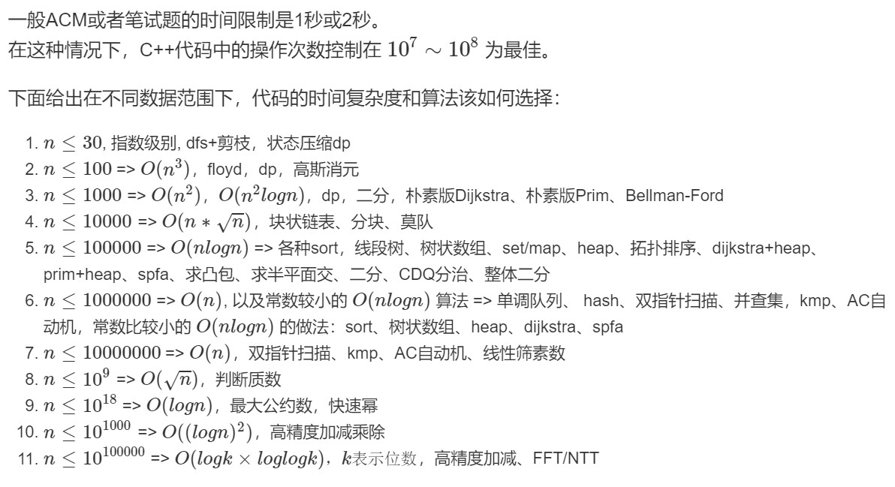

[Article:由数据范围反推算法复杂度以及算法内容](https://www.acwing.com/blog/content/32/)
 
其中动态规划的计算量 = 状态数量* 状态转移的计算量

### 空间复杂度


**空间限制：**

```c++
1 Byte = 8 bit
1 KB = 1024 Byte
1 MB = 1024*1024 Byte
1 GB = 1024*1024*1024 Byte
```

`64 MB = 2^26 Byte` , 约 `2^24个int，即1600 0000个int`。但还有其他占用空间，如函数调用等。所以尽量小于该值。

可计算程序利用了多少内存：  `(sizeof v...) /1024 / 1024 = ** MB`
若计算出的数小于计算数，是因为操作系统对没有进行利用的空间进行了优化。


c++ 默认栈空间 4 MB，所以大数组开到全局变量，放到堆空间里。

`4GB = 2 ^ 32 Byte`


## **比赛常用技巧及库函数**
1、快速读\快速写
**快读**

```c++  
template<typename T>
void in(T &x) {
    char ch = getchar();
    bool flag = 0;x = 0;
    while(ch < '0' || ch > '9') flag |= (ch == '-'), ch = getchar();
    while(ch <= '9' && ch >= '0') x = (x << 1) + (x << 3) + ch - '0', ch = getchar();
    if(flag) x = -x;return ;
}
```


**快写**

```c++  
template <typename T>
inline void print(T x)
{
    if(x<0)
    {
        putchar('-');
        x=-x;
    }
    if(x>9)
        print(x/10);
    putchar(x%10+'0');
}
```


2、__int128_t
**输入输出：**

```c++  
inline __int128 read()
{
   int X=0,w=0; char ch=0;
   while(!isdigit(ch)) {w|=ch=='-';ch=getchar();}
   while(isdigit(ch)) X=(X<<3)+(X<<1)+(ch^48),ch=getchar();
   return w?-X:X;
}
inline void print(__int128 x)
{    
   if(x<0){putchar('-');x=-x;}
   if(x>9) print(x/10);
   putchar(x%10+'0');
}
```


3、火车头

```c++  
#pragma GCC optimize(2)
#pragma GCC optimize(3)
#pragma GCC optimize("Ofast")
#pragma GCC optimize("inline")
```

```c++  
#include<bits/stdc++.h>
```


## **读取和输出**


### 流迭代器

读入输出的一些黑科技：流迭代器

```c++  
int main(){
	vector<int> a;
	int n;cin>>n;
	copy_n(istream_iterator<int>(cin),n,back_inserter(a));
	copy(a.begin(),a.end(),ostream_iterator<int>(cout," "));
	return 0;
}
```

### 效率问题
[](https://blog.csdn.net/qq_45475271/article/details/107675845?spm=1001.2101.3001.6650.1&utm_medium=distribute.pc_relevant.none-task-blog-2%7Edefault%7ECTRLIST%7ERate-1.pc_relevant_antiscanv2&depth_1-utm_source=distribute.pc_relevant.none-task-blog-2%7Edefault%7ECTRLIST%7ERate-1.pc_relevant_antiscanv2&utm_relevant_index=2)


```c++  
printf 和 scanf ： stdio.h
cin cout  ：iostream

ios::sync_with_stdio(false);
cin.tie(0),cout.tie(0);
```


一.sync_with_stdio
这个函数是一个“是否兼容stdio”的开关，C++为了兼容C，保证程序在使用了std::printf和std::cout的时候不发生混乱，将输出流绑到了一起。
cin，cout之所以效率低，是因为先把要输出的东西存入缓冲区，再输出，导致效率降低，而这段语句可以来打消iostream的输入输出缓存，可以节省许多时间，使效率与scanf与printf相差无几.

应用
在ACM里，经常出现数据集超大造成 cin 运行超时 /Time Limit Exceeded【TLE】的情况。这时候大部分人（包括原来我也是）认为这是cin的效率不及scanf的错，甚至还上升到C语言和C++语言的执行效率层面的无聊争论。其实像上文所说，这只是C++为了兼容而采取的保守措施。我们可以在IO之前将stdio解除绑定，这样做了之后要注意不要同时混用cout/cin和printf/scanf之类。

二.tie
tie是将两个stream绑定的函数，空参数的话返回当前的输出流指针。
在默认的情况下cin绑定的是cout，每次执行 << 操作符的时候都要调用flush，这样会增加IO负担。可以通过tie(0)（0表示NULL）来解除cin与cout的绑定，进一步加快执行效率。


这俩一个输入同步，一个输出同步
sync_with_stdio是输入同步开关
cin.tie是控制输出同步
用哪个关哪个

注意，这两个代码的头文件是 iostream
并且如果用了这两个，就不要用scanf ,getchar,gets,fgets,fscanf了。
好处：将cin cout速度提升至与scanf相差无几。
副作用：不能scanf cin之类的混用了。


[cin与scanf cout与printf效率问题](https://blog.csdn.net/l2580258/article/details/51319387)
结论:输出时尽量使用cout,输入时尽量使用scanf.

cin cout效率没scanf printf高为何用
主要有以下几个原因：
1.流输入输出对于基本类型来说使用很方便，不用手写格式控制字符串。
2.对于标准库的一些class来说，显然重载操作符也比自己写格式控制字符串要方便很多。
3.对于复杂的格式可以进行自定义操作符。
4.可读性更好（这个很多人有不同意见，见仁见智了）。

其实原理上来说流操作的效率比printf/scanf函数族更高，因为是在编译期确定操作数类型和调用的输出函数，不用在运行期解析格式控制字符串带来额外开销。不过标准流对象cin/cout为了普适性，继承体系很复杂，所以在对象的构造等方面会影响效率，因此总体效率比较低。如果根据特定的场景进行优化，效率可以更高一点。

C++中cin,cout是不是效率不如scanf,printf

十分正确，如果你是做io比赛的或者是做acm的，尽量不要用cin，cout，你试试打印99999999就知道，它们之间速度大概相差10几倍

### 不定长等问题


读入一行的所有整数 (尤其是未知数量时)

```c++  
#include <sstream>
    int h[N], n ;
    string line;
    getline(cin, line);
    stringstream ssin(line);
    while (ssin >> h[n]) n ++ ;

```

>没有给出矩阵的行列数
有些输入可能是：
输入一个矩阵，每行以空格分隔。
3 2 3
1 6 5
7 8 9

```c++  

#include <iostream>
#include <vector>
#include <string>
#include <sstream>
using namespace std;
int main() {
    vector<vector<int>> arr;
    string input;
    while (getline(cin, input)) {
        if (input.size() > 0) {
            stringstream stringin(input);
            int num;
            vector<int> a;
            while (stringin >> num) {
                a.push_back(num);
            }
            arr.push_back(a);
        }
    }
    // 使用自测数据按钮时调试用，正式提交时要删掉。
    cout << "rows: " << arr.size() << ", cols: " << arr[0].size() << endl;
    for (int i=0; i<arr.size(); i++) {
        for (int j=0; j<arr[i].size(); j++) {
            cout << arr[i][j] << " ";
        }
        cout << endl;
    }
}
```

**输入数组中带有中括号和逗号**
>有些输入可能是，输入一个矩阵：
[[3,2,3],
 [1,6,5],
 [7,8,9]]


```c++  
#include <iostream>
#include <vector>
#include <string>
#include <string.h>
#include <sstream>
using namespace std;
int main() {
    vector<vector<int>> arr;
    string input;
    char *tok;
    while (getline(cin, input)) {
        if (input.size() > 0) {
            vector<int> a;
            tok = strtok((char *)input.c_str(), " ,[]");
            while (tok != NULL) {
                a.push_back(stoi(tok));
                tok = strtok(NULL, " ,[]");
            }
            arr.push_back(a);
        }
    }
    // 使用自测数据按钮时调试用，正式提交时要删掉。
    cout << "rows: " << arr.size() << ", cols: " << arr[0].size() << endl;
    for (int i=0; i<arr.size(); i++) {
        for (int j=0; j<arr[i].size(); j++) {
            cout << arr[i][j] << " ";
        }
        cout << endl;
    }
}
```


如例题：

>数列的定义如下： 数列的第一项为n，以后各项为前一项的平方根，求数列的前m项的和。
输入描述
输入数据有多组，每组占一行，由两个整数n（n<10000）和m(m<1000)组成，n和m的含义如前所述。
输出描述
对于每组输入数据，输出该数列的和，每个测试实例占一行，要求精度保留2位小数。
样例输入
81 4
2 2
样例输出
94.73
3.41

```c++  
#include<iostream>
#include<cstdio>
#include <cstring>
#include <cmath>
#include <iomanip>
#include <sstream>
using namespace std;

const double N = 10010;

int main()
{
    int n, m;
    string input;
    while(getline(cin, input)){
        if(input.size() > 0){
            stringstream ss(input);
            while(ss >> n >> m){
			 double ans = n;
   				double sq = n;
    			while(-- m > 0){
        		sq = sqrt(sq);
        		ans += sq;
    			}
    			cout << fixed << setprecision(2) << ans << endl;                    
            }
        }
    }
    return 0;
}
```


用途：

解析字符串：


istringstream / stringstream都行
```c++  
istringstream ss("Computer"); 

char c1 = ss.peek();  // 只读下一个字符  不取出来
char c2 = ss.get();  // 取出下一个字符 
ss.unget();   把最后一个取出的送回去
int num;
ss >> num;  // 直接按类型读取 不用逐一还原了
```


### 精度 有效数字

[C++中设置精度](https://blog.csdn.net/weixin_44204467/article/details/105466367?spm=1001.2101.3001.6650.1&utm_medium=distribute.pc_relevant.none-task-blog-2%7Edefault%7ECTRLIST%7ERate-1.pc_relevant_antiscanv2&depth_1-utm_source=distribute.pc_relevant.none-task-blog-2%7Edefault%7ECTRLIST%7ERate-1.pc_relevant_antiscanv2&utm_relevant_index=2)

```c++  
    printf("%.3lf\n%d",t/n,n*2);
   //%.3lf 表示保留三位小数后输出
```


```c++  
    #include <iomanip>
    const double value = 12.3456789;
 
    cout << value << endl; // 默认以6精度，所以输出为 12.3457
    cout << setprecision(4) << value << endl; // 改成4精度，所以输出为12.35
    cout << setprecision(8) << value << endl; // 改成8精度，所以输出为12.345679
    cout << fixed << setprecision(4) << value << endl; // 加了fixed意味着是固定点方式显示，所以这里的精度指的是小数位，输出为12.3457
    cout << value << endl; // fixed和setprecision的作用还在，依然显示12.3457
    cout.unsetf( ios::fixed ); // 去掉了fixed，所以精度恢复成整个数值的有效位数，显示为12.35
    cout << value << endl;
    cout.precision( 6 ); // 恢复成原来的样子，输出为12.3457
    cout << value << endl;
    cout<<fixed<<value<<endl;
```

[C++ 精度输出：cout](https://blog.csdn.net/qq_35562816/article/details/53000460)

## 卡常


### 哈希碰撞

**引入**
对于一些卡常数的题目，如
[最长连续子序列](https://www.acwing.com/problem/content/4397/)等等。


总所周知，`set` 和 `map` 由于树的结构，的单次操作是 `(O(log n))` 的。

有没有更快的 STL 可以代替它们呢？

在 c++11 里面，`unordered_set` 和 `unordered_map` 就可以做到单次操作 `(O(1))`（基于哈希）。

但在 `Codeforces` 的比赛上面，尽量别用 `unoredered_set / unoredered_map`。

一是因为 `unordered_map` 本身自带大常数，有时候跑的甚至没有 `map` 快。

第二个原因也是最重要的原因是，很多 CF 上的大神直接根据 STL 的源代码来造出 `hack` 数据，导致单次复杂度劣化成 (O(n))。

~~如果你很勇直接用 `unordered_map` 那么你就等着 `fst` 吧。~~

那有没有防止被卡的方法呢？

当然有，那就是自己写哈希函数，然后让哈希函数与时间戳有关就行了。（难道还能预判一个时间来构造 hack 数据不成？

下面给出哈希函数的代码 :

```c++  
struct custom_hash {
	static uint64_t splitmix64(uint64_t x) {
		x ^= x << 13;
		x ^= x >> 7;
		x ^= x << 17;
		return x; 
	}
	size_t operator () (uint64_t x) const {
		static const uint64_t FIXED_RANDOM = chrono::steady_clock::now().time_since_epoch().count(); // 时间戳
		return splitmix64(x + FIXED_RANDOM);
	}
};
```

然后再定义 `unordered_map` 的时候就可以像下面这样定义了 :

`unordered_map<uint64_t, int, custom_hash> safe_map;`

或者知道`key`的范围，直接开足够的数组。


[解决哈希冲突的常用方法分析](https://www.jianshu.com/p/4d3cb99d7580)
[unordered_map 哈希函数 / 如何防止 unordered_map 被卡](http://t.zoukankan.com/Lskkkno1-p-12667149.html)
[哈希碰撞](https://blog.csdn.net/weixin_45746055/article/details/108579192)

**详细**

**一、什么是哈希碰撞**
所谓哈希（hash），就是将不同的输入映射成独一无二的、固定长度的值（又称"哈希值"）。它是最常见的软件运算之一。如果不同的输入得到了同一个哈希值，就发生了"哈希碰撞"（collision）。

**二、哈希碰撞产生原理**
举个例子，假设要将某些元素存放在长度length，则其中某一个元素的key值为k，则其哈希值hash的计算公式为：

`hash = (k)%length`

假设length = 16，那么两个不同元素的key值分别为12和28，那么他们所取得的hash值都等于12，这就造成冲突了。

**三、解决方法**
**1.开放地址法**
开放地址法有一个公式：

`Hi = H((key)+di) % m (i = 1,2,3,...,k)  (k <= m-1)`

其中，m为哈希表的表长，di是产生冲突时的增量序列。
①线性探查法
当didi取值为1，即为线性探查法，每次冲突后，向后移动一个位置。
基本思想：
将散列表T[0…m-1]看成是一个循环向量，若初始探查的地址为d(即h(key)=d)，则最长的探查序列为：d，d+l，d+2，…，m-1，0，1，…，d-1即:探查时从地址d开始，首先探查T[d]，然后依次探查T[d+1]，…，直到T[m-1]，此后又循环到T[0]，T[1]，…，直到探查到T[d-1]为止。
探查过程终止于三种情况：
(1)若当前探查的单元为空，则表示查找失败（若是插入则将key写入其中）；
(2)若当前探查的单元中含有key，则查找成功，但对于插入意味着失败；
(3)若探查到T[d-1]时仍未发现空单元也未找到key，则无论是查找还是插入均意味着失败(此时表满)。
缺点：

处理溢出需另编程序。
按上述算法建立起来的哈希表，删除工作非常困难。假如要从哈希表 HT 中删除一个记录，按理应将这个记录所在位置置为空，但我们不能这样做，而只能标上已被删除的标记，否则，将会影响以后的查找。
线性探测法很容易产生堆聚现象。所谓堆聚现象，就是存入哈希表的记录在表中连成一片。按照线性探测法处理冲突，如果生成哈希地址的连续序列愈长 ( 即不同关键字值的哈希地址相邻在一起愈长 ) ，则当新的记录加入该表时，与这个序列发生冲突的可能性愈大。因此，哈希地址的较长连续序列比较短连续序列生长得快，这就意味着，一旦出现堆聚 ( 伴随着冲突 ) ，就将引起进一步的堆聚。
②线性补偿探测法
将线性探测的步长从 1 改为 Q ，即将上述算法中的 j ＝ (j ＋ 1) % m 改为： j ＝ (j ＋ Q) % m ，而且要求 Q 与 m 是互质的，以便能探测到哈希表中的所有单元。

③随机探测法
将线性探测的步长从常数改为随机数，即令： j ＝ (j ＋ RN) % m ，其中 RN 是一个随机数。在实际程序中应预先用随机数发生器产生一个随机序列，将此序列作为依次探测的步长。这样就能使不同的关键字具有不同的探测次序，从而可以避 免或减少堆聚。基于与线性探测法相同的理由，在线性补偿探测法和随机探测法中，删除一个记录后也要打上删除标记。

**2.再哈希法**
这种方法是同时构造多个不同的哈希函数：

`Hi=RH1（key）  i=1，2，…，k`

当哈希地址Hi=RH1（key）发生冲突时，再计算Hi=RH2（key）……，直到冲突不再产生。这种方法不易产生聚集，但增加了计算时间。

**3.链地址法（拉链法）**
可以理解为数组+链表，即在一个线性数组里的每一个元素存储一个链表的头结点。例如：， 第一个键值对A进来，通过计算其key的hash得到的index=0，记做:Entry[0] = A。一会后又进来一个键值对B，通过计算其index也等于0，则进行B.next = A，Entry[0] = B，如果又进来C,index也等于0，那么C.next = B，Entry[0] = C。也就是说数组中存储的是最后插入的元素。
优点：
① 拉链法处理冲突简单，且无堆积现象，即非同义词决不会发生冲突，因此平均查找长度较短；
② 由于拉链法中各链表上的结点空间是动态申请的，故它更适合于造表前无法确定表长的情况；
③ 开放定址法为减少冲突，要求装填因子α较小，故当结点规模较大时会浪费很多空间。而拉链法中可取α≥1，且结点较大时，拉链法中增加的指针域可忽略不计，因此节省空间；
④ 在用拉链法构造的散列表中，删除结点的操作易于实现。只要简单地删去链表上相应的结点即可。而对开放地址法构造的散列表，删除结点不能简单地将被删结 点的空间置为空，否则将截断在它之后填人散列表的同义词结点的查找路径。这是因为各种开放地址法中，空地址单元(即开放地址)都是查找失败的条件。因此在 用开放地址法处理冲突的散列表上执行删除操作，只能在被删结点上做删除标记，而不能真正删除结点。
缺点：
指针需要额外的空间，故当结点规模较小时，开放定址法较为节省空间，而若将节省的指针空间用来扩大散列表的规模，可使装填因子变小，这又减少了开放定址法中的冲突，从而提高平均查找速度。


---

# 1 常见

**小知识点**

## 1 数学
### 1 取整

向上取整在c++ 中:
ceil()表示向上取整,floor()表示向下取整
当然,这很显然对浮点数很好用.
但如果两个int类型的数想要向上取整呢? (只适用于n,m为正数)
我们用`(n-1)/m+1` 或 `(n-1+m)/m1`来表示即可，而不是用`ceil(n/m)`
当然也可以`ceil(1.0*a/b);`
如 -1/3 = -0.3 ,向上取整 为0
而用(-1 - 1) / 3 + 1 = 0 + 1 = 1,显然不对。(/为向上取整)
若非要答案取0，则用ceil(1.0*(-1)/3) = 0的方式。
  
### 2 取模

**模运算：**
公式 1： (a * b) % m = ((a % m) * (b % m)) % m
公式 2： (a + b) % m = (a % m + b % m) % m

**负数取模**
所有要做减法求模的行为要小心结果为负数，我们减法之前先加上 mod，保证结果为正。
[查找给定哈希值的子串](https://leetcode-cn.com/problems/find-substring-with-given-hash-value/)


对于a可能为正，也可能为负的情况...求a对M的模数？？？
( a % M + M ) % M 

```c++  
	int a = -2;                             
	int mod = 3;
	cout << a % mod << endl;                    // -2
	cout << a / mod << endl;                    // 0  向上取整
   	cout << (a % mod + mod ) % mod << endl;     // 1  
	cout << -7 % -3 << endl;                    // -1
	cout << 7 % -3 << endl;                     //  1
	cout << -7 % 3 << endl;                     // -1
```

[例]如求数组元素中任取数字，满足和为k(k > 0)的倍数的方案中 和的最大值。
其中元素有正有负。

如凑k = 7 ,如选了一个8， 为满足k的倍数。需要取 - 1 ,或者6等.

即-1 和 6都能使其满足k的倍数。

*emm 好像不用。则有 -1 % 7 = 6 % 7 是成立的。*
*为保证上式的算法中实现，则 需要对 -1 先处理，即 （-1 + 7）% 7 为实际贡献量？*

而是要注意在做减法时， 即加上 a[i] % k 后达到 j，可知需要从 j - a[i] % k 转移而来。
而 j - a[i] % k 可能为负值。

如 j = 1, a[i] % k = 3, 则需要从 j - a[i] % k  =  -2 转移而来 。
而实际上等价于 j =( 1 + k ) - a[i] % k = 8 - 3 = 5 转移。
即需要把 -2 换成5，而不是直接 (j - a[i] % k ) % k = -2。
可通过加一个mod = k = 7的方式换成 5。 即上述所说 **做减法求模的行为要小心结果为负数，我们减法之前先加上 mod，保证结果为正。** 
即 (a - b) % k == 写成 ==> (a - b + k) % k  (当0 < b < k时可以) ==>  `((a - b) % k + k) % k`.(更准确)


```c++
#include<bits/stdc++.h>
using namespace std;
int T,n;
const int N=110,INF=0x3f3f3f3f;
typedef long long ll;
int  a[N],f[N][N];
int main()
{
    int n,k;
    scanf("%d%d",&n,&k);
    for(int i=1;i<=n;i++)scanf("%d",&a[i]);
    memset(f,0xcf,sizeof f);   //注意初始化 为一个较小的负值
    f[0][0]=0;
    for(int i=1;i<=n;i++)
    {
        for(int j=0;j<k;j++)
        {
            f[i][j]=max(f[i-1][j],f[i-1][(j-a[i]%k+k)%k]+a[i]);
        }
    }
    printf("%d",f[n][0]);
    return 0;
}
```


### 3 取平均

正数 a>0,有a>>1与a/2等价，向下取整
同理用  a+b>>1  与(a+b)/2 等价 
而负数时则不一样  
负数/2 为上取整 ，>> 1为下取整。
总结： / 2为round(),即向0取整。  >> 1为floor(), 向下取整。

```c++  
cout << -5 / 2 << " " << ((-5) >> 1) << endl;  // -2， -3
```

```c++  
三个与取整有关的方法：ceil,floor,round,这些方法的作用于它们的英文名称的含义相对应：

（1）floor()的英文含义是地板，所以是向下取整，方便记忆叫它地板函数。会取不大于自变量的最大整数，这样自变量是3.1或3.9是没有区别的，返回都是3；自变量是-2.1或-2.9也是没有区别的，返回都是-3；
（2）ceil()的英文含义天花板，所以是向上取整，它就是天花板函数。会取不小于自变量的最大整数，这样自变量是3.1或3.9，返回都是4；自变量是-2.1或-2.9，返回的都是-2；
（3）round()的英文含义周围，环绕，这个就是常用的四舍五入函数，因为它会返回离自变量最近的整数，这个返回的整数可能大于也可能小于原来的数，但是一定是离它最近的那个整数，比如12.5返回13，12.4返回12。
还有一种四舍五入的方法 （int）（m +0.5）。
```


### 4 取中位数

**中位数：**
len & 1 == 1， 为 中间那个
len & 1 == 0,  为 中间两个平均
计算技巧：  取 第 i = len + 1 >> 1 和 j = len + 2 >> 1 小的两个元素取平均即可。
对于 len & 1 == 1：
`1 2 3 4 5`  len = 5,  i = 3, j = 3　为同一个数，即中间的数。
对于 len & 1 == 0:
`1 2 3 4 5 6` len = 6, i = 3, j = 4, 为中间两个数，取平均即可。
（同步 基本算法中：中位数）

见：
[Hard：寻找两个正序数组的中位数](https://leetcode.cn/problems/median-of-two-sorted-arrays/)
给定两个大小分别为 m 和 n 的正序（从小到大）数组 nums1 和 nums2。请你找出并返回这两个正序数组的 中位数 。
算法的时间复杂度应该为 O(log (m+n)) 。
示例 1：
输入：nums1 = [1,3], nums2 = [2]
输出：2.00000
解释：合并数组 = [1,2,3] ，中位数 2
示例 2：
输入：nums1 = [1,2], nums2 = [3,4]
输出：2.50000
解释：合并数组 = [1,2,3,4] ，中位数 (2 + 3) / 2 = 2.5


```c++  
class Solution {
public:
    double findMedianSortedArrays(vector<int>& nums1, vector<int>& nums2) {
        int m = nums1.size(), n = nums2.size();
        int left = m + n + 1 >> 1, right = m + n + 2 >> 1;                     // + 1,    + 2
        return (findKth(nums1, 0, nums2, 0, left) + findKth(nums1, 0, nums2, 0, right)) / 2.0;
    }

    int findKth(vector<int>& nums1, int i, vector<int>& nums2, int j, int k){
        if(i >= nums1.size()) return nums2[j + k - 1];
        if(j >= nums2.size()) return nums1[i + k - 1];
        if(k == 1) return min(nums1[i], nums2[j]);
        int midv1 = (i + k / 2 - 1 < nums1.size()) ? nums1[i + k / 2 - 1] : INT_MAX;
        int midv2 = (j + k / 2 - 1 < nums2.size()) ? nums2[j + k / 2 - 1] : INT_MAX;
        if(midv1 < midv2) return findKth(nums1, i + k / 2, nums2, j, k - k / 2);
        else return findKth(nums1, i , nums2, j  + k / 2, k - k / 2);
    }
};
```


## 2 赋初值


### memset和memcpy
```c++  
const int N = 10;
int a[10];
memset(a, -1, sizeof a);
a (1111 1111 1111 1111 1111 1111 1111 1111) (1111 1111 1111 1111  1111 1111  1111 1111)...
把-1的第八位给a[i]的每一位, a[i] = -1

memset(a, 0x3f, sizeof a) 
a (0011 1111 0011 1111 0011 1111 0011 1111) (....)
a[i] = 

0x3f3f3f3f = 10 61109567;
0xffffffff = 42 94967295;
INT_MAX = 21 4748 3647;
INT_MIN = -21 4748 3648;
```


```c++  
#include <iostream>
#include <cstring>
#include <algorithm>
#include <limits.h>
using namespace std;
const int N = 10;
int a[N], b[N];

int main()
{
  memset(a, -1, sizeof a);
  memset(b, 0x3f, sizeof b);
  for(int i = 0; i < N ; ++ i) cout << a[i] << " ";
  cout << endl;       // -1 -1 -1 -1 -1 -1 -1 -1 -1 -1 
  for(int i = 0; i < N ; ++ i) cout << b[i] << " ";
  cout << endl;       // 10 6110 9567, 1061109567, 1061109567 
  cout << INT_MAX << endl;               // 21 4748 3647
  cout << INT_MIN << endl;               // -21 4748 3648
  cout << sizeof (INT_MIN) << endl;      // 4
  cout << sizeof (-2147483648) << endl;  // 8

  return 0;
}
```

**常用**

```c++  
memset(h, -1, sizeof h);
memset(dist, 0x3f, sizeof dist);
memset(f, 0xcf, sizeof f);  // f[i] = -808464433

memcpy(back, f, sizeof f);   // 备份数组
```

**赋值问题** [memset 赋初值为无穷大和无穷小](https://blog.csdn.net/yskyskyer123/article/details/52277927?utm_medium=distribute.pc_relevant.none-task-blog-2~default~baidujs_baidulandingword~default-0.pc_relevant_antiscanv2&spm=1001.2101.3001.4242.1&utm_relevant_index=3)
>如果问题中各数据的范围明确，那么无穷大的设定不是问题，在不明确的情况下，很多程序员都取0x7fffffff作为无穷大，因为这是32-bit int的最大值。如果这个无穷大只用于一般的比较（比如求最小值时min变量的初值），那么0x7fffffff确实是一个完美的选择，但是在更多的情况下，0x7fffffff并不是一个好的选择。
很多时候我们并不只是单纯拿无穷大来作比较，而是会运算后再做比较，例如在大部分最短路径算法中都会使用的松弛操作： 
if (d[u]+w[u][v] < d[v]) d[v]=d[u]+w[u][v]; 
我们知道如果u,v之间没有边，那么w[u][v]=INF，如果我们的INF取0x7fffffff，那么d[u]+w[u][v]会溢出而变成负数，我们的松弛操作便出错了，更一般的说，0x7fffffff不能满足“无穷大加一个有穷的数依然是无穷大”，它变成了一个很小的负数。 
除了要满足加上一个常数依然是无穷大之外，我们的常量还应该满足“无穷大加无穷大依然是无穷大”，至少两个无穷大相加不应该出现灾难性的错误，这一点上0x7fffffff依然不能满足我们。 
所以我们需要一个更好的家伙来顶替0x7fffffff，最严谨的办法当然是对无穷大进行特别处理而不是找一个很大很大的常量来代替它（或者说模拟它），但是这样会让我们的编程过程变得很麻烦。在我读过的代码中，最精巧的无穷大常量取值是0x3f3f3f3f，我不知道是谁最先开始使用这个精妙的常量来做无穷大，不过我的确是从一位不认识的ACMer(ID:Staginner)的博客上学到的，他/她的很多代码中都使用了这个常量，于是我自己也尝试了一下，发现非常好用，而当我对这个常量做更深入的分析时，就发现它真的是非常精巧了。
0x3f3f3f3f的十进制是1061109567，也就是10^9级别的（和0x7fffffff一个数量级），而一般场合下的数据都是小于10^9的，所以它可以作为无穷大使用而不致出现数据大于无穷大的情形。 
另一方面，由于一般的数据都不会大于10^9，所以当我们把无穷大加上一个数据时，它并不会溢出（这就满足了“无穷大加一个有穷的数依然是无穷大”），事实上0x3f3f3f3f+0x3f3f3f3f=2122219134，这非常大但却没有超过32-bit int的表示范围，所以0x3f3f3f3f还满足了我们“无穷大加无穷大还是无穷大”的需求。 
最后，0x3f3f3f3f还能给我们带来一个意想不到的额外好处：如果我们想要将某个数组清零，我们通常会使用memset(a,0,sizeof(a))这样的代码来实现（方便而高效），但是当我们想将某个数组全部赋值为无穷大时（例如解决图论问题时邻接矩阵的初始化），就不能使用memset函数而得自己写循环了（写这些不重要的代码真的很痛苦），我们知道这是因为memset是按字节操作的，它能够对数组清零是因为0的每个字节都是0，现在好了，如果我们将无穷大设为0x3f3f3f3f，那么奇迹就发生了，0x3f3f3f3f的每个字节都是0x3f！所以要把一段内存全部置为无穷大，我们只需要memset(a,0x3f,sizeof(a))。 
所以在通常的场合下，0x3f3f3f3f真的是一个非常棒的选择。
其他赋值：
memset(arr,0x7F,sizeof(arr)); //它将arr中的值全部赋为2139062143，这是用memset对int赋值所能达到的最大值
类似的还有：
memset(arr,0x80,sizeof(arr)); //set int to -2139062144
memset(arr,0x7F,sizeof(arr)); //set double to 1.38242e+306
memset(arr,0xFE,sizeof(arr)); //set double to -5.31401e+303


## 3 进制转换


**任意进制转化**


```c++  
#include<cstdio>
const int N=1e5+3;
int n,m,x,tmp,ansl;
char a[N],ans[N];
inline int n_to_ten(){
  int x=0;
  for(int i=0;a[i];++i){
    x*=n;
    if (a[i]>='A' &&a[i]<='F')x+=(a[i]-'A'+10);
    else x+=(a[i]-'0');
 }
 return x;
}
inline void ten_to_m(){
  do{
    tmp=x%m;
    if(tmp<10)ans[??ansl]='0'+tmp;
    else ans[??ansl]='A'+tmp-10;
    x/=m;
 }while(x);
}
int main(){
 scanf("%d%s%d",&n,a,&m);
 x=n_to_ten();
 ten_to_m();
 for(int i=ansl;i;--i)printf("%c",ans[i]);puts("");
}
```


>编写一个程序，可以实现将一个数字由一个进制转换为另一个进制。
这里有 62 个不同数位 {0−9,A−Z,a−z}。
输入格式
第一行输入一个整数，代表接下来的行数。
接下来每一行都包含三个数字，首先是输入进制（十进制表示），然后是输出进制（十进制表示），最后是用输入进制表示的输入数字，数字之间用空格隔开。
输入进制和输出进制都在 2 到 62 的范围之内。
（在十进制下）A=10，B=11，…，Z=35，a=36，b=37，…，z=61 (0−9 仍然表示 0−9)。
输出格式
对于每一组进制转换，程序的输出都由三行构成。
第一行包含两个数字，首先是输入进制（十进制表示），然后是用输入进制表示的输入数字。
第二行包含两个数字，首先是输出进制（十进制表示），然后是用输出进制表示的输入数字。
第三行为空白行。
同一行内数字用空格隔开。


// 10进制中转 作为跳板
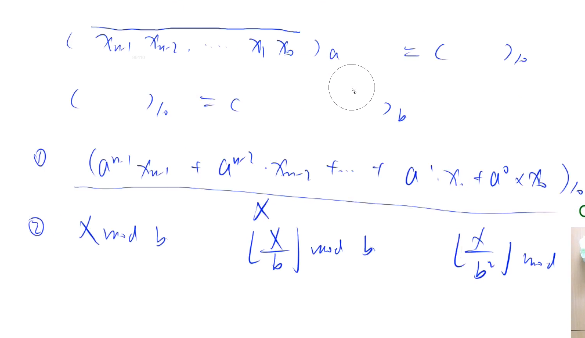

// 
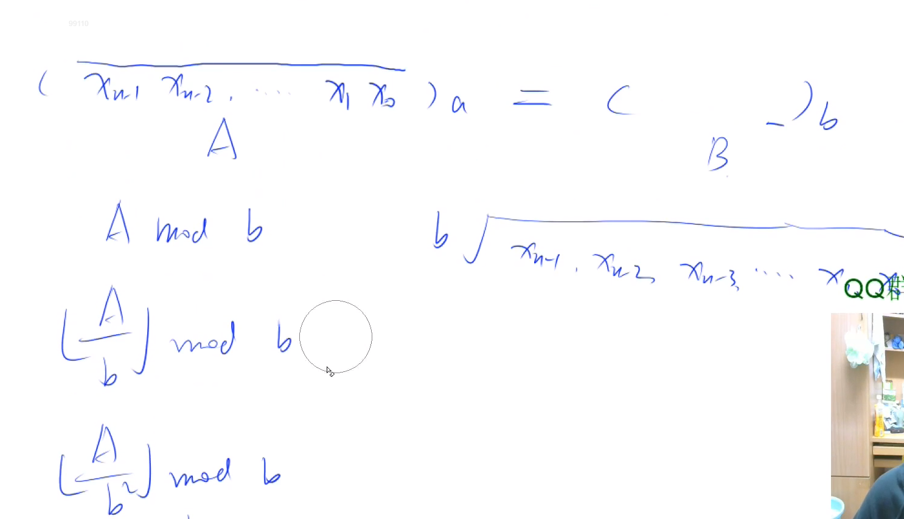

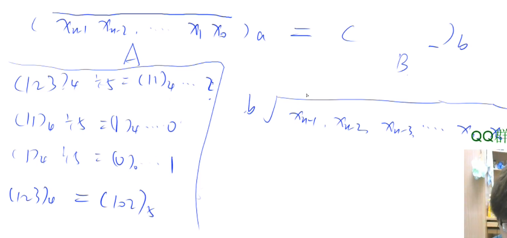


```c++  
输入样例：
8
62 2 abcdefghiz
10 16 1234567890123456789012345678901234567890
16 35 3A0C92075C0DBF3B8ACBC5F96CE3F0AD2
35 23 333YMHOUE8JPLT7OX6K9FYCQ8A
23 49 946B9AA02MI37E3D3MMJ4G7BL2F05
49 61 1VbDkSIMJL3JjRgAdlUfcaWj
61 5 dl9MDSWqwHjDnToKcsWE1S
5 10 42104444441001414401221302402201233340311104212022133030
输出样例：
62 abcdefghiz
2 11011100000100010111110010010110011111001001100011010010001

10 1234567890123456789012345678901234567890
16 3A0C92075C0DBF3B8ACBC5F96CE3F0AD2

16 3A0C92075C0DBF3B8ACBC5F96CE3F0AD2
35 333YMHOUE8JPLT7OX6K9FYCQ8A

35 333YMHOUE8JPLT7OX6K9FYCQ8A
23 946B9AA02MI37E3D3MMJ4G7BL2F05

23 946B9AA02MI37E3D3MMJ4G7BL2F05
49 1VbDkSIMJL3JjRgAdlUfcaWj

49 1VbDkSIMJL3JjRgAdlUfcaWj
61 dl9MDSWqwHjDnToKcsWE1S

61 dl9MDSWqwHjDnToKcsWE1S
5 42104444441001414401221302402201233340311104212022133030

5 42104444441001414401221302402201233340311104212022133030
10 1234567890123456789012345678901234567890
```


**常规思路**
用十进制作为中转


代码：

```c++  
#include <bits/stdc++.h>
using namespace std;
const int maxn = 1100;
#define fir(a,b,c) for (int a=b;a<=c;a++)
int t[maxn],A[maxn],n,m,i,len,k;
char str1[maxn], str2[maxn];
void solve()
{
    k=0;
    len = strlen(str1);
    for(i=len; i>=0; i--) 
        t[len-i-1] = str1[i] -(str1[i]<58 ? 48: str1[i]<97 ? 55: 61);//开始转换成为十进制
    while(len)
    {
        for(i=len; i>=1; i--) 
        {
            t[i-1] +=t[i]%m*n;//开始计算,首先*n,为n进制,然后转移到m进制
            t[i] /= m;//当前数已经处理完了
        }
        A[k++] = t[0] % m;//直接加到答案数组中
        t[0] /=m;//当前数已经处理完了
        while(len>0&&!t[len-1])  //处理0的情况
            len--;
    }
    str2[k] =NULL;//第k位,我们不需要,直接抛去,利用NULL这个特殊的字符串结束符,具体可以自行百度.
    fir(i,0,k-1)
        str2[k-1-i] = A[i]+(A[i]<10 ? 48: A[i]<36 ? 55:61);//三目运算符,具体可以百度,这段代码的意思是,找这个数字对应的字母
}

int main()
{
    int t;
    scanf("%d\n",&t);
    while(t--) 
    {
        scanf("%d %d %s\n",&n,&m,str1);
        solve();
        printf("%d %s\n%d %s\n\n",n,str1,m,str2);
    }
    return 0;
}
```


常用
16 -> 10
>写出一个程序，输入一个十六进制的数值字符串，输出该数值的十进制字符串。
输入样例：
0xA
输出样例：
10

```c++  
#include <bits/stdc++.h>

using namespace std;

int main(){
    string a;
    while (cin>>a){
        int flag = 0,sum = 0;
        if(a[0] == '-')
            flag++;
        string b = a.substr(2 + flag);
        reverse(b.begin(),b.end());
        for (int i = 0; i < b.size(); ++i) {
            if(b[i]>='0'&&b[i]<='9')
                sum += (b[i] - '0') * pow(16,i);
            else if (b[i] >= 'A' && b[i] <= 'Z')
                sum += (b[i]-'A'+ 10) * pow(16,i);
            else
                sum += (b[i]-'a'+ 10) * pow(16,i);
        }
        if(flag)
            cout<<"-";
        cout<<sum<<endl;
    }
}
```


## 4 常用库函数

[ C++库常用函数一览](https://www.cnblogs.com/A--G/p/4357400.html)
本部分中提到的函数库有：<cctype> <algorithm> <cmath> <cstdlib> <iomanip> <numeric>


### `<ctype>`

```c++  
**判断大小写**
islower(char)
isupper(char)
**判断是否是字母**
isalpha(char)  可代替  isupper( ch ) || islower( ch )
    - 判断字符ch是否为英文字母，若为英文字母，返回非0（小写字母为2，大写字母为1）。若不是字母，返回0。
**判断数字**
isdigit(char)

// 其他
isalpha; //是否字母
iscntrl; //是否控制符
isdigit; //是否是数字
isgraph; //是否字母、数字或标点
islower; //是否小写
isprint; //是否可打印字符
ispunct; //是否标点
isspace; //是否空格
isupper; //是否大写
isxdigit; //是否十六进制数字
tolower; //转为小写
toupper; //转为大写
```


### `<ctime>`

```c++  
clock()
```


### `<cstring>`

```c++  
strcmp();
strlen();
strcpy();
strcat();
memcpy();//对数字的处理
memset();
```

### `<cmath>`
```c++  
hypot(double,double);//计算三角形的斜边长
sqrt(double);
sin();
cos();
pow();

// 其他
abs; //绝对值
acos; //反余弦
acosf; //反余弦
acosl; //反余弦
asin; //反正弦
asinf; //反正弦
asinl; //反正弦
atan; //反正切
atan2; //y/x的反正切
atan2f; //y/x的反正切
atan2l; //y/x的反正切
atanf; //反正切
atanl; //反正切
ceil; //上取整
ceilf; //上取整
ceill; //上取整
cos; //余弦
cosf; //余弦
cosh; //双曲余弦
coshf; //双曲余弦
coshl; //双曲余弦
cosl; //余弦
exp; //指数值
expf; //指数值
expl; //指数值
fabs; //绝对值
fabsf; //绝对值
fabsl; //绝对值
floor; //下取整
floorf; //下取整
floorl; //下取整
fmod; //求余
fmodf; //求余
fmodl; //求余
frexp; //返回value=x*2n中x的值,n存贮在eptr中
frexpf; //返回value=x*2n中x的值,n存贮在eptr中
frexpl; //返回value=x*2n中x的值,n存贮在eptr中
ldexp; //返回value*2exp的值
ldexpf; //返回value*2exp的值
ldexpl; //返回value*2exp的值
log; //对数
log10; //对数
log10f; //对数
log10l; //对数
logf; //对数
logl; //对数
modf; //将双精度数value分解成尾数和阶
modff; //将双精度数value分解成尾数和阶
modfl; //将双精度数value分解成尾数和阶
pow; //计算幂
powf; //计算幂
powl; //计算幂
sin; //正弦
sinf; //正弦
sinh; //双曲正弦
sinhf; //双曲正弦
sinhl; //双曲正弦
sinl; //正弦
sqrt; //开方
sqrtf; //开方
sqrtl; //开方
tan; //正切
tanf; //正切
tanh; //双曲正切
tanhf; //双曲正切
tanhl; //双曲正切
tanl; //正切
```


### `<cstdio>`
```c++  
printf/scanf
fopen,freopen,fclose
getchar,fgets
```

### `<algorithm>`

```c++  
// greatest common divisor 最大公约数  __gcd
// least common multiple 最小公倍数  lcm
int c = __gcd(a, b);
int lcm = (a * b) / __gcd(a, b);
// int gcd(int a, int b)  // 欧几里得算法
// {
//     return b ? gcd(b, a % b) : a;
// }


```


### `<iomanip>`

```c++
dec 置基数为10 相当于"%d"

hex 置基数为16 相当于"%X"

oct 置基数为8 相当于"%o"

setfill( 'c' ) 设填充字符为c

setprecision( n ) 设显示小数精度为n位

setw( n ) 设域宽为n个字符

▲setw(n)用法： 通俗地讲就是预设宽度

这个控制符的意思是保证输出宽度为n。如：

cout << setw( 3 ) << 1 << setw( 3 ) << 10 << setw( 3 ) << 100 <<setw(3)<<1000<< endl;

结果为:

(空格)(空格）1(空格)101001000

（默认是右对齐）当输出长度大于3时(<<1000)，setw(3)不起作用。

▲setfill(char c) 用法 : 就是在预设宽度中如果已存在没用完的宽度大小，则用设置的字符c填充

如 cout<<setfill(‘@‘)<<setw(5)<<255<<endl;

结果是:

@@255

▲setbase(int n) : 将数字转换为 n 进制.

如 cout<<setbase(8)<<setw(5)<<255<<endl;

cout<<setbase(10)<<setw(5)<<255<<endl;

cout<<setbase(16)<<255<<endl;

结果是:

(空格)（空格)377

(空格)(空格) 255

(空格)(空格) f f

▲ setprecision用法

使用setprecision(n)可控制输出流显示浮点数的数字个数。C++默认的流输出数值有效位是6。

如果setprecision(n)与setiosflags(ios::fixed)合用，可以控制小数点右边的数字个数。setiosflags(ios::fixed)是用定点方式表示实数。

如果与setiosnags(ios::scientific)合用，可以控制指数表示法的小数位数。setiosflags(ios::scientific)是用指数方式表示实数。

setiosflags(ios::fixed) 固定的浮点显示

setiosflags(ios::scientific) 指数表示

setiosflags(ios::left) 左对齐

setiosflags(ios::right) 右对齐

setiosflags(ios::skipws) 忽略前导空白

setiosflags(ios::uppercase) 16进制数大写输出

setiosflags(ios::lowercase) 16进制小写输出

setiosflags(ios::showpoint) 强制显示小数点

setiosflags(ios::showpos) 强制显示符号
```


### `<numeric>`

[★ C++20 ＜numeric＞数值计算全部函数 ](https://blog.csdn.net/tcy23456/article/details/113059246)


```c++
iota(first, last, start_val);    用起始值的连续增量填充单容器 
accumulate（first ，last，n）;	求和，n为初始值；
adjacent_difference（first，last，result）;	求相邻元素的差，后减前，result为差的序列在原序列开始的位置
checked_ adjacent_difference(first,last,result);	
inner_product(first1,first2,last1,last2);	将对应元素相乘并求出累计和
partial_sum（first，last，result）;	求到任意位置的累计和，result为和的序列在原序列开始的位置
```


### `<string>`


**字符串 和 数字 转化**

```c++  
atoi---ASCII to integer,将字符串转换成整形，从数字或正负号开始转换，一直到非数字为止
itoa---integer to ASCII--将整形转换成字符串
atof---ascii to float--字符串转换成浮点型
atol---ascii to long---字符串转换成长整形

gcvt---浮点型转换成字符串（四舍五入）

strtod---字符串转换成浮点型
strtol---字符串转换成长整形
strtoul--字符串转换成无符号长整形

toascii---将整形转换成合法的ASCII码字符

_ttoi---可以将CString转换成整形

_itot_s---将int转换成char*
```


详细：

```c++  
stoi（字符串，起始位置，n进制），将 n 进制的字符串转化为十进制

示例：
stoi(str, 0, 2); //将字符串 str 从 0 位置开始到末尾的 2 进制转换为十进制

string str1 = "237";
int a = atoi(str1.c_str());
cout<<a<<endl;

以下：
一、 atof()
头文件#include<stdlib.h>/include<cstdlib>

原型：double atof(const char *nptr);

作用：把字符串转换成浮点数，直至遇到第一个空格。

二、 itoa()
头文件#include<stdlib.h>/include<cstdlib>

原型：char* itoa(int value,char* string,int radix);其中，value是要转换的整数值，string是存储转换后值的字符数组，radix代表进制，radix=10就是十进制，radix=2就是二进制。

作用：将整数转换为字符串。

下面是我在使用这个函数时遇到的一些问题，

1. 第二个参数只能是char*,不能是string；

2. 第二个参数在使用之前必须提前分配存储空间，在C++中就是new一块内存。

三、atoi()与stoi()
头文件: #include<stdlib.h>/#include<cstdlib>

原型：int atoi(const char *nptr);

作用：把字符串转换成整型数。如果第一个非空格字符不存在或者不是数字也不是正负号则返回零，否则开始做类型转换，之后检测到非数字或结束符 \0 时停止转换，返回整型数。atoi()不会做范围检查，如果超出范围的话，超出上界，则输出上界，超出下界，则输出下界；stoi()会做范围检查，默认范围是在int的范围内的，如果超出范围的话则会runtime error！

四、c_str()
头文件：include<cstring>

作用：将string对象，转化为char*对象。它是String类中的一个函数，它返回当前字符串的首字符地址。
```

手动实现：
[C语言 atof()的实现](https://blog.csdn.net/wutao1530663/article/details/54381316?spm=1001.2101.3001.6661.1&utm_medium=distribute.pc_relevant_t0.none-task-blog-2%7Edefault%7ECTRLIST%7ERate-1.pc_relevant_paycolumn_v3&depth_1-utm_source=distribute.pc_relevant_t0.none-task-blog-2%7Edefault%7ECTRLIST%7ERate-1.pc_relevant_paycolumn_v3&utm_relevant_index=1)


### STL函数
[STL常见算法总结
](https://blog.csdn.net/sinat_31608641/article/details/109799723)
STL算法部分主要由头文件<algorithm>,<numeric>,<functional>组成。
STL中算法大致分为四类：
- 1、非可变序列算法：指不直接修改其所操作的容器内容的算法。
- 2、可变序列算法：指可以修改它们所操作的容器内容的算法。
- 3、排序算法：包括对序列进行排序和合并的算法、搜索算法以及有序序列上的集合操作。
- 4、数值算法：对容器内容进行数值计算。

以下对所有算法进行细致分类并标明功能：
#### 1.1 查找算法
判断容器中是否包含某个值
    adjacent_find:            在iterator对标识元素范围内，查找一对相邻重复元素，找到则返回指向这对元素的第一个元素的ForwardIterator。否则返回last。重载版本使用输入的二元操作符代替相等的判断。
    binary_search:            在有序序列中查找value，找到返回true。重载的版本实用指定的比较函数对象或函数指针来判断相等。
    count:                    利用等于操作符，把标志范围内的元素与输入值比较，返回相等元素个数。
    count_if:                 利用输入的操作符，对标志范围内的元素进行操作，返回结果为true的个数。
    equal_range:              功能类似equal，返回一对iterator，第一个表示lower_bound，第二个表示upper_bound。
    find:                     利用底层元素的等于操作符，对指定范围内的元素与输入值进行比较。当匹配时，结束搜索，返回该元素的一个InputIterator。
    find_end:                 在指定范围内查找"由输入的另外一对iterator标志的第二个序列"的最后一次出现。找到则返回最后一对的第一个ForwardIterator，否则返回输入的"另外一对"的第一个ForwardIterator。重载版本使用用户输入的操作符代替等于操作。
    find_first_of:            在指定范围内查找"由输入的另外一对iterator标志的第二个序列"中任意一个元素的第一次出现。重载版本中使用了用户自定义操作符。
    find_if:                  使用输入的函数代替等于操作符执行find。
    lower_bound:              返回一个ForwardIterator，指向在有序序列范围内的可以插入指定值而不破坏容器顺序的第一个位置。重载函数使用自定义比较操作。
    upper_bound:              返回一个ForwardIterator，指向在有序序列范围内插入value而不破坏容器顺序的最后一个位置，该位置标志一个大于value的值。重载函数使用自定义比较操作。
    search:                   给出两个范围，返回一个ForwardIterator，查找成功指向第一个范围内第一次出现子序列(第二个范围)的位置，查找失败指向last1。重载版本使用自定义的比较操作。
    search_n:                 在指定范围内查找val出现n次的子序列。重载版本使用自定义的比较操作。

#### 1.2 排序和通用算法
提供元素排序策略
    inplace_merge:            合并两个有序序列，结果序列覆盖两端范围。重载版本使用输入的操作进行排序。
    merge:                    合并两个有序序列，存放到另一个序列。重载版本使用自定义的比较。
    nth_element:              将范围内的序列重新排序，使所有小于第n个元素的元素都出现在它前面，而大于它的都出现在后面。重载版本使用自定义的比较操作。
    partial_sort:             对序列做部分排序，被排序元素个数正好可以被放到范围内。重载版本使用自定义的比较操作。
    partial_sort_copy:        与partial_sort类似，不过将经过排序的序列复制到另一个容器。
    partition:                对指定范围内元素重新排序，使用输入的函数，把结果为true的元素放在结果为false的元素之前。
    random_shuffle:           对指定范围内的元素随机调整次序。重载版本输入一个随机数产生操作。
    reverse:                  将指定范围内元素重新反序排序。
    reverse_copy:             与reverse类似，不过将结果写入另一个容器。
    rotate:                   将指定范围内元素移到容器末尾，由middle指向的元素成为容器第一个元素。
    rotate_copy:              与rotate类似，不过将结果写入另一个容器。
    sort:                     以升序重新排列指定范围内的元素。重载版本使用自定义的比较操作。
    stable_sort:              与sort类似，不过保留相等元素之间的顺序关系。
    stable_partition:         与partition类似，不过不保证保留容器中的相对顺序。

#### 1.3 删除和替换算法
    copy:                     复制序列
    copy_backward:            与copy相同，不过元素是以相反顺序被拷贝。
    iter_swap:                交换两个ForwardIterator的值。
    remove:                   删除指定范围内所有等于指定元素的元素。注意，该函数不是真正删除函数。内置函数不适合使用remove和remove_if函数。
    remove_copy:              将所有不匹配元素复制到一个制定容器，返回OutputIterator指向被拷贝的末元素的下一个位置。
    remove_if:                删除指定范围内输入操作结果为true的所有元素。
    remove_copy_if:           将所有不匹配元素拷贝到一个指定容器。
    replace:                  将指定范围内所有等于vold的元素都用vnew代替。
    replace_copy:             与replace类似，不过将结果写入另一个容器。
    replace_if:               将指定范围内所有操作结果为true的元素用新值代替。
    replace_copy_if:          与replace_if，不过将结果写入另一个容器。
    swap:                     交换存储在两个对象中的值。
    swap_range:               将指定范围内的元素与另一个序列元素值进行交换。
    unique:                   清除序列中重复元素，和remove类似，它也不能真正删除元素。重载版本使用自定义比较操作。
    unique_copy:              与unique类似，不过把结果输出到另一个容器。

#### 1.4 排列组合算法
提供计算给定集合按一定顺序的所有可能排列组合
    next_permutation:         取出当前范围内的排列，并重新排序为下一个排列。重载版本使用自定义的比较操作。
    prev_permutation:         取出指定范围内的序列并将它重新排序为上一个序列。如果不存在上一个序列则返回false。重载版本使用自定义的比较操作。

#### 1.5 算术算法
    accumulate:               iterator对标识的序列段元素之和，加到一个由val指定的初始值上。重载版本不再做加法，而是传进来的二元操作符被应用到元素上。
    partial_sum:              创建一个新序列，其中每个元素值代表指定范围内该位置前所有元素之和。重载版本使用自定义操作代替加法。
    inner_product:            对两个序列做内积(对应元素相乘，再求和)并将内积加到一个输入的初始值上。重载版本使用用户定义的操作。
    adjacent_difference:      创建一个新序列，新序列中每个新值代表当前元素与上一个元素的差。重载版本用指定二元操作计算相邻元素的差。

#### 1.6 生成和异变算法
    fill:                     将输入值赋给标志范围内的所有元素。
    fill_n:                   将输入值赋给first到first+n范围内的所有元素。
    for_each:                 用指定函数依次对指定范围内所有元素进行迭代访问，返回所指定的函数类型。该函数不得修改序列中的元素。
    generate:                 连续调用输入的函数来填充指定的范围。
    generate_n:               与generate函数类似，填充从指定iterator开始的n个元素。
    transform:                将输入的操作作用与指定范围内的每个元素，并产生一个新的序列。重载版本将操作作用在一对元素上，另外一个元素来自输入的另外一个序列。结果输出到指定容器。

#### 1.7 关系算法
    equal:                    如果两个序列在标志范围内元素都相等，返回true。重载版本使用输入的操作符代替默认的等于操作符。
    includes:                 判断第一个指定范围内的所有元素是否都被第二个范围包含，使用底层元素的<操作符，成功返回true。重载版本使用用户输入的函数。
    lexicographical_compare:  比较两个序列。重载版本使用用户自定义比较操作。
    max:                      返回两个元素中较大一个。重载版本使用自定义比较操作。
    max_element:              返回一个ForwardIterator，指出序列中最大的元素。重载版本使用自定义比较操作。
    min:                      返回两个元素中较小一个。重载版本使用自定义比较操作。
    min_element:              返回一个ForwardIterator，指出序列中最小的元素。重载版本使用自定义比较操作。
    mismatch:                 并行比较两个序列，指出第一个不匹配的位置，返回一对iterator，标志第一个不匹配元素位置。如果都匹配，返回每个容器的last。重载版本使用自定义的比较操作。

#### 1.8 集合算法
    set_union:                构造一个有序序列，包含两个序列中所有的不重复元素。重载版本使用自定义的比较操作。
    set_intersection:         构造一个有序序列，其中元素在两个序列中都存在。重载版本使用自定义的比较操作。
    set_difference:           构造一个有序序列，该序列仅保留第一个序列中存在的而第二个中不存在的元素。重载版本使用自定义的比较操作。
    set_symmetric_difference: 构造一个有序序列，该序列取两个序列的对称差集(并集-交集)。
 
#### 1.9 堆算法
    make_heap:         把指定范围内的元素生成一个堆。重载版本使用自定义比较操作。
    pop_heap:            并不真正把最大元素从堆中弹出，而是重新排序堆。它把first和last-1交换，然后重新生成一个堆。可使用容器的back来访问被"弹出"的元素或者使用pop_back进行真正的删除。重载版本使用自定义的比较操作。
    push_heap:          假设first到last-1是一个有效堆，要被加入到堆的元素存放在位置last-1，重新生成堆。在指向该函数前，必须先把元素插入容器后。重载版本使用指定的比较操作。
    sort_heap:            对指定范围内的序列重新排序，它假设该序列是个有序堆。重载版本使用自定义比较操作。


### 其他函数
二进制1的个数：` __builtin_popcount(int x)`;

— Built-in Function: int __builtin_clz (unsigned int x) 

返回前面引导位0 的个数，如果x=0 的话，结果未知；


**C++ __builtin_系列函数**
在用到位运算的时候用这些函数会更加快捷

1. __builtin_ffs(x)
返回x xx的最后一位1 11是从后向前第几位

2.__builtin_clz(x)
返回x xx的二进制下前导的0 00的个数

3.__builtin_ctz(x)
返回x xx的二进制下末尾的0 00的个数

4.__builtin_popcount(x)
返回x xx的二进制下1 11的个数

5.__builtin_parity(x)
返回x xx的二进制下1 11的个数的奇偶性


[C++ __builtin_系列函数](https://blog.csdn.net/yandaoqiusheng/article/details/102920785)
[gcc内置函数](https://blog.csdn.net/whuzm08/article/details/73650330)
[GCC自带的一些builtin内建函数](https://blog.csdn.net/tjcwt2011/article/details/118154919)


---
### 常用技巧

1. C++容器倒序取元素
```c++  
vector <int> v = {1, 2, 3, 4, 5};
cout << v.end()[-2] << endl;
这里输出是4，等价于v[v.size() - 2]
```

2. 给数组中的一段元素赋予一段升序的值
```c++  
vector <int> v(5);
iota(v.begin(), v.end(), 2);
数组的值变成{2, 3, 4, 5, 6}
```

3. 用emplace代替push、insert，可以直接传构造函数的参数
```c++  
vector <pair <int, string> > v;
v.emplace_back(3, "abc");
等价于v.push_back(make_pair(3, "abc"))
```

 

4. iota模板
```c++  
// 实现
template <class ForwardIterator, class T>
void iota (ForwardIterator first, ForwardIterator last, T val)
{
  while (first!=last) {
    *first = val;
    ++first;
    ++val;
  }
}
```


例题见例题部分。

```c++  
#include <vector>
#include <algorithm>
#include <numeric>          // std::iota

template <typename T>  
vector<int> idxsort(const vector<T> &v) 
{ 
    // 建立下标数组
    vector<int> idx(v.size()); 
    iota(idx.begin(), idx.end(),0); 
    // 调用sort函数，匿名函数自动捕获待排序数组
    sort(idx.begin(), idx.end(), [&v](int i1, int i2) {return v[i1] < v[i2];}); 
    return idx;  // 返回的是第i小的在原数组的索引
}


vector<int> a{3,2,1,5,4};  
vector<int> idx = idxsort(a);  // idx: 2 1 0 4 3
//获取第i小的值 a[idx[i]] // i 从0开始


// 区别于离散化中 find 用于得到 每个原元素的排序位置。

vector<int> alls;  
int len;
int find(int x) {    
	lower_bound(alls.begin(), alls.begin() + len, x) - alls.begin() + 1;
}

alls = a;
sort(alls.begin(), alls.end());  
// alls.erase(unique(alls.begin(), alls.end()), alls.end());  
len = unique(alls.begin(), alls.end()) - alls.begin();   
find(a[i]); 
alls[k - 1];


// 另外对于非重复数组可以用排序+map记录每个元素应在下标0`(n - 1)
// 详情见 循环节
vector<int> all;
all = a;
sort(all.begin(), all.end());
map<int,int> mp;
for(int i = 0; i < a.size(); ++ i){
    mp[all[i]] = i;
}


// 其他版本的iota  数组版本
int numbers[10];
std::iota (numbers,numbers+10,100);
```


## 5 随机

### 随机数
产生0-n的随机数 `rand()%(n+1)`

**C++ 随机数生成**

标准库<cstdlib>（被包含于<iostream>中）提供两个帮助生成伪随机数的函数：

函数一：int rand(void)；
从srand (seed)中指定的seed开始，返回一个[seed, RAND_MAX（0x7fff）(即 [0-  32767])间的随机整数。

函数二：void srand(unsigned seed)；
参数seed是rand()的种子，用来初始化rand()的起始值。

可以认为rand()在每次被调用的时候，它会查看：
1） 如果用户在此之前调用过srand(seed)，给seed指定了一个值，那么它会自动调用
srand(seed)一次来初始化它的起始值。
2） 如果用户在此之前没有调用过srand(seed)，它会自动调用srand(1)一次。

根据上面的第一点我们可以得出：
1） 如果希望rand（）在每次程序运行时产生的值都不一样，必须给srand(seed)中的seed一个变值，这个变值必须在每次程序运行时都不一样（比如到目前为止流逝的时间）。
2） 否则，如果给seed指定的是一个定值，那么每次程序运行时rand（）产生的值都会一样，虽然这个值会是[seed, RAND_MAX（0x7fff）)之间的一个随机取得的值。 ??seed是0还是1？？
3） 如果在调用rand()之前没有调用过srand(seed)，效果将和调用了srand(1)再调用rand()一样（1也是一个定值）。

举几个例子，假设我们要取得0～6之间的随机整数（不含6本身）：

例一，不指定seed：
```c++  
for(int i=0;i<10;i++){
ran_num=rand() % 6;
cout<<ran_num<<" ";
}
```

每次运行都将输出：5 5 4 4 5 4 0 0 4 2

例二，指定seed为定值1：
```c++  
srand(1);
for(int i=0;i<10;i++){
ran_num=rand() % 6;
cout<<ran_num<<" ";
}
```

每次运行都将输出：5 5 4 4 5 4 0 0 4 2
跟例子一的结果完全一样。

例三，指定seed为定值6：
```c++  
srand(6);
for(int i=0;i<10;i++){
ran_num=rand() % 6;
cout<<ran_num<<" ";
}
```

每次运行都将输出：4 1 5 1 4 3 4 4 2 2
随机值也是在[0,6）之间，随得的值跟srand(1)不同，但是每次运行的结果都相同。

例四，指定seed为当前系统流逝了的时间（单位为秒）：time_t time(0)：
```c++  
#include <ctime>
//…
srand((unsigned)time(0));
for(int i=0;i<10;i++){
ran_num=rand() % 6;
cout<<ran_num<<" ";
}
```

第一次运行时输出：0 1 5 4 5 0 2 3 4 2
第二次：3 2 3 0 3 5 5 2 2 3
总之，每次运行结果将不一样，因为每次启动程序的时刻都不同（间隔须大于1秒？见下）。

关于`time_t time(0)：`

time_t被定义为长整型，它返回从1970年1月1日零时零分零秒到目前为止所经过的时间，单位为秒。比如假设输出：
`cout<<time(0);`
值约为1169174701，约等于37（年）乘365（天）乘24（小时）乘3600（秒）（月日没算）。

另外，关于`ran_num = rand() % 6`，

将rand()的返回值与6求模是必须的，这样才能确保目的随机数落在[0,6)之间，否则rand()的返回值本身可能是很巨大的。
一个通用的公式是：
要取得[a,b)之间的随机整数，使用`（rand() % (b-a)）+ a （结果值将含a不含b）`。
在a为0的情况下，简写为`rand() % b`。

最后，关于伪随机浮点数：

用rand() / double(RAND_MAX)可以取得0～1之间的浮点数（注意，不同于整型时候的公式，是除以，不是求模），举例：
```c++  
double ran_numf=0.0;
srand((unsigned)time(0));
for(int i=0;i<10;i++){
ran_numf = rand() / (double)(RAND_MAX);
cout<<ran_numf<<" ";
}
```

运行结果为：0.716636，0.457725，…等10个0～1之间的浮点数，每次结果都不同。

如果想取更大范围的随机浮点数，比如1～10，可以将
`rand() /(double)(RAND_MAX)` 改为` rand() /(double)(RAND_MAX/10)`
运行结果为：7.19362，6.45775，…等10个1～10之间的浮点数，每次结果都不同。
至于100，1000的情况，如此类推。

以上不是伪随机浮点数最好的实现方法，不过可以将就着用用…


```c++  
//==典型的随机数实现===================

static unsigned int g_seed = 0;

void srand(int seed) {
g_seed = seed;
}

int rand() {
g_seed = 214013 * g_seed + 2531011;
return g_seed ^ g_seed >> 15
}
```


### 随机数产生器


[Implement Rand10() Using Rand7()](https://leetcode-cn.com/problems/implement-rand10-using-rand7/)

>Rand7()genetate 1- 7, to inplement Rand10() using Rand7();


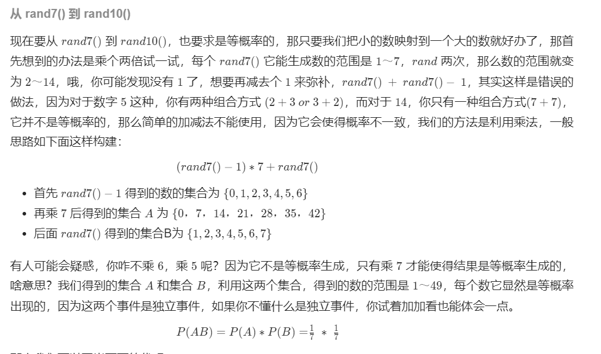

```c++
/**
 * 思路：
 *  
 * （1）由大的随机数 生成小的随机数是方便的，如 rand10 -> rand7
 *      只需要用 rand10 生成等概率的 1 ~ 10 ，然后判断生成的随机数 num ，如果 num <= 7 ，则返回即可
 *      
 * （2）如何由小的随机数生成大的随机数呢？
 *      考虑这样一个事实：
 *      randX() 生成的随机数范围是 [1...X]
 *      (randX - 1) * Y + randY() 可以等概率的生成的随机数范围是 [1, X*Y]
 *     因此， 可以通过 (rand7 - 1) * 7 + rand7() 等概率的生成 [1...49]的随机数
 *     我们可以选择在 [1...10] 范围内的随机数返回。
 *  
 * （3）上面生成 [1...49] 而 我们需要 [1...10]，[11...49]都要被过滤掉，效率有些低
 *      可以通过减小过滤掉数的范围来提高效率。
 *      比如我们保留 [1...40]， 剩下 [41...49]
 *      为什么保留 [1...40] 呢？ 因为对于要生成 [1...10]的随机数，那么 
 *      可以等概率的转换为 1 + num % 10 , suject to num <= 40
 *      因为 1 ... 40 可以等概率的映射到 [1...10]
 *      那么如果生成的数在 41...49 怎么办呢？，这些数因为也是等概率的。
 *      我们可以重新把 41 ... 49 通过 num - 40 映射到 1 ... 9，可以把 1...9 重新看成一个
 *      通过 rand9 生成 rand10 的过程。
 *      (num - 40 - 1) * 7 + rand7() -> [1 ... 63]
 *      if(num <= 60) return num % 10 + 1;
 *      
 *      类似的，[1...63] 可以 划分为 [1....60] and [61...63]
 *      [1...60] 可以通过 1 + num % 10 等概率映射到 [1...10]
 *      而 [61...63] 又可以重新重复上述过程，先映射到 [1...3]
 *      然后看作 rand3 生成 rand10
 *      
 *      (num - 60 - 1) * 7 + rand7() -> [1 ... 21]
 *      if( num <= 20) return num % 10 + 1;
 *      
 *      注意：这个映射的范围需要根据 待生成随机数的大小而定的。
 *      比如我要用 rand7 生成 rand9
 *      (rand7() - 1) * 7 + rand7() -> [1...49]
 *      则等概率映射范围调整为 [1...45]， 1 + num % 9
 *      if(num <= 45) return num % 9 + 1;
 */
```

具体代码：

```c++  
    int rand10() {
        while(true){
          int num = (rand7() - 1) * 7 + rand7();  // [1, 49]
          if(num <= 40) return 1 + num % 10;
          num = (num - 40 - 1) * 7 + rand7();    // [1, 63]
          if(num <= 60) return 1 + num % 10;
          num = (num - 60 - 1) * 7 + rand7();    //[1, 21]
          if(num <= 20) return 1 + num % 10;
        }
    }
```


同理，可用于其他由`randA() - > randB()`
用`(randA() - 1) * A + randA()`生成数，对B取整后 + 1返回。
继续把剩余的数利用起来形成 `(left - 1)& * randA() + rand()`继续执行知道不可行或几乎没优化空间了。 


测试效率：


```c++  
#include <vector>
#include <ctime>
#include <cstdlib>
#include <iostream>
using namespace std;


int rand7() {
    return rand() % 7 + 1;
}

int rand10() {
    while(true){
      int num = (rand7() - 1) * 7 + rand7();  // [1, 49]
      if(num <= 40) return 1;        //1 + num % 10;
      num = (num - 40 - 1) * 7 + rand7();    // [1, 63]
      if(num <= 60) return 1;        //1 + num % 10;
      num = (num - 60 - 1) * 7 + rand7();    //[1, 21]
      if(num <= 20) return 1;        //1 + num % 10;
      return 2;
    }
}


int main()
{
    srand((unsigned)time(0));
    int n = 1000000;
    int ans = 0;
    for(int i = 0; i < n; ++ i){
        ans += rand10();
    }
    cout << ans << endl;
    
    return 0;
}
```

`测试中10^6次，大概400+次需要进行while第二轮循环。即大概0.04%的概率。`


### 随机抽样与打乱

#### 水塘抽样
(蓄水池抽样)

蓄水池抽样算法
最近经常能看到面经中出现在大数据流中的随机抽样问题
蓄水池就是装水的池子，当池子满的时候，每倒入一滴水就有一滴水被替换。
即：当内存无法加载全部数据时，如何从包含未知大小的数据流中随机选取k个数据，并且要保证每个数据被抽取到的概率相等。
- **当 k = 1 时**
也就是说，我们每次只能读一个数据。
假设数据流含有N个数，我们知道如果要保证所有的数被抽到的概率相等，那么每个数抽到的概率应该为 1/N
那如何保证呢？
先说方案：
每次只保留一个数，当遇到第 i 个数时，以 1/i的概率保留它，(i-1)/i的概率保留原来的数。
举例说明： 1 - 10
遇到1，概率为1，保留第一个数。
遇到2，概率为1/2，这个时候，1和2各1/2的概率被保留
遇到3，3被保留的概率为1/3，(之前剩下的数假设1被保留)，2/3的概率 1 被保留，(此时1被保留的总概率为 2/3 * 1/2 = 1/3)
遇到4，4被保留的概率为1/4，(之前剩下的数假设1被保留)，3/4的概率 1 被保留，(此时1被保留的总概率为 3/4 * 2/3 * 1/2 = 1/4)
以此类推，每个数被保留的概率都是1/N。
证明使用数学归纳法即可
- **当 k = m 时**
也就是说，我们每次能读m个数据。
和上面相同的道理，只不过概率在每次乘以了m而已
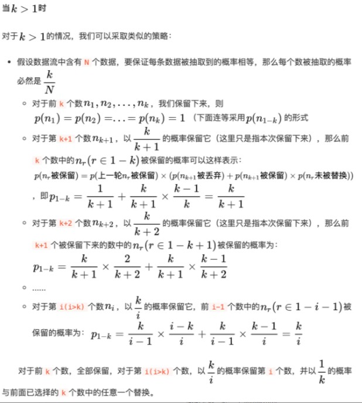
#### 洗牌算法
[Article:经典洗牌算法 ｜ 附严格证明](https://leetcode-cn.com/problems/shuffle-an-array/solution/wei-rao-li-lun-jing-dian-xi-pai-suan-fa-11ona/)

shuffle算法的核心在于能等概率的产生所有可能的排列情况。
所有的排列是什么样的呢？其实学过初等数学的一定知道排列组合这样的基本问题。对n个不同元素进行排列，我们可以从第一位开始枚举，选择1～n中的某一个，然后进行第二位的枚举，选择剩下的n-1个中的某一个...直到选取最后一个元素。
这样的排列总数为 n! 。

那shuffle的时候如何保证等可能的选择其中某一种呢？ 第一直觉可能是对这n!排列方式的每一种遍一个号，从n!中随机选取一个编号，找到对应的方案即可。如何编号呢，也很简单，我们可以直接按照字典序排列。

但如果你从排列的方式思考一下从n!中选随机数的方案，另一种符合直觉的方式其实也很容易想到。
n! = n * (n-1)! 这里的n就是你先挑选出第一个元素的种类数；然后(n-1)!就是对其他元素的排列。所以我们要选一种洗牌方案，就可以先等概率的从n个元素中挑选一个作为第一个元素；然后再对剩下的(n-1)个元素作类似的选择。这样就相当于把 n! 分成 n 段，先选择其中一段，里面有 (n-1)! 个元素，我们把这(n-1)!个情况分成 (n-1) 段，再随机选一个，以此类推。 这样的策略是可以做到从 (n-1)! 中随机选数的。


**证明：**
好吧，我们如何严格证明这样的洗牌算法是等概率的呢？ 其实我们只要看每个位置出现各个元素的概率是不是都是1/n即可。
我们来看第一个位置，由于我们是从n个元素中随机选择一个，每个元素出现的概率显然是1/n。
而对于第二个位置，我们要考虑这个元素没有出现在之前的选择中，然后是从剩下n-1个元素中随机选择一个，所以任意一个元素出现的概率是 ((n-1)/n) * (1/(n-1)) = 1/n 。
同样，第三个位置，任意元素出现的概率应该保证前面两个位置都没有选中，那是 (n-1/n)*(n-2/n-1)*(1/n-2) = 1/n 。
依次递推，所以你会发现每个位置任意元素出现的概率都是相等的， 1/n 。 这就可以严格的证明我们的算法是正确的。

 
```c++  
class Solution {
    vector<int> backup,output;
public:
    Solution(vector<int>& nums) {
      backup = nums;
      output = nums;
    }
    
    vector<int> reset() {
      output = backup;
      return output;
    }
    
    vector<int> shuffle() {     // 对于 i = n-1 ~ 1, 交换 i ,(0 ~ i)
        for(int i = output.size()-1;i>=1;i--){ swap(output[i],output[rand()%(i+1)]);}
        return output;
    }
};
```


## 6 常识


**常识：**
闰年：`if((a%4==0 && a%100!=0) || a%400==0 )`
周几：给出年月日，计算周几：蔡勒公式
```c++  
// 适用于1582年（中国明朝万历十年）10月15日及以后的情形
// 400年的整数倍（如1600年）的3月1日都是星期三，计算和0年（实际不存在，只是为了避免负数范围足够大）3月1日的距离。
// 为什么选3月1日呢？这样可以避免闰年里是否包含2月29日的判断问题，我们可以将3月1日视为每年的第一天。
// 为什么选400年的整数倍呢？因为此法考虑到100年不闰与400年闰的问题，选取正好400年的整数倍可以让year/4-year/100+year/400直接表示闰年带来的天数。
class Solution {
public:
    string dayOfTheWeek(int day, int month, int year) {
        month-=2;
        if(month<=0){
            month+=12;
            year--;
        }
        static int map[]={0,31,61,92,122,153,184,214,245,275,306,337};
        static string data[]={"Wednesday","Thursday","Friday","Saturday","Sunday","Monday","Tuesday"};
        int d=day-1+map[month-1]+year*365+year/4-year/100+year/400; // 0/3/1
        return data[d%7];
    }
};


```


## 7 常用模板


### 区间合并

**常用**

1. 区间合并 
[ 模板题 AcWing 803. 区间合并](https://www.acwing.com/problem/content/805/)

```c++  
// 将所有存在交集的区间合并
void merge(vector<PII> &segs){
    vector<PII> res;

    sort(segs.begin(), segs.end());     // 排序啊  按起点

    int st = -2e9, ed = -2e9;  // 预处理边界
    for (auto seg : segs)
        if (ed < seg.first)       // 需要新建区间
        {  
            if (st != -2e9) res.push_back({st, ed}); //除了预处理的情况，把上一个区间保存。
            st = seg.first, ed = seg.second;        // 更新新的区间
        } 
        else ed = max(ed, seg.second);              // 更新当前区间

    if (st != -2e9) res.push_back({st, ed});         // 最后处理一下！！！

    segs = res;
}

```

2. 区间插入

[插入区间](https://leetcode.cn/problems/insert-interval/solution/cha-ru-qu-jian-by-leetcode-solution/)

>给你一个 无重叠的 ，按照区间起始端点排序的区间列表。
在列表中插入一个新的区间，你需要确保列表中的区间仍然有序且不重叠（如果有必要的话，可以合并区间）。
示例 1：
输入：intervals = [[1,3],[6,9]], newInterval = [2,5]
输出：[[1,5],[6,9]]
示例 2：
输入：intervals = [[1,2],[3,5],[6,7],[8,10],[12,16]], newInterval = [4,8]
输出：[[1,2],[3,10],[12,16]]
解释：这是因为新的区间 [4,8] 与 [3,5],[6,7],[8,10] 重叠。
示例 3：
输入：intervals = [], newInterval = [5,7]
输出：[[5,7]]
示例 4：
输入：intervals = [[1,5]], newInterval = [2,3]
输出：[[1,5]]
示例 5：
输入：intervals = [[1,5]], newInterval = [2,7]
输出：[[1,7]]
提示：
0 <= intervals.length <= 104
intervals[i].length == 2
0 <= intervals[i][0] <= intervals[i][1] <= 105
intervals 根据 intervals[i][0] 按 升序 排列
newInterval.length == 2
0 <= newInterval[0] <= newInterval[1] <= 105


解：
本题中的区间已经按照起始端点升序排列，因此我们直接遍历区间列表，寻找新区间的插入位置即可。具体步骤如下：

首先将新区间左边且相离的区间加入结果集（遍历时，如果当前区间的结束位置小于新区间的开始位置，说明当前区间在新区间的左边且相离）；

接着判断当前区间是否与新区间重叠，重叠的话就进行合并，直到遍历到当前区间在新区间的右边且相离，将最终合并后的新区间加入结果集；

最后将新区间右边且相离的区间加入结果集。


```c++  
    vector<vector<int>> insert(vector<vector<int>>& intervals, vector<int>& newInterval) {
        vector<vector<int>> res;
        int i = 0;
        //[[1,2],[3,5],[6,7],[8,10],[12,16]]  new = [4,8]
        while(i < intervals.size() && intervals[i][1] < newInterval[0]) {
            res.push_back(intervals[i++]);
        }
        //res = [ [1,2] ]
        while(i < intervals.size() && intervals[i][0] <= newInterval[1]) {
            newInterval[0] = min(intervals[i][0], newInterval[0]);
            newInterval[1] = max(intervals[i][1], newInterval[1]);
            i++;
        }
        res.push_back(newInterval);

        while(i < intervals.size()) {
            res.push_back(intervals[i++]);
        }

        return res;
    }
```


**进阶：**
[统计区间中的整数数目](https://leetcode.cn/problems/count-integers-in-intervals/)
见 数据结构进阶 章节的 **线段树** 部分。


## 8 其他功能


### 程序计时
```c++  
//计算一段程序运行的时间
#include<iostream>
#include<ctime>
using namespace std;
int main()
{
    clock_t startTime,endTime;
    startTime = clock();//计时开始
    for (int i = 0; i < 2147483640; i++)
    {
        i++;
    }
    endTime = clock();//计时结束
    cout << "The run time is: " <<(double)(endTime - startTime) / CLOCKS_PER_SEC << "s" << endl;
    system("pause");
    return 0;
}
//注释在:VC++6.0中可以用CLK_TCK替换CLOCKS_PER_SEC
```

计算vector 效率

计算cout 和printf 效率， printf大概一秒输出1w个数，是 cout 的5倍


以及卡时函数，模拟退火等情况下可用

`while ((double)clock()/CLOCKS_PER_SEC<0.8)`


## 9 易错


#### 变量合理使用
```c++
// 不要改变之后还要用的n值
    int n ;
    cin>>n;
    while(n--){
        DoSth();
    }
    // 此时 n==-1 啊
    for(int i =0;i<n;i++){
        Work();
    }
```

```c++
// 在循环中 1.++i,--i 比i++,i-- 快，  2.注意size_t类型的使用误区
for(int i=0;i<N;++i) { }
for(size_t i=0;i<N;++i) { }
for(int i = N;i>=0;--i) { }
for(size_t i = N;i>=0;--i) { }   //!!!! 有问题！！！

```


**vector<int>追加一份**
```c++
    vector<int> a{1,2,3};
    for(auto c:a) a.push_back(c);          // wrong 1   永远加不完
    a.insert(a.end(),a.begin(),a.end());   // wrong 2
        for(int i =0;i<a.size();i++) a.push_back(a[i]);

    //可以这样
    int n = a.size();      // 一定要先记住长度
    for(int i =0;i<n;i++) a.push_back(a[i]);

```


非      需要初始化
全局变量数组默认是0
```c++
// 在全局变量中
// 不行，需要const
// int N=1e6+10;
// 可以
const int N=1e6+10;
int a[N];
``` 


#### size_t
size_t是sizeof运算符的结果类型。使用size_t变量数组中的模型的大小或指数。size_t传达了语义：您立即知道它代表一个以字节为单位的大小或一个索引，而不仅仅是另一个整数。同样，使用size_t字节表示大小有助于使代码具有可移植性。


该size_t类型用于指定内容的大小，因此很自然地使用它，例如，获取字符串的长度然后处理每个字符：for (size_t i = 0, max = strlen (str); i < max; i++)&nbsp; &nbsp; doSomethingWith (str[i]);你也必须注意，当然边界条件，因为它是一个无符号类型。顶端的边界通常并不那么重要，因为最大值通常很大（尽管有可能到达那里）。大多数人只是将an int用于此类事情，因为他们很少拥有足够大以超过该能力的结构或数组int。但是请注意以下事项：for (size_t i = strlen (str) - 1; i >= 0; i--)由于无符号值的包装行为，这将导致无限循环（尽管我已经看到编译器对此提出警告）。也可以通过以下方式缓解此问题（稍难理解，但至少可以避免包装问题）：for (size_t i = strlen (str); i-- > 0; )通过将减量转换为延续条件的检查后副作用，这将对减量前的值进行连续性检查，但仍在循环内使用减量值（这就是循环从而len .. 1不是从处运行的原因len-1 .. 0）。

但也存在很多意想不到的bug
如[滑动窗口最大值](https://leetcode-cn.com/problems/sliding-window-maximum/)中，对循环变量进行数学运算啊，即使得到负值也会被类型转化成size_t,即无符号，使得结果为一个极大的正值。。。


函数的形参啊  别用i，j啊 为了避免重复啊, 也别用st  会和state数组重复 可用src等


### 短路问题


- 运算顺序问题 [优先级误区](https://blog.csdn.net/qq_40946921/article/details/88323975?spm=1001.2101.3001.6661.1&utm_medium=distribute.pc_relevant_t0.none-task-blog-2%7Edefault%7ECTRLIST%7Edefault-1.no_search_link&depth_1-utm_source=distribute.pc_relevant_t0.none-task-blog-2%7Edefault%7ECTRLIST%7Edefault-1.no_search_link)
    + 逻辑运算中的短路现象（短路原则是 与（&&） 或（||） 才有。）
        + 对于
        ```c++
            a=0;b=1
            c=a&&(b=3)
            //最终c=0; b=1
        ```
        因为从左至右进行时，若遇到运算符左边的操作数是 0（逻辑假），则停止运算。
         ```c++
            a=1;b=1;c=0;
            d=a||b||(c=b+3);
            //最终d=1;c=0;
        ```
        因为从左至右进行时，若遇到运算符左边的操作数是 1（逻辑真），则停止运算。
        + &&比||优先级高 但并不意味着先执行。即优先级只是决定了表达式的结合次序，而不是运算顺序！
        即对于 **a||b&&c** ，虽然相当于a||(b&&c)
        但是若a为true，则b&&c不会执行
           若a为false，而b为false，c也不会执行
           因此
           ```c++
            int x = 3;
	        int y = 1 || (x = 1) && (x += 1);
            //此时虽然相当于
            int y = 1 || ((x = 1) && (x += 1));
            //但由于短路现象，有 x = 3，y =1
           ```
        


### 迭代器失效

```c++
set 类模板中，erase() 方法有 3 种语法格式，分别如下：
//删除 set 容器中值为 val 的元素
size_type erase (const value_type& val);
//删除 position 迭代器指向的元素
iterator  erase (const_iterator position);
//删除 [first,last) 区间内的所有元素
iterator  erase (const_iterator first, const_iterator last);
```

**map 等容器的[]问题**
map<int,int> mp;
mp[1] = 2;
if(mp[100] == 0) { deal(); }

此时 mp.size() == 2
正确应该用mp.count(100) == 0
出现 问题题目 ：[周赛：找出数组中的所有孤独数字](https://leetcode-cn.com/problems/find-all-lonely-numbers-in-the-array/)


`vector<set<Book>> vec(4);  直接写成set<Book> st[4];`


### 传二维数组
[Article:c++ -- 二维数组参数传递](https://www.cnblogs.com/cygalaxy/p/6963789.html) 
- 需要传第二维的维数..

```c++  
#include <iostream>
using namespace std;

/*传二维数组*/

//第1种方式：传数组,第二维必须标明
/*void display(int arr[][4])*/
void display1(int arr[][4],const int irows)  {
    for (int i=0;i<irows;++i)  {
        for(int j=0;j<4;++j) {
            cout<<arr[i][j]<<" ";     // 可以采用parr[i][j]
        }
        cout<<endl;
    }
    cout<<endl;
}

//第2种方式：一重指针，传数组指针,第二维必须标明
/*void display(int (*parr)[4])*/
void display2(int (*parr)[4],const int irows)
{
    for (int i=0;i<irows;++i)
    {
        for(int j=0;j<4;++j)
        {
            cout<<parr[i][j]<<" ";    //可以采用parr[i][j]
        }
        cout<<endl;
    }
    cout<<endl;
}
//注意：parr[i]等价于*(parr+i)，一维数组和二维数组都适用

//第3种方式：传指针,不管是几维数组都把他看成是指针
/*void display3(int *arr)*/
void display3(int *arr,const int irows,const int icols)
{
    for(int i=0;i<irows;++i)
    {
        for(int j=0;j<icols;++j)
        {
            cout<<*(arr+i*icols+j)<<" ";   //注意:(arr+i*icols+j),不是(arr+i*irows+j)
        }
        cout<<endl;
    }
    cout<<endl;
}

/***************************************************************************/
/*
//第2种方式：一重指针，传数组指针void display(int (*parr)[4])
//缺陷：需要指出第二维大小
typedef int parr[4];
void display(parr *p)
{
    int *q=*p;        //q指向arr的首元素
    cout<<*q<<endl;   //输出0
}

typedef int (*parr1)[4];
void display1(parr1 p)
{
    cout<<(*p)[1]<<endl;  //输出1
    cout<<*p[1]<<endl;    //输出4,[]运算符优先级高
}
//第3种方式：
void display2(int **p)
{
    cout<<*p<<endl;           //输出0
    cout<<*((int*)p+1+1)<<endl; //输出2
}
*/

int main()
{
    int arr[][4]={0,1,2,3,4,5,6,7,8,9,10,11};
    int irows=3;
    int icols=4;
    display1(arr,irows);
    display2(arr,irows);

    //注意(int*)强制转换.个人理解：相当于将a拉成了一维数组处理。
    display3((int*)arr,irows,icols);
    return 0;
}

```


[习题册](https://www.acwing.com/problem/content/description/4075/)
错误1 ：
```c++
set<int> st;
st.insert(1); st.insert(2);
for(auto& a:st){
    if(a==1) st.erase(a);   //会报错
}

// 不报错写法
for(auto& a:st){
    if(a==1) st.erase(a); 
    continue;
}
// 但是为啥要进行循环呢......时间复杂度直接调高了O(n)
// 直接用
st.erase ( deleVal);

```

set的迭代器啊   
如set<int> st{1,2,3,4,10};
auto it1 = st.upper_bound(4);
auto it2 = st.lower_bound(5);
return it1-it2;    // 错误


**常用计算**


- 若定义子字符串 是字符串中一个连续（非空）的字符序列。
    + 则有每个位置的元素在所有子字符串中出现的次数为$$(i+1)(n-i)$$
    + 推倒：
    >若长度为$$n$$,则某一子字符串若包含第$$i$$个元素，$$[l,r]$$需要满足：
$$0\le l \le i$$
$$i\le r \le n-1$$
因此，共有$$(i+1)(n-i)$$个子串。

[M-所有子字符串中的元音](https://leetcode-cn.com/problems/vowels-of-all-substrings/)


```c++  
class Solution {
public:
vector<int> a(31,-1);// 报错位置
int fib(int N)
{
    // ...
    return a[N];
  }
};
```

报错`error: expected parameter declarator`，是因为编译器无法区分该语句是成员变量声明还是成员函数声明！！！
可改成`vector<int> a=vector<int>(31,-1);// 修改后`。其他类型同理。。。


# 题目思路

## 常用技巧
- 排序
- 倒序
- 二分
- 前缀
- 逆向
    - 逆向补集
    - 逆向思考
    - 终态思考
- 双指针(从0开始，从n-1开始...)
- 预处理+枚举
- 等


**关于题目所用方法，根据题目特性选取。对于多解法，掌握基本解法的基础上尝试其他解法，如板子。当然有的题目有数学性质或脑筋急转弯特点，可能效率更快**

如在状压DP部分中一道题目，[D-数组的最大与和](https://leetcode-cn.com/problems/maximum-and-sum-of-array/)。
本笔记共整理了6种算法。
- **状态DP**  (见动态规划状压dp)
- **三进制**
- **最小费用最大流**  (见图论)
    - 估计是每个人最晚的算法
- **模拟退火** (见搜索部分)
    - 其他方法不会时，可以尝试
- **贪心**
- **KM** (见图论二分图部分)
    - 最快，而且有板子
其中不同的算法，耗时比较：
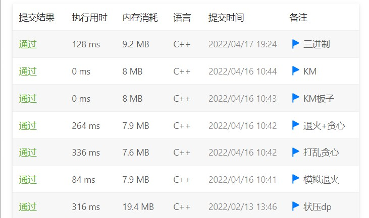


[一个简单的整数问题2](https://www.acwing.com/problem/content/244/)
同样整理了三种方法。
- 树状数组 
    - 维护差分数组和另一个推导数组
    - 代码简单，难推导
- 线段树 + 懒标记
    - 代码复杂，但有板子
- 分块


## 例题


### 终态
###### [统计道路上的碰撞次数](https://leetcode-cn.com/problems/count-collisions-on-a-road/)
>在一条无限长的公路上有 n 辆汽车正在行驶。汽车按从左到右的顺序按从 0 到 n - 1 编号，每辆车都在一个 独特的 位置。
给你一个下标从 0 开始的字符串 directions ，长度为 n 。directions[i] 可以是 'L'、'R' 或 'S' 分别表示第 i 辆车是向 左 、向 右 或者 停留 在当前位置。每辆车移动时 速度相同 。
碰撞次数可以按下述方式计算：
当两辆移动方向 相反 的车相撞时，碰撞次数加 2 。
当一辆移动的车和一辆静止的车相撞时，碰撞次数加 1 。
碰撞发生后，涉及的车辆将无法继续移动并停留在碰撞位置。除此之外，汽车不能改变它们的状态或移动方向。
返回在这条道路上发生的 碰撞总次数 。
示例 1：
输入：directions = "RLRSLL"
输出：5
解释：
将会在道路上发生的碰撞列出如下：
-车 0 和车 1 会互相碰撞。由于它们按相反方向移动，碰撞数量变为 0 + 2 = 2 。
-车 2 和车 3 会互相碰撞。由于 3 是静止的，碰撞数量变为 2 + 1 = 3 。
-车 3 和车 4 会互相碰撞。由于 3 是静止的，碰撞数量变为 3 + 1 = 4 。
-车 4 和车 5 会互相碰撞。在车 4 和车 3 碰撞之后，车 4 会待在碰撞位置，接着和车 5 碰撞。碰撞数量变为 4 + 1 = 5 。
因此，将会在道路上发生的碰撞总次数是 5 。
示例 2：
输入：directions = "LLRR"
输出：0
解释：
不存在会发生碰撞的车辆。因此，将会在道路上发生的碰撞总次数是 0 。


- 分析题意：

- 当两辆移动方向 相反 的车相撞时，碰撞次数加 2 。     --> 两辆车被撞停，答案 + 2。
- 当一辆移动的车和一辆静止的车相撞时，碰撞次数加 1 。  --> 一辆车被撞停，答案 +1。
显然，左侧的 L 和右侧的R 不会被撞停；而中间的车辆都会最终停止，因此统计中间的、一开始没有停止的车辆数（即不是 S 的车辆数）即可。


```c++  
class Solution {
public:
    int countCollisions(string s) {
        int l = 0, r = s.size() - 1;
        while(l <= r && s[l] == 'L') ++l;
        while(l <= r && s[r] == 'R') --r;
        int res = 0; 
        for(int i = l; i <= r; ++i) if(s[i] == 'L' || s[i] == 'R') ++res;
        return res;
    }
};
```
或者
```c++  
class Solution {
public:
    int countCollisions(string directions) {
        int ans = 0, x = 0, y = 0;
        for (char c : directions) {
            if (c == 'L') ans += x;
            else x = 1;
        }
        reverse(directions.begin(), directions.end());
        for (char c : directions) {
            if (c == 'R') ans += y;
            else y = 1;
        }
        return ans;
    }
};
```

###### [最小差值 I](https://leetcode-cn.com/problems/smallest-range-i/)

>给你一个整数数组 nums，和一个整数 k 。
在一个操作中，您可以选择 0 <= i < nums.length 的任何索引 i 。将 nums[i] 改为 nums[i] + x ，其中 x 是一个范围为 [-k, k] 的整数。对于每个索引 i ，最多 只能 应用 一次 此操作。
nums 的 分数 是 nums 中最大和最小元素的差值。 
在对  nums 中的每个索引最多应用一次上述操作后，返回 nums 的最低 分数 。
示例 1：
输入：nums = [1], k = 0
输出：0
解释：分数是 max(nums) - min(nums) = 1 - 1 = 0。
示例 2：
输入：nums = [0,10], k = 2
输出：6
解释：将 nums 改为 [2,8]。分数是 max(nums) - min(nums) = 8 - 2 = 6。
示例 3：
输入：nums = [1,3,6], k = 3
输出：0
解释：将 nums 改为 [4,4,4]。分数是 max(nums) - min(nums) = 4 - 4 = 0。
提示：
1 <= nums.length <= 104
0 <= nums[i] <= 104
0 <= k <= 104

解：


```c++  
class Solution {
public:
    int smallestRangeI(vector<int>& nums, int k) {
        int minNum = *min_element(nums.begin(), nums.end());
        int maxNum = *max_element(nums.begin(), nums.end());
        return maxNum - minNum <= 2 * k ? 0 : maxNum - minNum - 2 * k;
    }
};
```

###### [网易T3：二叉树]

>构造一个有n个节点的完全二叉树，要求该二叉树满足：
1.所有节点的权值值为1-n的排列。
2.除了根节点外，每个节点的权值和它父亲的权值的乘积为偶数。
输出该构造出的二叉树的层序遍历结果。


- 回溯
```c++  
// 暴搜 ：搜到一个可行解后停止搜索即可
using namespace std;
const int N = 200010;
int n;
int f[N];
int cnt = 0;
// i  2*i- 1  2*i +1  
// i  i / 2
//f[i][0] 表示为偶
//f[i][1] 表示为奇

void dfs(int* f, int cur, int odd, int even){
  if(cur == n + 1){
    if(odd == 0 && even == 0){
      int so = 1, se = 2;
      for(int i = 1; i <= n; ++ i){
        if(f[i] == 1){
          cout << so << " ";
          so += 2;
        } 
        else {
          cout << se << " ";
          se += 2;
        }
      }
      cnt ++;
      cout << endl;
      return;
    }  
  }
  if(cnt == 1) return;
  if(odd < 0 || even < 0) return;
  
  if(cur == 1){
    f[cur] = 2;
    dfs(f, cur + 1, odd, even - 1);
    f[cur] = 1;
    dfs(f, cur + 1, odd - 1, even);
  }else{
        if(f[cur/2] == 1){
          f[cur] = 2;
          dfs(f, cur + 1, odd, even - 1);
        }else {
          f[cur] = 1;
          dfs(f, cur + 1, odd - 1, even);
          f[cur] = 2;
          dfs(f, cur + 1, odd, even - 1);
        }
  }
}

int main()
{
  cin >> n;
  int odd = n + 1 >> 1, even = n >> 1;
  dfs(f, 1, odd, even);
  return 0;
}
```
- 取巧
然而根据完全二叉树性质，以及1-n内，偶数总不多于奇数，所以先把偶数填完，最后一层填奇数就能满足要求。
```c++  
  cin >> n;
  int ji = 1, ou = 2;
  while(ou <= n){
    cout << ou << " ";
    ou += 2;
  }
  while(ji <= n){
    cout << ji << " ";
    ji += 2;
  }
```

[HDUOJ 2045染色问题](https://www.iteye.com/blog/xitongyunwei-1899258)
染色问题(n个格子，3种颜色)

有排成一行的ｎ个方格，用红(Red)、粉(Pink)、绿(Green)三色涂每个格子，每格涂一色，要求任何相邻的方格不能同色，且首尾两格也不同色．求全部的满足要求的涂法.


**解：**

递推公式：
A1 = 3
A2 = 6 //A(3,2)=6
A3 = 6 //A(3,3)=6
An=2*A(n-2)+A(n-1), n>=4

证明：
考虑第n-1个格子:
1. 如果这个格子和第1个格子颜色不同，那么第n个格子只有1种选择，前n-1个格子的选择就是A(n-1)，此时n个格子的选择是1*A(n-1)
2. 如果这个格子和第1个格子颜色相同，那么第n个格子只有2种选择，前n-2个格子的选择就是A(n-2)，此时n个格子的选择时2*A(n-2)
所以有An=2*A(n-2)+A(n-1), n>=4

remak: 因为我们是考虑第n-1个格子，该格子和第1个格子的颜色可能相同也可能不同，所以n>=4才可以。不然n=3的话，第n-1=3-1=2个格子和第一个格子的颜色必然不同了，就没有上面这2种情况了，所以要从n>=4开始推导。


```c++  
long long func(int n) {  
    long long num[51]={0};  
    num[0]=3;  
    num[1]=6;//A(3,2)  
    num[2]=6;//A(3,3)  
    for(int i=3; i<n; i++) {      //for n=i, condition on (i-1)th color  
        num[i]=num[i-1]+2*num[i-2];  
    }  
    return num[n-1];  
}  
```

###### [网易t1]

>有两个分别拥有血量a、b的怪兽。有两个技能
1.其中一个怪兽血量减去x
2.两个怪兽血量都减去y
问：最少需要多少次技能。
输入：a,b,x,y 
输出： 次数

1.遍历暴力
```c++  
int a, b, x, y;
  cin >> a >> b >> x >> y;
  int mm = max(a, b);
  int ans = INT_MAX;
  for(int i = 0; i <= mm ; ++ i){
    int al = max(a - i * y, 0);
    int bl = max(b - i * y, 0);
    int aa = (al == 0 ? 0 : (al - 1) / x + 1);
    int bb = (bl == 0 ? 0 : (bl - 1) / x + 1);
    ans = min(ans,( i +  aa + bb);
  }
  cout << ans << endl;
```
2.贪心
```c++  
  if(a < b) swap(a, b);
  int ans1, ans2, ans3;
  ans1 = a / x + (a % x != 0) + b / x + (b % x != 0);
  ans2 = a / y + (a % y != 0);
  if(b % y) ans3 = (a - (b - b % y + y) / x) +
   ((a - (b - (b % y + y)) % x != 0) + b / y + 1;
  else ans3 = (a - b) / x + ((a - b) % x != 0) + b / y;
  cout << min({ans1, ans2, ans3}) << endl;
```


###### 约瑟夫环问题
详情见 基本算法的递归部分。


暴力
```c++  
    vector<int> a;
    int n, k;
    cin >> n >> k;

    for(int i = 1; i <= n; i ++ ){
        a.push_back(i);
    }
    int id = 0;
    while(k -- ){
        int x;
        cin >> x;
        int m = a.size();
        x = x % m;
        id = (id + x) % m;
        printf("%d ", a[id]);
        a.erase(a.begin() + id);
    }
```


[周赛T2:向数组中追加 K 个整数](https://leetcode-cn.com/problems/append-k-integers-with-minimal-sum/)

>给你一个整数数组 nums 和一个整数 k 。请你向 nums 中追加 k 个 未 出现在 nums 中的、互不相同 的 正 整数，并使结果数组的元素和 最小 。
返回追加到 nums 中的 k 个整数之和。
示例 1：
输入：nums = [1,4,25,10,25], k = 2
输出：5
解释：在该解法中，向数组中追加的两个互不相同且未出现的正整数是 2 和 3 。
nums 最终元素和为 1 + 4 + 25 + 10 + 25 + 2 + 3 = 70 ，这是所有情况中的最小值。
所以追加到数组中的两个整数之和是 2 + 3 = 5 ，所以返回 5 。
示例 2：
输入：nums = [5,6], k = 6
输出：25
解释：在该解法中，向数组中追加的两个互不相同且未出现的正整数是 1 、2 、3 、4 、7 和 8 。
nums 最终元素和为 5 + 6 + 1 + 2 + 3 + 4 + 7 + 8 = 36 ，这是所有情况中的最小值。
所以追加到数组中的两个整数之和是 1 + 2 + 3 + 4 + 7 + 8 = 25 ，所以返回 25 。

解：思维 + 贪心

我们先选择(1 到 k)一共k个数的和作为答案
但(1 到 k) 中的数可能在nums里面存在
那我们就这个重复的数加起来， 让后面多的一个坑即 k + 1
最后利用高斯求和公式把1 ~ k 的数用 O(1)的时间加起来 再减去重复的
主要开销来源于排序 所以复杂度取O(nlogn)

- 去重
    - nums里面重复的元素可以剔除，这样并不会影响答案
- 更新k
    - 因为原k已经变为k+1,如果存在k+1,则k+1仍需要往后推。故用变化后的k值进行计算sum。

```c++  
class Solution {
public:
    long long minimalKSum(vector<int>& nums, int k) {
        // 排序为了去重 也方面k后移
        sort(nums.begin(), nums.end());
        int n = unique(nums.begin(), nums.end()) - nums.begin(); // 所谓的去重只是把多余的数移到了最后面并没有删除
        long long d = 0;
        for(int i = 0; i < n; ++i)
        {
            if(nums[i] <= k)
            {
                d += nums[i];
                ++k;
            }
        }
        return (1LL + k) * k / 2 - d;
    }
};
```


```python 
class Solution:
    def minimalKSum(self, nums: List[int], k: int) -> int:
        
        nums.sort()         # 排序 【方便后续判断和去重】
        
        # 贪心地认为追加的k个整数为[1, k]，先直接求和
        ans = k*(k+1)//2
        
        # 判断[1, k]与nums中的元素存在重复的情况，并对追加元素的最后一位（即追加的最大元素）做调整
        last = k            # last记录追加的最后一个元素，暂时为k
        pre = -1            # 上一个nums中的元素 【去重】
        for num in nums:            # nums已有序，每次遍历得到当前最小值

            if num == pre:          # 遇到多个重复的num，只调整一次last即可
                continue

            if num <= last:         # 当前num必与追加的元素存在重复
                ans += last+1-num   # 考虑将（追加的）重复元素调整为last+1，避免与nums存在重复
                last += 1           # last调整+1
                pre = num           # 记录上一个num，方便去重

            else:                   # 若当前num>last（num为遍历到的最小值）
                return ans          # 则nums的后续元素均大于追加元素，无需再调整
        
        return ans
```


### 原地操作

###### [旋转矩阵]
[旋转图像](https://leetcode-cn.com/problems/rotate-image/)
给定一个 n × n 的二维矩阵 matrix 表示一个图像。请你将图像顺时针旋转 90 度。

你必须在 原地 旋转图像，这意味着你需要直接修改输入的二维矩阵。请不要 使用另一个矩阵来旋转图像。


- 旋转
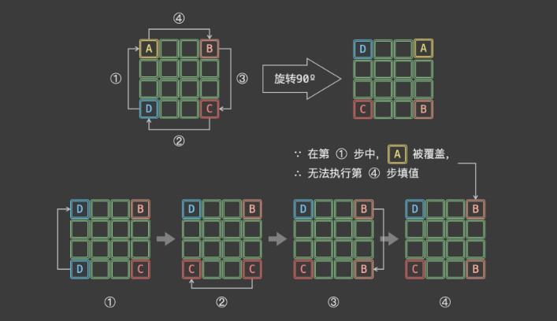
```c++  
class Solution {      //妙啊
public:
    void rotate(vector<vector<int>>& matrix) {
        int n = matrix.size();
        for(int i=0; i<n/2; i++) //总循环次数<n/2
        {
            for(int j = i; j<n-i-1; j++) //每次循环将一圈数字首行除行尾的值逐个循环90°
            {   
                //在纸上演示判断边界问题以及旋转后数字的位置变换
                swap(matrix[i][j], matrix[j][n-1-i]);
                swap(matrix[i][j], matrix[n-1-i][n-1-j]);
                swap(matrix[i][j], matrix[n-1-j][i]);
            }
        }
    }
};
```


- 两次翻转
1.水平翻转 2.主对角线翻转
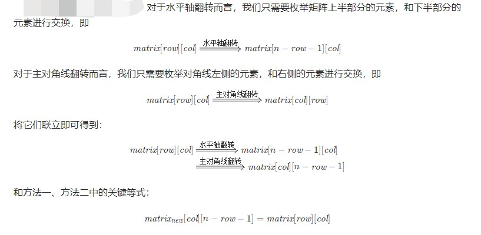

```c++  
class Solution {
public:
    void rotate(vector<vector<int>>& matrix) {
        int n = matrix.size();
        // 水平翻转
        for (int i = 0; i < n / 2; ++i) {
            for (int j = 0; j < n; ++j) {
                swap(matrix[i][j], matrix[n - i - 1][j]);
            }
        }
        // 主对角线翻转
        for (int i = 0; i < n; ++i) {
            for (int j = 0; j < i; ++j) {
                swap(matrix[i][j], matrix[j][i]);
            }
        }
    }
};
```


###### 螺旋矩阵
1.输出螺旋线
[螺旋矩阵](https://leetcode-cn.com/problems/spiral-matrix/)

>给你一个 m 行 n 列的矩阵 matrix ，请按照 顺时针螺旋顺序 ，返回矩阵中的所有元素。


```c++  
class Solution {
public:
    vector<int> spiralOrder(vector<vector<int>>& matrix) {
        vector <int> ans;
        if(matrix.empty()) return ans; //若数组为空，直接返回答案
        int u = 0; //赋值上下左右边界
        int d = matrix.size() - 1;
        int l = 0;
        int r = matrix[0].size() - 1;
        while(true)
        {
            for(int i = l; i <= r; ++i) ans.push_back(matrix[u][i]); //向右移动直到最右
            if(++ u > d) break; //重新设定上边界，若上边界大于下边界，则遍历遍历完成，下同
            for(int i = u; i <= d; ++i) ans.push_back(matrix[i][r]); //向下
            if(-- r < l) break; //重新设定有边界
            for(int i = r; i >= l; --i) ans.push_back(matrix[d][i]); //向左
            if(-- d < u) break; //重新设定下边界
            for(int i = d; i >= u; --i) ans.push_back(matrix[i][l]); //向上
            if(++ l > r) break; //重新设定左边界
        }
        return ans;
    }
};
```

2.填充螺旋线


[螺旋矩阵 II](https://leetcode-cn.com/problems/spiral-matrix-ii/)

>给你一个正整数 n ，生成一个包含 1 到 n2 所有元素，且元素按顺时针顺序螺旋排列的 n x n 正方形矩阵 matrix 。

```c++  
class Solution {
public:
    vector<vector<int>> generateMatrix(int n) {
        vector<vector<int>> res(n, vector<int>(n));
        int i = 1, left = 0, up = 0, right = n - 1, down = n - 1;
        while (i <= n * n) {
            for (int j = left; j <= right && i <= n * n; j++) res[up][j] = i++;
            up++;
            for (int j = up; j <= down && i <= n * n; j++) res[j][right] = i++;
            right--;
            for (int j = right; j >= left && i <= n * n; j--) res[down][j] = i++;
            down--;
            for (int j = down; j >= up && i <= n * n; j--) res[j][left] = i++;
            left++;
        }
        return res;
    }
};
```

3.位置与值映射

[乐团站位](https://leetcode-cn.com/problems/SNJvJP/)
某乐团的演出场地可视作 num * num 的二维矩阵 grid（左上角坐标为 [0,0])，每个位置站有一位成员。乐团共有 9 种乐器，乐器编号为 1~9，每位成员持有 1 个乐器。
为保证声乐混合效果，成员站位规则为：自 grid 左上角开始顺时针螺旋形向内循环以 1，2，...，9 循环重复排列。例如当 num = 5 时，站位如图所示

请返回位于场地坐标 [Xpos,Ypos] 的成员所持乐器编号。
示例 1：
输入：num = 3, Xpos = 0, Ypos = 2
输出：3
| 1 | 2 | 3 |
|---|---|---|
|8  | 9 | 4 |
|7  | 6 | 5 | 

`1 <= num <= 10^9`
`0 <= Xpos, Ypos < num`


解：
思路：
1.获取所求点在第几层（此处根据所求点的位置，层数k可能会多算一层）
2.前第0，1...k层的数量和 与 所求点相对第k层左上角元素(第k层的入口元素)的相对路径做+或-运算，求得所求点的绝对路径（从起始点到所求点经过的长度）


```c++
class Solution {
public:
    int orchestraLayout(int num, int xPos, int yPos) {
        long long x=xPos,y=yPos,n=num;
        if  (x <= y) {
            long long  k= min(x, n-1-y);
            return  (4*k*(n-k)+1+(x+y-k*2)-1)%9+1;
        }
        long long  kp =min(y, n-1-x)+1 ; 
        return   (4*kp*(n-kp)+1-(x+y-(kp-1)*2)-1)%9+1;
    }
};
```


###### 最值搭配


**最大值、次大...组合搭配问题**

记录最大、次大、第三大..流程
```c++
int d1,d2,d3; // 先赋予最小的可能值,分别为最大次大和第三大。
if(val >= d1){
    d3 = d2;
    d2 = d1;
    d1 = val;
}else if(val >= d2){
    d3 = d2;
    d2 = val;
}else if(val > d3){
    d3 = val;
}
```

[节点序列的最大得分](https://leetcode-cn.com/problems/maximum-score-of-a-node-sequence/)
>给你一个 n 个节点的 无向图 ，节点编号为 0 到 n - 1 。
给你一个下标从 0 开始的整数数组 scores ，其中 scores[i] 是第 i 个节点的分数。同时给你一个二维整数数组 edges ，其中 edges[i] = [ai, bi] ，表示节点 ai 和 bi 之间有一条 无向 边。
一个合法的节点序列如果满足以下条件，我们称它是 合法的 ：
- 序列中每 相邻 节点之间有边相连。
- 序列中没有节点出现超过一次。
节点序列的分数定义为序列中节点分数之 和 。
请你返回一个长度为 `4` 的合法节点序列的最大分数。如果不存在这样的序列，请你返回 -1 。

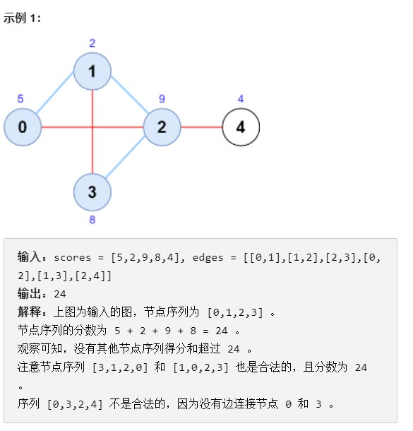

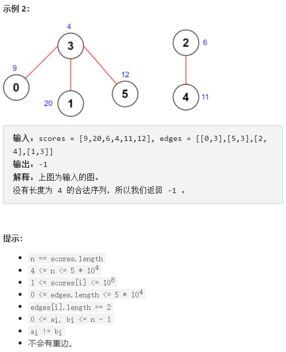

**思路**：
- 预处理+枚举中间边
- 搭配细节
对组合进行遍历搭配，只对符合条件的进行处理。
而不是单独看和x搭配最大的是不是y，不是的话再选次大。
而y搭配的最大是不是x，不是的话再选次大。
两者次大也相同，再选各自更大的第三大。。。
上述比较过于繁琐，直接遍历即可。

```c++  
class Solution {
public:
    int maximumScore(vector<int> &scores, vector<vector<int>> &edges) {
        int n = scores.size();
        vector<vector<pair<int, int>>> g(n);
        for (auto &e : edges) {
            int x = e[0], y = e[1];
            g[x].emplace_back(-scores[y], y);  // 存储负值
            g[y].emplace_back(-scores[x], x);
        }
        for (auto &vs : g)
            if (vs.size() > 3) {
                nth_element(vs.begin(), vs.begin() + 3, vs.end());
                vs.resize(3);
            }

        int ans = -1;
        for (auto &e : edges) {
            int x = e[0], y = e[1];
            for (auto &[score_a, a] : g[x])
                for (auto &[score_b, b] : g[y])
                    if (a != y && b != x && a != b)
                        ans = max(ans, -score_a + scores[x] + scores[y] - score_b);
        }
        return ans;
    }
}; 
```


### 数学


**计算数组乘积中尾随零的数量**
```c++  
Input  : a[] = {100, 20, 40, 25, 4} 
Output : 6
Product is 100 * 20 * 40 * 25 * 4
which is 8000000 and has 6 trailing 0s.

Input  : a[] = {10, 100, 20, 30, 25, 4, 
                43, 25, 50, 90, 12, 80}
Output : 13
```

一个简单的解决方案是简单地乘以并计算乘积中的尾随0。此解决方案可能会导致整数溢出。更好的解决方案基于以下事实：零是由2和5的组合形成的。因此，**零的数量将取决于可以形成的2和5的对数**。
例如：8*3*5*23*17*25*4*11

`2^3 * 3^1 * 5^1 * 23^1 * 17^1 * 5^2 * 2^2 * 11^1`
在此示例中，有5个2和3个5。因此，我们将只能形成 3对（2 * 5）。因此，乘积中将为3个零。

```c++  
// CPP program for count total zero in product of array
#include <iostream>
using namespace std;
  
// Returns count of zeros in product of array
int countZeros(int a[], int n)
{
    int count2 = 0, count5 = 0;
    for (int i = 0; i < n; i++) {
  
        // count number of 2s in each element
        while (a[i] % 2 == 0) {
            a[i] = a[i] / 2;
            count2++;
        }
  
        // count number of 5s in each element
        while (a[i] % 5 == 0) {
            a[i] = a[i] / 5;
            count5++;
        }
    }
    // return the minimum
    return (count2 < count5) ? count2 : count5;
}
  
// Driven Program
int main()
{
    int a[] = { 10, 100, 20, 30, 50, 90, 12, 80 };
    int n = sizeof(a) / sizeof(a[0]);
    cout << countZeroso(a, n);
    return 0;
}
```

应用：
[转角路径的乘积中最多能有几个尾随零](https://leetcode-cn.com/problems/maximum-trailing-zeros-in-a-cornered-path/)

解法：
枚举
乘积尾随零的数量是所有乘数中因子 22 数量之和与因子 55 数量之和中的较小值。

做乘法的过程中，尾随零的数量只会增加不会减少，因此我们应该让尽量多的数参与乘积运算。也就是说最优路径一定是从某个边界出发，拐个弯，再走到另一个边界，不会中途不走了或者不拐弯（这样参与运算的数不是尽量多的）。

因此先用前缀和维护每一行和每一列因子 22 与因子 55 的数量，再枚举拐点计算答案即可。

```c++  
class Solution {
public:
    int maxTrailingZeros(vector<vector<int>>& grid) {
        int n = grid.size(), m = grid[0].size();
        vector<vector<int>> f2(n + 1), g2(n + 1), f5(n + 1), g5(n + 1);
        for (int i = 0; i <= n; i++) f2[i] = g2[i] = f5[i] = g5[i] = vector<int>(m + 1);
        for (int i = 1; i <= n; i++) for (int j = 1; j <= m; j++) {
            int x = grid[i - 1][j - 1];
            int two = 0, five = 0;
            while (x % 2 == 0) two++, x /= 2;
            while (x % 5 == 0) five++, x /= 5;
            f2[i][j] = f2[i][j - 1] + two;
            g2[i][j] = g2[i - 1][j] + two;
            f5[i][j] = f5[i][j - 1] + five;
            g5[i][j] = g5[i - 1][j] + five;
        }
        int ans = 0;
        for (int i = 1; i <= n; i++) for (int j = 1; j <= m; j++) {
            // 从左边出发，到上边结束
            ans = max(ans, min(f2[i][j] + g2[i - 1][j], f5[i][j] + g5[i - 1][j]));
            // 从左边出发，到下边结束
            ans = max(ans, min(f2[i][j] + g2[n][j] - g2[i][j], f5[i][j] + g5[n][j] - g5[i][j]));
            // 从右边出发，到上边结束
            ans = max(ans, min(f2[i][m] - f2[i][j] + g2[i][j], f5[i][m] - f5[i][j] + g5[i][j]));
            // 从右边出发，到下边结束
            ans = max(ans, min(f2[i][m] - f2[i][j] + g2[n][j] - g2[i - 1][j], f5[i][m] - f5[i][j] + g5[n][j] - g5[i - 1][j]));
        }
        return ans;
    }
};
```


### 懒标记
涉及区间修改的可以进行懒标记，如运用在线段树中的懒标记。

###### [设计位集](https://leetcode-cn.com/problems/design-bitset/)

>位集 Bitset 是一种能以紧凑形式存储位的数据结构。
请你实现 Bitset 类。
Bitset(int size) 用 size 个位初始化 Bitset ，所有位都是 0 。
void fix(int idx) 将下标为 idx 的位上的值更新为 1 。如果值已经是 1 ，则不会发生任何改变。
void unfix(int idx) 将下标为 idx 的位上的值更新为 0 。如果值已经是 0 ，则不会发生任何改变。
void flip() 翻转 Bitset 中每一位上的值。换句话说，所有值为 0 的位将会变成 1 ，反之亦然。
boolean all() 检查 Bitset 中 每一位 的值是否都是 1 。如果满足此条件，返回 true ；否则，返回 false 。
boolean one() 检查 Bitset 中 是否 至少一位 的值是 1 。如果满足此条件，返回 true ；否则，返回 false 。
int count() 返回 Bitset 中值为 1 的位的 总数 。
String toString() 返回 Bitset 的当前组成情况。注意，在结果字符串中，第 i 个下标处的字符应该与 Bitset 中的第 i 位一致。
示例：
输入
["Bitset", "fix", "fix", "flip", "all", "unfix", "flip", "one", "unfix", "count", "toString"]
[[5], [3], [1], [], [], [0], [], [], [0], [], []]
输出
[null, null, null, null, false, null, null, true, null, 2, "01010"]
解释
Bitset bs = new Bitset(5); // bitset = "00000".
bs.fix(3);     // 将 idx = 3 处的值更新为 1 ，此时 bitset = "00010" 。
bs.fix(1);     // 将 idx = 1 处的值更新为 1 ，此时 bitset = "01010" 。
bs.flip();     // 翻转每一位上的值，此时 bitset = "10101" 。
bs.all();      // 返回 False ，bitset 中的值不全为 1 。
bs.unfix(0);   // 将 idx = 0 处的值更新为 0 ，此时 bitset = "00101" 。
bs.flip();     // 翻转每一位上的值，此时 bitset = "11010" 。
bs.one();      // 返回 True ，至少存在一位的值为 1 。
bs.unfix(0);   // 将 idx = 0 处的值更新为 0 ，此时 bitset = "01010" 。
bs.count();    // 返回 2 ，当前有 2 位的值为 1 。
bs.toString(); // 返回 "01010" ，即 bitset 的当前组成情况。
提示：
1 <= size <= 105
0 <= idx <= size - 1
至多调用 fix、unfix、flip、all、one、count 和 toString 方法 总共 105 次
至少调用 all、one、count 或 toString 方法一次
至多调用 toString 方法 5 次


```c++  
class Bitset {
public:
    bitset<100000> b;
    int n, c0, c1, t;
    Bitset(int size) {
        n = size;
        c0 = n;
    }
    
    void fix(int idx) {
        if (!(b[idx] ^ t)) c0--, c1++;
        b[idx] = 1 ^ t;
    }
    
    void unfix(int idx) {
        if (b[idx] ^ t) c1--, c0++;
        b[idx] = 0 ^ t;
    }
    
    void flip() {
        t ^= 1;
        swap(c0, c1);
    }
    
    bool all() {
        return c1 == n;
    }
    
    bool one() {
        return c1;
    }
    
    int count() {
        return c1;
    }
    
    string toString() {
        string s = "";
        for (int i = 0; i < n; i++)
            s += (b[i] ^ t) + '0';
        return s;
    }
};
```

**基础**
c++的bitset:
[bitset的基本用法](https://blog.csdn.net/qq_44872284/article/details/116741628)

[c++bitset用法详解（超简单）——蒟蒻函数](https://blog.csdn.net/TopTom1234/article/details/108472174)

一、概念
bitset可以说是一个多位二进制数，每八位占用一个字节，因为支持基本的位运算，所以可用于状态压缩，n位bitset执行一次位运算的时间复杂度可视为n/32.

二、基本操作

1.定义：
bitset< n > s;
表示一个n位的二进制数，<>中填写位数；
也可用一个整数或 01串赋值 string进行初始化。

2.位运算操作符：
~s: 返回对s每一位取反后的结果；
&，|，^：返回对两个位数相同的bitset执行按位与、或、异或运算的结果；
<<, >>:返回把一个bitset左移，右移若干位的结果.（补零）；

==，！=：比较两个位数相同的bitset代表的二进制数是否相等；

3.[ ]操作符：
s[k] :表示s的第k位，即可取值也可赋值，编号从0开始；

4.count:
s.count() 返回二进制串中有多少个1；

5.any/none
若s所有位都为0，则s.any()返回false，s.none()返回true；
若s至少有一位为1，则s.any()返回true，s.none()返回false；

6.set/rest/flip
s.set()把s所有位变为1；
s.set(k,v)把s的第k位改为v,即s[k]=v；
s.reset()把s的所有位变为0.
s.reset(k)把s的第k位改为0,即s[k]=0；
s.flip()把s所有位取反.即s=~s；
s.flip(k)把s的第k位取反，即s[k]^=1；

**具体使用：**
1.定义
```c++  
bitset<4>a1;//长度为4，默认以0填充
bitset<8>a2;//长度为8，将12以二进制保存，前面用0补充


string s = "100101";
bitset<10>a3(s);//长度为10，前面用０补充

//实验检测，char在普通环境不能直接赋值给bitset
//要开c++11，针不戳
char s2[] = "10101";
bitset<13>a4(s2);//长度为13，前面用０补充
//所以这玩意noip上不能用……

cout<<a1<<endl;//0000
cout<<a2<<endl;//00001100
cout<<a3<<endl;//0000100101
cout<<a4<<endl;//0000000010101

// 如果超出了bitset定义的范围：
bitset<2>bitset1(12);//12的二进制为1100（长度为４），但bitset1的size=2，只取后面部分，即00

string s="100101";
bitset<4> bitset2(s);//s的size=6，而bitset的size=4，只取前面部分，即1001

//char s2[]="11101";
//bitset<4> bitset3(s2);//与bitset2同理，只取前面部分，即1110

cout << bitset1 << endl;　　//00
cout << bitset2 << endl;　　//1001
//cout << bitset3 << endl;　　//1110
```


2.位运算操作符：

```c++  
bitset<4> foo (string("1001"));//这种赋值方式就可以直接用，没有限制
bitset<4> bar (string("0011"));
cout << (foo^=bar) << endl;       // 1010 (foo对bar按位异或后赋值给foo)
cout << (foo&=bar) << endl;       // 0010 (按位与后赋值给foo)
cout << (foo|=bar) << endl;       // 0011 (按位或后赋值给foo)
cout << (foo<<=2) << endl;        // 1100 (左移２位，低位补０，有自身赋值)
cout << (foo>>=1) << endl;        // 0110 (右移１位，高位补０，有自身赋值)
cout << (~bar) << endl;           // 1100 (按位取反) 
cout << (bar>>1) << endl;         // 0001 (右移，不赋值)
cout << (foo==bar) << endl;       // （0）false (0110==0011为false)
cout << (foo!=bar) << endl;       // （1）true  (0110!=0011为true)
cout << (foo&bar) << endl;        // 0010 (按位与，不赋值)
cout << (foo|bar) << endl;        // 0111 (按位或，不赋值)
cout << (foo^bar) << endl;		  // 0101 (按位异或，不赋值)


```
3.单一元素访问和修改

```c++  
bitset<4>a1("1011");//这个赋值方法只能在c++11里用，noip八行

//可以用上面位运算时的方法
bitset<4>a1(string("1011"));

cout<<a1[0]<<endl;//1
cout<<a1[1]<<endl;//1
cout<<a1[2]<<endl;//0
cout<<a1[3]<<endl;//1
//注意！这两种赋值方式都是反序赋值的
//所以输出值为1101；
//可以直接输出a1来输出正序

//bitset支持单点修改
a1[0]=0;
cout<<a1[0]<<endl;//0
cout<<a1<<endl;//0101

```

4.其他函数

```c++  
bitset<8>foo(string("10011011"));

cout<<foo.count()<<endl;//5　　（count函数用来求bitset中1的位数，foo中共有５个１
cout<<foo.size()<<endl;//8　　（size函数用来求bitset的大小，一共有８位

cout<<foo.test(0)<< endl;//true　　（test函数用来查下标处的元素是０还是１，并返回false或true，此处foo[0]为１，返回true
cout<<foo.test(2)<<endl;//false　　（同理，foo[2]为０，返回false

cout<<foo.any()<<endl;//true　　（any函数检查bitset中是否有１
cout<<foo.none()<<endl;//false　　（none函数检查bitset中是否没有１
cout<<foo.all()<<endl;//false　　（all函数检查bitset中是全部为１

```


[二叉搜索树染色](https://leetcode-cn.com/problems/QO5KpG/)见线段树。更简单方法是逆向思考。


### 排序

###### [二维偏序]

[统计包含每个点的矩形数目](https://leetcode-cn.com/problems/count-number-of-rectangles-containing-each-point/)


>给你一个二维整数数组 rectangles ，其中 rectangles[i] = [li, hi] 表示第 i 个矩形长为 li 高为 hi 。给你一个二维整数数组 points ，其中 points[j] = [xj, yj] 是坐标为 (xj, yj) 的一个点。
第 i 个矩形的 左下角 在 (0, 0) 处，右上角 在 (li, hi) 。
请你返回一个整数数组 count ，长度为 points.length，其中 count[j]是 包含 第 j 个点的矩形数目。
如果 0 <= xj <= li 且 0 <= yj <= hi ，那么我们说第 i 个矩形包含第 j 个点。如果一个点刚好在矩形的 边上 ，这个点也被视为被矩形包含。
提示：
1 <= rectangles.length, points.length <= 5 * 104
rectangles[i].length == points[j].length == 2
1 <= li, xj <= 10^9
1 <= hi, yj <= 100
所有 rectangles 互不相同 。
所有 points 互不相同 。


解：

- 对矩形区域纵坐标降序、对查询点纵坐标降序

利用`idxsort`技巧保存每个查询的原始位置。

```c++  
#include <numeric>          // std::iota

template <typename T>  
vector<int> idxsort(const vector<T> &v) 
{ 
    vector<int> idx(v.size()); 
    iota(idx.begin(), idx.end(),1); 
    sort(idx.begin(), idx.end(), [&v](int i1, int i2) {return v[i1] < v[i2];}); 
    return idx; 
}
```

code:

```c++  
class Solution {
public:
    vector<int> countRectangles(vector<vector<int>> &rectangles, vector<vector<int>> &points) {
        sort(rectangles.begin(), rectangles.end(), [](auto &a, auto &b) { return a[1] > b[1]; });

        int n = points.size();
        vector<int> ids(n);
        iota(ids.begin(), ids.end(), 0);
        sort(ids.begin(), ids.end(), [&](int i, int j) { return points[i][1] > points[j][1]; });

        vector<int> ans(n), xs;
        int i = 0;
        for (int id : ids) {
            int start = i;
            while (i < rectangles.size() && rectangles[i][1] >= points[id][1])
                xs.push_back(rectangles[i++][0]);
            if (start < i) sort(xs.begin(), xs.end()); // 只有在 xs 插入了新元素时才排序
            ans[id] = xs.end() - lower_bound(xs.begin(), xs.end(), points[id][0]);
        }
        return ans;
    }
};
```


```python  
class Solution:
    def countRectangles(self, rectangles: List[List[int]], points: List[List[int]]) -> List[int]:
        rectangles.sort(key=lambda r: -r[1])
        n = len(points)
        ans = [0] * n
        i, xs = 0, []
        for (x, y), id in sorted(zip(points, range(n)), key=lambda x: -x[0][1]):
            start = i
            while i < len(rectangles) and rectangles[i][1] >= y:
                xs.append(rectangles[i][0])
                i += 1
            if start < i:
                xs.sort()  # 只有在 xs 插入了新元素时才排序
            ans[id] = i - bisect_left(xs, x)
        return ans

```

- 直接桶排思想
按行统计 + 二分查找

```c++  
class Solution {
public:
    vector<int> countRectangles(vector<vector<int>> &rectangles, vector<vector<int>> &points) {
        vector<int> xs[101];
        for (auto &r: rectangles)
            xs[r[1]].push_back(r[0]);
        for (auto &x: xs)
            sort(x.begin(), x.end());

        int n = points.size();
        vector<int> ans(n);
        for (int i = 0; i < n; ++i)
            for (int y = points[i][1]; y <= 100; ++y) {
                auto &x = xs[y];
                ans[i] += x.end() - lower_bound(x.begin(), x.end(), points[i][0]);
            }
        return ans;
    }
};

```

```python 
class Solution:
    def countRectangles(self, rectangles: List[List[int]], points: List[List[int]]) -> List[int]:
        max_y = max(y for _, y in rectangles)
        xs = [[] for _ in range(max_y + 1)]
        for x, y in rectangles:
            xs[y].append(x)
        for x in xs:
            x.sort()
        return [sum(len(x) - bisect_left(x, px) for x in xs[py:]) for px, py in points]

```


- 二维偏序问题+树状数组

经典 **二维偏序问题**，可以用树状数组、分治等方法解决

```c++  
class Solution {
    typedef pair<int, int> PII;
    typedef pair<PII, int> PIII;
    const int INF = 1e9;

    int n;
    vector<int> t;

    void add(int x) {
        for (; x <= n; x += x & (-x)) t[x]++;
    }

    int ask(int x) {
        int ret = 0;
        for (; x; x -= x & (-x)) ret += t[x];
        return ret;
    }

public:
    vector<int> countRectangles(vector<vector<int>>& rectangles, vector<vector<int>>& points) {
        vector<PIII> vec;  // PIII.second 可作为 两类的标志 和 查询的索引
        for (auto &rec : rectangles) {
            vec.push_back(PIII(PII(rec[0], rec[1]), INF));
            n = max(n, rec[1]);
        }
        for (int i = 0; i < points.size(); i++) {
            vec.push_back(PIII(PII(points[i][0], points[i][1]), i));
            n = max(n, points[i][1]);
        }
        t = vector<int>(n + 1);
        sort(vec.begin(), vec.end());

        vector<int> ans(points.size());
        for (int i = (int) vec.size() - 1; i >= 0; i--)
            if (vec[i].second == INF) add(vec[i].first.second); // 已存的都是比当前查询x大的, 只需要计算有 多少y比当前大于等于的。
            else ans[vec[i].second] = ask(n) - ask(vec[i].first.second - 1);
        return ans;
    }
};
```


- 
[面试题]用最少的比较次数找出一个数组中的最大值和次大值
题目描述
如题，且无重复元素

思路
用分治法，把数组分成2组，2组内分别用两两比较淘汰的方法找出各自的最大值（一共n-1次比较）， 最后出来的2个最大值比较，较大的那个是最大值，第二大的值在较小的那个和所有跟最大值比较过的元素（一共log_2 n -1个）之间产生。只需用较小的那个 和 log_2 n -1个与最大值比较过的元素分别比较一次 (这里又需要log_2 n-1 次比较) 就行了。所以最终的比较次数为（logn+n-2）


# stl常用

```c++  
vector, 变长数组，倍增的思想
    size()  返回元素个数
    empty()  返回是否为空
    clear()  清空
    front()/back()
    push_back()/pop_back()
    begin()/end()
    []
    支持比较运算，按字典序

pair<int, int>
    first, 第一个元素
    second, 第二个元素
    支持比较运算，以first为第一关键字，以second为第二关键字（字典序）

string，字符串
    size()/length()  返回字符串长度
    empty()
    clear()
    substr(起始下标，(子串长度))  返回子串
    c_str()  返回字符串所在字符数组的起始地址

queue, 队列
    size()
    empty()
    push()  向队尾插入一个元素
    front()  返回队头元素
    back()  返回队尾元素
    pop()  弹出队头元素

priority_queue, 优先队列，默认是大根堆
    size()
    empty()
    push()  插入一个元素
    top()  返回堆顶元素
    pop()  弹出堆顶元素
    定义成小根堆的方式：priority_queue<int, vector<int>, greater<int>> q;

stack, 栈
    size()
    empty()
    push()  向栈顶插入一个元素
    top()  返回栈顶元素
    pop()  弹出栈顶元素

deque, 双端队列
    size()
    empty()
    clear()
    front()/back()
    push_back()/pop_back()
    push_front()/pop_front()
    begin()/end()
    []

set, map, multiset, multimap, 基于平衡二叉树（红黑树），动态维护有序序列
    size()
    empty()
    clear()
    begin()/end()
    ++, -- 返回前驱和后继，时间复杂度 O(logn)

    set/multiset
        insert()  插入一个数
        find()  查找一个数
        count()  返回某一个数的个数
        erase()
            (1) 输入是一个数x，删除所有x   O(k + logn)
            (2) 输入一个迭代器，删除这个迭代器
        lower_bound()/upper_bound()
            lower_bound(x)  返回大于等于x的最小的数的迭代器
            upper_bound(x)  返回大于x的最小的数的迭代器
    map/multimap
        insert()  插入的数是一个pair
        erase()  输入的参数是pair或者迭代器
        find()
        []  注意multimap不支持此操作。 时间复杂度是 O(logn)
        lower_bound()/upper_bound()

unordered_set, unordered_map, unordered_multiset, unordered_multimap, 哈希表
    和上面类似，增删改查的时间复杂度是 O(1)
    不支持 lower_bound()/upper_bound()， 迭代器的++，--

bitset, 圧位
    bitset<10000> s;
    ~, &, |, ^
    >>, <<
    ==, !=
    []

    count()  返回有多少个1

    any()  判断是否至少有一个1
    none()  判断是否全为0

    set()  把所有位置成1
    set(k, v)  将第k位变成v
    reset()  把所有位变成0
    flip()  等价于~
    flip(k) 把第k位取反

```


给出一个长度为n的01串，请找两个不同的区间[s1,e1],[s2,e2]，满足区间内的0和1的数量相同。求区间长度的最长值。
01串长度为n，$$3 < n < 10^6$$
>输入 11011
输出  4

>思路：把0 换成-1 求前缀和
因为有0，直接做前缀的话 。对于前缀数组中两个

换成-1后，


>一个01字符串，求出现0、1出现次数相等的最长子串
题目描述：
已知一个长度为N的字符串，只由0和1组成， 求一个最长的子串，要求该子串出和1出现的次数相等。
要求算法时间复杂度尽可能的低。
比如：  1000010111000001，加粗的部分有4个0、4个1  

**解：**
一种巧妙的解法：定义一个数据B[N]， B[i]表示从A[0...i]中 num_of_0 - num_of_1，0的个数与1的个数的差
那么如果A[i] ~ A[j]是符合条件的子串，一定有 B[i] == B[j]，因为中间的部分0、1个数相等，相减等于0。 只需要扫一遍A[N]就能把B[N]构造出来了。
这样问题就转换成了求 距离最远的一对数，使得B[i] == B[j]，因为B[i]的范围一定是[-N,N]，-N到N的范围都存起来，这样每扫到B[i]，查数就行了。
其实代码真的非常简单，一个循环就搞定了，这就是算法和思考的乐趣:) 


```c++  
int A[N],B[N];
int num[2*N + 1];
int count[2] = {0,0}, maxlen = 0, currlen = 0;
memset(C, 2*N, -1);
for(int i = 0; i < N; ++i)
{
   count[ int(A[i]) ] += 1;
   B[i] = count[1] - count[0];
   if( num[ B[i] + N ] == -1)//尚不存在，B的下标是差，值是A的下标 
       num[ B[i] + N ] = i; 
   else//already exist
   {
       currlen = i - num[ B[i] + N ] + 1; //num[ B[i] + N ]是B[i]已存在的下标
       if(currlen > maxlen)
           maxlen = currlen;
   }
```


# 常考知识点
- 如果要求一个线性表既能较快地查找,又能适应动态变化的要求,可以采用(A )查找方法。
A.  分块   B.  顺序
C.  二分   D.  散列


# 板子


`mbcore`  或`core` 保持同步更新


待更新


```c++  
#define SZ(x) ((int)((x).size()))
int floor(int a, int b){
    return (a - 1) / b + 1;   // (a + b - 1) / b;
}


```


**下面已更新**

```c++  
typedef long long LL;    
typedef unsigned long long ULL;   
typedef double D;
#define fi first         
#define se second                 
#define ins insert       
#define pb push_back
#define mpr make_pair
#define ALL(v) (v).begin(), (v).end()      
#define SORT(v) sort(ALL(v))       
#define SORTR(v) SORT(v), reverse(ALL(v))
#define LB(v, x) lower_bound(ALL(v), x) - (v).begin()
#define UB(v, x) upper_bound(ALL(v), x) - (v).begin()
#define MST(v, x) memset((v), x, sizeof (v))

using PII = pair<int, int>;   
using PIII = pair<PII, int>;

#define lowbit(x) ((x)&(-(x)))
template <typename T> void chkMax(T& x, T y) { if (y > x) x = y; }
template <typename T> void chkMin(T& x, T y) { if (y < x) x = y; }

typedef std::vector<int> VI;                   // eg. VI dp(n + 1);
typedef std::vector<std::vector<int>> VII;     // eg. VII dp(m + 1, VI(n + 1));
#define fir(i, a, b) for (int i = a;i <= (int)b;i ++)
#define firr(i, a, b) for (int i = a;i >= (int)b;i --)

void __print(int x) { cout << x; }
void __print(int x, int y) { cout << x << " " << y << endl; }
void __print(int x, int y, int z) { cout << x << " " << y << " " << z << endl; }
void __print(int x, int y, int z, int w) { cout << x << " " << y << " " << z << " " << w << endl; }
void __print(int x, int y, int z, int w, int v) { cout << x << " " << y << " " << z << " " << w << " " << v << endl; }
void __print(long long x) { cout << x; }     void __print(double x) { cout << x; }
void __print(bool x) { cout << (x ? "true" : "false"); }

template<typename T, typename V>
void __print(const pair<T, V>& x) { cout << '{'; __print(x.first); cout << ", "; __print(x.second); cout << '}'; }
template<typename T>
void __print(const T& x) { int f = 0; cout << '{'; for (auto& i : x) cout << (f++ ? ", " : ""), __print(i); cout << "}"; }
template<typename T>
void printn(const T& x, int l, int r) { for (int i = l; i <= r; ++i) cout << (i != l ? " " : ""), __print(x[i]); cout << endl; }
template<typename T>
void printnn(const T& x, int l, int r) { for (int i = l; i <= r; ++i) { __print(x[i]); cout << endl; } cout << endl; }
void print() { cout << endl; }
template <typename T, typename... V>
void _print(T t, V... v) { __print(t); if (sizeof...(v)) cout << ", "; _print(v...); }

template <typename A, typename B>
ostream& operator <<(ostream& out, const pair<A, B>& a) {	out << "(" << a.first << "," << a.second << ")";	return out;  }
template <typename T>
ostream& operator <<(ostream& out, const vector<T>& a) {	out << "["; bool first = true;   	for (auto v : a) { out << (first ? "" : ", "); out << v ; first = 0; } out << "]";  	return out;    }

const int mod = 1e9 + 7, inf = 0x3f3f3f3f;
void addx(int& x, int y) {
    if ((x += y) >= mod) x -= mod;
}

const double eps = 1e-6;
int dx[4] = {1, 0, -1, 0}, dy[4] = {0, 1, 0, -1};

const int N = 100010, M = N * 2;


```


## 简洁版

`mbacm`

```c++  
#include <iostream>
#include <cstdio>
#include <cstring>
#include <algorithm>
#include <cmath>
#include <cstdlib>
using namespace std;
const int N = 100010;

int main()
{

	return 0;
}
```


## 标准版


```c++  
#include <cstdio>    
#include <iostream>
#include <sstream>
#include <cstring>
#include <vector>
#include <string>
#include <queue>
#include <map>
#include <set>
#include <unordered_map>
#include <unordered_set>
#include <algorithm>
#include <cmath>
#include <iomanip>  
#include <limits.h>
#include <utility>
#include <cstdlib>
// #include <bits/stdc++.h>

using namespace std;

typedef long long LL;
typedef unsigned long long ULL;
typedef double D;
#define fi first
#define se second
#define ins insert
#define pb push_back
#define all(v) (v).begin(), (v).end()
#define mpr make_pair
using PII = pair<int, int>;
using PIII = pair<PII, int>;

#define fir(i,a,b) for (int i=a;i<=b;i++)
#define lowbit(x) ((x)&(-(x)))
template <typename T> void chkMax(T& x, T y) { if (y > x) x = y; }
template <typename T> void chkMin(T& x, T y) { if (y < x) x = y; }

const int mod = 1e9 + 7;
const int inf = 1e9 + 7;
const double eps = 1e-6;
int dx[4] = { 1, 0, -1, 0 }, dy[4] = { 0, 1, 0, -1 };

const int N = 100010;


int main() 
{
	ios::sync_with_stdio(false);
	cin.tie(0);


	system("pause");// 
	return 0;
}
```
## 调试版

```c++  
// #include <bits/stdc++.h>
#include <cstdio>    
#include <iostream>
#include <sstream>
#include <cstring>
#include <vector>
#include <string>
#include <queue>
#include <map>
#include <set>
#include <unordered_map>
#include <unordered_set>
#include <algorithm>
#include <cmath>
#include <iomanip>  
#include <limits.h>
#include <utility>
#include <cstdlib>
#include <numeric>

using namespace std;

typedef long long LL;
typedef unsigned long long ULL;
typedef double D;
#define fi first
#define se second
#define ins insert
#define pb push_back
#define all(v) (v).begin(), (v).end()
#define mpr make_pair

using PII = pair<int, int>;
using PIII = pair<PII, int>;

#define lowbit(x) ((x)&(-(x)))
template <typename T> void chkMax(T& x, T y) { if (y > x) x = y; }
template <typename T> void chkMin(T& x, T y) { if (y < x) x = y; }

typedef std::vector<int> vi;
typedef std::vector<std::vector<int>> vii;
#define fir(i, a, b) for (int i = a;i <= b;i ++)
#define firr(i, a, b) for (int i = a;i >= b;i --)
#define read(x) scanf("%d", &x)
#define read2(x, y) scanf("%d %d", &x, &y)
#define read3(x, y, z) scanf("%d %d %d", &x, &y, &z)
#define read4(x, y, z, w) scanf("%d %d %d %d", &x, &y, &z, &w)
#define readvn(x, n) vi x(n + 1); fir(i, 1, n) scanf("%d", &x[i])
#define readn(x, a, b) fir(i, a, b) scanf("%d", &x[i])
#define readnn(x, a, b, aa, bb) fir(i, a, b) fir(j, aa, bb) scanf("%d", &x[i][j])

void __print(int x) { cout << x; }
void __print(int x, int y) { cout << x << " " << y << endl; }
void __print(int x, int y, int z) { cout << x << " " << y << " " << z << endl; }
void __print(int x, int y, int z, int w) { cout << x << " " << y << " " << z << " " << w << endl; }
void __print(int x, int y, int z, int w, int v) { cout << x << " " << y << " " << z << " " << w << " " << v << endl; }
void __print(long x) { cout << x; }
void __print(long long x) { cout << x; }
void __print(unsigned x) { cout << x; }
void __print(unsigned long x) { cout << x; }
void __print(unsigned long long x) { cout << x; }
void __print(float x) { cout << x; }
void __print(double x) { cout << x; }
void __print(long double x) { cout << x; }
void __print(char x) { cout << '\'' << x << '\''; }
void __print(const char* x) { cout << '\"' << x << '\"'; }
void __print(const string& x) { cout << '\"' << x << '\"'; }
void __print(bool x) { cout << (x ? "true" : "false"); }

template<typename T, typename V>
void __print(const pair<T, V>& x) { cout << '{'; __print(x.first); cout << ", "; __print(x.second); cout << '}'; }
template<typename T>
void __print(const T& x) { int f = 0; cout << '{'; for (auto& i : x) cout << (f++ ? ", " : ""), __print(i); cout << "}"; }
template<typename T>
void printn(const T& x, int l, int r) { for (int i = l; i <= r; ++i) cout << (i != l ? " " : ""), __print(x[i]); cout << endl; }
void print() { cout << endl; }
template <typename T, typename... V>
void _print(T t, V... v) { __print(t); if (sizeof...(v)) cout << ", "; _print(v...); }

template <typename A, typename B>
ostream& operator <<(ostream& out, const pair<A, B>& a) {
	out << "(" << a.first << "," << a.second << ")";
	return out;
}
template <typename T>
ostream& operator <<(ostream& out, const vector<T>& a) {
	out << "["; bool first = true;
	for (auto v : a) { out << (first ? "" : ", "); out << v; first = 0; } out << "]";
	return out;
}

const int mod = 1e9 + 7;
const int inf = 1e9 + 7;
const double eps = 1e-6;
int dx[4] = { 1, 0, -1, 0 }, dy[4] = { 0, 1, 0, -1 };

const int N = 100010;

int main()
{
	ios::sync_with_stdio(false);
	cin.tie(nullptr);


	//system("pause");
	return 0;
}
```

## 输入输出常用


```c++  
// 输入 和 循环
typedef std::vector<int> vi;
typedef std::vector<std::vector<int>> vii;
#define fir(i, a, b) for (int i = a;i <= b;i ++)
#define firr(i, a, b) for (int i = a;i >= b;i --)
#define read(x) scanf("%d", &x)
#define read2(x, y) scanf("%d %d", &x, &y)
#define read3(x, y, z) scanf("%d %d %d", &x, &y, &z)
#define read4(x, y, z, w) scanf("%d %d %d %d", &x, &y, &z, &w)
#define readvn(x, n) vi x(n + 1); fir(i, 1, n) scanf("%d", &x[i])
#define readn(x, a, b) fir(i, a, b) scanf("%d", &x[i])
#define readnn(x, a, b, aa, bb) fir(i, a, b) fir(j, aa, bb) scanf("%d", &x[i][j])


// debug 精简版
void __print(int x) { cout << x; }
void __print(int x, int y) { cout << x << " " << y << endl; }
void __print(int x, int y, int z) { cout << x << " " << y << " " << z << endl; }
void __print(int x, int y, int z, int w) { cout << x << " " << y << " " << z << " " << w << endl; }
void __print(int x, int y, int z, int w, int v) { cout << x << " " << y << " " << z << " " << w << " " << v << endl; }

template<typename T, typename V>
void __print(const pair<T, V>& x) { cout << '{'; __print(x.first); cout << ", "; __print(x.second); cout << '}'; }
template<typename T>
void __print(const T& x) { int f = 0; cout << '{'; for (auto& i : x) cout << (f++ ? ", " : ""), __print(i); cout << "}"; }
template<typename T>
void printn(const T& x, int l, int r) { for (int i = l; i <= r; ++i) cout << (i != l ? " " : ""), __print(x[i]); cout << endl; }
void print() { cout << endl; }
template <typename T, typename... V>
void _print(T t, V... v) { __print(t); if (sizeof...(v)) cout << ", "; _print(v...); }


// debug 完整版
void __print(int x) { cout << x; }
void __print(int x, int y) { cout << x << " " << y << endl; }
void __print(int x, int y, int z) { cout << x << " " << y << " " << z << endl; }
void __print(int x, int y, int z, int w) { cout << x << " " << y << " " << z << " " << w << endl; }
void __print(int x, int y, int z, int w, int v) { cout << x << " " << y << " " << z << " " << w << " " << v << endl; }
void __print(long x) { cout << x; }
void __print(long long x) { cout << x; }
void __print(unsigned x) { cout << x; }
void __print(unsigned long x) { cout << x; }
void __print(unsigned long long x) { cout << x; }
void __print(float x) { cout << x; }
void __print(double x) { cout << x; }
void __print(long double x) { cout << x; }
void __print(char x) { cout << '\'' << x << '\''; }
void __print(const char* x) { cout << '\"' << x << '\"'; }
void __print(const string& x) { cout << '\"' << x << '\"'; }
void __print(bool x) { cout << (x ? "true" : "false"); }

template<typename T, typename V>
void __print(const pair<T, V>& x) { cout << '{'; __print(x.first); cout << ", "; __print(x.second); cout << '}'; }
template<typename T>
void __print(const T& x) { int f = 0; cout << '{'; for (auto& i : x) cout << (f++ ? ", " : ""), __print(i); cout << "}"; }
template<typename T>
void printn(const T& x, int l, int r) { for (int i = l; i <= r; ++i) cout << (i != l ? " " : ""), __print(x[i]); cout << endl; }
void print() { cout << endl; }
template <typename T, typename... V>
void _print(T t, V... v) { __print(t); if (sizeof...(v)) cout << ", "; _print(v...); }

template <typename A, typename B>
ostream& operator <<(ostream& out, const pair<A, B>& a) {
	out << "(" << a.first << "," << a.second << ")";
	return out;
}
template <typename T>
ostream& operator <<(ostream& out, const vector<T>& a) {
	out << "["; bool first = true;
	for (auto v : a) { out << (first ? "" : ", "); out << v; first = 0; } out << "]";
	return out;
}
```


## 附录


`wa的一声哭了、听取wa声一片、ac，ak、做个ac梦...`

```c++  
AC Accepted 通过
WA Wrong Answer 答案错误
TLE Time Limit Exceed 超时
OLE Output Limit Exceed 超过输出限制
MLE Memory Limit Exceed 超内存
RE Runtime Error 运行时错误
PE Presentation Error 格式错误
CE Compile Error 无法编译
```
具体来说：

信息学竞赛中AC、WA、RE、CE、TLE、MLE、PE、OLE：
‌AC
Accepted 答案正确/通过

‌WA
Wrong Answer 答案错误

RE
Runtime Error 运行时错误
这表明你的程序在运行过程中因为出锅而崩溃了，通常可能是访问非法内存等问题，出现这个提示但你还能过样例的话，大概率是数组没开够，仔细检查一下。

CE
Complie Error 编译错误
这表明你的程序没有通过编译。如果在本地编译可以通过的话，检查一下提交语言是不是选对了或是有没有引用一些不该引用的东西

‌TLE
Time Limit Exceed 超出时间限制/超时
这表明你的程序运行所用的时间超过了测试点的规定时间。出现这个提示时一般表明你的算法的时间复杂度不够优秀，需要优化；但也有可能程序深入死循环

‌MLE
Memory Limit Exceed 超出内存限制
这表明你的程序所调用的内存大小超出了测试点的内存限制，一般表明你的算法的空间复杂度不是很优秀，比如像NOIP铺地毯中什么百万级二维数组的失智做法什么的，好好优化一下~

‌PE
Presentation Error 格式错误
表示你的程序出现了多余的空格或者是换行，好好看看输出格式

‌OLE
Output Limit Exceed 输出超出限制/输出超限
表示你的程序出现了 大 量 的输出，一般还是程序在输出过程中深陷死循环，好好检查一下代码逻辑~
 