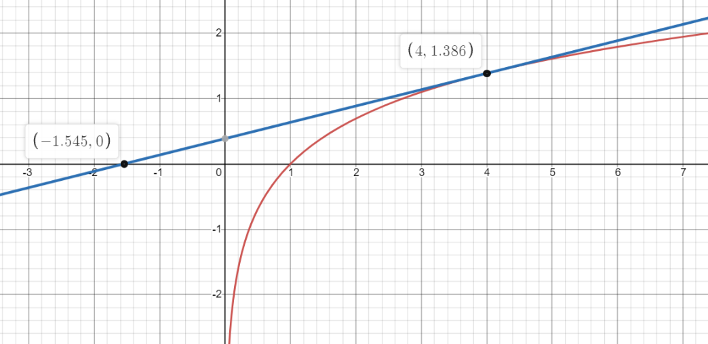

# 1 位运算


## 1.1 基本使用


| 操作 | 运算|
|:---|--:|
|取出整数 n 在二进制表示下的第 k 位格1 | (n >> k) & 1|
|取出整数 n 在二进制表示下的第 0 ~ k-1 位 (后 k 位)格3 | n & ((1 << k) - 1)|
|把整数 n 在二进制表示下的第 k 位取反	| n ^ (1 << k) |
|对整数 n 在二进制表示下的第 k 位赋值 1	 | n I (1 << k)   |
|对整数 n 在二进制表示下的第 k 位赋值 0	|   n & (~(1 << k))  |


## 1.2 应用

位运算一般有三种作用：

- 高效地进行某些运算，代替其它低效的方式。
- 表示集合（常用于 状压 DP 与子集枚举）
- 题目本来就要求进行位运算。


**二进制子集枚举**
```c++  
int s = k;
do {
    s = (s - 1) & k;
} while(s != k);
```
`while(..)`中 `-1（int)` 的二进制表示`111...111`，`-1 & mask = mask`,则此时结束。
比如`k = 10101`的二进制子集有:
```c++  
10101
10100
10001
10000
00101
00100
00001
00000
```

或者for
```c++  
// 遍历 u 的非空子集
for (int s = k; s; s = (s - 1) & k)
{
  // s 是 u 的一个非空子集
}
```
时间复杂度：O(2^popcount(u))

而遍历一个集合所有子集的子集，时间复杂度为 O(3n) （每个元素只有三中状态）


**计算二进制中1的个数**
`int x, res = 0 ;   while(x) x-=lowbit(x),res++;`
或者
`int x, res = 0 ;   while(x) x-= x&(-x),res++;`

其中`-x = ~x + 1`
(注意：`~x `将所有位取反 后 + 1， 类似于负数的存储。 而 
`i ^ (1 << j))` 是将i的第j位取反)

或者使用`__builtin_popcount(int x)`


**注意区分以上两种问题**
- 二进制子集枚举 是 其中1的排列组合，组合种类数  为 `m = 2 ^ n`, n 为二进制中 1 的个数
- 计算二进制中 1 的个数，用`x -= lowbit(x)` 算法可实现一步去掉一个最低位的1 (其中`lowbit(x) = x & - x`, 用来 求最后一个1及后面的0组成的数)


>需要注意的是，用位运算代替其它运算方式（即第一种应用）在很多时候并不能带来太大的优化，反而会使代码变得复杂，使用时需要斟酌。（但像“乘 2 的非负整数次幂n << m;”和“除以 2 的非负整数次幂n >> m;”就最好使用位运算，因为此时使用位运算可以优化复杂度。）


**判断：**
**是不是2的非负整数次幂**

*二进制表示中只有一位 1*

```c++  
bool isPowerOfTwo(int n)
{
    return n > 0 && (n & (n - 1)) == 0;
}
```
**是不是4的非负整数次幂**


### 异或
**成对变换**
⊕ 即 ^
n 为奇数时，n⊕1=n−1
n 为偶数时，n⊕1=n+1
因此，“0与1”、“2与3”、“4与5”、... 关于 ⊕ 是成对变换的

常用于 图论 中，无向图 用 链式前向星 存图时，找 反向边

- 找缺失数
- 找出现一次的数

性质：
$$x \oplus x = 0 和 x \oplus 0 = x $$

[E-LC-丢失的数字](https://leetcode-cn.com/problems/missing-number/)
```c++
// 从给定一个包含 [0, n] 中 n 个数的数组 nums 
// 找出 [0, n] 这个范围内没有出现在数组中的那个数。
// 1. 排序后位置对应
// 2. 哈希
// 要求 时间O(n),空间O(1)
// 3. 求和
    int missingNumber(vector<int>& nums) {
        int n = nums.size();
        long sum  = n*(n+1)/2;
        for(auto a:nums){
          sum-=a;
        }
        return sum;
    }
// 3. 异或
 int missingNumber(vector<int>& nums) {
        int res = 0;
        int n = nums.size();
        for (int i = 0; i < n; i++) {
            res ^= nums[i];
        }
        for (int i = 0; i <= n; i++) {
            res ^= i;
        }
        return res;
    }
```
[E-LC-只出现一次的数字](https://leetcode-cn.com/problems/single-number/)
```c++
// 给定一个非空整数数组，除了某个元素只出现一次以外
// 其余每个元素均出现两次。找出那个只出现了一次的元素。
// demo
// 输入: [4,1,2,1,2]
// 输出: 4
    int singleNumber(vector<int>& nums) {
        int res=0;
        for(const int& n:nums) res^=n;
        return res;
    }
```

[M-LC只出现一次的数字 II](https://leetcode-cn.com/problems/single-number-ii/)
**重要思想：**
- 所有的数都看成0/1串，计算每一位上0/1的个数
- 困难级解法 [官方解答-含数字电路法](https://leetcode-cn.com/problems/single-number-ii/solution/zhi-chu-xian-yi-ci-de-shu-zi-ii-by-leetc-23t6/)


```c++
// 给你一个整数数组 nums ，除某个元素仅出现 一次 外，
// 其余每个元素都恰出现 三次 。请你找出并返回那个只出现了一次的元素。
// demo
// 输入：nums = [0,1,0,1,0,1,99]
// 输出：99

// 1. 按位计算  O(nlgC)，C为元素数据长度即位数32   
int singleNumber(vector<int>& nums) {
        int ans = 0;
        for (int i = 0; i < 32; ++i) {
            int total = 0;
            for (int num: nums) {
                total += ((num >> i) & 1);
            }
            if (total % 3) {
                ans |= (1 << i);
            }
        }
        return ans;
    }

// 2. 数字电路
    int singleNumber(vector<int>& nums) {
        //这一题看榜一大佬的，然后自己写了一遍，推荐大家去看榜一
        //首先，我们要把所有的数据都看成0/1串，既然要求我们剔除重复三次者,我们想：重复三次的数字，其每一位都会重复三次，如果能够将每一位都看成一个新整数，那么将每一位都加起来之后，通过%3就可以去除重复三次的数字，这也是这种题目的本质。 之后如果要剔除所有重复n次的数据，只需要mod n 即可。
        //但是，我们如果把每一位(只有一个bit)看成能累加的整数时，需要的额外空间就很多了
        //但是转念一想，我们只是要求去mod3，那么每一位只需要两个bit就够用了
        //所以榜一大佬用了两个整数 two 和one，two和one的相同位组合在一起可以在每一位都表示0 1 2 3....
        //比如
        //two:0 1 1 0
        //one:0 0 1 0
        //含义就是00 10 11 00
        //即第一位出现的次数是3的整数倍，第二位出现的次数模三余二......
        //那么就很简单了，研究一下位操作 ^是异或 ~是取反 &是且,与0异或不变，与1异或相当于取反，与1 & 不变，
        //one 如何变化？
        //n表示本轮遇到的数据
        //if two = 0则 one等于0 or 1 无论是哪个，如果遇到了n=1，则one要变化，否则不变
        //if two = 1则 one只可能为0， 10 表示 2 ，在加1就是3的整数倍，需要mod3 之后two = 0 one = 0 此时one还是0， 相当于此时one 一定不变
        //所以one等于0 or 1 无论是哪个，如果遇到了n=1，则one要变化，否则不变 即 one =   one ^ n 
        // two==0时应不改变上式，否则结果应回归one则  one ^ n &~two
        // if one = 0 则 two可以为0或者 1，若n=0，two 不变，若n=1则two 变0
        // if one = 1 则 two为0，n=0时肯定不变，n=1时要变，但这里的one是变化之后的one,
        // 所以n=0时遇到的one和现在是反着的，n=1时two等于，这里榜一大佬画出状态图，发现交换one 和two的位置之后，情况是等价的，所以算式与one的同构
        int ones = 0, twos = 0;
        for(int num : nums){
            ones = ones ^ num & ~twos;
            twos = twos ^ num & ~ones;
        }
        return ones;
        }
```

[M-LC只出现一次的数字 III](https://leetcode-cn.com/problems/single-number-iii/)
给定一个整数数组 nums，其中恰好有两个元素只出现一次，其余所有元素均出现两次。 找出只出现一次的那两个元素。你可以按 任意顺序 返回答案。
- 要求：线性时间复杂度。你能否仅使用常数空间复杂度

```c++
// 1.哈希
// 2.异或  O(n)  O(1) 
 // 2.1.假设数组 nums 中只出现一次的元素分别是x1,x2。如果把 nums 中的所有元素全部异或起来，得到结果 x，那么一定有：x= x1^x2
// 2.2 如何还原回x1和x2。必定存在至少一位不同  取不同的最低位，即x中最低位的1所在的位
// 2.3 如此 可把数组元素分为两类 且x1和x2分别处于一个类中。在各自类中异或，即可找到x1和x2原始值

 vector<int> singleNumber(vector<int>& nums) {
        int xorsum = 0;
        for (int num: nums) {
            xorsum ^= num;
        }
        // 防止溢出  
        //INT_MIN = -2147483648,存储为1000 0000 0000 0000,即0x8000 0000 只有一个符号位。
        // 此时INT_MIN的-xorsum = 2147483648不能用int表示了
        // 所以需要判断 或者用long 存储xorsum 
        int lsb = (xorsum == INT_MIN ? xorsum : xorsum & (-xorsum));
        int type1 = 0, type2 = 0;
        for (int num: nums) {
            if (num & lsb) {
                type1 ^= num;
            }
            else {
                type2 ^= num;
            }
        }
        return {type1, type2};
    }
```

### 快速幂

**快速幂**

计算$$x^n mod \ m$$

```c++
// 非递归实现
typedef long long LL;
const int p = *;
LL binpow(LL a, LL b, LL p) {
  LL res = 1;
  while (b > 0) {
    if (b & 1) res = res * a % p ;
    a = a * a % p;
    b >>= 1;
  }
  return res;
}
```


**矩阵快速幂**
[Fibonacci性质](https://oi-wiki.org/math/fibonacci/)

[斐波那契数](https://leetcode-cn.com/problems/fibonacci-number/)

斐波那契数列：
>斐波那契数 （通常用 F(n) 表示）形成的序列称为 斐波那契数列 。该数列由 0 和 1 开始，后面的每一项数字都是前面两项数字的和。也就是：
F(0) = 0，F(1) = 1
F(n) = F(n - 1) + F(n - 2)，其中 n > 1
给定 n ，请计算 F(n) 。


解：

1.递归

2.动态规划 + 滚动数组

```c++  
class Solution {
public:
    int fib(int n) {
        int MOD = 1000000007;
        if (n < 2) {
            return n;
        }
        int p = 0, q = 0, r = 1;
        for (int i = 2; i <= n; ++i) {
            p = q; 
            q = r; 
            r = (p + q)%MOD;
        }
        return r;
    }
};

```

2.公式

```c++  
int fib(int n) {
    double sqrt5 = sqrt(5);
    double fibN = pow((1 + sqrt5) / 2, n) - pow((1 - sqrt5) / 2, n);
    return round(fibN / sqrt5);
}
```
3.矩阵快速幂


```c++  
class Solution {
    static const int mod=1e9+7;
public:
    int fib(int n) {
        if (n < 2) {         //specially
            return n;
        }
        vector<vector<long>> q\{\{1,1},{1,0}};
        vector<vector<long>> res = qPow(q,n-1);
        return res[0][0];
    }
    vector<vector<long>> qPow(vector<vector<long>>& a,int n){
        vector<vector<long>> ret=\{\{1,0},{0,1}};  // 单位矩阵 相当与 1
        while(n>0){
            if(n&1){
                ret=multiply(ret,a);   // 相当于 ret * a
            }
            n>>=1;
            a = multiply(a,a);        // 相当于 a * a
        }
        return ret;
    }
    vector<vector<long>> multiply(vector<vector<long>>&a,vector<vector<long>>& b){
        vector<vector<long>> res\{\{0,0},{0,0}};
        for(int i=0;i<2;i++){
            for(int j=0;j<2;j++){
                res[i][j] = (a[i][0]*b[0][j]+a[i][1]*b[1][j])%mod;
            }
        }
        return res;
    }
};
```


**拓展：**

快速幂 为 用乘法实现幂，
而大数乘法也可以用 加法(O(log(n))) 实现 乘法（O(1)),复杂度提高了，但可避免溢出等

a * b = a + a + a + ... + a 分乘 a + 2 * a + 4 * a + 
对于 b = （11010)_2
a * b = 0*2^0 * a +  1* 2^1*a + 0*2^2*a + 1*2^3*a + 1*2^4*a  = 1* 2^1*a  + 1*2^3*a + 1*2^4*a 

如求 a 乘 b 对 p 取模的值。  `a * b mod p`
1≤a,b,p≤10^18
```c++  
typedef long long LL;
LL qadd(LL a, LL b, LL p)
{
    LL res = 0;   // 注意和 快速幂 区别
    while (b)
    {
        if (b & 1) res = (res + a) % p; // +
        a = (a + a) % p;                // +
        b >>= 1;
    }
    return res;
}
```


[最短哈密顿路径](https://www.acwing.com/problem/content/93/)


解：


```c++  
int f[1 << 20][20];
int hamilton(int n, int weight[20][20])
{
    memset(f, 0x3f, sizeof(f));
    f[1][0] = 0;
    for (int i = 1; i < 1 << n; i ++ )
        for (int j = 0; j < n; j ++ ) 
            if (i >> j & 1)
                for (int k = 0; k < n; k ++ ) 
                    if (i >> k & 1)
                     f[i][j] = min(f[i][j], f[i ^ 1 << j][k] + weight[k][j]);
    return f[(1 << n) - 1][n - 1];
}
```

[起床困难综合症](https://www.acwing.com/problem/content/description/1000/)


*参考：*
[彩铅dalao：位运算](https://www.colopen-blog.com/Algorithm/lydguid/z0x01_%E4%BD%8D%E8%BF%90%E7%AE%97/)

---

# 2 递推与递归


递归与递推区别：
相对于递归算法,递推算法免除了数据**进出栈**的过程，也就是说,不需要函数不断的向边界值靠拢,而直接从边界出发,直到求出函数值。
## 概念
### 递推

递推算法是一种用若干步可重复运算来描述复杂问题的方法。递推是序列计算中的一种常用算法。通常是通过计算机前面的一些项来得出序列中的指定象的值。
 

数学推导 发现规律 重复简单运算

### 递归


从已知问题的结果出发，用迭代表达式逐步推算出问题的开始的条件，即顺推法的逆过程，称为递归。
 

**定义**
在一个函数的定义中又直接或间接地调用本身。


**递归思想：** 
把规模大的、较难解决的问题变成规模较小的、易解决的同一问题。规模较小的问题又变成规模更小的问题，并且小到一定程度可以直接得出它的解，从而得到原来问题的解。
 
**优点：** 
符合人的思维方式，递归程序结构清晰，可读性，容易理解

**缺点：**
通过调用函数实现，当递归层数过多时，程序的效率低。例如求Fibonacii数列的第N (N比较大时) 项

**应用场合：**
1、数据的定义形式是递归的，例如求Fibonacii数列的第n项 。

2、数据之间的逻辑关系（即数据结构）是递归的，如树、图等的定义和操作。

3、某些问题虽然没有明显的递归关系或结构，但问题的解法是不断重复执行一组操作，只是问题规模由大化小，直至某个原操作（基本操作）就结束。例如：汉诺塔问题。

**递归设计的要素：**
1、在函数中必须有直接或间接**调用自身**的语句；

2、在使用递归策略时，必须有一个明确的递归结束条件，称为**递归出口**（或递归边界）。


编写递归算法时，首先要对问题的以下三个方面进行分析：
- 1.决定问题规模的参数。      
需要用递归算法解决的问题，其规模通常都是比较大的，在问题中决定规模大小（或问题复杂程度）的量有哪些？把它们找出来。

- 2.问题的边界条件及边界值。      
在什么情况下可以直接得出问题的解？这就是问题的边界条件及边界值。

- 3.解决问题的通式。      
把规模大的、较难解决的问题变成规模较小、易解决的同一问题，需要通过哪些步骤或公式来实现？这是解决递归问题的难点。把这些步骤或公式确定下来。


### 总结
- 递 推 小 结：
    1. 递推是从已知条件开始；
    2. 递推必须有明确的通用公式；
    3. 递推必须是有限次运算。
- 递 归 小 结：
    1. 递归：未知的推到已知的，再由此返回。
    2. 基本思想：将复杂的操作分解为若干重复的简单操作。


**递归**

[M-对称二叉树](https://leetcode-cn.com/problems/symmetric-tree/)
给定一个二叉树，检查它是否是镜像对称的。ia

例如，二叉树 [1,2,2,3,4,4,3] 是对称的。
    1
   / \
  2   2
 / \ / \
3  4 4  3

但是下面这个 [1,2,2,null,3,null,3] 则不是镜像对称的:
    1
   / \
  2   2
   \   \
   3    3

```c++  

/**
 * Definition for a binary tree node.
 * struct TreeNode {
 *     int val;
 *     TreeNode *left;
 *     TreeNode *right;
 *     TreeNode() : val(0), left(nullptr), right(nullptr) {}
 *     TreeNode(int x) : val(x), left(nullptr), right(nullptr) {}
 *     TreeNode(int x, TreeNode *left, TreeNode *right) : val(x), left(left), right(right) {}
 * };
 */
 // 方法1： 递归
class Solution {
public:
    bool check(TreeNode *p, TreeNode *q) {
        if (!p && !q) return true;
        if (!p || !q) return false;
        return p->val == q->val && check(p->left, q->right) && check(p->right, q->left);
    }

    bool isSymmetric(TreeNode* root) {
        return check(root, root);
    }
};
// 方法2：BFS
bfs + 层序遍历   用size维护上一层多上个元素  把这些的全部子节点按顺序获取，若为空需要进行占位，然后每一层遍历后 判断即可。

```


## 常见问题

### 汉诺塔问题

*三塔到n塔问题*

[]()

>汉诺塔问题，条件如下：
1、这里有 A、B、C 和 D 四座塔。
2、这里有 n 个圆盘，n 的数量是恒定的。
3、每个圆盘的尺寸都不相同。
4、所有的圆盘在开始时都堆叠在塔 A 上，且圆盘尺寸从塔顶到塔底逐渐增大。
5、我们需要将所有的圆盘都从塔 A 转移到塔 D 上。
6、每次可以移动一个圆盘，当塔为空塔或者塔顶圆盘尺寸大于被移动圆盘时，可将圆盘移至这座塔上。
请你求出将所有圆盘从塔 A 移动到塔 D，所需的最小移动次数是多少。

解：先会三塔，再搞四塔。

三柱两盘的情况（刨去初时状态，共移动了3次）

三柱三盘的情况（刨去初时状态，共移动了7次）

综上，我们可以看到，对于n盘3塔问题，移动的最小步数就是，把前n-1个盘子从A柱移到B柱，然后把第n个盘子移到C柱，最后再把前n-1个盘子移动到C柱。可以得出递推式d[n]=d[n−1]∗2+1。

但是本题没有呢么友善，题目要求我们求四塔情况下最小的移动步数，难受死我了，呢就继续画图看看？？
四塔3盘（除去初始状态，共移动5次）

四塔4盘（除去初始状态，共盘他9次）
综上，可得先把i个盘子在四塔的模式下，移动到一根柱子上（不可以是D柱），然后把n-i个盘子，盘到D柱上。考虑到i可能存在最小值。可得递推式f[i]=min1≤i＜n(2∗f[i]+d[n−i]),f[1]=1 。

更一般的：i盘j柱的最小步数：先把上面的k个移动到某根不是j的柱子上，再把剩下的移动到j，最后把之前的k个移动到j。有递推式：
`f[i][j] = min(f[k][j] * 2 + f[i - k][j - 1])`,则知可以进行状态压缩。

```c++  
#include <iostream>
#include <cstring>
#include <algorithm>
using namespace std;

int main()
{
    int n=12;
    int g[20];           // 3 塔
    g[0]=0,g[1]=1;
    for(int i=2;i<=n;i++){
        g[i]=2*g[i-1]+1;
    }
    int f[20];           // 4 塔
    memset(f,0x3f,sizeof f);
    f[1]=1;
    for(int i =2;i<=12;i++){
        for(int j =1;j<=i;j++){    // 先把前j个拿到b/c中的一个上，把i-j放到d上，再把j个拿过来！！！
            f[i]=min(f[i],2*f[j]+g[i-j]);    // 对于不同的j个 的结果 取min
            // 注意不是 f[i]=min(f[i],2*g[j]+g[i-j]);     
            // 其中 的2*g[j]不对，用g[j]结果会偏大。因为没有利用4根柱子
        }
    }
    for(int i=1;i<=12;i++){
        cout << f[i] <<endl;
    }
}
```

### 扔鸡蛋实验

[dmy面试：经典算法面试题：100层楼扔2个鸡蛋](https://zhuanlan.zhihu.com/p/401503400)

有一栋100层的楼，和2个坚硬的鸡蛋，从楼上扔下鸡蛋，鸡蛋会在大于某一层刚好开始碎，那最少几次能测出鸡蛋能承受的最大楼层呢？
如果从第50层扔下鸡蛋没碎，第51层扔下碎了，那鸡蛋能承受的最大楼层就是50。

注意：你手上只有2个鸡蛋，如果扔下碎了，就没法再使用了。

1.若题目只是给足够鸡蛋，问至少需要多少次 或 多少个？

多少次可以用二分或倍增。多少个...

2.针对该题

...详情见上述文章。

3 推广：N层楼，M个蛋
为描述方便，设f[i][j]表示i层楼，j个鸡蛋最小要测试的次数。
从第k层扔下

碎，`f[i][j]=f[k-1][j-1]+1`
不碎，`f[i][j]=f[i-k][j]+1`
则`f[i][j]=min(max(f[k-1][j-1],f[i-k][j])+1),1<= k <=i`

### 约瑟夫问题


**引入：**

约瑟夫环问题是一个很经典的问题：一个圈共有N个人（N为不确定的数字），第一个人的编号为0或者1（两个都可以，看你的程序如何编写），假设这边我将第一个人的编号设置为1号，那么第二个人的编号就为2号，第三个人的编号就为3号，第N个人的编号就为N号，现在提供一个数字M，第一个人开始从1报数，第二个人报的数就是2，依次类推，报到M这个数字的人出局，紧接着从出局的这个人的下一个人重新开始从1报数，和上面过程类似，报到M的人出局，直到N个人全部出局，请问，这个出局的顺序是什么？

举一个简单的例子：假设现在N的值为10，代表有10个人，M的值为3，代表报数报到3的人出局，那么出局的顺序就为：3 6 9 2 7 1 8 5 10 4


分析：

如上图所示，圈内矩形格子中的数字代表每个人的编号，从1开始编号到10。圈外半椭圆中的数字代表10个人的出局顺序。

注意：已经出局的人无需报数，报数的都是未出局的人。

>从第一个人开始报数，报到3的人出局，因此，第一个出局的人为3号，3号出局之后，要从出局的这个人（3号）的下一个未出局的人（4号）重新开始从1开始报数，所以4号从1开始继续报数，那么，第二个出局的人就是6号，6号出局之后，要从出局的这个人（6号）的下一个未出局的人（7号）重新开始从1开始报数，所以7号从1开始继续报数，那么，第三个出局的人就是9号，9号出局之后，要从出局的这个人（9号）的下一个未出局的人（10号）重新开始从1开始报数，所以10号从1开始继续报数，那么第四个出局的人就是2号（10号报1，1号报2，2号报3，2号出局），2号出局之后，要从出局的这个人（2号）的下一个未出局的人（4号，这边3号已经出局了，不能报数，所以直接跳到4号）重新开始从1开始报数，那么第五个出局的人就是7号，7号出局之后，要从出局的这个人（7号）的下一个未出局的人（8号）重新开始从1开始报数，那么第六个出局的人就是1号，1号出局之后，要从出局的这个人的下一个未出局的人（4号）重新开始从1开始报数，那么第七个出局的人就是8号，8号出局之后，要从出局的这个人（8号）的下一个未出局的人（10号）重新开始从1 开始报数，那么第八个出局的人就是5号，5号出局之后，要从出局的这个人（5号）的下一个未出局的人（10号）重新开始从1开始报数，那么第九个出局的就是10号，10号出局之后，要从出局的这个人（10号）的下一个未出局的人（4号）重新开始从1开始报数，此时，N个人从只剩下4号还未出局，4号自己从1开始报数，自己数到3，那么它也出局了，4号是第十个出局的人。


**求解方式：**
⭕ 数组方式
⭕ 循环链表方式
⭕ 递归方式


```c++  
约瑟夫环递推公式：
    f(1) = 0;     //表示最后一轮的胜出者当前编号是0
    f(x) = (f(x - 1) + m) % x , 1 < x <= n //每一轮都找到胜出者在上一轮中的编号
    不过本题里m是在变化的，所以要相应地变为：
==> f(x) = (f(x - 1) + a[(n - x) % m]) % x, 1 < x <= n

参考：[负雪明烛](https://zhuanlan.zhihu.com/p/121159246)
class Solution {
public:
    int findTheWinner(int n, int k) {
        int pos = 0;  // 计算从0开始 根据需要，在return更正
        for (int i = 2; i < n + 1; ++i) { // 逐步还原到 2到n个人时 胜出者所处 的位置
            pos = (pos + k) % i;
        }
        return pos + 1;   // 如果下标从0开始，就是pos，否则pos+1
    }
};


```


[圆圈中最后剩下的数字](https://leetcode-cn.com/problems/yuan-quan-zhong-zui-hou-sheng-xia-de-shu-zi-lcof/)


>0,1,···,n-1这n个数字排成一个圆圈，从数字0开始，每次从这个圆圈里删除第m个数字（删除后从下一个数字开始计数）。求出这个圆圈里剩下的最后一个数字。
例如，0、1、2、3、4这5个数字组成一个圆圈，从数字0开始每次删除第3个数字，则删除的前4个数字依次是2、0、4、1，因此最后剩下的数字是3。
示例 1：
输入: n = 5, m = 3
输出: 3
示例 2：
输入: n = 10, m = 17
输出: 2


- 递归
```c++  
class Solution {
    int f(int n, int m) {
        if (n == 1) {
            return 0;
        }
        int x = f(n - 1, m);
        return (m + x) % n;
    }
public:
    int lastRemaining(int n, int m) {
        return f(n, m);
    }
};

```

- 数学+迭代

```c++  
class Solution {
public:
    int lastRemaining(int n, int m) {
        int f = 0;
        // 最后一轮剩下2个人，所以从2开始反推
        for (int i = 2; i != n + 1; ++i) {
            f = (m + f) % i;
        }
        return f;
    }
};

```


[招聘](https://www.acwing.com/problem/content/description/1457/)
某公司招聘，有 n 个人入围，HR在黑板上依次写下 m 个正整数 A1,A2,…Am，然后这 n 个人围成一个圈，并按照顺时针顺序为他们编号 0,1,2,…n−1。
录取规则是：
第一轮从 0 号的人开始，取用黑板上的第 1 个数字，也就是 A1。
黑板上的数字按次序循环使用，即如果某轮用了第 k 个，如果 k<m，则下一轮需要用第 k+1 个；如果 k=m，则下一轮用第 1 个。
每一轮按照黑板上的次序取用到一个数字 Ax，淘汰掉从当前轮到的人开始按照顺时针顺序数到的第 Ax 个人。
下一轮开始时轮到的人即为被淘汰掉的人的顺时针顺序下一个人，被淘汰的人直接回家，所以不会被后续轮次计数时数到。
经过 n−1 轮后，剩下的最后 1 人被录取，所以最后被录取的人的编号与 (n,m,A1,A2,…Am) 相关。
输入格式
输入包含多组测试数据。
第一行包含整数 T，表示共有 T 组测试数据。
接下来 T 行，每行包含若干个整数，依次存放 n,m,A1,A2,…Am，表示一组数据。
输出格式
输出共 T 行，每行对应相应的那组数据确定的录取之人的编号。
数据范围
0<T<10,
0<m,Ax<103,
0<n<107
输入样例：
1
4 2 3 1
输出样例：
1
样例解释
样例里只有 1 组测试数据，说的是有 4 人入围（编号 0∼3）。
黑板上依次写下 2 个数字：3、1，那么：
第一轮：当前轮到 0 号，数到数字 3，顺时针数第 3 个人是 2 号，所以淘汰 2 号，下一轮从 3 号开始，目前剩余：0、1、3；
第二轮：当前数到 3 号，取到数字 1，顺时针数第 1 个人是 3 号，所以淘汰 3 号，下一轮从 0 号开始，目前剩余：0、1；
第三轮：当前轮到 0 号，循环取到数字 3，顺时针数第 3 个人是 0 号，所以淘汰 0 号，最后只剩下 1 号，所以录取 1 号，输出 1；


```c++  
#include <iostream>
using namespace std;

const int N = 1e3 + 10;
int a[N];

/*
约瑟夫环递推公式：
    f(1) = 0;     //表示最后一轮的胜出者当前编号是0
    f(x) = (f(x - 1) + m) % x , 1 < x <= n //每一轮都找到胜出者在上一轮中的编号
    不过本题里m是在变化的，所以要相应地变为：
==> f(x) = (f(x - 1) + a[(n - x) % m]) % x, 1 < x <= n
*/

int main()
{
    int T;
    cin >> T;
    while(T --){
        int n, m;
        cin >> n >> m;
        for(int i = 0; i < m; ++ i) scanf("%d", &a[i]);

        int ret = 0;
        for(int i = 2; i <= n; ++ i){
            ret = (ret + a[(n - i) % m]) % i;  // i是人数
        }
        cout << ret << endl;
    }
    return 0;
}
```


---


# 3 前缀和与差分

**要理解前缀和 与 差分的互逆操作** ，否则很难理解由差分数组还原出原数组，尤其是二维。

注意：for $a[i],i=0:n-1$ ， $S[i]$计算时要不要包括$a[i]$

## 前缀和
### 一维：
假设有一个数组：a1，a2，a3，a4，a5，…，an（注意，下标从1开始）

前缀和 Si = a1 + a2 + a3 + … + ai （即前i个数的和）

显然的，前缀和满足 Si = Si-1 + ai ，特殊的，我们可以定义S0 = 0，这样，任何区间[l, r]，我们都可以用 Sr - Sl-1 这样的公式来计算，而不需要对边界进行特殊处理（当l = 1时，求[l, r]的所有数的和，其实就是求 Sr）。

前缀和的最大作用，就是用来求任意一段区间的所有数的和。比如，要求区间[l, r]的全部元素的和。若没有前缀和数组，则我们需要遍历原数组，时间复杂度为O(n)。若有前缀和数组，我们只需要计算 Sr - Sl-1，时间复杂度为O(1)。
因为 Sr = a1 + a2 + a3 + … + al-1 + al + … + ar

而 Sl-1 = a1 + a2 + a3 + … + al-1

```c++  
S[i] = a[1] + a[2] + ... a[i]
a[l] + ... + a[r] = S[r] - S[l - 1]
```

Si 表示前i个(包括第i个元素)的和。不管ai的i从0开始还是从1.
如果ai的i从0开始则,

```c++
for(int i = 0; i < n; ++ i){
    S[i + 1] = S[i] + a[i];
}
```

如果ai的i从1开始则,

```c++
for(int i = 1; i <= n; ++ i){
    S[i] = S[i - 1] + a[i];
}
```

### 二维：

假设有如下的矩阵

a11 ，a12，a13，a14，…，a1n

a21，a22，a23，a24，…， a2n

…

…

am1，am2，am3，am4，…，amn

前缀和 Sij 表示点 aij 及其左上角区域的所有数的和。

经过简单推导（面积计算），可以得到 Sij = Si-1,j + Si,j-1 + aij - Si-1,j-1

若要计算左上角边界点为[x1, y1]，右下角点为[x2, y2]，这2个点之间部分的子矩阵的和（也是求任意一段区间内所有数的和），经过简单推导，能够得到下面的公式

S = Sx2,y2 - Sx1-1,y2 - Sx2,y1-1 + Sx1-1,y1-1（由于矩阵中是离散的点，所以计算时边界需要减掉1）
即

```c++  
S[i, j] = 第i行j列格子左上部分所有元素的和
以(x1, y1)为左上角，(x2, y2)为右下角的子矩阵的和为：
S[x2, y2] - S[x1 - 1, y2] - S[x2, y1 - 1] + S[x1 - 1, y1 - 1]
```

综合
```c++  
// 由a求S
S[i][j] = S[i - 1][j] + S[i][j - 1] - S[i - 1][j - 1] + a[i][j]
// 由S求区间和
sum[(x1,y1),(x2,y2)] = S[x2][y2] - S[x1 - 1, y2] - S[x2, y1 - 1] + S[x1 - 1][y1 - 1]

```

**注意体会与差分的关系**
## 差分

差分，是前缀和的逆运算

技巧：
1. 最后数组从i=1开始存
2. 求取差分时，可以利用原数组直接求。

```c++  
// a为原数组 ，b为差分
// 对于 一维
void insert(int b[],int l,int r,int c)
{
  b[l]+=c;
  b[r+1]-=c;
}
  // 使用
    // 批量处理区间[l,r]  
    insert(b,l,r,c);  // c为增量
    // 对于单个元素  
    insert(b,i,i,a[i]); //     
// 对于 二维
    void insert(int b[][N],int x1,int y1,int x2,int y2,int c)
    {
    b[x1][y1]+=c;
    b[x2+1][y1]-=c;
    b[x1][y2+1]-=c;
    b[x2+1][y2+1]+=c;
    }
  // 使用
    // 批量处理区间[(x1,y1)...(x2,y2)]  
    insert(b,x1,y1,x2,y2,c);  // c为增量
    // 对于单个元素  
    insert(b,i,j,i,j,a[i][j]); // 

```

### 一维差分
假设有一个数组，a1，a2，a3，a4，a5，…，an

针对这个数组，构造出另一个数组，b1，b2，b3，b4，b5，…，bn

使得a数组是b数组的前缀和，即使得 ai = b1 + b2 + … + bi

此时，称b数组为a数组的差分

如何构造b数组呢：

b1 = a1 - 0，b2 = a2 - a1，b3 = a3 - a2，…，bn = an - an-1

实际可以不用如此来构造，在输入数组a时，可以先假想数组a和数组b的全部元素都是0。然后每次进行一次插入操作（指的是对数组a的[l, r]区间的每个数加上常数C），比如

对a数组区间[1,1]，加（插入）常数a1；对区间[2,2]，加常数a2，…，这样在输入数组a的同时，就能够快速构造出其差分数组b


**差分的作用：**

若要对a数组中[l, r]区间内的全部元素都加上一个常数C，若直接操作a数组的话，时间复杂度是O(n)。而如果操作其差分数组b，则时间复杂度是O(1)。这是因为，数组a是数组b的前缀和数组，只要对 bl 这个元素加C，则a数组从l位置之后的全部数都会被加上C，但r位置之后的所有数也都加了C，所以我们通过对 br+1 这个数减去C，来保持a数组中r位置以后的数的值不变。

于是，对a数组的[l, r]区间内的所有数都加上一个常数C，就可以转变为对 bl 加C，对br+1 减 C。


### 二维差分
即差分矩阵 [Article:差分矩阵](https://www.acwing.com/solution/content/27325/)

对于矩阵a，存在如下一个矩阵b

b11 ，b12，b13，b14，…，b1n

b21，b22，b23，b24，…， b2n

…
给区间[l, r]中的每个数加上c：B[l] += c, B[r + 1] -= c
…

bm1，bm2，bm3，bm4，…，bmn

使得aij = 矩阵b中[i, j]位置的左上角的所有数的和

称矩阵b为矩阵a的差分矩阵。

同样的，如果期望对矩阵a中左上角为[x1, y1]，右下角为[x2, y2]的区域内的全部元素，都加一个常数C，则可以转化为对其差分矩阵b的操作。

先对b中[x1, y1]位置上的元素加C，这样以来，a中[x1, y1]这个点的右下角区域内的所有数都加上了C，但是这样就对[x2, y2]之后的区域也都加了C。我们对[x2, y2]之外的区域需要保持值不变，所以需要进行减法。对bx2+1,y1 减掉C，这样下图红色区域都被减了C，再对bx1,y2+1减掉C，这样下图蓝色区域都被减了C，而红色区域和蓝色区域有重叠，重叠的区域被减了2次C，所以要再加回一个C，即对bx2+1,y2+1 加上一个C。这样，就完成了对[x1, y1]，[x2, y2]区域内的所有数（下图绿色区域），都加上常数C。

```c++  
给以(x1, y1)为左上角，(x2, y2)为右下角的子矩阵中的所有元素加上c：
S[x1, y1] += c, S[x2 + 1, y1] -= c, S[x1, y2 + 1] -= c, S[x2 + 1, y2 + 1] += c
```

[D-用邮票贴满网格图](https://leetcode-cn.com/problems/stamping-the-grid/)

>给你一个 m x n 的二进制矩阵 grid ，每个格子要么为 0 （空）要么为 1 （被占据）。
给你邮票的尺寸为 stampHeight x stampWidth 。我们想将邮票贴进二进制矩阵中，且满足以下 限制 和 要求 ：
覆盖所有 空 格子。
不覆盖任何 被占据 的格子。
我们可以放入任意数目的邮票。
邮票可以相互有 重叠 部分。
邮票不允许 旋转 。
邮票必须完全在矩阵 内 。
如果在满足上述要求的前提下，可以放入邮票，请返回 true ，否则返回 false 。

示例 1：
| ×  | 1| 1| 1|
|:---|--:|:--:|--|
|×  | 1 2 |1 2 |1 2 |
| ×|  1 2| 1 2| 1 2|
| × |1 2  |1 2 |1 2 |
| × |2  | 2|2 |
输入：grid = [ [1,0,0,0],[1,0,0,0],[1,0,0,0],[1,0,0,0],[1,0,0,0] ], stampHeight = 4, stampWidth = 3

输出：true
解释：我们放入两个有重叠部分的邮票（图中标号为 1 和 2），它们能覆盖所有与空格子。
示例 2：
| ×  |  | | |
|:---|--:|:--:|--|
|  | × | | |
| |  |× | |
|  |  | |× |
输入：grid = [ [1,0,0,0],[0,1,0,0],[0,0,1,0],[0,0,0,1] ], stampHeight = 2, stampWidth = 2 
输出：false 
解释：没办法放入邮票覆盖所有的空格子，且邮票不超出网格图以外。

```c++  
class Solution {
public:
    int get(int x1, int y1, int x2, int y2, vector<vector<int>> &s){
        return s[x2][y2] - s[x1 - 1][y2] - s[x2][y1 - 1] + s[x1 - 1][y1 - 1];           // 二维区间和  模板！！
    }
    
    void insert(int x1, int y1, int x2, int y2, vector<vector<int>> &b)              // 二维差分  模板！！
    {
        b[x1][y1] += 1;
        b[x2 + 1][y1] -= 1;
        b[x1][y2 + 1] -= 1;
        b[x2 + 1][y2 + 1] += 1;
    }
    
    bool possibleToStamp(vector<vector<int>>& grid, int r, int c) {
        int n = grid.size();
        int m = grid[0].size();
        bool ok = true;
        for(int i = 0; i < n; i ++ )
            for(int j = 0; j < m; j ++ )
                if(grid[i][j] == 0) ok = false;
        if(ok) return true;
        if(r > n || c > m) return false;
        vector<vector<int> > s(n + 10, vector<int>(m + 10));
        vector<vector<int> > d(n + 10, vector<int>(m + 10));
        vector<vector<int> > a(n + 10, vector<int>(m + 10));
        for(int i = 0; i < n; i ++ ){
            for(int j = 0; j < m; j ++ ){
                s[i + 1][j + 1] = a[i + 1][j + 1] = grid[i][j];     //妙啊 连续赋值
            }
        }
        for(int i = 1; i <= n; i ++ ){
            for(int j = 1; j <= m; j ++ ){
                s[i][j] += s[i - 1][j] + s[i][j - 1] - s[i - 1][j - 1];
            }
        }
        for(int i = 1; i <= n; i ++ ){
            for(int j = 1; j <= m; j ++ ){
                if(a[i][j] == 1) continue;
                if(i + r - 1 > n) continue;
                if(j + c - 1 > m) continue;                      
                if(get(i, j, i + r - 1, j + c - 1, s) != 0) continue;
                insert(i, j, i + r - 1, j + c - 1, d);    // 并不真正的加上去 ，否则影响继续判断啊   
            }
        }
        for (int i = 1; i <= n; i ++ )
            for (int j = 1; j <= m; j ++ )
                d[i][j] += d[i - 1][j] + d[i][j - 1] - d[i - 1][j - 1];     // 只在最后进行填充，用于最后 的判断
        for(int i = 1; i <= n; i ++ ){
            for(int j = 1;  j <= m; j ++ ){
                if(a[i][j] == 0 && d[i][j] == 0) return false; //初始状态为0，d也为0则最终还是0，则不能填充该位置
            }
        }
        return true;
    }
};
```


[ac最佳牛围栏](https://www.acwing.com/problem/content/description/104/)
农夫约翰的农场由 N 块田地组成，每块地里都有一定数量的牛，其数量不会少于 1 头，也不会超过 2000 头。
约翰希望用围栏将一部分连续的田地围起来，并使得围起来的区域内每块地包含的牛的数量的平均值达到最大。
围起区域内至少需要包含 F 块地，其中 F 会在输入中给出。
在给定条件下，计算围起区域内每块地包含的牛的数量的平均值可能的最大值是多少。
输入格式
第一行输入整数 N 和 F，数据间用空格隔开。
接下来 N 行，每行输入一个整数，第 i+1 行输入的整数代表第 i 片区域内包含的牛的数目。
输出格式
输出一个整数，表示平均值的最大值乘以 1000 再 向下取整 之后得到的结果。

* **1.最值问题转化为二分判定问题**
    注意当二分端点为double类型时，注意精度问题
* **2.不定长部分序列和优化** $$O(n^2)$$-> $$O(n)$$


- 思路： 实数二分+前缀和+双指针
```c++
// check: 判断一个正数数组中是否存在一个长度大于m的连续子序列和的平均值大于等于avg
bool check(double avg) {
    for (int i = 1; i <= n; i++) {
        sum[i] = sum[i - 1] + cows[i] - avg;
    }

    double minv = 0;
    for (int i = 0, j = m; j <= n; j++, i++) { //  二重循环：1.起点/终点  2.长度..
           minv = std::min(minv, sum[i]);        // 双指针 优化 太妙了 使得长度于m
           if(sum[j] - minv >= 0) return true;
    } return false;
}
```

[D-向下取整数对和](https://leetcode-cn.com/problems/sum-of-floored-pairs/)

-给你一个整数数组 nums ，请你返回所有下标对 0 <= i, j < nums.length 的 floor(nums[i] / nums[j]) 结果之和。由于答案可能会很大，请你返回答案对109 + 7 取余 的结果。

函数 floor() 返回输入数字的整数部分。
- 示例 ：

输入：nums = [2,5,9]
输出：10
解释：
floor(2 / 5) = floor(2 / 9) = floor(5 / 9) = 0
floor(2 / 2) = floor(5 / 5) = floor(9 / 9) = 1
floor(5 / 2) = 2
floor(9 / 2) = 4
floor(9 / 5) = 1
我们计算每一个数对商向下取整的结果并求和得到 10 。


```c++  
class Solution {
public:
    int sumOfFlooredPairs(vector<int>& nums) {
        vector<long long> arr(200010, 0);
        vector<long long> sum(200010, 0);
        int maxV = 0;
        long long ret = 0;
        for(auto it: nums){
            maxV = max(maxV, it);
            arr[it] ++;
        }
        for(int i = 1; i <= maxV * 2; ++i){
            sum[i] = sum[i - 1] + arr[i];
        }
        for(int i = 1; i <= maxV; ++i){
            if(arr[i] > 0){
                for(long long j = 1; j * i <= maxV; ++j){
                    // 后面那部分意义是：数字i的出现次数 乘以 整数部分j 乘以 （数组中除以i的整数部分是j的数字的数量）
                    ret = (ret + (sum[(j + 1) * i - 1] - sum[j * i - 1]) * j * arr[i]) % 1000000007;
                }
            }      
        }
        return ret;
    }
};
```


[增减序列](https://www.acwing.com/problem/content/description/102/)
>给定一个长度为 n 的数列 a1,a2,…,an，每次可以选择一个区间 [l,r]，使下标在这个区间内的数都加一或者都减一。
求至少需要多少次操作才能使数列中的所有数都一样，并求出在保证最少次数的前提下，最终得到的数列可能有多少种。
输入格式
第一行输入正整数 n。
接下来 n 行，每行输入一个整数，第 i+1 行的整数代表 ai。
输出格式
第一行输出最少操作次数。
第二行输出最终能得到多少种结果。
数据范围
0<n≤105,
0≤ai<2147483648
输入样例：
4
1
1
2
2
输出样例：
1
2


**解：贪心+差分**

一维差分

区间修改，联想到用差分数组来维护，最终目标是使差分数组 除首元素外全为 0

每次修改一个区间，对于维护的差分数组变化情况分类：(1<l≤r<n)

1.修改 [l,r] ：b[l] -- , b[r + 1] ++ 或 b[l] ++ , b[r + 1] --
2.修改 [1,r] ：b[1] -- , b[r + 1] ++ 或 b[1] ++ , b[r + 1] --
3.修改 [l,n] ：b[l] -- 或 b[l] ++
4.修改 [1,n] ：b[1] -- 或 b[1] ++ （多余操作）
观察易得:

操作 4 是多余操作（不影响除首元素外元素值，相当于浪费一次操作，必然不是最优解）
操作 2 和操作 3 一次只能改变 1 个元素的值，操作 1 一次可以改变 2 个元素的值
操作 2 会改变首元素的值
为了让操作次数尽可能少，应尽可能使用操作 1

因此不妨设 
b2,...,bn 中正数总和为 p，
b2,...,bn 中负数总和为 q

然后让正负数配对，尽量执行操作 1，执行次数为 min(p,q)

剩余 |p−q| 个要么全是正数，要么全是负数，调用操作 2 或操作 3 都可，执行次数为 |p−q| 次，即共操作min(p,q)+abs(p-q) = max(p,q)次

由于每次调用操作 2 时会改变一次首元素的值，因此首元素的可能值就有 |p−q|+1 种可能

因此最终答案为：max(p,q) 和 | p - q| + 1


```c++  
#include <bits/stdc++.h>
using namespace std;
#define ll long long
#define N 110000
ll n,m,i,j,p,q,a[N];
int main()
{
    scanf("%lld",&n);
    for (i=1;i<=n;i++)
        scanf("%lld",&a[i]);
    for (i=2;i<=n;i++)
    {
        ll c=a[i]-a[i-1];
        if (c>0)//不要输入 if (c) 因为c是指不为0就好了,如果c为-1,那么最后的布尔值也为1,if(c)的意思是,只要c不为0,那么条件的布尔值都为1
            p+=c;
        else
            q-=c;
    }
    ll ans1=max(p,q),ans2=abs(p-q)+1;
    cout<<ans1<<endl<<ans2;
    return 0;
}

```


[最高的牛](https://www.acwing.com/problem/content/103/)

>有 N 头牛站成一行，被编队为 1、2、3…N，每头牛的身高都为整数。
当且仅当两头牛中间的牛身高都比它们矮时，两头牛方可看到对方。
现在，我们只知道其中最高的牛是第 P 头，它的身高是 H ，剩余牛的身高未知。
但是，我们还知道这群牛之中存在着 M 对关系，每对关系都指明了某两头牛 A 和 B 可以相互看见。
求每头牛的身高的最大可能值是多少。
输入格式
第一行输入整数 N,P,H,M，数据用空格隔开。
接下来 M 行，每行输出两个整数 A 和 B ，代表牛 A 和牛 B 可以相互看见，数据用空格隔开。
输出格式
一共输出 N 行数据，每行输出一个整数。
第 i 行输出的整数代表第 i 头牛可能的最大身高。
数据范围
1≤N≤10000,
1≤H≤1000000,
1≤A,B≤10000,
0≤M≤10000
输入样例：
9 3 5 5
1 3
5 3
4 3
3 7
9 8
输出样例：
5
4
5
3
4
4
5
5
5
注意：
此题中给出的关系对可能存在重复


**解：**
我们希望每对牛之间可以相互看见，并且每头牛的高度最高
一开始不妨假设所有牛的高度都是给出的最高牛的高度
要使第 A 头牛与第 B 头牛可以互相看见，那么只需让区间 [A+1,B−1] 的牛高度减少 1 即可
可以直接用差分序列来维护原序列，则每次修改操作为：b[x + 1] -- , b[y] ++

差分+区间处理小操作
这道题目一个核心要点，就是如何处理这些特殊的关系，也就是两头牛互相看见。
其实题目中已经告诉我们如何处理，因为我们发现，题目中要求牛的身高最高，那么既然如此，我们完全可以将每一组关系(A,B)，看作[A+1,B−1] 这组牛身高只比A,B这两头牛矮1.
各位可以画一个图，来更好的理解这道题目。


因此我们可以可以利用区间处理小操作，也就是前缀和加差分。设一个数组D，D[i]为比最高牛矮多少，则D[P]=0，那么对于一组关系，我们可以这样操作,D[A+1]–,D[B]++;然后从左到右前缀和，就可以求出矮多少。具体可以看代码实现。
本题数据内部可能重复，要判重，还有[l,r]不一定l<r


```c++  
const int N = 10010;       // 不加常量const 不能用height[N] 
int height[N];

int main(){
    int n,p,h,m;
    cin >> n>>p>>h>>m;
    height[1]=h;          //  height[p]=h;     最高为h  可给第一头牛 作为基准，使所有的牛此时的高度都为h？？？！！！此时Height还是不高度  是差值     
    set<pair<int,int>> st;
    for (int i = 0,a,b; i < m; i ++ ){
      cin>> a>>b;
      if(a>b) swap(a,b);
      if(!st.count({a,b})){       //  避免重复的ab对  导致重复的--或++
        st.insert({a,b});
        height[a+1]--,height[b]++;
      }
    }
    for(int i=1;i<=n;i++){
      height[i]+=height[i-1];
      cout << height[i] <<endl;
    }
  
    return 0;
}
```


[花期内花的数目](https://leetcode-cn.com/problems/number-of-flowers-in-full-bloom/)

>给你一个下标从 0 开始的二维整数数组 flowers ，其中 flowers[i] = [starti, endi] 表示第 i 朵花的 花期 从 starti 到 endi （都 包含）。同时给你一个下标从 0 开始大小为 n 的整数数组 persons ，persons[i] 是第 i 个人来看花的时间。
请你返回一个大小为 n 的整数数组 answer ，其中 answer[i]是第 i 个人到达时在花期内花的 数目 。
提示：
1 <= flowers.length <= 5 * 104
flowers[i].length == 2
1 <= starti <= endi <= 109
1 <= persons.length <= 5 * 104
1 <= persons[i] <= 109

解：

- 排序？？

经典问题之求一个点被几个区间覆盖。把 flowers[i] 分成两个点：(flowers[i][0], -INF) 表示花期的开始，(flowers[i][1], INF) 表示花期的结束。每个询问也看成一个点 (persons[i], i)。

把所有点排序，维护变量 now，遇到花期开始则 now++，花期结束则 now--，询问则答案就是当前的 now 值。复杂度 \mathcal{O}(n\log n)O(nlogn)。


```c++  
class Solution {
    typedef pair<int, int> PII;
    const int INF = 1e9;

public:
    vector<int> fullBloomFlowers(vector<vector<int>>& flowers, vector<int>& persons) {
        vector<PII> vec;
        for (auto &f : flowers) vec.push_back(PII(f[0], -INF)), vec.push_back(PII(f[1], INF));
        for (int i = 0; i < persons.size(); i++) vec.push_back(PII(persons[i], i));
        sort(vec.begin(), vec.end());

        vector<int> ans(persons.size());
        int now = 0;
        for (PII p : vec) {
            if (p.second == -INF) now++;
            else if (p.second == INF) now--;
            else ans[p.second] = now;
        }
        return ans;
    }
};
```

- 哈希+差分

用变化量表示一段区间上的更新，即在时间点starti  变化量增加了 1，在时间点 endi +1 变化量减少了 1（类比导数的概念）。

遍历flowers，统计这些区间端点产生的变化量，记录在有序集合diff 中。

然后从小到大遍历diff，累加变化量（类比积分的概念）。第 i 个人到达时，花的数目即为不超过 personi 时间点的变化量的累加值。

为了快速计算每个人的答案，我们需要将 person 从小到大排序，这样可以在遍历 person 的同时从小到大遍历 diff。

```c++  
class Solution {
public:
    vector<int> fullBloomFlowers(vector<vector<int>> &flowers, vector<int> &persons) {
        map<int, int> diff;
        for (auto &f : flowers) {
            ++diff[f[0]];
            --diff[f[1] + 1];
        }

        int n = persons.size();
        vector<int> id(n);
        iota(id.begin(), id.end(), 0);
        sort(id.begin(), id.end(), [&](int i, int j) { return persons[i] < persons[j]; });

        vector<int> ans(n);
        auto it = diff.begin();
        int sum = 0;
        for (int i : id) {
            while (it != diff.end() && it->first <= persons[i])
                sum += it++->second; // 累加变化量
            ans[i] = sum;
        }
        return ans;
    }
};
```

```python 
class Solution:
    def fullBloomFlowers(self, flowers: List[List[int]], persons: List[int]) -> List[int]:
      diff = defaultdict(int)
      for st, ed in flowers:
        diff[st] += 1
        diff[ed + 1] -= 1
      times = sorted(diff.keys())

      n = len(persons)
      ans = [0] * n
      i = sum = 0
      for p, id in sorted(zip(persons, range(n))):
        while i < len(times) and times[i] <= p:
          sum += diff[times[i]]
          i += 1
        ans[id] = sum
      return ans
```


- 离散化+差分

```c++  
class Solution {
    vector<int> alls;  
    int len;
    int find(int x) {    
        return lower_bound(alls.begin(), alls.begin() + len, x) - alls.begin() + 1;
    }
    
    int b[200010];
    void insert(int b[], int l, int r, int c) {
        b[l] += c;
        b[r + 1] -= c;
    }
public:
    vector<int> fullBloomFlowers(vector<vector<int>>& fl, vector<int>& p) {
    memset(b, 0, sizeof b);

    int n = fl.size(), m = p.size();
    for(int i = 0; i < n; ++ i) {
        alls.push_back(fl[i][0]);
        alls.push_back(fl[i][1]);
    }
    for(int i= 0; i <m; ++ i){
        alls.push_back(p[i]);
    }
    sort(alls.begin(), alls.end());  
    len = unique(alls.begin(), alls.end()) - alls.begin();   
        
    for(int i = 0; i < n; ++ i){
        insert(b, find(fl[i][0]), find(fl[i][1]), 1);
    }
        
    for(int i = 1; i < 200010 ; ++ i) b[i] += b[i - 1];
        
    vector<int> ans;
    for(int i = 0; i < m; ++ i){
        ans.push_back(b[find(p[i])]);
    }
        
    return ans;  
    }
};
```


[1930. 长度为 3 的不同回文子序列](https://leetcode.cn/problems/unique-length-3-palindromic-subsequences/)
>给你一个字符串 s ，返回 s 中 长度为 3 的不同回文子序列 的个数。
即便存在多种方法来构建相同的子序列，但相同的子序列只计数一次。
回文 是正着读和反着读一样的字符串。
子序列 是由原字符串删除其中部分字符（也可以不删除）且不改变剩余字符之间相对顺序形成的一个新字符串。
例如，"ace" 是 "abcde" 的一个子序列。
示例 1：
输入：s = "aabca"
输出：3
解释：长度为 3 的 3 个回文子序列分别是：
- "aba" ("aabca" 的子序列)
- "aaa" ("aabca" 的子序列)
- "aca" ("aabca" 的子序列)
示例 2：
输入：s = "adc"
输出：0
解释："adc" 不存在长度为 3 的回文子序列。
示例 3：
输入：s = "bbcbaba"
输出：4
解释：长度为 3 的 4 个回文子序列分别是：
- "bbb" ("bbcbaba" 的子序列)
- "bcb" ("bbcbaba" 的子序列)
- "bab" ("bbcbaba" 的子序列)
- "aba" ("bbcbaba" 的子序列)
提示：
3 <= s.length <= 105
s 仅由小写英文字母组成

 


代码很优雅!

```c++  
class Solution {
public:
    int countPalindromicSubsequence(string s) {
        int n = s.size();
        int res = 0;
        // 前缀/后缀字符状态数组
        vector<int> pre(n), suf(n);
        for (int i = 0; i < n; ++i) {
            // 前缀 s[0..i-1] 包含的字符种类
            pre[i] = (i ? pre[i-1] : 0) | (1 << (s[i] - 'a'));
        }
        for (int i = n - 1; i >= 0; --i) {
            // 后缀 s[i+1..n-1] 包含的字符种类
            suf[i] = (i != n - 1 ? suf[i+1] : 0) | (1 << (s[i] - 'a'));
        }
        // 每种中间字符的回文子序列状态数组
        vector<int> ans(26);
        for (int i = 1; i < n - 1; ++i) {
            ans[s[i]-'a'] |= (pre[i-1] & suf[i+1]);
        }
        // 更新答案
        for (int i = 0; i < 26; ++i) {
            res += __builtin_popcount(ans[i]);
        }
        return res;
    }
};
```

精炼版：
 

```c++  
class Solution {
public:
    int countPalindromicSubsequence(string s) {
        int n = s.size(), res = 0;
        int pre[n + 2], suf[n + 2]; MST(pre, 0), MST(suf, 0);
        fir(i, 1, n)  pre[i] = pre[i - 1] | (1 << (s[i - 1] - 'a'));
        firr(i, n, 1) suf[i] = suf[i + 1] | (1 << (s[i - 1] - 'a'));
        VI ans(26, 0);
        fir(i, 2, n - 1) ans[s[i - 1] - 'a'] |= (pre[i - 1] & suf[i + 1]);  // [i - 1] - 'a'!
        fir(i, 0, 25) res += __builtin_popcount(ans[i]);
        return res;
    }
};
```


---

# 4 二分

## 4.1 二分法基础


### 整数域  
[模板题 AcWing 789. 数的范围](https://www.acwing.com/blog/content/277/)

整数二分

求最小值用 r = mid 更新，同时mid = l + r >> 1
求最大值用 l = mid 更新, 同时mid = l + r + 1 >> 1

```c++  

// 取 l= mid; 时需要在计算mid时l+r+1 >>1
版本一：  前提check单调？？
右边是check返回为正的区间，最终的结果为右边区间的最左端的值。  即右边比较大的值都满足，找最小的那个值用r = mid更新

bool check(int x) {/* ... */} // 检查x是否满足某种性质
// 区间[l, r]被划分成[l, mid]和[mid + 1, r]时使用：
while(l<r)         // 退出时 一定有 l=r
{
	  int mid = (l+r)>>1;
	  if(check(mid)) r = mid;
	  else l = mid + 1;
}
return l;

版本二：
左边是check返回为正的区间，最终的结果为左边区间的最右端的值。  即左边比较小的值都满足，找最大的那个值用l = mid更新，同时mid = (l + r + r) >> 1; 
// 区间[l, r]被划分成[l, mid - 1]和[mid, r]时使用：
while(l<r)
{
    int mid = (l+r+1)>>1;
    if(check(mid)) l = mid;
    else r = mid-1;
}
return l;
注意：
mid的值为(l+r+1)>>1 ,必须加一。
因为如果不加一，可能有一种情况，当r = l + 1时，而check（l）刚好为真，之后取中值为mid = l + r >>1,为下取整，mid还为l，之后就会有死循环。
```


### 实数域  
[模板题 AcWing 790. 数的三次方根](https://www.acwing.com/problem/content/792/)

1. 区别于整数二分的while(l < r) 即 l>=r 退出
2. 实数二分的while(r > l + eps),即r-l <=eps时 满足要求精度时退出。即有精度要求或规定迭代次数限制。
3. 同时注意l, r, mid的数据类型不再是int
4. 因为为浮点二分，不再对r或l的值更新进行加一减一的操作
```c++  

版本一：
bool check(double x) {/* ... */} // 检查x是否满足某种性质
const double eps = 1e-6;

while(r-l>=1e-8)
{
    double mid = (l+r)/2;
    if(check(mid)) r = mid;
    else l = mid;
}
return l;

版本二：

让二分有限固定次数

for(int i=1;i<=100;i++)
{
    double mid = (l+r)/2;
    if(check(mid)) r = mid;
    else l = mid;
}

```

### 牛顿法

- 1.编写一个函数，取三次根的功能。(实数二分(迭代)，牛顿迭代)
    - 1.二分 注意精度 while(r - l > 1e-8){  l / r = mid;// 用mid更新即可，mid 也要是double类型}
    - 2.牛顿法原理    
        - [牛顿迭代法求立方根](https://blog.csdn.net/u012028275/article/details/113822412)
        
        
        
        ```c++  
            double Cbrt(double c) 
            { 
                double err = 1e-8; //设立精度
                double t = c; 
                while (fabs(c - t*t*t) > err)  t = (2 * t + c / t / t) /3;//三次方的递推公式
                return t; 
            }
        ```
        同理，更简单的用牛顿法求平方根
        - 
        ```c++  
        double Sqrt(double c)   //square root
        {
            double err = 1e-8; //设立精度
            double t = c;
            while (fabs(c - t * t) > err)  t = (t + c / t) / 2;//三次方的递推公式
            return t;
        }
        ```
    - 3.退火法 见搜索部分中的**退火**。
- 2.牛顿法的收敛性

[牛顿迭代法收敛性的一点讨论](https://blog.csdn.net/a735148617/article/details/120809458)

[最优化方法复习笔记（三）牛顿法及其收敛性分析](https://zhuanlan.zhihu.com/p/293951317)


牛顿法和梯度下降法：


都是基于当前迭代点的**梯度信息**进行搜索方向的选择的，只不过**梯队下降法**是在梯度的**反方向**上进行线搜得到下一个迭代点，而牛顿法则是通过**Hessian矩阵**在梯度上进行线性变换得到搜索方向（甚至步长都不需要确定）。所以牛顿法对函数在迭代点处的**信息利用更加充分**，直观来看，相比于梯度下降法，函数足够正则的情况下***牛顿法迭代得更加准确，收敛速率也会更快***。

比如还是拿正定二次型作为例子，无论使用哪种方式确定步长的梯度下降法，只要Hessian矩阵的条件数比较大，那么梯度下降法的迭代序列会依赖于迭代初值的选取，有的迭代初值会使得迭代序列抖动地靠近最优点，有的则只需要一步就迭代到了最优点。


今天在使用牛顿迭代法求方程的数值解时，发现其一会儿收敛，一会儿不收敛，于是认证研究了下牛顿迭代法的收敛条件。
牛顿迭代法的收敛性分为局部收敛性与全局收敛性。

**局部收敛性：**若α是f(x)=0的一个单根, f(α)=0,f’(α)≠0,ϕ’(α)=0, ϕ’’(α)=f’’(α)/f’(α), 则在根α附近Newton
法是局部收敛的, 并且是二阶收敛的。这个附近指的是充分接近。要多接近呢？似乎没有进一步的证明。
这就决定了牛顿迭代法的初值选取非常重要，只有在解的附近选初值才具有局部收敛性。可是证明去找解的附近呢？一种方法是先用二分法找一个大概的解，再用牛顿法求解。
然而，对于某些函数，初值离解很远也能收敛，这就要谈到全局收敛性了。
**全局收敛性：**
设f(x)在有根区间[a, b]上二阶导数存在，且满足
(1) `f(a)f(b)<0;`
(2) `f’(x)≠0, x∈[a, b];`
(3) `f’’(x)不变号, x∈[a, b];`
(4) `初值x0 ∈[a, b]且使f’’(x0) *f(x0)>0;`
则Newton迭代法收敛于f(x)=0在[a, b]内的惟一根。
其中，条件（2）和（3）要求函数在区间内为凸或凹函数，条件（4）又规定了初值接近解的方向，算是比较苛刻的条件。以f(x)=lnx为例，若选择初值x0为4，则第一次迭代后的值x1为-1.505，超过了定义域，就不收敛了。





## 4.2 最值问题转化为二分判定问题


[分割数组的最大值](https://leetcode-cn.com/problems/split-array-largest-sum/)
区别于**不要求连续分配**，见搜索的模拟退火部分(也可用二分+回溯或二分+dp)[1723. 完成所有工作的最短时间](https://leetcode-cn.com/problems/find-minimum-time-to-finish-all-jobs/)

>给定一个非负整数数组 nums 和一个整数 m ，你需要将这个数组分成 m 个非空的连续子数组。
设计一个算法使得这 m 个子数组各自和的最大值最小。
示例 1：
输入：nums = [7,2,5,10,8], m = 2
输出：18
解释：
一共有四种方法将 nums 分割为 2 个子数组。 
其中最好的方式是将其分为 [7,2,5] 和 [10,8] 。
因为此时这两个子数组各自的和的最大值为18，在所有情况中最小。
示例 2：
输入：nums = [1,2,3,4,5], m = 2
输出：9
示例 3：
输入：nums = [1,4,4], m = 3
输出：4

- dp  O(n^2 * m)


```c++
class Solution {
public:
    int splitArray(vector<int>& nums, int m) {
        int n = nums.size();
        vector<vector<long long>> f(n + 1, vector<long long>(m + 1, LLONG_MAX));
        vector<long long> sub(n + 1, 0);
        for (int i = 0; i < n; i++) {
            sub[i + 1] = sub[i] + nums[i];
        }
        f[0][0] = 0;
        for (int i = 1; i <= n; i++) {
            for (int j = 1; j <= min(i, m); j++) {
                for (int k = 0; k < i; k++) {
                    f[i][j] = min(f[i][j], max(f[k][j - 1], sub[i] - sub[k]));
                }
            }
        }
        return (int)f[n][m];
    }
};

```

- 二分+贪心 O(n*log(sum - maxn))

「使……最大值尽可能小」是二分搜索题目常见的问法。

本题中，我们注意到：当我们选定一个值 x，我们可以线性地验证是否存在一种分割方案，满足其最大分割子数组和不超过 x。策略如下：

贪心地模拟分割的过程，从前到后遍历数组，用 sum 表示当前分割子数组的和，cnt 表示已经分割出的子数组的数量（包括当前子数组），那么每当 sum 加上当前值超过了 x，我们就把当前取的值作为新的一段分割子数组的开头，并将 cnt 加 1。遍历结束后验证是否 cnt 不超过 m。

这样我们可以用二分查找来解决。二分的上界为数组 nums 中所有元素的和，下界为数组 nums 中所有元素的最大值。通过二分查找，我们可以得到最小的最大分割子数组和，这样就可以得到最终的答案了。

 
```c++  
class Solution {
public:
int splitArray(vector<int>& nums, int m) {
        long l = nums[0], h = 0;//int类型在这里不合适，因为h可能会超过int类型能表示的最大值
        for (auto i : nums)  {
            h += i;
            l = l > i ? l : i;
        }
        while (l<h)  {
            long mid = (l + h) / 2;
            long temp = 0;
            int cnt = 1;//初始值必须为1
            for(auto i:nums) {
                temp += i;
                if(temp>mid)   {
                    temp = i;
                    ++cnt;
                }
            }
            if(cnt>m)
                l = mid + 1;
            else
                h = mid;
        }
        return l;
    }
};
```


[二分求序列最大平均值](无)
给定一个长度为n的序列a，定义ai为第i个元素的价值。现在需要找出序列中最有价值的“段落”。段落的定义是长度在[S，T]之间的连续序列。最有价值段落是指平均值最大的段落。
段落的平均值等于段落总价值除以段落长度。

>首先二分答案，即：二分最大平均值。
我们将a全部减去mid，问题转化为判断是否存在一个长度在s~t范围内的区间它的和为正，如果有说明还有更大的平均值。用前缀和和单调队列维护。
然后用单调队列求出sum[i]-min（sum[i-t]~sum[i-s]），然后判断是否大于0即可。
代码见模板，以下有问题

```c++  
#include<bits/stdc??.h>
using namespace std;
typedef long long ll;
ifstream in("input.txt");
ofstream out("output.txt");
#define debug(x) cout??"# "??x??endl
const ll N=100005;
const ll base=137;
const ll mod=2147483647;
const ll INF=1??30;
ll n,m,a[N],s,t;
double sum[N],ans;
bool check(double mid)
{
  for(int i=1;i??n;??i)
    sum[i]=sum[i-1]+(double)a[i]-mid;
  ll head=1,tail=0,q[N];
  for(int i=s;i??n;??i)??区间的长度最少为s所以求前缀和，至少从s开始
 {
    while(head??tail??sum[q[tail]]??sum[i-s])??如果??说明队列里出现了降序
      tail??;??把最前面的丢掉直到队列保持升序为止
    q[??tail]=i-s;
    ??while(!q.empty()??q.front.index<i-t)q.pop_front();
    while(head??tail??q[head]<i-t)??队列里的元素多于最大上限t就pop掉最先进入的值
      head??;
    if(head??tail??sum[i]-sum[q[head]]??0)??如果队列里区间和??0说明还有更大的平均值(前缀和嘛减后的值就是区间
和)
      return 1;
 }
  return 0;
}
int main()
{
  scanf("%lld",&n);
  scanf("%lld %lld",&s,&t);
  for(int i=1;i??n;??i)
    scanf("%lld",&a[i]);
  double l=-10000.0,r=10000.0;
  while(r - l ?? 1e-4)
 {
    double mid=(l+r)/2.0;
    if(check(mid))ans=mid,l=mid;
    else r=mid;
 }
  printf("%.3f\n",ans);
  return 0;
}


```


[2021 GDCPC广东省大学生程序设计竞赛- T1/wr笔试](https://blog.csdn.net/weixin_53195537/article/details/124440093)

给定x,y,k，求i取1-x，j取1-y时，i*j的第k大，范围x,y,k 均[1, 10^6]
即：给你三个数n,m,k
然后会根据n,m生成数列
1×1,1×2,······,1×m
2×1,2×2,······,2×m
···
n×1,n×2,······,n×m
问你将这些数字中第k大的数字是多少


解：
1. 优先队列
设置一个pair类型的堆
每次就插入从 1 × m 到 n × m 的元素依次插入值与左边下标进入堆中
然后算第k大的时候就每次找堆顶元素
把堆顶元素减去一个下标再放入堆中（这样就代表了 n * (m - 1) 的元素进入了堆中
然后反复操作找第k大即可
时间复杂度是 nlogn+klogn

```c++  
#include <bits/stdc++.h>

using namespace std;
typedef long long ll;
priority_queue<pair<ll, ll>> q;
int main()
{
    ll n, m, k;
    cin >> n >> m >> k;
    for(int i = 1; i <= n; i ++){
           q.push(make_pair(i * m, i));
    }
    pair<ll, ll>temp;
    while(-- k){
        temp = q.top();
        q.pop();
        temp.first -= temp.second;
        q.push(temp);
    }
    cout << q.top().first;
    return 0;
}


```

2. 二分

把思路转化成求第k小的数字
把答案设为ans
建一个1到n的for循环(下标为i）
如果 `ans / i >= m`就说明肯定它前面至少是有m个数字的
小于的时候ans / i就是它前面数字的答案了
那么直接check的时候算`ans += min(ans / i, m)`
然后二分就好了


```c++  
#include<bits/stdc++.h>
using namespace std;
#define ll long long
ll n, m, k;
bool check(ll x)
{
    ll res = 0;
    for (int i=1;i<=n;i++)
    {
        res += min(m, x / i);
    }
    return res >= k;
}
int main()
{
    cin >> n >> m >> k;
    k = n * m - k + 1;
    ll l = 1, r = n * m;
    while(l < r)
    {
        ll mid = l + r >> 1;
        if (check(mid)) r = mid;
        else l = mid + 1;
    }
    cout << l << endl;
    return 0;
}
```


## 4.3 一类二分查找问题
#### 旋转数组
##### [例]

[寻找旋转排序数组中的最小值](https://leetcode-cn.com/problems/find-minimum-in-rotated-sorted-array/)
>已知一个长度为 n 的数组，预先按照升序排列，经由 1 到 n 次 旋转 后，得到输入数组。例如，原数组 nums = [0,1,2,4,5,6,7] 在变化后可能得到：
若旋转 4 次，则可以得到 [4,5,6,7,0,1,2]
若旋转 7 次，则可以得到 [0,1,2,4,5,6,7]
注意，数组 [a[0], a[1], a[2], ..., a[n-1]] 旋转一次 的结果为数组 [a[n-1], a[0], a[1], a[2], ..., a[n-2]] 。
给你一个元素值 **互不相同** 的数组 nums ，它原来是一个升序排列的数组，并按上述情形进行了多次旋转。请你找出并返回数组中的 **最小元素** 。
你必须设计一个时间复杂度为 O(log n) 的算法解决此问题。

```c++  
class Solution {
public:
    int findMin(vector<int>& nums) {
        int left=0;
        int right=nums.size()-1;
        while(left<right){
            int mid=left+(right-left)/2;
            if(nums[mid] < nums[right]){
                right = mid;
            }else {
                left  = mid + 1;
            }
        }
        return nums[left];

    }
};
```

##### [例]
[寻找旋转排序数组中的最小值 II](https://leetcode-cn.com/problems/find-minimum-in-rotated-sorted-array-ii/)

>已知一个长度为 n 的数组，预先按照升序排列，经由 1 到 n 次 旋转 后，得到输入数组。例如，原数组 nums = [0,1,4,4,5,6,7] 在变化后可能得到：
若旋转 4 次，则可以得到 [4,5,6,7,0,1,4]
若旋转 7 次，则可以得到 [0,1,4,4,5,6,7]
注意，数组 [a[0], a[1], a[2], ..., a[n-1]] 旋转一次 的结果为数组 [a[n-1], a[0], a[1], a[2], ..., a[n-2]] 。
给你一个可能存在 **重复** 元素值的数组 nums ，它原来是一个升序排列的数组，并按上述情形进行了多次旋转。请你找出并返回数组中的 **最小元素** 。
你必须尽可能减少整个过程的操作步骤。


```c++  
class Solution {
public:
    int findMin(vector<int>& nums) {
        if(nums.size()==1) return nums[0];
        int l=0,r=nums.size()-1;
        while(l < r){
            int mid = l + (r - l)/2;
            if(nums[mid] == nums[l] && nums[mid] == nums[r]){
                ++l;
                --r;
            }else if(nums[mid] <= nums[r]){
                r = mid;
            }else{
                l = mid + 1;
            }
        }
        return nums[l];
    }
};
```


##### [例]

[搜索旋转排序数组](https://leetcode-cn.com/problems/search-in-rotated-sorted-array/)
>整数数组 nums 按升序排列，数组中的值 互不相同 。
在传递给函数之前，nums 在预先未知的某个下标 k（0 <= k < nums.length）上进行了 旋转，使数组变为 [nums[k], nums[k+1], ..., nums[n-1], nums[0], nums[1], ..., nums[k-1]]（下标 从 0 开始 计数）。例如， [0,1,2,4,5,6,7] 在下标 3 处经旋转后可能变为 [4,5,6,7,0,1,2] 。
给你 旋转后 的数组 nums 和一个整数 target ，如果 nums 中存在这个目标值 target ，则返回它的下标，否则返回 -1 。

**解法1**
```c++  
class Solution {
public:
    int search(vector<int>& nums, int target) {
        int n = (int)nums.size();
        if (!n) {
            return -1;
        }
        if (n == 1) {
            return nums[0] == target ? 0 : -1;
        }
        int l = 0, r = n - 1;
        while (l <= r) {
            int mid = (l + r) / 2;
            if (nums[mid] == target) return mid;
            if (nums[0] <= nums[mid]) {     //左边是有序数组（递增）  可证明
                if (nums[0] <= target && target < nums[mid]) {
                    r = mid - 1;
                } else {
                    l = mid + 1;
                }
            } else {       //右边是有序数组（递增）
                if (nums[mid] < target && target <= nums[n - 1]) {
                    l = mid + 1;
                } else {
                    r = mid - 1;
                }
            }
        }
        return -1;
    }
};
```
**解法2：**
```c++  
class Solution {
public:
    int search(vector<int>& nums, int target) {
        int lo = 0, hi = nums.size() - 1;
        while (lo < hi) {
            int mid = (lo + hi) / 2;
            if ((nums[0] > target) ^ (nums[0] > nums[mid]) ^ (target > nums[mid]))
                lo = mid + 1;
            else
                hi = mid;
        }
        return lo == hi && nums[lo] == target ? lo : -1;
    }
};
```

##### [例]
[搜索旋转排序数组 II](https://leetcode-cn.com/problems/search-in-rotated-sorted-array-ii/)

>已知存在一个按非降序排列的整数数组 nums ，数组中的值不必互不相同。

在传递给函数之前，nums 在预先未知的某个下标 k（0 <= k < nums.length）上进行了 旋转 ，使数组变为 [nums[k], nums[k+1], ..., nums[n-1], nums[0], nums[1], ..., nums[k-1]]（下标 从 0 开始 计数）。例如， [0,1,2,4,4,4,5,6,6,7] 在下标 5 处经旋转后可能变为 [4,5,6,6,7,0,1,2,4,4] 。
给你 旋转后 的数组 nums 和一个整数 target ，请你编写一个函数来判断给定的目标值是否存在于数组中。如果 nums 中存在这个目标值 target ，则返回 true ，否则返回 false 。
你必须尽可能减少整个操作步骤。
```c++  
class Solution {
public:
    bool search(vector<int> &nums, int target) {
        int n = nums.size();
        if (n == 0) {
            return false;
        }
        if (n == 1) {
            return nums[0] == target;
        }
        int l = 0, r = n - 1;
        while (l <= r) {
            int mid = (l + r) / 2;
            if (nums[mid] == target) {
                return true;
            }
            if (nums[l] == nums[mid] && nums[mid] == nums[r]) {
                ++l;
                --r;
            } else if (nums[l] <= nums[mid]) {
                if (nums[l] <= target && target < nums[mid]) {
                    r = mid - 1;
                } else {
                    l = mid + 1;
                }
            } else {
                if (nums[mid] < target && target <= nums[n - 1]) {
                    l = mid + 1;
                } else {
                    r = mid - 1;
                }
            }
        }
        return false;
    }
};
```

##### [例]
[面试题 10.03. 搜索旋转数组](https://leetcode-cn.com/problems/search-rotate-array-lcci/)
>搜索旋转数组。给定一个排序后的数组，包含n个整数，但这个数组已被旋转过很多次了，次数不详。请编写代码找出数组中的某个元素，假设数组元素原先是按升序排列的。若有多个相同元素，返回索引值最小的一个。
示例1:
 输入: arr = [15, 16, 19, 20, 25, 1, 3, 4, 5, 7, 10, 14], target = 5
 输出: 8（元素5在该数组中的索引）
示例2:
 输入：arr = [15, 16, 19, 20, 25, 1, 3, 4, 5, 7, 10, 14], target = 11
 输出：-1 （没有找到）

```c++  
class Solution {
public:
    int search(vector<int>& arr, int target) {
        int left = 0;
        int right  = arr.size() - 1;
        while(left <= right){
            //当目标不存在
            if(left == right && arr[left] != target){
                return -1;
            } 
            int mid = (left + right) / 2;
            if(arr[mid] == target){
                while(mid > 0 && arr[mid] == arr[mid - 1]){
                    mid--;
                }
                if(arr[0] == target) return 0;
                return mid;
            }
            //arr[mid] == arr[left] 则缩短数组左边界
            while(left < mid && arr[mid] == arr[left]){
                left++;
            }
            //arr[mid] == arr[right] 则缩短数组右边界
            while(right > mid && arr[mid] == arr[right]){
                right--;
            }
            //左边有序
            if(arr[mid] >= arr[left]){
                //目标在左边部分
                if(target < arr[mid] && target >= arr[left]){
                    right = mid - 1;
                }else{
                    left = mid + 1;
                }
            }else{//右边有序
                //目标在右边部分
                if(target > arr[mid] && target <= arr[right]){
                    left = mid + 1;
                }else{
                    right = mid - 1;
                }
            }
        }
        return -1;
    }
};
```

## 4.4 二分优化

**LIS问题的优化版本**见动态规划LIS部分


## 4.5 三分法 

三分法求单峰函数的极值

以单峰函数 为例，我们在函数的定义域 上人为地取两个点 和 ，其中 ，把函数分成三段:
如果 ，则 和 要么同时处于极大值点左侧，要么分别位于极大值点两侧，无论是哪种情况，都可
以确定极大值点在 右侧，可令 。


---

# 5 排序
## 5.1 基本排序

[十大经典排序算法（动图演示）](https://www.cnblogs.com/onepixel/p/7674659.html)
[c++排序算法整理](https://www.acwing.com/file_system/file/content/whole/index/content/2829528/)

十种常见排序算法可以分为两大类：
比较类排序：通过比较来决定元素间的相对次序，由于其时间复杂度不能突破O(nlogn)，因此也称为非线性时间比较类排序。 包括插入排序、希尔排序、选择排序、堆排序、冒泡排序、快速排序和归并排序。

非比较类排序：不通过比较来决定元素间的相对次序，它可以突破基于比较排序的时间下界，以线性时间运行，因此也称为线性时间非比较类排序。包括计数排序、桶排序和基数排序
或有图：


记忆：
比较类：交(交换：冒泡、快速)插(插入：简单插入、希尔)选(选择:简单选择、堆)归(归并：两路和多路)
非比较类：计(计数)基(基数)桶


|排序算法名称	|平均时间复杂度|	最坏时间复杂度|	最好时间复杂度	|空间复杂度|	稳定性|
|:-:             |  :-:          |  :-:             |    :-:           |   :-:    |  :-:     |
|插入排序       |	O(n2)      |	O(n2)       |	O(n)            |	O(1)  |	稳定    |
|希尔排序	   |   O(n1.3)     |	O(n2)        |	O(n)            |	O(1)    |	不稳定|
|选择排序	   |   O(n2) 	  | O(n2)           |	O(n2)           |	O(1)    |	不稳定|
|堆排序	       | O(nlog2n)    |O(nlog2n)        |	O(nlog2n)       |	O(1)    |	不稳定|
|冒泡排序	   |   O(n2)      |  	O(n2)       |	O(n2)           |	O(1)    |	稳定|
|快速排序	   |   O(nlog2n)  |	O(n2)           |	O(nlog2n)       |	O(nlog2n)|	不稳定|
|归并排序	   |   O(nlog2n)  |	O(nlog2n)        |	O(nlog2n)       |	O(n)    |	稳定|
|计数排序	   |   O(n+k)    |	O(n+k)           |	O(n+k)          |	O(n+k)  |	稳定|
|桶排序 	   |   O(n+k)    |	O(n2)            |	O(n)            |	O(n+k)  |	稳定|
|基数排序	   |   O(n×k)    |	O(n×k)           |	O(n×k)          |	O(n+k)  |	稳定|


#### 0、稳定性分析
**相关概念**
稳定：如果a原本在b前面，而a=b，排序之后a仍然在b的前面。 **冒 插 归 （ 统 计 基）**

不稳定：如果a原本在b的前面，而a=b，排序之后 a 可能会出现在b 的后面。

**总结：** [排序算法的稳定性](https://www.bilibili.com/video/BV1FL411V7RD?spm_id_from=333.337.search-card.all.click)
**稳定**：冒泡(相等时不交换即可稳定)、插入、**归并**(左组和右组相同时 先拷贝左边的元素)、一切以桶排序为思想的排序。
**不稳定**：选择(如6663,第一轮交换就把第一个6放到了第二和第三个6的后面)、**堆排序**（只维持大根堆的有序,如依次添加5、4、4、6入堆，6入堆的时候会把第一个4交换下来即交换到第二个4的后面)、**快速排序**(如6663，选4做为哨兵。则会把前面的6和3交换，则6的顺序变化了)

*stl中sort用的快速排序？？ stable_sort用归并？？*

*用途*
基础类型的数据稳定性讨论意义不大，而如果排序对象有多个属性时，按某一个属性排序时另一个属性。
比如买东西，看满意度，相同的情况下要求价格低。才能买到物美价廉。

不存在nlogn,空间O(1)，且稳定的排序


**部分简述：**

1. 冒泡  稳定
    - for(i = n; i > 1; i--){
        for(int j=1; j < i; j++){
            //通过n-1轮的循环，每次循环通过交换相邻元素实现把[1,i]上最大值交换到乱序的最后一个位置a[i]
            if(a[j] < a[j + 1]) swap(a[j], a[j + 1]);
        }
    }
2. 选择   不稳定
    - 从0-n-1中最小的放到0
    - 从1-n-1中最小的放到1...
    for (int i = 1;i < n; i++) {  
         // 同样n-1轮循环，i作为默认索引 找到最小的 才做一次交换 交换到前面
        int w = i, Min = a[i];
        for (int j = i;j <= n; j++) if(Min > a[j]) w = j, Min = a[j]; //寻找🔎最小数和它的位置，不断更新
        swap(a[i], a[w]);  //最后进行交换
    }
3. 插入   稳定
    - 对于未排序数据的头，在已排序序列中从后向前扫描，找到相应位置插入。
    - 每次循环扩大前面有序区间的长度 [1,i],i从1-n
        - 新加入的元素 比 [1,i]的最后元素大或等于，则不变
        - 比最后元素小，则往前交换
    - 已知数据表A中每个元素距其最终位置不远，为节省时间，应采用的算法是 **插入排序**。 
        - A．堆排序B．直接捅入排序C．快速排序D．直接选择排序
4. 希尔排序
    - 是插入排序改进版。优先比较距离远的元素。
5. 归并  稳定
    - 通过将序列层层分段。将有序的较短子序列进行合并。逐级得到完全有序的序列。   需要备份数组
    - 1. 单个元素返回
    - 2. mid   递归左[l, mid] [mid + 1, r]
    - 3. 左指针i = l, 右指针j = mid + 1,备份数组k = 0
        while(i <= mid && j <= r ){
            把小的添加到备份
        }
    - 4. // 扫尾
    - 5. // 物归原主 [l, r]
6. 快速
    - 通过一趟排序将待排记录分隔成独立的两部分，其中一部分记录的关键字均比另一部分的关键字小，则可分别对这两部分记录继续进行排序，以达到整个序列有序。
    - 1. 单个元素返回
    - 2. 左指针 i = l - 1, 右指针 j = r + 1, 哨兵base x = q[r + l >> 1]
        - while(i < j){
            do i ++; while(q[i] < x);  //找大于等于x的
            do j --; while(q[i] > x);  // 找小于等于x的
            if(i < j) swap(q[i], q[j]);
        }
    - 3. 递归(此时有i = j + 1或i == j) 
        选择j作为边界： [l, j](全<= x) ，  [j + r, r] (全>=x)


**复杂度分析：**
时间复杂度：对排序数据的总的操作次数。反映当n变化时，操作次数呈现什么规律。
空间复杂度：是指算法在计算机内执行时所需存储空间的度量，它也是数据规模n的函数。
### 1、冒泡排序
（Bubble Sort）
冒泡排序是一种简单的排序算法。它重复地走访过要排序的数列,**一次比较两个相邻元素，如果它们的顺序错误就把它们交换过来**。走访数列的工作是重复地进行直到没有再需要交换，也就是说该数列已经排序完成。这个算法的名字由来是因为越小的元素会经由交换慢慢“浮”到数列的顶端。

算法描述(例如：升序)
1.比较相邻的元素。如果第一个比第二个**大**，就交换它们两个；
2.对每一对相邻元素作同样的工作，从开始第一对到结尾的最后一对，这样在最后的元素应该会是**最大的数**；
3.针对所有的元素重复以上的步骤，**除了最后一个**；
4.重复步骤1~3，直到排序完成。
总共要循环n−1次
有一种冒泡排序的优化，叫鸡尾酒排序
点击最上面的链接c++排序算法整理2查看~

参考代码：

```c++  
#include <bits/stdc++.h>
using namespace std;
const int MAXN = 1e8 + 10;
int a[MAXN], n;
int main(){
    scanf("%d", &n);
    for (int i = 1;i <= n; i++) scanf("%d", &a[i]);
    for (int i = n;i > 1; i--)  // 第一个循环先把最大的放最后，共N-1轮循环 ，i作为最后一组比较的两个元素中的后者
        for(int j = 1;j < i; j++)  
            if(a[j] > a[j + 1]) swap(a[j], a[j + 1]); // 交换两个数
    for (int i = 1;i <= n; i++) printf("%d ", a[i]); puts("");
    return 0;
}

```

### 2、选择排序
（Selection Sort）
选择排序(Selection-sort)是一种简单直观的排序算法。它的工作原理：首先在**未排序序列中找到最小（大）元素，存放到排序序列的起始位置，然后，再从剩余未排序元素中继续寻找最小（大）元素，然后放到已排序序列的末尾**。以此类推，直到所有元素均排序完毕。

参考代码：
```c++  
#include <bits/stdc++.h>
using namespace std;
const int MAXN = 1e8 + 10;
int a[MAXN], n;
int main(){
    scanf("%d", &n);
    for (int i = 1;i <= n; i++) scanf("%d", &a[i]);
    for (int i = 1;i < n; i++) {   // 同样n-1轮循环，i作为默认索引
        int w = i, Min = a[i];
        for (int j = i;j <= n; j++) if(Min > a[j]) w = j, Min = a[j]; //寻找🔎最小数和它的位置，不断更新
        swap(a[i], a[w]);  //最后进行交换
    }
    for (int i = 1;i <= n; i++) printf("%d ", a[i]); puts("");
    return 0;
}

```


### 3、插入排序
（Insertion Sort）
插入排序（Insertion-Sort）的算法描述是一种简单直观的排序算法。它的工作原理是通过构建有序序列，对于未排序数据，**在已排序序列中从后向前扫描，找到相应位置并插入。**

参考代码：

```c++  
#include <bits/stdc++.h>
using namespace std;
const int MAXN = 1e8 + 10;
int a[MAXN], n;
int main(){
    scanf("%d", &n);
    for (int i = 1;i <= n; i++) {
        scanf("%d", &a[i]); int x = i - 1;
        while(a[x] > a[x + 1] && x > 0) swap(a[x], a[x + 1]), x--;
    }
    for (int i = 1;i <= n; i++) printf("%d ", a[i]); puts("");
    return 0;
}

```

### 4、希尔排序
（Shell Sort）？？？
1959年ShellShell发明，第一个突破O(n2)的排序算法（听起来挺厉害的。。。），是简单插入排序的改进版。它**与插入排序的不同之处在于，它会优先比较距离较远的元素**。希尔排序又叫缩小增量排序。

算法描述
先将整个待排序的记录序列分割成为若干子序列分别进行直接插入排序，具体算法描述：

选择一个增量序列t1,t2,t3,...tkt1,t2,t3,...tk，其中ti>tj,tk=1ti>tj,tk=1；
按增量序列个数kk，对序列进行kk趟排序；
每趟排序，根据对应的增量ti，将待排序列分割成若干长度为mm的子序列，分别对各子表进行直接插入排序。仅增量因子为11时，整个序列作为一个表来处理，表长度即为整个序列的长度。

参考代码：
```c++  

#include <bits/stdc++.h>
using namespace std;
const int MAXN = 1e8 + 10;
int n, a[MAXN];
int main(){
    scanf("%d", &n);
    for (int i = 0;i < n; i++) scanf("%d", &a[i]);
    for (int step = n / 2; step > 0; step /= 2)
        for (int i = 0;i < step; i++)
            for (int j = i + step;j < n; j += step)
                if(a[j] < a[j - step]) {
                    int temp = a[j];
                    int k = j - step;
                    while (k >= 0 && temp < a[k]) {
                        swap(a[k + step], a[k]);
                        k -= step;
                    }
                }
    for (int i = 0;i < n; i++) printf("%d ", a[i]); puts("");
    return 0;
}
```

### 5、归并排序
（Merge Sort）
归并排序是建立在归并操作上的一种有效的排序算法。**将已有序的子序列合并，得到完全有序的序列；即先使每个子序列有序，再使子序列段间有序。**

算法描述
把长度为n的输入序列分成两个长度为n/2的子序列；
对这两个子序列分别采用归并排序；
将两个排序好的子序列合并成一个最终的排序序列。

参考代码：
```c++  
#include  <bits/stdc++.h>
using namespace std;
const int MAXN = 1e8 + 10;
int n, a[MAXN], T[MAXN];
void Mergesort(int l, int r) {
    if (l == r) return; //区间内只有一个数，返回
    int mid = l + r >> 1; //相当于(l + r) / 2
    Mergesort(l, mid); //递归左半部分
    Mergesort(mid + 1, r); //递归右半部分
    int i = l, j = mid + 1, k = l;
    while (i <= mid && j <= r) //合并
        if (a[i] <= a[j]) T[k++] = a[i++];
        else T[k++] = a[j++];
    while (i <= mid) T[k++] = a[i++];
    while (j <= r) T[k++] = a[j++];
    for (int q = l; q <= r; q++) a[q] = T[q]; //转移
}

int main() {
    scanf("%d", &n);
    for (int i = 1; i <= n; i++) scanf("%d", &a[i]);
    Mergesort(1, n);
    for (int i = 1; i <= n; i++) printf("%d ", a[i]);
    return 0;
}
```

### 6、快速排序
（Quick Sort）
*对冒泡排序算法的一种改进。*
快速排序的基本思想：**通过一趟排序将待排记录分隔成独立的两部分**，其中一部分记录的关键字均比另一部分的关键字小，则**可分别对这两部分记录继续进行排序，以达到整个序列有序。**

参考代码：
```c++  
#include  <bits/stdc++.h>
using namespace std;
const int MAXN = 1e8 + 10;
int n, a[MAXN];
void quickSort(int l, int r) {   // [超时啊 ](https://www.acwing.com/problem/content/description/787/)
    if (l >= r) return;
    int i = l, j = r, base = a[l]; //base取最左边的数为基准数
    while(i < j) {
        while (a[j] >= base && i < j) j--;
        while (a[i] <= base && i < j) i++;
        if (i < j) swap(a[i], a[j]);
    }
    a[l] = a[i]; a[i] = base; //基准数归位
    quickSort (l, i - 1); //递归左边
    quickSort (i + 1, r); //递归右边
}
int main() {
    scanf("%d", &n);
    for (int i = 1; i <= n; i++) scanf("%d", &a[i]);
    quickSort(1, n);
    for (int i = 1; i <= n; i++) printf("%d ", a[i]);
    return 0;
}
```

### 7、堆排序
（Heap Sort）
堆排序（Heap-sort）是指利用**堆**这种数据结构所设计的一种排序算法。**堆是一个近似完全二叉树的结构，并同时满足堆积的性质：即子结点的键值或索引总是小于（或者大于）它的父节点。**

参考代码：

```c++  
#include  <bits/stdc++.h>
using namespace std;
int n;
const int N = 1e8 + 10;
int h[N], size;
void down(int u) {
    int t = u;  // t记录最小值
    if (2 * u <= size && h[2 * u] < h[t]) t = 2 * u; // 左儿子
    if (2 * u + 1 <= size && h[2 * u + 1] < h[t]) t = 2 * u + 1; // 右儿子
    if (t != u) { //需要调整
        swap(h[t], h[u]);
        down(t); //递归
    }
}
int main() {
    scanf("%d", &n);
    for (int i = 1; i <= n; i ++) scanf("%d", &h[i]);
    size = n;
    for (int i = n / 2; i >= 1; i--) down(i); //初始化堆
    while (n--) {
        printf("%d ", h[1]);
        h[1] = h[size]; size--;
        down(1); 
    }
    return 0;
}
参考代码2（优先队列）：
#include  <bits/stdc++.h>
using namespace std;
const int MAXN = 1e8 + 10;
int n;
priority_queue<int, vector<int>, greater<int> >q; //小根堆
int main() {
    scanf("%d", &n); int x;
    for (int i = 1;i <= n; i++) scanf("%d", &x), q.push(x);
    while (!q.empty()) {
        printf("%d ", q.top()); //入队
        q.pop(); //出队
    }
    return 0;
}
```

### 8、计数排序
（Counting Sort）
计数排序不是基于比较的排序算法，其**核心在于将输入的数据值转化为键存储在额外开辟的数组空间中。** 作为一种**线性时间复杂度**的排序，计数排序**要求输入的数据必须是有确定范围的整数**。

参考代码

```c++  
#include  <bits/stdc++.h>
using namespace std;
const int MAXN = 1e8 + 10;
long long n, cnt[MAXN];
int main() {
    scanf("%lld", &n); int x = 0, Max = -0x3f3f3f, Min = 0x3f3f3f; //初始化最大值和最小值
    for (int i = 1; i <= n; i ++) {
        scanf("%d", &x); cnt[x]++; //统计
        Max = max(Max, x); Min = min(Min, x); //更新最大值和最小值
    }
    for (int i = Min;i <= Max; i++)
        while(cnt[i]) cnt[i]--, printf("%d ", i); //输出
    return 0;
}
```

### 9、桶排序
（Bucket Sort）
桶排序是计数排序的升级版。它利用了函数的映射关系，高效与否的关键就在于这个映射函数的确定。桶排序 (Bucket sort)的工作的原理：**假设输入数据服从均匀分布，将数据分到有限数量的桶里，每个桶再分别排序（有可能再使用别的排序算法或是以递归方式继续使用桶排序进行排）**。

参考代码：
```c++  
#include <bits/stdc++.h>
using namespace std;
const int MAXN = 1e8 + 10;
int n, Min = MAXN, Max = 0, sum[MAXN];
bool f[45];
vector<int> bucket[45];//定义桶，这里定义40个桶
void insertsort(int s) {
    for (int i = 0;i < bucket[s].size(); i++)
        for (int j = i;j >= 1; j--) if(bucket[s][j - 1] > bucket[s][j]) swap(bucket[s][j], bucket[s][j - 1]);//这里是从小到大排序
    for (int i = 0;i < bucket[s].size(); i++) printf("%d ", bucket[s][i]); //由于每个桶都是有序的，所以可以输出这个桶，节省了一次遍历的时间
}
void bucketsort() {
    for (int i = 1;i <= n; i++)
        bucket[int((sum[i] - Min) / ((Max - Min + 1) / 40.0))].push_back(sum[i]), f[int((sum[i] - Min) / ((Max - Min + 1) / 40.0))] = 1;//运用最大最小值来合理分配桶
    for (int i = 0;i <= 40; i++) if(f[i]) insertsort(i); //如果当前桶有数值，则对桶内的数进行排序（这里用选择排序？？冒泡吧这是）
}
int main() {
    scanf("%d", &n);
    for (int i = 1;i <= n; i++) {
        scanf("%d", &sum[i]);
        Min = min(Min, sum[i]), Max = max(Max, sum[i]); //为了能够合理利用空间，确保第一个桶和最后一个桶都有数，所以存储最大最小值
    }
    bucketsort();
    return 0; 
}
```

#### 桶思想

[存在重复元素 III](https://leetcode-cn.com/problems/contains-duplicate-iii/)
>给你一个整数数组 nums 和两个整数 k 和 t 。请你判断是否存在 两个不同下标 i 和 j，使得 abs(nums[i] - nums[j]) <= t ，同时又满足 abs(i - j) <= k 。
如果存在则返回 true，不存在返回 false。
示例 1：
输入：nums = [1,2,3,1], k = 3, t = 0
输出：true
示例 2：
输入：nums = [1,0,1,1], k = 1, t = 2
输出：true
示例 3：
输入：nums = [1,5,9,1,5,9], k = 2, t = 3
输出：false


```c++  
class Solution {
public:
    int getID(int x, long w) {  // 类似于对负数 下取整 
        return x < 0 ? (x + 1ll) / w - 1 : x / w;
    }

    bool containsNearbyAlmostDuplicate(vector<int>& nums, int k, int t) {
        unordered_map<int, int> mp;
        int n = nums.size();
        for (int i = 0; i < n; i++) {
            long x = nums[i];
            int id = getID(x, t + 1ll);
            if (mp.count(id)) {
                return true;
            }
            if (mp.count(id - 1) && abs(x - mp[id - 1]) <= t) {
                return true;
            }
            if (mp.count(id + 1) && abs(x - mp[id + 1]) <= t) {
                return true;
            }
            mp[id] = x;
            if (i >= k) {
                mp.erase(getID(nums[i - k], t + 1ll));
            }
        }
        return false;
    }
};
```


### 10、基数排序
（Radix Sort）？？？
基数排序是按照低位先排序，然后收集；再按照高位排序，然后再收集；依次类推，直到最高位。有时候有些属性是有优先级顺序的，先按低优先级排序，再按高优先级排序。最后的次序就是高优先级高的在前，高优先级相同的低优先级高的在前。

参考代码：
```c++  
#include <bits/stdc++.h>
using namespace std;
int maxbit(int data[], int n) {
    int d = 1, p = 10; //d保存最大的位数 
    for (int i = 0;i < n; i++) while(data[i] >= p) p *= 10, d++;
    return d;
}
void radixsort(int data[], int n) { //基数排序 
    int d = maxbit(data, n);
    int tmp[n];
    int cnt[15], i, j, k, radix = 1;
    for (i = 1;i <= d; i++) { //进行d次排序
        memset(cnt, 0, sizeof(cnt)); //清空计数器
        for (j = 0;j < n; j++) {
            k = (data[j] / radix) % 10;
            cnt[k]++;
        }
        for (j = 1;j < 10; j++) cnt[j] += cnt[j - 1];
        for (j = n - 1;j >= 0; j--) {
            k = (data[j] / radix) % 10;
            tmp[cnt[k] - 1] = data[j];
            cnt[k]--;
        }
        for (j = 0;j < n; j++) data[j] = tmp[j];
        radix *= 10;
    }
}
const int MAXN = 1e8 + 10;
int n, array[MAXN];
int main(){
    scanf("%d", &n);
    for (int i = 0;i < n; i++) scanf("%d", &array[i]);
    radixsort(array, n);
    for (int i = 0;i < n; i++) printf("%d ", array[i]); puts("");
}
```


快排和归并属于**分治算法**，分治算法都有三步：
1. 分成子问题
2. 递归处理子问题
3. 子问题合并
两者注意
1. 递归的位置 快排在末尾，归并排序在前面
2. 提前返回


## 5.2 快速排序  
[模板题AcWing 785. 快速排序](https://www.acwing.com/problem/content/787/)


[快速排序法（详解）(lomuto版本)](https://blog.csdn.net/qq_40941722/article/details/94396010)

*对冒泡排序算法的一种改进。*
快速排序的基本思想：**通过一趟排序将待排记录分隔成独立的两部分**，其中一部分记录的关键字均比另一部分的关键字小，则**可分别对这两部分记录继续进行排序，以达到整个序列有序。**

快速排序之所以比较快，是因为与冒泡排序相比，每次的交换时跳跃式的，每次排序的时候设置一个基准点，将小于等于基准点的数全部放到基准点的左边，将大于等于基准点的数全部放到基准点的右边。这样在每次交换的时候就不会像冒泡排序一样每次只能在相邻的数之间进行交换，交换的距离就大的多了。因此总的比较和交换次数就少了，速度自然就提高了。当然在最坏的情况下，仍可能是相邻的两个数进行了交换。因此快速排序的最差时间复杂度和冒泡排序是一样的都是O(n^2)，它的平均时间复杂度为O(nlog2 n)。


### hoare 版本

*相对简单，但不标准，即哨兵一次排序后 未能归位到正确位置*


**思路：**
1. 找到分界点x，取q[L],q[R],或q[L+R>>1]
2. 左边所有数Left <=x,右边所有数Right >=x
3. **递归排序**Left，递归排序Right


quick_sort(int q[], int l, int r)
q是待排序数组，l是待排序区间的左边界，r是右边界


[Article:详细解析：快速排序算法的证明与边界分析   ](https://www.acwing.com/solution/content/16777/)


**基本思路**

选取一个基准值x

可以取左边界的值q[l]，或右边界的值q[r]，或者中间位置的值q[l + r >> 1]

⭐️根据基准值，调整区间，使得左半边区间的值全都≤x，右半边区间的值全都≥x

采用双指针，左指针i从左边界l开始，往右扫描，右指针j从右边界r开始，往左扫描。

当满足条件q[i] < x时，i右移；直到不满足条件时，i停下；开始移动j

当满足条件q[j] > x时，j左移；直到不满足条件时，j停下；交换q[i]和q[j]；

将i右移一位，j左移一位。

重复上面的操作，直到i和j相遇。此时左半区间的数都满足≤x，且左半区间的最后一个数的下标为j，右半区间的数都满足≥x，且右半区间的第一个数的下标为i。i和j之间的关系为：i = j + 1或i = j

对左右两边的区间，做递归操作

递归操作[l, j]，[j + 1, r]区间，或者[l, i - 1]，[i, r]区间即可

```c++  
void quick_sort(int q[], int l, int r) {
    if(l >= r) return; // 递归退出条件, 不要写成 l == r, 可能会出现 l > r 的情况，可以尝试用例[1,2]
    //注意 r和j的选取 以及哨兵。由于以j为边界分治，此处为 l+r>>1，否则需要用l+r+1>>1
    int x = q[l + r >> 1], i = l - 1, j = r + 1; // 这里 i 置为 l - 1, j 置为 r + 1, 是因为下面更新i, j 时采用了do while循环,
    while(i < j) { // 这里不要写成 i <= j
        do i++; while(q[i] < x);// 不能写为 <= x , 那样写 i 可能会越界, 考虑 [1,1,1]。 
        // 因为基准值x是数组中的一个数，i从左往右移动的过程中，一定会遇到这个数x，此时不满足小于条件, i 一定会停下，也就变相保证了 i 不会越界。
        do j--; while(q[j] > x);// 不能写为 >= x , 因为 j 可能会越界, 原因同上
        if(i < j) swap(q[i], q[j]); // 若 i 和 j 还未相遇, 则交换2个数
    }
    //哨兵的选取 对下面区间的影响  (l,j) (j+1,r)
    quick_sort(q, l, j);
    quick_sort(q, j + 1, r);
}

```

流程：

```c++  
>输入
10
3 1 2 4 5 7 6 9 8 0
输出
1  l 0 r 9 x :5 i :5 j :4     3 1 2 4 0   7 6 9 8 5 
2  l 0 r 4 x :2 i :2 j :2     0 1 2 4 3   7 6 9 8 5 
3  l 0 r 2 x :1 i :1 j :1     0 1 2 4 3   7 6 9 8 5 
4  l 0 r 1 x :0 i :0 j :0     0 1 2 4 3   7 6 9 8 5 
5  l 3 r 4 x :4 i :4 j :3     0 1 2 3 4   7 6 9 8 5 
6  l 5 r 9 x :9 i :9 j :8     0 1 2 3 4   7 6 5 8 9 
7  l 5 r 8 x :6 i :6 j :6     0 1 2 3 4   5 6 7 8 9 
8  l 5 r 6 x :5 i :5 j :5     0 1 2 3 4   5 6 7 8 9 
9  l 7 r 8 x :7 i :7 j :7     0 1 2 3 4   5 6 7 8 9 
0 1 2 3 4 5 6 7 8 9 
```


**注意要点**

当区间划分结束后，左指针i和右指针j的相对位置，只有2种情况

i = j + 1
i = j（此时i和j指向的元素，恰好等于基准值x）
若用j来作为区间的分界，则[l, j] 都是≤x，[j + 1, r]都是≥x

若用i来作为区间的分界，则[l, i - 1]都是≤x，[i, r]都是≥x

当取i作为分界的话，基准值x不能取到左边界q[l]，否则会出现死循环，比如用例[1,2]。此时基准值可以取q[r]，或者q[l + r + 1 >> 1]，注意取中间位置的数时，要加个1，避免l + r >> 1的结果为l

当取j作为分界的话，基准值x不能取到右边界q[r]，否则会出现死循环。此时基准值可以取q[l]，或者q[l + r >> 1]

注意：本代码为`hoare`版本的快排算法。**只实现了 划分结束时[l,j]中的元素都不大于[j+1,r]中的元素。**
而`lomuto`算法要求每轮排序后轴点处于最终位置。
具体来说：

```c++  
// 对于如下元素的排序
6 7 2 5 6 7 8
//其中 int i = l - 1, j = r + 1, x = q[l + r >> 1];
1   x :5 i :2 j :1     5 2 7 6 6 7 8 
2   x :5 i :1 j :0     2 5  7 6 6 7 8 
3   x :6 i :3 j :3     2 5  6 6 7 7 8 
4   x :6 i :3 j :2     2 5  6 6 7 7 8 
5   x :7 i :5 j :4     2 5  6 6 7 7 8 
6   x :7 i :5 j :5     2 5  6 6 7 7 8 
```

**思想总结**

选一个值x
以该值为分界点，将数组分为左右两部分，左边的全都≤x，右边的全都≥x
对左右两部分进行递归操作


### lomuto 版本

```c++  
void quick_sort(int a[], int l, int r) {   // [超时啊](https://www.acwing.com/problem/content/description/787/)
    if (l >= r) return;
    int i = l, j = r, base = a[l]; //base取最左边的数为基准数
    while(i < j) {
        while (a[j] >= base && i < j) j--;
        while (a[i] <= base && i < j) i++;
        if (i < j) swap(a[i], a[j]);
    }
    a[l] = a[i]; a[i] = base; //基准数归位
    quick_sort (a, l, i - 1); //递归左边
    quick_sort (a, i + 1, r); //递归右边
}
```

问：[直接写出快速排序一趟后的结果](https://blog.csdn.net/azsr1314/article/details/101121689)

`25 50 70 21 4 18 100 43 7 12`

以25为基准，比25小的有：21 4 18 7 12
            比25大的有：50 70 100 43

一趟快速排序之后，比25小的一定被放在左边，比25大的一定被放在右边，比25大的有5个数，则25必然在第6位，

`25 50 70 21 4 18 100 43 7 12`

将25放在第6位。在第6位前边，比25小数的位置不变，在第6位后边，比25大的数位置不变，即： `21 4 25 100 43`

由于哨兵`i`是从左往右的，哨兵`j`是从右往左的，则：

对原数组从右往左遍历比25小的数，将其按照从左往右的顺序存放，即：

`12 7 18 21 4 25 100 43`

对原数组从左往右遍历比25大的数，将其按照从右向左的顺序存放，即：

`12 7 18 21 4 25 100 43 70 50`


### 螺母螺帽问题

[【螺钉和螺母问题】【算法分析与设计】假设我们有n个直径各不相同的螺钉以及n个相应的螺母...](https://blog.csdn.net/qq_43290318/article/details/109141684?spm=1001.2101.3001.6650.5&utm_medium=distribute.pc_relevant.none-task-blog-2%7Edefault%7EBlogCommendFromBaidu%7ERate-5.pc_relevant_antiscanv2&depth_1-utm_source=distribute.pc_relevant.none-task-blog-2%7Edefault%7EBlogCommendFromBaidu%7ERate-5.pc_relevant_antiscanv2&utm_relevant_index=8)

假设我们有n个直径各不相同的螺钉以及n个相应的螺母。我们一次只能比较一对螺钉和螺母，来判断螺母是大于螺钉、小与螺钉还是正好适合螺钉。然而我们不能拿两个螺母做比较，也不能拿两个螺钉做比较。

我们的问题是要找到每一对匹配的螺钉和螺母。为该问题设计一个算法，它的平均效率必须属于Θ(n log n)。


>假设我们一开始随便选一枚螺钉A，假设就取区间最左侧那一枚（一开始区间是[0, n-1]）。然后在螺母的对应区间（[0, n-1]）首先找到与螺钉A对应的螺母a。然后把螺母a与区间最左侧的螺母调换位置。然后根据螺钉A，在区间内，对螺母a进行划分。注意，这里是根据 螺钉A ， 而不是根据调换了位置的螺母a！！！不然就违背题意了。螺母一次划分后。同理以 螺母a 来划分 螺钉，注意此时的区间还是 [0, n-1]。

上面是一次划分的算法。我们需要多次划分，每次划分都要缩小区间。详见代码。


```c++  

#include<iostream>
#include<cstdio>
#include<algorithm>
using namespace std;
 
const int N = 9;
 
void print(int ld[], int lm[]) {
	printf("ld：");
	for (int i = 0; i < N; i++) {
		printf("%d ", ld[i]);
	}
	printf("\n");
	printf("lm：");
	for (int i = 0; i < N; i++) {
		printf("%d ", lm[i]);
	}
	printf("\n");
}
 
// 进行一次划分 
// [l, r] { 5, 2, 4, 3, 1 }
int partition(int x[], int l, int r, int key) {
	
	// 假设key是螺钉，则首先在螺母中找到与之匹配的螺母
	// 然后与最左侧的螺母交换，使之称为中轴，方便之后作partition 
	for(int i=l; i<=r; i++)
		if(x[i]==key)
		{
			swap(x[i], x[l]);
			break;
		}
	
    int i = l, j = r; int base = x[l];
    while(i < j) {            // 注意，这里要与key做比较，不要用t来比较 
        while (x[j] >= key && i < j) j--;
        while (x[i] <= key && i < j) i++;
        if (i < j) swap(x[i], x[j]);
    }
    x[l] = x[i]; 
    x[i] = base; //基准数归位
    return i;
} 
 
// [l, r]
void match(int ld[], int lm[], int l, int r) {
	
	if (l < r) {
		// 随便选一个 ld，此处以区间的最左侧(第1个)那个 ld 为例子 
		int ldKey = ld[l];
		// 返回划分之后 lm 的位置 
		// 此时与选的ld对应的lm，(划分之后)在下标为 pos 的位置
		int pos1 = partition(lm, l, r, ldKey);
		
		// 选这个 lm，来划分 ld 
		int lmKey = lm[pos1]; 
        int pos2 = partition(ld, l, r, lmKey); 
        
// 第一轮处理后：
// ld  (1 4 3 2) 5 (8 7 9 6)
// lm  (3 1 4 2) 5 (6 9 8 7)

        // 在这里pos1与pos2相等的 
        print(ld, lm);
        printf("pos1=%d pos2=%d\n", pos1, pos2);
       
		match(ld, lm, l, pos1-1); 
		match(ld, lm, pos1+1, r); 
	}
}
 
 
int main() {
    // 为了方便模拟，螺钉和螺母都以数字1-9编号
    // 而且，约定编号越大，直径越大
	int ld[N] = { 5, 9, 3, 7, 1, 8, 2, 4, 6 };
	int lm[N] = { 7, 1, 4, 2, 5, 6, 9, 8, 3 };
		
	match(ld, lm, 0, N-1);
	
	return 0;
}
```

### TopK问题：

1. 利用大根堆维护最小的k个数，适用于数据流形式。(默认堆 或 手动建堆)
- 用大根堆，只需要维护大小为k的堆即可。
- 小根堆，需要全部入堆，并输出前k个(手动建的堆，要把堆顶弹出后再down(1)!!!)
2. 如果数据所有已知，利用快速排序法
3. 利用快速选择算法，是快速排序的一种变形。

[最小的k个数](https://leetcode-cn.com/problems/zui-xiao-de-kge-shu-lcof/)
[第k个数](https://www.acwing.com/problem/content/788/)  用快速选择可达o(n)
```c++  
const int N = 100010;
int q[N];
int quick_sort(int q[], int l, int r, int k)     // 此处k为区间[l,r]内第k小
{
    if (l >= r) return q[l];      
    int i = l - 1, j = r + 1, x = q[l + r >> 1];
    while (i < j)
    {
        do i ++ ; while (q[i] < x);
        do j -- ; while (q[j] > x);
        if (i < j) swap(q[i], q[j]);
    }
    // 分界点 左边个数 NL= j-l+1
    if (j - l + 1 >= k) return quick_sort(q, l, j, k);
    else return quick_sort(q, j + 1, r, k - (j - l + 1));
}
int main()
{
    int n, k;
    scanf("%d%d", &n, &k);
    for (int i = 0; i < n; i ++ ) scanf("%d", &q[i]);
    cout << quick_sort(q, 0, n - 1, k) << endl;
    return 0;
}
```

## 5.3 归并排序

[模板题 AcWing 787. 归并排序](https://www.acwing.com/problem/content/789/)

**思路：**
1. [L,R] => [L,mid],[mid+1,r] , mid = l+r>>1;
2. **递归排序**[L,mid],[mid+1,r]
3. 归并 将左右两个有序序列合并成一个有序序列

[Article:详细解析：归并排序的证明与边界分析   ](https://www.acwing.com/solution/content/16778/)

「归并排序」与「逆序对」是息息相关的。归并排序体现了 “**分而治之**” 的算法思想，具体为：
分： 不断将数组从中点位置划分开（即二分法），将整个数组的排序问题转化为子数组的排序问题；
治： 划分到子数组长度为 1 时，开始向上合并，不断将 较短排序数组 合并为 较长排序数组，直至合并至原数组时完成排序；

注意：在合并的每一过程中 与冒泡排序的对比。

```c++  
int temp[N];

void merge_sort(int q[], int l, int r)
{
    if (l >= r) return;

    int mid = l + r >> 1;
    merge_sort(q, l, mid);
    merge_sort(q, mid + 1, r);

    int k = 0, i = l, j = mid + 1;
    while (i <= mid && j <= r)
        if (q[i] <= q[j]) tmp[k ++ ] = q[i ++ ];
        else tmp[k ++ ] = q[j ++ ];
    // 扫尾
    while (i <= mid) tmp[k ++ ] = q[i ++ ];
    while (j <= r) tmp[k ++ ] = q[j ++ ];
    // 物归原主
    for (i = l, k = 0; i <= r; i ++, k ++ ) q[i] = tmp[k];
}

```

```c++  
流程：
>输入
8
7 3 2 6 0 1 5 4
>输出
// 
l 0 r 1  3 7 2 6 0 1 5 4 
l 2 r 3  3 7 2 6 0 1 5 4 
l 0 r 3  2 3 6 7 0 1 5 4 
l 4 r 5  2 3 6 7 0 1 5 4 
l 6 r 7  2 3 6 7 0 1 4 5 
l 4 r 7  2 3 6 7 0 1 4 5 
l 0 r 7  0 1 2 3 4 5 6 7 
0 1 2 3 4 5 6 7 

```


[D-超快速排序](https://www.acwing.com/problem/content/109/)

---

#### 逆序对问题
求解：

[D-数组中的逆序对](https://leetcode-cn.com/problems/shu-zu-zhong-de-ni-xu-dui-lcof/)


[归并排序，清晰图解](https://leetcode-cn.com/problems/shu-zu-zhong-de-ni-xu-dui-lcof/solution/jian-zhi-offer-51-shu-zu-zhong-de-ni-xu-pvn2h/)

```c++
// 方法一： 归并排序
int temp[N];
int res;
void merge_sort(int q[], int l, int r)
{
    if (l >= r) return;

    int mid = l + r >> 1;
    merge_sort(q, l, mid);
    merge_sort(q, mid + 1, r);

    int k = 0, i = l, j = mid + 1;
    while (i <= mid && j <= r)
        if (q[i] <= q[j]) tmp[k ++ ] = q[i ++ ];
        else{
            tmp[k ++ ] = q[j ++ ];
            // 区别就在这一行 进行计数即可
            res+=mid-i+1;      //
        } 
    // 扫尾
    while (i <= mid) tmp[k ++ ] = q[i ++ ];
    while (j <= r) tmp[k ++ ] = q[j ++ ];
    // 物归原主
    for (i = l, k = 0; i <= r; i ++, k ++ ) q[i] = tmp[k];
}


// 方法二：树状数组  要离散化
const int N = 50010;
class Solution {
  int t[N]; // 1-n
  int n;
  int lowbit(int x){return x & -x;}
  void add(int x,int k) { for( ; x <= n; x += x & -x) t[x] += k;}
  int ask(int x) {int ans = 0; for( ; x ; x -= x & -x) ans += t[x]; return ans;}
  vector<int> alls;  
  int len;
  int find(int x) {    
    return lower_bound(alls.begin(), alls.begin() + len, x) - alls.begin() + 1;
  }

public:
    int reversePairs(vector<int>& nums) {
      alls = nums;
      sort(alls.begin(), alls.end());  
      len = unique(alls.begin(), alls.end()) - alls.begin(); 
      n = len;
      int ans = 0;
      for(int i = nums.size() - 1; i >= 0; -- i){
        ans += ask(find(nums[i]) - 1);  //把自己去掉
        add(find(nums[i]), 1);
      }
      return ans;
  // find(a[i]);
  // alls[k - 1];
  }
};
 

```

拓展： 不只要求>，如果要求大于 nums[i] > nums[j] * 2 的对数呢。
[翻转对](https://leetcode.cn/problems/reverse-pairs/)
>给定一个数组 nums ，如果 i < j 且 nums[i] > 2*nums[j] 我们就将 (i, j) 称作一个重要翻转对。
你需要返回给定数组中的重要翻转对的数量。
示例 1:
输入: [1,3,2,3,1]
输出: 2
示例 2:
输入: [2,4,3,5,1]
输出: 3
注意:
给定数组的长度不会超过50000。
输入数组中的所有数字都在32位整数的表示范围内。


解：
1.注意longlong
2.把nums[i] 和 nums[i] * 2 离散化
3.树状数组存储 nums[i] 即可。

```c++  
const int N = 50010 * 2;
class Solution {
  int t[N]; // 1-n    
  int n;
  int lowbit(int x){return x & -x;}
  void add(int x,int k) { for( ; x <= n; x += x & -x) t[x] += k;}
  int ask(int x) {int ans = 0; for( ; x ; x -= x & -x) ans += t[x]; return ans;}
  vector<long long> alls;  
  int len;
  int find(long long x) { 
    return lower_bound(alls.begin(), alls.begin() + len, x) - alls.begin() + 1;
  }
public:
    int reversePairs(vector<int>& nums) {
        len = nums.size();    // 不要int len 啊  屏蔽了 类内的len.... 调用find时，len =0 ....
        alls.resize(len * 2);
        for(auto i = 0; i < len; ++ i) alls[i] = nums[i], alls[i + len] = 2 * (long long)nums[i];
        sort(alls.begin(), alls.end());  
        len = unique(alls.begin(), alls.end()) - alls.begin(); 
        n = 2 * nums.size(); // len;  //
        cout << len;
        long long ans = 0;
        // for(int i = nums.size() - 1; i >= 0; -- i){    // ？ 不行
        //     ans += ask(find((long long)nums[i] - 1));  
        //     add(find((long long)nums[i] * 2), 1);
        // }
        for(int i = 0; i < nums.size(); ++ i){
            ans += (i - ask(find((long long)nums[i] * 2)));
            add(find(nums[i]), 1);
        }
        return ans;
    }

};
```


### 逆序对->八数码问题

>1.逆序。一般认为从左向右序列的数字增大认为是正序的，那么从左到右序列的序列数字出现减小就认为是逆序的。一个“逆序”的数学定义是这样的，如果存在正整数 i, j 使得 1 ≤ i < j ≤ n 而且 A[i] > A[j]，则 <A[i], A[j]> 这个有序对称为 A 的一个逆序，又称作一个逆序对。
2.逆序数。整个序列中的逆序对的个数叫做序列的逆序数。
3.逆序列。逆序列是表示序列逆序属性的一个序列，其定义是这样的，逆序列中的某一项aj表示原序列中的第二成分（右边成分）为j的逆序对的个数。逆序列中的j需要从小到大正序排列，这样子组成的序列就叫作逆序列。显然，逆序列各项之和也是序列的逆序数。


1. 数量求解
    - 归并       求解见上 左边大时累加
    - 树状数组   求解见上 注意倒序入树
2. 八数码问题
    - 有解
        - 逆序对 的数量为偶数
            - 每次交换时逆序对数量不变
        - [奇数码问题](https://www.acwing.com/problem/content/description/110/)
            - [奇数码问题 - 解答](https://www.acwing.com/solution/content/15731/)
            首先，对于一个矩阵，我们先来考虑左右移动对逆序对的贡献。
            我们计算逆序对的时候不会算空格，所以左右移动不会对逆序对产生影响。
            我们再来讨论一下上下移动对逆序对的贡献。
            由于上下移动是一回事，所以我以向上移动来举例子。
            x … x X x … x
            x … x _ x … x
            变成
            x … x _ x … x
            x … x X x … x
            那么，逆序对就会有影响，影响的是我用粗体标注的东西。
            x … x X x … x
            x … x X x … x
            因为一行的是奇数个格子，所以，我用黑体标注的数字的个数一定是偶数。
            假设这些数字中有 x 比 X 大，y 个比 X 小，那么对逆序对的影响就是 x−y。
            因为 X 走了后，这串数字中比 X 小的逆序对全部没了，所以会损失 y 个；因为 X 来了后，这串数字中比 X 大的逆序对新增加了，所以会增加 x 个。
            又由于 x+y 是偶数，所以 x 和 y 的奇偶性相同，所以 x−y 为偶数。
            综上所述，上下左右移动对逆序对的奇偶性没有影响。

    - 求解
        - bfs  使用state -> target 的 最小步数模型
        - A*  [八数码](https://www.acwing.com/problem/content/181/)
            - 预处理距离 作为启发函数
            - A*
            ```c++  
            #include<iostream>
            #include<algorithm>
            #include<cstring>
            #include<unordered_map>
            #include<queue>

            #define x first
            #define y second

            using namespace std;

            typedef pair<int,string> PIS;

            int f(string m)//估计函数
            {
                int dt=0;
                for(int i=0;i<9;i++)//这里1~8对应的下标为0~7
                if(m[i]!='x')
                {
                    int t=m[i]-'1';//对应下标
                    dt=dt+abs(i/3-t/3)+abs(i%3-t%3);//曼哈顿距离
                }
                return dt;//返回总曼哈顿距离
            }

            string bfs(string start)
            {
                string end="12345678x";//终点

                unordered_map<string,int> d;//存储距离
                priority_queue<PIS, vector<PIS>, greater<PIS>> heap;//小根堆,将元素的估计终点距离从小到大排序
                unordered_map<string,pair<string,char>> last;//存储一个元素由哪种状态,经过哪种操作得来,跟前面几题一样

                heap.push({f(start),start});//加入起点
                d[start]=0;//起点到起点的距离为0
                //要将操作数组与坐标变化数组一一对应
                char oper[]="udlr";
                int dx[4]={-1,1,0,0},dy[4]={0,0,-1,1};

                while(heap.size())
                {
                    auto t=heap.top();//队头
                    heap.pop();//弹出
                    string state=t.y;//记录

                    if(t.y==end) break;//终点出列的话就退出

                    int x,y;//查找x的横纵坐标
                    for(int i=0;i<9;i++)
                    if(state[i]=='x')
                    {
                        x=i/3,y=i%3;
                        break;
                    }

                    string init=state;
                    for(int i=0;i<4;i++)
                    {
                        int a=x+dx[i],b=y+dy[i];
                        if(a<0||a>=3||b<0||b>=3) continue;//越界就跳过
                        swap(state[a*3+b],state[x*3+y]);//交换下标位置
                        if(!d.count(state)||d[state]>d[init]+1)//如果没有被记录或者小于记录值
                        {
                            d[state]=d[init]+1;//更新距离
                            heap.push({f(state)+d[state],state});//加入堆中
                            last[state]={init,oper[i]};//标记由哪种状态转移而来,并且记录执行的操作
                        }
                        state=init;//因为要扩展到四个方向,所以要还原
                    }
                }

                string ans;
                //跟前面几题原来相同
                while(end!=start)
                {
                    ans+=last[end].y;
                    end=last[end].x;
                }
                reverse(ans.begin(),ans.end());//将其反转
                return ans;
            }

            int main()
            {
                string start,x,c;
                while(cin>>c)//这样输入可以忽视空格
                {
                    start+=c;
                    if(c!="x") x+=c;
                }

                int res=0;//统计逆序对的数量
                for(int i=0;i<8;i++)
                for(int j=i+1;j<8;j++)
                if(x[i]>x[j]) 
                res++;

                if(res%2) printf("unsolvable\n");//如果逆序对为奇数,就不可能抵达终点
                else cout<<bfs(start)<<endl;//输出答案

                return 0;
            }
            ``` 

        
### 最少交换次数
#### 转化成有序数组

[转成有序数组的最少交换次数](https://blog.csdn.net/qq_37050329/article/details/90746429)

**问题描述：**
1.通过交换**相邻**元素的操作把一个给定序列交换成有序，最少需要交换的次数是多少？
2.通过交换**任意**两个元素的操作把一个给定序列交换成有序，最少需要交换的次数是多少？
3.给定数组 A 和 B ，请返回使得两个数组均保持严格递增状态的最小交换次数。假设给定的输入总是有效的。？？？状态机dp还需要思考一下。？？？


**解析：**

- **Q1:****相邻** ：**逆序对**问题，用**归并排序** 或者 **树状数组** 求解
    - 逆序对数量 即冒泡排序交换次数
可以先将最大数交换到最后，由于是相邻两个数交换，需要交换的次数为最大数后面的数的个数（可以看做是最大数的逆序数），然后，交换过后，去除最大数，再考虑当前最大数也需要其逆序数次交换。则每个数都需要交换其逆序数次操作，则总最少交换次数为序列总体的逆序数。
代码见上。

**思考**：含有相同元素时，相邻交换所需要最少的操作次数。
**拓展**：对于不是数字的数组如何计算，因为没有大小关系，怎么计算逆序对呢？

见题目：

[邻位交换的最小次数](https://leetcode-cn.com/problems/minimum-adjacent-swaps-to-reach-the-kth-smallest-number/)
>给你一个表示大整数的字符串 num ，和一个整数 k 。
如果某个整数是 num 中各位数字的一个 排列 且它的 值大于 num ，则称这个整数为 妙数 。可能存在很多妙数，但是只需要关注 值最小 的那些。
例如，num = "5489355142" ：
第 1 个最小妙数是 "5489355214"
第 2 个最小妙数是 "5489355241"
第 3 个最小妙数是 "5489355412"
第 4 个最小妙数是 "5489355421"
返回要得到第 k 个 最小妙数 需要对 num 执行的 相邻位数字交换的最小次数 。
测试用例是按存在第 k 个最小妙数而生成的。
示例 1：
输入：num = "5489355142", k = 4
输出：2
解释：第 4 个最小妙数是 "5489355421" ，要想得到这个数字：
-交换下标 7 和下标 8 对应的位："5489355142" -> "5489355412"
-交换下标 8 和下标 9 对应的位："5489355412" -> "5489355421"
示例 2：
输入：num = "11112", k = 4
输出：4
解释：第 4 个最小妙数是 "21111" ，要想得到这个数字：
-交换下标 3 和下标 4 对应的位："11112" -> "11121"
-交换下标 2 和下标 3 对应的位："11121" -> "11211"
-交换下标 1 和下标 2 对应的位："11211" -> "12111"
-交换下标 0 和下标 1 对应的位："12111" -> "21111"
示例 3：
输入：num = "00123", k = 1
输出：1
解释：第 1 个最小妙数是 "00132" ，要想得到这个数字：
-交换下标 3 和下标 4 对应的位："00123" -> "00132"
提示：
2 <= num.length <= 1000
1 <= k <= 1000
num 仅由数字组成

解：
- 1.排列
    - next_permutation
- 2.求交换次数
   - 1.贪心 
   - 2.映射+逆序对(树状数组(或归并))

具体代码：

- 贪心


```c++  
class Solution {
public:
    int getMinSwaps(string num, int k) {
        string num_k = num;
        for (int i = 0; i < k; ++i) {
            next_permutation(num_k.begin(), num_k.end());
        }
        
        int n = num.size();
        int ans = 0;
        
        for (int i = 0; i < n; ++i) {
            if (num[i] != num_k[i]) {
                for (int j = i + 1; j < n; ++j) {
                    if (num[j] == num_k[i]) {
                        for (int k = j - 1; k >= i; --k) {
                            ++ans;
                            swap(num[k], num[k + 1]);
                        }
                        break;
                    }
                }
            }
        }
        
        return ans;
    }
};

```

- 映射+逆序对计算


求出排列后求取交换次数时，进行 **映射**，之后处理逆序对，用归并或者树状数组均可。

```c++  
const int N = 1010;
class Solution {
  int n;
  int t[N]; // 1-n
  int lowbit(int x){return x & -x;}
  void add(int x,int k) { for( ; x <= n; x += x & -x) t[x] += k;}
  int ask(int x) {int ans = 0; for( ; x ; x -= x & -x) ans += t[x]; return ans;}
public:
    int getMinSwaps(string num, int k) {
        this->n = num.size();
        // 第 k 个妙数
        string per = num;
        for (int i = 0;i < k;++i)
            next_permutation(per.begin(), per.end());
        // 进行下标映射
        vector<int> map[11];  // 每种数字i映射到i+1,即1 - 10
        for (int i = 0;i < n;++i)
            map[num[i] - '0' + 1].push_back(i + 1);  // 1-n的索引
        int idx[11] = {}; // 每一种数字算到第几个的索引
        vector<int> arr(n);
        for (int i = 0;i < n;++i){
          int val = per[i] - '0' + 1;
          arr[i] = map[val][idx[val] ++];  // 值为索引 1 - n
        }
        int ans = 0;
        // 树状数组求逆序对个数 O(nlogn)
        for(int i = n - 1; i >= 0; -- i){
          ans += ask(arr[i] - 1);  // 计算后面(先存的)比自己小的，- 1是不包括自己
          add(arr[i], 1);
        }
        return ans;
    }
};
```

附：next_permutation()使用

```c++  
#include  <algorithm>
bool next_permutation( iterator start, iterator end);
对应有prev_permutation()

// 使用
// 当当前序列不存在下一个排列时，函数返回false，否则返回true

int num[3]={1,2,3};  
do  
{  
    cout<<num[0]<<" "<<num[1]<<" "<<num[2]<<endl;  
}while(next_permutation(num,num+3)); 
// 输出：
// 1 2 3
// 1 3 2
// 2 1 3
// 2 3 1 
// 3 1 2
// 3 2 1

// next_permutation(num,num+n)函数是对数组num中的前n个元素进行全排列，同时并改变num数组的值。
// next_permutation（node,node+n,cmp）可以对结构体num按照自定义的排序方式cmp进行排序。
// 同样可以对字符串操作。
string str = "abc";
next_permutation(str.begin(), str.end());
// str -> acb


// 原理
// next_permutation函数的原理如下：

// 在当前序列中，从尾端向前寻找两个相邻元素，前一个记为*i，后一个记为*t，并且满足*i < *t。然后再从尾端寻找另一个元素*j，如果满足*i < *j，即将第i个元素与第j个元素对调，并将第t个元素之后（包括t）的所有元素颠倒排序，即求出下一个序列了。


// 实现
template<class Iterator>
bool next_permutation(Iterator first,Iterator last)
{
    if(first == last)
        return false;
    Iterator i = first;
    ++i;
    if(i == last)
        return false;
    i = last;
    --i;
    while(1)
    {
        Iterator t = i;
        --i;
        if(*i < *t)
        {
            Iterator j = last;
            while(!(*i < *--j));
            iter_swap(i,j);
            reverse(t,last);
            return true;
        }
        if(i == first)
        {
            reverse(first,last);
            return false;
        }
    }
}

// 拓展：若规定字典序为 
//'A'<'a'<'B'<'b'<...<'Z'<'z'.
int cmp(char a,char b) 
{
   if(tolower(a)!=tolower(b))  //tolower 是将大写字母转化为小写字母.
       return tolower(a)<tolower(b);
   else
       return a<b;
}
// 上述思路即为同一种字母时，按 A(65) < a(97), 不同字母时按 对应的小写字母比较即可。妙!
```


- **Q2:****任意** ：**循环节**问题。  **置换环**问题
    - 对比和 选择排序交换次数的比较
对于一个n长的互异序列， 通过任意交换实现有序的话，最优的交换次数是=n - n被分解成单循环的个数。
其中循环节的求法是，先将数组排序，然后根据之前的坐标和排序之后的坐标，构建成一个有向图，然后在这个图上找到环。

```c++  

int getMinSwaps(vector<int> &A)
{
    //  排序
    vector<int> B(A);
    sort(B.begin(), B.end());
    map<int, int> m;
    int len = (int)A.size();
    for (int i = 0; i < len; i++) // 无重复元素直接用排序+map即可
    {
        m[B[i]] = i;    //  建立每个元素与其应放位置的映射关系
    }

    int loops = 0;      //  循环节个数
    vector<bool> flag(len, false);
    //  找出循环节的个数
    for (int i = 0; i < len; i++)  // 也可以用并查集把一个循环节内的进行合并
    {
        if (!flag[i])
        {
            int j = i;
            while (!flag[j])
            {
                flag[j] = true;
                j = m[A[j]];    //  原序列中j位置的元素在有序序列中的位置
            }
            loops++;
        }
    }
    return len - loops;
}

```

- Q3:第三题：给定数组 A 和 B ，请返回使得两个数组均保持严格递增状态的最小交换次数。假设给定的输入总是有效的。

@@示例:
>输入: A = [1,3,5,4], B = [1,2,3,7]
输出: 1
解释: 
交换 A[3] 和 B[3] 后，两个数组如下:
A = [1, 3, 5, 7] ， B = [1, 2, 3, 4]
两个数组均为严格递增的。
注意:
A, B 两个数组的长度总是相等的，且长度的范围为 [1, 1000]。
A[i], B[i] 均为 [0, 2000]区间内的整数。

解：
依照定义，确实可以通过dfs来逐个交换并且判断。但是时间复杂度是几何上升的。

一般经验是这种可以解决的问题都少不了dp。

但是dp需要一个定义，我们又怎样来定义呢？

所以这里实际上需要两个数组或者说是一组二元变量。

用swap数组中的swap[i]表示第i个元素如果要交换来使得AB成为递增序列那么需要多少次的代价。

用keep数组的keep[i]表示第i个元素不交换使得两个数组依然有序需要多少代价。

举个例子，我们再推导转移方程。

针对A=[1,3,5,7] B=[1,2,3,4]

swap[0]=1,keep[0]=0表示第0个元素为了使其保持有序，交换确实可以，但付出了1次的代价，不交换也可以，0次代价。

这只是初始化，真正的大头在后面。

swap[1]=2,keep[1]=0,这个也很显然，因为只看前两个元素的话，已经是满足条件了。那么如果我非要交换来使得顺序成立，那就需要2次，但是不交换依然可以，0次。

swap[2]=3,keep[2]=0,道理同上一段的推导。

但是swap[3]=1,keep[3]=3，这又是什么道理呢？观察AB的末尾，容易看出其实只要交换了7和4就满足了条件了，那么swap就是1。但是如果我不想交换这个元素，那么就需要把前三个都交换一次，就是3.

经过上述的推导，我们发现keep[i],swap[i]总是与keep[i-1],swap[i-1]存在着某种联系。

首先有两种情况：

一、第i个元素是满足增序的，也就是A[i]>A[i-1],B[i]>B[i-1]因为只要保持就可以了，所以keep[i]=keep[i-1]，但是如果要交换，那就比swap[i-1]还多了个第i个元素的代价，也就是swap[i]=swap[i-1]+1.

二、A[i]>B[i-1] 而且B[i]>A[i-1]这种情况满足了“是不是我可以通过交换使得满足条件”，值得一提的是这两个条件应该同时判断，因为谁也不知道那种情况下会有更小的代价。但是如果交换就会是keep[i-1]+1的代价（因为实际上就是翻转了第i个再加上让前i-1个保持的代价），同理keep[i]此时等于swap[i-1]因为不翻转这个，但要翻转前i个。
代码：


```c++  
//dp1[i]表示在不交换A[i]和B[i]的情况下，使得A的前i + 1个元素和B的前i + 1个元素严格递增的最小交换次数；
//dp2[i]表示在交换A[i]和B[i]的情况下，使得A的前i + 1个元素和B的前i + 1个元素严格递增的最小交换次数。
class Solution {
public:
    int minSwap(vector<int>& A, vector<int>& B) {
        int length = A.size();
        vector<int> dp1(length, INT_MAX);
        vector<int> dp2(length, INT_MAX);
        dp1[0] = 0;
        dp2[0] = 1;
        for(int i=1; i<length; i++){
            if(A[i]>A[i-1]&&B[i]>B[i-1]){
                dp1[i] = dp1[i-1];
                dp2[i] = dp2[i-1]+1; //需要交换 因此+1
            }
            if(B[i]>A[i-1]&&A[i]>B[i-1]){
                dp1[i] = min(dp1[i], dp2[i-1]);
                dp2[i] = min(dp2[i], dp1[i-1]+1); //如果dp1[i - 1] + 1 < dp2[i]，那么说明在维持第i - 1对元素的次序的情况下，交换第i对元素可以达到更优解
            }
        }
        return min(dp1.back(), dp2.back());
    }
```


### 转化成回文串
相邻交换得到回文串的最小次数。
见贪心部分 [得到回文串的最少操作次数](https://leetcode-cn.com/problems/minimum-number-of-moves-to-make-palindrome/)


### 多路归并

[合并K个升序链表](https://leetcode-cn.com/problems/merge-k-sorted-lists/)
**分治归并**

>给你一个链表数组，每个链表都已经按升序排列。
请你将所有链表合并到一个升序链表中，返回合并后的链表。
示例 1：
输入：lists = [[1,4,5],[1,3,4],[2,6]]
输出：[1,1,2,3,4,4,5,6]
解释：链表数组如下：
[
  1->4->5,
  1->3->4,
  2->6
]
将它们合并到一个有序链表中得到。
1->1->2->3->4->4->5->6
示例 2：
输入：lists = []
输出：[]
示例 3：
输入：lists = [[]]
输出：[]
提示：
k == lists.length
0 <= k <= 10^4
0 <= lists[i].length <= 500
-10^4 <= lists[i][j] <= 10^4
lists[i] 按 升序 排列
lists[i].length 的总和不超过 10^4

解：

注意两个函数：
merge  将大规模的多个序列分半处理
mergeTwoLists 负责将两个序列合并


```c++  
/**
 * Definition for singly-linked list.
 * struct ListNode {
 *     int val;
 *     ListNode *next;
 *     ListNode() : val(0), next(nullptr) {}
 *     ListNode(int x) : val(x), next(nullptr) {}
 *     ListNode(int x, ListNode *next) : val(x), next(next) {}
 * };
 */
class Solution {
public:
    ListNode* mergeTwoLists(ListNode* list1, ListNode* list2) {
      ListNode* HEAD = new ListNode(0);
      ListNode* cur = HEAD;
      while(list1 || list2){
        if(list1 && list2){
          if(list1->val <= list2->val){
            cur->next = new ListNode(list1->val);
            list1 = list1->next;
          }else{
            cur->next = new ListNode(list2->val);
            list2 = list2->next;
          }
        }else if(list1){
            cur->next = new ListNode(list1->val);
            list1 = list1->next;          
        }else{
            cur->next = new ListNode(list2->val);
            list2 = list2->next;          
        }
        cur = cur->next;
      }
      return HEAD->next;
    }
    ListNode* merge(vector <ListNode*> &lists, int l, int r) {
        if (l == r) return lists[l];
        if (l > r) return nullptr;
        int mid = (l + r) >> 1;
        return mergeTwoLists(merge(lists, l, mid), merge(lists, mid + 1, r));
    }

    ListNode* mergeKLists(vector<ListNode*>& lists) {
        return merge(lists, 0, lists.size() - 1);
    }
};
```


## 5.4 其他问题
### 5.4.1 排序、去重与离散化

[AcWing 802. 区间和](https://www.acwing.com/problem/content/804/)
``` c++
sort(a, a + cnt);
cnt = unique(a, a + cnt) - a;  // cnt为去重后的序列长度
```

```c++  
// 二分求出x对应的离散化的值
int find(int x) // 找到第一个大于等于x的位置
{
    int l = 0, r = alls.size() - 1;
    while (l < r)
    {
        int mid = l + r >> 1;
        if (alls[mid] >= x) r = mid;
        else l = mid + 1;
    }
    return r + 1; // 映射到1, 2, ...n
}


// 找到离散化后 第k小的数对应原数字 

// 或者?/
// vector 版本
// 全局
vector<int> alls; // 存储排序(未去重)的值
int len;
int find(int x){   // 查找数组t中某个元素的映射值 注意未对alls去重
    lower_bound(alls.begin(), alls.begin() + len, x) - alls.begin() + 1;
}

// 不对原数组a vector操作
alls = a; 
sort(alls.begin(), alls.end()); // 将所有值排序
// alls.erase(unique(alls.begin(), alls.end()), alls.end());   // 去掉重复元素
len = unique(alls.begin(), alls.end()) -  alls.begin();        // 种类数

// for(int & n : t){  // 赋予序值 1- len
//     n = lower_bound(alls.begin(), alls.end(), n) - alls.begin() + 1;
// }


// 数组版
int b[N];
int len;
int find(int x){
    lower_bound(b + 1, b + 1 + len, x) - b;   //
}

int a[N]; // 从1开始 长度为n
b = a;    // 用 for 备份
sort(b + 1, b + 1 + n);
len = unique(b + 1, b + 1 + n - b;

// 获取原数组顺序
find(a[i])
// 获取第k小的原值
b[k] // k >= 1


```

其中，unique函数的实现
```c++  
vector<int>::iterator unique(vector<int>& a)
{
  int j = 0;   // 用来保存不同的数
  for(int i=0;i<a.size();i++){
    if(!i || a[i]!=a[i-1]) a[j++]=a[i];   // !i 或者每一种元素的第一个
    // a[0]~a[j-1] 为所有a中不重复的数，而a[j]~a[n-1]仍不变(不用关心，需要用erase去除)
  }
  return a.begin()+j; // a[j]的位置 从此处开始到结尾可以删除了
}

```


例题 https://blog.csdn.net/weixin_39145990/article/details/80155678
[火柴排队_离散化+归并排序](https://www.bilibili.com/video/BV1Q64y1Z77x?from=search&seid=11272858203256567297&spm_id_from=333.337.0.0)
[ac电影](https://www.acwing.com/problem/content/105/)

### 5.4.2 中位数 
#### 1. 中位数性质

*这类问题本质求  ∑|ai - val|的最小值*
- 其中，val有时要求从给定值中选，如[ac货仓选址](https://www.acwing.com/problem/content/106/)。则最优解为中间的一个(奇数个)或两个中间(包括其本身，对于偶数个)。
- 有时不是从给定值选，但原理是一样的。如[M-士兵](https://www.acwing.com/problem/content/125/)。
- 需要对所谓的ai进行识别。根据具体问题分析ai是由什么组成。
    - 对于糖果传递问题，是Si = ∑Ai , Ai = ai - average;
    - 对于[M-士兵](https://www.acwing.com/problem/content/125/)中的x方向，ai是(xi - i)
    - 找到ai后 排序 找中位数 mid，再累加即可。 ans = ∑ abs(ai - mid)


[ac货仓选址](https://www.acwing.com/problem/content/106/)
排序+中位数
**中位数**有非常优秀的性质，比如说在这道题目中，每一个点到中位数的距离，都是满足全局的最优性，而不是局部最优性。
具体的来说，我们设在仓库左边的所有点，到仓库的距离之和为$$p$$,右边的距离之和则为$$q$$，那么我们就必须让$$p+q$$的值尽量小。
当仓库向左移动的话，$$p$$会减少$$x$$，但是$$q$$会增加$$n-x$$，所以说当为仓库中位数的时候,$$p+q$$最小。
$$\sum_{i=0}^{n-1}|a_i-a_{\frac n2}|$$
。同时有∑i=0 n−1|ai−an/2|=∑i=0 n−1 ai−ai/2


同时注意中位数：数组个数为奇数和偶数情况，根据需要是否进行讨论。

**奇偶讨论**
对于本题的要求：
- 奇数： 
    - 索引从 0
        0 1 2 3 4   n = 5, 取 mid = a[(n - 1) >> 1] 即可
    - 索引从 1
        1 2 3 4 5   n = 5, 取 mid = a[(n + 1) >> 1] 即可
- 偶数
    - 索引从 0
        0 1 2 3 4 5  n = 6, 取 mid = a[(n - 1) >> 1] 即可，选 中间两个元素平均也行，不影响结果
    - 索引从 1
        1 2 3 4 5 6  n = 6, 取 mid = a[n >> 1] 即可，选 中间两个平均也行 即(a[n >> 1] + a[n >> 1 + 1]) / 2, 或者取 mid = a[(n + 1) >> 1]亦可
- **总结**
    - 索引从**0**开始，中位数直接取 **mid = a[(n - 1) >> 1]**
    - 索引从**1**开始，中位数直接取 **mid = a[(n + 1) >> 1]**

更一般的中位数： 奇数为中间一个，偶数为中间两个均值。

**中位数：**
len & 1 == 1， 为 中间那个
len & 1 == 0,  为 中间两个平均
计算技巧：  取 第 i = len + 1 >> 1 和 j = len + 2 >> 1 小的两个元素取平均即可。
对于 len & 1 == 1：
`1 2 3 4 5`  len = 5,  i = 3, j = 3　为同一个数，即中间的数。
对于 len & 1 == 0:
`1 2 3 4 5 6` len = 6, i = 3, j = 4, 为中间两个数，取平均即可。
（同步 刷题笔记中 ： 中位数）

证明：


```c++  
#include <istream>
#include <cstring>
#include <iostream>
#include <algorithm>
using namespace std;

#define fir(i,a,b) for (int i=a;i<=b;i++)

const int N = 1e6+10;
int g[N];
int main(){
  int n;
    cin>>n;
  fir(i,1,n){
    cin>>g[i-1];
  }
  sort(g,g+n);
  int res=0;
  fir(i,0,n-1){
    res+=abs(g[i]-g[(n-1)/2]);
  }
  cout <<res;

    return 0;
}
```


拓展：如果求∑(xi - x)^2 最小的x，则为平均数。（求导）


拓展：
[安排邮筒](https://leetcode.cn/problems/allocate-mailboxes/)

>给你一个房屋数组houses 和一个整数 k ，其中 houses[i] 是第 i 栋房子在一条街上的位置，现需要在这条街上安排 k 个邮筒。
请你返回每栋房子与离它最近的邮筒之间的距离的 最小 总和。
答案保证在 32 位有符号整数范围以内。
示例 1：
输入：houses = [1,4,8,10,20], k = 3
输出：5
解释：将邮筒分别安放在位置 3， 9 和 20 处。
每个房子到最近邮筒的距离和为 |3-1| + |4-3| + |9-8| + |10-9| + |20-20| = 5 。
示例 2：
输入：houses = [2,3,5,12,18], k = 2
输出：9
解释：将邮筒分别安放在位置 3 和 14 处。
每个房子到最近邮筒距离和为 |2-3| + |3-3| + |5-3| + |12-14| + |18-14| = 9 。
示例 3：
输入：houses = [7,4,6,1], k = 1
输出：8
示例 4：
输入：houses = [3,6,14,10], k = 4
输出：0
提示：
n == houses.length
1 <= n <= 100
1 <= houses[i] <= 10^4
1 <= k <= n
数组 houses 中的整数互不相同。


```c++  
const int N = 105;
int f[N][N], dis[N][N];//f[i][j] 表示前i个房子送到前j个邮箱的最小值
class Solution {
public:
    int minDistance(vector<int>& h, int k) {
        int n = h.size();
        sort(h.begin(), h.end());
        memset(f, 0x3f, sizeof(f));//属性为最小值，故需要初始化为inf
        for(int i = n-2; i >= 0; --i)//这部分计算及证明参考官解
        {
            for(int j = i+1; j < n; ++j)
            {
                dis[i][j] = dis[i+1][j-1] + h[j] - h[i];
            }
        }
        for(int i = 0; i < n; i++)
        {
            f[i][1] = dis[0][i];//边界
            for(int j = 2; j <= k && j <= i+1; ++j)
            {
                f[i][j] = f[i][j-1];//状态计算右半部分
                for(int i0 = 1; i0 <= i; ++i0)//状态计算左半部分
                {
                    f[i][j] = min(f[i][j], f[i - i0][j-1] + dis[i-i0+1][i]);//[i-i0+1]为第一个被放到j里的房子
                }
            }
        }
        return f[n-1][k];
    }
};
```


#### 2. 多维和环状中位数


同时，有一特殊性质[解答](https://www.acwing.com/solution/content/23136/)

[M-糖果传递](https://www.acwing.com/problem/content/description/124/)
>有  n  个小朋友坐成一圈，每人有 a[i] 个糖果。
每人只能给左右两人传递糖果。
每人每次传递一个糖果代价为 1。
求使所有人获得均等糖果的最小代价。

1.求解非环状时如何计算 
2.环状时如何断开，以及为何能断开
3.断开后如何将朴素的枚举 优化为 中位数的 货仓选址 问题

问题分析 ：[糖果传递分析](https://www.acwing.com/solution/content/955/)
>首先，最终每个小朋友的糖果数量可以计算出来，等于糖果总数除以n，用ave表示。
假设标号为i的小朋友开始有Ai颗糖果，Xi表示第i个小朋友给了第i-1个小朋友Xi颗糖果，如果Xi<0，说明第i-1个小朋友给了第i个小朋友Xi颗糖果，X1表示第一个小朋友给第n个小朋友的糖果数量。 所以最后的答案就是`ans=|X1| + |X2| + |X3| + ……+ |Xn|`。
对于第一个小朋友，他给了第n个小朋友X1颗糖果，还剩A1-X1颗糖果；但因为第2个小朋友给了他X2颗糖果，所以最后还剩A1-X1+X2颗糖果。根据题意，最后的糖果数量等于ave，即得到了一个方程：A1-X1+X2=ave。
同理，对于第2个小朋友，有A2-X2+X3=ave。最终，我们可以得到n个方程，一共有n个变量，但是因为从前n-1个方程可以推导出最后一个方程，所以实际上只有n-1个方程是有用的。
尽管无法直接解出答案，但可以用X1表示出其他的Xi，那么本题就变成了单变量的极值问题。
对于第1个小朋友，A1-X1+X2=ave -> X2=ave-A1+X1 = X1-C1(假设C1=A1-ave，下面类似）
对于第2个小朋友，A2-X2+X3=ave -> X3=ave-A2+X2=2ave-A1-A2+X1=X1-C2 即C2=A1+A2-2ave=A2+C1-ave以此类推
对于第3个小朋友，A3-X3+X4=ave -> X4=ave-A3+X3=3ave-A1-A2-A3+X1=X1-C3
我们的Ci的通式为Ci=Ai+C[i-1]-ave!!!!!!!
……
对于第n个小朋友，An-Xn+X1=ave。
我们希望Xi的绝对值之和尽量小，即|X1| + |X1-C1| + |X1-C2| + ……+ |X1-Cn-1|要尽量小。注意到|X1-Ci|的几何意义是数轴上的点X1到Ci的距离，所以问题变成了：给定数轴上的n个点，找出一个到他们的距离之和尽量小的点，而这个点就是这些数中的中位数，证明略。

问题证明：[糖果传递证明【环形纸牌均分问题】](https://www.acwing.com/solution/content/41677/)
>

**注意： A[i]不是表示第i个人需要传递的数量，S[i]才是。最后答案是对S[i]的累加**

考虑 “纸牌均分问题” 如何延伸到 “环形纸牌均分问题” ？
环形区间的问题，第一想到的就是 **破环成链** 了

经过思考发现，一定存在一个最优解方案，环上有相邻的两个人之间没有发生交换

>这部分证明如下：
如果环上相邻两人全部发生交换，则会出现两种情形：（正数传递为有向边的正向方向）
1.出现一个环
这种方案肯定不是最优解，因为给出去的纸牌经过一圈收回来了，显然浪费了操作次数
我们在这个环上断开交易数量最小的一条交换边，并使其他边减少该边的交换数量，必然不会使方案变差
2.出现一个点到达另一个点有两条路径
我们可以断开起点两条出边中 val = cnt × w 最小的那一套边，并该边权值累加到另一条路径的每一条边上，其结果不会变差（其中 cnt 是起点到终点路径上经过的点数，w 是这条边的权重）

一个朴素的做法是直接枚举断点的位置，然后做一遍线性纸牌均分，但是时间复杂度为 O(n2)不可取，需要推导


```c++
// 代码 1： 不修改原数组
    int ans=0;
    int sum[n];
    int ave = sum/n;
    sum[0]=a[0]-ave;    // 可有可无 求前缀和是在其基础上，最后要减掉
    fir(i,1,n-1){
        sum[i]=sum[i-1]+a[i]-ave;
    } 
    sort(sum,sum+n);
    int mid = n>>1;
    fir(i,0,n-1){
        ans +=abs(sum[i]-sum[mid]);
    }

// 代码 2： 修改原数组
    int ans=0;
    int ave = sum/n;
    a[0]=a[0]-ave;     // 可有可无 求前缀和是在其基础上，最后要减掉;
    fir(i,1,n-1){
        a[i]=a[i-1]+a[i]-ave;
    } 
    sort(a,a+n);
    int mid = n>>1;
    fir(i,0,n-1){
        ans +=abs(a[i]-a[mid]);   // 勿忘abs啊
    }

```


1.二维的环状糖果传递问题
[M-七夕祭](https://www.acwing.com/problem/content/107/)
- 二维有解
- 每个维度单独用环状糖果分发

[M-士兵](https://www.acwing.com/problem/content/125/)

如果某个士兵最后到达的位置已知,那么它具体怎么走是不会影响答案的.
为方便考虑,不妨让它们先走到同一个平行于x轴的直线y=k上.k取什么值时这一步的花费最小?其实就是”货仓选址”问题,将y坐标排序,取中位数即可.
那x轴上如何考虑?将x坐标排序.然后有一个性质:最优情况下,排序后士兵间的相对顺序和最后走到最终位置的相对顺序不会改变.
设最左边的士兵走到x1=ax1=a处,那么由题意,第2个走到x2=a+1x2=a+1处,第i个走到xi=a+i−1xi=a+i−1处.
那么,第i个士兵要走`|xi−(a+i−1)|=|xi−(i−1)−a|`单位距离.
将`xi−(i−1)`看成一个整体,问题就又转化为”货仓选址”问题了,对xi−(i−1)排序,取中位数即可.

时间复杂度O(nlogn)


2.联想到一个移动石子(微软-T2)


- 法1
    - bfs  使用state -> target 的 最小步数模型
- 法2 
    - 二维糖果分发模型(非环状) 待验证是否可解(应该没问题)


#### 3. 动态中位数

[动态中位数](https://www.acwing.com/problem/content/108/)
同见[D-滑动窗口中位数](https://leetcode.cn/problems/sliding-window-median/)


**1.方法一：对顶堆 在线维护**
>1.两个二叉堆：一个小根堆，一个大根堆。
>2.大根堆维护较小的1 -M/2部分的数，小根堆维护较大的M/2+1-M部分的数
>3.每次读入一个数值x后，若x比中位数小，则插入大根堆，否则插入小根堆，插入之后检查并维护以上性质即可。
>4.一旦不满足，就把数目多的堆顶元素拿出给另一个堆。
    如此若总数为奇数，序列中位数就是小根堆堆顶(小根堆存较大的数，而且大小多一个)。否则为两个堆顶的平均值。

**数据存储形式：**
大根堆 小根堆
---------> <-------
从左到右数值是递增的


```c++
 int n,M;
    priority_queue<int> down;    //down为大根堆 存小的数
    priority_queue<int,vector<int>,greater<int>> up //up为小根堆 greater
    // 方式1  效率比方式2低一些...
    // for(int i=0;i<m;i++){
    //       cin>>n;
    //       up.push(n);        // 可先默认往小根堆里放
    //       if(down.size()&&down.top()>up.top())  // 先检查一下down的size!
    //       {
    //          int a=up.top(),b=down.top();
    //          up.pop(),down.pop();
    //          up.push(b),down.push(a);
    //       }
    //       if(up.size()>down.size()+1)  // 防止出现小根堆6个数，大根堆只有4个
    //       {
    //           down.push(up.top());
    //           up.pop();
    //       }
    // } 
    // 方式2  新元素插入之前先比较从而确定插入到哪一个中 
    for(int i=0;i<m;i++){
        cin>>value;
        if (up.empty() || value > up.top()) up.push(value);  
        else down.push(value);

        //如果有偶数个数,上面和下面一样多,如果有奇数个数,则上面比下面多一个
        if (up.size() > down.size() + 1) 
            down.push(up.top()), up.pop();   //上面比下面多两个
        if (down.size() > up.size()) 
            up.push(down.top()), down.pop();  //下面多了挤一个放上面
        cout << up.top();                  // if 奇数
        cout << (up.top()+down.top())/2.0 ;  // if 偶数
     }
```

更简洁：


[数据流中的中位数](https://leetcode.cn/problems/shu-ju-liu-zhong-de-zhong-wei-shu-lcof/)
```c++  
class MedianFinder {
    priority_queue<int> down;
    priority_queue<int, vector<int>, greater<>> upper;
public:
    /** initialize your data structure here. */
    MedianFinder() {
    }
    
    void addNum(int num) {
        down.push(num), upper.push(down.top()), down.pop();
        if(down.size() + 1 < upper.size()) down.push(upper.top()), upper.pop();
    }
    
    double findMedian() {
        if(upper.size() == down.size()) return (upper.top() + down.top() )/ 2.0;
        else return upper.top();
    }
};
```


**对顶堆拓展 第i小** 
- 不仅能维护中位数，根据设置了两个堆的大小，还可以维护任意小
[周赛D：序列顺序查询](https://leetcode-cn.com/problems/sequentially-ordinal-rank-tracker/)
同[黑盒子](https://www.acwing.com/problem/content/164/)

**2.方法二：链表+hash 离线**
题意：读入一串数列，当i为奇数时输出它的中位数。


[动态中位数（链表离线算法）](https://www.acwing.com/solution/content/33124/)
将所有的数列都读入后排序，最后一个中位数显而易见。
然后链表连一发 再按照输入的顺序 从后往前 两个两个删除。
1.当删除的两个数分别大于和小于当前的中位数 直接记录。
2.当删除的两个数都大于等于当前的中位数 记录last。
3.当删除的两个数都小于等于当前的中位数 记录next。
[邻值查找 + 动态中位数离线做法](https://blog.csdn.net/flora715/article/details/81095854)


[邻值查找](https://www.acwing.com/problem/content/description/138/)
[一张图+一段代码=理解本题的链表解法](https://www.acwing.com/solution/AcWing/content/5351/)


[美团实习T4中位数]见主席树部分多解法 


---

# 6 倍增


[向下取整数对和](https://leetcode-cn.com/problems/sum-of-floored-pairs/)


**应用**
1. 多重背包的倍增优化(还有单调队列优化)
2. LCA的倍增法(还有tarjan离线解法)
等待中...


[彩色铅笔：倍增总结](https://www.colopen-blog.com/Algorithm/lydguid/z0x06_%E5%80%8D%E5%A2%9E/)


```c++  
int p = 1, k = 0, sum = 0;
while (p)
{
    if (sum + s[k + p] - s[k] <= T)
    {
        sum += s[k + p] - s[k];
        k += p;
        p *= 2;
    }
    else p /= 2;
}
```


[天才ACM](https://www.acwing.com/problem/content/description/111/)
>给定一个整数 M，对于任意一个整数集合 S，定义“校验值”如下:
从集合 S 中取出 M 对数(即 2×M 个数，不能重复使用集合中的数，如果 S 中的整数不够 M 对，则取到不能取为止)，使得“每对数的差的平方”之和最大，这个最大值就称为集合 S 的“校验值”。
现在给定一个长度为 N 的数列 A 以及一个整数 T。
我们要把 A 分成若干段，使得每一段的“校验值”都不超过 T。
求最少需要分成几段。
输入格式
第一行输入整数 K，代表有 K 组测试数据。
对于每组测试数据，第一行包含三个整数 N,M,T 。
第二行包含 N 个整数，表示数列A1,A2…AN。
输出格式
对于每组测试数据，输出其答案，每个答案占一行。
数据范围
1≤K≤12,
1≤N,M≤500000,
0≤T≤1018,
0≤Ai≤220
输入样例：
2
5 1 49
8 2 1 7 9
5 1 64
8 2 1 7 9
输出样例：
2
1


解：
- 思路：
    - 配对 区间内排序后 最大和最小 次大和次小...
    - 如何分段

- 二分 n^2logn
- 倍增 nlognlogn


```c++  
#include <iostream>
#include <cstring>
#include <algorithm>
using namespace std;
const int N = 500005;
int n, m;
int ans;
typedef long long LL;
LL T, w[N], t[N];
LL sq(LL x){ return x * x; }           // LL x 啊！！！！！ 否则 x*x还是int 会爆int 导致超时
LL get(int l, int r)  // 计算原数组左闭右开区间 [l, r) 的校验值
{
    int k = 0;
    for (int i = l; i < r; i ++ )
        t[k ++ ] = w[i];
    sort(t, t + k);
    LL sum = 0;
    for (int i = 0; i < m && i < k; i ++ , k -- )
        sum += sq(t[i] - t[k - 1]);
    return sum;
}

int main()
{
  int K;
  scanf("%d", &K);
  while(K --){
    scanf("%d %d %lld\n", &n, &m, &T);
    for(int i = 0; i < n; ++ i) scanf("%lld", &w[i]);  //
    ans = 0;
    int start = 0, end = 0;
    while(end < n){
      int len = 1;
      while(len){
        if(end + len <= n && get(start, end + len) <= T){
          end += len, len <<= 1;
        }else{
          len >>= 1;
        }
      }
      start = end;
      ans ++;
    }
    printf("%d\n", ans);
  }
  return 0;
}

```

- 倍增 + 二路归并优化 nlogn


```c++  
bool check(int l, int mid, int r)
{
    for (int i = mid; i < r; i ++ ) b[i] = a[i];
    sort(b + mid, b + r);
    int i = l, j = mid, k = 0;
    while (i < mid && j < r)
    {
        if (b[i] < b[j]) t[k ++ ] = b[i ++ ];
        else t[k ++ ] = b[j ++ ];
    }
    while (i < mid) t[k ++ ] = b[i ++ ];
    while (j < r) t[k ++ ] = b[j ++ ];
    
    LL sum = 0;
    for (int i = 0; i < m && i < k; i ++ , k -- )
        sum += (LL) (t[i] - t[k - 1]) * (t[i] - t[k - 1]);
    return sum <= T;
}
void solve()
{
    scanf("%d%d%lld", &n, &m, &T);
    for (int i = 0; i < n; i ++ ) scanf("%d", &a[i]);
    int l = 0, cnt = 0;
    while (l < n)
    {
        int p = 1, r = l;
        while (p)
        {
            if (r + p <= n && check(l, r, r + p))
            {
                r += p;
                p *= 2;
                for (int i = l; i < r; i ++ )  //已经排好的拿过来 不用再排
                    b[i] = t[i - l];
            }
            else p /= 2;
        }
        cnt ++ ;
        l = r;
    }
    printf("%d\n", cnt);
}
```


---

# 7 贪心

贪心类问题无疑是基础算法中难度最大的，难点在于思维的跳跃性，没有固定的解题模式，往往是一类题一种解法或结论

贪心算法(Greedy Algorithm) 这样的称呼，往往让刚学习的朋友会误解这类题目的特性

Greedy Algorithm 实际上是在每个阶段做出 启发式（heuristic） 的 局部最优化选择，从而达到 全局最优化 的行为

>heuristic 在数学最优化问题中的定义：a technique designed for solving a problem more quickly when classic methods are too slow or for finding an approximate solution when classic methods fail to find any exact solution 即在常规方法不能有效求解时，需要用到的启发式求解（这也就是为什么贪心问题特别杂，往往一题一结论，很难掌握）

如果用“状态空间”来理解的话，动态规划(Dynamic Programming) 在每个 stage 求解所有需要的状态实现递推

而 贪心算法(Greedy Algorithm) 则是在每个 stage 根据 启发式策略 策略只去求解部分解实现递推

从“集合”来理解的话，DP就是把每个状态集合都求干净进行递推；贪心则是每次求集合中的符合策略的一部分递推


**贪心类型题目解法**
之前也说过，贪心类题目没有固定解题模式，不像数据结构计算几何可以一步步推理得出，贪心解法具有跳跃性

使用贪心算法要求问题的整体最优性可以由局部最优性导出

因此，我们可以从局部最优策略下手，证明该策略也可以实现整体最优

**常见的证明手段：**

1. 微扰（邻项交换） 证明在任意局面下，任何对局部最优策略的微小改变都会造成整体结果变差
常用于以 “排序” 为贪心策略的证明（减少逆序对不会使整体结果变差）
2. 范围缩放 证明任何对局部最优策略作用范围的扩展都不会造成整体结果变差
3. 决策包容性 证明任意局面下，做出局部最优决策以后，在问题状态空间中的可达集合包含了做出其他任何决策后的可达集合
换言之，这个局部最优策略提供的可能性包含其他有策略提供的可能性
4. 反证法
5. 数学归纳法


**常见的贪心模型**
1. 区间问题
    1. 区间选点
        1. 问题：数轴上选尽可能少的点，使得每个区间内至少有一个点
        2. 启发策略：区间按右端点排序，若当前区间包含当前的点，则不加入新点，否则更新新点为右端点
    2. 最大不相交区间数量
        1. 问题：数轴上有若干区间，选出最大不相交区间
        2. 启发策略：与上一个问题等价，右端点排序，若当前区间与正在维护的区间相交，则不选，否则选上当前区间并维护
    3. 区间分组
        1. 问题：数轴上有若干区间，给这些区间分组，使得每组内不相交
        2. 启发策略：区间按左端点排序，若当前所有组中最后一个加入的区间右端点都大于当前区间左端点，则开新组，否则接在最小的后面
    4. 区间覆盖
        1. 问题：选择尽可能少的区间，覆盖一个线段
        2. 启发策略：区间按左端点排序，找出所有左端点在当前已覆盖的区间内，最远的右端点位置，更新已覆盖区间，继续枚举
2. Huffman 树模型
    1. 问题：给出几个带权点，每次可以合并几个点，求最小带权路径长
    2. 启发策略：每次选最小的几个点合并
3. 排序不等式
    1. 问题：小学奥数的排队打水问题
    2. 启发策略：按照时间递增排序
4. 绝对值不等式
    详情见“排序”章节
5. 模拟退火
    1. 问题：找多峰函数的极值
    2. 启发策略：这个内容很多，以后章节会详细讲


**基本思路**

1. 区间问题的贪心一般都是上来先按左端点或者右端点排序
    - 
    - [最大不相交区间数量](https://www.acwing.com/problem/content/910/) 和 [区间选点](https://www.acwing.com/problem/content/907/)本质一样
    - 最大区间厚度问题
    [区间分组](https://www.acwing.com/problem/content/908/)
    - 区间左端点从小到大排序，结束点按右端点小顶堆排序。


2. 证明
>=  <=     
充分必要证明


[不重叠回文子字符串的最大数目](https://leetcode.cn/problems/maximum-number-of-non-overlapping-palindrome-substrings/)
>给你一个字符串 s 和一个 正 整数 k 。
从字符串 s 中选出一组满足下述条件且 不重叠 的子字符串：
每个子字符串的长度 至少 为 k 。
每个子字符串是一个 回文串 。
返回最优方案中能选择的子字符串的 最大 数目。
子字符串 是字符串中一个连续的字符序列。
示例 1 ：
输入：s = "abaccdbbd", k = 3
输出：2
解释：可以选择 s = "abaccdbbd" 中斜体加粗的子字符串。"aba" 和 "dbbd" 都是回文，且长度至少为 k = 3 。
可以证明，无法选出两个以上的有效子字符串。
示例 2 ：
输入：s = "adbcda", k = 2
输出：0
解释：字符串中不存在长度至少为 2 的回文子字符串。
提示：
1 <= k <= s.length <= 2000
s 仅由小写英文字母组成


1.区间dp + 区间安排问题（贪心（注意排序规则） 或排序后dp）

```c++  
int g[2010][2010];
vector<vector<int>> vec;
class Solution {
    int sol(vector<vector<int>>& a) {
        if(a.size() == 0) return 0;
        int ans = 1;
        int n = a.size();
        sort(a.begin(), a.end(), [](vector<int>& x, vector<int>&y){
            if(x[1] == y[1]) return x[0] > y[0];
            return  x[1] < y[1];
        });
        int now_end = a[0][1];
	    int len = 1;
	    for(int i=1;i<n;i++){
	    	if (a[i][0]>=now_end){
	    		now_end = a[i][1];
	    		len++;
	    	}
	    }
        return len;
    }
public:
    int maxPalindromes(string s, int k) {
        int n = s.size();
        memset(g, true, sizeof g);
        for (int i = n - 1; i >= 0; --i) {   // 倒序
            for (int j = i + 1; j < n; ++j) {
                g[i][j] = (s[i] == s[j]) && g[i + 1][j - 1];
            }
        }        
        vec.clear();
        for(int i = 0; i < n; ++ i){
            bool f = false;
            for(int j = i + k - 1; j < n; ++ j){
                if(g[i][j] && f == false) vec.push_back({i, j + 1}), f = true;
            }
        }
        return sol(vec);
    }
};
```
2.


```c++  
class Solution {
public:
    int maxPalindromes(string s, int k) {
        int n = s.length(), f[n + 1];
        memset(f, 0, sizeof(f));
        for (int i = 0; i < 2 * n - 1; ++i) {
            int l = i / 2, r = l + i % 2; // 中心扩展法
            f[l + 1] = max(f[l + 1], f[l]);
            for (; l >= 0 && r < n && s[l] == s[r]; --l, ++r)
                if (r - l + 1 >= k) {
                    f[r + 1] = max(f[r + 1], f[l] + 1);
                    break;
                }
        }
        return f[n];
    }
};
```


[防晒](https://www.acwing.com/problem/content/112/)
>有 C 头奶牛进行日光浴，第 i 头奶牛需要 minSPF[i] 到 maxSPF[i] 单位强度之间的阳光。
每头奶牛在日光浴前必须涂防晒霜，防晒霜有 L 种，涂上第 i 种之后，身体接收到的阳光强度就会稳定为 SPF[i]，第 i 种防晒霜有 cover[i] 瓶。
求最多可以满足多少头奶牛进行日光浴。

**算法流程：**
将所有奶牛按照 minSPF 从大到小的顺序排序，然后依次考虑每头奶牛；
逆序进行扫描：
对于每头奶牛，扫描当前所有能用的防晒霜，选择 SPF 值最大的防晒霜来用；尽量选取大的用，小的留给后面的奶牛。
对大小为0和1001的进行预处理，方便处理搜索时的边界。

```c++  
fir(i,1,n) cin>>cows[i-1].first>>cows[i-1].second;
    fir(i,1,m) {int s,v; cin>>s>>v; spfs[s]+=v;}
    sort(cows,cows+n);
    int res=0;
    spfs[0] = spfs[1001] = n;  //设置哨兵是为了 upper_bound不返回空
    for(int i=n-1;i>=0;i--){
        auto iter = spfs.upper_bound(cows[i].second);
        iter--;
        if(iter->first>=cows[i].first){
          res++;
          if(--iter->second==0){
            spfs.erase(iter);
          }
        }
    }
```


[畜栏预定](https://www.acwing.com/problem/content/113/)

>有 N 头牛在畜栏中吃草。
每个畜栏在同一时间段只能提供给一头牛吃草，所以可能会需要多个畜栏。
给定 N 头牛和每头牛开始吃草的时间 A 以及结束吃草的时间 B，每头牛在 [A,B] 这一时间段内都会一直吃草。
当两头牛的吃草区间存在交集时（包括端点），这两头牛不能被安排在同一个畜栏吃草。
求需要的最小畜栏数目和每头牛对应的畜栏方案。

**思路：**  
[畜栏预定解](https://www.acwing.com/solution/content/1060/)

- (贪心) O(nlognO(nlogn)
算法步骤：
将所有牛按开始吃草的时间排序；
用小根堆维护当前所有畜栏的最后一头牛的吃草结束时间；
如果当前的牛可以安排在堆顶的畜栏中，则将其安排进去，否则就新建一个畜栏；

```c++  
    cin>>n;
    fir(i,1,n){
        cin>>cows[i-1].first.first>>cows[i-1].first.second;
        cows[i-1].second = i-1; // 保留id，用于排序后找到对应关系
    }
    sort(cows,cows+n);
    priority_queue<PII,vector<PII>,greater<PII>> heap;  // 小顶堆
    fir(i,0,n-1){
      if(heap.empty()|| heap.top().first>=cows[i].first.first){
        PII stall = {cows[i].first.second,heap.size()};
        id[cows[i].second]= heap.size();
        heap.push(stall);
      }else{
        auto stall = heap.top();
        heap.pop();
        stall.first = cows[i].first.second;
        id[cows[i].second]= stall.second;
        heap.push(stall);
      }
    }
    cout << heap.size()<<endl;
    fir(i,0,n-1){
      cout<< id[i]+1<<endl;
    }
```


```c++  
class Solution {
public:
    int minGroups(vector<vector<int>>& intervals) {
        sort(intervals.begin(), intervals.end());
        // 维护一个小根堆表示所有组的结束时间
        priority_queue<int, vector<int>, greater<int>> pq;
        for (auto &vec : intervals) {
            // 判断是否存在一组（结束时间最小的组）使得它的结束时间小于当前区间的开始时间
            if (!pq.empty() && pq.top() < vec[0]) pq.pop();
            pq.push(vec[1]);
        }
        return pq.size();
    }
};
```


- 差分数组：
如果只需要求需要多少个畜栏，则用差分数组即可。
[将区间分为最少组数](https://leetcode.cn/problems/divide-intervals-into-minimum-number-of-groups/)

```c++  
class Solution {
    int cnt[1000005];
public:
    int minGroups(vector<vector<int>>& I) {
        for(int i=0;i<I.size();i++) {
            cnt[I[i][0]]++;
            cnt[I[i][1]+1]--;
        }
        int ret=1;
        for(int i=1;i<=1000000;i++) {
            cnt[i]+=cnt[i-1];
            ret=max(ret,cnt[i]);
        }
        return ret;
    }
};
```


[雷达设备](https://www.acwing.com/problem/content/114/)
同[LC-用最少数量的箭引爆气球](https://leetcode-cn.com/problems/minimum-number-of-arrows-to-burst-balloons/)

>假设海岸是一条无限长的直线，陆地位于海岸的一侧，海洋位于另外一侧。
每个小岛都位于海洋一侧的某个点上。
雷达装置均位于海岸线上，且雷达的监测范围为 d，当小岛与某雷达的距离不超过 d 时，该小岛可以被雷达覆盖。
我们使用笛卡尔坐标系，定义海岸线为 x 轴，海的一侧在 x 轴上方，陆地一侧在 x 轴下方。
现在给出每个小岛的具体坐标以及雷达的检测范围，请你求出能够使所有小岛都被雷达覆盖所需的最小雷达数目。


雷达模型
**算法步骤：**
将所有区间按右端点从小到大排序；
依次考虑每个区间：
如果当前区间包含最后一个选择的点，则直接跳过；
如果当前区间不包含最后一个选择的点，则在当前区间的右端点的位置选一个新的点；

```c++  
// 把右端点存到pair的第一个元素 方便排序

typedef pair<double, double> PDD;
const int N = 1010;
const double eps = 1e-6, INF = 1e10;

sort(seg, seg + n);
int res = 0;
double last = -INF;
for (int i = 0; i < n; i ++ ){
     if (seg[i].second > last + eps)     {
        res ++ ;
        last = seg[i].first;
    }
 }  
 cout << res << endl;

```


[得到回文串的最少操作次数](https://leetcode-cn.com/problems/minimum-number-of-moves-to-make-palindrome/)

>给你一个只包含小写英文字母的字符串 s 。
每一次 操作 ，你可以选择 s 中两个 相邻 的字符，并将它们交换。
请你返回将 s 变成回文串的 最少操作次数 。
注意 ，输入数据会确保 s 一定能变成一个回文串。
示例 1：
输入：s = "aabb"
输出：2
解释：
我们可以将 s 变成 2 个回文串，"abba" 和 "baab" 。
-我们可以通过 2 次操作得到 "abba" ："aabb" -> "abab" -> "abba" 。
-我们可以通过 2 次操作得到 "baab" ："aabb" -> "abab" -> "baab" 。
因此，得到回文串的最少总操作次数为 2 。
示例 2：
输入：s = "letelt"
输出：2
解释：
通过 2 次操作从 s 能得到回文串 "lettel" 。
其中一种方法是："letelt" -> "letetl" -> "lettel" 。
其他回文串比方说 "tleelt" 也可以通过 2 次操作得到。
可以证明少于 2 次操作，无法得到回文串。


- 贪心O(n^2) 数据量不大时可用
由于题目保证原串一定可以变成回文串，那么原串中最多只有一种字母出现奇数次。如果有一种字母出现奇数次，那么将该字母中排在最中间的字符移动到字符串中间，剩下的字符可以转化为所有字母均出现偶数次的情况。

贪心算法是：每次固定字符串最左边的字母 a 不变，找出距离字符串右侧最近的 a，把它交换到字符串最右边。这样字符串的头尾字母就相等了。把字符串的头尾去掉，就变成了子问题。把所有子问题的答案加起来就是最少交换次数。

由于数据范围较小，通过O(n^2) 的模拟即可通过本题。


```c++  
class Solution {
public:
    int minMovesToMakePalindrome(string s) {
        int n = s.size(), ans = 0;
        for (int i = 0, j = n - 1; i < j; i++) {
            for (int k = j; i != k; k--) 
                if (s[i] == s[k]) {
                    // 字母出现偶数次的情况，模拟交换
                    for (; k < j; k++) swap(s[k], s[k + 1]), ans++;
                    j--;
                    goto OK;
                }
                // 字母出现奇数次的情况，计算它距离中间还有多少距离
                ans += n / 2 - i;
                OK: continue;
        }
        return ans;
    }
};
```

- O(nlog(n))
见[洛谷](https://www.luogu.com.cn/problem/solution/P5041)
通过双端队列维护每个字母出现的位置，并用树状数组维护哪些位置的字母已经被交换出去。复杂度 (nlogn)。


### 题集
[设置交集大小至少为2](https://leetcode.cn/problems/set-intersection-size-at-least-two/)

[LCP 32. 批量处理任务](https://leetcode.cn/problems/t3fKg1/)
同样的题目，见图论的差分约束[区间](https://www.acwing.com/problem/content/364/)

>某实验室计算机待处理任务以 [start,end,period] 格式记于二维数组 tasks，表示完成该任务的时间范围为起始时间 start 至结束时间 end 之间，需要计算机投入 period 的时长，注意：
period 可为不连续时间
首尾时间均包含在内
处于开机状态的计算机可同时处理任意多个任务，请返回电脑最少开机多久，可处理完所有任务。
示例 1：
输入：tasks = [ [1,3,2],[2,5,3],[5,6,2] ]
输出：4
解释：
tasks[0] 选择时间点 2、3；
tasks[1] 选择时间点 2、3、5；
tasks[2] 选择时间点 5、6；
因此计算机仅需在时间点 2、3、5、6 四个时刻保持开机即可完成任务。
示例 2：
输入：tasks = [ [2,3,1],[5,5,1],[5,6,2] ]
输出：3
解释：
tasks[0] 选择时间点 2 或 3；
tasks[1] 选择时间点 5；
tasks[2] 选择时间点 5、6；
因此计算机仅需在时间点 2、5、6 或 3、5、6 三个时刻保持开机即可完成任务。
提示：
2 <= tasks.length <= 10^5
tasks[i].length == 3
0 <= tasks[i][0] <= tasks[i][1] <= 10^9
1 <= tasks[i][2] <= tasks[i][1]-tasks[i][0] + 1


**解**
1.贪心解
2.差分约束

- 贪心解
每一个任务对应一个线段。考虑从左到右扫描任务线段端点。如果扫描到某个任务线段的右端点，就看这个任务线段内的开机时间是否足够。够了就不做操作，否则从右端点开始向左逐步填充开机时间。

怎么看开机时间是否足够？考虑把任务线段端点离散化，然后用树状数组查询。

怎么看从右端点开始向左逐步填充开机时间？考虑所有的线段端点排序后，相邻端点构成的小线段。从右端点开始，向左依次枚举没有装满开机时间的小线段，然后试图向其加满时间，直到该任务时间够为止。

查找左边最近的没有装满的小线段可以用并查集实现。如果一个小线段装满了，就将其 parent 设置为其左边相邻的小线段的 parent。

时间复杂度为 O(n(logn+logm)+m)，其中 n 为任务个数，m 为离散化后端点个数。


```c++  
class Solution {
    pair<int, int> pp[200005];
    unordered_map<int, int> mp;
    int lis[200005];
    int cap[200005], filled[200005];
    int c[200005], mm;
    inline int lowbit(int x){
        return x & (-x);
    }
    void add(int k, int x){
        while (k <= mm)
            c[k] += x, k += lowbit(k);
    }
    int qu(int r){
        int res = 0;
        while (r > 0)
            res += c[r], r -= lowbit(r);
        return res;
    }
    int fa[200005];
    int Find(int x){
        return (x == fa[x] ? x: (fa[x] = Find(fa[x])));
    }
public:
    int processTasks(vector<vector<int>>& tasks) {
        int tot = 0, n = tasks.size();
        // 离散化
        for (int i = 1; i <= n; ++i){
            auto& q = tasks[i - 1];
            ++q[1];
            pp[++tot].first = q[0], pp[tot].second = i;
            pp[++tot].first = q[1], pp[tot].second = -i;
        }
        sort(pp + 1, pp + tot + 1);
        int bb = 0;
        for (int i = 1, j; i <= tot; i = j){
            j = i;
            while (j <= tot && pp[i].first == pp[j].first)
                ++j;
            ++bb;
            mp[pp[i].first] = bb;
            lis[bb] = pp[i].first;
        }

        // 计算小线段的容量
        cap[0] = 0;
        for (int i = 1; i < bb; ++i)
            cap[i] = lis[i + 1] - lis[i], fa[i] = i;
        fa[0] = 0;

        // 总共有 bb - 1 个小线段
        mm = bb - 1;
        for (int i = 1; i <= tot; ++i){
            if (pp[i].second < 0){
                int id = -pp[i].second;
                --id;
                int lb = tasks[id][0], rb = tasks[id][1];
                int lbid = mp[lb], rbid = mp[rb];
                int res = qu(rbid - 1) - qu(lbid - 1);
                if (res >= tasks[id][2]) continue;
                
                int pos = fa[rbid - 1];
                int need = tasks[id][2] - res;

                // 逐步装入开机时间
                for (; ; ){
                    int left = cap[pos] - filled[pos];
                    if (left > need){
                        filled[pos] += need;
                        add(pos, need);
                        break;
                    } else if (left == need){
                        filled[pos] += need;
                        add(pos, need);
                        fa[pos] = fa[pos - 1];
                        break;
                    } else {
                        filled[pos] += left;
                        need -= left;
                        add(pos, left);
                        fa[pos] = fa[pos - 1];
                        pos = Find(pos);
                    }
                }
            }
        }
        
        return qu(mm);
    }
};
```
 


- 差分约束


```c++  
typedef long long ll;
const ll INF = 1ll << 60;

struct Mono {
    map<ll, ll> mp;
    void init(ll x = -INF, ll y = 0) { 
        mp.clear(); 
        mp[x] = y; 
    }
    ll query(ll x) { 
        auto cur = mp.upper_bound(x);
        cur--;
        return cur->second;
    }
    void insert(ll x, ll y) {
        if (query(x) >= y) return ;
        for (auto cur = mp.lower_bound(x), pre = cur; cur != mp.end() && cur->second <= y; cur++, mp.erase(pre), pre = cur);
        mp[x] = y;
    }
} P, Q;

class Solution {
public:
    int processTasks(vector<vector<int>>& tasks) {
        sort(tasks.begin(), tasks.end());
        P.init(); Q.init(-INF, -INF);
        for (auto &t : tasks) {
            ll x_p = t[0], x_q = t[1] + 1;
            ll y_p = max(P.query(x_p), x_p + Q.query(-x_p)), y_q = y_p + t[2];
            P.insert(x_q, y_q); Q.insert(-x_q, y_q - x_q);
        }
        return P.query(INF);
    }
};
```


## **匈牙利算法**
**Hungarian Algorithm**
另见：**图论**中二分图部分

相关关键词： 二分图、匹配、最大匹配、交错路径、增广路径
[Article:匈牙利算法与增广路径](https://blog.csdn.net/reid_zhang1993/article/details/44080167)
[Article:匈牙利算法](https://blog.csdn.net/u013384984/article/details/90718287?spm=1001.2101.3001.6650.2&utm_medium=distribute.pc_relevant.none-task-blog-2%7Edefault%7ECTRLIST%7Edefault-2.no_search_link&depth_1-utm_source=distribute.pc_relevant.none-task-blog-2%7Edefault%7ECTRLIST%7Edefault-2.no_search_link)
[Article:趣写算法系列之--匈牙利算法](https://blog.csdn.net/Dark_Scope/article/details/8880547?spm=1001.2101.3001.6650.4&utm_medium=distribute.pc_relevant.none-task-blog-2%7Edefault%7ECTRLIST%7Edefault-4.no_search_link&depth_1-utm_source=distribute.pc_relevant.none-task-blog-2%7Edefault%7ECTRLIST%7Edefault-4.no_search_link)

**关键思想：**有机会上，没机会创造机会也要上。先到先得，后到的能抢则抢
```c++ 

bool find(int x){
	int i,j;
	for (j=1;j<=m;j++){    //扫描每个妹子
		if (line[x][j]==true && used[j]==false)      
		//如果有暧昧并且还没有标记过(这里标记的意思是这次查找曾试图改变过该妹子的归属问题，但是没有成功，所以就不用瞎费工夫了）
		{
			used[j]=1;
			if (girl[j]==0 || find(girl[j])) { 
				//名花无主或者能腾出个位置来，这里使用递归
				girl[j]=x;
				return true;
			}
		}
	}
	return false;
}
```


---


## 题集：

##### [Hard：按要求补齐数组](https://leetcode.cn/problems/patching-array/)

>给定一个已排序的正整数数组 nums ，和一个正整数 n 。从 [1, n] 区间内选取任意个数字补充到 nums 中，使得 [1, n] 区间内的任何数字都可以用 nums 中某几个数字的和来表示。
请返回 满足上述要求的最少需要补充的数字个数 。
示例 1:
输入: nums = [1,3], n = 6
输出: 1 
解释:
根据 nums 里现有的组合 [1], [3], [1,3]，可以得出 1, 3, 4。
现在如果我们将 2 添加到 nums 中， 组合变为: [1], [2], [3], [1,3], [2,3], [1,2,3]。
其和可以表示数字 1, 2, 3, 4, 5, 6，能够覆盖 [1, 6] 区间里所有的数。
所以我们最少需要添加一个数字。
示例 2:
输入: nums = [1,5,10], n = 20
输出: 2
解释: 我们需要添加 [2,4]。
示例 3:
输入: nums = [1,2,2], n = 5
输出: 0
提示：
1 <= nums.length <= 1000
1 <= nums[i] <= 104
nums 按 升序排列
1 <= n <= 231 - 1

解：


```c++  
class Solution{ //只需要根据当前缺失的数leak和nums中是否有比leak小且未使用过的数确定下一个缺失的数leak即可
    public:
    int minPatches(vector<int>& nums, int n){
        int ans = 0, idx = 0;
        long long leak = 1;  //缺失的数
        while(leak <= n){
            if(idx < nums.size() && nums[idx] <= leak){
                leak += nums[idx ++];         // case 1
            }else{
                ans ++;
                leak *= 2;                    // case 2
            }
        }
        return ans;
    }
};
```

##### [最多可以参加的会议数目](https://leetcode.cn/problems/maximum-number-of-events-that-can-be-attended/)
>给你一个数组 events，其中 events[i] = [startDayi, endDayi] ，表示会议 i 开始于 startDayi ，结束于 endDayi 。
你可以在满足 startDayi <= d <= endDayi 中的任意一天 d 参加会议 i 。注意，一天只能参加一个会议。
请你返回你可以参加的 最大 会议数目。
示例 1：
输入：events = [ [1,2],[2,3],[3,4] ]
输出：3
解释：你可以参加所有的三个会议。
安排会议的一种方案如上图。
第 1 天参加第一个会议。
第 2 天参加第二个会议。
第 3 天参加第三个会议。
示例 2：
输入：events= [ [1,2],[2,3],[3,4],[1,2] ]
输出：4
提示：​​​​​​
1 <= events.length <= 105
events[i].length == 2
1 <= startDayi <= endDayi <= 105

解：贪心

```c++  
const int MAX = 1e5 + 1;

class Solution {
public:
    int maxEvents(vector<vector<int>>& events) {
        vector<vector<int>> left(MAX);
        for (int i = 0; i < events.size(); ++i)
            left[events[i][0]].emplace_back(i);
        
        int ans = 0;
        priority_queue<int, vector<int>, greater<>> pq;
        for (int i = 1; i < MAX; ++i) {
            for (int j : left[i])
                pq.push(events[j][1]);
            while (!pq.empty() && pq.top() < i)
                pq.pop();
            if (!pq.empty()) {
                pq.pop();
                ans++;
            }
        }
        return ans;
    }
};
```


##### [课程表 III](https://leetcode.cn/problems/course-schedule-iii/)
>这里有 n 门不同的在线课程，按从 1 到 n 编号。给你一个数组 courses ，其中 courses[i] = [durationi, lastDayi] 表示第 i 门课将会 持续 上 durationi 天课，并且必须在不晚于 lastDayi 的时候完成。
你的学期从第 1 天开始。且不能同时修读两门及两门以上的课程。
返回你最多可以修读的课程数目。
示例 1：
输入：courses = [ [100, 200], [200, 1300], [1000, 1250], [2000, 3200] ]
输出：3
解释：
这里一共有 4 门课程，但是你最多可以修 3 门：
首先，修第 1 门课，耗费 100 天，在第 100 天完成，在第 101 天开始下门课。
第二，修第 3 门课，耗费 1000 天，在第 1100 天完成，在第 1101 天开始下门课程。
第三，修第 2 门课，耗时 200 天，在第 1300 天完成。
第 4 门课现在不能修，因为将会在第 3300 天完成它，这已经超出了关闭日期。
示例 2：
输入：courses = [ [1,2] ]
输出：1
示例 3：
输入：courses = [ [3,2],[4,3] ]
输出：0
提示:
1 <= courses.length <= 104
1 <= durationi, lastDayi <= 104

解：

```c++  
class Solution {
public:
    int scheduleCourse(vector<vector<int>>& courses) {
        sort(courses.begin(), courses.end(), [](const auto& c0, const auto& c1) {
            return c0[1] < c1[1];
        });

        priority_queue<int> q;
        // 优先队列中所有课程的总时间
        int total = 0;

        for (const auto& course: courses) {
            int ti = course[0], di = course[1];
            if (total + ti <= di) {
                total += ti;
                q.push(ti);
            }
            else if (!q.empty() && q.top() > ti) {
                total -= q.top() - ti;
                q.pop();
                q.push(ti);
            }
        }

        return q.size();
    }
};
```


##### [最小区间](https://leetcode.cn/problems/smallest-range-covering-elements-from-k-lists/)
你有 k 个 非递减排列 的整数列表。找到一个 最小 区间，使得 k 个列表中的每个列表至少有一个数包含在其中。
我们定义如果 b-a < d-c 或者在 b-a == d-c 时 a < c，则区间 [a,b] 比 [c,d] 小。
示例 1：
输入：nums = [[4,10,15,24,26], [0,9,12,20], [5,18,22,30]]
输出：[20,24]
解释： 
列表 1：[4, 10, 15, 24, 26]，24 在区间 [20,24] 中。
列表 2：[0, 9, 12, 20]，20 在区间 [20,24] 中。
列表 3：[5, 18, 22, 30]，22 在区间 [20,24] 中。
示例 2：
输入：nums = [[1,2,3],[1,2,3],[1,2,3]]
输出：[1,1]
提示：
nums.length == k
1 <= k <= 3500
1 <= nums[i].length <= 50
-105 <= nums[i][j] <= 105
nums[i] 按非递减顺序排列

解：

1.贪心+堆
```c++  
class Solution {
public:
    vector<int> smallestRange(vector<vector<int>>& nums) {
        int rangeLeft = 0, rangeRight = INT_MAX;
        int size = nums.size();
        vector<int> next(size);
        
        auto cmp = [&](const int& u, const int& v) {
            return nums[u][next[u]] > nums[v][next[v]];
        };
        priority_queue<int, vector<int>, decltype(cmp)> pq(cmp);
        int minValue = 0, maxValue = INT_MIN;
        for (int i = 0; i < size; ++i) {
            pq.emplace(i);
            maxValue = max(maxValue, nums[i][0]);
        }

        while (true) {
            int row = pq.top();
            pq.pop();
            minValue = nums[row][next[row]];
            if (maxValue - minValue < rangeRight - rangeLeft) {
                rangeLeft = minValue;
                rangeRight = maxValue;
            }
            if (next[row] == nums[row].size() - 1) {
                break;
            }
            ++next[row];
            maxValue = max(maxValue, nums[row][next[row]]);
            pq.emplace(row);
        }

        return {rangeLeft, rangeRight};
    }
};

```


2.滑动窗口
可参考[最小覆盖子串](https://leetcode-cn.com/problems/minimum-window-substring/)


```c++  
class Solution {
public:
    vector<int> smallestRange(vector<vector<int>>& nums) {
        vector<pair<int, int>> ordered; // (number, group)
        for (size_t k = 0; k < nums.size(); ++k)
            for (auto n: nums[k]) ordered.push_back({n, k});
        sort(ordered.begin(), ordered.end());

        int i = 0, k = 0;
        vector<int> ans;
        unordered_map<int, int> count;
        for (size_t j = 0; j < ordered.size(); ++j) {
            if (! count[ordered[j].second]++) ++k;
            if (k == nums.size()) { 
                while (count[ordered[i].second] > 1) --count[ordered[i++].second]; // minialize range
                if (ans.empty() || ans[1] - ans[0] > ordered[j].first - ordered[i].first) {
                    ans = vector<int>{ordered[i].first, ordered[j].first};
                }
            }
        }

        return ans;
    }
};

```

# 8 双指针


- **类型**
**从头开始、一个快 一个慢**
**从头开始、一个前 一个后**
    ```c++  
    for (int i = 0, j = 0; i < n; i ++ )
    {
        while (j < i && check(i, j)) j ++ ;

        // 具体问题的逻辑
    }
    ```
**一个从头开始、一个从尾开始**
**两段区间，各一个**


**常见问题分类：**
    (1) 对于一个序列，用两个指针维护一段区间
    (2) 对于两个序列，维护某种次序，比如归并排序中合并两个有序序列的操作
同样地，**快排**，**归并**，以及**kmp**均用到了该思想。


如

## 常见问题
### 划分单词
 `mbfgdc`
输出单词"abc ab a c" 提取出abc,ab,a,c...
```c++
string str = "...";
int n = str.size();
for(int i  = 0; i < n; ++ i){
    int j = i;
    while(j < n && str[j] !=' ') j ++;
    for(int k = i; k < j; ++ k) cout << str[k]; 
    cout << endl;

    i = j;
}

```

多种字符分隔

```c++
#include <cstring>

string input;
char* sp = " !";
char* token;
token = strtok((char*)input.c_str(), sp);
while( token != NULL ) {
    string t(token); //
    token = strtok(NULL, sp);
}
```


### 最长不重复区间
- 最长不重复区间：给定一个长度为 n 的整数序列，请找出最长的不包含重复的数的连续区间，输出它的长度。
```c++  
#include <iostream>
using namespace std;
const int N = 100010;
int q[N],s[N];
int main()
{
  int n;
  cin>>n;
  for(int i=0;i<n;i++) cin>>q[i];
  int res = 0;
  for(int i=0,j=0;i<n;i++) {              // *** 
    s[q[i]]++;                            // 移动右端点
    while(j<i && s[q[i]]>1) s[q[j++]]--;  // 更新数量 并移动左端点
    res = max(res,i-j+1);
  }
  cout << res<<endl;
  return 0;
}
```
### 判断子序列
- 判断子序列：给定一个长度为 n 的整数序列 a1,a2,…,an 以及一个长度为 m 的整数序列 b1,b2,…,bm。
请你判断 a 序列是否为 b 序列的子序列。
子序列指序列的一部分项按**原有次序排列**而得的序列，例如序列 {a1,a3,a5} 是序列 {a1,a2,a3,a4,a5} 的一个子序列。

```c++  
#include <iostream>
#include <cstring>
using namespace std;
const int N = 100010;
int n, m;     int a[N], b[N];
int main()
{
    scanf("%d%d", &n, &m);
    for (int i = 0; i < n; i ++ ) scanf("%d", &a[i]);
    for (int i = 0; i < m; i ++ ) scanf("%d", &b[i]);
    int i = 0, j = 0;
    while (i < n && j < m)          // *** 
    {
        if (a[i] == b[j]) i ++ ;    //只有相同时 i 才前进
        j ++ ;                      //j 一直前进
    }
    if (i == n) puts("Yes");    else puts("No");
    return 0;
}
```


- 给定**两个****升序**排序的有序数组 A 和 B，以及一个目标值 x。数组下标从 0 开始。
请你求出满足 A[i]+B[j] = x 的数对 (i,j)。数据保证有唯一解。
```c++  
#include <iostream>
using namespace std;   const int N = 1e5 + 10;
int n, m, x;         int a[N], b[N];
int main()
{
    scanf("%d%d%d", &n, &m, &x);
    for (int i = 0; i < n; i ++ ) scanf("%d", &a[i]);
    for (int i = 0; i < m; i ++ ) scanf("%d", &b[i]);
    for (int i = 0, j = m - 1; i < n; i ++ )           // j 倒序
    {
        while (j >= 0 && a[i] + b[j] > x) j -- ;
        if (j >= 0 && a[i] + b[j] == x) cout << i << ' ' << j << endl;
    }
    return 0;
}
```


[ACwing周赛C最大子矩阵](https://www.acwing.com/problem/content/4398/)
[同CF题C. Maximum Subrectangle](https://codeforces.com/contest/1060/problem/c)
给定一个长度为 n 的整数数组 a1,a2,…,an 和一个长度为 m 的整数数组 b1,b2,…,bm。
设 c 是一个 n×m 的矩阵，其中 ci,j=ai×bj。
请你找到矩阵 c 的一个子矩阵，要求：该子矩阵所包含的所有元素之和不超过 x，并且其面积（包含元素的数量）应尽可能大。
输出满足条件的子矩阵的最大可能面积（即包含元素的最大可能数量）。
所有测试点满足 1≤n,m≤2000，1≤ai,bi≤2000，1≤x≤2×109。


```c++  
#include <iostream>
#include <cstring>
#include <algorithm>

using namespace std;

const int N = 2010, INF = 1e8;

int n, m, X;
int s1[N], s2[N];
int a[N], b[N];

int main()
{
    scanf("%d%d", &n, &m);
    for (int i = 1; i <= n; i ++ )
    {
        int x;
        scanf("%d", &x);
        s1[i] = s1[i - 1] + x;
    }

    for (int i = 1; i <= m; i ++ )
    {
        int x;
        scanf("%d", &x);
        s2[i] = s2[i - 1] + x;
    }

    for (int len = 1; len <= n; len ++ )
    {
        a[len] = INF;
        for (int i = 1; i + len - 1 <= n; i ++ )
        {
            int j = i + len - 1;
            a[len] = min(a[len], s1[j] - s1[i - 1]);
        }
    }

    for (int len = 1; len <= m; len ++ )
    {
        b[len] = INF;
        for (int i = 1; i + len - 1 <= m; i ++ )
        {
            int j = i + len - 1;
            b[len] = min(b[len], s2[j] - s2[i - 1]);
        }
    }

    scanf("%d", &X);

    int res = 0;
    for (int i = 1, j = m; i <= n; i ++ )   // 此处可用双指针能更快一些!!!a,b均为单调
    {
        while (j && b[j] > X / a[i]) j -- ;
        res = max(res, i * j);
    }

    printf("%d\n", res);
    return 0;
}
```

## 快慢指针

**用途**
- 解决链表问题
    + 获取倒数第k个元素
    + 获取中间位置的元素
    + 判断链表是否存在环
    + 判断环的长度等和长度与位置有关
- 判断重复数
- 

### Floyd 判圈算法（龟兔赛跑问题）

**用途**
- 检测链表是否有环


使用两个指针，$$ fast $$ 与 $$ slow $$。它们起始都位于链表的头部。随后，$$slow$$ 指针每次向后移动一个位置，而$$fast$$ 指针向后移动两个位置。如果链表中存在环，则 $$fast$$ 指针最终将再次与 $$slow$$ 指针在环中相遇。

如下图所示，设链表中环外部分的长度为 $$a$$。\$$slow$$ 指针进入环后，又走了 $$b$$的距离与 $$fast$$ 相遇。此时，$$fast$$ 指针已经走完了环的 $$n$$ 圈，因此它走过的总距离为 $$a+n(b+c)+b=a+(n+1)b+nc$$。
根据题意，任意时刻，$$fast$$ 指针走过的距离都为 $$slow$$ 指针的2 倍。因此，我们有
$$a+(n+1)b+nc=2(a+b) \implies a=c+(n-1)(b+c)$$
有了 $$a=c+(n-1)(b+c)$$  的等量关系，我们会发现：从相遇点到入环点的距离加上 $$n-1$$ 圈的环长，恰好等于从链表头部到入环点的距离。

因此，当发现 $$slow$$ 与 $$fast$$ 相遇时，我们再额外使用一个指针 $$ptr$$。起始，它指向链表头部；随后，它和$$slow$$ 每次向后移动一个位置。最终，它们会在入环点相遇。


精简版：
$$slow * 2 = fast $$
$$slow = a + b $$
$$fast = a + b + c + b = a + 2*b + c $$
$$(a + b)*2 = a + 2*b + c $$
$$a = c $$

快针走的是慢针的两倍。
慢针走过的路，快针走过一遍。
快针走过的剩余路程，也就是和慢针走过的全部路程相等。(a+b = c+b)
刨去快针追赶慢针的半圈(b)，剩余路程即为所求入环距离(a=c)

**剖析**
Q:为何慢指针第一圈走不完一定会和快指针相遇： 
>思路一：首先，第一步，快指针先进入环 第二步：当慢指针刚到达环的入口时，快指针此时在环中的某个位置(也可能此时相遇) 第三步：设此时快指针和慢指针距离为x，若在第二步相遇，则x = 0； 第四步：设环的周长为n，那么看成快指针追赶慢指针，需要追赶n-x； 第五步：快指针每次都追赶慢指针1个单位，设慢指针速度1/s，快指针2/s，那么追赶需要(n-x)s 第六步：在n-x秒内，慢指针走了n-x单位，因为x>=0，则慢指针走的路程小于等于n，即走不完一圈就和快指针相遇
>思路二：从相对运动的角度去考虑，这一刻开始快慢指针都在环内运动，但快指针每次比慢指针快一个节点，相当于慢指针在当前位置不动，快指针每次移动一个节点去追赶

**总结**
// 快慢指针找环入口，分两步走
// 1.找到相遇点：各自走直到相遇(最初都在head，而不能把快指针先走一步(这样能判断环，但不能找入口？))
// 2.找入口点：此时用一慢指针从起点开始再和慢指针相遇

**注意**
要不要让快指针先移动一步。最好不要(为了找入口)。如不先移动，可使用do{}while(),或者while(true){  if(fast == last){ ...; break;}  }; 若先移动，可使用while(){}
[环形链表 II-官方解析](https://leetcode-cn.com/problems/linked-list-cycle-ii/solution/huan-xing-lian-biao-ii-by-leetcode-solution/)
[环形链表 II（双指针法，清晰图解）](https://leetcode-cn.com/problems/linked-list-cycle-ii/solution/linked-list-cycle-ii-kuai-man-zhi-zhen-shuang-zhi-/)

[E-环形链表](https://leetcode-cn.com/problems/linked-list-cycle/)
```c++
// 给定一个链表，判断链表中是否有环。
    bool hasCycle(ListNode* head) {
        if (head == nullptr || head->next == nullptr) {
            return false;
        }
        ListNode* slow = head;
        ListNode* fast = head->next;
        while (slow != fast) {
            if (fast == nullptr || fast->next == nullptr) {
                return false;
            }
            slow = slow->next;
            fast = fast->next->next;
        }
        return true;
    }
```
[M-环形链表 II](https://leetcode-cn.com/problems/linked-list-cycle-ii/)
```c++
   ListNode *detectCycle(ListNode *head) {
        ListNode *slow = head, *fast = head;
        while (fast != nullptr) {
            slow = slow->next;
            if (fast->next == nullptr) {
                return nullptr;
            }
            fast = fast->next->next;
            if (fast == slow) {
                ListNode *ptr = head;
                while (ptr != slow) {
                    ptr = ptr->next;
                    slow = slow->next;
                }
                return ptr;
            }
        }
        return nullptr;
    }
```

[M-寻找重复数](https://leetcode-cn.com/problems/find-the-duplicate-number/)

给定一个包含 n + 1 个整数的数组 nums ，其数字都在 1 到 n 之间（包括 1 和 n），可知至少存在一个重复的整数。

假设 nums 只有 一个重复的整数 ，找出 这个重复的数 。

要求：不修改数组 nums 且只用常量级 O(1) 的额外空间。

```c++
// 1. 二分 抽屉原理
    int findDuplicate(vector<int>& nums) {
        int n=nums.size();
        int l=1,r=n-1,ans=-1;
        while(l<=r){            //二分查找  时间logn，小于暴力循环的外层n,
          int mid=(l+r)>>1;
          int cnt=0;
          for(int i=0;i<n;i++){   //内部生成cnt[i] 时间复杂度n    
            cnt+=nums[i]<=mid;
          }
          if(cnt<=mid){
            l=mid+1;
          }else{
            r=mid-1;
            ans=mid;    //!!!保存  可能为结果 
          } 
        }
        //总时间 O(nlogn)  空间 O(1)
        return ans;
// 2. 快慢指针
    int findDuplicate(vector<int>& nums) {
        int slow = 0, fast = 0;
        do {
            slow = nums[slow];
            fast = nums[nums[fast]];
        } while (slow != fast);
        slow = 0;
        while (slow != fast) {
            slow = nums[slow];
            fast = nums[fast];
        }
        return slow;
    }

```


## 滑动窗口

[最小覆盖子串](https://leetcode-cn.com/problems/minimum-window-substring/)
>给你一个字符串 s 、一个字符串 t 。返回 s 中涵盖 t 所有字符的最小子串。如果 s 中不存在涵盖 t 所有字符的子串，则返回空字符串 "" 。
注意：
对于 t 中重复字符，我们寻找的子字符串中该字符数量必须不少于 t 中该字符数量。
如果 s 中存在这样的子串，我们保证它是唯一的答案。
示例 1：
输入：s = "ADOBECODEBANC", t = "ABC"
输出："BANC"
示例 2：
输入：s = "a", t = "a"
输出："a"
示例 3:
输入: s = "a", t = "aa"
输出: ""
解释: t 中两个字符 'a' 均应包含在 s 的子串中，
因此没有符合条件的子字符串，返回空字符串。


```c++  
class Solution {
public:
    // 滑动窗口 time: O(n) space: O(1)
    string minWindow(string s, string t) {
        vector<int> sub = {0, INT_MAX};  // 记录最短覆盖子串的下标，sub[0]表示起始下标，sub[1]表示子串长度
        int need[128] = {0}, have[128] = {0};// 分别记录需要覆盖的字母个数和当前窗口内字串包含的字母个数
        int toMatch = 0;  // 表示当前窗口还需要匹配多少种字母，例如t="abbc", 则toMatch=3，当toMatch=0时表示已经覆盖字串
        int l = 0, r = 0;
        for (auto c : t) {  // 遍历待覆盖子串，记录需要覆盖的字母个数toMatch和每个字母的个数need[c]
            if (need[c] == 0) toMatch++;
            need[c]++;
        } 
        while (r < s.size()) {
            while (r < s.size() && toMatch > 0) {  // 不断向右扩展窗口，直到到达字符串末尾或者成功覆盖子串(toMatch == 0)，r最终停留在s.size()或者当前窗口字符串末尾字母的下一位置
                if (++have[s[r]] == need[s[r]]) toMatch--;  // 更新窗口内字母个数，当某个字母达到需要的个数时，将toMatch减一
                r++;
            } 
          // 如果此时剩余待覆盖字母个数为0，表明已经成功覆盖字符串t，但是此时窗口内的字符串不一定是最短的覆盖子串
          // 如果此时剩余待覆盖字母个数大于0，则表明不存在覆盖子串，此时r == s.size()，之后会跳出循环
            while (toMatch == 0) {   // 不断向右收缩窗口，直到无法覆盖子串(toMatch>0)，l最终等于0（即不存在覆盖子串，toMatch > 0）或者当前最短覆盖字串起始字母的下一位置（此时toMatch == 1）
                if (--have[s[l]] < need[s[l]]) toMatch++;  // 更新窗口内字母个数，当某个字母小于需要的个数时，将toMatch加一
                l++;
            }
            if (r - l + 1 < sub[1]) sub[0] = l - 1, sub[1] = r - l + 1;  // 更新最短覆盖字串的起点下标与长度，如果不存在覆盖子串，这一步会将sub[0]置-1，从而使结果返回空串
        }
        // 如果sub[0]小于0，则不存在一个覆盖子串
        return sub[0] < 0 ? "" : s.substr(sub[0], sub[1]);
    }
};
```

---

# 9 分治

其他相关 如  多路归并，见归并部分。


[袭击](https://www.acwing.com/problem/content/121/)
解析：
先从一种类型的距离开始 做，然后 考虑 两种类型。
其中有一个关键点，利用抽屉原理可得知 **每处理一个左边的点时，右边最多只会有 66 个点被考虑到**
[Article:解答](https://www.acwing.com/solution/content/15774/) 

```c++  

```


将规模减小

[Hard：寻找两个正序数组的中位数](https://leetcode.cn/problems/median-of-two-sorted-arrays/)
(思路类似找第k小数（快排）)
>给定两个大小分别为 m 和 n 的正序（从小到大）数组 nums1 和 nums2。请你找出并返回这两个正序数组的 中位数 。
算法的时间复杂度应该为 O(log (m+n)) 。
示例 1：
输入：nums1 = [1,3], nums2 = [2]
输出：2.00000
解释：合并数组 = [1,2,3] ，中位数 2
示例 2：
输入：nums1 = [1,2], nums2 = [3,4]
输出：2.50000
解释：合并数组 = [1,2,3,4] ，中位数 (2 + 3) / 2 = 2.5
 

```c++  
class Solution {
public:
    double findMedianSortedArrays(vector<int>& nums1, vector<int>& nums2) {
        int m = nums1.size(), n = nums2.size();
        int left = m + n + 1 >> 1, right = m + n + 2 >> 1;   // + 1,    + 2
        return (findKth(nums1, 0, nums2, 0, left) + findKth(nums1, 0, nums2, 0, right)) / 2.0;
    }

    int findKth(vector<int>& nums1, int i, vector<int>& nums2, int j, int k){
        if(i >= nums1.size()) return nums2[j + k - 1];
        if(j >= nums2.size()) return nums1[i + k - 1];
        if(k == 1) return min(nums1[i], nums2[j]);
        int midv1 = (i + k / 2 - 1 < nums1.size()) ? nums1[i + k / 2 - 1] : INT_MAX;
        int midv2 = (j + k / 2 - 1 < nums2.size()) ? nums2[j + k / 2 - 1] : INT_MAX;
        if(midv1 < midv2) return findKth(nums1, i + k / 2, nums2, j, k - k / 2);
        else return findKth(nums1, i , nums2, j  + k / 2, k - k / 2);
    }
};
```

[Hard：特殊的二进制序列](https://leetcode.cn/problems/special-binary-string/)
>特殊的二进制序列是具有以下两个性质的二进制序列：
0 的数量与 1 的数量相等。
二进制序列的每一个前缀码中 1 的数量要大于等于 0 的数量。
给定一个特殊的二进制序列 S，以字符串形式表示。定义一个操作 为首先选择 S 的两个连续且非空的特殊的子串，然后将它们交换。（两个子串为连续的当且仅当第一个子串的最后一个字符恰好为第二个子串的第一个字符的前一个字符。)
在任意次数的操作之后，交换后的字符串按照字典序排列的最大的结果是什么？
示例 1:
输入: S = "11011000"
输出: "11100100"
解释:
将子串 "10" （在S[1]出现） 和 "1100" （在S[3]出现）进行交换。
这是在进行若干次操作后按字典序排列最大的结果。
说明:
S 的长度不超过 50。
S 保证为一个满足上述定义的特殊 的二进制序列。


```c++  
class Solution {
public:
    string makeLargestSpecial(string s) {
        if (s.size() <= 2) {
            return s;
        }
        int cnt = 0, left = 0;
        vector<string> subs;
        for (int i = 0; i < s.size(); ++i) {
            if (s[i] == '1') {
                ++cnt;
            } else {
                --cnt;
                if (cnt == 0) {
                    subs.push_back("1" + makeLargestSpecial(s.substr(left + 1, i - left - 1)) + "0");
                    left = i + 1;
                }
            }
        }
        sort(subs.begin(), subs.end(), greater<string>{});
        string ans = accumulate(subs.begin(), subs.end(), ""s);
        return ans;
    }
};
```


---


# 10 高精度

*面试时常考*


- 四种类型 

```c++  
 - A+B： 计算时可对A、B的**位数**大小进行判断        *最后判断是否进位*
 - A-B： 计算时需要对A、B的**大小**进行判断          *最后判断是否有前导零*        
 - A*b： 计算时把b看成**整体**，用A的每一位与其相乘   *最后判断是否有前导零*
    - A*B：先A[i]*B[j] 放到C[i + j]上，再将进位转移即可
 - A/b： 从A的size()-1开始，然后**反转**            *最后判断是否有前导零*
*大写表示大数，小写表示一个比较小的数,且AB均为正数*
```


## **存储**
大整数的存储：用一个数组来存大整数的每一位上的数。
这里将大整数的个位，存到数组的第一位，大整数的最高位，存到数组的最后一位，即采用小端序。

对于 A = 123456789，用数组a的索引0表示A的个位数。以此类推...
目的为了进位和借位的考虑。


## 高精度加法

[高精度加法](https://www.acwing.com/problem/content/description/793/)

`A + B`

高精度加法的流程，就是模拟人手动做加法的过程，将每一位依次相加，并带上前一位的进位。
```c++  
// 类似于小端序，个数存到数组开头
// C = A + B, A >= 0, B >= 0
vector<int> add(vector<int> &A, vector<int> &B)
{
    if (A.size() < B.size()) return add(B, A);

    vector<int> C;
    int t = 0;
    for (int i = 0; i < A.size(); i ++ )
    {
        t += A[i];
        if (i < B.size()) t += B[i];
        C.push_back(t % 10);
        t /= 10;    // 是否进位
    }

    if (t) C.push_back(t);    // 仍有进位
    return C;
}
// 根据 需要对
auto C = add(A,B); 
reverse(C.begin(),C.end());

```


## 高精度减法
[模板题 AcWing 792. 高精度减法](https://www.acwing.com/problem/content/794/)

`A - B`

先判断一下A和B的相对大小（比较时先比长度，长度相等比较同一位，注意顺序)，若

A >= B，则直接计算减法
A < B，计算B - A，并在结果前面加上负号-
高精度减法的流程，也是模拟人手动做减法的流程，当某一位不够减时，会有借位的概念

```c++  
// 判断AB大小 是否有A >=B
bool cmp(vector<int>& A,vector<int>& B)
{
    if(A.size()!=B.size()) return A.size()>B.size();
    for(int i = A.size()-1;i>=0;i--){
        if(A[i]!=B[i]) return A[i]>B[i];
    }
    return true;
}

// C = A - B, 满足A >= B, A >= 0, B >= 0
vector<int> sub(vector<int> &A, vector<int> &B)
{
    vector<int> C;
    for (int i = 0, t = 0; i < A.size(); i ++ )
    {
        t = A[i] - t;
        if (i < B.size()) t -= B[i];      // 注意B的位数
        C.push_back((t + 10) % 10);       // 统一格式
        if (t < 0) t = 1;               // 借位
        else t = 0;                     // 不借位
    }
    // 去除前导零 如 1002-999 = 0003 ， 结果为 0 除外
    while (C.size() > 1 && C.back() == 0) C.pop_back();  
    return C;
}

// 调用
// a = "123456"  A = [6,5,4,3,2,1];
if(cmp(A,B)) {
    auto C = sub(A,B);
    for(int i=C.size()-1;i>=0;i--) printf("%d",C[i]);
}else{
    auto C = sub(B,A);  cout<< '-';
    for(int i=C.size()-1;i>=0;i--) printf("%d",C[i]);
}
```


## 高精度乘低精度  
[模板题 AcWing 793. 高精度乘法](https://www.acwing.com/problem/content/795/)


`A × b`

把b看成一个整体，和A的每一位去做乘法。例如：123 × 12。

首先从A的最低位开始，计算3 × 12，得36，则结果中的个位为：36 % 10 = 6，产生的进位为36 / 10 = 3；继续下一位，计算2 × 12，得24，加上进位3，得27，结果中的十位为：27 % 10 = 7，产生的进位是27 / 10 = 2；继续下一位，1 × 12 + 2 = 14，则百位上的结果为14 % 10 = 4，产生进位14 / 10 = 1，则最终结果为1476。


```c++  
// C = A * b, A >= 0, b >= 0
vector<int> mul(vector<int> &A, int b)
{
    vector<int> C;
    int t = 0;
    for (int i = 0; i < A.size() || t; i ++ )
    {
        if (i < A.size()) t += A[i] * b;
        C.push_back(t % 10);
        t /= 10;
    }
    while (C.size() > 1 && C.back() == 0) C.pop_back();
    return C;
}
```


**拓展：**
**高精度 X 高精度**

`A * B`

```c++  
#include <iostream>
#include <vector>

using namespace std;

vector<int> mul(vector<int> &A, vector<int> &B) {
    vector<int> C(A.size() + B.size(), 0); // 初始化为 0，且999*99最多 5 位

    for (int i = 0; i < A.size(); i++)
        for (int j = 0; j < B.size(); j++)
            C[i + j] += A[i] * B[j];

    int t = 0;
    for (int i = 0; i < C.size(); i++) { // i = C.size() - 1时 t 一定小于 10
        t += C[i];
        C[i] = t % 10;
        t /= 10;
    }

    while (C.size() > 1 && C.back() == 0) C.pop_back(); // 必须要去前导 0，因为最高位很可能是 0
    return C;
}

int main() {
    string a, b;
    cin >> a >> b; // a = "1222323", b = "2323423423"

    vector<int> A, B;
    for (int i = a.size() - 1; i >= 0; i--)
        A.push_back(a[i] - '0');
    for (int i = b.size() - 1; i >= 0; i--)
        B.push_back(b[i] - '0');

    auto C = mul(A, B);

    for (int i = C.size() - 1; i >= 0; i--)
        cout << C[i];

    return 0;
}
```


## 高精度除以低精度
[AcWing 794. 高精度除法](https://www.acwing.com/problem/content/796/)

`A / b`

算法的流程，是模拟人手动做除法的流程。从**最高位**除起，依次做商和取余。每一轮的余数，乘以10，加上下一位的数，作为下一轮的被除数。
```c++  
// A / b = C ... r, A >= 0, b > 0
vector<int> div(vector<int> &A, int b, int &r)
{ 
    // a ="1234" A=[4,3,2,1] 下面计算时把A再倒过来(A的存储为与其他计算统一格式)
    vector<int> C;
    r = 0;
    for (int i = A.size() - 1; i >= 0; i -- )   // 注意顺序 
    {
        r = r * 10 + A[i];    // 相当于 一步步还原 一步步计算
        C.push_back(r / b);
        r %= b;
    }
    reverse(C.begin(), C.end());  // 把C变成A的表示形式...
    while (C.size() > 1 && C.back() == 0) C.pop_back();
    return C;
}

```


---


---
# 11 正则表达式


[正则表达式匹配？？？](https://leetcode-cn.com/problems/regular-expression-matching/)


- [解:正则表达式匹配](https://leetcode-cn.com/problems/regular-expression-matching/solution/zheng-ze-biao-da-shi-pi-pei-by-leetcode-solution/)


```c++  
class Solution {
public:
    bool isMatch(string s, string p) {
        int m = s.size();
        int n = p.size();
        auto matches = [&](int i, int j) {
            if (i == 0) {
                return false;
            }
            if (p[j - 1] == '.') {
                return true;
            }
            return s[i - 1] == p[j - 1];
        };
        vector<vector<int>> f(m + 1, vector<int>(n + 1));
        f[0][0] = true;
        for (int i = 0; i <= m; ++i) {
            for (int j = 1; j <= n; ++j) {
                if (p[j - 1] == '*') {
                    f[i][j] |= f[i][j - 2];
                    if (matches(i, j - 1)) {
                        f[i][j] |= f[i - 1][j];
                    }
                }
                else {
                    if (matches(i, j)) {
                        f[i][j] |= f[i - 1][j - 1];
                    }
                }
            }
        }
        return f[m][n];
    }
};
```


[有效数字](https://leetcode-cn.com/problems/valid-number/)


- 正则表达式

```c++  
//用正则表达式解决，c++ 用正则表达式记得作为类的静态变量或全局变量，避免重复构造的开销，否则会超时。

class Solution {
public:
    static const regex pattern;

    bool isNumber(string str) {
        return regex_match(str, pattern);
    }
};

const regex Solution::pattern("[+-]?(?:\\d+\\.?\\d*|\\.\\d+)(?:[Ee][+-]?\\d+)?");

```

- 有限状态机

```c++  
class Solution {
public:
    bool isNumber(string s) {
        if(s.empty()) return false;
        int n = s.size();

        int state = 0;
        vector<bool> finals({0, 0, 0, 1, 0, 1, 1, 0, 1}); // 合法的终止状态
        vector<vector<int> > transfer({
                {0,  1,  6,  2,  -1, -1},
                {-1, -1, 6,  2,  -1, -1},
                {-1, -1, 3,  -1, -1, -1},
                {8,  -1, 3,  -1, 4,  -1},
                {-1, 7,  5,  -1, -1, -1},
                {8,  -1, 5,  -1, -1, -1},
                {8,  -1, 6,  3,  4,  -1},
                {-1, -1, 5,  -1, -1, -1},
                {8,  -1, -1, -1, -1, -1},
                });

        for(int i = 0; i < n; ++i)
        {
            state = transfer[state][_make(s[i])];
            if(state < 0) return false;
        }
        return finals[state];
    }

private:
    int _make(const char& c)
    {
        switch(c)
        {
            case ' ': return 0;
            case '+': return 1;
            case '-': return 1;
            case '.': return 3;
            case 'e': return 4;
            case 'E': return 4;
            default: return _number(c);
        }
    }

    int _number(const char& c)
    {
        if(c >= '0' && c <= '9')
            return 2;
        else
            return 5;
    }
};
```


---

# 12 启发式合并

# 13 最小表示法


# 14 构造

# 15 打表

# 16 其他

## 摩尔投票


[主要元素](https://leetcode-cn.com/problems/find-majority-element-lcci/)

>数组中占比**超过一半**的元素称之为主要元素。给你一个 整数 数组，找出其中的主要元素。若没有，返回 -1 。请设计**时间复杂度为 O(N) 、空间复杂度为 O(1)** 的解决方案。
示例 1：
输入：[1,2,5,9,5,9,5,5,5]
输出：5
示例 2：
输入：[3,2]
输出：-1
示例 3：
输入：[2,2,1,1,1,2,2]
输出：2


解：Boyer-Moore 投票算法


```c++  
class Solution {
public:
    int majorityElement(vector<int>& nums) {
        int alive = 0;
        int n = nums.size();
        int teambest = -1;
        for(auto num : nums){
            //若当前无人生还，跟踪下一位士兵的势力
            if(!alive) teambest = num;
            //下一位士兵是自己人，那么幸存人数++
            if(num == teambest) alive ++;
            //来了个敌人，同归于尽，幸存人数--
            else alive--;
        }
        if(! alive) return -1;
        int count = 0;
        for(auto num:nums) if(num == teambest) count ++;
        return count > n / 2 ? teambest : - 1;

    }
};
```
