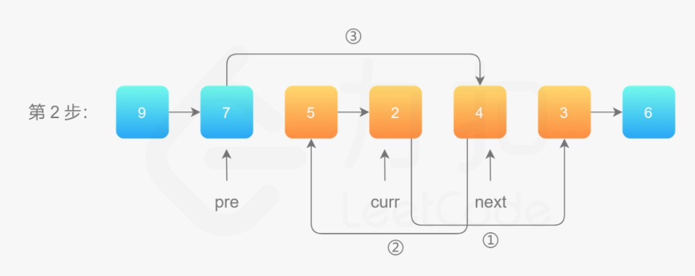
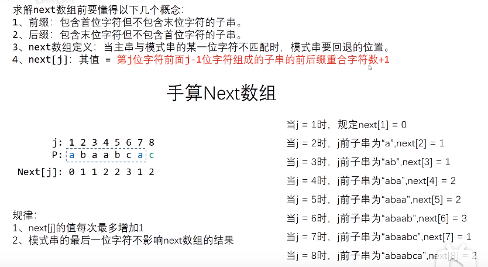
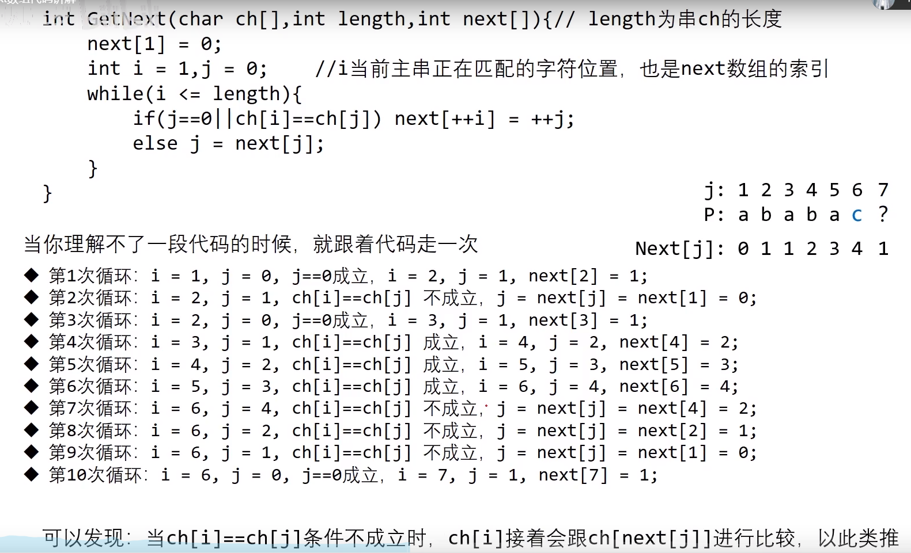
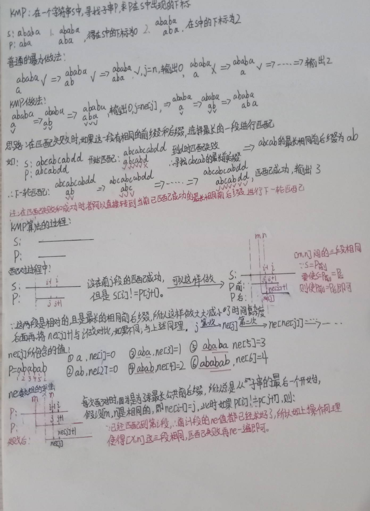
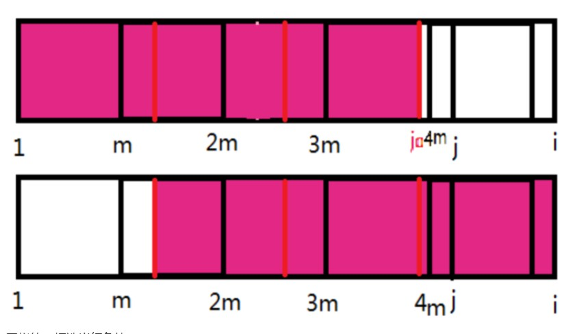

#<center>基本数据结构

# 1 栈


```c++  
// c++实现
// tt表示栈顶
int stk[N], tt = 0;   // 或 tt = -1
// 向栈顶插入一个数
stk[ ++ tt] = x;
// 从栈顶弹出一个数
tt -- ;
// 栈顶的值
stk[tt];
// 判断栈是否为空
if (tt > 0)           // 或 tt >=0
{
}
```


[最长有效括号？？？](https://leetcode-cn.com/problems/longest-valid-parentheses/)

>给你一个只包含 '(' 和 ')' 的字符串，找出最长有效（格式正确且连续）括号子串的长度。
示例 1：
输入：s = "(()"
输出：2
解释：最长有效括号子串是 "()"
示例 2：
输入：s = ")()())"
输出：4
解释：最长有效括号子串是 "()()"
示例 3：
输入：s = ""
输出：0

- 1 动态规划


```c++  
class Solution {
public:
    int longestValidParentheses(string s) {
        int maxans = 0, n = s.length();
        vector<int> dp(n, 0);
        for (int i = 1; i < n; i++) {
            if (s[i] == ')') {
                if (s[i - 1] == '(') {
                    dp[i] = (i >= 2 ? dp[i - 2] : 0) + 2;
                } else if (i - dp[i - 1] > 0 && s[i - dp[i - 1] - 1] == '(') {
                    dp[i] = dp[i - 1] + ((i - dp[i - 1]) >= 2 ? dp[i - dp[i - 1] - 2] : 0) + 2;
                }
                maxans = max(maxans, dp[i]);
            }
        }
        return maxans;
    }
};

```

- 2 栈


```c++  
class Solution {
public:
    int longestValidParentheses(string s) {
        int m=0;
        stack<int> sk;
        sk.push(-1);
        for(int i=0;i<s.length();i++){
            if(s[i]=='('){
                sk.push(i);
            }else{
                sk.pop();
                if(sk.empty()){
                    sk.push(i);
                }else{
                    m=max(m,i-sk.top());
                }
            }
        }
        return m;
    }
};
```

[美化数组的最少删除数](https://leetcode-cn.com/problems/minimum-deletions-to-make-array-beautiful/)

给你一个下标从 0 开始的整数数组 nums ，如果满足下述条件，则认为数组 nums 是一个 美丽数组 ：
- nums.length 为偶数
- 对所有满足 i % 2 == 0 的下标 i ，nums[i] != nums[i + 1] 均成立

注意，空数组同样认为是美丽数组。
你可以从 nums 中删除任意数量的元素。当你删除一个元素时，被删除元素右侧的所有元素将会向左移动一个单位以填补空缺，而左侧的元素将会保持 不变 。
返回使 nums 变为美丽数组所需删除的 最少 元素数目。

示例 1：
输入：nums = [1,1,2,3,5]
输出：1
解释：可以删除 nums[0] 或 nums[1] ，这样得到的 nums = [1,2,3,5] 是一个美丽数组。可以证明，要想使 nums 变为美丽数组，至少需要删除 1 个元素。
示例 2：
输入：nums = [1,1,2,2,3,3]
输出：2
解释：可以删除 nums[0] 和 nums[5] ，这样得到的 nums = [1,2,2,3] 是一个美丽数组。可以证明，要想使 nums 变为美丽数组，至少需要删除 2 个元素。

**思路：**

遍历数组，用栈来模拟这个过程（实际不需要栈，后面会说明）：
如果栈大小为偶数，可以随意加入元素；
如果栈大小为奇数，那么加入的元素不能和栈顶相同。
遍历结束后，若栈大小为奇数，则移除栈顶。
最后栈大小就是保留的元素，用数组大小减去栈大小就是删除的元素个数。
实际上不需要栈，用一个变量表示栈的奇偶性即可。

```c++  


class Solution {
public:
    int minDeletion(vector<int>& nums) {
        int flag = 1, last = nums[0], ans = 0;
        for(int i = 1; i < nums.size(); i++) {
            if(flag) {          //此时前一位是偶数下标，需判断
                if(nums[i] == last) ans++;
                else flag = 0;
            }
            else {              //此时前一位是奇数下标，可直接加入
                flag = 1; 
                last = nums[i];
            }     
        }
        return (nums.size() - ans) % 2 ? ans + 1 : ans;        
    }
};
```

## 两个栈维护信息

[栈实现浏览器的前进和后退功能](https://blog.csdn.net/calm_encode/article/details/108899500?utm_medium=distribute.pc_relevant.none-task-blog-2~default~baidujs_title~default-0.pc_relevant_default&spm=1001.2101.3001.4242.1&utm_relevant_index=3)
**一 概述**
当你一次访问完一串页面a-b-c之后，点击浏览器的后退按钮，就可以查看之前浏览过的页面b和a。当你后退到页面a，点击前进按钮，就可以重新查看页面b和c。但是，如果你后退到页面b后，点击了新的页面d，那就无法再前继，后退功能查看页面c了。

**二 栈**
栈是一种操作特性上来看，栈是一种"操作受限"的线性表，只允许在一端插入和删除数据。当从这种功能上来说，数组或者链表确实可以替代栈，可是特定的数据结构是对特定场景的抽象，而且，数组或链表暴露了太多的操作接口，操作上的确灵活自由，但使用时就比较不可控，自然也就更容易出错。

当某个数据集合只涉及在一端插入和删除数据，并且满足后进先出，先进后出的特性，我们就应该首选"栈"这种数据结构。

**三 栈的实现**
从栈的定义上来看，栈主要包括两个操作，出栈和入栈，也就是在栈顶插入一个数据和栈顶删除一个数据。理解了栈的定义之后，我们来看看如何用代码实现一个栈。

实际上，栈既可以用数组来实现，也可以用链表来实现。用数组来实现的栈，我们叫作顺序栈，用链表实现的栈，我们叫作链式栈。

不管是顺序表还是链式表，我们存储数据只需要一个大小为n的数组就够了。在入栈和出栈过程中，只需要一两个临时变量存储空间，所以空间复杂度是O(1)。

支持**动态扩容**的顺序栈

基于数组实现的栈，是一个固定大小的栈，也就是说，在初始化栈时需要实现指定栈的大小。当栈满之后，就无法再往栈里添加数据了。尽管链式栈的大小受限，但要存储next指针，内存消耗相对较多。

根据动态扩容的数组，当数组空间不够时，我们就重新申请一块更大的内存，将原来数组汇总数据统统拷贝过去。这样就实现了一个支持动态扩容的数组。

如果要实现一个支持动态扩容的栈，我们只需要底层依赖一个支持动态扩容的数组就可以了。当栈满了以后，我们就申请一个更大的数组，将原来的数据搬移到新数组中。

支持动态扩容的顺序栈的入栈，出栈操作的**时间复杂度**

**入栈**：对于入栈而言，最好情况时间复杂度为O(1)，最坏情况时间复杂度时O(n)。对于栈的分析需要从这几点都是可以考虑的。

栈空间不够时，我们重新**申请**一个是原来大小两倍的数组；
为了简化分析，假设只有入栈操作没有出栈操作；
定义不涉及内存搬移的入栈操作为simple-push操作，时间复杂度为O(1)。
如果当前栈大小为K，并且已满，当再有新的数据要入栈时，就需要**重新申请2倍大小的内存**，并且做K个数据的**搬移**操作，然后再入栈。但是，接下来的K-1次入栈操作，我们都不需要再重新申请内存和搬移数据，所以这K-1次入栈操作都需要一个simple-push操作就可以完成


在K次入栈操作，总共涉及了K个数据的搬移，以及K次simple-push操作。将K个数据搬移均摊到k次入栈操作，那每次入栈操作只需要一个数据搬移和一个simple-push操作。所以均摊时间复杂度一般都等于最好情况时间复杂度。因为在大部分情况下，入栈操作的时间复杂度均为O(1)，只有在个别时刻才会退化为O(n)，所以把耗时多的入栈操作的时间均摊到其他入栈操作上，平均情况下的耗时就接近O(1)。

**出栈**：对于出栈操作不会涉及内存的重新申请和数据的搬移，所以出栈的时间复杂度仍然是O(1)。但是，对于入栈操作而言，情况就不一样。当栈中空闲空间时，入栈操作的时间复杂度为O(1)。但当空间不够时，就需要重新申请内存和数据搬移，数据搬移时的时间复杂度为O(n)。

**四 栈在函数中的应用**
在软件工程中的实际应用中，栈作为一个比较基础的数据结构，应用场景还是蛮多的，其中，比较经典的应用场景就是函数调用栈。

操作系统给每个**线程**分配了一块独立的内存空间，这块内存被组织成"栈"这种结构，用来存储函数调用时的临时变量。每进入一个函数，就会将临时变量作为一个栈帧入栈，当被调用函数执行完成，返回之后，将这个函数对应的栈帧出栈。

**五 栈实现浏览器的前进和后退功能**
其实我们可以通过两个栈，X和Y，我们把首次浏览的页面依次压入栈X，当点击后退按钮时，再依次从栈X中出栈，并将出栈的数据依次放入栈Y。当我们点击前进按钮时，我们依次从栈Y中取出数据，放入栈X中。当栈X中没有数据时，那就说明没有页面可以继续后退浏览了，同理，当栈Y中没有数据，那就说明没有页面可以再点击前进按钮浏览了。
**总结**：
两个栈来维护，X Y,每次拿出栈顶时判断是否为空
1.浏览新的进栈X，(如果此时在后退状态，则需要清空 Y)
2.后退从X拿出栈顶 放进Y
3.前进从Y拿出栈顶 放进X


比如你顺序查看了 a，b，c 三个页面，我们就依次把 a，b，c 压入栈，这个时候，两个栈的数据就是这个样子：
```c++  
X:  a  b  c
Y: 
```


当你通过浏览器的后退按钮，从页面 c 后退到页面 a 之后，我们就依次把 c 和 b 从栈 X 中弹出，并且依次放入到栈 Y。这个时候，两个栈的数据就是这个样子：
```c++  
X:  a
Y:  c  b 
```


这个时候你又想看页面 b，于是你又点击前进按钮回到 b 页面，我们就把 b 再从栈 Y 中出栈，放入栈 X 中。此时两个栈的数据是这个样子：
```c++  
X:  a  b
Y:  c   
```
这个时候，你通过页面 b 又跳转到新的页面 d 了，页面 c 就无法再通过前进、后退按钮重复查看了，所以需要清空栈 Y。此时两个栈的数据这个样子：
```c++  
X:  a  b  d
Y:  
```

**六 栈保存临时变量的原因**
再函数调用的过程中，我们不一定非要用栈来保存临时变量，只不过如果这个函数调用符号后进先出的特性，用栈这种数据结构来实现，是顺理成章的选择。

从函数调用进入被调用函数，对于数据来说，变化的是作用域，所以根本上，只要能保证每进入一个新的函数，都是一个新的作用域就可以。而实现这个，用栈就非常方便。在进入被调用函数的时候，分配一段栈空间给这个函数的变量，在函数结束的时候，将栈顶复位，正好回到调用函数的作用域内。

**七 内存中堆栈和数据结构中的堆栈**
内存中的堆栈和数据结构不是同一个概念，可以说内存中的堆栈是真实存在的物理区，数据结构中的堆栈是抽象的数据存储结构。


## 单调栈
```c++  
常见模型：找出每个数左边离它最近的比它大/小的数
int tt = 0;
for (int i = 1; i <= n; i ++ )
{
    while (tt && check(stk[tt], i)) tt -- ;
    stk[ ++ tt] = i;
}

```


# 2 队列

```c++  
// c++实现
// 普通队列
// hh 表示队头，tt表示队尾
int q[N], hh = 0, tt = -1;
// 向队尾插入一个数
q[ ++ tt] = x;
// 从队头弹出一个数
hh ++ ;
// 队头的值
q[hh];
// 判断队列是否为空
if (hh <= tt)
{

}
// 循环队列
// hh 表示队头，tt表示队尾的后一个位置
int q[N], hh = 0, tt = 0;
// 向队尾插入一个数
q[tt ++ ] = x;
if (tt == N) tt = 0;
// 从队头弹出一个数
hh ++ ;
if (hh == N) hh = 0;
// 队头的值
q[hh];
// 判断队列是否为空
if (hh != tt)
{

}
```


**定义时的区别**

|特性| 队列 | 循环队列|
|---|---|---|
|hh |队头 =0 | 队头 =0|
|tt |队尾 = -1 | 队尾的后一个位置 = 0|
|向队尾添加| q[++ tt] =    |q[tt ++] = |
|判断非空 | hh <= tt  | hh != tt |
|其他| 无| tt == N 时  令 tt= 0 ，hh == N 时  令 hh = 0 |


| 1 | 2 | 3|
|---|---|---|
|1 | 2 | 3 |
|1 | 2 | 3 |


## 单调队列
[comment]: <> " #用于跳转至单调队列 "

应用详见 [动态规划](./05_动态规划.md)部分中的[单调队列优化DP](./05_动态规划.md##用于跳转至单调队列优化DP "标题")。


**对比**
单调队列和优先队列
单调队列是一种算法，在队列使用的过程中满足单调性质，用于解决一类特定的问题，最典型的就是滑动窗口的最大值，它在一类背包问题里也有应用。类似的还有单调栈：在栈使用的过程中，保证一种单调性。这两种算法其实都是依托于特定的问题场景的。

优先队列的应用就特别广泛了。用于解决需要动态求出当前最大或者最小值的问题，与普通队列不同的是，优先队列中的元素被赋予了优先级，在出队的时候按照指定的优先级规则出队。


### 模板


```c++    

常见模型：找出滑动窗口中的最大值/最小值   O(n)  （还可以用树状数组做 见树状数组部分）
int q[N], hh = 0, tt = -1;
for (int i = 0; i < n; i ++ )
{
    while (hh <= tt && check_out(q[hh])) hh ++ ;  // 判断队头是否滑出窗口
    while (hh <= tt && check(q[tt], i)) tt -- ;
    q[ ++ tt] = i;
}

```


例题：[滑动窗口](https://www.acwing.com/problem/content/156/)

**思路：**

最小值和最大值分开来做，两个for循环完全类似，都做以下四步：

1 解决队首已经出窗口的问题;
2 解决队尾与当前元素a[i]不满足单调性的问题;
3 将当前元素下标加入队尾;
4 如果满足条件则输出结果;
    
需要注意的细节：

1 上面四个步骤中一定要先3后4，因为有可能输出的正是新加入的那个元素;
2 队列中存的是原数组的下标，取值时要再套一层，a[q[]];
3 算最大值前注意将hh和tt重置;
~~4 此题用cout会超时，只能用printf;~~
5 hh从0开始，数组下标也要从0开始 

**重点**
如求最小值，从左向右遍历，用一个队列来维护最近 k 个元素；如果队列中存在两个元素，满足 a[i] >= a[j] 且 i < j，那么无论在什么时候我们都不会取 a[i] 作为最小值了，所以可以直接将 a[i] 删掉；

```c++  
# include <iostream>
using namespace std;
const int N = 1000010;
int a[N], q[N], hh, tt = -1;

int main()
{
    int n, k;
    cin >> n >> k; 
    // 因为求最值，维护(严格和不严格都行)单调就行，只要是最值，且在区间内，不关心具体是哪一个
    for (int i = 0; i < n; ++ i)  // 维护一个严格单增队列，求区间最小值  O(n)  
    {
        scanf("%d", &a[i]);
        if (i - k + 1 > q[hh]) ++ hh;                  // 若队首出窗口，hh加1
        while (hh <= tt && a[i] <= a[q[tt]]) -- tt;    // 若队尾不单调，tt减1(<= 维护严格单调， < 维护不严格单调)
        q[++ tt] = i;                                  // 下标加到队尾
        if (i + 1 >= k) printf("%d ", a[q[hh]]);       // 输出结果
    }
    cout << endl;
    hh = 0; tt = -1;                                   // 重置！
    for (int i = 0; i < n; ++ i)  // 维护一个严格单减队列，求区间最大值
    {
        if (i - k + 1 > q[hh]) ++ hh;
        while (hh <= tt && a[i] >= a[q[tt]]) -- tt;
        q[++ tt] = i;
        if (i + 1 >= k) printf("%d ", a[q[hh]]);
    }
    return 0;
}
```


**题集** 

[力扣：单调队列专题](https://leetcode-cn.com/tag/monotonic-queue/problemset/)

更详细的应用 见  [基本数据结构](./05_动态规划.md)部分中的**单调队列优化**。
以及 多重背包的单调队列优化。

# 3 链表与邻接表

**单链表**
```c++  
//c++实现

// head存储链表头，e[]存储节点的值，ne[]存储节点的next指针，idx表示当前用到了哪个节点
int head, e[N], ne[N], idx;

// 初始化
void init()
{
    head = -1;
    idx = 0;
}

// 在链表头插入一个数a
void insert(int a)
{
    e[idx] = a, ne[idx] = head, head = idx ++ ;
}
// 将头结点删除，需要保证头结点存在
void remove()
{
    head = ne[head];
}
```

**双链表**
```c++  
//c++实现
// e[]表示节点的值，l[]表示节点的左指针，r[]表示节点的右指针，idx表示当前用到了哪个节点
int e[N], l[N], r[N], idx;

// 初始化
void init()
{
    //0是左端点，1是右端点
    r[0] = 1, l[1] = 0;
    idx = 2;
}

// 在节点a的右边插入一个数x
void insert(int a, int x)
{
    e[idx] = x;
    l[idx] = a, r[idx] = r[a];
    l[r[a]] = idx, r[a] = idx ++ ;
}

// 删除节点a
void remove(int a)
{
    l[r[a]] = l[a];
    r[l[a]] = r[a];
}

```

## 力扣链表

```c++  
/**
 * Definition for singly-linked list.
 * struct ListNode {
 *     int val;
 *     ListNode *next;
 *     ListNode() : val(0), next(nullptr) {}
 *     ListNode(int x) : val(x), next(nullptr) {}
 *     ListNode(int x, ListNode *next) : val(x), next(next) {}
 * };
 */
```

**计算长度**
```c++  
int getLength(ListNode* head) {
    int ret = 0;
    for (; head != nullptr; ++ret, head = head->next);
    return ret;
}
```


## 链表反转


### 反转全部


**方法一：迭代**
假设链表为$ 1 \rightarrow 2 \rightarrow 3 \rightarrow \varnothing $，我们想要把它改成$ \varnothing \leftarrow 1 \leftarrow 2 \leftarrow 3$

在遍历链表时，将当前节点的 $\textit{next}$ 指针改为指向前一个节点。由于节点没有引用其前一个节点，因此必须事先存储其前一个节点。在更改引用之前，还需要存储后一个节点。最后返回新的头引用。

```c++  
class Solution {
public:
    ListNode* reverseList(ListNode* head) {
        ListNode* prev = nullptr;
        ListNode* curr = head;
        while(curr){
          ListNode* next = curr->next;   //不着急把next的next设置好 在下一个循环中操作即可
          curr->next = prev;
          prev = curr;         
          curr = next;
        }                   // 最后curr为空了
        return prev;
    }
};
```

方法二：递归
递归版本稍微复杂一些，其关键在于反向工作。假设链表的其余部分已经被反转，现在应该如何反转它前面的部分？


```c++  
class Solution {
public:
    ListNode* reverseList(ListNode* head) {
        if (!head || !head->next) {
            return head;
        }
        ListNode* newHead = reverseList(head->next);
        head->next->next = head;
        head->next = nullptr;       // ！！！要置空 否则成环
        return newHead;
    }
};

```

### 反转部分

[M-反转链表 II](https://leetcode-cn.com/problems/reverse-linked-list-ii/)
给你单链表的头指针 head 和两个整数 left 和 right ，其中 left <= right 。请你反转从位置 left 到位置 right 的链表节点，返回 反转后的链表 。

思路：[Article:官方解答：头插法](https://leetcode-cn.com/problems/reverse-linked-list-ii/solution/fan-zhuan-lian-biao-ii-by-leetcode-solut-teyq/)
整体思想是：在需要反转的区间里，每遍历到一个节点，让这个新节点来到反转部分的起始位置。下面的图展示了整个流程。

使用三个指针变量 pre、curr、nxt 来记录反转的过程中需要的变量，它们的意义如下：

curr：指向待反转区域的第一个节点 left；
next：永远指向 curr 的下一个节点，循环过程中，curr 变化以后 nxt 会变化；
pre：永远指向待反转区域的第一个节点 left 的前一个节点，在循环过程中不变。

操作步骤：

先将 curr 的下一个节点记录为 next；
执行操作 ①：把 curr 的下一个节点指向 next 的下一个节点；
执行操作 ②：把 next 的下一个节点指向 pre 的下一个节点；
执行操作 ③：把 pre 的下一个节点指向 next




```c++
// 一次遍历「穿针引线」反转链表（头插法）
// 以上图为例，m = 3，n=7
     ListNode* reverseBetween(ListNode* head, int m, int n) {
       if(m>n)return head;
        ListNode* HEAD=new ListNode(0,head);
        ListNode* pre=HEAD, *nxt;
        for(int i=1;i<m;i++){
            pre=pre->next;
        }
       ListNode* curr=pre->next;
        for(int i=m;i<n;i++){      
            nxt=curr->next;        // 
            curr->next=nxt->next;  // ①
            nxt->next=pre->next;   // ② 用的是pre->next而不是curr 
            pre->next=nxt;         // ③
        }
        return HEAD->next;
    }
```

## 合并链表

[合并两个有序链表](https://leetcode-cn.com/problems/merge-two-sorted-lists/)
```c++
class Solution {
public:
    ListNode* mergeTwoLists(ListNode* list1, ListNode* list2) {
      ListNode* HEAD = new ListNode(0);
      ListNode* cur = HEAD;
      while(list1 || list2){
        if(list1 && list2){
          if(list1->val <= list2->val){
            cur->next = new ListNode(list1->val);
            list1 = list1->next;
          }else{
            cur->next = new ListNode(list2->val);
            list2 = list2->next;
          }
        }else if(list1){
            cur->next = new ListNode(list1->val);
            list1 = list1->next;          
        }else{
            cur->next = new ListNode(list2->val);
            list2 = list2->next;          
        }
        cur = cur->next;
      }
      return HEAD->next;
    }
};
```

[合并K个升序链表](https://leetcode-cn.com/problems/merge-k-sorted-lists/)
- 优先队列

```c++  
class Solution {
public:
    struct comp {
        bool operator()(ListNode* a, ListNode* b) {
            return a->val > b->val;
        }
    };

    priority_queue<ListNode*, vector<ListNode*>, comp> q;

    ListNode* mergeKLists(vector<ListNode*>& lists) {
        for (auto node: lists) {
            if (node) q.push(node);
        }
        ListNode* head = new ListNode();
        ListNode* tail = head;
        while (!q.empty()) {
            ListNode* node = q.top();
            q.pop();
            tail->next = node; 
            tail = tail->next;
            if (node->next) q.push(node->next);
        }
        return head->next;
    }
};
```

- 分治归并

```c++  
class Solution {
public:
    ListNode* mergeTwoLists(ListNode *a, ListNode *b) {
        if ((!a) || (!b)) return a ? a : b;
        ListNode head, *tail = &head, *aPtr = a, *bPtr = b;
        // 或ListNode head = new ListNode(0), * tail;
        // tail = head;    return head->next;
        while (aPtr && bPtr) {
            if (aPtr->val < bPtr->val) {
                tail->next = aPtr; aPtr = aPtr->next;
            } else {
                tail->next = bPtr; bPtr = bPtr->next;
            }
            tail = tail->next;
        }
        tail->next = (aPtr ? aPtr : bPtr);
        return head.next;
    }

    ListNode* merge(vector <ListNode*> &lists, int l, int r) {
        if (l == r) return lists[l];
        if (l > r) return nullptr;
        int mid = (l + r) >> 1;
        return mergeTwoLists(merge(lists, l, mid), merge(lists, mid + 1, r));
    }

    ListNode* mergeKLists(vector<ListNode*>& lists) {
        return merge(lists, 0, lists.size() - 1);
    }
};
```

## 操作节点
### 删除节点
[删除链表的倒数第 N 个结点](https://leetcode-cn.com/problems/remove-nth-node-from-end-of-list/)
>给你一个链表，删除链表的倒数第 n 个结点，并且返回链表的头结点。
- 注意输出第一个节点(以及考虑最后一个节点)
```c++  
class Solution {
public:
    ListNode* removeNthFromEnd(ListNode* head, int n) {
        ListNode* dummy = new ListNode(0, head);
        ListNode *pre=head,*cur=dummy;
        while(n--){
            pre=pre->next;
        }
        while(pre){
            pre=pre->next;
            cur=cur->next;
        }
        cur->next=cur->next->next;
        ListNode *ans=dummy->next;
        delete dummy;
        return ans;
    }
};
```
[删除排序链表中的重复元素 II](https://leetcode-cn.com/problems/remove-duplicates-from-sorted-list-ii/)

>给定一个已排序的链表的头 head ， 删除原始链表中所有重复数字的节点，只留下不同的数字 。返回 已排序的链表 。
输入：head = [1,2,3,3,4,4,5]
输出：[1,2,5]

- 遍历
```c++  
class Solution {
public:
    ListNode* deleteDuplicates(ListNode* head) {
        if (!head) {
            return head;
        }
        
        ListNode* dummy = new ListNode(0, head);

        ListNode* cur = dummy;
        while (cur->next && cur->next->next) {
            if (cur->next->val == cur->next->next->val) {
                int x = cur->next->val;
                while (cur->next && cur->next->val == x) {
                    cur->next = cur->next->next;
                }
            }
            else {
                cur = cur->next;
            }
        }

        return dummy->next;
    }
};

```
- **递归**
    - 1.1 递归函数定义
    递归最基本的是要明白递归函数的定义！ 我反复强调过这一点。
    递归函数直接使用题目给出的函数 deleteDuplicates(head) ，它的含义是 删除以 head 作为开头的有序链表中，值出现重复的节点。
    - 1.2 递归终止条件
    终止条件就是能想到的基本的、不用继续递归处理的case。
    如果 head 为空，那么肯定没有值出现重复的节点，直接返回 head；
    如果 head.next 为空，那么说明链表中只有一个节点，也没有值出现重复的节点，也直接返回 head。
    - 1.3 递归调用
    什么时候需要递归呢？我们想一下这两种情况：
        - 如果 head.val != head.next.val ，说明头节点的值不等于下一个节点的值，所以当前的 head 节点必须保留；但是 head.next 节点要不要保留呢？我们还不知道，需要对 head.next 进行递归，即对 head.next 作为头节点的链表，去除值重复的节点。所以 head.next = self.deleteDuplicates(head.next).
        - 如果 head.val == head.next.val ，说明头节点的值等于下一个节点的值，所以当前的 head 节点必须删除，并且 head 之后所有与 head.val 相等的节点也都需要删除；删除到哪个节点为止呢？需要用 move 指针一直向后遍历寻找到与 head.val 不等的节点。此时 move 之前的节点都不保留了，因此返回 deleteDuplicates(move);
    - 1.4 返回结果
    题目让我们返回删除了值重复的节点后剩余的链表，结合上面两种递归调用的情况。
    如果 head.val != head.next.val ，头结点需要保留，因此返回的是 head；
    如果 head.val == head.next.val ，头结点需要删除，需要返回的是deleteDuplicates(move);
    
```c++  
class Solution {
public:
    ListNode* deleteDuplicates(ListNode* head) {
        if (!head || !head->next) {
            return head;
        }
        if (head->val != head->next->val) {
            head->next = deleteDuplicates(head->next);
        } else {
            ListNode* move = head->next;
            while (move && head->val == move->val) {
                move = move->next;
            }
            return deleteDuplicates(move);
        }
        return head;
    }
};
```

### 删除特定值的节点
[移除链表元素](https://leetcode-cn.com/problems/remove-linked-list-elements/)

- 新建表
```c++  
class Solution {
public:
    ListNode* removeElements(ListNode* head, int val) {
      ListNode* res = new ListNode(0, nullptr);
      ListNode* dum = res;
      while(head){
        if(head->val != val){
          dum->next = new ListNode(head->val);
          dum = dum->next;
        }
        head = head->next;
      }
      return res->next;
    }
};
```
- 迭代
```c++  
    ListNode *removeElements(ListNode* head,int val){
        if(!head)return nullptr;
        ListNode *cur=head,*del;
        //每次循环我们判断cur的next节点值是否为val，确定是否删除
        while(cur->next){
            if(cur->next->val==val){//若cur->next的节点值为val，那么我们需要删除cur->next
                del=cur->next;
                cur->next=del->next;
                delete del;
            }
            else{//若不为val，那么我们需要移动cur
                cur=cur->next;
            }
        }
        return head->val==val?head->next:head;
    }

```
- 递归
```c++  
    //题解1：递归法
    ListNode* removeElements_1(ListNode* head, int val) {
        //1、递归边界
        if(!head)return nullptr;
        //2、递去：直到到达链表尾部才开始删除重复元素
        head->next=removeElements(head->next,val);
        //3、递归式：相等就是删除head，不相等就不用删除
        return head->val==val?head->next:head;
    }
```


### 交换相邻节点
>给你一个链表，两两交换其中相邻的节点，并返回交换后链表的头节点。你必须在不修改节点内部的值的情况下完成本题（即，只能进行节点交换）(第i个和第i+1个，i为奇数)。
输入：head = [1,2,3,4]
输出：[2,1,4,3]
```c++  
class Solution {
public:
    ListNode* swapPairs(ListNode* head) {
        ListNode* dummyHead = new ListNode(0, head);
        ListNode* temp = dummyHead;
        while (temp->next != nullptr && temp->next->next != nullptr) {
            ListNode* node1 = temp->next;
            ListNode* node2 = temp->next->next;
            temp->next = node2;
            node1->next = node2->next;
            node2->next = node1;
            temp = node1;
        }
        return dummyHead->next;
    }
};
```

### 旋转链表
>给你一个链表的头节点 head ，旋转链表，将链表每个节点向右移动 k 个位置。
输入：head = [1,2,3,4,5], k = 2
输出：[4,5,1,2,3]

- 闭合为环 再断开
记给定链表的长度为 n，注意到当向右移动的次数 k≥n 时，我们仅需要向右移动 k mod n 次即可。因为每 nn 次移动都会让链表变为原状。这样我们可以知道，新链表的最后一个节点为原链表的第 (n−1)−(k mod n) 个节点（从 00 开始计数）。

这样，我们可以先将给定的链表连接成环，然后将指定位置断开。

具体代码中，我们首先计算出链表的长度 nn，并找到该链表的末尾节点，将其与头节点相连。这样就得到了闭合为环的链表。然后我们找到新链表的最后一个节点（即原链表的第(n−1)−(k mod n) 个节点），将当前闭合为环的链表断开，即可得到我们所需要的结果。

特别地，当链表长度不大于 1，或者 k 为 n 的倍数时，新链表将与原链表相同，我们无需进行任何处理。

```c++  
class Solution {
public:
    ListNode* rotateRight(ListNode* head, int k) {
        if (k == 0 || head == nullptr || head->next == nullptr) {
            return head;
        }
        int n = 1;
        ListNode* iter = head;
        while (iter->next != nullptr) {
            iter = iter->next;
            n++;
        }
        int add = n - k % n;
        if (add == n) {
            return head;
        }
        iter->next = head;
        while (add--) {
            iter = iter->next;
        }
        ListNode* ret = iter->next;
        iter->next = nullptr;
        return ret;
    }
};

```

## 链表有环

### 判断环

```c++
class Solution {
public:
    bool hasCycle(ListNode* head) {
        if (head == nullptr || head->next == nullptr) {
            return false;
        }
        ListNode* slow = head;
        ListNode* fast = head->next;  // 先走一步，emm能判断环，但不能求入口？？
        while (slow != fast) {        // while在前
            if (fast == nullptr || fast->next == nullptr) {
                return false;    // 无法再前进两步
            }
            slow = slow->next;
            fast = fast->next->next;
        }
        return true;
    }
};
```

### 寻找入环点  
见基本算法中 `Floyd 判圈算法（龟兔赛跑问题）`
- 快慢指针相遇后，把快指针移回到head，继续走到相同点即为入环点。

```c++  
class Solution {
public:
    ListNode *detectCycle(ListNode *head) {
      if(head==nullptr||head->next==nullptr)  return nullptr;
        //第一步 判断是否存在环形节点：双指针法
        ListNode *s=head,*f=head;
        do{
          if(f->next==nullptr||f->next->next==nullptr)   return nullptr;
          s=s->next;
          f=f->next->next;
        }while(s!=f);
        // ListNode *s=head,*f=head->next;
        // while(s!=f){
        //   // if(f->next==nullptr||f->next->next==nullptr)   return nullptr;
        //   if(f==nullptr||f->next==nullptr)   return nullptr;

        //   s=s->next;
        //   f=f->next->next;
        // }
        cout << f->val << " " << s->val << endl;
        //第二步 寻找节点位置：双指针法
        f=head;    //令f恢复head
        while(s!=f){
          f=f->next; //->next;
          s=s->next;
        }     
        // do{            //这样不对 对于 [1,2] 应返回指向1，而不是指向2
        //   f=f->next;
        //   s=s->next;
        // }while(s!=f);       
      return s;
    }
};

```
## 链表排序
- 常规转数组 再转链表
- 插入排序(O(n^2))
- 归并排序(O(log(n)))
    - 归并算法的本质是分成治之。当有多个数据的时候，处理不过来，从逻辑上切分成多分最小处理单位，分别处理。处理完，再合并每一份的结果。也就是从小结果一点点累积出最终结果。

```c++  
class Solution {
public:
    ListNode* sortList(ListNode* head) {
        return (head==NULL)?NULL:mergeSort(head);
    }
private:
    ListNode* findMid(ListNode *head)
    {
        ListNode *slow=head;
        ListNode *fast=head;
        ListNode *previous=NULL;
        while(fast!=NULL&&fast->next!=NULL)
        {
            previous=slow;
            slow=slow->next;
            fast=fast->next->next;

        }
        previous->next=NULL;
        return slow;
    }
    ListNode* mergeTwoLists(ListNode* l1,ListNode *l2)
    {
        if(l1==NULL) return l2;
        if(l2==NULL)  return l1;
        if(l1->val<l2->val)
        {
            l1->next=mergeTwoLists(l1->next,l2);
            return l1;
        }
        else
        {
            l2->next=mergeTwoLists(l1,l2->next);
            return l2;
        }
    }

    ListNode* mergeSort(ListNode* head)
    {
        if(head->next==NULL)
        return head;
        ListNode* mid=findMid(head);
        ListNode *l1=mergeSort(head);
        ListNode *l2=mergeSort(mid);
        return mergeTwoLists(l1,l2);
    }
};
```

- **归并-简化版**
```c++  
class Solution {
public:
    ListNode* sortList(ListNode* head, ListNode *tail = nullptr) {
        if(!head) return nullptr;
        if(head->next == tail){
            head->next = nullptr;
            return head;
        }
        auto quick = head, slow = head;
        while (quick != tail && quick->next !=tail)
            slow = slow->next, quick = quick->next->next;
        return merge(sortList(head, slow), sortList(slow, tail));
    }

private:
    ListNode* merge(ListNode* l1, ListNode* l2) {
        ListNode sub(0), *ptr = &sub;
        while(l1 && l2) {
            auto &node = l1->val < l2->val ? l1 : l2;
            ptr = ptr->next = node, node = node->next;
        }
        ptr->next = l1 ? l1 : l2;
        return sub.next;
    }
};
```

## 综合
### 反转链表+快慢指针

[回文链表](https://leetcode-cn.com/problems/palindrome-linked-list/)
>给你一个单链表的头节点 head ，请你判断该链表是否为回文链表。如果是，返回 true ；否则，返回 false 。
输入：head = [1,2,2,1]
输出：true
- 快慢指针+反转部分链表
避免使用 O(n)O(n) 额外空间的方法就是改变输入。
我们可以将链表的后半部分反转（修改链表结构），然后将前半部分和后半部分进行比较。比较完成后我们应该将链表恢复原样。虽然不需要恢复也能通过测试用例，但是使用该函数的人通常不希望链表结构被更改。
该方法虽然可以将空间复杂度降到 O(1)O(1)，但是在并发环境下，该方法也有缺点。在并发环境下，函数运行时需要锁定其他线程或进程对链表的访问，因为在函数执行过程中链表会被修改。
**算法**
整个流程可以分为以下五个步骤：
- 找到前半部分链表的尾节点。
- 反转后半部分链表。
- 判断是否回文。
- 恢复链表。
- 返回结果。
执行步骤一，我们可以计算链表节点的数量，然后遍历链表找到前半部分的尾节点。
我们也可以使用快慢指针在一次遍历中找到：慢指针一次走一步，快指针一次走两步，快慢指针同时出发。当快指针移动到链表的末尾时，慢指针恰好到链表的中间。通过慢指针将链表分为两部分。
若链表有奇数个节点，则中间的节点应该看作是前半部分。

```c++  
class Solution {
public:
    bool isPalindrome(ListNode* head) {
        ListNode *slow = head, *fast = head;
        while(fast != nullptr && fast->next != nullptr){
            slow = slow->next;
            fast = fast->next->next;
        }   
        //  1->2->3->4->5  slow为3，fast为5
        //  1->2->3->4->5->6 slow为4，fast为null
        // 而为奇数情况下，3可以不用比较，即把slow移到4，只反转 4 <- 5
        if(fast != nullptr){
            slow = slow->next;
        }
        slow = reverse(slow);
        fast = head;
        while(slow != nullptr)  // slow 比较短
        {
            if(slow->val != fast->val)
                return false;
            slow = slow->next;
            fast = fast->next;
        }
        return true;
    }
private:
    ListNode* reverse(ListNode *head){
        ListNode *pre = nullptr, *cur = head;
        while(cur != nullptr)
        {
            ListNode *next = cur->next;
            cur->next = pre;
            pre = cur;
            cur = next;
        }
        return pre;
    }
};
```


[重排链表](https://leetcode.cn/problems/LGjMqU/)
>给定一个单链表 L 的头节点 head ，单链表 L 表示为：
L0 → L1 → … → Ln-1 → Ln 
请将其重新排列后变为：
L0 → Ln → L1 → Ln-1 → L2 → Ln-2 → …
不能只是单纯的改变节点内部的值，而是需要实际的进行节点交换。
示例 1:
输入: head = [1,2,3,4]
输出: [1,4,2,3]
示例 2:
输入: head = [1,2,3,4,5]
输出: [1,5,2,4,3]
提示：
链表的长度范围为 [1, 5 * 104]
1 <= node.val <= 1000

解：

```c++  
/**
 * Definition for singly-linked list.
 * struct ListNode {
 *     int val;
 *     ListNode *next;
 *     ListNode() : val(0), next(nullptr) {}
 *     ListNode(int x) : val(x), next(nullptr) {}
 *     ListNode(int x, ListNode *next) : val(x), next(next) {}
 * };
 */
class Solution {
public:
    void reorderList(ListNode* head) {
        if(!head) return;
        // 1 快慢指针取中点 2 反转后一半  3 合并链表

        ListNode * mid = getMid(head);
        ListNode * l1 = head;
        ListNode * l2 = mid->next;
        mid->next = nullptr;

        l2 = reverse(l2);
        merge(l1, l2);
    }

    ListNode* getMid(ListNode* node){
        if(!node) return nullptr;
        ListNode* slow = node;
        ListNode* fast = node;
        while(fast->next && fast->next->next){
            slow = slow->next, fast = fast->next->next;
        }
        return slow;
    }

    ListNode* reverse(ListNode* node){
        ListNode* pre = nullptr;
        ListNode* cur = node;
        while(cur){
            ListNode* nxt = cur->next;
            cur->next = pre;
            pre = cur;
            cur = nxt;
        }
        return pre;
    }

    void merge(ListNode* l1, ListNode* l2){
        ListNode* ans = new ListNode(0);
        while(l1 || l2){
            if(l1) ans->next = l1, l1 = l1->next, ans = ans->next;
            if(l2) ans->next = l2, l2 = l2->next, ans = ans->next;
        }
        l1 = ans->next;
    }
};
```


## 其他
### 链表建树
[有序链表转换二叉搜索树](https://leetcode-cn.com/problems/convert-sorted-list-to-binary-search-tree/)

- **分治**
具体地，设当前链表的左端点为left，右端点right，包含关系为「左闭右开」，即left 包含在链表中而right 不包含在链表中。我们希望快速地找出链表的中位数节点 mid。

>为什么要设定「左闭右开」的关系？由于题目中给定的链表为单向链表，访问后继元素十分容易，但无法直接访问前驱元素。因此在找出链表的中位数节点 mid 之后，如果设定「左闭右开」的关系，我们就可以直接用 (left,mid) 以及 (mid.next,right) 来表示左右子树对应的列表了。并且，初始的列表也可以用(head,null) 方便地进行表示，其中 null 表示空节点。

找出链表中位数节点的方法多种多样，其中较为简单的一种是「**快慢指针法**」。初始时，快指针fast 和慢指针 slow 均指向链表的左端点left。我们将快指针 fast 向右移动两次的同时，将慢指针slow 向右移动一次，直到快指针到达边界（即快指针到达右端点或快指针的下一个节点是右端点）。此时，慢指针对应的元素就是中位数。

在找出了中位数节点之后，我们将其作为当前根节点的元素，并递归地构造其左侧部分的链表对应的左子树，以及右侧部分的链表对应的右子树。

```c++  
class Solution {
public:
    TreeNode* sortedListToBST(ListNode* head) {
        return buildTree(head,nullptr);
    }
    TreeNode* buildTree(ListNode* left, ListNode* right) {
        if (left == right) {
            return nullptr;
        }
        ListNode* mid = findMid(left, right);
        TreeNode* root = new TreeNode(mid->val);
        root->left = buildTree(left, mid);
        root->right = buildTree(mid->next, right);
        return root;
    }
    ListNode *findMid(ListNode *first,ListNode *last){
        ListNode *fast=first;
        ListNode *slow=first;
        while(fast!=last&&fast->next!=last){
            fast=fast->next->next;
            slow=slow->next;
        }
        return slow;
    }
};
```
- 分治+中序遍历优化O(n)
    - [Article:官方解答](https://leetcode-cn.com/problems/convert-sorted-list-to-binary-search-tree/solution/you-xu-lian-biao-zhuan-huan-er-cha-sou-suo-shu-1-3/)


## 链表相交
>给你两个单链表的头节点 headA 和 headB ，请你找出并返回两个单链表相交的起始节点。如果两个链表不存在相交节点，返回 null 。
- 双指针


```c++  
class Solution {
public:           
    ListNode *getIntersectionNode(ListNode *headA, ListNode *headB) {
        ListNode* pA=headA,*pB=headB;
        while(pA!=pB){
          pA=pA!=nullptr?pA->next:headB;
          pB=pB!=nullptr?pB->next:headA;
        }
        return pA;
    }
};
```

# 4 哈希


## 一般哈希

[模拟散列表(拉链法+开放寻址法)  ](https://www.acwing.com/solution/content/30169/)


```c++  
(1) 拉链法
    int h[N], e[N], ne[N], idx;

    // 向哈希表中插入一个数   头插法
    void insert(int x)   // 相当于 在k的链表中 插入了x  即 k -> x  类似于 a -> b
    {
        int k = (x % N + N) % N;
        e[idx] = x;
        ne[idx] = h[k];
        h[k] = idx ++ ;
    }

    // 在哈希表中查询某个数是否存在
    bool find(int x)   // 在k的有向图中 是否能找到x
    {
        int k = (x % N + N) % N;
        for (int i = h[k]; i != -1; i = ne[i])
            if (e[i] == x)
                return true;

        return false;
    }

(2) 开放寻址法
    int h[N];

    // 如果x在哈希表中，返回x的下标；如果x不在哈希表中，返回x应该插入的位置
    int find(int x)
    {
        int t = (x % N + N) % N;
        while (h[t] != null && h[t] != x)
        {
            t ++ ;
            if (t == N) t = 0;
        }
        return t;
    }
```


**设计**
(后续用拉链法写一下)


[设计哈希集合](https://leetcode-cn.com/problems/design-hashset/)

>不使用任何内建的哈希表库设计一个哈希集合（HashSet）。
实现 MyHashSet 类：
void add(key) 向哈希集合中插入值 key 。
bool contains(key) 返回哈希集合中是否存在这个值 key 。
void remove(key) 将给定值 key 从哈希集合中删除。如果哈希集合中没有这个值，什么也不做。


```c++  
class MyHashSet {
private:
    vector<list<int>> data;
    static const int base = 769;
    static int hash(int key) {
        return key % base;
    }
public:
    /** Initialize your data structure here. */
    MyHashSet(): data(base) {}
    
    void add(int key) {
        int h = hash(key);
        for (auto it = data[h].begin(); it != data[h].end(); it++) {
            if ((*it) == key) {
                return;
            }
        }
        data[h].push_back(key);
    }
    
    void remove(int key) {
        int h = hash(key);
        for (auto it = data[h].begin(); it != data[h].end(); it++) {
            if ((*it) == key) {
                data[h].erase(it);
                return;
            }
        }
    }
    
    /** Returns true if this set contains the specified element */
    bool contains(int key) {
        int h = hash(key);
        for (auto it = data[h].begin(); it != data[h].end(); it++) {
            if ((*it) == key) {
                return true;
            }
        }
        return false;
    }
};
```


[设计哈希映射](https://leetcode-cn.com/problems/design-hashmap/)

>不使用任何内建的哈希表库设计一个哈希映射（HashMap）。
实现 MyHashMap 类：
MyHashMap() 用空映射初始化对象
void put(int key, int value) 向 HashMap 插入一个键值对 (key, value) 。如果 key 已经存在于映射中，则更新其对应的值 value 。
int get(int key) 返回特定的 key 所映射的 value ；如果映射中不包含 key 的映射，返回 -1 。
void remove(key) 如果映射中存在 key 的映射，则移除 key 和它所对应的 value 。


```c++  
class MyHashMap {
private:
    vector<list<pair<int, int>>> data;
    static const int base = 769;
    static int hash(int key) {
        return key % base;
    }
public:
    /** Initialize your data structure here. */
    MyHashMap(): data(base) {}
    
    /** value will always be non-negative. */
    void put(int key, int value) {
        int h = hash(key);
        for (auto it = data[h].begin(); it != data[h].end(); it++) {
            if ((*it).first == key) {
                (*it).second = value;
                return;
            }
        }
        data[h].push_back(make_pair(key, value));
    }
    
    /** Returns the value to which the specified key is mapped, or -1 if this map contains no mapping for the key */
    int get(int key) {
        int h = hash(key);
        for (auto it = data[h].begin(); it != data[h].end(); it++) {
            if ((*it).first == key) {
                return (*it).second;
            }
        }
        return -1;
    }
    
    /** Removes the mapping of the specified value key if this map contains a mapping for the key */
    void remove(int key) {
        int h = hash(key);
        for (auto it = data[h].begin(); it != data[h].end(); it++) {
            if ((*it).first == key) {
                data[h].erase(it);
                return;
            }
        }
    }
};
```


## 字符串哈希

全称：字符串前缀哈希法，把字符串变成一个p进制数字（哈希值），实现不同的字符串映射到不同的数字。
对形如 X1X2X3⋯Xn−1Xn的字符串,采用字符的ascii 码乘上 P 的次方来计算哈希值。
*此处采用左边的数权值高*
映射公式 (X1×Pn−1+X2×Pn−2+⋯+Xn−1×P1+Xn×P0)modQ

注意点：
1. 任意字符不可以映射成0，否则会出现不同的字符串都映射成0的情况，比如A,AA,AAA皆为0
2. 冲突问题：通过巧妙设置P (131 或 13331) , Q (2^64)的值，一般可以理解为不产生冲突。
是kmp劲敌，除了循环节需要用kmp做，其他kmp能做的字符串哈希都能做
3. 数据类型取unsigned long long(ULL): 通常我们取 M=2^64，即直接使用unsigned long long类型存储这个Hash值，在计算时不处理算术溢出问题，产生溢出时相当于自动对 2^64取模，这样可以避免低效的取模运算。
>根据以往经验，当p=131或13331，Q=264时，99.99%的情况下都不存在冲突
这里的Q=264,模数Q是很巧妙的，可以利用unsign long long来存储计算的结果，这样可以完成对Q取模的效果，从而省略在代码里写额外的取模操作
4. 除了在及特殊构造的数据上，上述Hash很难产生冲突，一般情况下上述Hash算法完全可以出现在题目的标准解答中。我们还可以多取一些恰当的P和M值（例如大质数），多进行几组Hash运算，当结果都相同时才认为原字符串相等，就更难以构造出使这个Hash产生错误的数据。

对字符串的各种操作，都可以直接对P进制数进行算数运算反映到Hash值上。

```c++  
// 核心思想：将字符串看成P进制数，P的经验值是131或13331，取这两个值的冲突概率低
// 小技巧：取模的数用2^64，这样直接用unsigned long long存储，溢出的结果就是取模的结果

typedef unsigned long long ULL;
const int P = 13331;
const int N = 100010;
ULL h[N], p[N]; // h[k]存储字符串前k个字母的哈希值, p[k]存储 P^k mod 2^64

// 计算子串 str[l ~ r] 的哈希值
ULL get(int l, int r)
{
    return h[r] - h[l - 1] * p[r - l + 1];
}


// 初始化
p[0] = 1;
for (int i = 1; i <= n; i ++ )
{
    h[i] = h[i - 1] * P + str[i];
    p[i] = p[i - 1] * P;
}

```


[查找给定哈希值的子串](https://leetcode-cn.com/problems/find-substring-with-given-hash-value/)

>给定整数 p 和 m ，一个长度为 k 且下标从 0 开始的字符串 s 的哈希值按照如下函数计算：
hash(s, p, m) = (val(s[0]) * p0 + val(s[1]) * p1 + ... + val(s[k-1]) * pk-1) mod m.
其中 val(s[i]) 表示 s[i] 在字母表中的下标，从 val('a') = 1 到 val('z') = 26 。
给你一个字符串 s 和整数 power，modulo，k 和 hashValue 。请你返回 s 中 第一个 长度为 k 的 子串 sub ，满足 hash(sub, power, modulo) == hashValue 。
测试数据保证一定 存在 至少一个这样的子串。
子串 定义为一个字符串中连续非空字符组成的序列。
示例 1：
输入：s = "leetcode", power = 7, modulo = 20, k = 2, hashValue = 0
输出："ee"
解释："ee" 的哈希值为 hash("ee", 7, 20) = (5 * 1 + 5 * 7) mod 20 = 40 mod 20 = 0 。
"ee" 是长度为 2 的第一个哈希值为 0 的子串，所以我们返回 "ee" 。

```c++  
class Solution {
public:
    string subStrHash(string s, int power, int mod, int k, int hashValue) {
        int n = s.size(), ans = 0;
        long long hashv = 0, p = 1;
        for(int i = n-1; i >= n-k+1; --i) {
            p = p * power % mod;
            hashv = power * (hashv+s[i]-96) % mod;
        } 
        for(int i = n-k; i >= 0; --i){
            hashv = (hashv+s[i]-96) % mod;//加头
            if(hashv == hashValue) ans = i;
            hashv = power * (hashv + mod - p * (s[i+k-1]-96) % mod) % mod;//去尾
        }
        return s.substr(ans, k);
    }
};
```


## 二维哈希 


# 5 字符串


## kmp

1. 解决的问题：解决字符串匹配问题。（换言之，判断一个字符串“原串”里面是否包含另一个字符串“模式串”）

2. 简介： Knuth-Morris-Pratt（简称KMP）算法，是三个发明者名字首字母。

3. 举例：原串 str = ABAFCDABAFDCC，索引为 i，模式串 tar = ABAFD，索引为 j







**以下代码和上述表述不一致**
[Article:KMP字符串](https://www.acwing.com/solution/content/14666/)
*注意s和p串的下标均从1开始!!!*
*若用长度为N的char s[N]存储，可 `cin >> (s + 1); `将字符串读入*

- 1、s[]是主串，即比较长的字符串。
- 2、p[]是模式串，即比较短的字符串。（这样可能不严谨。。。）
- 3、“非平凡前缀”：指除了最后一个字符以外，一个字符串的全部头部组合。
- 4、“非平凡后缀”：指除了第一个字符以外，一个字符串的全部尾部组合。（后面会有例子，均简称为前/后缀）
- 5、“部分匹配值”：前缀和后缀的最长共有元素的长度。
- 6、next[]是“部分匹配值表”，即next数组，它存储的是每一个下标对应的“部分匹配值”，是KMP算法的核心。（后面作详细讲解）。

**核心思想：**
在每次失配时，不是把p串往后移一位，而是把p串往后移动至下一次可以和前面部分匹配的位置，这样就可以跳过大多数的失配步骤。而每次p串移动的步数就是通过查找next[ ]数组确定的。
**next数组含义**
next数组的含义：即最长公共前后缀(不能和本身等长)，对next[ j ] ，是p[ 1, j ]串中前缀和后缀相同的最大长度（部分匹配值），即 p[ 1, next[ j ] ] = p[ j - next[ j ] + 1, j ]。

**KMP主要分两步：求next数组、匹配字符串。**
**1. 匹配：** 

​s串 和 p串都是从1开始的。i 从1开始，j 从0开始，每次s[ i ] 和p[ j + 1 ]比较


```c++  
// 匹配
// 注意： i从1开始，
for (int i = 1, j = 0; i <= n; i ++ )
{
    while (j && s[i] != p[j + 1]) j = ne[j];
    if (s[i] == p[j + 1]) j ++ ;
    if (j == m)   //到达子串结尾
    {
        j = ne[j];
        // 匹配成功后的逻辑
        cout << i-m <<' ';    // 恰好为匹配时在s中的索引
    }
}


```

**2. next数组**
next数组的求法是通过模板串自己与自己进行匹配操作得出来的（代码和匹配操作几乎一样）。


```c++
// kmp求next数组和匹配。其中大部分代码是一样的，注意循环起点i的值以及 
// s[]是长文本，p[]是模式串，n是s的长度，m是p的长度
// 求模式串的Next数组：  
// 注意： i从2开始，p和p自己匹配  多一行ne[i]=j的赋值
for (int i = 2, j = 0; i <= m; i ++ )
{
    while (j && p[i] != p[j + 1]) j = ne[j];
    if (p[i] == p[j + 1]) j ++ ;
    ne[i] = j;    // 
}
```
**总结**


### kmp与循环节

[周期](https://www.acwing.com/problem/content/description/143/)
>一个字符串的前缀是从第一个字符开始的连续若干个字符，例如 abaab 共有 5 个前缀，分别是 a，ab，aba，abaa，abaab。
我们希望知道一个 N 位字符串 S 的前缀是否具有循环节。
换言之，对于每一个从头开始的长度为 i（i>1）的前缀，是否由重复出现的子串 A 组成，即 AAA…A （A 重复出现 K 次,K>1）。
如果存在，请找出最短的循环节对应的 K 值（也就是这个前缀串的所有可能重复节中，最大的 K 值）。

[参考：周期解析](https://www.acwing.com/solution/content/4614/)

关于 kmp 算法中 next 数组的周期性质
引理：
对于某一字符串 $S[1$～$i ]$，在它众多的$next[ i ]$的“候选项”中，如果存在某一个$next[ i ]$，使得: $i$ % $( i - next[ i ] ) == 0$ ，那么 $S[ 1$～ $( i -next[ i ] ) ]$ 可以为 $S[ 1$ ～ $i ]$ 的循环元而 $i / ( i - next[ i ] )$ 即是它的循环次数 $K$。

证明如下：


如图，$next[ i ] = j$,由定义得红色部分两个子串完全相同。
那么有$S[ 1$～$j ] = S[ m$～$i ]$ $( m = i - next[ i ] )$。


如果我们在两个子串的前面框选一个长度为 m 的小子串(橙色部分)。

可以得到：$S[ 1$～$m ] = S[ m$～$b ]$。


如果在紧挨着之前框选的子串后面再框选一个长度为 m 的小子串(绿色部分)，同样的道理，

可以得到：$S[ m$～$b ] = S[ b$～$c ]$
又因为：$S[ 1$～$m ] = S[ m$～$b ]$
所以：$S[ 1$～$m ] = S[ m$～$b ] = S[ b$～$c ]$


如果一直这样框选下去，无限推进，总会有一个尽头。
当满足 $i$ % $m == 0$ 时，刚好可以分出 $K$ 个这样的小子串，
且形成循环$( K = i / m )$。


因此我们需要从 $1$～$N$ 扫一遍，判断如果 $next[ i ]$
可以整除 $i$ ，即满足 $i$ % $( i - next[ ] ) == 0$ ，那么就可以
肯定$S[ 1$～ $( i - next[ i ] ) ]$是 $S[ 1$～$i ]$ 的最小循环元，而
$i / ( i - next[ i ] )$ 即是它的最大循环次数 $K$ ，直接依次输
出这些 $i$和 $K$ 即可。

那么为什么只判断 $next[ i ]$ 而不判断 $next[?]$呢？
（注：$next[i]$和$next[?]$表述的意义不同，为方便描
述，这里定义$next[?]$为$next[i]$的$“候选项”中的某一个）

实际上由这道题可以总结出很多结论：
结论一：
若$i-next[i]$可整除$i$,则$s[1$～$i]$具有长度为$i-next[i]$
的循环元，即$s[1$～$i-next[i]]$。(前面的一大堆文
字和图片已经给出了这个结论的证明，同时结论一
也是后面推导其他结论的理论基础）

结论二：
若$i-next[?]$可整除$i$,则$s[1$～$i]$具有长度为$i-next[?]$
的循环元，即$s[1$～$i-next[?]]$。
(用与结论一同样的证明方法可以推导出结论二)
(由此处可知，$i-next[?]$想用作循环元要满足的
条件是：$i-next[?]$可整除$i$)。

结论三：
任意一个循环元的长度必定是最小循环元长度的倍数

结论四：
如果$i-next[i]$不可整除$i$，$s[1$～$i-next[?]]$一定
不能作为$s[1$～$i]$的循环元。

关于结论四的证明和扩展：
①.如果$s[1$～$i-next[i]]$不能作为$s[1$～$i]$循环元，那么
$s[1$～$i-next[?]]$也都一定不能作为$s[1$～$i]$的循环元。
(即结论四)

②.如果$i-next[i]$不可整除$i$，$s[1$～$i]$一定不存在循环元。

③.如果$i-next[i]$不可整除$i$，$i-next[?]$也都一定不可整除$i$。

④.如果$s[1$～$m]$是$s[1$～$i]$的循环元，$next[i]$一定为$i-m$($i-m$一定为
$next[i]$)。(在算法竞赛进阶指南上有这么一句话：如果$s[1$～$m]$为$s[1$～$i]$的循
环元，$i-m$一定是$next[i]$的“候选项”，与此处意义略有不同)

⑤.若$m=i-next[i]$，$j=next[?]$，$next[j]=j-m$。(无论$m$可否整除$i$)
(由④扩展而来)

一些题外话：
关于③的证明，有一个很有趣的想法。
有两个数$a$,$c$和一个数的集合$b$，且$b$与$a$有一定的关系(限制)。
已知$a$不可整除$c$，证明$x(x∈b$)不可整除$c$(目前尚未成功)。
虽然表面上看起来并没有什么用，但这种思想把图形匹配转
化为了代数证明。
如果有大佬感兴趣可以思考一下。。。

附：来自某李姓Math大佬。
②③④比较好理解，这个⑤是个什么意思呢？


其实不难懂，通俗点说就是$i-next[?]$一定是在$m$的倍数处
$(m,2m,3m…)$，如果有循环，也可以说是$i-next[?]$一定在循环
节点上,或者说是一定在我们先前图片中框选的黑色块的边界相
邻处，不可能在某个黑色块的中间（如图红色为不可能的情况）

注意一下这个等式：$i-next[j]=i-j+m$
可以化简为：$next[j]=j-m$

那么可以发现每个$next[?]$和$next[next[?]]$之间刚好相差m，
只是要由⑤推导①的话，用化简前的样子似乎会更好懂一些。

假如④⑤得证，那么它们和①有什么关系呢？
如果$i-next[?]$一定是在$m$的倍数处$(m=i-next[i])$，
因为当$m$不可整除$i$时，$m$的倍数也不可整除$i$，
所以$i-next[?]$均不满足作为$s[1$～$i]$循环元的条件(前面已
提到过“条件”具体指什么)。

因此，⑤$→$①得证。

如何证明④或者⑤？


如图，$j=next[i]$，$m=i-next[i]$
先按照与之前相同的方法先将$s[1$～$i]$划分成$K$个黑色块


$j0=next[j]$，$n=i-next[j]$，假设n不在m的倍数处，如图红色。




同样的，框选出红色块。


然后再作一些辅助线。接下来就开始推理。

设$v=j-j0$。

先看左边：$s[1$～$1+v]=s[m$～$m+v]$，$s[1+v$～$1+2v]=s[m+v$～$m+2v] $

再看右边： $s[1$～$1+v]=s[m+v$～$m+2v]$

综合可得：$s[1$～$1+v]=s[m$～$m+v]=s[m+v$～$m+2v]=s[1+v$～$1+2v]$

无限的推进，再推进，辅助线划分出的长度为v的区域全部相等，直至边界。而此时的边界出现了两种情况：

⑴v可整除i。
此时刚好将$s[1$～$i]$分成了若干个完全相同的长度为$v$的小块，明显形成了循环元$s[1$～$v]$，那么$next[i]$至少应为$i-v$，这与之前的$next[i]=j$相矛盾。

⑵v不可整除i。
观察下列图片，你发现了什么？


将蓝圈处放大，发现了一种交叉相等的情况(如图绿色处)。


再把它压扁，并取几个新的名字$1’,m’,j’,i’$。此时它变得和初始
的情况一模一样，于是经过相同的操作后，再一次使出了无限
推进，假如每次的$v’$都不可整除$m’$，那么就一路推了边界：$v’=1$。
$1$可以整除任何数，于是$s[1$～$i]$形成了长度为$1$的循环元，矛盾。


当n不在m的倍数处时，一定会出现矛盾，所以假设不成立。

因此④得证。同理⑤也得证。


```c++  
#include<cstdio>
int t,i,j,n,nex[1000005];char a[1000005];
int main(){
    while(scanf("%d",&n),n){
        scanf("%s",a+1);
        printf("Test case #%d\n",++t);
        for(i=2,j=0;i<=n;i++){//最基本的 next[] 数组求法
            while(j&&a[i]!=a[j+1])j=nex[j];
            if(a[i]==a[j+1])j++;nex[i]=j;
        }
        for(i=2;i<=n;i++)//由于1～1只有一个字母，只能是它本身构成长度为1的循环，所以从2开始枚举
            if(i%(i-nex[i])==0&&nex[i])//判断时还要注意nex[i]是否为0
                printf("%d %d\n",i,i/(i-nex[i]));
//如果i含有长度大于1的最小循环元，输出i的长度(即i)以及最大循环次数K(即i-nex[i])
        printf("\n");//记得输出一个空行
    }
}
```

[奶牛矩阵](https://www.acwing.com/problem/content/161/)？？？
完全覆盖： 所有循环节长度都是最小循环节长度的倍数
不完全覆盖：则不满足上述特性
完美循环节
最短循环节  n-next[n]

>每天早上，农夫约翰的奶牛们被挤奶的时候，都会站成一个 R 行 C 列的方阵。
现在在每个奶牛的身上标注表示其品种的大写字母，则所有奶牛共同构成了一个 R 行 C 列的字符矩阵。
现在给定由所有奶牛构成的矩阵，求它的最小覆盖子矩阵的面积是多少。
如果一个子矩阵无限复制扩张之后得到的矩阵能包含原来的矩阵，则称该子矩阵为覆盖子矩阵。
输入格式
第 1 行：输入两个用空格隔开的整数，R 和 C。
第 2..R+1 行：描绘由奶牛构成的 R 行 C 列的矩阵，每行 C 个字符，字符之间没有空格。
输出格式
输出最小覆盖子矩阵的面积。（每个字符的面积为 1）
数据范围
1≤R≤10000,
1≤C≤75
输入样例：
2 5
ABABA
ABABA
输出样例：
2


```c++  
#include <bits/stdc++.h>
using namespace std;
const int N = 1e4+10, M=100;
int n, m, ne[N];
char s[N][M];
bool st[M];
int main()
{
    cin>>n>>m;
    for(int i=1; i<=n; i++)
    {
        cin>>s[i];
        for(int j=1; j<m; j++)
        {
            if(st[j]) continue;
            for(int h=j; h<m; h+=j)
            {
                for(int u=0; u<j && u+h<m; u++)
                    if(s[i][u]!=s[i][u+h]) st[j]=1;
            }
        }
    }
    int w;
    for(int i=1; i<=m; i++)
    {
        if(!st[i])
        {
            w=i;
            break;
        }
    }
    for(int i=1; i<=n; i++)
        s[i][w]=0;
    for(int i=2, j=0; i<=n; i++)
    {
        while(j && strcmp(s[j+1], s[i])) j=ne[j];
        if(!strcmp(s[j+1], s[i])) j++;
        ne[i]=j;
    }
    int h=n-ne[n];
    cout<<h*w;
}

```


[匹配统计](https://www.acwing.com/problem/content/162/)

[D-最短回文串](https://leetcode-cn.com/problems/shortest-palindrome/)
**解析**
**思路1.求最长回文前缀：**
    1. 对于str数组，可先使 `s = " " + str + "#" + reverse(str)`;
    2. 将问题转化为 求取s的next数组，则最长回文前缀的长度即为next.back(); 
    3. 同时注意`#`的使用：因为字符串已经不是字符串本身了，已经是2倍长度了，防止最长公共前后缀的长度超过模式串长度本身。所以添加了一个字符，将其在中间截断。
        如'aaa'+'aaa'得到'aaaaaa'，求出的最长公共前后缀是 6，但其实想要的是 3。

```c++  
class Solution {
public:
    string shortestPalindrome(string s) {
        if (s.size() == 0) {
            return "";
        }
        string rev = s;
        reverse(rev.begin(), rev.end());
        string str = " "+ s + "#"  + rev;
        vector<int> next(str.size(),0);
        int res = GetNext(str, next);
        return rev + s.substr(res , s.size() - res );
    }
    
    int GetNext(string p, vector<int>& next) {
        for(int i=2,j=0;i<p.size();++i){  
          while(j && p[i]!=p[j+1]) j=next[j];
          if(p[i]==p[j+1]) j++;
          next[i]=j; 
        }
        return next.back();
    }
};
```
**思路2.字符串哈希**
    一个字符串是回文串，当且仅当该字符串与它的反序相同。因此，我们仍然暴力地枚举 s_1的结束位置，并计算 s_1与 s_1 反序的哈希值。如果这两个哈希值相等，说明我们找到了一个 s 的前缀回文串。
```c++  
class Solution {
public:
    string shortestPalindrome(string s) {
        int n = s.size();
        int base = 131, mod = 1000000007;
        int left = 0, right = 0, mul = 1;
        int best = -1;
        for (int i = 0; i < n; ++i) {
            left = ((long long)left * base + s[i]) % mod;
            right = (right + (long long)mul * s[i]) % mod;
            if (left == right) {
                best = i;
            }
            mul = (long long)mul * base % mod;
        }
        string add = (best == n - 1 ? "" : s.substr(best + 1, n));
        reverse(add.begin(), add.end());
        return add + s;
    }
};
```


### 拓展kmp
(exKmp)
[拓展kmp](https://oi-wiki.org/string/z-func/)


**样例：**
z(aaaaa) = [0,4,3,2,1]
z(aaabaab) = [0,2,1,0,2,1,0]
z(abacaba) = [0,0,1,0,3,0,1]

**朴素算法**
Z 函数的朴素算法复杂度为 O(n^2)

```c++  
// C++ Version
vector<int> z_function_trivial(string s) {
  int n = (int)s.length();
  vector<int> z(n);
  for (int i = 1; i < n; ++i)
    while (i + z[i] < n && s[z[i]] == s[i + z[i]]) ++z[i];
  return z;
}
```

**线性算法(n)**


```c++  
// C++ Version
vector<int> z_function(string s) {
  int n = (int)s.length();
  vector<int> z(n);
  for (int i = 1, l = 0, r = 0; i < n; ++i) {
    if (i <= r && z[i - l] < r - i + 1) {
      z[i] = z[i - l];
    } else {
      z[i] = max(0, r - i + 1);
      while (i + z[i] < n && s[z[i]] == s[i + z[i]]) ++z[i];
    }
    if (i + z[i] - 1 > r) l = i, r = i + z[i] - 1;
  }
  return z;
}
```


[构造字符串的总得分和](https://leetcode-cn.com/problems/sum-of-scores-of-built-strings/)


>你需要从空字符串开始 构造 一个长度为 n 的字符串 s ，构造的过程为每次给当前字符串 前面 添加 一个 字符。构造过程中得到的所有字符串编号为 1 到 n ，其中长度为 i 的字符串编号为 si 。
比方说，s = "abaca" ，s1 == "a" ，s2 == "ca" ，s3 == "aca" 依次类推。
si 的 得分 为 si 和 sn 的 最长公共前缀 的长度（注意 s == sn ）。
给你最终的字符串 s ，请你返回每一个 si 的 得分之和 。
示例 1：
输入：s = "babab"
输出：9
解释：
s1 == "b" ，最长公共前缀是 "b" ，得分为 1 。
s2 == "ab" ，没有公共前缀，得分为 0 。
s3 == "bab" ，最长公共前缀为 "bab" ，得分为 3 。
s4 == "abab" ，没有公共前缀，得分为 0 。
s5 == "babab" ，最长公共前缀为 "babab" ，得分为 5 。
得分和为 1 + 0 + 3 + 0 + 5 = 9 ，所以我们返回 9 。
示例 2 ：
输入：s = "azbazbzaz"
输出：14
解释：
s2 == "az" ，最长公共前缀为 "az" ，得分为 2 。
s6 == "azbzaz" ，最长公共前缀为 "azb" ，得分为 3 。
s9 == "azbazbzaz" ，最长公共前缀为 "azbazbzaz" ，得分为 9 。
其他 si 得分均为 0 。
得分和为 2 + 3 + 9 = 14 ，所以我们返回 14 。


- 哈希 + 二分
二分+哈希做法
前置技能
哈希：会求一个字符串的哈希值，会求一段区间[l,r]的哈希值
二分：
对于每个后缀[i,n]，都需要求[1,n]和[i,n]的最长公共子串长度x，
二分长度x，比较[1,x]和[i,i+x-1]是否一致，一致则往大二分，否则往小二分。
tips
防止哈希被卡，可以采用双哈希或三哈希等方式，这里采用双哈希


```c++  
// 单哈希
class Solution {
public:
    typedef unsigned long long ULL;
    static const int P = 131, N = 1e5 + 7;
    ULL p[N], h[N];
    ULL get(int l, int r) {
        return h[r] - h[l - 1] * p[r - l + 1];
    }
    long long sumScores(string s) {
        long long n = s.size(), ans = 0;
        p[0] = 1;
        for (int i = 1; i <= n; i ++ ) {
            p[i] = p[i - 1] * P;
            h[i] = h[i - 1] * P + s[i - 1];
        }
        for (int i = n; i; i -- ) {
            int l = 0, r = n - i + 1;
            while (l < r) {
                int mid = (l + r + 1) >> 1;
                if (get(i, i + mid - 1) == h[mid]) l = mid;
                else r = mid - 1;
            }
            ans += l;
        }
        return ans;
    }
};
```


- exkmp(Z函数法)
[OI-WIKI](https://oi-wiki.org/string/z-func/)
这是一道模板题，求出z数组后，
若z数组表示的是长度，直接求和；
若表示的是下标，加1之后求和。

```c++
class Solution {
public:
    int n, m, z[100005];
    char a[100005];
    long long sumScores(string s) {
        n = s.size();
        for (int i = 0; i < n; i++) a[i + 1] = s[i];
        z[1] = n;
        for (int i = 2, r = 0, j = 0; i <= n; i++) {
            if (i <= r) z[i] = min(r - i + 1, z[i - j + 1]);
            while (i + z[i] <= n && a[i + z[i]] == a[1 + z[i]]) z[i]++;
            if (i + z[i] - 1 > r) r = i + z[i] - 1, j = i; 
        }   
        LL ans = 0;
        for (int i = 1; i <= n; i++) ans += z[i];
        return ans;
    }
};

```


- 暴力+优化

此做法可以用在 1163. 按字典序排在最后的子串。

基础思想是既然要找所有后缀和原字符串的公共前缀长度，那么首先它们的首字母得一样，于是把可能的位置加入候选集合。
枚举完了首字母再检查第二个字母，这里就只需要在候选集合里检查了，等踢掉了不合法的位置后再检查第三个字母。。。。。。直到集合清空。
显然这么暴力地做，最坏情形会退化到O(N^2)O(N ^2 )，例如"bacbacbacbacbac....."。我们看一下有没有办法把这种情况优化掉。

就以"bacbacbacbacbac....."为例，当我们检查到第二个 b 时，候选集合内实际上存在了很多 "bac" 链。当候选集合内存在这种链时，只有与首位置开始的 "bac" 链长度相同的位置才有继续检查的必要，因为：若 "bac" 链数不够，我们直接它往后跳到第一个不是"bac"的部分，这里和 "bac" 的公共部分已经求出，可以直接计算 lcp ；若 "bac" 链更长，那么在跳转了相同个数的 "bac" 后，首字母接下来的部分一定不是 "bac" ，而该位置接下来仍然为 "bac" ,这个公共长度也被求过了，因此也可以直接计算 lcp 。

于是就可以在均摊线性的时间内完成计算了。

```c++  
  long long sumScores(string s) 
    {
        long long ret = 0;
        int n = s.length();
        
        vector<int> q , common(n + 1 , 0);
        for(int i = 1 ; i <= n ; i++)
            if(s[i - 1] == s[0])
                q.push_back(i) , common[i] = -1;
        
        for(int step = 1 ; q.size() > 1 ; step++)
        {
            vector<int> tmp;
            // 检查下一个字母
            auto target = s[q[0]];
            for(auto i : q)
                if(i == n || s[i] != target)
                    common[i - step + 1] = step;
                else tmp.push_back(i + 1);
            swap(tmp , q);
            
            // 首字母待检查部分的公共长度未求出，说明内部存在链
            if(common[q[0]] == -1)
            {
                // 计算链长
                int m = q.size();
                vector<int> repeat(m + 1 , 1);
                for(int i = q.size() - 1 ; i >= 0 ; i--)
                    if(common[q[i]] == -1)
                        repeat[i] = repeat[i + 1] + 1;
                
                // 将链长与首字母链长不同的都计算出公共前缀长度，然后踢出候选集合
                int head_repeat = repeat[0];
                tmp.clear();
                for(int i = 0 ; i < q.size() ; i++)
                    if(repeat[i] == head_repeat)
                        tmp.push_back(q[i]);
                    else
                    {
                        int start = q[i] - step;
                        int common_repeat_step = min(head_repeat , repeat[i]) * step;
                        common[start] =  common_repeat_step + common[start + common_repeat_step];
                    }
                swap(q , tmp);
            }
        }
        
        common[1] = n;
        for(auto i : common) ret += i;
        return ret;
    }
```

## 回文串


### 最长回文子序列(连续)


证明：字符串的 最长回文子序列（lps） 长度等于其自身与反转的 最长公共子序列（lcs）长度
[证明LPS=LCS](https://www.zhihu.com/question/34580085/answer/59539708)


### 最长回文子串(不要求连续)

- 动态规划 O(n^2)
- manacher O(n)


### 判断


### 分割

[分割回文串](https://leetcode-cn.com/problems/palindrome-partitioning/)

>给你一个字符串 s，请你将 s 分割成一些子串，使每个子串都是 回文串 。返回 s 所有可能的分割方案。
回文串 是正着读和反着读都一样的字符串。
示例 1：
输入：s = "aab"
输出：[ ["a","a","b"],["aa","b"] ]
示例 2：
输入：s = "a"
输出：[ ["a"] ]

**解：**
**关键：预处理**

```c++  
    vector<vector<int>> g(n, vector<int>(n, true));
    for (int i = n - 1; i >= 0; --i) {   // 倒序
        for (int j = i + 1; j < n; ++j) {
            g[i][j] = (s[i] == s[j]) && g[i + 1][j - 1];
        }
    }
```

具体代码：
- 回溯+动态规划预处理


```c++  
class Solution {
private:
    vector<vector<int>> f;
    vector<vector<string>> ret;
    vector<string> ans;
    int n;

public:
    void dfs(const string& s, int i) {
        if (i == n) {
            ret.push_back(ans);
            return;
        }
        for (int j = i; j < n; ++j) {
            if (f[i][j]) {
                ans.push_back(s.substr(i, j - i + 1));
                dfs(s, j + 1);
                ans.pop_back();
            }
        }
    }

    vector<vector<string>> partition(string s) {
        n = s.size();
        f.assign(n, vector<int>(n, true));

        for (int i = n - 1; i >= 0; --i) {
            for (int j = i + 1; j < n; ++j) {
                f[i][j] = (s[i] == s[j]) && f[i + 1][j - 1];
            }
        }

        dfs(s, 0);
        return ret;
    }
};

```

- 回溯 + 记忆化搜索
```c++  
class Solution {
private:
    vector<vector<int>> f;
    vector<vector<string>> ret;
    vector<string> ans;
    int n;

public:
    void dfs(const string& s, int i) {
        if (i == n) {
            ret.push_back(ans);
            return;
        }
        for (int j = i; j < n; ++j) {
            if (isPalindrome(s, i, j) == 1) {
                ans.push_back(s.substr(i, j - i + 1));
                dfs(s, j + 1);
                ans.pop_back();
            }
        }
    }

    // 记忆化搜索中，f[i][j] = 0 表示未搜索，1 表示是回文串，-1 表示不是回文串
    int isPalindrome(const string& s, int i, int j) {
        if (f[i][j]) {
            return f[i][j];
        }
        if (i >= j) {
            return f[i][j] = 1;
        }
        return f[i][j] = (s[i] == s[j] ? isPalindrome(s, i + 1, j - 1) : -1);
    }

    vector<vector<string>> partition(string s) {
        n = s.size();
        f.assign(n, vector<int>(n));

        dfs(s, 0);
        return ret;
    }
};
```


[分割回文串 II](https://leetcode-cn.com/problems/palindrome-partitioning-ii/)


>给你一个字符串 `s`，请你将 `s` 分割成一些子串，使每个子串都是回文。
返回符合要求的 **最少分割次数** 。

**示例 1：**
```
输入：s = "aab"
输出：1
解释：只需一次分割就可将 s 分割成 ["aa","b"] 这样两个回文子串。
```
**示例 2：**
```
输入：s = "a"
输出：0
```
**示例 3：**
```
输入：s = "ab"
输出：1
```
**提示：**
*   `1 <= s.length <= 2000`
*   `s` 仅由小写英文字母组成


```c++  
class Solution {
public:
    int minCut(string s) {
        int n = s.size();
        vector<vector<int>> g(n, vector<int>(n, true));

        for (int i = n - 1; i >= 0; --i) {
            for (int j = i + 1; j < n; ++j) {  //动态规划求所有i，j之间的元素是否是回文
                g[i][j] = (s[i] == s[j]) && g[i + 1][j - 1];
            }
        }

        vector<int> f(n, INT_MAX);
        for (int i = 0; i < n; ++i) {
            if (g[0][i]) {
                f[i] = 0;     //对于i=0，特殊处理一下  因为有可能一次都不用分割
            }
            else {
                for (int j = 0; j < i; ++j) {
                    if (g[j + 1][i]) {
                        f[i] = min(f[i], f[j] + 1);
                    }
                }
            }
        }

        return f[n - 1];
    }
};
```
---

[最短回文串](https://leetcode-cn.com/problems/shortest-palindrome/)
>给定一个字符串 s，你可以通过在字符串前面添加字符将其转换为回文串。找到并返回可以用这种方式转换的最短回文串。
示例 1：
输入：s = "aacecaaa"
输出："aaacecaaa"
示例 2：
输入：s = "abcd"
输出："dcbabcd"


- 解：
实用的暴力法
很容易想到的是，将字符串 s 翻转过来，加到 s 的开头，但这并不是最短的，如下图：


这是因为，a 本身就自成回文串，它不需要有镜像。
再比如：s：ananab，rev_s：banana：
anana是回文的，它翻转还是anana，这是回文的特点，所以 rev_s：banana要砍掉相同的部分（anana），变成 b，再加上去。


**KMP 解法**
从暴力法可以看出，其实就是求 s 的「最长回文前缀」，然后在 rev_s 的后缀中砍掉这个回文，再加到 s 前面。

这个最长前缀是回文的，它翻转之后等于它自己，出现在 rev_s 的后缀，这不就是公共前后缀吗？KMP 的 next 数组记录的就是一个字符串的每个位置上，最长公共前后缀的长度。公共前后缀指的是前后缀相同。

因此，我们 “制造” 出公共前后缀，去套 KMP。

s：abab，则 s + '#' + rev_s，得到 str ：abab#baba。

求出 next 数组，最后一项就是 str 的最长公共前后缀的长度，即 s 的最长回文前缀的长度。

*添加 `#` 目的：因为字符串已经不是字符串本身了，已经是2倍长度了，防止最长公共前后缀的长度超过模式串长度本身。所以添加了一个字符，将其在中间截断*
```c++  
class Solution {
public:
    string shortestPalindrome(string s) {
        if (s.size() == 0) {
            return "";
        }
        string rev = s;
        reverse(rev.begin(), rev.end());
        string str = " "+ s + "#"  + rev;
        vector<int> next(str.size(),0);
        int res = GetNext(str, next);
        return rev + s.substr(res , s.size() - res );
    }
    
    int GetNext(string p, vector<int>& next) {
        for(int i=2,j=0;i<p.size();++i){  
          while(j && p[i]!=p[j+1]) j=next[j];
          if(p[i]==p[j+1]) j++;
          next[i]=j; 
        }
        return next.back();
    }
};


```
**malache**解法见下部分


### malache


Manacher发明了Manacher算法（中文名：马拉车算法），是一个可以在O(n)的复杂度中返回字符串s中最长回文子串长度的算法


例题：

[最短回文串](https://leetcode-cn.com/problems/shortest-palindrome/)
>给定一个字符串 s，你可以通过在字符串前面添加字符将其转换为回文串。找到并返回可以用这种方式转换的最短回文串。
示例 1：
输入：s = "aacecaaa"
输出："aaacecaaa"
示例 2：
输入：s = "abcd"
输出："dcbabcd"

```c++  
class Solution {
public:
    string shortestPalindrome(string s) {
        // 将原串变形，如样例："aacecaaa" -> "$#a#a#c#e#c#a#a#a#^"
        string a = "$#";
        for(auto c : s) a += c, a += '#';
        a += '^';

        int n = a.size();
        vector<int> p(n);

        // manacher算法
        int mr = 0, mid;
        for(int i = 1; i < n; i ++) {
            if(i < mr) p[i] = min(p[mid * 2 - i], mr - i);
            else p[i] = 1;
            while(a[i - p[i]] == a[i + p[i]]) p[i] ++;
            if(i + p[i] > mr) {
                mr = i + p[i];
                mid = i;
            }
        }

        //找到最长的回文前缀
        //如果当前第 i 个字符的半径 p[i] == i, 则当前位置对于的回文串即为前缀回文串, 最靠右的即为最长
        int k = 0;
        for(int i = 0; i < n; i ++) if(p[i] == i) k = i;
        
        // 翻转剩余的后缀, 接到原串前面即为答案
        string t = s.substr(k - 1);
        reverse(t.begin(), t.end());
        return t + s;
    }
};

```


*参考：*

[Manacher 算法详解](https://www.acwing.com/blog/content/2192/)

# 6 字典树Trie

**高效存储和查找字符串集合的数据结构**


**y总模板**

**拓展了前缀和通配符**，见
[实现 Trie (前缀树)](https://leetcode-cn.com/problems/implement-trie-prefix-tree/)
[添加与搜索单词 - 数据结构设计](https://leetcode-cn.com/problems/design-add-and-search-words-data-structure/)

```c++  
// 模板 1 ：英文单词小写
int son[N][26], cnt[N], idx;     // 如果放到类里面 注意初始化 memset(son,0x00,sizeof son),idx =0;...
// 0号点既是根节点，又是空节点
// son[][]存储树中每个节点的子节点
// cnt[]存储以每个节点结尾的单词数量

// 插入一个字符串
void insert(char *str)
{
    int p = 0;
    for (int i = 0; str[i]; i ++ )
    {
        int u = str[i] - 'a';
        if (!son[p][u]) son[p][u] = ++ idx;    // index：第几个节点，按插入顺序递增 无具体意义
        p = son[p][u];
    }
    cnt[p] ++ ;    // 以index==p为结尾的完整字符串的数目
}

// 查询字符串出现的次数
int query(char *str)
{
    int p = 0;
    for (int i = 0; str[i]; i ++ )
    {
        int u = str[i] - 'a';
        if (!son[p][u]) return 0;
        p = son[p][u];
    }
    return cnt[p];
}

// 拓展
// 前缀prefix
bool  startsWith(char *str)
{
    int p = 0;
    for (int i = 0; str[i]; i ++ )
    {
        int u = str[i] - 'a';
        if (!son[p][u]) return 0;
        p = son[p][u];
    }
    return true;  // 只要 能到这，就是有该前缀
}

// 通配符 str =  "a.b"  ".a" "a."  
// 查询是否能与str匹配
bool match(string str,int p = 0,int ind = 0)
{
    if(ind >= str.size()) return cnt[p]!=0;
    for (int i = ind;  i<str.size(); i ++ )
    { 
        if(str[i]=='.'){
          int flag = false;
          for(int c = 0;c<26;c++){
            if(son[p][c])  flag |= query(str,son[p][c],i+1);
          }
          if(flag) return true;
          else return false;
        }else{
          int u = str[i] - 'a';
          if (!son[p][u]) return 0;
          p = son[p][u];
        }
      }
    return cnt[p]!=0;
}
```

以下模板用与正整数，多用于异或题目。

```c++  
// 模板2 int类型正整数 ，求数组的最大异或对
class Solution {     // N为数组大小稍大，M为节点数目啊
private:   
  static const int N = 20010,M = 20010*31;  //M是节点数，不是原数组的个数
  int son[M][2],idx=0;    // 此处无cnt计数了 用不到
  void insert(int x)
  {
    int p=0;
    for(int i =30;i>=0;--i){
      int &s = son[p][x>>i &1];  //
      if(!s) s = ++idx;
      p = s;
    }
  }

  int search(int x)   // 求异或 ，与上述query不同
  {
    int p =0,res = 0;
    for(int i=30;i>=0;--i){   // 从(除去符号位的最高位开始)！！！
      int s = x>>i&1;
      if(son[p][!s]){   // 为使异或值更大，尽量取反值 !s
        res+=1<<i;
        p = son[p][!s];
      }
      else p = son[p][s];
    }
    return res;
  }
public:
    int findMaximumXOR(vector<int>& nums) {
        int n = nums.size();
        int x = 0;
        for(int i=1;i<n;i++){
          insert(nums[i-1]);
          x = max(x, searchquery(nums[i]));
        }
        return x;
    }
};
```

**Trie类模板**
```c++  
class Trie {
private:
    bool isEnd;
    Trie* next[26];
public:
    Trie() {
      isEnd = false;
      memset(next,0x00,sizeof next);
    }
    
    void insert(string word) {
      Trie* node = this;
      for(auto a:word){
        if(node->next[a-'a']==nullptr){
          node->next[a-'a'] = new Trie();
        }
        node = node->next[a-'a'];
      }
      node->isEnd = true;
    }
    
    bool search(string word) {
      Trie* node = this;
      for(auto w:word){
        if(node->next[w-'a']== nullptr){
          return false;
        }
        node = node->next[w-'a'];
      }
      return node->isEnd;
    }
    
    bool startsWith(string prefix) {
      Trie* node = this;
      for(auto w:prefix){
        if(node->next[w-'a']== nullptr){
          return false;
        }
        node = node->next[w-'a'];  
      } 
      return true;
    }
};
```


**例题**

[单词搜索 II](https://leetcode-cn.com/problems/word-search-ii/)


- Trie + dfs回溯
    - 问题求解时不是按找每一个Word去搜索，而是把Word都插入到trie，对表格进行搜索时，查看是否存在某Word。

```c++  
static const int NN = 30000 * 10 + 10;
static int son[NN][26], cnt[NN], idx;
class Solution {
  set<string> res;
  unordered_map<int,string> mp;
  int M, N;
  void insert(string s){
    int p = 0, n = s.size();
    for(int i = 0; i < n; ++ i){
      int u = s[i] - 'a';
      if(!son[p][u]) son[p][u] = ++ idx;
      p = son[p][u];
    }
    cnt[p] ++;
    mp[p] = s;
  }
  int query(string s){
    int p = 0, n = s.size();
    for(int i = 0; i < n; ++ i){
      int u = s[i] - 'a';
      if(!son[p][u]) return 0;
      p = son[p][u];
    }
    return cnt[p];
  }
public:
    void dfs(vector<vector<char>>& bb, int a, int b, int p = 0){
      int u = bb[a][b] - 'a';
      if( !son[p][u]) return ;
      p = son[p][u];
      if(cnt[p]) res.insert(mp[p]);
      int dx[] = {1, 0, -1, 0}, dy[] = {0, -1, 0, 1};
      bb[a][b] = '#';
      
      for(int i = 0;i < 4; ++ i){
        int x = a + dx[i], y = b + dy[i];
        if(x >= 0 && x < M && y >= 0 && y < N && bb[x][y] != '#' )
         dfs(bb, x, y, p);
      }
      bb[a][b] = 'a' + u;
      return ;
    }

    vector<string> findWords(vector<vector<char>>& board, vector<string>& words) {
      idx = 0;
      memset(son, 0, sizeof son);
      memset(cnt, 0, sizeof cnt);
      for(auto& w: words) insert(w);
      int m = board.size(), n = board[0].size(); M = m; N = n;
      vector<string> ans;
      for(int i = 0; i < m; ++ i){
        for(int j = 0; j < n; ++ j){
          dfs(board, i, j);
        }
      }
      for(auto & s: res){
        ans.push_back(s);
      }
      return ans;
    }
};
```


- Trie + dfs记忆化搜索
```c++  
class Solution {  
  static const int N = 100010;
  int son[N][26], cnt[N], idx;
  void insert(string& s){
    int p = 0, n = s.size();
    for(int i = 0; i < n; ++ i){
      int u = s[i] - 'a';
      if(!son[p][u]) son[p][u] = ++ idx;
      p = son[p][u];
    }
    cnt[p] ++;
    // cout << p <<" ";
  }
public:
    vector<string> findAllConcatenatedWordsInADict(vector<string>& words) {
      vector<string> ans;
      sort(words.begin(), words.end(), [&](const string& a, const string &b){
        return a.size() < b.size();
      });
      for(int i = 0; i < words.size(); ++ i){
        string word = words[i];
        if(word.size() == 0) continue;
        vector<int> vis(word.size(), 0);
        if(dfs(word, 0, vis)) ans.push_back(word);   // 能重复叠加，即一个连接词可以作为另一个连接词的一部分。但因为一个连接词由多个更短的非空单词组成，如果存在一个较长的连接词的组成部分之一是一个较短的连接词，则一定可以将这个较短的连接词换成多个更短的非空单词，因此不需要将连接词加入字典树。
        else insert(word);
      }
      return ans;
    }
    bool dfs(const string& w, int st, vector<int>& vis){
      if(w.size() == st) return true;
      if(vis[st]) return false;
      vis[st] = true;
      int p = 0;
      for(int i = st; i < w.size(); ++ i){
        int u = w[i] - 'a';
        if(!son[p][u])  return false;
        p = son[p][u];
        if(cnt[p]){
          if(dfs(w, i + 1, vis)) return true;
        }
      }
      return false;
    }
};
```

- 序列dp + 字符串哈希


```c++  
class Solution {
    typedef unsigned long long ULL;
    const int P = 131;
    unordered_set<ULL> st;
public:
    vector<string> findAllConcatenatedWordsInADict(vector<string>& words) {
        for (string &s: words) {
            ULL h = 0;
            for (char c: s) {
                h = h * P + c;
            } 
            st.insert(h);
        }

        vector<string> ans;
        for (string &s: words) {
            if (check(s)) ans.push_back(s);
        }
        return ans;
    }

    bool check(const string &s) {
        int n = s.size();
        int f[n + 1];
        memset(f, -1, sizeof f);

        f[0] = 0;
        for (int i = 0; i <= n; i ++ ) {
            if (f[i] < 0) continue;
            ULL cur = 0;
            for (int j = i + 1; j <= n; j ++ ) {
                cur = cur * P + s[j - 1];
                if (st.count(cur)) f[j] = max(f[j], f[i] + 1);
            }
            if (f[n] > 1) return true;
        }
        return false;
    }
};
```


[统计异或值在范围内的数对有多少](https://leetcode-cn.com/problems/count-pairs-with-xor-in-a-range/)

>给你一个整数数组 nums （下标 从 0 开始 计数）以及两个整数：low 和 high ，请返回 漂亮数对 的数目。
漂亮数对 是一个形如 (i, j) 的数对，其中 0 <= i < j < nums.length 且 low <= (nums[i] XOR nums[j]) <= high 。
示例 1：
输入：nums = [1,4,2,7], low = 2, high = 6
输出：6
解释：所有漂亮数对 (i, j) 列出如下：
    - (0, 1): nums[0] XOR nums[1] = 5 
    - (0, 2): nums[0] XOR nums[2] = 3
    - (0, 3): nums[0] XOR nums[3] = 6
    - (1, 2): nums[1] XOR nums[2] = 6
    - (1, 3): nums[1] XOR nums[3] = 3
    - (2, 3): nums[2] XOR nums[3] = 5
示例 2：
输入：nums = [9,8,4,2,1], low = 5, high = 14
输出：8
解释：所有漂亮数对 (i, j) 列出如下：
​​​​​    - (0, 2): nums[0] XOR nums[2] = 13
    - (0, 3): nums[0] XOR nums[3] = 11
    - (0, 4): nums[0] XOR nums[4] = 8
    - (1, 2): nums[1] XOR nums[2] = 12
    - (1, 3): nums[1] XOR nums[3] = 10
    - (1, 4): nums[1] XOR nums[4] = 9
    - (2, 3): nums[2] XOR nums[3] = 6
    - (2, 4): nums[2] XOR nums[4] = 5
提示：
1 <= nums.length <= 2 * 104
1 <= nums[i] <= 2 * 104
1 <= low <= high <= 2 * 104


解：


```c++  
class Solution {
public:
    int tr[20005*20][2],cnt[20005*20],tot=0;
    void insert(int x) {
        int p=0;
        for(int i=5;i>=0;--i) {
            int idx=x>>i&1;
            if(!tr[p][idx]) tr[p][idx]=++tot;
            p=tr[p][idx];
            cnt[p]++;   // emm 和字符串中的 cnt意义不同，此处经过某节点的数目吧
        }
    }
    int query(int x, int hi) {
        int ret=0,p=0;
        for(int i=5;i>=0;--i) {
            int a=x>>i&1,h=hi>>i&1;
            cout << "i " <<i << " a " <<a <<" h "<<h<<endl;
            if(a==0 && h==0) {
                ret+=cnt[tr[p][1]];
                p=tr[p][0];
            }
            if(a==1 && h==0) {
                ret+=cnt[tr[p][0]];
                p=tr[p][1];
            }
            if(a==0 && h==1) {
                p=tr[p][1];
            }
            if(a==1 && h==1) {
                p=tr[p][0];
            }
            if(!p) return ret;
        }
        // >hi
        return ret;
    }
    int countPairs(vector<int>& a, int l, int h) {
        int ret=0;
        for(int i:a) {
          insert(i); 
          ret+=query(i,l-1)-query(i,h);
        }
        return ret;
    }
};
```


## 遍历


- 递归
首先容易想到使用「递归」来实现 DFS。

将 [1, n] 的数按照字典序添加到答案，本质上是对一颗节点数量为 n，形态类似**字典树**的多阶树进行遍历，根节点为 0，需要被跳过，因此我们可以从树的第二层开始搜索。

树中每个节点的值为其搜索路径所代表的数字，且每个节点有 [0, 9] 共 10 个子节点。


时间复杂度：本质上在搜索一棵节点数量为 nn 的多阶树（形态类似于字典树），复杂度为 O(n)O(n)
空间复杂度：忽略递归带来的额外空间开销，复杂度为 O(1)O(1)


```c++  
class Solution {
    vector<int> ans;
public:
    vector<int> lexicalOrder(int n) {
        for (int i = 1; i <= 9; i++) dfs(i, n);
        return ans;
    }
    void dfs(int cur, int limit) {
        if (cur > limit) return ;
        ans.push_back(cur);
        for (int i = 0; i <= 9; i++) dfs(cur * 10 + i, limit);
    }
}

```


- 迭代

递归具有额外的空间开销，为了实现严格的 O(1) 空间，我们需要使用「迭代」来实现 DFS。

共有 n 个数需要被处理，假设当前处理到的数为 j，根据字典序规则，在满足条件的前提下，我们优先在 j 的后面添加 0（即j∗10<n 满足），否则我们考虑将上一位回退并进行加一操作。


```c++  
class Solution {
public:
    vector<int> lexicalOrder(int n) {
        vector<int> ans;
        ans.reserve(n);
        for (int i = 0, j = 1; i < n; ++i) {
            ans.push_back(j);
            if (j * 10 <= n) {
                j *= 10;
            } else {
                while (j % 10 == 9 || j + 1 > n) j /= 10;
                j++;
            }
        }
        return ans;
    }
};
```


# 7 树

## 基础

### 建树
### 遍历


- 深搜 dfs
    - 前序
        - 二叉树/多叉树的前序遍历
            - 递归
            ``` c++
            class Solution {
            public:
                void preorder(TreeNode *root, vector<int> &res) {
                    if (root == nullptr) {
                        return;
                    }
                    res.push_back(root->val);    // ①
                    preorder(root->left, res);   // ②
                    preorder(root->right, res);  // ③
                }
                vector<int> preorderTraversal(TreeNode *root) {
                    vector<int> res;
                    preorder(root, res);
                    return res;
                }
            };
            ```
            - 迭代:区别在于递归的时候隐式地维护了一个栈，而我们在迭代的时候需要显式地将这个栈模拟出来，其余的实现与细节都相同，
            ```c++
            class Solution {
            public:
                vector<int> preorderTraversal(TreeNode* root) {
                    vector<int> res;
                    if (root == nullptr) {
                        return res;
                    }
                    stack<TreeNode*> stk;
                    TreeNode* node = root;
                    while (stk.size() || node) {
                        while (node) {
                            res.emplace_back(node->val);
                            stk.push(node);
                            node = node->left;
                        }
                        node = stk.top();
                        stk.pop();
                        node = node->right;
                    }
                    return res;
                }
            };
            ```
    - 中序
        - 递归
        - 非递归
        ```c++  
        class Solution {
        public:
            vector<int> inorderTraversal(TreeNode* root) {
                vector<int> ans;
                stack<TreeNode*> stk;
                TreeNode* node = root;
                while(stk.size() || node){
                    while(node){
                        stk.push(node);
                        node = node->left;
                    }
                    TreeNode* top = stk.top();
                    stk.pop();
                    ans.push_back(top->val);
                    if(top->right) node = top->right;
                }
                return ans;
            }
        };
        ```
    - 后序
        - 递归
        - 非递归
        ```c++  
        class Solution {
        public:
            vector<int> postorderTraversal(TreeNode* root) {
                vector<int> ans;
                if(!root) return ans;
                stack<TreeNode*> stk1, stk2;
                stk1.push(root);
                while(stk1.size()){
                    TreeNode* node = stk1.top();
                    stk1.pop();
                    stk2.push(node);
                    if(node->left) stk1.push(node->left); // 先进后出   即stk1 入顺序： 左右  stk2 入：中右左
                    if(node->right) stk1.push(node->right);  
                }
                while(stk2.size()){
                    ans.push_back(stk2.top()->val);
                    stk2.pop();
                }
                return ans;
            }
        };
        ```
- 广搜 bfs
    - 即层序
    - [二叉树的层序遍历](https://leetcode-cn.com/problems/binary-tree-level-order-traversal/)
    - 给你二叉树的根节点 root ，返回其节点值的 层序遍历 。 （即逐层地，从左到右访问所有节点）。
    - 输出一层为一个vector
    ```c++  
    class Solution {
    public:
        vector<vector<int>> levelOrder(TreeNode* root) {
            vector <vector <int>> ret;
            if (!root) {
                return ret;
            }
            queue <TreeNode*> q;
            q.push(root);
            while (!q.empty()) {
                int currentLevelSize = q.size();
                ret.push_back(vector <int> ());
                for (int i = 1; i <= currentLevelSize; ++i) {
                    auto node = q.front(); q.pop();
                    ret.back().push_back(node->val);
                    if (node->left) q.push(node->left);
                    if (node->right) q.push(node->right);
                }
            }
            
            return ret;
        }
    };
    ```
- 不同序转化
    - [从前序与中序遍历序列构造二叉树](https://leetcode-cn.com/problemsconstruct-binary-tree-from-preorder-and-inorder-traversal/)
    - 给定两个整数数组 preorder 和 inorder ，其中 preorder 是二叉树的先序遍历， inorder 是同一棵树的中序遍历，请构造二叉树并返回其根节点。
    - 
    - 解析见下文


### 序列化
[二叉树的序列化与反序列化](https://leetcode.cn/problems/serialize-and-deserialize-binary-tree/)

>序列化是将一个数据结构或者对象转换为连续的比特位的操作，进而可以将转换后的数据存储在一个文件或者内存中，同时也可以通过网络传输到另一个计算机环境，采取相反方式重构得到原数据。
请设计一个算法来实现二叉树的序列化与反序列化。这里不限定你的序列 / 反序列化算法执行逻辑，你只需要保证一个二叉树可以被序列化为一个字符串并且将这个字符串反序列化为原始的树结构。
提示: 输入输出格式与 LeetCode 目前使用的方式一致，详情请参阅 LeetCode 序列化二叉树的格式。你并非必须采取这种方式，你也可以采用其他的方法解决这个问题。
示例 1：
输入：root = [1,2,3,null,null,4,5]
输出：[1,2,3,null,null,4,5]
示例 2：
输入：root = []
输出：[]
示例 3：
输入：root = [1]
输出：[1]
示例 4：
输入：root = [1,2]
输出：[1,2]
提示：
树中结点数在范围 [0, 104] 内
-1000 <= Node.val <= 1000

解：

```c++  
class Codec {
public:

    // Encodes a tree to a single string.
    string serialize(TreeNode* root) {
        if(root==nullptr){
            return "#";
        }
        return to_string(root->val) + ' ' + serialize(root->left) + ' ' + serialize(root->right);
    }

    TreeNode* mydeserialize(istringstream &ss ){
        string tmp;
        ss>>tmp;
        if(tmp=="#"){
            return nullptr;
        }
        TreeNode* node = new TreeNode(stoi(tmp));
        node->left = mydeserialize(ss);
        node->right = mydeserialize(ss);
        return node;
    }

    // Decodes your encoded data to tree.
    TreeNode* deserialize(string data) {
        istringstream ss(data);
        return mydeserialize(ss);
    }
};
```


#### 

[从前序与中序遍历序列构造二叉树](https://leetcode-cn.com/problems/construct-binary-tree-from-preorder-and-inorder-traversal/)

同样的，还有 [从中序与后序遍历序列构造二叉树](https://leetcode.cn/problems/construct-binary-tree-from-inorder-and-postorder-traversal/)

即通过 中序+ 前/后序 可唯一构造。由前序+后序并不能唯一构造。
[根据前序和后序遍历构造二叉树](https://leetcode.cn/problems/construct-binary-tree-from-preorder-and-postorder-traversal/)


思路类似，均可用**递归法**。

以前+中->构造为例：

- 给定两个整数数组 preorder 和 inorder ，其中 preorder 是二叉树的先序遍历， inorder 是同一棵树的中序遍历，请构造二叉树并返回其根节点。


- **递归**

二叉树前序遍历的顺序为：
- 先遍历根节点；
- 随后递归地遍历左子树；
- 最后递归地遍历右子树。
二叉树中序遍历的顺序为：
- 先递归地遍历左子树；
- 随后遍历根节点；
- 最后递归地遍历右子树。

在「递归」地遍历某个子树的过程中，我们也是将这颗子树看成一颗全新的树，按照上述的顺序进行遍历。挖掘「前序遍历」和「中序遍历」的性质，我们就可以得出本题的做法。

方法一：递归
思路
对于任意一颗树而言，前序遍历的形式总是
[ **根节点**, [左子树的前序遍历结果], [右子树的前序遍历结果] ]
即根节点总是前序遍历中的第一个节点。而中序遍历的形式总是
[ [左子树的中序遍历结果], **根节点**, [右子树的中序遍历结果] ]
只要我们在中序遍历中**定位**到根节点，那么我们就可以分别知道左子树和右子树中的节点数目。由于同一颗子树的前序遍历和中序遍历的长度显然是相同的，因此我们就可以对应到前序遍历的结果中，对上述形式中的所有**左右括号**进行定位。
这样以来，我们就知道了左子树的前序遍历和中序遍历结果，以及右子树的前序遍历和中序遍历结果，我们就可以**递归地对构造出左子树和右子树，再将这两颗子树接到根节点的左右位置**。

**细节**
在中序遍历中对根节点进行定位时，一种简单的方法是直接扫描整个中序遍历的结果并找出根节点，但这样做的时间复杂度较高。我们可以考虑使用**哈希表**来帮助我们**快速地定位**根节点。对于哈希映射中的每个键值对，键表示一个元素（节点的值），值表示其在中序遍历中的出现位置。在构造二叉树的过程之前，我们可以对**中序遍历**的列表进行一遍扫描，就可以构造出这个哈希映射。在此后构造二叉树的过程中，我们就只需要 O(1) 的时间对根节点进行定位了。

- **细节：**
    - 预先处理 中序各值在**中序**中的索引
    - 传递参数的root为**前序**中的根索引(起始为0，后面为前序表中 左右子树的根索引，即每一段的第一个位置，可通过在中序中的长度确定)

```c++  
class Solution {
private:
    vector<int> preorder;        // 备份一下前序 会常用
    unordered_map<int,int> dic;
    TreeNode* recur(int root,int left,int right){  
        //root为在前序的根索引，left,right为中序中一个(子)树的左右端点索引
        if(right<left) return nullptr;
        TreeNode* node=new TreeNode(preorder[root]); //新建根节点
        int index=dic[preorder[root]];   // 获取在中序中的位置
        // 见 root + 1 即为 左子树的前序遍历结果 的第一个节点 亦即在前序中的索引。  左子树区间为 [left,index - 1]
        node->left=recur(root+1,left,index-1);
        // 由中序知 左子树长度为 indx - left 。则右子树的第一个节点 在前序中的索引 为 root + (index - left) + 1
        // 右子树在中序遍历的区间为 [index + 1, right]
        node->right=recur(root+(index-left)+1,index+1,right);
        return node;
    }
public:
    TreeNode* buildTree(vector<int>& preorder, vector<int>& inorder) {
        this->preorder=preorder;
        //计算中序遍历中每个值所在的索引
        for(int i=0;i<inorder.size();i++){  
          dic[inorder[i]]=i;
        }
        // 第一个参数 root : 前序中的根索引
        // 第二和三个参数l, r : 中序中 子树的起始和终止索引
        return recur(0,0,inorder.size()-1);
    }
};
```


- [迭代法](https://leetcode-cn.com/problems/construct-binary-tree-from-preorder-and-inorder-traversal/solution/cong-qian-xu-yu-zhong-xu-bian-li-xu-lie-gou-zao-9/)


## 搜索树  BST
预备知识

二叉搜索树具有如下性质：

结点的左子树只包含小于当前结点的数。
结点的右子树只包含大于当前结点的数。
所有左子树和右子树自身必须也是二叉搜索树。
二叉树的中序遍历即按照访问左子树——根结点——右子树的方式遍历二叉树；在访问其左子树和右子树时，我们也按照同样的方式遍历；直到遍历完整棵树。


**二叉搜索树的三个特性：**

- 二叉搜索树的**中序遍历**的序列是**递增**排序的序列。中序遍历的遍历次序：`Left -> Node -> Right`。


- `Successor `代表的是中序遍历序列的下一个节点。即比当前节点大的最小节点，简称后继节点。 先取当前节点的右节点，然后一直取该节点的左节点，直到左节点为空，则最后指向的节点为后继节点。
```c++
Node successor(root)
{
    root = root -> right;
    while(root -> left){
        root = root -> left;
    }
    return root;
}
```

- `Predecessor `代表的是中序遍历序列的前一个节点。即比当前节点小的最大节点，简称前驱节点。先取当前节点的左节点，然后取该节点的右节点，直到右节点为空，则最后指向的节点为前驱节点。
```c++
Node successor(root)
{
    root = root -> left;
    while(root -> right){
        root = root -> right;
    }
    return root;
}
```


[将有序数组转换为二叉搜索树](https://leetcode-cn.com/problems/convert-sorted-array-to-binary-search-tree/)

二叉搜索树的中序遍历是升序序列，题目给定的数组是按照升序排序的有序数组，因此可以确保数组是二叉搜索树的中序遍历序列。

给定二叉搜索树的中序遍历，是否可以唯一地确定二叉搜索树？答案是否定的。如果没有要求二叉搜索树的高度平衡，则任何一个数字都可以作为二叉搜索树的根节点，因此可能的二叉搜索树有多个。


如果增加一个限制条件，即要求二叉搜索树的高度平衡，是否可以唯一地确定二叉搜索树？答案仍然是否定的。


直观地看，我们可以选择中间数字作为二叉搜索树的根节点，这样分给左右子树的数字个数相同或只相差 11，可以使得树保持平衡。如果数组长度是奇数，则根节点的选择是唯一的，如果数组长度是偶数，则可以选择中间位置左边的数字作为根节点或者选择中间位置右边的数字作为根节点，选择不同的数字作为根节点则创建的平衡二叉搜索树也是不同的。


确定平衡二叉搜索树的根节点之后，其余的数字分别位于平衡二叉搜索树的左子树和右子树中，左子树和右子树分别也是平衡二叉搜索树，因此可以通过递归的方式创建平衡二叉搜索树。

当然，这只是我们直观的想法，为什么这么建树一定能保证是「平衡」的呢？这里可以参考「[1382. 将二叉搜索树变平衡](https://leetcode-cn.com/problems/balance-a-binary-search-tree/)」，这两道题的构造方法完全相同，这种方法是正确的，1382 题解中给出了这个方法的正确性证明：1382 官方题解，感兴趣的同学可以戳进去参考。

递归的基准情形是平衡二叉搜索树不包含任何数字，此时平衡二叉搜索树为空。

在给定中序遍历序列数组的情况下，每一个子树中的数字在数组中一定是连续的，因此可以通过数组下标范围确定子树包含的数字，下标范围记为 $[\textit{left}, \textit{right}]$。对于整个中序遍历序列，下标范围从 $\textit{left}=0 $到$ \textit{right}=\textit{nums}.\text{length}-1$。当 $\textit{left}>\textit{right}$ 时，平衡二叉搜索树为空。

以下三种方法中，方法一总是选择中间位置左边的数字作为根节点，方法二总是选择中间位置右边的数字作为根节点，方法三是方法一和方法二的结合，选择任意一个中间位置数字作为根节点。

具体来说，都是终中序遍历，但每次可总是选择中间位置左/右/或随机选一边的数字作为根节点

代码以中间位置左边的数字作为根节点为例。
```c++  
class Solution {
public:
    TreeNode* sortedArrayToBST(vector<int>& nums) {
        return helper(nums, 0, nums.size() - 1);
    }
    TreeNode* helper(vector<int>& nums, int left, int right) {
        if (left > right) {
            return nullptr;
        }

        // 总是选择中间位置左边的数字作为根节点  即偶数个数 取中间左边的那个
        int mid = (left + right) / 2;

        TreeNode* root = new TreeNode(nums[mid]);
        root->left = helper(nums, left, mid - 1);
        root->right = helper(nums, mid + 1, right);
        return root;
    }
};
```


[不同的二叉搜索树](https://leetcode-cn.com/problems/unique-binary-search-trees/)


[Article:删除二叉搜索树中的节点](https://leetcode-cn.com/problems/delete-node-in-a-bst/solution/shan-chu-er-cha-sou-suo-shu-zhong-de-jie-dian-by-l/)


```c++  
class Solution {
  int f[20];
public:
    int numTrees(int n) {
      f[0] = 1, f[1] = 1;
      for(int i = 2; i <= n; i ++){
        for(int j = 1; j <= i;j ++){
          f[i] += f[j - 1] * f[i - j];
        }
      }
      return f[n];
    }
};
```


[删除二叉搜索树中的节点](https://leetcode-cn.com/problems/delete-node-in-a-bst/)


**解：**
这里有三种可能的情况：

- 要删除的节点为叶子节点，可以直接删除。


- 要删除的节点不是叶子节点且拥有右节点，则该节点可以由该节点的后继节点进行替代，该后继节点位于右子树中较低的位置。然后可以从后继节点的位置递归向下操作以删除后继节点。


- 要删除的节点不是叶子节点，且没有右节点但是有左节点。这意味着它的后继节点在它的上面，但是我们并不想返回。我们可以使用它的前驱节点进行替代，然后再递归的向下删除前驱节点。


算法：

- 如果 key > root.val，说明要删除的节点在右子树，root.right = deleteNode(root.right, key)。
- 如果 key < root.val，说明要删除的节点在左子树，root.left = deleteNode(root.left, key)。
- 如果 key == root.val，则该节点就是我们要删除的节点，则：
    - 如果该节点是叶子节点，则直接删除它：root = null。
    - 如果该节点不是叶子节点且有右节点，则用它的后继节点的值替代 root.val = successor.val，然后删除后继节点。
    - 如果该节点不是叶子节点且只有左节点，则用它的前驱节点的值替代 root.val = predecessor.val，然后删除前驱节点。
    - 返回 root。


---
- 另一简单思路  但会破坏平衡 增加树的深度

根据二叉搜索树的性质
- 如果目标节点大于当前节点值，则去右子树中删除；
- 如果目标节点小于当前节点值，则去左子树中删除；
- 如果目标节点就是当前节点，分为以下三种情况：
    - 其无左子：其右子顶替其位置，删除了该节点；
    - 其无右子：其左子顶替其位置，删除了该节点；
    - 其左右子节点都有：其左子树转移到其右子树的最左节点的左子树上，然后右子树顶替其位置，由此删除了该节点。


```c++  
class Solution {
public:
    TreeNode* deleteNode(TreeNode* root, int key) 
    {
        if (root == nullptr)    return nullptr;
        if (key > root->val)    root->right = deleteNode(root->right, key);     // 去右子树删除
        else if (key < root->val)    root->left = deleteNode(root->left, key);  // 去左子树删除
        else    // 当前节点就是要删除的节点
        {
            if (! root->left)   return root->right; // 情况1，欲删除节点无左子
            if (! root->right)  return root->left;  // 情况2，欲删除节点无右子
            TreeNode* node = root->right;           // 情况3，欲删除节点左右子都，找后驱节点
            while (node->left)          // 寻找欲删除节点右子树的最左节点
                node = node->left;
            node->left = root->left;    // 将欲删除节点的左子树成为其右子树的最左节点的左子树
            root = root->right;         // 欲删除节点的右子顶替其位置，节点被删除
        }
        return root;    
    }
};
```


[二叉搜索树中第K小的元素](https://leetcode-cn.com/problems/kth-smallest-element-in-a-bst/)

给定一个二叉搜索树的根节点 root ，和一个整数 k ，请你设计一个算法查找其中第 k 个最小元素（从 1 开始计数）。


- 法一： 中序遍历 迭代
因为二叉搜索树和中序遍历的性质，所以二叉搜索树的中序遍历是按照键增加的顺序进行的。于是，我们可以通过中序遍历找到第 k 个最小元素。
```c++  
class Solution {
public:
    int kthSmallest(TreeNode* root, int k) {
        stack<TreeNode *> stack;
        while (root != nullptr || stack.size() > 0) {
            while (root != nullptr) {
                stack.push(root);
                root = root->left;
            }
            root = stack.top();
            stack.pop();
            --k;
            if (k == 0) {
                break;
            }
            root = root->right;
        }
        return root->val;
    }
};
```


>如果你需要频繁地查找第 kk 小的值，你将如何优化算法？
- 法二：记录子树的结点数
*类似二分？？*


```c++  
class MyBst {
public:
    MyBst(TreeNode *root) {
        this->root = root;
        countNodeNum(root);
    }

    // 返回二叉搜索树中第k小的元素
    int kthSmallest(int k) {
        TreeNode *node = root;
        while (node != nullptr) {
            int left = getNodeNum(node->left);
            if (left < k - 1) {
                node = node->right;
                k -= left + 1;
            } else if (left == k - 1) {
                break;
            } else {
                node = node->left;
            }
        }
        return node->val;
    }

private:
    TreeNode *root;
    unordered_map<TreeNode *, int> nodeNum;

    // 统计以node为根结点的子树的结点数
    int countNodeNum(TreeNode * node) {
        if (node == nullptr) {
            return 0;
        }
        nodeNum[node] = 1 + countNodeNum(node->left) + countNodeNum(node->right);
        return nodeNum[node];
    }

    // 获取以node为根结点的子树的结点数
    int getNodeNum(TreeNode * node) {
        if (node != nullptr && nodeNum.count(node)) {
            return nodeNum[node];
        }else{
            return 0;
        }
    }
};

class Solution {
public:
    int kthSmallest(TreeNode* root, int k) {
        MyBst bst(root);
        return bst.kthSmallest(k);
    }
};

```


- 法三：平衡二叉搜索树
[解](https://leetcode-cn.com/problems/kth-smallest-element-in-a-bst/solution/er-cha-sou-suo-shu-zhong-di-kxiao-de-yua-8o07/)
>如果二叉搜索树经常被修改（插入/删除操作）并且你需要频繁地查找第 kk 小的值，你将如何优化算法？

方法三需要先掌握 平衡二叉搜索树（AVL树） 的知识。平衡二叉搜索树具有如下性质：
平衡二叉搜索树中每个结点的左子树和右子树的高度最多相差 1；
平衡二叉搜索树的子树也是平衡二叉搜索树；
一棵存有 nn 个结点的平衡二叉搜索树的高度是 O(logn)。
思路和算法

我们注意到在方法二中搜索二叉搜索树的时间复杂度为 O(H)，其中 HH 是树的高度；当树是平衡树时，时间复杂度取得最小值 O(logN)。因此，我们在记录子树的结点数的基础上，将二叉搜索树转换为平衡二叉搜索树，并在插入和删除操作中维护它的平衡状态。

代码过于复杂略
关于平衡树见下部分


## 平衡树 

[将二叉搜索树变平衡](https://leetcode-cn.com/problems/balance-a-binary-search-tree/)


解：
[参考：贪心构造解法](https://leetcode-cn.com/problems/balance-a-binary-search-tree/solution/jiang-er-cha-sou-suo-shu-bian-ping-heng-by-leetcod/)


```c++  
class Solution {
public:
    vector<int> inorderSeq;

    void getInorder(TreeNode* o) {
        if (o->left) {
            getInorder(o->left);
        }
        inorderSeq.push_back(o->val);
        if (o->right) {
            getInorder(o->right);
        }
    }

    TreeNode* build(int l, int r) {
        int mid = (l + r) >> 1;
        TreeNode* o = new TreeNode(inorderSeq[mid]);
        if (l <= mid - 1) {
            o->left = build(l, mid - 1);
        }
        if (mid + 1 <= r) {
            o->right = build(mid + 1, r);
        }
        return o;
    }

    TreeNode* balanceBST(TreeNode* root) {
        getInorder(root);
        return build(0, inorderSeq.size() - 1);
    }
};

```


## b树


## 红黑树


递归：


```c++  
class Solution {
public:
    string tree2str(TreeNode *root) {
        if (root == nullptr) {
            return "";
        }
        if (root->left == nullptr && root->right == nullptr) {
            return to_string(root->val);
        }
        if (root->right == nullptr) {
            return to_string(root->val) + "(" + tree2str(root->left) + ")";
        }
        return to_string(root->val) + "(" + tree2str(root->left) + ")(" + tree2str(root->right) + ")";
    }
};
```


```c++  


```


## 应用
### LCA问题
见图论中LCA问题

### 树的直径

以下同步在 树形dp
**树的直径：**
以下同步在 基本数据结构中 的树
- 不带边权(边权为1)
    - 步骤:
        - 任取一点，求距其最远点u(u一定为某条直径的一个端点)
        - 再求距u最远点v，u与v即为所求
        - 方法： **bfs**，dfs  见正文
        
        - 详细证明：[力扣官方解答：](https://leetcode-cn.com/problems/minimum-height-trees/solution/zui-xiao-gao-du-shu-by-leetcode-solution-6v6f/)[「算法导论习题解答 9-1](http://courses.csail.mit.edu/6.046/fall01/handouts/ps9sol.pdf)
- 带边权
    - 且边权可为正也可为负
    - 方法： 树形dp
    - 求挂到某个点的两条边的最大值 和 次大值，即所有向子树或父树延伸的最大深度 和 次大深度，但两者不能在同一棵延伸树上。
    - 用dfs搜深度 [树的最长路径](https://www.acwing.com/problem/content/1074/)
    ```c++  
    int dfs(int u, int f){   // 记录 出发节点 f  防止重复遍历
        int dist = 0;
        int d1 = 0, d2 = 0;
        for(int i = h[u]; ~ i; i = ne[i]){
            int j = e[i];
            if(j == f) continue;
            int d = dfs(j, u) + w[i];
            dist = max(dist, d);
            if(d >= d1) d2 = d1, d1 = d;
            else if(d > d2) d2 = d;
        }
        ans = max(ans, d1 + d2);
        return dist;
    }
    ```
   


# 8 堆  


## 完全二叉树：

**定义**
一棵深度为k且有 2^k -1个结点的二叉树称为**满二叉树**。 
根据二叉树的性质2, 满二叉树每一层的结点个数都达到了最大值, 即满二叉树的第i层上有 2^(k -1)个结点 (i ≥ 1) 。 
如果对满二叉树的结点进行编号, 约定编号从根结点起, 自上而下, 自左而右。则深度为k的, 有n个结点的二叉树, 当且仅当其每一个结点都与深度为k的满二叉树中编号从1至n的结点一一对应时, 称之为完全二叉树。  
从满二叉树和完全二叉树的定义可以看出, 满二叉树是完全二叉树的特殊形态, 即如果一棵二叉树是满二叉树, 则它必定是完全二叉树。 

**性质**
1、具有n个结点的完全二叉树的深度 L log2(n) L+ 1（注：[ ]表示向下取整）
2、如果对一棵有n个结点的完全二叉树的结点按层序编号, 则对任一结点i (1≤i≤n) 有:  
如果i=1, 则结点i是二叉树的根, 无双亲;如果i>1, 则其双亲parent (i) 是结点[i/2]. 
如果2i>n, 则结点i无左孩子, 否则其左孩子lchild (i) 是结点2i; 
如果2i+1>n, 则结点i无右孩子, 否则其右孩子rchild (i) 是结点2i+1. 
**特点**
完全二叉树的特点：叶子结点只能出现在最下层和次下层，且最下层的叶子结点集中在树的左部。需要注意的是，满二叉树肯定是完全二叉树，而完全二叉树不一定是满二叉树。 

假设这棵完全二叉树有K层，因此我们可以总结一下完全二叉树的规律：

前K-2层：每个节点都有两个孩子，节点饱和
前K-1层：节点肯定是饱和的—>到达了最大值
第K-1层：不一定所有的节点都有孩子节点，如果有孩子节点，至少要是左孩子节点,有可能出现不饱和节点


**完全二叉树判定**
算法思路
判断一棵树是否是完全二叉树的思路  
1>如果树为空，则直接返回错
2>如果树不为空：层序遍历二叉树
2.1>如果一个结点左右孩子都不为空，则pop该节点，将其左右孩子入队列；
2.1>如果遇到一个结点，左孩子为空，右孩子不为空，则该树一定不是完全二叉树；
2.2>如果遇到一个结点，左孩子不为空，右孩子为空；或者左右孩子都为空，且则该节点之后的队列中的结点都为叶子节点，该树才是完全二叉树，否则就不是完全二叉树； 


方法1:
从上面的规律中我们可以知道：

完全二叉树的前k-1层一定是包和节点，第k-1层就可能出现不饱和节点。
判断二叉树是否为一棵完全二叉树的关键就是找到第一个不饱和节点，再判断后续节点与当前不饱和节点的关系（即：找到第一个不饱和的节点之后，后序的所有节点不能有孩子节点才是完全二叉树）。
不饱和节点有：
只有左孩子
只有右孩子
没有孩子；
不饱和节点和后续节点的关系：
是叶子节点（没有孩子）或者只有左孩子的节点：也就是这两种不饱和的节点出现之后还需要判断后面的节点是否有孩子
只有右孩子没有左孩子：一定不是完全二叉树
综上，我们把代码的步骤理一下：

空树：返回true
树不为空：将根节点入队列，设置isLeafOrLeft=false（表示没有找到第一个不饱和节点），循环执行如下操作（循环条件：队列不为空）：
将队头元素出队列并标记：cur=queue.pop()；
找到第一个不饱和节点：
从第一个不饱和结点之后，所有节点不能有孩子，如果有左孩子或者右孩子：返回false
没有找到第一个不饱和节点，继续按照层序遍历寻找：
cur节点（当前节点）左右孩子都存在：左孩子入队列，右孩子入队列
cur只有左孩子：即找到第一个不饱和节点，标记isLeafOrLeft=true
cur只有右孩子：找到不饱和节点，一定不是完全二叉树，返回false
cur是叶子节点：找到不饱和节点：标记isLeafOrLeft=true

```c++  

```
方法二：
判断是否为完全二叉树的关键也是找到不饱和节点，但是第二个方法减少了各种不饱和节点的判断，在代码上减少了一定的代码量，同时思路也简洁了不少。

思路：

由于完全二叉树在每一层非空节点都是一个接一个连续分布的，不可能出现两个非空节点之间交叉一个空节点，因此：

我们可以通过层序遍历从上往下，从左往右将每一个节点（包括非空节点）都放到队列里
在出队列的过程中，如果遇到空节点，则跳出循环
跳出循环后，然后再判断队列中剩下的元素是否有非空节点：
有非空节点：非完全二叉树；
没有非空节点（全是空节点）：完全二叉树。
代码步骤：

1、树为空：返回true

2、树不为空：将二叉树的跟入队，并循环执行以下操作，循环条件：队列不为空；跳出循环条件：cur==null

取出队头元素，cur=queue.poll()
如果有左孩子：入队列
如果有右孩子：入队列
3、当通过条件：cur==null跳出循环后，判断队列里边是否还有非空元素

如果有非空元素：不是完全二叉树
没有非空元素：是完全二叉树


更简单的思路：[如何判断一棵二叉树是完全二叉树](https://blog.csdn.net/njdragonfly/article/details/6373199?spm=1001.2101.3001.6650.2&utm_medium=distribute.pc_relevant.none-task-blog-2%7Edefault%7ECTRLIST%7ERate-2.pc_relevant_paycolumn_v3&depth_1-utm_source=distribute.pc_relevant.none-task-blog-2%7Edefault%7ECTRLIST%7ERate-2.pc_relevant_paycolumn_v3&utm_relevant_index=5)


任意的一个二叉树，都可以补成一个满二叉树。这样中间就会有很多空洞。在广度优先遍历的时候，如果是满二叉树，或者完全二叉树，这些空洞是在广度优先的遍历的末尾，所以，但我们遍历到空洞的时候，整个二叉树就已经遍历完成了。而如果，是非完全二叉树，

我们遍历到空洞的时候，就会发现，空洞后面还有没有遍历到的值。这样，只要根据是否遍历到空洞，整个树的遍历是否结束来判断是否是完全的二叉树。


```c++
bool is_complete(TreeNode *root)
{
    if(root == nullptr) return true;
	queue<TreeNode*> q;
    TreeNode* tmp = nullptr;
    q.push(root);
	// 进行广度优先遍历（层次遍历），并把NULL节点也放入队列

	while (tmp = q.front())
	{
        q.pop();
		q.push(tmp->left);
		q.push(tmp->right);
	}

	// 判断是否还有未被访问到的节点
	while (q.size())
	{
		tmp = q.pop();
		// 有未访问到的的非NULL节点，则树存在空洞，为非完全二叉树
		if (nullptr != tmp)  // if(tmp)
		{
			return false;
		}
	}

	return true;
}
```


根据以下性质可用于堆：

完全二叉树：除了最后一层节点，其他节点都有两个子节点。且最后一层节点从左到右分布。
满足：
- 1、左右子树的节点数满足 Ln/Rn=1
- 2、左右子树高度满足 Rh+1>=Lh>=Rh
- 3、子节点值统一比父节点大（小）。
最大堆：2叉树的所有子节点都比不父节点大。所以根节点是最大的。
最小堆：2叉树的所有子节点都比不父节点小。所以根节点是最小的。

如何手写一个堆？ （以小顶堆为例）
1. 插入一个数     `heap[++size] = x; up[size]`;      
2. 求集合当中的最小值 `heap[1]`
3. 删除最小值     `heap[1]=heap[size]; size--; down(1);`
- 用最后一个元素覆盖堆顶，再down操作（因为是用数组模拟，删除头节点困难，而删除尾节点方便，y总奇妙比喻：干掉最后一个巡逻兵）
4. 删除任意一个元素  `heap[k]=heap[size];size--;down(k);up(k);(只会执行一个!而非必定执行down吧，虽然把size位置的数替换到k了，但size和k如果不在同一棵子树上就需要up)`
5. 修改任意一个元素  `heap[k]=x;down(k);up(k);(不清楚会改大还是改小，但只会执行一个)`


堆排序，也叫二叉堆排序。 
[堆排序](https://www.acwing.com/problem/content/840/)
[模拟堆](https://www.acwing.com/problem/content/841/)


建堆：假设最多有N个数据。开辟一段用来存这N个数据的空间。根节点位置为0。其子节点位置为1、2。所有子节点位置与父节点的位置（k）关系：k，2k+1，2k+2。 假设已经有了n个数据，那么新数据自然放在n位（因为位置是从0开始），定义一个函数 shift_up() 用来调整新数据。它的功能是：将新数据与 (n-1)/2 位置的数据（新数据的父节点）比较，如果比父节点大，那么就交换，继续比较，直到它比父节点小。
重新建堆： 当取数据时，就是将根节点取出来。因为根节点是最大的，所以自然还要将其所有子节点进行调整，以保证剩下的数据的根节点是最大的。方法是：将最后一个数放到根节点位置（因为根节点取出后，根节点就空了），然后调用 shift_down()函数将其与1、2位置的数比较，如果比它大，则交换，然后继续与2k+1，2k+2位置的比较，直到这两个位置的数都比它小。


```c++  


```


```c++  
// 带删除 和 修改任意元素的堆
// 不带就话直接把heap_swap替换成默认的swap(h[u],h[t])即可

// h[N]存储堆中的值, h[1]是堆顶，x的左儿子是2x, 右儿子是2x + 1 ，子节点为x/2
// (因为此处从1开始索引)  (如果从0开始，则左右分别为 2x+1，2x+2,子节点为(x-1)/2)
// ph[k]存储第k个插入的点在堆中的位置
// hp[k]存储堆中下标是k的点是第几个插入的
int h[N], ph[N], hp[N], size;

// 交换两个点，及其映射关系
void heap_swap(int a, int b)
{
    swap(ph[hp[a]],ph[hp[b]]);
    swap(hp[a], hp[b]);
    swap(h[a], h[b]);
}

void down(int u)  // 下沉，主要用于插入一个新节点 以及初始建堆时从n/2 -> 1 倒序down
{
    int t = u;
    if (u * 2 <= size && h[u * 2] < h[t]) t = u * 2;
    if (u * 2 + 1 <= size && h[u * 2 + 1] < h[t]) t = u * 2 + 1;
    if (u != t)     // t下标的数更小一些的话
    {
        heap_swap(u, t);    //交换后t下标的数会变大
        down(t);  //变大的t下标的数要继续看是否需要进行往下下沉down!!!
    }
}

void up(int u)  //上浮，主要用于删除节点和修改节点值的操作
{
    while (u / 2 && h[u] < h[u / 2]) //父节点存在且父节点大于当前子节点，则当前子节点上浮
    {
        heap_swap(u, u / 2);
        u >>= 1;          //继续上浮，直到父节点大于当前节点为止
    }
}

// O(n)建堆   从倒数第二层的n/2开始往上调整 从下往上 依次down
for (int i = n / 2; i; i -- ) down(i);

```

代码理解
[Article: 如何理解AcWing模拟堆的实现过程？](https://www.acwing.com/solution/content/5661/)

hp数组维护插入顺序——>堆下标，hp[k] = i
由于down和up操作，导致hp数组映射关系更改, hp[k1] = i, hp[k2] = j ——>hp[k1] = j, hp[k2] = i
但是在down和up操作中并不知道原来的k1和k2，因此要么将k1和k2保存传入，要么再创建一个ph数组维护和记录。
- 从i=n/2处开始建堆，即down()
    首先要明确要进行down操作时必须满足左儿子和右儿子已经是个堆。
    开始创建堆的时候，元素是随机插入的，所以不能从根节点开始down，而是要找到满足下面三个性质的结点：
    1.左右儿子满足堆的性质。
    2.下标最大（因为要往上遍历）
    3.不是叶结点（叶节点一定满足堆的性质）
    那这个点为什么时n/2？看图。
    
    


- 在swap_heap里面 顺序可以交换，但是hp与ph不可交换？？

//这个交换过程其实有那么些绕 但关键是理解 如果hp[u]=k 则ph[k]=u 的映射关系
//之所以要进行这样的操作是因为 经过一系列操作 堆中的元素并不会保持原有的插入顺序
//从而我们需要对应到原先第K个堆中元素
//如果理解这个原理 那么就能明白其实三步交换的顺序是可以互换 
//h,hp,ph之间两两存在映射关系 所以交换顺序的不同对结果并不会产生影响

举个栗子：
hp[5]=1,ph[1]=5; 就像是函数与其反函数或积分与微分一样：ph[hp[1]]=1。
一般地，我们有 ph[hp[x]]=x ；ph[hp[y]]=y。
假如交换了hp[x]与hp[y]的值，则ph[hp[x]]=y，ph[hp[y]]=x；
因此，我们还需交换hp[ph[x]]与hp[ph[x]]的值，即 ph[hp[x]]=x ；ph[hp[y]]=y
注意，这道题我们需要的是交换的是存放堆中点的插入次序，即交换hp[x]与hp[y]的值，并不需要交换数组下标的值。


# 数据结构实现*
## 深浅拷贝
知识点：

**深拷贝**
- [复制带随机指针的链表](https://leetcode-cn.com/problems/copy-list-with-random-pointer/)
```c++  
class Solution {
public:
  unordered_map<Node*, Node*> cashedNode;
  Node* copyRandomList(Node* head){
    if(head == nullptr) return nullptr;
    if(!cashedNode.count(head)){  // 没创建对应的则递归地进行创建
      Node* headNew = new Node(head->val);
      cachedNode[head] = headNew;
      headNew->next = copyRandomList(head->next);
      headNew->random = copyRandomList(head->random);
    }
    return cashedNode[head];
  }
};
```