#<center>搜索

包括**BFS**(Flood Fill、最短路模型、多源BFS、最小步数模型、双端队列广搜、双向广搜、A*)、**DFS**(DFS之连通性模型、DFS之搜索顺序、DFS之剪枝与优化、迭代加深、双向DFS、IDA*)等内容


- **BFS**   一层层搜索    
    - 迭代，不会爆栈 用queue   
    - 空间 O(2^h) 可求**最短路**(对于权重均为1的边)      
    + 关键词：
        - Flood Fill
        - 最短路
        - 多源BFS
        - 最小步数模型
        - 双端队列广搜(边权只有0和1的最短路)
        - 双向广搜
        - A*
- **DFS**   一条路走到黑  
    - 递归(回溯) 用stack   
    - 空间 O(n) 不具有最短性                      
    + 关键词：恢复现场(棋盘内部搜索不用、换个棋盘则需要？)
        - 连通性
        - 搜索顺序
        - 剪枝与优化(已非最优或已无可行解)
        - 迭代加深
        - 双向DFS
        - IDA*


树是一种无环连通图
图包括有向图和无向图，无向图可以看作有向图，即把每一条无向边看作两条有向图。

拓扑序列：针对有向无环图（DAG）来说。
- 用来判断是否存在环。
- 不唯一
- 方法：bfs
+ 1. 入度 出度统计
+ 2. bfs
详情见图论


n为点数，m为边数（稠密图m~n^2,所以用朴素即可，稀疏图则用堆优化)


# 1 BFS
## 1 Blood Fill
求连通块数量，大小，类型。
AcWing:
[池塘计数](https://www.acwing.com/activity/content/problem/content/1468/)
[城堡问题](https://www.acwing.com/activity/content/problem/content/1469/)
[山峰和山谷](https://www.acwing.com/activity/content/problem/content/1470/)
力扣:
[]()


模板
```c++  


```
## 2 最短路

[迷宫问题](https://www.acwing.com/activity/content/problem/content/1471/)
[武士风度的牛](https://www.acwing.com/activity/content/problem/content/1472/)
[抓住那头牛](https://www.acwing.com/activity/content/problem/content/1473/)

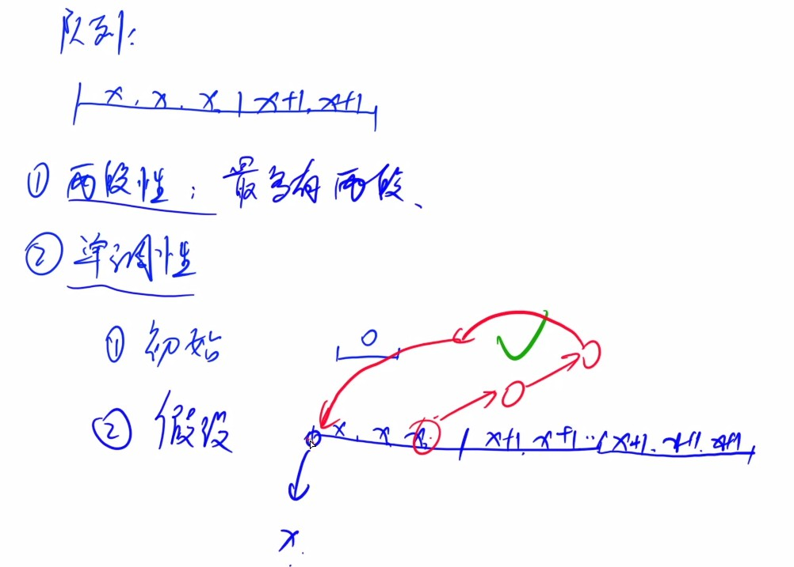


## 3 多源最短路

构建一个**虚拟源点**，根据需要是否真的把该点添加进来。

[地图中的最高点](https://leetcode-cn.com/problems/map-of-highest-peak/)


>给你一个大小为 m x n 的整数矩阵 isWater ，它代表了一个由 陆地 和 水域 单元格组成的地图。
如果 isWater[i][j] == 0 ，格子 (i, j) 是一个 陆地 格子。
如果 isWater[i][j] == 1 ，格子 (i, j) 是一个 水域 格子。
你需要按照如下规则给每个单元格安排高度：
每个格子的高度都必须是非负的。
如果一个格子是 水域 ，那么它的高度必须为 0 。
任意相邻的格子高度差 至多 为 1 。当两个格子在正东、南、西、北方向上相互紧挨着，就称它们为相邻的格子。（也就是说它们有一条公共边）
找到一种安排高度的方案，使得矩阵中的最高高度值 最大 。
请你返回一个大小为 m x n 的整数矩阵 height ，其中 height[i][j] 是格子 (i, j) 的高度。如果有多种解法，请返回 任意一个 。


解：

```c++  
class Solution {
public:
    vector<vector<int>> highestPeak(vector<vector<int>>& isWater) {
      int m = isWater.size(), n = isWater[0].size();
      queue<pair<pair<int,int>,int>> q;
      vector<vector<bool>> st(m,vector<bool>(n,false));
      vector<vector<int>> res(m,vector(n,0x3f3f3f3f));
      for(int i = 0; i < m; ++ i){
        for(int j = 0 ; j < isWater[i].size(); ++ j){
          if(isWater[i][j] == 1){
            q.push({make_pair(i,j),0});
            st[i][j] = true;
            res[i][j] = 0;
          }
        }
      }
      int dx[] = {-1, 0 , 0, 1}, dy[] = {0, -1, 1, 0};
      while(q.size()){
        auto t = q.front();   q.pop();
        int ver_x = t.first.first, ver_y = t.first.second, dist = t.second;
        for(int i = 0; i < 4 ; ++ i){
          int x = ver_x + dx[i], y = ver_y + dy[i];
          if(x >=0 && x < m && y >=0 && y < n && !st[x][y]){
            q.push(\{\{x, y}, dist + 1}); //
            st[x][y] = true;
            res[x][y] = dist + 1;
          }
        }
      }
      return res;
    }
};
```

## 4 最小步数模型


## 5 双端队列广搜

(边权只有0和1的最短路)
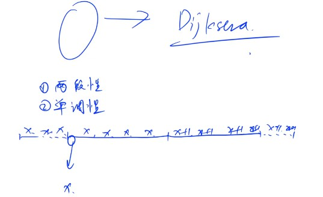

区别于一般bfs，把边权为0的放到队头，边权为1的才按照正常方式放到队尾。
但同时每个元素可能入队多次。(类似Dijkstra)
所以需要一个st数组。
同时使用deque结构。


[电路维修](https://www.acwing.com/problem/content/177/)

[LCP-信物传送](https://leetcode-cn.com/problems/6UEx57/)


```c++  
class Solution {
public:
    
    typedef pair<int, int> PII;
    int dist[110][110]; //需要更改传送带的次数。
    bool st[110][110];
    int dx[4] = {-1, 0, 1, 0}, dy[4] = {0, 1, 0, -1}; //4个方向。上右下左。
    char g[4] = {'^', '>', 'v', '<'};
    
    int conveyorBelt(vector<string>& matrix, vector<int>& start, vector<int>& end) {
        int n = matrix.size(), m = matrix[0].size();
        
        deque<PII> q;
        
        q.push_back({start[0], start[1]});
        memset(dist, -1, sizeof dist);
        dist[start[0]][start[1]] = 0;
        
        while (q.size())  {
            auto t = q.front();
            q.pop_front();
            
            int x = t.first, y = t.second;
            //到终点，直接return
            if (x == end[0]  && y == end[1]) return dist[x][y];
            if (st[x][y]) continue;
            st[x][y] = true;
            
            for (int i = 0; i < 4; i ++ ) {
                int a = x + dx[i], b = y + dy[i];
                if (a < 0 || a >= n || b < 0 || b >= m || st[a][b]) continue;
                
                if (g[i] == matrix[x][y]) {  //如果当前前进的方向 和传送带一个方向 加入队头
                    q.push_front({a, b});
                    dist[a][b] = dist[x][y];
                }  else {//前进方向和传送带不是一个方向，加入队尾。
                
                    q.push_back({a, b});
                    //如果当前点被更新过, 则更新为最小值。
                    if (dist[a][b] != -1) dist[a][b] = min(dist[a][b], dist[x][y] + 1);
                    else dist[a][b] = dist[x][y] + 1;
                }
                //cout << a << ' ' << b << ' ' << dist[a][b] << endl;
            }
        }
        return 0;
    }
};

```

## 6 双向广搜


应用于**最少步数模型**
如A -> B

[字串变换](https://www.acwing.com/solution/content/5434/)


[最小基因变化](https://leetcode-cn.com/problems/minimum-genetic-mutation/)
>基因序列可以表示为一条由 8 个字符组成的字符串，其中每个字符都是 'A'、'C'、'G' 和 'T' 之一。
假设我们需要调查从基因序列 start 变为 end 所发生的基因变化。一次基因变化就意味着这个基因序列中的一个字符发生了变化。
例如，"AACCGGTT" --> "AACCGGTA" 就是一次基因变化。
另有一个基因库 bank 记录了所有有效的基因变化，只有基因库中的基因才是有效的基因序列。
给你两个基因序列 start 和 end ，以及一个基因库 bank ，请你找出并返回能够使 start 变化为 end 所需的最少变化次数。如果无法完成此基因变化，返回 -1 。
注意：起始基因序列 start 默认是有效的，但是它并不一定会出现在基因库中。
示例 1：
输入：start = "AACCGGTT", end = "AACCGGTA", bank = ["AACCGGTA"]
输出：1
示例 2：
输入：start = "AACCGGTT", end = "AAACGGTA", bank = ["AACCGGTA","AACCGCTA","AAACGGTA"]
输出：2
示例 3：
输入：start = "AAAAACCC", end = "AACCCCCC", bank = ["AAAACCCC","AAACCCCC","AACCCCCC"]
输出：3
提示：
start.length == 8
end.length == 8
0 <= bank.length <= 10
bank[i].length == 8
start、end 和 bank[i] 仅由字符 ['A', 'C', 'G', 'T'] 组成


解：
本题数据量过小。
- 直接bfs能过
- 双向bfs
**注意技巧**

```c++  
class Solution {
public:
    // 解法2：双向bfs
    int minMutation(string start, string end, vector<string>& bank) {
        // 1：建立hashmap表，顺便去掉重复元素
        unordered_map<string,int> mp;
        for(const auto& b:bank)mp[b]=0;
        
        // 2：排除极端情况，end不在基因库中
        if(mp.count(end)==0)return -1;
        
        // 3：bfs的初始化工作
        queue<string> q1({start}),q2({end});// 前向队列，后向队列
        int step=0;
        const char table[4]={'A','C','G','T'};// 基因的字符
        // 或1表示前向队列由前往后遍历，或2表示后向队列由后向前遍历，每次我们选用较小的队列进行遍历
        for(mp[start]|=1,mp[end]|=2;q1.size()&&q2.size();++step)//每遍历完一次，步长+1
        {
            bool first=q1.size()<q2.size();
            queue<string> &q=first?q1:q2;// 选择较小的队列进行遍历节约时间
            int flag=first?1:2;// 此次遍历的方式
            
            for(int n=q.size();n--;q.pop()){
                string& temp=q.front();
                if(mp[temp]==3)return step;// 两个队列碰头，返回步长
                for(int i=0;i<temp.size();++i){
                    for(int j=0;j<4;++j){
                        string s=temp;
                        if(s[i]==table[j])continue;// 重复字符，跳出循环，寻找下一个字符
                        s[i]=table[j];
                        if(mp.count(s)==0||mp[s]&flag)continue;// 该单词不在 map 中或该单词已经被遍历过了，跳出循环，寻找下一个单词
                        mp[s]|=flag;// 标记该单词已经被遍历过了
                        q.push(s);
                    }
                }
            }
        }
        return -1;
    }
};
```

[打开转盘锁](https://leetcode.cn/problems/open-the-lock/)
[LC：单词接龙](https://leetcode.cn/problems/word-ladder/)

>字典 wordList 中从单词 beginWord 和 endWord 的 转换序列 是一个按下述规格形成的序列beginWord -> s1 -> s2 -> ... -> sk：
每一对相邻的单词只差一个字母。
 对于 1 <= i <= k 时，每个 si 都在 wordList 中。注意， beginWord 不需要在 wordList 中。
sk == endWord
给你两个单词 beginWord 和 endWord 和一个字典 wordList ，返回 从 beginWord 到 endWord 的 最短转换序列 中的 单词数目 。如果不存在这样的转换序列，返回 0 。
示例 1：
输入：beginWord = "hit", endWord = "cog", wordList = ["hot","dot","dog","lot","log","cog"]
输出：5
解释：一个最短转换序列是 "hit" -> "hot" -> "dot" -> "dog" -> "cog", 返回它的长度 5。
示例 2：
输入：beginWord = "hit", endWord = "cog", wordList = ["hot","dot","dog","lot","log"]
输出：0
解释：endWord "cog" 不在字典中，所以无法进行转换。
提示：
1 <= beginWord.length <= 10
endWord.length == beginWord.length
1 <= wordList.length <= 5000
wordList[i].length == beginWord.length
beginWord、endWord 和 wordList[i] 由小写英文字母组成
beginWord != endWord
wordList 中的所有字符串 互不相同

解：双向bfs

```c++  
class Solution {
    string A, B;
    set<string> st;
    int extend(queue<string>& q, unordered_map<string, int>& da, unordered_map<string, int>& db){
        int d = da[q.front()];
        while(q.size() && da[q.front()] == d){
            auto u = q.front();  q.pop();
            for(int i = 0; i < u.size(); ++ i){
                for(char k = 'a'; k <= 'z'; ++ k){
                    if(u[i] != k){
                        string t = u;  t[i] = k;
                        if(db.count(t) && st.count(t)) return da[u] + db[t] + 1;
                        if(da.count(t) && st.count(t)) continue;
                        if(st.count(t)){
                            da[t] = da[u] + 1;
                            q.push(t);
                        }

                    }
                }
            }
        }
        return -1;
    }

    int bfs(){
        if(A == B) return 0;
        unordered_map<string, int> da, db;
        queue<string> qa, qb;  
        qa.push(A), qb.push(B);
        da[A] = 0;  db[B] = 0;
        int t = -1;
        while(qa.size() && qb.size()){
            if(qa.size() <= qb.size()) t = extend(qa, da, db);
            else t = extend(qb, db, da);
            if(t != -1) return t + 1;            // emm
        }   
        return (~t) ? t + 1 : 0;   
    }
public:
    int ladderLength(string beginWord, string endWord, vector<string>& wordList) {
        A = beginWord, B = endWord;
        st.clear();
        for(auto s : wordList) st.insert(s);
        if(!st.count(endWord)) return 0;
        return bfs();
    }
};
```


## 7 A*

`PNC:图搜索基础算法，用于路径或速度规划`


先上题目：

[八数码](https://www.acwing.com/problem/content/181/) 详情可见基本算法部分中的逆序对问题。
[★★★★★第K短路](https://www.acwing.com/problem/content/180/)
[相似度为 K 的字符串](https://leetcode.cn/problems/k-similar-strings/)


---

[相似度为 K 的字符串](https://leetcode.cn/problems/k-similar-strings/)
>对于某些非负整数 k ，如果交换 s1 中两个字母的位置恰好 k 次，能够使结果字符串等于 s2 ，则认为字符串 s1 和 s2 的 相似度为 k 。
给你两个字母异位词 s1 和 s2 ，返回 s1 和 s2 的相似度 k 的最小值。
示例 1：
输入：s1 = "ab", s2 = "ba"
输出：1
示例 2：
输入：s1 = "abc", s2 = "bca"
输出：2
提示：
1 <= s1.length <= 20
s2.length == s1.length
s1 和 s2  只包含集合 {'a', 'b', 'c', 'd', 'e', 'f'} 中的小写字母
s2 是 s1 的一个字母异位词

解：
1.bfs+剪枝

```c++  
class Solution {
public:
    int kSimilarity(string s1, string s2) {
        int n = s1.size();
        queue<pair<string, int>> q;
        q.emplace(s1, 0);
        unordered_set<string> vis;
        vis.emplace(s1);

        for(int step = 0; ; ++ step){
            int sz = q.size();
            for(int i = 0; i < sz; ++ i){
                auto [cur, pos] = q.front();
                q.pop();
                if(cur == s2) return step;
                while(pos < n && cur[pos] == s2[pos]) pos ++;
                for(int j = pos + 1; j < n; ++ j){
                    if(cur[j] != s2[j] && cur[j] == s2[pos]){  // 剪枝
                        swap(cur[pos], cur[j]);
                        if(!vis.count(cur)){
                            vis.emplace(cur);
                            q.emplace(cur, pos + 1);
                        }
                        swap(cur[pos], cur[j]);
                    }
                }
            }
        }
    }
};
```

2.A*


```c++  
class Solution {
public:
    int minSwap(const string &s1, const string &s2, const int &pos) {
        int tot = 0;
        for (int i = pos; i < s1.size(); i++) {
            tot += s1[i] != s2[i];
        }
        return (tot + 1) / 2;
    }

    int kSimilarity(string s1, string s2) {
        typedef tuple<int, int, int, string> State;
        int n = s1.size();
        priority_queue<State, vector<State>, greater<State>> pq;
        unordered_set<string> visit;
        pq.emplace(0, 0, 0, s1);
        visit.emplace(s1);
        while (!pq.empty()) {
            auto [_, cost, pos, cur] = pq.top();
            pq.pop();
            if (cur == s2) {
                return cost;
            }
            while (pos < n && cur[pos] == s2[pos]) {
                pos++;
            }
            for (int j = pos + 1; j < n; j++) {
                if (s2[j] == cur[j]) {
                    continue;
                }
                if (s2[pos] == cur[j]) {
                    swap(cur[pos], cur[j]);
                    if (!visit.count(cur)) {
                        visit.emplace(cur);
                        pq.emplace(cost + 1 + minSwap(s2, cur, pos + 1), cost + 1, pos + 1, cur);
                    }
                    swap(cur[pos], cur[j]);
                }
            }
        } 
        return 0;
    }
}; 
```


# 2 DFS


对于BFS求最小步数(但存在占用空间太大问题，最多存储每层的数，且难以剪枝)，dfs亦能实现。通过两种方式： 1. 记全局最小值 2. 迭代加深？？


## 1 连通性
## 2 搜索顺序
## 3 剪枝与优化(已非最优或已无可行解)

**回溯**
dfs+剪枝 = 回溯

适用于组合数相当大按 [深度优先策略] ，根节点出发搜索空间树，搜索任意节点是否包含问题的解，不包含回溯，否则，继续进行深度优先搜索
通过 [剪枝函数] 约束条件 (constraint) 在扩展结点处减去不满足约束的子树；用限界函数（bound）剪去得不到最优解的子树（假如我们只需要最优解的时候用） 避免不必要搜索的穷举式搜索

回溯和深度优先搜索的区别
回溯是一种更通用的算法。可以用于任何类型的结构，其中可以消除域的部分 ——无论它是否是逻辑树。

深度优先搜索是与搜索树或图结构相关的特定回溯形式。它使用回溯作为其使用树的方法的一部分，但仅限于树/图结构。

回溯和 DFS 之间的区别在于回溯处理隐式树而 DFS 处理显式树。这似乎微不足道，但它意味着很多。当通过回溯访问问题的搜索空间时，隐式树在其中间被遍历和修剪。然而对于 DFS 来说，它处理的树/图是明确构造的，并且在完成任何搜索之前已经抛出了不可接受的情况，即修剪掉了。

因此，回溯是隐式树的 DFS，而 DFS 是回溯而不修剪。

3、回溯法模版
 回溯法的基本思想：

针对所给问题，定义问题的解空间；
确定易于搜索的解空间结构；
以深度优先方式搜索解空间，并在搜索过程中用剪枝函数避免无效搜索。


[划分为k个相等的子集](https://leetcode.cn/problems/partition-to-k-equal-sum-subsets/)
>给定一个整数数组  nums 和一个正整数 k，找出是否有可能把这个数组分成 k 个非空子集，其总和都相等。
示例 1：
输入： nums = [4, 3, 2, 3, 5, 2, 1], k = 4
输出： True
说明： 有可能将其分成 4 个子集（5），（1,4），（2,3），（2,3）等于总和。
示例 2:
输入: nums = [1,2,3,4], k = 3
输出: false
提示：
1 <= k <= len(nums) <= 16
0 < nums[i] < 10000
每个元素的频率在 [1,4] 范围内


解：
- 状态压缩 + 记忆化搜索
题目给定长度为 n 的数组nums，和整数 k，我们需要判断是否能将数组分成 k个总和相等的非空子集。首先计算数组的和 SUM，如果 SUM 不是 k 的倍数，那么不可能能有合法方案，此时直接返回 False。否则我们需要得到 k 个和为sum = SUM/k,的集合，那么我们每次尝试选择一个还在数组中的数，若选择后当前已选数字和等于 sum 则说明得到了一个集合，而已选数字和大于 sum 时，不可能形成一个集合从而停止继续往下选择新的数字。又因为 n 满足 1≤n≤16，所以我们可以用一个整数 S 来表示当前可用的数字集合：从低位到高位，第 i 位为 1 则表示数字 nums[i] 可以使用，否则表示nums[i] 已被使用。为了避免相同状态的重复计算，我们用 dp[S] 来表示在可用的数字状态为 S 的情况下是否可行，初始全部状态为记录为可行状态 True。这样我们就可以通过记忆化搜索这种「自顶向下」的方式来进行求解原始状态的可行性，而当状态集合中不存在任何数字时，即 S = 0时，表示原始数组可以按照题目要求来进行分配，此时返回 True 即可
同时为了更快剪枝，可将nums数组降序。

```c++  
class Solution {
public:
    bool canPartitionKSubsets(vector<int>& nums, int k) {
        int SUM = accumulate(nums.begin(), nums.end(), 0);
        if(SUM % k) return false;
        int sum = SUM / k;
        sort(nums.begin(), nums.end(), greater<>());
        if(nums[0] > sum) return false;

        int n = nums.size();
        vector<bool> dp(1 << n, true);
        function<bool(int, int)> dfs = [&](int s, int p)->bool {
            if(s == 0) return true;
            if(!dp[s]) return dp[s];
            dp[s] = false;
            for(int i = 0;i < n; ++ i){
                if(nums[i] + p > sum) continue; //break;
                if((s >> i) & 1){
                    if(dfs(s ^ (1 << i), (p + nums[i]) % sum)){
                        return true;
                    }
                }
            }
            return false;
        };
        return dfs((1 << n) - 1, 0);
    }
};
```

参考：

[回溯与DFS](https://blog.csdn.net/qq_42146775/article/details/113951382)


## 4 迭代加深

## 5 双向DFS

## 6 IDA*

- 对dfs的优化


---


*以下均为随机算法*
1.模拟退火
2.爬山

# 3 模拟退火

[oi-wiki](https://oi-wiki.org/misc/simulated-annealing/)

模拟退火是一种随机化算法。当一个问题的方案数量极大（甚至是无穷的）而且不是一个单峰函数时，我们常使用模拟退火求解。

模拟退火，顾名思义，是模拟「退火」的过程。当我们使用爬山算法的时候，对于非单峰函数的情形容易陷入次优解。爬山算法省略了最优解附近的非最优解从而想得到更优的答案，但是模拟退火试图以一定概率接受这个解。这个事情的实现即为「模拟退火」算法。（胡扯）
由于退火的过程有更多随机的选择因素，我们得到最优解的概率也会增加。


**注意卡时间：**
C++ 里面自带一个函数 clock() ，返回的是程序运行时间（单位是微秒），除以 CLOCKS_PER_SEC 就是运行秒数。所以我们可以这样：

`while (clock() / (1.0 * CLOCKS_PER_SEC) <= 0.98) solve();`
## 1.基础
[速通模拟退火（Simulated Annealing）](https://www.cnblogs.com/autoloop/p/15169642.html)

1.是什么？为什么？怎么做？
Q1:模拟退火是什么算法？
模拟退火是模拟物理上退火方法，通过N次迭代（退火），逼近函数的上的一个最值（最大或者最小值）。

比如逼近这个函数的最大值C点：
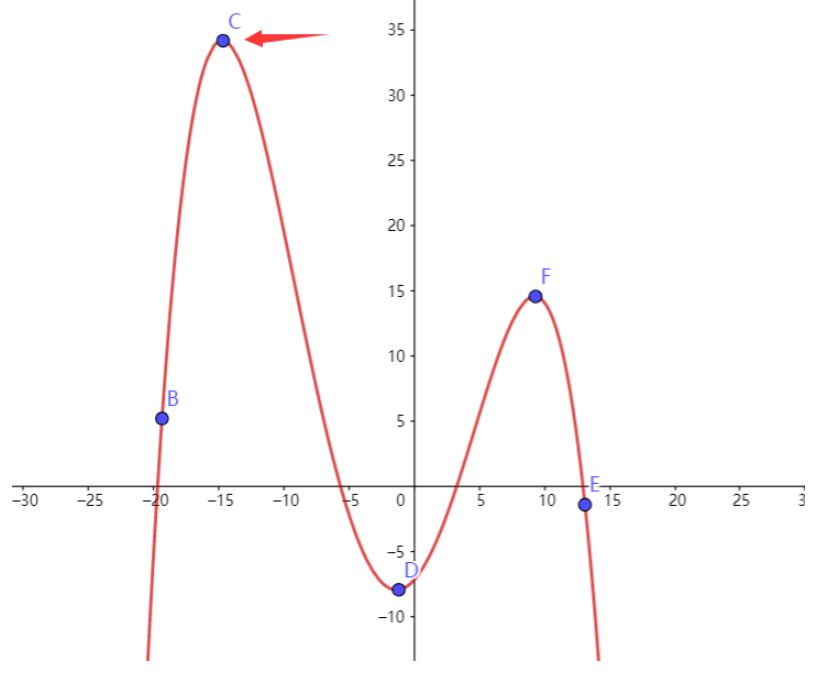

Q2:模拟退火为什么可行？
讨论这个问题需要理解一下物理原型是怎么样的，也就是原来是怎么“退火”的：

模拟退火算法的思想借鉴于固体的退火原理，当固体的**温度很高**的时候，内能比较大，固体的内部粒子处于**快速无序运动**，当温度**慢慢降低**的过程中，固体的内能减小，粒子的慢慢**趋于有序**，最终，当固体处于常温时，**内能达到最小**，此时，粒子**最为稳定**。

注意标粗字体：

温度高->运动速度快（温度低->运动速度慢）
温度是缓慢（想象成特别慢的那种）降低的
温度基本不再变化后，趋于有序(最后内能达到最小，也就是接近最优)
我们通过模拟这个操作，使得我们需要的答案“趋于有序”，也就是最靠近需要的值（最值）。

Q3:怎么做？
大方向
首先，理解一下**大方向**：

模拟退火就是一种**循环算法**。

1.我们先设定一个初始的温度T（这个温度会比较高，比如2000）
2.每次循环都**退火一次**。（具体怎么操作后面详解）
3.然后降低T的温度，我们通过让T和一个“降温系数”ΔT（一个接近1的小数，比如0.99)相乘，达到慢慢降低温度的效果，直到接近于0（我们用eps来代表一个接近0的数(比如0.00001)，只要T<eps就可以退出循环了）
所以总的来说，用伪代码表示退火的流程是这样的：


```c++  
double T = 2000; //代表开始的温度
double dT = 0.99; //代表系数delta T
double eps = 1e-14; //相当于0.0000000000000001
while(T > eps) {
    //--------------
    //这里是每一次退火的操作
	//--------------
    T = T * dT; //温度每次下降一点点， T * 0.99
}
```


**退火详解**
我们要求解的答案无非是两个：自变量x和对应函数的最大值f(x)

那么模拟退火的是怎么做到的呢？【下面车速很快，请系好安全带！】

1.我们先随机找一点x0 ，不论是哪个点都可以，随机！（不超过定义域就行）。

这个点作为我们的初始值（相当于物体里的一个粒子）

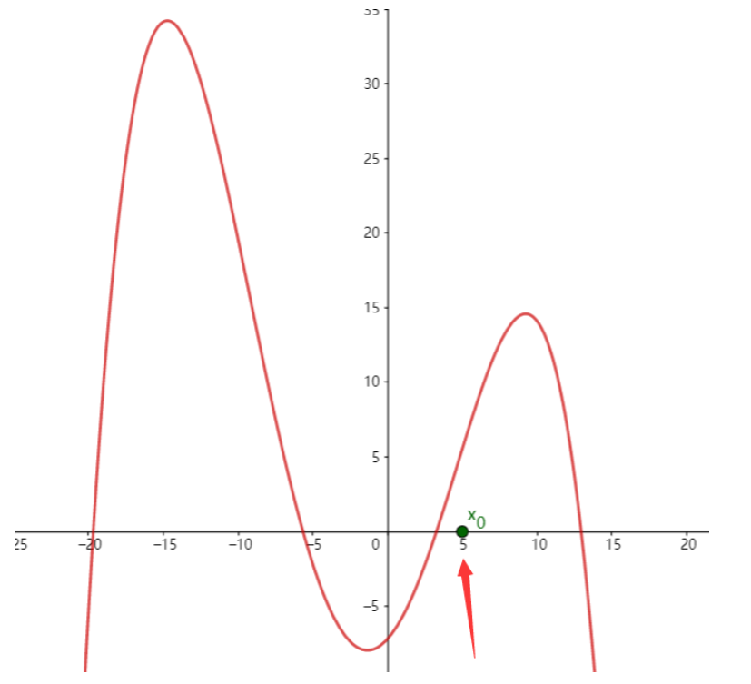

2.再找到一点f(x0),来代表x0所对应的函数值

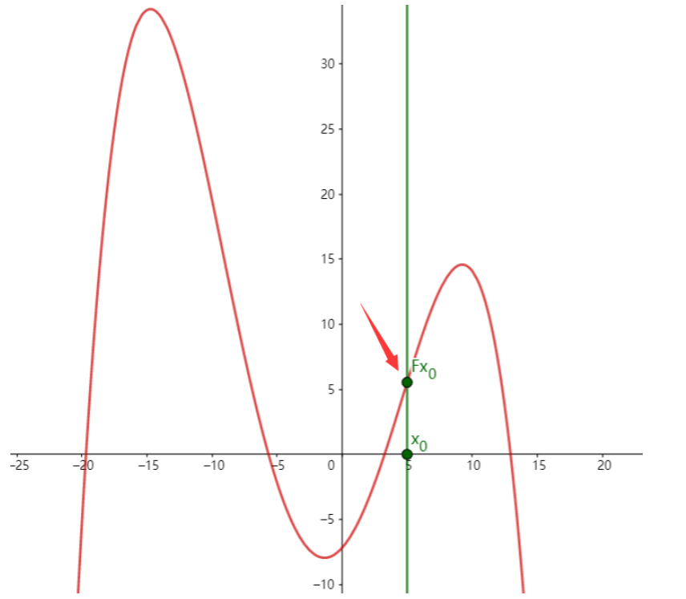

3.现在正式开始退火！

刚才我们说了x0相当于是**一个粒子**，所以我们会进行一个**无序运动**，也就是向左或者向右随机移动

是的，是**随机移动**，可能向左，也可能向右，但是请记住一个关键点：移动的**幅度**和**当前的温度T**有关。

**温度T越大，移动的幅度越大。温度T越小，移动的幅度就越小**。这是在模拟粒子无序运动的状态。

4.接受(Accept)更"好"的状态

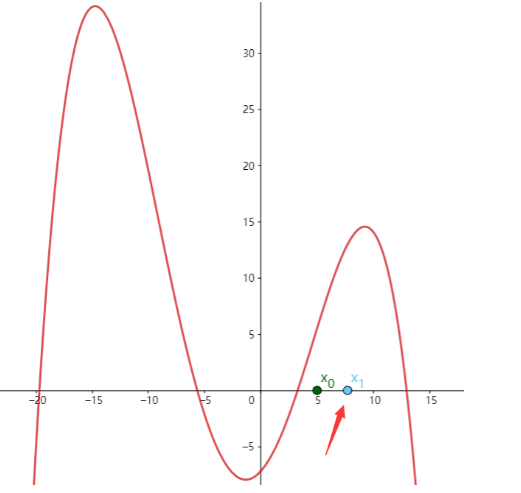

假设我们移动到了x1处，那么这个点对应的f(x1)很明显答案是优于（大于）当前的f(x0)的

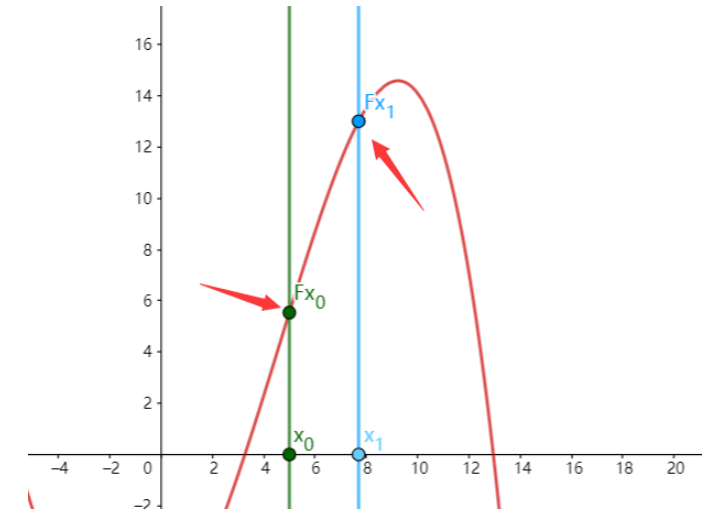


因此我们将答案进行更新。也就是将初始值进行替换：x0=x1,f(x0)=f(x1)。这是一种贪心的思想。

5.以一定概率接受(Accept)**更差的状态**

这是退火最精彩的部分。

为什么我们要接受一个更加差的状态呢？因为可能在一个较差的状态旁边会出现一个**更加高**的山峰

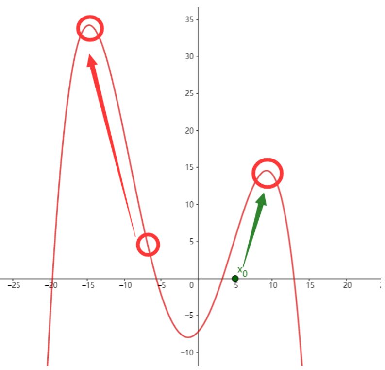

如果我们**鼠目寸光**，只盯着右半区，很容易**随着温度的下降、左右跳转幅度的减小而迷失自己，最后困死在小山丘中**。

而我们如果找到了左边山峰的低点，以一定的概率接受了它（概率大小和温度以及当前的值的关键程度有关），会在跳转幅度减少之前，尽可能找到最优点。

那么我们以多少的概率去接受它呢？我们用一个公式表示（这个公式我们只需记住，这是科学家推导出来的结论）：
`e^(Δf/kT)`
别慌！很简单！我们来理解一下这里面的变量：

- e是自然对数，约等于2.71。我们可以把右上角这一坨值Δf/kT看成一个整体x:
e^x的图形画出来是这样的：
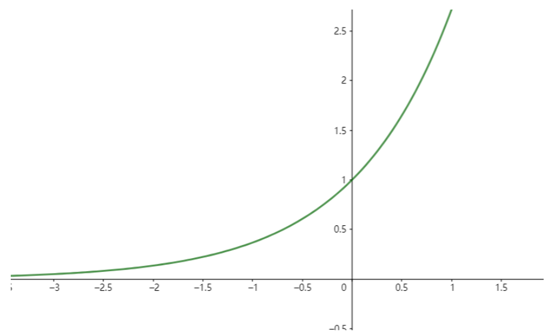
因为我们想要函数e^x来代表一个概率值，所以我们只需要关注x为**负数**的部分即可：
负数部分的值域是在(0,1)开区间内，x越小，越接近0，越大越靠近1
因为在0到1之间，所以这个值相当于是概率了。比如e^x=0.97，那么我们接受的概率就是97%
而正数部分的值域会大于1，也就是说概率会超过100%，所以会一定选（其实是上一种找到更优的情况）
- kT
k其实是个物理学常数，我们在代码中不会用到。
T很简单，就是当前的温度。所以实际上这个分母就是T，k当做1使用。
- Δf
我们着重讲一下什么是Δf。
其实从前面的函数e^x中可以发现，Δf必须是个负数！
我们想要函数e^x来代表一个概率值，一定要让它的值域属于(0,1)，所以Δf/kT必须是个负数。但是kT在我们的模拟中一定是正数，那么Δf必须是个负数！
其实Δf就是当前解的函数值与目标解函数值之差，Δf=−|f(x0)−f(x1)|，并且一定是个负数。这个需要**具体问题具体分析**。

比如现在我们求一个函数的**最大值**，那么如果`f(x0)<f(x1)`了，那就说明结果变好了，我们肯定选择它（见第4点）

如果f(x0)>f(x1)，那就说明结果**变差了**，我们需要概率选择它，因此`Δf=−(f(x0)−f(x1))`

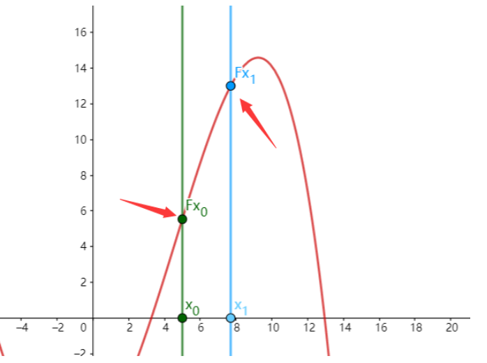

所以总结一下就是：

- 随机后的函数值如果结果更好，我们一定选择它(即x0=x1,f(x0)=f(x1))
- 随机后的函数值如果结果更差，我们以e^(Δf/kT)的概率接受它


>关于接受概率ex和Δf以及kT的关系：
当kT越大时(温度越高)，由于Δf是一个负数，所以算出来的值会越大。比如-1 / 1000 等于 -0.001，很明显-0.001 > -1，由于ex是个单调递增函数，所以温度越高时，接受的概率就越大。
Δf越小，说明答案越糟糕，那么接受的概率就越小。

**伪代码流程**

>注：对代码中的函数作出解释：
①对rand()函数
1.rand()函数可以默认拿到[0,32767]内的随机整数
2.RAND_MAX = 32767，可以看作常量。本质是宏定义: #define RAND_MAX 32767
3.rand() * 2 的范围是[0,32767 * 2]
4.rand() * 2 - RAND_MAX 的范围是[-32767, 32767]
②对exp()函数
exp(x)代表e^x
③关于exp((df - f) / T) * RAND_MAX > rand()
1.目的是要概率接受，但是ex是个准确值，所以从理论上我们可以生成一个（0,1）的随机数，如果ex比(0,1)这个随机数要大，那么我们就接受。
2.但是由于rand()只能产生[0,32767]内的随机整数，化成小数太过麻烦。所以我们可以把左边乘以RAND_MAX（也就是把概率同时扩大32767倍），效果就等同于ex比(0,1)了。


```c++  
double T = 2000; //代表开始的温度
double dT = 0.99; //代表系数delta T
double eps = 1e-14; //相当于0.0000000000000001

//用自变量计算函数值,这里可能存在多个自变量对应一个函数值的情况，比如f(x,y)
double func(int x, ... ) {
    //这里是对函数值进行计算
    double ans = .......
    return ans;
}
//原始值
double x = rand(); //x0取随机值
double f = func(x,...); //通过自变量算出f(x0)的值
while(T > eps) {
    //--------------
    //这里是每一次退火的操作
    
    //x1可以左右随机移动，幅度和温度T正相关，所以*T
    //注意这里移动可以左右移动，但是也可以单向移动
    //关于rand()详细见开头注的①
    double dx = x + (2*rand() - RAND_MAX) * T; 
    
    //让x落在定义域内，如果没在里面，就重新随机。题目有要求需要写，否则不用写
    // ================
    while(x > ? || x < ? ...) {
        double dx = x + (2*rand() - RAND_MAX) * T; 
    }
    // ================
    
    //求出f(x1)的值
    double df = func(dx);
    //这里需要具体问题具体分析，我们要接受更加优秀的情况。可能是df < f(比如求最小值）
    if(f < df) {
        f = df; x = dx;  [...,y = dy;] // 接受，替换值，如果多个自变量，那么都替换
    }
    //否则概率接受，注意这里df-f也要具体问题具体分析。
    //详细见开头注的②③
    else if(exp((df - f) / T) * RAND_MAX > rand()) {
        f = df; x = dx;  [...y = dy;] // 接受，替换值，如果多个自变量，那么都替换
    }
	//--------------
    T = T * dT; //温度每次下降一点点， T * 0.99
}
//最后输出靠近最优的自变量x值，和函数值f(x)
cout << x << " " << f << endl;
```


## 2.应用
### 2.1 开根号
通过模拟退火算出√n的值
思路是这样的：我们试图通过退火找出一个值x0，使得x0^2的值更加接近于√n^2。（记住退火是让一个随机值去逼近最后的答案）

因为x0^2的值更加接近于√n^2。因此x0值就更加接近于√n

1.所以我们需要一个函数f(x)，算出x02和n−−√2的接近程度，那么毋庸置疑，我们需要算出他们绝对值的差。

`f(x)=∣x^2−n∣`
也就是说我们的函数表达式就有了
```c++
//n代表我们最后函数要逼近的值
double n;
//x表示我们随机产生的那个数的平方和n的靠近程度
double func(double x) {
    return fabs(x * x - n);
}
```

2.写出退火函数SA()

```c++  
double T = 20000; //初始温度，初始温度主要是看题目开始需要跳转的幅度。
double dT = 0.993; //变化率，这里需要速度稍微慢一点，写0.995 或者 0.997都可以，但是越靠近1速度就越慢 
const double eps = 1e-14; //10的-14次方已经非常小了，写这个大概率没问题
void SA() {
    //首先随机生成一个点x0，这里我用0代替。
    double x = 0;
    //算出x平方和n的差距f(x0)
    double f = func(x);
    while(T > eps) {
        //这里x0既可以变小，也可以变大，所以我们正负都要进行一个跳转,算出变换后的点dx
        double dx = x + (2 * rand() - RAND_MAX) * T;
        //但是请注意，dx很明显要保证 >= 0才行，因为算术平方根的定义域是>=0，因此小于0就重新随机
        while(dx < 0) dx = x + (2 * rand() - RAND_MAX) * T;
        //算出变换后的点dx的平方和n的差距，f(dx)
        double df = func(dx);
        //这里就是关键的地方了，很明显我们需要算出来的function值越小，自变量x更加接近那个根号值。
        //所以如果新来的值df 比 f更小，我们百分百接受
        if(df < f) {
            //注意更新所有变量
            f = df; x = dx;
        }
        //否则我们概率接受，这里的需要写 f - df了，因为这样才是负值。负值说明我们并不是贪心接受的，他是不太好的值。
        else if(exp((f - df)/T) * RAND_MAX > rand()) {
            //注意更新所有变量
            f = df; x = dx;
        }
        //温度下降一下
        T *= dT;
    }
    printf("%.8lf",x);
}
```

最后贴上完整代码和注释供大家调试。

```c++  
#include <bits/stdc++.h>
using namespace std;
//n代表我们最后函数要逼近的值
double n;
//x表示我们随机产生的那个数的平方和n的靠近程度
double func(double x) {
    return fabs(x * x - n);
}
double T = 20000; //初始温度，初始温度主要是看题目开始需要跳转的幅度。
double dT = 0.993; //变化率，这里需要速度稍微慢一点，写0.995 或者 0.997都可以，但是越靠近1速度就越慢 
const double eps = 1e-14; //10的-14次方已经非常小了，写这个大概率没问题
void SA() {
    //首先随机生成一个点x0，这里我用0代替。
    double x = 0;
    //算出x平方和n的差距f(x0)
    double f = func(x);
    while(T > eps) {
        //这里x0既可以变小，也可以变大，所以我们正负都要进行一个跳转,算出变换后的点dx
        double dx = x + (2 * rand() - RAND_MAX) * T;
        //但是请注意，dx很明显要保证 >= 0才行，因为算术平方根的定义域是>=0，因此小于0就重新随机
        while(dx < 0) dx = x + (2 * rand() - RAND_MAX) * T;
        //算出变换后的点dx的平方和n的差距，f(dx)
        double df = func(dx);
        //这里就是关键的地方了，很明显我们需要算出来的function值越小，自变量x更加接近那个根号值。
        //所以如果新来的值df 比 f更小，我们百分百接受
        if(df < f) {
            //注意更新所有变量
            f = df; x = dx;
        }
        //否则我们概率接受，这里的需要写 f - df了，因为这样才是负值。负值说明我们并不是贪心接受的，他是不太好的值。
        else if(exp((f - df)/T) * RAND_MAX > rand()) {
            //注意更新所有变量
            f = df; x = dx;
        }
        //温度下降一下
        T *= dT;
    }
    printf("%.8lf",x);
}
int main() 
{
    cin >> n;
    SA();
}
```
### 2.2 连续区间内最值

[星星还是树](https://www.acwing.com/problem/content/3170/)

>给出平面上N（N<=100）个点，你需要找到一个这样的点，使得这个点到N个点的距离之和尽可能小。输出这个最小的距离和（四舍五入到最近的整数）。
Input输入
第一行N，接下来N行每行两个整数，表示N个点
Output输出
一行一个正整数，最小的距离和。
Sample Input样例输入
4
0 0
0 10000
10000 10000
10000 0
Sample Output样例输出
28284

解：
- 1.模拟退火法
一次模拟退火中温度tt需要覆盖数据范围的3倍,比如题目中[0, 1e4],当t=1e4时新的x或y
的范围是[x−t,x+t]=[−1e4,2e4]区间范围是3e4,这大概是因为这符合正态分布3δ3δ覆盖了
绝大部分(大概96%)数据范围.

**时间复杂度**
每一个t计算距离和O(n) ,每次t都乘0.9,所以总的时间复杂度是O(nlogt) .
由于一次模拟退火时间复杂度很小故而进行多次模拟退火选取最小的距离作为答案


```c++  
#include <iostream>
#include <cstdio>
#include <cstring>
#include <algorithm>
#include <cmath>
#include <cstdlib>
#include <ctime>
using namespace std;
const int N = 110;
typedef pair<double, double> PDD;

#define x first
#define y second

int n;
PDD q[N];
double ans = 1e8;

double rand(double l, double r){
  return (double)rand() / RAND_MAX * (r - l) + l;
}

double get_dist(PDD a, PDD b){
  double dx = a.x - b.x;
  double dy = a.y - b.y;
  return sqrt(dx * dx + dy * dy);
}

double cal(PDD p){
  double res = 0;
  for(int i = 0; i < n; ++ i){
    res += get_dist(p, q[i]);
  }
  ans = min(ans, res);
  return res;
}

void sa()  // simulate_anneal()
{
  PDD cur(rand(0, 10000), rand(0, 10000));
  for(double t = 1e4; t > 1e-4; t *= 0.9){
    PDD np(rand(cur.x - t, cur.x + t), rand(cur.y - t, cur.y + t));
    double dt = cal(np) - cal(cur);
    if(exp(- dt / t) > rand(0, 1)) cur = np; // 妙啊
  }
}

int main()
{
  scanf("%d", &n);
  for(int i = 0; i < n; ++ i) scanf("%lf%lf", &q[i].x, &q[i].y);
  
  for(int i = 0; i < 100; ++ i) sa();
  
  printf("%.0lf\n", ans);  // lf

	return 0;
}
```


- 2.三分法？？

[最小球覆盖——模拟退火&&三分套三分套三分](https://www.cnblogs.com/lfri/p/11604701.html)

(三分套三分)
距离最小点在多边形内部
先三分x维度，然后在三分x维的基础上三分y维度


三分套三分
求`z=x2+y2`的最小值，根据多元函数求偏导，二阶导数大于0，凹函数，存在最小值，有多元函数微分学味了。
固定x，三分求y，一般这样求多个变量的，一般可以先固定一个！

一行语句实现浮点数的四舍五入printf("%d",(int)(check(l) + 0.5)); // 浮点数四舍五入，学到了！

时间复杂度O(logn∗logn∗n) 
```c++  

#include <iostream>
#include <cmath>

using namespace std;

const int N = 110;

#define eps 1e-4

int n;
int x[N],y[N];

double dis(double x1,double y1)
{
    double sum = 0.0;
    for(int i =0;i < n;i ++ )
        sum += sqrt((x[i] - x1)*(x[i] - x1) + (y[i] - y1)*(y[i] - y1));
    return sum;
}

double check(double x1) // 三分y，x和y都是凹函数，结构一样
{
    double l = 0.0,r = 10000.0;
    while(r - l > eps)
    {
        double mid = (l + r) / 2;
        double mmid = (mid + r) / 2;
        if(dis(x1, mid) > dis(x1, mmid)) l = mid;
        else r = mmid; // 这里是r = mmid;
    }
    return dis(x1,l);
}

int main()
{
    cin >> n;
    for(int i = 0;i < n;i ++ ) cin >> x[i] >> y[i];

    double l = 0.0,r = 10000.0;
    while(r - l > eps)  // 三分x
    {
        double mid = (l + r) / 2;
        double mmid = (mid + r) / 2;
        if(check(mid) > check(mmid)) l = mid;
        else r = mmid; // 这里是r = mmid;
    }

    printf("%d",(int)(check(l) + 0.5)); // 浮点数四舍五入，学到了！

    return 0;
}

```


[均分数据](https://www.acwing.com/problem/content/2682/)


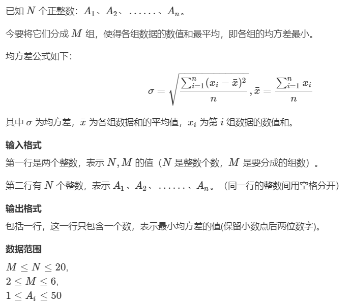
输入样例：
6 3
1 2 3 4 5 6
输出样例：
0.00


- 1.模拟退火

```c++  
#include <iostream>
#include <cstring>
#include <algorithm>
#include <cmath>

using namespace std;

const int N = 25, M = 10;

int n, m;
int w[N], s[M];
double ans = 1e8;

double calc()
{
    memset(s, 0, sizeof s);
    for (int i = 0; i < n; i ++ )
    {
        int k = 0;
        for (int j = 0; j < m; j ++ )
            if (s[j] < s[k])
                k = j;
        s[k] += w[i];
    }

    double avg = 0;
    for (int i = 0; i < m; i ++ ) avg += (double)s[i] / m;
    double res = 0;
    for (int i = 0; i < m; i ++ )
        res += (s[i] - avg) * (s[i] - avg);
    res = sqrt(res / m);
    ans = min(ans, res);
    return res;
}

void simulate_anneal()
{
    random_shuffle(w, w + n);

    for (double t = 1e6; t > 1e-6; t *= 0.95)
    {
        int a = rand() % n, b = rand() % n;
        double x = calc();
        swap(w[a], w[b]);
        double y = calc();
        double delta = y - x;
        if (exp(-delta / t) < (double)rand() / RAND_MAX)
            swap(w[a], w[b]);
    }
}

int main()
{
    cin >> n >> m;
    for (int i = 0; i < n; i ++ ) cin >> w[i];

    for (int i = 0; i < 100; i ++ ) simulate_anneal();
    printf("%.2lf\n", ans);

    return 0;
}
```

- 贪心
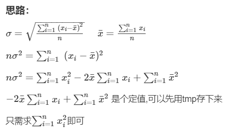

我们可以用`random_shuffle()`用来对原数据进行重新排序，然后利用贪心的思想（每次把数加在最小的组里），即可满足均方差最小。

用`while ((double)clock()/CLOCKS_PER_SEC<0.8)`来卡时。


```c++  
#include <bits/stdc++.h>
using namespace std;
#define pb push_back
#define mp(aa,bb) make_pair(aa,bb)
#define _for(i,b) for(int i=(0);i<(b);i++)
#define rep(i,a,b) for(int i=(a);i<=(b);i++)
#define per(i,b,a) for(int i=(b);i>=(a);i--)
#define mst(abc,bca) memset(abc,bca,sizeof abc)
#define X first
#define Y second
#define lowbit(a) (a&(-a))
#define debug(a) cout<<#a<<":"<<a<<"\n"
typedef long long ll;
typedef pair<int,int> pii;
typedef unsigned long long ull;
typedef long double ld;
const int N=25;
const int INF=0x3f3f3f3f;
const int mod=1e9+7;
const double eps=1e-6;
const double PI=acos(-1.0);

int n,m;
double x[N],s[N];
double ans=INF,aver;

void calc(){
    double tmp=aver*aver*m-2*aver*aver*m;
    random_shuffle(x+1,x+1+n);
    mst(s,0);
    rep(i,1,m) s[i]=x[i];
    rep(i,m+1,n){
        int p=min_element(s+1,s+m+1)-s;//找出最小的位置
        s[p]+=x[i];
    }
    double sum=0;
    rep(i,1,m) sum+=s[i]*s[i];
    ans=min(ans,sum+tmp);
}

void solve(){
    cin>>n>>m;
    aver=0;
    rep(i,1,n) cin>>x[i],aver+=x[i];
    aver/=m;
    while ((double)clock()/CLOCKS_PER_SEC<0.8) calc(); //卡时
    cout<<fixed<<setprecision(2)<<sqrt(ans/m)<<"\n";
}


int main(){
    ios::sync_with_stdio(0);cin.tie(0);
//  int t;cin>>t;while(t--)
    solve();
    return 0;
}
```


### 2.3 常规问题退火解法


[串联字符串的最大长度](https://leetcode-cn.com/problems/maximum-length-of-a-concatenated-string-with-unique-characters/)

>给定一个字符串数组 arr，字符串 s 是将 arr 的含有 不同字母 的 子序列 字符串 连接 所得的字符串。
请返回所有可行解 s 中最长长度。
子序列 是一种可以从另一个数组派生而来的数组，通过删除某些元素或不删除元素而不改变其余元素的顺序。
示例 1：
输入：arr = ["un","iq","ue"]
输出：4
解释：所有可能的串联组合是：
- ""
- "un"
- "iq"
- "ue"
- "uniq" ("un" + "iq")
- "ique" ("iq" + "ue")
最大长度为 4。
示例 2：
输入：arr = ["cha","r","act","ers"]
输出：6
解释：可能的解答有 "chaers" 和 "acters"。
示例 3：
输入：arr = ["abcdefghijklmnopqrstuvwxyz"]
输出：26


- 1. 剪枝 DFS
回溯 位运算
```c++  
class Solution {
public:
    int maxLength(vector<string> &arr) {
        vector<int> masks;
        for (string &s : arr) {
            int mask = 0;
            for (char ch : s) {
                ch -= 'a';
                if ((mask >> ch) & 1) { // 若 mask 已有 ch，则说明 s 含有重复字母，无法构成可行解
                    mask = 0;
                    break;
                }
                mask |= 1 << ch; // 将 ch 加入 mask 中
            }
            if (mask > 0) {
                masks.push_back(mask);
            }
        }

        int ans = 0;
        function<void(int, int)> backtrack = [&](int pos, int mask) {
            if (pos == masks.size()) {
                ans = max(ans, __builtin_popcount(mask));
                return;
            }
            if ((mask & masks[pos]) == 0) { // mask 和 masks[pos] 无公共元素
                backtrack(pos + 1, mask | masks[pos]);
            }
            backtrack(pos + 1, mask);
        };
        backtrack(0, 0);
        return ans;
    }
};
```

- 2.二进制枚举

```c++  
class Solution {
public:
    int maxLength(vector<string>& arr) {
        int n = arr.size();
        int ans = 0;
        for( int i = 0; i < (1 << n); ++i ) {
            int f[26] = {0};
            bool ok = true;
            for( int j = 0; j < n; ++j ) {
                if( (1 << j) & i ) {
                    for( char ch: arr[j] ) {
                        ++f[ch - 'a'];
                        if( f[ch - 'a'] > 1 ) {
                            ok = false;
                            break;
                        }
                    }
                } 
                if( !ok ) break;
            }
            if( ok ) ans = max( ans, accumulate(f, f + 26, 0) );
        }
        return ans;
    }
};
```

- 3.01背包+掩码


1.2.背包大小为26。
vector<int> dp[i]表示占用背包空间i时，可能的字符串序列集合（所有字符串均使用位运算转化为int）。
vector<vector<int>> dp(27, vector<int>{});
3.string->int： ans |= 1<<string[i]-'a' 对string每位做或运算得到对应int，如果string中出现重复字母，返回-1。
4.dp[i-len]中的字符序列，如果与当前str无重复，将其与str2bin(str)做或运算后放入dp[i]中。（即拼接两字符序列）
if((item & bin)==0){
    dp[i].push_back(item|bin);
}
5.找到最大的i，满足dp[i]不为空。i即为所求。


```c++  
int str2bin(string& str){
    int ans = 0;
    for(auto c:str){
        if((ans & (1<<(c-'a')))!=0)  return -1;
        ans |= (1<<(c-'a'));
    }
    return ans;
}
int maxLength(vector<string>& arr) {
    vector<vector<int>> dp(27, vector<int>{});
    dp[0] = {0};
    for(auto str:arr){
        int len=str.size();
        int bin=str2bin(str);
        if(bin<0)   continue;
        for(int i=26; i>=len; i--){
            if(dp[i-len].size()){
                for(auto item:dp[i-len]){
                    if((item & bin)==0){
                        dp[i].push_back(item|bin);
                    }
                }
            }
        }
    }
    for(int i=26;i>=0;i--){
        if(dp[i].size())   return i;
    }
    return 0;
}
```

- 3.模拟退火


```c++  
class Solution {
    vector<int> a;
    int n, ans = 0;
    int enegry(){
        int res = 0, mask = 0;
        for(int i = 0; i < n; ++ i){
            if(mask & a[i]) continue;
            else mask |= a[i];
        }
        for(int i = 0; i < 32; ++ i) if(mask >> i & 1) res ++;
        return res;
    }

    void sa(){
        srand(time(NULL));
        random_shuffle(a.begin(), a.end());
        for(int t = 1e6; t > 1e-6; t *= 0.95){
            int i = rand() % n, j = rand() % n;
            int ei = enegry();
            swap(a[i], a[j]);
            int ej = enegry();
            ans = max({ans, ei, ej});
            int de = ei - ej;
            if(de < 0) continue;
            if(exp(-1 * de / t) * RAND_MAX >= rand()) continue;
            swap(a[i], a[j]);
        }
    }    

public:
    int maxLength(vector<string>& arr) {
        for(auto& s : arr){
            int mask = 0, f = 1;
            for(auto c : s){
                int i = c - 'a';
                if((mask >> i) & 1){
                    f = 0;  break;
                }else{
                    mask |= (1 << i);
                }
            }
            if(f) a.push_back(mask);
        }
        this->n = a.size();
        if(!n) return 0;
        for(int i = 0; i < 2; ++ i) sa();
        return ans;
    }
};
```


其他能用模拟退火求解的问题有：
[模拟退火——leetcode](https://blog.csdn.net/csdn_ggboy/article/details/121993380)

如下：

[1815. 得到新鲜甜甜圈的最多组数](https://leetcode-cn.com/problems/maximum-number-of-groups-getting-fresh-donuts/)

[1723. 完成所有工作的最短时间](https://leetcode-cn.com/problems/find-minimum-time-to-finish-all-jobs/)
[1879. 两个数组最小的异或值之和](https://leetcode-cn.com/problems/minimum-xor-sum-of-two-arrays/)
[1655. 分配重复整数](https://leetcode-cn.com/problems/distribute-repeating-integers/)
[1515. 服务中心的最佳位置](https://leetcode-cn.com/problems/best-position-for-a-service-centre/)
上题亦可用爬山法。


**具体代码与解法：**
[1815. 得到新鲜甜甜圈的最多组数](https://leetcode-cn.com/problems/maximum-number-of-groups-getting-fresh-donuts/)

>有一个甜甜圈商店，每批次都烤 batchSize 个甜甜圈。这个店铺有个规则，就是在烤一批新的甜甜圈时，之前 所有 甜甜圈都必须已经全部销售完毕。给你一个整数 batchSize 和一个整数数组 groups ，数组中的每个整数都代表一批前来购买甜甜圈的顾客，其中 groups[i] 表示这一批顾客的人数。每一位顾客都恰好只要一个甜甜圈。
当有一批顾客来到商店时，他们所有人都必须在下一批顾客来之前购买完甜甜圈。如果一批顾客中第一位顾客得到的甜甜圈不是上一组剩下的，那么这一组人都会很开心。
你可以随意安排每批顾客到来的顺序。请你返回在此前提下，最多 有多少组人会感到开心。
示例 1：
输入：batchSize = 3, groups = [1,2,3,4,5,6]
输出：4
解释：你可以将这些批次的顾客顺序安排为 [6,2,4,5,1,3] 。那么第 1，2，4，6 组都会感到开心。
示例 2：
输入：batchSize = 4, groups = [1,3,2,5,2,2,1,6]
输出：4
提示：
1 <= batchSize <= 9
1 <= groups.length <= 30
1 <= groups[i] <= 109


- 1.dfs+二进制(二进制模拟32进制)+状压


本题问题为：如何排列时，则有最多数量的下标的前缀和模 batchSizebatchSize 余 00 ？（此处前缀和不包括下标所在的数）
比如，示例一中：

6,2,4,5,1,3
66 左边的数的和为 00，模 33 余 00 ，ans++  ;
22 左边的数的和为 66，模 33 余 00 ，ans++  ;
44 左边的数的和为 88，模 33 余 22 ;
55 左边的数的和为 1212，模 33 余 00 ，ans++  ;
11 左边的数的和为 1717，模 33 余 22 ;
33 左边的数的和为 1818，模 33 余 00 ，ans++  。
所以上述四个下标的顾客可以吃到新鲜的甜甜圈，ans=4 。


```c++  
class Solution {
    typedef long long ll;
    unordered_map<ll,int>M;
    int batchSize;
    //cur表示目前左边的余数，state表示剩余顾客的分布
    int dfs(int cur,ll state){
        if(M.count(state))return M[state];
        if(!state)return M[state]=0;
        int res=0;
        for(int i=1;i<batchSize;i++){
            //如果还有余数为i的顾客，就尝试令他作为下一波顾客
            if((state>>(i*5))%32){
                int temp=dfs((cur+i)%batchSize,state-(1ll<<(i*5)));
                res=max(res,cur?temp:temp+1);
            }
        }
        return M[state]=res;
    }
public:
    int maxHappyGroups(int _batchSize, vector<int>& groups) {
        batchSize=_batchSize;
        ll state=0;
        int mod0=0;
        for(int a:groups){
            a%=batchSize;
            if(!a)mod0++;//余数为0直接贪心作为最左边的顾客
            else state+=1ll<<(a*5);
        }
        return mod0+dfs(0,state);
    }
};

```
- 2.状压DP(极难)？？

```c++  
int freq0[9], freq[9], w[9], f[300000];
class Solution {
public:
    int maxHappyGroups(int b, vector<int>& groups) {
        for(int i = 0; i < b; ++i) freq0[i] = 0;
        for(int i : groups) freq0[i % b]++;
        int msum = 1;
        for(int i = 1; i < b; ++i) msum *= (freq0[i] + 1);
        w[1] = 1;
        for(int i = 2; i < b; ++i) w[i] = w[i-1] * (freq0[i-1] + 1);
        for(int fmask = 0; fmask < msum; ++fmask) f[fmask] = 0;
        for(int fmask = 1; fmask < msum; ++fmask) {
            int last = 0;
            for(int i = 1; i < b; ++i) {
                freq[i] = (fmask / w[i]) % (freq0[i] + 1);
                last = (last + (freq0[i] - freq[i]) * i) % b;
            }
            for(int c = 1; c < b; ++c) {
                if(freq[c]) f[fmask] = max(f[fmask], f[fmask - w[c]] + (last == 0));
            }
        }
        return f[msum-1] + freq0[0];
    }
};

```

- 模拟退火
```c++  
class Solution {
public:
    int batchSize;
    int n;
    int ans = 0;
    vector<int> groups;
    int energy()
    {
        int res = 1;
        for (int i = 0, s = 0; i < n; i ++ ) {  //计算是否有剩余
            s = (s + groups[i]) % batchSize;
            if (!s && i < n - 1) res ++ ;
        }
        ans = max(ans, res);
        return -res;
    }
    void SA()
    {
        srand(time(NULL));    //很重要
        random_shuffle(groups.begin(), groups.end());
        for(double t = 1e6; t > 1e-6; t *= 0.96) {
            int a = rand() % n, b = rand() % n;
            int ea = energy();
            swap(groups[a], groups[b]);
            int eb = energy();
            int dt = eb - ea;
            if(exp(-dt / t) > (double)rand() / RAND_MAX) continue;
            swap(groups[a], groups[b]);
        }
    }
    int maxHappyGroups(int _batchSize, vector<int>& _groups) {
        //调整groups的顺序，使最多人开心
        batchSize = _batchSize;
        groups = _groups;
        n = groups.size();
        for(int i = 0; i < 100; i ++ )  SA();
        return ans;
    }
};

```


[1723. 完成所有工作的最短时间](https://leetcode-cn.com/problems/find-minimum-time-to-finish-all-jobs/)

>给你一个整数数组 jobs ，其中 jobs[i] 是完成第 i 项工作要花费的时间。
请你将这些工作分配给 k 位工人。所有工作都应该分配给工人，且每项工作只能分配给一位工人。工人的 工作时间 是完成分配给他们的所有工作花费时间的总和。请你设计一套最佳的工作分配方案，使工人的 最大工作时间 得以 最小化 。
返回分配方案中尽可能 最小 的 最大工作时间 。
示例 1：
输入：jobs = [3,2,3], k = 3
输出：3
解释：给每位工人分配一项工作，最大工作时间是 3 。
示例 2：
输入：jobs = [1,2,4,7,8], k = 2
输出：11
解释：按下述方式分配工作：
1 号工人：1、2、8（工作时间 = 1 + 2 + 8 = 11）
2 号工人：4、7（工作时间 = 4 + 7 = 11）
最大工作时间是 11 。
提示：
1 <= k <= jobs.length <= 12
1 <= jobs[i] <= 107


- 1.状压dp  O(n * 3^n)


```c++  
class Solution {
public:
    int minimumTimeRequired(vector<int>& jobs, int k) {
        int n = jobs.size();
        vector<int> sum(1 << n);
        for (int i = 1; i < (1 << n); i++) {
            int x = __builtin_ctz(i), y = i - (1 << x);
            sum[i] = sum[y] + jobs[x];
        }

        vector<vector<int>> dp(k, vector<int>(1 << n));
        for (int i = 0; i < (1 << n); i++) {
            dp[0][i] = sum[i];
        }

        for (int i = 1; i < k; i++) {
            for (int j = 0; j < (1 << n); j++) {
                int minn = INT_MAX;
                for (int x = j; x; x = (x - 1) & j) {
                    minn = min(minn, max(dp[i - 1][j - x], sum[x]));
                }
                dp[i][j] = minn;
            }
        }
        return dp[k - 1][(1 << n) - 1];
    }
};
```
- 2.二分+回溯+剪枝 O(nlogn+log(S−M)×k^n)


```c++  
class Solution {
public:
    bool backtrack(vector<int>& jobs, vector<int>& workloads, int idx, int limit) {
        if (idx >= jobs.size()) {
            return true;
        }
        int cur = jobs[idx];
        for (auto& workload : workloads) {
            if (workload + cur <= limit) {
                workload += cur;
                if (backtrack(jobs, workloads, idx + 1, limit)) {
                    return true;
                }
                workload -= cur;
            }
            // 如果当前工人未被分配工作，那么下一个工人也必然未被分配工作
            // 或者当前工作恰能使该工人的工作量达到了上限
            // 这两种情况下我们无需尝试继续分配工作
            if (workload == 0 || workload + cur == limit) {
                break;
            }
        }
        return false;
    }
    bool check(vector<int>& jobs, int k, int limit) {
        vector<int> workloads(k, 0);
        return backtrack(jobs, workloads, 0, limit);
    }
    int minimumTimeRequired(vector<int>& jobs, int k) {
        sort(jobs.begin(), jobs.end(), greater<int>());
        int l = jobs[0], r = accumulate(jobs.begin(), jobs.end(), 0);
        while (l < r) {
            int mid = (l + r) >> 1;
            if (check(jobs, k, mid)) {
                r = mid;
            } else {
                l = mid + 1;
            }
        }
        return l;
    }
};
```

- 3.模拟退火


```c++  
class Solution {
public:
    int ans = INT_MAX;
    vector<int> jobs;
    int energy(int k)
    {
        int n = jobs.size();
        vector<int> s(k);
        for(int i = 0; i < n; i ++ )//对于每项工作，找到一个最闲的工人分配
        {
            int kk = 0;
            for(int j = 1; j < k; j ++ )
                if(s[j] < s[kk]) kk = j;
            s[kk] += jobs[i];
        }
        int res = 0;
        for(auto &x : s)
            res = max(x, res);//找到最大工作时间
        ans = min(ans, res);
        return res; //能量越小越好 
    }
    void SA(int k)
    {
        int n = jobs.size();
        double T = 10000;//一个很高的温度
        random_shuffle(jobs.begin(), jobs.end());//产生随机的工作分配顺序
        while(T > 1e-4) //降温过程
        {
            T *= 0.92;
            int a = rand() % n, b = rand() % n;
            int ea = energy(k);
            swap(jobs[a], jobs[b]);
            int eb = energy(k);
            int dt = eb - ea;
            if(dt <= 0 || exp(-dt / T) > rand() / RAND_MAX) continue;//以一定概率接受
            swap(jobs[a], jobs[b]);//不接受
        }
    }
    int minimumTimeRequired(vector<int>& _jobs, int k) {
        //每个工人至少分配一个工作
        jobs = _jobs;
        for(int i = 0; i < 7; i ++ )   SA(k);
        return ans;
    }
};

```


[1879. 两个数组最小的异或值之和](https://leetcode-cn.com/problems/minimum-xor-sum-of-two-arrays/)
见状压dp部分的四种解法.


[1655. 分配重复整数](https://leetcode-cn.com/problems/distribute-repeating-integers/)

>给你一个长度为 n 的整数数组 nums ，这个数组中至多有 50 个不同的值。同时你有 m 个顾客的订单 quantity ，其中，整数 quantity[i] 是第 i 位顾客订单的数目。请你判断是否能将 nums 中的整数分配给这些顾客，且满足：
第 i 位顾客 恰好 有 quantity[i] 个整数。
第 i 位顾客拿到的整数都是 相同的 。
每位顾客都满足上述两个要求。
如果你可以分配 nums 中的整数满足上面的要求，那么请返回 true ，否则返回 false 。
示例 1：
输入：nums = [1,2,3,4], quantity = [2]
输出：false
解释：第 0 位顾客没办法得到两个相同的整数。
示例 2：
输入：nums = [1,2,3,3], quantity = [2]
输出：true
解释：第 0 位顾客得到 [3,3] 。整数 [1,2] 都没有被使用。
示例 3：
输入：nums = [1,1,2,2], quantity = [2,2]
输出：true
解释：第 0 位顾客得到 [1,1] ，第 1 位顾客得到 [2,2] 。
提示：
n == nums.length
1 <= n <= 105
1 <= nums[i] <= 1000
m == quantity.length
1 <= m <= 10
1 <= quantity[i] <= 105
nums 中至多有 50 个不同的数字。


- 1.状压dp


```c++  
class Solution {
public:
    bool canDistribute(vector<int>& nums, vector<int>& quantity) {
        unordered_map<int, int> cache;
        for (int x: nums) {
            cache[x]++;
        }
        vector<int> cnt;
        for (auto& kv: cache) {
            cnt.push_back(kv.second);
        }
        
        int n = cnt.size(), m = quantity.size();
        vector<int> sum(1 << m, 0);
        for (int i = 1; i < (1 << m); i++) {
            for (int j = 0; j < m; j++) {
                if ((i & (1 << j)) != 0) {
                    int left = i - (1 << j);
                    sum[i] = sum[left] + quantity[j];
                    break;
                }
            }
        }
        
        vector<vector<bool>> dp(n, vector<bool>(1 << m, false));
        for (int i = 0; i < n; i++) {
            dp[i][0] = true;
        }
        for (int i = 0; i < n; i++) {
            for (int j = 0; j < (1 << m); j++) {
                if (i > 0 && dp[i-1][j]) {
                    dp[i][j] = true;
                    continue;
                }
                for (int s = j; s != 0; s = ((s - 1) & j)) { // 子集枚举，详见 https://oi-wiki.org/math/bit/#_14
                    int prev = j - s; // 前 i-1 个元素需要满足子集 prev = j-s
                    bool last = (i == 0) ? (prev == 0): dp[i-1][prev]; // cnt[0..i-1] 能否满足子集 prev
                    bool need = sum[s] <= cnt[i]; // cnt[i] 能否满足子集 s
                    if (last && need) {
                        dp[i][j] = true;
                        break;
                    }
                }
            }
        }
        return dp[n-1][(1<<m)-1];
    }
};

```


[1515. 服务中心的最佳位置](https://leetcode-cn.com/problems/best-position-for-a-service-centre/)
>一家快递公司希望在新城市建立新的服务中心。公司统计了该城市所有客户在二维地图上的坐标，并希望能够以此为依据为新的服务中心选址：使服务中心 到所有客户的欧几里得距离的总和最小 。
给你一个数组 positions ，其中 positions[i] = [xi, yi] 表示第 i 个客户在二维地图上的位置，返回到所有客户的 欧几里得距离的最小总和 。
换句话说，请你为服务中心选址，该位置的坐标 [xcentre, ycentre] 需要使下面的公式取到最小值：
与真实值误差在 10-5之内的答案将被视作正确答案。
提示：
1 <= positions.length <= 50
positions[i].length == 2
0 <= xi, yi <= 100

[官方解答：三种方法](https://leetcode-cn.com/problems/best-position-for-a-service-centre/solution/fu-wu-zhong-xin-de-zui-jia-wei-zhi-by-leetcode-sol/)

- 1.梯度下降

```c++  
class Solution {
public:
    double getMinDistSum(vector<vector<int>>& positions) {
        double eps = 1e-7;
        double alpha = 1;
        double decay = 1e-3;
        
        int n = positions.size();
        // 调整批大小
        int batchSize = n;
        
        double x = 0.0, y = 0.0;
        for (const auto& pos: positions) {
            x += pos[0];
            y += pos[1];
        }
        x /= n;
        y /= n;
        
        // 计算服务中心 (xc, yc) 到客户的欧几里得距离之和
        auto getDist = [&](double xc, double yc) {
            double ans = 0;
            for (const auto& pos: positions) {
                ans += sqrt((pos[0] - xc) * (pos[0] - xc) + (pos[1] - yc) * (pos[1] - yc));
            }
            return ans;
        };
        
        mt19937 gen{random_device{}()};

        while (true) {
            // 将数据随机打乱
            shuffle(positions.begin(), positions.end(), gen);
            double xPrev = x;
            double yPrev = y;

            for (int i = 0; i < n; i += batchSize) {
                int j = min(i + batchSize, n);
                double dx = 0.0, dy = 0.0;
                // 计算导数，注意处理分母为零的情况
                for (int k = i; k < j; ++k) {
                    const auto& pos = positions[k];
                    dx += (x - pos[0]) / (sqrt((x - pos[0]) * (x - pos[0]) + (y - pos[1]) * (y - pos[1])) + eps);
                    dy += (y - pos[1]) / (sqrt((x - pos[0]) * (x - pos[0]) + (y - pos[1]) * (y - pos[1])) + eps);
                }
                x -= alpha * dx;
                y -= alpha * dy;

                // 每一轮迭代后，将学习率进行衰减
                alpha *= (1.0 - decay);
            }
            
            // 判断是否结束迭代
            if (sqrt((x - xPrev) * (x - xPrev) + (y - yPrev) * (y - yPrev)) < eps) {
                break;
            }
        }
        
        return getDist(x, y);
    }
};
```

- 2.爬山

>bug:(gitbook 导不出来两个连续的 { ) const int dirs[4][2] = {*** ,{1,0},{0,-1},{0,1}};
***处为{-1, 0}

`const int dirs[4][2] = \{\{-1, 0} ,{1,0},{0,-1},{0,1}};`


```c++  
class Solution {
public:
    double getMinDistSum(vector<vector<int>>& positions) {
        double eps = 1e-7;
        double step = 1;
        double decay = 0.5;
     
        int n = positions.size();
     
        double x = 0.0, y = 0.0;
        for (const auto& pos: positions) {
            x += pos[0];
            y += pos[1];
        }
        x /= n;
        y /= n;
     
        // 计算服务中心 (xc, yc) 到客户的欧几里得距离之和
        auto getDist = [&](double xc, double yc) {
            double ans = 0;
            for (const auto& pos: positions) {
                ans += sqrt((pos[0] - xc) * (pos[0] - xc) + (pos[1] - yc) * (pos[1] - yc));
            }
            return ans;
        };
     
        while (step > eps) {
            bool modified = false;
            for (int i = 0; i < 4; ++i) {
                double xNext = x + step * dirs[i][0];
                double yNext = y + step * dirs[i][1];
                if (getDist(xNext, yNext) < getDist(x, y)) {
                    x = xNext;
                    y = yNext;
                    modified = true;
                    break;
                }
            }
            if (!modified) {
                step *= (1.0 - decay);
            }
        }
     
        return getDist(x, y);
    }
};
```


- 3.三分


```c++  
class Solution {
public:
    double getMinDistSum(vector<vector<int>>& positions) {
        double eps = 1e-7;

        // 计算服务中心 (xc, yc) 到客户的欧几里得距离之和
        auto getDist = [&](double xc, double yc) {
            double ans = 0;
            for (const auto& pos: positions) {
                ans += sqrt((pos[0] - xc) * (pos[0] - xc) + (pos[1] - yc) * (pos[1] - yc));
            }
            return ans;
        };

        // 固定 xc，使用三分法找出最优的 yc
        auto checkOptimal = [&](double xc) {
            double yLeft = 0.0, yRight = 100.0;
            while (yRight - yLeft > eps) {
                double yFirst = (yLeft + yLeft + yRight) / 3;
                double ySecond = (yLeft + yRight + yRight) / 3;
                if (getDist(xc, yFirst) < getDist(xc, ySecond)) {
                    yRight = ySecond;
                }
                else {
                    yLeft = yFirst;
                }
            }
            return getDist(xc, yLeft);
        };
        
        double xLeft = 0.0, xRight = 100.0;
        while (xRight - xLeft > eps) {
            // 左 1/3 点
            double xFirst = (xLeft + xLeft + xRight) / 3;
            // 右 1/3 点
            double xSecond = (xLeft + xRight + xRight) / 3;
            if (checkOptimal(xFirst) < checkOptimal(xSecond)) {
                xRight = xSecond;
            }
            else {
                xLeft = xFirst;
            }
        }

        return checkOptimal(xLeft);
    }
};
```

- 4.模拟退火

```c++  
class Solution {
public:
	double sum(double x, double y, vector<vector<int>>& positions) {
		int n = positions.size();
		double ans = 0;
		for (int i = 0; i < n; i++) {
			ans += sqrt(pow(x - positions[i][0], 2) + pow(y - positions[i][1], 2));
		}
		return ans;
	}
	double getMinDistSum(vector<vector<int>>& positions) {
		int n = positions.size();
		double step = 100;
		double x = positions[0][0];
		double y = positions[0][1];
		while (step > 1e-7) {
            bool flag = true;
            double rad = rand() % 360; 
            while(flag)
            {
                flag = false;
                double nx = x + step * cos(rad);
                double ny = y + step * sin(rad);
                if (sum(nx, ny, positions) < sum(x, y, positions)) 
                {
                    x = nx;
                    y = ny;
                    flag = true;
                }    
            }
			step *= 0.85;
		}
		return sum(x, y, positions);
	}
};

```


# 4 遗传算法

主要思想：

遗传算法是根据达尔文的“适者生存，优胜劣汰”的思想来找到最优解的额，其特点是所找到的解是全局最优解，相对于蚁群算法可能出现的局部最优解还是有优势的。


1. 遗传算法简介

遗传算法是用于解决最优化问题的一种搜索算法，算法的整体思路是建立在达尔文生物进化论“优胜劣汰”规律的基础上。它将生物学中的基因编码、染色体交叉、基因变异以及自然选择等概念引入最优化问题的求解过程中，通过不断的“种群进化”，最终得到问题的最优解。

2. 遗传算法实现步骤

(a)初始化：设置进化代数计数器t=0，设置最大进化代数T，随机生成M个个体作为初始群体P(t)。
(b)个体评价：计算群体P(t)中各个个体的适应度。
(c)选择运算：将选择算子作用于群体。选择的目的是把优化的个体直接遗传到下一代或通过配对交叉产生新的个体再遗传到下一代。选择操作是建立在群体中个体的适应度评估基础上的。
(d)交叉运算：将交叉算子作用于群体。遗传算法中起核心作用的就是交叉算子。
(e)变异运算：将变异算子作用于群体。即是对群体中的个体串的某些基因座上的基因值作变动。群体P(t)经过选择、交叉、变异运算之后得到下一代群体P(t+1)。
(f)终止条件判断：若t=T,则以进化过程中所得到的具有最大适应度个体作为最优解输出，终止计算。


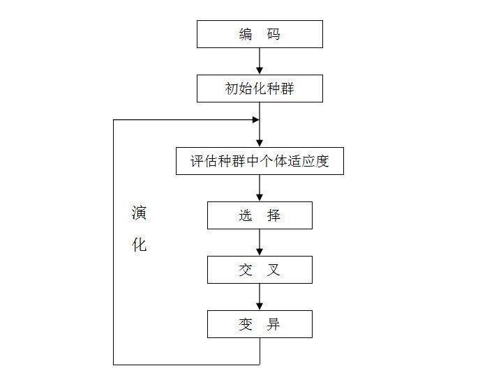


主要步骤：
1）种群初始化。我们需要首先通过随机生成的方式来创造一个种群，一般该种群的数量为100~500，这里我们采用二进制将一个染色体(解)编码为基因型。随后用进制转化，将二进制的基因型转化成十进制的表现型。

2）适应度计算(种群评估)。这里我们直接将目标函数值作为个体的适应度。

3）选择(复制)操作。根据种群中个体的适应度大小，通过轮盘赌等方式将适应度高的个体从当前种群中选择出来。其中轮盘赌即是与适应度成正比的概率来确定各个个体遗传到下一代群体中的数量。

      具体步骤如下：

     (1)首先计算出所有个体的适应度总和Σfi。

     (2)其次计算出每个个体的相对适应度大小fi/Σfi，类似于softmax。

     (3)再产生一个0到1之间的随机数，依据随机数出现在上述哪个概率区域内来确定各个个体被选中的次数。

4）交叉(交配)运算。该步骤是遗传算法中产生新的个体的主要操作过程，它用一定的交配概率阈值(pc，一般是0.4到0.99)来控制是否采取单点交叉，多点交叉等方式生成新的交叉个体。

     具体步骤如下：

     (1)先对群体随机配对。

     (2)再随机设定交叉点的位置。

     (3)再互换配对染色体间的部分基因。 

5）变异运算。该步骤是产生新的个体的另一种操作。一般先随机产生变异点，再根据变异概率阈值(pm,一般是0.0001到0.1)将变异点的原有基因取反。

6）终止判断。如果满足条件(迭代次数，一般是200~500)则终止算法，否则返回step2。


在讲下面几个基于生物学提出的概念之前，首先我们需要理解为什么需要在最优化问题的求解中引入生物学中的各种概念。

假设我们需要求一个函数的最大值，但这个函数异常复杂以至于无法套用一般化的公式，那么就会想到：如果可以将所有可能的解代入方程，那么函数最大值所对应的那个解就是问题的最优解。但是，对于较复杂的函数来说，其可能的解的个数的数量级是我们所无法想象的。因此，我们只好退而求其次，只代入部分解并在其中找到最优解。那么这样做的**核心**就在于**如何设定算法确定部分解并去逼近函数的最优解或者较好的局部最优解**。

遗传算法就是为了解决上述问题而诞生的。假设函数值所对应的所有解是一个容量超级大的种群，而种群中的个体就是一个个解，接下去遗传算法的工作就是让这个种群中的部分个体去不断繁衍，在繁衍的过程中一方面会发生染色体交叉而产生新的个体。另一方面，基因变异也会有概率会发生并产生新的个体。接下去，只需要通过自然选择的方式，**淘汰**质量差的个体，**保留**质量好的个体，并且让这个繁衍的过程持续下去，那么最后就有可能进化出最优或者较优的个体。这么看来原来最优化问题居然和遗传变异是相通的，而且大自然早已掌握了这样的机制，这着实令人兴奋。为了将这种机制引入最优化问题并利用计算机求解，我们需要将上述提到的生物学概念转化为计算机能够理解的算法机制。

下面介绍在计算机中这种遗传变异的机制是如何实现的：

**基因编码与解码：**

在生物学中，交叉与变异能够实现是得益于染色体上的基因，可以想象每个个体都是一串超级长的基因编码，当两个个体发生交叉时，两条基因编码就会发生交换，产生的新基因同时包含父亲和母亲的基因编码。在交叉过程中或者完成后，某些基因点位又会因为各种因素发生突变，由此产生新的基因编码。当然，发生交叉和变异之后的个体并不一定优于原个体，但这给了进化(产生更加优秀的个体)发生的可能。

因此，为了在计算机里实现交叉和变异，就需要对十进制的解进行编码。对于计算机来说其最底层的语言是由二进制0、1构成的，而0、1就能够被用来表示每个基因点位，大量的0、1就能够表示一串基因编码，因此我们可以用二进制对十进制数进行编码，即将十进制的数映射到二进制上。但是我们并不关心如何将十进制转换为二进制的数，因为计算机可以随机生成大量的二进制串，我们只需要将办法将二进制转化为十进制就可以了。

二进制转换为十进制实现方式：

假设，我们需要将二进制映射到以下范围：
x ∈[-1, 1]

首先，将二进制串展开并通过计算式转化为[0,1]范围内的数字：
alpha  = (累乘(g_i * 2 ^(n - i)))/(2 ^ n - 1)
将[0,1]范围内的数字映射到我们所需要的区间内：
x = alpha * (x ^ up - x ^ button) + x ^ button

**交叉与变异：**

在能够用二进制串表示十进制数的基础上，我们需要将交叉与变异引入算法中。假设我们已经获得两条二进制串(基因编码)，一条作为父亲，一条作为母亲，那么交叉指的就是用父方一半的二进制编码与母方一半的二进制编码组合成为一条新的二进制串(即新的基因)。变异则指的是在交叉完成产生子代的过程中，二进制串上某个数字发生了变异，由此产生新的二进制串。当然，交叉与变异并不是必然发生的，其需要满足一定的概率条件。一般来说，交叉发生的概率较大，变异发生的概率较小。交叉是为了让算法朝着收敛的方向发展，而变异则是为了让算法有几率跳出某种局部最优解。

**自然选择：**

在成功将基因编码和解码以及交叉与变异引入算法后，我们已经实现了让算法自动产生部分解并优化的机制。接下去，我们需要解决如何在算法中实现自然选择并将优秀的个体保留下来进而进化出更优秀的个体。

首先我们需要确定个体是否优秀，考虑先将其二进制串转化为十进制数并代入最初定义的目标函数中，将函数值定义为适应度。在这里，假设我们要求的是最大值，则定义函数值越大，则其适应度越大。那是否在每一轮迭代过程中只需要按照适应度对个体进行排序并选出更加优秀的个体就可以了呢？事实上，自然选择的过程中存在一个现象，并没有说优秀的个体一定会被保留，而差劲的个体就一定被会被淘汰。自然选择是一个概率事件，越适应环境则生存下去的概率越高，反之越低。为了遵循这样的思想，我们可以根据之前定义的适应度的大小给定每个个体一定的生存概率，其适应度越高，则在筛选时被保留下来的概率也越高，反之越低。

那么问题就来了，如何定义这种生存概率，一般来说，我们可以将个体适应度与全部个体适应度之和的比率作为生存概率。但我们在定义适应度时使用函数值进行定义的，但函数值是有可能为负的，但概率不能为负。因此，我们需要对函数值进行正数化处理，其处理方式如下：

定义适应度函数：
fitness_i = y_i - min(y) + 0.0001
定义生存概率函数：
belta = fitness_i / sum(fitness)
注：最后一项之所以加上0.0001是因为不能让某个个体的生存概率变为0，这不符合自然选择中包含的概率思想。


3. 遗传算法优缺点

优点：

1、 通过变异机制**避免**算法陷入局部最优，搜索能力强

2、 引入自然选择中的概率思想，个体的选择具有随机性

3、 **可拓展性强**，易于与其他算法进行结合使用

缺点：

1、 遗传算法编程较为复杂，涉及到基因编码与解码

2、 算法内包含的交叉率、变异率等参数的设定需要依靠经验确定

3、 对于初始种群的优劣依赖性较强


. 相关术语

基因型(genotype)：性状染色体的内部表现；

表现型(phenotype)：染色体决定的性状的外部表现，或者说，根据基因型形成的个体的外部表现；

进化(evolution)：种群逐渐适应生存环境，品质不断得到改良。生物的进化是以种群的形式进行的。

适应度(fitness)：度量某个物种对于生存环境的适应程度。

选择(selection)：以一定的概率从种群中选择若干个个体。一般，选择过程是一种基于适应度的优胜劣汰的过程。

复制(reproduction)：细胞分裂时，遗传物质DNA通过复制而转移到新产生的细胞中，新细胞就继承了旧细胞的基因。

交叉(crossover)：两个染色体的某一相同位置处DNA被切断，前后两串分别交叉组合形成两个新的染色体。也称基因重组或杂交；

变异(mutation)：复制时可能（很小的概率）产生某些复制差错，变异产生新的染色体，表现出新的性状。

编码(coding)：DNA中遗传信息在一个长链上按一定的模式排列。遗传编码可看作从表现型到基因型的映射。

解码(decoding)：基因型到表现型的映射。

个体（individual）：指染色体带有特征的实体；

种群（population）：个体的集合，该集合内个体数称为种群

5. 案例：
现在我以一个多元函数最值问题求解来一步步阐述遗传算法的实现过程。

问题：求一个多元函数的最大值，f(x1,x2) = 21.5+x1*sin(4pi*x1)+x2*sin(20pi*x2)，其中-3.0≤x1≤12.1,4.1≤x2≤5.8。

**5.1. 设计与实现**
(a)前提条件：


```c++  
const int Po_Size = 50;//种群规模
const int Ev_Algebra = 500;//进化代数
const double Ov_Probability = 0.850; //交叉概率,交叉概率用于判断两两个体是否需要交叉
const double Va_Probability = 0.050;//变异概率,变异概率用于判断任一个体是否需要变异
const int De_Variable = 2;//函数自变量的个数,如果要进行多元函数的最值求解，直接修改自变量数个De_Variable即可

vector<Individual> nowpopulation;//P(t)种群
vector<Individual> midpopulation;//中间种群，存放轮盘选择后的优秀个体
vector<Individual> nextpopulation;//P(t+1)种群
```


 

(b)类的实现：


```c++  
class Individual //定义个体类
{
private:
double Variable[De_Variable];//存放变量x1,x2,x3........
double Fitness;//适应值
double ReFitness;//适应值概率
double SumFitness;//累加概率，为轮盘转做准备
public：

............

};
```


(c)：初始化：

随机生成两个满足条件范围的x1和x2自变量，生成一个个体，初始化种群，得到第一代种群。在这里用一个随机函数生成两个指定范围的小数，然后创建一个对象（个体），加入到初始种群中，直到达到种群规模。

(d)计算适应值，适应值概率，累加概率：
适应值是根据每个个体的自变量进行计算的，这里是求函数的最大值，所以把函数就作为适应值计算函数，适应值概率的计算是每个个体占所有个体适应值总和的百分比，累加概率是为了轮盘法选择做准备。

(e)进行选择，杂交，变异：

最重要的就是这三个算子，选择即就是用轮盘法选出一些相对优秀的个体，在程序中我没有用精英制选择，读者自己可以加以实现。杂交之前需要对自变量进行编码，我在程序中采用的是二进制的编码，用的是c++标准库中的bitset类来进行编码的，杂交的方式我用的是单点杂交，你也可以选择其他杂交方式。变异我用的是基本位变异方式，相对比较简单。


**5.2. 代码**


GeneticAlgorithm.cpp文件

```c++  
#include"GeneticAlgorithm.h"//包含头文件
//自变量取值范围向量和种群向量定义
const X_Range Range[De_Variable] = { X_Range(-3.0,12.1) ,X_Range(4.1,5.8) };//自变量（或者基因）x1,x2的取值范围
vector<Individual> nowpopulation;//P(t)种群
vector<Individual> midpopulation;//中间种群，存放轮盘选择后的优秀个体
vector<Individual> nextpopulation;//P(t+1)种群
//X_Range类实现
X_Range::X_Range(double m_Lower, double m_Upper) :Lower(m_Lower), Upper(m_Upper){}//X_Range类构造函数实现
double X_Range::GetUpper()const//获取变量上限
{
    return Upper;
}
double X_Range::GetLower()const//获取变量下限
{
    return Lower;
}
//Individual类实现
Individual::Individual(double* m_Variable)//构造函数
{
    for (int i = 0; i < De_Variable; i++)//用for循环自变量逐个赋值
    {
            if (m_Variable[i] >= Range[i].GetLower() && m_Variable[i] <= Range[i].GetUpper())//这里要进行自变量取值范围判断
            {
                Variable[i] = m_Variable[i];//自变量赋值
            }
            else//不满足要求则发出出错警告并返回
            {
                cerr << "自变量取值不满足要求" << endl;
                exit(1);//停止程序，我会以随机函数的方式生成自变量的值(基因值)，这里说明基因值不在规定范围内
            }
    }
    //初始化时默认适应值等值为0
    this->Fitness = 0;
    this->ReFitness = 0;
    this->SumFitness = 0;
}
double* Individual::GetVariable()//获取基因值
{
    return Variable;
}
double Individual::GetFitness()const//获取适应值
{
    return Fitness;
}
double Individual::GetReFitness()const //获取适应值概率
{
    return ReFitness;
}
double Individual::GetSumFitness()const//获取累加概率
{
    return SumFitness;
}
void Individual::ChaFitness(const double m_fitness)//修改适应值
{
    this->Fitness = m_fitness;
}
void Individual::ChaReFitness(const double m_ReFitness)//修改适应值概率
{
    this->ReFitness = m_ReFitness;
}
void Individual::ChaSumFitness(const double m_SumFitness)//修改累加概率
{
    this->SumFitness = m_SumFitness;
}
//遗传算法的准备工作
void Initialize()//随机初始化种群，得到第一代种群
{
//产生指定范围的随机变量（基因）
    double X[Po_Size][De_Variable];//为了使程序可以满足多元函数最值的计算，用矩阵保存产生的随机数变量值
    for (int j = 0; j < De_Variable; j++)
    {
        default_random_engine e(time(0));//引擎，生成随机序列
        uniform_real_distribution<double> u(Range[j].GetLower(), Range[j].GetUpper());//分布
        for (int i = 0; i < Po_Size; i++)//先按列存储随机数
        {
            X[i][j] = u(e);//循环结束时，所有随机值就保存在X矩阵中
        }
    }
//生成对象（染色体）并加入到初始种群中
    for (int i = 0; i < Po_Size; i++)
    {
        double variable[De_Variable];
        for (int j = 0; j < De_Variable; j++)
        {
            variable[j] = X[i][j];//按行保存
        }
        Individual Indivi(variable);//生成一个对象（染色体）
        nowpopulation.push_back(Indivi);//加入到种群population中
    }
}
void CaculaFitness()//计算个体的适应值
{
    //f(x1,x2) = 21.5+x1*sin(4pi*x1)+x2*sin(20pi*x2)）为适应度计算函数
    double fitness = 0;//临时适应值
    double x[De_Variable];//临时存储自变量（基因）
    for (int i = 0; i < Po_Size; i++)
    {
        for (int j = 0; j < De_Variable; j++)
            x[j] = nowpopulation.at(i).GetVariable()[j];//这样更直观
        fitness = 21.5 + x[0] * sin(4 * PI*x[0]) + 2 * sin(20 * PI*x[1]);//适应度计算
        nowpopulation.at(i).ChaFitness(fitness);//修改当前染色体的适应值
    }
}
void CaculaReFitness()//计算适应值概率
{
    double sum = 0;//适应值累加器
    double temp = 0;
    for (int i = 0; i < Po_Size; i++)//计算出适应值之和
    {
        sum += nowpopulation.at(i).GetFitness();
    }
    for (int j = 0; j < Po_Size; j++)
    {
        temp = nowpopulation.at(j).GetFitness() / sum;//计算概率
        nowpopulation.at(j).ChaReFitness(temp);//修改个体的适应度概率
    }
}
void CalculaSumFitness()//计算累加个体概率
{
    double summation = 0;//累加器
    for (int k = 0; k < Po_Size; k++)
    {
        summation += nowpopulation.at(k).GetReFitness();
        nowpopulation.at(k).ChaSumFitness(summation);//当前累加结果赋值
    }
}
void seclect() //种群选择
{
    //随机生生成0到1的小数
    double array[Po_Size];//随机数保存变量
    default_random_engine e(time(0));//引擎，生成随机序列
    uniform_real_distribution<double> u(0.0, 1.0); //分布
    for (int i = 0; i < Po_Size; i++)
        array[i] = u(e);
    //轮盘进行选择
    for (int j = 0; j < Po_Size; j++)
    {
        for (int i = 1; i < Po_Size; i++)
        {
            if (array[j] < nowpopulation[i - 1].GetSumFitness())
            {
                midpopulation.push_back(nowpopulation.at(i - 1));//加入到中间种群
            }
            if (array[j] >= nowpopulation.at(i - 1).GetSumFitness() && array[j] <= nowpopulation.at(i).GetSumFitness())
            {
                midpopulation.push_back(nowpopulation.at(i));//加入到中间种群
            }
        }
    }
    nowpopulation.clear();//清空nowpopulation
}
double Scand() //随机产生0到1的小数
{
    int N = rand() % 999;
    return double(N)/1000.0;;//随机产生0到1的小数
}
void crossing()//杂交
{
    int num = 0;//记录次数
    double corss = 0.0;//保存随机产生的概率值
    srand((unsigned)time(NULL));//根据系统时间设置随机数种子,设置一次随机种子就行
    double array1[De_Variable], array2[De_Variable];//临时存储父亲和母亲的变量值
    while (num< Po_Size-1)//个体1与个体2杂交，个体3与个体4杂交......个体i和个体i+1杂交
    {
        //判断双亲是否需要杂交，随机生成一个0到1的小数，如果这个数大于杂交概率，则放弃杂交，直接遗传给下一代，否则，对父母体进行杂交
        corss = Scand();
        if (corss <= Ov_Probability)//如果corss小于等于杂交概率Ov_Probability就进行单点杂交
        {
            //首先寻找对应下标的个体并且保存
            for (int i = 0; i < De_Variable; i++)
            {
                array1[i] = midpopulation.at(num).GetVariable()[i];//父亲的自变量
                array2[i] = midpopulation.at(num + 1).GetVariable()[i];//母亲自变量
            }
            int localx1, localx2;//记录基因交叉点的位置
            int corssx1[length1], corssx2[length2];//作为交换基因的数组
            double newx1[2], newx2[2];//分别用来保存基因交换后所对应自变量值
            bool p1 = true, p2 = true;
            //然后对双亲变量进行编码并且进行单点杂交
            for (int j = 0; j < De_Variable; j++)//array1的x1编码之后和array2的x1编码后进行单点杂交，以此类推
            {
                if (j == 0)//x1进行编码并且杂交
                {
                    bitset<length1> array1b1((array1[j] + 3.0)* pow(10, 6));//加上3.0形成一个unsigaed数之后在进行母体1的x1编码
                    bitset<length1> array2b1((array2[j] + 3.0)* pow(10, 6));//加上3.0形成一个unsigaed数之后在进行母体2的x1编码
                    //现在随机生成0到length1-1的数，确定交叉点的位置
                    localx1 = rand() % length1;
                    //现在进行单点交叉，交换双亲localx1后面的基因
                    for (int i = 0; i < localx1; i++)
                        corssx1[i] = array1b1[i];
                    for (int k = 0; k < localx1; k++)
                        array1b1[k] = array2b1[k];
                    for (int s = 0; s < localx1; s++)
                        array2b1[s] = corssx1[s];
                    //新值保存在newx1数组中，x1基因完成单点杂交操作
                    newx1[0] = double(array1b1.to_ullong()) / pow(10, 6) - 3.0;
                    newx2[0] = double(array2b1.to_ullong()) / pow(10, 6) - 3.0;
                    //对新产生的值进行判断，判断是否超出范围，如果超出范围则不杂交
                    if (newx1[0]< Range[0].GetLower() || newx1[0]>Range[0].GetUpper() || newx2[0]<Range[0].GetLower() || newx2[0]>Range[0].GetUpper())
                    {
                        p1 = false;
                        break;
                    }
                }
                if (j == 1)//x2进行编码并且杂交
                {
                    bitset<length2> array1b2((array1[j]) * pow(10, 6));//母体1的x2编码
                    bitset<length2> array2b2((array2[j]) * pow(10, 6));//母体2的x2编码
                    //现在随机生成0到length2-1的数，确定交叉点的位置
                    localx2 = rand() % length2;
                    //现在进行单点交叉，交换双亲localx2后面的基因
                    for (int i = 0; i < localx2; i++)
                        corssx2[i] = array1b2[i];
                    for (int k = 0; k < localx2; k++)
                        array1b2[k] = array2b2[k];
                    for (int s = 0; s < localx2; s++)
                        array2b2[s] = corssx2[s];
                    //新值保存在newx2数组中，x2基因完成单点杂交操作
                    newx1[1] = double(array1b2.to_ullong()) / pow(10, 6);
                    newx2[1] = double(array2b2.to_ullong()) / pow(10, 6);
                    //对新产生的值进行判断，判断是否超出范围，如果超出范围则不杂交
                    if (newx1[1]< Range[1].GetLower() || newx1[1]>Range[1].GetUpper() || newx2[1]<Range[1].GetLower() || newx2[1]>Range[1].GetUpper())
                    {
                        p2 = false;
                        break;
                    }
                }
            }
            if (p1 == true && p2 == true)
            {
                Individual newchiled1(newx1);
                Individual newchiled2(newx2);
                nextpopulation.push_back(newchiled1);
                nextpopulation.push_back(newchiled2);
            }
            else//将原来的个体遗传给下一代
            {
                nextpopulation.push_back(midpopulation.at(num));
                nextpopulation.push_back(midpopulation.at(num + 1));
            }
        }
        else//否则直接遗传给下一代nextpopulation
        {
            nextpopulation.push_back(midpopulation.at(num));//生成一个新的个体并且加入到nextpopulation中
            nextpopulation.push_back(midpopulation.at(num + 1));
        }
        num += 2;
    }
    midpopulation.clear();//清空midpopulation
}
void variating()//变异
{
    int num = 0;
    while (num<Po_Size)
    {
        double variation = Scand();//随机产生一个0到1的小数，用于判断是否进行变异
        if (variation <= Va_Probability)//如果variation小于变异系数，则需要进行变异
        {
            double x[2];
            bool p = true;
            int x1local, x2local;
            x[0] = nextpopulation.at(num).GetVariable()[0];
            x[1] = nextpopulation.at(num).GetVariable()[1];
            bitset<length1> array1((x[0]+ 3.0)* pow(10, 6));//x1编码
            bitset<length2> array2(x[1]*pow(10,6));//x2编码
            x1local = rand() % length1;//array1该位取反
            x2local = rand() % length2;//array2该位取反
            array1.flip(x1local);//改变array1 x1local位的状态
            array2.flip(x2local);//改变array2 x2local位的状态
            x[0] = double(array1.to_ullong()) / pow(10, 6) - 3.0;
            x[1] = double(array2.to_ullong()) / pow(10, 6);
            //判断是否符合条件
            if (x[0]< Range[0].GetLower() || x[0]>Range[0].GetUpper() || x[1]<Range[1].GetLower() || x[1]>Range[1].GetUpper())
                p = false;
            if (!p)
                nowpopulation.push_back(nextpopulation.at(num));
            if (p)
            {
                Individual newchiled(x);
                nowpopulation.push_back(newchiled);
            }
        }
        else
            nowpopulation.push_back(nextpopulation.at(num));
        num++;
    }
    nextpopulation.clear();//清空nextpopulation
}
void genetic_algorithm()
{
    Initialize();//初始化种群,随机生成第一代个体
    //进化500代
    for (int i = 0; i < Ev_Algebra; i++)
    {
        CaculaFitness();//适应度计算
        CaculaReFitness();//适应度概率计算
        CalculaSumFitness();//计算累加个体概率
        seclect();//选择
        crossing();//杂交
        variating();//变异
    }
    CaculaFitness();//适应度计算
    double maxfitness=nowpopulation.at(0).GetFitness();
    int maxid = 0;
    int k;
    for (k = 0; k < Po_Size; k++)
    {
        if (maxfitness < nowpopulation.at(k).GetFitness())
        {
            maxfitness = nowpopulation.at(k).GetFitness();
            maxid = k;
        }
    }
    //进化500代之后输出
    cout << "x1"<<setw(10)<<"x2" << setw(15)<<"Fitness" << endl;
    for (int j = 0; j < Po_Size; j++)
        cout << nowpopulation.at(j).GetVariable()[0] <<setw(10)<< nowpopulation.at(j).GetVariable()[1] << setw(10) <<nowpopulation.at(j).GetFitness() << endl;
    cout << "x1=" << nowpopulation.at(maxid).GetVariable()[0] << " ，" << "x2=" << nowpopulation.at(maxid).GetVariable()[1] << "时取得最大值：" << maxfitness << endl;
}
```

main.cpp文件

```c++  
1 #include"GeneticAlgorithm.h"
2 int main()
3 {
4     genetic_algorithm();
5     system("pause");
6     return 0;
7 }
```

更多代码见参考文章.

6. 问题
(未整理)

1、遗传算法的问题。
遗传算法主要是用来求解最优化问题的。
一般来讲可以求解函数的最大、最小值问题，还可以结合其它一些方法解决（非）线性回归、分类问题等等。
但遗传算法有两个缺点，一是时间长，二是初值的选择会影响收敛的效果。
它的本质，实际上还www.nfysw.com是随机搜索算法，还是属于所谓的蒙特卡罗式的方法。

2、模拟退火和遗传算法都可以解决什么问题啊
模拟退火算法和遗传算法，包括禁忌搜索算法，蚁群算法等都可以用来求解优化问题。这些算法的一个特点是虽然对于一些复杂问题，比如说DP难题，可能不好找到最优解(理论上找到最优解是可以的)，但是可以以较高的效率找到满意解。

3、遗传算法解背包问题需要解决的是什么?
给个该问题思路的描述，流程图，或者c代码。问题补充： 0-1背包算法用遗传算法来解决 我有个c代码，给我邮箱地址。你很无聊```

4、遗传算法解决的问题的类型
1. 数值优化，如多目标函数优化。
2. 组合优化，如NP问题－〉作业调度，旅行问题，背包问题。
给出问题的近似最优解。
进一步可以解决机器学习与人工只能问题。

5、怎样解决遗传算法的局部最优问题
这个看看遗传算法的专着吧。
局部收敛，就是所谓的“早熟现象”是遗传算法的一个很让人头疼的问题。对应的措施，我举个例子，可以是提高变异算子的变异概率。变异算子是跳出局部收敛的重要操作算子，当然，遗传算法有很多的改进类型。这里不多说了，我介绍本书，叫《MATLAB遗传算法工具箱及应用》，雷英杰，西安电子科技大学出版社

6、遗传算法解决TSP问题
遗传算法在很多领域都得到应用；从神经网络研究的角度上考虑，最关心的是遗传算法在神经网络的应用。在遗传算法应用中，应先明确其特点和关键问题，才能对这种算法深入了解，灵活应用，以及进一步研究开发。
一、遗传算法的特点
1．遗传算法从问题解的中集开始嫂索，而不是从单个解开始。
这是遗传算法与传统优化算法的极大区别。传统优化算法是从单个初始值迭代求最优解的；容易误入局部最优解。遗传算法从串集开始搜索，复盖面大，利于全局择优。
2．遗传算法求解时使用特定问题的信息极少，容易形成通用算法程序。
由于遗传算法使用适应值这一信息进行搜索，并不需要问题导数等与问题直接相关的信息。遗传算法只需适应值和串编码等通用信息，故几乎可处理任何问题。
3．遗传算法有极强的容错能力
遗传算法的初始串集本身就带有大量与最优解甚远的信息；通过选择、交叉、变异操作能迅速排除与最优解相差极大的串；这是一个强烈的滤波过程；并且是一个并行滤波机制。故而，遗传算法有很高的容错能力。
4．遗传算法中的选择、交叉和变异都是随机操作，而不是确定的精确规则。
这说明遗传算法是采用随机方法进行最优解搜索，选择体现了向最优解迫近，交叉体现了最优解的产生，变异体现了全局最优解的复盖。
5．遗传算法具有隐含的并行性
遗传算法的基础理论是图式定理。它的有关内容如下：
(1)图式(Schema)概念
一个基因串用符号集{0，1，*}表示，则称为一个因式；其中*可以是0或1。例如：H=1x x 0 x x是一个图式。
(2)图式的阶和长度
图式中0和1的个数称为图式的阶，并用0(H)表示。图式中第1位数字和最后位数字间的距离称为图式的长度，并用(H)表示。对于图式H＝1x x0x x，有0(H)＝2，(H)＝4。
(3)Holland图式定理
低阶，短长度的图式在群体遗传过程中将会按指数规律增加。当群体的大小为n时，每代处理的图式数目为0(n3)。
遗传算法这种处理能力称为隐含并行性(Implicit Parallelism)。它说明遗传算法其内在具有并行处理的特质。
二、遗传算法的应用关键
遗传算法在应用中最关键的问题有如下3个
1．串的编码方式
这本质是问题编码。一般把问题的各种参数用二进制编码，构成子串；然后把子串拼接构成“染色体”串。串长度及编码形式对算法收敛影响极大。
2．适应函数的确定
适应函数(fitness function)也称对象函数(object function)，这是问题求解品质的测量函数；往往也称为问题的“环境”。一般可以把问题的模型函数作为对象函数；但有时需要另行构造。
3．遗传算法自身参数设定
遗传算法自身参数有3个，即群体大小n、交叉概率Pc和变异概率Pm。
群体大小n太小时难以求出最优解，太大则增长收敛时间。一般n＝30-160。交叉概率Pc太小时难以向前搜索，太大则容易破坏高适应值的结构。一般取Pc=0.25-0.75。变异概率Pm太小时难以产生新的基因结构，太大使遗传算法成了单纯的随机搜索。一般取Pm＝0．01—0．2。
三、遗传算法在神经网络中的应用
遗传算法在神经网络中的应用主要反映在3个方面：网络的学习，网络的结构设计，网络的分析。
1．遗传算法在网络学习中的应用
在神经网络中，遗传算法可用于网络的学习。这时，它在两个方面起作用
(1)学习规则的优化
用遗传算法对神经网络学习规则实现自动优化，从而提高学习速率。
(2)网络权系数的优化
用遗传算法的全局优化及隐含并行性的特点提高权系数优化速度。
2．遗传算法在网络设计中的应用
用遗传算法设计一个优秀的神经网络结构，首先是要解决网络结构的编码问题；然后才能以选择、交叉、变异操作得出最优结构。编码方法主要有下列3种：
(1)直接编码法
这是把神经网络结构直接用二进制串表示，在遗传算法中，“染色体”实质上和神经网络是一种映射关系。通过对“染色体”的优化就实现了对网络的优化。
(2)参数化编码法
参数化编码采用的编码较为抽象，编码包括网络层数、每层神经元数、各层互连方式等信息。一般对进化后的优化“染色体”进行分析，然后产生网络的结构。
(3)繁衍生长法
这种方法不是在“染色体”中直接编码神经网络的结构，而是把一些简单的生长语法规则编码入“染色体”中；然后，由遗传算法对这些生长语法规则不断进行改变，最后生成适合所解的问题的神经网络。这种方法与自然界生物地生长进化相一致。
3．遗传算法在网络分析中的应用
遗传算法可用于分析神经网络。神经网络由于有分布存储等特点，一般难以从其拓扑结构直接理解其功能。遗传算法可对神经网络进行功能分析，性质分析，状态分析。
遗传算法虽然可以在多种领域都有实际应用，并且也展示了它潜力和宽广前景；但是，遗传算法还有大量的问题需要研究，目前也还有各种不足。首先，在变量多，取值范围大或无给定范围时，收敛速度下降；其次，可找到最优解附近，但无法精确确定最扰解位置；最后，遗传算法的参数选择尚未有定量方法。对遗传算法，还需要进一步研究其数学基础理论；还需要在理论上证明它与其它优化技术的优劣及原因；还需研究硬件化的遗传算法；以及遗传算法的通用编程和形式等。


参考：

[遗传算法详解及c++实现](https://www.cnblogs.com/suchang/p/10550181.html)
[遗传算法解决二维和高维优化问题——基于Python](https://blog.csdn.net/zk__123456/article/details/109529857)
[python遗传算法(详解)](https://blog.csdn.net/quinn1994/article/details/80501542?spm=1001.2101.3001.6650.1&utm_medium=distribute.pc_relevant.none-task-blog-2%7Edefault%7ECTRLIST%7ERate-1-80501542-blog-109529857.t5_download_comparev1&depth_1-utm_source=distribute.pc_relevant.none-task-blog-2%7Edefault%7ECTRLIST%7ERate-1-80501542-blog-109529857.t5_download_comparev1&utm_relevant_index=1)
[遗传算法关于多目标优化python（详解）](https://blog.csdn.net/quinn1994/article/details/80679528)

[遗传算法解决什么问题](https://www.nfysw.com/baike/155522993917281.html)

# 5 爬山法

