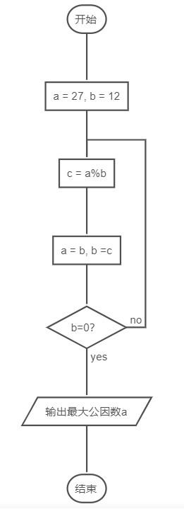
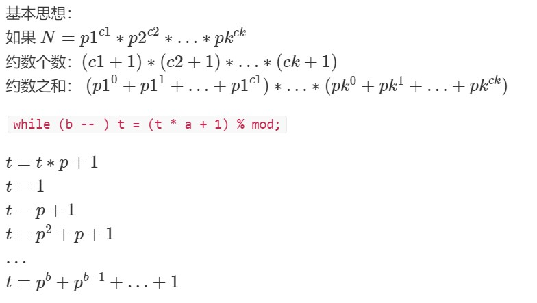
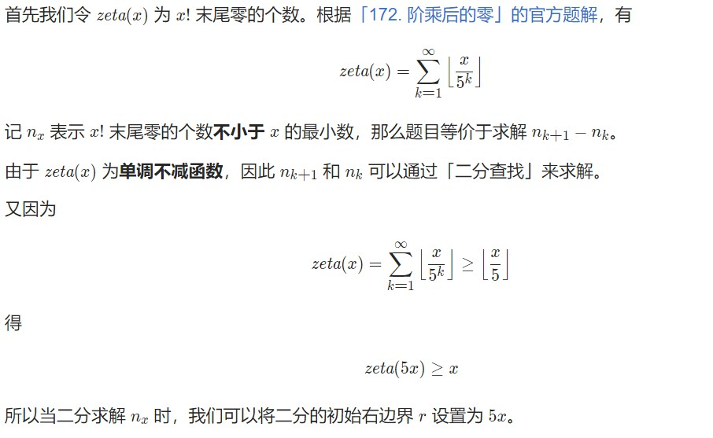
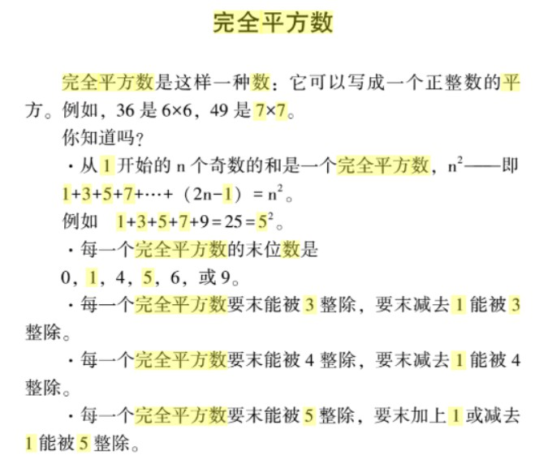

#<center>数学知识
**包括质数、约数、同余、矩阵乘法、高斯消元与线性空间、组合计数、容斥原理与Mobius函数、概率与数学期望、0/1分数规划、博弈论之SG函数等内容。**

*暂不整理*

**基本概念**

因子就是所有可以整除这个数的数,不包括这个数自身.（就是一个数的约数，比如20的因子有 1 2 4 5 10）

因数包括这个数本身而因子不包括,

如：比如15的因子是1,3,5 而因数为1,3,5,15
完数是指此数的所有因子之和等于此数,例如：28=1+2+4+7+14.


## 最大公约数


```c++  
// 最大公约数:辗转相除法(欧几里得法)
// 不要求ab大小关系，只需要为正数


// 求两个正整数 a 和 b 的 最大公约数 d
// 则有 gcd(a,b) = gcd(b,a%b)
// 证明：
//     设a%b = a - k*b 其中k = a/b(向下取整)
//     若d是(a,b)的公约数 则知 d|a 且 d|b 则易知 d|a-k*b 故d也是(b,a%b) 的公约数
//     若d是(b,a%b)的公约数 则知 d|b 且 d|a-k*b 则 d|a-k*b+k*b = d|a 故而d|b 故而 d也是(a,b)的公约数
//     因此(a,b)的公约数集合和(b,a%b)的公约数集合相同 所以他们的最大公约数也相同 证毕#

int gcd(int a, int b)  // 欧几里得算法
{
    return b ? gcd(b, a % b) : a;
}

// 附：辗转相减法  过于复杂...
int gcd_2(int a, int b){
    return a == b ? a : gcd_2(a > b ? a - b : a, b > a ? b - a :b);
}


// 最小公倍数
lcm(a, b) = a * b / gcd(a, b)
```


**辗转相除法：**




以及辗转相减法：


## 质数

试除法判定质数 O(log n)   试除法判定质数
```c++  
bool is_prime(int x)   //
{
    if (x < 2) return false;
    for (int i = 2; i <= x / i; i ++ ) // x / i，而是不sqrt：慢，也不是i*i<=x ,会溢出
        if (x % i == 0)
            return false;
    return true;
}
```

试除法分解质因数  最大 O(log n)  —— 模板题 AcWing 867. 分解质因数
```c++  
void divide(int x)
{
    for (int i = 2; i <= x / i; i ++ )
        if (x % i == 0) // i 一定是质数
        {
            int s = 0;
            while (x % i == 0) x /= i, s ++ ;
            cout << i << ' ' << s << endl;
        }
    if (x > 1) cout << x << ' ' << 1 << endl;
    cout << endl;
}
```


#### 朴素筛法
O(nln n) < O(nlog n)—— 模板题 AcWing 868. 筛质数

```c++  
int primes[N], cnt;     // primes[]存储所有素数
bool st[N];         // st[x]存储x是否被筛掉

void get_primes(int n)
{
    for (int i = 2; i <= n; i ++ )
    {
        if (st[i]) continue;
        primes[cnt ++ ] = i;
        for (int j = i; j <= n; j += i)
            st[j] = true;
    }
}
```
#### 埃氏筛法 
O(n log log n)

和朴素区别？？？


```c++  
void get_primes1(){
    for(int i=2;i<=n;i++){
        if(!st[i]){
            primes[cnt++]=i;
            for(int j=i;j<=n;j+=i) st[j]=true;//可以用质数就把所有的合数都筛掉；
        }
    }
}
```


#### 线性筛法
—— 模板题 AcWing 868. 筛质数
线性只会被其**最小质因子**筛掉


Eratosthenes 筛法利用的原理是 任意整数 x 的倍数 2x，3x，… 等都不是质数 。
但是即便如此也会有重复标记的现象，例如12既会被2又会被3标记，在标记2的倍数时，12=6∗2
，在标记3的倍数时，12=4∗3 ，根本原因是没有找到唯一产生12的方式。

**线性筛法**
假设 i 是合数 t 的最大因数，t显然可能不唯一（例如 30 和 45 最大因数都是 15）。但是仔细想一想，必然有
t = i * p(p为小于 i 的质数) 。
p为什么比 i 小？因为 i 是 t 的最大因数。
为什么 p 一定是质数？因为如果 p 是合数，那么 i 就一定不是 t 的最大因数，因为 p可以再拆成若干素数相乘，这些素数再与 i 相乘会使因数更大。
既然如此，我们只需要把所有小于 i 的质数 p 都挨个乘一次好了。可是，真相真的是这样的嘛？
其实不是的，一不小心就忘记了最初的条件。我们要满足 i 是 t 的最大因数。如果 p 大于 i 的最小质因数，那 i 还是 t 的最大因数嘛？显然不是，任何一个合数都能唯一分解为有限个质数的乘积，除去这其中最小的质因数，其他的都乘起来就是最大因数 i 。所以我们不能让 p 大于 i 的最小质因数。


```c++  
int primes[N], cnt;     // primes[]存储所有素数
bool st[N];         // st[x]存储x是否被筛掉
// st[i]  i 为质数则false, 否则 true
void get_primes(int n)
{
    for (int i = 2; i <= n; i ++ )
    {
        if (!st[i]) primes[cnt ++ ] = i;
        for (int j = 0; primes[j] <= n / i; j ++ )
        {
            st[primes[j] * i] = true;
            if (i % primes[j] == 0) break;  
            //primes[j]一定是i的最小质因子，则primes[j]也一定是primes[j]*i的最小质因子
        }
    }
}
```


## 约数
完全平方数的约数个数为奇数个，非完全平方数的约束个数为偶数个。

[M-灯泡开关](https://leetcode-cn.com/problems/bulb-switcher/)


试除法求所有约数 —— 模板题 AcWing 869. 试除法求约数
```c++  
vector<int> get_divisors(int x)
{
    vector<int> res;
    for (int i = 1; i <= x / i; i ++ )
        if (x % i == 0)
        {
            res.push_back(i);
            // 防止平方数重复
            if (i != x / i) res.push_back(x / i); 
        }
    sort(res.begin(), res.end());
    return res;
}
```
约数个数和约数之和 —— 模板题 AcWing 870. 约数个数, AcWing 871. 约数之和
```c++  
如果 `N = p1^c1 * p2^c2 * ... *pk^ck`
**约数个数**： `(c1 + 1) * (c2 + 1) * ... * (ck + 1)`
**约数之和**： `(p1^0 + p1^1 + ... + p1^c1) * ... * (pk^0 + pk^1 + ... + pk^ck)`
int范围内最大的约数个数 为：1536
```



## 欧拉函数
求欧拉函数 —— 模板题 AcWing 873. 欧拉函数
```c++  
int phi(int x)
{
    int res = x;
    for (int i = 2; i <= x / i; i ++ )
        if (x % i == 0)
        {
            res = res / i * (i - 1);
            while (x % i == 0) x /= i;
        }
    if (x > 1) res = res / x * (x - 1);

    return res;
}
```
筛法求欧拉函数 —— 模板题 AcWing 874. 筛法求欧拉函数
```c++  
int primes[N], cnt;     // primes[]存储所有素数
int euler[N];           // 存储每个数的欧拉函数
bool st[N];         // st[x]存储x是否被筛掉


void get_eulers(int n)
{
    euler[1] = 1;
    for (int i = 2; i <= n; i ++ )
    {
        if (!st[i])
        {
            primes[cnt ++ ] = i;
            euler[i] = i - 1;
        }
        for (int j = 0; primes[j] <= n / i; j ++ )
        {
            int t = primes[j] * i;
            st[t] = true;
            if (i % primes[j] == 0)
            {
                euler[t] = euler[i] * primes[j];
                break;
            }
            euler[t] = euler[i] * (primes[j] - 1);
        }
    }
}
```
 


## 快速幂
求 m^k mod p，时间复杂度 O(logk)。
```c++  
int qmi(int m, int k, int p)
{
    int res = 1 % p, t = m;
    while (k)
    {
        if (k&1) res = res * t % p;
        t = t * t % p;
        k >>= 1;
    }
    return res;
}
```

## 欧几里得算法

求欧拉函数 —— 模板题 AcWing 873. 欧拉函数
```c++  
int phi(int x)
{
    int res = x;
    for (int i = 2; i <= x / i; i ++ )
        if (x % i == 0)
        {
            res = res / i * (i - 1);
            while (x % i == 0) x /= i;
        }
    if (x > 1) res = res / x * (x - 1);

    return res;
}
```
筛法求欧拉函数 —— 模板题 AcWing 874. 筛法求欧拉函数
```c++  
int primes[N], cnt;     // primes[]存储所有素数
int euler[N];           // 存储每个数的欧拉函数
bool st[N];         // st[x]存储x是否被筛掉


void get_eulers(int n)
{
    euler[1] = 1;
    for (int i = 2; i <= n; i ++ )
    {
        if (!st[i])
        {
            primes[cnt ++ ] = i;
            euler[i] = i - 1;
        }
        for (int j = 0; primes[j] <= n / i; j ++ )
        {
            int t = primes[j] * i;
            st[t] = true;
            if (i % primes[j] == 0)
            {
                euler[t] = euler[i] * primes[j];
                break;
            }
            euler[t] = euler[i] * (primes[j] - 1);
        }
    }
}
```
 
扩展欧几里得算法 —— 模板题 AcWing 877. 扩展欧几里得算法
```c++  
// 求x, y，使得ax + by = gcd(a, b)
int exgcd(int a, int b, int &x, int &y)
{
    if (!b)
    {
        x = 1; y = 0;
        return a;
    }
    int d = exgcd(b, a % b, y, x);
    y -= (a/b) * x;
    return d;
}

```


## 高斯消元

高斯消元 —— 模板题 AcWing 883. 高斯消元解线性方程组
```c++  
// a[N][N]是增广矩阵
int gauss()
{
    int c, r;
    for (c = 0, r = 0; c < n; c ++ )
    {
        int t = r;
        for (int i = r; i < n; i ++ )   // 找到绝对值最大的行
            if (fabs(a[i][c]) > fabs(a[t][c]))
                t = i;

        if (fabs(a[t][c]) < eps) continue;

        for (int i = c; i <= n; i ++ ) swap(a[t][i], a[r][i]);      // 将绝对值最大的行换到最顶端
        for (int i = n; i >= c; i -- ) a[r][i] /= a[r][c];      // 将当前行的首位变成1
        for (int i = r + 1; i < n; i ++ )       // 用当前行将下面所有的列消成0
            if (fabs(a[i][c]) > eps)
                for (int j = n; j >= c; j -- )
                    a[i][j] -= a[r][j] * a[i][c];

        r ++ ;
    }

    if (r < n)
    {
        for (int i = r; i < n; i ++ )
            if (fabs(a[i][n]) > eps)
                return 2; // 无解
        return 1; // 有无穷多组解
    }

    for (int i = n - 1; i >= 0; i -- )
        for (int j = i + 1; j < n; j ++ )
            a[i][n] -= a[i][j] * a[j][n];

    return 0; // 有唯一解
}

```


## 求组合数

递归法求组合数 —— 模板题 AcWing 885. 求组合数 I
```c++  
// c[a][b] 表示从a个苹果中选b个的方案数
const int N = 1010;
LL c[N][N];
const int mod = 1e9 + 7;
for (int i = 0; i < N; i ++ )
    for (int j = 0; j <= i; j ++ )
        if (!j) c[i][j] = 1;
        else c[i][j] = (c[i - 1][j] + c[i - 1][j - 1]) % mod;

```


通过预处理逆元的方式求组合数 
—— 模板题 AcWing 886. 求组合数 II
首先预处理出所有阶乘取模的余数fact[N]，以及所有阶乘取模的**逆元**infact[N]
如果取模的数是质数，可以用**费马小定理**求逆元
```c++  
int qmi(int a, int k, int p)    // 快速幂模板
{
    int res = 1;
    while (k)
    {
        if (k & 1) res = (LL)res * a % p;
        a = (LL)a * a % p;
        k >>= 1;
    }
    return res;
}

// 预处理阶乘的余数和阶乘逆元的余数
fact[0] = infact[0] = 1;
for (int i = 1; i < N; i ++ )
{
    fact[i] = (LL)fact[i - 1] * i % mod;
    infact[i] = (LL)infact[i - 1] * qmi(i, mod - 2, mod) % mod;
}
```
Lucas定理 —— 模板题 AcWing 887. 求组合数 III
```c++  
若p是质数，则对于任意整数 1 <= m <= n，有：
    C(n, m) = C(n % p, m % p) * C(n / p, m / p) (mod p)

int qmi(int a, int k, int p)  // 快速幂模板
{
    int res = 1 % p;
    while (k)
    {
        if (k & 1) res = (LL)res * a % p;
        a = (LL)a * a % p;
        k >>= 1;
    }
    return res;
}

int C(int a, int b, int p)  // 通过定理求组合数C(a, b)
{
    if (a < b) return 0;

    LL x = 1, y = 1;  // x是分子，y是分母
    for (int i = a, j = 1; j <= b; i --, j ++ )
    {
        x = (LL)x * i % p;
        y = (LL) y * j % p;
    }

    return x * (LL)qmi(y, p - 2, p) % p;
}

int lucas(LL a, LL b, int p)
{
    if (a < p && b < p) return C(a, b, p);
    return (LL)C(a % p, b % p, p) * lucas(a / p, b / p, p) % p;
}
```


分解质因数法求组合数 —— 模板题 AcWing 888. 求组合数 IV
```c++  
当我们需要求出组合数的真实值，而非对某个数的余数时，分解质因数的方式比较好用：
    1. 筛法求出范围内的所有质数
    2. 通过 C(a, b) = a! / b! / (a - b)! 这个公式求出每个质因子的次数。 n! 中p的次数是 n / p + n / p^2 + n / p^3 + ...
    3. 用高精度乘法将所有质因子相乘

int primes[N], cnt;     // 存储所有质数
int sum[N];     // 存储每个质数的次数
bool st[N];     // 存储每个数是否已被筛掉


void get_primes(int n)      // 线性筛法求素数
{
    for (int i = 2; i <= n; i ++ )
    {
        if (!st[i]) primes[cnt ++ ] = i;
        for (int j = 0; primes[j] <= n / i; j ++ )
        {
            st[primes[j] * i] = true;
            if (i % primes[j] == 0) break;
        }
    }
}


int get(int n, int p)       // 求n！中的次数
{
    int res = 0;
    while (n)
    {
        res += n / p;
        n /= p;
    }
    return res;
}


vector<int> mul(vector<int> a, int b)       // 高精度乘低精度模板
{
    vector<int> c;
    int t = 0;
    for (int i = 0; i < a.size(); i ++ )
    {
        t += a[i] * b;
        c.push_back(t % 10);
        t /= 10;
    }

    while (t)
    {
        c.push_back(t % 10);
        t /= 10;
    }

    return c;
}

get_primes(a);  // 预处理范围内的所有质数

for (int i = 0; i < cnt; i ++ )     // 求每个质因数的次数
{
    int p = primes[i];
    sum[i] = get(a, p) - get(b, p) - get(a - b, p);
}

vector<int> res;
res.push_back(1);

for (int i = 0; i < cnt; i ++ )     // 用高精度乘法将所有质因子相乘
    for (int j = 0; j < sum[i]; j ++ )
        res = mul(res, primes[i]);

```
卡特兰数 —— 模板题 AcWing 889. 满足条件的01序列
给定n个0和n个1，它们按照某种顺序排成长度为2n的序列，
 
## 容斥原理


## 博弈论

NIM游戏 —— 模板题 AcWing 891. Nim游戏
给定N堆物品，第i堆物品有Ai个。两名玩家轮流行动，每次可以任选一堆，取走任意多个物品，可把一堆取光，但不能不取。取走最后一件物品者获胜。两人都采取最优策略，问先手是否必胜。

我们把这种游戏称为NIM博弈。把游戏过程中面临的状态称为局面。整局游戏第一个行动的称为先手，第二个行动的称为后手。若在某一局面下无论采取何种行动，都会输掉游戏，则称该局面必败。
所谓采取最优策略是指，若在某一局面下存在某种行动，使得行动后对面面临必败局面，则优先采取该行动。同时，这样的局面被称为必胜。我们讨论的博弈问题一般都只考虑理想情况，即两人均无失误，都采取最优策略行动时游戏的结果。
NIM博弈不存在平局，只有先手必胜和先手必败两种情况。

定理： NIM博弈先手必胜，当且仅当 A1 ^ A2 ^ … ^ An != 0

公平组合游戏ICG
若一个游戏满足：

由两名玩家交替行动；
在游戏进程的任意时刻，可以执行的合法行动与轮到哪名玩家无关；
不能行动的玩家判负；
则称该游戏为一个公平组合游戏。
NIM博弈属于公平组合游戏，但城建的棋类游戏，比如围棋，就不是公平组合游戏。因为围棋交战双方分别只能落黑子和白子，胜负判定也比较复杂，不满足条件2和条件3。

有向图游戏
给定一个有向无环图，图中有一个唯一的起点，在起点上放有一枚棋子。两名玩家交替地把这枚棋子沿有向边进行移动，每次可以移动一步，无法移动者判负。该游戏被称为有向图游戏。
任何一个公平组合游戏都可以转化为有向图游戏。具体方法是，把每个局面看成图中的一个节点，并且从每个局面向沿着合法行动能够到达的下一个局面连有向边。

Mex运算
设S表示一个非负整数集合。定义mex(S)为求出不属于集合S的最小非负整数的运算，即：
mex(S) = min{x}, x属于自然数，且x不属于S

SG函数
在有向图游戏中，对于每个节点x，设从x出发共有k条有向边，分别到达节点y1, y2, …, yk，定义SG(x)为x的后继节点y1, y2, …, yk 的SG函数值构成的集合再执行mex(S)运算的结果，即：
SG(x) = mex({SG(y1), SG(y2), …, SG(yk)})
特别地，整个有向图游戏G的SG函数值被定义为有向图游戏起点s的SG函数值，即SG(G) = SG(s)。

有向图游戏的和 —— 模板题 AcWing 893. 集合-Nim游戏
设G1, G2, …, Gm 是m个有向图游戏。定义有向图游戏G，它的行动规则是任选某个有向图游戏Gi，并在Gi上行动一步。G被称为有向图游戏G1, G2, …, Gm的和。
有向图游戏的和的SG函数值等于它包含的各个子游戏SG函数值的异或和，即：
SG(G) = SG(G1) ^ SG(G2) ^ … ^ SG(Gm)

定理
有向图游戏的某个局面必胜，当且仅当该局面对应节点的SG函数值大于0。
有向图游戏的某个局面必败，当且仅当该局面对应节点的SG函数值等于0。

 

## 其他知识点


### 乘积结尾0的数量

[阶乘后的零](https://leetcode.cn/problems/factorial-trailing-zeroes/)

>给定一个整数 n ，返回 n! 结果中尾随零的数量。
提示 n! = n * (n - 1) * (n - 2) * ... * 3 * 2 * 1
示例 1：
输入：n = 3
输出：0
解释：3! = 6 ，不含尾随 0
示例 2：
输入：n = 5
输出：1
解释：5! = 120 ，有一个尾随 0
示例 3：
输入：n = 0
输出：0
提示：
0 <= n <= 10^4

解：

[解析：阶乘后的零](https://leetcode.cn/problems/factorial-trailing-zeroes/solution/jie-cheng-hou-de-ling-by-leetcode-soluti-1egk/)

1. 暴力：O(n)


```c++  
class Solution {
public:
    int trailingZeroes(int n) {
        int ans = 0;
        for (int i = 5; i <= n; i += 5) {
            for (int x = i; x % 5 == 0; x /= 5) {
                ++ans;
            }
        }
        return ans;
    }
};
```

2. 优化：O(log(n))

规律就是每隔 5 个数，出现一个 5，每隔 25 个数，出现 2 个 5，每隔 125 个数，出现 3 个 5... 以此类推。

最终 5 的个数就是 n / 5 + n / 25 + n / 125 ...

写程序的话，如果直接按照上边的式子计算，分母可能会造成溢出。所以算 n / 25 的时候，我们先把 n 更新，n = n / 5，然后再计算 n / 5 即可。后边的同理。


//巧妙的数学问题：
//阶乘尾部的0都来自于2*5所得，又因为2因子数量肯定远小于5因子数量，所以转化为了1-n中统计因子5的总个数
//比如：n=130   数字5统计因子5一次，25统计因子5两次， 125统计因子5三次， 130统计因子5一次
//结论：n/5=n1 得到一次因子5的数的个数   n1/5=n2 得到两次因子5的个数（因为在第一次n1中已经统计过一次了，所以这里再统计一次即可，直接+上） 

示例：
实际上就是计算1-n之中有多少个5的因数。以130为例：
第一次除以5时得到26，表明存在26个包含 [一] 个因数5的数；
第二次除以5得到5，表明存在5个包含 [二] 个因数5的数(这些数字的一个因数5已经在第一次运算的时候统计了)；
第三次除以5得到1，表明存在1个包含 [三] 个因数5的数(这些数字的两个因数5已经在前两次运算的时候统计了)；
得到从1-n中所有5的因数的个数


```c++  
class Solution {
public:
    int trailingZeroes(int n) {
        int ans = 0;
        while (n) {
            n /= 5;
            ans += n;
        }
        return ans;
    }
};
```

递归：


```c++  
class Solution {
public:
    int trailingZeroes(int n) {
        return n ? n / 5 + trailingZeroes(n / 5) : 0;
    }
};
```

拓展：
[阶乘函数后 K 个零](https://leetcode.cn/problems/preimage-size-of-factorial-zeroes-function/)

> f(x) 是 x! 末尾是 0 的数量。回想一下 x! = 1 * 2 * 3 * ... * x，且 0! = 1 。
例如， f(3) = 0 ，因为 3! = 6 的末尾没有 0 ；而 f(11) = 2 ，因为 11!= 39916800 末端有 2 个 0 。
给定 k，找出返回能满足 f(x) = k 的非负整数 x 的数量。
示例 1：
输入：k = 0
输出：5
解释：0!, 1!, 2!, 3!, 和 4! 均符合 k = 0 的条件。
示例 2：
输入：k = 5
输出：0
解释：没有匹配到这样的 x!，符合 k = 5 的条件。
示例 3:
输入: k = 3
输出: 5
提示:
0 <= k <= 109

解：


```c++  
class Solution {
public:
    int preimageSizeFZF(int k) {
        long l = k - 1,r = k * 10L + 1;
        while(l + 1 < r){
            long m = l + r >> 1,t = f(m);
            if(t == k) return 5;
            else if(t < k) l = m;
            else r = m;
        }
        return 0;
    }
    long f(long n){
        if(n == 0) return 0;
        return n / 5 + f(n / 5);
    }
};
```


### 完全平方数 
判断：
##### [LC-有效的完全平方数](https://leetcode-cn.com/problems/valid-perfect-square/)

给定一个 **正整数** `num` ，编写一个函数，如果 `num` 是一个完全平方数，则返回 `true` ，否则返回 `false` 。
**进阶：不要** 使用任何内置的库函数，如? `sqrt` 。
**提示：**
*   `1 <= num <= 2^31 - 1`


```c++
//
// 1. 内置函数
sqrt(int num)
// 2. 暴力
// 3. 二分
bool isPerfectSquare(int num) {
        int left = 0, right = num;
        while (left <= right) {
            int mid = (right - left) / 2 + left;
            long square = (long) mid * mid;
            if (square < num) {
                left = mid + 1;
            } else if (square > num) {
                right = mid - 1;
            } else {
                return true;
            }
        }
        return false;
    }
// 4. 平方和性质
 bool isPerfectSquare(int num) 
    {
        int num1 = 1;
        while(num > 0) 
        {
            num -= num1;
            num1 += 2;
        }
        return num == 0;
    }
// 5. 牛顿
 bool isPerfectSquare(int num) {
        double x0 = num;
        while (true) {
            double x1 = (x0 + num / x0) / 2;
            if (x0 - x1 < 1e-6) {
                break;
            }
            x0 = x1;
        }
        int x = (int) x0;
        return x * x == num;
    }
```
**参考：**$$n^2=1+3+5+...+(2n-1)$$
    


#### 动态中位数


## 数学解题


[完全平方数](https://leetcode-cn.com/problems/perfect-squares/)
>给你一个整数 n ，返回 和为 n 的完全平方数的最少数量 。
完全平方数 是一个整数，其值等于另一个整数的平方；换句话说，其值等于一个整数自乘的积。例如，1、4、9 和 16 都是完全平方数，而 3 和 11 不是。
示例 1：
输入：n = 12
输出：3 
解释：12 = 4 + 4 + 4
示例 2：
输入：n = 13
输出：2
解释：13 = 4 + 9
提示：
1 <= n <= 104


解： 
1. 常规：动态规划


```c++  
class Solution {
public:
    int numSquares(int n) {
        vector<int> f(n + 1);
        for (int i = 1; i <= n; i++) {
            int minn = INT_MAX;
            for (int j = 1; j * j <= i; j++) {
                minn = min(minn, f[i - j * j]);
            }
            f[i] = minn + 1;
        }
        return f[n];
    }
};

```

2. 数学

[四平方和定理](https://leetcode-cn.com/link/?target=https%3A%2F%2Fbaike.baidu.com%2Fitem%2F%E5%9B%9B%E5%B9%B3%E6%96%B9%E5%92%8C%E5%AE%9A%E7%90%86)

这道题如果知道数学定理之后，相当于告诉你：

任何正整数都可以拆分成不超过4个数的平方和 ---> 答案只可能是1,2,3,4
如果一个数最少可以拆成4个数的平方和，则这个数还满足 n = (4^a)*(8b+7) ---> 因此可以先看这个数是否满足上述公式，如果不满足，答案就是1,2,3了
如果这个数本来就是某个数的平方，那么答案就是1，否则答案就只剩2,3了
如果答案是2，即n=a^2+b^2，那么我们可以枚举a，来验证，如果验证通过则答案是2
只能是3


```c++  
class Solution {
public:
    // 判断是否为完全平方数
    bool isPerfectSquare(int x) {
        int y = sqrt(x);
        return y * y == x;
    }

    // 判断是否能表示为 4^k*(8m+7)
    bool checkAnswer4(int x) {
        while (x % 4 == 0) {
            x /= 4;
        }
        return x % 8 == 7;
    }

    int numSquares(int n) {
        if (isPerfectSquare(n)) {
            return 1;
        }
        if (checkAnswer4(n)) {
            return 4;
        }
        for (int i = 1; i * i <= n; i++) {
            int j = n - i * i;
            if (isPerfectSquare(j)) {
                return 2;
            }
        }
        return 3;
    }
};
```

3. 打表

数据过多，不予显示。


### 笔记

n！ 有多少个2   floor(n/2) + floor(n/(2^2)) + floor(n/2^3)+ ……
用于求高精度里面的 组合 数快速计算  可省去出发运算 以及 溢出


[^-^]:
    5.1 筛质数
    5.2 分解质因数
    5.3 快速幂
    5.4 约数个数
    5.5 欧拉函数
    5.6 同余
    5.7 矩阵乘法
    5.8 组合计数
    5.9 高斯消元
    5.10 容斥原理
    5.11 概率与数学期望
    5.12 博弈论
    ---
    5.1 莫比乌斯反演
    5.2 积性函数
    5.3 BSGS
    5.4 FFT
    5.5 生成函数
    5.6 Burnside引理和Polya定理
    5.7 斯特林数
    5.8 线性基