包括并查集、树状数组、线段树、可持久化数据结构、平衡树、AC自动机等内容

# 1 并查集

**用于 在O(1)的时间复杂度内 将两个集合合并，以及询问两个元素是否在一个集合当中**

## 基本介绍
用**树**维护每一个集合
    - 基本原理：每个集合用一棵树来表示。树根的编号就是整个集合的编号。每个节点存储它的父节点，`p[x]`表示`x`的父节点
    - Q1:如何判断树根： `if(p[x]==x)`
    - Q2:如何求x的集合编号 `while(p[x]!=x) x= p[x];`
    - Q3:如何合并两个集合(加条边即可)  `px`是`x`的集合编号，`py`是`y`的集合编号。可通过`p[px]=py`，使`px`集合加到`py`集合中。
        - 按树深度(按秩)合并：把矮的树 合并到 高的树上，见类版本
        - 按树节点数合并：
        - **路径压缩**：在find时同时对x节点到根节点经过的所有节点 进行路径压缩，即把经过的所有节点的父节点都设置为根节点。
        `int find(int x) { if(p[x]!=x) p[x]=find(p[x]); return p[x];}`
    - Q4:维护其他信息
        - 每个集合元素个数size
        - 每个节点到根节点深度


- 基本(路径压缩)

```c++  
int p[N]; 
int find(int x) {
    if (p[x] != x) p[x] = find(p[x]);
    return p[x];
}

for (int i = 1; i <= n; i ++ ) p[i] = i;
p[find(a)] = find(b);
```

- 维护大小

```c++  
int p[N], size[N];
int find(int x){
    if (p[x] != x) p[x] = find(p[x]);
    return p[x];
}

for (int i = 1; i <= n; i ++ ){
    p[i] = i;
    size[i] = 1;
}
size[find(b)] += size[find(a)];
p[find(a)] = find(b);

```

- 维护距离

```c++  
int p[N], d[N];
int find(int x) {
    if (p[x] != x) {
        int u = find(p[x]);
        d[x] += d[p[x]];
        p[x] = u;
    }
    return p[x];
}

for (int i = 1; i <= n; i ++ )    {
    p[i] = i;
    d[i] = 0;
}
p[find(a)] = find(b);
d[find(a)] = distance; 

```


## 基本并查集


[M-省数](https://leetcode-cn.com/problems/number-of-provinces/)
--dfs，bfs，djset
[D-处理含限制条件的好友请求](https://leetcode-cn.com/problems/process-restricted-friend-requests/)

[按公因数计算最大组件大小](https://leetcode.cn/problems/largest-component-size-by-common-factor/)

## 哈希并查集

[D-字符串分组](https://leetcode-cn.com/problems/groups-of-strings/)


# 2 树状数组
树状数组和线段树具有相似的功能，但他俩毕竟还有一些区别：树状数组能有的操作，线段树一定有；线段树有的操作，树状数组不一定有。但是树状数组的代码要比线段树短，思维更清晰，速度也更快，在解决一些单点修改的问题时，树状数组是不二之选。

## 介绍
查询和修改复杂度都为log(n)，主要用于数组的**单点修改&&区间求和**.

从索引1开始使用，在循环中 query操作为for(;x;...) 即需要满足 x>0 继续循环。


**性质：**
- 每个结点t[x]保存以x为根的子树中叶结点值的和
- 每个结点覆盖的长度为lowbit(x)，即
    t[i]管理了 i的二进制最低位的2^{0的个数}.
    则有i为奇数时，只管理自己一个原始元素。
    i为偶数时，至少管理两个，根据其最低位的0的个数。
- t[x]结点的父结点为t[x + lowbit(x)]，是修改时的路径
- t[x]节点的前节点(包含区间不重复)为t[x - lowbit(x)],是询问时的路径
- 树的深度为log2n+1


- 树状数组 O(n)原地建树  O(nlgn)预处理  O(nlgn)查询  空间O(n)

**建树**

首先当前位置x之前的x-1个位置已经全部建立完成
考虑如何建立x位置的树状数组
根据树状数组的定义，下标x位置存储的是x值的二进制表达式中最低位的1所包含的前缀和
那么我们只需把该段前缀和全部加到x位置的值即可。


```c++  
// 初始 ： tr[i] = a[i]
tr[1] = tr[1]                  = a[1]
tr[2] = tr[1] + tr[2]          = a[1] + a[2]
tr[3] = tr[3]                  = a[3]
tr[4] = tr[2] + tr[3] + tr[4]  = a[1] + a[2] + a[3] + a[4]
tr[5] = tr[5]                  = a[5]
tr[6] = tr[5] + tr[6]          = a[5] + a[6]
tr[7] = tr[7]                  = a[7]
tr[8] = tr[8]                  = a[1] + a[2] + a[3] + a[4] + a[5] + a[6] + a[7] + a[8]
``` 

以下为**原地**建树代码

```c++  
// 原地 O(n) 建树状数组
// 若 tr[i] = a[i] 为初始数组 
for (int x = 1; x <= n; ++x)
    for (int i = x - 1; i >= x - lowbit(x) + 1; i -= lowbit(i))  // i = x - 1
        tr[x] += tr[i];
```


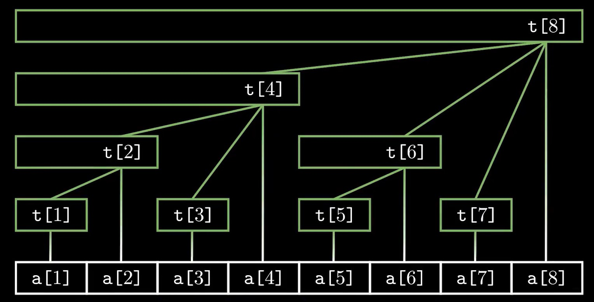
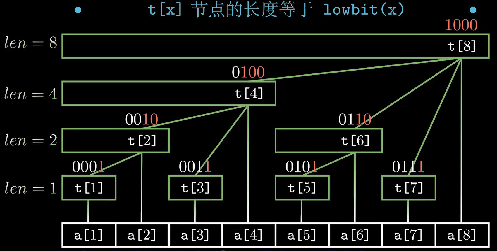
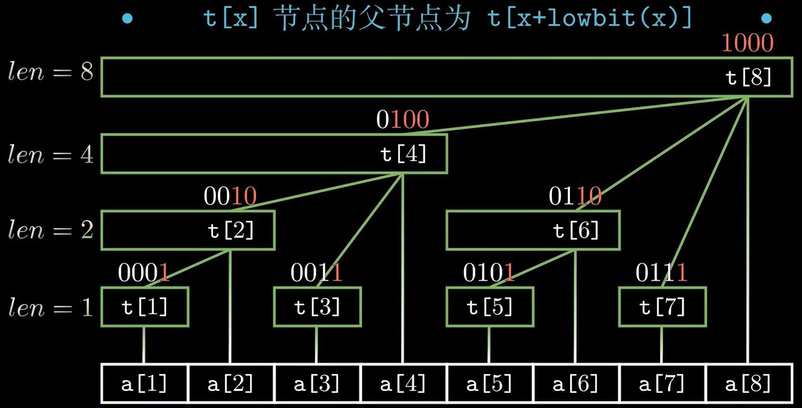
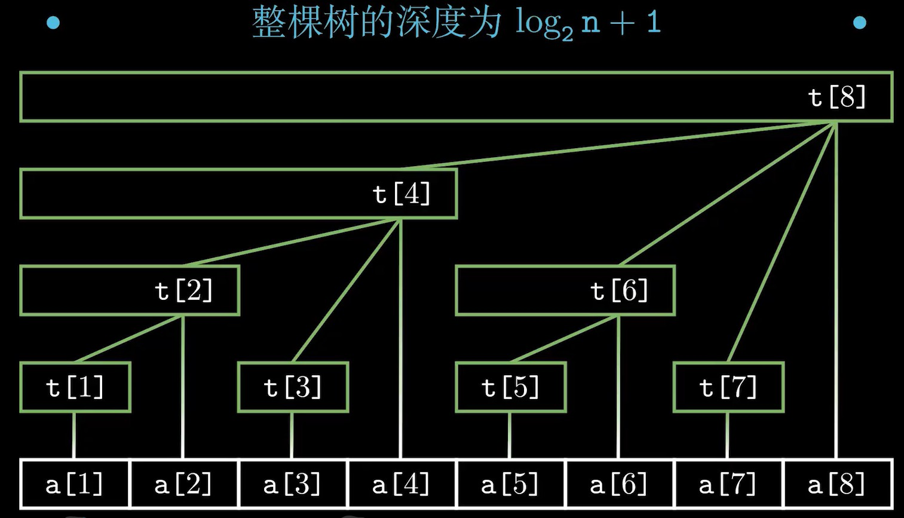
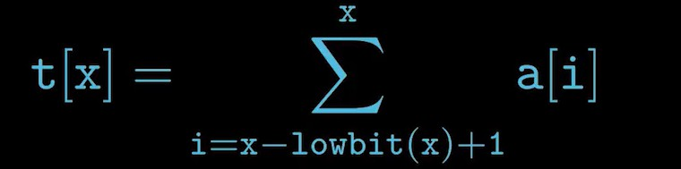
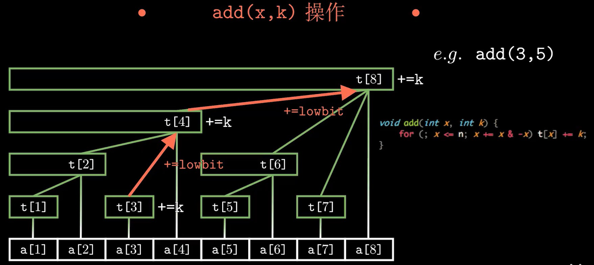
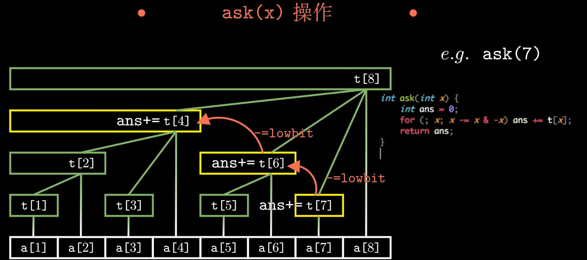


初级：(用于求区间和、区间异或)
- 单点修改，单点查询
    ```c++
    int t[N]; // 1-n
    // 区间和
    void add(int x,int k){ for(;x<=n;x+= x&-x) t[x]+=k;}
    int ask(int x){int ans=0; for(;x;x-= x&-x) ans+=t[x]; return ans;}
    sum[l,r] = ask(r)-ask(l-1);
    // 区间异或
    void add(int x,int k){ for(;x<=n;x+= x&-x) t[x]^=k;}
    int ask(int x){int ans=0; for(;x;x-= x&-x) ans^=t[x]; return ans;}
    xor[l,r] = ask(r)^ask(l-1);

    ```


## 应用
高级：(用于求逆序对、区间最大值（还可以用单调队列(见基础部分单调队列)）)
- 区间修改，单点查询
    - 引入差分数组，用树状数组维护b的前缀和，即a[]每个元素的增量
    $$[l,r]+d \ \ \ \   add(l,d) \ \ \ \ add(r+1,-d)$$
    $$查询a[x] \ \ \ \   ans = a[x]+ask(x)  $$
    ```c++
    void add(int x,int k){ for(;x<=n;x+= x&-x) t[x]+=k;}
    int ask(int x){int ans=0; for(;x;x-= x&-x) ans+=t[x]; return ans;}
    ```
- 区间修改，区间查询
    ```c++
    int t1[maxn],t2[maxn];
    void add1(int x,int k){ for(;x<=n;x+= x&-x) t1[x]+=k;}
    int ask1(int x){int ans=0; for(;x;x-= x&-x) ans+=t1[x]; return ans;}
    void add2(int x,int k){ for(;x<=n;x+= x&-x) t2[x]+=k;}
    int ask2(int x){int ans=0; for(;x;x-= x&-x) ans+=t2[x]; return ans;}
    ```
- 二维树状数组

[二维树状数组总结及模板](https://blog.csdn.net/qq_35885746/article/details/89247993)


[#786 (Div. 3). Desktop Rearrangement](https://codeforces.com/problemset/problem/1674/F)
- 一维树状数组
  - 对每个位置进行编号即可
- 二维树状数组
  - 待更新


可以动态维护序列前缀和的数据结构

- [超快速排序](https://www.acwing.com/problem/content/109/)
    - [离散+树状数组法](https://www.acwing.com/solution/content/2266/)
    - 逆序对问题
    ```c++
    // 准备部分
    #define fir(i,a,b) for (int i=a;i<=b;i++)
    int a[n],t[n+10];   //注意t从下标1开始记
    struct Node{
    int v,order;
    bool operator< (const Node& rhs){
        return v<rhs.v;
    }
    }nodes[n+10];
    // BIT部分
    // #define lowbit(x) ((x)&(-(x)))
    int lowbit(x){return x&-x;}
    void add(int x,int n){  for(int i =x;i<=n;i+=lowbit(i)) t[i]++; }
    int query(int x){ int ans =0; for(int i =x;i>0;i-=lowbit(i)){ans+=t[i];} return ans;}

    // 运用部分
        memset(t,0,sizeof(t));    // 清空t
        fir(i,0,n-1){             //读入原始数据
            cin>>nodes[i].v;
            nodes[i].order=i; 
        }
        sort(nodes,nodes+n);   //排序
        fir(i,0,n-1){          // 离散化为0~ n-1
            va[nodes[i].order]=i;   
        }
        LL ans = 0;
        fir(i,0,n-1){
            add(va[i]+1,n);   // 按原顺序，依次加入数组。注意加1
            ans+= i+1-query(va[i]+1); // //树状数组求逆序对个数的方法 (i+1)为已经加入t中的个数，其中query的为小于等于当前值的个数。则剩余的为大于当前值，即构成逆序对的个数。
        }
    ```
- [M-奇数码问题](https://www.acwing.com/problem/content/110/)
    - **注意**当要同时使用多个树状数组时，最好封装成BIT结构进行使用。


- 二维偏序问题
见刷题笔记部分。


*参考：*


[Video:完全理解并深入应用树状数组 | 支持多种动态维护区间操作](https://www.bilibili.com/video/BV1pE41197Qj?from=search&seid=12048142911835119381&spm_id_from=333.337.0.0)

[Article:树状数组](https://blog.csdn.net/bestsort/article/details/80796531)
[Article:数据结构之树状数组](https://wenku.baidu.com/view/1bc0aa1852d380eb62946db0.html?from=search)


[算法学习笔记(20): 二维偏序](https://zhuanlan.zhihu.com/p/112504092)


### 区间最大
树状数组求区间最大值：
（不能再把已填充的数修改为更小的数，可更改为一个更大的数！？ 若涉及自由更改，可用线段树, 不要再用树状数组了 血的教训...）
[树状数组求区间最大值(转载)](https://blog.csdn.net/qq_41661809/article/details/86667055)

直接照搬求区间合的方法显然是不行的。

因为区间合中，要查询[x,y]的区间合，是求出[1,x-1]的合与[1,y]的合，然后相减就得出了[x,y]区间的合。

而区间最值是没有这个性质的，所以只能够换一个思路。

设query(x,y)，表示[x，y]区间的最大值

因为h[y]表示的是[y,y-lowbit(y)+1]的最大值。

所以，可以这样求解：

若y-lowbit(y) > x ，则query(x,y) = max( h[y] , query(x, y-lowbit(y)) );

若y-lowbit(y) <=x，则query(x,y) = max( a[y] , query(x, y-1);

这个递归求解是可以求出解的，且可以证明这样求解的时间复杂度是O（(logn)^2）

int query(int x, int y)
{
	int ans = 0;
	while (y >= x)
	{
		ans = max(a[y], ans);
		y --;
		for (; y-lowbit(y) >= x; y -= lowbit(y))
			ans = max(h[y], ans);
	}
	return ans;
}
时间复杂度的证明：（换成二进制来看）

因为y经过Logn次变换以后，其与x不同的最高位至少下降了1位，所以最多进行(logn)^2次变换

举例：

y = 1010000

x = 1000001

1010000

=> 1001111 => 1001110 =>1001100 =>1001000

=>1000111 => 1000110 => 1000100

=> 1000011 = > 1000010

=>1000001

=>1000000 < 1000001
 


```c++  
//#include "stdafx.h"

#include<iostream>
using namespace std;
const int N=1e6;
int a[N],h[N];//h[x]:h[x]储存的是[x，x-lowbit(x)+1]中每个数的最大值
int n,m;
int lowbit(int x)
{
	return x&(-x);
}
void update(int x)
{
	int lx=x;
	while(x<=n)
	{
		h[x]=max(h[x],a[lx]);
		x+=lowbit(x);
	}
}
int query(int x,int y)
{
	int ans=0;
	while(y>=x)
	{
		ans=max(a[y],ans);       // 注意是 a[y] 不是h[y]
		y--;                    
		for(;y-lowbit(y)>=x;y-=lowbit(y))
		{
			ans=max(h[y],ans);
		}
	}
	return ans;
}
int main()
{
	int x,y;
	cin>>n>>m;
	for(int i=1;i<=n;i++)h[i]=0;
	for(int i=1;i<=n;i++)
	{
		cin>>a[i];
		update(i);
	}
	while(m--)
	{
		cin>>x>>y;
		cout<<query(x,y)<<endl;
	}
	return 0;
}
// 作者：Undying菲尼克斯 https://www.bilibili.com/read/cv17466143/ 出处：bilibili
```

例：[最长递增子序列 II](https://leetcode.cn/problems/longest-increasing-subsequence-ii/)
>给你一个整数数组 nums 和一个整数 k 。
找到 nums 中满足以下要求的最长子序列：
1.子序列 严格递增
2.子序列中相邻元素的差值 不超过 k 。
请你返回满足上述要求的 最长子序列 的长度。
子序列 是从一个数组中删除部分元素后，剩余元素不改变顺序得到的数组。
示例 1：
输入：nums = [4,2,1,4,3,4,5,8,15], k = 3
输出：5
解释：
满足要求的最长子序列是 [1,3,4,5,8] 。
子序列长度为 5 ，所以我们返回 5 。
注意子序列 [1,3,4,5,8,15] 不满足要求，因为 15 - 8 = 7 大于 3 。
示例 2：
输入：nums = [7,4,5,1,8,12,4,7], k = 5
输出：4
解释：
满足要求的最长子序列是 [4,5,8,12] 。
子序列长度为 4 ，所以我们返回 4 。
示例 3：
输入：nums = [1,5], k = 1
输出：1
解释：
满足要求的最长子序列是 [1] 。
子序列长度为 1 ，所以我们返回 1 。
提示：
1 <= nums.length <= 105
1 <= nums[i], k <= 105

- 动态规则 + 树状数组优化区间最大

```c++  
const int N = 1e5 + 10;
int a[N], h[N];
int lowbit(int x){ return x & (-x);}
void update(int x){
	int lx = x;
	while(x < N) h[x] = max(h[x], a[lx]), x += lowbit(x);
}
int query(int x, int y){
	int ans = 0;
	while(y >= x){
		ans = max(a[y], ans), y --;         // a[y], 非 h[y]
		for(; y - lowbit(y) >= x; y -= lowbit(y)) ans = max(h[y], ans);  // >, >= 都能过
	}
	return ans;
} 
class Solution {
public:
    int lengthOfLIS(vector<int>& nums, int k) {
        memset(h, 0, sizeof h), memset(a, 0, sizeof a);
        for(auto& v : nums) a[v] = max(a[v], query(max(1, v - k), v - 1) + 1), update(v);
        return query(1, N - 1);
    }
};
```


- 极简线段树代码

见原题。


同理：[预算内的最多机器人数目](https://leetcode.cn/problems/maximum-number-of-robots-within-budget/)
>你有 n 个机器人，给你两个下标从 0 开始的整数数组 chargeTimes 和 runningCosts ，两者长度都为 n 。第 i 个机器人充电时间为 chargeTimes[i] 单位时间，花费 runningCosts[i] 单位时间运行。再给你一个整数 budget 。
运行 k 个机器人 总开销 是 max(chargeTimes) + k * sum(runningCosts) ，其中 max(chargeTimes) 是这 k 个机器人中最大充电时间，sum(runningCosts) 是这 k 个机器人的运行时间之和。
请你返回在 不超过 budget 的前提下，你 最多 可以 连续 运行的机器人数目为多少。
示例 1：
输入：chargeTimes = [3,6,1,3,4], runningCosts = [2,1,3,4,5], budget = 25
输出：3
解释：
可以在 budget 以内运行所有单个机器人或者连续运行 2 个机器人。
选择前 3 个机器人，可以得到答案最大值 3 。总开销是 max(3,6,1) + 3 * sum(2,1,3) = 6 + 3 * 6 = 24 ，小于 25 。
可以看出无法在 budget 以内连续运行超过 3 个机器人，所以我们返回 3 。
示例 2：
输入：chargeTimes = [11,12,19], runningCosts = [10,8,7], budget = 19
输出：0
解释：即使运行任何一个单个机器人，还是会超出 budget，所以我们返回 0 。
提示：
chargeTimes.length == runningCosts.length == n
1 <= n <= 5 * 10^4
1 <= chargeTimes[i], runningCosts[i] <= 10^5
1 <= budget <= 10^15


解：
双指针+单调队列参考题解。

- 二分 + 预处理前缀和 + 区间最大

```c++  
class Solution {
    static const int N = 100010;
    typedef long long LL;
    LL pre[N];
    int a[N], h[N];
    int lowbit(int x){ return x & (-x);}
    void update(int x){
        int lx = x;
        while(x < N) h[x] = max(h[x], a[lx]), x += lowbit(x);
    }
    int query(int x, int y){
        int ans = 0;
        while(y >= x){
            ans = max(a[y], ans), y --;
            for(; y - lowbit(y) >= x; y -= lowbit(y)) ans = max(h[y], ans);
        }
        return ans;
    } 

    bool check(int mid, LL bud, int n){
        for(int i = 1; i + mid  - 1 <= n; ++ i){
            if(query(i, i + mid - 1) + (LL)mid * (pre[i + mid - 1] - pre[i - 1]) <= (LL)bud){
                return true;
            }
        }
        return false;
    }
public:
    int maximumRobots(vector<int>& ch, vector<int>& run, long long bud) {
        int n = ch.size();
        for(int i = 0; i < n; ++ i) a[i + 1] = ch[i], update(i + 1);
        for(int i = 0; i < n; ++ i) pre[i + 1] = pre[i] + run[i];
        int l = 0, r = n; 
        while(l < r){  
            int mid = (l + r + 1) >> 1;
            if(check(mid, bud, n)){
                l = mid;
            }else{
                r = mid - 1;
            }
        }
        return l;
    }
};
```


# 3 S-T表 

O(nlgn)预处理 O(1)查询  空间 O(nlgn)   解决区间最值RMQ(Range Max/Min Query)问题
d[i][j]维护一段起点为i,长度为2^j区间的最值：[i,i+2^j-1],
d[5,3] = min(d[5,2],d[9,2]);


# 4 线段树

线段树是算法竞赛中常用的用来维护 **区间信息** 的数据结构
又叫  线段错误树(Segment (error) tree)
>线段树是一种二叉搜索树，与区间树相似，它将一个区间划分成一些单元区间，每个单元区间对应线段树中的一个叶结点。(摘自百度百科)


## 应用
线段树是一种完全二叉树,支持操作:
1. 单点修改, 区间查询
2. 区间修改, 单点查询
3. 区间修改, 区间查询

**对于求前缀和的问题：**
针对不同的题目，我们有不同的方案可以选择（假设我们有一个数组）：
- 数组不变，求区间和：「前缀和」、「树状数组」、「线段树」
- 多次修改某个数，求区间和：「树状数组」、「线段树」
- 多次整体修改某个区间，求区间和：「线段树」、「树状数组」（看修改区间的数据范围） 
- 多次将某个区间变成同一个数，求区间和：「线段树」、「树状数组」（看修改区间的数据范围）

这样看来，「线段树」能解决的问题是最多的，那我们是不是无论什么情况都写「线段树」呢？
答案并不是，而且恰好相反，只有在我们遇到第 4 类问题，不得不写「线段树」的时候，我们才考虑线段树。
因为「线段树」代码很长，而且常数很大，实际表现不算很好。我们只有在不得不用的时候才考虑「线段树」。
总结一下，我们应该按这样的优先级进行考虑：

- 简单求区间和，用「前缀和」
- 多次将某个区间变成同一个数，用「线段树」
- 其他情况，用「树状数组」

## 基本操作

>push up(int u)//传入节点编号，用子节点信息来算父节点信息
build()        //将一段区间初始化为一颗线段树
modify()       //修改操作,修改某一个点或者某一个区间（懒标记）
    - 单点
    - 区间  pushdown
query()        //查询某一段区间的信息
pushdown(u)    //用u 的信息更新 u子结点的信息
    - 懒标记：给以当前节点为根的子树中的每一个节点(不包含根节点),添加标记lazy


除了最后一层，是 满二叉树


满二叉树：可用一维数组存储 整棵树

编号 是x ：  父节点   下取整 x / 2，即x >> 1
            左节点  2 * x            x << 1
            右节点  2 * x + 1       x << 1  |  1


开空间 ：  开 4 * n 的空间 


最多 需要 (n - 1) + n +  2 * n  = 4 * n -1 空间


假设有编号从1到n的n个点，每个点都存了一些信息，用[L,R]表示下标从L到R的这些点。
线段树的用处就是，对编号连续的一些点进行修改或者统计操作，修改和统计的复杂度都是O(log2(n)).

线段树的原理，就是，将[1,n]分解成若干特定的子区间(数量不超过4*n),然后，将每个区间[L,R]都分解为
少量特定的子区间，通过对这些少量子区间的修改或者统计，来实现快速对[L,R]的修改或者统计。

由此看出，用线段树统计的东西，必须符合**区间加法**，否则，不可能通过分成的子区间来得到[L,R]的统计结果。

符合**区间加法**的例子：
数字之和——总数字之和 = 左区间数字之和 + 右区间数字之和
最大公因数(GCD)——总GCD = gcd( 左区间GCD , 右区间GCD );
最大值——总最大值=max(左区间最大值，右区间最大值)
不符合区间加法的例子：
众数——只知道左右区间的众数，没法求总区间的众数
01序列的最长连续零——只知道左右区间的最长连续零，没法知道总的最长连续零

一个问题，只要能化成对一些连续点的修改和统计问题，基本就可以用线段树来解决了

```c++  
//一般使用结构体来存储线段树,空间大小开四倍
struct Node{
    int l,r;  //维护的区间
    int v;   //维护的信息...
} tree[N*4];
```


**基本操作代码：**

```c++  
struct Node {
  int l, r;
  // TODO: 需要维护的信息和懒标记
  
}tr[N * 4];

void pushup(Node& u, Node& l, Node& r){
  // TODO: 利用左右儿子信息维护当前节点的信息
}

void pushup(int u){
  pushup(tr[u], tr[u << 1], tr[u << 1 | 1]);
}

void pushdown(int u) {
  // TODO: 将懒标记下传
  if(tr[u].lazy == *) return;
  auto &root = tr[u], &left = tr[u << 1], &right = tr[u << 1 | 1];
  // 置空
}

void build(int u, int l, int r) {
  if (l == r) tr[u] = {l, r};  // TODO:根据需要处理
  else {
    tr[u] = {l, r};
    int mid = l + r >> 1;
    build(u << 1, l, mid), build(u << 1 | 1, mid + 1, r);
    pushup(u);
  }
}

void update(int u, int l, int r, int val) { 
  if (tr[u].l >= l && tr[u].r <= r) {
    // TODO: 修改区间 并 处理懒标记
  }
  else {
    pushdown(u);
    int mid = tr[u].l + tr[u].r >> 1;
    if (l <= mid) update(u << 1, l, r, val);
    if (r > mid) update(u << 1 | 1, l, r, val);
    pushup(u);
  }
}

Node query(int u, int l, int r){
  if(tr[u].l >= l && tr[u].r <= r) return tr[u]; 
  else{
    pushdown(u);
    int mid = tr[u].l + tr[u].r >> 1;
    if(r <= mid) return query(u << 1, l, r);
    else if(l > mid) return query(u << 1 | 1, l, r);
    else{
      Node res;
      auto left = query(u << 1, l, r);
      auto right = query(u << 1 | 1, l, r);
      pushup(res, left, right);
      return res;
    }
  }
}
```

**一个demo: 区间修改：加 以及 置1置0**


```c++  
struct Node {
  int l, r;
  // TODO: 需要维护的信息和懒标记
  int val, lazy = - 1;
  // 区间加 版本
  // LL sum, add;
}tr[N * 4];

void pushup(Node& u, Node& l, Node& r){
  // TODO: 利用左右儿子信息维护当前节点的信息
  u.val = l.val + r.val;
}

void pushup(int u){
  pushup(tr[u], tr[u << 1], tr[u << 1 | 1]);
}

void pushdown(int u) {
  // TODO: 将懒标记下传
  if(tr[u].lazy == -1) return;
  auto &root = tr[u], &left = tr[u << 1], &right = tr[u << 1 | 1];
  left.lazy = root.lazy, left.val = (left.r - left.l + 1) * root.lazy;
  right.lazy = root.lazy, right.val = (right.r - right.l + 1) * root.lazy;
  root.lazy = -1;         // 置空
  // 区间加 版本
  // TODO: 将懒标记下传
  // if(!tr[u].add) return;
  // auto &root = tr[u], &left = tr[u << 1], &right = tr[u << 1 | 1];
  // left.add += root.add, left.sum += (LL)(left.r - left.l + 1) * root.add;
  // right.add += root.add, right.sum += (LL)(right.r - right.l + 1) * root.add;
  // root.add = 0;
}

void build(int u, int l, int r) {
  if (l == r) tr[u] = {l, r};  // TODO:根据需要处理
  else {
    tr[u] = {l, r};
    int mid = l + r >> 1;
    build(u << 1, l, mid), build(u << 1 | 1, mid + 1, r);
    pushup(u);
  }
}

void update(int u, int l, int r, int val) { // 区间或单点修改
  if (tr[u].l >= l && tr[u].r <= r) {
    // TODO: 修改区间 并 处理懒标记
    tr[u].val = (tr[u].r - tr[u].l + 1) * val;
    tr[u].lazy = val;
    // 区间加 版本        
    // tr[u].sum += (LL)(tr[u].r - tr[u].l + 1) * val;
    // tr[u].add += val;
  }
  else {
    pushdown(u);  // 修改前把原有的标记更新下去
    int mid = tr[u].l + tr[u].r >> 1;
    if (l <= mid) update(u << 1, l, r, val);
    if (r > mid) update(u << 1 | 1, l, r, val);
    pushup(u);
  }
}

Node query(int u, int l, int r){
  if(tr[u].l >= l && tr[u].r <= r) return tr[u]; 
  else{
    pushdown(u);  // 查询前更新标记
    int mid = tr[u].l + tr[u].r >> 1;
    if(r <= mid) return query(u << 1, l, r);
    else if(l > mid) return query(u << 1 | 1, l, r);
    else{
      Node res;
      auto left = query(u << 1, l, r);
      auto right = query(u << 1 | 1, l, r);
      pushup(res, left, right);
      return res;
    }
  }
}
```


类：

```c++  
struct SegTree{
	SegTree(int n){ build(1, 1, n);}
	
	struct Node {
	  int l, r;
	  // TODO: 需要维护的信息和懒标记
	  
	}tr[N * 4];
	
	void pushup(Node& u, Node& l, Node& r){
	  // TODO: 利用左右儿子信息维护当前节点的信息
	}
	
  void pushup(int u){
    pushup(tr[u], tr[u << 1], tr[u << 1 | 1]);
  }

  void pushdown(int u) {
    // TODO: 将懒标记下传
    if(tr[u].lazy == *) return;
    auto &root = tr[u], &left = tr[u << 1], &right = tr[u << 1 | 1];
    // 置空
  }

  void build(int u, int l, int r) {
    if (l == r) tr[u] = {l, r};  // TODO:根据需要处理
    else {
      tr[u] = {l, r};
      int mid = l + r >> 1;
      build(u << 1, l, mid), build(u << 1 | 1, mid + 1, r);
      pushup(u);
    }
  }

  void update(int u, int l, int r, int val) { 
    if (tr[u].l >= l && tr[u].r <= r) {
      // TODO: 修改区间 并 处理懒标记
    }
    else {
      pushdown(u);
      int mid = tr[u].l + tr[u].r >> 1;
      if (l <= mid) update(u << 1, l, r, val);
      if (r > mid) update(u << 1 | 1, l, r, val);
      pushup(u);
    }
  }

  Node query(int u, int l, int r){
    if(tr[u].l >= l && tr[u].r <= r) return tr[u]; 
    else{
      pushdown(u);
      int mid = tr[u].l + tr[u].r >> 1;
      if(r <= mid) return query(u << 1, l, r);
      else if(l > mid) return query(u << 1 | 1, l, r);
      else{
        Node res;
        auto left = query(u << 1, l, r);
        auto right = query(u << 1 | 1, l, r);
        pushup(res, left, right);
        return res;
      }
    }
  }
};
```


## 例题

### 单点修改、区间查询

- **最大值**  
[最大数](https://www.acwing.com/problem/content/1277/)

```c++  

//线段树的建树：
//build
void build(int u,int l,int r){ //构建节点u，其维护的是区间[l,r]
    tr[u]={l,r};
    if(l==r) return ; //已经是叶子节点
    int mid=l+r>>1;
    build(u<<1,l,mid),build(u<<1|1,mid+1,r);
}
push_up操作
//push_up操作,用子节点信息来更新父节点信息,以维护最大值为例
void push_up(int u){
    tree[u].v=max(tree[u<<1].v,tree[u<<1|1].v);
}
查询操作
//query操作，用来查询某一段区间内的信息,以最大值为例
int query(int u,int l,int r){  //从u节点开始查询[l,r]区间内的某一信息
    if(tree[u].l>=l&&tree[u].r<=r) return tree[u].v;  //说明这一段的信息已经被完全包含，因此不需要继续向下递归，直接返回即可
    int res=0;
    //否则需要判断该递归那一边
    int mid=tree[u].l+tree[u].r >> 1;
    if(l<=mid) res=max(res,query(u<<1,l,r));  //递归左边并更新信息
    if(mid<r) res=max(res,query(u<<1|1,l,r));  //递归右边并更新信息,切记是mid<r，无等号
    return res;
}
修改操作
//modify操作，用来修改某一叶子节点并更新其所有父节点
void modify(int u,int x,int v){   //从u节点开始递归查找，将编号为x的节点的值修改为v
    if(tree[u].l==x&&tree[u].r==x) tree[u].v=v;
    else{
        int mid=tree[u].l+tree[u].r>>1;
        if(x<=mid) modify(u<<1,x,v);
        else modify(u<<1|1,x,v);
        push_up(u);
    }
}
```

- **前缀和**

```c++  
void build(int u, int l, int r){
  if(l == r) tr[u] = {l, r, a[l]};
  else{
    tr[u] = {l, r};
    int mid = l + r >> 1;
    build(u << 1, l, mid), build(u << 1 | 1, mid + 1, r);
    pushup(u);
  } 
}
void pushup(Node& u, Node& l, Node& r){
  u.sum = l.sum + r.sum;
}
void pushup(int u){
  pushup(tr[u], tr[u << 1], tr[u << 1 | 1]);
}
void modify(int u, int x, int val)
{
    if (tr[u].l == x && tr[u].r == x) tr[u] = {x, x, val};
    else
    {
        int mid = tr[u].l + tr[u].r >> 1;
        if (x <= mid) modify(u << 1, x, val);//左边更新
        else modify(u << 1 | 1, x, val);//右边更新
        pushup(u);//向上更新父节点
    }
}
Node query(int u, int l, int r){
  if(tr[u].l >= l && tr[u].r <= r) return tr[u];
  else{
    int mid = tr[u].l + tr[u].r >> 1;
    if(r <= mid) return query(u << 1, l, r);
    else if(l > mid) return query(u << 1 | 1, l, r);
    else{
      Node res;
      auto left = query(u << 1, l, r);
      auto right = query(u << 1 | 1, l, r);
      pushup(res, left, right);
      return res;
    }
  }
}
```

- **最大连续子段和**  
[你能回答这些问题吗](https://www.acwing.com/problem/content/246/)


```c++  
struct Node
{
    int l, r;
    int sum, lmax, rmax, tmax;
}tr[N * 4];

void pushup(Node &u, Node &l, Node &r)
{
    u.sum = l.sum + r.sum;
    u.lmax = max(l.lmax, l.sum + r.lmax);
    u.rmax = max(r.rmax, r.sum + l.rmax);
    u.tmax = max(max(l.tmax, r.tmax), l.rmax + r.lmax);
}

void pushup(int u)
{
    pushup(tr[u], tr[u << 1], tr[u << 1 | 1]);
}

void build(int u, int l, int r)
{
    if (l == r) tr[u] = {l, r, w[r], w[r], w[r], w[r]};
    else
    {
        tr[u] = {l, r};
        int mid = l + r >> 1;
        build(u << 1, l, mid), build(u << 1 | 1, mid + 1, r);
        pushup(u);
    }
}

void modify(int u, int x, int v)
{
    if (tr[u].l == x && tr[u].r == x) tr[u] = {x, x, v, v, v, v};
    else
    {
        int mid = tr[u].l + tr[u].r >> 1;
        if (x <= mid) modify(u << 1, x, v);
        else modify(u << 1 | 1, x, v);
        pushup(u);
    }
}

Node query(int u, int l, int r)
{
    if (tr[u].l >= l && tr[u].r <= r) return tr[u];
    else
    {
        int mid = tr[u].l + tr[u].r >> 1;
        if (r <= mid) return query(u << 1, l, r);
        else if (l > mid) return query(u << 1 | 1, l, r);
        else
        {
            auto left = query(u << 1, l, r);
            auto right = query(u << 1 | 1, l, r);
            Node res;
            pushup(res, left, right);
            return res;
        }
    }
}
```


### 区间修改、区间查询

**区间修改需要进行懒标记**


[区间最大公约数](https://www.acwing.com/problem/content/247/)
>给定一个长度为 N 的数列 A，以及 M 条指令，每条指令可能是以下两种之一：
1.C l r d，表示把 A[l],A[l+1],…,A[r] 都加上 d。
2.Q l r，表示询问 A[l],A[l+1],…,A[r] 的最大公约数(GCD)。
对于每个询问，输出一个整数表示答案。


- 通过差分数组 将区间修改转化为单点修改
    - a[]为原数组, b[]为差分数组:
        1. b[i]=a[i]−a[i−1]
        2. a[i]=b[1]+b[2]+…+b[i]
        a[]的区间[L,R]加 d 等价于: b[]中 b[l]+d,b[r+1]−d
- 利用最大公约数的性质:
        - gcd(a1,a2,a3…an)=gcd(a1,a2−a1,a3−a2…an−an−1)
- 综上, 线段树维护信息: 差分数组的前缀和, 区间的最大公约数. (所有信息都是关于差分数组的)
对于查询区间[L,R]: ans=gcd(aL,aL+1−aL…aR−aR−1)=gcd(差分数组前缀和,gcd(bL+1,bL+2…bR)

[一个简单的整数问题2](https://www.acwing.com/problem/content/244/)
>给定一个长度为 N 的数列 A，以及 M 条指令，每条指令可能是以下两种之一：
1.C l r d，表示把 A[l],A[l+1],…,A[r] 都加上 d。
2.Q l r，表示询问数列中第 l∼r 个数的和。
对于每个询问，输出一个整数表示答案。


解： 提供三种解法
- 用树状数组或线段树均可
    - 树状数组
    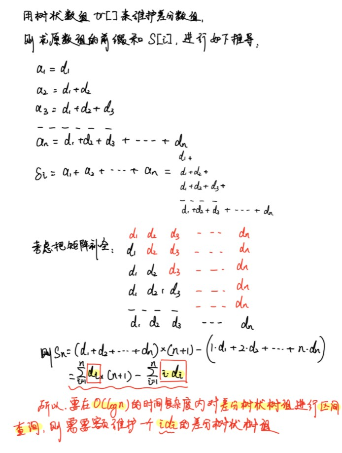
    - 线段树
    题目涉及**区间修改**, 需要**pushdown()**操作
    pushdown: 用当前结点的信息更新子结点的信息
        - puhdown操作对应懒标记, 每次对区间[L,R]修改操作时, 当递归到的子树区间[l,r] 属于[L,R]时, 不再向下递归修改, 而是直接将修改信息标记在该区间, 下一次需要从当前区间分裂时, 将懒标记向下传递
    - 分块
- 难点
    1.树状数组方法：注意对两个树的原地建树 和 更新方式。
    2.线段树中懒标记的实现。


**具体代码**：
- 树状数组 
由于是区间加，可以用差分数组维护。
*其他区间操作可能需要用到线段树了。*
用树状数组完成 O(logn)  时间复杂度的区间查询(O(logn)) + 区间修改O(logn)

分析见上：
因此只需维护两个树状数组即可
一个是差分数组d[i]的树状数组tr[i]，还有一个是i*d[i]的树状数组tri[i]


```c++  
#include <iostream>
#include <cstdio>
#include <cstring>
#include <algorithm>
#include <cmath>
#include <cstdlib>
using namespace std;
const int N = 100010;
typedef long long LL;


int n, m;
int w[N];

LL tr[N], tri[N];

int lowbit(int x){return x & -x;}
void add(LL t[], int x, int k) { for( ; x <= n; x += x & -x) t[x] += k;}
LL ask(LL t[], int x) {LL ans = 0; for( ; x ; x -= x & -x) ans += t[x]; return ans;}

LL get(int x){
  return ask(tr, x) * (x + 1) - ask(tri, x);
}

int main()
{
  cin >> n >> m;
  for(int i = 1; i <= n; ++ i) scanf("%d", &w[i]);
  for(int i = 1; i <= n; ++ i){
    tr[i] = w[i] - w[i - 1], tri[i] = tr[i] * i;
  }
  for(int x = 1; x <= n; ++ x){
    for(int i = x - 1; i >= x - lowbit(x) + 1; i -= lowbit(i)){
      tr[x] += tr[i], tri[x] += tri[i];
    }
  }
  
  char op[2];
  int l, r, d;
  while(m --){
    scanf("%s%d%d", op, &l, &r);
    if(*op == 'C'){
      scanf("%d", &d);
      add(tr, l, d), add(tr, r + 1, - d);
      add(tri, l, l * d), add(tri, r + 1,(r + 1) * (- d));
    }else{
      printf("%lld\n", get(r) - get(l - 1));
    }
  }
	return 0;
}
```


- 线段树  O(mlogn)

```c++  
#include <iostream>
#include <cstdio>
#include <cstring>
#include <algorithm>
#include <cmath>
#include <cstdlib>
using namespace std;
const int N = 100010;
typedef long long LL;


int n, m;
int w[N];

struct Node {
  int l, r;
  LL sum, lazy;  
  
}tr[N * 4];

void pushup(Node& u, Node& l, Node& r){
  u.sum = l.sum + r.sum;
}

void pushup(int u){
  pushup(tr[u], tr[u << 1], tr[u << 1 | 1]);
}

void pushdown(int u) {
  if(tr[u].lazy == 0) return;
  auto &root = tr[u], &left = tr[u << 1], &right = tr[u << 1 | 1];
  left.lazy += root.lazy, left.sum += (LL)(left.r - left.l + 1) * root.lazy;
  right.lazy += root.lazy, right.sum += (LL)(right.r - right.l + 1) * root.lazy;
  root.lazy = 0; 
}

void build(int u, int l, int r) {
  if (l == r) tr[u] = {l, r, w[l], 0};
  else {
    tr[u] = {l, r};
    int mid = l + r >> 1;
    build(u << 1, l, mid), build(u << 1 | 1, mid + 1, r);
    pushup(u);
  }
}

void update(int u, int l, int r, int val) { 
  if (tr[u].l >= l && tr[u].r <= r) {
    tr[u].lazy += val;
    tr[u].sum += (LL)(tr[u].r - tr[u].l + 1) * val;
  }
  else {
    pushdown(u);
    int mid = tr[u].l + tr[u].r >> 1;
    if (l <= mid) update(u << 1, l, r, val);
    if (r > mid) update(u << 1 | 1, l, r, val);
    pushup(u);
  }
}

Node query(int u, int l, int r){
  if(tr[u].l >= l && tr[u].r <= r) return tr[u]; 
  else{
    pushdown(u);
    int mid = tr[u].l + tr[u].r >> 1;
    if(r <= mid) return query(u << 1, l, r);
    else if(l > mid) return query(u << 1 | 1, l, r);
    else{
      Node res;
      auto left = query(u << 1, l, r);
      auto right = query(u << 1 | 1, l, r);
      pushup(res, left, right);
      return res;
    }
  }
}


int main()
{
  cin >> n >> m;
  for(int i = 1; i <= n; ++ i) scanf("%d", &w[i]);
  build(1, 1, n);
  char op[2];
  int l, r, d;
  while(m --){
    scanf("%s%d%d", op, &l, &r);
    if(*op == 'C'){
      scanf("%d", &d);
      update(1, l, r, d);
    }else{
      printf("%lld\n", query(1, l, r).sum);
    }
  }
	return 0;
}
```


- 分块 O(m√n)

分块算法是一种**优雅**的暴力。
*详情见本章下文。*

**分块 + 懒标记**


```c++  

#include <iostream>
#include <cstring>
#include <algorithm>
#include <cmath>

using namespace std;

typedef long long LL;

const int N = 1e5 + 10, M = 350;

int n, m, len;
LL sum[M], lazy[M]; //sum：块的总和；lazy：块的懒标记
int w[N];

int get(int i)
{
    return i / len;
}
void modify(int l, int r, int d)
{
    if (get(l) == get(r))   //段内直接暴力
    {
        for (int i = l; i <= r; i ++ )
            w[i] += d, sum[get(i)] += d;
    }
    else
    {
        int i = l, j = r;
        while (get(i) == get(l)) w[i] += d, sum[get(i)] += d, i ++ ;
        while (get(j) == get(r)) w[j] += d, sum[get(j)] += d, j -- ;
        for (int k = get(i); k <= get(j); k ++ ) sum[k] += len * d, lazy[k] += d; // 只对段进行处理，未对每个具体元素加，对该段所有元素 添加(更新)懒标记
    }
}
LL query(int l, int r)
{
    LL res = 0;
    if (get(l) == get(r))   //段内直接暴力
    {
        for (int i = l; i <= r; i ++ )
            res += w[i] + lazy[get(i)];   // 获取单个元素时  把之前的懒标记加上
    }
    else
    {
        int i = l, j = r;
        while (get(i) == get(l)) res += w[i] + lazy[get(i)], i ++ ;  // 单个元素
        while (get(j) == get(r)) res += w[j] + lazy[get(j)], j -- ;  // 单个元素
        for (int k = get(i); k <= get(j); k ++ ) res += sum[k];  // 处理段时，不再加 懒标记
    }
    return res;
}
int main()
{
    scanf("%d%d", &n, &m);
    len = sqrt(n);
    for (int i = 1; i <= n; i ++ )
    {
        scanf("%d", &w[i]);
        sum[get(i)] += w[i];
    }

    char op[2];
    int l, r, d;

    while (m -- )
    {
        scanf("%s%d%d", op, &l, &r);
        if (*op == 'C')
        {
            scanf("%d", &d);
            modify(l, r, d);
        }
        else printf("%lld\n", query(l, r));
    }
    return 0;
}

```


[二叉搜索树染色](https://leetcode-cn.com/problems/QO5KpG/)
>一个节点数组，无相同节点。初始时，所有节点均为蓝色。现在按顺序其进行若干次操作， ops[i] = [type, x, y] 表示第 i 次操作为：
type 等于 0 时，将节点值范围在 [x, y] 的节点均染蓝
type 等于 1 时，将节点值范围在 [x, y] 的节点均染红
请返回完成所有染色后，该节点数组中红色节点的数量。
注意：
题目保证对于每个操作的 x、y 值定出现在二叉搜索树节点中
数据：
1 <= 节点数量 <= 10^5
1 <= ops.length <= 10^5
ops[i].length == 3
ops[i][0] 仅为 0 or 1
0 <= ops[i][1] <= ops[i][2] <= 10^9
0 <= 节点值 <= 10^9


- 倒序...逆向思考方式
每个点的颜色只取决于最后一次包含该点的操作。用 set 维护所有颜色待确定的点，倒序处理询问，每次利用 lower_bound 方法从 set 中取出所有在询问范围内的点染色后删掉。因为每个点只会被删掉一次，所以总体复杂度 O((n+q)logn)，其中 n 是节点数量，q 是询问数量。

```c++  
/**
 * Definition for a binary tree node.
 * struct TreeNode {
 *     int val;
 *     TreeNode *left;
 *     TreeNode *right;
 *     TreeNode(int x) : val(x), left(NULL), right(NULL) {}
 * };
 */
class Solution {
    set<int> st;

    void dfs(TreeNode *node) {
        if (node == nullptr) return;
        st.insert(node->val);
        dfs(node->left);
        dfs(node->right);
    }

public:
    int getNumber(TreeNode* root, vector<vector<int>>& ops) {
        dfs(root);
        int ans = 0;
        for (int i = (int) ops.size() - 1; i >= 0; i--) {
            while (true) {
                auto it = st.lower_bound(ops[i][1]);
                if (it == st.end() || (*it) > ops[i][2]) break;
                st.erase(it);
                if (ops[i][0]) ans++;
            }
        }
        return ans;
    }
};
```

- 离散化 + 线段树(需要懒标记)

```c++  
const int N = 100010;

class Solution {
    struct Node {
      int l, r;
      // 需要维护的信息和懒标记
      int val, lazy = - 1;
    }tr[N * 4];

    void pushup(Node& u, Node& l, Node& r){
      // 利用左右儿子信息维护当前节点的信息
      u.val = l.val + r.val;
    }

    void pushup(int u){
      pushup(tr[u], tr[u << 1], tr[u << 1 | 1]);
    }

    void pushdown(int u) {
      // 将懒标记下传
      if(tr[u].lazy == -1) return;
      auto &root = tr[u], &left = tr[u << 1], &right = tr[u << 1 | 1];
      left.lazy = root.lazy, left.val = (left.r - left.l + 1) * root.lazy;
      right.lazy = root.lazy, right.val = (right.r - right.l + 1) * root.lazy;
      root.lazy = -1;         // 置空
    }

    void build(int u, int l, int r) {
      if (l == r) tr[u] = {l, r};  // 根据需要处理
      else {
        tr[u] = {l, r};
        int mid = l + r >> 1;
        build(u << 1, l, mid), build(u << 1 | 1, mid + 1, r);
        pushup(u);
      }
    }

    void update(int u, int l, int r, int val) { // 区间或单点修改
      if (tr[u].l >= l && tr[u].r <= r) {
        // 修改区间 并 处理懒标记
        tr[u].val = (tr[u].r - tr[u].l + 1) * val;
        tr[u].lazy = val;
      }
      else {
        pushdown(u);  // 修改前把原有的标记更新下去
        int mid = tr[u].l + tr[u].r >> 1;
        if (l <= mid) update(u << 1, l, r, val);
        if (r > mid) update(u << 1 | 1, l, r, val);
        pushup(u);
      }
    }

    Node query(int u, int l, int r){
      if(tr[u].l >= l && tr[u].r <= r) return tr[u]; 
      else{
        pushdown(u);
        int mid = tr[u].l + tr[u].r >> 1;
        if(r <= mid) return query(u << 1, l, r);
        else if(l > mid) return query(u << 1 | 1, l, r);
        else{
          Node res;
          auto left = query(u << 1, l, r);
          auto right = query(u << 1 | 1, l, r);
          pushup(res, left, right);
          return res;
        }
      }
    }
    vector<int> nums;
    void dfs(TreeNode* root){
      if(root == nullptr) return;
      nums.push_back(root->val);
      dfs(root->left);
      dfs(root->right);
    }
  int find(int x){
    return lower_bound(nums.begin(), nums.end(), x) - nums.begin() + 1;
  }

public:
    int getNumber(TreeNode* root, vector<vector<int>>& ops) {
      dfs(root);
      sort(nums.begin(), nums.end());
      build(1, 1, nums.size());
      for(auto o:ops){
        int l = find(o[1]), r = find(o[2]);
        update(1, l, r, o[0]);
      }
      return query(1, 1, nums.size()).val;
    }
};
```

- 珂朵莉树

区间染色 + 单点查询
[珂朵莉](https://zhuanlan.zhihu.com/p/106353082)

珂朵莉树（Chtholly Tree）起源于CF896C，一种数据结构，可以较快地实现：

区间加
区间赋值
求区间第k大值
求区间n次方和

```c++  
class Solution {
public:
    int getNumber(TreeNode* root, vector<vector<int>>& ops) {
        const int N = 1e9 + 1;
        map<int, int> seg;
        seg[0] = 1, seg[N] = 0;
        auto Cut = [&](int i) -> void {
            if (i < 0 || i > N) return;
            if (!seg.count(i)) {
                auto it = prev(seg.lower_bound(i));
                auto [x, y] = *it;
                seg[i] = y;
            }
        };
        
        for (auto &op: ops) {
            int t = op[0] + 1, x = op[1], y = op[2];
            Cut(x), Cut(y + 1);
            auto it = next(seg.lower_bound(x));
            while (it->first <= y) {
                it = seg.erase(it);
            }
            seg[x] = t;
            if (seg[y + 1] == seg[x]) seg.extract(y + 1);
            if (x > 0) {
                auto it = seg.lower_bound(x);
                if (it->second == prev(it)->second) {
                    seg.erase(it);
                }
            }
        }
        int ans = 0;
        auto dfs = [&](auto &&dfs, TreeNode* root) -> void {
            int v = root -> val;
            auto it = prev(seg.upper_bound(v));
            if (it -> second == 2) {
                ans ++;
            }
            if (root -> left) dfs(dfs, root->left);
            if (root -> right) dfs(dfs, root->right);
        };

        dfs(dfs, root);
        return ans;
    }
};
```


**题集**

*难*

[维护序列](https://www.acwing.com/problem/content/description/1279/)
[亚特兰蒂斯](https://www.acwing.com/activity/content/problem/content/1611/)

[@@LC:奇妙序列](https://leetcode-cn.com/problems/fancy-sequence/) 需要同时维护`+`和`x`的懒标记
>请你实现三个 API append，addAll 和 multAll 来实现奇妙序列。
请实现 Fancy 类 ：
Fancy() 初始化一个空序列对象。
void append(val) 将整数 val 添加在序列末尾。
void addAll(inc) 将所有序列中的现有数值都增加 inc 。
void multAll(m) 将序列中的所有现有数值都乘以整数 m 。
int getIndex(idx) 得到下标为 idx 处的数值（下标从 0 开始），并将结果对 109 + 7 取余。如果下标大于等于序列的长度，请返回 -1 。
提示：
1 <= val, inc, m <= 100
0 <= idx <= 105
总共最多会有 105 次对 append，addAll，multAll 和 getIndex 的调用。

[@@包含每个查询的最小区间](https://leetcode-cn.com/problems/minimum-interval-to-include-each-query/)

>给你一个二维整数数组 intervals ，其中 intervals[i] = [lefti, righti] 表示第 i 个区间开始于 lefti 、结束于 righti（包含两侧取值，闭区间）。区间的 长度 定义为区间中包含的整数数目，更正式地表达是 righti - lefti + 1 。
再给你一个整数数组 queries 。第 j 个查询的答案是满足 lefti <= queries[j] <= righti 的 长度最小区间 i 的长度 。如果不存在这样的区间，那么答案是 -1 。
以数组形式返回对应查询的所有答案。
示例 1：
输入：intervals = [ [1,4],[2,4],[3,6],[4,4] ], queries = [2,3,4,5]
输出：[3,3,1,4]
解释：查询处理如下：
- Query = 2 ：区间 [2,4] 是包含 2 的最小区间，答案为 4 - 2 + 1 = 3 。
- Query = 3 ：区间 [2,4] 是包含 3 的最小区间，答案为 4 - 2 + 1 = 3 。
- Query = 4 ：区间 [4,4] 是包含 4 的最小区间，答案为 4 - 4 + 1 = 1 。
- Query = 5 ：区间 [3,6] 是包含 5 的最小区间，答案为 6 - 3 + 1 = 4 。
示例 2：
输入：intervals = [ [2,3],[2,5],[1,8],[20,25] ], queries = [2,19,5,22]
输出：[2,-1,4,6]
解释：查询处理如下：
- Query = 2 ：区间 [2,3] 是包含 2 的最小区间，答案为 3 - 2 + 1 = 2 。
- Query = 19：不存在包含 19 的区间，答案为 -1 。
- Query = 5 ：区间 [2,5] 是包含 5 的最小区间，答案为 5 - 2 + 1 = 4 。
- Query = 22：区间 [20,25] 是包含 22 的最小区间，答案为 25 - 20 + 1 = 6 。

提示：
1 <= intervals.length <= 105
1 <= queries.length <= 105
queries[i].length == 2
1 <= lefti <= righti <= 107
1 <= queries[j] <= 107

**解法：**
1.优先队列
2.并查集
3.离线
4.线段树


## 动态开点线段树


**引入**
在普通的线段树中，我们一般要开 4 N  的数组以避免越界。然而，在一些题目中，空间限制并不允许我们这样做。而且 并不知道原始的值，不方便进行离散化处理。 这个时候，就需要使用动态开点线段树。

你知道正常的线段树一般都是用二倍标记法去标记儿子的序号。

然后在线段树那一篇里面我证过，这样子至少需要四倍空间才不会出现RE。

但在某些特殊的情况下（比如权值线段树），你需要维护的范围可能非常大，如果真的要全部建树建出来，可能空间就爆了。

然后这个时候利用一个类似线段树懒标记的思想，如果一个节点需要使用，那么我们才建立这个节点，反之就不用。

从实现上来讲，就是初始的时候只建立一个根节点代表整个区间。

然后当查询或者修改某个区间的时候我们才向下递归建树。

而且不同于原来的二倍标记法，现在是以直接记录每一个节点的左右儿子的编号来建立线段树。


作用
​ 一般有两种：

1.节约空间，所以在需要时再建儿子。**只开一条链**，类似可持久化线段树。
2.运用可持久化线段树的时候（此文章不会提及）。

**动态开点线段树**
我们来观察一下普通线段树的左儿子和右儿子的表示方法：

左儿子：`p<<1`

右儿子：`p<<1|1`


这样，虽然我们可以直接算出左右儿子，比较方便，但是，这样也浪费了大量的空间。

在学习二叉树的时候，二叉树还有哪种存储方法呢？

**链式储存法**，即对一个节点建立左右儿子指针，指向它的左右儿子。这样，建立新节点时，就不会浪费多余的空间。

这样一来，没有了空间的浪费，我们所需要的空间就大大减少了。对于动态开点二叉树，我们只需要开 2 N 的数组就可以了。

**实现**
动态开点线段树的实现和普通线段树差别不大，只是需要在使用节点时判断当前节点是否存在，如果不存在要建立新节点。


**模板：**
动态开点 不能再build  也不再像之前 tr[u].l ,tr[u].r， 而是通过参数传递。l,r 表示维护区间，L，R为查询和更新区间。 lson和rson表示左右子节点。 注意tot赋值，在pushdown中处理。

动态开点数量 = q * log(N) ,q 为查询次数，N 为数据范围。


```c++  
// 动态开点
const int N = 3000010; // N = log(10 ^ 9) *  10 ^ 5 = 3 * 10^ 6
int root, tot = 1;
struct Node {
    int lson, rson;
    // TODO: 需要维护的信息和懒标记
    int v, lazy;
    Node():lson(0), rson(0), v(0), lazy(0){}
}tr[N];

void pushup(Node& u, Node& l, Node& r){
    // TODO: 利用左右儿子信息维护当前节点的信息

}

void pushup(int u){
    pushup(tr[u], tr[tr[u].lson], tr[tr[u].rson]);
}

void pushdown(int u, int l, int r, int m) {
    // TODO: 将懒标记下传
    // if(tr[u].lazy == *) return;
    if(! tr[u].lson) tr[u].lson = ++ tot;  // !!!
    if(! tr[u].rson) tr[u].rson = ++ tot;
    auto &root = tr[u], &left = tr[tr[u].lson], &right = tr[tr[u].rson];
    // 置空
    if(tr[u].lazy){
        // left: m - l + 1 , right : r - m

    }
}

void update(int& u, int l, int r, int L, int R, int val) { 
    if(r < L || l > R) return ;
    else if (l >= L && r <= R) {   
        // TODO: 修改区间 并 处理懒标记

    }
    else {
        int mid = l + r >> 1;
        pushdown(u, l, r, mid);
        update(tr[u].lson, l, mid, L, R, val);
        update(tr[u].rson, mid + 1, r, L, R, val);
        pushup(u);
    }
}

Node query(int u, int l, int r, int L, int R){
    if(r < L || l > R) return Node();
    else if(l >= L && r <= R) {
        return tr[u]; 
    }
    else{
        int mid = l + r >> 1;
        pushdown(u, l, r, mid);

        if(r <= mid) return query(tr[u].lson, l, mid, L, R);
        else if(l > mid) return query(tr[u].rson, mid + 1, r, L, R);
        else {
            Node res;
            auto left = query(tr[u].lson, l, mid, L, R);
            auto right = query(tr[u].rson, mid + 1, r, L, R);
            pushup(res, left, right);
            return res;
        }
    }
}

// 
root = 1;
memset(tr, 0, sizeof tr);
update(root, 1, 1e9, L, R, 1);
query(root, 1, 1e9, L, R);
```


例题：
[ Range 模块](https://leetcode-cn.com/problems/range-module/)

```c++  
const int N = 3000010;   // log(10 ^ 9) * 10 ^ 4 = 3 * 10 ^ 5;  暂时还有问题 ，不对
struct Node {
  int lson, rson;
  int v, lazy0, lazy1;
  // TODO: 需要维护的信息和懒标记
  Node(){}
  Node(int ls, int rs, int v, int l0, int l1):lson(ls), rson(rs), v(v), lazy0(l0), lazy1(l1){}
}tr[N << 1];

int root, tot = 1;
void pushup(Node& u, Node& l, Node& r){
  // TODO: 利用左右儿子信息维护当前节点的信息
  u.v = l.v & r.v;
}

void pushup(int u){
  pushup(tr[u], tr[tr[u].lson], tr[tr[u].rson]);
}

void pushdown(int u, int l, int r, int m) {
  // TODO: 将懒标记下传
  // if(tr[u].lazy == *) return;
    if(! tr[u].lson) tr[u].lson = ++ tot;  // !!!
    if(! tr[u].rson) tr[u].rson = ++ tot;
    auto &root = tr[u], &left = tr[tr[u].lson], &right = tr[tr[u].rson];
  // 置空
  if(tr[u].lazy0){
    left.v = 0;
    right.v = 0;
    left.lazy0 = root.lazy0;
    right.lazy0 = root.lazy0;
    left.lazy1 = 0;
    right.lazy1 = 0;    
    root.lazy0 = 0;
  }
  if(tr[u].lazy1){
    left.v = 1;
    right.v = 1;
    left.lazy0 = 0;
    right.lazy0 = 0;
    left.lazy1 = root.lazy1;
    right.lazy1 = root.lazy1;    
    root.lazy1 = 0;      
  }
}

void update(int& u, int l, int r, int L, int R, int val) { 
//   if(! u) u = ++ tot;
  if(r < L || l > R) return ;
  else if (l >= L && r <= R) {   
    // TODO: 修改区间 并 处理懒标记
    if(val == 0){
        tr[u].lazy0 = 1;    tr[u].lazy1 = 0;     tr[u].v = 0;
    }else{
        tr[u].lazy0 = 0;    tr[u].lazy1 = 1;     tr[u].v = 1;
    }
  }
  else {
    int mid = l + r >> 1;
    pushdown(u, l, r, mid);
    if (l <= mid) update(tr[u].lson, l, mid, L, R, val);   //not l, mid...
    if (r > mid) update(tr[u].rson, mid + 1, r, L, R, val);
    pushup(u);
  }
}

Node query(int u, int l, int r, int L, int R){
  if(r < L || l > R) return Node(0,0,1,0,0);
  else if(l >= L && r <= R) {
    return tr[u]; 
  }
  else{
    int mid = l + r >> 1;
    pushdown(u, l, r, mid);

    if(r <= mid) return query(tr[u].lson, l, mid, L, R);          //
    else if(l > mid) return query(tr[u].rson, mid + 1, r, L, R);   //
    else {
        Node res;
        auto left = query(tr[u].lson, l, mid, L, R);        //
        auto right = query(tr[u].rson, mid + 1, r, L, R);   //
        pushup(res, left, right);
        return res;
    }
  }
}

class RangeModule {
public:
    RangeModule() {
        root = 1;
        memset(tr, 0, sizeof tr);
    }
    
    void addRange(int left, int right) {
        update(root, 0, 1e9, left, right - 1, 1);
    }
    
    bool queryRange(int left, int right) {
        return query(root, 0, 1e9, left, right - 1).v;
    }
    
    void removeRange(int left, int right) {
        update(root, 0, 1e9, left, right - 1, 0);
    }
};

/**
 * Your RangeModule object will be instantiated and called as such:
 * RangeModule* obj = new RangeModule();
 * obj->addRange(left,right);
 * bool param_2 = obj->queryRange(left,right);
 * obj->removeRange(left,right);
 */
```


[★★★★★统计区间中的整数数目](https://leetcode.cn/problems/count-integers-in-intervals/)

>给你区间的 空 集，请你设计并实现满足要求的数据结构：
新增：添加一个区间到这个区间集合中。
统计：计算出现在 至少一个 区间中的整数个数。
实现 CountIntervals 类：
CountIntervals() 使用区间的空集初始化对象
void add(int left, int right) 添加区间 [left, right] 到区间集合之中。
int count() 返回出现在 至少一个 区间中的整数个数。
注意：区间 [left, right] 表示满足 left <= x <= right 的所有整数 x 。
示例 1：
输入
["CountIntervals", "add", "add", "count", "add", "count"]
[ [], [2, 3], [7, 10], [], [5, 8], [] ]
输出
[null, null, null, 6, null, 8]
解释
CountIntervals countIntervals = new CountIntervals(); // 用一个区间空集初始化对象
countIntervals.add(2, 3);  // 将 [2, 3] 添加到区间集合中
countIntervals.add(7, 10); // 将 [7, 10] 添加到区间集合中
countIntervals.count();    // 返回 6
                           // 整数 2 和 3 出现在区间 [2, 3] 中
                           // 整数 7、8、9、10 出现在区间 [7, 10] 中
countIntervals.add(5, 8);  // 将 [5, 8] 添加到区间集合中
countIntervals.count();    // 返回 8
                           // 整数 2 和 3 出现在区间 [2, 3] 中
                           // 整数 5 和 6 出现在区间 [5, 8] 中
                           // 整数 7 和 8 出现在区间 [5, 8] 和区间 [7, 10] 中
                           // 整数 9 和 10 出现在区间 [7, 10] 中
提示：
1 <= left <= right <= 109
最多调用  add 和 count 方法 总计 105 次
调用 count 方法至少一次


解：
3种方法：
1. 区间合并处理
2. 动态开点线段树 + 懒标记
3. 动态开点线段树-简洁版：

具体：


一：区间合并处理

求区间并集模板题。用一个 set 有序地维护所有不相交的区间，当加入区间 [left, right] 时，通过 lower_bound 快速找到第一个右端点大等于 left - 1 的区间，然后不断用接下来的区间和 [left, right] 合并，直到当前区间的左端点大于 right + 1。由于每个区间只会加入以及离开 set 一次，复杂度 O(nlog n)

其中对`端点+-1`的考虑：
为了把虽然不相交但是连续的区间也合并，比如 [1,3], [4, 6] 可以合并成 [1, 6]。当然对于本题而言这样的合并不需要。直接用 left 和 right 判断也可以，但作为模板的角度合并可能更合适一点。

注意： 区间[L, R] ，极限情况能与[.., L - 1], [R + 1, ..] 合并。

```c++  
class CountIntervals {
    typedef pair<int, int> PII;

    int ans = 0;
    set<PII> st;

public:
    CountIntervals() {
    }
    
    void add(int left, int right) {
        int L = left, R = right;
        auto it = st.lower_bound(PII(left - 1, -2e9));
        while (it != st.end()) {
            if (it->second > right + 1) break;
            L = min(L, it->second);  // 不断扩大当前正在合并的新区间范围
            R = max(R, it->first);
            ans -= it->first - it->second + 1; // 被合并的去掉 最后在新的区间中再添加
            st.erase(it++);     // 移除该区间!
        }
        ans += R - L + 1;
        st.insert(PII(R, L));   // first为 右端点， second为左端点
    }
    
    int count() {
        return ans;
    }
};

```

二、动态开点线段树 + 懒标记

- 由于区间范围过大，需要使用动态开点。
- 懒标记本题其实是不需要的。

```c++  
const int N = 3000010; // N = log(10 ^ 9) *  10 ^ 5 = 3 * 10^ 6
struct Node {
  int lson, rson;
  int v, lazy;
  // TODO: 需要维护的信息和懒标记
  Node():lson(0), rson(0), v(0), lazy(0){}
}tr[N];

int root, tot = 1;
void pushup(Node& u, Node& l, Node& r){
  // TODO: 利用左右儿子信息维护当前节点的信息
  u.v = l.v + r.v;
}

void pushup(int u){
  pushup(tr[u], tr[tr[u].lson], tr[tr[u].rson]);
}

void pushdown(int u, int l, int r, int m) {
  // TODO: 将懒标记下传
  // if(tr[u].lazy == *) return;
    if(! tr[u].lson) tr[u].lson = ++ tot;  // !!! 动态开点特有
    if(! tr[u].rson) tr[u].rson = ++ tot;
    auto &root = tr[u], &left = tr[tr[u].lson], &right = tr[tr[u].rson];

 // 置空
  if(tr[u].lazy){
    left.v = root.lazy * (m - l + 1);
    right.v = root.lazy * (r - m);
    left.lazy = root.lazy;
    right.lazy = root.lazy;
    root.lazy = 0;
  }
}

void update(int& u, int l, int r, int L, int R, int val) { 
//   if(! u) u = ++ tot; 
  if(r < L || l > R) return ;    // 动态开点特有
  else if (l >= L && r <= R) {   
    // TODO: 修改区间 并 处理懒标记
    tr[u].v = (r - l + 1) * val;
    tr[u].lazy = val;
  }
  else {
    int mid = l + r >> 1;
    pushdown(u, l, r, mid);       // 动态开点
    if (l <= mid) update(tr[u].lson, l, mid, L, R, val);    // 动态开点
    if (r > mid) update(tr[u].rson, mid + 1, r, L, R, val);
    pushup(u);
  }
}

Node query(int u, int l, int r, int L, int R){
  if(r < L || l > R) return Node();   // 动态开点特有
  else if(l >= L && r <= R) {
    return tr[u]; 
  }
  else{
    int mid = l + r >> 1;
    pushdown(u, l, r, mid);         // 动态开点

    if(r <= mid) return query(tr[u].lson, l, mid, L, R);          //
    else if(l > mid) return query(tr[u].rson, mid + 1, r, L, R);   //
    else {
        Node res;
        auto left = query(tr[u].lson, l, mid, L, R);        //
        auto right = query(tr[u].rson, mid + 1, r, L, R);   //
        pushup(res, left, right);
        return res;
    }
  }
}

class CountIntervals {
public:
    CountIntervals() {
        root = 1;                  // 
        memset(tr, 0, sizeof tr);  // 
    }
    
    void add(int left, int right) {
        update(root, 1, 1e9, left, right, 1);
    }
    
    int count() {
        return query(root, 1, 1e9, 1, 1e9).v;
    }
};

/**
 * Your CountIntervals object will be instantiated and called as such:
 * CountIntervals* obj = new CountIntervals();
 * obj->add(left,right);
 * int param_2 = obj->count();
 */
```

三、动态开点线段树-简洁版：

1.tql。指针形式开点。
2.默认维护[1, 1e9],根据需要建立左右子节点。

```c++  

class CountIntervals {
    CountIntervals *left = nullptr, *right = nullptr;
    int l, r, sum = 0;

public:
    CountIntervals() : l(1), r(1e9) {}

    CountIntervals(int l, int r) : l(l), r(r) {}

    void add(int L, int R) { // 为方便区分变量名，将递归中始终不变的入参改为大写（视作常量）
        if (sum == r - l + 1) return; // 当前节点已被完整覆盖，无需执行任何操作
        if (L <= l && r <= R) { // 当前节点已被区间 [L,R] 完整覆盖，不再继续递归
            sum = r - l + 1;
            return;
        }
        int mid = (l + r) / 2;
        if (left == nullptr) left = new CountIntervals(l, mid); // 动态开点
        if (right == nullptr) right = new CountIntervals(mid + 1, r); // 动态开点
        if (L <= mid) left->add(L, R);
        if (mid < R) right->add(L, R);
        sum = left->sum + right->sum;
    }

    int count() { return sum; }
};
```


其他题：
[矩形面积 II](https://leetcode.cn/problems/rectangle-area-ii/)
参考方法： 1.扫描线 2.离散化+线段树 3.动态开点线段树

[我的日程安排表I	]()维护区间最值并对区间进行加减更新，暴力维护，差分数组
[我的日程安排表 II]()维护区间最值并对区间进行加减更新，暴力维护，差分数组
[我的日程安排表 III]()维护区间最值并对区间进行加减更新，差分数组
[区域和检索]()数组可修改	维护区间和并对区间进行覆盖更新


参考：
[动态开点线段树](https://blog.csdn.net/qq_41673789/article/details/102773885)
[动态开点线段树](https://blog.csdn.net/weixin_44221747/article/details/116457617)
[浅谈动态开点线段树](http://t.zoukankan.com/fusiwei-p-12628596.html)


# 5 可持久化数据结构(可持久化树)

[「历史」浅谈权值线段树到可持久化树](https://www.luogu.com.cn/blog/your-alpha1022/WeightSegmentTree-Chair**man*Tree)
[学习笔记：可持久化线段树（可持久化树）：静态 + 动态](https://www.acwing.com/blog/content/487/)

**前置知识：**

1.线段树 
2.树状数组 
3.权值线段树：相当于将线段树当成一个桶，其中的每一个点所代表的区间相当于一段值域。维护的值为这段值域中的一些信息。
4.可持久化概念：
可持久化实质上就是存储该数据结构所有的历史状态，以达到高效的处理某些信息的目的。
即可用不同版本的n棵权值线段树组成一棵可持久化树

<!-- 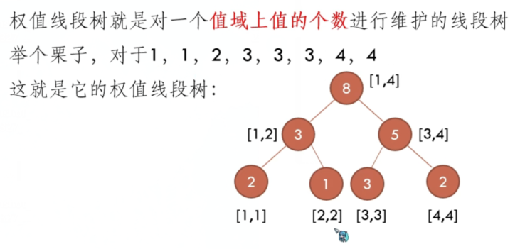 -->
<!--  -->
<!-- 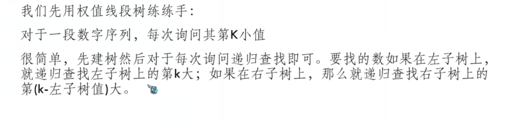 -->
<!-- 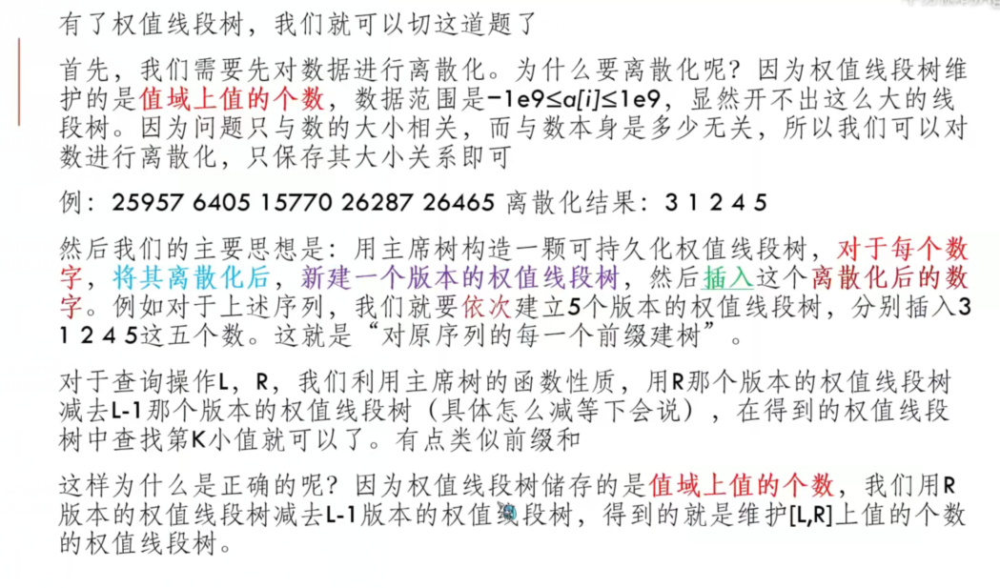 -->
<!-- 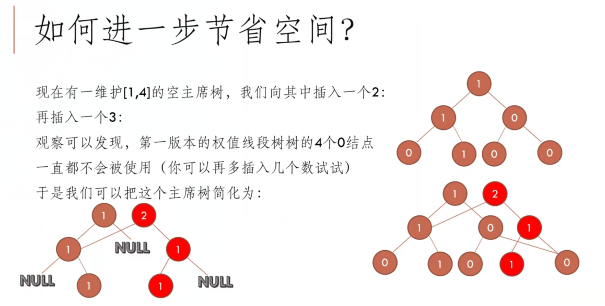 -->
<!-- 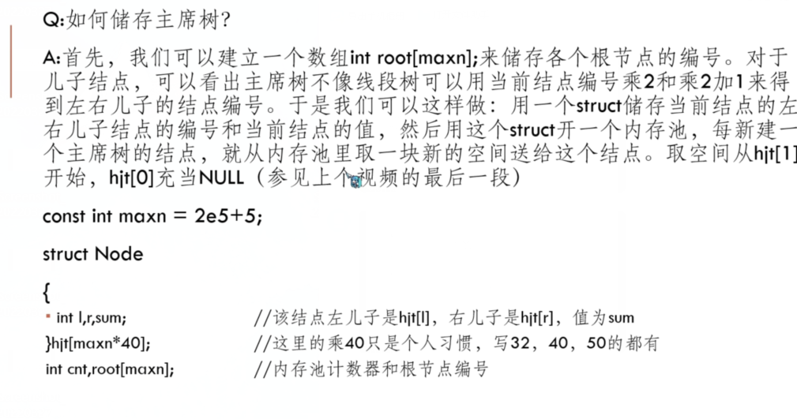 -->
<!-- 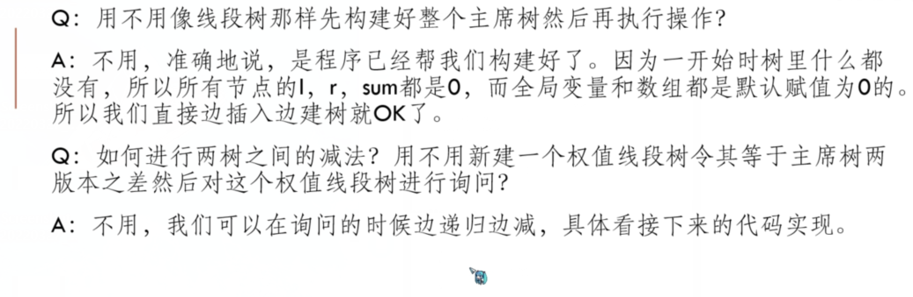 -->


## 静态第k小数

[第k小数](https://www.acwing.com/problem/content/description/257/)
>给定长度为 N 的整数序列 A，下标为 1∼N。
现在要执行 M 次操作，其中第 i 次操作为给出三个整数 li,ri,ki，求 A[li],A[li+1],…,A[ri] (即 A 的下标区间 [li,ri])中第 ki 小的数是多少。
输入格式
第一行包含两个整数 N 和 M。
第二行包含 N 个整数，表示整数序列 A。
接下来 M 行，每行包含三个整数 li,ri,ki，用以描述第 i 次操作。
输出格式
对于每次操作输出一个结果，表示在该次操作中，第 k 小的数的数值。
每个结果占一行。
数据范围
N≤105,M≤104,|A[i]|≤109
输入样例：
7 3
1 5 2 6 3 7 4
2 5 3
4 4 1
1 7 3
输出样例：
5
6
3


解：
- 法1.可持久化树
我们可以建立一颗权值线段树，每个点存储的信息为该值域区间存在的数的个数。
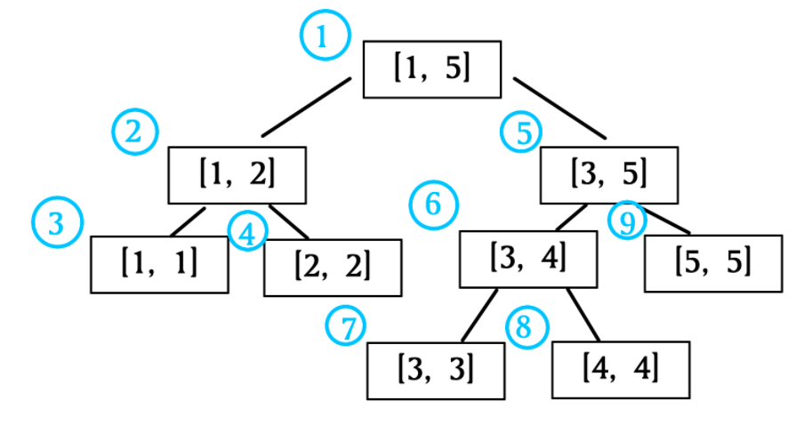

因为线段树的性质，所以每个点的左子树的值域区间 <= 右子树的值域区间。

所以我们先看左子树区间有多少个数，记为cntleft 。

如果ki<=cntleft ，说明第ki 小的数一定在左子树的值域内，所以问题便转换为了“在左子树的值域内找第kiki小的数”。
否则，说明第ki小的数一定在左子树的值域内，考虑到左子树已经有cntleft 个最小的数，问题便转换为了“在右子树的值域内找第ki−cntleft 小的数”
问题转换到任意区间
我们要用[li,ri]区间的数建立权值线段树。

我们发现可以用前缀和来维护：

只要用预处理大法分别以[1,li]和[1,ri]的数建立权值线段树，每个点的值对位相减即可。

关键性质
发现以[1,x]和[1,x+1]区间内的数所建立的权值线段树的差异仅在一条链上：（A[x+1]的次数+1）。

也就是不超过log2n个点。我们可以考虑动态开点：

与上一个权值线段树没有差异的地方直接指引过去
有差异，单独新增一个点
这样即可预处理出[1,x](1<=x<=n)所有的权值线段树了。

时间复杂度O(nlog2n)，空间复杂度O(2n+nlog2n)。

注意：由于值域很大，我们需要离散化一下。

```c++  
#include <cstdio>
#include <iostream>
#include <algorithm>
using namespace std;
const int N = 100005;
//d 为离散化数组
int n, m, len, a[N], d[N];

//T[i] 为 [1, i] 区间的权值线段树的根节点
int T[N], tot = 0;

//线段树的每个点
struct SegTree{
    int l, r, v;
}t[N * 20];

//建树
int build(int l, int r){
    int p = ++tot, mid = (l + r) >> 1;
    if(l < r) {
        t[p].l = build(l, mid);
        t[p].r = build(mid + 1, r);
    }
    t[p].v = 0; return p;
}

//增加一个数 pre 为上一个的根节点。
int update(int pre, int l, int r, int v){
    int p = ++tot, mid = (l + r) >> 1;
    t[p].l = t[pre].l, t[p].r = t[pre].r, t[p].v = t[pre].v + 1;
    if(l < r){
        //应该更新哪一个值域区间
        if(v <= mid) t[p].l = update(t[pre].l, l, mid, v);
        else t[p].r = update(t[pre].r, mid + 1, r, v); 
    }
    return p;
}

//查询
int query(int x, int y, int l, int r, int k){
    //找到了
    if(l == r) return l;
    //对位相减
    int sum = t[t[y].l].v - t[t[x].l].v, mid = (l + r) >> 1;
    if(k <= sum) return query(t[x].l, t[y].l, l, mid, k);
    else return query(t[x].r, t[y].r, mid + 1, r, k - sum);
}

int main(){
    scanf("%d%d", &n, &m);
    for (int i = 1; i <= n; i++)
        scanf("%d", a + i), d[i] = a[i];
    //离散化
    sort(d + 1, d + 1 + n);
    len = unique(d + 1, d + 1 + n) - (d + 1);
    for(int i = 1; i <= n; i++) 
        a[i] = lower_bound(d + 1, d + 1 + len, a[i]) - d;


    T[0] = build(1, len);
    for(int i = 1; i <= n; i++)
        T[i] = update(T[i - 1], 1, len, a[i]);

    //回答
    while(m--){
        int l, r, k; scanf("%d%d%d", &l, &r, &k);
        int ans = query(T[l - 1], T[r], 1, len, k);
        printf("%d\n", d[ans]);
    }
    return 0;
}
```

带注释：

```c++  
#include <cstdio>
#include <iostream>
#include <algorithm>
using namespace std;
const int N = 1e6 + 5;
//
int n, m, len, a[N], d[N];
// 
int T[N], tot = 0;

struct SegTree{
  int l, r, v;
}t[N * 20];

// 
int build(int l, int r){
  int p = ++ tot, mid = l + r >> 1;
  if(l < r){   // 还未到叶节点
    t[p].l = build(l, mid);
    t[p].r = build(mid + 1, r);
  }
  t[p].v = 0;
  // cout << "p" << p << " l " <<  t[p].l << " r " << t[p].r << endl;
  return p;
}

int update(int pre, int l, int r, int v){
  int p = ++ tot, mid = l + r >> 1;
  t[p].l = t[pre].l, t[p].r = t[pre].r, t[p].v = t[pre].v + 1; // 先把替代节点的信息继承下来 更改v即可
  // 根据具体位置 进行更新整条链的各节点信息 如在左链上，创建新的左链，并把当前节点的l指向它。
  // cout << "p " << p << " pre " << pre << " tp.l " << t[pre].l << " tp.r " << t[pre].r  << endl;
  if(l < r){  // 还未到叶节点
    if(v <= mid) t[p].l = update(t[pre].l, l, mid, v);
    else t[p].r = update(t[pre].r, mid + 1, r, v);
  }
  return p;
}


int query(int x, int y,int l, int r,int k){
  if(l == r)  return l;
  int sum = t[t[y].l].v - t[t[x].l].v, mid = l + r >> 1;
  if(k <= sum) return query(t[x].l, t[y].l, l, mid, k);
  else return query(t[x].r, t[y].r, mid + 1, r, k - sum);
}

int main()
{
  scanf("%d%d", &n, &m);
  for(int i = 1; i <= n; ++ i){
    scanf("%d", a + i), d[i] = a[i];
  }
  //
  sort(d + 1, d + 1 + n);
  len = unique(d + 1, d + 1 + n) - (d + 1); // 没去重，所以下面的查找求索引 只在len范围内查找 获取排名
  for(int i = 1;i <= len; ++ i){
    a[i] = lower_bound(d + 1, d + 1 + len, a[i]) - d;
  }
  
  T[0] = build(1, len);   // T[0] = 1 
  // 第0棵树的根节点编号  以后第i棵树都在i-1基础上添加，总共添加最多 n * log(n)
  // cout << " ------  " << endl;
  for(int i = 1; i <= n; ++ i){
    T[i] = update(T[i - 1], 1, len, a[i]);  // 离散化后的值域空间 为[1, n]
    // cout << "T[i] : i " << i << " " << T[i] << endl;
  }
  
  while(m --){
    int l, r, k; 
    scanf("%d%d%d", &l, &r, &k);
    int ans = query(T[l - 1], T[r], 1, len, k);
    printf("%d\n", d[ans]);
  }
  
  return 0;
}

```

- 法2：树状数组 + 整体二分

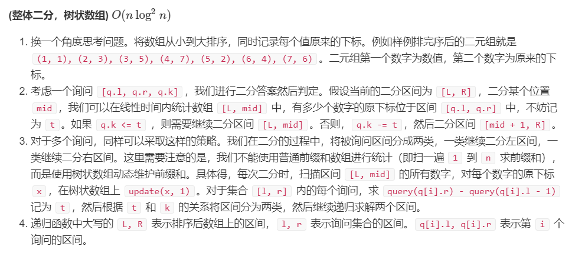

```c++  
#include <iostream>
#include <cstring>
#include <cstdlib>
#include <cstdio>
#include <algorithm>

using namespace std;

const int N = 100010, M = 50010;

int n, m;

struct A {
    int id, x;
}a[N];

struct Q {
    int id;
    int l, r, k;
}q[M];

int f[N], ans[M];

inline bool cmp(const A &p, const A &q) {
    return p.x < q.x;
}

inline int query(int x) {
    int res = 0;
    for (; x; x -= x & -x)
        res += f[x];

    return res;
}

inline void update(int x, int y) {
    for (; x <= n; x += x & -x)
        f[x] += y;
}

void solve(int L, int R, int l, int r) {
    if (l > r)
        return;

    if (L == R) {
        for (int i = l; i <= r; i++)
            ans[q[i].id] = a[L].x;
        return;
    }

    int mid = (L + R) >> 1;

    for (int i = L; i <= mid; i++)
        update(a[i].id, 1);

    int i = l, j = r, t;

    while (i <= j) {
        while (i <= j && q[i].k <= query(q[i].r) - query(q[i].l - 1))
            i++;

        while (i <= j && q[j].k > (t = query(q[j].r) - query(q[j].l - 1))) {
            q[j].k -= t;
            j--;
        }

        if (i < j)
            swap(q[i], q[j]);
    }

    for (int i = L; i <= mid; i++)
        update(a[i].id, -1);

    solve(L, mid, l, j);
    solve(mid + 1, R, i, r);
}

int main() {
    scanf("%d%d", &n, &m);
    for (int i = 1; i <= n; i++) {
        a[i].id = i;
        scanf("%d", &a[i].x);
    }

    for (int i = 1; i <= m; i++) {
        q[i].id = i;
        scanf("%d%d%d", &q[i].l, &q[i].r, &q[i].k);
    }

    sort(a + 1, a + 1 + n, cmp);

    solve(1, n, 1, m);

    for (int i = 1; i <= m; i++)
        printf("%d\n", ans[i]);

    return 0;
}

```


[美团T4：中位数]

>现在给定一个序列。
若其长度为奇数，那么其中位数是将序列从小到大排序后位于正中间位置的数；
若其长度为偶数，那么其中位数是将序列从小到大排序后位于中间的两个数的平均值。
现在给你一个长度为 n 的序列，求所有长度为奇数的区间的中位数之和为多少。
第一行n，表示有n个数。下一行有n个数。
其中：1 <= n <= 2000, 1 <= ai <= 100000，且ai互不相同。
案例：
4
2 3 1 4
输出：15


解：
- 法1：可持久化树(可持久化线段树)
若为任意k次询问,则不方便使用该方法。需要单独排序[l,r],共用 k*n*log(n)
若为本题所述 n^2 次询问，为 n^2*log(n)，与可持久化树相当。
- 法2：树状数组+二分
若为任意k次询问,为 k log^2(n)，比普通排序好，比可持久化树差。
若为本题所述 n^2 次询问，为 n^2*log^2(n) 比可持久化树和有限队列差。
- 法3：有限队列
若为任意k次询问,为 k log(n)
若为本题所述 n^2 次询问，为 n^2*log(n)


```c++  
long long res = 0;
	for (int i = 1; i <= n; ++i) {
		priority_queue<int> down;
		priority_queue<int, vector<int>, greater<int>> up;
		for (int j = i; j <= n; ++j) {
			if (up.empty() || a[j] > up.top()) up.push(a[j]);
			else down.push(a[j]);

			if (up.size() > down.size() + 1)
				down.push(up.top()), up.pop();
			if (down.size() > up.size()) {
				up.push(down.top()), down.pop();
			}
			if (!((j - i) & 1)) {
				res += up.top();
			}
		}
	}
	cout << res << endl;
```


## 动态第k小数

[Dynamic Rankings](https://www.luogu.com.cn/problem/P2617)

给定长度为NN的序列AA，有MM次询问：

给定li,ri,ki ，求在[li,ri] 区间内第ki 小的数是多少。
给定xi,vali ，将A[xi] 的值改为vali 。
N<=105,M<=105


解决方案：可持久化树 + 树状数组思路优化
注：这道题也有树套树和整体二分的做法，这里讲解的是可持久化树 + 树状数组思路优化。


<!-- 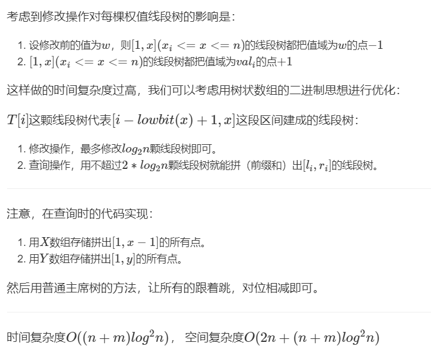 -->
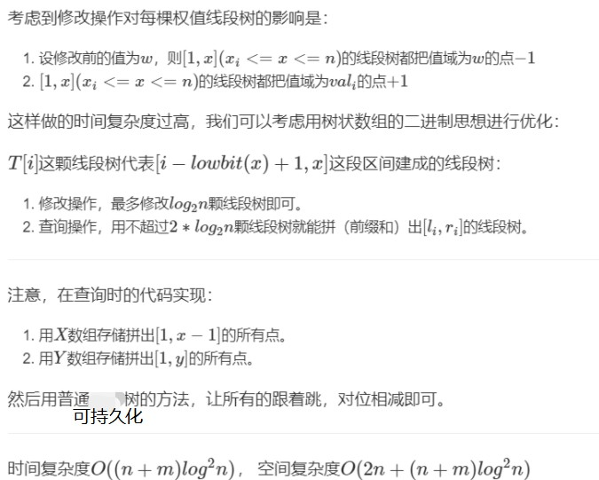

```c++  
#include <cstdio>
#include <iostream>
#include <algorithm>
using namespace std;
//P为最多可能的线段树点数
const int N = 100005, P = N * 441, L = 20;

//操作序列
struct Ops{
    int i, j, k;
}op[N];

//线段树
struct SegTree{
    int l, r, v;
}t[P];

//d数组为离散化数组
int n, m, len = 0, a[N], d[N << 1];
//T[i] 以 [i - lowbit(x) + 1, x] 这段区间的线段树的根节点
//X[i]、Y[i]代表多个点跟着跳，类似于普通版的$x, y$。
int T[N], tot = 0, X[L], Y[L], cx, cy;
char s[2];

//建树
int build(int l, int r){
    int p = ++tot, mid = (l + r) >> 1;
    t[p].v = 0;
    if(l < r){
        t[p].l = build(l, mid);
        t[p].r = build(mid + 1, r);
    }
    return p;
}

//更新
int update(int pre, int l, int r, int x, int v){
    int p = ++tot, mid = (l + r) >> 1;
    t[p].l = t[pre].l, t[p].r = t[pre].r, t[p].v = t[pre].v + v;
    if(l < r){
        if(x <= mid) t[p].l = update(t[pre].l, l, mid, x, v);
        else t[p].r = update(t[pre].r, mid + 1, r, x, v);
    }
    return p;
}

//把 [1, i] (x <= i <= n) 的线段树中值域为 a[x] 的次数 += v
void inline add(int x, int v){
    int val = lower_bound(d + 1, d + 1 + len, a[x]) - d;
    for(; x <= n; x += x & -x)
        T[x] = update(T[x], 1, len, val, v);
}

//查询
int query(int l, int r, int k){
    if(l == r) return l;
    int mid = (l + r) >> 1, sum = 0;
    //前缀和
    for(int i = 1; i <= cx; i++)
        sum -= t[t[X[i]].l].v;
    for(int i = 1; i <= cy; i++)
        sum += t[t[Y[i]].l].v;
    if(k <= sum){
        //跟着跳
        for(int i = 1; i <= cx; i++)
            X[i] = t[X[i]].l;
        for(int i = 1; i <= cy; i++)
            Y[i] = t[Y[i]].l;
        return query(l, mid, k);
    }else{
        //跟着跳
        for(int i = 1; i <= cx; i++)
            X[i] = t[X[i]].r;
        for(int i = 1; i <= cy; i++)
            Y[i] = t[Y[i]].r;
        return query(mid + 1, r, k - sum);
    }
}

int main(){
    scanf("%d%d", &n, &m);
    for(int i = 1; i <= n; i++)
        scanf("%d", a + i), d[++len] = a[i];

    for(int i = 1; i <= m; i++){
        scanf("%s", s);
        if(s[0] == 'Q') {
            scanf("%d%d%d", &op[i].i, &op[i].j, &op[i].k);
        }else{
            scanf("%d%d", &op[i].i, &op[i].j);
            d[++len] = op[i].j; op[i].k = 0;
        }
    }
    //离散化
    sort(d + 1, d + 1 + len);
    len = unique(d + 1, d + 1 + len) - (d + 1);

    //这里建树，将每一个根节点初始化成1。
    T[0] = build(1, len);
    for(int i = 1; i <= n; i++)
        T[i] = 1;

    //建立可持久化线段树
    for(int i = 1; i <= n; i++)
        add(i, 1);

    //处理询问
    for(int i = 1; i <= m; i++){
        if(op[i].k){
            //是查询操作
            cx = 0; cy = 0;
            //把需要跳的点扔进去
            for(int j = op[i].i - 1; j; j -= j & -j)
                X[++cx] = T[j];
            for(int j = op[i].j; j; j -= j & -j)
                Y[++cy] = T[j];
            printf("%d\n", d[query(1, len, op[i].k)]);
        }else{
            //修改操作
            add(op[i].i, -1);
            a[op[i].i] = op[i].j;
            add(op[i].i, 1);
        }
    }
    return 0;
}
```


# 6 AC自动机


---

以下为进阶


# 7 分块

*分块是有一种优雅的暴力*


分块的基本思想是，通过对原数据的适当划分，并在划分后的每一个块上预处理部分信息，从而较一般的暴力算法取得更优的时间复杂度。

分块的时间复杂度主要取决于分块的块长，一般可以通过均值不等式求出某个问题下的最优块长，以及相应的时间复杂度。

分块是一种很灵活的思想，相较于树状数组和线段树，分块的优点是通用性更好，可以维护很多树状数组和线段树无法维护的信息。

当然，分块的缺点是渐进意义的复杂度，相较于线段树和树状数组不够好。

不过在大多数问题上，分块仍然是解决这些问题的一个不错选择。
## 基本思想

分块算法实质上是一种是通过分成多块后在每块上打标记以实现快速区间修改，区间查询的一种算法。其均摊时间复杂度为 O(√ n)

分块算法相较于各种树形数据结构，具有简便易写，方便调试等多种优点。在同等数据规模下，如 1e5 ，其时间效率并不会低太多，在考试时反而是一种有力的得分方法。

但是若是数据量到1s/5e5以上，基本上就会T…

分块的实质
分块其实是一种树形结构，它是一种只有三层的树，形态如下：


案例：
问题引入：

给出一个非负整数序列A，元素个数为N（N<=105，A[i]<=105），在有可能随时添加或删除元素的情况下， 实时查询序列中第K大的元素（即把序列元素从小到大排序后从左到右的第K个元素，比如{2, 7, 5, 1, 6}中第3大元素是5，但是插入元素4之后第3大的元素就是4了）

在查询过程中元素可能发生改变（插入、删除等），就称为在线查询，反之叫离线查询。上面的问题就是在线查询。
如果直接暴力做法来做，在每次添加或删除元素之后就要用O(n)的时间复杂度来移动序列元素，效率将及其低下。这种解决方法有很多，这里介绍最容易理解的一种——分块思想。
分块就是将有序元素分为若干块。比如可以把{1, 2, 4, 9, 12, 34, 56, 78, 87}分为3块{1, 2, 4}、{9, 12, 34}、{56, 78, 87}。一般为了高效率，对有N个元素的有序序列来说除了最后一块以外，每个块中元素的个数都是√(N)（取下界）个，块数就是√(N)（取上界）个。比如11个数，可以分为√(N)（取下界）即3个，一共分为√(N)（取上界）即4块，块内元素分别有3、3、3、2个。

现在利用分块法解决问题。题目中因为说明N<=105，所以这里设置一个hash数组table[100001]，其中table[i]表示整数x的当前存在个数。然后将这100000个数进行逻辑上分块，一共分为√(100000)（取上界）即317块，每块有√(100000)（取下界）个即316个数。用一个统计数组block[317]记录每块的数据，block[i]表示第1块中存在的元素个数。
假设要新增一个元素x，可以通过x / 316计算出x所在的块，然后让block[x / 316] + 1表示该块中的元素再加上一个；同时令table[x]加1表示整数x的当前存在个数加1。比如新增334这个元素，先通过334 / 316算出334所在块号为1，然后令block[1]++，表示1号块增加了一个元素，再令table[334]++，表示334存在的个数多了1。要删除元素也是同理。
通过这方法，现在增加、删除元素的时间复杂度变成了O(1)。
然后开始找第K个元素，先将block数组累加得到前i-1个块中存在的元素总个数，然后加上i号块的元素个数判断总个数是否到达K，如果到达说明第K大的数就在当前的块中，此时只需再遍历该块即可。

【例】数据范围为0 ~ 8，则可以分为3块，0号块负责0 ~ 2，1号块负责3 ~ 5，2号块负责6 ~ 8.现在假设有0，1，3，4，4，5，8，此时block数组和table数组情况如下：
block[0] = 2，0号块有0，1两个元素
block[1] = 4，1号块有3，4，4，5这四个元素
block[2] = 1，2号块只有8这1个元素
table[0] = table[1] = table[3] = table[5] = table[8] = 1 都只有1个数
但是table[4] = 2，因为有两个4

然后找第K大的数，假设K是5，sum表示当前已经累计存在的数的个数，初始为0
遍历到0号块时，sum + block[0] = 0 + 2 = 2 < 5，所以第K大的数不在0号块，令sum为2
遍历1号块，sum + block[1] = 2 + 4 = 6 > 5，所以第K大的数在1号块内。
sum = 2，接下来遍历1号块内每个元素，即3，4，4，5
遍历到元素3时，sum = sum + table[3] = 3 < 4，所以3不是第K大的数
遍历到元素4时，sum = sum + table[4] = 5 > 4，因此找到4，即为第K大的数


例题：
[一个简单的整数问题2](https://www.acwing.com/problem/content/description/244/)
题解见 线段树懒标记 部分的四种题解。

## 常用板子

下面给出几种分块常用板子：

1.区间加法，单点查询


2.区间加法，区间求和


3.区间加法，区间查小于X的个数


4.区间加乘，单点查值

5.区间异或，区间求值


练习题：
+ [UVA - 12003 - Array Transformer](https://uva.onlinejudge.org/index.php?option=com_onlinejudge&Itemid=8&page=show_problem&problem=3141)
+ UVA - 11990 Dynamic Inversion [](https://uva.onlinejudge.org/index.php?option=com_onlinejudge&Itemid=8&page=show_problem&problem=3141)
+ SPOJ - Give Away [](http://www.spoj.com/problems/GIVEAWAY/)
+ Codeforces - Till I Collapse  [](http://codeforces.com/contest/786/problem/C)
+ Codeforces - Destiny[](http://codeforces.com/contest/840/problem/D)
+ Codeforces - Holes[](http://codeforces.com/contest/13/problem/E)
+ Codeforces - XOR and Favorite Number[](https://codeforces.com/problemset/problem/617/E)
+ Codeforces - Powerful array[](http://codeforces.com/problemset/problem/86/D)
+ SPOJ - DQUERY[](https://www.spoj.com/problems/DQUERY)


参考：
[分块思想](https://blog.csdn.net/weixin_43318827/article/details/112585342)
[浅谈分块思想](https://blog.csdn.net/weixin_43820631/article/details/90714167)
## 块状链表

*略*


# 莫队


## 基础


[HH的项链](https://www.acwing.com/activity/content/problem/content/2791/)
>查询每个区间段内数字的种类数。


解：提供四种解法：
需要采用离散算法的有(即先对查询进行一定操作，如按某种规则排序)
1.树状数组
2.线段树
3.莫队(排序规则稍微不同)
hjt算法可支持在线计算
(即如果要求在线查询时只有该方法在该数据级下可用)
4.hjt树

- 1.离线+树状数组

注意编号区间太大，不能用t[i]的i代表编号。而是用i表示查询的区间断电。
否则需要把查询的端点和编号进行离散化。同时再用以下代码中类似ls数组的思想进行更新树状数组。
只不过能使ls的数组开小点。由100w到50w以下。
```c++  
#include <iostream>
#include <cstdio>
#include <cstring>
#include <algorithm>
#include <cmath>
#include <unordered_map>
#include <cstdlib>
using namespace std;
const int N = 100010, M = 200010;

#define fir(i, a, b) for (int i = a;i <= b;i ++)
#define firr(i, a, b) for (int i = a;i >= b;i --)
#define read(x) scanf("%d", &x)
#define read2(x, y) scanf("%d %d", &x, &y)
#define readn(x, a, b) fir(i, a, b) scanf("%d", &x[i])

int n, m;
int a[N];
int ans[M];

unordered_map<int, int> mp; // 不如直接数组快
// int mp[1000010];

int t[N]; // 1-n
int lowbit(int x){return x & -x;}
void add(int x,int k) { for( ; x <= n; x += x & -x) t[x] += k;}
int ask(int x) {int ans = 0; for( ; x ; x -= x & -x) ans += t[x]; return ans;}

struct Query{
  int l, r, idx;
  bool operator < (const Query& rhs){
    return r < rhs.r;
  }
}q[M];

int main()
{
  // ios::sync_with_stdio(false);
  // cin.tie(nullptr);  如果使用这两句 就不能再混用scanf 和 cin了
  cin >> n;
  readn(a, 1, n);
  cin >> m;
  fir(i, 1, m){
    read2(q[i].l, q[i].r);  
    q[i].idx = i;
  }
  
  sort(q + 1, q + m + 1);
  for(int i = 1, j = 1; i <= m; ++ i){
    for(; j <= q[i].r; ++ j){         // 通过mp数组(或哈希)实现了类似的离线化 
      if(mp[a[j]]) add(mp[a[j]], -1); // 把当前数上一次出现给清空，只维护距离右端点最近的即可。防止重复计算
      add(j, 1), mp[a[j]] = j;       // 往树状数组里存的是索引 不是真实的编号值 否则需要离散
    }
    ans[q[i].idx] = ask(q[i].r) - ask(q[i].l - 1);
  }
  fir(i, 1, m) printf("%d\n", ans[i]); //   ask(int x) x为查询的索引的区间

	return 0;
}
```

- 2.离线+线段树

```c++  
#include <iostream>
#include <cstdio>
#include <cstring>
#include <algorithm>
#include <cmath>
#include <unordered_map>
#include <cstdlib>
using namespace std;
const int N = 100010, M = 200010;

#define fir(i, a, b) for (int i = a;i <= b;i ++)
#define firr(i, a, b) for (int i = a;i >= b;i --)
#define read(x) scanf("%d", &x)
#define read2(x, y) scanf("%d %d", &x, &y)
#define readn(x, a, b) fir(i, a, b) scanf("%d", &x[i])

int n, m;
int a[N];
int ans[M];

unordered_map<int, int> mp; // 不如直接数组快
// int mp[1000010];

struct Node {
  int l, r;
  int cnt;
}tr[N * 4];

void pushup(Node& u, Node& l, Node& r){
  u.cnt = l.cnt + r.cnt;
}

void pushup(int u){
  pushup(tr[u], tr[u << 1], tr[u << 1 | 1]);
}

void pushdown(int u) {
  // TODO: 将懒标记下传
  // if(tr[u].lazy == *) return;
  // auto &root = tr[u], &left = tr[u << 1], &right = tr[u << 1 | 1];
  // 置空
}

void build(int u, int l, int r) {
  if (l == r) tr[u] = {l, r};
  else {
    tr[u] = {l, r};
    int mid = l + r >> 1;
    build(u << 1, l, mid), build(u << 1 | 1, mid + 1, r);
    pushup(u);
  }
}

void update(int u, int l, int r, int val) { 
  if (tr[u].l >= l && tr[u].r <= r) {
    tr[u].cnt += val;
  }
  else {
    // pushdown(u);
    int mid = tr[u].l + tr[u].r >> 1;
    if (l <= mid) update(u << 1, l, r, val);
    if (r > mid) update(u << 1 | 1, l, r, val);
    pushup(u);
  }
}


void update(int u, int l, int r, int val){
  if(tr[u].l >= l && tr[u].r <= r){
    tr[u].cnt += val;
  }else{
    pushdown(u);
    int mid = tr[u].l + tr[u].r >> 1;
    if(l <= mid) update(u << 1, l, r, val);
    if(r > mid) update(u << 1 | 1, l, r, val);
    pushup(u);
  }
}

Node query(int u, int l, int r){
  if(tr[u].l >= l && tr[u].r <= r) return tr[u];
  else{
    pushdown(u);
    int mid = tr[u].l + tr[u].r >> 1;
    if(r <= mid) return query(u << 1, l, r);
    else if(l > mid) return query(u << 1 | 1, l, r);
    else{
      Node res;
      auto left = query(u << 1, l, r);
      auto right = query(u << 1 | 1, l, r);
      pushup(res, left, right);
      return res;
    }
  }
}

Node query(int u, int l, int r){
  if(tr[u].l >= l && tr[u].r <= r) return tr[u]; 
  else{
    pushdown(u);
    int mid = tr[u].l + tr[u].r >> 1;
    if(r <= mid) return query(u << 1, l, r);
    else if(l > mid) return query(u << 1 | 1, l, r);
    else{
      Node res;
      auto left = query(u << 1, l, r);
      auto right = query(u << 1 | 1, l, r);
      pushup(res, left, right);
      return res;
    }
  }
}

struct Query{
  int l, r, idx;
  bool operator < (const Query& rhs){
    return r < rhs.r;
  }
}q[M];

int main()
{
  // ios::sync_with_stdio(false);
  // cin.tie(nullptr);  如果使用这两句 就不能再混用scanf 和 cin了
  cin >> n;
  readn(a, 1, n);
  cin >> m;
  fir(i, 1, m){
    read2(q[i].l, q[i].r);  
    q[i].idx = i;
  }
  
  sort(q + 1, q + m + 1);
  build(1, 1, n);
  for(int i = 1, j = 1; i <= m; ++ i){
    for(; j <= q[i].r; ++ j){   
      if(mp[a[j]]) update(1, mp[a[j]], mp[a[j]], -1); 
      update(1, j, j, 1), mp[a[j]] = j;  散
    }
    ans[q[i].idx] = query(1, q[i].l, q[i].r).cnt;
  }
  fir(i, 1, m) printf("%d\n", ans[i]); 

	return 0;
}
```

- 3.离线 + 莫队

```c++  
#include <iostream>
#include <cstdio>
#include <cstring>
#include <algorithm>
#include <cmath>
#include <unordered_map>
#include <cstdlib>
using namespace std;

#define fir(i, a, b) for (int i = a;i <= b;i ++)
#define firr(i, a, b) for (int i = a;i >= b;i --)
#define read(x) scanf("%d", &x)
#define read2(x, y) scanf("%d %d", &x, &y)
#define readn(x, a, b) fir(i, a, b) scanf("%d", &x[i])


const int N = 50010, M = 200010, S = 1000010;
int n, m, len;
int a[N], ans[M];
int cnt[S];

int get(int x) {return x / len;}

struct Query{
  int l, r, idx;
  bool operator < (const Query& rhs){
    int i = get(l), j = get(rhs.l);
    if(i != j) return i < j;
    else return r < rhs.r;
  }
}q[M];

// 按上述重写< 或 重载比较函数
bool cmp(const Query& a, const Query& b)
{
    int i = get(a.l), j = get(b.l);
    if (i != j) return i < j;
    return a.r < b.r;
}

void add(int x, int& res){
  if(!cnt[x]) res ++;
  cnt[x] ++;
}

void del(int x, int& res){
  cnt[x] --;
  if(!cnt[x]) res --;
}


int main()
{
  // ios::sync_with_stdio(false);
  // cin.tie(nullptr);  如果使用这两句 就不能再混用scanf 和 cin了
  cin >> n;
  readn(a, 1, n);
  cin >> m;
  fir(i, 1, m){
    read2(q[i].l, q[i].r);  
    q[i].idx = i;
  }
  
  len = max(1, (int)sqrt((double)n * n / m));
  
  sort(q + 1, q + m + 1);

  for(int k = 1, i = 0, j = 1, res = 0; k <= m; ++ k){
    int idx = q[k].idx, l = q[k].l, r = q[k].r;
    while(i < r) add(a[++ i], res);
    while(i > r) del(a[i --], res);
    while(j < l) del(a[j ++], res);
    while(j > l) add(a[-- j], res);
    ans[idx] = res;
  }

  fir(i, 1, m) printf("%d\n", ans[i]); 
	return 0;
}
```

- 4.(在线)hjt树

**核心：**
ne数组:ne数组记录a[i]右边离a[i]最近且等于a[i]的下标(即:a[i]下一次出现的位置),
如果不存在,则令ne[i]=n+1 (数组最后一位下标加1)

**建立过程**
然后再对值域[1,n+1](这里因为数组下标从1开始)建立权值线段树,然后再将ne数组元素一个个插入

**查询**
a数组区间[l,r]内不同数的个数即为ne数组区间[l,r]中大于等于r+1的数的个数
例如:
对于a数组: 1 2 2 2 1  3 2  3 3  1  4  1
其ne数组为:5 3 4 7 10 8 13 9 13 12 13 13
[3,7]区间内不同数的个数就是ne数组[3,7]区间([4 7 10 8 13])中大于等于8的数的个数:3

```c++  
// 参考：https://www.acwing.com/solution/content/69639/


```


---
以下两题为同题。

[蓝桥杯：字串分值和](https://blog.csdn.net/weixin_46266058/article/details/123616444)
[字符串的总引力](https://leetcode-cn.com/problems/total-appeal-of-a-string/)
>字符串的 引力 定义为：字符串中 不同 字符的数量。
例如，"abbca" 的引力为 3 ，因为其中有 3 个不同字符 'a'、'b' 和 'c' 。
给你一个字符串 s ，返回 其所有子字符串的总引力 。
子字符串 定义为：字符串中的一个连续字符序列。
示例 1：
输入：s = "abbca"
输出：28
解释："abbca" 的子字符串有：
-长度为 1 的子字符串："a"、"b"、"b"、"c"、"a" 的引力分别为 1、1、1、1、1，总和为 5 。
-长度为 2 的子字符串："ab"、"bb"、"bc"、"ca" 的引力分别为 2、1、2、2 ，总和为 7 。
-长度为 3 的子字符串："abb"、"bbc"、"bca" 的引力分别为 2、2、3 ，总和为 7 。
-长度为 4 的子字符串："abbc"、"bbca" 的引力分别为 3、3 ，总和为 6 。
-长度为 5 的子字符串："abbca" 的引力为 3 ，总和为 3 。
引力总和为 5 + 7 + 7 + 6 + 3 = 28 。
示例 2：
输入：s = "code"
输出：20
解释："code" 的子字符串有：
-长度为 1 的子字符串："c"、"o"、"d"、"e" 的引力分别为 1、1、1、1 ，总和为 4 。
-长度为 2 的子字符串："co"、"od"、"de" 的引力分别为 2、2、2 ，总和为 6 。
-长度为 3 的子字符串："cod"、"ode" 的引力分别为 3、3 ，总和为 6 。
-长度为 4 的子字符串："code" 的引力为 4 ，总和为 4 。
引力总和为 4 + 6 + 6 + 4 = 20 。
提示：
1 <= s.length <= 10^5
s 由小写英文字母组成


解：区别于项链，本题查询量更大，但也更有规律。则需要使用数学思想。

- 法1：
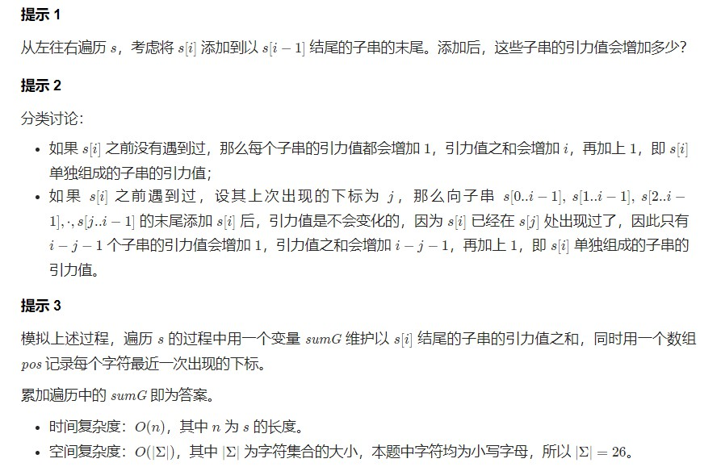


```c++  
class Solution {
public:
    long long appealSum(string s) {
        long ans = 0L, sum_g = 0L;
        vector<int> pos(26, -1);
        for (int i = 0; i < s.length(); ++i) {
            int c = s[i] - 'a';
            sum_g += i - pos[c];
            ans += sum_g;
            pos[c] = i;
        }
        return ans;
    }
};
```

- 法2：dp
dp记录每个下标元素作为子序列尾部的总引力
哈希表记录每个元素出现的最大下标
当前下标为i,上一个元素下标为j时, 子序列起始下标在[0, j]之间时引力不变, [j + 1, i]之间时引力 + 1
所以dp的转移方程 dp[i + 1] = dp[i] + i - j

```python 
class Solution:
    def appealSum(self, s: str) -> int:
        l = len(s)
        dp = [0 for i in range(l + 1)]
        d = {}
        for i, n in enumerate(s):
            dp[i + 1] = dp[i] + i - d.get(n, -1) #当不存在j时,j为-1
            d[n] = i
        return sum(dp)
```


- 法3：计算贡献
字符在哪些子串中有贡献呢？ 子串左边界取值范围 [last + 1, i] 子串右边界 取值范围 [i, n - 1] 根据乘法原则，这样的子串共 (i - last) * (n - i) 个

对于每个子串，如果一个子字符串包含多个相同字符（比如 a），那么不妨规定， 只有最左侧的 a 将对答案做出贡献，这样相同的字符就只被统计了一次。这样，设字母 a 在字符串出现的情况为 ...a....a....a...，那么：

第 1 个 a 可以做出贡献的子串范围为：[...a....a....a...]
第 2 个 a 可以做出贡献的子串范围为：...a[....a....a...]
第 3 个 a 可以做出贡献的子串范围为：...a....a[....a...]


```c++  
class Solution {
public:
    long long appealSum(string s) {
        vector<int> lasts(26, -1);
        long long res = 0;
        for(int i = 0; i < s.size(); ++i) {
            res += 1ll * (i - lasts[s[i] - 'a']) * ((int)s.size() - i);
            lasts[s[i] - 'a'] = i;
        }
        return res;
    }
};
```


类似题有：
[828. 统计子串中的唯一字符](https://leetcode-cn.com/problems/count-unique-characters-of-all-substrings-of-a-given-string/)
[907. 子数组的最小值之和](https://leetcode-cn.com/problems/sum-of-subarray-minimums/)
[1498. 满足条件的子序列数目](https://leetcode-cn.com/problems/number-of-subsequences-that-satisfy-the-given-sum-condition/)
[2104. 子数组范围和](https://leetcode-cn.com/problems/sum-of-subarray-ranges/)


## 带修改的莫队


[数颜色](https://www.acwing.com/activity/content/problem/content/2792/)
## 回滚莫队

[历史研究](https://www.acwing.com/activity/content/problem/content/2793/)


## 树上莫队

[树上计数](https://www.acwing.com/activity/content/problem/content/2794/)

## 二次离线莫队


[二次离线莫队](https://www.acwing.com/activity/content/problem/content/2796/)


*参考：*
[莫队算法专题](https://www.acwing.com/blog/content/1562/)

[莫队算法——从入门到黑题](https://www.cnblogs.com/WAMonster/p/10118934.html)


# 平衡树

# Splay

# 树套树

# 树链剖分
# 动态树
# Dancing Links
# 左偏树
# 后缀数组


*参考：*

[SA-IS学习笔记](https://www.cnblogs.com/Flying2018/p/13848482.html)
[后缀数组 最详细讲解](https://www.cnblogs.com/victorique/p/8480093.html)


# 后缀自动机SAM

*参考：*

[SAM绘制工具](https://mivik.gitee.io/sam-visualizer/)

[写个后缀自动机（一定要赞）](https://www.acwing.com/blog/content/722/)

[史上最通俗的后缀自动机详解](https://www.luogu.com.cn/blog/Kesdiael3/hou-zhui-zi-dong-ji-yang-xie)

# 点分治和点分树
# CDQ分治
# 仙人掌


