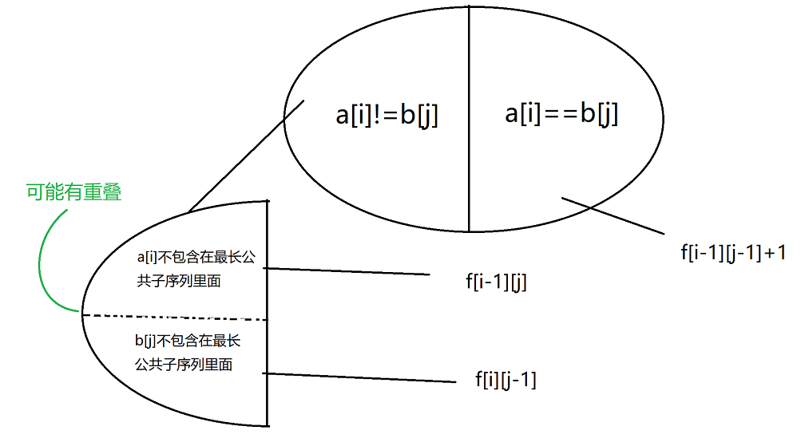
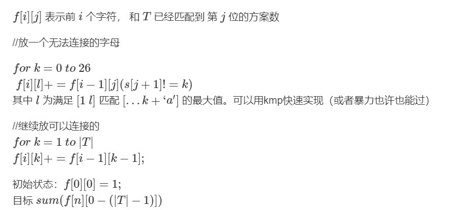
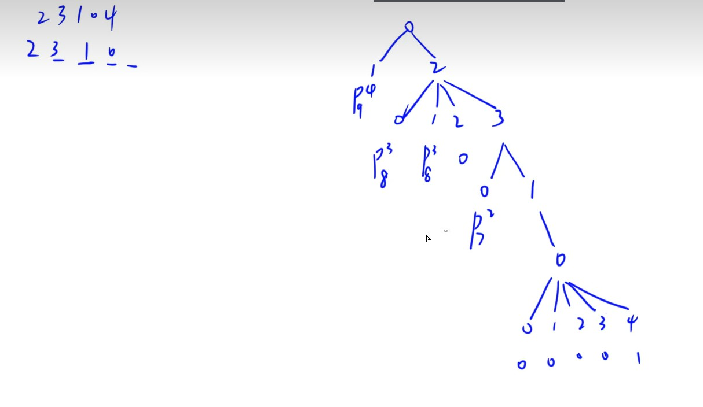

# 动态规划


**包括线性DP(数字三角形模型、最长上升子序列模型、编辑距离)、背包模型(01背包、完全背包、多重背包、分组背包、混合背包...)、状态机、状态压缩DP、区间DP(石子合并..)、树形DP、数位DP、单调队列优化DP、斜率优化DP等内容**

[【学习笔记】动态规划—各种 DP 优化](https://www.acwing.com/blog/content/630/)
[★★★★★ 什么是动态规划（Dynamic Programming）？动态规划的意义是什么？](https://www.zhihu.com/question/23995189/answer/1016628651)
# 0 动态规划
传统dp:  
**关键词：状态表示、状态转移、最优子结构、重叠子问题、后效性**
DP问题一般是求若干有限集合中的最值问题，并且此类问题存在子问题重叠（Overlap-subproblems），如果通过暴力枚举每种可能解决问题，那么将会有大量重复的计算；如果从集合角度来分析DP问题，每次枚举一个集合并且利用子问题重叠特性，将子问题的解存储下来，可以大大提高效率；
DP问题的核心是状态集合 f(i) 的定义，在状态及转移计算中，划分子集的依据：寻找最后一个不同点，即处理最后一个子集的选择。

最优子结构
无后效性


一个最优策略的子策略必然也是最优的。


动态规划是一种通过把原问题分解为相对简单的子问题的方式求解复杂问题的方法。

动态规划应用于子问题重叠的情况：

要去刻画最优解的结构特征；
尝试递归地定义最优解的值（就是我们常说的考虑从  i - 1 转移到 i）；
计算最优解；
利用计算出的信息构造一个最优解。


**动态规划原理**
**两个要素：**

**最优子结构**
具有最优子结构也可能是适合用贪心的方法求解。

注意要确保我们考察了最优解中用到的所有子问题。

证明问题最优解的第一个组成部分是做出一个选择；
对于一个给定问题，在其可能的第一步选择中，你界定已经知道哪种选择才会得到最优解。你现在并不关心这种选择具体是如何得到的，只是假定已经知道了这种选择；
给定可获得的最优解的选择后，确定这次选择会产生哪些子问题，以及如何最好地刻画子问题空间；
证明作为构成原问题最优解的组成部分，每个子问题的解就是它本身的最优解。方法是反证法，考虑加入某个子问题的解不是其自身的最优解，那么就可以从原问题的解中用该子问题的最优解替换掉当前的非最优解，从而得到原问题的一个更优的解，从而与原问题最优解的假设矛盾。
要保持子问题空间尽量简单，只在必要时扩展。

最优子结构的不同体现在两个方面：

- 原问题的最优解中涉及多少个子问题；
- 确定最优解使用哪些子问题时，需要考察多少种选择。
子问题图中每个定点对应一个子问题，而需要考察的选择对应关联至子问题顶点的边。

**经典问题：**

- 无权最短路径： 具有最优子结构性质。
- 无权最长（简单）路径： 此问题不具有，是 NPC 的。区别在于，要保证子问题无关，即同一个原问题的一个子问题的解不影响另一个子问题的解。相关：求解一个子问题时用到了某些资源，导致这些资源在求解其他子问题时不可用。
**子问题重叠**
子问题空间要足够小，即问题的递归算法会反复地求解相同的子问题，而不是一直生成新的子问题。

**重构最优解**
存表记录最优分割的位置，就不用重新按照代价来重构。


百科：
>原理
动态规划问世以来，在经济管理、生产调度、工程技术和最优控制等方面得到了广泛的应用。例如最短路线、库存管理、资源分配、设备更新、排序、装载等问题，用动态规划方法比用其它方法求解更为方便 [3]  。
虽然动态规划主要用于求解以时间划分阶段的动态过程的优化问题，但是一些与时间无关的静态规划(如线性规划、非线性规划)，只要人为地引进时间因素，把它视为多阶段决策过程，也可以用动态规划方法方便地求解 [3]  。
**概念引入**
在现实生活中，有一类活动的过程，由于它的特殊性，可将过程分成若干个互相联系的阶段，在它的每一阶段都需要作出决策，从而使整个过程达到最好的活动效果。因此各个阶段决策的选取不能任意确定，它依赖于当前面临的状态，又影响以后的发展。当各个阶段决策确定后，就组成一个**决策序列**，因而也就确定了整个过程的一条活动路线．这种把一个问题看作是一个**前后关联具有链状结构的多阶段过程**就称为多阶段决策过程，这种问题称为多阶段决策问题。在多阶段决策问题中，各个阶段采取的决策，一般来说是与时间有关的，决策依赖于当前状态，又随即引起状态的转移，一个决策序列就是在变化的状态中产生出来的，故有“动态”的含义，称这种解决多阶段决策最优化的过程为动态规划方法 [4]  。


**基本思想**
动态规划算法通常用于求解具有某种最优性质的问题。在这类问题中，可能会有许多可行解。每一个解都对应于一个值，我们希望找到具有最优值的解。动态规划算法与**分治法**类似，其基本思想也是将待求解问题分解成若干个子问题，先求解子问题，然后从这些子问题的解得到原问题的解。与分治法不同的是，适合于用动态规划求解的问题，经分解得到子问题往往**不是互相独立**的。若用分治法来解这类问题，则分解得到的子问题数目太多，有些子问题被重复计算了很多次。如果我们能够**保存已解决的子问题的答案**，而在需要时再找出已求得的答案，这样就可以避免大量的重复计算，节省时间。我们可以用一个表来记录所有已解的子问题的答案。不管该子问题以后是否被用到，只要它被计算过，就将其结果填入表中。这就是动态规划法的基本思路。具体的动态规划算法多种多样，但它们具有相同的填表格式 [5]  。
基本概念


**多阶段决策问题**
如果一类活动过程可以分为若干个互相联系的阶段，在每一个阶段都需作出决策（采取措施），一个阶段的决策确定以后，常常影响到下一个阶段的决策，从而就完全确定了一个过程的活动路线，则称它为多阶段决策问题 [6]  。
各个阶段的决策构成一个决策序列，称为一个策略。每一个阶段都有若干个决策可供选择，因而就有许多策略供我们选取，对应于一个策略可以确定活动的效果，这个效果可以用数量来确定。策略不同，效果也不同，多阶段决策问题，就是要在可以选择的那些策略中间，选取一个最优策略，使在预定的标准下达到最好的效果 [6]  。
动态规划问题中的术语
**阶段**把所给求解问题的过程恰当地分成若干个相互联系的阶段，以便于求解，过程不同，阶段数就可能不同．描述阶段的变量称为阶段变量。在多数情况下，阶段变量是离散的，用k表示。此外，也有阶段变量是连续的情形。如果过程可以在任何时刻作出决策，且在任意两个不同的时刻之间允许有无穷多个决策时，阶段变量就是连续的 [6]  。
**状态**状态表示每个阶段开始面临的自然状况或客观条件，它不以人们的主观意志为转移，也称为不可控因素。在上面的例子中状态就是某阶段的出发位置，它既是该阶段某路的起点，同时又是前一阶段某支路的终点 [6]  。
**无后效性**我们要求状态具有下面的性质：如果给定某一阶段的状态，则在这一阶段以后过程的发展不受这阶段以前各段状态的影响，所有各阶段都确定时，整个过程也就确定了。换句话说，过程的每一次实现可以用一个状态序列表示，在前面的例子中每阶段的状态是该线路的始点，确定了这些点的序列，整个线路也就完全确定。从某一阶段以后的线路开始，当这段的始点给定时，不受以前线路（所通过的点）的影响。状态的这个性质意味着过程的历史只能通过当前的状态去影响它的未来的发展，这个性质称为无后效性 [6]  。
决策：一个阶段的状态给定以后，从该状态演变到下一阶段某个状态的一种选择（行动）称为决策。在最优控制中，也称为控制。在许多问题中，决策可以自然而然地表示为一个数或一组数。不同的决策对应着不同的数值。描述决策的变量称决策变量，因状态满足无后效性，故在每个阶段选择决策时只需考虑当前的状态而无须考虑过程的历史 [6]  。
决策变量的范围称为允许决策集合 [6]  。
**策略**由每个阶段的决策组成的序列称为策略。对于每一个实际的多阶段决策过程，可供选取的策略有一定的范围限制，这个范围称为允许策略集合 [6]  。
允许策略集合中达到最优效果的策略称为最优策略 [6]  。
给定k阶段状态变量x(k)的值后，如果这一阶段的决策变量一经确定，第k+1阶段的状态变量x(k+1)也就完全确定，即x(k+1)的值随x(k)和第k阶段的决策u(k)的值变化而变化，那么可以把这一关系看成(x(k)，u(k))与x(k+1)确定的对应关系，用x(k+1)=Tk(x(k),u(k))表示。这是从k阶段到k+1阶段的状态转移规律，称为状态转移方程 [6]  。
最优化原理：作为整个过程的最优策略，它满足：相对前面决策所形成的状态而言，余下的子策略必然构成“最优子策略” [6]  。
最优性原理实际上是要求问题的最优策略的子策略也是最优 [6]  。
**基本结构**
多阶段决策问题中，各个阶段采取的决策，一般来说是与时间有关的，决策依赖于当前状态，又随即引起状态的转移，一个决策序列就是在变化的状态中产生出来的，故有“动态”的含义，称这种解决多阶段决策最优化问题的方法为动态规划方法 [7]  。
**适用条件**
任何思想方法都有一定的局限性，超出了特定条件，它就失去了作用。同样，动态规划也并不是万能的。适用动态规划的问题必须满足最优化原理和无后效性 [8]  。
- 最优化原理（最优子结构性质）
最优化原理可这样阐述：一个最优化策略具有这样的性质，不论过去状态和决策如何，对前面的决策所形成的状态而言，余下的诸决策必须构成最优策略。简而言之，一个最优化策略的子策略总是最优的。一个问题满足最优化原理又称其具有最优子结构性质 [8]  。
- 无后效性
将各阶段按照一定的次序排列好之后，对于某个给定的阶段状态，它以前各阶段的状态无法直接影响它未来的决策，而只能通过当前的这个状态。换句话说，每个状态都是过去历史的一个完整总结。这就是无后向性，又称为无后效性 [8]  。
- 子问题的重叠性
动态规划算法的关键在于解决冗余，这是动态规划算法的根本目的。动态规划实质上是一种以空间换时间的技术，它在实现的过程中，不得不存储产生过程中的各种状态，所以它的空间复杂度要大于其他的算法。选择动态规划算法是因为动态规划算法在空间上可以承受，而搜索算法在时间上却无法承受，所以我们舍空间而取时间 [8]  。

**分类**
动态规划的数学模型。根据决策过程的演变是确定性的还是随机性的。可分为确定性决策过程和随机性决策过程。另外。也可按时间参量是离散的或是连续的变量。分为离散决策过程和连续决策过程。组合起来就有离散确定性．离散随机性．连续确定性．连续随机性四种决策过程模型 [9]  。
对于确定性的决策过程。问题中下一段的状态已由当前段的状态及决策完全确定。对于随机性决策过程。它与确定性决策过程的区别在于下一段的状态并不能由当前段的状态及决策完全确定。而是按某种概率分布来决定下一段的状态。这种概率分布是由当前段的状态和决策完全确定 [9]  。
局限性编辑 播报
动态规划对于解决多阶段决策问题的效果是明显的，但是动态规划也有一定的局限性。首先，它没有统一的处理方法，必须根据问题的各种性质并结合一定的技巧来处理；另外当变量的维数增大时，总的计算量及存贮量急剧增大。


## 两种形式

动态规划与分治方法相似，都是通过组合子问题的解来求解原问题。

动态规划是分治方法的特例，应用于子问题重叠的情况。在这种情况下，分治算法会反复求解这些重叠的子问题。而动态规划算法对每个子问题只求解一次，将其解保存下来，而无需每次都计算。

动态规划的实现有两种形式：递推形式和递归形式。

### 递推形式
通常采用自底往上的方法。

缺点

有时候状态之间的依赖关系不明显。
可能会计算到无用状态。


### 递归形式（记忆化搜索）
在分治算法的基础上，把计算过的子问题的解保存下来，再次处理这个子问题时直接输出保存下来的解。

- 优点
    不用重新考虑状态之间的依赖关系，在分治代码的基础上简单改动即可。
    只有需要用到某个状态才会计算，不会计算无用状态。
- 缺点
    无用状态不多或没有时，比递推开销大，运行慢。
    两种实现形式的选择
    有些题目只能用记忆化搜索，有些题目只能用递推。

有些题目这两种形式都可以用，选择方法如下：

当无用状态多的时候，用记忆化搜索。
当无用状态不多，依赖关系明显的时候，用递推。
以上两种都不是的时候，优先选择记忆化搜索。


## **闫氏DP分析法**
从集合角度考虑DP问题，又称闫氏分析法，包含以下两步：

- **状态表示**——集合以及属性(Max/Min/数量/存在性)；
- **状态计算**——集合的划分。一个重要的划分依据：“最后一步”；集合划分原则：可重但不漏。


# 1 线性DP

## 0 引入


**斐波那契**


### 爬楼梯模型

1.基础

2.见下题


[统计打字方案数](https://leetcode-cn.com/problems/count-number-of-texts/)

>Alice 在给 Bob 用手机打字。数字到字母的 对应 如下图所示。
为了 打出 一个字母，Alice 需要 按 对应字母 i 次，i 是该字母在这个按键上所处的位置。
比方说，为了按出字母 's' ，Alice 需要按 '7' 四次。类似的， Alice 需要按 '5' 两次得到字母  'k' 。
注意，数字 '0' 和 '1' 不映射到任何字母，所以 Alice 不 使用它们。
但是，由于传输的错误，Bob 没有收到 Alice 打字的字母信息，反而收到了 按键的字符串信息 。
比方说，Alice 发出的信息为 "bob" ，Bob 将收到字符串 "2266622" 。
给你一个字符串 pressedKeys ，表示 Bob 收到的字符串，请你返回 Alice 总共可能发出多少种文字信息 。
由于答案可能很大，将它对 109 + 7 取余 后返回。
示例 1：
输入：pressedKeys = "22233"
输出：8
解释：
Alice 可能发出的文字信息包括：
"aaadd", "abdd", "badd", "cdd", "aaae", "abe", "bae" 和 "ce" 。
由于总共有 8 种可能的信息，所以我们返回 8 。
示例 2：
输入：pressedKeys = "222222222222222222222222222222222222"
输出：82876089
解释：
总共有 2082876103 种 Alice 可能发出的文字信息。
由于我们需要将答案对 109 + 7 取余，所以我们返回 2082876103 % (109 + 7) = 82876089 。
提示：
1 <= pressedKeys.length <= 105
pressedKeys 只包含数字 '2' 到 '9' 。


解：


```c++  
class Solution {
    const int MOD = 1000000007;

public:
    int countTexts(string pressedKeys) {
        int n = pressedKeys.size();
        vector<long long> f(n + 1), g(n + 1);
        f[0] = g[0] = 1;
        for (int i = 1; i <= n; i++) {
            for (int j = 1; j <= 3 && j <= i; j++) f[i] = (f[i] + f[i - j]) % MOD;
            for (int j = 1; j <= 4 && j <= i; j++) g[i] = (g[i] + g[i - j]) % MOD;
        }

        int cnt = 0;
        char last = 0;
        long long ans = 1;
        for (char c : pressedKeys) {
            if (c != last) {
                if (last == '7' || last == '9') ans = ans * g[cnt] % MOD;
                else ans = ans * f[cnt] % MOD;
                cnt = 0;
                last = c;
            }
            cnt++;
        }
        if (last == '7' || last == '9') ans = ans * g[cnt] % MOD;
        else ans = ans * f[cnt] % MOD;
        return ans;
    }
};
```


**组合数计算**

常用于数位dp，见数位dp部分。

```c++  
const int N = 55;
LL f[55][55];
void init(){
	f[0][0] = 1;
	for(int i = 1; i < N; ++ i) f[i][1] = i, f[i][0] = 1;
	for(int i = 1; i < N; ++ i){
		for(int j = 1; j <= i; ++ j){
			f[i][j] = f[i - 1][j - 1] + f[i - 1][j];
		}
	}
}
```

同时用`c(n, 0) + c(n, 1) + ... c(n, n - 1) + c(n, n) = 2 ^ n`;

[#786 (Div. 3)Infinite Replacement](https://codeforces.com/problemset/problem/1674/C)

其中，在计算长度为n的ori = "aaaa...aa",每个a均可用 s = tar (不含a) 替换时的方案数时
可用组合数公式，或直接采用  上式 计算即可。
```c++  
    string ori, tar;
    cin >> ori >> tar;
    
    if(tar == "a") cout << 1 << endl;
    else if(count(ALL(tar), 'a') > 0) cout << -1 << endl;
    else cout << (1LL << ori.size()) << endl;
```


### 有效括号问题

[最长有效括号](https://leetcode.cn/problems/longest-valid-parentheses/)

>给你一个只包含 '(' 和 ')' 的字符串，找出最长有效（格式正确且连续）括号子串的长度。
示例 1：
输入：s = "(()"
输出：2
解释：最长有效括号子串是 "()"
示例 2：
输入：s = ")()())"
输出：4
解释：最长有效括号子串是 "()()"
示例 3：
输入：s = ""
输出：0
提示：
0 <= s.length <= 3 * 104
s[i] 为 '(' 或 ')'
通过次数264,795提交次数727,300


- dp

```c++  
class Solution {
public:
    int longestValidParentheses(string s) {
        int maxans = 0, n = s.length();
        vector<int> dp(n, 0);
        for (int i = 1; i < n; i++) {
            if (s[i] == ')') {
                if (s[i - 1] == '(') {
                    dp[i] = (i >= 2 ? dp[i - 2] : 0) + 2;
                } else if (i - dp[i - 1] > 0 && s[i - dp[i - 1] - 1] == '(') {
                    dp[i] = dp[i - 1] + ((i - dp[i - 1]) >= 2 ? dp[i - dp[i - 1] - 2] : 0) + 2;
                }
                maxans = max(maxans, dp[i]);
            }
        }
        return maxans;
    }
};

```


- 栈


```c++  
class Solution {
public:
    int longestValidParentheses(string s) {
        int left = 0, right = 0, maxlength = 0;
        for (int i = 0; i < s.length(); i++) {
            if (s[i] == '(') {
                left++;
            } else {
                right++;
            }
            if (left == right) {
                maxlength = max(maxlength, 2 * right);
            } else if (right > left) {
                left = right = 0;
            }
        }
        left = right = 0;
        for (int i = (int)s.length() - 1; i >= 0; i--) {
            if (s[i] == '(') {
                left++;
            } else {
                right++;
            }
            if (left == right) {
                maxlength = max(maxlength, 2 * left);
            } else if (left > right) {
                left = right = 0;
            }
        }
        return maxlength;
    }
};
```

[检查是否有合法括号字符串路径](https://leetcode-cn.com/problems/check-if-there-is-a-valid-parentheses-string-path/)
一个括号字符串是一个 非空 且只包含 '(' 和 ')' 的字符串。如果下面 任意 条件为 真 ，那么这个括号字符串就是 合法的 。
字符串是 () 。
字符串可以表示为 AB（A 连接 B），A 和 B 都是合法括号序列。
字符串可以表示为 (A) ，其中 A 是合法括号序列。
给你一个 m x n 的括号网格图矩阵 grid 。网格图中一个 合法括号路径 是满足以下所有条件的一条路径：
路径开始于左上角格子 (0, 0) 。
路径结束于右下角格子 (m - 1, n - 1) 。
路径每次只会向 下 或者向 右 移动。
路径经过的格子组成的括号字符串是 合法 的。
如果网格图中存在一条 合法括号路径 ，请返回 true ，否则返回 false 。
提示：
m == grid.length
n == grid[i].length
1 <= m, n <= 100
grid[i][j] 要么是 '(' ，要么是 ')' 。


解：

```c++  
const int N = 105;
bool dp[N][N][N];
class Solution {
public:
    bool hasValidPath(vector<vector<char>>& grid) {
        memset(dp, 0, sizeof dp);
        int n = grid.size(), m = grid[0].size();
        if(grid[0][0] != '(') return false;
        dp[1][1][1] = true;
        for(int i = 1; i <= n; ++i) {
            for(int j = 1; j <= m; ++j) {
                if(i == 1 && j == 1) continue;
                int s = grid[i - 1][j - 1] == '(' ? 1 : -1;
                for(int k = 0; k <= 100; ++k) {
                    if(k + s >= 0) {
                        dp[i][j][k + s] |= dp[i - 1][j][k];
                        dp[i][j][k + s] |= dp[i][j - 1][k];
                    }
                }
            }
        }
        return dp[n][m][0];
    }
};
```

---

[最大子数组和](https://leetcode.cn/problems/maximum-subarray/)
>给你一个整数数组 nums ，请你找出一个具有最大和的连续子数组（子数组最少包含一个元素），返回其最大和。
子数组 是数组中的一个连续部分。
示例 1：
输入：nums = [-2,1,-3,4,-1,2,1,-5,4]
输出：6
解释：连续子数组 [4,-1,2,1] 的和最大，为 6 。
示例 2：
输入：nums = [1]
输出：1
示例 3：
输入：nums = [5,4,-1,7,8]
输出：23
提示：
1 <= nums.length <= 105
-104 <= nums[i] <= 104
进阶：如果你已经实现复杂度为 O(n) 的解法，尝试使用更为精妙的 分治法 求解。


```c++  
class Solution {
public:
    int maxSubArray(vector<int>& nums) {
        int pre = 0, maxAns = nums[0];
        for (const auto &x: nums) {
            pre = max(pre + x, x);
            maxAns = max(maxAns, pre);
        }
        return maxAns;
    }
};
```


在此题上进行拓展：

[TLE最大波动的子字符串](https://leetcode.cn/problems/substring-with-largest-variance/)

字符串的 波动 定义为子字符串中出现次数 最多 的字符次数与出现次数 最少 的字符次数之差。
给你一个字符串 s ，它只包含小写英文字母。请你返回 s 里所有 子字符串的 最大波动 值。
子字符串 是一个字符串的一段连续字符序列。
示例 1：
输入：s = "aababbb"
输出：3
解释：
所有可能的波动值和它们对应的子字符串如以下所示：
- 波动值为 0 的子字符串："a" ，"aa" ，"ab" ，"abab" ，"aababb" ，"ba" ，"b" ，"bb" 和 "bbb" 。
- 波动值为 1 的子字符串："aab" ，"aba" ，"abb" ，"aabab" ，"ababb" ，"aababbb" 和 "bab" 。
- 波动值为 2 的子字符串："aaba" ，"ababbb" ，"abbb" 和 "babb" 。
- 波动值为 3 的子字符串 "babbb" 。
所以，最大可能波动值为 3 。
示例 2：
输入：s = "abcde"
输出：0
解释：
s 中没有字母出现超过 1 次，所以 s 中每个子字符串的波动值都是 0 。
提示：
1 <= s.length <= 104
s  只包含小写英文字母。


解：


```c++  
class Solution {
public:
    int largestVariance(string &s) {
        int ans = 0;
        for (char a = 'a'; a <= 'z'; ++a)
            for (char b = 'a'; b <= 'z'; ++b) {
                if (a == b) continue;
                int diff = 0, diff_with_b = -s.length();
                for (char ch : s) {
                    if (ch == a) {
                        ++diff;
                        ++diff_with_b;
                    } else if (ch == b) {
                        diff_with_b = --diff;
                        diff = max(diff, 0);
                    }
                    ans = max(ans, diff_with_b);
                }
            }
        return ans;
    }
};

```


## 1 数字三角形模型

此类问题中：
- **状态表示**
    - **集合**：从(1,1)移动到(i,j)的所有路线
    - **属性**：最大/大小
- **状态计算**
    - **状态计算**：集合划分->最后一步移动方向


**注意：** 对于求最大值或最小值，注意初始化值。以及边界的初始值和处理。 

- [摘花生](https://www.acwing.com/activity/content/problem/content/1256/)
    -  求**最大值**，初始化为0即可。
- [最低通行费](https://www.acwing.com/activity/content/problem/content/1257/)
    -  求**最小值**，初始化为`0x3f3f3f3f`
    -  注意对于首行首列的处理 
- [方格取数](https://www.acwing.com/activity/content/problem/content/1258/)
    - **走两次**
    - > 与前两题相比，本题“共走两次”，且每一个数最多只能选一次。可根据前述速录，分两次分开来求，再判断两次是否到达相同格子。减去重复格子即可。
    - 维度压缩
        - 四维表示：`f[i1,j1,i2,j2]`:表示从`(1,1)`分别走到`(i1,j1)`,`(i2,j2)`的路径上能取到的数的最大值。
        根据“最后一步”可划分为四种情况。每次均可向右向下组合。
        - 三维表示：关键在于 如果在(i,j)重合,必定有两者所走步数相等，此时`i1+j1==i2+j2==k`（是重合的必要条件); 设两次路径一起走，所走步数为k，则有第一次走到了`(i1,k-i1)`,第二次走到`(i2,k-i2)`;
        此时设f[k,i1,i2]为从(1,1)分别走到(i1,k-i1),(i2,k-i1)代路径上能取到的最大值。
        此时最后一步也是四种情况即，下下`f[k-1,i1-1,i2-1]`,下右`f[k-1,i1-1,i2]`,右下`f[k-1,i1,i2-1]`,右右`f[k-1,i1,i2]`;
    - 拓展：[k取方格数](https://www.acwing.com/problem/content/384/)。方法是费用流中的最大流。动态规划题变成了图论？其实动态规划包含于图论，90%DP都能转化为最短路问题。
    - 类似lc:[摘樱桃 II](https://leetcode.cn/problems/cherry-pickup-ii/submissions/)
## 2 最长上升子序列
(LIS)Longest Increasing Subsequence
此类问题中：
- **状态表示**
    - **集合**：所有以a[i]为结尾的严格单调上升子序列
    - **属性**：最大
- **状态计算**
    - **状态计算**：集合划分->最后一个不同的点


- **[最长上升子序列LIS](https://www.acwing.com/problem/content/897/)**
    - 动态规划：O(n2)
        - 状态表示：f[i]表示从第一个数字开始算，以w[i]结尾的最大的上升序列。(以w[i]结尾的所有上升序列中属性为最大值的那一个)
        - 状态计算（集合划分）：j∈(0,1,2,..,i-1), 在w[i] > w[j]时，f[i] = max(f[i], f[j] + 1)。
        - 有一个边界，若前面没有比i小的，f[i]为1（自己为结尾）。最后在找f[i]的最大值。
        ```c++  
        cin >> n;
        for (int i = 0; i < n; i++) cin >> w[i];

        int mx = 1;    // 找出所计算的f[i]之中的最大值，边算边找
        for (int i = 0; i < n; i++) {
            f[i] = 1;    // 设f[i]默认为1，找不到前面数字小于自己的时候就为1
            for (int j = 0; j < i; j++) {
                if (w[i] > w[j]) f[i] = max(f[i], f[j] + 1);    // 前一个小于自己的数结尾的最大上升子序列加上自己，即+1
            }
            mx = max(mx, f[i]);
        }
        ```
    - **(动态规划 + 二分)** O(nlogn)
        - 状态表示：f[i]表示长度为i的最长上升子序列，末尾最小的数字。(长度为i的最长上升子序列所有结尾中，结尾最小min的) 即长度为i的子序列末尾最小元素是什么。
        - 状态计算：对于每一个w[i], 如果大于f[cnt-1] (下标从0开始，cnt长度的最长上升子序列，末尾最小的数字)，那就cnt+1，使得最长上升序列长度+1，当前末尾最小元素为w[i]。 若w[i]小于等于f[cnt-1],说明不会更新当前的长度，但之前末尾的最小元素要发生变化，找到第一个 大于或等于 (这里不能是大于) w[i]，更新以那时候末尾的最小元素。
        - f[i]一定以一个单调递增的数组，所以可以用二分法来找第一个大于或等于w[i]的数字。
        ```c++  
        cin >> n;
        for (int i = 0 ; i < n; i++) cin >> w[i];

        f[cnt++] = w[0];        // cnt 比已有的大1!!!
        for (int i = 1; i < n; i++) {
            if (w[i] > f[cnt-1]) f[cnt++] = w[i];
            else {
                int l = 0, r = cnt - 1;
                while (l < r) {
                    int mid = (l + r) >> 1;
                    if (f[mid] >= w[i]) r = mid;
                    else l = mid + 1;
                }
                f[r] = w[i];    // 用w[i]替换第一个大于或等于w[i]的数字
            }
        }
        // 
        ```
        **stl版本**
        ```c++  
            cin >> n;
            for (int i = 0 ; i < n; i++) cin >> w[i];
            vector<int> f;
            f.push_back(w[0]);
            for (int i = 1; i < n; i++) {
                if(w[i] > f.back()) f.push_back(w[i]);
                else 
                    *lower_bound(f.begin(), f.end(), w[i]) = w[i];
            }
            cout << f.size() << endl;
        ```
    - 拓展： [最长数对链](https://leetcode.cn/problems/maximum-length-of-pair-chain/)
    ```c++  
    class Solution {
    public:
        int findLongestChain(vector<vector<int>>& pairs) {
            sort(pairs.begin(), pairs.end());
            vector<int> arr;
            for (auto p : pairs) {
                int x = p[0], y = p[1];
                if (arr.size() == 0 || x > arr.back()) {
                    arr.emplace_back(y);
                } else {
                    int idx = lower_bound(arr.begin(), arr.end(), x) - arr.begin();
                    arr[idx] = min(arr[idx], y); // 注意  不是直接更新为 y !
                }
            }
            return arr.size();
        }
    };
    ```
        

- [怪盗基德的滑翔翼](https://www.acwing.com/activity/content/problem/content/1259/)
    - 双向LIS 取最大
- [登山](https://www.acwing.com/activity/content/problem/content/1260/)
    - 双向LIS 取和 -1即可
- [友好城市](https://www.acwing.com/activity/content/problem/content/1262/)
    - **排序后LIS妙啊**
    - *注意每个城市还是可以连多个城市的*
    - 
- [最大上升子序列和](https://www.acwing.com/activity/content/problem/content/1263/)
    - 
- [最长公共上升子序列LCS](https://www.acwing.com/activity/content/problem/content/1266/)
    - 
- [拦截导弹(贪心)](https://www.acwing.com/activity/content/problem/content/1264/)
    - 1.贪心
        - 如何证明两个数相等？A>=B A<=B
        A表示贪心算法得到的序列个数，B;表示最优解;
        B<=A， ok     A<=B, 使用调整法
    - 2.贪心流程
        - 从前往后扫描每个数，对于每个数：
        情况1：如果现有的子序列的结尾都小于当前数，则创建新子序列。
        情况2：将当前数放到结尾大于等于它的最小的子序列后面。
    - 3.？？？反链实现？？？Dilworth原理
    - 贪心
    ```c++  
    #include <sstream>
    #include <iostream>
    #include <algorithm>

    using namespace std;

    const int N = 1010;

    int n;
    int h[N], f[N], q[N];

    int main()
    {
        string line;
        getline(cin, line);
        stringstream ssin(line);
        while (ssin >> h[n]) n ++ ;

        int res = 0, cnt = 0;
        for (int i = 0; i < n; i ++ )
        {
            f[i] = 1;
            for (int j = 0; j < i; j ++ )
                if (h[i] <= h[j])
                    f[i] = max(f[i], f[j] + 1);
            res = max(res, f[i]);

            int k = 0;
            while (k < cnt && q[k] < h[i]) k ++ ;  // q存储每个子序列的最后一个元素，即每个序列的最小值，q单调递增。当已有序列的最后一个元素都比当前元素小时，需要新建一个子序列。
            if (k == cnt) q[cnt ++ ] = h[i];         
            else q[k] = h[i];
        }

        printf("%d\n", res);
        printf("%d\n", cnt);
        return 0;
    }
    ```
    - 二分 + 贪心
        - 第一问：反向不严格递增的最大上升子序列
        - 第二问：对于每个数，二分查找可以插入的序列，找到以大于等于当前数结尾的最小值，在其后插入，其实就是更新其结尾值（更新后原来序列还是单调的，因为当前数小于等于后面的数，且大于前面的数）；对于查找不到的，一定会在当前所有序列末尾新增一个序列（查找不到意味着所有的数都小于当前数），该序列结尾值就是当前值。
        - 关于维护当前的序列：我们每次操作都是查找能不能放，放不了就新开一个序列。放得了意味着，存在大于等于当前值的数，放不了意味着所有的数都小于当前数；我们每次把新开的都放在已有的序列后，这样就保证了我们可以维护一个单调递增的数组.
        ```c++  
        #include <iostream>
        #include <cstdio>

        using namespace std;

        const int N = 1e5 + 10;

        int a[N], q[N], f[N];

        int main() {
            int n = 1;
            while (~scanf("%d", a + n)) n ++;
            n --;

            int len = 0;
            q[0] = -1;
            for (int i = n; i; i -- ) {
                int l = 0, r = len;
                while (l < r) {
                    int mid = l + r + 1 >> 1;
                    if (q[mid] > a[i]) r = mid - 1;
                    else l = mid;
                }
                len = max(len, r + 1);
                q[r + 1] = a[i];
            }

            int cnt = 0;
            f[0] = -1;
            for (int i = 1; i <= n; ++ i ) {
                int l = 0, r = cnt;
                while (l < r) {
                    int mid = l + r >> 1;
                    if (f[mid] >= a[i]) r = mid;
                    else l = mid + 1;
                }
                if (f[r] < a[i]) r ++;
                f[r] = a[i];
                cnt = max(cnt, r);
            }
            printf("%d\n%d\n", len, cnt);
            return 0;
        }
        ```

- [导弹防御系统(dfs)](https://www.acwing.com/activity/content/problem/content/1265/)
    - DFS,迭代加深,剪枝,贪心
    - 搜索顺序分为两个阶段：
        - 从前往后枚举每颗导弹属于某个上升子序列，还是下降子序列；
        - 如果属于上升子序列，则枚举属于哪个上升子序列（包括新开一个上升子序列）；如果属于下降子序列，可以类似处理。


[Hard：俄罗斯套娃信封问题](https://leetcode.cn/problems/russian-doll-envelopes/)
>给你一个二维整数数组 envelopes ，其中 envelopes[i] = [wi, hi] ，表示第 i 个信封的宽度和高度。
当另一个信封的宽度和高度都比这个信封大的时候，这个信封就可以放进另一个信封里，如同俄罗斯套娃一样。
请计算 最多能有多少个 信封能组成一组“俄罗斯套娃”信封（即可以把一个信封放到另一个信封里面）。
注意：不允许旋转信封。
示例 1：
输入：envelopes = [ [5,4],[6,4],[6,7],[2,3] ]
输出：3
解释：最多信封的个数为 3, 组合为: [2,3] => [5,4] => [6,7]。
示例 2：
输入：envelopes = [ [1,1],[1,1],[1,1] ]
输出：1
提示：
1 <= envelopes.length <= 105
envelopes[i].length == 2
1 <= wi, hi <= 105


```c++  
class Solution {
public:
    int maxEnvelopes(vector<vector<int>>& envelopes) {
        sort(envelopes.begin(), envelopes.end(), [](const vector<int>& a, const vector<int>& b){
            return a[0] < b[0] || (a[0] == b[0] && a[1] > b[1]);
        });  // 太妙了    因为w相同时，h降序，则为了维护递增ans序列， 同一个w的只能选一个
        int n = envelopes.size();
        vector<int> ans;
        ans.push_back(envelopes[0][1]);
        for(int i = 1; i < n; ++ i){
            int t = envelopes[i][1];
            if(t > ans.back()) ans.push_back(t);
            else{
                *lower_bound(ans.begin(), ans.end(), t) = t;
            }
        }
        return ans.size();
    }
};
```


[LCP-打地鼠](https://leetcode-cn.com/problems/ZbAuEH/)


>勇者面前有一个大小为 3*3 的打地鼠游戏机，地鼠将随机出现在各个位置，moles[i] = [t,x,y] 表示在第 t 秒会有地鼠出现在 (x,y) 位置上，并于第 t+1 秒该地鼠消失。
勇者有一把可敲打地鼠的锤子，初始时刻（即第 0 秒）锤子位于正中间的格子 (1,1)，锤子的使用规则如下：
锤子每经过 1 秒可以往上、下、左、右中的一个方向移动一格，也可以不移动
锤子只可敲击所在格子的地鼠，敲击不耗时
请返回勇者最多能够敲击多少只地鼠。
注意：
输入用例保证在相同时间相同位置最多仅有一只地鼠
示例 1：
输入： moles = [ [1,1,0],[2,0,1],[4,2,2] ]
输出： 2
解释：
第 0 秒，锤子位于 (1,1)
第 1 秒，锤子移动至 (1,0) 并敲击地鼠
第 2 秒，锤子移动至 (2,0)
第 3 秒，锤子移动至 (2,1)
第 4 秒，锤子移动至 (2,2) 并敲击地鼠
因此勇者最多可敲击 2 只地鼠
示例 2：
输入：moles = [ [2,0,2],[5,2,0],[4,1,0],[1,2,1],[3,0,2] ]
输出：3
解释：
第 0 秒，锤子位于 (1,1)
第 1 秒，锤子移动至 (2,1) 并敲击地鼠
第 2 秒，锤子移动至 (1,1)
第 3 秒，锤子移动至 (1,0)
第 4 秒，锤子在 (1,0) 不移动并敲击地鼠
第 5 秒，锤子移动至 (2,0) 并敲击地鼠
因此勇者最多可敲击 3 只地鼠
示例 3：
输入：moles = [ [0,1,0],[0,0,1] ]
输出：0
解释：
第 0 秒，锤子初始位于 (1,1)，此时并不能敲击 (1,0)、(0,1) 位置处的地鼠
提示：
1 <= moles.length <= 10^5
moles[i].length == 3
0 <= moles[i][0] <= 10^9
0 <= moles[i][1], moles[i][2] < 3


- 状态机dp

**构建状态**：
每一个地鼠都可以选择打和不打，有两种状态；
那么我们可以维护dp[i][0]和dp[i][1];
dp[i][0]表示前i只地鼠里面，第i只地鼠不打的情况下可以获得的最大分数
dp[i][1]表示前i只地鼠里面，第i只地鼠打的情况下可以获得的最大分数
**状态的转移：**
为了方便转移，我们需要对地鼠的顺序按出现时间排序，因为我们不可能先打后来出现的地鼠再打前面出现的地鼠。
很明显：dp[i][0]=Max(dp[i-1][0],dp[i-1][1]);因为我们不打第i只，所以不需要考虑第i只能否到达；
假如j<i，并且可以按时从第j只地鼠的位置移动到第i只地鼠的位置，那么我们称j可以到达i；
dp[i][1]=max(dp[j][1]+1，dp[i][1]), (j可以到达i的情况下，可以转移)
dp[i][1]=max(dp[j][0]+1，dp[i][1])，(i和j出现时间相差4，可以转移) (假如第j只地鼠出现的时间和第i只地鼠出现的时间相差4，那么所有比j小的所有元素都可以到达i)；
我们可以暴力的从i向后枚举j，直到第j只地鼠出现的时间和第i只地鼠出现的时间相差4，（枚举不超过36个元素）。


- LIS

`dp[i] = max(dp[i], dp[j] + 1) where (0 <= j < i) and moles[j] can reach moles[i]`

地图是 3 x 3 ，最远距离是 (0, 0) 到 (2, 2) ，因此最多只需要 4 秒。此外，在「相同时间相同位置最多仅有一只地鼠」，因此在某一秒，地图最多有 9 只地鼠。

考虑足够大的 i，是否有必要扫描 [1, i) 整个区间？答案是否定的，我们只需要扫描区间 [i - 45, i) 这个区间，因为 [i - 45, i) 这一区间的 dp 值必然大于 [0, i - 45) 这一区间的值。

为什么是 i 之前的 45 个元素呢，因为与 cur = moles[i - 1] 同一时间出现的可能还有 8 只地鼠（这些可以不扫描，忽略之），我们需要考虑的其实是 cur 前 4 秒的 36 只地鼠（最坏的情况下）。
 
```c++  
using vec_t = vector<int>;
class Solution {
public:
    int getMaximumNumber(vector<vector<int>>& moles) {
        int n = moles.size(), res = 0;
        vec_t dp(n + 1, 0);
        sort(begin(moles), end(moles));
        for (int i = 1; i <= n; ++i)  {
            auto &cur = moles[i - 1];
            dp[i] = reach(vec_t{0, 1, 1}, cur);
            for (int j = max(1, i - 45); j < i && moles[j - 1][0] < cur[0]; ++j)    {
                if (reach(moles[j - 1], cur))
                    dp[i] = max(dp[i], dp[j] + 1);
            }
            res = max(res, dp[i]);
        }
        return res;
    }

    bool reach(const vec_t &pre, const vec_t &cur)  {       
        int t1 = pre[0], x1 = pre[1], y1 = pre[2];
        int t2 = cur[0], x2 = cur[1], y2 = cur[2];
        return abs(x1 - x2) + abs(y1 - y2) <= t2 - t1;
    }
};
```


## 3 最长公共子序列

[最长公共子序列](https://www.acwing.com/activity/content/problem/content/1005/)
给定两个长度分别为 N 和 M 的字符串 A 和 B，求既是 A 的子序列又是 B 的子序列的字符串长度最长是多少。


如果两个字符相等，就可以直接转移到f[i-1][j-1]，不相等的话，两个字符一定有一个可以抛弃，可以对f[i-1][j],f[i][j-1]两种状态取max来转移。


如果两个相等那么状态f[i][j]=f[i-1][j-1]+1这个好理解因为是在f[i-1][j-1]的前提上多了一组匹配成功的,如果两个不相等,又因为我们要找最大匹配数量所以每个状态一定存的是当前最多的匹配数量，那么如何转移呢？
主要看f[i-1][j]和f[i][j-1]的比较，因为a[i]和b[j]一定不相等了,但a[i]或者b[j]可能在之前出现了和它们相等的数使得
他们配对成功,那么我们转移配对成功的就是当前f[i][j]的最大情况的转移了,当然也有可能a[i],b[j]在此之前都没有
成功配对，总之就是从两种状态中挑取最大的配对数进行状态转移

理解为四种情况a[i]和b[j]
1：相等
2：不相等，a[i]和bx匹配x在j之前
3：不相等，b[j]和ax匹配x在i之前
4：不相等，两数都没有匹配
f[i][j]=max(f[i-1][j],f[i][j-1])包含了2，3，4
转移过来的就是前面状态的最大值

```c++  
#include <iostream>
using namespace std;
const int N = 1010;
int n, m;
char a[N], b[N];
int f[N][N];
int main() {
  cin >> n >> m >> a + 1 >> b + 1;
  for (int i = 1; i <= n; i++) {
    for (int j = 1; j <= m; j++) {
      if (a[i] == b[j]) {
        f[i][j] = f[i - 1][j - 1] + 1;
      } else {
        f[i][j] = max(f[i - 1][j], f[i][j - 1]);
      }
    }
  }
  cout << f[n][m] << '\n';
  return 0;
}
```
## 4 最长公共上升子序列
[最长公共上升子序列](https://www.acwing.com/problem/content/description/274/)
状态表示：

f[i][j]代表所有a[1 ~ i]和b[1 ~ j]中以b[j]结尾的公共上升子序列的集合；
f[i][j]的值等于该集合的子序列中长度的最大值；
状态计算（对应集合划分）：

首先依据公共子序列中是否包含a[i]，将f[i][j]所代表的集合划分成两个不重不漏的子集：

- 不包含a[i]的子集，最大值是f[i - 1][j]；
- 包含a[i]的子集，将这个子集继续划分，依据是子序列的倒数第二个元素在b[]中是哪个数：
    - 子序列只包含b[j]一个数，长度是1；
    - 子序列的倒数第二个数是b[1]的集合，最大长度是f[i - 1][1] + 1；
    - …
    - 子序列的倒数第二个数是b[j - 1]的集合，最大长度是f[i - 1][j - 1] + 1；


如果直接按上述思路实现，需要三重循环：

```c++  
for (int i = 1; i <= n; i ++ )
{
    for (int j = 1; j <= n; j ++ )
    {
        f[i][j] = f[i - 1][j];
        if (a[i] == b[j])
        {
            int maxv = 1;
            for (int k = 1; k < j; k ++ )
                if (a[i] > b[k])
                    maxv = max(maxv, f[i - 1][k] + 1);
            f[i][j] = max(f[i][j], maxv);
        }
    }
}
```

然后我们发现每次循环求得的`maxv`是满足`a[i] > b[k]`的`f[i - 1][k] + 1`的前缀最大值。
因此可以直接将`maxv`提到第一层循环外面，减少重复计算，此时只剩下两重循环。

最终答案枚举子序列结尾取最大值即可。

时间复杂度
代码中一共两重循环，因此时间复杂度是 O(n2) 

```c++  

C++ 代码
#include <cstdio>
#include <iostream>
#include <algorithm>

using namespace std;

const int N = 3010;

int n;
int a[N], b[N];
int f[N][N];

int main()
{
    scanf("%d", &n);
    for (int i = 1; i <= n; i ++ ) scanf("%d", &a[i]);
    for (int i = 1; i <= n; i ++ ) scanf("%d", &b[i]);

    for (int i = 1; i <= n; i ++ )
    {
        int maxv = 1;
        for (int j = 1; j <= n; j ++ )
        {
            f[i][j] = f[i - 1][j];
            if (a[i] == b[j]) f[i][j] = max(f[i][j], maxv);
            if (a[i] > b[j]) maxv = max(maxv, f[i - 1][j] + 1);
        }
    }

    int res = 0;
    for (int i = 1; i <= n; i ++ ) res = max(res, f[n][i]);
    printf("%d\n", res);

    return 0;
}

```


## 5 编辑距离

`PNC:相似性检测`


[最短编辑距离](https://www.acwing.com/activity/content/problem/content/1094/)

给定两个字符串 A 和 B，现在要将 A 经过若干操作变为 B，可进行的操作有：

删除–将字符串 A 中的某个字符删除。
插入–在字符串 A 的某个位置插入某个字符。
替换–将字符串 A 中的某个字符替换为另一个字符。
现在请你求出，将 A 变为 B 至少需要进行多少次操作。


1.状态表示 ：f[i][j]
    集合：将a[1~i]变成b[1~j]的操作方式
    属性：min`
2.状态计算 ：从最后一步考虑
    有三种操作，所以有三个子集
    ok子集划分完了
    考虑状态转移的时候
    先考虑如果我没有进行这个操作应该是什么状态
    然后考虑你进行这一步操作之后会对你下一个状态造成什么影响
    然后再加上之前状态表示中你决策出来的那个DP属性
    这样就可以自然而然地搞出来转移方程啦

    1)删除操作：把a[i]删掉之后a[1~i]和b[1~j]匹配
                所以之前要先做到a[1~(i-1)]和b[1~j]匹配
                f[i-1][j] + 1
    2)插入操作：插入之后a[i]与b[j]完全匹配，所以插入的就是b[j] 
                那填之前a[1~i]和b[1~(j-1)]匹配
                f[i][j-1] + 1 
    3)替换操作：把a[i]改成b[j]之后想要a[1~i]与b[1~j]匹配 
                那么修改这一位之前，a[1~(i-1)]应该与b[1~(j-1)]匹配
                f[i-1][j-1] + 1
                但是如果本来a[i]与b[j]这一位上就相等，那么不用改，即
                f[i-1][j-1] + 0

    好的那么f[i][j]就由以上三个可能状态转移过来，取个min


细节问题：初始化怎么搞
    先考虑有哪些初始化嘛
    1.你看看在for遍历的时候需要用到的但是你事先没有的
    （往往就是什么0啊1啊之类的）就要预处理 
    2.如果要找min的话别忘了INF
    要找有负数的max的话别忘了-INF

    ok对应的： 
    1.f[0][i]如果a初始长度就是0，那么只能用插入操作让它变成b
    f[i][0]同样地，如果b的长度是0，那么a只能用删除操作让它变成b
    2.f[i][j] = INF //虽说这里没有用到，但是把考虑到的边界都写上还是保险


```c++  
#include <iostream>
#include <algorithm>

using namespace std;

const int N = 1010;

int n, m;
char a[N], b[N];
int f[N][N];

int main()
{
    scanf("%d%s", &n, a + 1); 
    scanf("%d%s", &m, b + 1);

    for (int i = 0; i <= m; i ++ ) f[0][i] = i;  // 初始化  
    for (int i = 0; i <= n; i ++ ) f[i][0] = i;

    for (int i = 1; i <= n; i ++ )
        for (int j = 1; j <= m; j ++ )
        {
            f[i][j] = min(f[i - 1][j] + 1, f[i][j - 1] + 1);    // 删或添
            if (a[i] == b[j]) f[i][j] = min(f[i][j], f[i - 1][j - 1]);  //改
            else f[i][j] = min(f[i][j], f[i - 1][j - 1] + 1);
        }

    printf("%d\n", f[n][m]);

    return 0;
}

```
更简洁版本

```c++  
#include<iostream>
#include<string>
using namespace std;
int n1, n2;
const int N = 1010;
int dp[N][N];   // 至少比相应长度多开一个空间

int main()
{
  string s1, s2;
  cin >> n1 >> s1;
  cin >> n2 >> s2;    // 初始化技巧！！！
  for(int i = 0; i <= n1; ++ i) dp[i][0] = i;        //全删除  需要遍历到n1，n2啊
  for(int i = 0; i <= n2; ++ i) dp[0][i] = i;        //全插入 
  for(int i = 1 ; i <= n1 ; ++ i){    // 需要遍历到n1，n2啊
    for(int j = 1; j <= n2; ++ j){
      dp[i][j] = min(dp[i - 1][j], dp[i][j - 1]) + 1;                         // 删除 添加 
      dp[i][j] = min(dp[i][j], dp[i - 1][j - 1] + (s1[i - 1] != s2[j - 1]));  // 修改 不变 用的是i - 1, j  - 1 啊！！！
    }
  }
  cout <<  dp[n1][n2];
  return 0;
  
}
```


## 6 字符串组合问题
>给定三个字符串A，B，C；判断C能否由AB中的字符组成，同时这个组合后的字符顺序必须是A，B中原来的顺序，不能逆序；例如：A：mnl，B：xyz；如果C为mnxylz，就符合题意；如果C为mxnzly，就不符合题意，原因是z与y顺序不是B中顺序。

DP求解：定义dp[i][j]表示A中前i个字符与B中前j个字符是否能组成C中的前(i+j)个字符，如果能标记true，如果不能标记false； 有了这个定义，我们就可以找出状态转移方程了，初始状态dp[0][0] = 1： dp[i][j] = 1 如果 dp[i-1][j] == 1 && C[i+j-1] == A[i-1] dp[i][j] = 1 如果 dp[i][j-1] == 1 && C[i+j-1] == B[j-1]

```c++  
#include <iostream>
#include <cstring>
using namespace std;

char A[1001], B[1001], C[2001];    
int dp[1001][1001];   // dp[i][j] 表示A前i个字符与B前j个字符是否能构成C前i+j个字符

int main() 
{
    memset(dp,0,sizeof dp); 
    scanf("%s %s %s", A, B, C); 
    int lenA = strlen(A); 
    int lenB = strlen(B);
    dp[0][0] = 1;       
    for(int i = 0; i <= lenA; ++i)  {
        for(int j = 0; j <= lenB; ++j)   {
            if(i > 0 && (dp[i-1][j] == 1) && (C[i+j-1] == A[i-1]))  { 
                dp[i][j] = 1;
            }
            if(j > 0 && (dp[i][j-1] == 1) && (C[i+j-1] == B[j-1]))  { 
                dp[i][j] = 1; 
            } 
        }
    }
    printf("%s\n",dp[lenA][lenB] ? "yes" : "no");
    return 0; 
}
```


## 7 前缀DP
[Maximum Number of Points with Cost](https://leetcode-cn.com/problems/maximum-number-of-points-with-cost/)

>You are given an m x n integer matrix points (0-indexed). Starting with 0 points, you want to maximize the number of points you can get from the matrix.
To gain points, you must pick one cell in each row. Picking the cell at coordinates (r, c) will add points[r][c] to your score.
However, you will lose points if you pick a cell too far from the cell that you picked in the previous row. For every two adjacent rows r and r + 1 (where 0 <= r < m - 1), picking cells at coordinates (r, c1) and (r + 1, c2) will subtract abs(c1 - c2) from your score.
Return the maximum number of points you can achieve.
abs(x) is defined as:
x for x >= 0.
-x for x < 0.

eg.
| 1 | 2 | 3 |
|---|---|---|
|1  | 5 | 1 |
|3  | 1 | 1 |
>Input: points = [ [1,2,3],[1,5,1],[3,1,1] ]
Output: 9
Explanation:
The blue cells denote the optimal cells to pick, which have coordinates (0, 2), (1, 1), and (2, 0).
You add 3 + 5 + 3 = 11 to your score.
However, you must subtract abs(2 - 1) + abs(1 - 0) = 2 from your score.
Your final score is 11 - 2 = 9.


解：
转移方程：

```c++  
f[i][j] = min{k}(f[i - 1][k] - abs(j - k) + p[i][j]);
k < j       ( f[i - 1][k] +  k )  - j + p[i][j]  // 从上行的左侧转移而来
k > j       ( f[i - 1][k] -  k )  + j + p[i][j]  // 从上行的右侧转移而来

// 即分别维护左右侧的最大值 然后用于转移即可。
// 同样的进行拓展，如果加上条件，即只允许abs(i,j) <= m的范围进行转移，则需要使用两遍单调队列进行优化。见单调队列优化DP.
// 另外就是对于空间的优化。使用move或者用二维 i ^ 1   <-  (i - 1) ^ 1
```


```c++  
class Solution {
public:
    long long maxPoints(vector<vector<int>>& points) {
        int m = points.size();
        int n = points[0].size();
        vector<long long> f(n);
        for (int i = 0; i < m; ++i) {
            vector<long long> g(n);
            long long best = LLONG_MIN;
            // 正序遍历     ！！！从上行的左边转移而来 
            for (int j = 0; j < n; ++j) {
                best = max(best, f[j] + j);  //可理解为给不同的列位置赋予不同权重
              //  然后各自减去新行所占位置的权重，即作差。  此处使用best依次更新  避免再加一个循环！！！  
                g[j] = max(g[j], best + points[i][j] - j);
            }
            best = LLONG_MIN;
            // 倒序遍历    ！！！ 从上行的右边转移而来
            for (int j = n - 1; j >= 0; --j) {
                best = max(best, f[j] - j);
                g[j] = max(g[j], best + points[i][j] + j);
            }
            f = move(g);      // 节省了空间！！！
        }
        return *max_element(f.begin(), f.end());
    }
};

```

或者用二维数组滚动：

```c++  
class Solution {
public:
    long long maxPoints(vector<vector<int>>& points) {
        int m = points.size();
        int n = points[0].size();
        long long f[2][n];
        memset(f, 0, sizeof f);
        for(int  i = 0; i < n; ++ i) f[0][i] = points[0][i];
        for (int i = 1; i < m; ++i) { // 从1行开始 0行先赋原值即可
            long long best = LLONG_MIN;
            for (int j = 0; j < n; ++j) {
                best = max(best, f[(i - 1) & 1][j] + j);  //可理解为给不同的列位置赋予不同权重
                f[i & 1][j] = max(f[i & 1][j], best + points[i][j] - j);
            }
            best = LLONG_MIN;
            for (int j = n - 1; j >= 0; --j) {
                best = max(best, f[(i - 1) & 1][j] - j);
                f[i & 1][j]  = max(f[i & 1][j] , best + points[i][j] + j);
            }
        }
        long long res = LLONG_MIN;
        for(int i = 0; i < n; ++ i) res = max(res, f[(m - 1) & 1][i]);
        return  res;
    }
};
```
以及用线段树法，详情见原题提交记录。需要维护最大值，并用到懒标记。


## 8 最短路DP

[规定时间内到达终点的最小花费](https://leetcode-cn.com/problems/minimum-cost-to-reach-destination-in-time/)
一个国家有 n 个城市，城市编号为 0 到 n - 1 ，题目保证 所有城市 都由双向道路 连接在一起 。道路由二维整数数组 edges 表示，其中 edges[i] = [xi, yi, timei] 表示城市 xi 和 yi 之间有一条双向道路，耗费时间为 timei 分钟。两个城市之间可能会有多条耗费时间不同的道路，但是不会有道路两头连接着同一座城市。

每次经过一个城市时，你需要付通行费。通行费用一个长度为 n 且下标从 0 开始的整数数组 passingFees 表示，其中 passingFees[j] 是你经过城市 j 需要支付的费用。

一开始，你在城市 0 ，你想要在 maxTime 分钟以内 （包含 maxTime 分钟）到达城市 n - 1 。旅行的 费用 为你经过的所有城市 通行费之和 （包括 起点和终点城市的通行费）。

给你 maxTime，edges 和 passingFees ，请你返回完成旅行的 最小费用 ，如果无法在 maxTime 分钟以内完成旅行，请你返回 -1 。

$$


**解：**


```c++  
class Solution {
  static constexpr int INF = INT_MAX/2;
public:
    int minCost(int maxTime, vector<vector<int>>& edges, vector<int>& passingFees) {
      int n = passingFees.size();
      int ans= INF;
      vector<vector<int>> f(maxTime+1,vector<int>(n,INF));
      //初始化
      f[0][0] = passingFees[0];
      for(int t =1;t<=maxTime;++t){
        for(auto& e:edges){
          int from = e[0],to=e[1],time = e[2];
          if(time<=t){   //双向！！！ <=!!!  加passingFees 不是time了
            f[t][to] = min(f[t][to],f[t-time][from]+passingFees[to]);
            f[t][from] = min(f[t][from],f[t-time][to]+passingFees[from]);
          }
        }
        ans = min(ans,f[t][n-1]);
      }
      return ans==INF?-1:ans;
    }
};
```


## 9 序列DP

[不同的子序列 II](https://leetcode-cn.com/problems/distinct-subsequences-ii/)
>给定一个字符串 s，计算 s 的 不同非空子序列 的个数。因为结果可能很大，所以返回答案需要对 10^9 + 7 取余 。
字符串的 子序列 是经由原字符串删除一些（也可能不删除）字符但不改变剩余字符相对位置的一个新字符串。
例如，"ace" 是 "abcde" 的一个子序列，但 "aec" 不是。
示例 1：
输入：s = "abc"
输出：7
解释：7 个不同的子序列分别是 "a", "b", "c", "ab", "ac", "bc", 以及 "abc"。
示例 2：
输入：s = "aba"
输出：6
解释：6 个不同的子序列分别是 "a", "b", "ab", "ba", "aa" 以及 "aba"。
示例 3：
输入：s = "aaa"
输出：3
解释：3 个不同的子序列分别是 "a", "aa" 以及 "aaa"。
提示：
1 <= s.length <= 2000
s 仅由小写英文字母组成


**解：**
$$ 

```c++  
class Solution {
public:
    int distinctSubseqII(string s) {
        vector<long long> dp(26);
        int mod = 1e9 + 7;
        for(auto c:s){
            dp[c - 'a'] = accumulate(dp.begin(),dp.end(),1ll) % mod; 
        }
        return accumulate(dp.begin(),dp.end(),0ll) % mod;
    }
};
```


# 2 背包DP


[Article:dd大牛的背包九讲-背包问题汇总](https://blog.csdn.net/stack_queue/article/details/53544109)

背包模型一般求解
1. 最大值、最小值
2. 方案数
3. 具体方案：  最短路问题，即记录转移过程，不能再用状态压缩了？而且如果输出要求字典序最小的方案，则需要对i的遍历顺序变化！！？？


**初始化汇总**：
[背包问题中 体积至多是 j ，恰好是 j ，至少是 j 的初始化问题的研究](https://www.acwing.com/blog/content/458/)


学背包问题的过程
1、一开始学背包问题时遇到的大多数的状态表示是：从前i个物品中选，且总体积不超过j的问题。
2、慢慢地在提高课中，就有出现状态表示是：从前i个物品中选，且总体积恰好是j的问题。例如 AcWing 1023. 买书 ，求的是恰好是j的总方案数问题。
3、同时还出现了状态表示是：从前i个物品中选，且总体积至少是j的问题。例如 AcWing 1020. 潜水员 ，求的是总体积至少是j的最小价值
可以观察到，他们的分析方法以及状态转移方程都是一样的，唯独是初始化有很大的不同

- 求**方案数**初始化总结
    - 二维情况
    1、体积至多j，f[0][i] = 1, 0 <= i <= m，其余是0
    2、体积恰好j，f[0][0] = 1, 其余是0
    3、体积至少j，f[0][0] = 1，其余是0

    - 一维情况
    1、体积至多j，f[i] = 1, 0 <= i <= m，
    2、体积恰好j，f[0] = 1, 其余是0
    3、体积至少j，f[0] = 1，其余是0

- 求**最大值最小值**初始化总结
    - 二维情况
    1、体积至多j，f[i,k] = 0，0 <= i <= n, 0 <= k <= m（只会求价值的最大值）
    2、体积恰好j，
    当求价值的最小值：f[0][0] = 0, 其余是INF
    当求价值的最大值：f[0][0] = 0, 其余是-INF
    3、体积至少j，f[0][0] = 0，其余是INF（只会求价值的最小值）
        - [潜水员](https://www.acwing.com/activity/content/problem/content/1278/)

    - 一维情况
    1、体积至多j，f[i] = 0, 0 <= i <= m（只会求价值的最大值）
    2、体积恰好j，
    当求价值的最小值：f[0] = 0, 其余是INF
    当求价值的最大值：f[0] = 0, 其余是-INF
    3、体积至少j，f[0] = 0，其余是INF（只会求价值的最小值）
- **总结**
    至多，恰好，至少 这三种状态转移方程都是一样的，
    不同的是状态的定义域不同（前两者在负数上没有定义，后者有）和初始边界的不同了。
    以后考虑dp问题不能计算状态方程对了，也要确定好状态的初始边界和定义域，一包万无一失。


- **01背包问题(滚动数组)**
每个物品最多只能放一次。
- **完全背包问题(优化成二维,以及滚动数组)**
每种物品可以放无限多次。(**空间优化为1维后，只有完全背包是正序遍历**)
- **多重背包问题(倍增优化NVlogS成01背包、单调队列优化)**
每种物品有一个固定的次数上限。
- **混合三种背包问题**
将前面三种简单的问题叠加成较复杂的问题。
- **二维费用的背包问题**
一个简单的常见扩展。
- **分组**的背包问题
每组里面只能选一种。后两节的基础。
- **有依赖**的背包问题
另一种给物品的选取加上限制的方法。
- 泛化物品
我自己关于背包问题的思考成果，有一点抽象。
- 背包问题问法的变化
试图触类旁通、举一反三。

```c++
for 物品 i  
    for 体积 j  
        for 决策 k或s   
```
### 1. 01背包问题
有N件物品和一个容量为V的背包。第i件物品的费用是v[i]，价值是w[i]。求解将哪些物品装入背包可使价值总和最大。
`f[i][j]=max{f[i-1][j],f[i-1][j-v[i]]+w[i]}`

“将前i件物品放入容量为v的背包中”这个子问题，若只考虑第i件物品的策略（放或不放），那么就可以转化为一个只牵扯前i-1件物品的问题。如果不放第i件物品，那么问题就转化为“前i-1件物品放入容量为v的背包中”，价值为f[i-1][j]；如果放第i件物品，那么问题就转化为“前i-1件物品放入剩下的容量为j-v[i]的背包中”，此时能获得的最大价值就是f[i-1][j-v[i]]再加上通过放入第i件物品获得的价值w[i]。

**优化**
以上时间和空间复杂度均为O(N*V)
可把空间优化为O(V)

```c++  
for i=1..N
    for j=V..0     // ！！！
        f[j]=max{f[j],f[j-v[i]]+w[i]};
```
说明：
其中的f[v]=max{f[v],f[v-c[i]]}一句恰就相当于我们的转移方程f[i][v]=max{f[i-1][v],f[i-1][v-c[i]]}，因为现在的f[v-c[i]]就相当于原来的f[i-1][v-c[i]]。如果将v的循环顺序从上面的逆序改成顺序的话，那么则成了f[i][v]由f[i][v-c[i]]推知，与本题意不符，但它却是另一个重要的背包问题最简捷的解决方案，故学习只用一维数组解01背包问题是十分必要的。

关于**初始化**：
- “恰好装满背包”时的最优解
    - 要求恰好装满背包，那么在初始化时除了f[0]为0其它f[1..V]均设为-∞
- 小于容量的最优解
    - 初始化时应该将f[0..V]全部设为0

### 2. 完全背包问题

有N种物品和一个容量为V的背包，每种物品都有无限件可用。第i种物品的费用是c[i]，价值是w[i]。求解将哪些物品装入背包可使这些物品的费用总和不超过背包容量，且价值总和最大。


通过


其中s为体积限制下该物品的最大数量。
即优化过程为：

```c++  
f[i , j ] = max( f[i-1,j] , f[i-1,j-v]+w ,  f[i-1,j-2*v]+2*w , f[i-1,j-3*v]+3*w , .....)
f[i , j-v]= max(            f[i-1,j-v]   ,  f[i-1,j-2*v] + w , f[i-1,j-3*v]+2*w , .....)
由上两式，可得出如下递推关系： 
    f[i][j]=max(f[i][j-v]+w , f[i-1][j]) 
```
因此，可将
`f[i][j]=max{f[i-1][j-k*v[i]]+k*w[i] | 0<=k*c[i]<=v}`

```c++
for(int i = 1 ; i<=n ;i++)
    for(int j = 0 ; j<=m ;j++)
    {
        for(int k = 0 ; k*v[i]<=j ; k++)
            f[i][j] = max(f[i][j],f[i-1][j-k*v[i]]+k*w[i]);
    }
cout<<f[n][m]<<endl;
```
对时间复杂度进行优化，为
`f[i][j]=max{f[i-1][j], f[i][j-v[i]]+w[i]}`  //？？？不是f[i][j - v[i]] + w[i]??
具体代码为：

```c++
for(int i = 1 ; i <=n ;i++)
    for(int j = 0 ; j <=m ;j++)
    {
        f[i][j] = f[i-1][j];
        if(j-v[i]>=0)
        // 注意第二部分 ：  f[i][j-v[i]]    
            f[i][j]=max(f[i][j],f[i][j-v[i]]+w[i]);   
    }
cout<<f[n][m]<<endl;
```

滚动数组优化后代码为
`f[j] = max(f[j], f[j-v[i]] + w[i]);`
具体代码为：

```c++
 for(int i = 1 ; i<=n ;i++)
    for(int j = v[i] ; j<=m ;j++)//注意了，这里的j是从小到大枚举，和01背包不一样
    {
        f[j] = max(f[j],f[j-v[i]]+w[i]);
    }
```


**对比01背包：**
`f[i][j]=max{f[i-1][j], f[i-1][j-v[i]]+w[i]}`
具体代码为：

```c++  
for(int i = 1 ; i <= n ; i++)
    for(int j = 0 ; j <= m ; j ++)
    {
        f[i][j] = f[i-1][j];
        if(j-v[i]>=0)
        // 注意第二部分 ：  f[i-1][j-v[i]]
            f[i][j] = max(f[i][j],f[i-1][j-v[i]]+w[i]);  
    }
```
优化后为...见上，需倒序v


综上：
滚动优化前 两者相差一点：
`f[i][j] = max(f[i][j],f[i-1][j-v[i]]+w[i]);  //01背包`
`f[i][j] = max(f[i][j],f[i][j-v[i]]+w[i]);   //完全背包问题`
滚动优化后 两者代码相同:
`f[j] = max(f[j],f[j-v[i]]+w[i]);   //01背包  倒序啊！`

`f[j] = max(f[j],f[j-v[i]]+w[i]);   //完全背包问题`


**分组倍增优化**
完全背包也能进行**分组倍增优化**，每种物品的最大数量为j/v[i],但优化后复杂度不如单调队列优化，所有暂不用该优化。此优化可用于多重背包问题中。见下文。


[D:数位成本和为目标值的最大数字](https://leetcode-cn.com/problems/form-largest-integer-with-digits-that-add-up-to-target/)

>给你一个整数数组 cost 和一个整数 target 。请你返回满足如下规则可以得到的 最大 整数：
给当前结果添加一个数位（i + 1）的成本为 cost[i] （cost 数组下标从 0 开始）。
总成本必须恰好等于 target 。
添加的数位中没有数字 0 。
由于答案可能会很大，请你以字符串形式返回。
如果按照上述要求无法得到任何整数，请你返回 "0" 。
示例 1：
输入：cost = [4,3,2,5,6,7,2,5,5], target = 9
输出："7772"
解释：添加数位 '7' 的成本为 2 ，添加数位 '2' 的成本为 3 。所以 "7772" 的代价为 2*3+ 3*1 = 9 。 "977" 也是满足要求的数字，但 "7772" 是较大的数字。
 数字     成本
  1  ->   4
  2  ->   3
  3  ->   2
  4  ->   5
  5  ->   6
  6  ->   7
  7  ->   2
  8  ->   5
  9  ->   5
示例 2：
输入：cost = [7,6,5,5,5,6,8,7,8], target = 12
输出："85"
解释：添加数位 '8' 的成本是 7 ，添加数位 '5' 的成本是 5 。"85" 的成本为 7 + 5 = 12 。
示例 3：
输入：cost = [2,4,6,2,4,6,4,4,4], target = 5
输出："0"
解释：总成本是 target 的条件下，无法生成任何整数。
示例 4：
输入：cost = [6,10,15,40,40,40,40,40,40], target = 47
输出："32211"
提示：
cost.length == 9
1 <= cost[i] <= 5000
1 <= target <= 5000


解：
比较经典的完全背包，需要注意几个点：

①因为i遍历的顺序是从小到大，就保证了整数的高位一定大于等于整数的低位，也就保证了整数最大；

②为了保证我们dp[j]中的数位的cost相加一定等于j，而没有小于j的情况，我们特地用字符串"#"来表示无法得到的目标值，这样我们在进行状态转移的时候，就不会进行不合法的转移；

③而为了得到我们的目标值，进行正确的状态转移，我们又需要把dp[0]初始化为“”,因为对于任何cost的值来说，加上0都是刚好花费cost得到的目标字符串，正好是合法的情况。


```c++  
class Solution 
{
public:
    string largestNumber(vector<int>& cost, int target)     {
        cost.insert(cost.begin(), 0);
        unordered_map<int, int> cost_digit;
        for  (int digit = 1; digit < 10; digit ++)
            cost_digit[cost[digit]] = digit;

        //------------------- 完全背包 ------------------//
        vector<string> dp(target + 1, "0");
        dp[0] = "";
        for (int co = 1; co < target + 1; co ++)
            for (auto [c, d] : cost_digit)
                if (co - c >= 0 && dp[co - c] != "0")
                    dp[co] = max_a_b(dp[co], dp[co - c] + to_string(d));
        
        return dp[target];
    }
    //---------------- 根据题意，返回大的字符串 ----------------------//
    string max_a_b(string a, string b)    {
        if (a.size() > b.size())
            return a;
        else if (b.size() > a.size())
            return b;
        return max(a, b);
    }

};
```


### 3. 多重背包问题


方法：
1. 暴力 转化成01背包
2. 分组倍增优化 转化成01背包
3. 最大长度的队列优化，即滑动窗口最大值，模型为单调队列(难)

**分组倍增优化(二进制优化)**
对于每种物品，均执行：
对于i种物品，最多用s个。此时把s拆分成logs组，1，2，4，...2^logs,每组选或不选，最终能凑成选择0~s个的任意值。将原始物品删除，用新的物品代替其体积和价值。转化为01背包。
> 将第i种物品分成若干件物品，其中每件物品有一个系数，这件物品的费用和价值均是原来的费用和价值乘以这个系数。使这些系数分别为1,2,4,...,2^(k-1),n[i]-2^k+1，且k是满足n[i]-2^k+1>0的最大整数。例如，如果n[i]为13，就将这种物品分成系数分别为1,2,4,6的四件物品。
分成的这几件物品的系数和为n[i]，表明不可能取多于n[i]件的第i种物品。另外这种方法也能保证对于0..n[i]间的每一个整数，均可以用若干个系数的和表示，这个证明可以分0..2^k-1和2^k..n[i]两段来分别讨论得出.
这样就将第i种物品分成了O(log n[i])种物品，将原问题转化为了复杂度为O(V*Σlog n[i])的01背包问题.

未优化代码：

```c++  
for (int i = 1; i <= n; i ++ )
    for (int j = 0; j <= m; j ++ )
        for (int k = 0; k <= s[i] && k * v[i] <= j; k ++ )
            f[i][j] = max(f[i][j], f[i - 1][j - v[i] * k] + w[i] * k);
```
优化过程：


对比
在**完全背包**中,通过两个状态转移方程：

```c++  
f[i , j ] = max( f[i-1,j] , f[i-1,j-v]+w , f[i-1,j-2v]+2w , f[i-1,j-3v]+3w, .....)
f[i , j-v]= max( f[i-1,j-v] , f[i-1,j-2v] + w, f[i-1,j-2v]+2w , .....)

通过上述比较，可以得到 f[ i ][ j ] = max(f[ i - 1 ][ j ],f[ i ][ j - v ] + w)。
```


再来看下**多重背包**,

```c++  
f[i , j ] = max( f[i-1,j] ,f[i-1,j-v]+w ,f[i-1,j-2v]+2w ,..... f[i-1,j-Sv]+Sw, )
f[i , j-v]= max( f[i-1,j-v] ,f[i-1,j-2v]+w, ..... f[i-1,j-Sv]+(S-1)w, f[i-1,j-(S+1)v]+Sw )
```
[二进制优化，它为什么正确，为什么合理，凭什么可以这样分？？](https://www.acwing.com/solution/content/20115/)


优化后代码：

```c++  
    int cnt = 0; //分组的组别
    for(int i = 1;i <= n;i ++)
    {
        int a,b,s;
        cin >> a >> b >> s;
        int k = 1; // 组别里面的个数
        while(k<=s)
        {
            cnt ++ ; //组别先增加
            v[cnt] = a * k ; //整体体积
            w[cnt] = b * k; // 整体价值
            s -= k; // s要减小
            k *= 2; // 组别里的个数增加
        }
        //剩余的一组
        if(s>0)
        {
            cnt ++ ;
            v[cnt] = a*s; 
            w[cnt] = b*s;
        }
    }

    n = cnt ; //枚举次数正式由个数变成组别数

    //01背包一维优化
    for(int i = 1;i <= n ;i ++)
        for(int j = m ;j >= v[i];j --)
            f[j] = max(f[j],f[j-v[i]] + w[i]);

```

解析：
- 二进制优化，它为什么正确，为什么合理，凭什么可以这样分？？
二进制优化，它为什么正确，为什么合理，凭什么可以这样分？？
我们首先确认三点：

（1）我们知道转化成01背包的基本思路就是：判断每件物品我是取了你好呢还是不取你好。

（2）我们知道**任意一个实数可以由二进制数**来表示，也就是2^0~2^k其中一项或几项的和。

（3）这里多重背包问的就是每件物品取多少件可以获得最大价值。

分析：

如果直接遍历转化为01背包问题，是每次都拿一个来问，取了好还是不取好。那么根据数据范围，这样的时间复杂度是O(n^3),也就是1e+9，这样是毫无疑问是会TLE的。

假如10个取7个好，那么在实际的遍历过程中在第7个以后经过状态转移方程其实已经是选择“不取”好了。现在，用二进制思想将其分堆，分成k+1个分别有2^k个的堆，然后拿这一堆一堆去问，我是取了好呢，还是不取好呢，经过dp选择之后，结果和拿一个一个来问的结果是完全一样的，因为dp选择的是最优结果，而根据第二点任意一个实数都可以用二进制来表示，如果最终选出来10个取7个是最优的在分堆的选择过程中分成了2^0=1,2^1=2,2^2=4,10 - 7 = 3 这四堆，然后去问四次，也就是拿去走dp状态转移方程，走的结果是第一堆1个，取了比不取好，第二堆2个，取了比不取好，第三堆四个，取了比不取好，第四堆8个，取了还不如不取，最后依旧是取了1+2+4=7个。

Tip:参考博客

如果仍然不是很能理解的话，取这样一个例子:要求在一堆苹果选出n个苹果。我们传统的思维是一个一个地去选，选够n个苹果就停止。这样选择的次数就是n次

二进制优化思维就是：现在给出一堆苹果和10个箱子，选出n个苹果。将这一堆苹果分别按照1,2,4,8,16,.....512分到10个箱子里，那么由于任何一个数字x ∈[1,1024]
都可以从这10个箱子里的苹果数量表示出来，但是这样选择的次数就是 ≤10次 。

这样利用二进制优化，时间复杂度就从O(n^3)降到O(n^2logS)。

**单调队列优化**


[多重背包III](https://www.acwing.com/problem/content/6/)

关键词： 单调队列、斜率优化

```c++  
for (int i = 0; i < n; i ++ )
{
    int v, w, s;
    cin >> v >> w >> s;
    memcpy(g, f, sizeof f);
    for (int j = 0; j < v; j ++ )
    {
        int hh = 0, tt = -1;
        for (int k = j; k <= m; k += v)
        {
            if (hh <= tt && q[hh] < k - s * v) hh ++ ;
            while (hh <= tt && g[q[tt]] - (q[tt] - j) / v * w <= g[k] - (k - j) / v * w) tt -- ;
            q[ ++ tt] = k;
            f[k] = g[q[hh]] + (k - q[hh]) / v * w;
        }
    }
}

```
[多重背包问题 III](https://www.acwing.com/problem/content/6/)
有 n(0<n≤1000)种物品和一个容量为 V(0<V≤20000) 的背包
第 ii 种物品最多有 si(0<si≤20000)si(0<si≤20000) 件，每件体积是 vi(0<vi≤20000)，价值是 wi(0<wi≤20000)
求解将哪些物品装入背包，可使物品体积总和不超过背包容量，且价值总和最大

多重背包的原始状态转移方程

f(i,j)=max(f(i−1,j),f(i−1,j−v)+w,⋯,f(i−1,j−sv)+sw)
考虑用完全背包的优化方式来优化这个方程

f(i,j−v)=max(f(i−1,j−v),f(i−1,j−2v)+w,⋯,f(i−1,j−(s+1)v)+(s)w)
写出这个公式好像并不是那么管用

因为 完全背包 是一口气把所有体积全部用掉，即
max(a,b,c,d)=max(a,max(b,c,d))
然而 多重背包 对于每个物品的个数是有限制的，导致我们最终的等式是如下样子：
max(a,b,c,d)≠max(a,max(b,c,d,e))
但是，我们可以把这个式子 继续 推导下去，直到背包体积被用到不能再用为止


其中 r=j mod vi ，也可以理解为 完全背包 下把当前物品 选到不能再选 后，剩下的 余数

得到 f(i,r)=f(i−1,r)  后，我们再利用 完全背包优化思路 往回倒推一遍

会惊奇的发现一个 滑动窗口求最大值 的模型，具体如下：

为了方便大家观察，我们把 f(i−1,j)改写成 fj


可能看上去还是有点复杂，为了再方便大家观察，我们去掉 ww，然后把数组展开成一条链

具体如下图：


于是通过该 滑动窗口 ，我们就能在 线性 的时间里求出 i 阶段里，所有满足 j≡rmod(v)  的 f(i,j) 
滑动窗口 求 最大值 的实现，只需利用 队列 在队头维护一个 最大值 的 单调递减 的 单调队列 即可

为了更新所有 i 阶段里的状态 f(i,j)  ，我们只需再额外枚举所有的 余数 rr 即可

不要忘记，滑动窗口内部比较最大值的时候，有一个在之前为了方便观察，被我删掉的偏移量 w

要记得加上再比较

具体就是 当前下标 和该 最大值的下标 之间差了 xx 个 vv，那么就要加上 xx 个 ww
在上面公式里，还是比较容易看出的吧，就不做额外的推导了。

详情见下文：
[Article:多重背包问题 III【单调队列优化+图示】](https://www.acwing.com/solution/content/53507/)


### 4. 混合背包

[混合背包问题](https://www.acwing.com/activity/content/problem/content/1276/)

### 5. 二维费用的背包问题

空间优化后同一维费用，每个费用均采取倒序方式。


### 6. 分组背包

有 N 组物品和一个容量是 V 的背包。

每组物品有若干个，同一组内的物品最多只能选一个。
每件物品的体积是 vij，价值是 wij，其中 i 是组号，j 是组内编号。si为第i组的物品种类数量。

求解将哪些物品装入背包，可使物品总体积不超过背包容量，且总价值最大。


```c++      
for (int i = 1; i <= n; i ++ )         // 1 遍历分组
    for (int j = m; j >= 0; j -- )     // 2 遍历
        for (int k = 0; k < s[i]; k ++ )   // 3 遍历决策
             if (v[i][k] <= j)
                f[j] = max(f[j], f[j - v[i][k]] + w[i][k]);

```

### 7. 有依赖的背包问题


[金明的预算方案](https://www.acwing.com/problem/content/description/489/)
>一共有 N 个物品和 M 元钱
物品之间可能存在 依赖关系，对于第 i 个物品，价格为 vi，价值为 wi，依赖的父物品为 pi
每个物品只能被购买一次
依赖关系：只有购买了父物品后，才能购买子物品 （若 pi=0 表示该物品为 主件）
求一种 购买方案，使得 总花费 不超过 M，且 总价值 最大

解：


转化成**分组背包**。

```c++  
#include <cstring>
#include <iostream>
#include <algorithm>
#include <vector>

#define v first
#define w second

using namespace std;

typedef pair<int, int> PII;

const int N = 60, M = 32010;

int n, m;
PII master[N];
vector<PII> servent[N];
int f[M];

int main()
{
    cin >> m >> n;

    for (int i = 1; i <= n; i ++ ) {
        int v, p, q;
        cin >> v >> p >> q;
        p *= v;
        if (!q) master[i] = {v, p};
        else servent[q].push_back({v, p});
    }

    for (int i = 1; i <= n; i ++ )
        for (int u = m; u >= 0; u -- )  {
            for (int j = 0; j < 1 << servent[i].size(); j ++ ) {
                int v = master[i].v, w = master[i].w;
                for (int k = 0; k < servent[i].size(); k ++ ) // 每组包括 选0个，选1，选2，选1和2 四种情况，通过j的每一位进行枚举。
                    if (j >> k & 1)  {
                        v += servent[i][k].v;
                        w += servent[i][k].w;
                    }
                if (u >= v) f[u] = max(f[u], f[u - v] + w);
            }
    }

    cout << f[m] << endl;

    return 0;
}
```

[有依赖的背包问题](https://www.acwing.com/problem/content/10/)

类似树形dp，用递归思路解决


>有 N 个物品和一个容量是 V 的背包。
物品之间具有依赖关系，且依赖关系组成一棵树的形状。如果选择一个物品，则必须选择它的父节点。
如下图所示：

如果选择物品5，则必须选择物品1和2。这是因为2是5的父节点，1是2的父节点。
每件物品的编号是 i，体积是 vi，价值是 wi，依赖的父节点编号是 pi。物品的下标范围是 1…N。
求解将哪些物品装入背包，可使物品总体积不超过背包容量，且总价值最大。
输出最大价值。
输入格式
第一行有两个整数 N，V，用空格隔开，分别表示物品个数和背包容量。
接下来有 N 行数据，每行数据表示一个物品。
第 i 行有三个整数 vi,wi,pi，用空格隔开，分别表示物品的体积、价值和依赖的物品编号。
如果 pi=−1，表示根节点。 数据保证所有物品构成一棵树。
输出格式
输出一个整数，表示最大价值。
数据范围
1≤N,V≤100
1≤vi,wi≤100
父节点编号范围：
内部结点：1≤pi≤N;
根节点 pi=−1;
输入样例
5 7
2 3 -1
2 2 1
3 5 1
4 7 2
3 6 2
输出样例：
11


解：
[Article：有依赖的背包问题【有依赖背包DP+子物品体积集合划分】](https://www.acwing.com/solution/content/54139/)


另：[解：](https://www.acwing.com/solution/content/8316/)
dfs在遍历到 x 结点时，先考虑一定选上根节点 x ，因此初始化 f[x][v[x] ~ m] = w[x]
在分组背包部分：
j 的范围 [ m , v[x] ] 小于v[x]则没有意义因为连根结点都放不下；
k 的范围 [ 0 , j-v[x] ]，当大于j-v[x]时分给该子树的容量过多，剩余的容量连根节点的物品都放不下了；


```c++  
#include <iostream>
#include <cstring>
#include <algorithm>
using namespace std;
const int N = 110;
int n, m;
int v[N], w[N];
int h[N], e[N], ne[N], idx;
int f[N][N];

void add(int a, int b)
{
  e[idx] = b, ne[idx] = h[a], h[a] = idx ++;
}

void dfs(int u)
{
    for(int i = v[u]; i <= m; ++ i) f[u][i] = w[u];
    for(int i = h[u]; ~i; i = ne[i]){
        int son = e[i];
        dfs(son);
    
        for(int j = m; j >= v[u]; -- j){  //j的范围为v[x]~m, 小于v[x]无法选择以x为子树的物品
            for(int k = 0; k <= j - v[u]; ++ k){   //分给子树y的空间不能大于j-v[x],不然都无法选根物品x
                f[u][j] = max(f[u][j], f[u][j - k] + f[son][k]);
            }
        }
    }
   //for(int j = m; j >= v[u]; -- j) f[u][j] = f[u][j - v[u]] + w[u]; // 防止重复。。。
   //for(int j = 0; j < v[u]; ++ j) f[u][j] = 0;         此两行换成第一行
}

int main()
{
  cin >> n >> m;
  memset(h, -1, sizeof h);
  int root;
  for(int i = 1; i <= n; ++ i){
    int p;
    cin >> v[i] >> w[i] >> p;
    if(p == -1) root = i;
    else add(p, i);
  }
  dfs(root);
  cout << f[root][m] << endl;
  
  return 0;
}
```


### 8. 背包方案数、输出方案

**注意** 
`恰好` 和 `不高于/不低于` 等约束条件。

#### 恰好

- 题目：[机器分配](https://www.acwing.com/problem/content/description/1015/)
    总公司拥有M台 相同 的高效设备，准备分给下属的N个分公司。
    各分公司若获得这些设备，可以为国家提供一定的盈利。盈利与分配的设备数量有关。
    问：如何分配这M台设备才能使国家得到的盈利最大？
    求出最大盈利值，并输出分配方案。
    分配原则：每个公司有权获得任意数目的设备，但总台数不超过设备数M。
- 解：[Article:机器分配【分组背包+背包DP输出方案dfs—拓扑图分析】](https://www.acwing.com/solution/content/53963/)


- 题目：[整数划分](https://www.acwing.com/problem/content/902/) 
一个正整数 n 可以表示成若干个正整数之和，形如：n=n1+n2+…+nk，其中 n1≥n2≥…≥nk,k≥1。
我们将这样的一种表示称为正整数 n 的一种划分。
现在给定一个正整数 n，请你求出 n 共有多少种不同的划分方法。
输入格式
共一行，包含一个整数 n。
输出格式
共一行，包含一个整数，表示总划分数量。
由于答案可能很大，输出结果请对 109+7 取模。
数据范围
1≤n≤1000
输入样例:
5
输出样例：
7


```c++  
#include <iostream>
#include <cstring>

using namespace std;

const int N = 1010, mod = 1e9 + 7;

int n;
int f[N]; 
int main() {
    cin >> n;

    f[0] = 1;
    for (int i = 1; i <= n; i ++) {
        for (int j = i; j <= n; j ++) {
            f[j] = (f[j] + f[j - i]) % mod;
        }
    }

    cout << f[n] << endl;

    return 0;
}

```

---


#### 非恰好


- [背包问题求方案数](https://www.acwing.com/problem/content/description/11/)
有 N 件物品和一个容量是 V 的背包。每件物品只能使用一次。

第 i 件物品的体积是 vi，价值是 wi。

求解将哪些物品装入背包，可使这些物品的总体积不超过背包容量，且总价值最大。

输出 最优选法的方案数。注意答案可能很大，请输出答案模 109+7 的结果。

输入格式
第一行两个整数，N，V，用空格隔开，分别表示物品数量和背包容积。

接下来有 N 行，每行两个整数 vi,wi，用空格隔开，分别表示第 i 件物品的体积和价值。

输出格式
输出一个整数，表示 方案数 模 109+7 的结果。

数据范围
0<N,V≤1000
0<vi,wi≤1000
输入样例
4 5
1 2
2 4
3 4
4 6
输出样例：
2


- 题目：[背包问题求具体方案](https://www.acwing.com/problem/content/description/12/)
    有 N 件物品和一个容量是 V 的背包。每件物品只能使用一次。
    第 i 件物品的体积是 vi，价值是 wi。
    求解将哪些物品装入背包，可使这些物品的总体积不超过背包容量，且总价值最大。
    输出 **字典序最小**的方案。这里的字典序是指：所选物品的编号所构成的序列。物品的编号范围是 1…N。
- 解：[Article:背包问题求具体方案【01背包 + 背包DP输出方案】](https://www.acwing.com/solution/content/54306/)
**倒序求解、正序求路径**

```c++  
#include <iostream>

using namespace std;

const int N = 1010;

int n, m;
int w[N], v[N];
int f[N][N];
int path[N], cnt;

int main()
{
    cin >> n >> m;
    for (int i = 1; i <= n; ++ i) cin >> v[i] >> w[i];
    for (int i = n; i >= 1; -- i)
    {
        for (int j = 0; j <= m; ++ j)
        {
            f[i][j] = f[i + 1][j];
            if (j >= v[i]) f[i][j] = max(f[i][j], f[i + 1][j - v[i]] + w[i]);
        }
    }
    for (int i = 1, j = m; i <= n; ++ i)
    {
        if (j >= v[i] && f[i][j] == f[i + 1][j - v[i]] + w[i])
        {
            path[cnt ++ ] = i;
            j -= v[i];
        }
    }
    for (int i = 0; i < cnt; ++ i) cout << path[i] << " ";
    cout << endl;
    return 0;
}
```


[射箭比赛中的最大得分](https://leetcode-cn.com/problems/maximum-points-in-an-archery-competition/)


- **01背包+dfs回溯** 
*584 ms*

```c++  
class Solution {
    int v[13], w[13], path[13];
    int f[15][100010];
    int cnt  = 0;
public:
    vector<int> maximumBobPoints(int numArr, vector<int>& aliceA) {
        int n = aliceA.size();
        for(int i = 0; i < n; ++ i){
            v[i + 1] = aliceA[i] + 1;
            w[i + 1] = i;
        }        
        memset(f, 0, sizeof f);

        for(int i = 1; i <= n; ++ i){
            for(int j = 1; j <= numArr; j ++){
                if(j < v[i]) f[i][j] = f[i - 1][j];
                else f[i][j] = max(f[i - 1][j], f[i-1][j - v[i]] + w[i]);
            }
        }

        dfs(n, numArr);
        
        int cnt = 0;        
        vector<int> ans;
        for(int i = 1; i <= 12; ++ i){
            ans.push_back(path[i]);
            cnt += path[i];        
        }

        ans[0] += numArr - cnt;
        return ans;
    }
    
    void dfs(int i, int j){
        if(!i) return ;
        for(int a = 0; a <= j; ++ a){
            if(f[i - 1][j - a] + ((a>= v[i]) ? w[i]: 0) == f[i][j]){
                path[i] = a;
                dfs(i - 1, j  - a);
                return ;
            }
        }
    }
};
```


- **二进制枚举DP** 
*代码真是太简洁了*

```c++  
class Solution {
public:
    vector<int> maximumBobPoints(int numArrows, vector<int>& aliceArrows) {
        int n = aliceArrows.size();
        vector<int> x(1 << n), y(1 << n);
        int ci = 0, cy = 0;  // ci 最优方案  cy最优值
        for (int i = 1; i < (1 << n); i += 1) {
            int j = 0;
            while (!((i >> j) & 1)) j += 1;
            x[i] = x[i ^ (1 << j)] + aliceArrows[j] + 1;
            y[i] = y[i ^ (1 << j)] + j;
            if (x[i] <= numArrows && y[i] > cy) {
                cy = y[i];
                ci = i;
            }
        }
        vector<int> b(n);
        for (int i = 0; i < n; i += 1)
            if ((ci >> i) & 1)
                b[i] = aliceArrows[i] + 1;
        b[0] += numArrows - x[ci];
        return b;
    }
};
```

- **二进制枚举**胜利的位置

```c++  
class Solution {
public:
    vector<int> maximumBobPoints(int numArrows, vector<int>& aliceArrows) {
        int n = aliceArrows.size();
        int maxs = 0;
        vector<int> ans;
        for(int i = 0; i < 1 << n; ++ i){
            vector<int> tt(n, 0); // temp
            int sum = 0, t = 0;
            for(int j = 0; j < n; ++ j){
                if(i >> j & 1){
                    sum += aliceArrows[j] + 1;
                    t += j;
                    tt[j] = aliceArrows[j] + 1;
                }
            }
            if(sum <= numArrows && t > maxs){
                maxs = t;
                tt[0] += (numArrows - sum);
                ans = tt;
            }
        }
        return ans;
    }
};
```


[目标和](https://leetcode-cn.com/problems/target-sum/)

>给你一个整数数组 nums 和一个整数 target 。
向数组中的每个整数前添加 '+' 或 '-' ，然后串联起所有整数，可以构造一个 表达式 ：
例如，nums = [2, 1] ，可以在 2 之前添加 '+' ，在 1 之前添加 '-' ，然后串联起来得到表达式 "+2-1" 。
返回可以通过上述方法构造的、运算结果等于 target 的不同 表达式 的数目。
示例 1：
输入：nums = [1,1,1,1,1], target = 3
输出：5
解释：一共有 5 种方法让最终目标和为 3 。
-1 + 1 + 1 + 1 + 1 = 3
+1 - 1 + 1 + 1 + 1 = 3
+1 + 1 - 1 + 1 + 1 = 3
+1 + 1 + 1 - 1 + 1 = 3
+1 + 1 + 1 + 1 - 1 = 3
示例 2：
输入：nums = [1], target = 1
输出：1
提示：
1 <= nums.length <= 20
0 <= nums[i] <= 1000
0 <= sum(nums[i]) <= 1000
-1000 <= target <= 1000


解： 

1. 回溯
2. 背包求方案数


```c++  
class Solution {
public:
    int findTargetSumWays(vector<int>& nums, int target) {
        int sum = 0;
        for (int& num : nums) {
            sum += num;
        }
        int diff = sum - target;
        if (diff < 0 || diff % 2 != 0) {
            return 0;
        }
        int neg = diff / 2;
        vector<int> dp(neg + 1);
        dp[0] = 1;
        for (int& num : nums) {
            for (int j = neg; j >= num; j--) {
                dp[j] += dp[j - num];
            }
        }
        return dp[neg];
    }
};
```


### 9. 问题转化成背包问题
1.问题描述：
类似转化题：[一篇文章吃透背包问题！（细致引入+解题模板+例题分析+代码呈现）](https://leetcode.cn/problems/last-stone-weight-ii/solution/yi-pian-wen-zhang-chi-tou-bei-bao-wen-ti-5lfv/)


[网易2017：双核处理问题（0-1背包问题](无题)
>一种双核CPU的两个核能够同时的处理任务，现在有n个已知数据量的任务需要交给CPU处理，假设已知CPU的每个核1秒可以处理1kb，每个核同时只能处理一项任务。n个任务可以按照任意顺序放入CPU进行处理，现在需要设计一个方案让CPU处理完这批任务所需的时间最少，求这个最小的时间。
输入描述:
输入包括两行：
第一行为整数n(1 ≤ n ≤ 50)
第二行为n个整数length[i](1024 ≤ length[i] ≤ 4194304)，表示每个任务的长度为length[i]kb，每个数均为1024的倍数。
输出描述：
输出一个整数，表示最少需要处理的时间。
输入例子:
53072 3072 7168 3072 1024
输出例子:
9216

**解答**
题目要求是总的时间最少，CPU1使用时间T1，CPU2使用时间T2，T1+T2 = T(数组元素的和处以1Kb) ， T是固定的。 任务完成时间为max(T1,T2)。所以题目可以转换为将任务分两组在两个CPU上并行运行，使两个CPU的使用时间相差最小。T1 和T2 越接近T/2差值越小，设T1<=T/2, 我们需要找到一个分组，使元素的和接近T/2，这不就是典型的0-1背包问题吗。

```c++  
const int maxn = 4194304 / 1024 * 55 + 5;
int dp[maxn], a[55];
 
int main() {
	int n;
	while(scanf("%d", &n) == 1) {
		int sum = 0;
		for(int i = 1; i <= n; ++i) {
			scanf("%d", &a[i]);
			a[i] /= 1024;
			sum += a[i]; 
		}
		memset(dp, 0, sizeof(dp));
		for(int i = 1; i <= n; ++i) {
			for(int j = sum/2; j >= a[i]; --j) {
				dp[j] = max(dp[j], dp[j - a[i]] + a[i]);
			}
		}
		printf("%d\n", max(dp[sum/2], sum-dp[sum/2])*1024);
			
	}
```

可参考[最后一块石头的重量 II](https://leetcode-cn.com/problems/last-stone-weight-ii/)

>有一堆石头，用整数数组 stones 表示。其中 stones[i] 表示第 i 块石头的重量。
每一回合，从中选出任意两块石头，然后将它们一起粉碎。假设石头的重量分别为 x 和 y，且 x <= y。那么粉碎的可能结果如下：
如果 x == y，那么两块石头都会被完全粉碎；
如果 x != y，那么重量为 x 的石头将会完全粉碎，而重量为 y 的石头新重量为 y-x。
最后，最多只会剩下一块 石头。返回此石头 最小的可能重量 。如果没有石头剩下，就返回 0。
示例 1：
输入：stones = [2,7,4,1,8,1]
输出：1
解释：
组合 2 和 4，得到 2，所以数组转化为 [2,7,1,8,1]，
组合 7 和 8，得到 1，所以数组转化为 [2,1,1,1]，
组合 2 和 1，得到 1，所以数组转化为 [1,1,1]，
组合 1 和 1，得到 0，所以数组转化为 [1]，这就是最优值。
示例 2：
输入：stones = [31,26,33,21,40]
输出：5
提示：
1 <= stones.length <= 30
1 <= stones[i] <= 100

解：
转换成01背包问题，求两堆石头的最小差值。由于石头总和为sum.则问题转换成了

背包最多装sum / 2的石头,stones数组里有一大堆石头。求如何装能装下最多重量石头。

```c++  
class Solution {
public:
    int lastStoneWeightII(vector<int>& stones) {
        int len = stones.size();
        int sum = accumulate(stones.begin(), stones.end(), 0);
        int mid = sum / 2;
        vector<int> dp(mid + 1);
        for(int i = 1; i <= len; i ++) {
            for(int j = mid; j >= stones[i - 1] ; j --) {
                if(j >= stones[i - 1]) {
                    dp[j] = max(dp[j], dp[j - stones[i - 1]] + stones[i - 1]);
                }
            }
        } 
        return sum - 2 * dp[mid];
    }
};
```

[美团T4：cpu调度的负载均衡]小团从某市场买到了一块3核CPU来应对他需要进行的高性能计算任务。小团一共有n个计算任务，编号分别为1到n。编号为i的任务需要运行ai秒。为了避免进程切换带来的开销，小团只能同时运行三个任务。也就是说，他需要将这n个任务分成三组，并分别分配到CPU的三个核心上。
现在他想知道完所有任务至少需要多少秒。
输入：7
5 4 6 6 8 3 7
输出：13

- 转化成二维费用的背包
- 注意t的取值。
- 以下代码还不完全对，还存在问题

```c++  
#include <iostream>
#include <queue>
#include <cstring>
using namespace std;

const int N = 110, M = 1000;
int a[N];
int dp[M][M];
int main(){
  int n;
  cin >> n;
  int sum = 0;
  for(int i = 0; i < n; ++ i) cin >> a[i], sum += a[i];
  int t = sum / 3;    //  cout << " t "<< t << endl;
  for(int i = 0; i < n;++ i){
    for(int j = t; j >= 0; -- j){
      for(int k = t; k >= 0; -- k){  
        if(a[i] <= j ) {   // 和二维费用不太一样  当前i只能放到其中一个，对其中一 个有影响 
            dp[j][k] = max(dp[j][k], dp[j - a[i]][k- a[i]] + a[i]);
          }
          if(a[i] <= k){
            dp[j][k] = max(dp[j][k], dp[j][k - a[i]] + a[i]);
          }
        }
      }
    }
  int res = sum - dp[t][t];
  cout << res << endl;
}
```
[华子机试：平分糖果并输出方案](无)

n堆糖果，每堆ni个，平均分给两个人。若能平均则输出方案之一，否则输出-1.
`1<n,n1<100`

- 01背包+方案回溯

类似问题：
[分割等和子集](https://leetcode-cn.com/problems/partition-equal-subset-sum/)


[879. 盈利计划](https://leetcode-cn.com/problems/profitable-schemes/)

>集团里有 n 名员工，他们可以完成各种各样的工作创造利润。
第 i 种工作会产生 profit[i] 的利润，它要求 group[i] 名成员共同参与。如果成员参与了其中一项工作，就不能参与另一项工作。
工作的任何至少产生 minProfit 利润的子集称为 盈利计划 。并且工作的成员总数最多为 n 。
有多少种计划可以选择？因为答案很大，所以 返回结果模 10^9 + 7 的值。
示例 1：
输入：n = 5, minProfit = 3, group = [2,2], profit = [2,3]
输出：2
解释：至少产生 3 的利润，该集团可以完成工作 0 和工作 1 ，或仅完成工作 1 。
总的来说，有两种计划。
示例 2：
输入：n = 10, minProfit = 5, group = [2,3,5], profit = [6,7,8]
输出：7
解释：至少产生 5 的利润，只要完成其中一种工作就行，所以该集团可以完成任何工作。
有 7 种可能的计划：(0)，(1)，(2)，(0,1)，(0,2)，(1,2)，以及 (0,1,2) 。
提示：
1 <= n <= 100
0 <= minProfit <= 100
1 <= group.length <= 100
1 <= group[i] <= 100
profit.length == group.length
0 <= profit[i] <= 100


```c++  
class Solution {
public:
    int profitableSchemes(int n, int minProfit, vector<int>& group, vector<int>& profit) {
        vector<vector<int>> dp(n + 1, vector<int>(minProfit + 1));
        for (int i = 0; i <= n; i++) {
            dp[i][0] = 1;
        }
        int len = group.size(), MOD = (int)1e9 + 7;
        for (int i = 1; i <= len; i++) {
            int members = group[i - 1], earn = profit[i - 1];
            for (int j = n; j >= members; j--) {
                for (int k = minProfit; k >= 0; k--) {
                    dp[j][k] = (dp[j][k] + dp[j - members][max(0, k - earn)]) % MOD;
                }
            }
        }
        return dp[n][minProfit];
    }
};

```


[整数拆分](https://leetcode-cn.com/problems/integer-break/solution/zheng-shu-chai-fen-by-leetcode-solution/)

>给定一个正整数 n ，将其拆分为 k 个 正整数 的和（ k >= 2 ），并使这些整数的乘积最大化。
返回 你可以获得的最大乘积 。
示例 1:
输入: n = 2
输出: 1
解释: 2 = 1 + 1, 1 × 1 = 1。
示例 2:
输入: n = 10
输出: 36
解释: 10 = 3 + 3 + 4, 3 × 3 × 4 = 36。


- 完全背包
物品：k个数
背包：和为n
背包质量：最大乘积
由于求乘积的最大值，因此k只需要为n/2+1,多于n/2+1后乘积会变小.
定义dp[i][j],表示由i个数组成和为j时，i个数的乘积最大
由于需要遍历每个2-n的每个值，因此将背包循环放大物品循环之前
由此可得转移方程为
`dp[i][j]=max(dp[i-1][j],dp[i][j-i]*i);`
dp[i][j-i]*i表示第i个数放入背包多次，具体推导

```c++  
dp[i][j]=max(dp[i-1][j],dp[i-1][j-i]*i,dp[i-1][j-2*i]*i^2,...,dp[i-1][j-k*i]*i^k,...);
...
将j-i带入上式，
dp[i][j-i]=max(dp[i-1][j-i],dp[i-1][j-2*i]*i^2,...,dp[i-1][j-k*i]*i^(k-1),...);
因此，
 dp[i][j]=max(dp[i-1][j],dp[i][j-i]*i);
初始条件：
i=2时,乘积的最大值为(j/2)*(j-j/2);
```

```c++  
class Solution {
public:
    int integerBreak(int n) {
        vector<vector<int>> dp(n/2+2,vector<int>(n+1,1));
        if(n==3) return 2;
        for(int j=2;j<=n;j++){
            for(int i=2;i<=j/2+1;i++){
                if(i==2){
                    dp[i][j]=(j/2)*(j-j/2);
                    continue;
                }
                dp[i][j]=max(dp[i-1][j],dp[i][j-i]*i);
            }
        }
        return dp[n/2][n];
    }
};
```

- O(n)的动态规划见官方解答

```c++  
class Solution {
public:
    int integerBreak(int n) {
        if (n < 4) {
            return n - 1;
        }
        vector <int> dp(n + 1);
        dp[2] = 1;
        for (int i = 3; i <= n; i++) {
            dp[i] = max(max(2 * (i - 2), 2 * dp[i - 2]), max(3 * (i - 3), 3 * dp[i - 3]));
        }
        return dp[n];
    }
};
```

- 数学O(1)

```c++
class Solution {
public:
    int integerBreak(int n) {
        if (n <= 3) return n - 1;
        int ans = 1;
        while (n > 4) {
            ans *= 3;
            n -= 3;
        }
        return ans * n;
    }
};
```

[目标和](https://leetcode.cn/problems/target-sum/)
>给你一个整数数组 nums 和一个整数 target 。
向数组中的每个整数前添加 '+' 或 '-' ，然后串联起所有整数，可以构造一个 表达式 ：
例如，nums = [2, 1] ，可以在 2 之前添加 '+' ，在 1 之前添加 '-' ，然后串联起来得到表达式 "+2-1" 。
返回可以通过上述方法构造的、运算结果等于 target 的不同 表达式 的数目。
示例 1：
输入：nums = [1,1,1,1,1], target = 3
输出：5
解释：一共有 5 种方法让最终目标和为 3 。
-1 + 1 + 1 + 1 + 1 = 3
+1 - 1 + 1 + 1 + 1 = 3
+1 + 1 - 1 + 1 + 1 = 3
+1 + 1 + 1 - 1 + 1 = 3
+1 + 1 + 1 + 1 - 1 = 3
示例 2：
输入：nums = [1], target = 1
输出：1
提示：
1 <= nums.length <= 20
0 <= nums[i] <= 1000
0 <= sum(nums[i]) <= 1000
-1000 <= target <= 1000


解：
1.dfs 2.dp

1. 数据量小， 可dfs

```c++
class Solution {
    int res;
public:
    int findTargetSumWays(vector<int>& nums, int target) {
        res=0;
        int n=nums.size();
        dfs(nums,0,0,target);
        return res;
    }
    void dfs(vector<int>& nums,int st,int sum,int target){
        if(st==nums.size()&&sum==target){
            res+=1;
            return;
        }else if(st==nums.size()){
            return ;
        }
        dfs(nums,st+1,sum+nums[st],target);
        dfs(nums,st+1,sum-nums[st],target);
    }
};
```

2. 问题转化


```c++  
class Solution {
public:
    int findTargetSumWays(vector<int>& nums, int target) {
        int sum = 0;
        for (int& num : nums) {
            sum += num;
        }
        int diff = sum - target;
        if (diff < 0 || diff % 2 != 0) {
            return 0;
        }
        int n = nums.size(), neg = diff / 2;
        vector<vector<int>> dp(n + 1, vector<int>(neg + 1));
        dp[0][0] = 1;
        for (int i = 1; i <= n; i++) {
            int num = nums[i - 1];
            for (int j = 0; j <= neg; j++) {
                dp[i][j] = dp[i - 1][j];
                if (j >= num) {
                    dp[i][j] += dp[i - 1][j - num];
                }
            }
        }
        return dp[n][neg];
    }
};
```


[最接近目标价格的甜点成本](https://leetcode.cn/problems/closest-dessert-cost/)
>你打算做甜点，现在需要购买配料。目前共有 n 种冰激凌基料和 m 种配料可供选购。而制作甜点需要遵循以下几条规则：
必须选择 一种 冰激凌基料。
可以添加 一种或多种 配料，也可以不添加任何配料。
每种类型的配料 最多两份 。
给你以下三个输入：
baseCosts ，一个长度为 n 的整数数组，其中每个 baseCosts[i] 表示第 i 种冰激凌基料的价格。
toppingCosts，一个长度为 m 的整数数组，其中每个 toppingCosts[i] 表示 一份 第 i 种冰激凌配料的价格。
target ，一个整数，表示你制作甜点的目标价格。
你希望自己做的甜点总成本尽可能接近目标价格 target 。
返回最接近 target 的甜点成本。如果有多种方案，返回 成本相对较低 的一种。
示例 1：
输入：baseCosts = [1,7], toppingCosts = [3,4], target = 10
输出：10
解释：考虑下面的方案组合（所有下标均从 0 开始）：
- 选择 1 号基料：成本 7
- 选择 1 份 0 号配料：成本 1 x 3 = 3
- 选择 0 份 1 号配料：成本 0 x 4 = 0
总成本：7 + 3 + 0 = 10 。
示例 2：
输入：baseCosts = [2,3], toppingCosts = [4,5,100], target = 18
输出：17
解释：考虑下面的方案组合（所有下标均从 0 开始）：
- 选择 1 号基料：成本 3
- 选择 1 份 0 号配料：成本 1 x 4 = 4
- 选择 2 份 1 号配料：成本 2 x 5 = 10
- 选择 0 份 2 号配料：成本 0 x 100 = 0
总成本：3 + 4 + 10 + 0 = 17 。不存在总成本为 18 的甜点制作方案。
示例 3：
输入：baseCosts = [3,10], toppingCosts = [2,5], target = 9
输出：8
解释：可以制作总成本为 8 和 10 的甜点。返回 8 ，因为这是成本更低的方案。
示例 4：
输入：baseCosts = [10], toppingCosts = [1], target = 1
输出：10
解释：注意，你可以选择不添加任何配料，但你必须选择一种基料。
提示：
n == baseCosts.length
m == toppingCosts.length
1 <= n, m <= 10
1 <= baseCosts[i], toppingCosts[i] <= 104
1 <= target <= 104


解：
1.回溯


```c++  
class Solution {
public:
    int res=INT_MAX;
    int tar;
    int closestCost(vector<int>& baseCosts, vector<int>& toppingCosts, int target) {
        tar=target;
        for(auto base:baseCosts){
             backtrack(0,base,toppingCosts);
        }

        return res;
    }
    void backtrack(int cur,int sum,vector<int> & toppingCosts){
        if(abs(sum-tar)<abs(res-tar)){
            res=sum;
        }else if(abs(sum-tar)==abs(res-tar)){
            res=min(res,sum);
        }
        if(sum>tar || cur==toppingCosts.size())  return ;

        backtrack(cur+1,sum,toppingCosts);
        backtrack(cur+1,sum+toppingCosts[cur],toppingCosts);
        backtrack(cur+1,sum+2*toppingCosts[cur],toppingCosts);
        
    }
};
```
2.dfs+二分 见原题
3.背包

- dp 转成01背包
两种写法：1.普通写法  2.bitset版本

1.普通版本

```c++  
class Solution {
public:
    int closestCost(vector<int>& baseCosts, vector<int>& toppingCosts, int target) {
        vector<bool> can(20001);
        for (int base : baseCosts)
            can[base] = true;
        toppingCosts.insert(toppingCosts.end(), toppingCosts.begin(), toppingCosts.end());
        for (int topping : toppingCosts) {
            for (int i = 20000; i >= topping; --i)
                can[i] = can[i] || can[i - topping];
        }
        int min_gap = INT_MAX, ans = 0;
        for (int i = 1; i <= 20000; ++i)
            if (can[i] && abs(i - target) < min_gap) {
                ans = i;
                min_gap = abs(i - target);
            }
        return ans;
    }
};
```

2.


```c++  
class Solution {
public:
    int closestCost(vector<int>& baseCosts, vector<int>& toppingCosts, int target) {
        bitset<20005> f;
        for(auto x:baseCosts)f[x]=1;
        for(auto x:toppingCosts)f|=(f<<x)|(f<<(x*2));
        int ans=-20000;
        for(int x=0;x<=20000;++x)
            if(f[x] && abs(x-target)<abs(ans-target))
                ans=x;
        return ans;
    }
};
```

# 3 状态机DP


## 1 大盗模型

### 线性

### 环形

### 树形


## 2 股票模型


### 无限制
给定一个长度为 N 的数组，数组中的第 i 个数字表示一个给定股票在第 i 天的价格。
设计一个算法来计算你所能获取的最大利润。你可以尽可能地完成更多的交易（多次买卖一支股票）。
注意：你不能同时参与多笔交易（你必须在再次购买前出售掉之前的股票）。

解：

- DP法


```c++  
    for (int i = 1; i <= n; ++i) scanf("%d", &w[i]);

    f[0][1] = -INF;
    for (int i = 1; i <= n; ++i) {
        f[i][0] = max(f[i - 1][0], f[i - 1][1] + w[i]);
        f[i][1] = max(f[i - 1][1], f[i - 1][0] - w[i]);
    }
    printf("%d\n", f[n][0]);
```
- 贪心即可
[Article:股票买卖 II DP + 贪心 双解 （附贪心证明）](https://www.acwing.com/solution/content/38975/)

```c++  
#include <iostream>
using namespace std;
const int N = 1e5 + 10, INF = 0x3f3f3f3f;
int n;
int w[N];

int main() {
    scanf("%d", &n);
    for (int i = 1; i <= n; ++i) scanf("%d", &w[i]);

    int res = 0;
    for (int i = 2; i <= n + 1; ++i) {
        if (w[i] - w[i - 1] > 0) res += w[i] - w[i - 1];
    }
    printf("%d\n", res);
    return 0;
}

```

### 有交易次数限制


#### 2 次

[买卖股票的最佳时机 III](https://leetcode.cn/problems/best-time-to-buy-and-sell-stock-iii/)

>给定一个数组，它的第 i 个元素是一支给定的股票在第 i 天的价格。
设计一个算法来计算你所能获取的最大利润。你最多可以完成 两笔 交易。
注意：你不能同时参与多笔交易（你必须在再次购买前出售掉之前的股票）。
示例 1:
输入：prices = [3,3,5,0,0,3,1,4]
输出：6
解释：在第 4 天（股票价格 = 0）的时候买入，在第 6 天（股票价格 = 3）的时候卖出，这笔交易所能获得利润 = 3-0 = 3 。
     随后，在第 7 天（股票价格 = 1）的时候买入，在第 8 天 （股票价格 = 4）的时候卖出，这笔交易所能获得利润 = 4-1 = 3 。
示例 2：
输入：prices = [1,2,3,4,5]
输出：4
解释：在第 1 天（股票价格 = 1）的时候买入，在第 5 天 （股票价格 = 5）的时候卖出, 这笔交易所能获得利润 = 5-1 = 4 。   
     注意你不能在第 1 天和第 2 天接连购买股票，之后再将它们卖出。   
     因为这样属于同时参与了多笔交易，你必须在再次购买前出售掉之前的股票。
示例 3：
输入：prices = [7,6,4,3,1] 
输出：0 
解释：在这个情况下, 没有交易完成, 所以最大利润为 0。
示例 4：
输入：prices = [1]
输出：0
提示：
1 <= prices.length <= 105
0 <= prices[i] <= 105

解：

```c++  
class Solution {
public:
    int maxProfit(vector<int>& prices) {
      // 因为只能交易 2 次，所以定义 2 组 buy 和 sell
      int fstbuy = INT_MIN, fstsell = 0;
      int secbuy = INT_MIN, secsell = 0;
      for (auto& p : prices){
          fstbuy = max(fstbuy, -p);			// 第一次买 -p
          fstsell = max(fstsell, fstbuy + p);	// 第一次卖 fstbut + p
          secbuy = max(secbuy, fstsell - p);	// 第一次卖了后现在买 fstsell - p
          secsell = max(secsell, secbuy + p);	// 第二次买了后现在卖 secbuy + p
      }
        return secsell;
    }
};
```


#### k次
给定一个长度为 N 的数组 w，数组的第 i 个元素 wi 表示第 i 天的股票 价格
一次买入一次卖出为一笔 合法的完整交易，且不能同时产生多笔交易（必须在再次购买前出售掉之前的股票）
设计一个方案，使得总 合法交易数 不超过 k 次，总利润最大

解：


```c++  
    for (int i = 1; i <= n; ++ i) cin >> w[i];

    memset(f, -0x3f, sizeof f);
    f[0][0][0] = 0; //初始状态f[0][0][0]

    for (int i = 1; i <= n; ++ i)
    {
        for (int j = 0; j <= k; ++ j)   // j 从0 不是从1
        {
            f[i][j][0] = f[i - 1][j][0];   // 先处理非 跨交易 的
            if (j) f[i][j][0] = max(f[i][j][0], f[i - 1][j - 1][1] + w[i]);
            f[i][j][1] = max(f[i - 1][j][1], f[i - 1][j][0] - w[i]);
        }
    }

    int res = 0;
    for (int j = 0; j <= k; ++ j) res = max(res, f[n][j][0]); //目标状态f[n][j][0]
```

循环数组版：

```c++  
	for(int i = 1;i <= n; ++ i) cin >> a[i];
	memset(f, -0x3f, sizeof f);
	f[0][0][0] = 0;
	for(int i = 1; i <= n; ++ i){
	  for(int j = 0; j <= k; ++ j){   // j 从0 不是从1
	   // f[i & 1][j][0] = f[(i - 1) & 1][j][0];  // 预先处理
	   // if(j) f[i & 1][j][0] = max(f[i & 1][j][0], f[(i - 1) & 1][j - 1][1] + a[i]); //f[i & 1][j][0] 需要更新
	    f[i & 1][j][0] = max(f[(i - 1) & 1][j][0], f[(i - 1) & 1][max(0, j - 1)][1] + (j ? a[i] : 0)); //f[i & 1][j][0] 需要更新
	    f[i & 1][j][1] = max(f[(i - 1) & 1][j][1], f[(i - 1) & 1][j][0] - a[i]);
	  }
	}
	int ans = 0;
	for(int i = 0; i <= k; ++ i) ans = max(ans, f[n & 1][i][0]);
```


### 有冷冻期
给定一个长度为 N 的数组 w，数组的第 i 个元素 wi 表示第 i 天的股票 价格
一次买入一次卖出为一笔 合法的交易，且不能同时产生多笔交易（必须在再次购买前出售掉之前的股票）
卖出股票后，无法在第二天买入股票（冷冻期为1天）
设计一个方案，使得总利润最大
解：
**状态定义**
1.可以定义两种状态 转移时注意冷冻期
[最佳买卖股票时机含冷冻期](https://leetcode.cn/problems/best-time-to-buy-and-sell-stock-with-cooldown/)

```c++  
class Solution {
public:
    int maxProfit(vector<int>& prices) {
        vector<vector<int>> dp(prices.size(),vector<int>(2,0));
        dp[0][0]=0;
        dp[0][1]=-prices[0];
        for(int i=1;i<dp.size();i++){
            dp[i][0]=max(dp[i-1][1]+prices[i],dp[i-1][0]);
            if(i>=2)
                dp[i][1]=max(dp[i-2][0]-prices[i],dp[i-1][1]);
            else
                dp[i][1]=max(dp[i-1][0]-prices[i],dp[i-1][1]);
        }
        return dp.back()[0];
    }
};
```

2.定义三种状态


(按照定义：冷冻期 不能向 冷冻期转移)


初值设定：

```c++  
  // f全局变量 为0，对第一天进行初始化
  for(int i = 1; i <= n; ++ i) cin >> a[i];
  f[1][0] = 0, f[1][1] = - a[1], f[1][2] = 0;   
  for(int i = 2; i <= n; ++ i){
    f[i][0] = max(f[i - 1][0], f[i - 1][2]);
    f[i][1] = max(f[i - 1][0] - a[i], f[i - 1][1]);
    f[i][2] = f[i - 1][1] + a[i];
  }
  cout << max(f[n][0], f[n][2]) << endl;
```
或者
```c++  
    memset(f, -0x3f, sizeof f);
    f[0][0] = 0;                // 对f[0][0] 初始化  第0天只可能是没有，其他方案为负，则阻止了进一步转移。
    for (int i = 1; i <= n; ++ i)
    {
        f[i][0] = max(f[i - 1][0], f[i - 1][2]);
        f[i][1] = max(f[i - 1][1], f[i - 1][0] - w[i]);
        f[i][2] = f[i - 1][1] + w[i];
    }
    cout << max(f[n][0], f[n][2]) << endl;
```
#### 滚动数组

**两种方式**
1. 用一维数组`f`，以及局部一维g,用完`f = move(g)`
2. 用二维数组`f`, 不同阶段分别为`f[i & 1][],f[(i - 1) & 1][]`

```c++  
  for(int i = 1; i <= n; ++ i) cin >> a[i];
  memset(f, -0x3f, sizeof f);
  f[0][0] = 0; 
  for(int i = 1; i <= n; ++ i){
    f[i & 1][0] = max(f[(i - 1) & 1][0], f[(i - 1) & 1][2]);
    f[i & 1][1] = max(f[(i - 1) & 1][1], f[(i - 1) & 1][0] - a[i]);
    f[i & 1][2] = f[(i - 1) & 1][1] + a[i];
  }
  cout << max(f[n & 1][0], f[n & 1][2]) << endl;
```


### 有手续费


[买卖股票的最佳时机含手续费](https://leetcode.cn/problems/best-time-to-buy-and-sell-stock-with-transaction-fee/)
>给定一个整数数组 prices，其中 prices[i]表示第 i 天的股票价格 ；整数 fee 代表了交易股票的手续费用。
你可以无限次地完成交易，但是你每笔交易都需要付手续费。如果你已经购买了一个股票，在卖出它之前你就不能再继续购买股票了。
返回获得利润的最大值。
注意：这里的一笔交易指买入持有并卖出股票的整个过程，每笔交易你只需要为支付一次手续费。
示例 1：
输入：prices = [1, 3, 2, 8, 4, 9], fee = 2
输出：8
解释：能够达到的最大利润:  
在此处买入 prices[0] = 1
在此处卖出 prices[3] = 8
在此处买入 prices[4] = 4
在此处卖出 prices[5] = 9
总利润: ((8 - 1) - 2) + ((9 - 4) - 2) = 8
示例 2：
输入：prices = [1,3,7,5,10,3], fee = 3
输出：6
提示：
1 <= prices.length <= 5 * 104
1 <= prices[i] < 5 * 104
0 <= fee < 5 * 104
通过次数168,270提交次数226,247


解：
1.dp


滚动优化后：
```c++  
class Solution {
public:
    int maxProfit(vector<int>& prices, int fee) {
      int m=prices.size();
      int dp0 = 0, dp1 = -prices[0];
      for(int i=1;i<m;i++){
        int temp=dp0;
        dp0=max(dp0,dp1+prices[i]-fee);
        dp1=max(dp0-prices[i],dp1);
      }
      return max(dp0,dp1);
    }
};
```

2.贪心

```c++  
class Solution {
public:
    int maxProfit(vector<int>& prices, int fee) {
      //将手续费放在买入时进行计算
        int n = prices.size();
        int buy = prices[0] + fee;
        int profit = 0;
        for (int i = 1; i < n; ++i) {
            if (prices[i] + fee < buy) {
                buy = prices[i] + fee;
            }
            else if (prices[i] > buy) {
                profit += prices[i] - buy;
                buy = prices[i];
            }
        }
        return profit;
    }
};
```


3 不知道什么模型


[jd：漂亮串]()
漂亮串：至少有两个"red"子串，例如 “redred",而"reedred" 不是。
求长度为n，仅包含小写字母的字符串中，共有多少种不同的漂亮串？？？

类似[Falfa with Substring](https://zhuanlan.zhihu.com/p/545838158)
或[2022 牛客多校 第二场 E - Falfa with Substring ](https://www.cnblogs.com/LacLic/p/16523868.html)


**思路**
1.枚举第一个red出现的位置，1-n，然后左半边是一个red都不出现的方案数 ，右半边是至少出现一个red的方案数，ans=Σ(26^(i-1)-dp[i-1])*(dp[n-i-2]) i属于[1,n-5] 已经A了
dp数组的维护就是dp[i]=dp[i-1]*26+(26^(i-3)-dp[i-3]) 就是考虑dp[i]比dp[i-1]多了哪些情况，思路已经很完整了，你照着写应该就能过了。


2. 记录两个数组dp1，dp2，dp1[k]表示用k个字母至少出现一次red的串个数，dp2[k]表示用k个字母至少出现2次red的个数，最终答案就是dp2[n]。dp1，dp2更新想法是类似的，以dp1为例，考虑dp1[k]，red可出现在前k-1位，那么就是26*dp1[k-1]，red也可以出现在最后三位，那么就是26^(k-3)，但是这两者加起来会有重复计算，需要减去dp1[k-3]，所以dp1转移方程为dp1[k] = dp1[k-1] * 26  + 26^(k-3) - dp1[k-3]，同理，dp2转移方程为dp2[k] = dp2[k-1] * 26 + dp1[k-3] - dp2[k-3]


3.FFP +　容斥


**代码**


```c++  
#include <iostream>
#include <algorithm>
 
using ll = long long;
 
const ll mod = 1e9+7;
const int maxn = 1e6+7;
 
ll dp[maxn][4][2];
 
int main(int argc, char *argv[]) { 
    int n;
    std::cin >> n;
    ll ans = 1;
    for (int i = 0; i < n; i++) {
        ans *= 26;
        ans %= mod;
    }
    dp[0][0][0] = 25;
    dp[0][1][0] = 1;
    dp[0][2][0] = 0;
    dp[0][3][0] = 0;
    dp[0][0][1] = 0;
    dp[0][1][1] = 0;
    dp[0][2][1] = 0;
    dp[0][3][1] = 0;
    for (int i = 1; i < n; i++) {
        dp[i][0][0] = ((dp[i-1][0][0] + dp[i-1][1][0] + dp[i-1][2][0]) * 23 + 
            (dp[i-1][0][0] + dp[i-1][2][0]) + 
            (dp[i-1][0][0] + dp[i-1][1][0])) % mod;
        dp[i][1][0] = (dp[i-1][0][0] + dp[i-1][1][0] + dp[i-1][2][0]) % mod;
        dp[i][2][0] = dp[i-1][1][0];
        dp[i][3][0] = dp[i-1][2][0];
        dp[i][0][1] = ((dp[i-1][0][1] + dp[i-1][1][1] + dp[i-1][2][1] + dp[i-1][3][0]) * 23 + 
            (dp[i-1][0][1] + dp[i-1][2][1] + dp[i-1][3][0]) + 
            (dp[i-1][0][1] + dp[i-1][1][1] + dp[i-1][3][0])) % mod;
        dp[i][1][1] = (dp[i-1][0][1] + dp[i-1][1][1] + dp[i-1][2][1] + dp[i-1][3][0]) % mod;
        dp[i][2][1] = dp[i-1][1][1];
        dp[i][3][1] = dp[i-1][2][1];
    }
    ans += (mod*7 - dp[n-1][0][0] - dp[n-1][1][0] - dp[n-1][2][0] - 
        dp[n-1][3][0] - dp[n-1][0][1] - dp[n-1][1][1] - dp[n-1][2][1]) % mod;
    ans %= mod;
    std::cout << ans << '\n';
}
```


```c++  
long result = dfs(n, 2, 0);
System.out.println(result);

    static long max = 1000000007;
    static long[][][] record;
    public static long dfs(int n, int count, int pre) {//count 表示 red数量 ； pre表示red前缀有几个。
        if (record[n][count][pre] != 0) {
            return record[n][count][pre];
        }
        if (n == 0) {
            return count == 0 ? 1 : 0;
        }
        n--;
        long ans = 0;
        if (pre == 0) {
            ans += dfs(n, count, 0) * 25 + dfs(n, count, 1);
        } else if (pre == 1) {
            ans += dfs(n, count, 2) + dfs(n, count, 1) + dfs(n, count, 0) * 24;
        } else if (pre == 2) {
            if (count == 0) {
                ans += dfs(n, count, 1) + dfs(n, count, 0) * 25;
            } else {
                ans += dfs(n, count - 1, 0) + dfs(n, count, 1) + dfs(n, count, 0) * 24;
            }
        }
        ans %= max;
        record[n + 1][count][pre] = ans;
        return ans;
    }
}
```


```python 
t3考虑容斥，代码如下：
mod = 10 ** 9 + 7
N = 2 * 10 ** 6 + 10
fac = [1] * N
for i in range(2, N):
    fac[i] = fac[i - 1] * i % mod
invfac = [1] * N
invfac[N - 1] = pow(fac[N - 1], mod - 2, mod)
for i in range(N - 1)[::-1]:
    invfac[i] = invfac[i + 1] * (i + 1) % mod
def c(i, j):
    return fac[i] * invfac[j] * invfac[i - j] % mod

n = 1000000
ans = 0
mx = n // 3
for i in range(2, mx + 1):
    if i % 2 == 0:
        ans += (i - 1) * c(i + n - 3 * i, i) * pow(26, n - 3 * i, mod) % mod
    else:
        ans -= (i - 1) * c(i + n - 3 * i, i) * pow(26, n - 3 * i, mod) % mod
    ans %= mod
print(ans)
```


```python 
def findCount(n):
    MOD = 10 ** 9 + 7

    dp = [0 for i in range(7)]
    # 0red + xxx, 0red + xxr, 0red + xre, 1red + xxx, 1red + xxr, 1red + xre, 2red
    dp[0] = 1
    for i in range(1, n + 1):
        new = [0 for i in range(7)]
        new[0] = dp[0] * 25 + dp[1] * 24 + dp[2] * 24
        new[1] = dp[0] + dp[1] + dp[2]
        new[2] = dp[1]

        new[3] = dp[2] + dp[3] * 25 + dp[4] * 24 + dp[5] * 24
        new[4] = dp[3] + dp[4] + dp[5]
        new[5] = dp[4]

        new[6] = dp[5] + dp[6] * 26
        dp = new
        
    return dp[-1] % MOD

# Python 没有数字大小限制
```


# 4 自动机DP

[设计密码](https://www.acwing.com/problem/content/1054/)

> **题目**
你现在需要设计一个密码 S，S 需要满足：
S 的长度是 N；
S 只包含小写英文字母；
S 不包含子串 T；
例如：abc 和 abcde 是 abcde 的子串，abd 不是 abcde 的子串。
请问共有多少种不同的密码满足要求？
由于答案会非常大，请输出答案模 109+7 的余数。


**说人话：**
 

[修复DNA](https://www.acwing.com/problem/content/1055/)
>有限字符集 为  {A,G,C,T} 
题目给定 nn 个 模式串 Ti(1≤i≤n)  和 一个 主串 SS
每次可以修改 主串 中的一个字符 S[i] 
要求进行最少次 修改操作，使得 主串S 中不存在 模式串 Ti(1≤i≤n)  的子串
求出该 操作次数 ，如果不行，输出 −1

# 5 状压DP


动态规划状态转移的两种理解方式：
1. 我们遍历到现在这个状态时，一般往回看前一个状态，怎么到现如今的状态，其实也有另一种理解方式
2. 我们到现在这个状态时，根据已知条件推断如何达到下一个状态，给下一个状态直接定义。


**见二进制部分中的哈密顿路径** 


## 1 集合模型


[D-数组的最大与和](https://leetcode-cn.com/problems/maximum-and-sum-of-array/)

>给你一个长度为 n 的整数数组 nums 和一个整数 numSlots ，满足2 * numSlots >= n 。总共有 numSlots 个篮子，编号为 1 到 numSlots 。
你需要把所有 n 个整数分到这些篮子中，且每个篮子 至多 有 2 个整数。一种分配方案的 与和 定义为每个数与它所在篮子编号的 按位与运算 结果之和。
比方说，将数字 [1, 3] 放入篮子 1 中，[4, 6] 放入篮子 2 中，这个方案的与和为 (1 AND 1) + (3 AND 1) + (4 AND 2) + (6 AND 2) = 1 + 1 + 0 + 2 = 4 。
请你返回将 nums 中所有数放入 numSlots 个篮子中的最大与和。
示例 1：
输入：nums = [1,2,3,4,5,6], numSlots = 3
输出：9
解释：一个可行的方案是 [1, 4] 放入篮子 1 中，[2, 6] 放入篮子 2 中，[3, 5] 放入篮子 3 中。
最大与和为 (1 AND 1) + (4 AND 1) + (2 AND 2) + (6 AND 2) + (3 AND 3) + (5 AND 3) = 1 + 0 + 2 + 2 + 3 + 1 = 9 。
示例 2：
输入：nums = [1,3,10,4,7,1], numSlots = 9
输出：24
解释：一个可行的方案是 [1, 1] 放入篮子 1 中，[3] 放入篮子 3 中，[4] 放入篮子 4 中，[7] 放入篮子 7 中，[10] 放入篮子 9 中。
最大与和为 (1 AND 1) + (1 AND 1) + (3 AND 3) + (4 AND 4) + (7 AND 7) + (10 AND 9) = 1 + 1 + 3 + 4 + 7 + 8 = 24 。
注意，篮子 2 ，5 ，6 和 8 是空的，这是允许的。
提示：
n == nums.length
1 <= numSlots <= 9
1 <= n <= 2 * numSlots
1 <= nums[i] <= 15


**解**： 提供六种解法
- 状态DP 
- 三进制
- 最小费用最大流
- 模拟退火
- 贪心
- KM


分别为：
- 状态DP 
提示 1
转换一下：视作有 2⋅numSlots 个篮子，每个篮子至多可以放 1 个整数。
提示 2
数据范围很小，考虑状压 DP。
提示 3
以谁作为状态定义的对象呢？注意篮子编号是不能变的，而  nums 中元素的位置信息是不重要的。


```c++  
class Solution {
public:
    int maximumANDSum(vector<int> &nums, int numSlots) {
        int ans = 0;
        vector<int> f(1 << (numSlots * 2));
        for (int i = 0; i < f.size(); ++i) {
            int c = __builtin_popcount(i);
            if (c >= nums.size()) continue;
            for (int j = 0; j < numSlots * 2; ++j) {
                if ((i & (1 << j)) == 0) { // 枚举空篮子 j
                    int s = i | (1 << j);
                    f[s] = max(f[s], f[i] + ((j / 2 + 1) & nums[c]));
                    ans = max(ans, f[s]);
                }
            }
        }
        return ans;
    }
};
```

- 三进制

提示1：

首先看到  numSlots≤9，可以考虑状态压缩。

提示2：

每个篮子最多放 2 个整数，那么，每个篮子最多有 3 种状态（0 个数，1 个数，2 个数）。那么，我们最多需要一个 9 位 三进制数， 就可以保存所有篮子的状态。

```c++  
class Solution {
public:
    int maximumANDSum(vector<int>& nums, int s) {
        int n = nums.size(), M = 1;
        
        for(int i = 0; i < s; ++i) M *= 3;
        
        int f[n + 1][M];
        
        memset(f, 0, sizeof(f));
        
        for(int i = 1; i <= n; ++i) {
            for(int j = 0; j < M; ++j) {
                int t = j, w = 1;
                for(int k = 1; k <= s; ++k) {
                    if(t % 3) {
                        f[i][j] = max(f[i][j], f[i-1][j - w] + (k & nums[i-1]));
                    }
                    t /= 3;
                    w *= 3;
                }
            }
        }
        
        return f[n][M-1];
    }
};
 
```


注意到，实际上 i 是可以由  mask 推出来的，设  mask 所表示的状态中共放入了 cnt 个整数，那么  i=n−1−cnt。
时间复杂度：O(m×3^m)

```c++  
class Solution {
public:
    int maximumANDSum(vector<int>& nums, int s) {
        int n = nums.size(), M = 1;
        for(int i = 0; i < s; ++i) M *= 3;
        
        int f[M];
        memset(f, 0, sizeof(f));
        
        for(int j = 0; j < M; ++j) {
            int cnt = 0;
            for(int k = 1, t = j; k <= s; ++k) {
                cnt += 2 - (t % 3);
                t /= 3;
            }
            int i = n - 1 - cnt;
            if(i >= 0) {
                for(int k = 1, t = j, w = 1; k <= s; ++k) {
                    if(t % 3) {
                        f[j] = max(f[j], f[j - w] + (k & nums[i]));
                    }
                    t /= 3;
                    w *= 3;
                }
            }
        }
        
        return f[M-1];
    }
};
 
```
 


- 最小费用最大流


- 模拟退火

```c++  
class Solution {
public:
    int maximumANDSum(vector<int>& nums, int numSlots) {
        int n = numSlots << 1, ans = 0;
        nums.resize(n, 0);
        auto check = [&]{int sum = 0; for(int i = 0; i < n; ++i) sum += nums[i] & ((i >> 1) + 1); return sum;};
        auto SA = [&]{
            random_shuffle(begin(nums), end(nums));
            int ret = check();
            for(double T = 1e5; T > 1e-5; T *= 0.98){
                int dOld = check(), i = rand() % n, j = rand() % n;
                swap(nums[i], nums[j]);
                int dNew = check(), dec = dOld - dNew; 

                if (dec < 0){
                    ret = dNew;
                }else if (rand() <= exp((-dec) / T) * RAND_MAX){
                    //nothing to do 
                }else{
                    swap(nums[i], nums[j]);
                }
            }
            return ret;
        };
        for(int i = 0; i < 5; ++i){
            ans = max(ans, SA());
        }
        return ans;
    }
};

```

- 退火 + 贪心

```c++  
//
```


- KM

```c++  
class Solution {

    // 建图
    void buildGraph(vector<vector<int>>& edges, vector<int>& nums, int numSlots) {
        int n = nums.size();
        edges = vector<vector<int>>(n,vector<int>(2*numSlots));
        for(int i=0; i<n; i++) {
            for(int j=0; j<numSlots; j++) {
                edges[i][j] = edges[i][j+numSlots] = (nums[i]&(j+1));   // j，j+numSlots 分别表示编号为 j+1 的篮子的两个空位
            }
        }
    }

    // KM算法寻找最大权匹配
    // 在匈牙利算法的基础上增加期望度机制。
        // 初始化左半图每个number的期望度为该number最大可获得权值，右半图每个slot的期望度为0。
        // 每次匹配时，只考虑边权等于相连number和slot期望度和的边。
        // 当一次匹配中无法成功时，执行期望度更新操作：将涉及的所有number期望度减一、所有slot期望度加一。
    int KM(vector<vector<int>>& edges) {
        int n = edges.size(), m = edges[0].size();  // 二分图两边的点数
        vector<int> match(m, -1); // match[i]为teacher[i]匹配的student编号
        vector<int> exNumber(n); // number期望
        vector<int> exSlot(m, 0); // slot的期望
        for (int i = 0; i < n; ++i) {
            exNumber[i] = *max_element(edges[i].begin(), edges[i].end());
        }
        // 为每个number匹配teacher
        for (int i = 0; i < n; ++i) {
            while(true) {
                vector<bool> visNumber(n, false);
                vector<bool> visSlot(m, false);
                if (dfs(i, m, edges, match, visNumber, visSlot, exNumber, exSlot)) break;
                // 无法匹配降低期望
                for (int j = 0; j < n; ++j) {
                    if (visNumber[j]) exNumber[j]--;
                }
                for (int j = 0; j < m; ++j) {
                    if (visSlot[j]) exSlot[j]++;
                }
            }
        }

        int ans = 0;
				// 将每一对匹配的权值加和（这里通过遍历slot的匹配情况来实现）
        for (int i = 0; i < m; ++i) if(match[i]!=-1) {
            ans += edges[match[i]][i];
        }
        return ans;
    }

    // 匈牙利算法寻找完美匹配
    // 为第i个number寻找匹配的slot。对每个可匹配slot，若已被其他number匹配，则递归为其他number寻找另外的可匹配slot；找不到则为该number匹配其他slot
    bool dfs(int i, int m, vector<vector<int>>& edges, vector<int>& match, vector<bool>& visNumber, vector<bool>& visSlot, vector<int>& exNumber, vector<int>& exSlot) {
        visNumber[i] = true;
        for (int j = 0; j < m; ++j) {
            if (visSlot[j]) continue;
            int diff = exNumber[i] + exSlot[j] - edges[i][j];
            if (!diff) {
                visSlot[j] = true;
                if (match[j] == -1 || dfs(match[j], m, edges, match, visNumber, visSlot, exNumber, exSlot)) {
                    match[j] = i;
                    return true;
                }
            }
        }
        return false;
    }
public:
    int maximumANDSum(vector<int>& nums, int numSlots) {
        /* 
         * 问题抽象为 “n个数字 - 2*numSlots个篮子” 的二分图最大匹配问题
         ** 二分图中的点：
         *** n个数字：nums中需要被分配的n个数字
         *** 2*numSlots个篮子：每个篮子最多可以放两个数字
         ** 二分图中的边：
         *** 每个数字和每个篮子间都有一条边，边权为数字与篮子编号的 按位与运算 结果，表示把该数字放到该篮子时可获得的权值
         */
        
        // 建图（用n*2numSlots的邻接矩阵表示图。因为后续算法中只需要考虑边权而不需要考虑点权，故只需保存边权信息。）
        vector<vector<int>> edges;
        buildGraph(edges,nums,numSlots);
        // 计算（使用KM算法，计算最优匹配方案权值和）
        return KM(edges);
    }
};

```


- KM 板子

```c++  
template <typename T, typename COST>
class HungarianAlgorithm {  // km
public:
    int n;
    COST cost_fuc;
    std::vector<int> matchx;  // 左集合对应的匹配点
    std::vector<int> matchy;  // 右集合对应的匹配点
    std::vector<int> pre;     // 连接右集合的左点
    std::vector<bool> visx;   // 拜访数组 左
    std::vector<bool> visy;   // 拜访数组 右
    std::vector<T> lx;
    std::vector<T> ly;
    std::vector<T> slack;
    T inf;
    T res;
    std::queue<int> q;
    int org_n;
    int org_m;
    HungarianAlgorithm(int _n, COST fuc, T baseValueType = int64_t(0)) :cost_fuc(fuc){
        org_n = org_m = n = _n;
        inf = std::numeric_limits<T>::max();
        res = baseValueType;
        matchx = std::vector<int>(n, -1);
        matchy = std::vector<int>(n, -1);
        pre = std::vector<int>(n);
        visx = std::vector<bool>(n);
        visy = std::vector<bool>(n);
        lx = std::vector<T>(n, -inf);
        ly = std::vector<T>(n);
        slack = std::vector<T>(n);

        solve();
    }

    bool check(int v) {
        visy[v] = true;
        if (matchy[v] != -1) {
            q.push(matchy[v]);
            visx[matchy[v]] = true;  // in S
            return false;
        }
        // 找到新的未匹配点 更新匹配点 pre 数组记录着"非匹配边"上与之相连的点
        while (v != -1) {
            matchy[v] = pre[v];
            swap(v, matchx[pre[v]]);
        }
        return true;
    }

    void bfs(int i) {
        while (!q.empty()) {
            q.pop();
        }
        q.push(i);
        visx[i] = true;
        while (true) {
            while (!q.empty()) {
                int u = q.front();
                q.pop();
                for (int v = 0; v < n; v++) {
                    if (!visy[v]) {
                        T delta = lx[u] + ly[v] - cost_fuc(u,v);
                        if (slack[v] >= delta) {
                            pre[v] = u;
                            if (delta) {
                                slack[v] = delta;
                            }
                            else if (check(v)) {  // delta=0 代表有机会加入相等子图 找增广路
                                                 // 找到就return 重建交错树
                                return;
                            }
                        }
                    }
                }
            }
            // 没有增广路 修改顶标
            T a = inf;
            for (int j = 0; j < n; j++) {
                if (!visy[j]) {
                    a = min(a, slack[j]);
                }
            }
            for (int j = 0; j < n; j++) {
                if (visx[j]) {  // S
                    lx[j] -= a;
                }
                if (visy[j]) {  // T
                    ly[j] += a;
                }
                else {  // T'
                    slack[j] -= a;
                }
            }
            for (int j = 0; j < n; j++) {
                if (!visy[j] && slack[j] == 0 && check(j)) {
                    return;
                }
            }
        }
    }

    void solve() {
        // 初始顶标
        for (int i = 0; i < n; i++) {
            for (int j = 0; j < n; j++) {
                T g = cost_fuc(i, j);
                lx[i] = max(lx[i], g);
            }
        }

        for (int i = 0; i < n; i++) {
            fill(slack.begin(), slack.end(), inf);
            fill(visx.begin(), visx.end(), false);
            fill(visy.begin(), visy.end(), false);
            bfs(i);
        }

        for (int i = 0; i < n; i++) {
            T g = cost_fuc(i, matchx[i]);
            if (g > 0) {
                res += g;
            }
            else {
                matchx[i] = -1;
            }
        }
    }
    
    T getR() {
        return res;
    }

    int getMatch(int idx, int SourseX = true) {
        return SourseX ? matchx[idx] : matchy[idx];
    }
};
template<typename T, typename F>
using __km = HungarianAlgorithm<T, F>;


class Solution {
public:
    int maximumANDSum(vector<int>& nums, int numSlots) {
        int n = numSlots << 1;
        nums.resize(n);
        auto cost = [&](int a, int b) {return nums[a] & ((b >> 1) + 1); };
        HungarianAlgorithm km(n, cost, 0LL);
        return km.getR();
    }
};
 
```


[D-两个数组最小的异或值之和](https://leetcode-cn.com/problems/minimum-xor-sum-of-two-arrays/)

>给你两个整数数组 nums1 和 nums2 ，它们长度都为 n 。
两个数组的 异或值之和 为 (nums1[0] XOR nums2[0]) + (nums1[1] XOR nums2[1]) + ... + (nums1[n - 1] XOR nums2[n - 1]) （下标从 0 开始）。
比方说，[1,2,3] 和 [3,2,1] 的 异或值之和 等于 (1 XOR 3) + (2 XOR 2) + (3 XOR 1) = 2 + 0 + 2 = 4 。
请你将 nums2 中的元素重新排列，使得 异或值之和 最小 。
请你返回重新排列之后的 异或值之和 。
示例 1：
输入：nums1 = [1,2], nums2 = [2,3]
输出：2
解释：将 nums2 重新排列得到 [3,2] 。
异或值之和为 (1 XOR 3) + (2 XOR 2) = 2 + 0 = 2 。
示例 2：
输入：nums1 = [1,0,3], nums2 = [5,3,4]
输出：8
解释：将 nums2 重新排列得到 [5,4,3] 。
异或值之和为 (1 XOR 5) + (0 XOR 4) + (3 XOR 3) = 4 + 4 + 0 = 8 。
提示：
n == nums1.length
n == nums2.length
1 <= n <= 14
0 <= nums1[i], nums2[i] <= 107


解： 三种方法
1.普通dp
2.状压dp
3.模拟退火
4.KM算法求二分图的最小权匹配

- 普通DP

```c++  
const int N = 15;
int dp[N][1<<N];

class Solution {
public:
    int minimumXORSum(vector<int>& nums1, vector<int>& nums2) {
        int n = nums1.size();
        for (int i = 0; i <= n; i ++) for (int j = 0; j < 1<<n; j ++) dp[i][j] = 1e9;
        dp[0][0] = 0;
        for (int i = 0; i < n; i ++) {
            for (int j = 0; j < 1<<n; j ++) {
                for (int k = 0; k < n; k ++) {
                    if (((j >> k) & 1) == 0) {   // 第k个还未匹配 ，则可与第i个进行匹配
                        dp[i+1][j^(1<<k)] = min(dp[i+1][j^(1<<k)], dp[i][j] + (nums1[i] ^ nums2[k]) );
                    }
                }
            }
        }
        return dp[n][(1<<n) - 1];
    }
};
```

- 状压DP


```c++  
class Solution {
public:
    int minimumXORSum(vector<int>& nums1, vector<int>& nums2) {
        int n = nums1.size();
        vector<int> f(1 << n, INT_MAX);
        f[0] = 0;
        for (int mask = 1; mask < (1 << n); ++mask) {
            for (int i = 0; i < n; ++i) {
                if (mask & (1 << i)) {
                    f[mask] = min(f[mask], f[mask ^ (1 << i)] + (nums1[__builtin_popcount(mask) - 1] ^ nums2[i]));
                }
            }
        }
        return f[(1 << n) - 1];
    }
};
```

- 模拟退火

```c++  
class Solution {
public:
    vector<int> nums1, nums2;
    int n;
    int ans = INT_MAX;
    int energy()
    {
        int res = 0;
        for(int i = 0; i < n; i ++ )
            res += nums1[i] ^ nums2[i];
        ans = min(ans, res);
        return res;//越小越好
    }
    void SA()
    {
        srand(time(NULL));
        random_shuffle(nums1.begin(), nums1.end());
        for(double t = 1e6; t > 1e-5; t *= 0.99)
        {
            int a = rand() % n, b = rand() % n;
            int ea = energy();
            swap(nums2[a], nums2[b]);
            int eb = energy();
            int dt = eb - ea;
            if(dt < 0) continue;
            if(exp(-dt / t) > (double)rand() / RAND_MAX) continue; //恶化了，恶化的越大，越要回去
            swap(nums2[a], nums2[b]);
        }
    }
    int minimumXORSum(vector<int>& _nums1, vector<int>& _nums2) {
        nums1 = _nums1;
        nums2 = _nums2;
        n = nums2.size();
        for(int i = 0; i < 10; i ++ )   SA();
        return ans;
    }
};

```


- KM算法???

求二分图的最小权匹配，将nums1和nums2中的每个元素之间都建边，边值为两者异或结果的**相反数**，然后跑KM算法求二分图的**最大权匹配**即可。
(最快????)

```c++  
class Solution {
public:
    vector<vector<int> > wei;
    int n;
    vector<int> visx, visy, linky, lx, ly;
    int xnum, ynum;
    int findPath(int now){
        visx[now] = 1;
        for(int i=0;i<ynum;i++){
            if(!visy[i] && lx[now] + ly[i] == wei[now][i]){
                visy[i] = 1;
                if(linky[i] == -1 || findPath(linky[i])){
                    linky[i] = now;
                    return 1;
                }
            }
        }
        return 0;
    }
    int km(){
        linky = vector<int> (ynum,-1);
        ly = vector<int> (ynum,0);
        lx = vector<int> (xnum,-0x3f3f3f3f);
        for(int i=0;i<xnum;i++){
            for(int j=0;j<ynum;j++){
                lx[i] = max(lx[i],wei[i][j]);
            }
        }
        for(int i=0;i<xnum;i++){
            while(1){
                visx = vector<int> (xnum,0);
                visy = vector<int> (ynum,0);
                if(findPath(i))  break;
                int d = 0x3f3f3f3f ;
                for(int j=0;j<xnum;j++)
                    if(visx[j])
                        for(int k=0;k<ynum;k++)
                            if(!visy[k])
                                d = min(d,lx[j] + ly[k] - wei[j][k]);
                if(d == 0x3f3f3f3f) return -1;
                for(int j=0;j<xnum;j++)  if(visx[j])  lx[j] -= d;
                for(int j=0;j<ynum;j++) if(visy[j]) ly[j] += d;
            }
        }
        int ans = 0;
        for(int i=0;i<ynum;i++){
            if(linky[i] > -1) ans += -wei[linky[i]][i];
        }
        return ans;
    }
    int minimumXORSum(vector<int>& nums1, vector<int>& nums2) {
        n = nums1.size();
        xnum = n,ynum = n;
        wei = vector<vector<int> > (n,vector<int> (n,0));
        for(int i=0;i<n;i++){
            for(int j=0;j<n;j++){
                wei[i][j] = - (nums1[i] ^ nums2[j]);
            }
        }
        return km();
    }
};
```

## 2 棋盘模型

### 二进制

总结：
- 小国王
    - 集合：f[i][j][k] 考虑前i层，共放置了 j个，且第i层是k的方案。
    - 属性：方案的总数 sum
    - 状态计算： f[i][j][k] = 
- 玉米田
    - 集合：
    - 属性：
    - 状态计算：
- 炮兵阵地
    - 集合：f[i][j][k] 考虑前i层，且第i层状态为j,第i - 1 层状态是 k的方案。
    - 属性：该方案能够放置棋子的最大个数 sum
    - 状态计算：f[i][j][k] = max(f[i - 1][k][pre] + cntj)
        - 其中pre是枚举的能够与k和j合法存在于三行中的所有状态

- 技巧：
    - 预处理 
        - 符合单行摆放的状态
        - 两行间进行转移的状态
        - 以及某状态的摆放的数量 (如需要)
    - 滚动数组
        - 由于状态量较大，如炮兵，两个维度都是状态，如果再加一个状态，会MLE
    - 原图的存储
        - 玉米田 和 炮兵，对于不能放置的位置，该行的state的第j位设为1。
        - 摆放的时候 用 if(!(g[i] & st)) 判断该行若摆放 st 是否可行。
    - 以及答案获取的快速处理
    - 状态定义：
        - 
        - 


[小国王](https://www.acwing.com/problem/content/1066/)

>在 n×n 的棋盘上放 k 个国王，国王可攻击相邻的 8 个格子，求使它们无法互相攻击的方案总数。
输入格式
共一行，包含两个整数 n 和 k。
输出格式
共一行，表示方案总数，若不能够放置则输出0。
数据范围
1≤n≤10,
0≤k≤n2
输入样例：
3 2
输出样例：
16


- [线性状压DP+滚动数组优化+目标状态优化](https://www.acwing.com/solution/content/56348/)

合法的棋盘状态


如上图所示，绿色方块为摆放国王的位置，红色方块为王的 攻击范围
只要任意王之间只要 不相邻，就是 合法的状态

合法的棋盘转移状态


如上图所示，绿色方块为摆放国王的位置，红色方块为王的 攻击范围
只要任意王的 纵坐标不相邻，就是 合法的转移状态
我们可以用 二进制 来表示当前的状态


```c++  
// 略
const int N = 11, M = N * N;
int n, m, k;
long long f[N][M][1 << N];

int cnt[1 << N];
vector<int> ls;  // legal state
vector<int> st[1 << N];  // state transform

bool check(int state){  // 不相邻为合法状态
  return !(state & state >> 1);
}

int count(int state){
  int res = 0;
  for(int i = 0; i < n; ++ i) res += state >> i & 1;
  return res;
}

int main()
{
	cin >> n >> k;
	
	for(int i = 0; i < 1 << n; ++ i){
	  if(check(i)) ls.push_back(i), cnt[i] = count(i);
	}
	m = ls.size();
	
	for(auto cs : ls){
	  for(auto ts : ls){
	    if(!(cs & ts) && check(cs | ts))  //合法转移状态 双向均可
	      st[cs].push_back(ts);
	  }
	}
	
	f[0][0][0] = 1;
	for(int i = 1; i <= n; ++ i){
	  for(int j = 0; j <= k; ++ j){
	    for(auto & cs : ls){
	      for(auto & ts : st[cs]){
	        if(j - cnt[cs] >= 0)
	          f[i][j][cs] += f[i - 1][j - cnt[cs]][ts];
	      }
	    }
	  }
	}
	long long res = 0;
	for(auto state:ls) res += f[n][k][state];
	cout << res << endl;
	
	return 0;
}
```


```c++  
// 把N设大一个值
    //动态规划
    f[0][0][0] = 1;
    for (int i = 1; i <= n + 1; ++ i)
        for (int j = 0; j <= K; ++ j)
            for (auto &state: legal_state)
                for (auto &pre_st: state_trans[state])
                    if (j - cnt[state] >= 0)
                        f[i][j][state] += f[i - 1][j - cnt[state]][pre_st];
    //统计目标状态的所有方案数
    cout << f[n + 1][K][0] << endl;
```

数组滚动优化：

```c++  
#include <iostream>
int main()  
{
    f[0][0][0] = 1;
    for (int i = 1; i <= n; ++ i)
        for (int j = 0; j <= K; ++ j)
            for (auto &state: legal_state)
            {
                f[i & 1][j][state] = 0; //要先清空
                for (auto &pre_st: state_trans[state])
                    if (j - cnt[state] >= 0)
                        f[i & 1][j][state] += f[(i - 1) & 1][j - cnt[state]][pre_st];
            }
    LL res = 0;
    for (auto state: legal_state) res += f[n & 1][K][state];
    cout << res << endl;
}
```

[玉米田](https://www.acwing.com/problem/content/329/)
>农夫约翰的土地由 M×N 个小方格组成，现在他要在土地里种植玉米。
非常遗憾，部分土地是不育的，无法种植。
而且，相邻的土地不能同时种植玉米，也就是说种植玉米的所有方格之间都不会有公共边缘。
现在给定土地的大小，请你求出共有多少种种植方法。
土地上什么都不种也算一种方法。
输入格式
第 1 行包含两个整数 M 和 N。
第 2..M+1 行：每行包含 N 个整数 0 或 1，用来描述整个土地的状况，1 表示该块土地肥沃，0 表示该块土地不育。
输出格式
输出总种植方法对 108 取模后的值。
数据范围
1≤M,N≤12
输入样例：
2 3
1 1 1
0 1 0
输出样例：
9

解：
本题需要额外处理的，是给定的 01  矩阵里存在着的不能放置棋子的位置

我们用二进制存储的状态 state 中，使用 1 表示在该位置放置棋子，0 表示在该位置没有棋子

因此我们可以把矩阵每一层的状态也用二进制来压缩存储，且用 0 表示该位置能放棋子，1 表示不能放(与输入相反)

这样，只需把枚举的状态 state_cur  与这一层的状态 state_gi  做 & 运算

结果为0，表示 放置棋子 的位置没有与 不能放置棋子 的位置重叠，则该状态 合法
结果为1，表示 放置棋子 的位置与 不能放置棋子 的位置发生重叠，则该状态 不合法
具体如下图所示：


```c++  
const int N = 14, M = 1 << N, mod = 1e8;

int n, m, k;
int g[N];
int f[N][M];
vector<int> ls;   // legal state
vector<int> head[M];

bool check(int ls)
{
    return  !(ls & ls << 1);
}
int main()
{
    cin >> n >> m;
    for (int i = 1; i <= n; ++ i)
        for (int j = 0; j < m; ++ j)
            cin >> k, g[i] |= !k << j;
    for (int st = 0; st < 1 << m; ++ st)
        if (check(st))
            ls.push_back(st);    //预处理合法状态
    for (auto st: ls)
        for (auto ne_st: ls)
            if (!(st & ne_st))
                head[st].push_back(ne_st);  //预处理合法状态的合法转移
    f[0][0] = 1;
    for (int i = 1; i <= n + 1; ++ i)   // n + 1 !!!
        for (auto st: ls)
            if (!(st & g[i]))
                for (auto pre_st: head[st])
                    f[i][st] = (f[i][st] + f[i - 1][pre_st]) % mod;
    cout << f[n + 1][0] << endl;   // n + 1 !!! 因为以上是n + 1，此处才能直接输出，因为已经加过了
    return 0;
}
```

滚动数组优化：

```c++  
    f[0][0] = 1;
    for (int i = 1; i <= n + 1; ++ i)
        for (auto st: ls)
        {
            f[i & 1][st] = 0;
            if (!(st & g[i]))
                for (auto pre_st: head[st])
                    f[i & 1][st] = (f[i & 1][st] + f[(i - 1) & 1][pre_st]) % mod;
        }
    cout << f[(n + 1) & 1][0] << endl;
```


[炮兵阵地](https://www.acwing.com/problem/content/294/)

>给定一个 N×M  矩阵，矩阵中标有 H 字样的位置 不能 放置棋子，标有 P 字样的位置 可以 放置棋子
棋子的 攻击方向 为 上、下、左、右 四个方向， 攻击距离 为 2个格子
现在在该棋盘上放置棋子，使得棋子之前 不能被互相攻击 到，能够放置棋子的 最大个数
输入格式
第一行包含两个由空格分割开的正整数，分别表示 N 和 M；
接下来的 N 行，每一行含有连续的 M 个字符(P 或者 H)，中间没有空格。按顺序表示地图中每一行的数据。
输出格式
仅一行，包含一个整数 K，表示最多能摆放的炮兵部队的数量。
数据范围
N≤100,M≤10
输入样例：
5 4
PHPP
PPHH
PPPP
PHPP
PHHP
输出样例：
6

解：
在前两题里，我们只需压缩存储 当前层的状态 ，然后枚举 合法的上个阶段 的状态进行 转移 即可
但是本题的棋子攻击范围是 2，我们只压缩当前层一层状态后进行转移，是不能保证该次转移是 合法的
即不能排除第 i−2层摆放的棋子可以攻击到第 i 层棋子的 不合法 情况
而解决该问题的手段就是：压缩存储两层的信息，然后枚举合法的第 i−2 层状态进行转移即可。
g图的存储一样，一个state表示一行，其中每位的i为1表示 不能放。如果实际st放了，则 g[i] & st 为true,即if(!(g[i] & st)) 为false,符合题意。  


```c++  
#include <iostream>
#include <vector>

using namespace std;

const int N = 110, M = 1 << 10;
int n, m;
int g[N], cnt[M];
int f[2][M][M];
vector<int> state;
vector<int> head[M];

bool check(int st)    //妙啊
{
    return !(st & st >> 1 || st & st >> 2);
}
int count(int st)
{
    int res = 0;
    while (st) res += st & 1, st >>= 1;
    return res;
}
int main()
{
    //input
    cin >> n >> m;
    for (int i = 1, j = 0; i <= n; ++ i, j = 0)
        for (char c; j < m && cin >> c; ++ j)   //纯属为了压行
        //  g[i] |= (c == 'H') << j;  与下相同
            g[i] += (c == 'H') << j; // state化 一行的摆放状态 不是单个的g[i][j]
    //找出所有合法状态
    for (int st = 0; st < 1 << m; ++ st)
        if (check(st))
            state.push_back(st), cnt[st] = count(st);
    //找出所有合法状态的合法转移
    for (int cur_st: state)
        for (int pre_st: state)
            if (!(cur_st & pre_st))
                head[cur_st].push_back(pre_st);
    //dp   必须滚动 否则内存不够 MLE
    for (int i = 1; i <= n; ++ i)
        for (int st: state)
            if (!(g[i] & st))
                for (int p1: head[st])
                    for (int p2: head[p1])
                        if (!(st & p2))
                            f[i&1][st][p1] = max(f[i&1][st][p1], f[i-1&1][p1][p2] + cnt[st]);
    //Enumerate the final state
    int res = 0;
    for (int st: state)
        for (int pre: head[st])
            res = max(res, f[n&1][st][pre]);
    //output
    cout << res << endl;
    return 0;
}

```

目标状态优化
思路同前两题一样，这里不做额外阐述

```c++  
    for (int i = 1; i <= n + 2; ++ i)
        for (int st: state)
            if (!(g[i] & st))
                for (int p1: head[st])
                    for (int p2: head[p1])
                        if (!(st & p2))
                            f[i&1][st][p1] = max(f[i&1][st][p1], f[i-1&1][p1][p2] + cnt[st]);
    //output
    cout << f[n+2&1][0][0] << endl;
```


### 三进制


[用三种不同颜色为网格涂色](https://leetcode-cn.com/problems/painting-a-grid-with-three-different-colors/)

>给你两个整数 m 和 n 。构造一个 m x n 的网格，其中每个单元格最开始是白色。请你用 红、绿、蓝 三种颜色为每个单元格涂色。所有单元格都需要被涂色。
涂色方案需要满足：不存在相邻两个单元格颜色相同的情况 。返回网格涂色的方法数。因为答案可能非常大， 返回 对 10^9 + 7 取余 的结果。
提示：
1 <= m <= 5
1 <= n <= 1000


解：

```c++  
class Solution {
public:
    int f[1005][255];
    int mod = 1e9 + 7, M;
    bool check(int S) {
        int last = -1;
        for(int i = 0; i < M; ++i){
            if(S%3==last)return false;
            last = S%3;
            S /= 3;
        }
        return true;
    }
    bool check_n(int x, int y) {
        for(int i = 0; i < M; ++i) {
            if(x%3==y%3)return false;
            x/=3,y/=3;
        }
        return true;
    }
    int colorTheGrid(int m, int n) {
        M = m;
        int tot = 1;
        for(int i = 1; i <= m; ++i)tot*=3;
        for(int i = 0; i < tot; ++i)
            if(check(i))f[1][i] = 1;
        for(int i = 2; i <= n; ++i)
            for(int j = 0; j < tot; ++j)
                if(check(j))
                    for(int k = 0;k < tot; ++k)
                        if(check(k)) {
                            if(!check_n(j,k))continue;
                            f[i][j] = (f[i][j] + f[i - 1][k]) % mod;
                        }
        int ans = 0;
        for(int i = 0; i < tot; ++i)
            ans = (ans + f[n][i]) % mod;
        
        return ans;
    }
};
```


# 6 区间DP


## 1 合并果子问题
### 任意合并(Huffman Tree)
- 任意两个堆合并
    - 如果每轮合并的石子 可以是任意 的 两堆 石子，那么用到的就是经典的 **Huffman Tree** 的二叉堆模型
        - [合并果子](https://www.acwing.com/problem/content/description/150/)
        - 共 n 堆果子，每堆 hi 个，现要经过 n−1 次合并，合成 1 堆，每次合并 2 堆。一次合并编号为 i ， j 的果子，消耗 hi+hj 的体力，并且将两堆的果子数相加。问最终消耗体力的总和为多少。
            - (贪心,哈夫曼树,堆,优先队列) O(nlogn)
            - 使用小根堆维护所有果子，每次弹出堆顶的两堆果子，并将其合并，合并之后将两堆重量之和再次插入小根堆中。
            - 每次操作会将果子的堆数减一，一共操作 n−1  次即可将所有果子合并成1堆。每次操作涉及到2次堆的删除操作和1次堆的插入操作，计算量是 O(logn) 。因此总时间复杂度是 O(nlogn) 。
            ```c++  
            // 全入堆 后处理
            int res = 0;
            while (heap.size() > 1)
            {
                int a = heap.top(); heap.pop();
                int b = heap.top(); heap.pop();
                res += a + b;
                heap.push(a + b);
            }
            ```
    - 如果每轮合并的石子 可以是任意 的 n 堆 石子，那么用到的就是经典的 **Huffman Tree** 的 n 叉堆模型
        - [荷马史诗](https://www.acwing.com/problem/content/description/151/)
        - 待？？
        
        
        ```c++  
        typedef long long LL;
        typedef pair<LL, int> PLI;

        const int N = 1e5 + 10;

        int n, m;
        priority_queue<PLI, vector<PLI>, greater<PLI>> heap;

        int main() {
            cin >> n >> m;
            for (int i = 0; i < n; i++) {
                LL w;
                cin >> w;
                heap.push({w, 0});
            }

            while ((n - 1) % (m - 1)) {
                heap.push({0ll, 0});
                n++;
            }

            LL res = 0;
            while (heap.size() > 1) {
                LL sum = 0;
                int depth = 0;
                for (int i = 0; i < m; i++) {
                    sum += heap.top().first;
                    depth = max(depth, heap.top().second);
                    heap.pop();
                }
                res += sum;
                heap.push({sum, depth + 1});
            }

            cout << res << endl;
            cout << heap.top().second << endl;
            return 0;
        }
        ```
- 相邻两个堆合并
    区间DP

**技巧：对于环形可开二倍空间，通过使用区间的长度len限制在n，解决环形问题又不致重复使用。**


### 相邻合并

[环形石子合并](https://www.acwing.com/problem/content/1070/)

>将 n 堆石子绕圆形操场排放，现要将石子有序地合并成一堆。
规定每次只能选相邻的两堆合并成新的一堆，并将新的一堆的石子数记做该次合并的得分。
请编写一个程序，读入堆数 n 及每堆的石子数，并进行如下计算：
选择一种合并石子的方案，使得做 n−1 次合并得分总和最大。
选择一种合并石子的方案，使得做 n−1 次合并得分总和最小。

解：

考虑如何设定 动态规划 的阶段，既可以表示出初始每个石子的费用，也可以表示出合并后整个堆的费用
不妨把当前合并的石子堆的大小作为DP的阶段
这样 len=1 表示初值，即每个堆只有一个石子； len=n 表示终值，即一个堆中有所有的石子
这种阶段设置方法保证了我们每次合并两个区间时，他们的所有子区间的合并费用都已经被计算出来了
阶段设定好后，考虑如何记录当前的状态，无外乎就两个参数：
石子堆的左端点 l
石子堆的右端点 r
闫氏DP分析法


在区间DP中，我们也常常省去 len 这一维的空间
因为 r−l+1=len，也就保证了在已知 l 和 r 的情况下，不会出现状态定义重复的情况
根据线性代数中方程的解的基本概念，我们就可以删掉 len 这一维不存在的约束
但为了方便读者理解，以及介绍区间DP的阶段是如何划分的，我还是写了出来
在考虑一下本题的 环形相邻 情况如何解决，方案有如下两种：
我们可以枚举环中分开的位置，将环还原成链，这样就需要枚举 nn 次，时间复杂度为 O(n4)
我们可以把链延长两倍，变成 2n 个堆，其中 i 和 i+n 是相同的两个堆，然后直接套 区间DP 模板，但对于 阶段 len 只枚举到 n，根据 状态的定义，最终可以得到所求的方案，时间复杂度为 O(n3)

```c++  
#include <iostream>
#include <cstring>

using namespace std;

const int N = 210, M = N << 1, INF = 0x3f3f3f3f;

int n;
int w[M], s[M];
int f[M][M], g[M][M];

int main()
{
    //读入
    scanf("%d", &n);
    for (int i = 1; i <= n; ++ i) cin >> w[i], w[i + n] = w[i];  // 从后面追加一份

    //预处理前缀和（DP状态转移中会频繁的用到区间和）
    for (int i = 1; i <= n << 1; ++ i) s[i] = s[i - 1] + w[i];

    memset(f, -0x3f, sizeof f);//求最大值预处理成最小值（可以省掉，这题不会有负数状态所以0就是最小）
    memset(g, +0x3f, sizeof g);//求最小值预处理成最大值（不可省掉）

    for (int len = 1; len <= n; ++ len) {  //阶段
        for (int l = 1, r; r = l + len - 1, r < n << 1; ++ l) {  //左右区间参数
            if (len == 1) 
                f[l][l] = g[l][l] = 0; //预处理初始状态
            else {
                for (int k = l; k + 1 <= r; ++ k) {  //枚举分开点
                    f[l][r] = max(f[l][r], f[l][k] + f[k + 1][r] + s[r] - s[l - 1]),
                    g[l][r] = min(g[l][r], g[l][k] + g[k + 1][r] + s[r] - s[l - 1]);
                }
            }
        }
    }
    //目标状态中找出方案
    int minv = INF, maxv = -INF;
    for (int l = 1; l <= n; ++ l) {
        minv = min(minv, g[l][l + n - 1]);
        maxv = max(maxv, f[l][l + n - 1]);
    }

    //输出
    printf("%d\n%d\n", minv, maxv);

    return 0;
}
```

[能量项链](https://www.acwing.com/problem/content/322/)


求最终把所有石头融合成一个石头时，产生的最大能量值
问题转化：

本题可以把区间长度作为搜索的阶段来进行记忆话搜索，因此我们也可以采用 区间DP 的方式来处理
这题和 环形石子合并 十分相似，但又不尽相同

在 环形石子 中，每个石头只有单一的参数，而本题有两个参数，也就意味着我们需要在细节上做出改变
经过观察我们发现，合并两个石头 (a,b),(b,c) 的操作就像是矩阵乘法一样，合并完后就变成了 (a,c)
因此我们可以离散的来存储每个参数，具体如下所示：


这样 状态表示 就更新为：当前合并的石子堆的左端石头的左参数是 l，右端石头的右参数是 r 的方案
这样对应的 初始状态 本来应该是一个有着 二元属性 的石头，现在就变成了长度为 2 的区间
这样合并区间后，需要记录的新石头的参数也刚好是 区间的两端 对应的参数，如下图所示：

而且这里我们的转移方程也要修改为 fl,r=max(fl,k+fk,r+El,r)
以往的 区间DP 我们是把区间 [a,b]拆分为 [a,k]和[k+1,b]
因为 同一个石子 只会被合并到 一个石子堆 里
但本题合并魔法石时，分割点 kk 要被分到 左侧石子堆的右端点 和 右侧石子堆的左端点 中
因此，参数 k 要作为两个区间的共同端点来使用，即 [a,k] 和 [k,b]
此外我们原来只需要合并 n 个石头，这样转换后就要合并 n+1 个石头了
具体分析如下所示：


```c++  
#include <iostream>
#include <cstring>
using namespace std;
const int N = 110, M = N << 1;
int n, w[M], f[M][M];

int main()
{
    scanf("%d", &n);
    for (int i = 1; i <= n; ++ i) scanf("%d", &w[i]), w[n + i] = w[i];
    memset(f, -0x3f, sizeof f); //本题可以不用初始化，因为不存在负数的状态值，因此0就是最小的
    for (int len = 2; len <= n + 1; ++ len)  //原来的n个 是现在的n + 1个
        for (int l = 1, r; (r = l + len - 1) <= n << 1; ++ l)
            if (len == 2) f[l][r] = 0; //初始化初始状态
            else
                for (int k = l + 1; k < r; ++ k)
                    f[l][r] = max(f[l][r], f[l][k] + f[k][r] + w[l] * w[k] * w[r]);
    int res = 0;
    for (int l = 1; l <= n; ++ l) res = max(res, f[l][l + n]); // [l, l + n],是n+1个元素
    printf("%d\n", res);
    return 0;
}

```


[加分二叉树](https://www.acwing.com/problem/content/481/)

>给定一个含有 n 个结点的二叉树的 中序遍历 序列中每个节点的 权值
定义一棵 子树 的 **分数** 为 左子树的分数×右子树的分数+根节点的权值左子树的分数×右子树的分数+根节点的权值
额外规定 空树 的 分数 为 1
求一种满足该 中序遍历 的建树方案，使得整棵树的 分数 最大
输入格式
第 1 行：一个整数 n，为节点个数。 
第 2 行：n 个用空格隔开的整数，为每个节点的分数（0<分数<100）。
输出格式
第 1 行：一个整数，为最高加分（结果不会超过int范围）。     
第 2 行：n 个用空格隔开的整数，为该树的前序遍历。如果存在多种方案，则输出字典序最小的方案。
数据范围
n<30
输入样例：
5
5 7 1 2 10
输出样例：
145
3 1 2 4 5


解：
状态表示：f[i][j] 表示中序遍历是 w[i ~ j] 的所有二叉树的得分的最大值。
状态计算：f[i][j] = max(f[i][k - 1] * f[k + 1][j] + w[k])，即将f[i][j]表示的二叉树集合按根节点分类，则根节点在 k 时的最大得分即为 f[i][k - 1] * f[k + 1][j] + w[k]，则f[i][j]即为遍历 k 所取到的最大值。

在计算每个状态的过程中，记录每个区间的最大值所对应的根节点编号。
那么最后就可以通过DFS求出最大加分二叉树的前序遍历了。

状态总数是 O(n2) ，计算每个状态需要 O(n)的计算量，因此总时间复杂度是 O(n3)。


解：
二叉树节点 向下投影，映射成的数组序列就是 中序遍历序列，入下图所示


这也是诱使我们本题采用 区间DP 的一大原因之一（但这篇题解采用 记忆化搜索 思想分析）

借助上图直观的表象，我们发现可以任意的选择 中序遍历 的某一段区间便可生成多棵子树（枚举根节点）

于是我们就会想到 分治 的思想，枚举好根节点后，递归的处理左右区间生成的 最大分数子树

回溯后，利用计算好的子树的分数 相乘，再加上根结点的 权值，就可以得出该方案的 最大分数

而直接递归 搜索 的时间复杂度是 O(n!) （每次枚举当前区间的根结点，然后递归处理左右区间）

n×(n−1)×⋯×1=n! （每次向下层递归时，会确定一个根节点，因此每次少 1）

因为在这个递归中，有相当大的计算是去处理的 相同的区间

因此我们不妨采用 记忆化搜索 的形式优化掉这些 重复的搜索

考虑用数组 f[l,r] 记录以 l 为左端点，r 为右端点的区间，生成的树的最大分数

这样就会 剪枝 掉相当大的冗余 搜索分支


- 记忆化搜索

```c++  
#include <iostream>
#include <cstring>
#include <algorithm>

using namespace std;

const int N = 35, INF = 0x3f3f3f3f;

int n;
int w[N];
int f[N][N], g[N][N];

int dp(int l, int r)
{
    if (~f[l][r]) return f[l][r];                    //记忆化搜索
    if (l == r) return g[l][r] = l, f[l][r] = w[l];  //题设只有一个节点时，分数就是权值
    if (l > r) return f[l][r] = 1;                   //题设空子树的分数为1
    int score = -INF;
    for (int root = l, t; root <= r; ++ root)
        if ((t = dp(l, root - 1) * dp(root + 1, r) + w[root]) > score)
            score = t, g[l][r] = root;
    return f[l][r] = score;
}
void dfs(int l, int r)
{
    if (l > r) return;
    cout << g[l][r] << " ";
    dfs(l, g[l][r] - 1);
    dfs(g[l][r] + 1, r);
}
int main()
{
    cin >> n;
    for (int i = 1; i <= n; ++ i) cin >> w[i];
    memset(f, -1, sizeof f);
    cout << dp(1, n) << endl;
    dfs(1, n);
    return 0;
}
```


- 区间DP

```c++  
#include <cstdio>
#include <cstring>
#include <iostream>
#include <algorithm>

using namespace std;
typedef pair<int, int> PII;
const int N = 50;

int n;
int w[N];
unsigned f[N][N];
int root[N][N];

void dfs(int l, int r)
{
    if (l > r) return;

    int k = root[l][r];
    printf("%d ", k);
    dfs(l, k - 1);
    dfs(k + 1, r);
}

int main()
{
    scanf("%d", &n);
    for (int i = 1; i <= n; i ++ ) scanf("%d", &w[i]);
    for (int len = 1; len <= n; len ++ )
        for (int l = 1, r; (r = l + len - 1 )<= n; l ++ ) {
            for (int k = l; k <= r; k ++ ) {
                int left = k == l ? 1 : f[l][k - 1];
                int right = k == r ? 1 : f[k + 1][r];
                int score = left * right + w[k];
                if (l == r) score = w[k];
                if (f[l][r] < score) {
                    f[l][r] = score;
                    root[l][r] = k;      // 记录最优解的根
                }
            }
        }

    printf("%d\n", f[1][n]);
    dfs(1, n);
    puts("");

    return 0;
}
```

[凸多边形的划分](https://www.acwing.com/problem/content/description/1071/)

>给定一个具有 N 个顶点的凸多边形，将顶点从 1 至 N 标号，每个顶点的权值都是一个正整数。
将这个凸多边形划分成 N−2 个互不相交的三角形，对于每个三角形，其三个顶点的权值相乘都可得到一个权值乘积，试求所有三角形的顶点权值乘积之和至少为多少。
输入格式
第一行包含整数 N，表示顶点数量。
第二行包含 N 个整数，依次为顶点 1 至顶点 N 的权值。
输出格式
输出仅一行，为所有三角形的顶点权值乘积之和的最小值。
数据范围
N≤50,
数据保证所有顶点的权值都小于109
输入样例：
5
121 122 123 245 231
输出样例：
12214884


解：

回归本题，本题是一个给定的 凸多边形 求 三角剖分 的最小费用方案

很显然一个 凸多边形的剖分方案 并不唯一：

在 选定 多边形中 两个点 后，找出 三角形 的 第三个点 的方案有 n−2  个


然后还要分别 划分 他的 左右两块区域

因此我们就会想到用 记忆化搜索 或者 区间DP 来进行处理


- 区间DP 
- 高精度加法 乘法

```c++  
#include <iostream>
#include <vector>

using namespace std;

typedef long long LL;

const int N = 55;

int n;
int w[N];
vector<int> f[N][N];

bool cmp(vector<int> &a, vector<int> &b)
{
    if (a.size() != b.size()) return a.size() < b.size();
    for (int i = a.size() - 1; i >= 0; i -- )
        if (a[i] != b[i])
            return a[i] < b[i];
    return true;
}
vector<int> add(vector<int> a, vector<int> b)
{
    vector<int> c;
    int t = 0;
    for (int i = 0; i < a.size() || i < b.size(); i ++ )
    {
        if (i < a.size()) t += a[i];
        if (i < b.size()) t += b[i];
        c.push_back(t % 10);
        t /= 10;
    }
    while (t) c.push_back(t % 10), t /= 10;
    return c;
}
vector<int> mul(vector<int> a, LL b)
{
    vector<int> c;
    LL t = 0;
    for (int i = 0; i < a.size(); i ++ )
    {
        t += b * a[i];
        c.push_back(t % 10);
        t /= 10;
    }
    while (t) c.push_back(t % 10), t /= 10;
    return c;
}
int main()
{
    scanf("%d", &n);
    for (int i = 1; i <= n; i ++ ) scanf("%d", &w[i]);

    //区间DP
    //此处初始状态f[l][l+1] = 0 初始就是空vector，不用额外设置
    for (int len = 3; len <= n; len ++ )
    {
        for (int l = 1, r; (r = l + len - 1) <= n; l ++ )
        {
            //初始化初始状态
            for (int k = l + 1; k < r; ++ k)
            {
                //w_l * w_k * w_r
                auto new_val = mul(mul({w[l]}, w[k]), w[r]);
                //f[l][k] + f[k][r] + cost
                new_val = add(add(new_val, f[l][k]), f[k][r]);
                //f[l][r] = min(f[l][r], f[l][k] + f[k][r] + w_sum)
                if (f[l][r].empty() || cmp(new_val, f[l][r])) f[l][r] = new_val;
            }
        }
    }
    //输出最终答案
    auto res = f[1][n];
    for (int i = res.size() - 1; i >= 0; i -- ) printf("%d", res[i]);
    puts("");

    return 0;
}

```


# 7 树形DP


## 换根DP
## 树的直径问题 
以下同步在 基本数据结构中 的树
- 不带边权(边权为1)
    - 步骤:
        - 任取一点，求距其最远点u(u一定为某条直径的一个端点)
        - 再求距u最远点v，u与v即为所求
        - 方法： **bfs**，dfs  见正文
        
        - 详细证明：[力扣官方解答：](https://leetcode-cn.com/problems/minimum-height-trees/solution/zui-xiao-gao-du-shu-by-leetcode-solution-6v6f/)[「算法导论习题解答 9-1](http://courses.csail.mit.edu/6.046/fall01/handouts/ps9sol.pdf)
- 带边权
    - 且边权可为正也可为负
    - 方法： 树形dp
    - 求挂到某个点的两条边的最大值 和 次大值，即所有向子树或父树延伸的最大深度 和 次大深度，但两者不能在同一棵延伸树上。
    - 用dfs搜深度 [树的最长路径](https://www.acwing.com/problem/content/1074/)
    ```c++  
    int dfs(int u, int f){   // 记录 出发节点 f  防止重复遍历
        int dist = 0;
        int d1 = 0, d2 = 0;
        for(int i = h[u]; ~ i; i = ne[i]){
            int j = e[i];
            if(j == f) continue;
            int d = dfs(j, u) + w[i];
            dist = max(dist, d);
            if(d >= d1) d2 = d1, d1 = d;
            else if(d > d2) d2 = d;
        }
        ans = max(ans, d1 + d2);
        return dist;
    }
    ```


**换根DP**

[树的中心](https://www.acwing.com/problem/content/1075/)
*边权为1时，和[LC：最小高度树](https://leetcode-cn.com/problems/minimum-height-trees/)一样*


>给定一棵树，树中包含 n 个结点（编号1~n）和 n−1 条无向边，每条边都有一个权值。
请你在树中找到一个点，使得该点到树中其他结点的最远距离最近。
输入格式
第一行包含整数 n。
接下来 n−1 行，每行包含三个整数 ai,bi,ci，表示点 ai 和 bi 之间存在一条权值为 ci 的边。
输出格式
输出一个整数，表示所求点到树中其他结点的最远距离。
数据范围
1≤n≤10000,
1≤ai,bi≤n,
1≤ci≤105
输入样例：
5 
2 1 1 
3 2 1 
4 3 1 
5 1 1
输出样例：
2


解：
这个问题是 树形DP 中的一类 经典模型，常被称作 换根DP

同样，先来想一下如何暴力求解该问题：先 枚举 目标节点，然后求解该节点到其他节点的 最远距离

时间复杂度为 O(n2)O(n2)，对于本题的 数据规模，十分极限，经测试只能过 6/106/10
**考虑如何优化求解该问题的方法**
思考一下：在确定树的 **拓扑结构** 后单独求一个节点的 **最远距离** 时，会在该树上去比较哪些 **路径** 呢？

1.从当前节点往下，直到子树中某个节点的最长路径
2.从当前节点往上走到其父节点，再从其父节点出发且不回到该节点的最长路径
此处就要引入 **换根DP** 的思想了

**换根DP** 一般分为三个步骤：

1. 指定任意一个根节点
2. 一次dfs遍历，统计出当前子树内的节点对当前节点的贡献
3. 一次dfs遍历，统计出当前节点的父节点对当前节点的贡献，然后合并统计答案
那么我们就要先 dfs 一遍，预处理出当前子树对于根的**最大贡献**（距离）和 **次大贡献**（距离）
处理 **次大贡献**（距离） 的原因是：
如果 当前节点 是其 父节点子树 的 最大路径 上的点，则 父节点子树 的 最大贡献 不能算作对该节点的贡献
因为我们的路径是 **简单路径**，不能 走回头路

然后我们再 dfs 一遍，求解出每个节点的父节点对他的贡献（即每个节点往上能到的最远路径

两者比较，取一个 max 即可

时间复杂度 为 T(2n)=O(n)


更具体来说：

首先分析题目，其实是要我们把每一个点到其他点的最长距离求出来，再求一个其中最短的就可以了，我们来分析一下每一个点可以再树上怎么走，其实就是向上和向下走

```c++  
我们用 d1[u],d2[u],up[u],p1[u],p2[u]分别存一下需要的信息，这些数据存的是：
d1[u]：存下u节点向下走的最长路径的长度
d2[u]：存下u节点向下走的第二长的路径的长度
p1[u]：存下u节点向下走的最长路径是从哪一个节点下去的
p2[u]：存下u节点向下走的第二长的路径是从哪一个节点走下去的
up[u]：存下u节点向上走的最长路径的长度
```


向下走是很容易的，dfs就可以了，那怎么向上走呢？其实向上走就是求一个点的父节点的不走该节点的最长路径，其实我们知道了每一个节点向下走的长度就可以知道向上的最长路径了，一个子节点 j 的向上最长路径就是 它的父节点 u 的最长向上路径和最长向下路径取最大值，如果向下最长路径经过了 j 就改为第二长的向下路径，对应代码：

```c++  
if(p1[u]==j)up[j]=max(up[u],d2[u])+w[i];
else up[j]=max(up[u],d1[u])+w[i];
```


```c++  
#include <iostream>
#include <cstring>
#include <algorithm>

using namespace std;

const int N = 10010, M = N << 1, INF = 0x3f3f3f3f;

int n;
int h[N], e[M], w[M], ne[M], idx;
int d1[N], d2[N], up[N];
int p1[N], p2[N];

void add(int a, int b, int c)
{
    e[idx] = b, w[idx] = c, ne[idx] = h[a], h[a] = idx ++ ;
}
void dfs_down(int u, int father)
{
    // d1[u] = d2[u] = -INF;  //这题所有边权都是正的，可以不用初始化为负无穷
    for (int i = h[u]; ~i; i = ne[i])
    {
        int j = e[i];
        if (j == father) continue;
        dfs_down(j, u);
        if (d1[j] + w[i] >= d1[u]) //更新一下最长和第二长的路径，并记录下从该路径是从哪一个点下去的
        {
            d2[u] = d1[u], p2[u] = p1[u];
            d1[u] = d1[j] + w[i], p1[u] = j;
        }
        else if (d1[j] + w[i] > d2[u])
        {
            d2[u] = d1[j] + w[i], p2[u] = j;
        }
    }
    // if (d1[u] == -INF) d1[u] = d2[u] = 0; //特判叶子结点
}
void dfs_up(int u, int father)
{
    for (int i = h[u]; ~i; i = ne[i])
    {
        int j = e[i];
        if (j == father) continue;
        if (p1[u] == j) up[j] = w[i] + max(up[u], d2[u]);   //son_u  = j，则用次大更新
        else up[j] = w[i] + max(up[u], d1[u]);              //son_u != j，则用最大更新
        dfs_up(j, u);              // ！注意位置啊
    }
}
int main()
{
    memset(h, -1, sizeof h);
    scanf("%d", &n);
    for (int i = 1; i < n; i ++ )
    {
        int a, b, c;
        scanf("%d%d%d", &a, &b, &c);
        add(a, b, c), add(b, a, c);
    }

    dfs_down(1, -1);
    dfs_up(1, -1);

    int res = INF;
    for (int i = 1; i <= n; i ++ ) res = min(res, max(d1[i], up[i]));
    printf("%d\n", res);

    return 0;
}

```

另代码：[LC：最小高度树](https://leetcode-cn.com/problems/minimum-height-trees/)
即求边权为1时，类似树的直径问题。

[解：三种方法](https://leetcode-cn.com/problems/minimum-height-trees/solution/zui-xiao-gao-du-shu-by-leetcode-solution-6v6f/)

- dfs 
- bfs

```c++  
class Solution {
  int h[N], e[M], ne[M], idx;
  void add(int a, int b) {
      e[idx] = b, ne[idx] = h[a], h[a] = idx ++ ;
  }

  int findLongestNode(int u, vector<int>& p){
    int n = p.size();
    queue<int> q;
    q.push(u);
    vector<bool> vis(n);
    vis[u] = true;
    int node = -1;
    while(q.size()){
      int t = q.front(); q.pop();
      node = t;    // 用于保存出队列的点  最后出队列 即距离u最远
      for(int i = h[t]; i != -1; i = ne[i]){
        int j = e[i];
        if(!vis[j]){
          vis[j] = true;
          p[j] = t;
          q.push(j);
        }
      }
    }
    return node;
  }

public:
    vector<int> findMinHeightTrees(int n, vector<vector<int>>& edges) {
      memset(h, -1, sizeof h);
      if(n == 1) return {0};
      idx = 0;
      for(int i = 0; i < edges.size(); ++ i){
        int a = edges[i][0], b = edges[i][1];
        add(a, b), add(b, a);
      }

      vector<int> p(n, -1);
      int x = findLongestNode(0, p);  /* 找到与节点 0 最远的节点 x */
      int y = findLongestNode(x, p);  /* 找到与节点 x 最远的节点 y */
      vector<int> path;    /* 求出节点 x 到节点 y 的路径 */
      p[x] = -1;
      while(y != -1){
        path.emplace_back(y);
        y = p[y];
      }

      int m = path.size(); 
      if(m & 1) return {path[m >> 1]};
      else return {path[(m >> 1) - 1], path[m >> 1]};     
    }
};
```
- topsort


**利用了topsort的原理，代码还是有不同的。。**

```c++  
class Solution {
  int h[N], e[M], ne[M], id[N], idx;
  void add(int a, int b) {
      e[idx] = b, ne[idx] = h[a], h[a] = idx ++ ;
  }


public:
    vector<int> findMinHeightTrees(int n, vector<vector<int>>& edges) {
      memset(h, -1, sizeof h);
      memset(id, 0, sizeof id);
      if(n == 1) return {0};
      idx = 0;
      for(int i = 0; i < edges.size(); ++ i){
        int a = edges[i][0], b = edges[i][1];
        add(a, b), add(b, a);
        id[a] ++, id[b] ++;
      }

      queue<int> q;
      vector<int> ans;
      for(int i = 0; i < n; ++ i) if(id[i] == 1) q.push(i);  //

      int remainNodes = n;
      while(remainNodes > 2){
        int sz = q.size(); remainNodes -= sz;
        for(int k = 1; k <= sz; ++ k){
          int t = q.front(); q.pop();
          for(int i = h[t]; i != -1; i = ne[i]){
            int j = e[i];
            if(-- id[j] == 1) q.emplace(j);
          }
        }
      }
      while(q.size()){
        ans.emplace_back(q.front());
        q.pop();
      }
      return ans;

    }
};
```


### 树形dp + 递归dfs


[二叉树中的最大路径和](https://leetcode.cn/problems/binary-tree-maximum-path-sum/)

>路径 被定义为一条从树中任意节点出发，沿父节点-子节点连接，达到任意节点的序列。同一个节点在一条路径序列中 至多出现一次 。该路径 至少包含一个 节点，且不一定经过根节点。
路径和 是路径中各节点值的总和。
给你一个二叉树的根节点 root ，返回其 最大路径和 。
示例 1：
输入：root = [1,2,3]
输出：6
解释：最优路径是 2 -> 1 -> 3 ，路径和为 2 + 1 + 3 = 6
示例 2：
输入：root = [-10,9,20,null,null,15,7]
输出：42
解释：最优路径是 15 -> 20 -> 7 ，路径和为 15 + 20 + 7 = 42
提示：
树中节点数目范围是 [1, 3 * 104]
-1000 <= Node.val <= 1000


解：
区别于树的直径，不用连到端点。

```c++  
// 思路:思路其实并不复杂，最大值的情况只有四种，一种是当前根节点，一种是当前根节点和左子树一侧最大值(包含左子树),一种是当前根节点和右子树一侧最大值(包括右子树)以及当前根节点和左右子树一侧最大值(包含左右节点)。
// 实现的时候有一些trick:可以让dfs的返回值为包含当前结点一侧的最大值，同时维护一个全局变量ans记录四种情况的最大值，最终返回ans。这其实是树形dp模型的入门题。
class Solution {
int ans = -1001;
public:
    int maxPathSum(TreeNode* root) {
        dfs(root);
        return ans;
    }
    // 返回值为包含根结点的 一侧 最大值
    int dfs(TreeNode*& root){
        if(root == nullptr){
            return 0;
        }
        int l_max = dfs(root->left);
        int r_max = dfs(root->right);
        int res = max({root->val,root->val+l_max,root->val+r_max});
        ans = max(ans,max(res,root->val + l_max + r_max));
        return res;
    }
};
```


### 树形DP + 背包

[二叉苹果树](https://www.acwing.com/problem/content/1076/)

给定一棵含有 n 个结点的树，树根编号为 1，且树上的每条边有一个边权 w_edgej
要求我们只保留树中的 m 条边，使得 树根 所在的 连通块 的所有边 边权之和 最大

**解：**

这题的题面其实就是 有依赖的背包 模型，不同的是把 物品价值 分给了 边 而不是 点

不过，对于一棵树来说，任意节点的入边（连向父节点的边） 都是 唯一 的

所以 边权 和 点权 在确定树的 根节点 以后，是可以视作一个东西的（入边价值 视作 该点价值）

常用的 **有依赖的背包DP** 集合划分方案有两个：

子物品体积集合划分 O(N×V×V)  AcWing 10. 有依赖的背包问题【有依赖背包DP+子物品体积集合划分】
分组背包集合划分 O(N×2^k×V)  AcWing 487. 金明的预算方案【有依赖背包DP+分组背包集合划分】
对于本题来说，分组背包集合划分 会超时，因此采用 体积集合划分方案


   
```c++  
#include <iostream>
#include <cstring>

using namespace std;

const int N = 110, M = N << 1;

int n, m;
int h[N], e[M], w[M], ne[M], idx;
int f[N][N];

void add(int a, int b, int c)
{
    e[idx] = b, w[idx] = c, ne[idx] = h[a], h[a] = idx ++ ;
}
void dfs(int u, int father)
{
    for (int i = h[u]; ~i; i = ne[i])
    {
        int ver = e[i];
        if (ver == father) continue;
        dfs(ver, u);
        for (int j = m; j >= 0; j -- )
            for (int k = 0; k <= j - 1; k ++ )  //枚举体积预留一条连向父节点的边
                f[u][j] = max(f[u][j], f[u][j - k - 1] + f[ver][k] + w[i]);
    }
}
int main()
{
    memset(h, -1, sizeof h);
    scanf("%d%d", &n, &m);
    for (int i = 1; i < n; i ++ )
    {
        int a, b, c;
        scanf("%d%d%d", &a, &b, &c);
        add(a, b, c), add(b, a, c);
    }
    dfs(1, -1);
    printf("%d\n", f[1][m]);
    return 0;
}

```

### 树形DP + 状态机

[战略游戏](https://www.acwing.com/problem/content/325/)
>给定一棵包含 nn 个结点的 树，以及 树 上的 n−1n−1 条边
我们需要在这 nn 个结点中，选择一定数量的结点放上 哨兵
最终要求，树中任意 n−1n−1 条边的左右两端，至少有一个结点上放置了 哨兵
求解一个 方案，该方案满足上述要求，且放置的哨兵数量 最少，输出该 方案 放置的 哨兵数量
- 树形DP+状态机模型，类似于 树形 打家劫舍。

类似的题目还有：[没有上司的舞会](https://www.acwing.com/problem/content/description/287/)
>Ural 大学有 N 名职员，编号为 1∼N。
他们的关系就像一棵以校长为根的树，父节点就是子节点的直接上司。
每个职员有一个快乐指数，用整数 Hi 给出，其中 1≤i≤N。
现在要召开一场周年庆宴会，不过，没有职员愿意和直接上司一起参会。
在满足这个条件的前提下，主办方希望邀请一部分职员参会，使得所有参会职员的快乐指数总和最大，求这个最大值。

[皇宫看守？？](https://www.acwing.com/problem/content/description/1079/)

给定一个含有 n 个结点的 树

每个结点有一个 权值 wi 表示在第 i 个点上放置 哨兵 的 花费

对于每个 哨兵 来说，他可以 观察 当前结点，以及所有与当前点 相连 的 相邻结点

求解一种放置哨兵的 方案，使得每个 结点 都被 观察 到，且方案的 花费 最小


解：
本题的要求相对于 战略游戏 ，稍稍增加了一些 难度，原因如下：

如果只是要求 每条边 被 观察 到，那么我们在处理 父节点 时，枚举到一个 子节点 就可以直接进行讨论

父节点 放置 哨兵，所有子节点都 可放可不放 哨兵
父节点 不放 哨兵，所有子节点 都要放置 哨兵
但是在本题的 要求 中，每条边 变成了 每个点 就会出现如下三种情况：

父节点 放置 哨兵，所有子节点都 可放可不放 哨兵
父节点 不放 哨兵，但是他至少有一个 子节点 放置哨兵，观察住了他
父节点 不放 哨兵，但 父节点 的 父节点 放置哨兵观察，则 子节点 可放可不放 哨兵
这样每个结点就有 三种情况 要转移，简略状态机模型如下：

1.被父节点观察 （0）
2.被子节点观察 （1）
3.被自己来观察 （2）


**状态表示**

```c++  
#include <iostream>
#include <cstring>
using namespace std;

/*
状态机 + 树形Dp问题
状态表示: 
    f(i, 0)：第i号结点被他的父结点安排的守卫看住的方案数
    f(i, 1)：第i号结点被他的子结点安排的守卫看住的方案数
    f(i, 2)：第i号结点自己安排守卫看住的方案数
状态计算:(j是i的子结点)
    f(i, 0) = sum{min(f(j,1), f(j,2))}
        i是被他父结点看住的，那他的子结点要么自己看自己，要么被自己的子结点看住
    f(i, 1) = min{w(k) + f(k, 2) - sum{min(f(j,1), f(j,2))}}
        i如果是被子结点看住的，那么就要枚举他是被哪个子结点看住的所有方案，对所有方案求最小值
        这里的sum不包括j==k的情况，因此需要手动额外减去
    f(i, 2) = sum{min(f(j,0), f(j,1), f(j,2))} + w(u)
        i是被自己看住的，那他的子结点可以被父结点看住，可以自己看自己，也可以被自己的子结点看住
*/
const int N = 1510;
int n;
int h[N], w[N], e[N], ne[N], idx;
int f[N][3];
bool st[N];

void add(int a, int b) {
    e[idx] = b, ne[idx] = h[a], h[a] = idx++;
}
void dfs(int u) {
    f[u][0] = 0;
    f[u][1] = 1e9; //f[u][1]求最小值，初始化为最大值
    f[u][2] = w[u];//初始化放置自己的代价
    for (int i = h[u]; ~i; i = ne[i]) {
        int j = e[i];
        dfs(j);
        f[u][0] += min(f[j][1], f[j][2]);
        f[u][2] += min(min(f[j][0], f[j][1]), f[j][2]);
    }
    for (int i = h[u]; ~i; i = ne[i]) {
        int j = e[i];
        //f[u][0]中记录了sum{min(f(j,1), f(j,2))}，再从中减去对应的贡献即可得到remain ver
        f[u][1] = min(f[u][1], f[u][0] + f[j][2] - min(f[j][1], f[j][2]));
    }
}
int main() {
    memset(h, -1, sizeof h);
    cin >> n;
    for (int i = 1; i <= n; ++i) {
        int id, cnt, cost;   
        cin >> id >> cost >> cnt;
        cout << ((id == i)? 1 : 0 )<< endl;
        w[id] = cost;
        while (cnt--) {
            int ver;
            cin >> ver;
            add(id, ver);
            st[ver] = true;
        }
    }
    int root = 1;
    while (st[root]) ++root;
    dfs(root);
    printf("%d\n", min(f[root][1], f[root][2]));
    return 0;
}
 
```

###### [美团2019：切割树](https://www.acwing.com/problem/content/description/760/)

给你一棵含有 n 个结点的树，编号为 0∼n−1，这 n 个结点都被染成了黑色或白色。

显然，对于一棵树而言，我们每去掉一条边就能把树分成两部分。

现在，要求你把这棵树切开，使得每一个连通块内只有一个白色结点。

问共有多少种切开的方式满足以上条件，如果被删除的边集不同，我们则认为两种方式不同，反之，认为相同。

请输出对 1000000007 取模后的结果。

输入格式
第一行仅包含一个正整数 n，表示树的结点数量。

第二行包含 n−1 个数字，第 i 个数字表示第 i 个结点的根，我们认为 0 号结点是整棵树的根，第 i 个数字不超过 i，即第 i 个结点的根一定是编号小于 i 的结点。

第三行包含 n 个数字，第 i 个数字表示第 i−1 个结点的颜色，0 表示白色，1 表示黑色。

输出格式
输出一个整数表示对 1000000007 取模后的结果。

数据范围
1≤n≤105
输入样例1：
3
0 0
1 0 0
输出样例1：
2
输入样例2：
10
0 0 1 2 0 5 1 2 3
1 0 0 1 0 0 1 1 0 1
输出样例2：
3


```c++  
#include<bits/stdc++.h>
using namespace std;
typedef long long ll;
const int maxn = 1e5 + 233;
const ll mod = 1000000007; 
int e[maxn * 2], h[maxn], pre[maxn * 2], c[maxn], cnt;
void add(int u, int v)
{
    e[cnt] = v; pre[cnt] = h[u]; h[u] = cnt++;
}
ll ksm(ll n, ll k)
{
    ll res = 1;
    while(k)
    {
        if(k & 1) res = (res * n) % mod;
        n = (n * n) % mod;
        k >>= 1;
    }
    return res;
}
ll f[maxn][2], vis[maxn];
void dfs(int x, int fa)
{
    vis[x] = 1;
    if(c[x] == 0)
    {
        f[x][0] = 1;
        f[x][1] = 0;
        for(int i = h[x]; ~i; i = pre[i])
        {
            int y = e[i];
            if(vis[y]) continue;
            dfs(y, x);
            f[x][0] *= f[y][1] + f[y][0];
            f[x][0] %= mod;
        }
    }
    else 
    {
        f[x][0] = 0;
        f[x][1] = 1;
        int val = 1;
        for(int i = h[x]; ~i; i = pre[i])
        {
            int y = e[i];
            if(vis[y]) continue;
            dfs(y, x);
            f[x][1] *= f[y][0] + f[y][1];
            f[x][1] %= mod;
        }
        for(int i = h[x]; ~i; i = pre[i])
        {
            int y = e[i];
            ll k = f[y][0] + f[y][1];
            k = ksm(k, mod - 2);
            if(y != fa) f[x][0] += (((f[y][0] * f[x][1]) % mod) * k) % mod, f[x][0] %= mod;
        }
    }

}
int main()
{
    int n; cin >> n;
    memset(h, -1, sizeof h);
    for(int i = 2; i <= n; i++)
    {
        int k; scanf("%d", &k);
        k++;
        add(k, i); add(i, k);
    }
    for(int i = 1; i <= n; i++)
    {
        scanf("%d", &c[i]);
    }
    dfs(1, 1);
    cout << f[1][0] % mod;
}

```


# 8 数位DP


数位dp的题目一般会问，某个区间内，满足某种性质的数的个数。

对应的数位dp问题有相应的解题技巧：
1. 利用前缀和，比如求区间[x,y]中的个数，转化成求[0,y]的个数 -[0,x-1]的个数。
2. 利用树的结构来考虑（按位分类讨论）

此时的dp更多的是进行**预处理**，而不解决具体问题。
具体问题要用树形结构的分析思路去求解。


## 例题

###### [数字 1 的个数](https://leetcode-cn.com/problems/number-of-digit-one/)
>给定一个整数 n，计算所有小于等于 n 的非负整数中数字 1 出现的个数。
示例 1：
输入：n = 13
输出：6
示例 2：
输入：n = 0
输出：0


解：
分别枚举小于等于n的整数中每一位上数字1出现的次数。
假设n从高位到低位为abcdefg，则d位置上为1且小于等于n的数字hijklmn有两种情况，一是最高的三位hij小于abc，则这种情况前3位hij可以取000~(abc - 1)，后三位lmn可以去000~999，所以有(abc) * 1000个数。二是最高的三位hij等于abc，这种情况下如果k小于d，则nml可以取000~999，有1000个数，如果k等于d，则nml可以取000 ~ efg，有efg+1个数。综上，总共有(abc) * 1000+1000+efg+1个数，则第d位上数字1出现的个数就求出来了，同理将每一位上1出现的个数求和得到的就是答案

```c++  
class Solution {
    int get(vector<int>& v, int l, int r){
      int res = 0;
      for(int i = r; i >= l; -- i){
        res *= 10;
        res += v[i];
      }
      return res;
    }
public:
    int countDigitOne(int dig) {
      int res = 0;
      vector<int> num;   // dig = abc d efg
      while(dig) num.push_back(dig % 10), dig /= 10;
      int n = num.size();
      for(int i = n - 1; i >= 0; -- i){
        int x = num[i];
        // 前面取 0 - (abc - 1)时  当i == n-1 时，abc不存在..
        if(i < n - 1) res += get(num, i + 1, n - 1) * pow(10, i);
        // 前面取 abc 
        if(x == 1) res += get(num, 0, i - 1), res ++;
        else if(x > 1) res += pow(10, i);
      }
      return res;
    }
};
```

同理，要求m出现的次数，把上述代码中最后部分 if(x == m) res.. else if(x > m) 即可。
[2出现的次数](https://leetcode-cn.com/problems/number-of-2s-in-range-lcci/)
>编写一个方法，计算从 0 到 n (含 n) 中数字 2 出现的次数。
示例:
输入: 25
输出: 9
解释: (2, 12, 20, 21, 22, 23, 24, 25)(注意 22 应该算作两次)


###### [度的数量](https://www.acwing.com/problem/content/1083/)
求给定区间 [X,Y] 中满足下列条件的整数个数：这个数恰好等于 K 个互不相等的 B 的整数次幂之和。

例如，设 X=15,Y=20,K=2,B=2，则有且仅有下列三个数满足题意：

17=2^4+2^0
18=2^4+2^1
20=2^4+2^2


```c++  
#include <cstring>
#include <iostream>
#include <algorithm>
#include <vector>
using namespace std;
const int N = 35;
int K, B;
int f[N][N];
void init(){//求组合数
    for(int i=0;i<=N;i++){
        for(int j=0;j<=i;j++){
            if(!j)f[i][j]=1;
            else f[i][j]=f[i-1][j-1]+f[i-1][j];
        }
    }
}

int dp(int n){
    if (!n) return 0; // 如果n==0，那么就直接放回0
    vector<int> v;
    while (n) v.push_back(n % B), n /= B;
    int res=0;
    int last=0; // 表示已经取了多少个1

    for(int i=v.size()-1;i>=0;i--){//从最高位对每一位数讨论
        int x=v[i];
        if(x){
            res += f[i][K - last];//加上第i位取0的时候的组合数，也就是对于后面i位取k-last个1的数量
            if (x > 1)//如果x>1，就可以直接用组合数表示出来，不用进行讨论，也就是i位取1的时候，后面i位随便取k-last-1个1
            {
                if (K - last - 1 >= 0) res += f[i][K - last - 1];
                break;
            }
            else//如果x==1，那么i位取1的时候，还要进行讨论，后面i位不能随便取，也就不是组合数
            {
                last ++ ;
                if (last > K) break;
            }
        }
       if (!i && last == K) res ++ ;// 对于最后一位来特殊来考虑  ，即最右侧分支的一条线(n = a_v a_(v-1) .. a_2 a_1 a_0)
    }
    return res;
}

int main()
{
    init();

    int l, r;
    cin >> l >> r >> K >> B;

    cout << dp(r) - dp(l - 1) << endl;

    return 0;
}
```

数位DP记忆化搜索
[彩色铅笔：数位DP基本概念+数位DP记忆化搜索](https://www.acwing.com/solution/content/66855/)

```c++  
#include <iostream>
#include <cstring>
#include <algorithm>

using namespace std;

const int N = 35;

int l, r, k, b;
int a[N], al;
int f[N][N];

int dp(int pos, int st, int op) //op: 1=,0<
{
    //枚举到最后一位数位，是否恰有k个不同的1（也是递归的终止条件）
    if (!pos) return st == k;
    //记忆化搜索，前提是不贴着上界（可以枚举满这一位所有的数字）
    if (!op && ~f[pos][st]) return f[pos][st];
    //01数位dp，贴着上界时，本轮能枚举的最大数就是上界数位的数字和1之间的最小值
    int res = 0, maxx = op ? min(a[pos], 1) : 1;
    for (int i = 0; i <= maxx; i ++ )
    {
        if (st + i > k) continue;
        res += dp(pos - 1, st + i, op && i == a[pos]);
    }
    return op ? res : f[pos][st] = res;
}
int calc(int x)
{
    al = 0; memset(f, -1, sizeof f);        //模板的必要初始化步骤
    while (x) a[ ++ al] = x % b, x /= b;  //把x按照进制分解到数组中
    return dp(al, 0, 1);
}
int main()
{
    cin >> l >> r >> k >> b;
    cout << calc(r) - calc(l - 1) << endl;
    return 0;
}
```


###### [数字游戏](https://www.acwing.com/problem/content/description/1084/)
一个整数闭区间 [a,b]，问这个区间内有多少个不降数：必须满足从左到右各位数字呈非下降关系，如 123，446。。


```c++  
#include<iostream>
#include<algorithm>
#include<cstring>
#include<vector>
using namespace std;
const int maxn=15;

int f[maxn][maxn];
///f[i][j]表示最高位是j并且一共有i位的不降数的集合
void init()
{
    for(int i=0;i<=9;i++) f[1][i]=1;

    for(int i=2;i<maxn;i++)
        for(int j=0;j<=9;j++)//j要从0开始
            for(int k=j;k<=9;k++)
                f[i][j]+=f[i-1][k];
}

int dp(int n)
{
    if(!n) return 1;

    vector<int>nums;
    while(n) nums.push_back(n%10),n/=10;
    int res=0;//方案数
    int last=0;//保留一些前缀信息，本题是上一个数是几
    ///从最大数开始枚举
    for(int i=nums.size()-1;i>=0;i--)
    {
        int x=nums[i];//x为当前这位数
        for(int j=last;j<x;j++)  ////要保障比下一位>=上一位，所以从last开始枚举,最多枚举到x,last为上一位，也即最高位，对下一位的枚举是有限制的
            res+=f[i+1][j];    ///左端的节点有i+1个位数（因为第一位的下标是0)

        if(x<last) break;//如果当前这位数比上一位小，那么后面的都不成立了，直接break退出

        last=x;

        if(!i) res++; //如果能顺利到最后一个数说明树的最右边这一段的每一个数都是小于等于前一位数的，因而++
    }

    return res;
}

int main(void)
{
    init();
    int l,r;
    while(cin>>l>>r)
    {
         cout<<dp(r)-dp(l-1)<<endl;
    }
return 0;    
}
```

数位DP记忆化搜索

```c++  
#include <iostream>
#include <cstring>
#include <algorithm>

using namespace std;

const int N = 35;

int l, r;
int a[N], al;
int f[N][N];

int dp(int pos, int st, int op)
{
    if (!pos) return 1;
    if (!op && ~f[pos][st]) return f[pos][st];
    int res = 0, maxx = op ? a[pos] : 9;
    for (int i = st; i <= maxx; i ++ )
        res += dp(pos - 1, i, op && i == a[pos]);
    return op ? res : f[pos][st] = res;
}
int calc(int x)
{
    memset(f, -1, sizeof f); al = 0;
    for (; x; x /= 10) a[ ++ al] = x % 10;
    return dp(al, 0, 1);
}
int main()
{
    while (cin >> l >> r)
    {
        cout << calc(r) - calc(l - 1) << endl;
    }
    return 0;
}
```


###### [至少有 1 位重复的数字](https://leetcode.cn/problems/numbers-with-repeated-digits/)

>给定正整数 n，返回在 [1, n] 范围内具有 至少 1 位 重复数字的正整数的个数。
示例 1：
输入：n = 20
输出：1
解释：具有至少 1 位重复数字的正数（<= 20）只有 11 。
示例 2：
输入：n = 100
输出：10
解释：具有至少 1 位重复数字的正数（<= 100）有 11，22，33，44，55，66，77，88，99 和 100 。
示例 3：
输入：n = 1000
输出：262
提示：
1 <= n <= 109


补集为 ：周赛：[统计各位数字都不同的数字个数](https://leetcode.cn/problems/count-numbers-with-unique-digits/)


周赛题解：


```c++  
class Solution {
public:
    int countSpecialNumbers(int n) {
        vector<int> nums;
        int x = n;
        while (x) nums.push_back(x % 10), x /= 10;
        int res = 0;
        // < 位
        for (int i = 1; i < nums.size(); i ++ ) {  // 1位 2 位。。 n - 1位(n 为原数 n的位数)
            int t = 9;  //  9 * 9 * 8 * 7 *...    注意不是组合数  类似排列数
            for (int j = 0, k = 9; j < i - 1; j ++, k -- ) {
                t *= k;
            }
            res += t;
        }
        reverse(nums.begin(), nums.end());
        
        bool st[10] = {0};
        for (int i = 0; i < nums.size(); i ++ ) {   // 每一位
            for (int j = !i; j < nums[i]; j ++ ) {  // 比原数的每一位小，最高位不能为0
                if (st[j]) continue;                // 已经用过
                int t = 1;     // t = 9 * 9 * 8 ......
                for (int k = 1, u = 10 - i - 1; k <= nums.size() - i - 1; k ++, u -- )     // 排列数
                    t *= u;
                res += t;
            }
            if (st[nums[i]]) break;   // 原数字本身重复 退出即可 不能继续计算了
            st[nums[i]] = true;  // 用过 ，沿着原数走
        }
        // 自身如果满足，+ 1
        set<int> S(nums.begin(), nums.end());
        if (nums.size() == S.size()) res ++ ;
        
        return res;
    }
};
```


###### [不含连续1的非负整数](https://leetcode.cn/problems/non-negative-integers-without-consecutive-ones/)

>给定一个正整数 n ，返回范围在 [0, n] 都非负整数中，其二进制表示不包含 连续的 1 的个数。
示例 1:
输入: n = 5
输出: 5
解释: 
下面是带有相应二进制表示的非负整数<= 5：
0 : 0
1 : 1
2 : 10
3 : 11
4 : 100
5 : 101
其中，只有整数3违反规则（有两个连续的1），其他5个满足规则。
示例 2:
输入: n = 1
输出: 2
示例 3:
输入: n = 2
输出: 3
提示:
1 <= n <= 109


```c++  
class Solution {
    static const int N = 50;
    // f[i][j] 为考虑二进制长度为 i，而且最高位为 j（0 or 1）时的合法数个数（值不超过）
    // 如 f[2][1] 代表二进制长度为 2，且（值不超过）最高位为 1 的合法数的个数为 3 个：10、01、00
    long f[N][2];
    void init() {
        f[1][0] = 1; f[1][1] = 2;
        for (int i = 1; i < N - 1; i++) {
            f[i + 1][0] = f[i][1];
            f[i + 1][1] = f[i][0] + f[i][1];
        }
    }
    int getLen(int n) {
        for (int i = 31; i >= 0; i--) {
            if (((n >> i) & 1) == 1) return i;
        }
        return 0;
    }
public:
    int findIntegers(int n) {
        int len = getLen(n);
        int ans = 0, pre = 0;
        init();
        for(int i = len; i >= 0; -- i){
            int cur = ((n >> i) & 1);              // 当前位是 0 还是 1
            // 由于始终要满足小于等于的要求，如果当前位本来为 1 的话，填成 0 的话，后面的低位无论怎么填，都是满足小于等于的要求的，因此将 f[i + 1][0] 累加到答案
            if(cur == 1) ans += f[i + 1][0];
            if(pre == 1 && cur == 1) break;             // 出现连续位为 1，分支结束，方案数被计算完
            pre = cur;
            if(!i) ans ++;
        }
        return ans;
    }
};

```


###### [Windy数](https://www.acwing.com/problem/content/1085/)
Windy 定义了一种 Windy 数：不含前导零且相邻两个数字之差至少为 2 的正整数被称为 Windy 数。

Windy 想知道，在 A 和 B 之间，包括 A 和 B，总共有多少个 Windy 数？


解：数位DP


假设我们当前枚举到第i位(设共有n位)，且第i位上的数字为x，那么对于答案中第i位数字j来说，有两类：

- 1.0~x-1 (如果第i位是最高位，这里是1~x-1)
括号中提到的1~x-1后面会解释 ,我们用last记录上一位的数字，然后枚举j，如果abs(j-last) >= 2 就累加答案，res += f[i+1][j];

- 2.x
不需要枚举j，last = x,再枚举之后的数位即可

上述做完之后，由于上面的答案都是n位的，对于数位个数低于n的，再累加到答案中就行了

f数组的处理
f[i][j] 表示一共有i位，且最高位数字为j的满足windy数定义的数的个数

状态转移： 因为第i位是j已经确定，考虑第i-1位，设第i-1位数字为k，那么根据windy数定义只要abs(k-j) >= 2就可以转移过来


**关于前导0**
上面提到了枚举的第i位是最高位，那么不能填0，这里解释一下，如果我们填0，那么答案就会加上f[i+1][0],，举这样一个例子，
对于数字13，他是满足windy数定义的，那么加上前导0之后的013就不会被f[3][0]加进去，原因就是abs(0-1)<2，这样就导致答案漏掉。

```c++  

#include <iostream>
#include <cstdio>
#include <cstring>
#include <algorithm>
#include <vector>

using namespace std;

const int N = 11;

int f[N][N];  //f[i][j] 表示一共有i位，且最高为是数字j的满足wingy数定义的数的个数

void init(){
    for(int i = 0; i<=9; i++) f[1][i] = 1;
    for(int i = 2; i<=N; i++)
        for(int j = 0; j<=9; j++)
            for(int k = 0; k<=9; k++)
                if(abs(k-j)>=2) f[i][j] += f[i-1][k];
}

int dp(int n){
    int res = 0,last = -10;

    vector<int> a;
    while(n)a.push_back(n%10),n/=10;

    int len = a.size()-1;
    //答案是a.size()位的
    for(int i =len; i>=0; --i){
        int x = a[i];
        for(int j = (i==len); j<x; ++j)   //最高位从1开始
            if(abs(j-last)>=2) res += f[i+1][j];

        if(abs(x-last)<2) break;  //不满足定义，直接break
        last = x;

        if(!i) res ++;
    }
    //答案小于a.size()位的
    for(int i = 1; i<=len; i++)
        for(int j = 1; j<=9; j++)
            res += f[i][j];

    return res;
}
int main()
{
    init();
    int l,r;
    cin>>l>>r;
    cout<<dp(r)-dp(l-1);
    return 0;
}

```

数位dp + 记忆化搜索

```c++  
#include <iostream>
#include <cstring>
#include <algorithm>

using namespace std;

const int N = 35;

int l, r;
int a[N], al;
int f[N][N];

int dp(int pos, int st, int op)
{
    if (!pos) return 1;
    if (!op && ~f[pos][st]) return f[pos][st];
    int res = 0, maxx = op ? a[pos] : 9;
    for (int i = 0; i <= maxx; i ++ )
        if (abs(st - i) >= 2)
            res += dp(pos - 1, !i && st == -2 ? -2 : i, op && i == a[pos]);
    return op && st == -2 ? res : f[pos][st] = res;
}
int calc(int x)
{
    memset(f, -1, sizeof f); al = 0;
    for ( ; x; x /= 10) a[ ++ al] = x % 10;
    return dp(al, -2, 1);
}
int main()
{
    cin >> l >> r;
    cout << calc(r) - calc(l - 1) << endl;
    return 0;
}

```


###### [数字游戏 II](https://www.acwing.com/problem/content/1086/)
>指定一个整数闭区间 [a.b]，问这个区间内有多少个取模数(这种数字必须满足各位数字之和 mod N 为 0)。
输入格式
输入包含多组测试数据，每组数据占一行。
每组数据包含三个整数 a,b,N。
输出格式
对于每个测试数据输出一行结果，表示区间内各位数字和 mod N 为 0 的数的个数。
数据范围
1≤a,b≤231−1,
1≤N<100
输入样例：
1 19 9
输出样例：
2

- 预处理

```c++  
int f[N][10][M];  //f[i][j][k] 表示一共有i位，且最高位数字是j，且所有位数字和模p位k的数字个数
int mod(int u,int v){
    return (u%v+v)%v;  //c++的%会得到负数，需要做一个偏移
}
void init(){
    memset(f,0,sizeof f);   //多组测试数据，f数组要清空
    for(int i = 0; i<=9; i++) f[1][i][i%p]++;

    for(int i = 2; i<N; i++)
        for(int j = 0; j<=9; j++)
            for(int k = 0; k<p; k++)
                for(int x = 0; x<=9; x++)
                    f[i][j][k] += f[i-1][x][mod(k-j,p)];
}

```
- 求解

```c++  
int dp(int n){
    if(!n) return 1;
    int res = 0,last = 0;

    vector<int> a;
    while(n) a.push_back(n%10),n/=10;

    int len = a.size()-1;
    for(int i = len; i>=0; --i){
        int x =a[i];    
        for(int j = 0; j<x; j++)  //第i位放0~x-1
            res += f[i+1][j][mod(-last,p)]; //0~i位，所以一共有i+1位

        last += x;
        if(!i && last % p == 0) res ++; 
    }
    return res;
}
```

###### [不要62](https://www.acwing.com/problem/content/description/1087/)
>不吉利的数字为所有含有 4 或 62 的号码。例如：62315,73418,88914 都属于不吉利号码。但是，61152 虽然含有 6 和 2，但不是 连号，所以不属于不吉利数字之列。
你的任务是，对于每次给出的一个牌照号区间 [n,m]，推断出交管局今后又要实际上给多少辆新的士车上牌照了。(可以以0开头)

- 预处理

```c++  
int f[N][N];//f[i][j] 表示 我们填到第i位，当第i位填j的时候有多少种合适的车牌

void init()//数位DP日常初始化
{
    for(int i = 0;i <= 9;i ++) f[1][i] = 1; //日常水掉第一位
    f[1][4] = 0;                            //显然
    for(int i = 2;i <= N;i ++)              //从第2位开始填
        for(int j = 0;j <= 9;j ++)      //j表示第i位我想要拿着j去看看能不能填
            for(int k = 0;k <= 9;k ++)//k表示第i - 1位我填的什么，i - 1 位是我们之前填好的，所以可以拿来用
            {
                if(k == 4 || j == 4) continue;
                if(j == 6 && k == 2) continue;//如果第i位是6，i - 1位是2肯定是不行的
                f[i][j] += f[i - 1][k];//日常状态转移
            }
}
```
- 求解

```c++  
int dp(int x)
{
    if(!x) return 1;                        //日常边界判断，有的数位DP题里必须有，这道题需不需要你交一下试试就知道了

    int a[12] = {0};                        //我要用a数组把这个数的每一位都取出来
    int l = 0, ans = 0,int last = 0;     //last用来看上一位是不是6，如果是6 那么这一位我就不能填2了
    while(x) {
        a[++ l] = x % 10;
        x /= 10;
    }

    for(int i = l;i >= 1;i --)  {
        for(int j = 0;j < a[i];j ++) {  //因为是车牌，所以第一位可以是0，故从0循环
            if(j == 4) continue;
            if(last == 6 && j == 2) continue;
            ans += f[i][j];
        }
        if(a[i] == 4) break;
        if(a[i] == 2 && last == 6) break;

        last = a[i];
        if(i == 1) ans ++;    //本来没加这句话，但是写完发现答案少一，于是加上，表示所有的都填完了，传进来的这个x也能填
    }
    return ans;
}
```


###### [力扣数位dp题集](https://leetcode.cn/problems/count-special-integers/solution/shu-wei-dp-mo-ban-by-endlesscheng-xtgx/)

# 9 单调队列优化DP

[comment]: <> "#用于跳转至单调队列优化DP"


看见**连续**等词，如连续k个至少选一个，一次最多跳k个格等考虑单调队列优化dp。
基础详见 [基本数据结构](./01_基本数据结构.md)部分中的[单调队列基础](./01_基本数据结构.md##用于跳转至单调队列 "标题")。
还可用于优化多重背包问题。详情见动态规划中 多重背包部分。

此类题目需要转化问题，有的只需要求前面k个源元素的最值，有的则需要处理。如求前缀和的最值，


## 例题
如：
[跳跃游戏 VI](https://leetcode-cn.com/problems/jump-game-vi/)
**[j, i] 为[i - k,i - 1] 中，i - j <= k内至少选一个。求最大和**
>给你一个下标从 0 开始的整数数组 nums 和一个整数 k 。
一开始你在下标 0 处。每一步，你最多可以往前跳 k 步，但你不能跳出数组的边界。也就是说，你可以从下标 i 跳到 [i + 1， min(n - 1, i + k)] 包含 两个端点的任意位置。
你的目标是到达数组最后一个位置（下标为 n - 1 ），你的 得分 为经过的所有数字之和。
请你返回你能得到的 最大得分 。
示例 1：
输入：nums = [1,-1,-2,4,-7,3], k = 2

类似[烽火传递](https://www.acwing.com/problem/content/1091/)


[带限制的子序列和](https://leetcode-cn.com/problems/constrained-subsequence-sum/)
**[j, i] 为[i - k,i] 中，i - j <= k内至少选一个。求最大和**

>给你一个整数数组 nums 和一个整数 k ，请你返回 非空 子序列元素和的最大值，子序列需要满足：子序列中每两个 相邻 的整数 nums[i] 和 nums[j] ，它们在原数组中的下标 i 和 j 满足 i < j 且 j - i <= k 。
数组的子序列定义为：将数组中的若干个数字删除（可以删除 0 个数字），剩下的数字按照原本的顺序排布。
示例 1：
输入：nums = [10,2,-10,5,20], k = 2


[最大子序和](https://www.acwing.com/problem/content/137/)
**[j, i] 为 sum[i - k + 1, i] ，i - j <= k - 1 。一段连续区间长度受限，求最大和**
>输入一个长度为 n 的整数序列，从中找出一段长度不超过 k 的连续子序列，使得子序列中所有数的和最大。
注意： 子序列的长度至少是 1。


[修剪草坪](https://www.acwing.com/problem/content/1089/)
**可选多段区间，每段区间长度受限，总的最大和**
给定一个长度为 n 的数组 w，其中 wi 是第 i 个元素的 贡献
我们可以选择的 数组 中的一些 元素，需满足不能包含超过 K 个连续的元素，
求解一种 方案，使得选择的 元素贡献总和 最大。


[★★★★★D-和至少为 K 的最短子数组](https://leetcode-cn.com/problems/shortest-subarray-with-sum-at-least-k/)
>给你一个整数数组 nums 和一个整数 k ，找出 nums 中和至少为 k 的 最短非空子数组 ，并返回该子数组的长度。如果不存在这样的 子数组 ，返回 -1 。
子数组 是数组中 连续 的一部分。

[★★★★★D-绝对差不超过限制的最长连续子数组](https://leetcode-cn.com/problems/longest-continuous-subarray-with-absolute-diff-less-than-or-equal-to-limit/)


---

**题目：**
>给你一个整数数组 nums ，和一个表示限制的整数 limit，请你返回最长连续子数组的长度，该子数组中的任意两个元素之间的绝对差必须小于或者等于 limit 。
如果不存在满足条件的子数组，则返回 0 

**dp + 单调队列优化**

[跳跃游戏 VI](https://leetcode-cn.com/problems/jump-game-vi/)

>给你一个下标从 0 开始的整数数组 nums 和一个整数 k 。
一开始你在下标 0 处。每一步，你最多可以往前跳 k 步，但你不能跳出数组的边界。也就是说，你可以从下标 i 跳到 [i + 1， min(n - 1, i + k)] 包含 两个端点的任意位置。
你的目标是到达数组最后一个位置（下标为 n - 1 ），你的 得分 为经过的所有数字之和。
请你返回你能得到的 最大得分 。
示例 1：
输入：nums = [1,-1,-2,4,-7,3], k = 2
输出：7
解释：你可以选择子序列 [1,-1,4,3] （上面加粗的数字），和为 7 。
示例 2：
输入：nums = [10,-5,-2,4,0,3], k = 3
输出：17
解释：你可以选择子序列 [10,4,3] （上面加粗数字），和为 17 。
示例 3：
输入：nums = [1,-5,-20,4,-1,3,-6,-3], k = 2
输出：0


```c++  
class Solution {
    int p[100010], hh = 0, tt = -1;
public:
    int maxResult(vector<int>& nums, int k) {
      int n = nums.size();
      vector<int> f(n, 0);  // 初值设为多少都行
      f[0] = nums[0];
      hh = 0, tt = 0;
      for(int i = 1; i < n; ++ i){
        if(hh <= tt && i - k > p[hh]) hh ++;
        f[i] = f[p[hh]] + nums[i];
        while(hh <= tt && f[p[tt]] <= f[i]) tt --;  // 注意上行与此两行的顺序,需要先把f[i]更新再处理单调队列的尾部
        p[++ tt] = i;
      }
      return f[n - 1];
    }
};

```


[烽火传递](https://www.acwing.com/problem/content/1091/)

>给定一个长度为 nn 的数组 w，以及一个正整数 m
其中 wi  表示第 i 个 元素 的 价值
求一种选择元素的 方案：
使得选择的 相邻元素 之间相差 不超过 m−1 个 不选 的元素
选择的元素总贡献 最小


```c++  
#include <iostream>
#include <cstring>
#include <algorithm>

using namespace std;

const int N = 2e5 + 10;

int n, m;
int w[N], f[N];
int que[N];

int main()
{
    scanf("%d%d", &n, &m);
    for (int i = 1; i <= n; i ++ ) scanf("%d", &w[i]);

    int hh = 0, tt = 0;
    for (int i = 1; i <= n; i ++ )
    {
        while (hh <= tt && i - que[hh] > m) hh ++ ;
        f[i] = f[que[hh]] + w[i];
        while (hh <= tt && f[que[tt]] >= f[i]) tt -- ;
        que[ ++ tt] = i;
    }

    if (n + 1 - m > que[hh]) hh ++ ;   //滑动窗口往后滑动一位

    printf("%d\n", f[que[hh]]);

    return 0;
}

```


[带限制的子序列和](https://leetcode-cn.com/problems/constrained-subsequence-sum/)

>给你一个整数数组 nums 和一个整数 k ，请你返回 非空 子序列元素和的最大值，子序列需要满足：子序列中每两个 相邻 的整数 nums[i] 和 nums[j] ，它们在原数组中的下标 i 和 j 满足 i < j 且 j - i <= k 。
数组的子序列定义为：将数组中的若干个数字删除（可以删除 0 个数字），剩下的数字按照原本的顺序排布。
示例 1：
输入：nums = [10,2,-10,5,20], k = 2
输出：37
解释：子序列为 [10, 2, 5, 20] 。
示例 2：
输入：nums = [-1,-2,-3], k = 1
输出：-1
解释：子序列必须是非空的，所以我们选择最大的数字。
示例 3：
输入：nums = [10,-2,-10,-5,20], k = 2
输出：23
解释：子序列为 [10, -2, -5, 20] 。


```c++  
class Solution {
  static const int N = 100010;
  int q[N], f[N], hh = 0, tt = -1;
public:
    int constrainedSubsetSum(vector<int>& nums, int k) {
      // 非空 说明至少选一个。 
      // f[i] 表示在数组的前 i 个数中进行选择，并且恰好选择了第 i 个数，可以得到的最大和。
      int n = nums.size();
      int ans = nums[0];
      for(int i = 0; i < n; ++ i){
        if(i - k > q[hh]) hh ++;
        f[i] = max(0, f[q[hh]]) + nums[i];  // max() !!!!关键啊  前面的最大值<0时，我可以只选第i个
        ans = max(ans, f[i]);        
        while(hh <= tt && f[q[tt]] <= f[i]) tt --;
        q[++ tt] = i;
      }
      return ans;
    }
};
```


**前缀和 + 单调队列**

[最大子序和](https://www.acwing.com/problem/content/137/)
>输入一个长度为 n 的整数序列，从中找出一段长度不超过 m 的连续子序列，使得子序列中所有数的和最大。
注意： 子序列的长度至少是 1。
输入格式
第一行输入两个整数 n,m。
第二行输入 n 个数，代表长度为 n 的整数序列。
同一行数之间用空格隔开。
输出格式
输出一个整数，代表该序列的最大子序和。
数据范围
1≤n,m≤300000
输入样例：
6 4
1 -3 5 1 -2 3
输出样例：
7


解：
上述是选`[j + 1, i],故 fi = max(si - sj) = si - min(sj), i <= (i - j) <= m`
则`i - m <= j <= i - 1`，即`i - m > j`时弹出.
注意维护的是`si`,而且是最小值。
另外一种解释：
`选sum[j, i], 则 fi = max(si - s(j-1)), 0<= i - j < m `
而求`sum[j - i]`时 为 `s[i] - s[j - 1]`, 另`j - 1 = h`,为队头元素
则有  `1 <= (i - h) = i - (j - 1) = i - j + 1 < m + 1`
即` 1 <= i - h <= m `为合法方案，当 `i - h > m`,即 `i - q[hh] > m` 时把队头弹出.

```c++  
const int N = 3e5 + 10;

int n, m;
LL s[N], que[N];

int main()
{
    scanf("%d%d", &n, &m);
    for (int i = 1; i <= n; i ++ ) scanf("%lld", &s[i]), s[i] += s[i - 1];

    LL res = -1e18;
    int hh = 0, tt = 0; que[0] = 0;
    for (int i = 1; i <= n; i ++ )
    {
        while (hh <= tt && i - que[hh] > m) hh ++ ;
        res = max(res, s[i] - s[que[hh]]);
        while (hh <= tt && s[que[tt]] >= s[i]) tt -- ;
        que[ ++ tt] = i;
    }
    printf("%lld\n", res);
    return 0;
}
```


[修剪草坪](https://www.acwing.com/problem/content/1089/)

给定一个长度为 n 的数组 w，其中 wi 是第 i 个元素的 贡献
我们可以选择的 数组 中的一些 元素，需满足不能包含超过 K 个连续的元素，
求解一种 方案，使得选择的 元素贡献总和 最大。

解：
枚举最后一个没有被选择的元素j,则有`【j-1】【j】【j+1】...【i】`
`fi = max(f(j - 1) + si - sj) , 0 <= i - j <= m`
`fi = si + max(f(j - 1) - sj), 0 <= i - j <= m`


```c++  
#include <iostream>
#include <cstring>
#include <algorithm>

using namespace std;

typedef long long LL;

const int N = 1e5 + 10;

int n, m;
LL s[N], f[N];
int que[N];

LL g(int i)
{
    return f[max(0, i - 1)] - s[i];
}
int main()
{
    scanf("%d%d", &n, &m);
    for (int i = 1; i <= n; i ++ ) scanf("%lld", &s[i]), s[i] += s[i - 1];

    int hh = 0, tt = 0; que[0] = 0;   //  0 <= i - j <= m
    for (int i = 1; i <= n; i ++ )
    {
        while (hh <= tt && g(i) >= g(que[tt])) tt -- ;
        que[ ++ tt] = i;  // i - j >= 0 故先入队
        while (hh <= tt && i - que[hh] > m) hh ++ ;
        f[i] = s[i] + g(que[hh]);
    }
    printf("%lld\n", f[n]);
    return 0;
}
```


[★★★★★D-和至少为 K 的最短子数组](https://leetcode-cn.com/problems/shortest-subarray-with-sum-at-least-k/)
>给你一个整数数组 nums 和一个整数 k ，找出 nums 中和至少为 k 的 最短非空子数组 ，并返回该子数组的长度。如果不存在这样的 子数组 ，返回 -1 。
子数组 是数组中 连续 的一部分。
示例 1：
输入：nums = [1], k = 1
输出：1
示例 2：
输入：nums = [1,2], k = 4
输出：-1
示例 3：
输入：nums = [2,-1,2], k = 3
输出：3
提示：
1 <= nums.length <= 105
-105 <= nums[i] <= 105
1 <= k <= 109

**解：**
首先计算原数组前缀和，用于快速计算区间[i，j]的子数组和。
枚举每个**前缀**，维护到一个单调递增的双端队列中。
对比当前前缀与双端队列的第一个元素（最小元素），通过差值算出区间和是否达到k，如果达到k则将区间长度添加到答案中。
弹出第一个元素，继续对比第二元素，缩短区间寻找更优解。


```c++  
class Solution {
  static const int N = 100010;
  int q[N], hh = 0, tt = -1;
  long long pre[N];
public:
    int shortestSubarray(vector<int>& nums, int k) {  // k 为正值，故要求pre[j] - pre[i] > 0
      int n = nums.size();
      for(int i = 1; i <= n; ++ i) pre[i] = pre[i - 1] + nums[i - 1];
      int res = N;
      for(int j = 0; j <= n; ++ j){
        while(hh <= tt && pre[q[tt]] >= pre[j]) tt--; // 区间和为负或0直接舍去，即把tt去掉，即使可能会扩大j - i的范围
        while(hh <= tt && (pre[j] - pre[q[hh]]) >= k) // 满足条件 更新res
        res = min(res, j - q[hh]), hh ++;        // 更新后q[hh]不会再被利用，因为即使被利用也不会是最优的结果
        q[++ tt] = j;
      }
      // cout << res;
      return res == N ? -1 : res;
    }
};
```

**哈希 +单调队列优化**

[满足不等式的最大值](https://leetcode-cn.com/problems/max-value-of-equation/)

>给你一个数组 points 和一个整数 k 。数组中每个元素都表示二维平面上的点的坐标，并按照横坐标 x 的值从小到大排序。也就是说 points[i] = [xi, yi] ，并且在 1 <= i < j <= points.length 的前提下， xi < xj 总成立。
请你找出 yi + yj + |xi - xj| 的 最大值，其中 |xi - xj| <= k 且 1 <= i < j <= points.length。
题目测试数据保证至少存在一对能够满足 |xi - xj| <= k 的点。


**解：**
所求式化简后得
问题要求解 y(i) + y(j) + |x(i) - x(j)| 的最大值。
由于给定的 points 数组横坐标 x 是从小到大排列的。所以，如果我们保证我们搜索的两个点，points[i] 在 points[j] 的前面，就一定有 x(i) - x(j) < 0。
所以，|x(i) - x(j)| = x(j) - x(i)。
所以，y(i) + y(j) + |x(i) - x(j)| = y(i) + y(j) + x(j) - x(i) = (y(i) - x(i)) + (y(j) + x(j)).
问题就变成了，找到两个点，点 points[i] 的 y(i) - x(i) 和点 points[j] 的 y(j) + x(j) 的和最大。
限制条件是，x(i) <= x(j) 且最大相差 k。
因此，我们可以扫描所有的点，对于每一个点，看前面的点中，只要横坐标相差没有超过 k，其中最大的 `y(i) - x(i)` 是多少。
我们把问题转换成为了一个求区间最大值的问题。


## 困难

[绿色通道](https://www.acwing.com/problem/content/description/1092/)
给定一个 正整数 mm，以及一个长度为 nn 的正整数 数组 ww，其中 wiwi 为第 ii 个元素的 价值

求一个选择元素的 方案，使得元素的 价值总和 不超过 mm 且 相邻元素 的 间距最小

输出该 最小间距


解：
直接做不是很好做，不妨把问题转化为我们熟悉的模型来求解

显然，答案是存在 单调性 的：

1.任意比 答案 小的 间距 的选择方案，其 元素总和 必然超过 m
2.任意比 答案 大或相等的 间距，必然存在一个方案，使得 元素总和 小于等于 m

对于 2 是显然的，我们可以在原合法方案上，删去一些数，从而实现 间距 变大的操作

对于 1，我们可以用 反证法：若小于 答案 的 间距 存在符合条件的选元素方案

则我们的 答案 应该是该 间距，这与原答案 矛盾

找出该 单调性，我们就可以上 二分 了

现问题就转化成了：在确定 最小间距 情况下，能否找出选择 元素总和 小于等于 m 的方案

该问题 等价于： 在确定 最小间距 情况下，选择 元素总和 最小的方案 价值 是否 小于等于 m
这样本题就变成：AcWing 1089. 烽火传递【单调队列优化DP + 目标状态小优化】


```c++  
#include <iostream>
#include <cstring>
#include <algorithm>

using namespace std;

const int N = 5e4 + 10;

int n, m;
int w[N], que[N], f[N];

bool check(int limit)
{
    int hh = 0, tt = 0;
    for (int i = 1; i <= n; i ++ )
    {
        while (hh <= tt && i - que[hh] > limit + 1) hh ++ ;
        f[i] = f[que[hh]] + w[i];
        while (hh <= tt && f[que[tt]] >= f[i]) tt -- ;
        que[ ++ tt] = i;
    }
    if (n + 1 - que[hh] > limit + 1) hh ++ ;  //滑动窗口往后多滑一位
    return f[que[hh]] <= m;
}
int main()
{
    scanf("%d%d", &n, &m);
    for (int i = 1; i <= n; i ++ ) scanf("%d", &w[i]);

    int l = 0, r = n;
    while (l < r)
    {
        int mid = l + r >> 1;
        if (check(mid)) r = mid;
        else l = mid + 1;
    }
    printf("%d\n", r);
    return 0;
}

```


**基于二分 + 单调队列优化**
[你可以安排的最多任务数目](https://leetcode-cn.com/problems/maximum-number-of-tasks-you-can-assign/)

>给你 n 个任务和 m 个工人。每个任务需要一定的力量值才能完成，需要的力量值保存在下标从 0 开始的整数数组 tasks 中，第 i 个任务需要 tasks[i] 的力量才能完成。每个工人的力量值保存在下标从 0 开始的整数数组 workers 中，第 j 个工人的力量值为 workers[j] 。每个工人只能完成 一个 任务，且力量值需要 大于等于 该任务的力量要求值（即 workers[j] >= tasks[i] ）。
除此以外，你还有 pills 个神奇药丸，可以给 一个工人的力量值 增加 strength 。你可以决定给哪些工人使用药丸，但每个工人 最多 只能使用 一片 药丸。
给你下标从 0 开始的整数数组tasks 和 workers 以及两个整数 pills 和 strength ，请你返回 最多 有多少个任务可以被完成。
示例 1：
输入：tasks = [3,2,1], workers = [0,3,3], pills = 1, strength = 1
输出：3
解释：
我们可以按照如下方案安排药丸：
- 给 0 号工人药丸。
- 0 号工人完成任务 2（0 + 1 >= 1）
- 1 号工人完成任务 1（3 >= 2）
- 2 号工人完成任务 0（3 >= 3）


**解：**
解决问题的关键在于想到如果完成了m个任务，最佳方案一定是力量最大的m个worker完成了要求力量最小的m个任务，每个worker都必须完成一个任务。如果能在O(n)的时间内解决m个worker能否完成m个任务的判定问题，就可以在O(nlogn)时间内通过二分法找到最佳方案。
解决判定问题的关键则是找到一个可行的贪心策略。按力量从小到大依次考虑每个worker W_j ，他可以选择的任务是要求力量值不超过W_j + strength且尚未完成的任务之一，而且必须从当中选一个。这里分为两种情况：
- 如果当前可选任务中要求力量值最小的一个小于等于W_j ，那么这个worker不用吃药就可以完成这个任务，因为后续的worker力量一定都比当前worker强，反正这个力量之最小的任务一定要被完成，当然是现在最弱的人完成最划算，而且也没必要吃药，所以当前worker应该不吃药直接完成这个要求力量值最小的任务
- 如果没有可以直接完成的任务，那么这个worker必须要吃药，如果没有药了就立即失败。有药的情况下，反正要从当前可选任务中选一个，那么选要求力量值最大的任务比较划算
当然，如果吃了药也没有能完成的任务，也直接失败
这里可以利用的一点是药增加的力量值是个固定值，因而随着worker力量增加，可选任务范围是固定增加的，任务永远按照从小到大的顺序添加到可选任务范围中；而从可选任务范围中移除任务时，要么移除当前最小，要么移除当前最大，因而可以用一个双端可以移除的单调队列来实现，这样就可以做到O(n)复杂度了，整体复杂度也就被控制到了O(nlogn)


**动态规划 + 单调队列优化 + 推导难**

[★★★★★从仓库到码头运输箱子](https://leetcode-cn.com/problems/delivering-boxes-from-storage-to-ports/)

>你有一辆货运卡车，你需要用这一辆车把一些箱子从仓库运送到码头。这辆卡车每次运输有 箱子数目的限制 和 总重量的限制 。
给你一个箱子数组 boxes 和三个整数 portsCount, maxBoxes 和 maxWeight ，其中 boxes[i] = [ports​​i​, weighti] 。
ports​​i 表示第 i 个箱子需要送达的码头， weightsi 是第 i 个箱子的重量。
portsCount 是码头的数目。
maxBoxes 和 maxWeight 分别是卡车每趟运输箱子数目和重量的限制。
箱子需要按照 **数组顺序** 运输，同时每次运输需要遵循以下步骤：
卡车从 boxes 队列中按顺序取出若干个箱子，但不能违反 maxBoxes 和 maxWeight 限制。
对于在卡车上的箱子，我们需要 按顺序 处理它们，卡车会通过 一趟行程 将最前面的箱子送到目的地码头并卸货。如果卡车已经在对应的码头，那么不需要 额外行程 ，箱子也会立马被卸货。
卡车上所有箱子都被卸货后，卡车需要 一趟行程 回到仓库，从箱子队列里再取出一些箱子。
卡车在将所有箱子运输并卸货后，最后必须回到仓库。
请你返回将所有箱子送到相应码头的 最少行程 次数。

**解：** 推导很666啊


```c++  
class Solution {
public:
    int boxDelivering(vector<vector<int>>& boxes, int portsCount, int maxBoxes, int maxWeight) {
        int n=boxes.size(),head=0,tail=0;
        vector<int>q(n+5),f(n+5);
        vector<long>W(n+5),neg(n+5);
        f[0]=q[0]=W[0]=0;
        for(int i=1,j;i<=n;i++) {
            W[i]=W[i-1]+boxes[i-1][1];
            neg[i]=neg[i-1]+(i==1 || boxes[i-1][0]!=boxes[i-2][0]);
            //可行性剪枝
            while(head<=tail && (i-q[head]>maxBoxes || W[i]-W[q[head]]>maxWeight)) head++;
            //动态规划，状态转移
            j=q[head],f[i]=f[j]+neg[i]-neg[j+1]+2;
            //最优化剪枝，即：维护单调队列
            while(head<=tail && (f[i]-neg[i]<=f[q[tail]]-neg[q[tail]+1])) tail--;
            q[++tail]=i;
        }
        return f[n];
    }
};
```


[旅行问题](https://www.acwing.com/problem/content/1090/)
>给定一个 环，环 上有 n 个节点，编号从 1∼n，以及一辆小车车
每一个 节点 i 有一个 权值 pi 表示当车 到达该点 时，可以 获得 的 油量
还有一个 权值 di 表示当车从 节点 i 到 节点 i+1 所需要 消耗 的 油量
现有一辆车想从环上 任意点 出发，顺时针 或 逆时针 绕环一圈走回起点
行驶的过程中，油量不能为 负数，初始油量 为 起点 处所能获得的 油量
判断能否完成 环圈行驶


解：

看到 环形问题，就会想到在先前 环形区间DP 中提到的一个解决方法：拉环成链
复制 一份数组接在 原数组 后面，这样原问题就 等价于 在 新数组 中 存在 长度为 n+1 的 合法区间
然后考虑区间何时 合法 的问题，题中提及：

1.会先在一个点 获得油量
2.然后 消耗油量 到达下一个点
3.消耗后的油量 不能小于 0
这极像一个我们熟悉的 括号序列模型 — 任意 前缀区间 必然满足 左括号数≥右括号数

故想到用 前缀和思想 来分析：该 区间 如果 合法，则必然 任意前缀 获得油量 ≥ 消耗油量

这里我们要 明确 每个数组下标的实际含义，才能调对本题的 边界，不然会 WA 疯


```c++  
#include <iostream>
#include <cstring>
#include <algorithm>

using namespace std;

typedef long long LL;

const int N = 1e6 + 10, M = N << 1;

int n;
int p[M], d[M], que[M];
LL sp[M], sd[M];
bool f[N];

LL g(int j)
{
    return sp[j] - sd[j];
}
LL h(int j)
{
    return sd[j - 2] - sp[j - 1];
}
LL get_val1(int i, int j)
{
    return sd[i - 1] - sp[i - 1] + g(j);
}
LL get_val2(int i, int j)
{
    return sp[i + n] - sd[i + n - 1] + h(j);
}
int main()
{
    scanf("%d", &n);
    for (int i = 1; i <= n; i ++ )
    {
        scanf("%d%d", &p[i], &d[i]);
        p[i + n] = p[i];
        d[i + n] = d[i];
    }
    for (int i = 1; i <= n << 1; i ++ )
    {
        sd[i] = sd[i - 1] + d[i];
        sp[i] = sp[i - 1] + p[i];
    }

    int hh = 0, tt = -1;
    for (int i = 1; i <= n << 1; i ++ )
    {
        while (hh <= tt && i - que[hh] > n) hh ++ ;
        if (i > n)
            if (get_val1(i - n, que[hh]) >= 0)
                f[i - n] = true;
        while (hh <= tt && g(que[tt]) >= g(i)) tt -- ;
        que[ ++ tt] = i;
    }

    hh = 0, tt = -1;
    for (int i = n << 1; i; i -- )
    {
        while (hh <= tt && que[hh] - i > n) hh ++ ;
        if (i <= n)
            if (get_val2(i, que[hh]) >= 0)
                f[i] = true;
        while (hh <= tt && h(que[tt]) >= h(i)) tt -- ;
        que[ ++ tt] = i;
    }
    for (int i = 1; i <= n; i ++ )
        puts(f[i] ? "TAK" : "NIE");
    return 0;
}

```


*其中一个比较简单的例题：*

**滑动窗口+两个单调队列**

[★★★★★D-绝对差不超过限制的最长连续子数组](https://leetcode-cn.com/problems/longest-continuous-subarray-with-absolute-diff-less-than-or-equal-to-limit/)

**题目：**
>给你一个整数数组 nums ，和一个表示限制的整数 limit，请你返回最长连续子数组的长度，该子数组中的任意两个元素之间的绝对差必须小于或者等于 limit 。
如果不存在满足条件的子数组，则返回 0 

- 题解：
    1. O(nlogn) - 滑动窗口+哈希
    2. O(n)     - 滑动窗口+两个单调队列
    - deque版本
    ```c++  
    class Solution {
    public:
        int longestSubarray(vector<int>& nums, int limit) {
            deque<int> queMax, queMin;
            int n = nums.size();
            int left = 0, right = 0;
            int ret = 0;
            while (right < n) {
                while (!queMax.empty() && queMax.back() < nums[right]) {
                    queMax.pop_back();
                }
                while (!queMin.empty() && queMin.back() > nums[right]) {
                    queMin.pop_back();
                }
                queMax.push_back(nums[right]);
                queMin.push_back(nums[right]);
                while (!queMax.empty() && !queMin.empty() && queMax.front() - queMin.front() > limit) {
                    if (nums[left] == queMin.front()) {
                        queMin.pop_front();
                    }
                    if (nums[left] == queMax.front()) {
                        queMax.pop_front();
                    }
                    left++;
                }
                ret = max(ret, right - left + 1);
                right++;
            }
            return ret;
        }
    };
    ```
    - 手动实现版本
    ```c++  
    class Solution {
        static const int N = 100010;
        int p[N], q[N], phh = 0, ptt = -1, qhh = 0, qtt = -1;   
    // p 维护最大值， 单调递减队列     q 维护最小值，单调递增队列
    public:
        int longestSubarray(vector<int>& nums, int limit) {
        int res = 1, n = nums.size();
        for(int i = 0, j = 0; j < n; ++ j){    // 滑动窗口[i,j]
            while(phh <= ptt && nums[p[ptt]] < nums[j])  ptt --;  //注意不是 <= ,即不能是严格单调，因为严格单调的话会把相同的最值给去掉
            p[++ ptt] = j;
            while(qhh <= qtt && nums[q[qtt]] > nums[j]) qtt--;
            q[++ qtt] = j;
            while(phh <= ptt &&　qhh <= qtt && nums[p[phh]] - nums[q[qhh]] > limit){
            // phh ++; qhh ++;
            if(nums[p[phh]] == nums[i]) phh ++;
            if(nums[q[qhh]] == nums[i]) qhh ++;
            i ++;
            }   
            res = max(res, j - i + 1);
        }
        return res;
        }
    };
    ```


# 10 斜率优化DP


# 11 基环树DP
# 12 四边形不等式优化
# 13 插头DP

# 14 其他


### kadane算法
对于一个给定数组 A，Kadane 算法可以用来找到 A 的最大子段和。

[★★★★环形子数组的最大和](https://leetcode-cn.com/problems/maximum-sum-circular-subarray/)
1. 解法
- 法1： kadane
- 法2：两种情况分类讨论后，将问题进行转化
    - 最大的环形子数组和 = max(最大子数组和，数组总和-最小子数组和)
    - 对于环形数组，分两种情况。
    (1)答案在数组中间，就是最大子序和。例如[1,-2,3,-2]；
    (2)答案在数组两边，例如[5,-3,5]最大的子序和就等于数组的总和SUM-最小的子序和。(一种特殊情况是数组全为负数，也就是SUM-最小子序和==0，最大子序和等于数组中最大的那个)。


## 状态定义与转移

### 连续子数组属性


- [乘积为正数的最长子数组长度](https://leetcode-cn.com/problems/maximum-length-of-subarray-with-positive-product/)

>给你一个整数数组 nums ，请你求出乘积为正数的最长子数组的长度。
一个数组的子数组是由原数组中零个或者更多个连续数字组成的数组。
请你返回乘积为正数的最长子数组长度。
示例  1：
输入：nums = [1,-2,-3,4]
输出：4
解释：数组本身乘积就是正数，值为 24 。
示例 2：
输入：nums = [0,1,-2,-3,-4]
输出：3
解释：最长乘积为正数的子数组为 [1,-2,-3] ，乘积为 6 。
注意，我们不能把 0 也包括到子数组中，因为这样乘积为 0 ，不是正数。
示例 3：
输入：nums = [-1,-2,-3,0,1]
输出：2
解释：乘积为正数的最长子数组是 [-1,-2] 或者 [-2,-3] 。


即：
>定义
    dpP[i]包含nums[i]的，乘机为正的最长子数组的长度，
    dpN[i]包含nums[i]的，乘机为负的最长子数组的长度，
    只有当nums[i]为负数的时候，才会改变乘积的符号；
    - nums[i] > 0, 不改变符号，
    dpP[i] = dpP[i-1]+1;
    dpN[i] = dpN[i-1] == 0 ? 0 : dpN[i-1]+1;
    - nums[i] < 0，会改变乘积的符号
    dpP[i] = dpN[i-1] == 0 ? 0 : dpN[i-1]+1;
    dpN[i] = dpP[i-1]+1;
    - nums[i] == 0； dpP[i]和dpN[i]包含nums[i]的情况下，都是0；
    - 思考：上述进行判断 == 0的原因是如果nums[i]为正，则前面凑不出负，则加上i依然凑不成负。  同理，如果nums[i]为负，则如果前面凑不出负，则加上i后正。


**代码**

```c++  
class Solution {
public:
    int getMaxLen(vector<int>& nums) {
        int length = nums.size();
        vector<int> positive(length), negative(length);
        if (nums[0] > 0) {
            positive[0] = 1;
        }
        else if (nums[0] < 0) {
            negative[0] = 1;
        }
        int maxLength = positive[0];
        for (int i = 1; i < length; ++i) {
            if (nums[i] > 0) {
                positive[i] = positive[i - 1] + 1;
                negative[i] = (negative[i - 1] > 0 ? negative[i - 1] + 1 : 0);
            }
            else if (nums[i] < 0) {
                positive[i] = (negative[i - 1] > 0 ? negative[i - 1] + 1 : 0);
                negative[i] = positive[i - 1] + 1;
            }
            else {
                positive[i] = 0;
                negative[i] = 0;
            }
            maxLength = max(maxLength, positive[i]);
        }
        return maxLength;
    }
};

```

滚动数组

```c++  
class Solution {
public:
    int getMaxLen(vector<int>& nums) {
        int length = nums.size();
        int positive = (nums[0] > 0);
        int negative = (nums[0] < 0);
        int maxLength = positive;
        for (int i = 1; i < length; ++i) {
            if (nums[i] > 0) {
                ++positive;
                negative = (negative > 0 ? negative + 1 : 0);
            }
            else if (nums[i] < 0) {
                int newPositive = negative > 0 ? negative + 1 : 0;
                int newNegative = positive + 1;
                tie(positive, negative) = {newPositive, newNegative};
            }
            else {
                positive = negative = 0;
            }
            maxLength = max(maxLength, positive);
        }
        return maxLength;
    }
};
```


同理(美团T2)求乘积为整数的连续子数组的数量，其中每个元素为-1和1.

