#<center>图论

# 0 图论基础
## 1 树与图的存储
树是一种特殊的图，与图的存储方式相同。
对于无向图中的边ab，存储两条有向边a->b, b->a。
因此我们可以只考虑有向图的存储。

>   1. 邻接矩阵
    - g[x,y]=w;
    2. 邻接表 -> 没有顺序性，头插一个节点即可
    - V 1:-> (3) -> (4) -> ()
    - V 2:-> (1) -> (4) ->()
    - V 3:-> (4) -> ()
    - V 4:-> ()

(1) 邻接矩阵：g[a][b] 存储边a->b

(2) 邻接表：
```c++  
// 对于每个点k，开一个单链表，存储k所有可以走到的点。h[k]存储这个单链表的头结点
int h[N], e[N], ne[N], idx;

// 添加一条边a->b
void add(int a, int b)
{
    e[idx] = b, ne[idx] = h[a], h[a] = idx ++ ;
}

// 初始化
idx = 0;
memset(h, -1, sizeof h);
```

注意：
dijkstra用邻接矩阵存的时候还需要处理下重边，如果用邻接表存就不用处理了。
原因是：矩阵1个边只能有1个值，类似g[i][j]=123,所以要处理一下，保证存的是最小值，但邻接表重边也可以存多次，在算法里保证最小就可以了。


## 2 树与图的遍历
时间复杂度 O(n+m), n 表示点数，m 表示边数

(1) **深度优先遍历**   [树的重心](https://www.acwing.com/problem/content/848/)

```c++  
int dfs(int u)
{
    st[u] = true; // st[u] 表示点u已经被遍历过

    for (int i = h[u]; i != -1; i = ne[i])
    {
        int j = e[i];
        if (!st[j]) dfs(j);
    }
}

```

(2) **宽度优先遍历**  [图中点的层次](https://www.acwing.com/problem/content/849/)


```c++  
queue<int> q;
st[1] = true; // 表示1号点已经被遍历过
q.push(1);

while (q.size())
{
    int t = q.front();
    q.pop();

    for (int i = h[t]; i != -1; i = ne[i])
    {
        int j = e[i];
        if (!st[j])
        {
            st[j] = true; // 表示点j已经被遍历过
            q.push(j);
        }
    }
}  
```


## 3 概述

**一、最短路**
- **单源**最短路
    + 所有边权都是**正数**
        + 朴素Dijkstra O(n^2)          用于**稠密图**
        + 堆优化版Dijkstra   O(mlogn)  用于**稀疏图** 因为边多了也会达到m=n^2 ??,反而更大了
    + 存在**负权边**
        + Bellman-Ford   O(mn)  用于**不超过**k条边
        + SPFA 一般O(m)   最坏O(mn)(即如果不卡数据，可以求用Dijkstra解的题目。但卡的话，还是用堆优化的Dijkstra。)

- **多源汇**最短路
    + Floyd算法  O(n^3) 基于动态规划


- **拓展：**
    - 次短路
        - 边权为1 bfs
        - 边权不为1  其他 如Dijkstra
    - 第k短路
        - 
    - 虚拟源点
        - 用于解决多源点到一个终点最短路问题(下题也可以用反向边，即把终点做为起点，各源点作为目标点，但用虚拟源点可扩展为m个源点到n个终点的最短路)
        - [选择最佳线路](https://www.acwing.com/activity/content/problem/content/1503/)
    - 分层
    - **最短路求方案数**
        - [最短路计数(最短路求方案数)](https://blog.csdn.net/li_wen_zhuo/article/details/109626500)
        - 因为要求的是方案数，因此我们在求最短路中的dist[]时，还要再额外维护一个cnt[]数组来记录最短路的方案数。
        - 当dist[v]>dist[u]+d[u][v]时，cnt[v]的值即为cnt[u]的值（因为v点最短距离是由u点的最短距离更新而来）。
        - dist[v]==dist[u]+d[u][v]时，cnt[v]的值要再加上cnt[u]的值（v点的最短距离的路线多了一个u的路径）。
        以上就是cnt[]数组的求法了。
        此外还需要注意一个问题：在求cnt[v]时，必须要保证cnt[u]上的值已经为最终的结果了（即计算过程需要满足拓扑序）。因此，我们不能够用spfa算法来求解这道题。所以我们需要用bfs或dijkstra算法来求解这道题（bfs和dijkstra都是满足拓扑序的）。而这道题的边没有权值，因此我们可以用bfs。


*汇总思路*
**Dijkstra-朴素  O(n^2)**
1. 利用邻接矩阵。初始化距离数组, `dist[1] = 0, dist[i] = inf;`
2. for n次循环 每次循环确定一个min加入S集合中，n次之后就得出所有的最短距离
    - 将不在S中dist_min的点->t
    - t->S加入最短路集合
    - 用t更新到其他点的距离

**Dijkstra-堆优化  O(mlogm)**

1. 利用邻接表，优先队列
2. 在`priority_queue<PII,vector<PII>,greater<PII>> heap;`中将返回堆顶
3. 利用堆顶来更新其他点，并加入堆中类似宽搜
**Bellman_ford  O(nm)**

1. 利用边数组。注意若不超过k次时由于串联需要备份,`struct Edge{inta,b,c} Edge[M];`  
2. 初始化dist, 松弛`dist[x.b] = min(dist[x.b], backup[x.a]+x.w);`
3. 松弛k次，每次访问m条边
**Spfa O(n)~O(nm)**

1. 利用队列优化仅加入修改过的地方。st数组在队列里的j，区别于以上Dijkstra中的st表示已求得最小值。
2. for k次
    - for 所有边利用宽搜模型去优化bellman_ford算法
    - 更新队列中当前点的所有出边
**Floyd O(n^3)**
1. 初始化d
2. k, i, j 去更新d


**二、最小生成树**  不一定唯一，但最小值一定
- Prim算法 (Dijkstra相似)  用邻接矩阵存
    - 朴素Prim  O(n^2)   基于贪心
    - 堆优化    O(mlogn)
- Kruskal算法 O(mlogm)     用(a,b,w)存


**三、二分图**
- 染色法 O(m+n)
- 匈牙利算法 O(mn) 实际运行时间一般远小于O(mn)


----


________


# 1 最短路问题

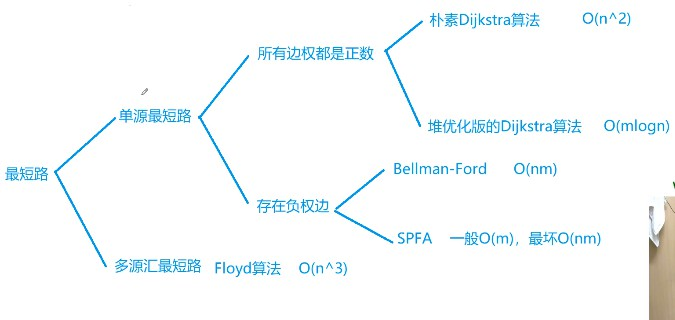
汇总细节
1. 使用何种结构存储图。
一是考虑数据范围，二是考虑算法。
稀疏图通常用邻接表，稠密图通常用邻接矩阵；
bellman-ford每次要遍历所有边所以用结构体方便，而spfa每次要更新队头点所连所有边，用邻接表方便。

## 1 朴素Dijkstra 
[Dijkstra求最短路 I](https://www.acwing.com/problem/content/851/)
迪杰斯特拉算法(Dijkstra)是由荷兰计算机科学家狄克斯特拉于1959 年提出的，因此又叫狄克斯特拉算法。是**从一个顶点到其余各顶点的最短路径算法**，解决的是**有权图**中最短路径问题。迪杰斯特拉算法主要特点是从起始点开始，采用**贪心算法**的策略，每次遍历到始点距离最近且未访问过的顶点的邻接节点，直到扩展到终点为止。


[Article:Dijkstra求最短路 I：图解 详细代码（图解](https://www.acwing.com/solution/content/38318/)

**步骤：**
- 1. 初始化dist[i]=0x3f3f3f3f;dist[1]=0, state 已确定最短距离的点
- 2. for 1:n    ->  O(n)
    - 1. 寻找不在s中，且距离源点最近的点t   O(n)
    - 2. 将t加入到s中，即state[t]=true;
    - 3. 用t更新 到其他点的距离            O(n)

**常见问题合集**
1. for(int i=0;i<n;i++) { t=-1 } 这里为什么t要赋值为 -1
回答: 由于每一次都要找到还没有确定最短路距离的所有点中，距离当前的点最短的点。t = - 1是为了在st这个集合中找第一个点更新时候的方便所设定的。
2. 如果是问编号a到b的最短距离该怎么改呢? （好问题）
回答： 初始化时将 dist[a]=0,以及返回时return dist[b]。
3. 自环和重边对 Dijkstrea算法有影响吗？
回答： 自环在朴素版dijkstra算法中是没有任何影响的，所以自环的权值是多少都可以，只要不是负数就行。而重边时，我们去取重边中的最小值 即代码g[x][y]=min(g[x][y],z)。而用邻接表时，重边没问题。
4. 为什么要用邻接矩阵去存贮，而不是邻接表？
回答： 我们采用邻接矩阵还是采用邻接表来表示图，需要判断一个图是稀疏图还是稠密图。稠密图指的是边的条数|E|接近于|V|²，稀疏图是指边的条数|E|远小于于|V|²（数量级差很多）。本题是稠密图，显然稠密图用邻接矩阵存储比较节省空间，反之用邻接表存储。
5. 为什么不能用于求负权边的最短路？
首先：Dijkstra算法的3个步骤
    1、找到当前未标识的且离源点最近的点t
    2、对t号点点进行标识
    3、用t号点更新其他点的距离

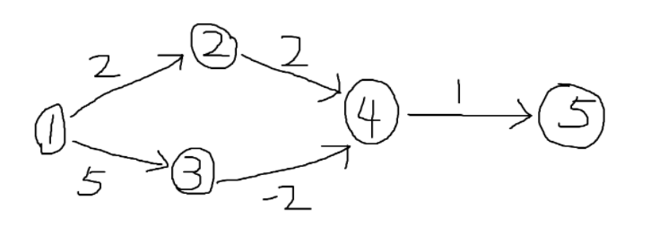

**结果：**
dijkstra算法在图中走出来的最短路径是`1 -> 2 -> 4 -> 5`，算出 1 号点到 5 号点的最短距离是`2 + 2 + 1 = 5`，然而还存在一条路径是`1 -> 3 -> 4 -> 5`，该路径的长度是`5 + (-2) + 1 = 4`，因此 dijkstra 算法失效
**dijkstra详细步骤**

初始`dist[1] = 0`
找到了未标识且离源点1最近的结点1，标记1号点，用1号点更新其他所有点的距离，2号点被更新成`dist[2] = 2`，3号点被更新成`dist[3] = 5`
找到了未标识且离源点1最近的结点2，标识2号点，用2号点更新其他所有点的距离，4号点被更新成`dist[4] = 4`
找到了未标识且离源点1最近的结点4，标识4号点，用4号点更新其他所有点的距离，5号点被更新成`dist[5] = 5`
找到了未标识且离源点1最近的结点3，标识3号点，用3号点更新其他所有点的距离，4号点被更新成`dist[4] = 3`
结束
得到1号点到5号点的最短距离是5，对应的路径是`1 -> 2 -> 4 -> 5`，并不是真正的最短距离。


**Dijkstra代码：**
时间复杂是 O(n2+m), n 表示点数，m 表示边数
```c++  
int g[N][N];  // 存储每条边
int dist[N];  // 存储1号点到每个点的最短距离
bool st[N];   // 存储每个点的最短路是否已经确定

// 求1号点到n号点的最短路，如果不存在则返回-1
int dijkstra()
{
    memset(dist, 0x3f, sizeof dist);
    dist[1] = 0;

    for (int i = 0; i < n - 1; i ++ )
    {
        int t = -1;     // 在还未确定最短路的点中，寻找距离最小的点
        for (int j = 1; j <= n; j ++ )
            if (!st[j] && (t == -1 || dist[t] > dist[j]))
                t = j;

        // 用t更新其他点的距离
        for (int j = 1; j <= n; j ++ )
            dist[j] = min(dist[j], dist[t] + g[t][j]);

        st[t] = true;
    }

    if (dist[n] == 0x3f3f3f3f) return -1;
    return dist[n];
}
```

## 2 堆优化Dijkstra
[Dijkstra求最短路 II](https://www.acwing.com/problem/content/852/)

时间复杂度 O(mlogn), n 表示点数，m 表示边数

```c++  
typedef pair<int, int> PII;

int n;      // 点的数量
int h[N], w[N], e[N], ne[N], idx;       // 邻接表存储所有边
int dist[N];        // 存储所有点到1号点的距离
bool st[N];     // 存储每个点的最短距离是否已确定

// 求1号点到n号点的最短距离，如果不存在，则返回-1
int dijkstra()
{
    memset(dist, 0x3f, sizeof dist);
    dist[1] = 0;
    priority_queue<PII, vector<PII>, greater<PII>> heap;
    heap.push({0, 1});      // first存储距离，second存储节点编号

    while (heap.size())
    {
        auto t = heap.top();
        heap.pop();

        int ver = t.second, distance = t.first;

        if (st[ver]) continue;
        st[ver] = true;

        for (int i = h[ver]; i != -1; i = ne[i])
        {
            int j = e[i];
            if (dist[j] > distance + w[i])
            {
                dist[j] = distance + w[i];
                heap.push({dist[j], j});
            }
        }
    }

    if (dist[n] == 0x3f3f3f3f) return -1;
    return dist[n];
}
```


## 3 Bellman-Ford算法
[有边数限制的最短路](https://www.acwing.com/problem/content/855/)

[Article:有边数限制的最短路](https://www.acwing.com/solution/content/6320/)

Bellman - ford 算法是求**含负权图**的单源最短路径的一种算法，**效率较低，代码难度较小**。其原理为**连续进行松弛**，在每次松弛时把每条边都更新一下，**若在 n-1 次松弛后还能更新，则说明图中有负环**，因此无法得出结果，否则就完成。
(通俗的来讲就是：假设 1 号点到 n 号点是可达的，每一个点同时向指向的方向出发，更新相邻的点的最短距离，通过循环 n-1 次操作，若图中不存在负环，则 1 号点一定会到达 n 号点，若图中存在负环，则在 n-1 次松弛后一定还会更新)


应用于存在负权边的最短路问题，但并不一定存在最短路，如成环值为负，即负权回路(**负环**)。当然存在负权回路也可能存在最短路，即该回路不在到达终点所经过的路上。

这种情况下，想要存在最短路，需要限制步数k。要不然就不能成环。


**bellman_ford算法**
1)初始化所有点到源点的距离为∞,把源点到自己的距离设置为0；
2)不管3721遍历n次;每次遍历m条边，用每一条边去更新各点到源点的距离。

值得注意的是
1) 需要把dist数组进行一个备份，这样防止每次更新的时候出现串联；
2) 由于存在负权边，因此return -1的条件就要改成dist[n]>0x3f3f3f3f/2;
3) 上面所谓的n次遍历的实际含义是当前的最短路径最多有n-1条边，这也就解释了为啥要i遍历到n的时候退出循环了，因为只有n个点,最短路径无环最多就存在n-1条边。
4) 这里无需对重边和自环做单独的处理：
> 1] 重边：由于遍历了所有的边，总会遍历到较短的那一条; 
> 2] 自环: 有自环就有自环啊，反正又不会死循环;
5) 令人愉悦的是，该算法无非就是循环n次然后遍历所有的边，因此不需要做什么特别的存储，只要把所有的边的信息存下来能够遍历就行;
6）bellman_ford算法可以存在负权回路，因为它求得的最短路是有限制的，是限制了边数的，这样不会永久的走下去，会得到一个解；
7)SPFA算法各方面优于该算法，但是在碰到限制了最短路径上边的长度时就只能用bellman_ford了，此时直接把n重循环改成k次循环即可


```c++  
for n次
    for 所有边 a,b,w 
        dist[b] = min(dist[b], dist[a]+w) // 松弛操作
// 最终可计算得到任意边 满足三角不等式 : dist[b] <= dist[a]+w
```
如果对次数进行限制，
```c++  
for n次
    for 所有边 a,b,w (松弛操作)
        dist[b] = min(dist[b],backup[a] + w)  
```
注意：backup[] 数组是上一次迭代后 dist[] 数组的备份，由于是每个点同时向外出发，因此需要对 dist[] 数组进行备份，若不进行备份会因此发生串联效应，影响到下一个点


时间复杂度 O(nm), n 表示点数，m 表示边数

注意在模板题中(对k条边进行限制)需要对下面的模板稍作修改，加上备份数组，详情见模板题。


```c++  
// 对所经过的边数不加限制不用备份
int n, m;       // n表示点数，m表示边数
int dist[N];        // dist[x]存储1到x的最短路距离

struct Edge     // 边，a表示出点，b表示入点，w表示边的权重
{
    int a, b, w;
}edges[M];

// 求1到n的最短路距离，如果无法从1走到n，则返回-1。
int bellman_ford()
{
    memset(dist, 0x3f, sizeof dist);
    dist[1] = 0;

    // 如果第n次迭代仍然会松弛三角不等式，就说明存在一条长度是n+1的最短路径，由抽屉原理，路径中至少存在两个相同的点，说明图中存在负权回路。
    for (int i = 0; i < n; i ++ ) // n次
    {
        for (int j = 0; j < m; j ++ )
        {
            int a = edges[j].a, b = edges[j].b, w = edges[j].w;
            if (dist[b] > dist[a] + w)
                dist[b] = dist[a] + w;
            // dist[b] = min(dist[b], dist[a] + w);
        }
    }
    // 防止到达不了终点，但dist也被更新成了一个比初始值稍小的数。// 所以没用dist[n]==0x3f3f3f3f;
    if (dist[n] > 0x3f3f3f3f / 2) return -1;   
    return dist[n];
}
```
**备份dist数组**
如果对所经过的边数加以限制，则为了防止串联，需要在k次循环中，对上一循环的dist进行备份。防止用更新过的dist计算新的dist，而只新计入一次边。导致所计算出的距离其实经过的边多于k次，不满足要求。
可理解为动态规划的滚动数组优化，如01背包时的降序就是防止某个物品拿多次。
如下题中可用dp解法。
[787. K 站中转内最便宜的航班](https://leetcode-cn.com/problems/cheapest-flights-within-k-stops/submissions/)

- 解法中bellman-ford可求解此类带限制次数的题。本质还是动态规划。
- 也可用bfs等其他方法做。

具体：
为了避免如下的串联情况， 在边数限制为一条的情况下，节点3的距离应该是3，但是由于串联情况，利用本轮更新的节点2更新了节点3的距离，所以现在节点3的距离是2。
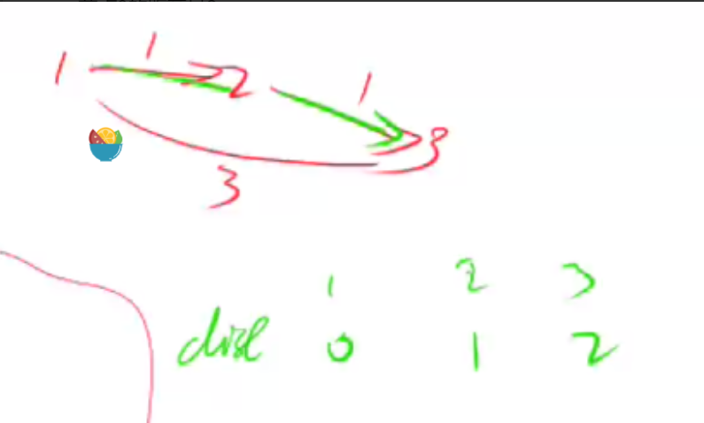
正确做法是用上轮节点2更新的距离--无穷大，来更新节点3， 再取最小值，所以节点3离起点的距离是3。
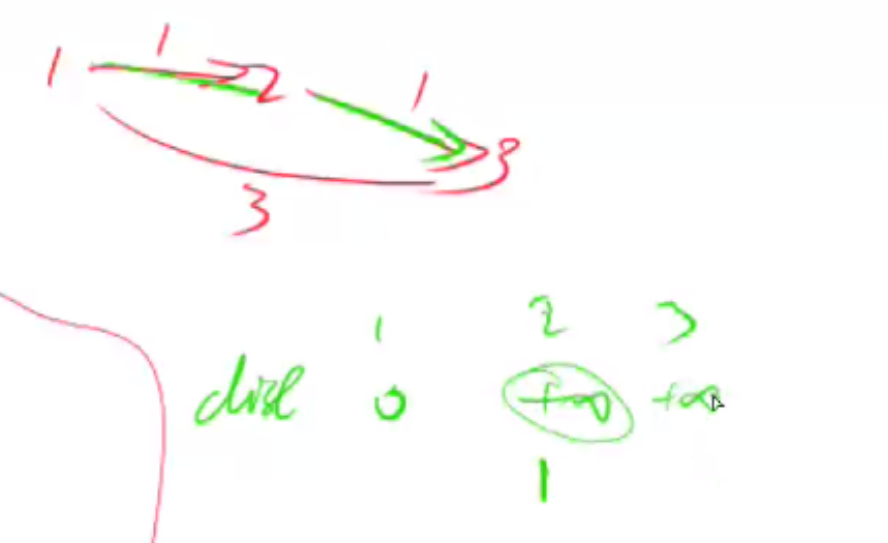
```c++  
#include<iostream>
#include<cstring>
using namespace std;
const int N = 510, M = 10010;
struct Edge {
    int a;
    int b;
    int w;
} e[M];//把每个边保存下来即可
int dist[N];
int back[N];//备份数组防止串联
int n, m, k;//k代表最短路径最多包涵k条边

int bellman_ford() {
    memset(dist, 0x3f, sizeof dist);
    dist[1] = 0;
    for (int i = 0; i < k; i++) {//k次循环
        memcpy(backup, dist, sizeof dist);  // ###
        for (int j = 0; j < m; j++) {//遍历所有边
            int a = e[j].a, b = e[j].b, w = e[j].w;
            dist[b] = min(dist[b], backup[a] + w);
            //使用backup:避免给a更新后立马更新b, 这样b一次性最短路径就多了两条边出来
        }
    }
    if (dist[n] > 0x3f3f3f3f / 2) return -1;
    else return dist[n];
}

int main() {
    scanf("%d%d%d", &n, &m, &k);
    for (int i = 0; i < m; i++) {
        int a, b, w;
        scanf("%d%d%d", &a, &b, &w);
        e[i] = {a, b, w};
    }
    int res = bellman_ford();
    if (res == -1) puts("impossible");
    else cout << res;

    return 0;
}
```


## 4 spfa 算法
（队列优化的Bellman-Ford算法） 
[spfa求最短路](https://www.acwing.com/problem/content/853/)

注意：能用dijkstra的就别用spfa。

spfa只会更新所有能从起点走到的点，所以如果无解，那么起点就走不到终点，那么终点的距离就是0x3f3f3f3f。

**详解：**

SPFA算法仅仅只是对Bellman-Ford算法的一个优化。
Bellman_ford算法会遍历所有的边，但是有很多的边遍历了其实没有什么意义，我们只用遍历那些到源点距离变小的点所连接的边即可，只有当一个点的前驱结点更新了，该节点才会得到更新；因此考虑到这一点，我们将**创建一个队列每一次加入距离被更新的结点**。

值得注意的是
1) st数组的作用：**判断当前的点是否已经加入到队列当中了**；已经加入队列的结点就不需要反复的把该点加入到队列中了，就算此次还是会更新到源点的距离，那只用更新一下数值而不用加入到队列当中。
即便不使用st数组最终也没有什么关系，但是使用的好处在于可以**提升效率**。
2) SPFA算法看上去和Dijstra算法长得有一些像但是其中的意义还是相差甚远的:
>1] **Dijkstra算法中的st数组保存的是当前确定了到源点距离最小的点**，且一旦确定了最小那么就不可逆了(不可标记为true后改变为false)；**SPFA算法中的st数组仅仅只是表示的当前发生过更新的点，且spfa中的st数组可逆**(可以在标记为true之后又标记为false)。顺带一提的是BFS中的st数组记录的是当前已经被遍历过的点。
>2] Dijkstra算法里使用的是**优先队列**保存的是当前未确定最小距离的点，目的是快速的取出当前到源点距离最小的点；SPFA算法中使用的是**队列**(你也可以使用别的数据结构),目的只是记录一下当前发生过更新的点。
>3]**注意由于入队的问题，在出队的时候取出节点，但不要用队列中出队的pair对应值，而是从dist中重新获取最新的值，因为入队时的值可能并非最新值**

3) ⭐️Bellman_ford算法里最后return-1的判断条件写的是dist[n]>0x3f3f3f3f/2;而spfa算法写的是dist[n]==0x3f3f3f3f;其原因在于Bellman_ford算法会遍历所有的边，因此不管是不是和源点连通的边它都会得到更新；但是SPFA算法不一样，它相当于采用了BFS，因此遍历到的结点都是与源点连通的，因此如果你要求的n和源点不连通，它不会得到更新，还是保持的0x3f3f3f3f。

4) ⭐️ Bellman_ford算法可以存在负权回路，是因为其循环的次数是有限制的因此最终不会发生死循环；但是SPFA算法不可以，由于用了队列来存储，只要发生了更新就会不断的入队，因此假如有负权回路请你不要用SPFA否则会死循环。

5) ⭐️由于SPFA算法是由Bellman_ford算法优化而来，在最坏的情况下时间复杂度和它一样即时间复杂度为 O(nm)，假如题目时间允许可以直接用SPFA算法去解Dijkstra算法的题目。(好像SPFA有点小小万能的感觉?)

6) ⭐️求负环一般使用SPFA算法，方法是用一个cnt数组记录每个点到源点的边数，一个点被更新一次就+1，一旦有点的边数达到了n那就证明存在了负环。


时间复杂度 平均情况下 O(m)，最坏情况下 O(nm), n 表示点数，m 表示边数

```c++  
int n;      // 总点数
int h[N], w[N], e[N], ne[N], idx;       // 邻接表存储所有边
int dist[N];        // 存储每个点到1号点的最短距离
bool st[N];     // 存储每个点是否在队列中

// 求1号点到n号点的最短路距离，如果从1号点无法走到n号点则返回-1
int spfa()
{
    memset(dist, 0x3f, sizeof dist);
    dist[1] = 0;

    queue<int> q;
    q.push(1);
    st[1] = true;

    while (q.size())
    {
        auto t = q.front();
        q.pop();

        st[t] = false;

        for (int i = h[t]; i != -1; i = ne[i])
        {
            int j = e[i];
            if (dist[j] > dist[t] + w[i])    
            {
                dist[j] = dist[t] + w[i];
                if (!st[j]) // 如果队列中已存在j，则不需要将j重复插入
                {
                    q.push(j);
                    st[j] = true;
                }
            }
        }
    }

    if (dist[n] == 0x3f3f3f3f) return -1;
    return dist[n];
}
```

如果采用如下方式入队pair
```c++
#include <iostream>
#include <queue>
#include <cstring>

using namespace std;
const int N = 1e5 + 10;

#define fi first
#define se second

typedef pair<int,int> PII;

int h[N], e[N], w[N], ne[N], idx = 0;
int dist[N];
bool st[N];

int n, m;

void add(int a, int b, int c)
{
  e[idx] = b,  w[idx] = c, ne[idx] = h[a], h[a] = idx ++;
}

int spfa()
{
  memset(dist, 0x3f, sizeof dist);
  queue<PII> q; 
  dist[1] = 0;  q.push({0,1});
  st[1] = true;
  while(q.size()){
    auto t = q.front(); q.pop();
    int node = t.se,  d = t.fi;    // d 和 dist[node] 有区别！！！
    st[node] = false;              //从队列中取出来之后该节点st被标记为false,代表之后该节点如果发生更新可再次入队
    for(int i = h[node]; i != -1; i = ne[i]){
      int j = e[i];
      if(dist[j] > dist[node] + w[i]){  // 不用d，而用最新的dist[node]
        dist[j] = dist[node] + w[i];
        if(!st[j]){  //当前已经加入队列的结点，无需再次加入队列，即便发生了更新也只用更新数值即可，重复添加降低效率
          st[j] = true;
          q.push({dist[j], j});
          // cout << "入队: " << dist[j] << " " << j << endl;
        }
      }
    }
  }
    
    // if(dist[n] == 0x3f3f3f3f) return -1;
    return dist[n];
}

int main()
{
  cin >> n >> m;
  memset(h, - 1, sizeof h);
  while(m -- ){
    int a, b, c;
    cin >> a >> b >> c;
    add(a, b, c);
  }
  int res = spfa();
  if(res == 0x3f3f3f3f) puts("impossible");
  else printf("%d", res);

  return 0;
}

```

### 负环 
[spfa判断负环](https://www.acwing.com/problem/content/854/)


有负权回路的话，spfa可能会陷入死循环。处理方式：加一个节点计数数组可以解决负环问题
>每次做一遍spfa()一定是正确的，但时间复杂度较高，可能会超时。初始时将所有点插入队列中可以按如下方式理解：
在原图的基础上新建一个虚拟源点，从该点向其他所有点连一条权值为0的有向边。那么原图有负环等价于新图有负环。此时在新图上做spfa，将虚拟源点加入队列中。然后进行spfa的第一次迭代，这时会将所有点的距离更新并将所有点插入队列中。执行到这一步，就等价于视频中的做法了。那么视频中的做法可以找到负环，等价于这次spfa可以找到负环，等价于新图有负环，等价于原图有负环。得证。

1、dist[x] 记录虚拟源点到x的最短距离

2、cnt[x] 记录当前x点到虚拟源点最短路的边数，初始每个点到虚拟源点的距离为0，只要他能再走n步，即cnt[x] >= n，则表示该图中一定存在负环，由于从虚拟源点到x至少经过n条边时，则说明图中至少有n + 1个点，表示一定有点是重复使用

3、若dist[j] > dist[t] + w[i],则表示从t点走到j点能够让权值变少，因此进行对该点j进行更新，并且对应cnt[j] = cnt[t] + 1,往前走一步

注意：该题是判断是否存在负环，并非判断是否存在从1开始的负环，因此需要将所有的点都加入队列中，更新周围的点


时间复杂度是 O(nm), n 表示点数，m 表示边数

```c++  
int n;      // 总点数
int h[N], w[N], e[N], ne[N], idx;       // 邻接表存储所有边
int dist[N], cnt[N];        // dist[x]存储1号点到x的最短距离，cnt[x]存储1到x的最短路中经过的边数
bool st[N];     // 存储每个点是否在队列中  ！！！

// 如果存在负环，则返回true，否则返回false。
bool spfa()
{
    // 不需要初始化dist数组
    // 原理：如果某条最短路径上有n个点（除了自己），那么加上自己之后一共有n+1个点，由抽屉原理一定有两个点相同，所以存在环。
    // 原理：即如果某条最短路径上有n个边存在环。
    queue<int> q;
    for (int i = 1; i <= n; i ++ )
    {
        q.push(i);    // 每个点都要放进去，因为不只判断从1出发的是否存在环。而是整个图。
        st[i] = true;
    }

    while (q.size())
    {
        auto t = q.front();
        q.pop();

        st[t] = false;

        for (int i = h[t]; i != -1; i = ne[i])
        {
            int j = e[i];
            if (dist[j] > dist[t] + w[i])
            {
                dist[j] = dist[t] + w[i];
                cnt[j] = cnt[t] + 1;
                if (cnt[j] >= n) return true;  // 如果从1号点到x的最短路中包含至少n个边，则说明存在环
                if (!st[j])
                {
                    q.push(j);
                    st[j] = true;
                }
            }
        }
    }

    return false;
}
```

## 5 floyd算法

[Floyd求最短路](https://www.acwing.com/problem/content/856/)
可用于求有负权边的图，但不能存在负环。


- 最短路(多源汇)
- 传递闭包
- 找最小环
- **恰好**经过k条边的最短路 倍增


**思路：**
基于**动态规划**01背包，从三维空间优化成了二维空间。
*三维：*
`f[i, j, k]`表示从i走到j的路径上除i和j点外只经过1到k的点的所有路径的最短距离。那么`f[i, j, k] = min(f[i, j, k - 1), f[i, k, k - 1] + f[k, j, k - 1]`。
因此在计算第`k`层的`f[i, j]`的时候必须先将第`k - 1`层的所有状态计算出来，所以需要把k放在最外层。

读入邻接矩阵，将次通过动态规划装换成从i到j的最短距离矩阵

如存在负权边，则在代码中，判断从a到b是否是无穷大距离时，需要进行`if(t > INF/2)`判断，而并非是`if(t == INF)`判断，原因是INF是一个确定的值，并非真正的无穷大，会随着其他数值而受到影响，t大于某个与INF相同数量级的数即可


证明：
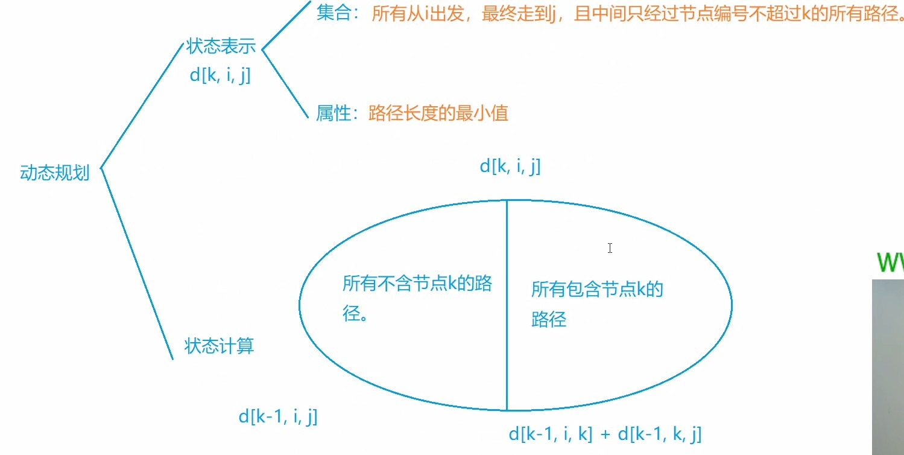


时间复杂度是 O(n3) , n 表示点数
```c++  
//初始化：
    for (int i = 1; i <= n; i ++ )
        for (int j = 1; j <= n; j ++ )
            if (i == j) d[i][j] = 0;
            else d[i][j] = INF;

// 算法结束后，d[a][b]表示a到b的最短距离
void floyd()
{
    for (int k = 1; k <= n; k ++ )
        for (int i = 1; i <= n; i ++ )
            for (int j = 1; j <= n; j ++ )
                d[i][j] = min(d[i][j], d[i][k] + d[k][j]);
}
```


# 2 最小生成树
给定一个无向图，在图中选择若干条边把图的所有节点连起来。要求边长之和最小。在图论中，叫做求最小生成树。


定理：
对于一张无向图，如果存在最小生成树和（严格）次小生成树，那么对于任何一棵最小生成树，都存在一棵(严格)次小生成树与其只有一条边不同。

## 1 prim算法
prim 算法采用的是一种贪心的策略。

**每次将离连通部分的最近的点和点对应的边加入到连通部分，连通部分逐渐扩大，最后将整个图连通起来，并且边长之和最小。**

证明： 
- 思路 ：
    - 当前外界与
- 证明 ： 如果不按上述选最小的边，则会产生环。...

如何证明当前这条边一定可以被选？
- 假设不选当前编码，最终得到了一棵树。然后将这条边加上，那么必然会出现一个环，


[Article:Prim算法求最小生成树：图解+详细代码注释(带上了保存路径)](https://www.acwing.com/solution/content/38312/)
我们将图中各个节点用数字 1 ~ n 编号。

要将所有景点连通起来，并且边长之和最小，步骤如下：

1. 用一个**state 数组表示节点是否已经连通**。state[i] 为真，表示已经连通，state[i] 为假，表示还没有连通。初始时，state 各个元素为假。即所有点还没有连通。
用一个 **dist 数组保存各个点到连通部分的最短距离**，dist[i] 表示 i 节点到连通部分的最短距离。初始时，dist 数组的各个元素为无穷大。
用一个 pre 数组保存节点的是和谁连通的。pre[i] = k 表示节点 i 和节点 k 之间需要有一条边。初始时，pre 的各个元素置为 -1。

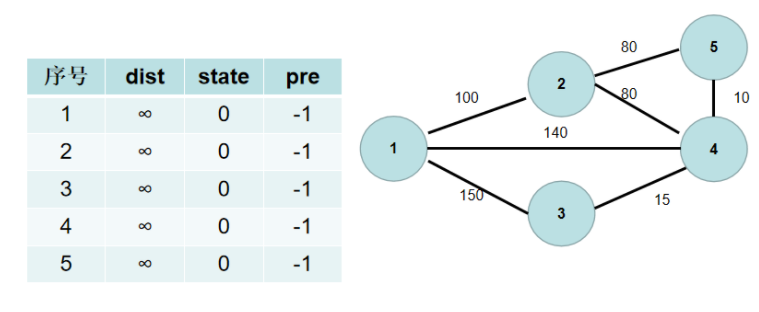
2. 从 1 号节点开始扩充连通的部分，所以 1 号节点与连通部分的最短距离为 0，即disti[1] 置为 0。
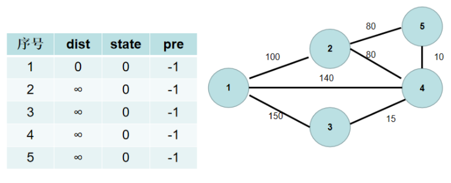
3. 遍历 dist 数组，找到一个还没有连通起来，但是距离连通部分最近的点，假设该节点的编号是 i。i节点就是下一个应该加入连通部分的节点，stata[i] 置为 1。
用青色点表示还没有连通起来的点，红色点表示连通起来的点。
这里青色点中距离最小的是 dist[1]，因此 state[1] 置为 1。
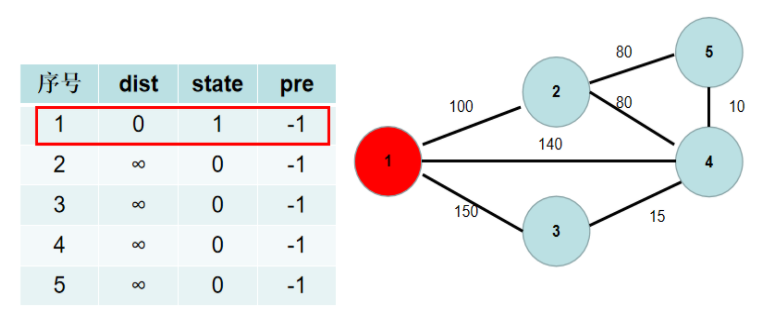
4. 遍历所有与 i 相连但没有加入到连通部分的点 j，如果 j 距离连通部分的距离大于 i j 之间的距离，即 dist[j] > w[i][j]（w[i][j] 为 i j 节点之间的距离），则更新 dist[j] 为 w[i][j]。这时候表示，j 到连通部分的最短方式是和 i 相连，因此，更新pre[j] = i。
与节点 1 相连的有 2， 3， 4 号节点。1->2 的距离为 100，小于 dist[2]，dist[2] 更新为 100，pre[2] 更新为1。1->4 的距离为 140，小于 dist[4]，dist[4] 更新为 140，pre[2] 更新为1。1->3 的距离为 150，小于 dist[3]，dist[3] 更新为 150，pre[3] 更新为1。

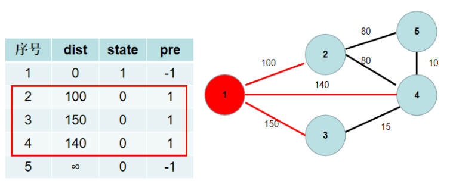
5. 重复 3 4步骤，直到所有节点的状态都被置为 1.
这里青色点中距离最小的是 dist[2]，因此 state[2] 置为 1。


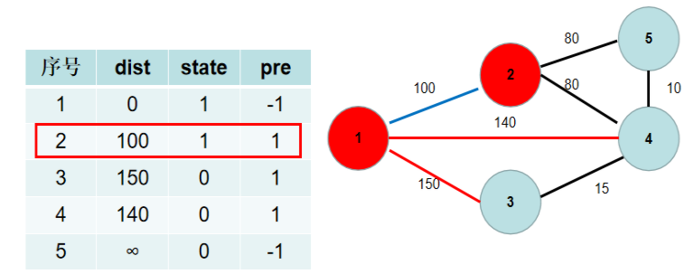

与节点 2 相连的有 5， 4号节点。2->5 的距离为 80，小于 dist[5]，dist[5] 更新为 80，pre[5] 更新为 2。2->4 的距离为 80，小于 dist[4]，dist[4] 更新为 80，pre[4] 更新为2。

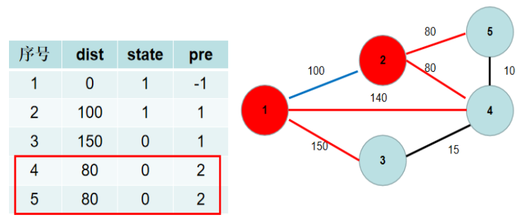
选dist[4]，更新dist[3]，dist[5]，pre[3]，pre[5]。
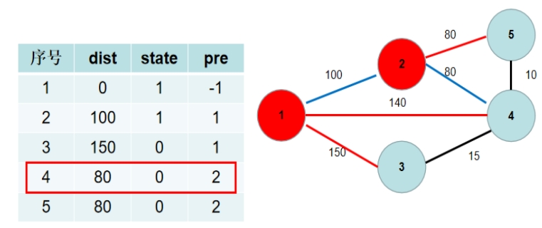
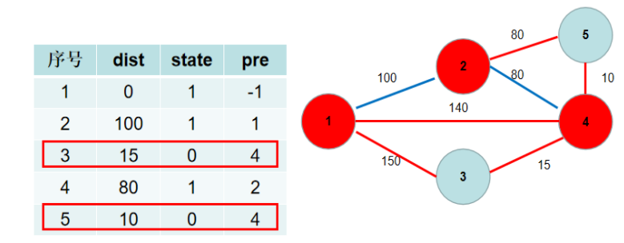
选dist[5]，没有可更新的。
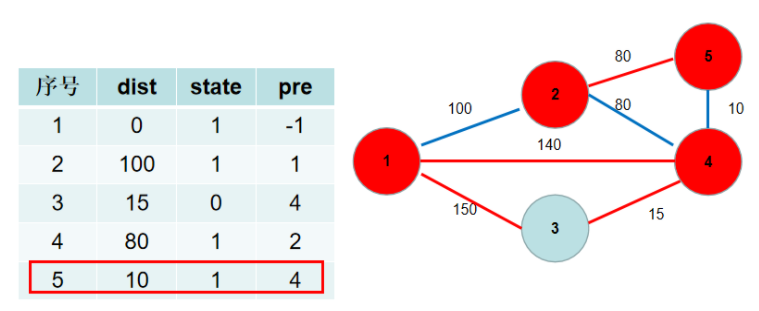
选dist[3]，没有可更新的。
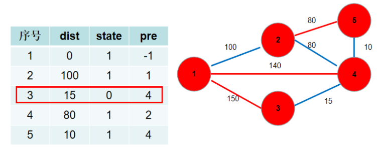
6. 此时 dist 数组中保存了各个节点需要修的路长，加起来就是。pre 数组中保存了需要选择的边。
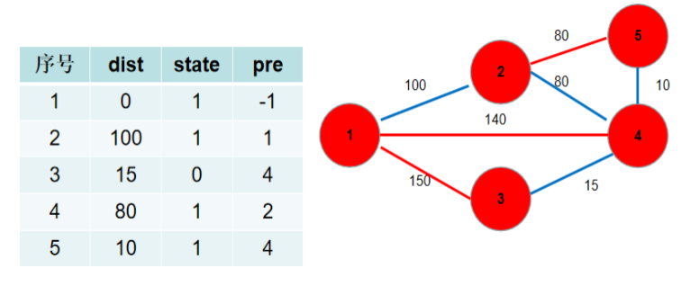
```c++  
int dist[n],state[n],pre[n];
dist[1] = 0;
for(i : 1 ~ n)
{
    t <- 没有连通起来，但是距离连通部分最近的点;
    state[t] = 1;
    更新 dist 和 pre;
}
```

**朴素版prim算法**  
[Prim算法求最小生成树](https://www.acwing.com/problem/content/860/)

和Dijkstra的代码特别像。
联系：Dijkstra算法是更新到起始点的距离，Prim是更新到集合S的距离

时间复杂度是 O(n2+m), n 表示点数，m 表示边数
```c++  
int n;      // n表示点数
int g[N][N];        // 邻接矩阵，存储所有边
int dist[N];        // 存储其他点到当前最小生成树的距离
bool st[N];     // 存储每个点是否已经在生成树中
const int N = 510, INF = 0x3f3f3f3f;

// 如果图不连通，则返回INF(值是0x3f3f3f3f), 否则返回最小生成树的树边权重之和
int prim()
{
    memset(dist, 0x3f, sizeof dist);

    int res = 0;

    dist[1] = 0; // 找一个源点，！！但此时还未加入！！，用于第一个循环中更新t
    for (int i = 0; i < n; i ++ )
    {
        int t = -1;
        for (int j = 1; j <= n; j ++ )
            if (!st[j] && (t == -1 || dist[t] > dist[j]))
                t = j;

        if (i && dist[t] == INF) return INF;  // 不连通

        if (i) res += dist[t];                // ！！！
        st[t] = true;             // 此时才算加入

        for (int j = 1; j <= n; j ++ ) dist[j] = min(dist[j], g[t][j]);   // 更新用g[t][j]，只用一条边，即用 与连通块最近的边 更新相应的点即可。注意与Dijkstra的区别。
    }

    return res;
}
```
*堆优化prim略，一般用不到，对于稀疏图用Kruskal更佳*
[最低成本联通所有城市](https://leetcode-cn.com/problems/connecting-cities-with-minimum-cost/) 若用prim需用堆优化版本。

## 2 Kruskal算法

[Kruskal算法求最小生成树](https://www.acwing.com/problem/content/861/)
拓展[水资源分配优化(kruskal+虚拟超级源点)](https://leetcode-cn.com/problems/optimize-water-distribution-in-a-village/)

用于稀疏图


1. 将所有边按权重从小到大排序  O(mlogm)
2. 枚举每条边，a,b,w  O(m)
    - if a,b不连通
        将a,b边加入集合中
注意
1）类似并查集。
2）需要使用变量cnt记录加进集合的边数，若`cnt<n-1`表示不能遍历所有点


时间复杂度是 O(mlogm), n 表示点数，m 表示边数

```c++  
int n, m;       // n是点数，m是边数
int p[N];       // 并查集的父节点数组

struct Edge     // 存储边
{
    int a, b, w;

    bool operator< (const Edge &W)const
    {
        return w < W.w;
    }
}edges[M];

int find(int x)     // 并查集核心操作
{
    if (p[x] != x) p[x] = find(p[x]);
    return p[x];
}

int kruskal()
{
    sort(edges, edges + m);

    for (int i = 1; i <= n; i ++ ) p[i] = i;    // 初始化并查集

    int res = 0, cnt = 0;
    for (int i = 0; i < m; i ++ )
    {
        int a = edges[i].a, b = edges[i].b, w = edges[i].w;

        a = find(a), b = find(b);
        if (a != b)     // 如果两个连通块不连通，则将这两个连通块合并
        {
            p[a] = b;
            res += w;
            cnt ++ ;
        }
    }

    if (cnt < n - 1) return INF;   // n个点，n-1条边
    return res;
}
```


# 3 拓扑排序
有向无环图一定存在入度为0的点，因此可以形成拓扑序列。
反证：如果每个节点入度都不为0，则...


拓扑序列：针对有向无环图（DAG）(Directed Acyclic Graph简称DAG)来说。
- 用来判断是否存在环。
- 不唯一
- 方法：**bfs**
+ 1. 入度 出度统计
+ 2. bfs
    ```c++  
    queue <- 所有入度为0的点
    while(queue 非空)
    {
        t <-  队头
        枚举t的所有出边 t->j
        删除t->j,d[j]--;
        if(d[j]==0) queue <- j
    }  
    ```
时间复杂度 O(n+m) , n 表示点数，m 表示边数
用手写队列实现
```c++  
bool topsort()
{
    int hh = 0, tt = -1;

    // d[i] 存储点i的入度
    for (int i = 1; i <= n; i ++ )
        if (!d[i])
            q[ ++ tt] = i;

    while (hh <= tt) {
        int t = q[hh ++ ];

        for (int i = h[t]; i != -1; i = ne[i]){
            int j = e[i];
            if (-- d[j] == 0)
                q[ ++ tt] = j;
        }
    }

    // 如果所有点都入队了，说明存在拓扑序列；否则不存在拓扑序列。
    return tt == n - 1;
}
```
- 方法：**dfs**
- 需要遍历，并且每个节点有三种状态，0(为开始搜索),1(正在搜索),2(已完成搜索)
    - [课程表](https://leetcode-cn.com/problems/course-schedule/)
    - [课程表2](https://leetcode-cn.com/problems/course-schedule-ii/)
- 
[重建序列](https://leetcode.cn/problems/ur2n8P/)


# 4 二分图


二分图当且仅当图中不含奇数环
充分性：由于图中不含奇数环，所有染色过程中一定没有矛盾。
必要性: A(0)->1 -> 0->1->A(0)

## 1 染色法判别二分图
[染色法判定二分图](https://www.acwing.com/problem/content/862/)


**染色法**
- 将所有点分成两个集合，使得所有边只出现在集合之间，就是二分图
- 二分图：一定不含有奇数环，可能包含长度为偶数的环， 不一定是连通图
- **dfs版本**
    - 代码思路：
    - 染色可以使用1和2区分不同颜色，用0表示未染色
    - 遍历所有点，每次将未染色的点进行dfs, 默认染成1或者2
    - 由于某个点染色成功不代表整个图就是二分图,因此只有某个点染色失败才能立刻break/return
    染色失败相当于存在相邻的2个点染了相同的颜色
    ```c++  
    #include <iostream>
    #include <algorithm>
    #include <cstring>

    using namespace std;
    const int N = 1e5 + 10, M = 2e5 + 10; // 无向图, 所以最大边数是2倍
    int e[M], ne[M], h[N], idx;
    int st[N];

    void add(int a, int b){
        e[idx] = b, ne[idx] = h[a], h[a] = idx ++;
    }

    bool dfs(int u, int color) {
        st[u] = color;

        for(int i = h[u]; i != -1; i = ne[i]){
            int j = e[i];
            if(!st[j]) {
                if(!dfs(j, 3 - color)) return false;
            }else if(st[j] == color) return false;
        }

        return true;
    }

    int main(){
        int n, m;
        scanf("%d%d", &n, &m);

        memset(h, -1, sizeof h);
        while (m --){
            int a, b;
            scanf("%d%d", &a, &b);
            add(a, b), add(b,a);  // 无向图
        }

        bool flag = true;
        for(int i = 1; i <= n; i ++){
            if(!st[i]){
                if(!dfs(i, 1)){
                    flag = false;
                    break;
                }
            }
        }

        if(flag) puts("Yes");
        else puts("No");
        return 0;
    }

    ```
- **bfs版本**
    - 代码思路
    - 颜色 1 和 2 表示不同颜色, 0 表示 未染色
    - 定义queue是存PII，表示 <点编号, 颜色>,
    - 同理，遍历所有点, 将未染色的点都进行bfs
    - 队列初始化将第i个点入队, 默认颜色可以是1或2
        -while (队列不空)
        -每次获取队头t, 并遍历队头t的所有邻边
            -若邻边的点未染色则染上与队头t相反的颜色，并添加到队列
            -若邻边的点已经染色且与队头t的颜色相同, 则返回false
    ```c++  
    #include <iostream>
    #include <algorithm>
    #include <cstring>

    using namespace std;
    const int N = 1e5 + 10, M = 2e5 + 10;
    typedef pair<int, int> PII;

    int e[M], ne[M], h[N], idx;
    int n, m;
    int st[N];

    void add(int a, int b){
        e[idx] = b, ne[idx] = h[a], h[a] = idx ++;
    }

    bool bfs(int u){
        int hh = 0, tt = 0;
        PII q[N];
        q[0] = {u, 1};
        st[u] = 1;

        while(hh <= tt){
            auto t = q[hh ++];
            int ver = t.first, c = t.second;

            for (int i = h[ver]; i != -1; i = ne[i]){
                int j = e[i];

                if(!st[j])
                {
                    st[j] = 3 - c;
                    q[++ tt] = {j, 3 - c};
                }
                else if(st[j] == c) return false;
            }
        }

        return true;
    }

    int main(){
        scanf("%d%d", &n, &m);

        memset(h, -1, sizeof h);
        while(m --){
            int a, b;
            scanf("%d%d", &a, &b);
            add(a, b), add(b, a); // 无向图
        }

        int flag = true;
        for(int i = 1; i <= n; i ++) {
            if (!st[i]){
                if(!bfs(i)){
                    flag = false;
                    break;
                }
            }
        }

        if (flag) puts("Yes");
        else puts("No");
        return 0;
    }
    ```

**总结**：对于第一次被遍历还未被染色的点，进行互斥染色。对于已经染色的，要检验合法性。


以下为模板：

时间复杂度是 O(n+m), n 表示点数，m 表示边数
```c++  
int n;      // n表示点数
int h[N], e[M], ne[M], idx;     // 邻接表存储图
int color[N];       // 表示每个点的颜色，-1表示未染色，0表示白色，1表示黑色

// 参数：u表示当前节点，c表示当前点的颜色
bool dfs(int u, int c)
{
    color[u] = c;
    for (int i = h[u]; i != -1; i = ne[i])
    {
        int j = e[i];
        if (color[j] == -1)
        {
            if (!dfs(j, !c)) return false;
        }
        else if (color[j] == c) return false;
    }

    return true;
}

bool check()
{
    memset(color, -1, sizeof color);
    bool flag = true;
    for (int i = 1; i <= n; i ++ )
        if (color[i] == -1)
            if (!dfs(i, 0))
            {
                flag = false;
                break;
            }
    return flag;
}
```


## 2 匈牙利算法 
[二分图的最大匹配](https://www.acwing.com/problem/content/863/)

另见基本算法中贪心部分。
[趣写算法系列之--匈牙利算法](https://blog.csdn.net/dark_scope/article/details/8880547)

什么是最大匹配？
要了解匈牙利算法必须先理解下面的概念：

    匹配：在图论中，一个「匹配」是一个边的集合，其中任意两条边都没有公共顶点。

    最大匹配：一个图所有匹配中，所含匹配边数最多的匹配，称为这个图的最大匹配。

下面是一些补充概念：

    完美匹配：如果一个图的某个匹配中，所有的顶点都是匹配点，那么它就是一个完美匹配。

    交替路：从一个未匹配点出发，依次经过非匹配边、匹配边、非匹配边…形成的路径叫交替路。

    增广路：从一个未匹配点出发，走交替路，如果途径另一个未匹配点（出发的点不算），则这条交替 路称为增广路（agumenting path）。


时间复杂度是 O(nm), n 表示点数，m 表示边数

```c++  
int n1, n2;     // n1表示第一个集合中的点数，n2表示第二个集合中的点数
int h[N], e[M], ne[M], idx;     // 邻接表存储所有边，匈牙利算法中只会用到从第一个集合指向第二个集合的边，所以这里只用存一个方向的边
int match[N];       // 存储第二个集合中的每个点当前匹配的第一个集合中的点是哪个
bool st[N];     // 表示第二个集合中的每个点是否已经被遍历过

bool find(int x)
{
    for (int i = h[x]; i != -1; i = ne[i])
    {
        int j = e[i];
        if (!st[j])
        {
            st[j] = true;
            if (match[j] == 0 || find(match[j]))
            {
                match[j] = x;
                return true;
            }
        }
    }

    return false;
}

// 求最大匹配数，依次枚举第一个集合中的每个点能否匹配第二个集合中的点
int res = 0;
for (int i = 1; i <= n1; i ++ )
{
    memset(st, false, sizeof st);  // 每个循环都要重置一次 即在一次find的dfs中防止重复遍历
    if (find(i)) res ++ ;
}
```

**代码中st数组作用：**
- 每次循环都重置
- st数组用来保证本次匹配过程中，第二个集合中的每个点只被遍历一次，防止死循环。match存的是第二个集合中的每个点当前匹配的点是哪个，但就算某个点当前已经匹配了某个点，也有可能被再次遍历，所以不能起到判重的作用。

- st数组可以理解为预定数组，即某一轮中某个女孩是不是被男生预定了。如果find函数递归下去能够帮心仪对象的对象找到备胎，那皆大欢喜，所有这一轮预定的姑娘被match对应的男孩（回溯）。如果找不到备胎，那这些预定姑娘就保持不动。

-没有st数组会导致爆栈。举个简单例子：左1、左2都指向右1，执行find(1)后会使得match[1] = 1，接着执行find(2)时，需执行find(1)，find(1)又需执行find(1)，如此进入了死循环，导致爆栈。


补充一下证明：
1) 匈牙利算法中，一个有伴侣的人，无论男女，不会重新变成单身。
2) 若我们尝试给一个有对象的女生换个对象，如果成功，整个交换链条终止于一个单身女性。
由2)可知，调整对象失败则代表由该女生作为起点的生成树内已无单身女性。
由1)可知，以该女生作为起点的生成树不会凭空出现单身女性。


## 3 KM算法

[OI Wiki二分图最大权匹配](https://oi-wiki.org/graph/graph-matching/bigraph-weight-match/)
[km算法入门](https://www.cnblogs.com/logosG/p/logos.html) ??
[KM算法详解+模板](https://www.cnblogs.com/wenruo/p/5264235.html)
KM算法用来求二分图最大权完美匹配。


二分图的最大权匹配是指二分图中边权和最大的匹配。

Hungarian Algorithm（Kuhn-Munkres Algorithm）¶
匈牙利算法又称为 KM 算法，可以在 O(n^3) 时间内求出二分图的 最大权完美匹配。

考虑到二分图中两个集合中的点并不总是相同，为了能应用 KM 算法解决二分图的最大权匹配，需要先作如下处理：将两个集合中点数比较少的补点，使得两边点数相同，再将不存在的边权重设为 ，这种情况下，问题就转换成求 最大权完美匹配问题，从而能应用 KM 算法求解。


以[D-数组的最大与和](https://leetcode-cn.com/problems/maximum-and-sum-of-array/)为例。
(详情见 动态规划状压dp 部分提供六种解法 - 状态DP - 三进制- 最小费用最大流- 模拟退火- 贪心- KM)


- KM算法**本质**上在匈牙利算法的基础上增加**期望度**机制。
    - 初始化左半图每个number的期望度为该number最大可获得权值，右半图每个slot的期望度为0。
    - 每次匹配时，只考虑边权等于相连number和slot期望度和的边。
    - 当一次匹配中无法成功时，执行期望度更新操作：将涉及的所有number期望度减一、所有slot期望度加一。
- **可行性：**
    - 相当于限制了参与搜索的边的集合，使得权值较大的边能被优先搜索，保证了算法可行的充分性。
    - 每次降低期望度时，将本次搜索中左半图所有点期望度减1、右半图所有点期望度加1。每次降低期望度时，设涉及到的左半图点个数为n_1，则涉及到的右半图点个数为n_1-1（不搜第n_1 个左半图点时恰好匹配，而加入该点后不匹配，因此相关左半图点刚好比相关右半图点多一个）。
    - 对已被匹配的边而言，对应左半图点期望度减1，右半图点期望度加1，故这些边仍然在被搜索的边集合中。期望度更新操作后，每个左半图点相关的权值稍小的边被加入搜索集中。由于更新时以1为粒度，所以能保证搜索过程中不会漏掉边，保证了算法可行的必要性。


模板：
背景:现在有N男N女，有些男生和女生之间互相有好感，我们将其好感程度定义为好感度，我们希望把他们两两配对，并且最后希望好感度和最大。


```c++  
#include <iostream>
#include <cstring>
#include <cstdio>

using namespace std;
const int MAXN = 305;
const int INF = 0x3f3f3f3f;

int love[MAXN][MAXN];   // 记录每个妹子和每个男生的好感度
int ex_girl[MAXN];      // 每个妹子的期望值
int ex_boy[MAXN];       // 每个男生的期望值
bool vis_girl[MAXN];    // 记录每一轮匹配匹配过的女生
bool vis_boy[MAXN];     // 记录每一轮匹配匹配过的男生
int match[MAXN];        // 记录每个男生匹配到的妹子 如果没有则为-1
int slack[MAXN];        // 记录每个汉子如果能被妹子倾心最少还需要多少期望值

int N;


bool dfs(int girl)
{
    vis_girl[girl] = true;

    for (int boy = 0; boy < N; ++boy) {

        if (vis_boy[boy]) continue; // 每一轮匹配 每个男生只尝试一次

        int gap = ex_girl[girl] + ex_boy[boy] - love[girl][boy];

        if (gap == 0) {  // 如果符合要求
            vis_boy[boy] = true;
            if (match[boy] == -1 || dfs( match[boy] )) {    // 找到一个没有匹配的男生 或者该男生的妹子可以找到其他人
                match[boy] = girl;
                return true;
            }
        } else {
            slack[boy] = min(slack[boy], gap);  // slack 可以理解为该男生要得到女生的倾心 还需多少期望值 取最小值 备胎的样子【捂脸
        }
    }

    return false;
}

int KM()
{
    memset(match, -1, sizeof match);    // 初始每个男生都没有匹配的女生
    memset(ex_boy, 0, sizeof ex_boy);   // 初始每个男生的期望值为0

    // 每个女生的初始期望值是与她相连的男生最大的好感度
    for (int i = 0; i < N; ++i) {
        ex_girl[i] = love[i][0];
        for (int j = 1; j < N; ++j) {
            ex_girl[i] = max(ex_girl[i], love[i][j]);
        }
    }

    // 尝试为每一个女生解决归宿问题
    for (int i = 0; i < N; ++i) {

        fill(slack, slack + N, INF);    // 因为要取最小值 初始化为无穷大

        while (1) {
            // 为每个女生解决归宿问题的方法是 ：如果找不到就降低期望值，直到找到为止

            // 记录每轮匹配中男生女生是否被尝试匹配过
            memset(vis_girl, false, sizeof vis_girl);
            memset(vis_boy, false, sizeof vis_boy);

            if (dfs(i)) break;  // 找到归宿 退出

            // 如果不能找到 就降低期望值
            // 最小可降低的期望值
            int d = INF;
            for (int j = 0; j < N; ++j)
                if (!vis_boy[j]) d = min(d, slack[j]);

            for (int j = 0; j < N; ++j) {
                // 所有访问过的女生降低期望值
                if (vis_girl[j]) ex_girl[j] -= d;

                // 所有访问过的男生增加期望值
                if (vis_boy[j]) ex_boy[j] += d;
                // 没有访问过的boy 因为girl们的期望值降低，距离得到女生倾心又进了一步！
                else slack[j] -= d;
            }
        }
    }

    // 匹配完成 求出所有配对的好感度的和
    int res = 0;
    for (int i = 0; i < N; ++i)
        res += love[ match[i] ][i];

    return res;
}

int main()
{
    while (~scanf("%d", &N)) {

        for (int i = 0; i < N; ++i)
            for (int j = 0; j < N; ++j)
                scanf("%d", &love[i][j]);

        printf("%d\n", KM());
    }
    return 0;
}
```


**基础题：**
[最大兼容性评分和](https://leetcode-cn.com/problems/maximum-compatibility-score-sum/)
>有一份由 n 个问题组成的调查问卷，每个问题的答案要么是 0（no，否），要么是 1（yes，是）。
这份调查问卷被分发给 m 名学生和 m 名导师，学生和导师的编号都是从 0 到 m - 1 。学生的答案用一个二维整数数组 students 表示，其中 students[i] 是一个整数数组，包含第 i 名学生对调查问卷给出的答案（下标从 0 开始）。导师的答案用一个二维整数数组 mentors 表示，其中 mentors[j] 是一个整数数组，包含第 j 名导师对调查问卷给出的答案（下标从 0 开始）。
每个学生都会被分配给 一名 导师，而每位导师也会分配到 一名 学生。配对的学生与导师之间的兼容性评分等于学生和导师答案相同的次数。
例如，学生答案为[1, 0, 1] 而导师答案为 [0, 0, 1] ，那么他们的兼容性评分为 2 ，因为只有第二个和第三个答案相同。
请你找出最优的学生与导师的配对方案，以 最大程度上 提高 兼容性评分和 。
给你 students 和 mentors ，返回可以得到的 最大兼容性评分和 。
示例 1：
输入：students = [ [1,1,0],[1,0,1],[0,0,1] ], mentors = [ [1,0,0],[0,0,1],[1,1,0] ]
输出：8
解释：按下述方式分配学生和导师：
-学生 0 分配给导师 2 ，兼容性评分为 3 。
-学生 1 分配给导师 0 ，兼容性评分为 2 。
-学生 2 分配给导师 1 ，兼容性评分为 3 。
最大兼容性评分和为 3 + 2 + 3 = 8 。
示例 2：
输入：students = [ [0,0],[0,0],[0,0]] , mentors = [ [1,1],[1,1],[1,1] ]
输出：0
解释：任意学生与导师配对的兼容性评分都是 0 。
提示：
m == students.length == mentors.length
n == students[i].length == mentors[j].length
1 <= m, n <= 8
students[i][k] 为 0 或 1
mentors[j][k] 为 0 或 1

解：
- 枚举
- 状压dp

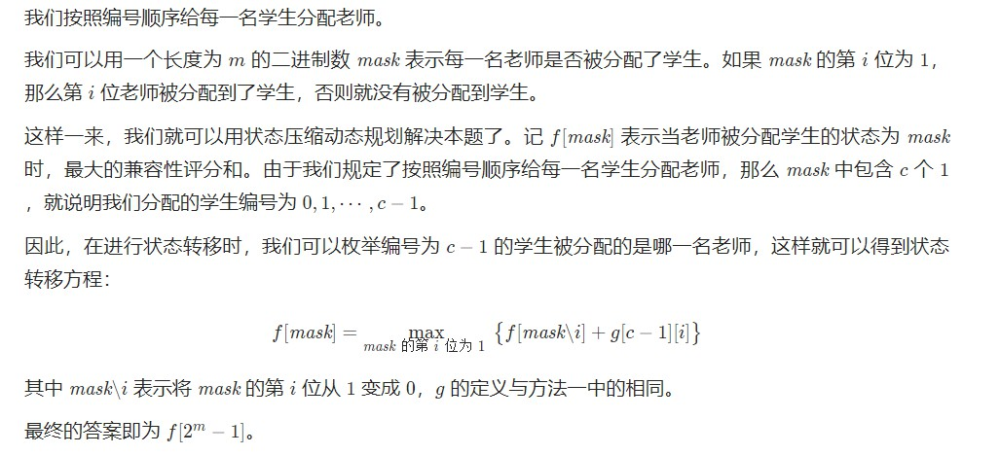

对状态转移方程的理解：mask决定了两个信息，分配的学生个数和可供匹配的老师编号。对于编号c-1学生来说，可供选择的老师编号就是mask二进制为1的位置，所以枚举所有1位置，并将该位置0得到上一个状态 mask\i ，此状态包含学生[0,..,c-2]和不含该位置的c-1个老师。所以状态转移方程为 f[mask] = max(f[mask\i] + g[c - 1][i])


```c++  
class Solution {
public:
    int maxCompatibilitySum(vector<vector<int>>& students, vector<vector<int>>& mentors) {
        int m = students.size();
        int n = students[0].size();
        vector<vector<int>> g(m, vector<int>(m));
        for (int i = 0; i < m; ++i) {
            for (int j = 0; j < m; ++j) {
                for (int k = 0; k < n; ++k) {
                    g[i][j] += (students[i][k] == mentors[j][k]); //i<->j的评分
                }
            }
        }

        vector<int> f(1 << m);  // 固定
        for (int mask = 1; mask < (1 << m); ++mask) {
            int c = __builtin_popcount(mask); // 匹配第
            for (int i = 0; i < m; ++i) {
                // 判断 mask 的第 i 位是否为 1
                if (mask & (1 << i)) {  //由 没选的状态(已经过计算) 转化而来
                    f[mask] = max(f[mask], f[mask ^ (1 << i)] + g[c - 1][i]);
                }
            }
        }
        return f[(1 << m) - 1];
    }
}; 
```


- km
```c++  
class Solution {
public:
  int maxCompatibilitySum(vector<vector<int>>& students, vector<vector<int>>& mentors) {
    int n = students.size();
    vector<vector<int>> c(n, vector(n, 0)); // student[i]与teacher[j]的兼容性
    for (int i = 0; i < n; ++i) {
      for (int j = 0; j < n; ++j) {
        int K = students[i].size();
        for (int k = 0; k < K; ++k) {
          c[i][j] += students[i][k] == mentors[j][k];
        }
      }
    }
    return KM(n, c);
  }

  int KM(int n, vector<vector<int>>& c) {
    vector<int> match(n, -1); // match[i]为teacher[i]匹配的student编号
    vector<int> exStudent(n); // student的期望
    vector<int> exTeacher(n, 0); // teacher的期望
    for (int i = 0; i < n; ++i) {
      exStudent[i] = *max_element(c[i].begin(), c[i].end());
    }
    // 为每个student匹配teacher
    for (int i = 0; i < n; ++i) {
      while(true) {
        vector<bool> visStudent(n, false);
        vector<bool> visTeacher(n, false);
        if (dfs(i, n, c, match, visStudent, visTeacher, exStudent, exTeacher)) break;
        // 无法匹配降低期望
        for (int j = 0; j < n; ++j) {
          if (visStudent[j]) exStudent[j]--;
          if (visTeacher[j]) exTeacher[j]++;
        }
      }
    }

    int ans = 0;
    for (int i = 0; i < n; ++i) {
      ans += c[match[i]][i];
    }
    return ans;
  }

  // 匈牙利算法寻找完美匹配
  bool dfs(int i, int n, vector<vector<int>>& c, vector<int>& match, vector<bool>& visStudent, vector<bool>& visTeacher, vector<int>& exStudent, vector<int>& exTeacher) {
    visStudent[i] = true;
    for (int j = 0; j < n; ++j) {
      if (visTeacher[j]) continue;
      int diff = exStudent[i] + exTeacher[j] - c[i][j];
      if (!diff) {
        visTeacher[j] = true;
        if (match[j] == -1 || dfs(match[j], n, c, match, visStudent, visTeacher, exStudent, exTeacher)) {
          match[j] = i;
          return true;
        }
      }
    }
    return false;
  }
};
```


**困难题**见：

动态规划状压dp部分的
[D-数组的最大与和](https://leetcode-cn.com/problems/maximum-and-sum-of-array/)
(详情见 动态规划状压dp 部分提供六种解法 - 状态DP - 三进制- 最小费用最大流- 模拟退火- 贪心- KM)
[D-两个数组最小的异或值之和](https://leetcode-cn.com/problems/minimum-xor-sum-of-two-arrays/)


# 5 负环


# 6 差分约束

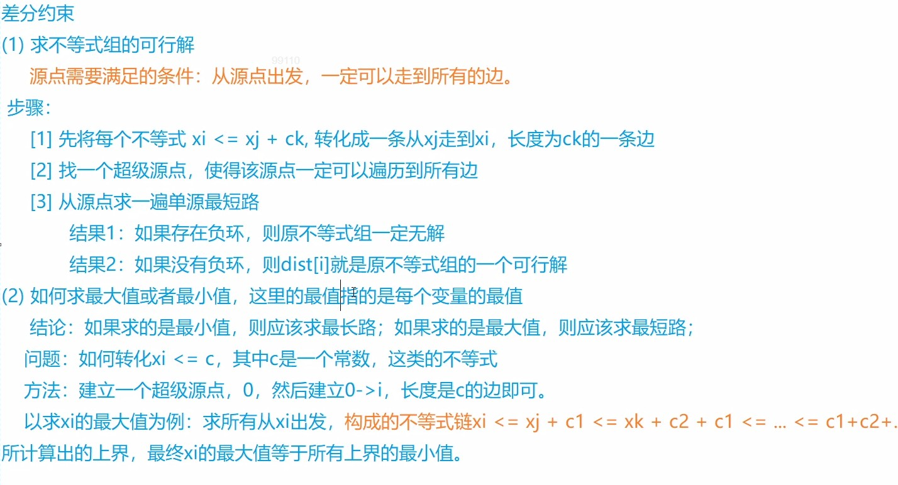

或者参考：

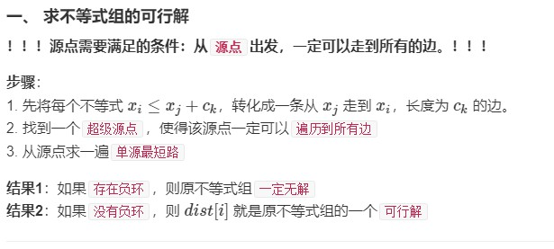
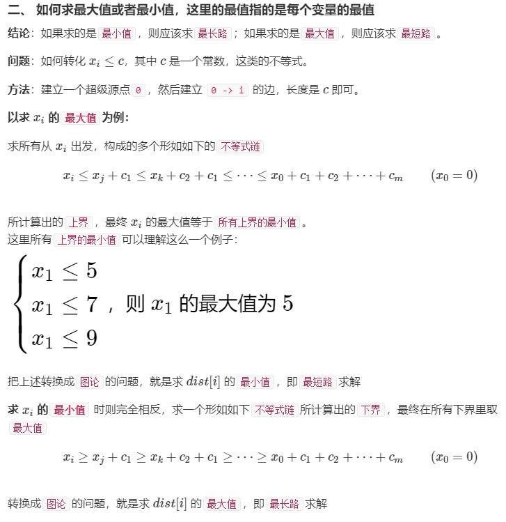

>/*
差分约束两大应用
应用一:
1 求不等式组的可行解
   ⭐源点需要满足的条件: 从源点出发,一定可以走到所有的边
   否则 用单源最短路做的话 有一条边走不到 则该边对应的不等式就无法满足
   某一个点x[i]走不到无所谓(某个点走不到代表它不受限制,x[i]取任意数都可以)
过程:
1 把每个x[i] ≤ x[j] + C[k]不等式转化为一条从x[j]走到x[i]长度为C[k]的边
2 然后在这个图上找一个超级源点,使得该源点一定可以遍历到所有边 
3 从源点求一遍 单源最短路
  3.1 假如存在负环
      x[1]→x[2]→x[3]→x[k]
        ↑ c1   c2   c3 ↓
          ← ← ← ← ← ← 
              ck
    x[2]≤ x[1]+c[1]
         ...
    x[k]≤ x[k-1]+c[k-1]
    x[1]≤ x[k]+c[k]
    对第一个不等式用后面的不等式一直做松弛
    x[2] ≤ x[1]+c[1]
         ≤ x[k]+c[k]+c[1]
         ≤ x[k-1]+c[k-1]+c[k]+c[1]
         ...
         ≤ x[2]+c[2]+...+c[k-1]+c[k]+c[1]
         ≤ x[2]+(小于零的Σc[i])
    x[2] < x[2]
    即矛盾
    得出结论:不等式无解 <=> 存在负环
4 求完单源最短路之后
4.1 存在负环 => 不等式无解
4.2 没有负环 => 求完之后一定是满足这个不等式的 <=> 即一个可行解
x[i] ≤ x[j] + C[k]
  x1 ≤ x2+1
{ x2 ≤ x3+2
  x3 ≤ x1-5
 x1 =  0
 x2 = -1
 x3 = -2
类比最短路
  i→j   求之前 d[j] > d[i]+c 
   c    求完后 d[j] ≤ d[i]+c 
一个图里每个点求完最短距离后每个点的最短距离都有第二个不等式满足
即  任何一个最短路问题 可以 转化为一个差分约束问题
同理  一个差分约束问题 可以 转化为一个单源最短路问题
最长路
   i→j   求之前 d[j] < d[i]+c 
   c     求完后 d[j] ≥ d[i]+c  
应用二:
2 如何求最大值或者最小值(x[i] for i in range(1,n))
    结论1:如果求的是最小值,则应该求最长路,如果求的是最大值,则应该求最短路
    问题1:如何转化x[i] ≤ c 其中c是一个常数 这类的不等式
    方法:建立一个超级源点,0号点x[0],然后建立0→i 长度是c的边即可
         x[i] ≤ c
            <=>
         x[i] ≤ x[0] + c = 0 + c   
    以求x[i]的最大值为例:所有从x[i]出发,构成的不等式链     
    x[i] ≤ x[j] + c[j] 
         ≤ x[k] + c[k] + c[j]
         ≤ x[0] + c[1]+ c[2]+... + c[j] 
         =   0  + c[1]+ ... + c[j] 
    所计算出的上界,
    最终x[i]的最大值
    =所有上界的最小值
    举例 x[i] ≤ 5
         x[i] ≤ 2
         x[i] ≤ 3
         max(x[i]) = min(5,2,3) = 2
    0 → 1 → 3 → 5 → ... → i
      c1  c3  c5       ci-1
    x[1] ≤ x[0] + c[1] 
    x[3] ≤ x[1] + c[3] 
    x[5] ≤ x[3] + c[5]
    ...
    x[i] ≤ x[i-1] + c[i-1]
    则
    x[i] ≤ x[i-1] + c[i] 
         ≤ x[i-3] + c[i-3] + c[i]
         ...
         ≤ x[0] + c[1] + c[3] + c[i-3] + c[i-1]
    ⭐可以发现Σc[i]就是从0→i的一条路径的长度
    那么
        求x[i]最大值
            <=>
        求所有上界的最小值
            <=>
        求所有从0→i的路径和的最小值
            <=>
        最短路求dist[i]
    同理 求x[i]最小值
            <=>
        求所有下界的最大值
            <=>
        求所有从0→i的路径和的最大值
            <=>
        最长路求dist[i]
*/

**注意点**
- 负环 
    - 判断有无
        - cnt计数
- spfa时的 hh==N hh=0;  tt == N, tt =0;  ????
- 是否需要超级源点
    - 是否要创建出来
        - 创建出来 建立边
        - 不创建出来 而是spfa中先把所有点都先入队列
- 问题转化  最大值 最小值 与 最短路 和最长路的关系


**例题**
[糖果](https://www.acwing.com/problem/content/description/1171/)
求最小需要的糖果，即求最长路。
>/*
本题
1 A = B  <=> A≥B B≥A
2 A < B  <=> B≥A+1
3 A≥B    <=> A≥B
4 A > B  <=> A≥B+1
5 B≥A    <=> B≥A
x≥1  
    } x≥x0+1(超级源点x0=0)
x0=1
举例  x[i] ≥ 5
      x[i] ≥ 2
      x[i] ≥ 3
      min(x[i]) = 5
总共最小值 = min(x[i]最小值) for i in range(n)
           = 求x[i]所有下界的最大值
           = 求所有从0→i的路径和的最大值
           = 最长路求dist[i]
0 → 1 → 3 → 5 → ... → i
c1  c3  c5       ci-1
    x[1] ≥ x[0] + c[1] 
    x[3] ≥ x[1] + c[3] 
    x[5] ≥ x[3] + c[5]
    ...
    x[i] ≥ x[i-1] + c[i-1]
    则
    x[i] ≥ x[i-1] + c[i] 
         ≥ x[i-3] + c[i-3] + c[i]
         ...
         ≥ x[0] + c[1] + c[3] + c[i-3] + c[i-1]
 ⭐可以发现Σc[i]就是从0→i的一条路径的长度
    那么 求x[i]最小值
            <=>
        求所有下界的最大值
            <=>
        求所有从0→i的路径和的最大值
            <=>
        最长路求dist[i]
    即：
    if(d[j]<d[i]+w[i][j])
        d[j] = d[i] + w[i][j]
        建立边数
        最坏情况A = B  <=> A≥B B≥A 2条
             +超级源点和所有点xi建边
             =3*n
*/

[区间](https://www.acwing.com/problem/content/364/)
>给定 n 个区间 [ai,bi] 和 n 个整数 ci。
你需要构造一个整数集合 Z，使得 ∀i∈[1,n]，Z 中满足 ai≤x≤bi 的整数 x 不少于 ci 个。
求这样的整数集合 Z 最少包含多少个数。

同样的题目：

见贪心：（数据量 和 数据范围更大， 需要离散。。。）
[LCP 32. 批量处理任务](https://leetcode.cn/problems/t3fKg1/)

思路：
1. 贪心
    - 朴素贪心
    考虑把所有线段按照右端点 b 从小到大排序，依次考虑每一条线段的要求：
        - 如果已经满足要求则跳过
        - 否则尽量选择靠后的数（因为之后的线段的右端点都在这条线段的右边，这样容错更高）
    所以，我们可以建一个数组，d[i] 表示 i 数字是否选择（填11或00），扫一遍 [l,r] 区间求和，然后从后往前贪心放数即可。
    ```c++  
    #include <cstdio>
    #include <iostream>
    #include <algorithm>
    using namespace std;
    const int N = 50005;
    int n, d[N], c[N];
    struct Seg{
        int a, b, c;
        bool operator < (const Seg &x) const {
            return b < x.b;
        }
    }e[N];
    int main() {
        scanf("%d", &n);
        for (int i = 1; i <= n; i++)
            scanf("%d%d%d", &e[i].a, &e[i].b, &e[i].c);
        sort(e + 1, e + 1 + n);
        int ans = 0;
        for (int i = 1; i <= n; i++) {
            int l = e[i].a, r = e[i].b, cnt = e[i].c;
            for (int j = l; j <= r; j++)
                cnt -= d[j];
            if(cnt > 0) {
                for (int j = r; j >= l && cnt; j--)
                    if(!d[j]) cnt--, ans++, d[j] = 1;
            }
        }
        printf("%d\n", ans);
        return 0;
    }
    ```
    - 贪心 + 树状数组优化 + 并查集
        - 考虑用数据结构优化。
          发现我们需要三个操作：
            - 询问 [l,r] 区间的数字个数
            - 将值为 x 的位置 +1
            - 从后往前，找到比当前位置靠前的下一个 0 的位置。
        - 前两个就是 “区间求和，单调修改”，典型的树状数组。O(nlog250000)
        - 第三种操作，可以用并查集优化。为什么可以确保时间复杂度呢？对于每一条线段，最多只有一次会枚举到 1 （即开始的那一次），之后每次枚举都会枚举到 0 的位置，即d[i]=0，然后把它变成 1，而以后就不会访问到了。而一共有 50000 个值，所以复杂度是 O(50000logn)
        ```c++  
        #include <cstdio>
        #include <iostream>
        #include <algorithm>
        using namespace std;
        const int N = 50001;
        int n, d[N], c[N], f[N];
        struct Seg{
            int a, b, c;
            bool operator < (const Seg &x) const {
                return b < x.b;
            }
        }e[N];
        // 树状数组
        int inline ask(int x) {
            int res = 0;
            for (; x ; x -= x & -x) res += c[x];
            return res;
        }

        void inline add(int x) {
            for (; x < N; x += x & -x) c[x]++;
        }
        // 并茶集：find(x) 表示找到 <= x 中最大的一个是 0 的数
        int find(int x) {
            return x == f[x] ? x : f[x] = find(f[x]);
        }
        int main() {
            scanf("%d", &n);
            for (int i = 0; i < N; i++) f[i] = i;
            for (int i = 1; i <= n; i++) 
                scanf("%d%d%d", &e[i].a, &e[i].b, &e[i].c);
            sort(e + 1, e + 1 + n);
            int ans = 0;
            for (int i = 1; i <= n; i++) {
                int l = e[i].a + 1, r = e[i].b + 1, cnt = e[i].c;
                // 取 [l, r] 选了多少个数
                cnt -= ask(r) - ask(l - 1);
                if(cnt > 0) {
                    for (int j = r; j >= l && cnt; ) {
                        // d[j] == 1 的情况每条线段至多出现一次
                        if(!d[j]) {
                            cnt--, ans++, d[j] = 1;
                            // j 被标记成 1 了，要指向 find(j - 1)
                            f[j] = j - 1;
                            // 维护树状数组
                            add(j);
                        };
                        if(find(j) != j) j = f[j];
                        else j--;
                    }
                }
                // cout << cnt << endl;
            }
            printf("%d\n", ans);
            return 0;
        }
        ```
    - 贪心 + 线段树 + 二分
2. 差分约束(求最小值，则求最长路)
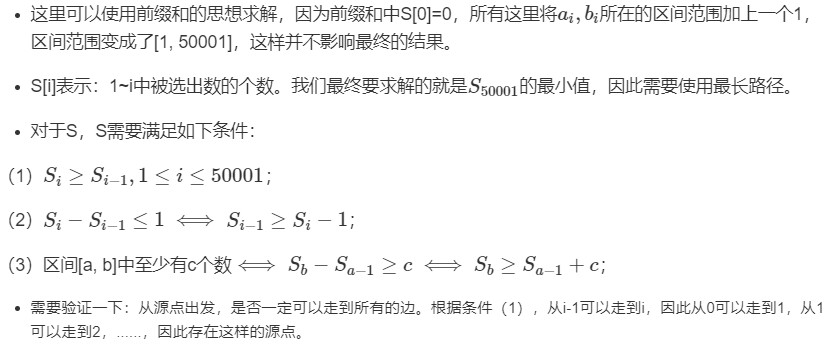


```c++  
#include <iostream>
#include <cstring>
#include <algorithm>
#include <deque>

using namespace std;
const int N = 50010, M = 150010;

int e[M], ne[M], h[N], w[M], idx;
int n;
int dist[N];
bool st[N];
int q[N];

void add(int a, int b, int c){
  e[idx] = b, w[idx] = c, ne[idx] = h[a], h[a] = idx ++;
}

// void spfa()
// {
//     memset(dist, -0x3f, sizeof dist);
//     dist[0] = 0;
//     st[0] = true;
//     int hh = 0, tt = 1;
//     q[0] = 0;

//     while (hh != tt)
//     {
//         int t = q[hh ++ ];
//         // if (hh == N) hh = 0;       //？？？？
//         st[t] = false;

//         for (int i = h[t]; ~i; i = ne[i])
//         {
//             int j = e[i];
//             if (dist[j] < dist[t] + w[i])
//             {
//                 dist[j] = dist[t] + w[i];
//                 if (!st[j])
//                 {
//                     q[tt ++ ] = j;
//                     if (tt == N) tt = 0;   //？？？
//                     st[j] = true;
//                 }
//             }
//         }
//     }
// }


void spfa(){
  memset(dist, -0x3f, sizeof dist);
  dist[0] = 0;
  deque<int> q;
  q.push_back(0);
  st[0] = true;
  while(q.size())
  {
    auto u = q.back();  // back和front都行
    q.pop_back();
    st[u] = false;
    for(int i = h[u]; ~ i; i = ne[i]){
      int j = e[i];
      if(dist[j] < dist[u] + w[i]){
        dist[j] = dist[u] + w[i];
        if(!st[j]){
          q.push_back(j);
          st[j] = true;
        }
      }
    }
  }  
}

int main()
{
  cin >> n;
  memset(h, -1, sizeof h);
  for(int i = 1; i < N; ++ i) add(i, i - 1, -1), add(i - 1, i, 0);
  for(int i = 0; i < n; ++ i){
    int a, b, c;
    cin >> a >> b >> c;
    add(a , b + 1, c);
  }
  spfa();
  cout << dist[50001] << endl;
  return 0;
}
```

[排队布局](https://www.acwing.com/problem/content/1172/)
>当排队等候喂食时，奶牛喜欢和它们的朋友站得靠近些。
农夫约翰有 N 头奶牛编号从 1 到 N，沿一条直线站着等候喂食。
奶牛排在队伍中的顺序和它们的编号是相同的。
因为奶牛相当苗条，所以可能有两头或者更多奶牛站在同一位置上。
如果我们想象奶牛是站在一条数轴上的话，允许有两头或更多奶牛拥有相同的横坐标。
一些奶牛相互间存有好感，它们希望两者之间的距离不超过一个给定的数 L。
另一方面，一些奶牛相互间非常反感，它们希望两者间的距离不小于一个给定的数 D。
给出 ML 条关于两头奶牛间有好感的描述，再给出 MD 条关于两头奶牛间存有反感的描述。
你的工作是：如果不存在满足要求的方案，输出-1；如果 1 号奶牛和 N 号奶牛间的距离可以任意大，输出-2；否则，计算出在满足所有要求的情况下，1 号奶牛和 N 号奶牛间可能的最大距离。

>/*
x[i] 表示 第i头牛位置
以求x[i]的最大值为例:所有从x[i]出发,构成的不等式链     
    x[i] ≤ x[j] + c[j] 
         ≤ x[k] + c[k] + c[j]
         ≤ x[0] + c[1]+ c[2]+... + c[j] 
         =   0  + c[1]+ ... + c[j] 
    所计算出的上界,
    最终x[i]的最大值
    =所有上界的最小值
    举例 x[i] ≤ 5
         x[i] ≤ 2
         x[i] ≤ 3
         max(x[i]) = min(5,2,3) = 2
    0 → 1 → 3 → 5 → ... → i
      c1  c3  c5       ci-1
    x[1] ≤ x[0] + c[1] 
    x[3] ≤ x[1] + c[3] 
    x[5] ≤ x[3] + c[5]
    ...
    x[i] ≤ x[i-1] + c[i-1]
    则
    x[i] ≤ x[i-1] + c[i] 
         ≤ x[i-3] + c[i-3] + c[i]
         ...
         ≤ x[0] + c[1] + c[3] + c[i-3] + c[i-1]
    ⭐可以发现Σc[i]就是从0→i的一条路径的长度
最大位置→不等式上界（小于等于）→上界里的最小值→最短路
  x[i] ≤ x[j] + c      j → i
1 每头奶牛按编号排序 i+1 → i w = 0
  <=> x[i] ≤ x[i+1]
2 两者之间的距离不超过一个给定的数L
  x[b]-x[a] ≤ L        a → b w = L
  x[b] ≤ x[a] + L
3 两者之间的距离不小于一个给定的数D
  x[b]-x[a] ≥ D        
  x[a] ≤ x[b]-D        b → a w = -D
问题1：
因为没有一个点可以无条件到所有点,
所以建超级源点0 从0向
假定所有x[i] ≤ x[0] + 0  从而可以从0向x[i]连一条长度为0的边
1 如果没有负环-有解
2 如果有负环-无解
问题2：
直接把所有点i加入队列 == 创建超级源点0
点1和点n距离是否可以无限大？
则可以把点1固定在一个位置上(选0位置)x[1] = 0,判断x[n]是否可以无限大
即求从1→n的最短路径,由于x[1]取0,则x[n]代表了n和1的最大距离,如果x[n]<INF,说明d[1→n]有限大≤x[n]
所以看x[n]是否是正无穷就可以判断x[n]是否可以无限大
问题3：
链式法则 x[i]最终会小于一个常数c
x[n]-x[1] ≤ ... ≤ c
每一个上界c都对应一条 起点x[1]=0到i的路径
求1与n的距离最大值 == 求所有上界c的最小值 == 求1~n所有路径长度的最小值
*/

总结来看，关系有
```c++  
/*
x_i+1 >= x_i    -> x_i <= x_i+1
x_b - x_a <= L  -> x_b <= x_a + L
x_b - x_a >= D  -> x_a <= x_b - D
*/
```
代码如下：[yxc代码及问答](https://www.acwing.com/activity/content/code/content/153492/)

```c++  
#include <cstdio>
#include <cstring>
#include <iostream>
#include <algorithm>

using namespace std;

const int N = 1010, M = 10000 + 10000 + 1000 + 10, INF = 0x3f3f3f3f;

int n, m1, m2;
int h[N], e[M], w[M], ne[M], idx;
int dist[N];
int q[N], cnt[N];
bool st[N];

void add(int a, int b, int c)
{
    e[idx] = b, w[idx] = c, ne[idx] = h[a], h[a] = idx ++ ;
}

bool spfa(int size)
{
    int hh = 0, tt = 0;
    memset(dist, 0x3f, sizeof dist);
    memset(st, 0, sizeof st);
    memset(cnt, 0, sizeof cnt);

    for (int i = 1; i <= size; i ++ )
    {
        q[tt ++ ] = i;
        dist[i] = 0;
        st[i] = true;
    }

    while (hh != tt)
    {
        int t = q[hh ++ ];
        if (hh == N) hh = 0;
        st[t] = false;

        for (int i = h[t]; ~i; i = ne[i])
        {
            int j = e[i];
            if (dist[j] > dist[t] + w[i])
            {
                dist[j] = dist[t] + w[i];
                cnt[j] = cnt[t] + 1;
                if (cnt[j] >= n) return true;
                if (!st[j])
                {
                    q[tt ++ ] = j;
                    if (tt == N) tt = 0;
                    st[j] = true;
                }
            }
        }
    }

    return false;
}

int main()
{
    scanf("%d%d%d", &n, &m1, &m2);
    memset(h, -1, sizeof h);

    for (int i = 1; i < n; i ++ ) add(i + 1, i, 0);
    while (m1 -- )
    {
        int a, b, c;
        scanf("%d%d%d", &a, &b, &c);
        if (a > b) swap(a, b);
        add(a, b, c);
    }
    while (m2 -- )
    {
        int a, b, c;
        scanf("%d%d%d", &a, &b, &c);
        if (a > b) swap(a, b);
        add(b, a, -c);
    }

    if (spfa(n)) puts("-1");
    else
    {
        spfa(1);
        if (dist[n] == INF) puts("-2");
        else printf("%d\n", dist[n]);
    }

    return 0;
}

```

拓展：[差分约束+二分:雇佣收银员](https://www.acwing.com/problem/content/395/)


*参考：*

[Acticle:差分约束](https://www.cnblogs.com/zzz-hhh/p/11200893.html)
[差分约束复习](https://www.acwing.com/blog/content/1740/)


# 7 LCA问题

**最近公共祖先LCA问题**

[LCA总结](https://leetcode-cn.com/circle/article/q7f5cc/#%E5%9F%BA%E6%9C%AC%E6%A6%82%E5%BF%B5)
方法：
1. 向上标记法 O(n)
2. 倍增法 O(nlog(n))
3. 线段树或者RMQ
4. Tarjan (可用于离线）O(m+n)


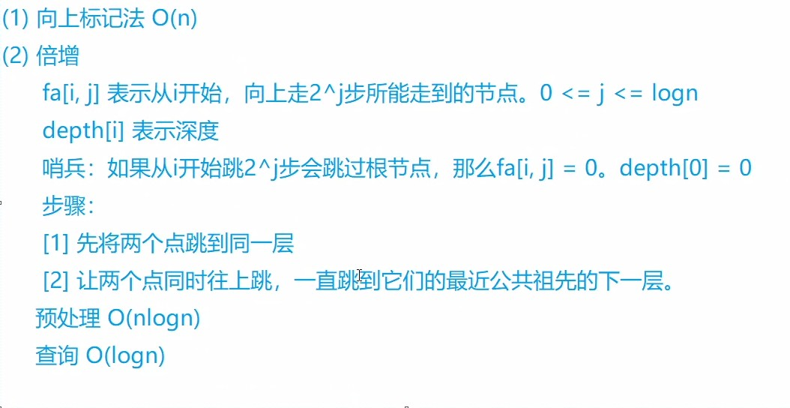


总结：
对于单次询问的LCA，单次询问怎么都卡不到时间复杂度。只有多次询问的LCA才有意义。
说一下q次询问的LCA问题：

无论是朴素还是倍增还是离线tarjan都需要前序知识就是DFS。

朴素做法，预处理节点深度O(V+E), 对于每次询问让深层次的节点跳到和另外一个层次相同，然后同上一步一步上跳。q次询问总体复杂度是O(qn)

倍增是基于朴素升级的，同样先预处理对于每次询问让深层次的节点跳到和另外一个层次相同，然后一起倍增往高处跳，f[x][i] = f[f[x][0]][i-1];对于跳2^i可以先跳一半到祖先节点然后在从祖先跳一半上去。最后答案就是f[x][0]; q次询问下来时间复杂度就是O(max(q,n) * logn)

线段树或者RMQ解决多次查询，线段树是在线询问问题的克星。先DFS得到一个DFS序列O(V+E)，然后利用RMQ或者线段树预处理DFS序O(nlogn)，对于每次询问直接获取这两个节点之间DFS序的最小值就是LCA。时间复杂度同上

tarjan的离线做法了，这种一次性记录需要查询的序列对，然后依次tarjan直接得到所有的需要查询的答案。时间复杂度是O(V+E)。

对于LCA一般选择倍增是比较好的，又快又准。不需要离线直接在线倍增就行。而线段树在这里是大材小用了。tarjan的强项也不在这里，tarjan是强连通，割边，割点....问题的最优解。


## 1 向上标记法

>
            o
            / \
        o   o
        / \
        o   .
        / \
    .   o
            o
            / \
        .   o
        / \
        o   .
        / \
    .   o
    方法1 向上标记法 O(n)
            o
            ↗ \
        .    o
        ↗ \
        o   .
    ↗ \   2
    .   o
    1
    步骤
    1 先从点1往上走到根节点,走过的点都标记
    2 再从点2往上走,碰到的第一个带标记的点就是最近公共祖先


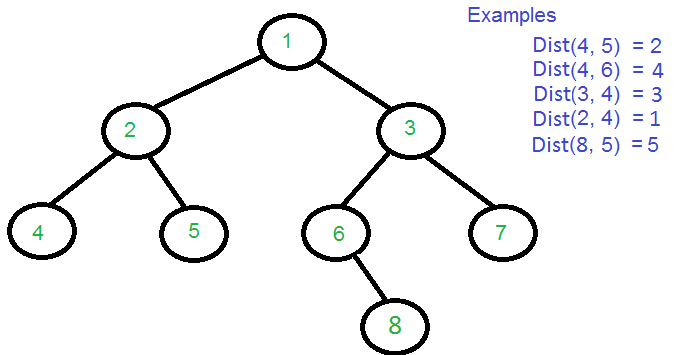

分析：
假设给定的节点为node1,node2,可以分为下面的两种情况：
1）node1是node2的祖先节点或孩子结点，可以理解为两个节点在一条线上。例如：Dist(2,4),Dist(6,1)
2）node1和node2没有直接或间接的父子关系。例如，Dist(4,3)，他们需要一个共同的祖先结点1连接起来
假设lca是两个节点的最低公共祖先节点：
Dist(n1,n2)=Dist(root,n1)+Dist(root,n2)-2*Dist(root,lca)
这个公式已经涵盖了上面的两种情况。先找出lca,再求root节点到某个节点的距离就比较简单了。

>
            o
            / \
        o   o
        / \
        o   .
        / \
    .   o
            o
            / \
        .   o
        / \
        o   .
        / \
    .   o
    方法1 向上标记法 O(n)
              o
            ↗ \
        .    o
        ↗ \
        o   .
    ↗ \   2
    .   o
    1
    步骤
    1 先从点1往上走到根节点,走过的点都标记
    2 再从点2往上走,碰到的第一个带标记的点就是最近公共祖先


```c++  
class Solution {
public:
    unordered_map<int, TreeNode*> fa;
    unordered_map<int, bool> vis;
    void dfs(TreeNode* root){
        if (root->left != nullptr) {
            fa[root->left->val] = root;
            dfs(root->left);
        }
        if (root->right != nullptr) {
            fa[root->right->val] = root;
            dfs(root->right);
        }
    }
    TreeNode* lowestCommonAncestor(TreeNode* root, TreeNode* p, TreeNode* q) {
        fa[root->val] = nullptr;
        dfs(root);
        while (p != nullptr) {
            vis[p->val] = true;
            p = fa[p->val];
        }
        while (q != nullptr) {
            if (vis[q->val]) return q;
            q = fa[q->val];
        }
        return nullptr;
    }
};

```


## 2 递归法

这个问题可以分为三种情况来考虑：
情况一：root未知，但是每个节点都有parent指针
此时可以分别从两个节点开始，沿着parent指针走向根节点，得到两个链表，然后求两个链表的第一个公共节点，这个方法很简单，不需要详细解释的。

情况二：节点只有左、右指针，没有parent指针，root已知
思路：有两种情况，一是要找的这两个节点（a, b），在要遍历的节点（root）的两侧，那么这个节点就是这两个节点的最近公共父节点；
二是两个节点在同一侧，则 root->left 或者 root->right 为 NULL，另一边返回a或者b。那么另一边返回的就是他们的最小公共父节点。
递归有两个出口，一是没有找到a或者b，则返回NULL；二是只要碰到a或者b，就立刻返回。


// 二叉树结点的描述  

```c++  
struct TreeNode {
    int val;
    TreeNode *left;
    TreeNode *right;
    TreeNode(int x) : val(x), left(NULL), right(NULL) {}
};
```

```c++  
// 节点只有左指针、右指针，没有parent指针，root已知


/**
注意p,q必然存在树内, 且所有节点的值唯一!!!
递归思想, 对以root为根的(子)树进行查找p和q, 如果root == null || p || q 直接返回root
表示对于当前树的查找已经完毕, 否则对左右子树进行查找, 根据左右子树的返回值判断:
1. 左右子树的返回值都不为null, 由于值唯一左右子树的返回值就是p和q, 此时root为LCA
2. 如果左右子树返回值只有一个不为null, 说明只有p和q存在与左或右子树中, 最先找到的那个节点为LCA
3. 左右子树返回值均为null, p和q均不在树中, 返回null
**/

class Solution {
public:
    TreeNode* lowestCommonAncestor(TreeNode* root, TreeNode* p, TreeNode* q) {
        if(root == nullptr || root == p || root == q ) return root;  //
        TreeNode* lson = lowestCommonAncestor(root->left, p, q);
        TreeNode* rson = lowestCommonAncestor(root->right, p, q);
        if(lson && rson) return root;
        return lson ? lson : rson;
    }
};
``` 


情况三： 二叉树是个二叉查找树，且root和两个节点的值(a, b)已知

```c++  
// 二叉树是个二叉查找树，且root和两个节点的值(a, b)已知
BinaryTreeNode* findLowestCommonAncestor(BinaryTreeNode* root , BinaryTreeNode* a , BinaryTreeNode* b)
{
	char min  , max;
	if(a->data < b->data)
		min = a->data , max = b->data;
	else
		min = b->data , max = a->data;
	while(root)
	{
		if(root->data >= min && root->data <= max)
			return root;
		else if(root->data < min && root->data < max)
			root = root->rchild;
		else
			root = root->lchild;
	}
	return NULL;
}
```


一般情况：
dfs

[二叉树的最近公共祖先](https://leetcode.cn/problems/lowest-common-ancestor-of-a-binary-tree/)

>给定一个二叉树, 找到该树中两个指定节点的最近公共祖先。
最近公共祖先的定义为：“对于有根树 T 的两个节点 p、q，最近公共祖先表示为一个节点 x，满足 x 是 p、q 的祖先且 x 的深度尽可能大（一个节点也可以是它自己的祖先）。”
示例 1：
输入：root = [3,5,1,6,2,0,8,null,null,7,4], p = 5, q = 1
输出：3
解释：节点 5 和节点 1 的最近公共祖先是节点 3 。
示例 2：
输入：root = [3,5,1,6,2,0,8,null,null,7,4], p = 5, q = 4
输出：5
解释：节点 5 和节点 4 的最近公共祖先是节点 5 。因为根据定义最近公共祖先节点可以为节点本身。
示例 3：
输入：root = [1,2], p = 1, q = 2
输出：1
提示：
树中节点数目在范围 [2, 105] 内。
-109 <= Node.val <= 109
所有 Node.val 互不相同 。
p != q
p 和 q 均存在于给定的二叉树中。

解：
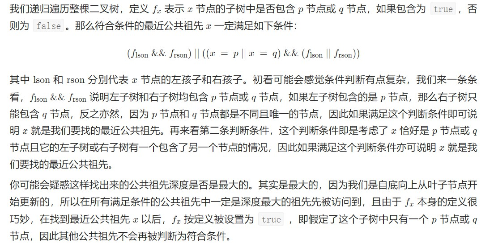

```c++  
class Solution {
public:
    TreeNode* ans;
    bool dfs(TreeNode* root, TreeNode* p, TreeNode* q) {
        if (root == nullptr) return false;
        bool lson = dfs(root->left, p, q);
        bool rson = dfs(root->right, p, q);
        if ((lson && rson) || ((root->val == p->val || root->val == q->val) && (lson || rson))) {
            ans = root;
        } 
        return lson || rson || (root->val == p->val || root->val == q->val);
    }
    TreeNode* lowestCommonAncestor(TreeNode* root, TreeNode* p, TreeNode* q) {
        dfs(root, p, q);
        return ans;
    }
};  
```

更简洁啊：


```c++  
class Solution {
public:
    TreeNode* lowestCommonAncestor(TreeNode* root, TreeNode* p, TreeNode* q) {
        if(root == nullptr || root == p || root == q ) return root;  //
        TreeNode* lson = lowestCommonAncestor(root->left, p, q);
        TreeNode* rson = lowestCommonAncestor(root->right, p, q);
        if(lson && rson) return root;
        return lson ? lson : rson;
    }
};
```


**应用**
- 二叉树中两个节点的距离 
    - d(x) 为 x 到根节点距离
    - d(x,y) = d(x) + d(y) - 2 * d(lca)
- 二叉树中两个节点间的路径  
    - [M-从二叉树一个节点到另一个节点每一步的方向](https://leetcode-cn.com/problems/step-by-step-directions-from-a-binary-tree-node-to-another/)


## 3 倍增法
[祖孙询问(树上倍增LCA)](https://www.acwing.com/solution/content/20554/)

>方法2 倍增法 预处理(nlogn) + 查询(logn)
    ⭐关键是理解二进制拼凑  在这里是怎么体现的
    即 x,y从同一高度同时起跳后,在f[x][0]!=f[y][0] 的约束下 我们能跳的最多的步数跳完后 x,y就达到了LCA的下面一层 
    假定我们知道 x,y出发点为第1层 
                LCA下一层为第12层
    那么最多能跳的步数t = 12-1 = 11 = (1011)2 = 最多能跳2^3 + 2^2 + 2^0 步
    所以我们就通过从大到小枚举k使得我们刚好跳11步而不能跳超过12步
    但实际上我们并不知道要跳11步,所以我们可以通过f[x][0]!=f[y][0]的约束来实现
    即f[x][总共>=12步] = f[y][总共>=12步] 那就不跳(不拼凑2^k)
    f[x][总共<12步] != f[y][总共<12步] 那就跳(拼凑2^k)

    预处理出每个点向上走2^k步的节点的父亲是谁
    f[i][j] 从i开始向上走2^j步所能走到的节点 0<=j<=logn
            1
            / \
        2   3
        / \
        4   5
        / \
    6   7
    f[6][0] = 4
    f[6][1] = 2
    f[6][2] = 空集
    j=0 f[i][j] = i的父节点
    j>0 f[i][j-1]
    i  →  mid  →  t
    2^j-1  2^j-1
    f[i][j-1] f[i][j]
    mid = f[i][j-1]  
    t = f[i][j]
    则f[i][j] = f[mid][j-1] = f[f[i][j-1]][j-1]
    depth[i]表示深度/层数
            1
            / \
        2   y
        / \
        4   5
        / \
    x   7

        步骤1  把两个点跳到同一层 把x跳到和y同一层

        二进制拼凑 2^0 ~ 2^k   t
            举例  2^0 ~ 2^4   11                
                1 2 4 8 16   11              二进制
                            16>11              0
                            8<11 t = 11-8 = 3  1
                            4>3                0
                            2<3  t = 3-2 = 1   1
                            1>=1       t = 1   1
            二进制 (1011)2
            depth(x) - depth(y)
        从x跳到y
        从x跳2^k步后的点的深度 depth(f[x][k]) >= depth(y)时 就可以继续跳

        步骤2 在depth(x)==depth(y)后  一起往上跳2^k(for k in [log(n),1]
        情况1 x==y 则该点就是x和y的最近公共祖先
        情况2 x!=y 即他俩同层但不同
                则继续让两个点同时往上跳 一直跳到它们的最近公共祖先的下一层
                    1        1
                    / \      / \
                2   y    x   y
                / \      / \
                4   5    4   5
                / \      / \
            x   7    6   7
                why 最近公共祖先的下一层 not 最近公共祖先？
                方便判断
                假如f[x][k] == f[y][k] <=> f[x][k] or f[y][k]是x和y的一个公共祖先 但不一定是最近的
                举个栗子
                此时f[x][1] == f[y][1] = 节点2 是x和y的一个公共祖先 但不是最近公共祖先4
                ,但由于我们是从大到小拼凑的,假如拼凑终止条件为f[x][k] == f[y][k]
                ,则此时会停在公共祖先2而非最近公共祖先4
                    1        
                    / \      
                2   3    
                / \      
                4   5   
                / \  /   
            x  y 8

     步骤一 x先到y同一层 f[x][0]!=f[x][0] 且把k能填1的都填完了

        加上约束 f[x][k] != f[y][k]
    思考一下为啥: 因为第一个出现f[x][k] == f[y][k]的节点只是公共祖先却不能保证是最近公共祖先
    所以只要 f[x][k] != f[y][k]
        那么 x y就还没跳到过最近公共祖先,而在其下面层 
    从大往小枚举k
    枚举过程中
        只要 f[x][k] != f[y][k]
        那么 x y就还没跳到过最近公共祖先,而在其下面层,则x,y更新为f[x][k] f[y][k]
    这个过程中 f[x][k] == f[y][k]时
        不执行跳2^k步跳到 f[y][k] 的操作
    直到k枚举完为止 
    枚举完之后就走到了最近公共祖先的下一层
    二进制拼凑 2^0 ~ 2^k   t
        这里的k最大为logn   
        t为 x和y达到同一高度(depth(起始)) - 最近公共祖先下一层深度-1(depth(祖先)-1)

     举例  2^0 ~ 2^4     2                
          1 2 4 8 16     2             二进制
                         16>2               0
                         8>2                0
                         4>2                0
                         2=2  t = 2-2 = 0   1
                         1>0                0
             1        
            / \      
           2   3    
          / \   \   
         4   5   8
        / \       \
       x   7       9
             1      \  
            / \      y
           2   3    
          /  \  \     
         4    5  8
        / \       \
       x  7        y
       在这个例子里 k=4  t=2(4(x,y出发层)-2(LCA下一层))[通过f[x][k] != f[y][k]约束]
             1       
            / \      
           x   y    
          /  \  \     
         4    5  8
        / \       \
       6  7        9
   此时它们的最近公共祖先就是x or y往上跳一步
   即LCA  = f[x][0] or f[y][0]
*/

**做法：**
先预处理出每个点的深度（dfs或bfs），以及跳2i个祖先后所在的位置（fa[i][j]表示第i个点跳2j个祖先后的位置，再递推）；
然后同理暴力，先把两点跳到同一深度（也用倍增），每次跳2i个祖先，判断是否相等，如果相等就不跳（原因见易错点），否则跳；

难点：
1、递推时方程为fa[i][j]=fa[fa[i][j-1]][j-1]，因为i跳2j个祖先后所在的位置等于i连跳两次2j−1个祖先后所在的位置；
2、递推时，j先扫1到20，i再扫1到n，因为每次更新f[i][j]要用到另外的位置跳2j−1个祖先后所在的位置；
3、两个点跳的时候，如果相等，是不能直接输出的，有可能跳过头，就不是最近的公共祖先了；
4、每次读进来的边要存两次（树是无向图），同理，邻接表的数组也要开两倍长；


```c++
#include<iostream>
#include<cstring>
#include<algorithm>
#include<queue>

using namespace std;

const int N = 40010, M = N * 2;

int n, m;
int h[N], e[M], ne[M], idx;
int depth[N], fa[N][16];//往上跳2^k步后的父亲节点
int q[N];

void add(int a, int b)
{
    e[idx] = b;
    ne[idx] = h[a];
    h[a] = idx ++;
}

void bfs(int root)//宽搜不容易因为递归层数过多爆栈
{
    memset(depth,0x3f,sizeof depth);
    // 哨兵depth[0] = 0: 如果从i开始跳2^j步会跳过根节点 
    // fa[fa[j][k-1]][k-1] = 0
    // 那么fa[i][j] = 0 depth[fa[i][j]] = depth[0] = 0
    depth[0] = 0,depth[root] = 1;
    queue<int> q;
    q.push(root);
    while(q.size())
    {
        int t = q.front();
        q.pop();
        for(int i=h[t];i!=-1;i=ne[i])
        {
            int j = e[i];
            if(depth[j]>depth[t]+1)//说明j还没被搜索过
            {
                depth[j] = depth[t]+1;
                q.push(j);//把第depth[j]层的j加进队列
                fa[j][0] = t;//j往上跳2^0步后就是t
                /*
                i  →  mid  →  t
                  2^j-1  2^j-1
                  f[i][j-1] f[i][j]
                mid = f[i][j-1]  
                t = f[i][j]
                则f[i][j] = f[mid][j-1] = f[f[i][j-1]][j-1]
                */
                for(int k=1;k<=15;k++)
                {
                    fa[j][k] = fa[fa[j][k-1]][k-1];
                }
                /*
                举个例子理解超过根节点是怎么超过的
                因为我们没有对根节点fa[1][0]赋值,那么fa[1][0] = 0;
                    1
                   / \
                  2   3 
                fa[1][0] = 0;
                fa[2][0] = 1;
                fa[2][1] = fa[fa[2][0]][0] = fa[1][0] = 0;
                */
            }
        }
    }
}

int lca(int a, int b)
{
    // 为方便处理 当a在b上面时 把a b 互换  
    if (depth[a] < depth[b]) swap(a, b);
    //把深度更深的a往上跳到b
    for (int k = 15; k >= 0; k -- )
        //当a跳完2^k依然在b下面 我们就一直跳
        //二进制拼凑法
        //这里因为
        if (depth[fa[a][k]] >= depth[b])
            a = fa[a][k];
    //如果跳到了b
    if (a == b) return a;
    //a,b同层但不同节点
    for (int k = 15; k >= 0; k -- )
        // 假如a,b都跳出根节点,fa[a][k]==fa[b][k]==0 不符合更新条件
        if (fa[a][k] != fa[b][k])
        {
            a = fa[a][k];
            b = fa[b][k];
        }
    //循环结束 到达lca下一层
    //lca(a,b) = 再往上跳1步即可
    return fa[a][0];
}

int main()
{
    cin >> n;
    int root = 0;
    memset(h, -1, sizeof h);

    for (int i = 0; i < n; i ++ )
    {
        int a, b;
        cin >> a >> b;
        if (b == -1) root = a;
        else add(a, b), add(b, a);
    }

    bfs(root);//建fa[i][j]

    scanf("%d", &m);
    while (m -- )
    {
        int a, b;
        cin >> a >> b;
        int p = lca(a, b);
        if (p == a) cout << "1" << endl;
        else if (p == b) cout << "2" << endl;
        else cout << "0" << endl;
    }
    return 0;
}
```


## 4 Tarjan
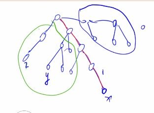

[Article:距离(tarjan求lca)](https://www.acwing.com/solution/content/24569/)


Trajan 离线算法O(n + m);
在线做法：边读边做
离线做法：先读完，再全部处理，最后全部输出。

Tarjon本质就是对向上标记法的一个优化，任取一个节点当成根节点进行dfs优先遍历，把所有节点分成三部分
1）已经遍历并且回溯的标记成2
2）正在遍历的没有回溯的标记成1
3）未遍历的标记成0
其中所有2号点和正在搜索的1号点路径中已经通过并查集合并成一个集合
1、先求出所有点到根结点的距离depth[]，设x号点和y号点的最近公共祖先是p,则x和y的最近距离等于depth[x] + depth[y] - 2 * depth[p]

2、在深度优先遍历1号点中的u点的时候，需要把u的查询的另外一个点的最短距离进行计算并存储，最后把u点合并到上一结点的集合。
注意：顺序一定不能乱。
1）当这个点遍历子节点后的时候把子节点的祖宗更新成当前点
2）只有当前点回溯的时候才可以用这个点来计算所有之前为2的点，因为如果当前点为a,而b是a这条路径的上的点，并且b在a的下面，那么因为b先回溯，所以要等b回溯了之后才能正确的判断a.
3)加入询问的时候要加入两次
num[a].push_back = {b, i}, num[b].push_back(a, i}; 


[距离](https://www.acwing.com/problem/content/description/1173/)

>给出 n 个点的一棵树，多次询问两点之间的最短距离。
注意：
边是无向的。
所有节点的编号是 1,2,…,n。
输入格式
第一行为两个整数 n 和 m。n 表示点数，m 表示询问次数；
下来 n−1 行，每行三个整数 x,y,k，表示点 x 和点 y 之间存在一条边长度为 k；
再接下来 m 行，每行两个整数 x,y，表示询问点 x 到点 y 的最短距离。
树中结点编号从 1 到 n。


```c++  
*/
#include <cstdio>
#include <cstring>
#include <iostream>
#include <algorithm>
#include <vector>
using namespace std;

typedef pair<int, int> PII;

const int N = 10010, M = N * 2;

int n, m;
int h[N], e[M], w[M], ne[M], idx;
int dist[N];//每个点和1号点的距离
int p[N];
int res[M];
int st[N];
vector<PII> query[N];//把询问存下来   
// query[i][first][second] first存查询距离i的另外一个点j，second存查询编号idx

void add(int a,int b,int c)
{
    e[idx] = b;
    ne[idx] = h[a];
    w[idx] = c;
    h[a] = idx++;
}

int find(int x)
{
    if(p[x]!=x)p[x] = find(p[x]);
    return p[x];
}

void dfs(int u,int fa)
{
    for(int i=h[u];~i;i=ne[i])
    {
        int j = e[i];
        if(j==fa) continue;
        dist[j] = dist[u]+w[i];
        dfs(j,u);
    }
}

void tarjan(int u)
{
    st[u]=1;//当前路径点标记为1
    // u这条路上的根节点的左下的点用并查集合并到根节点
    for(int i = h[u];~i;i=ne[i])
    {
        int j = e[i];
        if(!st[j])
        {
            tarjan(j);//往左下搜
            p[j] = u;//从左下回溯后把左下的点合并到根节点
        }
    }
    // 对于当前点u 搜索所有和u
    for(auto item:query[u])
    {
        int y = item.first,id = item.second;
        if(st[y]==2)//如果查询的这个点已经是左下的点(已经搜索过且回溯过,标记为2)
        {
            int anc = find(y);//y的根节点
            // x到y的距离 = d[x]+d[y] - 2*d[lca] 
            res[id] = dist[u]+dist[y] - dist[anc]*2;//第idx次查询的结果 res[idx]
        }
    }
    //点u已经搜索完且要回溯了 就把st[u]标记为2 
    st[u] = 2;
}

int main()
{
    cin >> n >> m;
    // 建图
    memset(h,-1,sizeof h);
    for(int i=0;i<n-1;i++)
    {
        int a,b,c;
        cin >> a >> b >> c;
        add(a,b,c),add(b,a,c);
    }

    // 存下询问
    for(int i=0;i<m;i++)
    {
        int a,b;
        cin >> a >> b;
        if(a!=b)
        {
            query[a].push_back({b,i});
            query[b].push_back({a,i});
        }
    }
    for(int i=1;i<=n;i++)p[i] = i;

    dfs(1,-1);
    tarjan(1);
    for(int i=0;i<m;i++)cout << res[i] << '\n';//把每次询问的答案输出
    return 0;
}

```


---

*以下尚未整理*

# 有向图的强连通分量

tarjan


# 无向图的双连通分量


# 欧拉回路和欧拉路径

## 基础

**欧拉通路与欧拉回路**

**欧拉通路**： 对于图G来说，如果存在一条通路包含G中所有的边，则该通路成为欧拉通路，也称欧拉路径。
**欧拉回路**： 如果欧拉路径是一条回路，那么称其为欧拉回路。
**欧拉图** ： 含有欧拉回路的图是欧拉图。


对无向图G和有向图H：
图G存在欧拉路径与欧拉回路的**充要条件**分别是：
**欧拉路径**： 图中所有奇度点的数量为0或2。
**欧拉回路**： 图中所有点的度数都是偶数。

图H存在欧拉路径和欧拉回路的**充要条件**分别是：
**欧拉路径**： 所有点的入度等于出度 **或者** 存在一点出度比入度大1(起点)，一点入度比出度大1(终点)，其他点的入度均等于出度。
**欧拉回路**：所有点的入度等于出度。


例题：

[欧拉回路](https://www.acwing.com/problem/content/1186/)

>给定一张图，请你找出欧拉回路，即在图中找一个环使得每条边都在环上出现恰好一次。
输入格式
第一行包含一个整数 t，t∈{1,2}，如果 t=1，表示所给图为无向图，如果 t=2，表示所给图为有向图。
第二行包含两个整数 n,m，表示图的结点数和边数。
接下来 m 行中，第 i 行两个整数 vi,ui，表示第 i 条边（从 1 开始编号）。
如果 t=1 则表示 vi 到 ui 有一条无向边。
如果 t=2 则表示 vi 到 ui 有一条有向边。
图中可能有重边也可能有自环。
点的编号从 1 到 n。
输出格式
如果无法一笔画出欧拉回路，则输出一行：NO。
否则，输出一行：YES，接下来一行输出 任意一组 合法方案即可。
如果 t=1，输出 m 个整数 p1,p2,…,pm。令 e=|pi|，那么 e 表示经过的第 i 条边的编号。如果 pi 为正数表示从 ve 走到 ue，否则表示从 ue 走到 ve。
如果 t=2，输出 m 个整数 p1,p2,…,pm。其中 pi 表示经过的第 i 条边的编号。
数据范围
1≤n≤105,
0≤m≤2×105
输入样例1：
1
3 3
1 2
2 3
1 3
输出样例1：
YES
1 2 -3
输入样例2：
2
5 6
2 3
2 5
3 4
1 2
4 2
5 1
输出样例2：
YES
4 1 3 5 2 6


解：
- dfs

根据**欧拉回路**判断的**充要条件**(所有点的入度等于出度)，可以判定一个图是否是欧拉图，之后，我们可以利用dfs来找到一条欧拉回路：

以无向图为例，因为每个点的度都为偶数，所以我们从任意一个点出发，假设所有点的度数都为2，那么dfs一定会回到起点，从而形成一个回路(如果度数都为2，那么现在就是一条欧拉回路)，假设度数不全为2，有4,6,8...那么在dfs过程中，当走到这些点(假设走到点u)上时，可能会走到其他环上，但是由于度数是偶数，所以如果走到其他环上，最后也会回到点u，在dfs过后，一定会形成许多环，环与环之间有一个交点(在图中两个环可能有两个交点，但在dfs过程中只会选择一条边去走，所以这个”交点”的意义要分清楚)，在回溯过程中将这些点添加到答案中，就是一条欧拉回路。
有向图同理。

```c++  
#include <iostream>
#include <cstdio>
#include <cstring>
#include <algorithm>

using namespace std;

const int N = 100100, M = 400100;

int h[N],e[M],ne[M],idx;
int ans[N*2],cnt;
bool used[M];
int din[N],dout[N];
int n,m,ver;

void add(int a,int b){
    e[idx] = b,ne[idx] = h[a],h[a] = idx++;
}

void dfs(int u){
    for(int &i = h[u]; ~i; ){
        if(used[i]){  //如果这条边用过了
            i = ne[i];   //删除这条边
            continue;
        }

        used[i] = true;  //标记这条边已使用
        if(ver == 1) used[i^1] = true;   //如果是无向图，那么这条边的反向边也要标记使用过了

        int t;
        if(ver == 1){
            t = i/2 + 1;
            if(i&1) t = -t;  //(0,1) (2,3) (4,5) 奇数编号是返回的边

        }else t = i+1;

        int j = e[i];
        i = ne[i];
        dfs(j);
        ans[cnt++] = t;
    }
}
int main()
{
    scanf("%d%d%d",&ver,&n,&m);
    memset(h,-1,sizeof h);

    for(int i = 0; i<m; i++){
        int a,b;
        scanf("%d%d",&a,&b);
        add(a,b);
        if(ver == 1) add(b,a);  //无向边
        din[b]++, dout[a]++;   
    }

    if(ver == 1){
        for(int i = 1; i<=n; i++){
            if(din[i]+dout[i] &1){
                //无向图含欧拉回路的充要条件是每个点的度都为偶数
                puts("NO");
                return 0;
            }
        }
    }else{
        for(int i = 1; i<=n; i++){
            if(din[i] != dout[i]){
                //有向图含欧拉回路的充要条件是每个点的入度等于出度
                puts("NO");
                return 0;
            }
        }
    }

    for(int i = 1; i<=n; i++){
        if(~h[i]) {
            dfs(i);
            break;
        }
    }

    if(cnt < m){
        puts("NO");
        return 0;
    }

    puts("YES");
    for(int i = cnt-1; i>=0; --i){
        cout<<ans[i]<<" ";
    }
    return 0;
}

```


## Hierholzer 算法
求欧拉通路、回路(节点)或欧拉路径(边)
Hierholzer 算法流程如下：

从起点出发，进行深度优先搜索。
每次沿着某条边从某个顶点移动到另外一个顶点的时候，都需要删除这条边（灵魂）。
如果没有可移动的路径，则将所在节点加入到结果中，并返回。
当我们顺序地考虑该问题时，我们也许很难解决该问题，因为我们无法判断当前节点的哪一个分支是「死胡同」分支。

不妨倒过来思考。我们注意到只有那个入度与出度差为 1 的节点会导致死胡同。而该节点必然是最后一个遍历到的节点。我们可以改变记录的规则，当我们遍历完一个节点所连的所有节点后，我们才将该节点记录（即逆序）。

对于当前节点而言，从它的每一个**非「死胡同」分支**出发进行深度优先搜索，都将**会**搜回到当前节点。

而从它的**「死胡同」分支**出发进行深度优先搜索将**不会**搜回到当前节点。

也就是说**当前节点的死胡同分支将会优先于其他非「死胡同」分支 记录**。
（因为如果是非死胡同分支，会再回到当前节点，只要当前节点还有其他分支，则不会入栈记录。 只有当分支为 死胡同分支时，才可能让 剩余分支数 减到0.）
这样就能保证我们可以「一笔画」地走完所有边，最终的记录结果逆序地保存了「一笔画」的结果。我们只要将结果中的内容反转，即可得到答案。

模版有四步：

1.**建**邻接表、入度表、出度表
2.根据是通路还是回路判断是否要找**起点**start
3.**Hierholzer 算法**找路
4.最后将上一步找的路再**逆**回来


例题：
[重新安排行程](https://leetcode.cn/problems/reconstruct-itinerary/)
[合法重新排列数对](https://leetcode.cn/problems/valid-arrangement-of-pairs/)
[破解保险箱](https://leetcode.cn/problems/cracking-the-safe/)

对于：
[重新安排行程](https://leetcode.cn/problems/reconstruct-itinerary/)
>给你一份航线列表 tickets ，其中 tickets[i] = [fromi, toi] 表示飞机出发和降落的机场地点。请你对该行程进行重新规划排序。

所有这些机票都属于一个从 JFK（肯尼迪国际机场）出发的先生，所以该行程必须从 JFK 开始。如果存在多种有效的行程，请你按字典排序返回最小的行程组合。

例如，行程 ["JFK", "LGA"] 与 ["JFK", "LGB"] 相比就更小，排序更靠前。
假定所有机票至少存在一种合理的行程。且所有的机票 必须都用一次 且 只能用一次。


```c++  
class Solution {
    unordered_map<string, priority_queue<string, vector<string>, greater<string>>> vec;
    vector<string> stk;
    void dfs(const string& cur){
        while(vec.count(cur) &&  vec[cur].size() > 0){
            string tt = vec[cur].top(); vec[cur].pop();
            dfs(move(tt));
        }
        stk.emplace_back(cur);
    }
public:
    vector<string> findItinerary(vector<vector<string>>& tickets) {
        for(auto & it : tickets){
            vec[it[0]].emplace(it[1]);
        }
        dfs("JFK");
        reverse(stk.begin(), stk.end());
        return stk;
    }
};
```


对于：
[合法重新排列数对](https://leetcode.cn/problems/valid-arrangement-of-pairs/)
>给你一个下标从 0 开始的二维整数数组 pairs ，其中 pairs[i] = [starti, endi] 。如果 pairs 的一个重新排列，满足对每一个下标 i （ 1 <= i < pairs.length ）都有 endi-1 == starti ，那么我们就认为这个重新排列是 pairs 的一个 合法重新排列 。
请你返回 任意一个 pairs 的合法重新排列。
注意：数据保证至少存在一个 pairs 的合法重新排列。
示例 1：
输入：pairs = [[5,1],[4,5],[11,9],[9,4]]
输出：[[11,9],[9,4],[4,5],[5,1]]
解释：
输出的是一个合法重新排列，因为每一个 endi-1 都等于 starti 。
end0 = 9 == 9 = start1 
end1 = 4 == 4 = start2
end2 = 5 == 5 = start3
示例 2：
输入：pairs = [[1,3],[3,2],[2,1]]
输出：[[1,3],[3,2],[2,1]]
解释：
输出的是一个合法重新排列，因为每一个 endi-1 都等于 starti 。
end0 = 3 == 3 = start1
end1 = 2 == 2 = start2
重新排列后的数组 [[2,1],[1,3],[3,2]] 和 [[3,2],[2,1],[1,3]] 都是合法的。
示例 3：
输入：pairs = [[1,2],[1,3],[2,1]]
输出：[[1,2],[2,1],[1,3]]
解释：
输出的是一个合法重新排列，因为每一个 endi-1 都等于 starti 。
end0 = 2 == 2 = start1
end1 = 1 == 1 = start2
提示：
1 <= pairs.length <= 105
pairs[i].length == 2
0 <= starti, endi <= 109
starti != endi
pairs 中不存在一模一样的数对。
至少 存在 一个合法的 pairs 重新排列。   

解：

```c++  
class Solution {
public:
    vector<vector<int>> validArrangement(vector<vector<int>>& pairs) {
        // 存储图
        unordered_map<int, vector<int>> edges;
        // 存储入度和出度
        unordered_map<int, int> indeg, outdeg;
        for (const auto& p: pairs) {
            int x = p[0], y = p[1];
            edges[x].push_back(y);
            ++indeg[y];
            ++outdeg[x];
        }
        
        // 寻找起始节点
        int start = pairs[0][0];
        for (const auto& [x, occ]: outdeg) {
            // 如果有节点出度比入度恰好多 1，那么只有它才能是起始节点
            if (occ == indeg[x] + 1) {
                start = x;
                break;
            }
        }
        
        vector<vector<int>> ans;
        
        // 深度优先搜索（Hierholzer 算法）求解欧拉通路
        function<void(int)> dfs = [&](int u) {
            while (!edges[u].empty()) {
                int v = edges[u].back();
                edges[u].pop_back();
                dfs(v);
                ans.push_back({u, v});
            }
        };
        
        dfs(start);
        reverse(ans.begin(), ans.end());
        return ans;
    }
};
```


---

# 以下为进阶部分


# 网络流


## 1 最大流
1.1 算法模板
1.2 二分图匹配
1.3 上下界可行流
1.4 多源汇最大流
1.5 关键边
1.6 最大流判定
1.7 拆点
1.8 建图实战
## 2 最小割
2.1 算法模板
2.2 直接应用
2.3 最大权闭合图
2.4 最大密度子图
2.5 最小点权覆盖集
2.6 最大点权独立集
2.7 建图实战
## 3 费用流
3.1 算法模板
3.2 直接应用
3.3 二分图最优匹配
3.4 最大权不相交路径
3.5 网格图模型
3.6 拆点
3.7 上下界可行流

# 2-SAT

# 朱刘算法

# Prufer编码
 


# 


---
[最小费用最大流问题与算法实现（Bellman-Ford、SPFA、Dijkstra）](https://blog.csdn.net/lym940928/article/details/90209172)
**Bellman-Ford**	
特点：可以解决负权边，但不允许有负环	
不足：每次循环值均对所有元素进行松弛判断，造成许多不必要的操作。

贝尔曼-福特算法（Bellman-Ford algorithm），是求解单元最短路径的一种算法。
它的基本原理是对图进行|V| - 1次松弛操作，得到所有可能的最短路径。
它比Dijkstra算法好的部分在于，在计算最短路径的班的权值可以为负，实现起来比较简单。
缺点则是时间复杂度较高，为O(|V||E|)。不过算法已经有了一些改进方案，比如队列优化的Bellmanford算法（SPFA算法），一定程度上提高了效率。

算法原理：
贝尔曼-福特算法与迪科斯彻算法类似，都以松弛操作为基础，即估计的最短路径值渐渐地被更加准确的值替代，直至得到最优解。
在两个算法中，计算时每个边之间的估计距离值都比真实值大，并且被新找到路径的最小长度替代。
然而，迪科斯彻算法以贪心法选取未被处理的具有最小权值的节点，然后对其的出边进行松弛操作；而贝尔曼-福特算法简单地对所有边进行松弛操作，共**|V| - 1**次。
在重复地计算中，已计算得到正确的距离的边的数量不断增加，直到所有边都计算得到了正确的路径。
因为算法可以使用负权值的边，因此贝尔曼-福特算法比迪科斯彻算法适用于更多种类的输入。

优化选项：

循环的提前跳出
在实际操作中，贝尔曼-福特算法经常会在未达到|V|-1前就给出解，|V|-1就是最大值。因此可以在循环中设置判定，在某次循环不再松弛时，直接退出循环，进行负权环判定。
队列优化
队列优化的贝尔曼-福特算法——SPFA算法基本思路与原算法是一样的，不过该算法的提升在于它不会盲目尝试所有的节点，而是维护一个备选节点队列，并且仅有节点被松弛之后才会放入到队列中。


**SPFA**	
特点：进阶版的BF，使用队列进行优化，每次循环值选择当前节点相邻的若干节点进行松弛。在稀疏图上十分高效。	
不足：单路增广。SPFA需要维护较为复杂的标号和队列操作，同时为了修正标号，需要不止一次地访问某些节点，速度会比较慢。


算法描述：

初始化：distance数组（从源点s到各点的最小费用）全部赋值为inf，用一个队列保存所有待松弛的顶点，初始时将s点放入队列中。
队列+松弛操作：每次出队一个顶点u，对其所有的边进行松弛，如果存在某条边u->v松弛成功（dist(v)>dist(u)+w(u,v)），则将v加入队列中（当v不在队列时）；重复以上操作直到队列为空或者发现负权环。
如果网络中存在负权回路，则算法永远都不会结束，陷入死循环。
判断是否存在负权环的方法：
对任何一个顶点，每进入一次队列，意味着需要进行一次松弛，即如果某个顶点进入队列的次数超过V，说明存在负权环。
算法步骤：

建立一个队列，将源点加入队列中，建立一个数组dist记录源点到所有点的最短路径（初始为inf，源点到本身的最短路径是0）。
从队列中取出队头元素，刷新其连接的所有点的最短路径；如果刷新成功且被刷新点不在队列中，则把该点加入到队尾。
重复执行以上步骤直到队列为空或者队列中存在负权环。
 

**改进的Dijkstra**
特点：速度普遍比SPFA要快。	
不足：无法直接处理负权边图，需要对算法进行改进。

算法描述：
用于求解指定两点间的最短路，或从指定点到其余个点的最短路。是目前求非负权网络最短路问题的最好方法。
基本步骤：

将所有的顶点分成两个集合，P集合和Q集合，初始时P集合只有源点，其他顶点都在Q集合中。
每次选择P集合中新加入的顶点u，用该顶点作为中转点更新Q集合中的顶点的最短路（松弛）；选择Q中最短路值最小的顶点加入到集合P中。
重复步骤2直到集合Q中没有顶点。
由于最小费用最大流网络中存在负权值，Dijkstra算法不能直接求解最小费用最大流问题，如果最小费用最大流网络中的权值都非负，则可使用Dijkstra算法。引入势函数h(u)为上一次Dijkstra算法的dist(u)（表示从源点到顶点u的最短距离），对每一条边（u,v）,h(v)<=h(u)+w(u,v)成立，则下一次计算中dist(v)=dist(u)+w(u,v)+h(u)-h(v)，所有的dist值必然都大于等于0，则可以继续用Dijkstra算法求解最短路。
 


