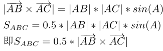
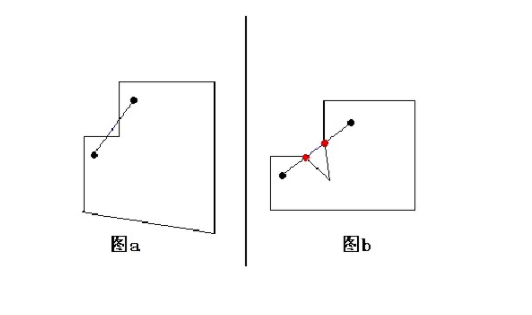

# 计算几何
[comment]: <> "[ACM程序竞赛计算几何模板](https://www.doc88.com/p-789443624353.html?s=rel&id=5)"

[comment]: <> "[AcWing计算几何模板](https://www.acwing.com/activity/content/code/content/635453/)"

# 二维计算几何基础


最新常用汇总：


```c++  
// 计算几何
#include <iostream>
#include <vector>
#include <cmath>
#include "assert.h"
using namespace std;

const double eps = 1e-8;
const double PI = acos(-1);

struct Point{
  double x, y;
  Point(double x = 0, double y = 0):
    x(x), y(y){}
};

typedef Point Vector;

Vector operator - (const Vector& a, const Vector& b){
  return Vector(a.x - b.x, a.y - b.y);
}

Vector operator + (const Vector& a, const Vector& b){
  return Vector(a.x + b.x, a.y + b.y);
}

Vector operator * (const Vector& a, double p){
  return Vector(a.x * p, a.y * p);
}

Vector operator / (const Vector& a, double p){
  assert(p != 0);
  
  return Vector(a.x / p, a.y / p);
}

int dcmp(double x){
  return fabs(x) < eps ? 0 : ( x > 0 ? 1 : -1);
}

// basic operator

double Dot(const Vector& a, const Vector& b){
  return a.x * b.x + a.y * b.y;
}

double Cross(const Vector& a, const Vector& b){
  return a.x * b.y - a.y * b.x;
}

double Length(const Vector& a){
  return sqrt(Dot(a, a));
}

double Angle(const Vector& a, const Vector& b){
  return acos(Dot(a, b) / Length(a) / Length(b));
}

double Area(Point a, Point b, Point c){
  return Cross(b - a, c - a) / 2;   // + -
}

Vector Rotate(Vector a, double rad){
  return Vector(a.x * cos(rad) - a.y * sin(rad),
    a.x * sin(rad) + a.y * cos(rad));
}

// 常考知识点
//1. 两直线交点
Point intersectionLine(Point p, Vector v, Point q, Vector w){
  double t = Cross(q - p, w) / Cross(v, w);
  
  return p + v * t;
}

//2. 点到直线距离
double disToLine(Point p, Point a, Point b){
  Vector u = p - a, v = b - a;
  return fabs(Cross(u, v) / Length(v));
}

bool operator == (const Point& a, const Point& b){
  return (dcmp(a.x - b.x) == 0) && (dcmp(a.y - b.y) == 0);
}

//3. 点到线段距离
double disToSegment(Point p, Point a, Point b){
  if(a == b) return Length(p - a);
  
}

//4. 点在直线投影
// P AB    Q = A + t * AB

Point Projection(Point p, Point a, Point b){
  return a + (b - a) * (Dot(p - a, b - a) / Length(b - a));
}


//5. 两线段相交

bool intersectionSeg(Point a1, Point a2, Point b1, Point b2){
  // 1. quick
  if(max(a1.x, a2.x) < min(b1.x, b2.x) || max(b1.x, b2.x) < min(a1.x, a2.x)
  || max(a1.y, a2.y) < min(b1.y, b2.y) || max(b1.y, b2.y) < min(a1.y, a2.y))
  return false;
  
  // 2. 
  Vector u1 = b1 - a1, u2 = b2 - a1;
  Vector v1 = a1 - b1, v2 = a2 - b1;
  
  return (dcmp(Cross(u1, a2 - a1) * Cross(u2, a2 - a1)) < 0) 
    && (dcmp(Cross(v1, b2 - b1) * Cross(v2, b2 - b1)) < 0); 
  
  double c1 = Cross(b1 - a1, a2 - a1), c2 = Cross(b2 - a1, a2 - a1);
  double c3 = Cross(a1 - b1, b2 - b1), c4 = Cross(a2 - b1, b2 - b1);
  
  return dcmp(c1) * dcmp(c2) < 0 && dcmp(c3) * dcmp(c4) < 0;

}

//6. 点在线段上
bool onSegment(Point p, Point a, Point b){
  return dcmp(Cross(a - p, b - p)) == 0 && dcmp(Dot(a - p, b - p)) < 0;
}

//7. 多边形面积

double polygonArea(vector<Point>& p){
  double area = 0;
  for(int i = 0; i < p.size(); ++ i){
    area += Cross(p[i], p[(i + 1) % p.size()]);
  }
  return fabs(area / 2);
}

//8. 点在多边形内

// solve 1:内角和
bool inPolygon1(Point a, vector<Point>& p){
  double alpha = 0;
  for(int i = 0; i < p.size(); ++ i){
    alpha += fabs(Angle(p[i] - a, p[(i + 1) % p.size()] - a));
  }
  return dcmp(alpha - 2 * PI) == 0;
}

// solve 2:左侧
bool inPolygon2(Point a, vector<Point>& p){
  for(int i = 0; i < p.size() - 1; ++ i){
    if(Cross(p[i + 1] - p[i], a - p[i]) < 0) return false;
  }
  return true;
}

// solve 3:射线法


int main(){
  
  
  return 0;
}


```


## 1 常用定义

### 1 点 和 向量
```c++  
//定义点的类型 
struct Point {
	double x, y;
	Point(double x = 0, double y = 0) : x(x) , y(y) { }  //构造函数，方便代码编写 
};
 
typedef Point Vector;  //从程序实现上，Vector只是Point的别名 
 
//向量 + 向量 = 向量 ，点 + 向量 = 点
Vector operator + (const Vector & A, const Vector & B) { return Vector(A.x+B.x, A.y+B.y); }
//点 - 点 = 向量
Vector operator - (const Vector & A, const Vector & B) { return Vector(A.x-B.x, A.y-B.y); }
//向量 * 数 = 向量 
Vector operator * (const Vector & A, double p) { return Vector(A.x*p, A.y*p); }
//向量 / 数 = 向量 
Vector operator / (const Vector & A, double p) { return Vector(A.x/p, A.y/p); } 
```

### 2 比较

计算及处理几何问题尽量减小误差
涉及到double，计算少用除法、开根（牛顿迭代法三次除法）

```c++  
a = b  => |a - b| < eps
a > b  =>  a - b  > eps
a < b  =>  a - b  < -eps
```

```c++  
// 可能不太严谨
bool operator < (const Point& a, const Point& b) {
	return a.x < b.x || (a.x == b.x && a.y < b.y);
} 
 
const double eps = 1e-10;

int dcmp(double x) {
	// if(fabs(x) < eps) return 0; else return x < 0 ? -1 : 1;
    return fabs(x) < eps ? 0 : ( x > 0 ? 1 : -1);
}
 
bool operator == (const Point& a, const Point& b) {
	return dcmp(a.x - b.x) == 0 && dcmp(a.y - b.y) == 0;
}

```


### 3 点积 & 叉积
点积：

```c++  
//点积 
double Dot(Vector A, Vector B) { return A.x*B.x + A.y*B.y; } //求点积 
double Length(Vector A) { return sqrt(Dot(A, A)); }			 //求向量长度 
double Angle(Vector A, Vector B) { return acos(Dot(A, B) / Length(A) / Length(B)); }//求向量之间的夹角 
```


叉积：

```c++  
//叉积 
double Cross(Vector A, Vector B) { return A.x*B.y - B.x*A.y; }//求叉积 
double Area2(Point A, Point B, Point C) { return Cross(B-A, C-A); }//根据叉积求三角形面积的两倍 带符号
```

**总结：**

```c++  
>点积 
a*b  在第一个向量a上 b的投影长度    a * b = |a||b|cos(theta)  = 一个数字
    a*b = b * a
    描述两个向量共线程度， 越接近ab越共线，越接近-ab，越方向
    描述力做功，力和运动的共线程度
>叉积 
aXb  方向与ab垂直 大小为平行四边形面积                      = 一个向量
    c = aXb = -bXa  方向由右手定则，手指向第一个a，手指指向第二个b，大拇指为C方向
    描述两个向量垂直程度，越接近ab越垂直(面积越大)，
    描述力矩，力与位矢的垂直程度
```


应用：
1. 面积 多边形面积
见下文计算代码

2. 折线段拐向


`PNC:可用于判断过路口时 引导线的拐向`


**计算公式：**
`a=(x1,y1) b = (x2,y2), a*b = x1*y1+x2*y2;`

```c++  
>因为a=x1i+y1j，b=x2i+y2j
所以a*b=（x1i+y1j）*(x2i+y2j)=x1x2(i^2)+x1y2i*j+x2y1i*j+y1y2j^2
又因为i*i=1,j*j=1 i*j=j*i=0
所以a*b=x1x2+y1y2
```


`a=(x1,y1) b = (x2,y2), aXb = x1*y2-x2*y1;`

```c++  
>a=(a1,a2,a3) ,b=(b1,b2,b3)
axb=(a2b3-a3b2,a3b1-a1b3,a1b2-a2b1)
```

或者用行列式计算

或者类似点乘计算


### 4 旋转
```c++  
//旋转 
Vector Rotate(Vector A, double rad) {//rad是弧度 
	return Vector(A.x*cos(rad) - A.y*sin(rad), A.x*sin(rad)+A.y*cos(rad) );
} 
```

## 2 常用计算
### 1 两向量夹角

```c++  
double angle_bettwen(Vector A, Vector B){   // 弧度 要求角度 * 180 / pi
    return acos(Dot(A, B)/Length(A)/Length(B));
}
```


### 2 向量的单位法线
```c++  
//向量单位法向量，调用前请确保A不是零向量 (顺时针) 
Vector Normal(Vector A) {  
    double L = Length(A);  
    return Vector(-A.y/L, A.x/L);  
}

```


### 3 二直线交点

[OI-WIKI](https://oi-wiki.org/geometry/2d/#_17)


```c++  
//二直线交点（参数式）   妙啊 面积之比 = t
Point GetLineIntersection(Point P, Vector v, Point Q, Vector w) {
	Vector u = P - Q;
	double t = Cross(w, u) / Cross(v, w);
	return P + v * t;
} 

```


### 4 点到直线距离
```c++  
//点到直线距离  (直线用其上两个点表示，或者用一个点加一个向量)
double DistanceToLine(Point P, Point A, Point B) {  
    Vector v1 = B-A, v2 = P - A;    // 平行四边形面积除以底
    return fabs(Cross(v1,v2) / Length(v1));  //如果不取绝对值，得到的是有向距离 
}  

```

```c++  
>点到直线距离
直线 Ax+By+C = 0, 点(a,b)
d =|Aa+Bb+C|/sqrt(A^2 + B^2)
若直线ABC未知，可由两点确定直线A，B, C
Ax1 + By1 + C = 0;
Ax2 + By2 + C = 0;
相减 A(x1 - x2) + B(y1 - y2)  = 0;
取 A = (y1 - y2), 则 B = (x2 - x1);
C = x1 * y2 - x2 * y1;  （类似叉乘公式）
```


### 5 点到线段距离

`PNC:查找点到一折线段的最近距离,可进行分块优化，见数据结构进阶部分`

区别于到直线，若点在线段外，则为点到AB较近点的距离。


```c++  
//点到线段距离  
double DistanceToSegment(Point P, Point A, Point B) {  
    if(A==B) return Length(P-A);  
    Vector v1 = B - A, v2 = P - A, v3 = P - B;  
    if(dcmp(Dot(v1, v2)) < 0) return Length(v2);  
    else if(dcmp(Dot(v1, v3)) > 0) return Length(v3);  
    else return fabs(Cross(v1, v2)) / Length(v1);  
}
```


### 6 点在直线投影

**点在直线上的投影**
起点A + 投影所占比例*AB
即 `A + |AP|*cos(theta) / |AB| * AB`
```c++  
//点在直线上的投影
Point GetLineProjection(Point P, Point A, Point B) {
	Vector v = B - A;
	return A + v * ( Dot(v, P-A) / Dot(v, v) ); 
}  
```

**拓展：**
向量表示线段（有向线段）
对于 `∀C∈AB, ∀p∈[0,1], C = p A + (1 - p)B`

### 7 线段相交判定


总结：
1. 首先快速排斥


2. 在x，y两个方向上投影有重叠


(以下代码为 不包括端点相交的 版本，如果算端点)

```c++  
//线段相交判定
bool SegmentProperIntersection(Point a1, Point a2, Point b1, Point b2) {
	double c1 = Cross(a2 - a1, b1 - a1), c2 = Cross(a2 - a1, b2 - a1),
			c3 = Cross(b2 - b1, a1 - b1), c4 = Cross(b2 - b1, a2 - b1);
	return dcmp(c1) * dcmp(c2) < 0 && dcmp(c3) * dcmp(c4) < 0;
} 
```


### 8 点在线段上
判断一个点是否在一条线段上
```c++  
//判断一个点是否在一条线段上
bool OnSegment(Point p, Point a1, Point a2) {
    // 在直线上 而且在 两端点内部(根据点乘方向共线反向 <0 或者根据x，y的坐标范围)
	return dcmp(Cross(a1 - p, a2 - p)) == 0 && dcmp(Dot(a1 - p, a2 - p)) < 0;
} 
```


### 9 多边形面积

[计算任意多边形的面积](https://www.cnblogs.com/TenosDoIt/p/4047211.html)
```c++  
//多边形面积  p点需要按逆时针(结果为正)排列 或顺时针排列( 加上fabs() ),
double ConvexPolygonArea(Point* p, int n) {  
    double area = 0;  
//    for(int i = 1; i < n-1; i++)  //以第0个顶点 切割三角形,只适用于凸多边性？？
//    //如果是凸边形，可以从第一个顶点出发吧凸边形分成n-2个三角形
//       area += Cross(p[i] - p[0], p[i + 1] - p[0]);  
    //或者以任意点切割三角形，适用于凹凸多边形
    for(int i = 0; i < n; ++ i){
        area += Cross(p[i], p[(i + 1) % n]);
    }
    return  fabs(area / 2);  
```


以上对于三角形显然成立，对于四边形，不管凹凸都行。同理...

对于四边及以上，重要的是要知道点的顺序，只要构成边是逆时针或顺时针。
原理是划分成多个三角形进行一次计算。
对于凸多边形，可用其中一顶点进行分割。


对于凹，则不能用其中的顶点分割。
如下图，多边形的面积 = S_ABC + S_ACD + S_ADE, 这个面积明显超过多边形的面积。

我们根据二维向量叉乘求三角形ABC面积时，利用的是

 这样求出来的面积都是正数，但是向量叉乘是有方向的，即AB X AC 是有正负的，如果把上面第三个公式中的绝对值符号去掉，即S_ABC = 0.5*(AB X AC)  ，那么面积也是有正负的。反应在上面第二个图中，S = S_ABC + S_ACD + S_ADE，如果S_ABC和S_ADE是正的，那么S_ACD是负的，这样加起来刚好就是多边形的面积。对于凸多边形，所有三角形的面积都是同正或者同负。

如果我们不以多边形的某一点为顶点来划分三角形而是以任意一点，如下图，这个方法也是成立的：S = S_OAB + S_OBC + S_OCD + S_ODE + S_OEA。计算的时候，当我们取O点为原点时，可以简化计算。


当O点为原点时，根据向量的叉积计算公式，各个三角形的面积计算如下：

S_OAB = 0.5*(A_x*B_y - A_y*B_x)   【(A_x，A_y)为A点的坐标】
S_OBC = 0.5*(B_x*C_y - B_y*C_x)
S_OCD = 0.5*(C_x*D_y - C_y*D_x)
S_ODE = 0.5*(D_x*E_y - D_y*E_x)
S_OEA = 0.5*(E_x*A_y - E_y*A_x)


### 10 判断点在多边形中

判断点是否在多边形中

1. 首先要严格定义 在边上或顶点上 不算是在内部。
2. 以及怎么处理顶点和边上的情况

- 判断点是否在多边形内（不一定是凸多边形）
a. 射线法，从该点任意做一条和所有边都不平行的射线。交点个数为偶数，则在多边形外，为奇数，则在多边形内。
b. 转角法
- 判断点是否在**凸多边形**内(只对凸有效)
c. 只需判断点是否在所有边的左边（逆时针存储多边形）。
- 全在， 则在内部。
- 不全在，则在外部。
d. 在矩形内，一直矩形中心点x,y,theta（长边方向）,length,width。
- 坐标变换 到 车体坐标系中，与半车宽和半车长比较即可。


```c++  
bool insidePolygon(Point * p, int n, Point A){
    for(int i = 0; i < n - 1; ++ i){
        Vector a = p[i + 1] - p[i];
        Vector b = A - p[i];
        if(Cross(a, b) < 0) return false;
    }
    return true;
}
```


代码汇总：
// mbjhip    几何inpolygon

**内角和**

```c++  
// 1.内角和360
bool InPolygon(Point *p, int n, Point A){
    double alpha = 0;
    for(int i = 0; i < n; ++ i){
        alpha += fabs(Angle(p[i] - A, p[(i + 1) % n] - A));
    }
    return dcmp(alpha - 2 * pi) == 0;
}
```

	
**射线法**

```c++  
// 2.射线法
int InPolygon(float *vertx, float *verty, int n,  Point P)
{
  bool c = 0;   // 绘制一条往右的射线  
  double testx = P.x,  testy = P.y;
  for (int i = 0; i < n; i ++ ) {
    int j = (i + 1) % n;    
    if ( ((verty[i]>testy) != (verty[j]>testy)) &&
	 (testx < (vertx[j]-vertx[i]) * (testy-verty[i]) / (verty[j]-verty[i]) + vertx[i]) )
       c = !c;
  }
  return c;
}
```

	
**左侧**	
  
```c++  
// 3.左侧(凸，逆时针存储)
bool InPolygon(Point * p, int n, Point A){
    for(int i = 0; i < n - 1; ++ i){
        Vector a = p[i + 1] - p[i];
        Vector b = A - p[i];
        if(Cross(a, b) < 0) return false;
    }
    return true;
}
```

**坐标变换**

```c++  
// 4.在矩形内，一直矩形中心点x,y,theta（长边方向）,length,width。
//- 坐标变换 到 车体坐标系中，与半车宽和半车长比较即可。
bool inPolygon(const Point &point) const {
  const double x0 = point.x() - center_.x();
  const double y0 = point.y() - center_.y();
  const double dx = std::abs(x0 * cos_heading_ + y0 * sin_heading_);
  const double dy = std::abs(-x0 * sin_heading_ + y0 * cos_heading_);
  return dx <= half_length_ + eps && dy <= half_width_ + eps;
}
```


---
**详细**


#### 内角和


多边形为凸 - 角度和


```c++  
const double pi = acos(-1);
Point P[N];
int n;
bool InsidePolygon(Point A){
    double alpha = 0;
    for(int i = 0; i < n; ++ i){
        alpha += fabs(Angle(P[i] - A, P[(i + 1) % n] - A));  // 在顶点上未处理
    }
    return dcmp(alpha - 2 * pi) == 0;
}
```

#### 射线法

多边形不限制凸和凹 - 射线法


· 点与多边形的关系：在内或在外
做一条直线，记穿边的个数，奇内偶外
如果交了顶点，算远不算近（不要问我，对于顶点肯定不能说交了1个点对吧，那么交0个或者交2个对奇偶性是没有影响的，算不算无所谓）

· 还有一种判断点是否在多边形的方法
把多边形放在极坐标系里，以一个点作为原点，易知每条对角线的极角是单增的，知道点的极角，二分它所在的区域，再用叉乘判断点在不在里面就行了。

使用**奇内偶外**的方法：射线法

[判断一个坐标点是否在不规则多边形内部的算法](https://blog.csdn.net/weixin_34211761/article/details/93294237?utm_medium=distribute.pc_relevant_t0.none-task-blog-BlogCommendFromMachineLearnPai2-1.control&depth_1-utm_source=distribute.pc_relevant_t0.none-task-blog-BlogCommendFromMachineLearnPai2-1.control)


```c++  
// int pnpoly(int nvert, float *vertx, float *verty, float testx, float testy)
// {
//   int i, j, c = 0;   // 绘制一条往右的射线  
//   for (i = 0, j = nvert-1; i < nvert; j = i++) {
//     if ( ((verty[i]>testy) != (verty[j]>testy)) &&
// 	 (testx < (vertx[j]-vertx[i]) * (testy-verty[i]) / (verty[j]-verty[i]) + vertx[i]) )
//        c = !c;
//   }
//   return c;
// }
```


采用下面这个版本

```c++
int insidePolygon(float *vertx, float *verty, int n,  Point P)
{
  bool c = 0;   // 绘制一条往右的射线  
  double testx = P.x,  testy = P.y;
  for (int i = 0; i < n; i ++ ) {  //j = 0, i = 1;  j = 1, i = 2; j = n - 1, i = 0;
    int j = (i + 1) % n;    
    if ( ((verty[i]>testy) != (verty[j]>testy)) &&
	 (testx < (vertx[j]-vertx[i]) * (testy-verty[i]) / (verty[j]-verty[i]) + vertx[i]) )
       c = !c;
  }
  return c;
}
```

首先，参数nvert 代表多边形有几个点。浮点数testx, testy代表待测试点的横坐标和纵坐标，*vertx,*verty分别指向储存多边形横纵坐标数组的首地址。

我们注意到，每次计算都涉及到相邻的两个点和待测试点，然后考虑两个问题：

1. 被测试点的纵坐标testy是否在本次循环所测试的两个相邻点纵坐标范围之内？即

`verty[i] <testy < verty[j]`或者`verty[j] <testy < verty[i]`, 
即向量异号`((verty[i]>testy) != (verty[j]>testy)`

2. 待测点test是否在i,j两点之间的连线之下?(线段左侧区域更准确吧)？看不懂后半短if statement的朋友请自行在纸上写下i,j两点间的斜率公式，要用到一点初中解析几何和不等式的知识范畴，对广大码农来说小菜一碟。

然后每次这两个条件同时满足的时候我们把返回的布尔量取反。

可这到底是啥意思啊？

这个表达式的意思是说，随便画个多边形，随便定一个点，然后通过这个点水平划一条线，先数数看这条横线和多边形的边相交几次，（或者说先排除那些不相交的边，第一个判断条件），然后再数这条横线穿越多边形的次数是否为奇数，如果是奇数，那么该点在多边形内，如果是偶数，则在多边形外。详细的数学证明这里就不做了，不过读者可以自行画多边形进行验证。

 

 

**判断一个点是否在多边形内部 - 射线法思路**
比如说，我就随便涂了一个多边形和一个点，现在我要给出一种通用的方法来判断这个点是不是在多边形内部（别告诉我用肉眼观察……）。


首先想到的一个解法是从这个点做一条射线，计算它跟多边形边界的交点个数，如果交点个数为奇数，那么点在多边形内部，否则点在多边形外。


这个结论很简单，那它是怎么来的？下面就简单讲解一下。

首先，对于平面内任意闭合曲线，我们都可以直观地认为，曲线把平面分割成了内、外两部分，其中“内”就是我们所谓的多边形区域。


基于这一认识，对于平面内任意一条直线，我们可以得出下面这些结论：

直线穿越多边形边界时，有且只有两种情况：进入多边形或穿出多边形。 
在不考虑非欧空间的情况下，直线不可能从内部再次进入多边形，或从外部再次穿出多边形，即连续两次穿越边界的情况必然成对。 
直线可以无限延伸，而闭合曲线包围的区域是有限的，因此最后一次穿越多边形边界，一定是穿出多边形，到达外部。 


现在回到我们最初的题目。假如我们从一个给定的点做射线，还可以得出下面两条结论：

如果点在多边形内部，射线第一次穿越边界一定是穿出多边形。 
如果点在多边形外部，射线第一次穿越边界一定是进入多边形。 


把上面这些结论综合起来，我们可以归纳出：

当射线穿越多边形边界的次数为偶数时，所有第偶数次（包括最后一次）穿越都是穿出，因此所有第奇数次（包括第一次）穿越为穿入，由此可推断点在多边形外部。 


当射线穿越多边形边界的次数为奇数时，所有第奇数次（包括第一次和最后一次）穿越都是穿出，由此可推断点在多边形内部。 


到这里，我们已经了解了这个解法的思路，大家可以试着自己写一个实现出来。

不知道大家思考得怎么样，有没有遇到一些不好处理的特殊情况。今天就来讲讲射线法在实际应用中的一些问题和解决方案。

1. 点在多边形的边上

前面我们讲到，射线法的主要思路就是计算射线穿越多边形边界的次数。那么对于点在多边形的边上这种特殊情况，射线出发的这一次，是否应该算作穿越呢？


看了上面的图就会发现，不管算不算穿越，都会陷入两难的境地——同样落在多边形边上的点，可能会得到相反的结果。这显然是不正确的，因此对这种特殊情况需要特殊处理。

2. 点和多边形的顶点重合


这其实是第一种情况的一个特例。

3. 射线经过多边形顶点

射线刚好经过多边形顶点的时候，应该算一次还是两次穿越？这种情况比前两种复杂，也是实现中的难点，后面会讲解它的解决方案。


4. 射线刚好经过多边形的一条边

这是上一种情况的特例，也就是说，射线连续经过了多边形的两个相邻顶点。


解决方案：

1判断点是否在线上的方法有很多，比较简单直接的就是计算点与两个多边形顶点的连线斜率是否相等，中学数学都学过。

2点和多边形顶点重合的情况更简单，直接比较点的坐标就行了。

3顶点穿越看似棘手，其实我们换一个角度，思路会大不相同。先来回答一个问题，射线穿越一条线段需要什么前提条件？没错，就是线段两个端点分别在射线两侧。只要想通这一点，顶点穿越就迎刃而解了。这样一来，我们只需要规定被射线穿越的点都算作其中一侧。


如上图，假如我们规定射线经过的点都属于射线以上的一侧，显然点D和发生顶点穿越的点C都位于射线Y的同一侧，所以射线Y其实并没有穿越CD这条边。而点C和点B则分别位于射线Y的两侧，所以射线Y和BC发生了穿越，由此我们可以断定点Y在多边形内。同理，射线X分别与AD和CD都发生了穿越，因此点X在多边形外，而射线Z没有和多边形发生穿越，点Z位于多边形外。

解决了第三点，这一点就毫无难度了。根据上面的假设，射线连续经过的两个顶点显然都位于射线以上的一侧，因此这种情况看作没有发生穿越就可以了。由于第三点的解决方案实际上已经覆盖到这种特例，因此不需要再做特别的处理。


#### 左侧	

[计算几何 判断点在直线的左右哪一侧](https://blog.csdn.net/m0_37667021/article/details/76498623?utm_medium=distribute.pc_relevant.none-task-blog-2~default~baidujs_title~default-0.pc_relevant_antiscanv2&spm=1001.2101.3001.4242.1&utm_relevant_index=3)

[直线的左右？？](https://zhidao.baidu.com/question/415397280.html)明显不对吧

将道理、左右是按照直线前进的方向来的。


**判断点在直线的位置**


判断点在线的左边还是右边在构建三角网时是非常重要的

以及两点p1(x1,y1),p2(x2,y2),判断点p(x,y)在线的左边还是右边。

 

1.

```c++  
bool LeftOfLine(const ZCoord2D& p, const ZCoord2& p1, const ZCoord2D& p2)
{

    double tmpx = (p1.x - p2.x) / (p1.y - p2.y) * (p.y - p2.y) + p2.x;

    if (tmpx > p.x)//当tmpx>p.x的时候，说明点在线的左边，小于在右边，等于则在线上。

        return true;
    return false;
}
```


2.另外一种方法：
```c++  
Tmp = (y1 – y2) * x + (x2 – x1) * y + x1 * y2 – x2 * y1
Tmp > 0 在左侧
Tmp = 0 在线上
Tmp < 0 在右侧
```


3.向量叉乘法
```c++  
设线段端点为从 A(x1, y1)到 B(x2, y2), 线外一点 P(x0，y0)，
判断该点位于有向线 A→B 的那一侧。 
a = ( x2-x1, y2-y1) (以起点A作两个向量，不是以P)
b = ( x0-x1, y0-y1) 
a x b = | a | | b | sinφ (φ为两向量的夹角) 
| a | | b |  ≠ 0 时，  a x b  决定点 P的位置 
所以  a x b  的 z 方向大小决定 P位置 
(x2-x1)(y0-y1) – (y2-y1)(x0-x1)  >  0   左侧 
(x2-x1)(y0-y1) – (y2-y1)(x0-x1)  <  0   右侧 
(x2-x1)(y0-y1) – (y2-y1)(x0-x1)  =  0   线段上 
```

```c++  
bool insidePolygon(Point * p, int n, Point A){
    for(int i = 0; i < n - 1; ++ i){
        Vector a = p[i + 1] - p[i];
        Vector b = A - p[i];
        if(Cross(a, b) < 0) return false;
    }
    return true;
}
```


**测试**

```c++  
int main() {
	cout << " 1 " << endl;
	int n = 5;
	Point p[10];
	p[0].x = 1, p[0].y = 0;
	p[1].x = 2, p[1].y = 0;
	p[2].x = 3, p[2].y = 1;
	p[3].x = 2, p[3].y = 2;
	p[4].x = 0, p[4].y = 1;
	
	p[5].x = 0, p[5].y = 1;        // 顶点     
	p[6].x = 1, p[6].y = 1;        // true      
	p[7].x = 0.5, p[7].y = 0.5;   // 边上  
	p[8].x = 5, p[8].y = 5;       // 外部 
	double area = ConvexPolygonArea(p, 5);
	cout << area << endl;
	
	bool flag = InsidePolygon(p, n, p[8]);
	cout << flag << endl;
	
	bool flag2 = insidePolygon(p, n, p[8]);
	cout << flag2 << endl;	
	return 0;
}
```


### 点在多面体内

如四面体：

对于四面体的每个平面,检查该点是否与剩余的顶点在同一侧:

bool SameSide(v1, v2, v3, v4, p)
{
    normal := cross(v2 - v1, v3 - v1)
    dotV4 := dot(normal, v4 - v1)
    dotP := dot(normal, p - v1)
    return Math.Sign(dotV4) == Math.Sign(dotP);
}
你需要检查每架飞机:

bool PointInTetrahedron(v1, v2, v3, v4, p)
{
    return SameSide(v1, v2, v3, v4, p) &&
           SameSide(v2, v3, v4, v1, p) &&
           SameSide(v3, v4, v1, v2, p) &&
           SameSide(v4, v1, v2, v3, p);               
}


可以通过四个顶点 ABC 和 D 来定义四面体。因此，您也可以使用 4 个三角形来定义四面体的表面。

您现在只需检查点 P 是否在平面的另一侧。每个平面的法线都指向远离四面体中心的方向。所以你只需要对 4 架飞机进行测试。

您的平面方程如下所示：a*x+b*y+c*z+d=0 只需填写点值 (xyz)。如果结果的符号 >0，则该点与法线在同一侧，result == 0，点位于平面内，在您的情况下，您需要第三个选项：<0 表示它在飞机。如果这对于所有 4 个平面都满足，则您的点位于四面体内部。


### 11 判断线段是否在多边形中




### 12 多边形重心

[多边形重心](https://blog.csdn.net/weixin_43847416/article/details/95781817)

**方法一：**

累加求和重心。

设平面上有n个点（xi，yi）(i=1、2、3……n)，其多边形重心G（x，y）为:
在这里插入图片描述
这是求多边形最简单直观的方法。可以直接利用数据点的x, y坐标就能求图形重心。但是缺陷在于没有对离散数据点所围图形做任何处理和分析,精度不够。
```c++  
x = ∑xi / n
y = ∑yi / n
```

**方法二：**

这里有几个定理需要用到：

定理一：已知三角形△A1A2A3的顶点坐标Ai ( xi, yi ) ( i =1, 2, 3) 。它的重心坐标为:
xc = (x1+x2+x3) / 3 ; yc = (y1+y2+y3) / 3 ;

定理二：已知三角形△A1A2A3的顶点坐标Ai ( xi , yi ) ( i =1, 2, 3) 。该三角形的面积为:
　　S = ( (x2 - x1) * (y3 - y1) - (x3 - x1) * (y2 - y1) ) / 2 ;
　　△A1A2A3 边界构成逆时针回路时取+ , 顺时针时取 -。
　　
另外在求解的过程中，不需要考虑点的输入顺序是顺时针还是逆时针，相除后就抵消了。

方法：

(1) 分割
以多边形的一个顶点O为原点（可以选输入的第一个点作为原点），作连接O与其他所有非相邻顶点的线段，将多边形（n条边）分为n-2个三角形。


(2) 求每个三角形的面积和重心
设其中一个三角形的重心为`G（cx，cy）`,顶点坐标分别为`A1（x1，y1），A2（x2，y2），A3（x3，y3）`，则有`cx = (x1+x2+x3) / 3 ; cy = (y1+y2+y3) / 3 `;
面积为 `S = ( (x2 - x1) * (y3 - y1) - (x3 - x1) * (y2 - y1) ) / 2` ;

(3) 求多边形的重心
公式：`cx = (∑ cx[i]*s[i]) / ∑s[i] ; cy = (∑ cy[i]*s[i] ) / ∑s[i];`其中`（cx[i], cy[i]）`, `s[i]`分别是所划分的第i个三角形的重心坐标和面积。另外，在（2）中求每个重心坐标时要除以3，实际上不需要在求每个三角形坐标时都除以3，只需要求出`∑ cx[i]*s[i]`后一次性除以3即可。


*参考：*
[计算几何初步](https://www.fogsail.net/2019/10/28/20191028/)

[学习笔记：计算几何全家桶](https://www.acwing.com/blog/content/2935/)

---


## 3 经典问题

### 最小圆覆盖
（经典算法【三点定圆】）

[最小圆覆盖](https://blog.csdn.net/weixin_43846139/article/details/105594425)


给定n个点，用一个最小的圆把这些点全部覆盖，求这个圆的圆心半径。

1.几何法
2.模拟退火法


即最小圆覆盖问题：给定n个点的平面坐标，求一个半径最小的圆，把n个点全部包围，部分点在圆上。（两种算法：几何算法和模拟退火算法）

- 几何法


于是，这个问题就被转化为若干个子问题来求解了

由于三个点确定一个圆，我们的过程大致上做的是从没有确定点，到有一个确定点，再到有两个确定点，再到有三个确定点来求圆的工作

时间复杂度：O(N)
空间复杂度：O(N)


小细节
Q1.
过三点如何求圆？

A1.
先求叉积

若叉积为0，即三个点在同一直线，那么找到距离最远的一对点，以它们的连线为直径做圆即可；

若叉积不为0，即三个点不共线，那么就求三角形的外接圆

Q2.
如何求三角形外接圆？


几何算法：
（1）加第1个点P1。C1的圆心就是P1，半径为0。
（2）加第二个点P2。新的C2的圆心是线段P1P2的中心，半径为两点距离的一半。这一步操作是两点定圆。
3）加第三个点P3。若P3在圆内或圆上，忽略；若不在，则以P3为圆心，重复（1）和（2），若还是不行则用三点定圆。
（4）加第四个点P4。若P4在圆内或圆上，忽略；若不在，则以P4为圆心，从前三个点中选择一个点重复（1）和（2）即两点定圆，若还是不行则选三个点进行三点定圆(一定有)。
（5）继续加入新的点。

复杂度分析：3层for循环，貌似是O(n3)，但是当点的分布是随机的时候，可以通过概论计算得到实际复杂度接近O(n)，代码中使用random_shuffle()函数实现。


```c++  
#include<iostream>
#include<cstdio>
#include<cstring>
#include<algorithm>
#include<cstring>
#include<cmath>
#include<ctime>
using namespace std;
typedef long long lt;
#define eps 1e-6
#define sqr(x) ((x)*(x))
 
const int maxn=1000010;
int n;
struct point{
	double x,y;
}p[maxn],O;
double R;//半径 
 
double getd(point a,point b){ //求直径 
	return sqrt(sqr(a.x-b.x)+sqr(a.y-b.y));
}
point getO(point p1,point p2,point p3) { //求圆心 
    point res;
    double a=p2.x-p1.x;
	double b=p2.y-p1.y;
	double c=p3.x-p2.x;
	double d=p3.y-p2.y;
    double e=sqr(p2.x)+sqr(p2.y)-sqr(p1.x)-sqr(p1.y);
    double f=sqr(p3.x)+sqr(p3.y)-sqr(p2.x)-sqr(p2.y);
    res.x=(f*b-e*d)/(c*b-a*d)/2.0; 
    res.y=(a*f-e*c)/(a*d-b*c)/2.0;
    return res;
}
void mincir() {
    O=p[1]; 
	R=0;
    for(int i=1;i<=n;++i){
	    if(getd(p[i],O)-R>eps) { //不在圆内 
	        O=p[i]; 
			R=0;
	        for(int j=1;j<i;j++) { 
		        if(getd(p[j],O)-R>eps) {//不在圆内 
		            O=(point){(p[i].x+p[j].x)/2.0,(p[i].y+p[j].y)/2.0};
		            R=getd(p[i],p[j])/2.0;
		            for(int k=1;k<j;++k)
		            if(getd(p[k],O)-R>eps) {//不在圆内 
		                O=getO(p[i],p[j],p[k]);  //外接圆 
		                R=getd(p[i],O);
		            }
		        }
		    } 
	    }
	} 
} 
 
int main()
{
    cin>>n;
    for(int i=1;i<=n;++i)
    scanf("%lf%lf",&p[i].x,&p[i].y);
    random_shuffle(p+1,p+1+n);// random_shuffle()随机打乱函数 首指针 尾指针 
    mincir();
    printf("%.3f",R);
    return 0;
}
```


- 模拟退火


```c++  
#include<iostream>
#include<cstring>
#include<algorithm>
#include<cstdio>
#include<cmath>
using namespace std;
const double eps=1e-8;
struct POINT{
    double x,y,z;
}p[510];
POINT op;//最小圆的圆心
int n;
inline double dist(POINT &a,POINT &b){
    return sqrt((a.x-b.x)*(a.x-b.x)+(a.y-b.y)*(a.y-b.y));
}
void solve(){
    double ret,delta=100.0;
    double maxDis,tempDis;
    int i,id;
    while(delta>eps){
        id=0;
        maxDis=dist(op,p[id]);
        for(i=1;i<n;i++){
            tempDis=dist(op,p[i]);
            if(tempDis>maxDis){
                maxDis=tempDis;
                id=i;
            }
        }
        ret=maxDis;
        op.x+=(p[id].x-op.x)/maxDis*delta;
        op.y+=(p[id].y-op.y)/maxDis*delta;
        delta*=0.98;
    }
    printf("%.3f\n",ret);
}
int main(){
	scanf("%d",&n);
    op.x=op.y=0;
    for(int i=0;i<n;i++){
        scanf("%lf%lf",&p[i].x,&p[i].y);
        op.x+=p[i].x;
        op.y+=p[i].y;
    }
    op.x/=n;
    op.y/=n;
    solve();
    
    return 0;
}
```


### 其他
[https://easylearn.baidu.com/edu-page/tiangong/questiondetail?id=1733349032401936462&fr=search](在一个圆上任取三个点,构成钝角三角形的概率是多少?)
[圆内任取三点,形成钝角三角形概率?](https://mp.weixin.qq.com/s?__biz=MzU1OTAzMjE2OA==&mid=2247485349&idx=2&sn=2f3196368cb9d88e31e666b8f4c6f990&chksm=fc1c35a2cb6bbcb4bdb9c47cf1d88224f1f4aab4dcdc7f29b85800bff51b9e5528f5e4f5b448&scene=27)

问：圆内任取三点,形成钝角三角形概率?
答：
3/4;
1：在圆上任意取第一个点A；
2：再任意第二个点B,有AB重合、AB在同一条直径上两个特殊点,
但对于圆上的无数个点来说,B取到上面两个特殊点的概率为0；
所以可以使AB能够不重合且不在同一直径上的概率为1；以下叙述将不考虑上述两个特殊点；
由上所述,A、B两点的取法可以看做是任意取,概率为1；
3：再任意取第三点C,C有与A重合、与B重合两个特殊点,同上,可以忽略不计
设原点为O,则AO交圆于点D,BO交圆于点E,则C在弧DBAE时（D、B、A、E四点除外）,三角形ABC为钝角三角形；
由AB的长度从趋近于零,到趋近于直径,弧DBAE的长度由趋近于圆周长1,到趋近于半圆周1/2,
所以弧DBAE的平均长度为（1+1/2）/2 = 3/4;
所以三角形ABC为钝角三角形的概率为3/4


或：
随机A,连直径。
B，C在直径两侧：1/2
emm 好像还不是太好分析

B, C在直径同侧：1/2
只能是钝角


## 4 代码
### 汇总注释版

```c++  

//定义点的类型 
struct Point {
	double x, y;
	Point(double x = 0, double y = 0) : x(x) , y(y) { }  //构造函数，方便代码编写 
};
 
typedef Point Vector;  //从程序实现上，Vector只是Point的别名 
 
//向量 + 向量 = 向量 ，点 + 向量 = 点
Vector operator + (Vector A, Vector B) { return Vector(A.x+B.x, A.y+B.y); }
//点 - 点 = 向量
Vector operator - (Vector A, Vector B) { return Vector(A.x-B.x, A.y-B.y); }
//向量 * 数 = 向量 
Vector operator * (Vector A, double p) { return Vector(A.x*p, A.y*p); }
//向量 / 数 = 向量 
Vector operator / (Vector A, double p) { return Vector(A.x/p, A.y/p); } 
 
bool operator < (const Point& a, const Point& b) {
	return a.x < b.x || (a.x == b.x && a.y < b.y);
} 
 
const double eps = 1e-10;
int dcmp(double x) {
	if(fabs(x) < eps) return 0; else return x < 0 ? -1 : 1;
}
 
bool operator == (const Point& a, const Point& b) {
	return dcmp(a.x - b.x) == 0 && dcmp(a.y - b.y) == 0;
}
 
//点积 
double Dot(Vector A, Vector B) { return A.x*B.x + A.y*B.y; } //求点积 
double Length(Vector A) { return sqrt(Dot(A, A)); }			 //求向量长度 
double Angle(Vector A, Vector B) { return acos(Dot(A, B) / Length(A) / Length(B)); }//求向量之间的夹角 
 
//叉积 
double Cross(Vector A, Vector B) { return A.x*B.y - A.y*B.x; }//求叉积 
double Area2(Point A, Point B, Point C) { return Cross(B-A, C-A); }//根据叉积求三角形面积的两倍 
 
//旋转 
Vector Rotate(Vector A, double rad) {//rad是弧度 
	return Vector(A.x*cos(rad) - A.y*sin(rad), A.x*sin(rad)+A.y*cos(rad) );
} 
 
//向量单位法向量，调用前请确保A不是零向量 
Vector Normal(Vector A) {  
    double L = Length(A);  
    return Vector(-A.y/L, A.x/L);  
}
 
//二直线交点（参数式） 
Point GetLineIntersection(Point P, Vector v, Point Q, Vector w) {
	Vector u = P - Q;
	double t = Cross(w, u) / Cross(v, w);
	return P + v * t;
} 
 
//点到直线距离  
double DistanceToLine(Point P, Point A, Point B) {  
    Vector v1 = B - A, v2 = P - A;  
    return fabs(Cross(v1,v2) / Length(v1));  //如果不取绝对值，得到的是有向距离 
}  
  
//点到线段距离  
double DistanceToSegment(Point P, Point A, Point B) {  
    if(A==B) return Length(P-A);  
    Vector v1 = B - A, v2 = P - A, v3 = P - B;  
    if(dcmp(Dot(v1, v2)) < 0) return Length(v2);  
    else if(dcmp(Dot(v1, v3)) > 0) return Length(v3);  
    else return fabs(Cross(v1, v2)) / Length(v1);  
}  

//点在直线上的投影
Point GetLineProjection(Point P, Point A, Point B) {
	Vector v = B - A;
	return A + v * ( Dot(v, P-A) / Dot(v, v) ); 
}  
 
//线段相交判定
bool SegmentProperIntersection(Point a1, Point a2, Point b1, Point b2) {
	double c1 = Cross(a2 - a1, b1 - a1), c2 = Cross(a2 - a1, b2 - a1),
			c3 = Cross(b2 - b1, a1 - b1), c4 = Cross(b2 - b1, a2 - b1);
	return dcmp(c1) * dcmp(c2) < 0 && dcmp(c3) * dcmp(c4) < 0;
} 
 
//判断一个点是否在一条线段上
bool OnSegment(Point p, Point a1, Point a2) {
	return dcmp(Cross(a1 - p, a2 - p)) == 0 && dcmp(Dot(a1 - p, a2 - p)) < 0;
} 
 
//多边形面积  
double ConvexPolygonArea(Point* p, int n) {  
    double area = 0;  
    for(int i = 1; i < n-1; i++)  
        area += Cross(p[i] - p[0], p[i + 1] - p[0]);  
    return area / 2;  
}
```


### 汇总简洁版
```c++  
struct Point {
	double x, y;
	Point(double x = 0, double y = 0) : x(x) , y(y) { }  
};
 
typedef Point Vector;  
 
Vector operator + (Vector A, Vector B) { return Vector(A.x+B.x, A.y+B.y); }
Vector operator - (Vector A, Vector B) { return Vector(A.x-B.x, A.y-B.y); }
Vector operator * (Vector A, double p) { return Vector(A.x*p, A.y*p); }
Vector operator / (Vector A, double p) { return Vector(A.x/p, A.y/p); } 
 
bool operator < (const Point& a, const Point& b) {
	return a.x < b.x || (a.x == b.x && a.y < b.y);
} 
 
const double eps = 1e-10;
int dcmp(double x) {
	if(fabs(x) < eps) return 0; else return x < 0 ? -1 : 1;
}
//或
int dcmp(double x) {
    return fabs(x) < eps ? 0 : ( x > 0 ? 1 : -1);
}
 
bool operator == (const Point& a, const Point& b) {
	return dcmp(a.x - b.x) == 0 && dcmp(a.y - b.y) == 0;
}
 
double Dot(Vector A, Vector B) { return A.x*B.x + A.y*B.y; } 
double Length(Vector A) { return sqrt(Dot(A, A)); }		
double Angle(Vector A, Vector B) { return acos(Dot(A, B) / Length(A) / Length(B)); } 
 
double Cross(Vector A, Vector B) { return A.x*B.y - A.y*B.x; }
double Area2(Point A, Point B, Point C) { return Cross(B-A, C-A); }
 
Vector Rotate(Vector A, double rad) {
	return Vector(A.x*cos(rad) - A.y*sin(rad), A.x*sin(rad)+A.y*cos(rad) );
} 
 
Vector Normal(Vector A) {  
    double L = Length(A);  
    return Vector(-A.y/L, A.x/L);  
}
 
Point GetLineIntersection(Point P, Vector v, Point Q, Vector w) {
	Vector u = P - Q;
	double t = Cross(w, u) / Cross(v, w);
	return P + v * t;
} 
 
double DistanceToLine(Point P, Point A, Point B) {  
    Vector v1 = B-A, v2 = P - A;  
    return fabs(Cross(v1,v2) / Length(v1)); 
}  
 
double DistanceToSegment(Point P, Point A, Point B) {  
    if(A==B) return Length(P-A);  
    Vector v1 = B - A, v2 = P - A, v3 = P - B;  
    if(dcmp(Dot(v1, v2)) < 0) return Length(v2);  
    else if(dcmp(Dot(v1, v3)) > 0) return Length(v3);  
    else return fabs(Cross(v1, v2)) / Length(v1);  
}  
 
Point GetLineProjection(Point P, Point A, Point B) {
	Vector v = B - A;
	return A + v * ( Dot(v, P-A) / Dot(v, v) ); 
}  
 
bool SegmentProperIntersection(Point a1, Point a2, Point b1, Point b2) {
	double c1 = Cross(a2 - a1, b1 - a1), c2 = Cross(a2 - a1, b2 - a1),
			c3 = Cross(b2 - b1, a1 - b1), c4 = Cross(b2 - b1, a2 - b1);
	return dcmp(c1) * dcmp(c2) < 0 && dcmp(c3) * dcmp(c4) < 0;
} 
 
bool OnSegment(Point p, Point a1, Point a2) {
	return dcmp(Cross(a1 - p, a2 - p)) == 0 && dcmp(Dot(a1 - p, a2 - p)) < 0;
} 
 
double ConvexPolygonArea(Point* p, int n) {  
    double area = 0;  
    for(int i = 1; i < n-1; i++)  
        area += Cross(p[i] - p[0], p[i + 1] - p[0]);  
    return area / 2;  
}  

```


##### 距离

点到直线距离(中学版)

```c++  
直线 Ax+By+C = 0, 点(a,b)

d =|Aa+Bb+C|/sqrt(A^2 + B^2)


若直线ABC未知，可由两点确定直线A，B, C
Ax1 + By1 + C = 0;
Ax2 + By2 + C = 0;

相减 A(x1 - x2) + B(y1 - y2)  = 0;
取 A = (y1 - y2), 则 B = (x2 - x1);
C = x1 * y2 - x2 * y1;

```


---
# 其他

*尚未整理*
### 三角形面积

```c++  
三边长 a, b, c 
海伦公式
p = (a + b + c) /2 
S = sqrt(p*(p - a)*(p - b)*(p - c));
```


#### 外接圆半径


### 四边形面积
一般四边形（凸四边形）的婆罗摩笈[jí]多公式

凸？？
四个点顺序需要依次给出 否则由于C4—2构成6条边，不知道哪个四边形
对于圆内接四边形 可直接用婆罗摩笈多公式，
否则用 abh,hcd分别计算两个三角形面积求和， h 为第一个顶点和第三个顶点连线长度


[百科：婆罗摩笈多公式](https://baike.baidu.com/item/%E5%A9%86%E7%BD%97%E6%91%A9%E7%AC%88%E5%A4%9A%E5%85%AC%E5%BC%8F/8780031?fr=aladdin)

对于圆内接四边形
```c++  
p = (a + b + c + d) /2 
S = sqrt((p - a)*(p - b)*(p - c)*(p - d));
```


否则还需要S = sqrt((p - a)*(p - b)*(p - c)*(p - d) - abcd*cos^2(theta));
theta = 四边形一对角和的一半 (圆内接四边形的对角和为pi)
海伦公式给出三角形的面积。它是婆罗摩笈多公式取d = 0的特殊情形。

其中S为四边形的面积，a、b、c、d为四边形的四边长度，θ为四边形任一对角和的一半，s为半周长（a+b+c+d）/2。

我们可以看出，角度θ并不是确定值，会随着四边形的不稳定而变化，只有当θ=90°时，四边形的面积是最大的，既四边形对角和为180°时。

另外，婆罗摩笈多公式在一条边等于零时，退化为三角形的海伦公式，其中的可变量θ与零相乘消失，海伦公式可以直接给出确定的三角形面积：


## 点 边 面 关系


### 多边形相交
用于碰撞检测


### 圆

```c++  
struct Point {
    double x,y;
    Point(double x = 0, double y = 0):x(x),y(y){}
};
Point Excenter(Point a, Point b, Point c){
    double a1 = b.x - a.x;
    double b1 = b.y - a.y;
    double c1 = (a1*a1 + b1*b1)/2;
    double a2 = c.x - a.x;
    double b2 = c.y - a.y;
    double c2 = (a2*a2 + b2*b2)/2;
    double d = a1*b2 - a2*b1;
    return Point(a.x + (c1*b2 - c2*b1)/d, a.y + (a1*c2 - a2*c1)/d);
}

```


[计算几何代码欣赏](https://wenku.baidu.com/view/5f6a4fc931687e21af45b307e87101f69e31fbe5.html)

[计算几何 - 二维几何基础 （模板）](https://blog.csdn.net/u014355480/article/details/43605257?spm=1001.2101.3001.6661.1&utm_medium=distribute.pc_relevant_t0.none-task-blog-2%7Edefault%7EOPENSEARCH%7ERate-1.pc_relevant_default&depth_1-utm_source=distribute.pc_relevant_t0.none-task-blog-2%7Edefault%7EOPENSEARCH%7ERate-1.pc_relevant_default&utm_relevant_index=1)

[二维下计算几何程序头 （模板）](https://www.cnblogs.com/DreamUp/archive/2010/08/28/1811164.html)

[PPT-计算几何--ACM](https://wenku.baidu.com/view/c1136a781711cc7931b71603.html?rec_flag=default&fr=Recommend_RelativeDoc-110166,80166,110010,80025,90103,80139-viewrec_pcview_rrs-2b278513a21614791711281f&sxts=1648210184752)


类版本
```c++  
#include<iostream>
#include<cmath>
using namespace std;
const double epoints = 1e-9;
int sgn(double a) {
    return (a > epoints) - (a < -epoints);
}
const double pointi = acos(-1.0);
struct point{
    double x, y;
    point(double xx=0, double yy=0){
        x=xx; y=yy;
    }
    bool operator == (const point &a) const {
        return sgn(x - a.x) == 0 && sgn(y - a.y) == 0;
    }
    bool operator != (const point &a) const {
        return sgn(x - a.x) != 0 || sgn(y - a.y) != 0;
    }
    bool operator < (const point &a) const {
        return sgn(y - a.y) < 0 || sgn(y - a.y) == 0 && sgn(x - a.x) < 0;
    }

    point operator + (const point &a) const {
        return point(x + a.x, y + a.y);
    }
    point operator - (const point &a) const {
        return point(x - a.x, y - a.y);
    }
    point operator ^ (const double &a) const {
        return point(x * a, y * a);
    }
    double operator ^ (const point &a) const {  //点积
        return x * a.x + y * a.y;
    }
    double operator * (const point &a) const {  //叉积
        return x * a.y - y * a.x;
    }

    point trunlen(double a) const {
        a /= sqrt(x * x + y * y);
        return point(x * a, y * a);
    }
    point turn_left() const {
        return point(-y, x);
    }
    point turn_right() const {
        return point(y, -x);
    }
    double cross(const point &a, const point &b) const {  //以this为起点两向量叉积
        return (a.x - x) * (b.y - y) - (a.y - y) * (b.x - x);
    }
    double dot(const point &a, const point &b) const { //以this为起点两向量点积
        return (a.x - x) * (b.x - x) + (a.y - y) * (b.y - y);
    }
   
    double len2(){
        return x * x + y * y;
    }
    double len()
    {
        return sqrt (len2());
    }

    void input() {
        scanf("%lf %lf", &x, &y);
    }
    void output() const {
        printf("%lf %lf\n", x, y);
    }
};
```


---
---

[模板](https://blog.csdn.net/clasky/article/details/9990235?spm=1001.2101.3001.6650.1&utm_medium=distribute.pc_relevant.none-task-blog-2%7Edefault%7EBlogCommendFromBaidu%7ERate-1.pc_relevant_aa&depth_1-utm_source=distribute.pc_relevant.none-task-blog-2%7Edefault%7EBlogCommendFromBaidu%7ERate-1.pc_relevant_aa&utm_relevant_index=2)

1.计算几何
1.1 注意
1. 注意舍入方式(0.5的舍入方向);防止输出-0.
2. 几何题注意多测试不对称数据.
3. 整数几何注意xmult和dmult是否会出界;
   符点几何注意eps的使用.
4. 避免使用斜率;注意除数是否会为0.
5. 公式一定要化简后再代入.
6. 判断同一个2*PI域内两角度差应该是
   abs(a1-a2)<beta||abs(a1-a2)>pi+pi-beta;
   相等应该是
   abs(a1-a2)<eps||abs(a1-a2)>pi+pi-eps;
7. 需要的话尽量使用atan2,注意:atan2(0,0)=0,
   atan2(1,0)=pi/2,atan2(-1,0)=-pi/2,atan2(0,1)=0,atan2(0,-1)=pi.
8. cross product = |u|*|v|*sin(a)
   dot product = |u|*|v|*cos(a)
9. (P1-P0)x(P2-P0)结果的意义:
   正: <P0,P1>在<P0,P2>顺时针(0,pi)内
   负: <P0,P1>在<P0,P2>逆时针(0,pi)内
   0 : <P0,P1>,<P0,P2>共线,夹角为0或pi
10. 误差限缺省使用1e-8!

1.2几何公式
三角形:
1. 半周长 P=(a+b+c)/2
2. 面积 S=aHa/2=absin(C)/2=sqrt(P(P-a)(P-b)(P-c))
3. 中线 Ma=sqrt(2(b^2+c^2)-a^2)/2=sqrt(b^2+c^2+2bccos(A))/2
4. 角平分线 Ta=sqrt(bc((b+c)^2-a^2))/(b+c)=2bccos(A/2)/(b+c)
5. 高线 Ha=bsin(C)=csin(B)=sqrt(b^2-((a^2+b^2-c^2)/(2a))^2)
6. 内切圆半径 

```c++  
r=S/P=asin(B/2)sin(C/2)/sin((B+C)/2)
               =4Rsin(A/2)sin(B/2)sin(C/2)=sqrt((P-a)(P-b)(P-c)/P)
               =Ptan(A/2)tan(B/2)tan(C/2)
```
7. 外接圆半径 R=abc/(4S)=a/(2sin(A))=b/(2sin(B))=c/(2sin(C))


四边形:
D1,D2为对角线,M对角线中点连线,A为对角线夹角
1. a^2+b^2+c^2+d^2=D1^2+D2^2+4M^2
2. S=D1D2sin(A)/2
(以下对圆的内接四边形)
3. ac+bd=D1D2
4. S=sqrt((P-a)(P-b)(P-c)(P-d)),P为半周长


正n边形:
R为外接圆半径,r为内切圆半径
1. 中心角 A=2PI/n
2. 内角 C=(n-2)PI/n
3. 边长 a=2sqrt(R^2-r^2)=2Rsin(A/2)=2rtan(A/2)
4. 面积 S=nar/2=nr^2tan(A/2)=nR^2sin(A)/2=na^2/(4tan(A/2))


圆:
1. 弧长 l=rA
2. 弦长 a=2sqrt(2hr-h^2)=2rsin(A/2)
3. 弓形高 h=r-sqrt(r^2-a^2/4)=r(1-cos(A/2))=atan(A/4)/2
4. 扇形面积 S1=rl/2=r^2A/2
5. 弓形面积 S2=(rl-a(r-h))/2=r^2(A-sin(A))/2


棱柱:
1. 体积 V=Ah,A为底面积,h为高
2. 侧面积 S=lp,l为棱长,p为直截面周长
3. 全面积 T=S+2A


棱锥:
1. 体积 V=Ah/3,A为底面积,h为高
(以下对正棱锥)
2. 侧面积 S=lp/2,l为斜高,p为底面周长
3. 全面积 T=S+A


棱台:
1. 体积 V=(A1+A2+sqrt(A1A2))h/3,A1.A2为上下底面积,h为高
(以下为正棱台)
2. 侧面积 S=(p1+p2)l/2,p1.p2为上下底面周长,l为斜高
3. 全面积 T=S+A1+A2


圆柱:
1. 侧面积 S=2PIrh
2. 全面积 T=2PIr(h+r)
3. 体积 V=PIr^2h


圆锥:
1. 母线 l=sqrt(h^2+r^2)
2. 侧面积 S=PIrl
3. 全面积 T=PIr(l+r)
4. 体积 V=PIr^2h/3


圆台:
1. 母线 l=sqrt(h^2+(r1-r2)^2)
2. 侧面积 S=PI(r1+r2)l
3. 全面积 T=PIr1(l+r1)+PIr2(l+r2)
4. 体积 V=PI(r1^2+r2^2+r1r2)h/3


球:
1. 全面积 T=4PIr^2
2. 体积 V=4PIr^3/3


球台:
1. 侧面积 S=2PIrh
2. 全面积 T=PI(2rh+r1^2+r2^2)
3. 体积 V=PIh(3(r1^2+r2^2)+h^2)/6


球扇形:
1. 全面积 T=PIr(2h+r0),h为球冠高,r0为球冠底面半径
2. 体积 V=2PIr^2h/3


## 凸包

## 半平面交

## 最小圆覆盖

# 三维计算几何基础

## 三维凸包

## 旋转卡壳

## 三角剖分

## 扫描线

## 自适应辛普森积分


# 矩阵


`PNC:OSQP`
Apollo轨迹规划或mpc等算法中，求优化解时，使用的OSQP的二次规划求解器，其中通过调用csc_matrix()进行构建矩阵，即稀疏矩阵。

>在矩阵中，若数值为0的元素数目远远多于非0元素的数目，并且非0元素分布没有规律时，则称该矩阵为稀疏矩阵；
与之相反，若非0元素数目占大多数时，则称该矩阵为稠密矩阵。定义非零元素的总数比上矩阵所有元素的总数为矩阵的稠密度。

## 稀疏矩阵

**表示**
稀疏矩阵的常规方式
下面是最常见的一种，也很好理解，(row，col)指向矩阵非零元素的索引，data里为该元素的值。
```c++  
row = array([0,2,2,0,1,2])
col = array([0,0,1,2,2,2])
data = array([1,2,3,4,5,6])
csc_matrix( (data,(row,col)), shape=(3,3) ).todense()
matrix([ [1, 0, 4],
        [0, 0, 5],
        [2, 3, 6] ])
```

即 row[i], col[i]存储的数据为data[i]。
从row和col的值，可以看到非零元素值出现的位置为(0,0)，(2,0) ，(2,1) ，(0,2)，(1,2)，(2,2)，依次填入data值即可。

### csc_matrix
按列压缩CSC—Compressed sparse column
顾名思义将每一列出现的非零元素的个数统计后放好…

```c++  
>>> indptr = np.array([0, 2, 3, 6])
>>> indices = np.array([0, 2, 2, 0, 1, 2])
>>> data = np.array([1, 2, 3, 4, 5, 6])
>>> csc_matrix((data, indices, indptr), shape=(3, 3)).toarray()
array([[1, 0, 4],
       [0, 0, 5],
       [2, 3, 6]])
```

解释:
>比较正规的描述：
indptr表示的是indices矩阵里的开始和结尾的index， indptr [0, 2]表示indices[0:2]存储了第一列的数据所位置0行和2行，indices[2:3]存储了第二列的数据位置，即2，第2行（注意从0行开始）， 每个indices[i]对应一个data[i]。
比较快速的理解就是：indptr[i+1]表示稀疏矩阵的第i列(包括i列)之前一共有多少个非零元素，这些非零元素对应的行，依次在indices 中取出来即可。
@ 第0列的非零元素个数为indptr[0+1]-indptr[0]=2-0=2个，从indices中可知对应的非零元素在0、2行，data对应的值为1、2，则第0列为{1 0 2}；
@ 第1列的非零元素个数为indptr[1+1]-indptr[1]=3-2=1个，从indices中可知对应的非零元素在2行，data对应的值为3，则第1列为{0 0 3}；
@ 第2列的非零元素个数为indptr[2+1]-indptr[2]=6-3=3个，从indices中可知对应的非零元素在0、1、2行，data对应的值为4、5、6，则第2列为{4 5 6}；
得到完整的矩阵。

csr_matrix
按行压缩CSR—Compressed sparse row
原理和CSC类似。
 
### 运算

稀疏矩阵的 `+-×÷` 运算
#### 
csc表示如何计算运算？


#### 三元组法


**参考：**

[C语言 稀疏矩阵操作（三元组表示法）](https://blog.csdn.net/nuaazdh/article/details/7063663?spm=1001.2101.3001.6650.1&utm_medium=distribute.pc_relevant.none-task-blog-2%7Edefault%7ECTRLIST%7ERate-1.pc_relevant_default&depth_1-utm_source=distribute.pc_relevant.none-task-blog-2%7Edefault%7ECTRLIST%7ERate-1.pc_relevant_default&utm_relevant_index=2)
[稀疏矩阵计算器（三元组实现矩阵加减乘法）](https://blog.csdn.net/weixin_43798170/article/details/102748397?utm_medium=distribute.pc_relevant.none-task-blog-2~default~baidujs_baidulandingword~default-0.pc_relevant_default&spm=1001.2101.3001.4242.1&utm_relevant_index=3)
[行逻辑三元组稀疏矩阵加减乘的编程实现](https://blog.csdn.net/Stynis/article/details/80535252?utm_medium=distribute.pc_relevant.none-task-blog-2~default~baidujs_title~default-0.pc_relevant_antiscanv2&spm=1001.2101.3001.4242.1&utm_relevant_index=3)


@@ 待补充