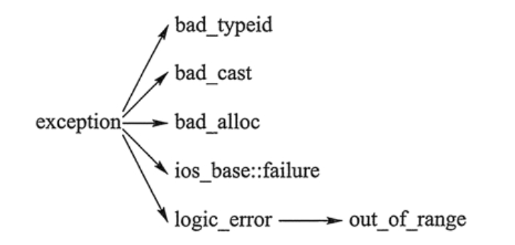

Q:阿秀笔记内


1.一个程序有几个区
程序段、代码段、数据段、。。。


[堆栈区](https://blog.csdn.net/Monster7559/article/details/89681517)
一：堆栈区

1.  一个由C/C++编译的程序占用的内存分为以下几个部分

（1）栈区（stack）
由编译器自动分配释放，存放函数的参数值，局部变量的值等。其操作方式类似于数据结构中的栈。
（2）堆区（heap）  
一般由程序员分配释放，若程序员不释放，程序结束时可能由OS回收 。注意它与数据结构中的堆是两回事，分配方式倒是类似于链表
（3）全局区（静态区）（static）全局变量和静态变量的存储是放在一块的，初始化的全局变量和静态变量在一块区域，未初始化的全局变量和未初始化的静态变量在相邻的另一块区域。
程序结束后由系统释放。
（4）文字常量区   
常量字符串就是放在这里的。 程序结束后由系统释放。
（5）程序代码区—存放函数体的二进制代码。

对于一个进程的内存空间而言，可以在逻辑上分成3个部份：代码区，静态数据区和动态数据区。动态数据区一般就是“堆栈”。“栈(stack)”和“堆(heap)”是两种不同的动态数据区，栈是一种线性结构，堆是一种链式结构。进程的每个线程都有私有的“栈”，所以每个线程虽然代码一样，但本地变量的数据都是互不干扰。一个堆栈可以通过“基地址”和“栈顶”地址来描述。全局变量和静态变量分配在静态数据区，本地变量分配在动态数据区，即堆栈中。程序通过堆栈的基地址和偏移量来访问本地变量。

2.堆栈的区别

（1）大小限制

Linux下虚拟地址空间分给进程本身的时3G，windows默认是2G  、

在我的Linux机器上，最大申请2.9G   windows下最多申请1.5G

 

栈：在Windows下,栈是向低地址扩展的数据结构，是一块连续的内存的区域。这句话的意思是栈顶的地址和栈的最大容量是系统预先规定好的。 一般是1M


堆：堆是向高地址扩展的数据结构，是不连续的内存区域。这是由于系统是用链表来存储的空闲内存地址的，自然是不连续的，而链表的遍历方向是由低地址向高地址。堆的大小受限于计算机系统中有效的虚拟内存。由此可见，堆获得的空间比较灵活，也比较大。

windows下32位程序如果单纯看地址空间能有4G左右的内存可用，不过实际上系统会把其中2G的地址留给内核使用，所以你的程序最大能用2G的内存。除去其他开销，你能用malloc申请到的内存只有1.9G左右。

Linux下一般是接近3G

（2）放置元素

栈：局部变量和状态信息（例如保存的寄存器值和返回地址）都存放在栈中

堆：malloc、new的

栈： 在函数调用时，第一个进栈的是主函数中后的下一条指令（函数调用语句的下一条可执行语句）的地址，然后是函数的各个参数，在大多数的C编译器中，参数是由右往左入栈的，然后是函数中的局部变量。注意静态变量是不入栈的。
当本次函数调用结束后，局部变量先出栈，然后是参数，最后栈顶指针指向最开始存的地址，也就是主函数中的下一条指令，程序由该点继续运行。
堆：一般是在堆的头部用一个字节存放堆的大小。堆中的具体内容有程序员安排。

（3）申请后系统的响应

栈：只要栈的剩余空间大于所申请空间，系统将为程序提供内存，否则将报异常提示栈溢出。
堆：首先应该知道操作系统有一个记录空闲内存地址的链表，当系统收到程序的申请时，
会遍历该链表，寻找第一个空间大于所申请空间的堆结点，然后将该结点从空闲结点链表中删除，并将该结点的空间分配给程序，另外，对于大多数系统，会在这块内存空间中的首地址处记录本次分配的大小，这样，代码中的delete语句才能正确的释放本内存空间。另外，由于找到的堆结点的大小不一定正好等于申请的大小，系统会自动的将多余的那部分重新放入空闲链表中。

3.关于堆

①堆区：分配内存块

显示分配器：要求 应用显示的释放任何已分配的块。C/C++中通过malloc申请就需要通过free释放，new空间就要delete释放
隐式分配器：要求分配器检测一个已分配块何时不再被程序所使用，那么就释放这个块。隐式分配器也叫垃圾收集器，而自动释放未使用的已分配的块叫做垃圾收集。Java等就是采用垃圾收集来释放已分配的块。
Malloc返回一个指针，malloc遇到问题，就会返回NULL，并设置error。Malloc不初始化它返回的内存。那些想要已初始化的动态内存的应用可以使用calloc，calloc是一个基于malloc的瘦包装函数，将分配的内存初始化为0.想要改变一个以前已分配块的大小，可以使用realloc函数。
动态内存分配器，例如malloc，可以通过使用mmap和mumap函数，显示的分配和释放堆内存。需要动态分配内存的原因就是有些数据结构的大小到实际运行时才知道。
造成堆利用率低的原因是因为碎片的存在。碎片分为内部碎片和外部碎片
②获取额外的堆内存

如果分配器不能为请求块找到合适的空闲区，一个选择是用过合并那些在内存中物理上相邻的空闲块来创建一些更大的内存块。但是这种方法是不能生成一个足够大的块，或者如果空闲块已经最大程度地合并了，那么分配器就会通过调用sbrk函数，向内核申请额外的堆内存。分配器将额外的内存转化成一个大的空闲块，将这个空闲块插入发哦空闲链表中，然后将被请求的块放置在这个新的空闲块中。


2. 结构体内存对齐问题
- 第二个例子？？
5. 堆和栈的区别
- 申请方式
- 申请大小
- 申请效率
- 对比 中的  队列 栈  链表

7.


### 另： 指针常量  和 常量指针
**区别：**

？？ 但指针常量 或者 常量指针 本身的定义是否与下述相反，有待分析

本文采取的方式是
指针常量： 指针本身是常量
常量指针： 指向常量的指针

而事实可能是
指针常量： pointer to const， (把中文倒过来读再解释) 指向常量的指针
常量指针： const pointer, (把中文倒过来读再解释) 指针本身是常量


1、“常量指针”的英文是“const pointer”，指针本身是常量，不能改变指向，例如：
`int * const p; // 常量指针`
2、“指针常量”的英文是“pointer to const”，其实应该翻译为“指向常量的指针”（一些经典的书籍都是这样翻译的，只是国内乱七八糟 的书籍太多，有些作者直译成了“指针 常量”，to被吃了），指向的内容是常量，指向的内容不可改变，例如：
`const int * p; // 指向常量的指针`


**顶层与底层const**
顶层 是指变量**本身**是一个常量，不管是数据类型变量还是指针类型变量。 **本身**无法修改。(const在*号右边)

底层，const修饰的变量**所指向的对象**是一个常量。
(const在*号左边)

(结合记忆： 左物右指，本身不可变,即const在右边为顶层)
(左物右指  左底右顶)
(非指针类型的const只可能是顶层const)

```c++
int a = 10;   
int* const b1 = &a;   //顶层const，b1 本身是一个常量
const int* b2 = &a;  // 底层const，b2 本身可变，
const int b3 = 20;   //顶层const，b3 变量(本身)不可变
const int* const b4 = &a; // 前一个const为底层，后一个const为顶层。b4不可变
const int& b5 = a;  // 用于声明引用变量，都是底层const
```

**作用**
- 执行对象拷贝时有限制，常量的底层const不能赋值给非常量的底层const
    ```c++  
    int * ptr_a = new int;

    // 允许：
    // 原本可以修改 ptr_a 指向的内存，现在让带 const 修饰符的 ptr_b 也指向一下
    // 只不过 ptr_b 不能直接修改指向的内容，但 ptr_a 可以
    // 也就相当于 linux 系统一个文件原本是可读可写的，现在你只需要读权限当然是可以的
    const int * ptr_b = ptr_a;

    const int * ptr_c = new int;
    // 不允许：
    // ptr_c 就像一个只读的文件，而给 ptr_d 赋值 ptr_c 就像你想以可读可写的方式打开一个只读文件
    // 显然是不被允许的，如果实在想这么做，则需要强制转换一下
    // 这种修饰符只是为了防止误操作以及对外的一种承诺，这是最小职责原则的一种体现
    // 但实际上并不能限制你乱搞的自由
    int * ptr_d = ptr_c;
    ```
- 使用命名的强制类型转换函数const_cast时，只能改变运算对象的底层const
`见阿秀Q: 25`


*以下参考*
指针常量就是指针本身是常量，换句话说，就是指针里面所存储的内容（内存地址）是常量，不能改变。但是，内存地址所对应的内容是可以通过指针改变的。

常量指针就是指向常量的指针，换句话说，就是指针指向的是常量，它指向的内容不能发生改变，不能通过指针来修改它指向的内容。但是，指针自身不是常量，它自身的值可以改变，从而指向另一个常量。

指针常量与常量指针的声明
**(可依据  const 在*号的位置，理解为 左物右指 )**
或者一种方式是看 * 和 const 的排列顺序，比如
     int const* p; //const * 即常量指针
     const int* p; //const * 即常量指针
     int* const p; //* const 即指针常量
还一种方式是看const离谁近，即从右往左看，比如
     int const* p; //const修饰的是*p，即*p的内容不可通过p改变，但p不是const，p可以修改，*p不可修改；
     const int* p; //同上
     int* const p; //const修饰的是p，p是指针，p指向的地址不能修改，p不能修改，但*p可以修改；

指针常量的声明：`数据类型 T * const 指针变量`。   

常量指针的声明：`数据类型 T const * 指针变量` 或者 `const 数据类型 T *指针变量`。

常量指针常量的声明：`数据类型 T const * const 指针变量` 或者 `const 数据类型 T * const 指针变量`。

指针常量与常量指针的使用

1 指针常量的例子
```c++  
/*指针常量的例子*/
int a,b; 
// 必须初始化
int * const p;   //错误
p = &a;          //错误
// 指针
int * const p = &a; //正确 
//p = &b;//错误 
*p = 20;//正确
```

指针常量声明的时候必须赋初始值。使用指针常量可以增加代码的可靠性和执行效率。

2 常量指针的例子
```c++  
/*常量指针的例子*/
int a,b; 
int const *p; 
p = &a;//正确 
p = &b;//正确 
  
*p = 20;//错误
```


---
### C++之const类成员变量，const成员函数 

const修饰类的成员函数

const修饰变量一般有两种方式：const T *a，或者 T const *a，这两者都是一样的，主要看const位于*的左边还是右边，这里不再赘述，主要来看一下当const修饰类的成员函数时，成员函数有什么特点。
https://www.cnblogs.com/cthon/p/9166715.html


类的成员函数后面加 const，表明这个函数不会对这个类对象的数据成员（准确地说是非静态数据成员）作任何改变。

在设计类的时候，一个原则就是对于不改变数据成员的成员函数都要在后面加 const，而对于改变数据成员的成员函数不能加 const。所以 const 关键字对成员函数的行为作了更加明确的限定：

（1）有 const 修饰的成员函数（指 const 放在函数参数表的后面，而不是在函数前面或者参数表内），只能读取数据成员，不能改变数据成员；没有 const 修饰的成员函数，对数据成员则是可读可写的。
（2）除此之外，在类的成员函数后面加 const 还有什么好处呢？那就是常量（即 const）对象可以调用 const 成员函数，而不能调用非const修饰的函数。


#include <stdio.h>
#include <stdlib.h>
#include <iostream>
using namespace std;
class A
{
public:
    void f()
    {
        cout<<"non const"<<endl;
    }
    void f() const
    {
        cout<<" const"<<endl;
    }
};
 
int main(int argc, char **argv)
{
    A a;
    a.f();
    const A &b=a;
    b.f();
    const A *c=&a;
    c->f();
    A *const d=&a;
    d->f();
    A *const e=d;
    e->f();
    const A *f=c;
    f->f();
    return 0;
}
　　注意：两个成员函数如果只是常量性不同，是可以被重载的。看下面解释的第二点：

C++的const类型成员函数（解释为什么非const成员函数不能访问const类对象的数据成员）
1. 在C++中只有被声明为const的成员函数才能被一个const类对象调用。
 在C++中，只有被声明为const的成员函数才能被一个const类对象调用。

如果要声明一个const类型的类成员函数，只需要在成员函数列表后加上关键字const， 例如：

class Screen {
    public:
        char get() const;
};
在类体之外定义const成员函数时，还必须加上const关键字，例如：

char Screen :: get() const {
    return _screen[_cursor];
} 
若将成员函数声明为const，则不允许通过其修改类的数据成员。 值得注意的是，如果类中存在指针类型的数据成员即便是const函数只能保证不修改该指针的值，并不能保证不修改指针指向的对象。例如：

复制代码
class Name {
public:
void setName(const string &s) const;
private:
    char *m_sName;
};
void setName(const string &s) const {
    m_sName = s.c_str();      // 错误！不能修改m_sName;
for (int i = 0; i < s.size(); ++i) 
    m_sName[i] = s[i];    // 不好的风格，但不是错误的
}
复制代码
 

2. const成员函数可以被对应的具有相同形参列表的非const成员函数重载，例如：
复制代码
class Screen {
public:
char get(int x,int y);
char get(int x,int y) const;
};
int main()
{
const Screen cs;
Screen cc2; 
char ch = cs.get(0, 0);  // 调用const成员函数  
ch = cs2.get(0, 0);     // 调用非const成员函数 
}
复制代码
在这种情况下，类对象的常量性决定调用哪一个函数： 

const成员函数可以访问非const对象的非const数据成员，const数据成员，也可以访问const对象内的所有数据成员；
非const成员函数只可以访问非const对象的任意的数据成员（不能访问const对象的任意数据成员）；（上述原因可详见C++Primer（5th）231页。 在默认情况下，this的类型是指向类类型非常量版本的常量指针，例如 Screen类中，this类型为 Screen *cosnt。当在成员函数的后面加上const关键字时，隐式的将this指针修改为 const Screen *const 即指向类类型常量版本的常量指针。根据初始化原则，我们不能将一个常量指针赋值给一个非常量指针）
作为一种良好的编程风格，在声明一个成员函数时，若该成员函数并不对数据成员进行修改， 应尽可能将该成员函数声明为const成员函数。
2. const修饰的是谁？
 const成员函数的写法有两种

　　1、void fun(int a，int b) const{}

　　2、void const fun(int a,int b){}

这两种写法的本质是：void fun (const 类 *this, int a,int b);

const修饰的不是形参a和b；const修饰的是属性this->a和this->b。与const所写的位置无关。

为什么？

因为c++对类的this指针做了隐藏，本质上，const指针修饰的是被隐藏的this指针所指向的内存空间，修饰的是this指针。

 

总结：

1）const成员函数可以访问非const对象的非const数据成员、const数据成员，也可以访问const对象内的所有数据成员；

2）非const成员函数可以访问非const对象的非const数据成员、const数据成员，但不可以访问const对象的任意数据成员；

3）作为一种良好的编程风格，在声明一个成员函数时，若该成员函数并不对数据成员进行修改操作，应尽可能将该成员函数声明为const 成员函数。

4）如果只有const成员函数，非const对象是可以调用const成员函数的。当const版本和非const版本的成员函数同时出现时，非const对象调用非const成员函数。

　　

补充：
化
> 类中的const成员变量都要放在初始列表之中进行
　　> const数据成员
　　> 引用数据成员
　　> 对象数据成员（内置类）

 

　　const成员函数
　　> void print() const => const 类名 * const this
　　> 在其内部是不能修改数据成员
　　> 只能调用const成员函数，不能调用非const成员函数
　　> const对象只能调用const成员函数,必须要提供一个const版本的成员函数

 

const成员函数和成员变量这一块的逻辑容易混乱！


### static  & const 作用

C++中const和static的作用
- static
    - 不考虑类的情况
        - **隐藏**。所有不加static的全局变量和函数具有全局可见性，可以在其他文件中使用，加了之后只能在该文件所在的编译模块中使用
        - 默认**初始化**为0，包括未初始化的全局静态变量与局部静态变量，都存在全局未初始化区
        - 静态变量在函数内定义，始终存在，且只进行一次初始化，具有**记忆**性，其**作用范围**与局部变量相同，函数退出后仍然存在，但不能使用
    - 考虑类的情况
        - static成员变量：只与类关联，不与类的对象关联。定义时要分配空间，不能在类声明中初始化，必须在类定义体**外部初始化**，初始化时不需要标示为static；可以被非static成员函数任意访问。
        - static成员函数：**不具有this指针**，无法访问类对象的非static成员变量和非static成员函数；不能被声明为const、虚函数和volatile；可以被非static成员函数任意访问
- const
    - 不考虑类的情况
    const常量在定义时必须初始化，之后无法更改
    const形参可以接收const和非const类型的实参，例如// i 可以是 int 型或者 const int 型void fun(const int& i){ //...}
    - 考虑类的情况
    const成员变量：不能在类定义外部初始化，只能通过构造函数初始化列表进行初始化，并且必须有构造函数；不同类对其const数据成员的值可以不同，所以不能在类中声明时初始化
    const成员函数：const对象不可以调用非const成员函数；非const对象都可以调用；不可以改变非mutable（用该关键字声明的变量可以在const成员函数中被修改）数据的值

[C++ 中 static 成员变量为什么不能类内初始化?](https://www.zhihu.com/question/36831446)

首先要明确编译时是多个文件单独编译的, 文件之间不知道对方有什么.非const的static变量如果在当前文件初始化的话, 编译器会将它翻译成一个强符号.

如果在类中初始化, 当这个类作为头文件的一员被引入到多个文件后, 就会产生多个名字相同的强符号, 链接时就会出现重复定义的错误.  
当static成员变量加上const后, 如果你文件里没有对它取地址等行为, 编译器可以根本不会给他分配内存,在汇编中直接用立即数代替这个static const 变量.
当static成员变量加上const后, 如果你文件中对它有取地址等行为, 他会变成一个强符号. 

如果多个文件中对它都有取地址操作, 链接的时候就会爆重复定义的错误非static成员变量就没上面这些重复定义的问题, 因为他们根本不在编译期产生符号.
补充:
为什么在头文件中定义的普通函数导入到多个文件后, 链接时会产生重复定义?
答: 普通函数是强符号 
为什么在头文件中定义的类成员函数导入到多个文件后, 链接时不会产生重复定义?
答: 类成员函数是弱符号


1 只有static const int 可以立即初始化， 换成static const char/double 都不行2 const 修饰， 编译器一般会优化进行替换， 或者直接分配到一个只读存储区， 后续多次修改，定义都没有关系3 static 修饰， 如果定义时直接初始化， 在多次创建同一个对象的时候会非预期地修改其值


#### 更具体的static作用
static的用法和作用？
1.先来介绍它的第一条也是最重要的一条：**隐藏**。（static函数，static变量均可）

当同时编译多个文件时，所有未加static前缀的全局变量和函数都具有全局可见性。

2.static的第二个作用是保持变量内容的持久**记忆**。（static变量中的记忆功能和全局生存期）存储在静态数据区的变量会在程序刚开始运行时就完成初始化，也是唯一的一次初始化。共有两种变量存储在静态存储区：全局变量和static变量，只不过和全局变量比起来，static可以控制变量的可见范围，说到底static还是用来隐藏的。

3.static的第三个作用是**默认初始化**为0（static变量）

其实全局变量也具备这一属性，因为全局变量也存储在静态数据区。在静态数据区，内存中所有的字节默认值都是0x00，某些时候这一特点可以减少程序员的工作量。

4.static的第四个作用：C++中的类成员声明static

1) 函数体内static变量的作用范围为该函数体，不同于auto变量，该变量的内存只被分配一次，因此其值在下次调用时仍维持上次的值；

2) 在模块内的static全局变量可以被模块内所有函数访问，但不能被模块外其它函数访问；

3) 在模块内的static函数只可被这一模块内的其它函数调用，这个函数的使用范围被限制在声明它的模块内；

4) 在类中的static成员变量属于整个类所拥有，对类的所有对象只有一份拷贝；

5) 在类中的static成员函数属于整个类所拥有，这个函数不接收this指针，因而只能访问类的static成员变量。

类内：

6) static类对象必须要在类外进行初始化，static修饰的变量先于对象存在，所以static修饰的变量要在类外初始化；

7) 由于static修饰的类成员属于类，不属于对象，因此static类成员函数是没有this指针的，this指针是指向本对象的指针。正因为没有this指针，所以static类成员函数不能访问非static的类成员，只能访问 static修饰的类成员；

8) static成员函数不能被virtual修饰，static成员不属于任何对象或实例，所以加上virtual没有任何实际意义；静态成员函数没有this指针，虚函数的实现是为每一个对象分配一个vptr指针，而vptr是通过this指针调用的，所以不能为virtual；虚函数的调用关系，this->vptr->ctable->virtual function


#### 更具体的const 作用

48、const关键字的作用有哪些?
1) **阻止**一个变量被改变，可以使用const关键字。在定义该const变量时，通常需要对它进行初始化，因为以后就没有机会再去改变它了；

2) 对**指针**来说，可以指定指针本身为const，也可以指定指针所指的数据为const，或二者同时指定为const；

3) 在一个函数声明中，const可以修饰**形参**，表明它是一个输入参数，在函数内部不能改变其值；

4) 对于类的成员函数，若指定其为const类型，则表明其是一个**常函数**，不能修改类的成员变量，类的常对象只能访问类的常成员函数；

5) 对于类的成员函数，有时候必须指定其**返回值**为const类型，以使得其返回值不为“左值”。

6) const成员函数可以访问非const对象的非const数据成员、const数据成员，也可以访问const对象内的所有数据成员；

7) 非const成员函数可以访问非const对象的非const数据成员、const数据成员，但不可以访问const对象的任意数据成员；(防止更改本不能更改的东西)

8) 一个没有明确声明为const的成员函数被看作是将要修改对象中数据成员的函数，而且编译器不允许它为一个const对象所调用。因此**const对象只能调用const成员函数**。

9) const类型变量可以通过类型转换符const_cast将const类型转换为非const类型；

10) const类型变量必须定义的时候进行初始化，因此也导致如果类的成员变量有const类型的变量，那么该变量必须在类的初始化列表中进行初始化；

11) 对于函数值传递的情况，因为参数传递是通过复制实参创建一个临时变量传递进函数的，函数内只能改变临时变量，但无法改变实参。则这个时候无论加不加const对实参不会产生任何影响。但是在引用或指针传递函数调用中，因为传进去的是一个引用或指针，这样函数内部可以改变引用或指针所指向的变量，这时const 才是实实在在地保护了实参所指向的变量。因为在编译阶段编译器对调用函数的选择是根据实参进行的，所以，只有引用传递和指针传递可以用是否加const来重载。一个拥有顶层const的形参无法和另一个没有顶层const的形参区分开来。


51、深拷贝与浅拷可以描述一下吗？
[C++细节 深拷贝和浅拷贝(位拷贝）详解](https://blog.csdn.net/weixin_41143631/article/details/81486817)
**浅复制 **：只是拷贝了基本类型的数据，而引用类型数据，复制后也是会发生引用，我们把这种拷贝叫做“（浅复制）浅拷贝”，换句话说，浅复制仅仅是指向被复制的内存地址，如果原地址中对象被改变了，那么浅复制出来的对象也会相应改变。

**深复制 **：在计算机中开辟了一块新的内存地址用于存放复制的对象。

在某些状况下，类内成员变量需要动态开辟堆内存，如果实行浅拷贝，也就是把对象里的值完全复制给另一个对象，如A=B。这时，如果B中有一个成员变量指针已经申请了内存，那A中的那个成员变量也指向同一块内存。这就出现了问题：当B把内存释放了（如：析构），这时A内的指针就是野指针了，出现运行错误。


**浅拷贝**：位拷贝，拷贝构造函数，赋值重载
多个对象共用同一块资源，同一块资源释放多次，崩溃或者内存泄漏。
缺省拷贝构造函数在拷贝过程中是按字节复制的，对于指针型成员变量只复制指针本身，而不复制指针所指向的目标--浅拷贝。

**深拷贝**：每个对象共同拥有自己的资源，必须显式提供拷贝构造函数和赋值运算符。


---


26. 数组名和指针(指向数组首元素的指针)的区别？
- 均可以增减量来访问元素
- 数组名不是真正意义生的指针，可以理解为**常指针**。所以数组名不可以自增、自减。
- 当数组名作为形参传递给调用函数后，就失去了原有特性。**退化**为一般指针后，多了自增、自减操作，但sizeof运算符得不到原数组的大小了。只能得到相应的8 (64为系统指针的大小)
```c++  
#include <iostream>
using namespace std;

void fun(int * a)
{
	cout << sizeof a;	
}
int main()
{
	int a[10];
	cout << sizeof a;
	cout << endl;
	
	int * b = a;
	cout << sizeof b;
	cout << endl;
	
	fun(a);      // 退化

   return 0;
}
```


28. 拷贝初始化 & 直接初始化
- 区别


31.野指针和悬空指针
都是是指向无效内存区域(这里的无效指的是"不安全不可控")的指针，访问行为将会导致未定义行为。

野指针
野指针，指的是没有被初始化过的指针
```c++  
int main(void) { 

    int* p;     // 未初始化
    std::cout<< *p << std::endl; // 未初始化就被使用

    return 0;
}
```

 
因此，为了防止出错，对于指针初始化时都是赋值为 nullptr，这样在使用时编译器就会直接报错，产生非法内存访问。

悬空指针
悬空指针，指针最初指向的内存已经被释放了的一种指针。
```c++  
int main(void) { 
  int * p = nullptr;
  int* p2 = new int;

  p = p2;

  delete p2;
}
```

 
此时 p和p2就是悬空指针，指向的内存已经被释放。继续使用这两个指针，行为不可预料。需要设置为p=p2=nullptr。此时再使用，编译器会直接保错。 避免野指针比较简单，但悬空指针比较麻烦。c++引入了智能指针，C++智能指针的本质就是避免悬空指针的产生。

产生原因及解决办法：

野指针：指针变量未及时初始化 => 定义指针变量及时初始化，要么置空。

悬空指针：指针free或delete之后没有及时置空 => 释放操作后立即置空。

33. C++中的重载、重写（覆盖）和隐藏的区别

（1）**重载**（overload）

重载是指在同一范围定义中的同名成员函数才存在重载关系。主要特点是函数名相同，参数类型和数目有所不同，不能出现参数个数和类型均相同，仅仅依靠返回值不同来区分的函数。重载和函数成员是否是虚函数无关。举个例子：

```c++  

class A{
    ...
    virtual int fun();
    void fun(int);
    void fun(double, double);
    static int fun(char);
    ...
}
```
（2）**重写（覆盖）**（override）

重写指的是在派生类中覆盖基类中的同名函数，重写就是重写函数体，要求基类函数必须是虚函数且：

与基类的虚函数有相同的参数个数
与基类的虚函数有相同的参数类型
与基类的虚函数有相同的返回值类型
举个例子：


```c++  
//父类
class A{
public:
    virtual int fun(int a){}
}
//子类
class B : public A{
public:
    //重写,一般加override可以确保是重写父类的函数
    virtual int fun(int a) override{}
}
```
重载与重写的区别：

重写是父类和子类之间的垂直关系，重载是不同函数之间的水平关系
重写要求参数列表相同，重载则要求参数列表不同，返回值不要求
重写关系中，调用方法根据对象类型决定，重载根据调用时实参表与形参表的对应关系来选择函数体
（3）**隐藏**（hide）

隐藏指的是某些情况下，派生类中的函数屏蔽了基类中的同名函数，包括以下情况：

两个函数参数相同，但是基类函数不是虚函数。和重写的区别在于基类函数是否是虚函数。举个例子：

```c++  
//父类
class A{
public:
    void fun(int a){
        cout << "A中的fun函数" << endl;
    }
};
//子类
class B : public A{
public:
    //隐藏父类的fun函数
    void fun(int a){
        cout << "B中的fun函数" << endl;
    }
};
int main(){
    B b;
    b.fun(2); //调用的是B中的fun函数
    b.A::fun(2); //调用A中fun函数
    return 0;
}
```
两个函数参数不同，无论基类函数是不是虚函数，都会被隐藏。和重载的区别在于两个函数不在同一个类中。举个例子：
```c++  
//父类
class A{
public:
    virtual void fun(int a){
        cout << "A中的fun函数" << endl;
    }
};
//子类
class B : public A{
public:
    //隐藏父类的fun函数
   virtual void fun(char* a){
       cout << "A中的fun函数" << endl;
   }
};
int main(){
    B b;
    b.fun(2); //报错，调用的是B中的fun函数，参数类型不对
    b.A::fun(2); //调用A中fun函数
    return 0;
}
```

 
补充：
```c++  
// 父类
class A {
public:
    virtual void fun(int a) { // 虚函数
        cout << "This is A fun " << a << endl;
    }  
    void add(int a, int b) {
        cout << "This is A add " << a + b << endl;
    }
};

// 子类
class B: public A {
public:
    void fun(int a) override {  // 覆盖
        cout << "this is B fun " << a << endl;
    }
    void add(int a) {   // 隐藏
        cout << "This is B add " << a + a << endl;
    }
};

int main() {
    // 基类指针指向派生类对象时，基类指针可以直接调用到派生类的覆盖函数，也可以通过 :: 调用到基类被覆盖
    // 的虚函数；而基类指针只能调用基类的被隐藏函数，无法识别派生类中的隐藏函数。

    A *p = new B();
    p->fun(1);      // 调用子类 fun 覆盖函数
    p->A::fun(1);   // 调用父类 fun
    p->add(1, 2);
    // p->add(1);      // 错误，识别的是 A 类中的 add 函数，参数不匹配
    // p->B::add(1);   // 错误，无法识别子类 add 函数
    return 0;
}
```
34. C++有哪几种的构造函数 ??
C++中的构造函数可以分为4类：

默认构造函数
初始化构造函数（有参数）
拷贝构造函数
移动构造函数（move和右值引用）
委托构造函数
转换构造函数
略


35、浅拷贝和深拷贝的区别
浅拷贝

浅拷贝只是拷贝一个指针，并没有新开辟一个地址，拷贝的指针和原来的指针指向同一块地址，如果原来的指针所指向的资源释放了，那么再释放浅拷贝的指针的资源就会出现错误。

深拷贝

深拷贝不仅拷贝值，还开辟出一块新的空间用来存放新的值，即使原先的对象被析构掉，释放内存了也不会影响到深拷贝得到的值。在自己实现拷贝赋值的时候，如果有指针变量的话是需要自己实现深拷贝的。


36、内联函数和宏定义的区别
在使用时，宏只做简单字符串替换（编译前）。而内联函数可以进行参数类型检查（编译时），且具有返回值。
内联函数在编译时直接将函数代码嵌入到目标代码中，省去函数调用的开销来提高执行效率，并且进行参数类型检查，具有返回值，可以实现重载。
宏定义时要注意书写（参数要括起来）否则容易出现歧义，内联函数不会产生歧义
内联函数有类型检测、语法判断等功能，而宏没有
内联函数适用场景:

使用宏定义的地方都可以使用 inline 函数。
作为类成员接口函数来读写类的私有成员或者保护成员，会提高效率。
但有递归调用、和for循环的地方不可使用吧？


38. 如何用代码判断大小端存储？（低低小) 

不同的CPU有不同的字节序类型 这些字节序是指整数在内存中保存的顺序 这个叫做主机序
最常见的有两种：
大端存储BE big-endian：字数据的高字节存储在低地址中

小端存储LE little-endian：字数据的低字节存储在低地址中

例如：32bit的数字0x12345678

所以在Socket编程中，往往需要将操作系统所用的小端存储的IP地址转换为大端存储，这样才能进行网络传输,如TCP/IP

小端模式中的存储方式为：

|内存地址|0x4000| 0x4001| 0x4002| 0x4003|
|:--|:--|:--|:--|--|
|存放内容|0x78 | 0x56 | 0x34 | 0x12|


|

大端模式中的存储方式为：

|内存地址|0x4000| 0x4001| 0x4002| 0x4003|
|:--|:--|:--|:--|--|
|存放内容|0x12 | 0x34 | 0x56 | 0x78


了解了大小端存储的方式，如何在代码中进行判断呢？下面介绍两种判断方式：

方式一：使用强制类型转换  
```c++  
#include <iostream>
using namespace std;
int main()
{
    int a = 0x1234;//0x12 34 56 78     
    //由于int和char的长度不同，借助int型转换成char型，只会留下低地址的部分
    char c = (char)(a);
    if (c == 0x12)
        cout << "big endian" << endl;
    else if(c == 0x34)
        cout << "little endian" << endl;
}
```

 
方式二：巧用union联合(共用)体
```c++  
#include <iostream>
using namespace std;
//union联合体的重叠式存储，endian联合体占用内存的空间为每个成员字节长度的最大值
union endian
{
    int a;
    char ch;
};
int main()
{
    endian value;
    value.a = 0x1234;
    //a和ch共用4字节的内存空间
    if (value.ch == 0x12)
        cout << "big endian"<<endl;
    else if (value.ch == 0x34)
        cout << "little endian"<<endl;
}
```

**网络字节顺序**
是TCP/IP中规定好的一种数据表示格式，它与具体的CPU类型、操作系统等无关，从而可以保证数据在不同主机之间传输时能够被正确解释。网络字节顺序采用big endian排序方式。


---
未整理

39、volatile、mutable和explicit关键字的用法
(1)volatile

volatile 关键字是一种类型修饰符，用它声明的类型变量表示可以被某些编译器未知的因素更改，比如：操作系统、硬件或者其它线程等。遇到这个关键字声明的变量，编译器对访问该变量的代码就不再进行优化，从而可以提供对特殊地址的稳定访问。

当要求使用 volatile 声明的变量的值的时候，系统总是重新从它所在的内存读取数据，即使它前面的指令刚刚从该处读取过数据。

volatile定义变量的值是易变的，每次用到这个变量的值的时候都要去重新读取这个变量的值，而不是读寄存器内的备份。多线程中被几个任务共享的变量需要定义为volatile类型。

volatile 指针

volatile 指针和 const 修饰词类似，const 有常量指针和指针常量的说法，volatile 也有相应的概念

修饰由指针指向的对象、数据是 const 或 volatile 的：

const char* cpch;volatile char* vpch;
Copy to clipboardErrorCopied
指针自身的值——一个代表地址的整数变量，是 const 或 volatile 的：

char* const pchc;char* volatile pchv;
Copy to clipboardErrorCopied
注意：

可以把一个非volatile int赋给volatile int，但是不能把非volatile对象赋给一个volatile对象。
除了基本类型外，对用户定义类型也可以用volatile类型进行修饰。
C++中一个有volatile标识符的类只能访问它接口的子集，一个由类的实现者控制的子集。用户只能用const_cast来获得对类型接口的完全访问。此外，volatile向const一样会从类传递到它的成员。
多线程下的volatile

有些变量是用volatile关键字声明的。当两个线程都要用到某一个变量且该变量的值会被改变时，应该用volatile声明，该关键字的作用是防止优化编译器把变量从内存装入CPU寄存器中。如果变量被装入寄存器，那么两个线程有可能一个使用内存中的变量，一个使用寄存器中的变量，这会造成程序的错误执行。volatile的意思是让编译器每次操作该变量时一定要从内存中真正取出，而不是使用已经存在寄存器中的值。

（2）mutable

mutable的中文意思是“可变的，易变的”，跟constant（既C++中的const）是反义词。在C++中，mutable也是为了突破const的限制而设置的。被mutable修饰的变量，将永远处于可变的状态，即使在一个const函数中。我们知道，如果类的成员函数不会改变对象的状态，那么这个成员函数一般会声明成const的。但是，有些时候，我们需要在const函数里面修改一些跟类状态无关的数据成员，那么这个函数就应该被mutable来修饰，并且放在函数后后面关键字位置。

样例

class person
{
int m_A;
mutable int m_B;//特殊变量 在常函数里值也可以被修改
public:
     void add() const//在函数里不可修改this指针指向的值 常量指针
     {
        m_A=10;//错误  不可修改值，this已经被修饰为常量指针
        m_B=20;//正确
     }
}

class person
{
int m_A;
mutable int m_B;//特殊变量 在常函数里值也可以被修改
}
int main()
{
const person p;//修饰常对象 不可修改类成员的值
p.m_A=10;//错误，被修饰了指针常量
p.m_B=200;//正确，特殊变量，修饰了mutable
}
Copy to clipboardErrorCopied
（3）explicit

explicit关键字用来修饰类的构造函数，被修饰的构造函数的类，不能发生相应的隐式类型转换，只能以显示的方式进行类型转换，注意以下几点：

explicit 关键字只能用于类内部的构造函数声明上

explicit 关键字作用于单个参数的构造函数

被explicit修饰的构造函数的类，不能发生相应的隐式类型转换


40. 什么情况下会调用拷贝构造函数

一个对象以**值传递**的方式**传入**函数体
一个对象以**值传递**的方式从函数**返回**
一个对象需要通过另外一个对象进行**初始化**。

- 1.用类的一个实例化对象去初始化另一个对象的时候
- 2.函数的参数是类的对象时（非引用传递）
- 3.函数的返回值是函数体内局部对象的类的对象时 ,此时虽然发生（Named return Value优化）NRV优化，但是由于返回方式是值传递，所以会在返回值的地方调用拷贝构造函数
另：第三种情况在Linux g++ 下则不会发生拷贝构造函数，不仅如此即使返回局部对象的引用，依然不会发生拷贝构造函数

情况1比较好理解

情况2的实现过程是，调用函数时先根据传入的实参产生临时对象，再用拷贝构造去初始化这个临时对象，在函数中与形参对应，函数调用结束后析构临时对象

情况3在执行return时，理论的执行过程是：产生临时对象，调用拷贝构造函数把返回对象拷贝给临时对象，函数执行完先析构局部变量，再析构临时对象， 依然会调用拷贝构造函数


41、C++中有几种类型的new（具体看原笔记)
在C++中，new有三种典型的使用方法：plain new，nothrow new和placement new
（1）plain new

言下之意就是普通的new，就是我们常用的new，在C++中定义如下：

void* operator new(std::size_t) throw(std::bad_alloc);
void operator delete(void *) throw();
Copy to clipboardErrorCopied
因此plain new在空间分配失败的情况下，抛出异常std::bad_alloc而不是返回NULL，因此通过判断返回值是否为NULL是徒劳的，
（2）nothrow new

nothrow new在空间分配失败的情况下是不抛出异常，而是返回NULL，定义如下：


（3）placement new

这种new允许在一块已经分配成功的内存上重新构造对象或对象数组。placement new不用担心内存分配失败，因为它根本不分配内存，它做的唯一一件事情就是调用对象的构造函数。定义如下：


42、C++的异常处理的方法
在程序执行过程中，由于程序员的疏忽或是系统资源紧张等因素都有可能导致异常，任何程序都无法保证绝对的稳定，常见的异常有：

数组下标越界
除法计算时除数为0
动态分配空间时空间不足
...
如果不及时对这些异常进行处理，程序多数情况下都会崩溃。

（1）try、throw和catch关键字

C++中的异常处理机制主要使用try、throw和catch三个关键字，其在程序中的用法如下：

#include <iostream>
using namespace std;
int main()
{
    double m = 1, n = 0;
    try {
        cout << "before dividing." << endl;
        if (n == 0)
            throw - 1;  //抛出int型异常
        else if (m == 0)
            throw - 1.0;  //拋出 double 型异常
        else
            cout << m / n << endl;
        cout << "after dividing." << endl;
    }
    catch (double d) {
        cout << "catch (double)" << d << endl;
    }
    catch (...) {
        cout << "catch (...)" << endl;
    }
    cout << "finished" << endl;
    return 0;
}
//运行结果
//before dividing.
//catch (...)
//finished
Copy to clipboardErrorCopied
代码中，对两个数进行除法计算，其中除数为0。可以看到以上三个关键字，程序的执行流程是先执行try包裹的语句块，如果执行过程中没有异常发生，则不会进入任何catch包裹的语句块，如果发生异常，则使用throw进行异常抛出，再由catch进行捕获，throw可以抛出各种数据类型的信息，代码中使用的是数字，也可以自定义异常class。catch根据throw抛出的数据类型进行精确捕获（不会出现类型转换），如果匹配不到就直接报错，可以使用catch(...)的方式捕获任何异常（不推荐）。当然，如果catch了异常，当前函数如果不进行处理，或者已经处理了想通知上一层的调用者，可以在catch里面再throw异常。

（2）函数的异常声明列表

有时候，程序员在定义函数的时候知道函数可能发生的异常，可以在函数声明和定义时，指出所能抛出异常的列表，写法如下：

int fun() throw(int,double,A,B,C){...};
Copy to clipboardErrorCopied
这种写法表名函数可能会抛出int,double型或者A、B、C三种类型的异常，如果throw中为空，表明不会抛出任何异常，如果没有throw则可能抛出任何异常

（3）C++标准异常类 exception

C++ 标准库中有一些类代表异常，这些类都是从 exception 类派生而来的，如下图所示


bad_typeid：使用typeid运算符，如果其操作数是一个多态类的指针，而该指针的值为 NULL，则会拋出此异常，例如：
#include <iostream>
#include <typeinfo>
using namespace std;

class A{
public:
  virtual ~A();
};

using namespace std;
int main() {
    A* a = NULL;
    try {
          cout << typeid(*a).name() << endl; // Error condition
      }
    catch (bad_typeid){
          cout << "Object is NULL" << endl;
      }
    return 0;
}
//运行结果：bject is NULL
Copy to clipboardErrorCopied
bad_cast：在用 dynamic_cast 进行从多态基类对象（或引用）到派生类的引用的强制类型转换时，如果转换是不安全的，则会拋出此异常
bad_alloc：在用 new 运算符进行动态内存分配时，如果没有足够的内存，则会引发此异常
out_of_range:用 vector 或 string的at 成员函数根据下标访问元素时，如果下标越界，则会拋出此异常


46、值传递、指针传递、引用传递的区别和效率
1) 值传递：有一个形参向函数所属的栈拷贝数据的过程，如果值传递的对象是类对象 或是大的结构体对象，将耗费一定的时间和空间。（传值）

2) 指针传递：同样有一个形参向函数所属的栈拷贝数据的过程，但拷贝的数据是一个固定为4字节的地址。（传值，传递的是地址值）

3) 引用传递：同样有上述的数据拷贝过程？？，但其是针对地址的，相当于为该数据所在的地址起了一个别名。（传地址）

4) 效率上讲，指针传递和引用传递比值传递效率高。一般主张使用引用传递，代码逻辑上更加紧凑、清晰。


### 静态变量什么时候初始化
1) 初始化只有一次，但是可以多次赋值，在主程序之前，编译器已经为其分配好了内存。

2) 静态局部变量和全局变量一样，数据都存放在全局区域，所以在主程序之前，编译器已经为其分配好了内存，但在C和C++中静态局部变量的初始化节点又有点不太一样。在C中，初始化发生在代码执行之前，编译阶段分配好内存之后，就会进行初始化，所以我们看到在C语言中无法使用变量对静态局部变量进行初始化，在程序运行结束，变量所处的全局内存会被全部回收。

3) 而在C++中，初始化时在执行相关代码时才会进行初始化，主要是由于C++引入对象后，要进行初始化必须执行相应构造函数和析构函数，在构造函数或析构函数中经常会需要进行某些程序中需要进行的特定操作，并非简单地分配内存。所以C++标准定为全局或静态对象是有**首次用到时**才会进行构造，并通过atexit()来管理。在程序结束，按照构造顺序反方向进行逐个析构。所以在C++中是可以使用变量对静态局部变量进行初始化的。


##### C++中新增了string，它与C语言中的 char *有什么区别吗？它是如何实现的？
string继承自basic_string,其实是对char*进行了封装，封装的string包含了char*数组，容量，长度等等属性。

string可以进行动态扩展，在每次扩展的时候另外申请一块原空间大小两倍的空间（2^n），然后将原字符串拷贝过去，并加上新增的内容。

#### 什么是内存泄露，如何检测与避免
内存泄露

一般我们常说的内存泄漏是指堆内存的泄漏。堆内存是指程序从堆中分配的，大小任意的(内存块的大小可以在程序运行期决定)内存块，使用完后必须显式释放的内存。应用程序般使用malloc,、realloc、 new等函数从堆中分配到块内存，使用完后，程序必须负责相应的调用free或delete释放该内存块，否则，这块内存就不能被再次使用，我们就说这块内存泄漏了

**避免内存泄露的几种方式**

**计数法**：使用new或者malloc时，让该数+1，delete或free时，该数-1，程序执行完打印这个计数，如果不为0则表示存在内存泄露
一定要将基类的**析构**函数声明为**虚函数**
**对象数组**的释放一定要用**delete []**
有new就有delete，有malloc就有free，保证它们一定**成对**出现

检测工具

Linux下可以使用Valgrind工具
Windows下可以使用CRT库


63起未整理


68、说说移动构造函数
1) 我们用对象a初始化对象b，后对象a我们就不在使用了，但是对象a的空间还在呀（在析构之前），既然拷贝构造函数，实际上就是把a对象的内容复制一份到b中，那么为什么我们不能直接使用a的空间呢？这样就避免了新的空间的分配，大大降低了构造的成本。这就是移动构造函数设计的初衷；

2) 拷贝构造函数中，对于指针，我们一定要采用深层复制，而移动构造函数中，对于指针，我们采用浅层复制。浅层复制之所以危险，是因为两个指针共同指向一片内存空间，若第一个指针将其释放，另一个指针的指向就不合法了。

所以我们只要避免第一个指针释放空间就可以了。避免的方法就是将第一个指针（比如a->value）置为NULL，这样在调用析构函数的时候，由于有判断是否为NULL的语句，所以析构a的时候并不会回收a->value指向的空间；

3) 移动构造函数的参数和拷贝构造函数不同，拷贝构造函数的参数是一个左值引用，但是移动构造函数的初值是一个右值引用。意味着，移动构造函数的参数是一个右值或者将亡值的引用。也就是说，只有用一个右值，或者将亡值初始化另一个对象的时候，才会调用移动构造函数。而那个move语句，就是将一个左值变成一个将亡值。


---

## 83. 说一说你理解的内存对齐以及原因
- 1、 分配内存的顺序是按照声明的顺序。  
- 2、 每个变量相对于起始位置的偏移量必须是该变量类型大小的整数倍，不是整数倍空出内存，直到偏移量是整数倍为止。
- 3、 最后整个结构体的大小必须是里面变量类型最大值的整数倍。
添加了#pragma pack(n)后规则就变成了下面这样：  
- 1、 偏移量要是n和当前变量大小中较小值的整数倍  
- 2、 整体大小要是n和最大变量大小中较小值的整数倍  
- 3、 n值必须为1,2,4,8…，为其他值时就按照默认的分配规则  

`其中string占用32个字节。。。`
如
```c++  
#include <iostream>
#include <cstring>
using namespace std;
struct T{       // 4
	int a;
};
struct T{        // 16
	int a;
	double b;
};
struct T{            // 32+8+8==48
	int a;
	double b;
	string aa;
};
struct T{            // 56
	int a;
	double b;
	string aa;
	char aaa;
};
int main()
{
    cout << sizeof(T) << endl;
    return 0;
}
```

85. 函数调用过程栈的变化，返回值和参数变量哪个先入栈？
87. 你知道printf函数的实现原理是什么吗？
88. 为什么模板类一般都是放在一个h文件中
94. 全局变量和static变量的区别？？


97. 隐式转换 如何消除隐式转换？


1、C++的基本类型中并非完全的对立，部分数据类型之间是可以进行隐式转换的。所谓**隐式转换**，是指不需要用户干预，编译器私下进行的类型转换行为。很多时候用户可能都不知道进行了哪些转换

2、C++面向对象的**多态**特性，就是通过父类的类型实现对子类的封装。通过隐式转换，你可以直接将一个子类的对象使用父类的类型进行返回。在比如，数值和布尔类型的转换，整数和浮点数的转换等。某些方面来说，隐式转换给C++程序开发者带来了不小的便捷。C++是一门**强类型语言**，类型的检查是非常严格的。

3、 **基本数据类型** 基本数据类型的转换以取值范围作为转换基础（保证精度不丢失）。隐式转换发生在从小->大的转换中。比如从char转换为int。从int->long。**自定义对象** 子类对象可以隐式的转换为父类对象。

4、 C++中提供了**explicit关键字**，在构造函数声明的时候加上explicit关键字，能够禁止隐式转换。
如果构造函数只接受一个参数(或者除了第一个参数外其余参数都有默认值的多参构造函数)，则它实际上定义了转换为此类类型的隐式转换机制。可以通过将构造函数声明为explicit加以**制止隐式类型转换**，关键字explicit只对一个实参的构造函数有效，需要多个实参的构造函数不能用于执行隐式转换，所以无需将这些构造函数指定为explicit。


**补充：explict关键字**
C++提供了关键字explicit，可以阻止不应该允许的经过转换构造函数进行的隐式转换的发生,声明为explicit的构造函数不能在隐式转换中使用。
C++中， 一个参数的构造函数(或者除了第一个参数外其余参数都有默认值的多参构造函数)， 承担了两个角色。 
- 1 是个构造；
- 2 是个默认且隐含的类型转换操作符。
所以， 有时候在我们写下如 AAA = XXX， 这样的代码， 且恰好XXX的类型正好是AAA单参数构造器的参数类型， 这时候编译器就自动调用这个构造器， 创建一个AAA的对象。

这样看起来好象很酷， 很方便。 但在某些情况下， 却违背了程序员的本意。 这时候就要在这个构造器前面加上explicit修饰， 指定这个构造器只能被明确的调用/使用， 不能作为类型转换操作符被隐含的使用。


98. 处理异常

1) C++中的异常情况： 
**语法错误（编译错误）**：比如变量未定义、括号不匹配、关键字拼写错误等等编译器在编译时能发现的错误，这类错误可以及时被编译器发现，而且可以及时知道出错的位置及原因，方便改正。 
**运行时错误**：比如数组下标越界、系统内存不足、打开文件读取时，文件不存在等等。这类错误不易被程序员发现，它能通过编译且能进入运行，但运行时会出错，导致程序崩溃。为了有效处理程序运行时错误，C++中引入异常处理机制来解决此问题。

2) C++异常处理机制： 异常处理基本思想：执行一个函数的过程中发现异常，可以不用在本函数内立即进行处理， 而是抛出该异常，让函数的调用者直接或间接处理这个问题。 以此类推，如果一层层的函数都不处理异常，异常最终会被拋给最外层的 main 函数。main 函数应该处理异常。如果main函数也不处理异常，那么程序就会立即异常地中止。

C++异常处理机制由3个模块组成：**try(检查)、throw(抛出)、catch(捕获)** 
抛出异常的语句格式为：throw 表达式；如果try块中程序段发现了异常则抛出异常。

```c++  
try  {  可能抛出异常的语句；（检查） try 
 { 
 可能抛出异常的语句；（检查） 
 } 
 catch（类型名[形参名]）//捕获特定类型的异常 
 { 
 //处理1； 
 } 
 catch（类型名[形参名]）//捕获特定类型的异常 
 { 
 //处理2； 
 } 
 catch（…）//捕获所有类型的异常 
 { 
 }
```
C++标准异常类
C++ 标准库中有一些类代表异常，这些类都是从 exception 类派生而来的。常用的几个异常类如下图所示。


- **1) bad_typeid**
使用 typeid 运算符时，如果其操作数是一个多态类的指针，而该指针的值为 NULL，则会拋出此异常。
- **2) bad_cast**
在用 dynamic_cast 进行从多态基类对象（或引用）到派生类的引用的强制类型转换时，如果转换是不安全的，则会拋出此异常。程序示例如下：
```c++  
#include <iostream>
#include <stdexcept>
using namespace std;
class Base
{
    virtual void func() {}
};
class Derived : public Base
{
public:
    void Print() {}
};
void PrintObj(Base & b)
{
    try {
        Derived & rd = dynamic_cast <Derived &>(b);
        //此转换若不安全，会拋出 bad_cast 异常
        rd.Print();
    }
    catch (bad_cast & e) {
        cerr << e.what() << endl;
    }
}
int main()
{
    Base b;
    PrintObj(b);
    return 0;
}

```
程序的输出结果如下：`Bad dynamic_cast!`

在 PrintObj 函数中，通过 dynamic_cast 检测 b 是否引用的是一个 Derived 对象，如果是，就调用其 Print 成员函数；如果不是，就拋出异常，不会调用 Derived::Print。
- **3) bad_alloc**
在用 new 运算符进行动态内存分配时，如果没有足够的内存，则会引发此异常。程序示例如下：
```c++  
#include <iostream>
#include <stdexcept>
using namespace std;
int main()
{
    try {
        char * p = new char[0x7fffffff];  //无法分配这么多空间，会抛出异常
    }
    catch (bad_alloc & e)  {
        cerr << e.what() << endl;
    }
    return 0;
}
```
程序的输出结果如下：
`bad allocation`
`ios_base::failure`

在默认状态下，输入输出流对象不会拋出此异常。如果用流对象的 exceptions 成员函数设置了一些标志位，则在出现打开文件出错、读到输入流的文件尾等情况时会拋出此异常。此处不再赘述。
- **4) out_of_range**
用 vector 或 string 的 at 成员函数根据下标访问元素时，如果下标越界，则会拋出此异常。例如：
```c++  
#include <iostream>
#include <stdexcept>
#include <vector>
#include <string>
using namespace std;
int main()
{
    vector<int> v(10);
    try {
        v.at(100) = 100;  //拋出 out_of_range 异常
    }
    catch (out_of_range & e) {
        cerr << e.what() << endl;
    }
    string s = "hello";
    try {
        char c = s.at(100);  //拋出 out_of_range 异常
    }
    catch (out_of_range & e) {
        cerr << e.what() << endl;
    }
    return 0;
}
```

程序的输出结果如下：
`invalid vector <T> subscript`
`invalid string position`

如果将v.at(100)换成v[100]，将s.at(100)换成s[100]，程序就不会引发异常（但可能导致程序崩溃）。因为 at 成员函数会检测下标越界并拋出异常，而 operator[] 则不会。operator [] 相比 at 的好处就是不用判断下标是否越界，因此执行速度更快。


[Article:C++异常处理（try catch throw）完全攻略](http://c.biancheng.net/view/422.html)


99. 如何在不使用额外空间的情况下，交换两个数？你有几种方法
1)  算术
```c++  
x = x + y;  // 还是要防止溢出啊
y = x - y;
x = x - y; 
```
2)  异或
```c++  
x = x^y;    // 只能对int,char..
y = x^y;    // 即 y = (x^y)^y   即y = x
x = x^y;    // 即 x = (x^y)^x   即x = y 
x ^= y ^= x;   // ？？？
```


102. volatile关键字作用
**关键词：线程、类型、安全、编译、优化**

volatile 关键字是一种类型修饰符，用它声明的类型变量表示可以被某些编译器未知的因素更改，比如：操作系统、硬件或者其它线程等。遇到这个关键字声明的变量，编译器对访问该变量的代码就**不再进行优化**，从而可以提供对特殊地址的稳定访问。声明时语法：int volatile vInt; 当要求使用 volatile 声明的变量的值的时候，系统总是**重新从它所在的内存读取数据**，即使它前面的指令刚刚从该处读取过数据。而且读取的数据立刻被保存。

volatile用在如下的几个地方：

- 1) 中断服务程序中修改的供其它程序检测的变量需要加volatile；
- 2) 多任务环境下**各任务间共享**的标志应该加volatile； 
- 3) 存储器映射的硬件寄存器通常也要加volatile说明，因为每次对它的读写都可能由不同意义；

**volatile 指针**
和 const 修饰词类似，const 有常量指针和指针常量的说法，volatile 也有相应的概念：
- 修饰由指针指向的对象、数据是 const 或 volatile 的：
```c++  
const char* cpch;  
volatile char* vpch;  
```
- 指针自身的值，一个代表地址的整数变量，是 const 或 volatile 的
```c++  
char*const pchc;  
char*volatile pchv; 
```
**注意：**
(1) 可以把一个非volatile int赋给volatile int，但是不能把非volatile对象赋给一个volatile对象。
(2) 除了基本类型外，对用户定义类型也可以用volatile类型进行修饰。
(3) C++中一个有volatile标识符的类只能访问它接口的子集，一个由类的实现者控制的子集。用户只能用const_cast来获得对类型接口的完全访问。此外，volatile向const一样会从类传递到它的成员。

**重点：多线程下的volatile**  
有些变量是用volatile关键字声明的。当两个线程都要用到某一个变量且该变量的值会被改变时，应该用volatile声明，该关键字的作用是防止优化编译器把变量从内存装入CPU寄存器中。如果变量被装入寄存器，那么两个线程有可能一个使用内存中的变量，一个使用寄存器中的变量，这会造成程序的错误执行。volatile的意思是让编译器每次操作该变量时一定要从内存中真正取出，而不是使用已经存在寄存器中的值


[Article:详解C/C++中volatile关键字](https://blog.csdn.net/weixin_44363885/article/details/92838607?spm=1001.2101.3001.6650.2&utm_medium=distribute.pc_relevant.none-task-blog-2%7Edefault%7ECTRLIST%7Edefault-2.pc_relevant_paycolumn_v2&depth_1-utm_source=distribute.pc_relevant.none-task-blog-2%7Edefault%7ECTRLIST%7Edefault-2.pc_relevant_paycolumn_v2&utm_relevant_index=5)

[Article:C++中volatile关键字的使用详解](https://blog.csdn.net/zyx_0604/article/details/80689673)

103. 空类，默认添加的函数
[Article:c++类的默认构造函数](https://www.cnblogs.com/yuwanxian/p/10924835.html)
**在C++中，一个类有八个默认函数：**
- 默认构造函数；  `A(){}`
- 默认拷贝构造函数；  `A(const A& a){}`
- 默认析构函数；       `~A(){}`
- 默认重载赋值运算符函数； `A& operator= (const A&);`
- 默认重载取址运算符函数；  `A* operator&();`
- 默认重载取址运算符const函数； `const A* operator&() const;`
- 默认移动构造函数（C++11）； `A(A&& a):..{}`
- 默认重载移动赋值操作符函数（C++11）。  `A& operator=(A&& a){ A(std::move(a));} /？？不对`

只是声明一个空类，不做任何事情的话，编译器会自动为你生成一个默认构造函数、一个默认拷贝构造函数、一个默认重载赋值操作符函数和一个默认析构函数。**这些函数只有在第一次被调用时，才会被编译器创建**，当然这几个生成的默认函数的实现就是什么都不做。所有这些函数都是inline和public的。

**如果**我们不希望对象被显示构造（单列模式）或赋值，可以将对应函数声明为private，或者写一个基类，开放部分默认函数，子类去继承就可以了。C++11新增标识符default和delete,控制这些默认函数是否使用。
- default：被标识的默认函数将使用类的默认行为，如：A() = default;
- delete：被标识的默认函数将禁用，如：A() = delete;
- override：被标识的函数需要强制重写基类虚函数；
- final：被标识的函数禁止重写基类虚函数；


```c++  
class A
{
public:
    // 默认构造函数;
    A();
    // 默认拷贝构造函数
    A(const A&);
    // 默认析构函数
    ~A();
    // 默认重载赋值运算符函数
    A& operator = (const A&);
    // 默认重载取址运算符函数
    A* operator & ();
    // 默认重载取址运算符const函数
    const A* operator & () const;
    // 默认移动构造函数
    A(A&&);
    // 默认重载移动赋值操作符
    A& operator = (const A&&);
};
```


**一、构造函数（Constructor）**
1.构造函数作用是对对象进行初始化，在**堆**上new一个对象或在**栈**上定义一个临时对象时，会自动调用对象的构造函数。有**初始化列表**和**构造函数体内赋值**两种方式。
**初始化列表**在初始化对象时更高效（每个成员在初始化列表中只能出现一次），减少了一次赋值操作，推荐此方法；以下成员变量**必须**在初始化列表中初始化：**常量成员变量、引用类型成员变量、没有缺省构造函数的成员变量**（如果构造函数的参数列表中有一个类的对象，并且该对象的类里没有缺省参数的构造函数时，要是不使用初始化列表，参数中会调用无参或者全缺省的构造函数，而那个类中又没有）；

2.函数名与类名相同，可以重载，不能为虚函数，不能有返回值，连void也不行；

3.如果没有显式定义，编译器会自动生成一个默认的构造函数，默认的构造函什么都不会做；

4.无参构造函数和带有缺省值的构造函数（全缺省）都认为是缺省的构造函数，并且缺省的构造函数只能有一个；

5.函数体内可以使用this指针，但不可以用于初始化列表。因为构造函数只是初始化对象，初始化之前此对象已经存在了，所以可以有this，函数体里面是进行赋值，初始化列表是对类中的各个成员变量进行初始化，初始化的位置对象不完整，所以**不能使用this用于初始化列表**；

6.对于出现单参数的构造函数需要注意，C++会默认将参数对应的类型转换为该类类型，有时候这种隐式的转换是我们不想要的，需要使用**explicit关键字**来限制这种转换；

7.**构造顺序？？**：虚拟基类的构造函数（如果有多个虚拟基类，按照它们被继承的顺序构造，而不是它们在成员初始化列表中的顺序）；

非虚拟基类的构造函函（如果有多个非虚拟基类，按照它们被继承的顺序构造，而不是它们在成员初始化列表中的顺序）；
成员对象的构造函数（如果有多个成员类对象，按照它们声明的顺序调用，而不是它们在成员初始化列表中的顺序）；
本类构造函数。构造的过程是递归的。


#### 类成员初始化方式？构造函数的执行顺序 ？为什么用成员初始化列表会快一些？
1) 赋值初始化，通过在函数体内进行赋值初始化；列表初始化，在冒号后使用初始化列表进行初始化。
这两种方式的主要区别在于：
对于在函数体中初始化,是在所有的数据成员被分配内存空间后才进行的。
列表初始化是给数据成员分配内存空间时就进行初始化,就是说分配一个数据成员只要冒号后有此数据成员的赋值表达式(此表达式必须是括号赋值表达式),那么分配了内存空间后在进入函数体之前给数据成员赋值，就是说初始化这个数据成员此时函数体还未执行。

2) 一个派生类构造函数的执行顺序如下：
① 虚拟基类的构造函数（多个虚拟基类则按照继承的顺序执行构造函数）。
② 基类的构造函数（多个普通基类也按照继承的顺序执行构造函数）。
③ 类类型的成员对象的构造函数（按照初始化顺序）
④ 派生类自己的构造函数。
3) 方法一是在构造函数当中做赋值的操作，而方法二是做纯粹的初始化操作。我们都知道，C++的赋值操作是会产生临时对象的。临时对象的出现会降低程序的效率。

#### 有哪些情况必须用到成员列表初始化？作用是什么？
1) 必须使用成员初始化的四种情况
① 当初始化一个引用成员时；
② 当初始化一个常量成员时；
③ 当调用一个基类的构造函数，而它拥有一组参数时；
④ 当调用一个成员类的构造函数，而它拥有一组参数时；
2) 成员初始化列表做了什么
① 编译器会一一操作初始化列表，以适当的顺序在构造函数之内安插初始化操作，并且在任何显示用户代码之前；
② list中的项目顺序是由类中的成员声明顺序决定的，不是由初始化列表的顺序决定的；


**二、拷贝构造函数（Copy Constructor）**
1.拷贝构造函数实际上是构造函数的重载，具有一般构造函数的所有特性，用此类已有的对象创建一个新的对象，一般在函数中会将已存在对象的数据成员的值复制一份到新创建的对象中。用类的一个已知的对象去初始化该类的另一个对象时，会自动调用对象的拷贝构造函数；

2.函数名与类名相同，第一个参数是对某个同类对象的引用，且没有其他参数或其他参数都有默认值，**返回值是类对象的引用**，通过返回引用值可以实现连续构造，即类似A(B(C))这样；

3.如果没有显式定义，编译器会自动生成一个默认的拷贝构造函数，默认的拷贝构造函数会依次拷贝类的数据成员完成初始化；

4.浅拷贝和深拷贝：**编译器创建的默认拷贝构造函数只会执行"浅拷贝"**，也就是通过赋值完成，如果该类的数据成员中有指针成员，也只是地址的拷贝，会使得新的对象与拷贝对象该指针成员指向的地址相同，delete该指针时则会导致两次重复delete而出错，如果指针成员是new出来就是“深拷贝”。

**三、析构函数（Destructor）**
1.析构函数作用是做一些清理工作，delete一个对象或对象生命周期结束时，会自动调用对象的析构函数；

2.函数名在类名前加上字符~，没有参数（可以有void类型的参数），也没有返回值，**可以为虚函数**（通过基类的指针去析构子类对象时候），不能重载，故**析构函数只有一个**；

3.如果没有显式定义，编译器会自动生成一个默认的析构函数，默认的析构函什么都不会做；

4.析构顺序：和构造函数顺序相反。析构的过程也是递归的。

**四、重载赋值运算符函数（Copy Assignment operator）**
1.它是两个已有对象，一个给另一个赋值的过程。当两个对象之间进行赋值时，会自动调用重载赋值运算符函数，它不同于拷贝构造函数，拷贝构造函数是用已有对象给新生成的对象赋初值的过程；

2.赋值运算符重载函数参数中const和&没有强制要求，返回值是类对象的引用，通过返回引用值可以实现连续赋值，即类似a=b=c这样，返回值类型也不是强制的，可以返回void，使用时就不能连续赋值；

3.赋值运算符重载函只能定义为类的成员函数，不能是静态成员函数，也不能是友元函数，赋值运算符重载函数不能被继承，要避免自赋值；

4.如果没有显式定义，编译器会自动生成一个默认的赋值运算符重载函数，默认的赋值运算符重载函数实现将数据成员逐一赋值的一种浅拷贝，会导致指针悬挂问题。

**五、重载取址运算符（const）函数**
1.重载取址运算符函数没有参数；
2.如果没有显式定义，编译器会自动生成默认的重载取址运算符函数，函数内部直接return this，一般使用默认即可。

**六、移动构造函数和重载移动赋值操作符函数**
1.C++11 新增**move**语义：源对象资源的控制权全部交给目标对象，可以将原对象移动到新对象， 用于a初始化b后，就将a析构的情况；
2.移动构造函数的参数和拷贝构造函数不同，**拷贝构造函数的参数是一个左值引用**，但是**移动构造函数的初值是一个右值引用**；
3.临时对象即将消亡，并且它里面的资源是需要被再利用的，这个时候就可以使用移动构造。**移动构造可以减少不必要的复制，带来性能上的提升。**

**七、讨论**
- **1.构造函数为什么不能有返回值？**
(1).C++语言规定构造函数没有返回值；
(2).构造函数不作为右值使用，返回值也没有用；
(3).就算有返回值，从基本语义角度来讲，也应该返回的是所构造的对象，所以没必要多此一举来指定返回类型了；
(4).假如有返回值，讨论下面代码
```c++  
class A
{
    public:
    A():m_iTest(0) { }
    A(int i):m_iTest(i) { }
    private:
    int m_iTest;
};
```
按照C++的规定，A a = A();是用默认构造函数创建一个临时对象，并用这个临时对象初始化a，此时，a.m_iTest的值应该是0。现在如果A::A()有返回值，并且返回了1（表示构造成功），则C++会用1去初始化a，即调用有参数构造函数A::A(int i)，得到的a.m_iTest便会是1。于是，语义产生了歧义，使得C++原本已经非常复杂的语法，进一步混乱不堪。

构造函数的调用之所以不设返回值，是因为构造函数的特殊性决定的。当然，上面的讨论，也是基于C++语言规定，如果规定构造函数可以有返回值，上面用法也许就不一样了。是先有鸡还是先有蛋，这是一个神奇的问题。总之，现在C++语法体系是这样的，如果设计构造函数可以有返回值，可能整个C++语言更难实现了。
- **2.对象创建和销毁过程是怎样的？**
    **对象创建（new）过程：**
    (1).通过operator new申请内存；
    (2).使用placement new调用构造函数（简单类型忽略此步）；
    (3).返回内存指针。
    **new和malloc的比较**
    (1).new失败时会调用new_handler处理函数,malloc不会,失败时返回NULL；
    (2).new能通过placement new自动调用对象的构造函数，malloc不会；
    (3).new出来的东西是带类型的，malloc是void*，需要强制转换；
    (4).new是C++运算符，malloc是C标准库函数。
    **new的三种形态**new operator，operator new，placement new
    (1).new operator：上面所说的new就是new operator，共有三个步骤组成（申请内存，调用构造函数，返回内存指针），对于申请内存步骤是通过运算符new(operator new)完成的，对于调用什么构造函数，可以由placement new决定；
    (2).operator new：像普通运算符一样可以被重载，operator new会去申请内存，申请失败的时候会调用new_handler处理，这是一个循环的过程，如果new_handler不抛出异常，会一直循环申请内存，直到成功；
    (3).placement new：用于定位构造函数，在指定的内存地址上用指定类型的构造函数构造对象。
    **对象销毁（delete）过程：**
    (1).调用析构函数（简单类型忽略此步）；
    (2).释放内存。
    **delete和free比较**
    (1).delete能自动调用对象的析构函数，free不会；
    (2).delete是C++运算符，free是C标准库函数。`
- **3.拷贝构造函数参数为什么必须使用类类型对象引用传递？**
传参的位置如果一直调用拷贝构造函数，也就是会递归引用，导致栈溢出。
- **4.赋值运算符重载函数为什么要避免自赋值？**
(1).提高效率。自赋值无意义，如果自赋值，可以立即return *this；
(2).如果不避免，当类的数据成员中如果含有指针，自赋值时会造成内存泄漏。


#### 类 中八个函数的设计
```c++

#define _CRT_SECURE_NO_WARNINGS

#include <cstdio>
#include <cstdlib>
#include <cstring>

#include <iostream>
#include <string>

class MyClass
{
public:
    MyClass(const char * str = nullptr);  // 默认带参构造函数 // 默认构造函数指不带参数或者所有参数都有缺省值的构造函数
    ~MyClass(void);  // 默认析构函数
    MyClass(const MyClass &);  // 默认拷贝构造函数
    MyClass & operator =(const MyClass &);  // 默认重载赋值运算符函数
    MyClass * operator &();  // 默认重载取址运算符函数
    MyClass const * operator &() const;  // 默认重载取址运算符const函数
    MyClass(MyClass &&);  // 默认移动构造函数
    MyClass & operator =(MyClass &&);  // 默认重载移动赋值操作符函数

private:
    char *m_pData;
};

// 默认带参构造函数
MyClass::MyClass(const char * str)
{
    if (!str)
    {
        m_pData = nullptr;
    } 
    else
    {
        this->m_pData = new char[strlen(str) + 1];
        strcpy(this->m_pData, str);
    }
    std::cout << "默认带参构造函数" << " this addr: " << this << std::endl;
}

 // 默认析构函数
MyClass::~MyClass(void)
{
    if (this->m_pData)
    {
        delete[] this->m_pData;
        this->m_pData = nullptr;
    }
    std::cout << "默认析构函数" << " this addr: " << this << std::endl;
}

// 默认拷贝构造函数
MyClass::MyClass(const MyClass &m)
{
    if (!m.m_pData)
    {
        this->m_pData = nullptr;
    } 
    else
    {
        this->m_pData = new char[strlen(m.m_pData) + 1];
        strcpy(this->m_pData, m.m_pData);
    }
    std::cout << "默认拷贝构造函数" << " this addr: " << this << std::endl;
}

// 默认重载赋值运算符函数
MyClass & MyClass::operator =(const MyClass &m)
{
    if ( this == &m ) {
        return *this;
    }
    
    delete[] this->m_pData;
    if (!m.m_pData)
    {
        this->m_pData = nullptr;
    } 
    else
    {
        this->m_pData = new char[strlen(m.m_pData) + 1];
        strcpy(this->m_pData, m.m_pData);
    }

    std::cout << "默认重载赋值运算符函数" << " this addr: " << this << std::endl;
    return *this;
}

// 默认重载取址运算符函数
MyClass * MyClass::operator &()
{
    std::cout << "默认重载取址运算符函数" << " this addr: " << this << std::endl;
    return this;
}

// 默认重载取址运算符const函数
MyClass const * MyClass::operator &() const
{
    std::cout << "默认重载取址运算符const函数" << " this addr: " << this << std::endl;
    return this;
}

// 默认移动构造函数
MyClass::MyClass(MyClass && m):
    m_pData(std::move(m.m_pData))
{
    std::cout << "默认移动构造函数" << std::endl;
    m.m_pData = nullptr;
}

// 默认重载移动赋值操作符函数
MyClass & MyClass::operator =(MyClass && m)
{
    if ( this == &m ) {
        return *this;
    }

    this->m_pData = nullptr;
    this->m_pData = std::move(m.m_pData);
    m.m_pData = nullptr;
    std::cout << "默认重载移动赋值操作符函数" << " this addr: " << this << std::endl;
    return *this;
}

void funA(MyClass a)
{
    std::cout << "调用funA函数" << " param addr: " << &a << std::endl;
}

void mytest1(void)
{
    std::cout << "mytest1 >>>>" << std::endl;
    MyClass myclass1; // 等价于 MyClass myclass1 = MyClass(); // 调用默认带参构造函数
    myclass1 = MyClass(); // MyClass()为右值，需要右值引用 // 先调用默认带参构造函数，然后调用默认重载取址运算符函数，最后调用默认重载移动赋值操作符函数
    std::cout << "<<<<< mytest1" << std::endl;
    // 析构两次 1: myclass1 = MyClass()中的MyClass() 2: MyClass myclass1
}

void mytest2(void)
{
    std::cout << "mytest2 >>>>" << std::endl;
    MyClass myclass1; // 等价于 MyClass myclass1 = MyClass(); // 调用默认带参构造函数
    MyClass myclass2(myclass1);  // 调用默认拷贝构造函数
    myclass2 = myclass1; // myclass2为左值，所以此操作为赋值操作，会调用默认重载取址运算符const函数，然后调用默认重载赋值运算符函数
    funA(myclass1); // 参数传值会导致赋值操作，会调用默认拷贝构造函数，然后funA函数调用默认重载取址运算符函数取得参数
    funA(std::move(myclass1)); // funA函数的参数现为右值，会调用默认移动构造函数，然后funA函数调用默认重载取址运算符函数取得参数
    // 在移动构造函数中对于基本类型所谓移动只是把其值拷贝，对于如string这类类成员来说才会真正的所谓资源移动
    std::cout << "<<<<< mytest2" << std::endl;
}

void mytest3(void)
{
    std::cout << "mytest3 >>>>" << std::endl;
    funA(MyClass()); // 会调用默认带参构造函数，生成该类的对象，然后funA函数调用默认重载取址运算符函数取得参数
    std::cout << "<<<<< mytest3" << std::endl;
    // 析构一次 1: funA(MyClass())中的MyClass()形成的对象，是在funA函数结束调用的时候，调用默认析构函数
}

void mytest(void)
{
    std::cout << "<<<<<<<<<<<<<<<<<<<<<<<<<" << std::endl;

    mytest1();
    mytest2();
    mytest3();

    std::cout << "<<<<<<<<<<<<<<<<<<<<<<<<<" << std::endl;
}

int main(int argc, char * argv[], char * envp[])
{
    mytest();

    system("pause");
    return 0;
}

```


### 构造和析构顺序：
(虚析构不影响顺序)


**基类和子类：**  父类构造-子类构造-子类析构-父类析构

构造函数和析构函数的继承关系，和调用顺序。

1、子类对象在创建时会首先调用父类的构造函数
2、父类构造函数执行完毕后，才会调用子类的构造函数
3、当父类构造函数有参数时，需要在子类初始化列表(参数列表)中显示调用父类构造函数
4、析构函数调用顺序和构造函数相反


**类和成员 ：** 成员声明顺序AB构造 -> 类构造 -> 析构类 -> 成员BA析构
(把成员看成父类)

**基类子类都有成员：**

E基类有AB，子类F有CD.

E基类构造          - 》   子类F构造       -》      子类析构      -》 基类析构
(成员AB构造 -> E 构造)    (成员CD构造 -> F构造)   ( F析构 DC析构)  (E析构 BA析构)


同时还需要注意3：
1、子类对象在创建时会首先调用父类的构造函数
2、父类构造函数执行完毕后，才会调用子类的构造函数
3、当父类构造函数有参数时，需要在子类初始化列表(参数列表)中显示调用父类构造函数
4、析构函数调用顺序和构造函数相反


```c++  
class A
{
public:
	A() {
		cout << "A's constructor." << endl;
	}
	~A() {
		cout << "A's destructor." << endl;
	}
};

class B
{
public:
	B() {
		cout << "B's constructor." << endl;
	}
	~B() {
		cout << "B's destructor." << endl;
	}
};

class C
{
public:
	C() {
		cout << "C's constructor." << endl;
	}
	~C() {
		cout << "C's destructor." << endl;
	}
};

class D
{
public:
	D() {
		cout << "D's constructor." << endl;
	}
	~D() {
		cout << "D's destructor." << endl;
	}
};

class E
{
private:
	A a;
public:
	E() {
		cout << "E's constructor." << endl;
	}
	~E() {
		cout << "E's destructor." << endl;
	}
	B BaInC;
};

class F :public E
{
public:
	F() {
		cout << "F's constructor." << endl;
	}
	~F() {
		cout << "F's destructor." << endl;
	}
	C c;
private:
	D d;
};

int main(void) {
	F f;
	return 0;
}


// A's constructor.
// B's constructor.
// E's constructor.
// C's constructor.
// D's constructor.
// F's constructor.
// F's destructor.
// D's destructor.
// C's destructor.
// E's destructor.
// B's destructor.
// A's destructor.
```


或者参考下段代码：
[包含对象成员的类的构造与析构顺序](https://blog.csdn.net/pfd001/article/details/50976517)


```c++  
#include<iostream>
using namespace std;

class A
{
public:
	A()	{
		cout << "A's constructor." << endl;
	}
	~A()	{
		cout << "A's destructor." << endl;
	}
};

class B
{
public:
	B()	{
		cout << "B's constructor." << endl;
	}
	~B()	{
		cout << "B's destructor." << endl;
	}
};

class C
{
private:
	B bInC;
public:
	C()	{
		cout << "C's constructor." << endl;
	}
	~C()	{
		cout << "C's destructor." << endl;
	}
	A aInC;
};

class D :public C
{
public:
	D()	{
		cout << "D's constructor." << endl;
	}
	~D()	{
		cout << "D's destructor." << endl;
	}
	A aInD;
private:
	B bInD;
};

int main(void) {
	D d;
	return 0;
}

//B's constructor.
//A's constructor.
//C's constructor.
//A's constructor.
//B's constructor.
//D's constructor.
//D's destructor.
//B's destructor.
//A's destructor.
//C's destructor.
//A's destructor.
//B's destructor.
```

（1）存在继承关系时，先执行父类的构造函数，再执行子类的构造函数；

（2）当一个类中含有对象成员时，在启动本类的构造函数之前，先分配对象空间，按对象成员的声明顺序执行他们各自的构造函数，再继续执行本类的构造函数；

（3）对于非静态的局部对象，他们的析构函数的执行顺序与构造函数相反。
在本程序中：

（1）执行main()，需要创建一个对象d，所以，需要执行D的构造函数。而D继承自C，所以先要执行C的构造函数；

（2）而在C中存在对象成员bInC和aInC，所以，在C的构造函数执行之前，先按声明顺序执行B和A的构造函数，然后执行C的构造函数；

（3）轮到构造d了，但是D中有对象成员aInD和bInD，所以，在D的构造函数执行之前，先按声明顺序执行A和B的构造函数，最后，执行D的构造函数；

（4）以上所有对象的析构函数以与构造函数的执行顺序相反的顺序执行。

110. 成员初始化
- 1) 当初始化一个引用成员变量时；
- 2) 初始化一个const成员变量时；
- 3) 当调用一个基类的构造函数，而构造函数拥有一组参数时；
- 4) 当调用一个成员类的构造函数，而他拥有一组参数；
- 5) 编译器会一一操作初始化列表，以适当顺序在构造函数之内安插初始化操作，并且在任何显示用户代码前。list中的项目顺序是**由类中的成员声明顺序决定**的，不是初始化列表中的排列顺序决定的。
- -  **附：**
从概念上，我们要知道一点，那就是构造函数的执行过程会分成两个阶段：隐式或显示的初始化阶段以及一般的计算阶段。计 算阶段由构造函数体内的所有语句组成，在计算阶段，数据成员的设置被认为是赋值，而不是初始化。
而初始化是显式的还是隐式的，取决于是否存在初始化函数列表。隐式初始化阶段按照声明的顺序依次调用素有基类的缺省构造函数，然后是所有成员类对象的缺省构造函数。
现在我们回归主题，有了上面的基础，我们可以继续阐述这个问题，首先给我要使用成员初始化列表的三种情况
一，需要初始化的数据成员是类对象的情况；
二，需要初始化const数据成员；
三，需要初始化引用数据成员；
对于第一种情况，大家知道，对于类对象，初始化和赋值是不同的，赋值会带来了很大的性能开销。
对于第二种以及第三种情况，从const和引用的语法上来讲，他们在使用之前必须要被初始化。
另外，类中每个成员在成员初始化表中只能出现一次，初始化的顺序不是由名字在初始化表中顺序决定，而是由成员在类中被声明的顺序
决定。但是初始化表中的成员，总是在构造函数体内成员的赋值之前被初始化。


- 111. 在进行函数参数以及返回值传递时，可以使用引用或者值传递，其中使用引用的好处有哪些？
- - 其中对于 引用作为返回值的限制部分有些疑问


- 115. 如何阻止一个类被实例化？有哪些方法？
- - 1）将类定义为抽象基类或者将构造函数声明为private；
- - 2）如何不允许类外部创建类对象，只能在类内部创建对象？？


编译顺序 的问题


1. 注意 编译顺序啊 对于 有依赖的包 需要编译工作空间下特定的功能包 catkin_make --pkg msgs    或catkin_make --pkg "msgs;HdmapEngine_ros;pnc_plugin_msgs"    或catkin_make -DCATKIN_WHITELIST_PACKAGES=“package1;package2”
2 .类设计 时勿忘 #pragma once  或者 #ifndef __COMPLEX_H__
#define __COMPLEX_H__

//头文件主体

#endif
两者区别可另外 查询 ，关键词   防止头文件重复包含

3.未定义的引用 也可能是对应的cpp没有被编译进去...


# c++ 11 特性
[c++11新特性，所有知识点都在这了](https://zhuanlan.zhihu.com/p/139515439)
[C++14新特性的所有知识点全在这儿](https://zhuanlan.zhihu.com/p/165389083)
[C++17新特性](https://zhuanlan.zhihu.com/p/165640868)
[c++20](https://www.zhihu.com/question/64862901/answer/1813428455)

以下针对c++11


**虚函数与纯虚函数**


http://blog.csdn.net/hackbuteer1/article/details/7558868看这篇博客hackbuteer1 
是个算法大牛！

首先：强调一个概念定义一个函数为虚函数，不代表函数为不被实现的函数。
定义他为虚函数是为了允许用基类的指针来调用子类的这个函数。
定义一个函数为纯虚函数，才代表函数没有被实现。
定义纯虚函数是为了实现一个接口，起到一个规范的作用，规范继承这个类的程序员必须实现这个函数。
1、简介
假设我们有下面的类层次：class A  
{  
public:  
    virtual void foo()  
    {  
        cout<<"A::foo() is called"<<endl;  
    }  
};  
class B:public A  
{  
public:  
    void foo()  
    {  
        cout<<"B::foo() is called"<<endl;  
    }  
};  
int main(void)  
{  
    A *a = new B();  
    a->foo();   // 在这里，a虽然是指向A的指针，但是被调用的函数(foo)却是B的!  
    return 0;  
}  
这个例子是虚函数的一个典型应用，通过这个例子，也许你就对虚函数有了一些概念。它虚就虚在所谓“推迟联编”或者“动态联编”上，一个类函数的调用并不是在编译时刻被确定的，而是在运行时刻被确定的。由于编写代码的时候并不能确定被调用的是基类的函数还是哪个派生类的函数，所以被成为“虚”函数。    
虚函数只能借助于指针或者引用来达到多态的效果。

C++纯虚函数
一、定义　
纯虚函数是在基类中声明的虚函数，它在基类中没有定义，但要求任何派生类都要定义自己的实现方法。
在基类中实现纯虚函数的方法是在函数原型后加“=0”　virtual void funtion1()=0

二、引入原因　　
1、为了方便使用多态特性，我们常常需要在基类中定义虚拟函数。　　
2、在很多情况下，基类本身生成对象是不合情理的。例如，动物作为一个基类可以派生出老虎、孔雀等子类，但动物本身生成对象明显不合常理。　　

为了解决上述问题，引入了纯虚函数的概念，将函数定义为纯虚函数（方法：virtual ReturnType Function()= 0;），则编译器要求在派生类中必须予以重写以实现多态性。
同时含有纯虚拟函数的类称为抽象类，它不能生成对象。
这样就很好地解决了上述两个问题。声明了纯虚函数的类是一个抽象类。
所以，用户不能创建类的实例，只能创建它的派生类的实例。

纯虚函数最显著的特征是：它们必须在继承类中重新声明函数（不要后面的＝0，否则该派生类也不能实例化），而且它们在抽象类中往往没有定义。

定义纯虚函数的目的在于，使派生类仅仅只是继承函数的接口。纯虚函数的意义，让所有的类对象（主要是派生类对象）都可以执行纯虚函数的动作，但类无法为纯虚函数提供一个合理的缺省实现。
所以类纯虚函数的声明就是在告诉子类的设计者，“你必须提供一个纯虚函数的实现，但我不知道你会怎样实现它”。抽象类的介绍抽象类是一种特殊的类，它是为了抽象和设计的目的为建立的，它处于继承层次结构的较上层。
（1）抽象类的定义：  称带有纯虚函数的类为抽象类。
（2）抽象类的作用：抽象类的主要作用是将有关的操作作为结果接口组织在一个继承层次结构中，由它来为派生类提供一个公共的根，派生类将具体实现在其基类中作为接口的操作。所以派生类实际上刻画了一组子类的操作接口的通用语义，这些语义也传给子类，子类可以具体实现这些语义，也可以再将这些语义传给自己的子类。
（3）使用抽象类时注意：
抽象类只能作为基类来使用，其纯虚函数的实现由派生类给出。如果派生类中没有重新定义纯虚函数，而只是继承基类的纯虚函数，则这个派生类仍然还是一个抽象类。如果派生类中给出了基类纯虚函数的实现，则该派生类就不再是抽象类了，它是一个可以建立对象的具体的类。 
抽象类是不能定义对象的。

总结：
1、纯虚函数声明如下： virtual void funtion1()=0; 纯虚函数一定没有定义，纯虚函数用来规范派生类的行为，即接口。包含纯虚函数的类是抽象类，抽象类不能定义实例，但可以声明指向实现该抽象类的具体类的指针或引用。
2、虚函数声明如下：virtual ReturnType FunctionName(Parameter)；虚函数必须实现，如果不实现，编译器将报错，错误提示为：error LNK****: unresolved external symbol "public: virtual void __thiscall ClassName::virtualFunctionName(void)"
3、对于虚函数来说，父类和子类都有各自的版本。由多态方式调用的时候动态绑定。
4、实现了纯虚函数的子类，该纯虚函数在子类中就编程了虚函数，子类的子类即孙子类可以覆盖该虚函数，由多态方式调用的时候动态绑定。
5、虚函数是C++中用于实现多态(polymorphism)的机制。核心理念就是通过基类访问派生类定义的函数。
6、在有动态分配堆上内存的时候，析构函数必须是虚函数，但没有必要是纯虚的。
7、友元不是成员函数，只有成员函数才可以是虚拟的，因此友元不能是虚拟函数。但可以通过让友元函数调用虚拟成员函数来解决友元的虚拟问题。
8、析构函数应当是虚函数，将调用相应对象类型的析构函数，因此，如果指针指向的是子类对象，将调用子类的析构函数，然后自动调用基类的析构函数。
有纯虚函数的类是抽象类，不能生成对象，只能派生。他派生的类的纯虚函数没有被改写，那么，它的派生类还是个抽象类。
定义纯虚函数就是为了让基类不可实例化化因为实例化这样的抽象数据结构本身并没有意义。或者给出实现也没有意义实际上
我个人认为纯虚函数的引入，是出于两个目的
1、为了安全，因为避免任何需要明确但是因为不小心而导致的未知的结果，提醒子类去做应做的实现。
2、为了效率，不是程序执行的效率，而是为了编码的效率。


**内存泄漏：**
**简介** 
内存泄漏（Memory Leak）是指程序中已动态分配的堆内存由于某种原因程序未释放或无法释放，造成系统内存的浪费，导致程序运行速度减慢甚至系统崩溃等严重后果。
内存泄漏缺陷具有**隐蔽性、积累性**的特征，比其他内存非法访问错误更难检测。因为内存泄漏的产生原因是内存块未被释放，属于遗漏型缺陷而不是过错型缺陷。此外，内存泄漏通常不会直接产生可观察的错误症状，而是逐渐积累，降低系统整体性能，极端的情况下可能使系统崩溃。
随着计算机应用需求的日益增加，应用程序的设计与开发也相应的日趋复杂，开发人员在程序实现的过程中处理的变量也大量增加，如何有效进行内存分配和释放，防止内存泄漏的问题变得越来越突出。例如服务器应用软件，需要长时间的运行，不断的处理由客户端发来的请求，如果没有有效的内存管理，每处理一次请求信息就有一定的内存泄漏。这样不仅影响到服务器的性能，还可能造成整个系统的崩溃。因此，内存管理成为软件设计开发人员在设计中考虑的主要方面。
**泄漏原因**
在C语言中，从变量存在的时间生命周期角度上，把变量分为静态存储变量和动态存储变量两类。静态存储变量是指在程序运行期间分配了固定存储空间的变量而动态存储变量是指在程序运行期间根据实际需要进行动态地分配存储空间的变量。在内存中供用户使用的内存空间分为三部分：
- 程序存储区
- 静态存储区
- 动态存储区
程序中所用的数据分别存放在静态存储区和动态存储区中。静态存储区数据在程序的开始就分配好内存区，在整个程序执行过程中它们所占的存储单元是固定的，在程序结束时就释放，因此静态存储区数据一般为全局变量。动态存储区数据则是在程序执行过程中根据需要动态分配和动态释放的存储单元，动态存储区数据有三类函数形参变量、局部变量和函数调用时的现场保护与返回地址。由于动态存储变量可以根据函数调用的需要，动态地分配和释放存储空间，大大提高了内存的使用效率，使得动态存储变量在程序中被广泛使用。
开发人员进行程序开发的过程使用动态存储变量时，不可避免地面对内存管理的问题。程序中动态分配的存储空间，在程序执行完毕后需要进行释放。没有释放动态分配的存储空间而造成内存泄漏，是使用动态存储变量的主要问题。一般情况下，开发人员使用系统提供的内存管理基本函数，如malloc、realloc、calloc、free等，完成动态存储变量存储空间的分配和释放。但是，当开发程序中使用动态存储变量较多和频繁使用函数调用时，就会经常发生内存管理错误，例如：
- 分配一个内存块并使用其中未经初始化的内容；
- 释放一个内存块，但继续引用其中的内容；
- 子函数中分配的内存空间在主函数出现异常中断时、或主函数对子函数返回的信息使用结束时，没有对分配的内存进行释放；
- 程序实现过程中分配的临时内存在程序结束时，没有释放临时内存。内存错误一般是不可再现的，开发人员不易在程序调试和测试阶段发现，即使花费了很多精力和时间，也无法彻底消除。
**产生方式的分类**
以产生的方式来分类，内存泄漏可以分为四类：
- 常发性内存泄漏：发生内存泄漏的代码会被多次执行到，每次被执行时都会导致一块内存泄漏。
- 偶发性内存泄漏：发生内存泄漏的代码只有在某些特定环境或操作过程下才会发生。常发性和偶发性是相对的。对于特定的环境，偶发性的也许就变成了常发性的。所以测试环境和测试方法对检测内存泄漏至关重要。
- 一次性内存泄漏：发生内存泄漏的代码只会被执行一次，或者由于算法上的缺陷，导致总会有一块且仅有一块内存发生泄漏。
- 隐式内存泄漏：程序在运行过程中不停的分配内存，但是直到结束的时候才释放内存。严格的说这里并没有发生内存泄漏，因为最终程序释放了所有申请的内存。但是对于一个服务器程序，需要运行几天，几周甚至几个月，不及时释放内存也可能导致最终耗尽系统的所有内存。所以，我们称这类内存泄漏为隐式内存泄漏。从用户使用程序的角度来看，内存泄漏本身不会产生什么危害，作为一般的用户，根本感觉不到内存泄漏的存在。真正有危害的是内存泄漏的堆积，这会最终耗尽系统所有的内存。从这个角度来说，一次性内存泄漏并没有什么危害，因为它不会堆积，而隐式内存泄漏危害性则非常大，因为较之于常发性和偶发性内存泄漏它更难被检测到。
检测方法 


目录
一、内存溢出：（Out Of Memory---OOM）
系统已经不能再分配出你所需要的空间，比如你需要100M的空间，系统只剩90M了，这就叫内存溢出

例子：一个盘子用尽各种方法只能装4个果子，你装了5个，结果掉倒地上不能吃了。这就是溢出。比方说栈，栈满时再做进栈必定产生空间溢出，叫上溢，栈空时再做退栈也产生空间溢出，称为下溢。就是分配的内存不足以放下数据项序列,称为内存溢出。说白了就是我承受不了那么多，那我就报错，

二、内存泄漏： (Memory Leak)
强引用所指向的对象不会被回收，可能导致内存泄漏，虚拟机宁愿抛出OOM也不会去回收他指向的对象

意思就是你用资源的时候为他开辟了一段空间，当你用完时忘记释放资源了，这时内存还被占用着，一次没关系，但是内存泄漏次数多了就会导致内存溢出

例子：你向系统申请分配内存进行使用(new)，可是使用完了以后却不归还(delete)，结果你申请到的那块内存你自己也不能再访问（也许你把它的地址给弄丢了），而系统也不能再次将它分配给需要的程序。就相当于你租了个带钥匙的柜子，你存完东西之后把柜子锁上之后，把钥匙丢了或者没有将钥匙还回去，那么结果就是这个柜子将无法供给任何人使用，也无法被垃圾回收器回收，因为找不到他的任何信息。

一般我们所说的内存泄漏指的是堆内存的泄露，堆内存是指程序从堆中分配的，大小随机的用完后必须显示释放的内存，C++/C中有free函数可以释放内存，java中有垃圾回收机制不用程序员自己手动调用释放

如果这块内存不释放，就不能再用了，这就叫这块内存泄漏了


# 类设计：

虚析构

为什么父类的析构函数必须是虚函数，而C++默认的析构函数不是虚函数？

因为当我们用基类指针指向new出来的子类时，根据 动态绑定可以确保子类新添加的部分也可以被顺利释放掉，以防出现内存泄漏。
而默认的析构函数不是虚函数的原因是因为：虚函数需要额外的 虚函数表和 虚表指针，会占用格外内存，对于不会有子类的类来说，这个是没有必要的。


C++中的虚函数表实现机制以及用C语言对其进行的模拟实现


[Article:为什么父类析构函数必须为虚函数](https://blog.csdn.net/lijinshanba/article/details/121655531) 


内存对齐：

[Article:一文轻松理解内存对齐](https://cloud.tencent.com/developer/article/1727794)


# 智能指针

## unique_ptr
unique_ptr介绍

unique是独特的、唯一的意思，故名思议，unique_ptr可以“独占”地拥有它所指向的对象，它提供一种严格意义上的所有权。

这一点和我们前面介绍的 shared_ptr 类型指针有很大的不同：shared_ptr 允许多个指针指向同一对象，而 unique_ptr 在某一时刻只能有一个指针指向该对象。

unique_ptr 保存指向某个对象的指针，当它本身被删除或者离开其作用域时会自动释放其指向对象所占用的资源。

1、如何创建unique_ptr

unique_ptr 不像shared_ptr一样拥有标准库函数make_shared来创建一个shared_ptr实例。

要想创建一个 unique_ptr，我们需要将一个 new 操作符返回的指针传递给unique_ptr的构造函数。

示例：

int main() {
 // 创建一个unique_ptr实例
 unique_ptr<int> pInt(new int(5));
 cout << *pInt;
}
2、无法进行复制构造和赋值操作

unique_ptr没有 copy 构造函数，不支持普通的拷贝和赋值操作。

示例：

int main() {
 // 创建一个unique_ptr实例
 unique_ptr<int> pInt(new int(5));
 unique_ptr<int> pInt2(pInt); // 报错
 unique_ptr<int> pInt3 = pInt; // 报错
}
3、可以进行移动构造和移动赋值操作

unique_ptr虽然没有支持普通的拷贝和赋值操作，但却提供了一种移动机制来将指针的所有权从一个unique_ptr转移给另一个unique_ptr。

如果需要转移所有权，可以使用std::move()函数。

示例：

int main() {
 unique_ptr<int> pInt(new int(5));
 unique_ptr<int> pInt2 = std::move(pInt); // 转移所有权
 //cout << *pInt << endl; // 出错，pInt为空
 cout << *pInt2 << endl;
 unique_ptr<int> pInt3(std::move(pInt2));
}
4、可以返回unique_ptr

unique_ptr不支持拷贝操作，但却有一个例外：可以从函数中返回一个unique_ptr。

示例：

unique_ptr<int> clone(int p)
{
 unique_ptr<int> pInt(new int(p));
 return pInt; // 返回unique_ptr
}

int main() {
 int p = 5;
 unique_ptr<int> ret = clone(p);
 cout << *ret << endl;
}
unique_ptr使用场景

1、为动态申请的资源提供异常安全保证

我们先来看看下面这一段代码：

void Func()
{
 int *p = new int(5);

 // ...（可能会抛出异常）

 delete p;
}
这是我们传统的写法：当我们动态申请内存后，有可能我们接下来的代码由于抛出异常或者提前退出（if语句）而没有执行delete操作。

解决的方法是使用unique_ptr来管理动态内存，只要unique_ptr指针创建成功，其析构函数都会被调用。确保动态资源被释放。

void Func()
{
 unique_ptr<int> p(new int(5));

 // ...（可能会抛出异常）
}
2、返回函数内动态申请资源的所有权

示例如下：

unique_ptr<int> Func(int p)
{
 unique_ptr<int> pInt(new int(p));
 return pInt; // 返回unique_ptr
}

int main() {
 int p = 5;
 unique_ptr<int> ret = Func(p);
 cout << *ret << endl;
 // 函数结束后，自动释放资源
}
3、在容器中保存指针

int main() {
 vector<unique_ptr<int>> vec;
 unique_ptr<int> p(new int(5));
 vec.push_back(std::move(p)); // 使用移动语义
}
4、管理动态数组

标准库提供了一个可以管理动态数组的unique_ptr版本。
```c++  
int main() {
 unique_ptr<int[]> p(new int[5] {1, 2, 3, 4, 5});
 p[0] = 0; // 重载了operator[]
}
```


## shared_ptr 手动实现

1.实现原理：shared_ptr是利用一个计数器，无论我们使用拷贝构造函数、赋值运算符重载、作为函数返回值、或作为参数传给一个参数时计数器+1，
当shared_ptr被赋予一个新值或者需要销毁时，计数器–，直到计数器为0时，调用析构函数，释放对象，并销毁其内存。

shared_ptr不直接支持管理动态数组，如果希望使用shared_ptr管理一个动态数组，必须定制自己的删除器。


*不太完整  而且要设为模板类更好 以及 get() use_count unique swap reset 等未实现。详情见小贺八股文。*

```c++  
class SharedPtr
{
public:
        SharedPtr(T*ptr=NULL)
               :_ptr(ptr)
               , _pcount(new int(1))
        {}
        SharedPtr(const SharedPtr&s)
               :_ptr(s._ptr)
               , _pcount(s._pcount)
        {
               *(_pcount)++;
        }
        SharedPtr<T>&operator=(const SharedPtr&s)
        {
               if (this!= &s)
               {
                       if (--(*(this->_pcount)) == 0)
                       {
                              delete this->_ptr;
                              delete this->_pcount;
                       }
                       _ptr = s._ptr;
                       _pcount = s._pcount;
                       *(_pcount)++;
               }
               return *this;
        }
        T&operator*()
        {
               return *(this->_ptr);
        }
        T*operator->()
        {
               return this->_ptr;
        }
        ~SharedPtr()
        {
               --(*(this->_pcount));
               if (this->_pcount == 0)
               {
                       delete _ptr;
                       _ptr = NULL;
                       delete _pcount;
                       _pcount = NULL;
               }
        }
private:
        T*_ptr;
        int *_pcount;//指向引用计数的指针
};
int main()
{
        SharedPtr<int>p1(new int(1));
        SharedPtr<int>p2(p1);
        SharedPtr<int> p3 = p2;//调用的是拷贝构造函数、因为p3原本是不存在的。
        p3 = p2;
        system("pause");
        return 0;
}

```


小贺版本

```c++  
template<typename T>
class SharedPtr{
private:
	size_t* m_count_;
	T* m_ptr_;
public:
	SharedPtr(): m_ptr_(nullptr), m_count_(new size_t) {}
	SharedPtr(T* ptr): m_ptr_(ptr), m_count_(new size_t) { *m_count_ = 1;}
	~SharedPtr(){
		-- (*m_count_);
		if(*m_count_ == 0){
			delete m_ptr_;
			delete m_count_;
			m_ptr_ = nullptr;
			m_count_ = nullptr;
		}
	}
	// 拷贝构造
	SharedPtr(const SharedPtr& rhs){
		m_count_ = rhs.m_count_;
		m_ptr_ = rhs.m_ptr_;
		++(*m_count_);
	}
	//拷贝赋值运算
	void operator= (const SharedPtr& rhs){ SharedPtr(std::move(rhs));}
	// 移动构造函数
	SharedPtr(SharedPtr&& rhs): m_ptr_(rhs.m_ptr_), m_count_(rhs.m_count_){ ++ (*m_count_);}
	// 移动赋值运算
	void operator= (SharedPtr&& rhs){SharedPtr(std::move(rhs)); }
	// 解引用
	T& operator*(){return *m_ptr_;}
	// 箭头运算
	T* operator->(){return m_ptr_;}
	// 重载bool运算
	operator bool() {return m_ptr_ == nullptr;}
	T* get(){return m_ptr_;}
	size_t use_count() {return *m_count_;}
	bool unique(){return *m_count_ == 1;}
	void swap(SharedPtr& rhs){std::swap(*this, rhs);}
};
```


2.但是其存在一些问题：
问题一：**循环引用**问题：

```c++  
template<class T>
struct ListNode
{
        ListNode(T value)
        :_value(value)
        {
               cout << "ListNode()" << endl;
        }
        ~ListNode()
        {
               cout << "~ListNode()" << endl;
        }
        T _value;
        shared_ptr<ListNode<T>> _prev;
        shared_ptr<ListNode<T>> _next;
};
void test()
{
        shared_ptr<ListNode<int>> p1(new ListNode<int>(1));
        shared_ptr<ListNode<int>> p2(new ListNode<int>(2));
        cout << p1.use_count() << endl;
        cout << p2.use_count() << endl;
        p1->_next = p2;
        p2->_prev = p1;
        cout << p1.use_count() << endl;
        cout << p2.use_count() << endl;
}
int main()
{
        test();
        system("pause");
        return 0;
}

```


当资源要释放时，p1节点释放的前提是p2释放，而p2的释放又依赖于p1，就形成了一个互相等待的局面，上升到操作系统的话，就等于进程之间形成了**死锁**，只不过这里是**资源释放的依赖关系**，而操作系统是资源竞争的关系。最终程序形成了循环引用，两个节点都无法释放资源，内存泄漏也就顺理成章。

**问题一：循环引用问题**
解决办法：所以此时需要利用weak_ptr来解决循环引用的问题，weak_ptr它指向的是一个由shared_ptr管理的对象，将一个weak_ptr绑定到一个shared_ptr的对象上，其不会改变shared_ptr的引用计数，一旦最后一个指向对象的shared_ptr被销毁，对象就会被销毁，即使有weak_ptr指向对象，对象还是被释放。

```c++  
template<class T>
struct ListNode
{
        ListNode(T value)
        :_value(value)
        {
               cout << "ListNode()" << endl;
        }
        ~ListNode()
        {
               cout << "~ListNode()" << endl;
        }
        T _value;
        weak_ptr<ListNode<T>> _prev;
        weak_ptr<ListNode<T>> _next;
};
void test()
{
        shared_ptr<ListNode<int>> p1(new ListNode<int>(1));
        shared_ptr<ListNode<int>> p2(new ListNode<int>(2));
        cout << p1.use_count() << endl;
        cout << p2.use_count() << endl;
        p1->_next = p2;
        p2->_prev = p1;
        cout << p1.use_count() << endl;
        cout << p2.use_count() << endl;
}
int main()
{
        test();
        system("pause");
        return 0;
}
 
```

weak_ptr是一个不控制对象生命周期的智能指针，它指向一个由shared_ptr指向的对象，将一个weak_ptr绑定到由shared_ptr指向的对象上，它不会改变shared_ptr的引用计数，当引用计数等于0时，
对象就会被销毁，调用析构函数，即使weak_ptr指向对象,对象还是会释放。

**问题二：线程安全问题**
shared_ptr对象提供与内置类型一致的线程**安全级别**，一个shared_ptr指向的对象可以被多个线程进行**“读”**，一个shared_ptr指向的对象可以被多个线程写入，虽然这些看似是拷贝，但是导致线程不安全。（即使这些实 例是拷贝，而且共享下层的引用计数）,任何其它的同时访问的结果会导致未定义行为。总结一下主要有3个方面。

1.**同一个**shared_ptr被多个线程“**读**“是**安全**的。
2.**同一个**shared_ptr被多个线程“**写**”是**不安全**的。
3.共享引用计数**不同**的shared_ptr被多个线程“**写**”是**安全**的。

**问题三：内存泄漏问题**
当我们用malloc申请出来的空间是无法释放的，因为malloc申请的空间只能用free来释放，而当我们打开一个文件指针，程序运行完毕后，需要关闭文件，否则会造成内存泄漏。
所以要来**定制删除器**，定制删除器还有一个原因是shared_ptr不支持动态数组管理，若要管理动态数组，则需自己定制删除器。


# STL


- **vector、deque和list的区别**
**1、vector**
     连续存储结构，每个元素在内存上是连续的；支持 高效的随机访问 O(1)和在尾端插入/删除操作，但其他位置的插入/删除操作效率低下 O(n)； 相当于一个数组，但是与数组的区别为：内存空间的扩展。vector支持不指定vector大小的存储，但是数组的扩展需要程序员自己写。
    vector的内存分配实现原理：
    STL内部实现时，首先分配一个非常大的内存空间预备进行存储，即capacity（）函数返回的大小，当超过此分配的空间时再整体重新放分配一块内存存储（ VS6.0是两倍，VS2005是1.5倍），所以 这给人以vector可以不指定vector即一个连续内存的大小的感觉。通常此默认的内存分配能完成大部分情况下的存储。
    扩充空间（不论多大）都应该这样做：
        （1）配置一块新空间
        （2）将旧元素一一搬往新址
        （3）把原来的空间释放还给系统
    注：vector 的数据安排以及操作方式，与array 非常相似。两者的唯一差别在于空间的利用的灵活性。Array 的扩充空间要程序员自己来写。
    vector类定义了好几种构造函数，用来定义和初始化vector对象:
    vector<T>  v1;  vector保存类型为T的对象。默认构造函数v1为空。
    vector<T> v2(v1);  v2是v1的一个副本。
    vector<T> v3(n, i);  v3包含n个值为i的元素。
    vector<T> v4(n);   v4含有值初始化的元素的n个副本。
**2、deque**
     连续存储结构，即其每个元素在内存上也是连续的，类似于vector，不同之处在于， deque提供了两级数组结构， 第一级完全类似于vector，代表实际容器；另一级维护容器的首位地址。这样，deque除了具有vector的所有功能外， 还支持高效的首/尾端插入/删除操作。
    deque   双端队列 double-end queue
    deque是在功能上合并了vector和list。
     优点：(1) 随机访问方便，即支持[ ]操作符和vector.at()      
                (2) 在首/尾端进行插入和删除操作
                (3) 可在两端进行push、pop
     缺点：占用内存多
   使用区别：
     （1）如果你需要高效的随即存取，而不在乎插入和删除的效率，使用vector
     （2）如果你需要大量的插入和删除，而不关心随机存取，则应使用list
     （3）如果你需要随机存取，而且关心两端数据的插入和删除，则应使用deque
**3、list**
     非连续存储结构，具有双链表结构，每个元素维护一对前向和后向指针，因此支持前向/后向遍历。 支持高效的随机插入/删除操作，但随机访问效率低下，且由于需要额外维护指针 ，开销也比较大。每一个结点都包括一个信息快Info、一个前驱指针Pre、一个后驱指针Post。可以不分配必须的内存大小方便的进行添加和删除操作。使用的是非连续的内存空间进行存储。
    优点：(1) 不使用连续内存完成动态操作。
               (2) 在内部方便的进行插入和删除操作                     O(1)
               (3) 可在两端进行push、pop
    缺点：(1) 不能进行内部的随机访问，即不支持[ ]操作符和vector.at()，  O(n)
               (2) 相对于verctor占用内存多
    使用区别：
             （1）如果你需要高效的随即存取，而不在乎插入和删除的效率，使用vector
             （2）如果你需要大量的插入和删除，而不关心随机存取，则应使用list
             （3）如果你需要随机存取，而且关心两端数据的插入和删除，则应使用deque
**4、vector VS. list VS. deque：**
    a、若需要随机访问操作，则选择vector；
    b、若已经知道需要存储元素的数目，则选择vector；
    c、若需要随机插入/删除（不仅仅在两端），则选择list
    d、只有需要在首端进行插入/删除操作的时候，还要兼顾随机访问效率，才选择deque，否则都选择vector。
    e、若既需要随机插入/删除，又需要随机访问，则需要在vector与list间做个折中-deque。
    f、当要存储的是大型负责类对象时，list要优于vector；当然这时候也可以用vector来存储指向对象的指针，
       同样会取得较高的效率，但是指针的维护非常容易出错，因此不推荐使用。

**问题一：list和vector的区别：**
（1）vector为存储的对象分配一块连续的地址空间 ，随机访问效率很高。但是 插入和删除需要移动大量的数据，效率较低。尤其当vector中存储
的对象较大，或者构造函数复杂，则在对现有的元素进行拷贝的时候会执行拷贝构造函数。
（2）list中的对象是离散的，随机访问需要遍历整个链表， 访问效率比vector低。但是在list中插入元素，尤其在首尾 插入，效率很高，只需要改变元素的指针。
（3）vector是单向的，而list是双向的；

（4）向量中的iterator在使用后就释放了，但是链表list不同，它的迭代器在使用后还可以继续用；链表特有的；
（5）vector和list对于迭代器的支持不同。
        相同点在于，vector< int >::iterator和list< int >::iterator都重载了 “++ ”操作。
        而不同点在于，在vector中，iterator支持 ”+“、”+=“，”<"等操作。而list中则不支持。
  **使用原则：**
（1）如果需要高效的随机存取，而不在乎插入和删除的效率，使用vector；
（2）如果需要大量高效的删除插入，而不在乎存取时间，则使用list；
（3）如果需要搞笑的随机存取，还要大量的首尾的插入删除则建议使用deque，它是list和vector的折中；
**问题二：常量容器const**
     const vector<int> vec(10);//这个容器里 capacity和size和值都是不能改变的， const修饰的是vector；
     迭代器：const vector<int>::const_iterrator ite; //常量迭代器；
       注：const vector <int> vec(10) —— 与const int a[10]是一回事，意思是vec只有10个元素，不能增加了，里面的元素也是不能变化的
vector<int> a(10);
const vector<int> b(10);
a[1]=10;//正确
b[1]=10;//错误
a.resize(20);//正确
b.resize(20);//错误
vector <const int> vec(10);  //目前没有这种用法;这样写后也是当作vector <int>vec来用的；
关于vector<const int> ，在GCC下是没有这种用法的,编译不过
在VS2008是把它当作vector<int>这种类型来处理的；
**问题三：capacity V.S size**    
a、capacity是容器需要增长之前，能够盛的元素总数； 只有连续存储的容器才有capacity的概念（例如vector，deque，string），list不需要capacity。
    b、size是容器当前存储的元素的数目。
    c、vector默认的容量初始值，以及增长规则是依赖于编译器的。
**问题四：用vector存储自定义类对象时，自定义类对象须满足：**
    a、有可供调用的无参构造函数（默认的或自定义的）；
    b、有可用的拷贝赋值函数（默认的或自定义的）

**问题五：迭代器iterator**  
     a、vector与deque的迭代器支持算术运算，list的迭代器只能进行++/--操作，不支持普通的算术运算。
     b .向量中的iterator在使用后就释放了，但是链表list不同，它的迭代器在使用后还可以继续用；链表特有的；
 

**std::move**
[Article:c++ 之 std::move 原理实现与用法总结](https://blog.csdn.net/p942005405/article/details/84644069/?utm_medium=distribute.pc_relevant.none-task-blog-2~default~baidujs_baidulandingword~default-0.no_search_link&spm=1001.2101.3001.4242.1&utm_relevant_index=3)
[Article:std::move作用详解](https://blog.csdn.net/qq_30683329/article/details/88532673)
[Article:C++11：右值引用、移动构造、std::move, 以及使用emplace_back代替push_back](https://blog.csdn.net/thebulesky/article/details/119953109)

[Article:C++ 11 左值，右值，左值引用，右值引用，std::move, std::foward](https://blog.csdn.net/xiaolewennofollow/article/details/52559306)　

注意：push_back(std::move()) 与 关键词noexcept搭配使用移动构造才起作用 ，否则还是拷贝构造。
注：noexcept:noexcept关键字是c++11之后新增的。该关键字会告诉编译器，被修饰的函数不会发生异常,这有利于编译器对程序做更多的优化。
[noexcept关键字](https://blog.csdn.net/www_dong/article/details/113485996?spm=1001.2101.3001.6661.1&utm_medium=distribute.pc_relevant_t0.none-task-blog-2%7Edefault%7ECTRLIST%7ERate-1.pc_relevant_antiscanv2&depth_1-utm_source=distribute.pc_relevant_t0.none-task-blog-2%7Edefault%7ECTRLIST%7ERate-1.pc_relevant_antiscanv2&utm_relevant_index=1)

[noexcept详细讲解](https://blog.csdn.net/LaoJiu_/article/details/50781352)

总结：
优势：


1.C++11规定的是移后源对象是一定要处于可析构的状态，意思是说移后源对象有可能执行析构函数，也有可能不执行析构函数，视情况而定。

2.当我们在类中定义了移动构造函数，push_back时vector可能会重新分配内存，也就是说会将元素从旧空间移动到新内存中去。而且只有当移动构造函数定义为`noexcept`时，这个过程中才会发生移动构造函数。
其中移动构造函数或者移动赋值操作符中：

```c++  
 MyString(MyString&& str) { 
   std::cout << "Move Constructor is called! source: " << str._data << std::endl; 
   _len = str._len; 
   _data = str._data; 
   str._len = 0; 
   str._data = NULL; 
}
```

```c++  
 MyString& operator=(MyString&& str) { 
   std::cout << "Move Assignment is called! source: " << str._data << std::endl; 
   if (this != &str) { 
     _len = str._len; 
     _data = str._data; 
     str._len = 0; 
     str._data = NULL; 
   } 
   return *this; 
}
```
注意：
1. 参数（右值）的符号必须是右值引用符号，即“&&”。
2. 参数（右值）不可以是常量，因为我们需要修改右值。
3. 参数（右值）的资源链接和标记必须修改。否则，右值的析构函数就会释放资源。转移到新对象的资源也就无效了。
由此，编译器通过区分左值和右值，对右值调用了转移构造函数和转移赋值操作符。节省了资源，提高了程序运行的效率。
有了右值引用和转移语义，我们在设计和实现类时，对于需要动态申请大量资源的类，应该设计转移构造函数和转移赋值函数，以提高应用程序的效率。


[!!!C++ 浅谈emplace_back及使用误区](https://www.jb51.net/article/201918.htm)

[!!!C++11使用emplace_back代替push_back](https://blog.csdn.net/yockie/article/details/52674366?spm=1001.2101.3001.6650.1&utm_medium=distribute.pc_relevant.none-task-blog-2%7Edefault%7ECTRLIST%7ERate-1.pc_relevant_default&depth_1-utm_source=distribute.pc_relevant.none-task-blog-2%7Edefault%7ECTRLIST%7ERate-1.pc_relevant_default&utm_relevant_index=2)


?????  需要仔细研究啊!!！！ 什么时候调用什么函数 。。。
```c++  

#include<bits/stdc++.h>
using namespace std;
int i=0,j=0, k = 0, l = 0;
class A {
public:
    A(int i){
        str = to_string(i);
        cout << "构造函数" <<++i<< endl; 
    }
    ~A(){cout << "析构函数" << ++ k <<  endl; }
    A(const A& a): str(a.str){
        cout << "拷贝构造" <<++j<< endl;
    }
    // A(A&& ) = delete;
    A(A&& a):str(std::move(a.str)){ cout << "移动构造函数" << ++ l << endl; /*a.str =*/}
    // A& operator=(A&& a){ cout << "移动赋值操作" << endl; str = std::move(a.str);  return *this; } 
 
public:
    string str;
};
 
int main(){
    vector<A> vec;
    vec.reserve(10);//开辟capacity
    for(int i=0;i<10;i++){
        // vec.push_back(i); //调用了10次构造函数和10次拷贝构造函数,
        // vec.push_back(A(i)); //调用了10次构造函数和10次拷贝构造函数,
        vec.emplace_back(i);  //调用了10次构造函数一次拷贝构造函数都没有调用过

        // vec.emplace_back(A(i));  //调用了10次构造函数一次拷贝构造函数都没有调用过
        // vec.emplace_back(std::move(A(i)));  //调用了10次构造函数一次拷贝构造函数都没有调用过
    }
    cout << " ------" << endl;
    vector<A> vec_new;
    vec_new.reserve(10);
    for(int i=0;i<10;i++){
        // vec.push_back(i); //调用了10次构造函数和10次拷贝构造函数,
        // vec.push_back(A(i)); //调用了10次构造函数和10次拷贝构造函数,
        // vec_new.emplace_back(vec[i]);  //调用了10次构造函数一次拷贝构造函数都没有调用过

        // vec_new.emplace_back(A(i));  //调用了10次构造函数一次拷贝构造函数都没有调用过
        // vec_new.emplace_back(std::move(vec[i]));  //调用了10次构造函数一次拷贝构造函数都没有调用过
        vec_new[i] = vec[i];
    }    
    // cout << vec[2].str << endl;
    
    
    cout << "--------" << endl;
}
```


测试 (后续补上 move测试)


```c++  
#include <iostream>
#include <vector>
using namespace std;

class A{
public:
    int val;
    // explicit 
    A(int v = 0) : val(v){           // explicit
        cout << "构造函数" << endl;
    }
    A(const A& a){
        this->val = a.val;
        cout << "拷贝构造函数" << endl;
    }
    A(A&& a){                           // 注意如果没有自定义的移动构造，则会调用相应的拷贝构造...
        this->val = a.val, a.val = 0;
        cout << "移动构造函数" << endl;
    }
    A& operator =(A&& a) noexcept {               // 注意需要赋值给已存在的对象时，才会调用
        if(this != &a){
            this->val = a.val, a.val = 0;
        }
        cout << "移动赋值运算符" << endl;
        return *this;
    }
    ~A(){
        cout << "析构函数" << endl;
    }
};

A create(int v){
    A a(v);
    return a;
}

int main() {
	cout  << "c++ push_back 和 emplace_back 测试 \n";
	A a(1);             // 构造函数
	A b = a;            // 拷贝构造函数
	A c = move(b);      // 移动构造函数
	A d = create(10);   // 构造函数   (不是移动构造)
	A e(d);             // 拷贝构造函数
	A f;                // 构造函数
	f = create(20);     // 构造函数,移动赋值运算符,析构函数
	A g;                // 构造函数
// 	g = f;              // 错误
	g = move(f);        // 移动赋值运算符
	
	
	std::vector<A> vec;   
	vec.reserve(10);
	
	cout << "-------------- 参数测试 --------------" << endl;
	vec.push_back(2);  cout << endl;     // 构造函数, 移动构造函数, 析构函数
	vec.emplace_back(2);                 // 构造函数
	cout << "-------------- 临时对象测试 --------------" << endl;
	vec.push_back(A(2));  cout << endl;  // 构造函数, 移动构造函数, 析构函数
	vec.emplace_back(A(2));              // 构造函数, 移动构造函数, 析构函数
	cout << "-------------- 实例对象测试 --------------" << endl;
	vec.push_back(a);  cout << endl;     // 拷贝构造函数
	vec.emplace_back(a);                 // 拷贝构造函数
	cout << "a.val : " << a.val << endl;               // a.val : 1
	return 0;    // 13 * 析构 = 7 + 6 个析构
}

---


[c++11 之emplace_back 与 push_back的区别](https://blog.csdn.net/p942005405/article/details/84764104)

emplace_back() 和 push_back() 的区别，就在于底层实现的机制不同。push_back() 向容器尾部添加元素时，首先会创建这个元素，然后再将这个元素拷贝或者移动到容器中（如果是拷贝的话，事后会自行销毁先前创建的这个元素）；而 emplace_back() 在实现时，则是直接在容器尾部创建这个元素，省去了拷贝或移动元素的过程。


具体：
c++开发中我们会经常用到插入操作对stl的各种容器进行操作，比如vector,map,set等。 在引入右值引用，转移构造函数，转移复制运算符之前，通常使用push_back()向容器中加入一个右值元素(临时对象)时，首先会调用构造函数构造这个临时对象，然后需要调用拷贝构造函数将这个临时对象放入容器中。 原来的临时变量释放。 这样造成的问题就是临时变量申请资源的浪费。 引入了右值引用，转移构造函数后，push_back()右值时就会调用构造函数和转移构造函数,如果可以在插入的时候直接构造，就只需要构造一次即可。 这就是c++11 新加的emplace_back。

emplace_back函数原型：


```c++  
template <class... Args>
  void emplace_back (Args&&... args);
```

在容器尾部添加一个元素，这个元素原地构造，不需要触发拷贝构造和转移构造。而且调用形式更加简洁，直接根据参数初始化临时对象的成员。


```c++  
#include <vector>  
#include <string>  
#include <iostream>  
 
struct President  
{  
    std::string name;  
    std::string country;  
    int year;  
 
    President(std::string p_name, std::string p_country, int p_year)  
        : name(std::move(p_name)), country(std::move(p_country)), year(p_year)  
    {  
        std::cout << "I am being constructed.\n";  
    }
    President(const President& other)
        : name(std::move(other.name)), country(std::move(other.country)), year(other.year)
    {
        std::cout << "I am being copy constructed.\n";
    }
    President(President&& other)  
        : name(std::move(other.name)), country(std::move(other.country)), year(other.year)  
    {  
        std::cout << "I am being moved.\n";  
    }  
    President& operator=(const President& other);  
};  
 
int main()  
{  
    std::vector<President> elections;  
    std::cout << "emplace_back:\n";  
    elections.emplace_back("Nelson Mandela", "South Africa", 1994); //没有类的创建  
 
    std::vector<President> reElections;  
    std::cout << "\npush_back:\n";  
    reElections.push_back(President("Franklin Delano Roosevelt", "the USA", 1936));  
 
    std::cout << "\nContents:\n";  
    for (President const& president: elections) {  
       std::cout << president.name << " was elected president of "  
            << president.country << " in " << president.year << ".\n";  
    }  
    for (President const& president: reElections) {  
        std::cout << president.name << " was re-elected president of "  
            << president.country << " in " << president.year << ".\n";  
    }
}
```
```c++  
emplace_back:
I am being constructed.

push_back:
I am being constructed.
I am being moved.

Contents:
Nelson Mandela was elected president of South Africa in 1994.
Franklin Delano Roosevelt was re-elected president of the USA in 1936.
```


**清空clear()**

#include <vector>
void clear()：  函数clear()删除储存在vector中的所有元素. 

如果vector的元素是一些object, 则它将为当前储存的每个元素调用它们各自的析构函数(destructor). 
然而, 如果vector储存的是指向对象的指针, 此函数并不会调用到对应的析构函数. 
在第二种情况下, 为了完全删除vector中的元素则应使用一个类似于下的循环:
    std::vector<SomeObject*> aVector;
    //The elements of the vector are created with the operand 'new' at some point in the program
    [...]
    for(int i=0 ; i<aVector.size() ; i++)
        delete aVector[i];
    aVector.clear();
调用clear之后, vector的尺寸(size)将变成zero. 但它的容量(capacity)却并不发生变化, vector本身并不释放任何内存.

如果你想同时做到清空vector的元素和释放vector的容量, 你可以使用swap技巧(此技巧并非在所有环境中都管用 e.g. not with Intel Compiler 10.0.69 and LINUX 2.6.9-89 x64):
    std::vector aVector;
    [...]
    aVector.swap( std::vector() );
这样做会创建一个临时的空vector, 它将替换希望清空的vector.
clear()以线性时间linear time运行.


3.默认初始化的vector是不分配内存空间的，当push_back发现vector空间不足以容纳新元素时，就会分配新的空间（通常是加倍），将数据移动到新空间时就会发生移动构造函数，而当我们用vs.reserve()预留足够的空间时，就不会发生移动构造函数了。

附： reserve和resize

vector 的reserve增加了vector的capacity，但是它的size没有改变！
resize改变了vector的capacity同时也增加了它的size！
原因如下：
reserve是容器预留空间，但在空间内不真正创建元素对象，所以在没有添加新的对象之前，不能引用容器内的元素。加入新的元素时，要调用push_back()/insert()函数。
resize是改变容器的大小，且在创建对象，因此，调用这个函数之后，就可以引用容器内的对象了，因此当加入新的元素时，用operator[]操作符，或者用迭代器来引用元素对象。此时再调用push_back()函数，是加在这个新的空间后面的。
```c++  
vector<int> myVec;
myVec.reserve( 100 );     // 新元素还没有构造, 
                                       // 此时不能用[]访问元素
for (int i = 0; i < 100; i++ )
{ 
     myVec.push_back( i ); //新元素这时才构造
}
myVec.resize( 102 );      // 用元素的默认构造函数构造了两个新的元素
myVec[100] = 1;           //直接操作新元素
myVec[101] = 2;  
```


不管是调用resize还是reserve，二者对容器原有的元素都没有影响。


---

C++ move是为了转移所有权，将快要销毁的对象转移给其他变量，这样可以继续使用这个对象，而不必再创建一个一样的对象。省去了创建新的一样内容的对象，也就提高了性能。对于某些资源来说，可以改变所有者，但是只能有一份，move也解决这样的对象的管理问题。

C++ 标准库使用比如vector::push_back 等这类函数时,会对参数的对象进行复制,连数据也会复制.这就会造成对象内存的额外创建, 本来原意是想把参数push_back进去就行了,通过std::move，可以避免不必要的拷贝操作。
std::move是将对象的状态或者所有权从一个对象转移到另一个对象，只是转移，没有内存的搬迁或者内存拷贝所以可以提高利用效率,改善性能.。
对指针类型的标准库对象并不需要这么做.

移动构造函数是一种浅拷贝，是和浅拷贝又不同。
移动构造函数会把被移动对象置空，其原有东西的所有权交接过来。
而要调用**移动构造函数**就需要使用**右值引用**的形式调用，可以通过函数的返回值(右值引用类型)或者使用std::move()函数,把一个左值引用“强制转换”为右值引用。

**emplace/emplace_back的性能比insert和push_back**
emplace/emplace_back的性能比insert和push_back的性能要提高很多，我们应该尽量用emplace/emplace_back来代替原来的插入元素的接口以提高性能。需要注意的是，我们还不能完全用emplace_back来取代push_back等老接口，因为在某些场景下并不能直接使用emplace来进行就地构造，比如，当结构体中没有提供相应的构造函数时就不能用emplace了，这时就只能用push_back。


附 :emplace_back 和 push_back
[c++11 之emplace_back 与 push_back的区别](https://blog.csdn.net/p942005405/article/details/84764104)
[关于emplace_back()的理解](https://blog.csdn.net/mmm123213/article/details/119282296)
[STL——vector以及emplace_back分析](https://blog.csdn.net/weixin_44537992/article/details/104158547?utm_medium=distribute.pc_relevant.none-task-blog-2~default~baidujs_baidulandingword~default-0.pc_relevant_default&spm=1001.2101.3001.4242.1&utm_relevant_index=3)

- push_back()方法要调用构造函数和复制构造函数，这也就代表着要先构造一个临时对象，然后把临时的copy构造函数拷贝或者移动到容器最后面。
- 而emplace_back()在实现时，则是直接在容器的尾部创建这个元素，省去了拷贝或移动元素的过程。

1. 相比push_back，如果传入临时对象T(1)，则没有区别，都会调用emplace_back，并通过move，如果传入1，那么push_back则需要两步，先构造函数，再move，而emplace_back则只需要最后调用构造函数
2. 由于其构造函数的特殊性，支持传入多个参数，通过默认构造函数生成右值，并完成构造（push_back也可以）
3. 与push_back的区别在于，构造应在容器中完成，而非在容器外完成，所以不需要move或者拷贝构造！

```c++  
vector<pair<int, int>> ret;
ret.push_back(1,1)//会报错，因为没有构造一个临时对象
ret.push_back(pair(1,1))//不会报错，因为构成了一个pair对象
ret.emplace_back(1,1)//不会报错，因为直接在容器的尾部创建对象

//
vector<vector<int>> ans;
        int lastcol = INT_MIN;
        for (const auto& [col, row, value]: nodes) {
            if (col != lastcol) {
                lastcol = col;
                ans.emplace_back();//这里的emplace_back()直接在ans的尾部创建一个类型为vector<int>的空对象，如果省去这一行，后面的ans.back()会是一个空指针而报错。
            }
            ans.back().emplace_back(value);
        }


```


在C++11情况下，类中有对应参数的构造函数时，果断用emplace_back代替push_back。


**右值引用**（及其支持的Move语意和完美转发）是C++加入的最重大语言特性之一。从实践角度讲，它能够完美解决C++中长久以来为人所诟病的临时对象效率问题。从语言本身讲，它健全了C++中的引用类型在左值右值方面的缺陷。从库设计者的角度讲，它给库设计者又带来了一把利器。从库使用者的角度讲，不动一兵一卒便可以获得“免费的”效率提升…

**右值引用的意义**
直观意义：为临时变量续命，也就是为右值续命，因为右值在表达式结束后就消亡了，如果想继续使用右值，那就会动用昂贵的拷贝构造函数。（关于这部分，推荐一本书《深入理解C++11》）
右值引用是用来支持转移语义的。**转移语义**可以将资源 ( 堆，系统对象等 ) 从一个对象转移到另一个对象，这样能够**减少不必要的临时对象的创建、拷贝以及销毁**，能够大幅度提高 C++ 应用程序的性能。临时对象的维护 ( 创建和销毁 ) 对性能有严重影响。

转移语义是和拷贝语义相对的，可以类比文件的剪切与拷贝，当我们将文件从一个目录拷贝到另一个目录时，速度比剪切慢很多。

通过转移语义，临时对象中的资源能够转移其它的对象里。
在现有的 C++ 机制中，我们可以定义拷贝构造函数和赋值函数。
要实现转移语义，需要定义**转移构造函数**，还可以定义**转移赋值操作符。**
对于右值的拷贝和赋值会调用转移构造函数和转移赋值操作符。

如果转移构造函数和转移拷贝操作符没有定义，那么就遵循现有的机制，拷贝构造函数和赋值操作符会被调用。
普通的函数和操作符也可以利用右值引用操作符实现转移语义。


涉及：
1.左值 右值  左值引用  右值引用 

[Article:C++ 11 左值，右值，左值引用，右值引用，std::move, std::foward](https://blog.csdn.net/xiaolewennofollow/article/details/52559306)

- 1、左值和右值的概念
         左值是可以放在赋值号左边可以被赋值的值；左值必须要在内存中有实体；
         右值当在赋值号右边取出值赋给其他变量的值；右值可以在内存也可以在CPU寄存器。
         一个对象被用作右值时，使用的是它的内容(值)，被当作左值时，使用的是它的地址。
- 2、引用
        引用是C++语法做的优化，引用的本质还是靠指针来实现的。引用相当于变量的别名。
        引用可以改变指针的指向，还可以改变指针所指向的值。
        引用的基本规则：
声明引用的时候必须初始化，且一旦绑定，不可把引用绑定到其他对象；即引用必须初始化，不能对引用重定义；
对引用的一切操作，就相当于对原对象的操作。
- 3、左值引用和右值引用
    3.1 左值引用
         左值引用的基本语法：type &引用名 = 左值表达式；
    3.2 右值引用
        右值引用的基本语法type &&引用名 = 右值表达式；
        右值引用在企业开发人员在代码优化方面会经常用到。
        右值引用的“&&”中间不可以有空格。


左值右值移动语义相关

大家可能都听说过左值右值，但可能会有部分读者还没有搞清楚这些概念。这里解惑下：关于左值和右值，有两种方式理解：
**概念1：**
左值：可以放到等号左边的东西叫左值。
右值：不可以放到等号左边的东西就叫右值。

**概念2：**
左值：可以取地址并且有名字的东西就是左值。
右值：不能取地址的没有名字的东西就是右值。

举例来说：int a = b + c
int d = 4; // d是左值，4作为普通字面量，是右值

a是左值，有变量名，可以取地址，也可以放到等号左边, 表达式b+c的返回值是右值，没有名字且不能取地址，&(b+c)不能通过编译，而且也不能放到等号左边。

**左值一般有：**
函数名和变量名
返回左值引用的函数调用
前置自增自减表达式++i、--i
由赋值表达式或赋值运算符连接的表达式(a=b, a += b等)
解引用表达式*p
字符串字面值"abcd"

区别： ++ i 和 i ++
```c++  
	int a = 0;
	++ a  = 10;     // ++ a   先自增1后，返回a的引用 为左值
	cout << a << endl;   // 10
	//a ++  = 10;   // error  a++ 返回一临时对象，为右值， 再自增1
```
两者实现：
前置 ++ i
```c++  
int & int::operator ++ ()
{
    *this += 1;
    return *this;
}

```
后置 i ++ ：依赖前置
```c++  
const int int::operator(int){
    int oldValue = *this;
    ++ (* this);
    return oldValue;
}

```


介绍**右值**前需要先介绍两个概念：纯右值和将亡值。
运算表达式产生的临时变量、不和对象关联的原始字面量、非引用返回的临时变量、lambda表达式等都是**纯右值**。

例如：
除字符串字面值外的字面值
返回非引用类型的函数调用
后置自增自减表达式i++、i--
算术表达式(a+b, a*b, a&&b, a==b等)
取地址表达式等(&a)

而**将亡值**是指C++11新增的和右值引用相关的表达式，通常指**将要被移动的对象、T&&函数的返回值、std::move函数的返回值、转换为T&&类型转换函数的返回值**，将亡值可以理解为即将要销毁的值，通过“盗取”其它变量内存空间方式获取的值，在**确保其它变量不再被使用或者即将被销毁时，可以避免内存空间的释放和分配，延长变量值的生命周期**，常用来完成移动构造或者移动赋值的特殊任务。例如：

class A {
    xxx;
};
A a;
auto c = std::move(a); // c是将亡值  move 强制把左值a转为右值引用 c
auto d = static_cast<A&&>(a); // d是将亡值


**迭代器失效问题：**
[Article:C++中关于set删除的一些坑](https://www.jb51.net/article/104468.htm)
[Article:容器删除或添加元素后迭代器失效问题](https://blog.csdn.net/bureau123/article/details/117413755)
[Article:STL迭代器的原理以及迭代器失效](https://blog.csdn.net/Dawn_sf/article/details/77929225)
[Article:STL的erase()陷阱-迭代器失效总结](https://www.cnblogs.com/blueoverflow/p/4923523.html)

迭代器失效的一些总结：
为了避免危险，应该获取insert或者erase返回的迭代器，以便用重新获取的新的有效的迭代器进行正确的操作 
- 对于节点式：  如list map set ...
    - 正确使用方法1：通过erase方法的返回值来获取下一个元素的位置
    - 正确使用方法2：在调用erase方法之前先使用 “++”来获取下一个元素的位置
    - 错误使用方法1：在调用erase方法之后使用“++”来获取下一个元素的位置，由于在调用erase方法以后，该元素的位置已经被删除，如果在根据这个旧的位置来获取下一个位置，则会出现异常。
    - 错误使用方法2：同上。
- 对于非节点式:  如vector deque
    - 正确使用方法1：通过erase或insert方法的返回值来获取下一个元素的位置
迭代器失效的类型：
  1.由于插入元素，使得容器元素整体“迁移”导致存放原容器元素的空间不再有效，从而使得指向原空间的迭代器失效。
  2.由于删除元素使得某些元素次序发生变化使得原本指向某元素的迭代器不再指向希望指向的元素。

具体来说：
1）增加元素到容器后
    对于vector和string，如果容器内存被重新分配，iterators,pointers,references失效；如果没有重新分配，那么插入点之前的iterator有效，插入点之后的iterator失效；
    对于deque，如果插入点位于除front和back的其它位置，iterators,pointers,references失效；当我们插入元素到front和back时，deque的迭代器失效，但reference和pointers有效；
    对于list和forward_list，所有的iterator,pointer和refercnce有效。
（2）从容器中移除元素后
    对于vector和string，插入点之前的iterators,pointers,references有效；off-the-end迭代器总是失效的；
    对于deque，如果插入点位于除front和back的其它位置，iterators,pointers,references失效；当我们插入元素到front和back时，off-the-end失效，其他的iterators,pointers,references有效；
    对于list和forward_list，所有的iterator,pointer和refercnce有效。
（3）在循环中refresh迭代器
    当处理vector,string,deque时，当在一个循环中可能增加或移除元素时，要考虑到迭代器可能会失效的问题。我们一定要refresh迭代器。
（4）在循环不变式中不要store off-the-end迭代器
    这个很容易理解了，增加或移除元素之后，off-the-end失效了，不store的话，每次从end()函数中取的都是最新的off-the-end，自然不会失效。
总结：
对于节点式容器，如list以及关联容器(如map, set, multimap,multiset)，删除当前的iterator，仅仅会使当前的iterator失效，只要在erase时，递增当前iterator即可。这是因为map之类的容器，使用了红黑树来实现，插入、删除一个结点不会对其他结点造成影响。
因为it传给erase方法的是一个副本，ir++会指向下一个元素。
对于非节点式 如序列式容器(如vector,deque)，删除当前的iterator会使后面所有元素的iterator都失效。这是因为vetor,deque使用了连续分配的内存，删除一个元素导致后面所有的元素会向前移动一个位置。还好erase方法可以返回下一个有效的iterator。

**如何正确使用删除和插入：**
- **list，set，map等以节点形式存储的容器**  **两种方法**
*删除元素*
删除元素只会导致被删除元素的迭代器失效，其他迭代器仍然有效
正确写法1：
```c++  
list<int>li{1,2,3,4};
for (auto it = li.begin(); it != li.end();)
{
   if (*it == 2)
   {
      it = li.erase(it);
   }
   else
   {
      it++;
   }
}
```


正确写法2：
```c++  
for (auto it = li.begin(); it != li.end();)
{
   if (*it == 2)
   {
      li.erase(it++);
   }
   else
   {
      it++;
   }
}
```


*添加元素*
增加元素不会导致迭代器失效
```c++  
list<int> li{ 1,2,3,4 };
for (auto it = li.begin(); it != li.end();)
{
   if (*it == 2)
   {
      it = li.erase(it);
      li.insert(it, 100);
   }
   else
   {
      it++;
   }
}for (auto temp :li)
{
   cout << temp << endl;
}
```


- **vector,deque等以数组形式存储的容器**    **一种方法**
1、删除或插入元素会导致当前迭代器和后面所有元素的迭代器失效
2、当插入的元素超过当前vector的容量时，会重新分配内存空间，会导致所有的迭代器失效
*删除元素：*
```c++  
vector<int>v{ 1,2,3,4 };
for (auto it = v.begin(); it != v.end();)
{
   if (*it == 2)
   {
      it = v.erase(it);
   }
   else
   {
      it++;
   }
}
```


*插入元素*
```c++  
vector<int>v{ 1,2,3,4 };
for (auto it = v.begin(); it != v.end();)
{
   if (*it == 2)
   {
        it = v.insert(it,100);
   }
   else
   {
        it++;
   }
}
```

**更细节的说：**
**vector**
1、当插入(push_back)一个元素后，end操作返回的迭代器肯定失效。
2、当插入(push_back)一个元素后，capacity返回值与没有插入元素之前相比有改变，则需要重新加载整个容器，此时first和end操作返回的迭代器都会失效。
3、当插入insert(iterator, n)：如果容器有剩余空间，先在容器尾部插入一个元素，然后将插入点及之后的元素都向后移动一位，然后在插入点创建新元素。否则，会导致容器重新分配内存，接着将插入点之前的元素复制过去，在插入点创建新元素，再将插入点之后的元素复制过去。因此，如果没有内存的重新分配，原迭代器中插入点及插入点之后的迭代器(包括end())都失效。如果有内存的重新分配，原迭代器(所有)都失效。
4、当进行删除操作（erase，pop_back）后，指向删除点的迭代器全部失效；指向删除点后面的元素的迭代器也将全部失效。
**list**
1、插入操作（insert）和接合操作（splice）不会造成原有的list迭代器失效，这在vector中是不成立的，因为vector的插入操作可能造成记忆体重新配置，导致所有的迭代器全部失效。
2、list的删除操作（erase）也只有指向被删除元素的那个迭代器失效，其他迭代器不受影响。（list目前只发现这一种失效的情况）
**deque**
1、在deque容器首部或者尾部插入或删除元素不会使得除操作对象本身之外的任何迭代器失效。//通过vs2012测试不管前端插入还是后端插入，都会使迭代器 失效 。
即
- 成员函数push_back()：会直接在容器末尾添加一个元素。原迭代器中end()会失效，其他的都不会失效。
- 成员函数push_front()：会直接在容器头部添加一个元素。原迭代器中begin()会失效，其他的都不会失效。
- 成员函数pop_back()：会直接删除最后一个元素。原迭代器中end()会失效，其他的都不会失效
- 成员函数pop_front()：会直接在容器头部删除一个元素。原迭代器中begin()会失效，其他的都不会失效。

2、在deque容器的任何其他位置的插入和删除操作将使指向该容器元素的所有迭代器失效。？还是一侧的？
- 成员函数insert(iterator, n)：如果插入点之前的元素较少，会在容器头部插入一个元素，然后将插入点及其之前的所有元素向前移动一位，再在插入点创建新元素。否则，将插入点及其之后的元素向后移动一位，再在插入点创建新元素。因此，向前移动则导致原迭代器中插入点及插入点之前的迭代器都失效；向后移动则导致迭代器中插入点及插入点之后的迭代器都失效。

- 成员函数erase(iterator)：如果删除点之前的元素较少，将删除点之前的所有元素向后移动一位，再删除第一个元素。否则，将删除点之后的所有元素向前移动一位，再删除最后一个元素。因此，向前移动将导致原迭代器中删除点及删除点之后的迭代器失效；向后移动将导致原迭代器中删除点及删除点之前的迭代器都失效。

**set和map**
与list相同，当对它进行insert和erase操作时，操作之前的所有迭代器，在操作完成之后都依然有效，但被删除的元素的迭代器失效。


## 


## C++强制转化4种

**C语言**中的强制类型转换（Type Cast）有显式和隐式两种，**显式**一般就是直接用小括号强制转换，TYPE b = (TYPE)a; **隐式**就是直接 float b = 0.5; int a = b; 这样隐式截断（by the way 这样隐式的截断是向 0 取整的，我喜欢这么叫因为 0.9 会变成 0，1.9 变成 1，-0.9 变成 0，-1.9 变成 -1）。
**C++**对C兼容，所以上述方式的类型转换是可以的，但是有时候会有问题，所以推荐使用C++中的四个强制类型转换的关键字：
1、static_cast，2、const_cast，3、reinterpret_cast，4、dynamic_cast


**四种强制类型转换**
- **1、static_cast**
    - 用法为 static_cast<type-id> (expression)。
    该运算符把 expression 转换为 type-id 类型，但**没有**运行时类型检查来保证转换的安全性。
    **主要用法**如下：
    （1）用于类层次结构中**基类（父类）和派生类（子类）之间**指针或引用的转换。
        进行**上行**转换（把派生类的指针或引用转换成基类表示）是安全的；
        进行**下行**转换（把基类指针或引用转换成派生类表示）时，由于没有动态类型检查，所以是不安全的。
    （2）用于**基本数据类型之间**的转换，如把int转换成char，把int转换成enum。这种转换的安全性也要开发人员来保证。
    ```c++
        const auto a1 = 11;   // int
       const auto a2 = 4;   // int
    // C style
        double res1 = (double)(a1) / (double)(a2);   // 其实写一个 (double) 就行
        cout << "res1 = " << res1 << endl;         // res1 = 2.75
    // C++ style
        auto res2 = static_cast<double>(a1) / static_cast<double>(a2);
        cout << "res2 = " << res2 << endl;         // res2 = 2.75
        cout << typeid(res2).name() << endl;      // double
    ```
    （3）把**空指针**转换成目标类型的空指针。
    （4）把任何类型的表达式转换成**void类型**。

    - 需要注意的是，static_cast 不能转换掉 expression 的 const、volitale 或者 __unaligned 属性
- **2、const_cast**
    - static_cast 不能将 const int* 转成 int*，const_cast 就可以，用法为 const_cast<type-i> (expression)。没有运行时类型检查来保证转换的安全性
    - const_cast 通常是**无奈之举**，只是 C++ 提供了一种修改 const 变量的方式，但这种方式并没有什么实质性的用处，还是不用的好。const 的变量不要让它变。
    - const_cast<>里边的内容必须是**引用或者指针**，就连把 int 转成 int 都不行。
        即常量指针被转化成非常量的指针，并且仍然指向原来的对象
        常量引用被转换成非常量的引用，并且仍然指向原来的对象
        const_cast一般用于修改底指针。如const char *p形式
    ```c++
       const int a = 10;
   const int * p = &a;
   *p = 20;                   // Compile error: Cannot assign readonly type 'int const'
   int res1 = const_cast<int>(a);   // Compile error: Cannot cast from 'int' to 'int' via const_cast
                            // only conversions to reference or pointer types are allowed
   int* res2 = const_cast<int*>(p); // ok
    ```
- *3、reinterpret_cast*
    - reinterpret_cast 主要有三种强制转换用途：
    1、改变指针或引用的类型
    2、将指针或引用转换为一个足够长度的整形
    3、将整型转换为指针或引用类型。
    用法为 reinterpret_cast <type-id> (expression)。
    type-id 必须是一个**指针、引用、算术类型、函数针或者成员指针**。它可以把一个指针转换成一个整数，也可以把一个整数转换成一个指针（先把一个指针转换成一个整数，在把该整数转换成原类型的指针，还可以得到原先的指针值）。
    我们映射到的类型仅仅是为了故弄玄虚和其他目的，这是所有映射中最危险的。(这句话是C++编程思想中的原话)。因此, 你需要**谨慎使用** reinterpret_cast。从底层对数据进行重新解释，依赖具体的平台。
- **4、dynamic_cast**
    - 用法为 dynamic_cast<type-id> (expression)。
    几个特点如下：
    （1）其他三种都是编译时完成的，dynamic_cast 是**运行时**处理的，运行时要进行**类型检查**。
    （2）**不能用于内置**的基本数据类型的强制转换
    （3）dynamic_cast 要求 <> 内所描述的**目标类型必须为指针或引用**。dynamic_cast 转换如果成功的话返回的是指向类的指针或引用，转换失败的话则会返回 nullptr
    （4）在类的转换时，在类层次间进行**上行**转换（子类指针指向父类指针）时，dynamic_cast 和 static_cast 的效果是一样的。在进行**下行**转换（父类指针转化为子类指针）时，dynamic_cast 具有类型检查的功能，比 static_cast 更安全。 向下转换的成功与否还与将要转换的类型有关，即要转换的指针指向的对象的实际类型与转换以后的对象类型一定要相同，否则转换失败。**在C++中，编译期的类型转换有可能会在运行时出现错误，特别是涉及到类对象的指针或引用操作时，更容易产生错误。Dynamic_cast操作符则可以在运行期对可能产生问题的类型转换进行测试。**
    （5）使用 dynamic_cast 进行转换的，**基类中一定要有虚函数**，否则编译不通过（类中存在虚函数，就说明它有想要让基类指针或引用指向派生类对象的情况，此时转换才有意义）。这是由于**运行时类型检查**需要运行时类型信息，而这个信息存储在类的虚函数表中，只有定义了虚函数的类才有虚函数表。
    > 关于文中dynamic_cast基类中一定要有虚函数，C++ Primer第五版上面写的是通常情况下应该含有虚函数，当某些时候无法定义一个虚函数时，dynamic_cast可以通过下行转换来实现基类对象的指针执行派生类操作（即动态绑定）。???
    ```c++
    class A {
    public:
        virtual void print(){
            cout << "in class A" << endl;
        };
    };

    class B :public A {
    public:
        void print(){
            cout << "in class B" << endl;
        };
    };

    class C {
        void pp(){
            return;
        }
    };

    int main() {
        A *a1 = new B; // a1是A类型的指针指向一个B类型的对象
        A *a2 = new A; // a2是A类型的指针指向一个A类型的对象
        B *b1, *b2, *b3, *b4;
        C *c1, c2;
        b1 = dynamic_cast<B*>(a1);   // not null，向下转换成功，a1 之前指向的就是 B 类型的对象，所以可以转换成 B 类型的指针。
        if (b1 == nullptr) cout << "b1 is null" << endl;
        else               cout << "b1 is not null" << endl;

        b2 = dynamic_cast<B*>(a2);   // null，向下转换失败
        if (b2 == nullptr) cout << "b2 is null" << endl;
        else               cout << "b2 is not null" << endl;

        // 用 static_cast，Resharper C++ 会提示修改为 dynamic_cast
        b3 = static_cast<B*>(a1);   // not null
        if (b3 == nullptr) cout << "b3 is null" << endl;
        else               cout << "b3 is not null" << endl;

        b4 = static_cast<B*>(a2);   // not null
        if (b4 == nullptr) cout << "b4 is null" << endl;
        else               cout << "b4 is not null" << endl;

        a1->print();   // in class B
        a2->print();   // in class A
        
        b1->print();   // in class B
        // b2->print(); // null 引发异常
        b3->print();   // in class B
        b4->print();   // in class A

        c1 = dynamic_cast<C*>(a1);   // 结果为null，向下转换失败
        if (c1 == nullptr) cout << "c1 is null" << endl;
        else               cout << "c1 is not null" << endl;

        // c2 = static_cast<C*>(a1);  // 类型转换无效, Cannot cast from 'A*' to 'C*' via static_cast
        // delete 省略
    }
    ```

**总结**
`static_cast` 强制类型转换时并不具有保证类型安全的功能，而 C++ 提供的 `dynamic_cast` 却能解决这一问题，`dynamic_cast` 可以在程序运行时检测类型转换是否类型安全。当然`dynamic_cast` 使用起来也是有条件的，它要求所转换的 `expression` 必须包含多态类类型（即至少包含一个虚函数的类）。

有类型检查的 只有dynamic_cast
dynamic_cast 和 const_cast 只能转换成 指针或引用类型，且dynamic_cast必须是 多态类类型

基类向派生类 下行转化， dynamic 比 static 安全。
派生类向基类 上行转化， 效果一样
见65。

[Article:c++ 四种强制类型转换](https://blog.csdn.net/u010540025/article/details/81231495?spm=1001.2101.3001.6650.2&utm_medium=distribute.pc_relevant.none-task-blog-2%7Edefault%7ECTRLIST%7Edefault-2.no_search_link&depth_1-utm_source=distribute.pc_relevant.none-task-blog-2%7Edefault%7ECTRLIST%7Edefault-2.no_search_link&utm_relevant_index=5)
[Article:四种强制类型转换](https://blog.csdn.net/Bob__yuan/article/details/88044361?spm=1001.2101.3001.6650.3&utm_medium=distribute.pc_relevant.none-task-blog-2%7Edefault%7ECTRLIST%7Edefault-3.no_search_link&depth_1-utm_source=distribute.pc_relevant.none-task-blog-2%7Edefault%7ECTRLIST%7Edefault-3.no_search_link&utm_relevant_index=6)
[Article:C++中static_cast和dynamic_cast强制类型转换](https://blog.csdn.net/qq_26849233/article/details/62218385?spm=1001.2101.3001.6650.8&utm_medium=distribute.pc_relevant.none-task-blog-2%7Edefault%7EBlogCommendFromBaidu%7Edefault-8.no_search_link&depth_1-utm_source=distribute.pc_relevant.none-task-blog-2%7Edefault%7EBlogCommendFromBaidu%7Edefault-8.no_search_link&utm_relevant_index=14)


**size_t**
前言：使用size_t可能会提高代码的可移植性、有效性或者可读性，或许同时提高这三者。　　
在标准C库中的许多函数使用的参数或者返回值都是表示的用字节表示的对象大小，比如说malloc(n) 函数的参数n指明了需要申请的空间大小，还有memcpy(s1, s2, n)的最后一个参数，表明需要复制的内存大小，strlen(s)函数的返回值表明了以’\0’结尾的字符串的长度（不包括’\0’），其返回值并不是该字符串的实际长度，因为要去掉’\0’

[size_t 这个类型的意义是什么？](https://www.zhihu.com/question/24773728/answer/1904137353)


 [C/C++中如何获取数组的长度](https://blog.csdn.net/brucethl/article/details/79257360?utm_term=C++%20%E8%8E%B7%E5%8F%96%E5%8A%A8%E6%80%81%E6%95%B0%E7%BB%84%E9%95%BF%E5%BA%A6&utm_medium=distribute.pc_aggpage_search_result.none-task-blog-2~all~sobaiduweb~default-1-79257360&spm=3001.4430)
[C++获取动态数组所占内存的大小 不太行](https://zhuanlan.zhihu.com/p/84149253)

### new & delete & []


delete 和delete[] 区别主要在于 非基本类型(C++类型，C的struct也无区别？)组成的动态数组上？？还是所有类型的动态数组


delete[] 原理？？ 

[为什么new的普通数组用delete 和 delete[]都能正确释放](https://blog.csdn.net/weixin_30402085/article/details/99864861?spm=1001.2101.3001.6650.1&utm_medium=distribute.pc_relevant.none-task-blog-2%7Edefault%7ECTRLIST%7ERate-1.pc_relevant_antiscanv2&depth_1-utm_source=distribute.pc_relevant.none-task-blog-2%7Edefault%7ECTRLIST%7ERate-1.pc_relevant_antiscanv2&utm_relevant_index=2)

[参考：new和delete原理](https://blog.csdn.net/crazyboyzzx/article/details/7669322)
**一、new的原理**
new简单类型直接调用operator new分配内存；而对于复杂结构，先调用operator new分配内存，然后在分配的内存上调用构造函数；对于简单类型，newD计算好大小后调用operator new；对于复杂数据结构，new]先调用operator new[]分配内存，然后在p的前四个字节写入数组大小n，然后调用n次构造函数，针对复杂类型，new[]会额外存储数组大小；
1.new表达式调用一个名为operator new（operator new[）函数，分配一块足够大的、原始的、未命名的内存空间；
2.编译器运行相应的构造函数以构造这些对象，并为其传入初始值；
3.对象被分配了空间并构造完成，返回一个指向该对象的指针。
**二、delete的原理**
delete简单数据类型默认只是调用free函数；复杂数据类型先调用析构函数再调用operator delete；针对简单类型，delete和delete]等同。假设指针p指向new[分配的内存。因为要4字节存储数组大小，实际分配的内存地址为[p-4]，系统记录的也是这个地址。deleteD实际释放的就是p-4指向的内存。而delete会直接释放p指向的内存，这个内存根本没有被系统记录，所以会崩溃。
**三、delete怎么知道释放内存的大小？**
需要在new D一个对象数组时，需要保存数组的维度，C++的做法是在分配数组空间时多分配了4个字节的大小，专门保存数组的大小，在delete]时就可以取出这个保存的数，就知道了需要调用析构函数多少次了。


测试细节

```c++  
#include <iostream>
using namespace std;
/////////class Babe
class Babe
{
public:
    Babe()
    {
        cout << "Create a Babe to talk with me" << endl;
    }
    ~Babe()
    {
        cout << "Babe don't Go away,listen to me" << endl;
    }
	int a; double c;
};
int& m(int&x,int&y){return x>y?x:y;}
//////////main function
int main()
{
	Babe b;
	cout<< sizeof b << endl;
    Babe* pbabe = new Babe[3];
	cout << sizeof (*pbabe) << endl;

    //delete pbabe;
    //pbabe = new Babe[3];
    delete[] pbabe;
	//cout << sizeof pbabe << endl;
	
	int *p = new int[10];
	//int size = *(p - 12);
	int size =  *(int *)((char *)p - 12);
	//cout << size << endl;
	
	class C{
	};
	cout << sizeof(C) << endl;
	// 析构栈区的b
	
	
	
	int x= 55, y = 77;
	m(x,y)+= 12 + 12;
	cout << x << " " << y << endl;
	
	
	
    return 0;
}
```

输出为
>Create a Babe to talk with me
16
Create a Babe to talk with me
Create a Babe to talk with me
Create a Babe to talk with me
16
Babe don't Go away,listen to me
Babe don't Go away,listen to me
Babe don't Go away,listen to me
1
55 101
Babe don't Go away,listen to me


```c++  
#include <iostream>
using namespace std;

struct A{
	int a;
	A(int i):a(i){ cout<< " exe 1" << endl;}
	A(){A(10);}
	virtual double ff(){ cout << "exe 2" << endl; return 0;}
};

struct B:public A{
	int ff(){ cout << "exe 3" << endl;    return 0; }   //类型不一致 编译失败
};

int main()
{
    A aa;
    cout << aa.a << endl;    // a 的值未初始化
	
    B bb;
	
    return 0;
}
```


##### malloc申请的存储空间能用delete释放吗??
不能，malloc /free主要为了兼容C，new和delete 完全可以取代malloc /free的。

malloc /free的操作对象都是必须明确大小的，而且不能用在动态类上。

new 和delete会自动进行类型检查和大小，malloc/free不能执行构造函数与析构函数，所以动态对象它是不行的。

当然从理论上说使用malloc申请的内存是可以通过delete释放的。不过一般不这样写的。而且也不能保证每个C++的运行时都能正常。

#### malloc与free的实现原理？?
1、 在标准C库中，提供了malloc/free函数分配释放内存，这两个函数底层是由brk、mmap、，munmap这些系统调用实现的;

2、 brk是将数据段(.data)的最高地址指针_edata往高地址推,mmap是在进程的虚拟地址空间中（堆和栈中间，称为文件映射区域的地方）找一块空闲的虚拟内存。这两种方式分配的都是虚拟内存，没有分配物理内存。在第一次访问已分配的虚拟地址空间的时候，发生缺页中断，操作系统负责分配物理内存，然后建立虚拟内存和物理内存之间的映射关系；

3、 malloc小于128k的内存，使用brk分配内存，将_edata往高地址推；malloc大于128k的内存，使用mmap分配内存，在堆和栈之间找一块空闲内存分配；brk分配的内存需要等到高地址内存释放以后才能释放，而mmap分配的内存可以单独释放。当最高地址空间的空闲内存超过128K（可由M_TRIM_THRESHOLD选项调节）时，执行内存紧缩操作（trim）。在上一个步骤free的时候，发现最高地址空闲内存超过128K，于是内存紧缩。

4、 malloc是从堆里面申请内存，也就是说函数返回的指针是指向堆里面的一块内存。操作系统中有一个记录空闲内存地址的链表。当操作系统收到程序的申请时，就会遍历该链表，然后就寻找第一个空间大于所申请空间的堆结点，然后就将该结点从空闲结点链表中删除，并将该结点的空间分配给程序。


[STL vector （一）——扩容原理与内存分配与释放](https://blog.csdn.net/dengheCSDN/article/details/78975954?spm=1001.2101.3001.6650.1&utm_medium=distribute.pc_relevant.none-task-blog-2%7Edefault%7ECTRLIST%7ERate-1.pc_relevant_default&depth_1-utm_source=distribute.pc_relevant.none-task-blog-2%7Edefault%7ECTRLIST%7ERate-1.pc_relevant_default&utm_relevant_index=2)
[当面试官问我们vector扩容机制时，他想问什么？](https://blog.csdn.net/gettogetto/article/details/77804094?spm=1001.2101.3001.6650.1&utm_medium=distribute.pc_relevant.none-task-blog-2%7Edefault%7ECTRLIST%7ERate-1.pc_relevant_antiscanv2&depth_1-utm_source=distribute.pc_relevant.none-task-blog-2%7Edefault%7ECTRLIST%7ERate-1.pc_relevant_antiscanv2&utm_relevant_index=2)


### vector扩容机制

按编译器分为1.5倍(vs,1->2向上取，其余向下取整)和2倍(gcc:gcc是一套由GNU工程开发的支持多种编程语言的编译器。)。

即k = 2: 1，2，4，8，16，32 ……..
k = 1.5: 1，2，3，4，6，9，13，19，28 ……

>【常规】
push_back的话，一般来说，都是按两倍来扩容，因为push_back每次都是只插入一个数据
insert的话，因为可以一次插入多个数据，所以要复杂一些。
触发扩容时，如果要插入的数据量比旧容量小，则按两倍扩容；如果要插入的数据量比原来的旧容量还要大，即表示即使按两倍扩容了，依然存不下要插入的数据，此时将会按照旧容量加要插入的数据量来扩容，保证一次扩容就能容下要插入的数据；
即 new_capacity = max ( old_capacity * 2, n + old_capacity )。
【进阶】
其实，那个两倍也不是一定的，C++标准并没有规定vector到底应该按多少来扩容，有一些选择2，有一些选择1.5。那么一般是根据什么来选择这个扩容因子的呢？
确定扩容因子的大小，主要从时间和空间的角度来分析。
从空间上来分析，扩容因子越大，意味着预留空间越大，浪费的空间也越多，所以从空间考虑，扩容因子因越小越好。
从时间上来分析，如果预留空间不足的话，就需要重新开辟一段空间，把原有的数据复制到新空间，如果扩容因子无限大的话，那显然就不再需要额外开辟空间了。所以时间角度看，扩容因子越大越好。
还可以从摊还分析的角度来分析，为了简化分析，就不考虑一次性插入大量数据的情况，只考虑push_back的情况：
假设扩容因子为K，vector最后的长度为N
显然每次常规插入操作需要1的时间，插入n个数据的常规时间为N
现在考虑额外的消耗，扩容因子为K，意味着一共需要扩容logkN次（以K为底，N的对数），为简化计算，假设是容量是从1开始，也就是要对下面的等比序列求和
S = 1 + k + k^2 + k^3 + k^4  + …… +  k^(logkN) = (N-1)/(K-1)
显然，也就意味着扩容因子K越大，额外的消耗越小。总消耗为N+(N-1)/(K-1) 。当K大于1时，K越大总消耗越小。
[BYTHEWAY]
顺便可以再求一下push_back的摊还时间复杂度。即为(N+(N-1)/(K-1))/N = (NK-1)/(K-1)
最普遍的情况下，当扩容因子为2时，最好的评价时间复杂度为2N，发生在N等于2的n次幂时，最差为3N，发生在N等于2的n次幂加1时。
【再进阶】
既然从时间上考虑K越大越好，从空间考虑K越小越好，那么有没有一个数为最佳，同时协调好空间与时间呢？
我们从内存上来考虑，vector数据实际存放在堆上，vector的每次扩容需要把旧的释放，再重新开辟一段新的连续内存。
我们来看一下K = 2时的情况。
每次扩容后capacity的情况如下：1，2，4，8，16，32 ……..
当我们释放了4的空间，我们寻找8的新空间，再次扩容，释放8，寻找16。。
仔细分析，第5次扩容时，需要寻找16的新空间，第4次释放了8，第3次释放了4，第2次释放了2，第1次释放了1，所以 1 + 2 + 4 + 8 = 15  < 16，也就意味着，之前释放的空间，永远无法被下一次的扩容利用，这对内存与cache是非常不友好的。
我们再来看一下K = 1.5的情况。
每次扩容之后capacity的情况为：1，2，3，4，6，9，13，19，28 ……
再按刚才的思路分析一遍，1 + 2 >= 3;  2 + 3 + 4 >= 6;  6 + 9 >= 13 …….
所以，当K为1.5时，显然对内存和cache要友好很多，至少从容量上来说，是存在重复利用的可能性的。
因此，我们可以得出结论，当K = 2时，时间上要比 K = 1.5 占优，而空间上比 1.5 稍有劣势。
那么，那个最佳的数是多少呢？
继续刚才的分析，我们希望的是，上几次的空间，存在被下一次扩容时利用的可能性。
也就是 X(n-2) + X(n-1) >= X(n)，显然我们也希望时间上也要更好，即X(n-2) + X(n-1) = X(n)
即：1，2，3，5，8，13，21，34，55 。。。。
是不是很熟悉。。。是的，这就是我们的斐波那契数列。。。
那么当N趋于无限大时，取极限，最佳的扩容因子也就是那个最美的数，黄金分割率，1.618。


```c++  
	clock_t st, et;
	st = clock();
	int NN = 1000;
	vector<int> vv;
	for (int i = 0; i < NN; i++) {
		cout << i << " " << vv.size() << " " << vv.capacity() << " " << (i >= 1 ? &vv[0] : 0 ) << endl;
		vv.pb(i);
	}

	et = clock();
	cout << "time is " << (double)(et - st) / CLOCKS_PER_SEC << " s " << endl;


    //vv.max_size() == 1073741823
```
>0 0 0 00000000
1 1 1 007B7330
2 2 2 007C0978
3 3 3 007C08D0
4 4 4 007B7330
5 5 6 007BA258
6 6 6 007BA258
7 7 9 007BB888
8 8 9 007BB888
9 9 9 007BB888
10 10 13 007BBB78
11 11 13 007BBB78
12 12 13 007BBB78
13 13 13 007BBB78
14 14 19 007B62F8
15 15 19 007B62F8
16 16 19 007B62F8
17 17 19 007B62F8
18 18 19 007B62F8
19 19 19 007B62F8
20 20 28 007BC0D8
21 21 28 007BC0D8
22 22 28 007BC0D8
23 23 28 007BC0D8
24 24 28 007BC0D8
25 25 28 007BC0D8
26 26 28 007BC0D8
27 27 28 007BC0D8
28 28 28 007BC0D8
29 29 42 007C2598
30 30 42 007C2598
31 31 42 007C2598
32 32 42 007C2598
33 33 42 007C2598
34 34 42 007C2598
35 35 42 007C2598
36 36 42 007C2598
37 37 42 007C2598
38 38 42 007C2598
39 39 42 007C2598
40 40 42 007C2598
41 41 42 007C2598
42 42 42 007C2598
43 43 63 007C2670
44 44 63 007C2670
45 45 63 007C2670
46 46 63 007C2670
47 47 63 007C2670
48 48 63 007C2670
49 49 63 007C2670
50 50 63 007C2670
51 51 63 007C2670
52 52 63 007C2670
53 53 63 007C2670
54 54 63 007C2670
55 55 63 007C2670
56 56 63 007C2670
57 57 63 007C2670
58 58 63 007C2670
59 59 63 007C2670
60 60 63 007C2670
61 61 63 007C2670
62 62 63 007C2670
63 63 63 007C2670
64 64 94 007C2798
65 65 94 007C2798
66 66 94 007C2798
67 67 94 007C2798
68 68 94 007C2798


**vector的[]和at**

```c++  
vector内部实现中有3个指针：T *first, *finish, *end_of_storage;
first指向动态内存的初始位置，end_of_storage指向动态内存的末尾的下一个元素，finish初始化时与first指向同一位置，之后每加入一个元素(一个push_back操作)，finish++.

1.方法vector::size()               返回 (size_type)finish-first.
2.方法vector::capcity()            返回(size_type)end_of_storage-first.
3.方法vector::operater[](size_t)   不进行边界检查，如果需要边界检查用at().

```


区别：
效率 和 安全
1.如果v非空，A行和B行安全上没有任何区别。
如果v为空，B行会抛出std::out_of_range异常，A行的行为未定义。

2.c++标准不要求vector<T>::operator[]进行下标越界检查，原因是为了效率，总是强制下标越界检查会增加程序的性能开销。设计vector是用来代替内置数组的，所以效率问题也应该考虑。不过使用operator[]就要自己承担越界风险了。
如果需要下标越界检查，请使用at。
3.异常捕捉
4.[]返回是引用，可是读写。但at只能读。


```c++  
vector<int> a{ 1,2, 4,5,6,7, 8};  // 容量只有7
	cout << a.size() << " " << a.capacity() << " " << a[8] << endl;  // 越界dubug报错 release不报错
	cout << "a[-1] " << a[-1] << endl;
	//a[-1] = 100;     // 只是读取在release下没问题  但写入就不行
	a[100] = 100;   // 在release下读取没问题  写入也没问题
	//a.at( 7);          // 越界  任何模式都报错
	cout<< "a[100]" << a[100]<< endl;  // release 不报错，deubg报错
	try
	{
		//cout << "at" << a.at( 7) << endl;          // 越界  任何模式都报错   捕捉后能继续运行
		cout << "[]" << a[1000] << endl; //debug下才会有错  捕捉了也运行不了？？

	}

	catch (const exception& e) {
		cout << "error 1 " << e.what() << endl;

	}


	vector<int> apb;
	for (int i = 0; i < 8; ++i) {
		cout << apb.size() << " " << apb.capacity() << " " << a[8] << endl;  // 越界dubug报错 release不报错
		apb.push_back(i);
	}
	//apb.at(8);      // 即便apb的容量为9，但没往里面存数。也会报错

	
	//如果你能确保程序不会越界访问，C++VECTOR允许你绕过边界检查（下标访问[]）。这样可以提高性能。
    //如果你不能确信程序是否能做到不越界，C++VECTOR提供边界检查（at函数），接下来你还需要处理越界的异常。


	const int n  = 2;
	//n = 2;
	int aa[n];     //只能用const
```


注意vs的debug和release模式区别
>reference operator[](size_type _Pos)
		{	// subscript mutable sequence
 #if _ITERATOR_DEBUG_LEVEL == 2
		if (size() <= _Pos)
			{	// report error
			_DEBUG_ERROR("vector subscript out of range");
			_SCL_SECURE_OUT_OF_RANGE;
			}
 #elif _ITERATOR_DEBUG_LEVEL == 1
		_SCL_SECURE_VALIDATE_RANGE(_Pos < size());
 #endif /* _ITERATOR_DEBUG_LEVEL */
		return (*(this->_Myfirst + _Pos));
		}
这是 VS2013 里的 operator[]，可以看出，对越界的检测if (size() <= _Pos)只会在 Debug 模式下进行，而且是可以通过#define _HAS_ITERATOR_DEBUGGING 0屏蔽掉这个检测的。而在 Release 模式下，根本不会进行这种检测。


# 操作系统


1. 栈空间为什么会满？
一、第一种解释
栈空间是预设的，它通常用于存放临时变量，如果你在函数内部定义一个局部变量，空间超出了设置的栈空间大小，就会溢出。
不仅如此，如果函数嵌套太多，也会发生栈溢出，因为函数没有结束前，函数占用的变量也不被释放，占用了栈空间。
(函数递归调用时，系统要在栈中不断保存函数调用时的现场和产生的变量，如果递归调用太深，保存的调用现场和变量太多，当超过栈的空间长度时，即发生溢出就会造成栈溢出，这时递归无法返回。再有，当函数调用层次过深时也可能导致栈无法容纳这些调用的返回地址而造成栈溢出。)

二、第二种解释
对每个程序来说，栈能使用的内存是有限的，一般是 1M~8M，这在编译时就已经决定了，程序运行期间不能再改变。如果程序使用的栈内存超出最大值，就会发生栈溢出（Stack Overflow）错误，程序就崩溃了。
这个就像木桶里的水，木桶的容量有限，水满了自然会溢出来。那么，栈内存一般有多大呢？
栈内存的大小和编译器有关，编译器会为栈内存指定一个最大值：当然，我们可以通过设置来更改栈内存大小。

那么，什么情况下才会发生栈溢出呢？

因为栈是线程私有的，它的生命周期与线程相同，每个方法在执行的时候都会创建一个栈帧，用来存储局部变量表，操作数栈，动态链接，方法出口等信息，如果线程所请求的栈深度大于虚拟机所允许的最大深度，将抛出 StackOverflowError 栈内存溢出异常，一般在方法递归调用时会发生栈内存溢出。

可以通过 JVM 参数 -Xss 来调整栈内存的大小。

1、最常见的就是**递归**。每次递归就相当于调用一个函数，函数每次被调用时都会将局部数据（在函数内部定义的变量、参数、数组、对象等）放入栈中。
递归1000次，就会将1000份这样的数据放入栈中。这些数据占用的内存直到整个递归结束才会被释放，在递归过程中只会累加，不会释放。
如果递归次数过多，并且局部数据也多，那么会使用大量的栈内存，很容易就导致栈溢出了。

2、在函数内部定义**超大数组**也会导致栈溢出，例如定义一个 1024 * 1024 的 int 类型的二维数组，就需要 4M 的内存，这在 VS/VC 下就会发生栈溢出。


3、动态申请空间使用之后没有释放。
对于C语言，由于没有垃圾资源自动回收机制，因此，需要程序主动释放已经不再使用的动态地址空间，如果不释放，程序结束后该部分空间依然存在，还可以继续访问，也就是说这部分依然占据着堆空间，剩余的堆空间减少，就可能造成堆区溢出。

总结：
堆栈溢出其实可以细分为堆溢出和栈溢出，在通常情况下会有如下情况（对应了前面讲的原因中的前三点，后两点为内存访问错误的情况）：

1.堆溢出:不断的new 一个对象，一直创建新的对象，

2.栈溢出：死循环或者是递归太深，递归的原因，可能太大，也可能没有终止。

三、解决方法
解决办法：恰当的设置栈空间大小。分析代码，评估在哪个环节，使用的临时变量字节数最大，所设置的栈空间必须大于此。也可以将大的变量在全局进行定义，它就不占用栈区空间。

四、设置栈空间大小
1、如何查看栈空间大小
对于 x86 和 x64 计算机，默认堆栈大小为 1 MB。在 Itanium 芯片组上，默认大小为 4 MB。linux下默认的堆栈空间大小是8M或10M，不同的发行版本可能不太一样。可以使用ulimit指令查看栈空间大小，指令ulimit -s或者ulimit -a

ulimit指令参数详解：
-H 设置硬资源限制.
-S 设置 软资源限制.
-a 显示当前所有的资源限制.
-c size:设置core文件的最大值.单位:blocks
-d size:设置 数据段的最大值.单位:kbytes
-f size:设置创建文件的最大值.单位:blocks
-l size:设置在内存中锁定进程的最大值.单位:kbytes
-m size:设置可以使用的常驻内存的最大值.单位:kbytes
-n size:设置 内核可以同时打开的 文件描述符的最大值.单位:n
-p size:设置管道 缓冲区的最大值.单位:kbytes
-s size:设置 堆栈的最大值.单位:kbytes
-t size:设置CPU使用时间的最大上限.单位:seconds
-v size:设置 虚拟内存的最大值.单位:kbytes
-u <程序数目> 　用户最多可开启的程序数目


2. 什么情况下程序会崩溃
[程序崩溃的原因及处理方法](https://blog.csdn.net/weixin_44489823/article/details/90611996?ops_request_misc=&request_id=&biz_id=102&utm_term=%E7%A8%8B%E5%BA%8F%E5%B4%A9%E6%BA%83%E5%8E%9F%E5%9B%A0&utm_medium=distribute.pc_search_result.none-task-blog-2~all~sobaiduweb~default-1-90611996.142^v44^pc_rank_34_default_23&spm=1018.2226.3001.4187)
程序崩溃的原因分类
- 读取未赋值的变量
一个变量未初化、未赋值，就读取它的值。
（ 这属于逻辑问题，往往是粗心大意的导致的 ）
- 函数栈溢出
（1）定义了一个体积太大的局部变量
（2）函数嵌套调用，层次过深（如无穷递归）
- 数组越界访问
访问数组元素时，下标越界
- 指针的目标对象不可用
    （1）空指针
    （2）野指针
    + 指针未赋值
    + free/delete释放了的对象
    + 不恰当的指针强制转换


一、怎样防止指针的**越界**使用问题? 

1、 必须让指针指向一个有效的内存地址, 
2、 防止数组越界 
3、防止向一块内存中拷贝过多的内容 
4、 防止使用空指针 
5、 防止改变const修改的指针 
6、 防止改变指向静态存储区的内容 
7、 防止两次释放一个指针 
8、 防止使用野指针. 


**指针 引用 值传参** 区别以及如何选择
一、指针和引用区别
指针：指针也是一个变量，存放的是其他变量的地址，所以指针访问一个变量是间接访问。指针是一个实体，需要分配内存空间。指针在定义的时候不一定要初始化，并且指向的空间可变。指针自增运算，结果指针是指向下一个空间。

引用：引用只是变量的别名，不需要分配内存空间。引用访问一个变量是直接访问 。引用在定义的时候必须进行初始化，并且不能够改变。引用底层是通过指针实现的；引用自增运算，结果是引用时引用的变量值加 1

作为参数时也不同，传指针的实质是传值，传递的值是指针的地址；传引用的实质是传地址，传递的是变量的地址，那么什么时候该传指针，什么时候传引用呢？

二、对于不修改传入参数的函数
1.如果数据对象很小，如内置数据类型或者小型结构，则按照值传递；
2.如果数据对象是数组，则使用指针（唯一的选择），并且指针声明为指向 const 的指针；
3.如果数据对象是较大的结构，则使用 const 指针或者引用，已提高程序的效率。这样可以节省结构所需的时间和空间；
4.如果数据对象是类对象，则使用 const 引用（传递类对象参数的标准方式是按照引用传递）；

三、对于修改传入参数的函数
1、如果数据是内置数据类型，则使用指针
2、如果数据对象是数组，则只能使用指针
3、如果数据对象是结构，则使用引用或者指针
4、如果数据是类对象，则使用引用


**引用的底层实现**  
可不是顶层指针啊!！
只是一个别名 一个符号


对虚函数  虚函数表的理解   纯虚函数


---

- new和malloc的区别
new从自由存储区上分配内存，malloc从堆上分配内存。自由存储区是C++基于new操作符的一个抽象概念，凡是通过new操作符进行内存申请，该内存即为自由存储区。而堆是操作系统中的术语，是操作系统所维护的一块特殊内存，用于程序的内存动态分配。那么自由存储区是否能够是堆（问题等价于new是否能在堆上动态分配内存），这取决于operator new 的实现细节。自由存储区不仅可以是堆，还可以是静态存储区，这都看operator new在哪里为对象分配内存。
new、delete 返回的是某种数据类型指针；malloc、free 返回的是 void 指针。
使用new操作符申请内存分配时无须指定内存块的大小，编译器会根据类型信息自行计算；使用malloc则需要显式地指出所需内存的尺寸。
new 可以调用对象的构造函数，对应的 delete 调用相应的析构函数；malloc 仅仅分配内存，free 仅仅回收内存，并不执行构造和析构函数。在new一个对象的时候，首先会调用malloc为对象分配内存空间，然后调用对象的构造函数。delete会调用对象的析构函数，然后调用free回收内存。
new、delete 是操作符，可以重载；malloc、free 是函数，可以重写(覆盖)。


- 理解std::move和std::forward

[理解std::move和std::forward](https://blog.csdn.net/f110300641/article/details/83477160)
std::move
c++11中提供了std::move()来将左值转换为右值引用，从而方便的使用移动语义。move是将对象的状态或者所有权从一个对象转移到另一个对象，只是转移，没有内存拷贝。 
c++中所有容器都实现了move语义，方便我们实现性能优化。move对于拥有形如对内存、文件句柄等资源的成员的对象有效。如果是一些基本类型，比如int或char[10]数组等，如果使用move，仍然会发生拷贝（因为没有对应的移动构造函数）。


```c++  
std::list<std::string> tokens;
//发生了移动构造。list的实现，将目的资源句柄赋值为源资源句柄，而将源资源句柄清空
std::list<std::string> t = std::move(tokens); 
std::forward
```


右值引用类型是独立于值的，一个右值引用参数作为函数的形参，在函数内部再转发该参数的时候它已经变成一个左值，并不是他原来的类型。

需要一种方法能够按照参数原来的类型转发到另一个函数，这种转发类型称为完美转发。

完美转发（Perfect Forwarding），是指在函数模板中，完全依照模板的参数的类型（即保持参数的左值、右值特征），将参数传递给函数模板中调用的另外一个函数。C++11中提供了这样的一个函数std::forward，它是为转发而生的，不管参数是T&&这种未定的引用还是明确的左值引用或者右值引用，它会按照参数本来的类型转发。

#include<iostream>
using namespace std;
template<typename T>
void print(T& t)
{
    cout << "lvalue" << endl;
}
 
template<typename T>
void print(T&& t)
{
    cout << "rvalue" << endl;
}
 
template<typename T>
void TestForward(T && v)
{
    //print(v); //编译错误  不知道是哪个print
    print(std::forward<T>(v));
    print(std::move(v));
}
 
int main()
{
    TestForward(1);
    int x = 1;
    //TestForward(x); //使print(std::forward<T>(v));编译错误
    TestForward(std::forward<int>(x));
    return 0;
}
//rvalue
//rvalue
//rvalue
//rvalue

std::move没有move任何东西，std::forward没有转发任何东西。在运行期，它们没有做任何事情。它们没有产生需要执行的代码，一byte都没有。

std::move和std::forward只不过就是执行cast的两个函数（实际上是函数模板）。std::move无条件地把它的参数转换成一个右值，而std::forward只在特定条件满足的情况下执行这个转换。

这里给出C++11中std::move实现的一个例子。它没有完全遵循标准的细节，但是很接近了。

template<typename T>   //在命名空间std中
typename remove_reference<T>::type&& move(T&& param)
{
    using ReturnType = typename remove_reference<T>::type&&; //别名声明
 
    return static_cast<ReturnType>(param);
}
std::move所做的所有事情就是转换它的参数为一个右值。它做的是转换，没有做move。

std::forward的情况和std::move相类似，但是std::forward是一个有条件的转换。为了理解它什么时候转换，什么时候不转换，回忆一下std::forward是怎么使用的。最常见的情况就是，一个带universal引用的参数被传给另外一个参数：

void process(const Widget& lvalArg);            // 参数为左值
void process(Widget&& rvalArg);                 // 参数为右值
 
template<typename T>                            // 把参数传给process
void logAndProcess(T&& param)                   // 的模板
{
    process(std::forward<T>(param));
}
考虑一下两个logAndProcess调用，一个使用左值，另外一个使用右值：

Widget w;
 
logAndProcess(w);               // 用左值调用
logAndProcess(std::move(w));    // 用右值调用
当我们用左值调用logAndProcess的时候，我们自然是希望这个左值作为一个左值被转发给process，然后当我们使用右值调用logAndProcess时，我们希望右值版本的process被调用。

但是param就和所有的函数参数一样，是一个左值。因此在logAndProcess内部总是调用左值版本的process。为了防止这样的事情发生，我们需要一种机制来让param在它被一个右值初始化（传给logAndProcess的参数）的时候转换成右值。这正好就是std::forward做的事情。这也就是为什么std::forward是一个条件转换：它只把用右值初始化的参数转换成右值。

我们是不是可以去掉std::move并且在所有的地方都只使用std::forward。从技术的角度来看，回答是可以：std::forward能做到所有的事情。std::move不是必须的。当然，这两个函数函数都不是“必须的”，因为我们能在使用的地方写cast，但是我希望我们能同意它们是必须的函数。

std::move的优点是方便，减少相似的错误，并且更加清晰。考虑一个类，对于这个类我们想要记录它的move构造函数被调用了多少次。

class Widget {
public:
    Widget(Widget&& rhs)
    : s(std::move(rhs.s))
    { ++moveCtorCalls;}
}
 
...
 
private:
 
 static std::size_t moveCtorCalls;
 std::string s;
};
为了用std::forward来实现相同的行为，代码看起来像是这样的：

class Widget {
public:
    Widget(Wdiget&& rhs)                    //不常见，以及不受欢迎的实现
    : s(std::forward<std::string>(rhs.s))
    //译注：为什么是std::string请看Item 1，用右值传入std::string&& str的话
    //推导的结果T就是std::string，用左值传入，则推导的结果T会是std::string&
    //然后这个T就需要拿来用作forward的模板类型参数了。
    //详细的解释可以参考Item28
    { ++moveCtorCalls; }
};
首先注意std::move只需要一个函数参数（rhs.s），而std::forward却需要一个函数参数（rhs.s）以及一个模板类型参数（std::string）。然后注意一下我们传给std::forward的类型应该是一个非引用类型，因为我们约定好传入右值的时候要这么编码（传入一个非引用类型，看Item 28）。也就是说，这意味着std::move需要输入的东西比std::forward更少，还有，它去掉了我们传入的参数是右值时的麻烦（记住类型参数的编码）。它也消除了我们传入错误类型（比如，std::string&，这会导致数据成员用拷贝构造函数来替换move构造函数）的可能。

更加重要的是，使用std::move表示无条件转换到一个右值，然后使用std::forward表示只有引用的是右值时才转换到右值。这是两种非常不同的行为。第一个常常执行move操作，但是第二个只是传递（转发）一个对象给另外一个函数并且保留它原始的左值属性或右值属性。因为这些行为如此地不同，所以我们使用两个函数（以及函数名）来区分它们是很好的主意。


std::move无条件转换到右值。就其本身而言，它没有move任何东西。
std::forward只有在它的参数绑定到一个右值上的时候，它才转换它的参数到一个右值。
std::move和std::forward在运行期都没有做任何事情。

- 


3.static关键字
4.C++多态
5.智能指针
6.如何查看并定位内存泄漏
7.STL相关
8.迭代器失效


2、C++中vector申请内存机制，内部存储原理
3、主函数里有个int*指针指向一个100个int的数组，如何在子函数中释放内存

c++：多态、


**重载/重写(!)**
（禾多一面把重写说错了，说的是 重定义。。。）
一、重载（overload）
指函数名相同，但是它的参数表列个数或顺序，类型不同。但是不能靠返回类型来判断。
（1）相同的范围（在同一个作用域中） ；
（2）函数名字相同；
（3）参数不同；
（4）virtual 关键字可有可无。
（5）返回值可以不同；

二、重写（也称为覆盖 override）
是指派生类重新定义基类的虚函数，特征是：
（1）不在同一个作用域（分别位于派生类与基类） ；
（2）函数名字相同；
（3）参数相同；
（4）基类函数必须有 virtual 关键字，不能有 static 。
（5）返回值相同（或是协变），否则报错；<—-协变这个概念我也是第一次才知道…

（6）重写函数的访问修饰符可以不同。尽管 virtual 是 private 的，派生类中重写改写为 public,protected 也是可以的

三、重定义（也成隐藏）
（1）不在同一个作用域（分别位于派生类与基类） ；
（2）函数名字相同；
（3）返回值可以不同；
（4）参数不同。此时，不论有无 virtual 关键字，基类的函数将被隐藏（注意别与重载以及覆盖混淆） 。
（5）参数相同，但是基类函数没有 virtual关键字。此时，基类的函数被隐藏（注意别与覆盖混淆） 。


- 智能指针及使用(make_shared)
emmm
1，shared_ptr的使用
shared_ptr使用引用计数，每一个shared_ptr的拷贝都指向相同的内存。每使用他一次，内部的引用计数加1，每析构一次，内部的引用计数减1，减为0时，自动删除所指向的堆内存。shared_ptr内部的引用计数是线程安全的，但是对象的读取需要加锁。

初始化。智能指针是个模板类，可以指定类型，传入指针通过构造函数初始化。也可以使用make_shared函数初始化。不能将指针直接赋值给一个智能指针，一个是类，一个是指针。例如std::shared_ptr<int> p4 = new int(1);的写法是错误的
拷贝和赋值。拷贝使得对象的引用计数增加1，赋值使得原对象引用计数减1，当计数为0时，自动释放内存。后来指向的对象引用计数加1，指向后来的对象。
get函数获取原始指针
注意不要用一个原始指针初始化多个shared_ptr，否则会造成二次释放同一内存
注意避免循环引用，shared_ptr的一个最大的陷阱是循环引用，循环，循环引用会导致堆内存无法正确释放，导致内存泄漏。循环引用在weak_ptr中介绍。
示例：
```c++  
#include <iostream>
#include <memory>
void main()
{
 
	int a = 10;
	std::shared_ptr<int> ptra = std::make_shared<int>(a);
	std::shared_ptr<int> ptra2(ptra); //copy
	size_t size_1 =  ptra.use_count() ; // = 2
	int s1 = *(ptra.get());// = 10
 
	int b = 20;
	//std::shared_ptr<int> ptrb = pb;  //error
	std::shared_ptr<int> ptrb = std::make_shared<int>(b);
	
	/*
	* 原本ptra2是指向变量a的第二个智能指针，但是这里把它重新assign为指向变量b的智能指针。
	*所以指向变量a的智能指针引用计数减1，指向变量b的智能指针引用计数+1.
	*/
	ptra2 = ptrb; 
 
	size_t size_2 = ptra.use_count();//由2变1
	size_t size_3 = ptrb.use_count();//由1变2
}
```

2，unique_ptr的使用
unique_ptr“唯一”拥有其所指对象，同一时刻只能有一个unique_ptr指向给定对象（通过禁止拷贝语义、只有移动语义来实现）。相比与原始指针unique_ptr用于其RAII的特性，使得在出现异常的情况下，动态资源能得到释放。unique_ptr指针本身的生命周期：从unique_ptr指针创建时开始，直到离开作用域。离开作用域时，若其指向对象，则将其所指对象销毁(默认使用delete操作符，用户可指定其他操作)。unique_ptr指针与其所指对象的关系：在智能指针生命周期内，可以改变智能指针所指对象，如创建智能指针时通过构造函数指定、通过reset方法重新指定、通过release方法释放所有权、通过移动语义转移所有权。
```c++  
	int* ori = 0;
	{
		std::unique_ptr<int> uptr(new int(10));  //绑定动态对象
		ori = uptr.get(); 
		int x = *ori;// = 10
		int abc = 0;
		//std::unique_ptr<int> uptr2 = uptr;  //不能赋值
		//std::unique_ptr<int> uptr2(uptr);  //不能拷貝
		std::unique_ptr<int> uptr2 = std::move(uptr); //转移所有权
		int* tmp = uptr.get();// 由于uptr已经失去指向对象的所有权，所以这里得到的是一个空指针
		//int ddd = *tmp;  //err,访问空指针将报错
		
 
		uptr2.release(); //释放所有权，但是并不释放资源本身
		x = *ori;// = 10,这时没有任何std::unique_ptr指向ori地址的资源，但是资源还是存在的，访问他的值依然是10.
		tmp = uptr.get();// 由于uptr已经失去指向对象的所有权，所以这里得到的是一个空指针
		//int ddd = *tmp;  //err,访问空指针将报错
 
		abc = 0;
	}
```

离开作用域时，若其指向对象，则将其所指对象销毁(默认使用delete操作符，用户可指定其他操作)，测试如下：
```c++  
	int* ori = 0;
	{
		std::unique_ptr<int> uptr(new int(10));  //绑定动态对象
		ori = uptr.get(); 
	}//由于离开了作用域，所以uptr释放了他所指向的资源
	int y = *ori;//此时ori只是一个野指针，y为一个随机值。
```

3，weak_ptr的使用
weak_ptr是为了配合shared_ptr而引入的一种智能指针，因为它不具有普通指针的行为，没有重载operator*和->,它的最大作用在于协助shared_ptr工作，像旁观者那样观测资源的使用情况。weak_ptr可以从一个shared_ptr或者另一个weak_ptr对象构造，获得资源的观测权。但weak_ptr没有共享资源，它的构造不会引起指针引用计数的增加。使用weak_ptr的成员函数use_count()可以观测资源的引用计数，另一个成员函数expired()的功能等价于use_count()==0,但更快，表示被观测的资源(也就是shared_ptr的管理的资源)已经不复存在。weak_ptr可以使用一个非常重要的成员函数lock()从被观测的shared_ptr获得一个可用的shared_ptr对象， 从而操作资源。但当expired()==true的时候，lock()函数将返回一个存储空指针的shared_ptr。


```c++  
	{
		std::shared_ptr<int> sh_ptr = std::make_shared<int>(10);
		std::cout << sh_ptr.use_count() << std::endl; // 输出1
 
		std::weak_ptr<int> wp(sh_ptr);
		std::cout << wp.use_count() << std::endl;    // 输出1
 
		if (!wp.expired())
		{
			std::shared_ptr<int> sh_ptr2 = wp.lock(); //get another shared_ptr
			*sh_ptr = 100;
			std::cout << wp.use_count() << std::endl; // 输出2
		}
	}
	//delete memory
```


左值右值
move（什么情况下不能用move），forward，


- 迭代器类型
（插入迭代器？STL有3种插入迭代器，分别是：back_inserter，front_inserter，inserter 。
back_inserter：利用push_back在尾部插入元素；
front_inserter：利用push_front在头部插入元素；
inserter：利用insert在参数it指定位置插入元素；）


STL中迭代器的介绍及分类
  要访问顺序容器和关联容器中的元素，需要通过“迭代器（iterator）”进行。迭代器是一个变量，相当于容器和操纵容器的算法之间的中介。迭代器可以指向容器中的某个元素，通过迭代器就可以读写它指向的元素。从这一点上看，迭代器和指针类似。

一、按定义分类
迭代器按照定义方式分成以下四种：
a. 正向迭代器，定义方法如下：
  容器类名::iterator 迭代器名;
b.常量正向迭代器，定义方法如下：
  容器类名::const_iterator 迭代器名;
c.反向迭代器，定义方法如下：
  容器类名::reverse_iterator 迭代器名;
d.常量反向迭代器，定义方法如下：
  容器类名::const_reverse_iterator 迭代器名;

用法：
  通过迭代器可以读取它指向的元素，*迭代器名就表示迭代器指向的元素。通过非常量迭代器还能修改其指向的元素。
  迭代器都可以进行++操作。反向迭代器和正向迭代器的区别在于：对正向迭代器进行++操作时，迭代器会指向容器中的后一个元素；而对反向迭代器进行++操作时，迭代器会指向容器中的前一个元素。

二、按功能分类
  不同容器的迭代器，其功能强弱有所不同。容器的迭代器的功能强弱，决定了该容器是否支持 STL 中的某种算法。例如，排序算法需要通过随机访问迭代器来访问容器中的元素，因此有的容器就不支持排序算法。
  常用的迭代器按功能强弱分为输入、输出、前向、双向、随机访问、反向五种，如下所列：

```c++  
input_iterator
  提供读功能的向前移动迭代器，它们可被进行增加(++)，比较与解引用（）。
output_iterator
  提供写功能的向前移动迭代器，它们可被进行增加(++)，比较与解引用（）。
forward_iterator
  可向前移动的，同时具有读写功能的迭代器。同时具有input和output迭代器的功能，并可对迭代器的值进行储存。
bidirectional_iterator
  双向迭代器，同时提供读写功能，同forward迭代器，但可用来进行增加(++)或减少(–)操作。
random_access_iterator
  随机访问迭代器，提供随机读写功能.是功能最强大的迭代器， 具有双向迭代器的全部功能，同时实现指针般的算术与比较运算。
reverse_iterator
  如同随机迭代器或双向迭代器，但其移动是反向的。（Either a random iterator or a bidirectional iterator that moves in reverse direction.）（我不太理解它的行为）
```


下面着重介绍前向、双向、随机访问迭代器的区别：
a.前向迭代器
  假设 p 是一个前向迭代器，则 p 支持以下操作：++p，p++，*p。此外，两个正向迭代器可以互相赋值，还可以用==和!=运算符进行比较。
b.双向迭代器
  双向迭代器具有前向迭代器的全部功能。除此之外，若 p 是一个双向迭代器，则–p和p–都是有定义的。–p使得 p 朝和++p相反的方向移动。
c.随机访问迭代器
  随机访问迭代器具有双向迭代器的全部功能。若 p 是一个随机访问迭代器，i 是一个整型变量或常量，则 p 还支持以下操作：
  p+=i：使得 p 往后移动 i 个元素。
  p-=i：使得 p 往前移动 i 个元素。
  p+i：返回 p 后面第 i 个元素的迭代器。
  p-i：返回 p 前面第 i 个元素的迭代器。
  p[i]：返回 p 后面第 i 个元素的引用。
  此外，两个随机访问迭代器 p1、p2 还可以用 <、>、<=、>= 运算符进行比较。p1<p2的含义是：p1 经过若干次（至少一次）++操作后，就会等于 p2。其他比较方式的含义与此类似。
  对于两个随机访问迭代器 p1、p2，表达式p2-p1也是有定义的，其返回值是 p2 所指向元素和 p1 所指向元素的序号之差（也可以说是 p2 和 p1 之间的元素个数加一）。

下面列举了不同容器的迭代器的功能：
```c++  
容器	迭代器功能
vector	随机访问
deque	随机访问
list	双向
set/multiset	双向
map/multimap	双向
stack	不支持迭代器
queue	不支持迭代器
priority_queue	不支持迭代器
```

  要注意的是，在 C++ 中，数组也是容器。数组的迭代器就是指针，而且是随机访问迭代器。例如，对于数组 int a[10]，int * 类型的指针就是其迭代器。则 a、a+1、a+2 都是 a 的迭代器。

三、迭代器操作相关函数
列举如下：


```c++  
begin(); //返回指向第一个元素的iterator指针
end(); //返回指向最后一个元素再后面一个的iterator指针
rbegin(); //返回指向最后一个元素的reverse_iterator指针
rend(); //返回指向第一个元素再前面一个的reverse_iterator指针
cbegin(); //返回指向第一个元素的const_iterator指针
cend(); //返回指向最后一个元素再后面一个的const_iterator指针
crbegin(); //返回指向最后一个元素的const_reverse_iterator指针
crend(); //返回指向第一个元素再前面一个的const_reverse_iterator指针
```


四、迭代器的辅助函数
STL 中有用于操作迭代器的三个函数模板，它们是：

//要使用下列函数，需要包含头文件algorithm
advance(p, n); //使迭代器 p 向前或向后移动 n 个元素。
distance(p, q); //计算两个迭代器之间的距离，即迭代器 p 经过多少次 + + 操作后和迭代器 q 相等。如果调用时 p 已经指向 q 的后面，则这个函数会陷入死循环。
iter_swap(p, q); //用于交换两个迭代器 p、q 指向的值。


- 进程端口号
使用Linux系统是经常需要通过进程号、端口号、目录名进行互查信息，常用命令如下：

1. 关键字查进程号

ps -ef|grep 关键字
ps aux|grep 关键字
2. 进程号查端口号

netstat -nap|grep 进程号
3. 进程号查目录

ll /proc/进程号
ps：
cwd符号链接的是进程运行目录
exe符号连接就是执行程序的绝对路径
cmdline就是程序运行时输入的命令行命令
environ记录了进程运行时的环境变量
fd目录下是进程打开或使用的文件的符号连接

4. 端口号查进程号

lsof -i :端口号
netstat -tunlp|grep 端口号


2.项目算法  主要是EM Planner和lattice的区别和使用场景。。。 搞不明白


- constexpr 和 const 区别， 
[C++11 constexpr使用详解](https://www.jb51.net/article/231589.htm)
C++ 11 标准中，const 用于为修饰的变量添加“只读”属性；而 constexpr 关键字则用于指明其后是一个常量（或者常量表达式），编译器在编译程序时可以顺带将其结果计算出来，而无需等到程序运行阶段，这样的优化极大地提高了程序的执行效率。

假如你将一个成员函数标记为constexpr，则顺带也将它标记为了const。如果你将一个变量标记为constexpr，则同样它是const的。但相反并不成立，一个const的变量或函数，并不是constexpr的。

语义上:

constexpr:告诉编译器我可以是编译期间可知的，尽情的优化我吧。

const:告诉程序员没人动得了我，放心的把我传出去；或者放心的把变量交给我，我啥也不动就瞅瞅。

语法上:

constexpr是一种比const 更严格的束缚, 它修饰的表达式本身在编译期间可知, 并且编译器会尽可能的 evaluate at compile time. 在constexpr 出现之前, 可以在编译期初始化的const都是implicit constexpr. 直到c++ 11, constexpr才从const中细分出来成为一个关键字, 而 const从1983年 c++ 刚改名的时候就存在了... 如果你初学c++, 应当尽可能的, 合理的使用constexpr来帮助编译器优化代码。


- map和unordered_map
map和unordered_map区别及其优缺点
前言
C++的STL库实现有两种字典结构，即map和unordered_map（也就是通俗意义上的hash map）。这两者虽然都称为Map，但其实它们的底层实现原理具有很大差距，因此它们的使用场景也不尽相同。

今天特意研究了一下，下面从几个方面具体谈谈它们的差别及其具体的使用场景。

介绍
字典类型又被称为关联数组（associative array），关联数组和正常数组的使用方法是相似的，但其不同之处在于字典结构的下标不必是整数，而可以是任意类型。

map和unordered_map这两种字典结构都是通过键值对（key-value）存储数据的，键（key）和值（value）的数据类型可以不同。但是字典中的key只能存在一个，即必须唯一（如果不唯一，则被称为multimap）。上述这点保证了值（value）可以直接通过键（key）来访问，这便是字典结构最为便捷之处。

区别
1. 使用方法不同
使用方法是最直观的区别，这两种结构虽然都在STL库中，但是所使用的头文件不同。

map：#include
unordered_map：#include <unordered_map>
2. 底层实现的数据结构不同
数据结构其实是两种类型最为根本的区别，其他的不同都是这种区别产生的结果。

map是基于红黑树结构实现的。红黑树是一种平衡二叉查找树的变体结构，它的左右子树的高度差有可能会大于 1。所以红黑树不是严格意义上的平衡二叉树AVL，但对之进行平衡的代价相对于AVL较低， 其平均统计性能要强于AVL。红黑树具有自动排序的功能，因此它使得map也具有按键（key）排序的功能，因此在map中的元素排列都是有序的。在map中，红黑树的每个节点就代表一个元素，因此实现对map的增删改查，也就是相当于对红黑树的操作。对于这些操作的复杂度都为O(logn)，复杂度即为红黑树的高度。
unordered_map是基于哈希表（也叫散列表）实现的。散列表是根据关键码值而直接进行访问的数据结构。也就是说，它通过把关键码值映射到表中一个位置来访问记录，以加快查找的速度。这个映射函数叫做散列函数，存放记录的数组叫做散列表。散列表使得unordered_map的插入和查询速度接近于O(1)（在没有冲突的情况下），但是其内部元素的排列顺序是无序的。
3. 元素排列顺序不同
在2中已经解释过了，现在单独列出该点不同之处。

map：基于红黑树，元素有序存储
unordered_map：基于散列表，元素无序存储
4. 插入和查询的时间复杂度不同
这点也已经在2中已经解释过了，现在单独列出该点不同。

map：基于红黑树，复杂度与树高相同，即O(logn)。
unordered_map：基于散列表，复杂度依赖于散列函数产生的冲突多少，但大多数情况下其复杂度接近于O(1)。
5. 效率及其稳定性不同
这点实际上也是由底层的数据结构决定的。

6. key值类型上
map 只要具有比较函数  或对其进行重载即可。  unordered_map 需要进行哈希操作。如果不是基本类型，需要自定义hash函数。


存储空间：unordered_map的散列空间会存在部分未被使用的位置，所以其内存效率不是100%的。而map的红黑树的内存效率接近于100%。
查找性能的稳定性：map的查找类似于平衡二叉树的查找，其性能十分稳定。例如在1M数据中查找一个元素，需要多少次比较呢？20次。map的查找次数几乎与存储数据的分布与大小无关。而unordered_map依赖于散列表，如果哈希函数映射的关键码出现的冲突过多，则最坏时间复杂度可以达到是O(n)。因此unordered_map的查找次数是与存储数据的分布与大小有密切关系的，它的效率是不稳定的。
优缺点及适用场景
map：
优点：
map元素有序（这是map最大的优点，其元素的有序性在很多应用中都会简化很多的操作）；
其红黑树的结构使得map的很多操作都可在O(logn)下完成；
map的各项性能较为稳定，与元素插入顺序无关；
map支持范围查找。
缺点：
占用的空间大：红黑树的每一个节点需要保存其父节点位置、孩子节点位置及红/黑性质，因此每一个节点占用空间大。
查询平均时间不如unordered_map。
适用场景：
元素需要有序；
对于单次查询时间较为敏感，必须保持查询性能的稳定性，比如实时应用等等。
unordered_map
优点：
查询速度快，平均性能接近于常数时间O(1)；
缺点：
元素无序；
unordered_map相对于map空间占用更大，且其利用率不高；
查询性能不太稳定，最坏时间复杂度可达到O(n)。
适用场景：
要求查找速率快，且对单次查询性能要求不敏感。
结语
map和unordered_map并无好坏之分，它们都有各自应用的场景。它们之间的区别归根结底来源于使用的数据结构不同。

最后一句话，总结一下它们的适用场景：
在需要元素有序性或者对单次查询性能要求较为敏感时，请使用map，其余情况下应使用unordered_map。
因此在需要使用字典结构进行算法编程的大部分情况下，都需要使用unordered_map而不是map。


续上：
当我们在使用自定义类型作为unordered_map的key的时候，要求我们的自定义类型满足一下两点：(1.哈希函数 2.相等)

1. 需要提供hash函数，这是由于unordered_map的底层数据结构是hash table,所以需要一个hash函数来key序列化然后返回哈希值


```c++  
class Dylan
{
public:
    Dylan() { name = ""; addr = ""; }
    Dylan(std::string na, std::string ad) : name(na), addr(ad) {};
    const string getName() const { return name; }
    const string getAddr() const { return addr; }
    
private:
    std::string name;
    std::string addr;
    int age = 0;
};
namespace std //用自定义类型特例化一个hash模板，间接调用原生hash
{
    template<>
    struct hash<Dylan>
    {
        size_t operator() (const Dylan& s) const noexcept
        {
            hash<string> myhash;
            string hasStr = s.getName() + "+" + s.getAddr();
            return myhash(hasStr);
        }
    }; // 间接调用原生Hash.
}
 
int main()
{
    unordered_map<Dylan, int> map;
    Dylan dy1("111","222");
    Dylan dy2("222","333");
    map.insert({ dy1,1 });
    map.insert({ dy2,2 });
    cout << map[dy1] << " " << map[dy2] << endl;
 
	system("pause");
	return 0;
}
```

unordered_map 的默认hash函数是一个名为hash的模板，template<> hash{}，当然我们也可以自定义个hash函数，然后再声明map的时候把这个自定义函数的名字传进来，就像下面这样：


```c++  
class Dylan{...}
struct myOwnHash
{
    size_t operator() (const Dylan& s) const noexcept
    {
         std::hash<string> myhash;
         string hasStr = s.getName() + "+" + s.getAddr();
         return myhash(hasStr);
    }
}; 
int main()
{
    unordered_map<Dylan, int, myOwnHash> map;
    ....
}
```


当我们编译时，发现还会遇到如下error：

```c++  
 error C2676: binary '==': 'const _Ty' does not define this operator or a conversion to a type acceptable to the predefined operator
  message : see reference to function template instantiation 'bool std::equal_to<_Kty>::operator ()(const _Ty &,const _Ty &) const' being compiled
```


这是因为，unordered_map 还需要一个可以比较两个key是否相等的函数，实际上unordered_map会提供一个缺省的equal_To函数，这是个模板函数，他会以我们自定义的类型来实例化，然后调用自定义类型（即Dylan）的==运算符，那么消除上面这个error的办法也就显而易见了，依然有两种方法。方法一是在类定义中，重载==运算符

```c++  
class Dylan
{
public:
    Dylan() { name = ""; addr = ""; }
    Dylan(std::string na, std::string ad) : name(na), addr(ad) {};
    const string getName() const { return name; }
    const string getAddr() const { return addr; }
    
    
   bool operator==(const Dylan& dy1) const { return this->getName() == dy1.getName(); }
   //切记，将这个函数声明为const类型，否则会遇到编译错误
private:
    std::string name;
    std::string addr;
    int age = 0;
};
int main()
{
    unordered_map<Dylan, int> map; //这样就可以像往常一样使用unordered_map了
    Dylan dy1("111","222");
    Dylan dy2("222","333");
    map.insert({ dy1,1 });
    map.insert({ dy2,2 });
    cout << map[dy1] << " " << map[dy2] << endl;
 
	system("pause");
	return 0;
}
```


方法二是自定义自己的equalto函数，让后将该函数名字放入声明的第四个参数中

```c++  
class Dylan{...}
struct myOwnHash
{
    size_t operator() (const Dylan& s) const noexcept
    {
         std::hash<string> myhash;
         string hasStr = s.getName() + "+" + s.getAddr();
         return myhash(hasStr);
    }
}; 
struct myOwnEqualTo
{
    size_t operator() (const Dylan& s, const Dylan& s1) const noexcept
    {
        return (s.getName() == s1.getName());
    }
}; 
int main()
{
    unordered_map<Dylan,int, myOwnHash,myOwnEqualTo> map;
    ....
}
```


更简洁例子：
[STL: unordered_map 自定义键值类型的使用（C++）](https://blog.csdn.net/zhangpiu/article/details/49837387)

当试图使用自定义类型作为 unordered_map 的键值时，则必须为自定义类型定义 Hash 函数与相等的判断条件。我们先定义自定义类型作键值，代码如下：


```c++  
struct KEY
{
	int first;
	int second;
	int third;
 
	KEY(int f, int s, int t) : first(f), second(s), third(t){}
};
```


1. Hash 函数
必须为 override 了 operator() 的一个类，一般自定义类型可能包含几种内置类型，我们可以分别计算出内置类型的 Hash Value 然后对它们进行 Combine 得到一个哈希值，一般直接采用移位加异或（XOR）便可得到还不错的哈希值（碰撞不会太频繁），如下：


```c++  
struct HashFunc
{
	std::size_t operator()(const KEY &key) const 
	{
		using std::size_t;
		using std::hash;
 
		return ((hash<int>()(key.first)
			^ (hash<int>()(key.second) << 1)) >> 1)
			^ (hash<int>()(key.third) << 1);
	}
};
```


另外一种方法是直接实例化模板，这样的话使用 unordered_map 时便不用再指定 Hash 函数，但要求必须为 KEY 重载 operator ==，实例化模板如下：


```c++  
namespace std 
{
	template <>
	struct hash<KEY>
	{
		std::size_t operator()(const KEY &key) const
		{
			using std::size_t;
			using std::hash;
 
			// Compute individual hash values for first,
			// second and third and combine them using XOR
			// and bit shifting:
 
			return ((hash<int>()(key.first)
				^ (hash<int>()(key.second) << 1)) >> 1)
				^ (hash<int>()(key.third) << 1);
		}
	};
}
```


2. 相等函数
哈希需要处理碰撞，意味着必须得知道两个自定义类型对象是否相等，所以必须得提供比较相等的方法，可以 overload operator ==，可以用 std::equal，也可以实现一个 override operator () 的类，这里我们采用后者（这也意味着 Hash 函数不能使用实例化模板的方法，只能定义一个重载了 operator() 的类），代码如下：


```c++  
struct EqualKey
{
	bool operator () (const KEY &lhs, const KEY &rhs) const
	{
		return lhs.first  == rhs.first
			&& lhs.second == rhs.second
			&& lhs.third  == rhs.third;
	}
};

```

3. 应用实例
下面为一个具体应用的例子


```c++  
int main()
{
	unordered_map<KEY, string, HashFunc, EqualKey> hashmap =
	{
		{ { 01, 02, 03 }, "one" },
		{ { 11, 12, 13 }, "two" },
		{ { 21, 22, 23 }, "three" },
	};
 
	KEY key(11, 12, 13);
 
	auto it = hashmap.find(key);
	
 	if (it != hashmap.end())
 	{
 		cout << it->second << endl;
 	}
 
	return 0;
}
```


- vector扩容原理
[vector扩容原理说明](https://blog.csdn.net/yangshiziping/article/details/52550291)

新增元素：Vector通过一个连续的数组存放元素，如果集合已满，在新增数据的时候，就要分配一块更大的内存，将原来的数据复制过来，释放之前的内存，在插入新增的元素；
对vector的任何操作，一旦引起空间重新配置，指向原vector的所有迭代器就都失效了 ；
初始时刻vector的capacity为0，塞入第一个元素后capacity增加为1；
不同的编译器实现的扩容方式不一样，VS2015中以1.5倍扩容，GCC以2倍扩容。


```c++  
#include<iostream>
#include<vector>
using namespace std;
int main()
{
    vector<int> vec;
    cout << vec.capacity() << endl;
    for (int i = 0; i<10; ++i)
    {
        vec.push_back(i);
        cout << "size: " << vec.size() << endl;
        cout << "capacity: " << vec.capacity() << endl;
    }
    system("pause");
    return 0;
}
```


输出：
GCC输出
`size 1 ->15`
`capacity: 1 2 4 4 8 8 8 8 16 16 16 16 ...`

VS2015输出

`size 1 ->15`
`capacity: 1 2 3 4 6 6 9 9 9 13 13 13 13 19 ...`


分析：
可以根据输出看到，vector是以2倍的方式扩容的。这里让我产生了两个疑问：
为什么要成倍的扩容而不是一次增加一个固定大小的容量呢？
为什么是以两倍的方式扩容而不是三倍四倍，或者其他方式呢？
第一个问题：
以成倍方式增长
假定有 n 个元素,倍增因子为 m；
完成这 n 个元素往一个 vector 中的 push_back​操作，需要重新分配内存的次数大约为 logm(n)；
第 i 次重新分配将会导致复制 m^(i) (也就是当前的vector.size() 大小)个旧空间中元素;
n 次 push_back 操作所花费的时间复制度为O(n):

m / (m - 1)，这是一个常量，均摊分析的方法可知，vector 中 push_back 操作的时间复杂度为常量时间.​
一次增加固定值大小
假定有 n 个元素,每次增加k个；
第i次增加复制的数量为为：100i
n 次 push_back 操作所花费的时间复杂度为O(n^2):

均摊下来每次push_back 操作的时间复杂度为O(n)；
总结：对比可以发现采用采用成倍方式扩容，可以保证常数的时间复杂度，而增加指定大小的容量只能达到O(n)的时间复杂度，因此，使用成倍的方式扩容。
第二个问题：
根据查阅的资料显示，考虑可能产生的堆空间浪费，成倍增长倍数不能太大，使用较为广泛的扩容方式有两种，以2二倍的方式扩容，或者以1.5倍的方式扩容。
以2倍的方式扩容，导致下一次申请的内存必然大于之前分配内存的总和，导致之前分配的内存不能再被使用，所以最好倍增长因子设置为(1,2)之间：

知乎上看到一个很好的解释：
C++ STL中vector内存用尽后，为啥每次是两倍的增长，而不是3倍或其他数值？
借用他的一张图来说明2倍与1.5倍的区别：

**总结**
vector在push_back以成倍增长可以在均摊后达到O(1)的时间复杂度，相对于增长指定大小的O(n)时间复杂度更好。
为了防止申请内存的浪费，现在使用较多的有2倍与1.5倍的增长方式，而1.5倍的增长方式可以更好的实现对内存的重复利用，因为更好。


- 智能指针

shared_ptr   make_shared<>
weak_ptr 用法
和shared_ptr以及unique_ptr类型指针一样，weak_ptr智能指针也是以模板类的方式实现的。weak_ptr<T>（T为指针所指数据的类型）定义在<memory>头文件，并位于std命名空间中。因此，要想使用weak_ptr类型指针，程序中应首先包含以下2条语句：

```c++  
#include <iostream>
using namespace std;
```
第2句不是必须的，可以不添加，则后续在使用unique_ptr指针时，必须标注std::。
  需要注意的是，C++11标准虽然将weak_ptr定位为智能指针的一种，但该类型指针通常不单独使用（实际没有用处），只能和shared_ptr类型指针搭配使用。甚至于，我们可以将weak_ptr类型指针视为shared_ptr指针的一种辅助工具，借助weak_ptr类型指针，我们可以获取shared_ptr指针的一些状态信息，比如有多少指向相同的shared_ptr指针，shared_ptr指针指向的堆内存是否已经被释放等等。
  需要注意的是，当weak_ptr类型指针的指向和某一shared_ptr指针相同时，weak_ptr指针并不会使所指堆内存的引用计数加1；同样，当weak_ptr指针被释放时，之前所指堆内存的引用计数也不会因此而减1。也就是说，weak_ptr类型指针并不会影响所指堆内存空间的引用计数。
  除此之外，weak_ptr<T>模板类中没有重载*和->运算符，这也就意味着，weak_ptr类型指针只能访问所指的堆内存，而无法修改它。

1 weak_ptr指针的创建
  创建一个weak_ptr指针，有以下3种方式：
（1）可以创建一个空的weak_ptr指针，例如：

```c++  
std::weak_ptr<int> wp1;
```

（2）凭借已有的weak_ptr指针，可以创建一个新的weak_ptr指针，例如：

```c++  
std::weak_ptr<int> wp2(wp1);
```

若wp1为空指针，则wp2也为空指针；反之，如果wp1指向某一shared_ptr指针拥有的堆内存，则wp2也指向该块存储空间（可以访问，但无所有权）。
（3）weak_ptr指针更常用于指向某一shared_ptr指针拥有的堆内存，因为在构建weak_ptr指针对象时，可以利用已有的shared_ptr指针为其初始化。例如：

```c++  
std::shared_ptr<int> sp(new int);
std::weak_ptr<int> wp3(sp);
```


由此，wp3指针和sp指针有相同的指针。再次强调，weak_ptr类型指针不会导致堆内存空间的引用计数增加或减少。

2 weak_ptr模板类提供的成员方法
  和shared_ptr<T>以及unique_ptr<T>相比，weak_ptr<T>模板类提供的成员方法不多，下表罗列了常用的成员方法及各自的功能。

```c++  
成员方法	功能
operator=()	重载=赋值运算符，weak_ptr指针可以直接被weak_ptr或者shared_ptr类型指针赋值。
swap(x)	其中x表示一个同类型的weak_ptr类型指针，该函数可以互换2个共同类型weak_ptr指针的内容。
reset()	将当前weak_ptr指针置为空指针。
use_count()	查看指向和当前weak_ptr指针相同的shared_ptr指针的数量。
expired()	判断当前weak_ptr指针是否过期（指针为空，或者指向的堆内存已经被释放）。
lock()	如果当前weak_ptr已经过期，则该函数会返回一个空的shared_ptr指针；反之，该函数返回一个和当前weak_ptr指针指向相同的shared_ptr指针。
```

再次强调，weak_ptr<T>模板类没有重载*和->运算符，因此weak_ptr类型指针只能访问某一shared_ptr指针指向的堆内存空间，无法对其进行修改。
  下面的样例演示了weak_ptr指针以及上表中部分成员方法的基本用法：


```c++  
#include <iostream>
#include <memory>

using namespace std;

int main()
{
	shared_ptr<int> sp1(new int(10));
	shared_ptr<int> sp2(sp1);
	weak_ptr<int> wp(sp2);
	cout << wp.use_count() << endl;   //输出和wp同指向的shared_ptr类型指针的数量
	sp2.reset();                      //释放sp2
	cout << wp.use_count() << endl;   
	cout << *(wp.lock()) << endl;     //借助lock()函数，返回一个和wp同指向的shared_ptr类型指针，获取其存储的数据
	return 0;
}
```


程序执行结果为：

2
1
10


- 多态
## C++ 多态的定义及实现

1. 多态定义的构成条件
   多态是在不同继承关系的类对象，去调同一函数，产生了不同的行为。

就是说，有一对继承关系的两个类，这两个类里面都有一个函数且名字、参数、返回值均相同，然后我们通过调用函数来实现不同类对象完成不同的事件。

但是构成多态还有两个条件：

调用函数的对象必须是指针或者引用。
被调用的函数必须是虚函数，且完成了虚函数的重写。
说了这么多，怎么实现呢？我们先来看一段代码。

```c++
#include <iostream>

class Person 
{
public:
    virtual void BuyTicket(int)
    {   
        std::cout << "Adult need Full Fare!" << std::endl;
    }   
};

class Child : public Person
{
public:
    virtual void BuyTicket(int)
    {   
        std::cout << "Child Free!" << std::endl;
    }   
};

void fun(Person& obj)
{
    obj.BuyTicket(1);                                                                                                                             
}

int main(void)
{
    Person p;
    Child c;

fun(p);
fun(c);

return 0;


```

调用函数就是这里的fun，参数int没有实际意义，就是为了体现函数重写必须要返回值一样、函数名一样和参数一样。
被调用的函数必须是虚函数，也就是说必须要在两个产生多态的函数前面加virtual关键字。
调用函数的形参对象必须是基类对象，这里是因为派生类只能给基类赋值，会发生切片操作。基类不能给派生类赋值。
调用函数的参数必须是指针或引用，因为派生类改变了虚表，那么这个虚表就属于派生类对象，赋值的时候只会把基类的成员给过去，虚表指针不会给。所以在调用函数的时候会发生语法检查，如果满足多态的条件，就会触发寻找虚表中虚函数地址。如果不满足条件，则会直接用基类对象调用基类函数。
上面牵扯出两个概念：

虚函数：虚函数就是在类的成员函数前面加virtual关键字。

虚函数重写：虚函数的重写：派生类中有一个跟基类的完全相同虚函数，我们就称子类的虚函数重写了基类的虚函数。

完全相同是指：函数名、参数、返回值都相同。另外虚函数的重写也叫作虚函数的覆盖

虚函数重写有一个例外错误：协变

重写的虚函数的返回值可以不同，但是必须分别是基类指针或引用和派生类指针或引用。

这种情况在VS会报错，但是在linux的G++下不会

```c++
#include <iostream>

class A                                                                  
{ 
public:                                                                  
    virtual A* fun()
    {
        return new A;                                                    
    }
};

class B : public A
{
public:
    virtual B* fun()
    {
        return new B;
    }
};
```


不规范重写行为：

就是在派生类的重写函数加了virtual关键字，但是在派生类的重写函数前不加。

这样不会报错，因为继承的原因，将这个virtual的性质继承了下来，但是这样写不规范，

如果两个函数构成重写，那么要在两个函数前都加上virtual关键字。

2.析构函数重写问题
基类中的析构函数如果是虚函数，那么派生类的析构函数就重写了基类的析构函数。这里他们的函数名不相同，看起来违背了重写的规则，其实不然，这里可以理解为编译器对析构函数的名称做了特殊处理，编译后析构函数的名称统一处理成destructor，这也说明的基类的析构函数最好写成虚函数。

将析构函数定义为虚函数的原因：

因为基类指针可能指向派生类，当delete的时候，如果不定为虚函数，系统会直接调用基类的析构函数，这个时候派生类就有一部分没有被释放，就会造成可怕的内存泄漏问题。

若定义为虚函数构成多态，那么就会先调用派生类的析构函数然后派生类的析构函数会自动调用基类的析构函数，这个结果满足我们的本意。

所以！在继承的时候，尽量把基类的析构函数定义为虚函数，这样继承下去的派生类的析构函数也会被变成虚函数构成多态。

3.抽象类
在虚函数的后面写上 =0 ，则这个函数就变成纯虚函数。包含纯虚函数的类叫做抽象类（也叫接口类），抽象类不能实例化出对象。派生类继承后也不能实例化出对象，只有重写纯虚函数，派生类才能实例化出对象。

这个纯虚函数的作用就是强迫我们重写虚函数，构成多态。这样更加体现出了接口继承。

```c++
#include <iostream>

class Person
{
public:
    virtual void Strength() = 0;
};

class Adult : public Person
{
public:
    virtual void Strength()
    {   
        std::cout << "Adult have big Strength!" << std::endl;
    }   
};

class Child : public Person
{
public:
    virtual void Strength()
    {   
        std::cout << "Child have Small Strength!" << std::endl;                                                                                   
    }   
};
```

4.C++11 override 和 final
override:

override是用来检查函数是否重写，是在virtual void fun() override {}这里加上，然后来检查的。实际中，建议这样写。

final:

final是在class A final {};这里加上，目的是为了不让这个类被继承。
或者，在一个函数后加，表示这个函数不能被重写。void fun() final {}。


C++多态的实现原理

一、多态的概念      

      多态就是多种形态，C++的多态分为静态多态与动态多态。

静态多态就是重载，因为在编译期决议确定，所以称为静态多态。在编译时就可以确定函数地址。

动态多态就是通过继承重写基类的虚函数实现的多态，因为实在运行时决议确定，所以称为动态多态。运行时在虚函数表中寻找调用函数的地址。

     在基类的函数前加上virtual关键字，在派生类中重写该函数，运行时将会根据对象的实际类型来调用相应的函数。

如果对象类型是子类，就调用子类的函数；如果对象类型是父类，就调用父类的函数，（即指向父类调父类，指向子类调子类）此为多态的表现。

例：

```c++
class Person   
{   
public :       
    virtual void BuyTickets()      
    {           
    cout<<" 买票"<< endl;     
    }  
protected :      
    string _name ;   // 姓名   
};  

class Student : public Person   
{   
public :  
     virtual void BuyTickets()  
     {           
     cout<<" 买票-半价 "<<endl ;  
     }  
protected :  
     int _num ;   //学号  
};  

//void Fun(Person* p)   
void Fun (Person& p)  
{  
     p.BuyTickets ();  
}  

void Test ()  
 {  
     Person p ;  
     Student s ;  
     Fun(p );  
     Fun(s );  
}  
```

二、多态的实现原理

一个接口，多种方法

1. 用virtual关键字申明的函数叫做虚函数，虚函数肯定是类的成员函数。

2. 存在虚函数的类都有一个一维的虚函数表叫做虚表。当类中声明虚函数时，编译器会在类中生成一个虚函数表。

3. 类的对象有一个指向虚表开始的虚指针。虚表是和类对应的，虚表指针是和对象对应的。

4. 虚函数表是一个存储类成员函数指针的数据结构。

5. 虚函数表是由编译器自动生成与维护的。

6. virtual成员函数会被编译器放入虚函数表中。

7. 当存在虚函数时，每个对象中都有一个指向虚函数的指针（C++编译器给父类对象，子类对象提前布局vptr指针），当进行test(parent *base)函数的时候，C++编译器不需要区分子类或者父类对象，只需要再base指针中，找到vptr指针即可）。

8. vptr一般作为类对象的第一个成员。

三、探索虚表

       虚表是通过一块连续的内存来存储虚函数的地址。这张表解决了继承、虚函数（重写）的问题。在有虚函数的对象实例中都存在这样一张虚函数表，它就像一张地图，指向了实际调用的虚函数。

例：

class Base
 {
 public :
     virtual void func1()
    {}
     virtual void func2()
    {}
 private :
     int a ; 
};

void Test1 ()
 {
     Base b1;
 }


单继承对象模型

```c++
class Base
{
public :
     virtual void func1()
	 {
		 cout<<"Base::func1" <<endl;
	 }
     virtual void func2()
	 {
		 cout<<"Base::func2" <<endl;
	 } 
private :
     int a ;
};

class Derive :public Base
 { 
 public :
	virtual void func1()
    {
		cout<<"Derive::func1" <<endl;
	}
     virtual void func3()
	{ 
	cout<<"Derive::func3" <<endl;
	}
    virtual void func4()
	{
		 cout<<"Derive::func4" <<endl;
	}
private :
     int b ;
};

typedef void (* FUNC) ();
void PrintVTable (int* VTable)
 {
     cout<<" 虚表地址>"<< VTable<<endl ;
	 

 for (int i = 0; VTable[i ] != 0; ++i)
	{
		 printf(" 第%d个虚函数地址 :0X%x,->", i , VTable[i ]);
		 FUNC f = (FUNC) VTable[i ];
		 f();
	}
 cout<<endl ;}

void Test1 ()
 {
     Base b1 ;
     Derive d1 ;
     int* VTable1 = (int*)(*( int*)&b1 );
     int* VTable2 = (int*)(*( int*)&d1 );
     PrintVTable(VTable1 );
     PrintVTable(VTable2 );
}
```

可以看到派生类Derive::func1重写基类Base::func1，覆盖了相应虚表位置上的函数。 ps:可以看到这里没有看到派生类Derive中的func3和func4，这两个函数就放在func2的后面，这里没有显示是VS的问题（bug）。


多继承对象模型

```c++
class Base1
 {
 public :
     virtual void func1()
    {
          cout<<"Base1::func1" <<endl;
    }
     virtual void func2()
    { 
         cout<<"Base1::func2" <<endl;
    }
private :
     int b1 ;
 };
class Base2
 { 
public :
     virtual void func1()
    {
          cout<<"Base2::func1" <<endl;
    }
     virtual void func2()
    {
         cout<<"Base2::func2" <<endl;
   }
private :
     int b2 ;
 };
class Derive : public Base1, public Base2
 { 
public :
virtual void func1()
    { 
         cout<<"Derive::func1" <<endl;
    }
     virtual void func3()
   { 
         cout<<"Derive::func3" <<endl;
    }
private :
     int d1 ; 
};

typedef void (* FUNC) ();
void PrintVTable (int* VTable)
 {
     cout<<" 虚表地址>"<< VTable<<endl ;

 for (int i = 0; VTable[i ] != 0; ++i)
{ 
     printf(" 第%d个虚函数地址 :0X%x,->", i , VTable[i ]); 
     FUNC f = (FUNC) VTable[i ];
      f();
}
cout<<endl ;

 }

void Test1 ()
 { 
    Derive d1 ;
    int* VTable = (int*)(*( int*)&d1 );
    PrintVTable(VTable );
     // Base2虚函数表在对象Base1后面    
    VTable = (int *)(*((int*)&d1 + sizeof (Base1)/4));
     PrintVTable(VTable );
 }
```


四、一些考题
为什么调用普通函数比调用虚函数的效率高？
因为普通函数是静态联编的，而调用虚函数是动态联编的。

联编的作用：程序调用函数，编译器决定使用哪个可执行代码块。

静态联编 ：在编译的时候就确定了函数的地址，然后call就调用了。
动态联编 ： 首先需要取到对象的首地址，然后再解引用取到虚函数表的首地址后，再加上偏移量才能找到要调的虚函数，然后call调用。
明显动态联编要比静态联编做的操作多，肯定就费时间。

为什么要用虚函数表（存函数指针的数组）？

实现多态，父类对象的指针指向父类对象调用的是父类的虚函数，指向子类调用的是子类的虚函数。
同一个类的多个对象的虚函数表是同一个，所以这样就可以节省空间，一个类自己的虚函数和继承的虚函数还有重写父类的虚函数都会存在自己的虚函数表。
为什么要把基类的析构函数定义为虚函数？

在用基类操作派生类时，为了防止执行基类的析构函数，不执行派生类的析构函数。因为这样的删除只能够删除基类对象, 而不能删除子类对象, 形成了删除一半形象, 会造成内存泄漏.如下代码：

```c++
#include<iostream>  
using namespace std;  

class Base  
{  
public:  
    Base() {};  
    ~Base()   
    {  
        cout << "delete Base" << endl;  
    };  
};  

class Derived : public Base  
{  
public:  
    Derived() {};  
    ~Derived()  
    {  
        cout << "delete Derived" << endl;  

};  

};  
int main()  
{  
    //操作1  
    Base* p1 = new Derived;  
    delete p1;  
    //因为这里子类的析构函数重写了父类的析构函数，虽然子类和父类的析构函数名不一样，  
    //但是编译器对析构函数做了特殊的处理，在内部子类和父类的析构函数名是一样的。  
    //所以如果不把父类的析构函数定义成虚函数，就不构成多态，由于父类的析构函数隐藏了子类  
    //的析构函数，所以只能调到父类的析构函数。  
    //但是若把父类的析构函数定义成虚函数，那么调用时就会直接调用子类的析构函数，  
    //由于子类析构先要去析构父类，在析构子类，这样就把子类和继承的父类都析构了  

system("pause");  

}  
```

为什么子类和父类的函数名不一样，还可以构成重写呢？
因为编译器对析构函数的名字做了特殊处理，在内部函数名是一样的。


- final override 与虚函数相关的两个关键字
[final override](https://blog.csdn.net/weixin_58631717/article/details/126077644)
1. final 关键字
在C11中增加了final关键字来限制某个类不能被继承，或者某个虚函数不能被重写。如果修饰函数，final只能修饰虚函数，并且要放到类或者函数的后面，例如：
①限制虚函数不能被重新写，有

②限制类不能被重新写，有

③final 不能修饰非虚函数

注意：final关键字只能修饰类和虚函数，不能修饰非虚函数。

2. override关键字
override关键字确保在派生类中声明的重写函数与基类的虚函数有相同的签名，同时也明确表明将会重写基类的虚函数，还可以防止因疏忽把本来想重写基类的虚函数声明成隐藏。这样，既可以保证重写虚函数的正确性，又可以提高代码的可读性。override关键字和final关键字一样，需要放到方法后面。


但是，如果写成如下这种，是错误的

这就说明override关键字可以检查书写时的错误。
注意，在重新写虚函数的时候，必须三同——同返回值，同函数名，同参数列表，并且const，这叫做虚函数的同名覆盖(重写)。
在上面的代码中，如果类Base中函数没有virtual，这就是同名隐藏(重定义)。


- 进程线程
一、进程和线程的区别

1、进程：是程序的一次执行过程，是一个动态概念，是程序在执行过程中**分配和管理资源**的基本单位，每一个进程都有一个自己的**地址空间**，至少有5中基本状态，它们是**初始态，执行态，等待状态，就绪状态，终止状态**。

2、线程：是**CPU调度**和分派的基本单位，他可与同属一个进程的其他线程共享所拥有的的全部资源。

3、联系：**线程是进程的一部分，一个线程只能属于一个进程，而一个进程可以有多个线程。但至少有一个线程**。

4、**区别**：

1）**根本区别**：进程是操作系统资源分配的基本单位、而线程是任务调度和执行的基本单位。

2）开销方面：**每个进程都有独立的代码和数据空间**，程序之间的切换会有较大的开销；线程可以看做轻量级的进程，**同一类线程共享代码和数据空间，每个线程都有自己独立的运行栈和程序计数器。线程之间切换的开销小**。

3）所处环境：在操作系统中能同时运行多个进程；而同一个进程中有多个线程同时执行（通过CPU调度，在每个时间片中只有一个线程执行）

4）内存分配方面：系统在运行的时候会为每个进行分配不同的内存空间；而对线程而已，除了CPU外，系统不会为线程分配内存（线程所使用的字眼来自其所属进程的资源），线程组之间只能共享资源。

5）包含关系：没有线程的进程可以看做是单线程，如果一个进行内有多个线程，则执行过程不是一条线，而是多条线共同完成的；线程是进程的一部分，所以线程也称之为轻权进程或者轻量级进程。

二、为什么需要设计线程

在传统进程模型中，进程的内涵可分为下面两个方面：

1）调度、执行的基本单位：每个进程都有自己的运行状态、优先级、寄存器等，是OS调度的基本单位。

2）资源所有权：包括程序、数据、文件等资源。一个进程拥有对这些资源的所有权。OS则提供保护功能，避免不同进程之间的资源冲突。


---

进程和线程区别，哪个效率高，为什么

概念：

进程：

是并发执行的程序在执行过程中分配和管理资源的基本单位，是一个动态概念，竞争计算机系统资源的基本单位。

线程：

是进程的一个执行单元，是进程内科调度实体。比进程更小的独立运行的基本单位。线程也被称为轻量级进程。
一个程序至少一个进程，一个进程至少一个线程

个人通俗理解：
qq、微信都是进程，qq里的聊天、qq空间、关注等都是线程构成

为什么会有线程？
每个进程都有自己的地址空间，即进程空间，在网络或多用户换机下，一个服务器通常需要接收大量不确定数量用户的并发请求，为每一个请求都创建一个进程显然行不通（系统开销大响应用户请求效率低），因此操作系统中线程概念被引进。

1.线程的执行过程是线性的，尽管中间会发生中断或者暂停，但是进程所拥有的资源只为改线状执行过程服务，一旦发生线程切换，这些资源需要被保护起来。
2.进程分为单线程进程和多线程进程，单线程进程宏观来看也是线性执行过程，微观上只有单一的执行过程。多线程进程宏观是线性的，微观上多个执行操作。

线程的改变只代表CPU的执行过程的改变，而没有发生进程所拥有的资源的变化。

区别：
地址空间：同一进程的线程共享本进程的地址空间，而进程之间则是独立的地址空间。
资源拥有：同一进程内的线程共享本进程的资源如内存、I/O、cpu等，但是进程之间的资源是独立的。
　　　　　一个进程崩溃后，在保护模式下不会对其他进程产生影响，但是一个线程崩溃整个进程都死掉。所以多进程要比多线程健壮。
进程切换时，消耗的资源大，效率高。所以涉及到频繁的切换时，使用线程要好于进程。同样如果要求同时进行并且又要共享某些变量的并发操作，只能用线程不能用进程

执行过程：每个独立的进程程有一个程序运行的入口、顺序执行序列和程序入口。但是线程不能独立执行，必须依存在应用程序中，由应用程序提供多个线程执行控制。
线程是处理器调度的基本单位，但是进程不是。
两者均可并发执行。


优缺点：
线程执行开销小，但是不利于资源的管理和保护。线程适合在SMP机器（双CPU系统）上运行。
　　进程执行开销大，但是能够很好的进行资源管理和保护。进程可以跨机器前移。

使用场景：
对资源的管理和保护要求高，不限制开销和效率时，使用多进程。对算力要求高的使用多进程，因为 大量计算用进程，因为操作系统分配的算力是按进程分配的，一个进程的内即使有再多的线程，也只能得到一个CPU核心的算力
要求效率高，频繁切换时，资源的保护管理要求不是很高时，使用多线程。


---

LQR 和 MPC区别

从以下几个方面进行阐述：

一，研究对象：是否**线性**
二，状态方程：**离散化**
三，目标函数：误差和控制量的极小值
四，工作时域：预测时域，控制时域，滚动优化，求解一次
五，求解方法：QP求解器，**变分法**求解黎卡提方程
六，LQR和MPC的优缺点：滚动优化，求解时域，实时性，算力，工程常用方法

一， 研究对象:是否线性
MPC：线性和非线性系统均可
LQR：线性系统
非线性系统 
通过泰勒展开的方法进行近似离散化为线性系统：


其中x 为状态的误差， u为控制量

二， 状态方程：离散化
**MPC：**1，对非线性的状态方程进行线性化。2，对线性方程进行离散化
**LQR：**对线性系统就行离散化
连续的线性系统：

离散化：通过前向欧拉方法进行离散化。


整理后得：

为方便描述将离散后的方程记为：


三， 目标函数：求误差和控制量极小值

LQR目标函数一个是积分，MPC目标函数一个是累计和，本质都是对代价的累计。
当系统对终端状态要求极为严格时，目标函数会加一项终端代价函数，一般情况下该项省略。终端代码为：


四， 求解方法：QP求解器工具，变分法求黎卡提方程
**MPC：**转化为二次规划问题，利用求解器进行求解，生成控制序列 。
**LQR：**采用变分法，通过求解黎卡提方程进行逼近，最终获取控制序列 。

五， 工作时域：预测时域，控制时域，滚动优化，求解一次

MPC：是求解预测时间段Np内的控制序列 ，并在下个周期后进行滚动优化，每次只需控制序列的第一个值作为控制的输入。为了提高速度，可只计算控制时间段Nc 内的控制序列，时间段（Np-Nc）内的控制量均取Nc-1处的值即可，因为每次只取第一个控制量作为输入即可。
**LQR：**求解预测时间段内的控制序列 ，只求解一次，每个周期下取对应的控制量即可，而不考虑之前周期下实际与规划的误差。

六，LQR和MPC的优缺点：滚动优化，求解时域，实时性，工程常用的方法
LQR缺点：
1，LQR不滚动优化，预测时间段内的控制序列只求解一次，没有考虑实际与规划的误差。
2，LQR求解整个预测时域内的控制序列，而MPC可在更小的时间窗口中求解优化问题，获得次优解，可大大提升求解速度。
3，无约束，假设对控制量无约束。
**MPC缺点：**计算量大，实时性差，对于算力要求高，硬件成本较高，
但两者控制效果相差不大，故工程上横向控制常使用LQR。


emplace和push  ， 深浅拷贝、 


resize和reserve 


lower_bound和upper_bound 


QP：求解法  osqp内部解法：ADMM？？
