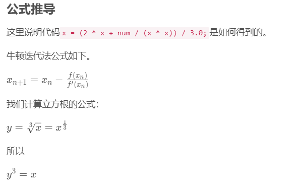
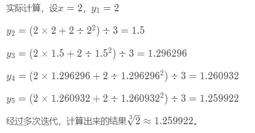
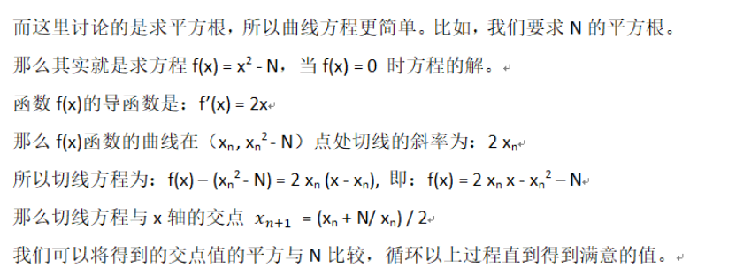

自己经历：


**为什么学习算法：**

挺有意思，更高效的解决问题，尤其是数据量大的情况下，优化计算速度很有意义和价值。
其中对于思维的锻炼 包括解决问题的方法以及边界情况的考虑和处理，以及码代码的能力都有很大的提升。除了学到新的算法或者数据结构时感到很兴奋，解决实际问题更是很有意义。
比如一个很简单的问题，当时在**过路口**的时候 会对路口的速度进行限制，以及预瞄参数的匹配上，如果根据曲率是可以进行一定的判断的。但是但是还想加如 转向的方向。比如左转还是右转的情况，其转弯半径差别还是很大的。 
但我们这个项目包括很多模块嘛，比如导航输出的参考线上并没有转向的信息，这时候就需要自己判定，首先是根据各参考点和当前序列起点的方向关系进行判定。后来想起来计算几何的东西，就是用两个向量的叉乘能计算两个向量之间的旋转关系。所以代码一下子就简洁下来了 .当然对性能的提升还不明显,举个对性能明显的例子就是优先队列.A*的openlist的最优点，以及轨迹筛选时的最优轨迹等等。


**美团：**

一面：决策面试官
- 路口交汇场景的分析  自己直行 对方无保护左转
- 两道简单的算法题目

二面：规划 纵向 面试官
- 项目挑战
- 设计有理数类
    - 重载+
    - 重载<<
    - 注意分母为0 程序要处理异常啊 assert
    - gcd函数


[^_^]:


面试：
其他人经验：

**商汤：**
1. 一面 代码 项目 算法   a* 等以及比较
2. 简历项目  考代码 面试官口述

**仙途**
1. 项目面
2. c++   以及 代码
    - 如数组模拟栈

**百度**
1. c++基础 与 代码结合   继承 构造析构 为啥要虚函数   程序输出 内存泄漏 智能指针  shared unique  
2. stl 如vector和list区别，vector为啥快 move写指针指向
3. 项目细节： 值传递 和 地址传递 


**美团**
1. 快排手写
2. 智能指针   
3. 数学 矩阵 方程组


**阿里**
1. A* 常用的启发函数有哪些？？ 与 混合 A*的区别？
    - 
2. MPC与iLQR的异同 给出分析
3. 编程：
    - 1.编写一个函数，取三次根的功能。(实数二分(迭代)，牛顿迭代)
        - 1.二分 注意精度 while(r - l > 1e-8){  l / r = mid;// 用mid更新即可，mid 也要是double类型}
        - 2.牛顿法原理    
            - [牛顿迭代法求立方根](https://blog.csdn.net/u012028275/article/details/113822412)
        
        
        
        ```c++  
            double sqrt(double c) 
            { 
                double err = 1e-8; //设立精度
                double t = c; 
                while (fabs(c - t*t*t) > err)  t =t-(t*t*t-c)/(3.000*t*t); //三次方的递推公式
                while (fabs(c - t*t*t) > err)  t = (2 * t + c / t / t) /3;
                return t; 
            }
        ```
        同理，更简单的用牛顿法求平方根
        - 
    - 2.字符串移除处理
    - 3.炸弹摆放：有一个房间，可以想象成一个矩阵，mby n。每个矩阵单元可能是，空白空间，或者是墙。现在需要在其中炸弹会向上下左右引爆，炸到墙停下来。问：在房间的什么位置放炸弹可以引爆最多数量的空白空间。(找各个方向最近的1即可，注意节省空间)
        输入：5 7
        0 0 1 0 0 0 0 
        0 1 0 0 0 1 1 
        1 0 1 1 0 1 0
        0 0 0 0 0 0 0 
        0 0 1 0 0 1 0 
        输出：4行 5列
    - 4.给定三个字符串A，B，C；判断C能否由AB中的字符组成，同时这个组合后的字符顺序必须是A，B中原来的顺序，不能逆例如：A：mnl，B：xyz；如果C为mnxylz，就符合题意；如果C为mxnzly，就不符合题意，原因是z与y顺序不是B中顺序。 dp
4. QP是什么优化问题? 怎么定义？一般用什么方法解？jacobian 与 hessian 矩阵是什么？
    - QP（二次优化问题）  
    首先定义二次的优化目标或者说代价函数，其次有一些约束项，约束分为等式约束和不等式约束，如果约束项保证的定义域为凸集的话，就是凸优化。
    求解方法有内点法，OSQP，qpoases等方法等方法。OSQP相比于qpOASES求解二次规划问题时更加快速和准确。
    Jacobian矩阵是一阶偏导矩阵，Hessian矩阵是二阶偏导矩阵
    - & 线性规划 单纯形法   KKT条件？
        - [二次规划及QPOASES简要介绍](https://www.freesion.com/article/2618456247/)
        - [qpOASES：使用说明（翻译）](https://blog.csdn.net/weixin_40709533/article/details/86064148)
5. 有 三个门，其中只有一个背后有奖，主持人让你随机选择一个，比如A,主持人此时将剩余两个中的一个打开(比如B)，告诉你这个里面没有，然后问你继续现在A还是C，你的选择是？
6. 你有5个盒子装满零件，零件有标准质量、残次品的质量是标准质量-1，只有一个盒子全是残次品：只称量一次，如何判断哪个盒子的零件是残次品？


**文远三面面经：**
1.一面主要聊项目，比较满意最后写了一个题。题目是给了一个乱序的数组，问把这个数组变成有序的数组至少需要交换多少次。
2.二面：聊项目，问了动态规划最短路径问题。要求有输入输出检查，要求状态压缩。最后问在输入输出过程中，如果棋盘格上面有障碍物，怎么用自己写的函数表示。
f（m，n）-f（i，j）*f（m-i，n-j）
又考了自行车模型，在自行车模型中，给了横摆角，和轴距，还有后轮的线速度。表示前轮的线速度。向量叉乘解决。
3.三面聊项目，聊整体对Planning的理解。最后写判断是不是完全二叉树。
本来发offer了，结果CTO review代码挂了，要求AC。

**Autox二面面经**：
面：聊项目，所有项目。问了八股文，智能指针，vector扩容。最后在板子上写函数，让我指出问题。考一些基本选代器的原理。Cbegin（）之类的。考了emplace_back和push_back区别。
写了两个代码题目，一个是最短路径（931）。还有怎么判断点在凸空间内。（时常一共两个小时）
二面：聊了所有项目。问了怎么设计一个软件系统。题目考了拓扑排序，要自己构造邻接表。
**轻舟**
一面：一面：一面聊项目，面试官比较懂，但愿意慰人，体验感不行。聊八股文，智能指针，vector扩容。问的会细一点儿。最后考了个情景题。自己定义结构体，求所有路径。大概是求n叉树的所有路径，应该就是个递归。结果开始理解错了写慢了没了