# 自动驾驶概述

## 车用地图 与 导航

自动驾驶汽车需要知道的环境信息可以划分为两部分：一部分是**相对固定**的环境信息，如车道、周边建筑等不会即时变化的要素；另一部分是会发生**瞬时变化**的交通组成部分，类似其他交通参与者、天气等。
对于前者，一般要提前采集后写到地图中去，即自动驾驶汽车使用的高精车用地图，再与传感器的探测结果结合使用，而后者，一般由汽车自带传感器完成即时感知。
### 车用高精地图 
高精地图作为无人驾驶领域的稀缺资源以及必要数据基础，在整个领域扮演着核心角色。高品质的高精地图可以帮助汽车预先感知路面复杂信息，如坡度、曲率、航向等，结合智能路径规划，让汽车做出正确决策。
1. 区别与传统导航地图
高精地图与现在常见的导航地图（如车载导航地图）相比有很大不同，主要体现在使用者不同、用途不同、所属系统不同、要素和属性不同。导航地图的使用者是人，用于导航、搜索路线。而高精地图的使用者是计算机，用于高精定位、辅助环境感知、决策与规划。因此导航地图在车内属于车载信息娱乐系统，带显示屏，而高精地图是自动驾驶系统的一部分，不需要通过屏幕进行展示。要素跟属性方面，导航地图仅包含简单道路线条、信息点（POI）、行政区划边界，而高精地图包含详细道路模型，包括车道模型、道路部件、道路属性和其他的定位图层。

2. 层级
- 底层： 静态高精地图
    - **车道模型、道路部件、道路属性和其他的定位图层**
    >首先高精地图要满足车道级的自动驾驶导航，因此需要包含道路细节信息，如车道线、车道中心线、车道属性变化等，如能让汽车知道哪些区域是虚线，能够变道。车道模型中还需要包含道路的曲率、坡度、航向、横坡等数据信息，使汽车能够准确地转向、制动、爬坡等。这些信息构成了车道模型。此外，地图还需要包含交通标志牌、路面标志等道路部件，还要标注出特殊的点，如GPS消失的区域等。

- 上层： 动态高精地图
    - 道路拥堵情况、施工情况、是否有交通事故、交通管制情况、天气情况等动态交通信息
3. 使用场景
- 弱地图模式
    - 地图只用来作为寻路和简单的定位辅助，其他还是靠汽车传感器做环境感知
- 强地图模式(L4,L5)
    - 此时的地图是一个重要的传感器，各种传感器感知到的信息都会融合到地图中来，成为一种数据基础。
4. 用于全局路径规划的图层
- 1. 道路模型
- 2. 车道层
- 3. 辅助层

### 路径规划算法
总体上包括车队的调度以及交通管制的多汽车路径规划、以及单车路径规划。
路径规划可分为**静态路径规划**和**动态路径规划**。
主要以静态道路交通信息为基础的路径规划是静态路径规划；而动态路径规划主要以动态交通信息来确定路权大小，它以起始点和终止点间的交通阻抗最小为原则确定路径规划的最小代价路线。交通阻抗的定义根据实际应用的不同，可采取不同的阻抗标准，如最短行车距离、最少旅行时间、最低通行收费等。而距离、时间、收费等信息可存储在数字道路地图图层的道路属性中。最终计算道路网络中两点之间的最优路径问题便可归结为图论中**求解带权有向图的最短路径问题**。
因此由于问题特征、网络特征的复杂性的不同，最短路径算法也表现出多样性。按照一般问题的不同，最短路径问题可按下图所示进行分类。
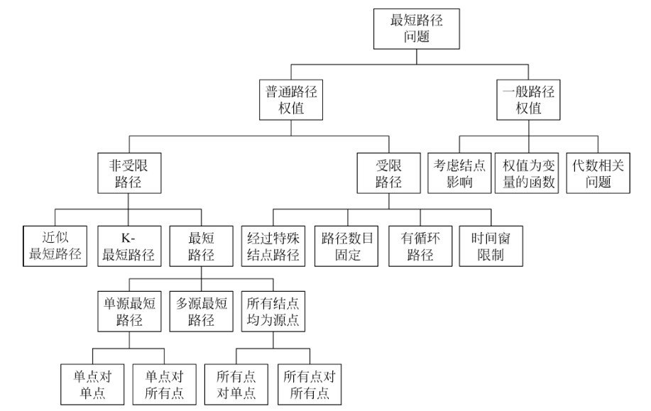

**算法**

目前，自动驾驶汽车在求解全局路径规划问题上已经有许多成熟的算法。常见的算法包括Dijkstra算法、Floyd算法以及启发式搜索算法，如A"算法等。Dijkstra算法是求解最优路径问题的最经典的算法，但它是一种盲目的搜索算法，在多年的研究中，各国学者都对其进行不断的改进，该算法的求解速度也大大提高。A'算法是启发式的搜索算法的代表，它在搜索过程中减小了网络图的搜索空间，从而节省了搜索的时间，因而计算效率较高。

#### Dijkstra

荷兰数学家E.W.Dijkstra于1959年提出了Dijkstra算法，它是一种适用于非负权值网络的单源最短路算法，同时也是目前求解最短路问题的理论上最完备、应用最广的经典算法。它可以给出从指定结点到图中其他结点的最短路径，以及任意两点的最短路径。
Dijkstra算法是一种基于贪心策略的最短路径算法，该种算法的原理是按照路径长度逐点增长的方法构造一棵路径树，从而得出从该树的根结点（即指定结点）到其他所有结点的最短路径。Dijkstra算法的核心思想为：设置两个点的集合S，和T，。集合S，中存放已找到最短路径的结点，T，集合中存放当前还未找到最短路径的结点。初始状态时，集合S，中只包含起始点，然后不断从集合中选择到起始结点路径长度最短的结点加入集合S，中。集合S，中每加入一个新的结点，都要修改从起始点到集合T，中剩余结点的当前最短路径长度值，集合S，中各结点新的当前最短路径长度值为原来最短路径长度值与从起始点过新加入结点到达该结点的路径长度中的较小者。不断重复此过程，直到集合中所有结点全部加人集合中为止。

Dijkstra算法过程包括了三个循环，第一个循环的时间复杂度为O（n），第二、三个循环为循环嵌套，因此总的时间复杂度为O（n2）。可以看出，Dijkstra最短路径算法的执行时间和占用空间与图（或网）中结点数目有关，当结点数目较大时，Dijkstra算法的时间复杂度急剧增加。当图（或网）规模较大时，直接应用该算法就会存在速度慢或空间不够的问题。所以，在大的城市交通网络图中直接应用Dijkstra最短路径算法是很困难的。路径规划作为无人驾驶汽车导航系统的重要功能模块，其算法的优劣是非常重要的，评价该算法的主要性能指标是它的实时性和准确性。Dijkstra算法作为经典的路径规划算法，在实验地图数据量较小情况下会得到很好的规划结果，但在实验地图数据量较大情况下很难满足路径规划的实时性要求

#### Floyd 
核心思路是通过一个图的权值矩阵求出该图中任意两个结点之间的最短。
Floyd 算法是动态规划算法的一种，适用于APSP（All Pairs Shortest Paths），若用在稠密图中计算最优路径，效果更好，而且对边的权重是正是负没有特殊的要求。该算法简单有效，结构紧凑，因为含有三重循环，作用于稠密图，效率要比执行n次Dijkstra算法高得多。
算法的基本原理比较容易理解，算法的执行过程也相对简单，而且能够计算出任意两个结点之间的最短距离。但是由于其时间复杂度比较高，不适用于计算大量数据。

#### A*算法

以Dijkstra算法、Floyd算法为代表的最短路径算法虽然能够求得最短路径，但是计算量非常大。因此，这些算法只适应解决结点数较少的有向图。而实际中电子地图的结点数量却是非常庞大的，使用这些算法就会增加计算的工作量，因而不是最佳选择。
状态空间搜索是在一定的状态空间中，寻找从初始状态到目标状态的路径的过程。由于在求解问题的过程中存在很多分支，求解条件的不确定性和不完备性使得最终计算得到的路径有多条，这些路径就组成了一个图，这个图就是状态空间。问题的求解实际上就是在
这个图中寻找一条路径，可以从初始点顺利地到达目标点，这个寻找路径的过程就是状态空间搜索
常用的状态空间搜索包括深度优先搜索和广度优先搜索。广度优先搜索算法又称宽度优先搜索算法或横向优先搜索算法，是一种图形搜索算法。该算法是一种盲目搜索法，从初始结点逐层搜索，将遍历图中所有结点来找寻目标结点。深度优先搜索算法是图论中的经典算法。该算法是按照一定的顺序先查找一个分支，尽可能深地搜索该分支，直到遍历该分支的结点，若此时图中还有未被搜索过的分支，则继续遍历其他分支，直到找到目标点。这个遍历图的过程实际上是查找每个顶点或弧的邻接点的过程。广度优先搜索算法和深度优先搜索算法的过程基本相同，不同之处在于两者对顶点的查找顺序不同。它们都是在一个给定的状态空间中，通过遍历所有结点的方式，寻找需要找到的目标点及其路径。在状态空间不大的情况下，这两种算法都适用。但是当状态空间十分大，而且存在许多无法预测的情况下，这两种算法就不是最佳选择。这种遍历的搜索过程具有盲目性，因此效率比较低，而且在有限的时间内可能无法搜索到目标点，此时就要用到启发式搜索。
启发式搜索就是在状态空间中搜索，同时在搜索过程中加人与问题有关的启发式信息引导搜索朝着最优的方向前进。该方法会评估每一个搜索到的结点，通过比较搜索到的结点的评估值选择出最好的结点，然后将这个最好的结点作为下一次搜索的起始点，沿着搜索的方向继续搜索，直到搜索到目标点。一般来说，一个城市的电子地图有上万个结点，由于启发式搜索不需要遍历网络中的所有结点，这样就可以忽略大量与启发信息无关的结点，提高了搜索效率。在启发式搜索中，对结点的估价十分重要，采用不同的估价标准会产生不同

的结果
A*算法是建立在Dijkstra算法基础上的启发式搜索算法，多应用于实现道路网的最佳优先搜索。该算法的主要特点是：在选择下一个搜索结点时，通过引人多种有用的路网的信息，计算所有的候选结点与目标点之间的某种目标函数，例如最短行车距离、最短行车时间、最少行车费用等，以此目标函数值为标准来评价该候选结点是否为最优路径应该选择的结点，符合所选择的最优目标函数的候选结点将优先选择为进行下一次搜索的起点，A*算法已逐渐广泛地应用于各个领域，不仅仅是应用于无人驾驶汽车的路径规划，同时也较多地应用于机器人和其他要求最小费用解的领域。该算法的优点在于利用含有有效信息的启发函数，使搜索方向更加智能地趋向于终点，所以该算法搜索的结点数少，故占用的存储空间也少。
A*算法是一种智能搜索算法，它通过引人与目标点有关的启发式信息，指引算法沿着最有希望的方向进行搜索。选择带有合理、准确的启发式信息的估价函数，有助于减小搜索空间、提高效率。采用启发信息的目的是估计当前结点与目标结点之间的距离，在进行结点的选择时，优先选择具有最小估价值的结点
A*算法的关键是确立如下形式的启发式估价函数：f'（n）= g（n）+ h'（n）
式中：g（n）是从起点s到候选结点n的实际代价；h'（n）是从候选结点n到目标点D的估计代价。必须保证h'（n）<h *（n），其中h *（n）表示结点n到目的地结点的实际最小代价，该算法在搜索的过程中，优先搜索f'（n）值最小的结点启发式估价函数的合理选择关系着算法是否能够找到最优路径。启发式估价函数要求
具有良好的启发能力，能提供有用且准确的启发性信息。一般地，如果提供的启发性信息不够准确，或实用性较差，那么，在搜索到一条路径前可能会扩展很多无用的结点。这样就导致了搜索时间长，同时也占用了较大的存储空间。因此，引入合理的启发式估价函数是非常重要的。
A"算法在搜索过程中会建立两个表：OPEN表和CLOSE表。OPEN表中存储的是已经生成但是还没有被扩展的结点，GLOSE表中存储的是已经被扩展的结点。每扩展个结点，都要计算其代价值。若新扩展的结点已存在于OPEN表中，则比较这两个结点的代价值的大小，用代价值小的点替换代价值大的点。每次扩展一个新的结点，都会根据所采用的启发式信息进行排序
设初始结点为S，目标结点为T，则搜索由S到T的最优路径的具体步骤如下。
（1）建立空的OPEN表和CLOSE表。把起点S放人OPEN表中，CLOSE表为空，此时其他结点与起点S的距离为00。
（2）如果OPEN表为空，则搜索失败，算法结束。否则扩展S结点，选取OPEN表中f'值最小的结点，并将该结点从OPEN表移至CLOSE表中，同时判断该结点是否为目标结点。若是目标结点，则从该结点回溯，即从该结点的后向指针一直到初始结点遍历结点获得最优路径，算法结束；若该结点不是目标结点，则继续扩展下一结点。
（3）依次扩展S结点后，扩展S结点的所有后继结点组成集合A，遍历A中的结点，如果存在某一结点既不在OPEN表中也不在CLOSE表中，将该结点放入OPEN表中，同时计算该结点的估价值，并对该结点的代价值与已经存在于OPEN表或CLOSE表中的结点代价值进行比较。若该结点的代价值小于其他两个估价值，则更新OPEN表中的代价值及其父结点，
（4）根据所选取的估价函数计算各点的估价值，并按照估价值递增的顺序，对CLOSE表中的所有结点进行排序，这些结点的扩展过程就是通过算法计算得到最优路径。至此，算法结束
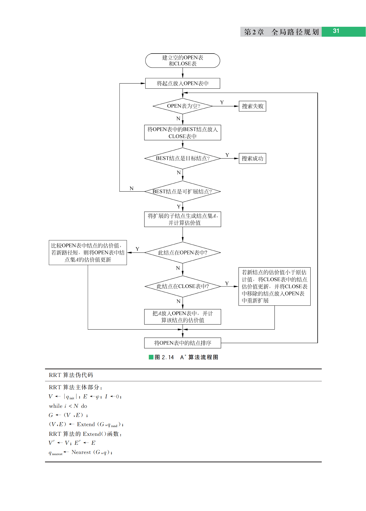

- RRT
另外，对于高维度的路径规划问题。1998年，La Valle第一次提出了快速扩展随机树
（Rapidly Exploring Random Tree，RRT）算法，它是一种具有采样概率完备性的路径规划算法。
作为一个采用树形结构的规划算法，快速扩展随机树可以用来解决在高维度空间的路径规划问题，其核心的思想就是以给定的起始点作为该树的根结点，从根结点出发依次向状态空间中扩展子结点，子结点得到的方式都是通过在状态空间中随机采样的形式得到的，如果子结点不与障碍物发生碰撞则把子结点加人到树中，更新原来的扩展树的状态，生成新的随机扩展树，如此循环往复，直到扩展到终点，就可以得到状态空间中的一棵扩展树。该树包含了路径给定的起始点和终止点，最后从终点反向溯源到起始点，就可以得到规划的路径。该算法相对于其他算法之所以快速，主要是它以随机采样的形式来探索整个状态空间，可以以最快的速度完成对整个空间的遍历。

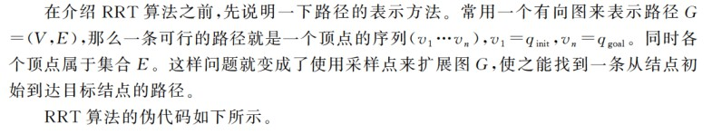

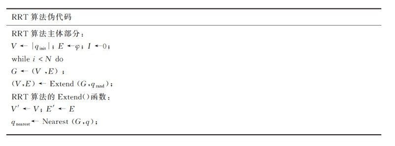
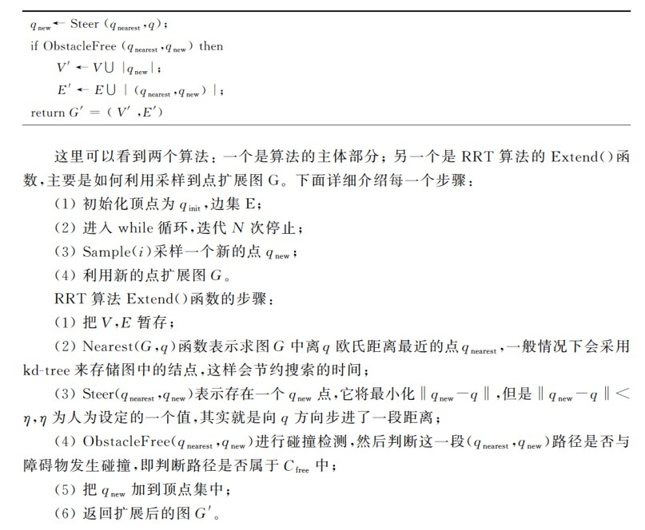

### 发展
1. 与汽车动力学结合
汽车在车道中的相对位置、加速度、横摆角速度以及曲率等、车动力性、操纵性和稳定性评价指标等作为优化指标
2. 与状态参数结合
3. 与机器学习结合

###
## 全局路径规划
*类似导航，但又不完全相同。主要在于运用高精地图。*

全局路径规划的**目标**是根据已知电子地图和起点、终点信息，采用路径搜索算法生成条最优化的（时间最短、路径长度最短等）全局期望路径。这种规划可以在行驶前**离线**进行也可以在行驶中不停地**重规划**。
>以国家自然科学基金委组织举办的“中国智能车未来挑战赛”为例，比赛组织方赛前提供了比赛的路网定义文件（RNDF），各比赛队伍可以根据RNDF规划出全局期望路径。

全局路径规划中，规划路径以全局的**大地坐标系**为参考，因此全局期望路径也是以全局坐标的形式给出。全局规划的作用在于产生一条全局路径指引汽车的前进方向，避免汽车盲目地探索环境。
在规划全局路径时，不同的环境下常常会选择不同的**择优标准**。在平面环境中，通常以路径长度最短或时间最短为最优标准，城市环境下的全局路径规划甚至要参考道路施工和拥堵情况、天气等因素。在越野环境的全局路径规划中，经常以“安全性”为最优标准，在使用该标准时要考虑路径可行宽度和路面平整度来充分保证汽车的运行安全。

## 行为决策

行为决策接收全局路径规划的结果，同时也接收感知、预测和地图信息。综合这些输入信息，行为决策模块在**宏观**上决定了自动驾驶汽车如何行驶。这些行为层面的决策包括在道路上的**正常跟车或者变道、在遇到交通灯和行人时的等待避让，以及在路口和其他汽车的交互通过**等。例如，全局路径模块要求自动驾驶汽车保持在当前车道（Lane）行驶，当感知到前方有一辆正常行驶的汽车时，行为决策的一个决定便很可能是下达跟车（Follow）命令。行为决策模块根据具体实现不同，在宏观上定义的输出指令集合也多种多样。

行为决策层需要的信息：
（1）可以到达目的地的全局路径规划结果：如自动驾驶汽车为了到达目的地，需要进入什么道路，在哪一个路口左/右转，在哪里直行。（2）自动驾驶汽车的当前自身状态：车的位置、速度、朝向，以及当前主车所在的车道、按照寻径路由需要进入的下一个车道等。
（3）自动驾驶汽车的历史决策信息：在上一个计算周期，行为决策模块所做出的决策是什么？是跟车、停车、转弯或者是换道？
（4）自动驾驶汽车周边的障碍物信息：自动驾驶汽车周边一定距离的所有障碍物信息。例如，周边的汽车所在的车道，邻近的路口有哪些汽车，它们的速度、位置如何，以及在一个较短的时间内它们的意图和预测的轨迹，周边是否有骑车人或者行人，以及他们的位置、速度、轨迹等。
（5）自动驾驶汽车周边的地理信息：一定范围内车道的结构变化情况，如前方50m处有车道变窄或新增车道，前方30m处车道边线由虚线变成实线，前方是否有人行横道、红绿灯、前方道路限速，哪条车道可以在前方路口左转、右转和直行等。
自动驾驶汽车的行为决策模块，就是要在上述所有信息的基础上，做出如何行驶的决策。可以看出，自动驾驶汽车的行为决策模块汇集了不同来源的信息。由于需要考虑复杂的、不同类型的信息及考虑不同地区的交规限制，行为决策问题往往很难用一个简单的数学模型求解。

### 交通环境行为预测
运动预测根据预测时间的长短可以分为**长期**(如数秒，10s)预测与**短期**(如1s)预测，将涉及**意图识别、行为预测和轨迹预测**（运动预测）三个层面的内容。一般来说，若能充分考虑汽车的行驶意图，长期运动预测的结果将更加准确。一般认为意图、行为和汽车运动状态三者的抽象程度依次降低，意图为驾驶员做出某种行为的目的，行为是一段连续的运动状态的抽象，而运动状态则是汽车所体现出来的一些运动变量（位置、姿态、速度、加速度等）的集合。

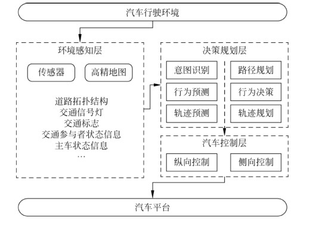

**按类型**
    - 障碍车辆
        - 根据驾驶场景、道路拓扑、以及行驶方向可大致分析其驾驶意图和预测轨迹
    - 行人等
        - 不确定性高
**按时长**
    - 短期：行为意图未变化时，根据运动学或动力学可推测
    - 长期：需要根据动力学以及意图等综合推测

#### 对障碍车辆行为预测
##### 基于物理模型
基于物理模型的轨迹预测是基于物理的运动模型将汽车表示为受物理定律支配的动态实体。使用动力学和运动学模型预测未来运动，将一些控制输入（例如转向、加速度），汽车属性（例如重量）和外部条件（例如路面的摩擦系数）与汽车状态的演变（例如位置）联系起来。有大量的工作基于物理的汽车运动模型进行轨迹预测，这种方法仍然是道路安全背景下最常用的轨迹预测和碰撞风险评估的方法。
这些汽车模型的复杂程度不一，它们的区别在于模型的动力学和运动学表现、如何处理不确定性、是否考虑道路的几何形状等，
**（1）动力学模型**
一般来说，汽车动力学模型基于拉格朗日方程，考虑影响汽车运动中不同力的作用，例如纵向和横向轮胎力或道路倾斜角。汽车受到复杂物理学（驾驶员对发动机、变速器、车轮等的作用的影响）的控制，因此动力学模型可能非常复杂并且涉及汽车的许多内部参数。建立这种复杂的模型在涉及与汽车控制相关的计算时可能是有必要的，但在轨迹预测中，为了简化计算，一般会使用更简单的模型。因此在轨迹预测中，常常采用“自行车”模型代替复杂的汽车动力学模型，这意味着将四轮汽车简化为两轮汽车，并在二维平面上移动，
**（2）运动学模型**
运动学模型基于运动参数（例如位置、速度、加速度）之间的数学关系来描述汽车的运动，而不考虑影响运动的力。在运动学模型中，摩擦力被忽略，并假设每个车轮的速度都与车轮方向相同。在轨迹预测方面，运动学模型比动力学模型的应用更加广泛。此外，由于动力学模型所需的汽车的内部参数不能被外部传感器观察到，使得动力学模型在很多场景中无法应用。
运动学模型中最简单的是恒速度（CV）和恒定加速（CA）模型，它们都假定汽车是直线运动的。恒转速和速度（CTRV）以及恒转加速度和加速度（CTRA）模型通过在汽车状态向量中引人偏航角和偏航率变量来考虑绕z轴的变化。由于速度和偏航率是分离的，因此模型复杂度很低。通过考虑转向角而不是状态变量中的横摆率，可以用“自行车”模型来表示汽车模型。这种模型考虑了速度和横摆率之间的相关性，从中可以导出恒定转向角和速度（CSAV）以及恒转加速度和加速度（CSAA）

**区别**

上述提到的汽车模型可以以各种方式用于轨迹预测，它们之间的主要区别在于如何处理预测的不确定性。单轨迹模拟预测汽车未来轨迹的直接方式是将汽车模型应用于汽车的当前状态，假设当前状态是完全已知的并且汽车模型能完美预测汽车的运动。这种方法可以基于动力学模型或运动学模型，如图3.2所示。这种正向仿真方法的优势在于其计算复杂度低，可以很好地满足实时性的要求。然而，预测没有考虑当前状态的不确定性和汽车模型的缺点，因此计算出的长期预测（超过1s）轨迹是不可靠的。
当前汽车状态及其预测的不确定性可以通过正态分布来建模。用“高斯噪声”来表达不确定性的方法最早来自于卡尔曼滤波器（KF）中。卡尔曼滤波可以从噪声传感器的测量结果中递归地估计汽车状态，是贝叶斯滤波的一种特例。在卡尔曼滤波中，一般假设汽车模型和传感器模型是线性的，并且使用正态分布表示不确定性。在第一步骤（预测步骤）中，将时间t处的估计状态馈送到汽车模型，得到t+1时刻的预测状态，其采用高斯分布的形式。在第二步骤（更新步骤）中，将t+1时刻处的传感器测量值与预测状态组合成t+1时刻的估计状态，其也是高斯分布。每次新测量可用时，循环预测和更新步骤称为滤波。通过循环
预测步骤，可以获得每个未来时间步长的汽车状态的均值和协方差矩阵，并将其转换为具有不确定性的预测轨迹（每个时间点的不确定性正态分布），如图3.3所示。与“单轨迹模拟”
方法相比，这种方法可以计算预测轨迹的不确定性。然而，使用单峰正态分布建模的不确定性并不能准确地建模现实世界中的不确定性。因此有的方法使用高斯混合来建模不确定性。开关卡尔曼滤波器（SKF）依靠一组卡尔曼滤波器来建模汽车的可能变化模型并在它们之间切换。也可以使用启发式方法根据实际情况在不同的运动模型之间切换。
持续速度模型下的轨迹预测
高斯分布下的轨迹预测
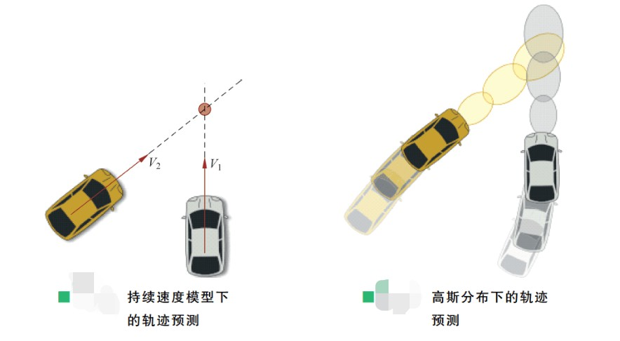

扩展卡尔曼滤波（EKF）理论可以利用系统最新状态估计结合系统动力学模型对系统将来状态进行进一步估计。这种方法主要基于运动汽车的运动学方程导出其非线性模型，进而对汽车的将来位置与方向进行预测。其中，协方差矩阵经过分析和转换可以用作卡尔曼滤波过程中不确定性的置信度度量，作为衡量预测质量的指标。
在一般情况下，尽管计算预测轨迹时都假设模型是线性的或考虑不确定性的高斯分布，但一般来说预测状态上的分布的解析表达式并不一定符合假设。蒙特卡洛方法提供了近似表达这种分布的工具，其可以从汽车模型的输入变量中随机抽样，生成可能的未来轨迹。为了考虑道路拓扑，可以对抽样过程应用权重，使所生成的轨迹遵守道路布局的约束。对于汽车模型，在蒙特卡洛方法中可以直接在输入空间中进行采样，要采样的典型输入是加速度和转向角或横向偏差。为了考虑预测轨迹的可行性，一般通过对汽车的现实物理特征进行约束，以便汽车模型的输入以更加真实的方式分布。蒙特卡洛方法计算的预测轨迹如图3.4所示。蒙特卡洛方法可用于从完全已知的当前状态或通过滤波算法估计的不确定当前状态来预测汽车的轨迹。
##### 基于行为模型

- 基于原型轨迹
    - 分类
        - 聚类
            - 高斯混合模型GMM
            - K-Means对**侧向加速度**进行分类@
                - 考虑 对自车换道？路口的识别
    - 匹配
        - 度量：相似度，如最长公共序列LCSS
    - 缺点
        - 依赖路面拓扑结构信息
        - 可拓展性差
        - 对速度变化较大的场景（十字路口汽车停车、起步等）度量难
- 基于驾驶意图
    - 
    - 分类识别
        - Support Vector Machines，SVM）结合贝叶斯滤波（BayesianFiltering）的方法实现识别
        - 递归神经网络（Recurrent Neural Network，RNN）、前向反馈神经网络（Feedforward Neural Network，FNN）和支持向量机方法在预测道路中他车换道行为
    - 原理
        - 基于可观测的他车状态信息及环境信息作为**证据变量**来对汽车的行为意图等**隐藏变量**进行求解

基于机器学习的方法来识别汽车的行驶意图，并不依赖于原型轨迹，因此可以用于任意的道路结构。在利用这一类方法进行行驶意图的估计时，需要先定义一个有限的行为集合（包括车道保持、换道、超车、路口转向等），然后根据感知到的道路汽车运动特征对汽车未来的行为进行分类。这些特征包括可以通过传感器观测的交通车状态变量（车速、加速度、位置、驶向、转向灯等），道路结构（如十字路口、匝道、高速公路），交通信息（交通信号灯、标识牌、交通规则等）

##### 基于神经网络
- LSTM
    - LSTM是RNN的一种形式，通过一个存储器单元来代替网络的每一个结点，解决了梯度弥散的问题。通过“门”（Gate）来控制丢弃或者增加信息，从而实现遗忘或记忆的功能。“门”是一种使信息选择性通过的结构，由一个Sigmoid（）函数和一个点乘操作组成。
    Sigmoid（）函数的输出值在[0，1]区间，0代表完全丢弃，1代表完全通过。一个LSTM单元有三个这样的门，分别是遗忘门（Forget Gate）、输入门（Input Gate）和输出门（Output Gate）。
    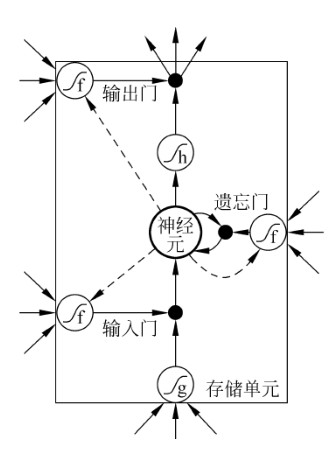
    存储器单元：决定和积累单元要记忆的内容。输入门限：决定输人信息是否被允许进人模组输出门限：决定输出是否要被模组向外传送。
    上述架构使得LSTM模组能够存储和检索任意时长的信息。不同于一般的RNN，LSTM中的反向传播误差不会随着时间指数下降，而且模型很容易训练。因此研究LSTM在周围汽车轨迹分类中的应用十分有必要。

##### 基于交互 
基于交互的轨迹预测在对他车环境进行运动预测时，将自车和周围的其他汽车看作是相互影响的，考虑了它们之间的行为依赖关系。因此，比起基于行为模型的轨迹预测，它能够提供更加准确可靠的预测结果。考虑交通参与者之间的交互时，其中一种方法是**假设**所有驾驶员都尽量避免碰撞，并选择风险最小的驾驶行为。这种方法首先计算每个汽车行驶意图的**先验概率分布**，然后再通过建模汽车之间的交互关系进行**风险评估**，进而对先验分布进行修正。这种方法在大多数正常驾驶场景下可以取得很好的效果，但是在一些真正危险的场景下可能会出错。
另一种考虑汽车交互影响的方法是利用**动态贝叶斯网络**。这种方法在进行行为推理时将汽车之间（Agent（i）、Agent（j））的交互也考虑进来，Agent（j）的运动状态x，-1（j）将对Agent（i）的场景状态ct（i）产生影响。在数学上实现时汽车之间的交互被分解为成对依赖性的对数线性组合。同时在建模汽车的行为时，将交通规则也考虑了进去，然后使用统计推理来计算运动状态的后验概率分布。
使用动态贝叶斯网络建模汽车之间的交互问题时，常常基于因素状态计算汽车之间的因果依赖关系，并建立局部场景的函数，这种方法可以大大减少计算的复杂度为了处理交通场景中汽车之间的行为交互，基于博弈论（Game Theory）的方法也引起了研究者的兴趣。
##### 基于仿生学

##### 基于综合
对汽车轨迹进行长期预测，不仅利用了汽车的历史轨迹信息，还利用了驾驶场景的特征信息，例如通过对道路结构进行建模，帮助对弯道路段进行轨迹预测。在这一过程中，利用回归神经网络从汽车历史轨迹中学习汽车行为并结合道路结构特征，对汽车未来轨迹进行预测
汽车轨迹预测能够帮助自动驾驶汽车更好地了解交通环境、提前执行危险性评估等任务。有的轨迹预测方法通过结合基于物理模型与行为模型的轨迹预测来实现。这两种方法相结合的优势在于基于物理模型的轨迹预测可以在考虑汽车动力学参数的情况下确保短期内预测的准确性，而基于行为模型的轨迹预测可以实现长期的预测。此外，可以在基于物理模型的轨迹预测中融合无迹卡尔曼滤波器来实现对不确定性信息的预测。基于行为模型的轨迹预测则将不确定性随机元素引入到动态贝叶斯网络中，用以推断每个行为过程对应的轨迹
#### 对障碍行人行为预测
- 特点
    - 随机性
    - 即要符合物理约束、又要符合社会规范(结伴、礼让)
    - 行人间相互影响： 躲避、跟随、追赶、超过
    - 如何预测多个合理轨迹
- 方法
    - 基于社会力
    - 基于马尔可夫模型
    - 基于循环神经网络
    - 基于生成对抗网络

#### 安全性评估

评估决策模块输出结果
- RSS(Responsibility Sensitive Safety)责任敏感模型
    - Mobileye提出
    - 用数学公式计算自车安全状态
    - 原则：
        - （1）自动驾驶汽车绝对不可以因为自身的原因引发碰撞或者事故；
        - （2）当别的汽车造成潜在风险并且可能会产生交通事故的时候，自动驾驶汽车应采取怎样恰当的应对方式，来避免可能发生的交通事故。
    - 在实际建立模型的时候，RSS模型通过四条形式化的规则，来确保汽车在自动驾驶状态下能够保证安全以及避免成为制造车祸的一方：
    （1）和前车保持安全距离；
    （2）给侧边的人或车留下足够的反应时间和空间；
    （3）在堵车的时候更谨慎；
    （4）要合理使用路权（路权的使用应优先考虑安全）。
    - 场景
    >Mobileye发布了一份官方报告，列举了37种可能发生事故的场景，包括了汽车并行状态的安全间距、安全并线的间距、避免追尾的最小安全距离、路边有行人闯入机动车道时的安全车速等。这37种状况基本覆盖了99.4%的车祸可能性，也说明RSS模型目前已经非常完善，处在健全、可用的状态。

#### 汽车行为决策理论

- 要求
    - 实时性、安全性

行为决策系统首先会分析道路结构环境，明确自身所处的驾驶场景。接着在此基础上，针对特定的驾驶场景，基于基本交通规则或驾驶经验组成的驾驶先验知识，在多个可选行为中基于驾驶任务需求等要素条件，选择此场景下的最优驾驶行为。
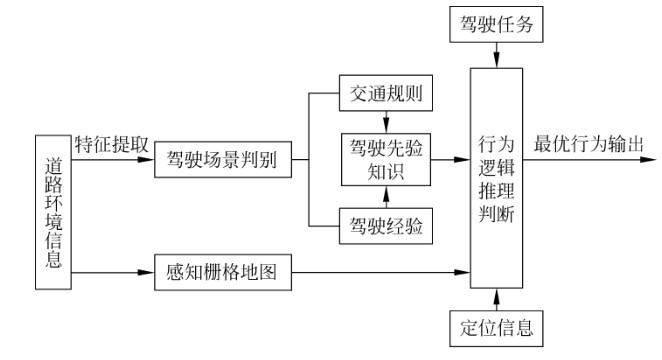

### 决策算法

#### 基于规则的行为决策
核心思想是利用分治的原则将自动驾驶汽车周边的场景进行划分。在每个场景中，独立运用对应的规则来计算自动驾驶汽车对每个场景中元素的决策行为，再将所有划分的场景的决策进行综合，得出一个最后综合的总体行为决定。首先引人几个重要概念：综合决策（Synthetic Decision）、个体决策（Individual Decision）以及场景（Scenario）。
- **综合决策**
    - 综合决策代表自动驾驶汽车行为决策层面的整体最高层的决策，例如按照当前车道跟车保持车距行驶，换道至左/右相邻车道，立刻停车到某一停止线后等；
    - 输出：指令 + 参数
    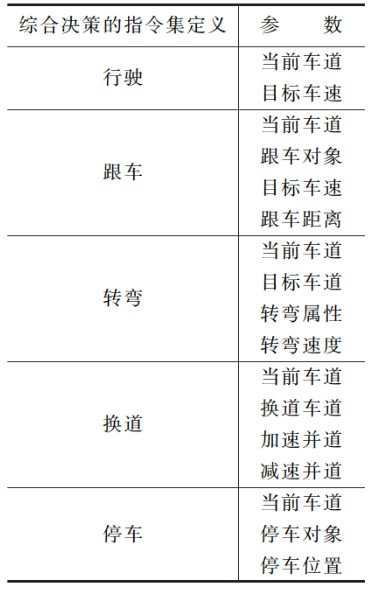
- **个体决策**
    - 个体决策指的是对所有重要的行为决策层面的输人个体，都产生一个个体决策。这里的**个体**，可以是感知输出的路上汽车和行人，也可以是结合了地图元素的抽象个体，如红绿灯或者人行横道对应的停止线等。
    - 因此，综合决策是在场景划分的基础上产生每个场景下的个体决策，再综合考虑归纳这些个体决策，得到最终的综合决策。个体决策**不仅是**产生最后的综合决策的元素，**而且**也和综合决策一起被传递给下游运动规划模块。
    - 个体决策有利于下游路径规划模块的求解，还能帮助工程师在软件开发过程中进行决策模块的调试。
    - 格式同综合决策
- **场景**
    - 将场景理解成一系列具有相对独立意义的自动驾驶汽车周边环境的划分。
    - 利用这种分而治之的思想进行场景划分，可以将自动驾驶汽车行为决策层面汇集的汽车周边的不同类别的信息元素，聚类到不同的富有实际意义的场景实体中。
    - 在每个场景实体中，基于交通规则，并结合主车的意图，可以计算出对于每个信息元素的个体决策，再通过一系列准则和必要的运算把这些个体决策最终综合输出给下游。

- **总结**
整个行为决策层面的框架和运行流程如下图所示。首先是结合主车信息、地图数据及感知结果构建不同层次的场景。在全局路径规划的指引下，每个场景结合自身的规则（往往是交规或者安全避让优先），计算出属于每个场景物体的个体决策。在所有的个体决策计算完毕后，虽然发生的概率极其微小，但模块还是会检查有无冲突的个体决策。在对冲突的个体决策进行冲突解决（往往是优先避让）后，推演、预测当前的所有个体决策能否汇总成-
个安全行驶无碰撞的综合决策。如果这样的安全无碰撞综合决策存在，便将其和个体决策起输出给下层的运动规划模块，计算具体从当前位置到下一个位置的时空轨迹。

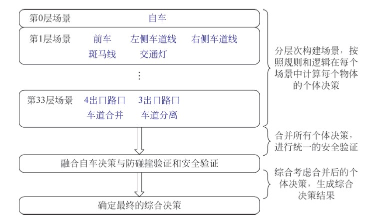

#### 有限状态机FSM
Finite State Machine： Darpa自动驾驶汽车竞赛中，Stanford斯坦福大学设计。

#### 马尔可夫MDP、POMDP部分可观测马尔可夫决策

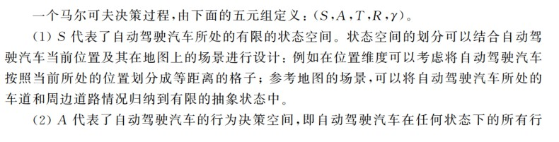

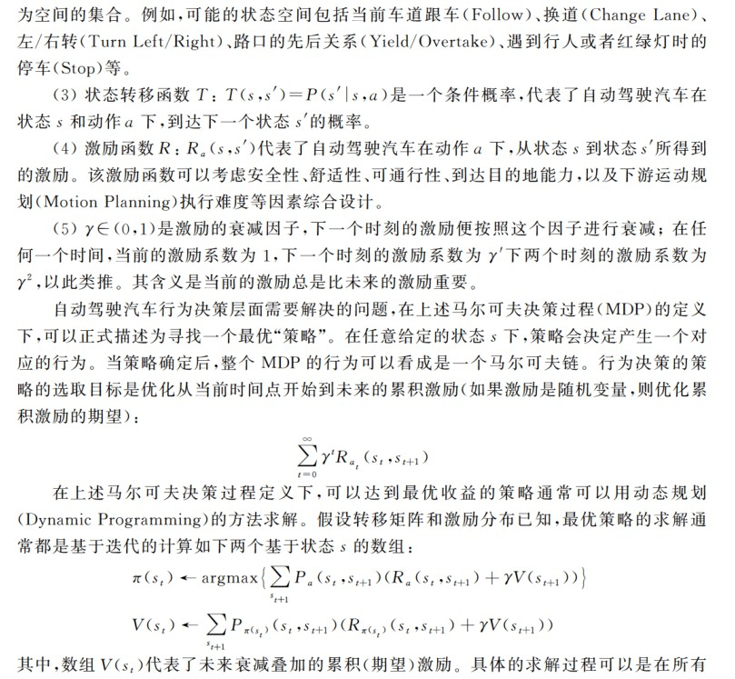

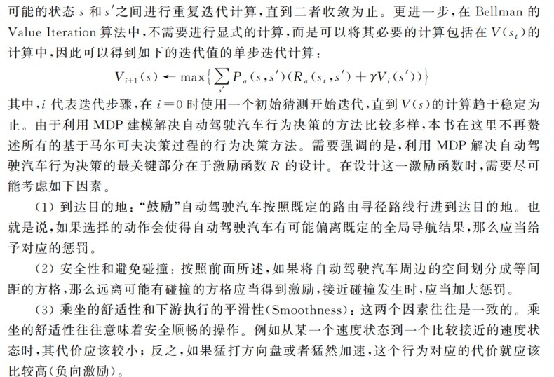

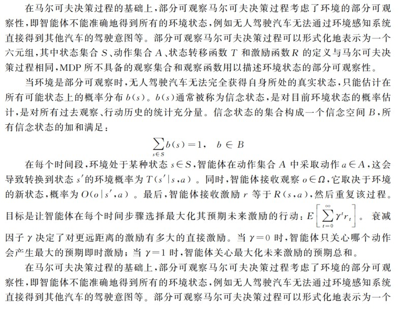

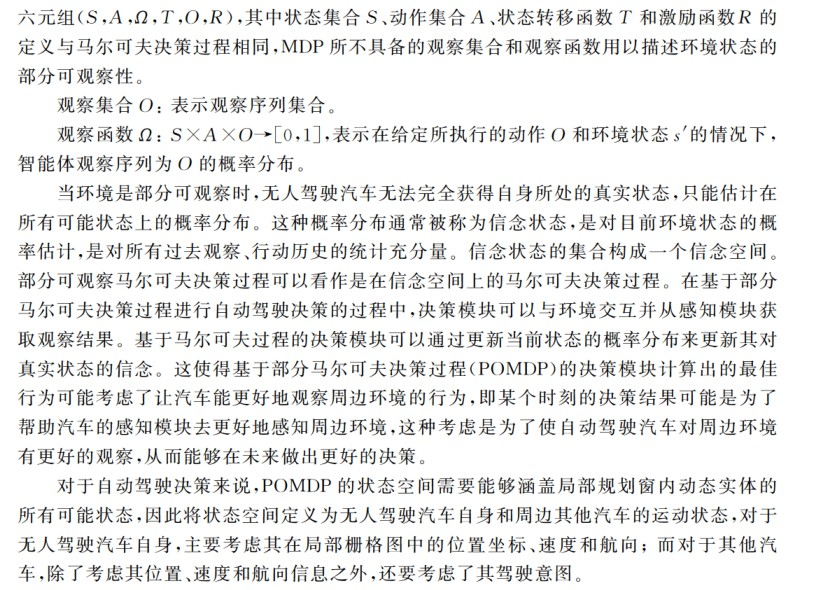

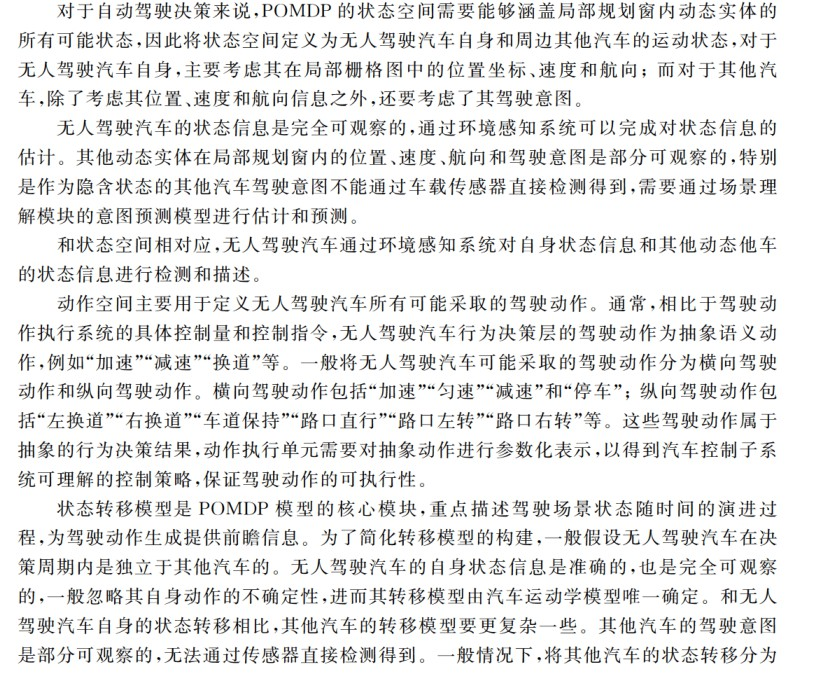

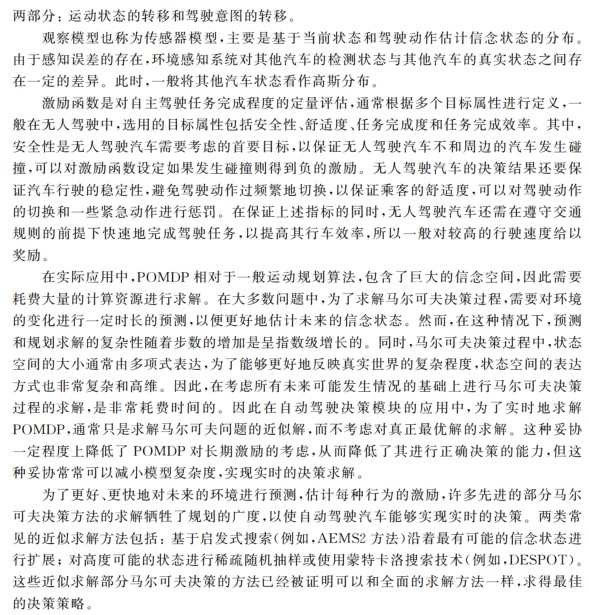
## 轨迹规划
(另见规划笔记部分)

### 1.可行驶区域生成
- 表示
    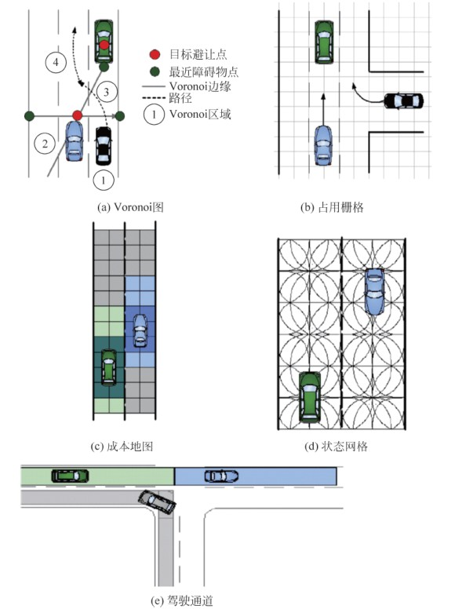
    - Voronoi图
        - Voronoi图通过最大化汽车与周围障碍物之间的距离来生成路径。
        - 用于静态停车场场景。
    - 占用栅格/成本地图
        - 占用栅格（Occupancy Grid）与成本地图的含义相似，都将状态空间划分为网格。这些网格的每个单元都**代表**当前单元被障碍物占用的概率，或者代表与网格可通行性和风险成比例的代价值。风险或可行性主要通过考虑障碍物、车道和道路边界来进行计算。
        在计算能力较低的情况下，基于网格的方法能快速找到解决方案，但在解决非线性动力学问题的鲁棒性方面和存在障碍物时存在困难。
        占用网格可以包含障碍物的位置和速度，从而显示出它们的预期运动；而在成本地图中，某个单元格的成本越高，其在地图上的呈现就越强烈。
        

    - 状态网格
        - 状态网格法（State Lattice）可以视为网格生成的过程。
        以通过重复矩形或正方形来构建网格以使连续空间离散的方式，通过定期重复原始路径来构造网格。所述原始路径在位置、曲率或时间方面与汽车的可能状态相关联，
    - 驾驶通道
        - 驾驶通道代表了一个连续的无碰撞空间，受到道路和车道边界以及其他障碍物的限制，汽车将会在其中行驶。驾驶通道的生成基于详细数字地图上给出的车道边界信息，或者基于同时定位和建图（SLAM）技术建立的地图。
- 对比  
    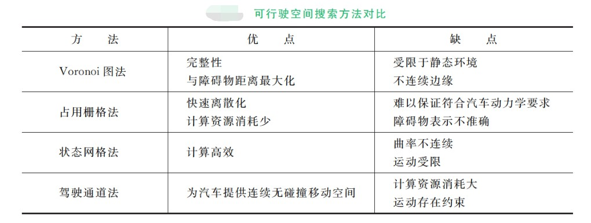

### 2. 局部轨迹生成方法
- 场景
    - 高速
        - 行车环境简单 但 车速快，要求对车辆控制精度高
        - 难点在于 对环境信息获取的位置精度和路径搜索的速度
    - 城市
        - 环境复杂，障碍车辆多、道路特征识别
        - 难点在于 对动态障碍方向和速度的预测
    - 越野
        - 没道路边界，但起伏。
        - 难点在于 可行驶区域的识别
- 轨迹评价
    - 偏移
    - 碰撞
    - 速度
    - 舒适
    - 
- 生成方法
    - 直接构造
        - 初始和终止位置 5次多项式
        - 构造汽车**后轴中心**坐标关于**时间**的函数。该函数可使用5次多项式，构造出来的路径充分拟合初始和终止**位置、速度和加速度**的路径，适应非结构化的环境。基于5次多项式构造路径有利于保证汽车行驶平稳性，原因在于这种路径加速度变化率最小。
        然而，若要保证规划出来的整条路径在速度、加速度、曲率和曲率变化率方面的有界性，该方法还需不断调整轨迹时间区间。
        - 运动轨迹的几何表达方式(详情见书P62-66)
            - 直线/圆弧段
                - Dubins曲线和Reeds-Shepp曲线都是由最大曲率圆弧和直线组成的，是连接构形空间中任意两点的最短路径，分别对应无倒车和有倒车的情况。存在圆弧和直线连接处曲率不连续的问题时，汽车依据曲线行驶时需曲率不连续处停车调整方向轮才能继续行驶。回旋线可以帮助解决此问题，改造Dubins曲线和RS曲线。回旋线曲率与曲线长度成正比关系，适合作为直线到圆弧之间的过渡曲线，保证曲率连续性，
            - 多项式螺旋线
                -这种线条的曲率是曲线长度的多项式函数。回旋线是一种特殊的多项式螺旋线。基于这种线条规划运动轨迹，求解效率较低。为了求解曲线形状，在给定边界条件后，必须使用数值手段求解多项式中的待定系数。
            - 样条曲线
                - 曲率具有连续性。B样条曲线可以实现曲率连续性；三次Bezier曲线可以保证曲率的连续性和有界性；n曲线也有很好的曲率连续性和曲率导数的连续性，它是种七次样条曲线，对于高速行驶汽车的安全行驶而言，这类性质非常重要
                    - 贝塞尔 特点  缺点(不灵活、高阶时、不能局部调整)
                    - B样条： 可局部调整、连续性、凸包性、分段参数多项式、几何不变性、仿射不变性、造型灵活

    - 路径-速度分解法
        - 有移动障碍物的环境下，可以通过将运动规划拆分成避开静态障碍物与避开移动障碍物的过程。在构造一条路径避开静态障碍物的基础上，进行速度规划以避开移动障碍物。
    - 对比：
        - 直接构造法规划得到的运动轨迹，需满足速度、加速度、曲率和曲率导数的有界性，更为复杂；
        - 路径-速度分解法将构造曲率连续有界的路径与在此路径上生成连续有界的速度且保证加速度、曲率导数有界性的过程分开，运动轨迹规划难度降低。
    - 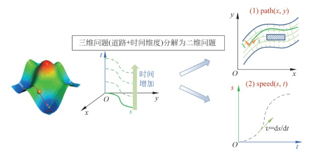
    - 

#### 局部轨迹生成算法

- 基本算法
    - DFS
        - 深度优先搜索算法的思想是，搜索算法从起点开始进行搜索（初始状态下待搜索区域内所有结点均未被访问），与周围所有邻点进行比较，选择其中距离终点最近的点进行存储，然后再以该邻点为基础对比其周围未被访问的所有邻点，仍然选择距离终点最近的邻点存储。若访问结点到达终点或访问完所有结点仍未到达终点，则视为搜索失败。成功搜索所存储的结点连接而成的路径即为起点到终点的路径
 
    - BFS
        - 广度优先搜索又称为宽度优先搜索或横向优先搜索。它的原理是，从初始点出发依次访问与它相连接的邻点，访问完毕后再从这些邻点出发访问邻点的邻点，但是要保证先被访问的邻点的邻点要比后被访问的邻点的邻点先访问，直至图中所有已被访问的结点的邻点都被访问到。如果此时图中尚有未被访问的结点，则需要选取一个尚未被访问的结点作为个新的初始点，继续搜索访问，直到图中所有的结点都被访问一遍为止。
    - 对比： 因此，深度优先算法与广度优先搜索算法从过程上存在较大差异。**深度优先算法**优先选择离**目标点最近**的结点，而**广度优先搜索算法**优先选择离**初始点最近**的点。
    - 基于深度优先算法，能以**最快**的速度找到一条连接初始点到目标点的路径，但不能保证路径的最优性（例如，以路径最短为标准）；广度优先搜索算法则必然能找到最短的路径，但由于需要遍历所有的结点，其计算**复杂**程度更大。
    - 基于这两种算法的优缺点，A'算法基于启发函数构建了代价函数，既考虑了新结点距离初始点的代价，又考虑了新结点与目标点距离的代价。

    - A* [A* 寻路算法](http://www.cppblog.com/christanxw/archive/2006/04/07/5126.html)
        - A*算法是一种启发式的搜索算法，它是基于深度优先算法（Depth First Search，DFS） 和**广度优先算法（Breadth First Search，BFS）**的一种融合算法，按照一定原则确定如何选取下一个结点。**启发式搜索**算法指的是，从起点出发，先寻找起点相邻的栅格，判断它是否是**最好**的位置，基于这个最好的栅格再往外向其相邻的栅格扩展，找到一个此时最好的位置，通过这样一步一步逼近目标点，减少盲目的搜索，提高了可行性和搜索效率。
            - 对bfs的优化：由队列 变成 优先队列
            > BFS是一层一层扩展的，也就是我们有目前已经在第i步的所有状态，之后由它们拓展出所有第i+1步的状态。
            - 很容易想到，当前的所有状态是有优劣之分的，也就是有的状态很可能是正解的必经状态，而有的状态则与正解差了十万八千里。如果我们优先拓展最优的状态，那么就会更快地接近目标。而状态优劣的判断标准显然可以是f 。
            - BFS通常使用队列实现的。那么这时，我们就可以用优先队列进行优化，以f 的大小作为判断标准，优先拓展f ff小的

            - 而IDA*是对dfs的优化
            >普通的DFS“不撞南墙不回头”，不限制的话，很可能沿着一个错误的方向一直递归下去。而IDA*主要有两点升级：
            - 枚举答案的步数。也就是从最小的可能的步数开始往大枚举，直到在这个步数时能从初始状态抵达目标状态。可以简单想一下，每次步数（或者叫深度）加1，那么增加的状态数是相当多的，因此可以忽略前面根本抵达不了终点的步数的耗时。
            - 利用f = g + h  预判是否可能在规定步数抵达终点。假设我们预先设置的步数为x xx，可以知道现状态的f ，那么如果f > x  ，则现状态到不了终点。
            - 由于改成了深度优先的方式，与A*比起来，IDA*更实用：1.不需要判重，不需要排序；2.空间需求减少。

        - A'算法中包含了**开启列表（OPEN表）**和**关闭列表（CLOSE表）**。
        - 在OPEN表中存放的是还没有访问到的结点，CLOSE表中存放的是已访问的结点。算法首先将起点放入开启列表中进行扩展，然后对开启列表中的结点进行路径评分，从而给出从小到大的排列。路径评分需要一个代价函数判断出该结点是否为OPEN表中代价最小的结点，而在算法中，采用如下代价函数评估路径：F=G+H。其中，G为当前结点到起始点的距离，H为当前结点到目标点的距离，F为两者的距离之和。
        - OPEN 表对列表中的结点根据F值进行从小到大的排列，之后将F值最小的结点从OPEN表中删除，并将其添加到CLOSE表中。
        - 最开始只有起点一个结点，因此起点被放人CLOSE表中，并将起点设为当前结点。通过当前结点搜索当前结点邻近的结点，如果该结点所扩展的结点不在OPEN表中，则将这些结点添加到OPEN表中，之后对添加到OPEN表中的结点进行排序，按照上述过程选出F值最小的结点，选出该结点作为当前结点，并扩展其邻近结点。如果所扩展的结点在OPEN表中，以当前结点为父结点，重新计算G值，并和之前的G值进行比较，从而找出最小的G值进行更新，并重新计算F值，再次进行排列。按照以上步骤循环，直至将目标点添加到OPEN表中，此时搜索算法结束。根据父结点一直找到起点，就得到搜索到的最佳路径。图4.8所示为A'算法的效果示意图。
        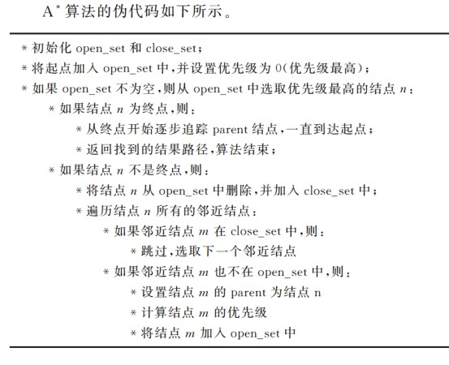
        - **简单流程**
        其中f(n)=g(n) + h(n).
        - （1）引进两个集合，open list：存放待检测的结点及F值；close list：已检测过的结点及F值。
        - （2）初始时，把起点s放入到open list中，close list为空。
        - （3）取出open list中F值最小的结点，设为当前结点，把当前结点放入到close list中；遍历当前结点的相邻可达结点，相邻结点在close list，则跳过，不然加入/更新open list ；加入或更新的结点以当前结点为父节点。
        - （4）重复（3）操作，直到当前节点为目标结点或open list变为空。
        - **详细流程**
        1. 把起点加入 open list 。
        2. 重复如下过程：
            a. 遍历 open list ，查找 F 值最小的节点，把它作为当前要处理的节点。
            b. 把这个节点移到 close list 。
            c. 对当前方格的 8 个相邻方格的每一个方格？
                ◆ 如果它是不可抵达的或者它在 close list 中，忽略它。否则，做如下操作。
                ◆ 如果它不在 open list 中，把它加入 open list ，并且把当前方格设置为它的父亲，记录该方格的 F ， G 和 H 值。
                ◆ 如果它已经在 open list 中，检查这条路径 ( 即经由当前方格到达它那里 ) 是否更好，用 G 值作参考。更小的 G 值表示这是更好的路径。如果是这样，把它的父亲设置为当前方格，并重新计算它的 G 和 F 值。如果你的 open list 是按 F 值排序的话，改变后你可能需要重新排序。
            d. 停止，当你
                ◆ 把终点加入到了 open list 中，此时路径已经找到了，或者
                ◆ 查找终点失败，并且 open list 是空的，此时没有路径。
        3. 保存路径。从终点开始，每个方格沿着父节点移动直至起点，这就是你的路径。

- Dijkstra
    - Dijkstra算法是典型基于启发式算法的最短路径算法，用于计算一个结点到其他所有结点的最短路径。其主要特点是以起始点为中心向外层扩展，直到扩展到终点为止。
    Dijkstra算法能得出最短路径的最优解，但由于它遍历计算的结点很多，所以效率低，Dijkstra算法的运行过程大致如下所述。
    - a.同样创建两个表：OPEN表和CLOSE表。
    - b.OPEN表保存所有已生成而未考察的结点，CLOSE表中记录已访问过的结点。
    - c.访问离起始点最近且没有被检查过的点，把这个点放人OPEN表中等待检查。
    - d.从OPEN表中找出距起始点最近的点，找出这个点的所有子结点，把这个点放到CLOSE表中。
    - e.遍历考察这个点的子结点。求出这些子结点距起始点的距离值，将子结点放到OPEN 表中。
    - f.重复d、e两步，直到OPEN表为空，或找到目标点。

- 随机
基于随机采样的运动规划算法的基本思路是：通过对状态空间均匀随机采样来构建一个连通图，当初始、目标状态都在图中或者都可以连接到图中时，则问题得以解决。基于随机采样的算法不需要对状态空间自由区域进行显式建模，由碰撞检测来验证轨迹的可行性即可。
    - 概率路图法（Probabilistic Road Map，PRM）
        - 构图：在自由空间中 随机采样 G = (V,E)
        - 查询： A*、Dijkstra
        - 概率完备且不最优。 算法效率和精度取决于采样精度
        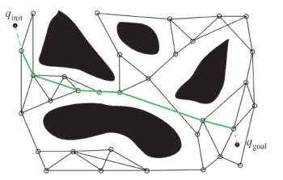
        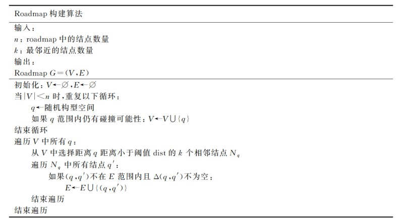
    - 快速随机扩展树法（Rapidly Random Tree，RRT） [RRT路径规划算法](http://www.javashuo.com/article/p-tgcikudc-de.html)
        - RRT算法是从起始点开始向外拓展个树状结构，而树状结构的拓展方向是通过在规划空间内随机采点确定的。
        - 过程
            - 树的初始化：初始化树的结点集和边集，结点集只包含初始状态，边集为空。
            - 树的生长：对状态空间随机采样，当采样点落在状态空间安全区域时，选择当前树中离采样点最近的结点，将其向采样点扩展（或连接）。若生成的轨迹不与障碍物发生碰撞，则将该轨迹加人树的边集，该轨迹的终点加人到树的结点集。
            - 重复上述步骤，直至扩展到目标状态集中。
            - 贪心优化
            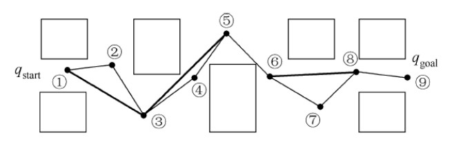
        - 概率完备且不最优
        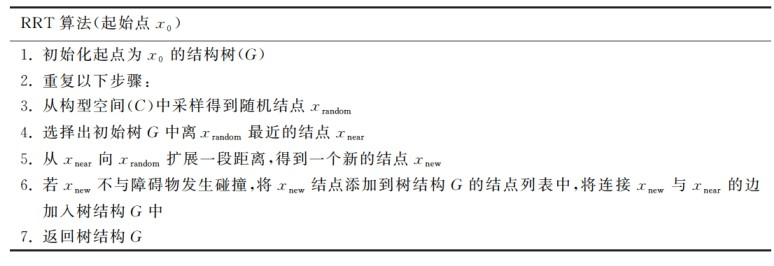
        - > 算法弱点：RRT它是一种纯粹的随机搜索算法对环境类型不敏感，当C-空间中包含大量障碍物或狭窄通道约束时，算法的收敛速度慢，效率会大幅降低：
        - > 算法重点：how to sample from C-Space (line 4). 如何进行随机采样
            how to define the “nearest” node in T (line 5). 如何定义“最近”点
            how to plan the motion to make progress toward sample (line 8). 如何进行树的扩展
        - 拓展： 双树RRT（类似于双向广搜）
            - 基本的RRT每次搜索都只有从初始状态点生长的快速扩展随机树来搜索整个状态空间，若是从初始状态点和目标状态点同时生长两棵快速扩展随机树来搜索状态空间，效率会更高。为此，基于双向扩展平衡的连结型双树RRT算法

- DP
    - DP（Dynamic Programming）算法又称动态规划算法，如图4.16所示，是一种强大的优化手段，允许人们在多项式级别时间内解决许多不同类型的问题。对于这些问题，一般的方法都需要指数级别的时间。
    - DP路径算法的基本思路是：
        - 基于给定的一条中心路径（Reference Line，称为参考线）和车道边界条件，每隔一定间隔的纵向距离（称为不同级上的S值）对道路截面进行均匀采样（与中心点的横向偏移值称为为L值），这样会得到采样点（Waypoint，这些采样点称为航迹点）数组。
        - 通常，道路中心线用于建造S-L坐标系，S代表沿中心线方向，L代表与中心线正交的方向。由于道路曲率的存在，路径规划过程中S-L坐标系通常优先于r-y坐标系的使用，二者可根据实际需要凭借坐标转换关系进行相互转换。
    - 基于一定的规则，可以给出各航迹点迁移的代价值。航迹点迁移不一定需要逐级进行，可以从第一级跳到第三级甚至终点，只要迁移代价值。DP算法是一种聚合重复的计算过程，分解得到的子问题是相互重叠的（Overlap），子问题依赖于子子问题（Subsubproblem），子子问题又进一步依赖于下一级的子子问题，这样不断循环直至抵达不需再分解的初始条件。
    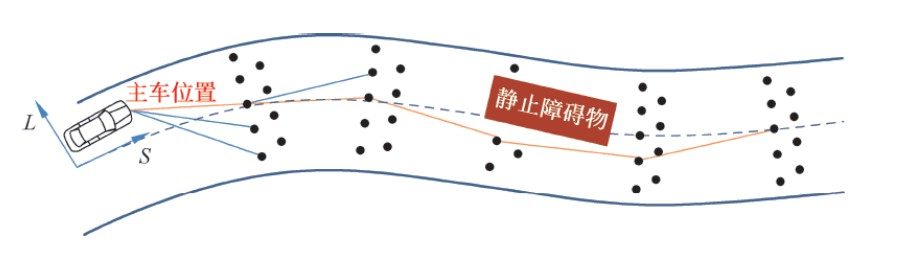

    
##### 局部路径平滑
- 拟合
    - 点点通过式
        - 适用于当前离散点比较精确、步长较小时 --> 插值曲线
    - 平均通过
        - 适用于存在一定误差、通过拟合反映走势 --> 逼近曲线
- 具体方式 
    - 3阶B样条曲线平滑
        - 在连接处具有二阶的连续导数 满足路径平滑
        - 型值点-- 反算--> 控制点 --构造 --> B样条曲线 --插值--> 离散路径点
            - 主要就是根据边界条件解方程求取未知参数
    - QP优化 
    - 基于运动学和动力学的轨迹优化
        - 运动学
        - 非完整性约束：不可积的运动约束 即不能转化为几何约束的运动约束。车辆的速度项 无法通过积分 转化为空间位置，即控制变量少于系统的位姿自由度，因此是一个典型的非完整性约束系统。则在路径规划时不仅要满足几何约束和运动学约束，还要满足动力学约束。
        - 动力学
            - 对侧向加速度约束 转化为 一定车速下的方向盘转角约束，同时有转角连续的约束
            - 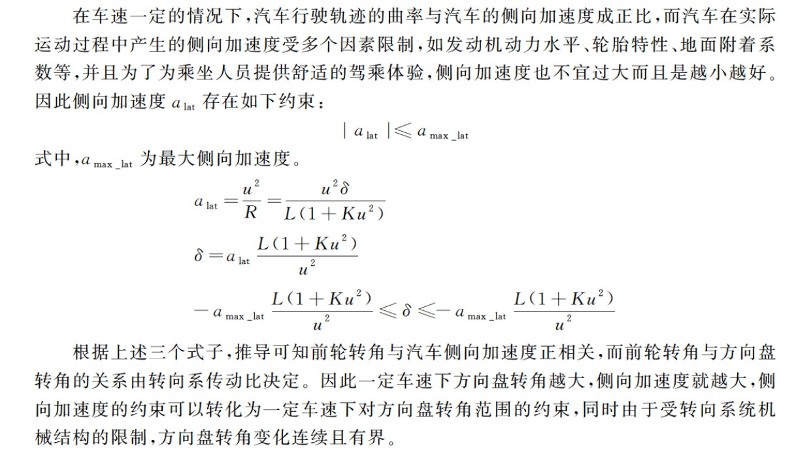

#### 速度规划算法
- 目的：
    - 速度规划的目标是在给定的局部路径曲线上，在满足反馈控制的**操作限制**及符合**行为决策的输出结果**这两个前提下，将路径点赋予速度及加速度信息。速度规划主要考虑的是对动态障碍物的规避。
- 速度规划有以下常见的方法：
    - 对路径指定线加速度来生成速度
    - 样条插值
    - 函数拟合
    - 目标时刻点法
    - QP算法(用规划出的路径，或者直接参考线..)
        - 障碍物预测
        - S—T图 路径纵向位移与时间
        - 栅格化 ： 根据需要确定 采样周期 以及 纵向路径点间隔
        - 起点，目标点(s_max, 或达到t_max)
            - 搜索
            - 代价
                - 配合行为决策：
                    - 针对某id车，超车(上方cost可调小) 避让(下方cost可偏小)
                - 速度 加速度 jerk，
- 速度平滑
    - 多项式回归
        - 回归分析
            - 统计学中定量地找出两种或两种以上变量之间的对应关系称为回归分析。
            >根据自变量的个数、因变量的类型和回归线的形状等信息将回归分析的方法分为线性回归、逻辑回归、多项式回归、逐步回归、岭回归、套索回归等。
            >按照自变量和因变量之间的关系类型，回归分析可分为线性回归分析和非线性回归分析。研究一个因变量与一个或多个自变量间多项式的回归分析方法，称为多项式回归。如果自变量只有一个时，称为一元多项式回归；如果自变量有多个时，称为多元多项式回归。多项式回归的优势在于仅仅通过改变自变量的次数构建多项式去逼近数据点，不存在其他复杂的函数。
        - 损失函数
            - 对回归方程的拟合函数建立损失函数，用于评价拟合程度的好坏，损失函数的值越小，拟合程度越好。当损失函数为最小值时，则对应的参数theta为最优参数，即此时拟合达到最优。
        - 方法：
            - 利用最大似然和最小二乘法等对损失函数求导并且令导数为零，直接得到解析解；
                - 要求逆矩阵，对于数据量小的问题可以快速有效地得到解析解，但是对于数据量大的问题求解逆矩阵需要消耗大量计算机内存，这是不现实的
            - 迭代寻优 √
        - 缺点：难以考虑s约束，平滑后可能会发生碰撞
    - QP √

- 机器学习 P88
    - 模仿学习
    - 基于激励函数的优化 强化学习？
    - 逆向增强学习

- 评价
    - ADE？

## 控制

### 经典控制pid
结构简单、工作可靠、稳定性好、参数调整方便，以及系统的模型不精确时可选。
#### pid基本
尽管不同类型的控制器，其结构、原理各不相同，但是基本控制规律只有三个：比例（P）控制、积分（I）控制和微分（D）控制。这几种控制规律可以单独使用，但是更多场合是组合使用。如比例（P）控制、比例-积分（PI）控制、比例-积分-微分（PID）控制等。

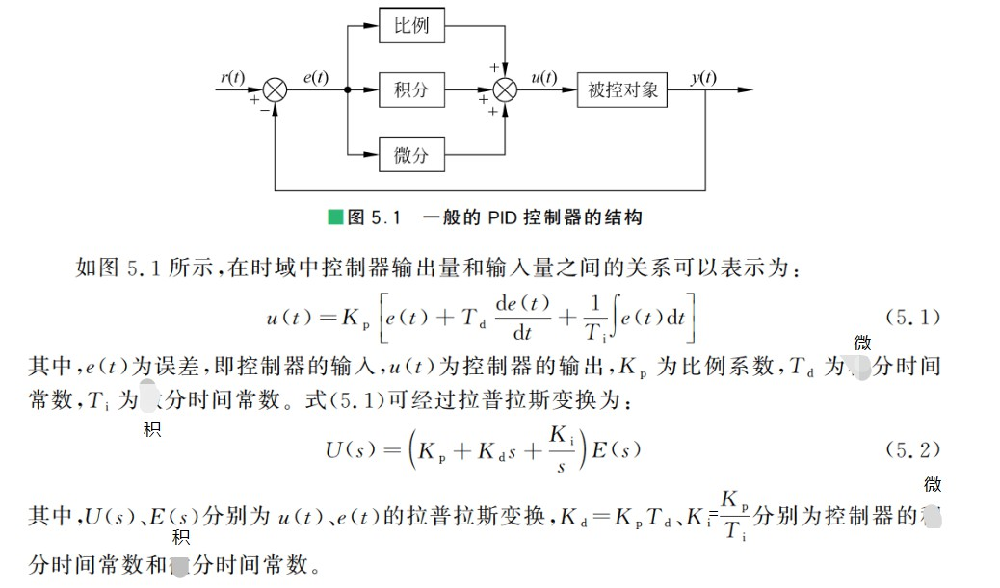
- **比例（P）控制**
　　单独的比例控制也称“有差控制”，输出的变化与输入控制器的偏差成比例关系，偏差越大输出越大。实际应用中，比例度的大小应视具体情况而定，**比例度太小**，控制作用太弱，不利于系统克服扰动，余差太大，控制质量差，也没有什么控制作用；**比例度太大**，控制作用太强，容易导致系统的稳定性变差，引发振荡。
　　对于反应灵敏、放大能力强的被控对象，为提高系统的稳定性，应当使比例度稍小些；而对于反应迟钝，放大能力又较弱的被控对象，比例度可选大一些，以提高整个系统的灵敏度，也可以相应减小余差。
　　单纯的比例控制适用于扰动不大，滞后较小，负荷变化小，要求不高，允许有一定余差存在的场合。工业生产中比例控制规律使用较为普遍。
- **比例积分（PI）控制**
　　比例控制规律是基本控制规律中最基本的、应用最普遍的一种，其最大优点就是控制及时、迅速。只要有偏差产生，控制器立即产生控制作用。但是，不能最终消除余差的缺点限制了它的单独使用。克服余差的办法是在比例控制的基础上加上积分控制作用。
　　积分控制器的输出与输入偏差对时间的积分成正比。这里的“积分”指的是“积累”的意思。积分控制器的输出不仅与输入偏差的大小有关，而且还与偏差存在的时间有关。只要偏差存在，输出就会不断累积（输出值越来越大或越来越小），一直到偏差为零，累积才会停止。所以，积分控制可以消除余差。积分控制规律又称无差控制规律。
　　积分时间的大小表征了积分控制作用的强弱。**积分时间越小，控制作用越强；反之，控制作用越弱，但有利于减少系统超调量、减小震荡，增加系统稳定性、但消除稳态误差的时间也会增加。**
　　积分控制虽然能消除余差，但它存在着控制不及时的缺点。因为积分输出的累积是渐进的，其产生的控制作用总是落后于偏差的变化，不能及时有效地克服干扰的影响，难以使控制系统稳定下来。所以，实用中一般不单独使用积分控制，而是和比例控制作用结合起来，构成比例积分控制。这样取二者之长，互相弥补，既有比例控制作用的迅速及时，又有积分控制作用消除余差的能力。因此，比例积分控制可以实现较为理想的过程控制。
　　比例积分控制器是目前应用最为广泛的一种控制器，多用于工业生产中液位、压力、流量等控制系统。由于引入积分作用能消除余差，弥补了纯比例控制的缺陷，获得较好的控制质量。但是积分作用的引入，会使系统稳定性变差。对于有较大惯性滞后的控制系统，要尽量避免使用。
- **比例微分（PD）控制**
　　比例积分控制对于时间滞后的被控对象使用不够理想。所谓“时间滞后”指的是：当被控对象受到扰动作用后，被控变量没有立即发生变化，而是有一个时间上的延迟，比如容量滞后，此时比例积分控制显得迟钝、不及时。为此，人们设想：能否根据偏差的变化趋势来做出相应的控制动作呢？犹如有经验的操作人员，即可根据偏差的大小来改变阀门的开度（比例作用），又可根据偏差变化的速度大小来预计将要出现的情况，提前进行过量控制，“防患于未然”。这就是具有“超前”控制作用的微分控制规律。微分控制器输出的大小取决于输入偏差变化的速度。
　　微分输出只与偏差的变化速度有关，而与偏差的大小以及偏差是否存在与否无关。如果偏差为一固定值，不管多大，只要不变化，则输出的变化一定为零，控制器没有任何控制作用。**微分时间越大，微分输出维持的时间就越长，加快系统相应速度、减小系统超调量、增加系统稳定性、因此微分作用越强，但对系统的扰动的抵抗能力减弱；反之则越弱**。当微分时间为0时，就没有微分控制作用了。同理，微分时间的选取，也是需要根据实际情况来确定的。
　　微分控制作用的特点是：动作迅速，具有超前调节功能，可有效改善被控对象有较大时间滞后的控制品质；但是它不能消除余差，尤其是对于恒定偏差输入时，根本就没有控制作用。因此，不能单独使用微分控制规律。
　　比例和微分作用结合，比单纯的比例作用更快。尤其是对容量滞后大的对象，可以减小动偏差的幅度，节省控制时间，显著改善控制质量。
- **比例积分微分（PID）控制**
　　最为理想的控制当属比例-积分-微分控制规律。它集三者之长：既有比例作用的及时迅速，又有积分作用的消除余差能力，还有微分作用的超前控制功能。
　　当偏差阶跃出现时，微分立即大幅度动作，抑制偏差的这种跃变；比例也同时起消除偏差的作用，使偏差幅度减小，由于比例作用是持久和起主要作用的控制规律，因此可使系统比较稳定；而积分作用慢慢把余差克服掉。只要三个作用的控制参数选择得当，便可充分发挥三种控制规律的优点，得到较为理想的控制效果。
#### pid参数调整
试凑法

### 现代控制

#### LQR
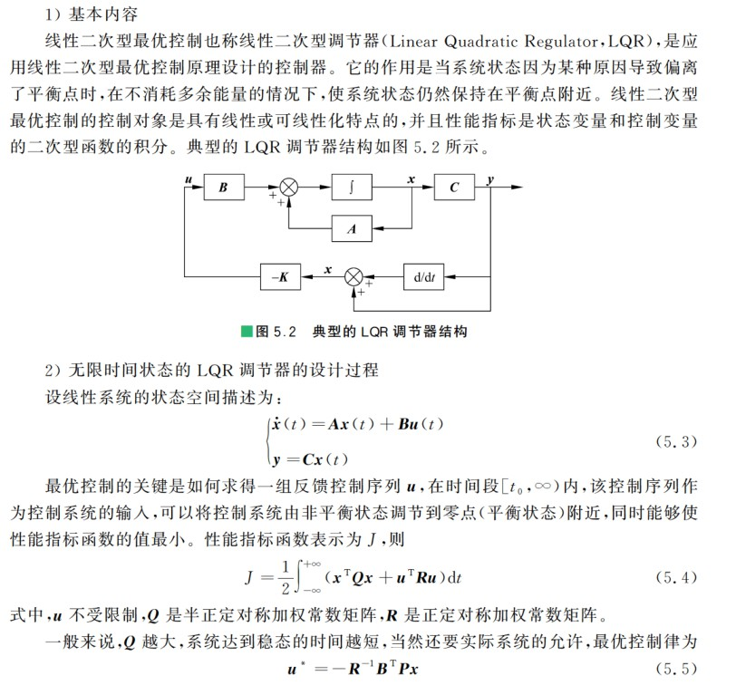
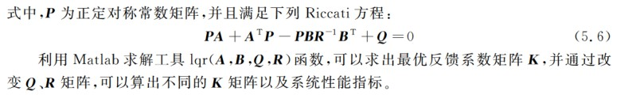
#### 模糊控制

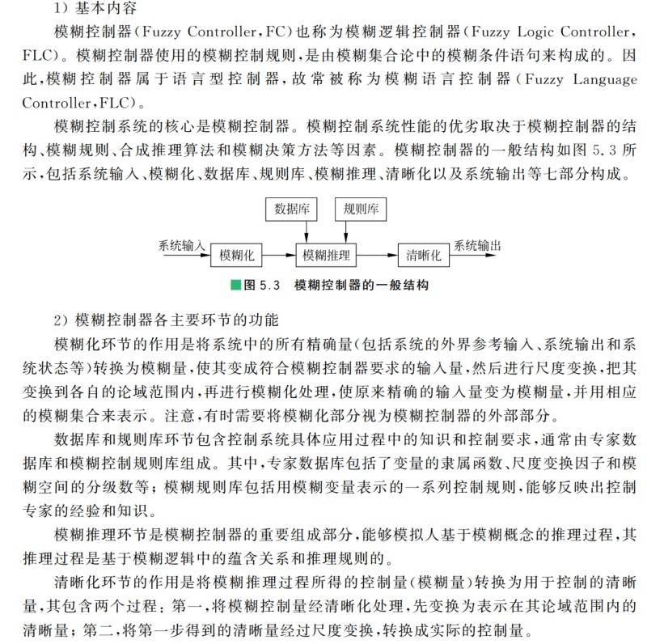

#### 自适应控制

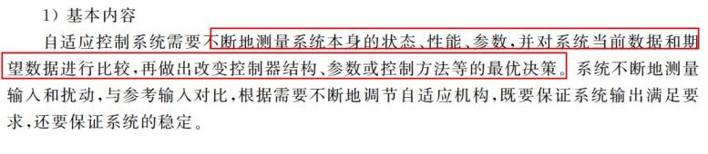

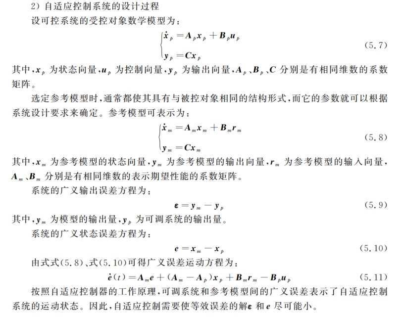

#### 模型预测控制
*具体见 控制笔记的MPC部分*
**1）基本内容**
模型预测控制（Model Predictive Control，MPC）是一种特殊的控制方法。在每一个采样周期，通过求解一个有限时域开环最优控制问题来获得其当前的控制序列。系统的当前状态视为最优控制问题的初始状态，求得的最优控制序列中，只执行第一个控制动作。这是其与使用优先求解控制律的控制方法的最大区别。模型预测控制原理如图5.4所示，k轴为当前状态，左侧为过去状态，右侧为将来状态。也就是说，模型预测控制实际上是一种与时间相关的、利用系统当前状态和当前的控制量，来实现对系统未来状态的控制。而系统未来的状态是不定的，因此在控制过程中要不断地根据系统状态对未来的控制量做出调整。而且相较于经典的PID控制，它具有优化和预测的能力。也就是说，模型预测控制是一种致力于将更长时间跨度甚至于无穷时间的最优化控制问题，分解为若干更短时间跨度或者有限时间跨度的最优化控制问题，并且在一定程度上仍然追求最优解。本质上模型预测控制是要求解一个开环最优控制问题，它的思想与具体的模型无关，但是实现的过程则与模型有关。
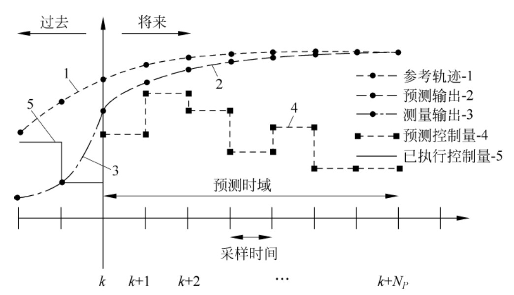
**2）模型预测控制的三个组成部分**
- **预测模型**
预测模型应该能够结合系统的现在的控制输人以及过程的历史信息，来预测控制系统未来的输出值，因此，需要一个描述系统动态行为的模型作为预测模型。在预测控制中的各种不同算法中，常采用不同类型的预测模型，如最基本的模型算法控制（Model Algorithm Contro，MAC），采用的是系统的单位脉冲响应曲线。而动态矩阵控制（Dynamic Matrix Control，DMC）采用的是系统的阶跃响应曲线。这两个模型之间可以互相转换，且都属于非参数模型，在实际的控制过程中比较容易通过实验测得，不必进行复杂的数据处理。尽管精度不是很高，但数据冗余量大，使其抗干扰能力较强。预测模型应具有表现控制系统将来动态行为的功能，就像在系统仿真时一样，可以任意地给出系统未来的控制策略。通过观察控制系统在不同控制策略下输出的变化情况，来比较控制策略的优劣。
- **反馈校正**
利用预测模型进行预估系统的输出值，仅仅是一种理想情况。在实际过程中，可能会因为存在模型失配和干扰等不确定因素，使得基于模型的预测结果不能与实际情况相切合。因此，需要在预测过程中，增加对系统输出值的测量，并与模型预估值进行比较，从而得出模型的预测误差，然后利用预测误差对模型的预测值做修正。因为模型增加了反馈校正，所以预测控制具有较强的抗扰动能力和克服系统不确定性的能力。预测控制不仅是基于模型的，还增加了反馈控制，因此预测控制属于闭环优化控制。
- **滚动优化**
预测控制需要通过某一性能指标的最优求解来确定未来的控制动作。
这一性能指标与控制系统未来的行为有关，由未来的控制策略决定。但是，预测控制的优化与一般的离散最优控制算法不同，其不是采用一个固定的全局最优目标，而是利用滚动式的有限时域内的优化策略。也就是说，优化过程不是单次离线完成的，而是多次在线进行的。在任意的采样时刻，优化性能指标只应用在自该时刻起到未来的有限时间区间，当进行到下个采样时刻时，该优化区间会同时向前。因此，预测控制不是去优化一个全局的性能指标，而是在每一个时刻都有一个局部优化性能指标

**手写版推倒笔记**

#### 神经网络控制
神经网络控制是指应用神经网络技术，对控制系统中难以精确建模的复杂非线性对象进行神经网络模型辨识，可以作为控制器、可以对参数进行优化设计、可以进行推理、可以进行故障诊断，或者同时兼有以上多种功能。通常神经网络直接用作误差闭环系统的反馈控制器，神经网络控制器首先利用其已有的控制样本进行离线训练，而后以系统误差的均方差为评价函数进行在线学习。

神经网络控制就是利用神经网络这种工具从机理上对人脑进行简单结构模拟的新型控制和辨识方法。神经网络在控制系统中可充当对象的模型，还可充当控制器。常见的神经网络控制结构有：
（1）参数估计自适应控制系统；
（2）内模控制系统；
（3）预测控制系统；
（4）模型参考自适应系统；
（5）变结构控制系统。

#### 滑膜控制
滑模控制（Sliding Mode Control，SMC）也叫滑模变结构控制，其本质是一种特殊的非线性控制方法，但其非线性表现为控制序列的不连续性。这种控制方法与其他控制方法的区别在于系统结构不是固定不变的，而是能够在动态过程中，**根据当前的系统状态（例如偏差以及偏差的各阶导数等）有目的地变化，使系统能够按照预定的滑动模态的轨迹运动**。滑动模态需要提前设计且与控制对象参数和外界扰动无关，使得滑模控制具备响应迅速、参数变化平稳、外界扰动影响小、无须系统在线辨识、控制动作实现方式简单等优点。
滑模控制主要表现为控制的不连续性，也就是系统结构随时间变化的特性。该控制特性能够使系统在一定条件下沿着预设的状态轨迹做小幅度、高频率的运动，即滑动模态或者“滑模”运动。滑动模态是可以预设的，而且与系统的参数及外界扰动无关。因此，滑模控制的系统具有较好的鲁棒性，
#### 鲁棒控制

鲁棒控制（Robust Control）方面的研究始于20世纪50年代。在过去的20年中，鲁棒控制一直是控制领域的研究热点。鲁棒性是指控制系统在一定的参数摄动下，维持某些特性的能力。根据对性能的不同定义，可分为稳定鲁棒性和性能鲁棒性。以闭环系统的鲁棒性作为目标设计得到的固定控制器称为鲁棒控制器。鲁棒性也称为系统的健壮性，它是系统在异常扰动情况下保持稳定的关键。例如，自动驾驶汽车的软件平台在输入错误、磁盘故障、网络过载或有意攻击情况下，能不死机、不崩溃，就是该平台的鲁棒性，鲁棒控制适用于稳定性和可靠性作为首要目标的应用，系统的动态特性已知，而且不确定因素的变化情况可以预估。在控制过程中，某些控制系统可以使用鲁棒控制，尤其是对那些不确定因素变化范围大且稳定裕度小的系统。通常，系统的分析方法和控制器的设计大多是基于数学模型而建立的，而且各类方法已经趋于成熟和完善。然而，系统总是存在这样或那样的不确定性。在系统建模时，有时只考虑了工作点附近的情况，造成了数学模型的人为简化；另外，执行部件与控制元件存在制造容差，系统运行过程也存在老化、磨损以及环境和运行条件恶化等现象，使得大多数系统存在结构或者参数的不确定性。这样，用精确数学模型设计出来的控制器常常不满足工程要求。
近年来，人们展开了对不确定系统鲁棒控制问题的研究，并取得了一系列研究成果。其中，H。鲁棒控制理论和u分析理论则是当前控制工程中最突出的研究成果，多年来一直是鲁棒控制研究领域的热门之一
### 汽车模型
考虑二自由度汽车的“自行车”模型。两个自由度分别用汽车侧向位置y和汽车方向角p表示。

#### 运动学模型
汽车运动模型是指用数学方式描述汽车运动而不考虑影响汽车运动的力。运动方程是基于控制对象的几何关系而建立的。建立汽车的运动学模型需要以下假设作为前提：
（1）不考虑汽车在Z轴方向的运动，只考虑XY水平面的运动；
（2）左右侧车轮转角一致，这样可将左右侧轮胎合并为一个轮胎；
（3）汽车行驶速度变化缓慢，忽略前后轴载荷的转移；
（4）车身及悬架系统是刚性的。
#### 动力学模型

### 控制
根据当前周围环境和车体位置、姿态、车速等信息按照一定的逻辑做出决策，并分别向**油门、制动及转向等**执行系统发出控制指令。

- **横向控制**
主要研究自动驾驶汽车的**路径跟踪**能力，即如何控制汽车沿规划的路径行驶，并保证汽车的行驶安全性、平稳性与乘坐舒适性；
- **纵向控制**
主要研究自动驾驶汽车的**速度跟踪**能力，控制汽车按照预定的速度巡航或与前方动态目标保持一定的距离；但独立的横向或纵向控制不能满足自动驾驶汽车的实际需求，因此，复杂场景下的横纵向协同控制研究，对于自动驾驶汽车来说至关重要般地，横向控制系统的实现主要依靠预腊跟随控制、前馈控制和反馈控制。
#### 预瞄控制

预喵跟随控制原理是根据驾驶员操纵特征（驾驶员模型）提出的。驾驶员模型是导航技术的重要组成部分，基于偏差调节的期望路径跟随控制系统可视为一个简易的驾驶员模型。驾驶员基于外界环境、道路信息以及当前汽车的运动状态进行汽车操纵，预测汽车当前实际位置与道路中心线之间的侧向位移偏差和航向偏差的大小，从而转动方向盘使预测偏差为零，该预测偏差叫作预腊侧向位移偏差或预腊航向偏差。驾驶员依据预喵偏差的大小转动对应的方向盘角度，从而完成对期望行驶路径的跟踪。综上，控制系统依据汽车行驶参数、道路曲率、预腊偏差和汽车的动力学模型得出所需方向盘转角或前轮转角，从而实现对期望目标路径的跟踪。预喵跟随控制器由“预腊环节”与“跟随环节”构成，
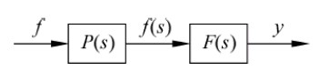
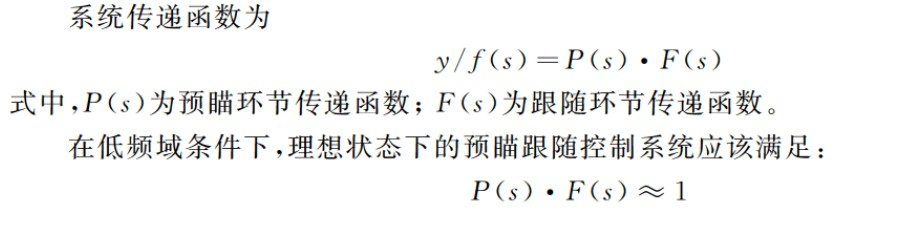

**前馈控制**
前馈控制系统是根据扰动或给定值的变化按补偿原理来工作的控制系统。其特点是当扰动产生后，被控变量还未变化以前，根据扰动作用的大小进行控制，以补偿扰动作用对被控变量的影响。
**反馈控制**
反馈控制是指将系统的输出信息返送到输入端，与输入信息进行比较，并利用二者的偏差进行控制的过程。反馈控制其实是用过去的情况来指导现在和将来。在控制系统中，如果返回的信息的作用是抵消输入信息，称为负反馈，负反馈可以使系统趋于稳定；若其作用是增强输人信息，则称为正反馈，正反馈可以使信号得到加强。

#### 横向控制
自动驾驶汽车作为一个高度非线性的非完整运动约束系统，其模型和所处外界环境存在不确定性及测量不精确性，导致对汽车进行运动控制具有一定的难度。横向控制主要控制航向，通过改变方向盘扭矩或角度的大小等，使汽车按照想要的航向行驶。依据人类驾驶的经验，驾驶员在驾驶途中会习惯性地提前观察前方道路，并预估前方道路情况，提前获得预喵点与汽车所处位置的距离。如果汽车前方道路右转弯，驾驶员会依据道路曲率和行驶车速将方向盘向右转一定角度，为使汽车平顺转弯，驾驶员需要不断观察汽车实际运行位置与道路中心线间的横向位移偏差和航向角偏差，并调整方向盘转角来减小这些偏差，便于准确、快速地跟踪期望路径。但该过程容易受到周围环境的影响，且随车速的变化而变得更加复杂，郭孔辉院士提出的预腊跟随原理形象地描述了上述驾驶员操纵行为。后来在此基础上产生了驾驶员“稳态预测动态校正假说”"预腊最优曲率模型”"最优预描加速度模型”。而在自动驾驶汽车的研究中，预腊跟随理论同样适用。
建立自动驾驶汽车横向控制系统，首先需要搭建道路-汽车动力学控制模型，根据最优预腊驾驶员原理与模型设计侧向加速度最优跟踪PD控制器，从而得到汽车横向控制系统。其次，以汽车纵向速度及道路曲率为控制器输入，预腊距离为控制器输出，构建预喵距离自动选择的最优控制器，从而实现汽车横向运动的自适应预描最优控制。
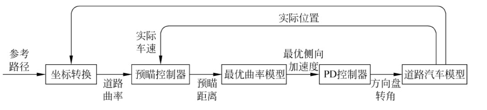
#### 纵向控制

**直接式**
*跟踪位置或速度*
直接式运动控制是通过纵向控制器直接控制期望制动压力和节气门开度，从而实现对跟随速度和跟随减速度直接控制，具有快速响应等特点。
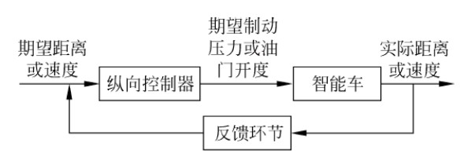
**分层式**
*将速度的跟踪转化为加速度，再跟踪加速度*
基于分层控制结构，根据控制目标的不同，将自动驾驶汽车纵向控制系统分为上位控制器和下位控制器进行单独设计。
**上位控制器**控制策略设计的目的是产生期望车速或者期望加速度；
**下位控制器**接受上位控制器产生的期望状态值，并按照其控制算法产生期望的制动压力值与期望油门开度值，从而实现汽车纵向车间距离或速度跟踪控制的功能

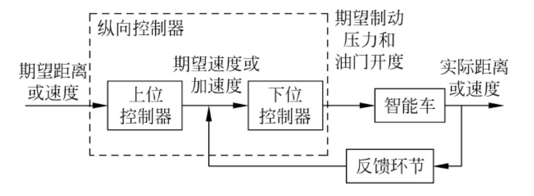
**切换逻辑难点**
汽车在行驶过程中，同时踩下油门踏板与制动踏板的会损坏汽车动力系统和传动系统。
因此切换逻辑要保证以下两点。
（1）在油门踏板踩下的时候需要释放制动踏板，在制动踏板踩下的时候需要释放油门踏板，避免油门踏板和制动踏板同时工作；
（2）避免油门、制动踏板频繁切换，由此设计油门踏板与制动踏板协调切换控制逻辑，根据期望车速与当前实际车速的误差来协调控制加速、制动的切换。

#### 横纵向协同控制
纵向车速作为横纵向控制关键连接。
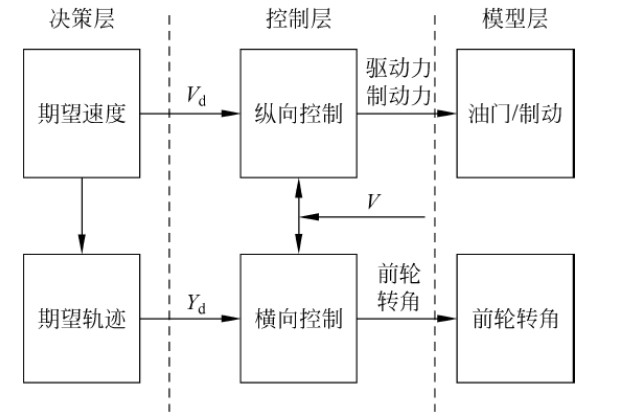

