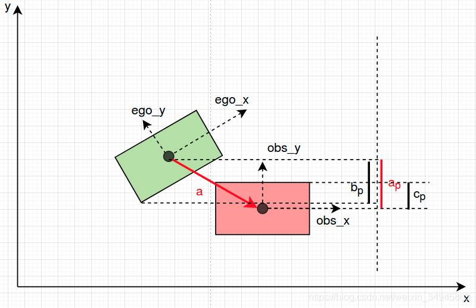
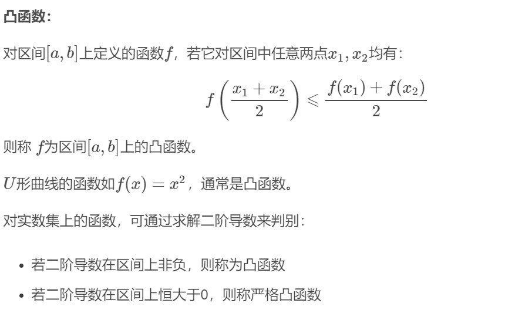

# 基础知识点

## 解耦


降维规划    三维问题 转化 为两个二维问题  路径规划(处理静态障碍物)与速度规划(处理动态障碍物)

路径规划，借助中间变量路径的累计长度 s，先求解 s 映射到几何形状(x, y, θ, κ)的路径函数；速度规划，再求解时间 t，映射到中间变量 s 与 v，a 的速度函数。

### Frenet坐标系

把无人车、道路边界、障碍物特征、障碍物位置等都放到坐标系中
优势：第一将复杂问题的难度降维，第二不受道路几何形状影响，更好的场景理解。

[^_^]:
     在弗莱纳坐标系下做运动规划的好处在于借助于指引线做运动分解，将高维度的规划问题，转换成了多个低维度的规划问题，极大的降低了规划的难度。另外一个好处在于方便理解场景，无论道路在地图坐标系下的形状与否，我们都能够很好的理解道路上物体的运动关系。相较直接使用地图坐标系下的坐标做分析，使用弗莱纳坐标，能够直观的体现道路上不同物体的运动关系。

在路径规划中，我们借助于弗莱纳坐标系，将当前车辆的运动状态(x, y, θ, κ, v, a)做分解。使用弗莱纳坐标系的前提是具有一条光滑的指引线。一般情况下，将指引线理解为道路中心线，车辆在没有障碍物情况下的理想运动路径。我们这里的光滑的指引线是指指引线的几何属性可以到曲率级别的光滑。指引线的光滑性至关重要，因为其直接决定了在弗莱纳坐标系下求得轨迹的平顺性。要求达到 曲率可导级别


在给定一条光滑指引线上，我们按照车辆位置，将其投影到指引线上，以投射点为基础，将地图坐标系下当前车辆的运动状态(x, y, θ, κ, v, a)进行分解，获得沿着指引线方向的位置、速度、加速度，以及相对于指引线运动的位置、 “速度”、 “加速度”。这里打引号的原因是横向的“速度”、“加速度”并非通常意义上位移对时间的一阶/二阶导数，而是横向位移对纵向位移的一阶/二阶导数，它们描述了几何形状的变化趋势。


### 路径规划 sl坐标系

路径优化
第一步将连续性问题离散化。以 ?s 为间隔采样，得到n 个点。?s不能太大也不能太小，如果特别小在工程上影响速度，所以?s通常设置为0.5厘米。

第二步是明确要满足的约束条件。包括三条，主车必须在道路边界内，同时不能和障碍物有碰撞；根据当前状态，主车的横向速度/加速度/加加速度有特定运动学限制；必须满足基本的物理原理。


第三步是明确要努力达到的目标。首先第一目标确保安全礼貌驾驶，不能四处乱窜，用数学语言表达相当于横向位移绝对值最小；第二确保舒适的体感，尽可能降低横向速度/加速度/加加速度。

第四步将优化问题转化为二次规划问题进行求解。转化为二次规划的问题之后，整个复杂问题简单化，运用一些现成比较好的求解二次规划算法，规划出比较合理的运动路径。

它的输出是比较平滑、舒适、能够合理避开所有障碍物尽快达目的地的路径。


在弗莱纳坐标系下的函数l(s)，表达了以指引线为参考，相对于指引线的几何形状；通过转换到地图坐标系下，就表达了在地图坐标系的路径。所以，本质上，路径规划问题在弗莱纳坐标系下，就是一个计算函数l(s)的过程。

[Article:分享回顾 | Apollo 轨迹规划技术分享](https://mp.weixin.qq.com/s/ao5hC_3A7fn8_L_PFw399A)

为了解决这个问题，这里介绍由我提出的分段加加速度优化算法（Piecewise Jerk Path Optimization Algorithm），我们先来看一下算法的流程：


第一步，我们将环境中的静态障碍物从地图坐标系映射到依据指引线的弗莱纳坐标系下（红色方框）。


将环境中的静态障碍物映射到弗莱纳坐标系中


第二步，沿指引线的 s 轴方向，使用 Δs 将 s 方向等距离离散化。根据障碍物的信息、道路的边界，计算出每一个离散点所对应的可行区域(l_min^i，l_max^i )。为了方便描述，我们将无人驾驶车简化成一个点。为了避免碰撞，在计算可行区域的时候可以留出适当的缓冲区间。


弗莱纳坐标系离散化


第三步，介绍优化算法使用的优化变量。对于每一个离散点i，我们将该点的横向偏移 l_i，横向偏移相对于s的一阶和二阶导数 l_i^′ 和 l_i^″作为优化变量。l_i^′ 和 l_i^″可以近似理解为横向运动的“速度”与“加速度”。他们的大小决定了车辆靠近与偏离指引线的趋势。


假设每两个离散点之间，有一个常三阶导数项l_(i→i+1)^?连接着相邻的离散点， 这个“常”三阶导数项可以由相邻的二阶导数通过差分的方式计算得到。在优化的迭代过程中，l(i→i+1)^? 会随着相邻点li^″  与l_(i+1)^″  的变化而变化，但l_(i→i+1)^?在两个离散点之间会保持不变。


第四步，设置优化目标。首先，对于路径来讲，在没有环境因素影响的情况下，我们希望它尽可能的贴近指引线。对于一阶、二阶与三阶导数，我们希望它们尽可能的小, 这样可以控制横向运动的向心加速度，保证路径的舒适性。


算法完整描述中的输入和输出

下面，我们回顾一下这个算法，算法的输入由四个部分组成：

光滑的道路指引线，用于在弗莱纳坐标系下的运动分解。
当前无人驾驶车辆的运动状态，包括位置、朝向、即时转向、速度与加速度。车辆运动状态会依照光滑指引线进行分解
环境中态障碍物的信息，投影到指引线上
车辆自身的属性，运动学模型等，用于计算优化过程中合理的变量限制条件。


算法完整描述


算法的变量每一个离散点的横向位移，横向位移对指引线纵向长度 s 的一阶、二阶导数，对于有 n 个输入点的问题，优化变量有 3?n 个。对于限制条件，首先横向位移li需要在相对应的安全区间之内(l_min^i,l_max^i )。对于 l_i^′, 〖l_i〗^″, l(i→i+1)^?的取值范围，需要根据当前车辆移动速度, 车辆的动力学模型计算，涉及到具体的车辆模型。


一个非常关键的约束条件是路径的连续性。我们假设相邻两点之间有一个常三阶导数量 l_(i→i+1)^?来连接，我们需要确定经过这个常三阶导数量l(i→i+1)^?，相邻两个点的l, l^′, l″的数值能够吻合。举个例子，两个点之间就好比可以拉伸的绳子，l(i→i+1)^?决定了可以拉伸的程度，这两个式约束决定了在绳子拉伸的过程中保证绳子不被拉断。


优化目标函数


算法的优化目标，是减小横向位移的零阶，一阶，二阶和三阶导数，使路径尽可能贴近指引线的同时保证舒适性。当然，我们也可以根据需求，选择性的加入与边界距离的优化目标，使车辆与障碍物保持适当距离。分段加加速度算法由于其大密度分段的特性，使得能够表达的路径具有很高的灵活性，能够解决城市道路中（特别是国内拥挤的环境J）的路径规划问题；并且，由于是以加加速度级别的控制变量来改变路径的形状，能够做到曲率级别的连续性，保证了路径的平滑舒适。


### 速度规划 st坐标系
速度规划目标 
    安全
    高效
    舒适

1.坐标系
2.速度采样：首先对路程和时间进行采样，然后搜索出粗略的可行路线，最后选出代价最小的一条，代价函数需考虑限速、碰撞、路径形状、舒适度和完成时间等。

速度优化：

1) 以 ?s 为间隔采样。

2) 明确要满足的约束条件，考虑以下三个约束条件：

主车不能和障碍物有碰撞

根据当前状态，主车的加速度/加加速度有特定运动学限制 

必须满足基本的物理原理

3) 明确要努力达到的目标，主要包括以下两个方面：

尽可能贴合决策时制定的速度分配 

确保舒适的体感，尽可能降低加速度/加加速度

4) 转化为二次规划问题，求解。


图片

速度规划的目标


下一步，我们来看怎样为计算出的路径分配速度。对于速度规划，有如下要求：
速度分配具有灵活性，能够避让复杂、拥挤的城市环境中的众多移动障碍物。
速度分配需要遵守车辆运动学的限制条件， 比如最大速度、加速度、加加速度等，确保规划出的轨迹车辆实际可以执行。
规划的速度分配需要遵守考虑交通法规的限制，在限速范围内规划。
规划的速度分配需要完成到达指定位置或者指定速度的任务，并且在保证舒适度的前提下，完成时间尽可能的短。


速度规划的策略

在 Apollo 平台的实现中，采用了结合启发式速度规划和分段加加速度算法相结合的方式来解决速度规划问题。启发式速度规划提供考虑了动静态障碍物、路径几何信息、道路信息、舒适度、目标速度和地点多种因素综合下的速度规划粗略估计；分段加加速度算法对启发是速度规划提供的粗略分析进行平滑，输出安全舒适的速度分配。


在启发式速度规划中，采用了一个非常好的分析工具，路径-时间障碍物图（Path-Time Obstacle Graph）。路径-时间障碍物图非常适合在确定了路径的情况下，考虑动静态障碍物的规避问题。这个分析工具的核心思想就是将考虑了本车和周围障碍物几何形状和预测轨迹的情况下，将障碍物的轨迹投影到已经确定的本车路径上。障碍物所代表的含义是在何时（t）与何地（s）本车会与障碍物发生碰撞。


启发式速度规则


在 Apollo 的实现中，路径-时间障碍物图根据时间轴 t 和沿路径的累计距离s离散化，形成等距离、等时间的网格状图。然后根据需求，将各种因素使用不同的权重，建模成一个单一熟知的代价函数，每一个网格的节点会赋予一个代价，相邻网格之间的边也视为代价的一部分，用来建模加速度。整个过程可以看成是一个图搜索的过程，搜索出一个代价最优的路径。搜索的结果就是一系列的路径距离与时间的序列，代表何时（t），我们期望无人驾驶车到达何地（s）。


分段加加速度平滑算法


启发式速度规划的粗略结果只能提供位置，缺乏控制所需要的更高维信息，不适合控制模块直接使用。产生的结果需要进一步的平滑才能满足舒适度要求。我们进一步做平滑处理的方法使用的是分段常加加速度算法，其主要思想类似于前面介绍的路径优化算法，在给定趋近启发式速度规划结果的情况下，调整启发式速度规划，提高速度分配的平滑性。


分段加加速度算法


下面具体介绍应用在速度平滑上的分段加加速度算法。由于与前面的路径上使用的算法类似，相似的地方就不再赘述。该算法以时间作为离散参数（可以使用启发式算法使用的时间间隔），以每个离散点的位置、速度、加速度作为优化变量，并且假设相邻两点之间，是一个由相邻加速度变量差分得到的加加速度。


优化目标函数设置


在优化函数的设置上，与前面算法相似的地方是惩罚加速度与加加速度的以获得舒适的乘坐体验。不同的一个优化目标是希望位置变量与启发式规划所得到的位置信息尽可能贴近。启发式规划所得到的位置信息蕴含了根据路径几何形状、道路限速等等所做出的计算，这些计算绑定在相应的位置上，所以优化之后的轨迹需要贴近于相应的启发式结果才能体现启发式规划所做的选择。


算法评价与改进


大家可能有的一个问题是，在速度规划的时候，为什么分成启发式的速度规划与分段加加速度算法结合的形式？为何不直接使用加加速度算法进行求解？主要的问题在于在速度规划的时候，进行离散的维度、时间，也是优化目标的一部分。


位置与时间同为优化变量，与位置相关的限制条件， 比如路径曲率、道路限速信息等等，会影响到达位置的时间；而时间的变化又会引起优化速度的变化，进而导致位置发生变化。这就导致了一种变量间耦合变化的情况。启发式速度规划使用粗略的方法，近似解决了位置 s 决定的限制条件与时间 t 相互耦合的问题，使时间成为了常量。


但是，这样做也有很明显的不利影响，启发式速度规划的粒度影响了搜索的质量，在搜索过程不够准确，不能反映车辆的动态变化。平滑时单纯贴近启发式速度规划，速度规划并非最优。


## 参考线

### 拼接

### 五次多项式


## 凸优化


## 二次规划


## 碰撞检测 

[Article:技术文档｜Apollo中Lattice轨迹碰撞检测](https://mp.weixin.qq.com/s/AOvG-jVtnMJVGwTP_g7uLA)

方法：**分离轴定理**       其他叫法：[超平面分离定理](https://blog.csdn.net/weixin_41024483/article/details/104526134)

分离轴定律：两个凸多边形物体，如果我们能找到一个轴，使得两个在物体在该轴上的投影互不重叠，则这两个物体之间没有碰撞发生，该轴为Separating Axis

包围盒：是根据物体的集合形状，来决定盒子的大小和方向，这样可以选择最紧凑的盒子来代表物体。

目的：剔除存在同障碍物碰撞风险的轨迹，具体详情如下，大致就是对于每个采样点，自车采用矩形Box包络，障碍物们采用矩形Box包络，然后检测是否有干涉。


原理：检查矩形框之间是否有重叠，自动泊车中车辆碰撞检测也是类似方法。

对于多边形分离轴定律变成，两个多边形在**所有**轴上的投影都发生重叠，则判定为碰撞；否则，没有发生碰撞。


两种常见的物体包络框：

AABB—Axis Aligned Bounding Box

OBB—Oriented Bounding Box

具体：

1. AABB 包围盒: AABB 包围盒是与坐标轴对齐的包围盒, 简单性好, 紧密性较差(尤其对斜对角方向放置的瘦长形对象, 采用AABB, 将留下很大的边角空隙, 导致大量没必要的包围盒相交测试)。当物体旋转之后需对AABB 进行同样的旋转并更新; 当物体变形之后只需对变形了的基本几何元素对应的包围盒重新计算; 然后可以自下向上由子结点的AABB 合成父结点的AABB, 最后进行包围盒树的更新。

2. OBB 包围盒: OBB 碰撞检测方法紧密性是较好的, 可以大大减少参与相交测试的包围盒的数目, 因此总体性能要优于AABB 和包围球, 并且实时性程度较高。当物体发生旋转运动后, 只需对OBB 进行同样的旋转即可。因此, 对于刚体间的碰撞检测, OBB 不失为一种较好的选择。迄今为止, 还没一种有效的方法能够较好地解决对象变形后OBB 树的更新问题, 而重新计算每个结点的OBB 的代价又太大。所以OBB 不适用于包含软体对象的复杂环境中。

3. 包围球: 包围球碰撞检测方法是用球体包围整个几何体, 无论是几何体还是相交测试都很简单; 但是它的紧密性太差。因为除了在3 个坐标轴上分布得比较均匀的几何体外, 几乎都会留下较大的空隙, 需要花费大量的预处理时间, 以构造一个好的层次结构逼近对象。当物体变形之后,包围球树需要重新计算。因此,它是使用得比较少的一种包围盒。当对象发生旋转运动时, 包围球不需作任何更新, 这是包围球的较优秀特性; 当几何对象进行频繁的旋转运动时, 采用包围球可能得到较好结果。

拓展：

> 任何实时三维交互式程序，如果没有碰撞检测，都是没有价值，甚至无法使用的。游戏中最常用的碰撞检测技术莫过于包围盒（bounding volume）碰撞检测。对于以60pfs运行的游戏来说，处理每一帧数据的时间只有0.0167s左右，对于不同的游戏，碰撞检测大概需要占10~30%的时间，也就是说，所有碰撞检测必须在0.002~0.005s内完成，非常巨大的挑战。因此，任何包围盒都应该满足以下特性:
>
> 1.快速的碰撞检测
>
> 2.能紧密覆盖所包围的对象
>
> 3.包围盒应该非常容易计算
>
> 4.能方便的旋转和变换坐标
>
> 5.低内存占用
>
>    最常见的包围盒有：Sphere，AABB，OBB等，外加一个比较特殊的frustum。Sphere能很好的满足1，3，4，5条，但通常包含了太多无用的空间，容易导致错误的碰撞结果。AABB应该是sphere与obb之间的解决方案，同时兼顾了效率和空间覆盖范围。OBB是三者中精度最高的，但检测代价也是最高的。
>
>    最终使用哪一种包围盒，是一个非常痛苦的过程，我们需要在效率和精度之间做出权衡取舍。
>
> 参考：[Bounding Volume Performance Test：AABB vs OBB vs Sphere](https://blog.csdn.net/weixin_30632089/article/details/95824501?spm=1001.2101.3001.6650.3&utm_medium=distribute.pc_relevant.none-task-blog-2%7Edefault%7ECTRLIST%7ERate-3.pc_relevant_aa&depth_1-utm_source=distribute.pc_relevant.none-task-blog-2%7Edefault%7ECTRLIST%7ERate-3.pc_relevant_aa&utm_relevant_index=5)

如下图：

AABB:                                                                             OBB:


Planning中自车采用OBB方式。在感知领域Box用的很多，图像处理、激光雷达分割聚类这些需要对物体标记跟踪。

方法：
1、建立自车Box

    const auto& trajectory_point =
        discretized_trajectory.TrajectoryPointAt(static_cast<std::uint32_t>(i));
    double ego_theta = trajectory_point.path_point().theta();
    Box2d ego_box(
        {trajectory_point.path_point().x(), trajectory_point.path_point().y()},
        ego_theta, ego_length, ego_width);
    // 车辆center和车辆的几何中心不重合，所以box需要校正一下
    double shift_distance =
        ego_length / 2.0 - vehicle_config.vehicle_param().back_edge_to_center();
    Vec2d shift_vec{shift_distance * std::cos(ego_theta),
                    shift_distance * std::sin(ego_theta)};
    ego_box.Shift(shift_vec);


这部分相对简单，锁定当前轨迹点，构建Box框，由于几何中心和车辆中心不一致(普通乘用车前后配比几乎没有1:1，除了柯尼塞格)，所以做了一下校正，最后的ego_box就是我们要的。


2、快速剔除非碰撞Box

因为检测过程是根据采样点遍历进行的，可以理解为逐帧进行，下一步可以知道精确的碰撞检测其实是比较繁琐的，对于显而易见的不会碰撞，方法相对简单。

```c++  
if (box.max_x() < min_x() || box.min_x() > max_x() || box.max_y() < min_y() ||
      box.min_y() > max_y()) {
    return false;
  }
```


如图所示：凡是在灰色区域外障碍物box，都是一定没有发生碰撞的，这是一个充分不必要条件。因为，会有类似t3时刻的发生。上述方法只能用在轴对齐的Box中，对于非轴对齐的，只能用于快速粗略的剔除不碰撞Box：


3、碰撞的精确检测

第2步中能够快速跳过无碰撞的时刻，对于出现t3时刻的情况，采取了另外的检测方法：分离轴定理。

通俗理解就是——投影。如果空间中两个物体，想知道是否接触，最直接的方法便是来回绕着看看，确认一下两者间是否有间隙。

人是立体的，而且还是凸多面体，这方法可还行？好在Planning中，我们是以上帝视觉观测，是二维空间，事情更加简单，最少投影数是几边形，就投几次影，Apollo中采用的是凸四边形，所以四次投影分别是：
- 在自车纵轴上投影
- 在自车横轴上投影
- 在障碍物纵轴上投影
- 在障碍物横轴上投影

如图：


$$a_p$$中心连线构成的向量在投影线上的投影长，$$b_p,c_p$$分别为自车、障碍物在投影线上的投影长度

判断的依据：
$$a_p \le b_p+c_p$$

如果上式成立，两者就有接触或碰撞的可能了。很明显，从下面这张图已经看出它们并没有发生碰撞，不妨碍进行额外的三次确认，继续：


接下来


最后



从后三次来看，图中显示两者是有重叠的，所以这四次确认需要一套做完，可以看到第2步高效地跳过了很多不必要的计算。


4.具体实现

对于投影而言，向量运算这种方式是很便捷的，具体步骤如下：确定边界相对于自身坐标系的坐标→转换为笛卡尔坐标(全局)→向量常规运算→得到对应投影长度


Apollo具体代码部分：
```c++  
const double shift_x = box.center_x() - center_.x();
  const double shift_y = box.center_y() - center_.y();

  const double dx1 = cos_heading_ * half_length_;
  const double dy1 = sin_heading_ * half_length_;
  const double dx2 = sin_heading_ * half_width_;
  const double dy2 = -cos_heading_ * half_width_;
  const double dx3 = box.cos_heading() * box.half_length();
  const double dy3 = box.sin_heading() * box.half_length();
  const double dx4 = box.sin_heading() * box.half_width();
  const double dy4 = -box.cos_heading() * box.half_width();
  // 对于OBB边框，使用分离轴定理进行碰撞检测？？？
  return std::abs(shift_x * cos_heading_ + shift_y * sin_heading_) <=
             std::abs(dx3 * cos_heading_ + dy3 * sin_heading_) +
                 std::abs(dx4 * cos_heading_ + dy4 * sin_heading_) +
                 half_length_ &&
         std::abs(shift_x * sin_heading_ - shift_y * cos_heading_) <=
             std::abs(dx3 * sin_heading_ - dy3 * cos_heading_) +
                 std::abs(dx4 * sin_heading_ - dy4 * cos_heading_) +
                 half_width_ &&
         std::abs(shift_x * box.cos_heading() + shift_y * box.sin_heading()) <=
             std::abs(dx1 * box.cos_heading() + dy1 * box.sin_heading()) +
                 std::abs(dx2 * box.cos_heading() + dy2 * box.sin_heading()) +
                 box.half_length() &&
         std::abs(shift_x * box.sin_heading() - shift_y * box.cos_heading()) <=
             std::abs(dx1 * box.sin_heading() - dy1 * box.cos_heading()) +
                 std::abs(dx2 * box.sin_heading() - dy2 * box.cos_heading()) +
                 box.half_width();

```

至此，障碍物碰撞检测完成，函数外部根据返回值，做下一步处理即可。


参考：[OBB包围盒及其碰撞检测算法（一）](https://blog.csdn.net/ARTELE/article/details/54729847?spm=1001.2101.3001.6650.7&utm_medium=distribute.pc_relevant.none-task-blog-2%7Edefault%7EBlogCommendFromBaidu%7ERate-7.pc_relevant_default&depth_1-utm_source=distribute.pc_relevant.none-task-blog-2%7Edefault%7EBlogCommendFromBaidu%7ERate-7.pc_relevant_default&utm_relevant_index=12)


## 场景


无保护左转： 十字路口内同时发生一方左转 和 对向直行
这种情况下，对向直行的车辆前部有一大型车辆，更加危险。。。

[Video:Apollo air - 无保护左转](https://haokan.baidu.com/v?pd=wisenatural&vid=8586707211770843840)


每个场景不同的参数

Apollo 3.5中规划模块的体系结构已经有所改变，该架构能够反映针对不同驾驶场景的模块化设计方法。如下图所示， 在规划器中, 每一个独立的驾驶场景都和对应的场景处理器一一对应。每个驾驶场景都有其一组特定于该场景的驾驶参数，使其更安全、高效、更易于自定义和调试以及更灵活。因为每个阶段都被划分为多个任务，使得每个阶段也是可配置的，并且可以通过编辑该场景的配置文件config来删除或创建每个任务。
[Article:技术文档丨Apollo规划模块技术指导](https://mp.weixin.qq.com/s/ou1Sot_CmpsQ5R5cP0hkVw)


驾驶场景的分类 
[Article:入门必看丨解析百度Apollo之决策规划模块](https://mp.weixin.qq.com/s/hg3LTvtm_3jVKC0eSaPfvQ)


```c++  
 Status PublicRoadPlanner::Plan(const TrajectoryPoint& planning_start_point,
                            Frame* frame) {
DCHECK_NOTNULL(frame);
 scenario_manager_.Update(planning_start_point, *frame); ①
 scenario_ = scenario_manager_.mutable_scenario(); ②
 auto result = scenario_->Process(planning_start_point, frame); ③
 
 ...
 if (result == scenario::Scenario::STATUS_DONE) {
scenario_manager_.Update(planning_start_point, *frame); ④
} else if (result == scenario::Scenario::STATUS_UNKNOWN) {
return Status(common::PLANNING_ERROR, "scenario returned unknown");
}
return Status::OK();
}

```

这段代码的几个关键步骤是：
1、确定当前Scenario：因为Frame中包含了当前状态的所有信息，所以通过它就可以确定目前是处于哪一个场景下。
2、获取当前Scenario。
3、通过Scenario进行具体的处理。
4、如果处理成功，则再次通过ScenarioManager更新。

车道保持
车道保持场景是默认的驾驶场景，它不仅仅包含单车道巡航。同时也包含了：

- 换道行驶。
- 遵循基本的交通约定。
- 基本转弯。


Side Pass
在这种情况下，如果在自动驾驶车辆（ADC）的车道上有静态车辆或静态障碍物，并且车辆不能在不接触障碍物的情况下安全地通过车道，则执行以下策略：

- 检查邻近车道是否接近通行。
- 如果无车辆，进行绕行，绕过当前车道进入邻道。
- 一旦障碍物安全通过，回到原车道上。


停止标识

停止标识有两种分离的驾驶场景：
1、未保护：在这种情况下，汽车预计会通过具有双向停车位的十字路口。因此，我们的ADC必须爬过并测量十字路口的交通密度，然后才能继续走上它的道路。
2、受保护：在此场景中，汽车预期通过具有四向停车位的十字路口导航。我们的ADC将必须对在它之前停下来的汽车进行测量，并在移动之前了解它在队列中的位置。


## 时间戳 


规划模块发送给控制模块的轨迹上的时间戳为 绝对时间，更容易进行匹配控制时所需的点


# lattice算法 
[Article:开发者说 | Lattice Planner从学习到实践（一）](https://mp.weixin.qq.com/s/jKy4AJjZhuqWADW9h7JCzQ)


[Article:Apollo问答 | 关于Lattice Planner规划算法的若干问答](https://mp.weixin.qq.com/s?__biz=MzI1NjkxOTMyNQ==&mid=2247485366&idx=1&sn=369da82241c514fa64ca5dff01cbf4dd&chksm=ea1e15c4dd699cd2ed46e862769afa5cefabfd3f4a030c7222a8ac9e6971810064d5e2b0b7d5&scene=21#wechat_redirect)


### osqp 

OSQP(Operator Splitting Quadratic Program)是一个求解凸二次规划问题的开源求解器，官网地址为https://osqp.org/。

OSQP的内核优化算法是交替方向乘子法(Alternating Direction Method of Multipliers, ADMM)，具体的算法原理可以阅读[运筹OR帷幄的专栏文章](https://zhuanlan.zhihu.com/p/164556507)

OSQP使用时无需调用其他第三方库，其内置的线性方程组求解算法是QDLDL，在求解中小规模的问题时效果较好；如果想要求解大规模的问题，官方建议使用Intel的MKL Pardiso，也可以使用其他求解器，具体可以参考官方帮助文档。这里只介绍OSQP的基本安装及调用方法。

more: see Eigen QR ,ADMM


Eigen:

[Eigen](http://eigen.tuxfamily.org/dox/group__TutorialSparse.html)
[C++ Eigen 线性回归（最小二乘法、牛顿法）](https://blog.csdn.net/duxingzheyun/article/details/107015571?utm_medium=distribute.pc_relevant.none-task-blog-2~default~baidujs_title~default-1.no_search_link&spm=1001.2101.3001.4242.2#commentBox)
[非线性最小二乘求解方法详解](https://chenjianqu.blog.csdn.net/article/details/104430491?spm=1001.2101.3001.6650.1&utm_medium=distribute.pc_relevant.none-task-blog-2%7Edefault%7ECTRLIST%7Edefault-1.no_search_link&depth_1-utm_source=distribute.pc_relevant.none-task-blog-2%7Edefault%7ECTRLIST%7Edefault-1.no_search_link)

QR:
QR分解法是三种将矩阵分解的方式之一。这种方式，把矩阵分解成一个正交矩阵Q与一个上三角矩阵R的积。QR分解经常用来解线性最小二乘法问题。QR分解也是特定特征值算法即QR算法的基础。
[QR分解之HouseHolder变换](https://blog.csdn.net/flyfish5/article/details/52315062)
[QR分解 wiki](https://zh.wikipedia.org/wiki/QR%E5%88%86%E8%A7%A3)

ADMM:
[admm_talk](https://stanford.edu/~boyd/papers/pdf/admm_talk.pdf)
[video:ADMM 类算法的一些最新进展 ](https://www.bilibili.com/video/BV1mQ4y1y7RR?from=search&seid=14859138914122743796&spm_id_from=333.337.0.0)
[交替方向乘子法（ADMM）算法的流程和原理是怎样的？](https://www.zhihu.com/question/36566112)
[优化 | 基于ADMM的OSQP求解器介绍](https://zhuanlan.zhihu.com/p/164556507)


**use demo**


// eigen
[视觉SLAM十四讲（第二章作业）](https://blog.csdn.net/weixin_37661692/article/details/82926541?spm=1001.2101.3001.6650.14&utm_medium=distribute.pc_relevant.none-task-blog-2%7Edefault%7EBlogCommendFromBaidu%7Edefault-14.no_search_link&depth_1-utm_source=distribute.pc_relevant.none-task-blog-2%7Edefault%7EBlogCommendFromBaidu%7Edefault-14.no_search_link)


osqp 基本使用
[OSQP使用说明](https://zhuanlan.zhihu.com/p/376122376)
[如何使用OSQP-Eigen](https://blog.csdn.net/gophae/article/details/115122792)
[使用OSQP解决二次凸优化(QP)问题](https://blog.csdn.net/shoufei403/article/details/108672152?ops_request_misc=%257B%2522request%255Fid%2522%253A%2522163721343516780265438151%2522%252C%2522scm%2522%253A%252220140713.130102334..%2522%257D&request_id=163721343516780265438151&biz_id=0&utm_medium=distribute.pc_search_result.none-task-blog-2~all~top_click~default-2-108672152.first_rank_v2_pc_rank_v29&utm_term=osqp&spm=1018.2226.3001.4187#commentBox)
[osqp-eigen使用记录](https://blog.csdn.net/BIT_csy/article/details/120403259?spm=1001.2101.3001.6650.3&utm_medium=distribute.pc_relevant.none-task-blog-2%7Edefault%7ECTRLIST%7Edefault-3.no_search_link&depth_1-utm_source=distribute.pc_relevant.none-task-blog-2%7Edefault%7ECTRLIST%7Edefault-3.no_search_link)


凸函数
[凸函数](https://blog.csdn.net/weixin_38493025/article/details/89155222)


矩阵基础
[【矩阵学习】Jacobian矩阵和Hessian矩阵](https://blog.csdn.net/qq_36641919/article/details/88409718?utm_medium=distribute.pc_relevant.none-task-blog-2%7Edefault%7EBlogCommendFromMachineLearnPai2%7Edefault-8.control&depth_1-utm_source=distribute.pc_relevant.none-task-blog-2%7Edefault%7EBlogCommendFromMachineLearnPai2%7Edefault-8.control)


Hessian 矩阵是半正定凸函数，可以利用这一点来判断驻点（critical point）是否为局部最大值、局部最小值或鞍点。假设驻点为 x ，判断方法如下：

Hessian 矩阵是正定矩阵时（特征值全为正数），则 f  在点 x  处取到极小值；
Hessian 矩阵是负定矩阵时（特征值全为负数），则 f  在点 x  处取到极大值；
Hessian 矩阵是不定矩阵时（特征值有正有负），则 x  是 f  的鞍点；
否则，无法确定，需要利用其他方法判断。


## 如何判断一个函数是否是凸函数

[参考：凸函数](https://blog.csdn.net/jgj123321/article/details/105945705/)
　对于一元函数f(x)，可以通过其二阶导数f′′(x)的符号来判断。如果函数的二阶导数总是非负，即f′′(x)≥0，则f(x)是凸函数。
　对于多元函数f(X)，可以通过其Hessian矩阵（Hessian矩阵是由多元函数的二阶导数组成的方阵）的正定性来判断。如果Hessian矩阵是半正定矩阵，则是f(X)凸函数。
二次导数f''（x）大于零，一次导数f'（x）递增，函数f(x)下降的趋势越来越缓（或上升的趋势越来越大）


**凸优化问题的局部最优解是全局最优解**
上面的公式，完全可以推广到多元函数。在数据科学的模型求解中，如果优化的目标函数是凸函数，则局部极小值就是全局最小值。这也意味着我们求得的模型是全局最优的，不会陷入到局部最优值。

非凸函数优化图示


凸函数优化图示


二次规划
[二次规划](https://blog.csdn.net/lilong117194/article/details/78204994)


## 二次规划问题
是一种典型的优化问题，包括凸二次规划和非凸二次规划，在此类问题中，目标函数是变量的二次函数，约束条件是变量的线性不等式。





apollo规划的osqp
[Apollo 6.0 QP（二次规划）算法解析](https://zhuanlan.zhihu.com/p/325645742)
古月居
[基于OSQP的二次规划](https://guyuehome.com/36175)


ipopt:
求解模型
状态变量 $$ x = [x_1,x_2,x_3,x_4]^\mathrm{T}$$
目标函数 $ f(x) = x_1 * x_4 * (x_1 + x_2+ x_3) + x_3 $
约束条件：$ g_1(x) = x_1 * x_2 * x_3 * x_4 \ge 25 $; $ g_2(x) = x^2_1 + x^2_2 + x^2_3 + x^2_4 = 40 $


观察效果  和 用时  以及 极端例子怎么样
1. 测试一下 参考线的平滑    [百度Apollo代码阅读：参考线平滑FemPosDeviationSmoother](https://blog.csdn.net/weixin_44201317/article/details/105547643?spm=1001.2014.3001.5501)
   
    - map节点中
        - 约束是距离初始的点距离0.2m
        - 尤其是对初始点的约束要更小 防止因为总体的平滑 使得车辆当前点的约束失效
    - 500个点  迭代500 次   优化用时 3ms
2. 测试一下 路径搜索   
    - 仅仅是路径搜索 A* + qp大概20ms
        - A* 3ms
        - QP 12 - 20ms     迭代500次
        - knots 为40？？？ 0.2m的精度？？ 还是0.25m啊
        -  [A矩阵中连续性约束等问题的推倒](https://zhuanlan.zhihu.com/p/383738586)
        - 连续性约束
            连续性约束，个人认为其目的是为了将零阶状态用一二阶状态进行线性表示，这样才更为合理地表示各界状态的关联关系，毕竟低阶的运动状态是由高阶状态积分得到的。
        - 至于代码中出现的scale_factor，个人认为：保证了优化项之间差别不至于过大。如果优化项之间差别过大（比如跨了几个数量级）可能会导致过小的那个优化项无效。
        - 对于P矩阵来说，为什么不直接将运动视作一个四阶运动系统？直接将其视作一个四阶系统，这样会会简化P矩阵的表达？
            个人认为主要原因是，在实际的车辆运动中，dddl没有实际对应的物理量，无法直接得到其上下边界值，所以只能改变P矩阵的形式，将三阶状态通过使用二阶状态表示出来。关于本问题的P矩阵，网上已经有很多资料方便理解，我大概推导了一下，发现有一些可以优化改进的地方，在工作中我也实现了对P矩阵的改进，欢迎大家和我一起来讨论。
        - 之所以使用CSC矩阵是为了方便将稀疏矩阵进行高效地存储，


3. mpc osqp     赶紧看吧
    MPC:
    - basic:
    [Apollo代码学习(五)—横纵向控制](https://blog.csdn.net/u013914471/article/details/83748571)
    - src:
    - [Apollo代码学习(六)—模型预测控制(MPC)](https://blog.csdn.net/u013914471/article/details/83824490#commentBox)
    - [MPC求解（基于apollo代码的理解）](https://blog.csdn.net/weixin_41399470/article/details/91353459)
4. mpc ipopt


osqp代码流程：

1.
2.
3.


