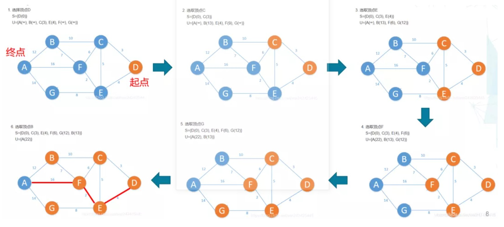
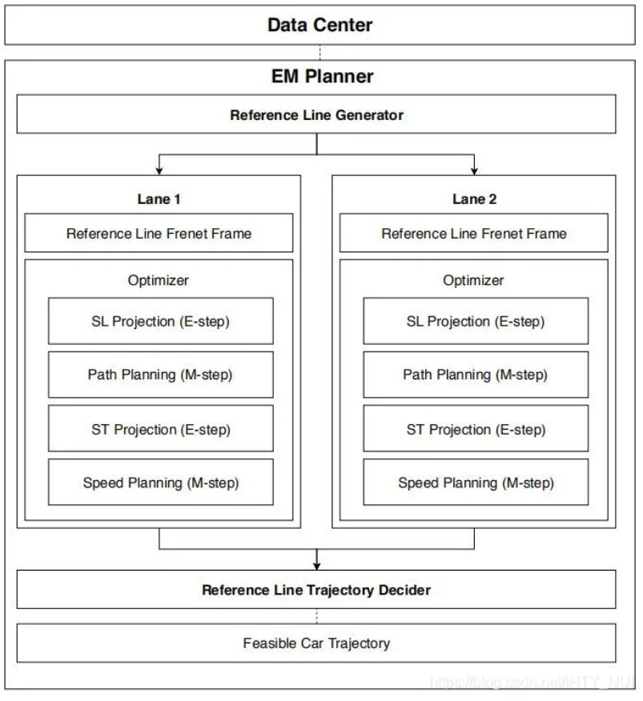

[Article:技术文档 | Apollo轨迹规划——算法综述](https://mp.weixin.qq.com/s/mPiAPT5hBlhR5gINIEMnkw)

# 轨迹规划
规划（planning）承接环境感知，并下启车辆控制。其规划出来的轨迹是带速度信息的路径
规划（planning）可分为路由寻径（Routing）、行为决策（Behavioral Decision）、运动规划（Motion Planning）.

路由寻径（Routing）：是全局路径规划，可简单的理解为传统地图导航+高精地图（包含车道信息和交通规则等）；

行为决策（Behavioral Decision）:决策车辆是否跟车、在遇到交通灯和行人时的等待避让、以及路口和其他车辆的交互通过；

运动规划（Motion Planning）：是局部路径规划，是人车未来一段无时间内的期望行驶路径，需满足汽车运动学、动力学、舒适性和无碰撞等要求。

## 综述

轨迹规划的任务是计算出一个无碰撞可执行的轨迹（包含路径和速度信息），保证车辆从起点安全的驾驶到目的地，并尽可能高效。其问题的本质是一个多目标的数学优化问题。

主要的优化目标包括：

安全性：避免与场景中的障碍物发生碰撞；针对动态障碍物，由于其未来运动的不确定性，降低其未来的碰撞风险；

稳定性：由于车辆的惯性较大，灵活性差，期望轨迹需要保证车辆的物理可行性和控制器的稳定性；

舒适性：考虑到乘员的舒适性，需要在满足安全性和稳定性的同时保证车辆的驾驶舒适度，包括加减速以及转向等过程；

驾驶效率：在满足安全性和稳定性的同时，保证车辆以更快的速度驾驶，从而更短的时间到达目的地。

在实际场景中，规划过程需要考虑各种物理约束，有且不限于：

加减速度约束：受到动力系统和制动系统的性能极限，及驾驶员的安全性和舒适性的制约；

非完整性约束：车辆具有三个运动自由度，但是只有两个控制自由度，其非完整性约束决定了轨迹的物理可行性；

动力学约束：考虑到车辆的动力学特性和车身稳定性，其驾驶过程中的曲率和横摆角速度具有一定的约束；

1、基于图搜索的算法：Dijkstra、A*、D*（全局路径规划）

2、 基于曲线拟合的算法：圆弧与直线、多项式曲线、样条曲线、贝塞尔曲线、微分平坦（局部路径规划）

3、基于数值优化的算法：利用目标函数和约束对规划问题进行描述和求解（局部路径规划）

4、基于人工势场的算法：人工势场法（全局路径规划）

5、基于采样的算法：概率图 和 RRT（全局路径规划）
>概率图(Probabilistic Road Map，PRM)算法使用局部规划算法建立随机状态之间的连接关系，从而抽象出概率图，对于确定的起始状态和目标状态，它只需要快速地搜索概率图便可获得路径。
>快速探索随机树(Rapidly-exploring Random Tree，RRT)算法由LaValle和Kuffner提出，它最初专用于解决运动学约束的路径规划问题。由于RRT算法在状态空间采用随机采样的结点，不需要太快的搜索速度，尤其在高维规划空间中搜索速度优势尤为明显，因此这种方法作为一种快搜索方法在路径规划领域获得了广泛应用。早期主要采用单向RRT算法进行搜索，为了进一步提高搜索速度及保证算法的完备性，提出了双向RRT算法和偏向RRT算法，

6、基于智能法的算法：模糊逻辑、神经网络、遗传算法（略）

**详解：**

1、基于图搜索的算法

将环境进行栅格化，一条路径可以利用图搜索的算法来访问栅格图中的节点，从而得到规划。

1.1  Dijkstra

Dijkstra算法的主要特点是以起始点为中心向外层层扩展（广度优先搜索思想），直到扩展到终点为止。迪杰斯特拉算法的成功率是最高的，因为它每次必能搜索到最优路径。但迪杰斯特拉算法的搜索速度是最慢的：随着图维度的增大，其计算效率会明显变低。

基本步骤：

指定起点s。

引进两个集合S和U。S的作用是记录已求出最短路径的顶点（以及相应的最短路径长度），而U则是记录还未求出最短路径的顶点（以及该顶点到起点s的距离）。

初始时，S中只有起点s；U中是除s之外的顶点，并且U中顶点的路径是“起点s到该顶点的路径”。然后，从U中找到路径最短的顶点，并将其加入到S中；接着，更新U中的顶点和顶点对应的路径。

重复该操作，直到遍历完所有顶点。

1.2  A*

Dijkstra算法是广度优先算法，是一种发散式的搜索，搜索速度是很慢。这里引入一种启发式算法的深度优先算法：A*。其基本思想：

>深度优先搜索、广度优先搜索？、选代加深搜索和等代价搜索算法使用了**回溯**技术实施搜索，它从起始状态出发沿着树的深度，遍历树的结点，尽可能深地搜索树的分支，直至要么到达目标状态，要么到达一个搜索终止点。如果发现了**目标状态**，它退出搜索并返回解路径；如果到达的是一个**搜索终止点**，那么它将回溯到路径上含有未搜索过的结点的临近结点，并沿着这个分支继续搜索下去。因此，这类算法比较适合于解决环境中结点数目较少情况下的路径搜索问题，当结点数目比较多时，算法搜索速度慢、效率低。
而**启发式搜索算法**在决定结点扩展顺序的估价函数中引人了启发值，即当前结点状态到目标状态之间的估计消耗，从而引导搜索朝向目标状态的方向，避免了盲目搜索，有助于提高算法的搜索效率，因而启发式搜索算法越来越广泛地应用于路径规划。

基本步骤：

把起点加入 Open list 。

重复如下过程：

a ) 遍历 Open list ，查找 F 值最小的节点移到 Close list ，把它作为当前要处理的节点。

b ) 判断当前方格的 8 个相邻方格的每一个方格，若为Unreachalbe或者已在 Close list 中则忽略。否则做如下操作。
c ) 如果它不在 Open list 中，把它加入 Open list ，并且把当前方格设置为它的父亲，记录该方格的 F ， G 和 H 值。
d ) 如果它已经在 Open list 中，检查这条路径 ( 即经由当前方格到达它那里 ) 是否更好，用 G 值作参考。更小的 G 值表示这是更好的路径。如果是这样，把它的父亲设置为当前方格，并重新计算它的 G 和 F 值。
直到Openlist为空，从终点开始，每个方格沿着父节点移动直至起点，这就是最优路径。

代码：
初始化两个空的列表openlist和closelist，将起点加入openlist中，并设置代价值为0。
while(1)
{
    if(openlist != null)
    {
         从openlist中选取代价值最小的节点n.
         1. 如果节点n为终点，则从终点开始逐步追踪parent节点，一直达到起点，返回找到的结果路径，
            跳出循环，算法结束，break;
         2. 如果节点n不是终点，
            2.1 将节点n从openlist中删除，加入到closelist中.
            2.2 遍历节点n的8个相邻无碰撞节点
                2.2.1 如果相邻节点在closelist或者不可达，则跳过该节点，计算下一个节点。
                2.2.2 如果已经在openlist中，查看是否需要更新。如需更新，还要相应更新父节点，并则上滤。
                2.2.3 如果相邻节点不在openlist中，则设置该节点父节点为n，通过f(n)计算该节点的代价值，并将该节点放入openlist中。
     }
     else
         break; //不能找到一条最优路径
}

拓展： 混合A*
HybridAstar算法原理
HybridAstar算法主要分为两部分，一部分是最短路径的栅格代价值生成，有两种方式，一种是采用A*，另一种采用djkstra，但目标都一样，形成最短路径上的栅格代价值；另一部分是曲率采样，也就是所谓路径平滑，和A*的思想一样采用节点的方式产生树结构，在树结构中引入openlist和closelist两个列表，以此进行树的剪枝和回退操作。根据代价函数，将采样节点放到openlist中，同时根据最优代价从openlist中取出节点，并存放到closelist中，其操作过程和前面提到的A*算法过程一致。

2、基于曲线拟合的算法

这块会在后面的APA和超车中整理出来。

基本方法：

余弦曲线：在起始位置和终点位置二次导数取最大值（加速度为最大值），舒适性差；

多项式曲线：可避免圆弧直线路径中曲率不连续的问题 ，达到曲率连续变化；

圆弧及公切线：路径曲率不连续，车辆到达曲率间断点处时需停车转向，否则因方向盘转速和车速的影响，车辆将偏离目标路径；

贝塞尔曲线：对路径进行平滑处理，达到曲率变化率连续性；

B样条曲线：对路径进行平滑处理，达到曲率变化率连续性；

微分平坦：对路径进行平滑处理，达到曲率变化率连续性。

3、基于数学优化的算法

这一块儿是想基于Apollo整理，但是内容比较大，这里只概述一下，后续会用专门的一篇整理Apollo的Rounting和Motion Planning（自动驾驶之轨迹规划2——Apollo规划与控制公开课）。Apollo的决策规划模块是“轻决策重规划”，且有好几种Planner，RTK Planner是基于录制的轨迹规划行车路线，EM Planner是路径和车速分层规划，Lattice Planner是直接高维轨迹规划（路径和车速一起规划）。这里先只讲下EM Planner。

在规划过程中解决决策问题。一般先是由Rounting模块进行全局规划，得出Reference line，然后Motion Planning在此基础上进行局部轨迹规划。Motion Planning将路径和车速分层规划，并在SL和ST坐标系下，使用动态规划进行路径和车速的决策和粗规划，然后使用二次规划进行平滑处理。

动态规划：使用动态规划的原因是Apollo把道路进行切片撒点，把轨迹问题变成分段最优问题，即动态规划中的最优子结构。

二次规划：使用二次规划的原因是Apollo把路径和车速平滑性，以平方项的方式进行量化，由此转化为二次规划问题。

4、基于人工势场的算法
APF假设车辆在一种虚拟力场下运动：车辆的初始点在一个较高的“山头”上，要到达的目标点在“山脚”下，这就形成了一种势场，车辆在这种势的引导下，避开障碍物，到达目标点。
当然，人工势场法（APF）也有缺点：可能被困在局部最优解。

5、基于采样的算法
RRT随机树：快速随机地扩张，一群像树一样的路径以探索（填充）空间的大部分区域，伺机找到可行的路径。

基本步骤：

起点作为一颗种子，从它开始生长枝丫；

在车辆所处的空间中，生成一个随机点 ；

在树上找到距离 最近的那个点；

朝着的方向生长，如果没有碰到障碍物就把生长后的树枝和端点添加到树上，返回 2；

但RRT缺点也很明显：

RRT 得到的路径一般质量都不是很好，例如可能包含棱角，不够光滑；

通常也远离最优路径；

难以在有狭窄通道的环境找到路径。因为狭窄通道面积小，被碰到的概率低，找到路径需要的时间要看运气。

1、低速场景：APA
大致分为3类：

基于轨迹规划：需额外考虑速度规划，APA为低速场景，该算法复杂一般不用。

基于路径规划：正弦曲线、多项式曲线、圆弧及公切线、贝塞尔曲线、B样条曲线。

基于经验：模糊逻辑等。

2、高速场景：超车

超车分为3个阶段：变道，超越和并道。从本质上看，可认为是驾驶员的两次换道和一次超越行为的综合结果。目前基于多项式的方法用的多一些（对标：LKA也是基于3次多项式）。

生成好具体路径之后，就会交给控制模块，控制模块需要按照规划好的线路去执行，目前有2种实现，一种是[PID控制](PID Controller - Wikipedia)，PID是控制学中很常见的方式，比如电机的控制，简单来说，就是根据当前的误差（汽车预期的位置和实际的位置之差）来进行调节，如果向左偏，就把方向盘往右打一点，如果向右偏，就把方向盘往左打一点。PID模型比较简单，由于PID模型对反馈速度的要求很高，而汽车传动的模型相对没那么快，比如刹车，汽车不是立即就刹停，所以就要求能够用模型来描述刹车的过程，这里采用了[MPC控制](Model Predictive Control)，即基于模型的控制方法。好处是可以通过模型来描述汽车的运动轨迹，坏处是运算量太大，不一定能够算出固定解。

[Article:开发者说 | Apollo控制算法之LQR](https://mp.weixin.qq.com/s/WbTtBjeUmBeS3OQgaFG4eA)

LQR 理论是现代控制理论中发展最早也最为成熟的一种状态空间设计法。特别可贵的是，LQR可得到状态线性反馈的最优控制规律，易于构成闭环最优控制。

LQR 最优设计是指设计出的状态反馈控制器 K 要使二次型目标函数 J 取最小值，而 K 由权矩阵 Q 与 R 唯一决定，故此 Q、R 的选择尤为重要。

### 三级标题

三级标题的内容

