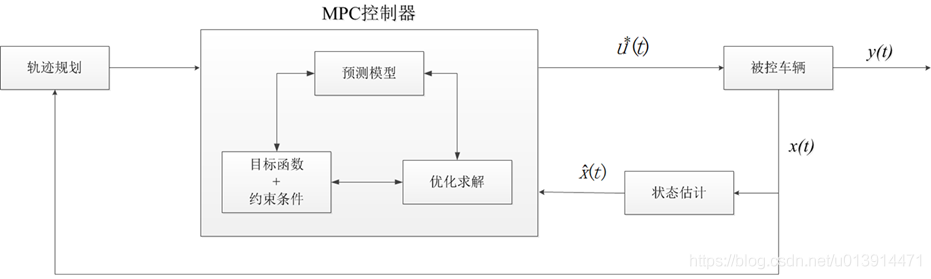
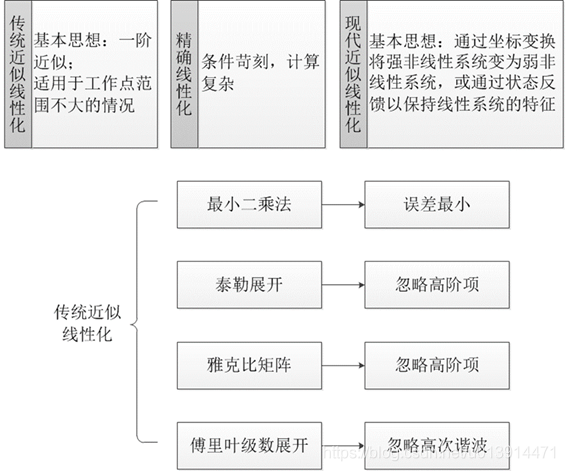

# 一级标题

一级标题的内容

## MPC控制
### 基本原理

模型预测控制是一种先进的过程控制方法，在满足一定约束条件的前提下，被用来实现过程控制，它的实现依赖于过程的动态模型（通常为线性模型）。在控制时域（一段有限时间）内，它主要针对当前时刻进行优化，但也考虑未来时刻，求取当前时刻的最优控制解，然后反复优化，从而实现整个时域的优化求解。

也就是说，模型预测控制实际上是一种时间相关的，利用系统当前状态和当前的控制量，来实现对系统未来状态的控制。而系统未来的状态是不定的，因此在控制过程中要不断根据系统状态对未来的控制量作出调整。而且相较于经典的的PID控制，它具有优化和预测的能力，也就是说，模型预测控制是一种致力于将更长时间跨度、甚至于无穷时间的最优化控制问题，分解为若干个更短时间跨度，或者有限时间跨度的最优化控制问题，并且在一定程度上仍然追求最优解。

模型预测控制在实现上有三个要素：

1. **预测模型**:是模型预测控制的基础，用来预测系统未来的输出；
2. **滚动优化**:一种在线优化，用于优化短时间内的控制输入，以尽可能减小预测模型输出与参考值的差距；
3. **反馈矫正**:在新的采样时刻，基于被控对象的实际输出，对预测模型的输出进行矫正，然后进行新的优化，以防模型失配或外界干扰导致的控制输出与期望差距过大。


### 具体



其中， $$x(t)$$ 为 t时刻车辆的观测状态，$$\hat{x}(t)$$
 为$$t$$时刻车辆的估计状态，$$ u^*(t)$$为$$t$$时刻的最优控制解， $$y(t)$$为$$t$$时刻的系统输出。

模型预测控制的实现，依赖MPC控制器、被控车辆、状态估计器、轨迹规划等信息。结合图1和图4，模型预测控制器的一般工作步骤可以概括如下：
1、在$$t$$时刻，结合历史信息和当前状态以及预测模型，预测$$N$$步的系统输出；
2、结合约束条件等，设计目标函数，计算最优控制解$$ u^*(t)$$，输入到被控车辆，使其在当前控制量下运动；
3、获取车辆状态$$x(t)$$，输入到状态估计器中，对那些无法直接用传感器获取或观测成本较高的的状态量进行估计，然后将$$\hat{x}(t)$$输入到MPC控制器，再次进行优化求解，以得到未来一段时间的预测控制序列；
4、然后在$$t+1$$时刻重复上述步骤，如此，滚动地实现带约束的优化问题，从而实现对被控对象的连续控制。
此外，$$x(t)$$也可在需要的时候，被用来更新规划轨迹，以便得到更好的控制效果。
 
#### 1. 预测模型
无论是运动学模型，还是动力学模型，所搭建的均为非线性系统，而线性模型预测控制较非线性模型预测控制有更好的实时性，且更易于分析和计算。对于无人车来说，实时性显然很重要，因此，需要将非线性系统转化为线性系统，而非线性系统的线性化的方法大体可分为精确线性化和近似线性化，多采用近似的线性化方法。
 
##### 线性化




**雅克比矩阵** [Article:]()
##### 离散化


##### 单轨模型

#### 2.滚动优化


在设计代价函数时候，一般设计为二次型的样式，为的是避免在预测时域内，误差忽正忽负，导致误差相互抵消；
可考虑的代价有：
a. 距离误差(Cross Track Error, CTE)，指实际轨迹点与参考轨迹点间的距离
b. 速度误差，指实际速度与期望速度的差
c. 刹车/油门调节量，目的是为了保证刹车/油门变化的平稳性
d. 航向误差等…
约束条件
a. 最大前轮转角
b. 最大刹车/油门调节量
c. 最大方向盘转角
d. 最大车速等


#### 3.反馈矫正


### 代码实现

1. 
2.
3.
4.


具体代码(c++ ,from apollo)


```


```

参考：[Article:Apollo代码学习(六)—模型预测控制(MPC)](https://blog.csdn.net/u013914471/article/details/83824490)


### 三级标题


## 其他控制

### 滑模控制

[Article:百度百科：滑模控制](https://baike.baidu.com/item/%E6%BB%91%E6%A8%A1%E6%8E%A7%E5%88%B6/2785312?fr=aladdin)
### pid控制

模糊自适应pid控制

