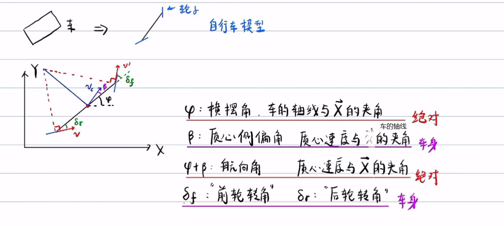
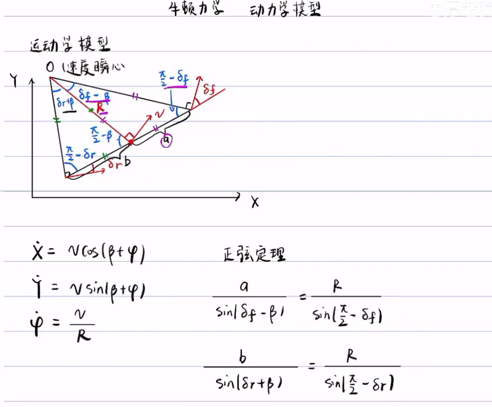
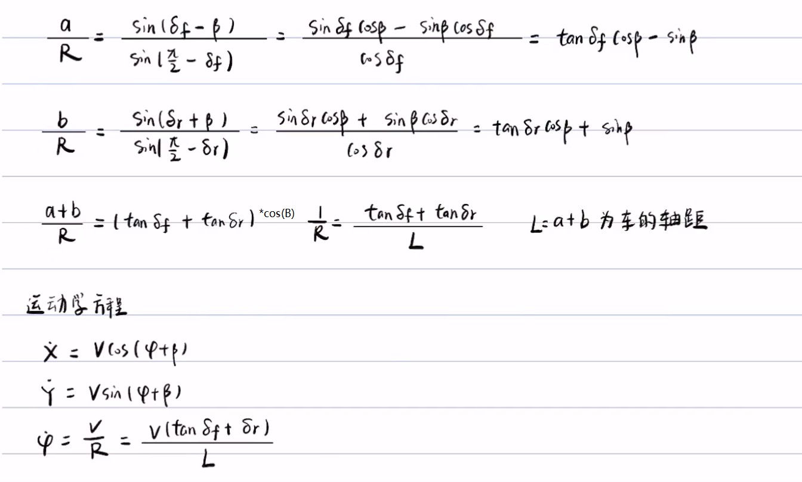
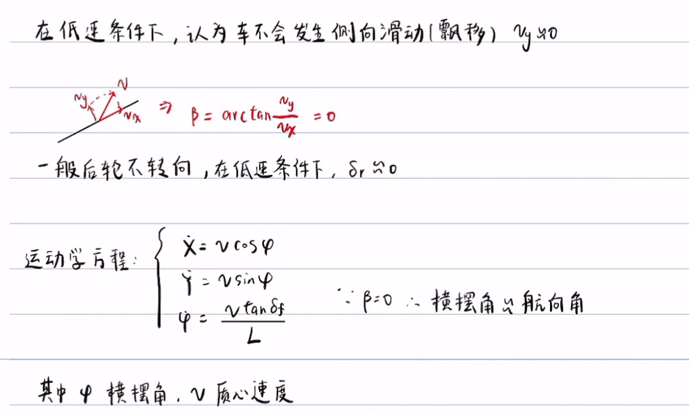
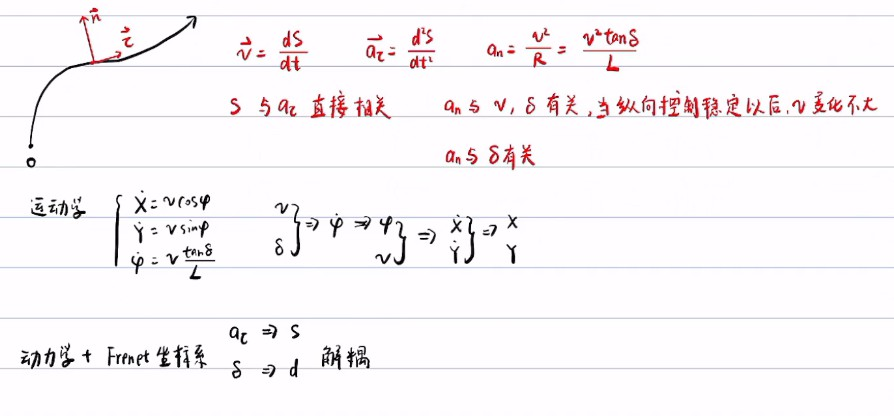
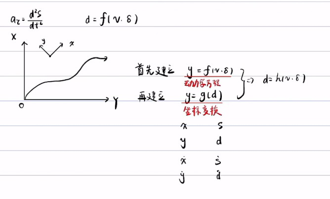
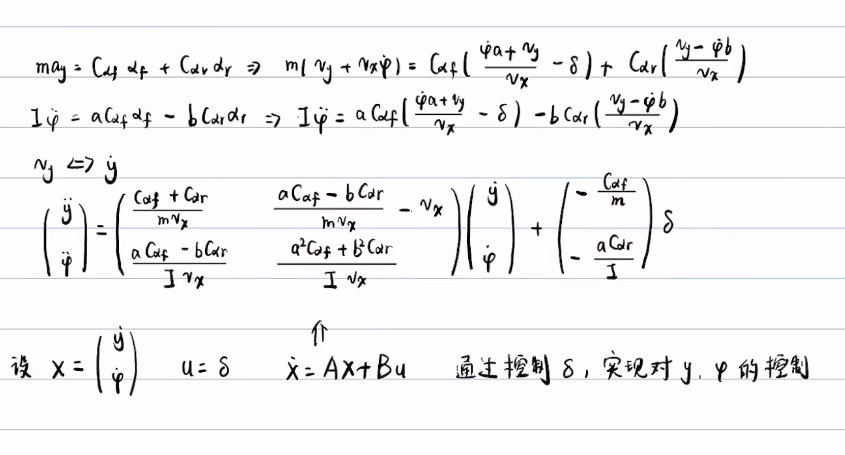
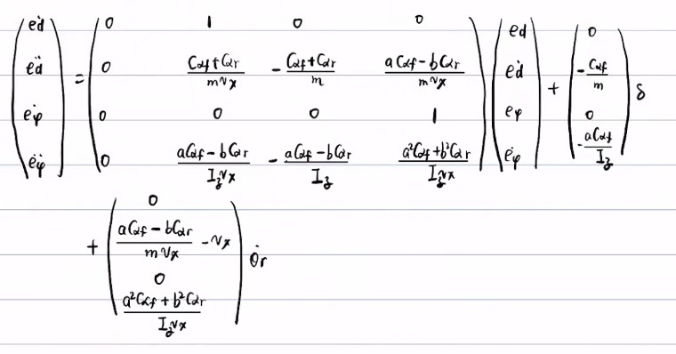

# 基础

## 控制内容

1. 纵向控制

   油门/刹车 -》 力 -》 加速度 --> 速度 ==》 位置

2. 横向控制

   方向盘 == 》  前轮转角 == 》 横向位移

   ​										== 》 航向角

## 坐标系

1. （X，Y) 绝对坐标系 、大地坐标系
2.   (x,y) 车身坐标系
3.   (t, n ) 自然坐标系(Frenet坐标系)

# 动力学

## 1. 运动学方程

## 2. 动力学方程

考虑了轮胎动力学特性

选取Frenet坐标系，可将 纵向和横向控制解耦。

动力学推倒  （用侧偏刚度为负值进行推倒）

**坐标变换**见规划篇以及视频[坐标变换与横向误差微分方程](https://www.bilibili.com/video/BV1GD4y1o7Vf?spm_id_from=333.999.0.0)

# 横向控制

# 纵向控制

# 

