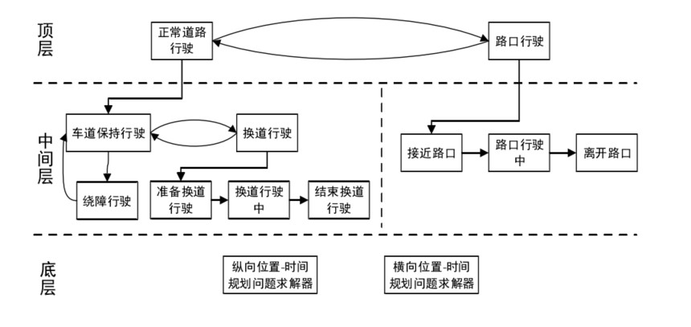

# 规划
# 轨迹规划
### @**无人驾驶汽车离散优化的轨迹规划算法**
-张，彭育辉-福州大学机械工程及自动化学院-2021 年 8 月-福州大学学报( 自然科学版)

!！！！仔细思考并提炼  改进换用一套不同的方法

- 场景
    - 双向两车道
- 基于离散优化思想
- 解耦
    - 路径规划
        - 路径搜索
            - 分层采样构建lattice图
            - 平衡 最优性和计算量(实时性)
            - 代价函数 
                - 光滑 ： 曲率
                - 与参考线横向偏移
                - 碰撞风险 ： 人工势场(道路边界、障碍车辆等)
        - 路径优化
            - 数值优化： 最小化路径点的横向距离变化率 以及 与初始路径偏差
            - 约束： 运动学曲率等、碰撞、道路边界
    - 速度规划
        - 多目标A*搜索
            - 初始速度剖面生成 8s或80m
            - 非8向拓展(车速限制以及非倒车)
            - 拓展成本： 代价+启发
                - 成本：与参考速度偏移, a, jerk，以及障碍
                - 启发：多个目标点下的A*
        - 速度优化
            - 数值优化： 初始剖面偏差(s,s') a 以及jerk
            - 约束： 碰撞、限速、动力学约束(自车速度限制、加速度限制、jerk限制)
        - 
- 细节
    - 采样点间连接，以三次多项式作为基元
        - 4 个边界条件确定，s0和s1各自处的d和theta
    - 代价函数

- 参考 ：规划结果图像显示方式。  但是自己的算法怎么避开相同的方法啊!!  查重怎么过。。

### @**特定城市场景下的自动驾驶车辆规划算法研究**
-刘召栋-吉林大学汽车学院-2020 年 6 月-硕士论文

- 综述
- 行为决策  见行为规划部分

- 内容
- 行为决策：
    - 基于规则的行为规划算法一般根据不同的划分规则进行场景划分，**场景类别划分越多，场景的个性化决策程度越高**，但是随之带来问题是场景划分条件的增多。
    在本文的研究内容中，需要根据特定的城市场景选择较为合适的行为规划算法使得算法面对多样的场景具有**便捷的可扩展性的同时尽量减少状态转移条件**的设置，算法具有可扩展性和简便性后，可以方便快捷的增加新的场景从而使得算法具有较好的鲁棒性
    - 输入输出
        - 输入
        - 输出
    - 状态机
        - 顶层： 正常道路、路口(切换逻辑就是距离(DIS,路口白色实线))
        - 中间层： 
            - 正常道路：
                - 车道保持(巡航、跟车、车道内避障)
                - 换道
                    - 准备换道(判断是否需要换道、是否能换道) 并输出期望速度
                    - 换道中(时刻监测安全性)  并输出期望速度 和 车道      若失败 则保持原车道？
                    - 结束换道(换道完成 以及 换道失败)
                - 路口
                    - 接近路口 ： 判断是否需要停车(期望速度、期望停止点)      车道是否正确？？
                    - 路口中(根据路权应对       不再分？？？停车。。)
                    - 离开路口
        - 底层： 就是轨迹规划？？？？
        
        
    - 转移条件：
        - 规则
        - 车道保持 中， 正常行驶-->车道内饶障
            - 判断：1. 障碍是否占据本车道部分空间(非完全封闭本车道)影响通行、 2. 判断速度是否<阈值  3. 周围障碍和环境是否允许
            - 饶障后： 1. 前方安全  2. 后方距离>安全距离时  切换为正常行驶 
        - 车道保持 -- > 换道(换道准备、换道中、换道结束进入车道保持)
            - 判断： 1. 全局路径   2. 当前车道前方通行性不足(一定距离内有障碍车辆低于期望速度一定比例 的完全封闭本车道)
                - 换道准备->换道中 ： 1. 目标车道有足够安全空间供本车进行换道  在目标车道的ST图上前后车距离   2. 识别：？？ 根据自车的w，进行判断是否已经开始执行了
                - 换道中 ->  结束换道 ： frenet中的l < l_th = (width_lane - w_veh) / 2 
        - 路口 < -- > 道路内
            - 与路口截止线的距离

    - UML图？？？类设计
    - 责任敏感模型 （Responsibility Sensitive Safety，RSS）
        - 一种由intel的mobileye提出的开放、透明、可验证的形式化模型：
        - 把人类关于安全驾驶的概念和理念转化成一整套的数学公式
        - RSS模型的核心是将所有有关驾驶情况和困境的人类判断规范化
    - 五条常识：
        - 1.与**前车**保持一定安全距离，即使前车突然急刹，本车也可以及时反应，避免碰撞；
        - 2.与**侧方的车**保持一定安全距离，当换道时，必须留个其他车足够的时间反应；
        - 3.**路权**的享有原则：不争抢路权；
        - 4.注意自动驾驶汽车周边的**盲区**，避免因视野盲区引发交通事故；
        - 5.尽力去**避免事故**的发生，应该采取不会发生事故的行为避免事故的发生。
        
    - 输出：将行为信息 转化为 纵向的参考(参考位置、速度)和约束(位置约束、速度约束) 横向的参考和约束
        - 如巡航时  输出 vi = v_cruise , si = s0 + vi * i * dT
        - 跟车时，期望稳态跟车距离d_des = .. > RSS中的d_min
        - 超车、让行： 单纯根据纵向上的顺序

- 规划
    - 基于MPC的规划？？
    - 解耦(两个维度都用mpc)
        - 只有绕障和换道调用s-l规划，其余只调用s-t规划？？emm 一直保持中心？？？？舒适性怎么保证  怎么渐进切换？？
        - s-t
            - 自车作为s-t图中一点，将障碍和停止线膨胀处理
            - 模型：最简单的线性模型 s v a jerk
                - 目标函数：ds dv   a_侧向(v^2 * 1/R) a_纵向 控制量
                - (硬)约束：位置s 递增，v_limit > v > 0(不倒车), -4<a_侧<4 , -4 < a_纵< 2,  以及对控制量jerk??的约束??
        - d-s
            - 目标 (软约束)
                - 参考轨迹(对轨迹或规划路径的跟踪) 
                - v a jerk 舒适性    
                - 障碍(人工势场) 安全   与道路中心线偏差
            - (硬)约束
                - 碰撞  把自车作为质点 对障碍进行膨胀处理(同时考虑速度，速度越快也越危险，在一起进行计算)
                - v, a_x, jerk, a_y的约束

    - 坐标系  WGS84世界大地坐标系、ENU坐标系、车辆、Frenet
- 测试 与 实车
    - 预测： 常速度 + 指数衰减加速度模型

**代码优化：**
@智能汽车换道控制算法的仿真研究王畅，秦加合，郭明华，孙勤英，张文霞
（长安大学汽车学院，陕西西安710064）

寻找最近点 预瞄点 最近点 可用分段法  多分法 
见

预描点到参考轨迹上距离其最近的点计算方法如下：首先将复杂平面曲线根据等距原则划分成若干份n，分别用r；（i=1，2，…，n）来表示。对于给定的预瞄点，计算P点到该曲线段的两个端点之间的距离dm和dri2，如图3所示。得到P点到曲线段r，两端点的较小值d，进而得到P点到所有曲线段的两端点的较小值的最小值d，，这样就可以确定离P最近的曲线段r。对该曲线段，再将其等分成4份，再次求P点到该四段曲线端点的最小距离，再次得到离P最近的曲线段r，依次类推，直到曲线段两个端点到P的距离之差满足要求的精度时，就得到了在参考轨迹上距离P点最近的参考点r。

### @**结构化道路下无人车轨迹规划 与控制研究**
-龚城-重庆理工大学车辆工程学院-2022 年 5 月-硕士论文

### @**结构化道路下无人车轨迹规划与控制研究**
龚城. [D]. 重庆理工大学, 2022.
特色：**帧间连续性？？没看到**、**跟踪延迟**、**自适应栅格**（大曲率 和 自车航向角偏离参考线 两种情况？？ 感觉无必要，是用在自车坐标系下 减小无效（车辆不可达的区域）的计算量、 没看懂栅格是怎么处理的  )、**避障**（静态：凸近似、 动态：基于几何三元素，未仔细看推导、以及w, l, v_c三个指标评价碰撞风险、以及mpc中的代价指标中对应到 安全性中碰撞（安全还有 速度、安全车距的指标）的代价，其他代价：**左侧优先变道代价**、 逐次变道代价、 侧向加速度代价、 方向盘转角变化率代价、 车道对中代价）、预瞄时间的影响（emm 看下师兄的部分 做到了什么程度）
方法：MPC
场景：多车干扰十字路口  ？？

### @**面向智能车行驶的最佳路径选择机制与方法研究**
刘晓欢. [D]. 天津理工大学, 2021.

### @**基于模型预测控制方法的智能车路径规划策略研究_郄天琪**
郄天琪,王伟达,杨超,等. [C]//2021中国汽车工程学会年会论文集（1）, 机械工业出版社（CHINA MACHINE PRESS）, 2021: 119-123.

特色： 
方法：
场景：
其余可参考点：曲线图：随时间变化的运行过程：横纵向间距图 ，可用于避障换道场景的结果。

*思考*：
存在什么问题：
有什么可以继续优化：

### @**基于滚动优化的汽车换道动态轨迹规划和轨迹跟踪控制_岳丽姣**
岳丽姣,时利,孟建平. [J]. 汽车实用技术, 2021, 46(15): 39-44.

特色：把帧间的轨迹差作为了一项  换道轨迹计算时的代价。
方法：五次多项式曲线  类似MPC的跟踪
场景：
其余可参考点：

*思考*：
存在什么问题：
有什么可以继续优化：

### @**基于安全域的局部路径规划优化算法_毛莞丁**
毛莞丁,邹若冰,刘晨丽. [J]. 汽车工程学报, 2021, 11(4): 289-296.

特色： 危险计算时区分大车 和 小车，即安全域的计算  考虑 了类型、位置、质量、尺寸、运动状态（主要是速度吧）  计算了 等效质量公式M, 进而 可计算 相应的拓展尺寸。
方法：用自车、他车的 膨胀尺寸 的重叠部分作为危险系数。
场景：
其余可参考点：某一时刻规划的结果 以及次优轨迹等   自车可加上自车车轮转角显示。。

*思考*：
存在什么问题：
有什么可以继续优化：

### @**题目**
作者期刊等信息

特色： 
方法：
场景：
其余可参考点：

*思考*：
存在什么问题：
有什么可以继续优化：

---

# 行为规划

### @**无人驾驶车辆行为决策系统研究**
熊路 康宇哀 张培志 朱辰宇 余卓平（同济大学，上海201804）
【摘要】调研了国内外无人驾驶车辆行为决策系统的研究现状，对行为决策系统进行分类，基于国内外行为决策系统研究实例，对基于规则和基于学习算法的不同行为决策系统的**实现方式、适用条件及优缺点**进行比较，分析了现阶段无人车行为决策系统的**研究水平、技术难点和发展趋势**，为无人驾驶车辆行为决策系统的设计提供参考。
主题词：无人驾驶车辆 行为决策算法 有限状态机 学习算法
介绍了多个公司和学校的研究方案。对比基于规则和学习的特点、优劣、以及待解决的问题和发展趋势。内容比较丰富。值得思考。

**设计目标：**
>无人车行为决策系统的目标是使无人车像熟练的驾驶员一样产生安全、合理的驾驶行为。其设计准则可总结为：良好的系统实时性；安全性最高优先级（车辆具，备防碰撞、紧急避障、故障检测等功能）；合理的行车效率优先级；结合用户需求的决策能力（用户对全局路径变更、安全和效率优先级变更等）；乘员舒适性（车辆转向稳定性、平顺性等）。
对于适用于城市道路和高速公路工况的行为决策系统，设计准则还包括2：右侧车道通行优先；保持车道优先；速度限制；交通标志及交通信号灯限制等。

- 行为决策
- **基于规则**
    基于规则的行为决策，即将无人驾驶车辆的行为进行划分，根据**行驶规则、知识、经验、交通法规**等建立行为规则库，根据不同的环境信息划分车辆状态，按照规则逻辑确定车辆行为的方法。
    - FSM(有限状态机 Finite State Machine)
    有限状态机是一种离散输入、输出系统的数学模型。它由有限个状态组成，当前状态接收事件，并产生相应的动作，引起状态的转移。**状态、事件、转移、动作**是有限状态机的四大要素 。有限状态机的核心在于状态分解。根据状态分解的连接逻辑，将其分为串联式、并联式、混联式3种体系架构。
        - 表示有限个状态以及在这些状态之间的转移和动作等行为的数学计算模型
        - 状态：初始状态、车道跟随、路口行驶、停车等待、停车区域行驶、阻塞路段行驶、任务结束
        - 特点：
            - 有限状态机结构简单，控制逻辑明确，被众多自动驾驶车辆作为行为规划算
            - 但是当驾驶状态增多的时候，有限状态机的修改和维护的难度会呈指数式增长
    - **HSM(层次状态机 Hierarchical State Machine)**
        - 反应层，战术层，战略层
            - 战略层指示整体行为，例如接近下一个路口；
            - 战术层转移不同的驾驶行为，例如停止、驻车、跟车、躲避障碍；
            - 反应层包括驾驶行为的具体动作及转移条件，具体给出纵向运动和横向运动的命令。
        - 避免了层次内部与外部状态之间的跳转
    - 决策树
        - 由一个决策图和可能的结果组成，用来创建到达目标的规划
        - 在自动驾驶行为规划算法中将**驾驶状态和控制逻辑**转化为树形结构，通过**自顶向下**的
        **“轮询”机制**进行驾驶策略的搜索和选择
        - 决策树由非叶节点和叶节点组成，非叶节点对应驾驶状态，叶节点对应驾驶动作
    - 行为树
        - 行为树与决策树类似，区别在于其节点有三种运行状态：运行中，运行失败和运行成功，且非叶节点具备更多的类型和控制策略
- 基于知识推理 和 学习
    基于学习算法的行为决策，即通过对环境样本进行自主学习，由**数据驱动**建立**行为规则库**，利用不同的学习方法与网络结构，根据不同的环境信息直接进行行为匹配，输出决策行为的方法，以深度学习的相关方法及决策树等各类机器学习方法为代表。
    - 神经网络
        - 基于知识的推理决策模型由“场景特征-驾驶动作”的映射关系来模仿人类驾驶员的行为决策过程，该类模型通过识别当前场景，查询存储在知识库或者神经网络中驾驶知识，然后推理出对应的驾驶动作
    - 神经网络
        - 神经网络算法具有高度的非线性映射能力，在处理智能控制、判别决策、模式识别、优化等领域具有独特的优势
        - 利用卷积神经网络可实现了从图像到控制指令端到端的自动驾驶规划
        - 但是该类方法需要大量的训练数据而且中间过程对人类驾驶员来说难以理解，可解释性差，问题的定位模糊，在对安全要求非常高的自动驾驶系统中，目前的发展前景非常有限。
    - 强化学习
        - 强化学习通过智能体与环境进行交互，通过获取奖励，并且通过调整其策略，通过平衡探索与利用，最大化奖励函数，最终获取最大的累积奖励。
    - ID3决策树法具有知识自动获取、准确表达、结构清晰简明的优点，其缺点同样明显，即对于大量数据获取的难度较大，数据可靠性不足，数据离散化处理后精度不足。
        - 以十字路口工况为例，首先确定当前工况的**条件属性**（即系统输人，如自车车速、干扰车车速等）和**决策属性**（即系统输出，如加速直行、停车让行等）。选取若干样本数据进行基于灰关联嫡的条件属性影响分析，获得行为决策树，
    - 部分可观测马尔科夫决策过程
    德国宝马和慕尼黑工业大学提出了一种基于部分可观测马尔科夫决策过程（Partially Observable Markov Decision Processes，POMDP）的决策模型，主要解决动态和不确定驾驶环境下的决策问题，其不确定性主要来源于传感器噪声和交通参与者行驶意图的不确定性。
    POMDP将其他车辆的驾驶意图作为隐藏变量，建立贝叶斯概率模型，可求解出自车在规划路径上的最优加速度。在复杂交叉路口的仿真测试下，能够较好地根据其他车辆的驾驶行为调整自车的最优加速度，保证安全性与行车效率。

#### 方案对比
- 对比
    - 功能复杂程度
        - 在功能复杂程度上，现阶段的有限状态机决策技术，除实现简单的循线行驶、车道保持、紧急避障等功能外，也可实现较为复杂的组合功能42-43]，如路口处理、自主泊车，乃至一定工况范围内的长距离自主驾驶。状态机方法可并行遍历多个场景，且擅长在特定场景内对任务进行拆分决策。而现阶段学习算法的功能应用依赖于训练集的丰富程度，一般在指定工况与任务下效果较好，多场景与多任务协调能力仍相对较差。
    - 应用场景复杂程度
        - 在应用场景的复杂程度上，现阶段的有限状态机决策技术可以适应复杂的综合城市环境，其优势在于场景广度的遍历。Boss、Junior、Odin等在DARPA无人车挑战赛中于6h内完成96km的路测，其场景完全还原了真实城市道路环境，需要车辆与其他车辆交互、避让，同时遵守交通规则，具有很高的环境复杂度。而学习算法更加着重于场景深度的遍历，对于同一场景下的各种细微变化更加应变自如
    - 在决策结果的正确性上，学习算法与规则算法各有优势，在实现较高的功能复杂度和适应较高场景复杂度的基础上，两种算法均能够保证决策系统的正确性，完成相应的行驶任务。但对于复杂工况，规则算法面临**状态划分界限确定**问题。学习算法需要遍历程度高的数据作为支持。
    - 在系统复杂性上，基于学习的算法舍弃了规则算法的层级架构，更加简洁直接，大幅简化了决策系统结构规则算法面临复杂工况，不可避免因遍历工况、完善逻辑而导致算法规模庞大冗杂。并且对于复杂工况下算法性能的提高问题，规则算法因其逻辑结构问题，难以大幅提升，存在瓶颈。
- 综合：
- 规则：
    - 基于专家规则的行为决策系统的优点是：
    算法逻辑清晰，可解释性强，稳定性强，便于建模；系统运行对处理器性能要求不高；模型可调整性强；可拓展性强，通过状态机的分层可以实现较为复杂的组合功能；在功能场景的广度遍历上存在优势。
    - 其缺点是：由于状态切割划分条件导致车辆行为不连贯；行为规则库触发条件易重叠从而造成系统失效；有限状态机难以完全覆盖车辆可能遇到的所有工况，通常会忽略可能导致决策错误的环境细节；场景深度遍历不足导致系统决策正确率难以提升，对复杂工况处理及算法性能的提升存在瓶颈。
- 学习：
    - 基于学习算法的行为决策系统的优点是具备场景遍历深度的优势，针对某一细分场景，通过大数据系统更容易覆盖全部工况；利用网络结构可简化决策算法规模；部分机器具备自学习性能，机器能够自行提炼环境特征和决策属性，便于系统优化选代；不必遍历各种工况，通过数据的训练完善模型，模型正确可率随数据的完备得以提升。
    - 其缺点是：算法决策结果可解释性差，模型修正难度大；学习算法不具备场景遍历广度优势，不同场景所需采用的学习模型可能完全不同；机器学习需要大量试验数据作为学习样本；决策效果依赖数据质量，样本不足、数据质量差、网络结构不合理等会导致过学习、欠学习等问题。

#### 需要解决的技术难点：
- **规则**：
    - 状态划分
    基于有限状态机决策模型的状态划分问题。有限状态机的状态划分需要依据明确的边界条件。但实际驾驶过程中，驾驶行为间存在某些“灰色地带”，即同场景下可能有1个以上合理的行为选择，使驾驶状态存在冲突。对于决策系统而言，一方面要避免冲突状态强行划分而造成的无人车行为不连贯，另一方面也要能够判断处于“灰色地带”的无人车不同行为的最优性。通过在决策系统中引人其他决策理论，如DS证据理论（Demp-ster-Shafer Evidence Theory）等、决策仲裁机制、博弈论法、状态机与学习算法结合等方法可帮助解决该问题。
    - 复杂场景遍历
    基于有限状态机决策模型的复杂场景遍历问题。有限状态机需要人工设定规则库以泛化无人车行驶状态，这种模式使得状态机具有广度遍历优势。但随着环境场景的增多与复杂，有限状态机的规模也不断庞大，使得算法雁肿；而同一场景的深度遍历，即由于环境细节变化导致的决策结果变化，也很难通过状态遍历，对于有限状态机决策系统而言，利用学习算法的优点，采用状态机与学习算法结合的方法，结合学习算法深度遍历的优势，有利于有效解决该问题。
- **学习**
    - 基于学习算法决策模型的正确性与稳定性问题。
    学习算法的训练结果与样本数量、样本质量和网络结构有关。如果学习模型过于复杂，会造成无法区分数据本质和噪声的情况，泛化能力减弱；反之，如果学习模型过于简单，或者样本数量不足、对场景遍历不足，则会导致规则提炼不精准，出现欠学习问题。此外，学习算法模型逻辑解释性较差，实际应用中调整与修正不很方便。对于基于学习算法的决策系统而言，一方面要收集大量可靠、高质量的试验数据，另一方面要选择合理的学习算法，配置合理的试验参数，调整网络结构，以提高训练结果的正确性与稳定性。

- **发展现状**
- 规则
    基于规则的决策方法相对较为成熟，其在场景遍历广度上具备优势，逻辑可解释性强，易于根据场景分模块设计，国内外均有很多应用有限状态机的决策系统实例。然而其系统结构决定了其在场景遍历深度、决策正确率上存在一定的瓶颈，难以处理复杂工况
- 学习
    基于学习算法的决策系统因具有场景遍历深度的优势，将被越来越多地用作决策系统的底层，即针对某细分场景，采用学习算法增强算法的场景遍历深度，使其能够在环境细微变化中仍然保证较高的决策精度。然而其算法可解释性差、可调整性差、场景广度遍历不足等劣势导致了仅采用学习算法的决策系统仍存在应用局限，较难处理复杂的功能组合

- **发展趋势**
    - a.采用基于规则算法的行为决策算法仍会在决策系统中广泛应用，将作为决策系统的顶层架构与某些具体问题的细分解决方案，并将更多地采用混联结构，发挥规则算法基于场景划分模块处理及针对具体问题细分处理时逻辑清晰、调整性强的优势，可同时兼顾场景遍历的广度与深度。采用该方法的研究重点将在于解决状态划分“灰色地带”的合理决策问题，以及行为规则库触发条件重叠等问题。
    - b.无人车决策系统将更多地采用规则算法与学习算法结合的方式。顶层采用有限状态机，根据场景进行层级遍历；底层采用学习算法，基于具体场景分模块应用，可发挥学习算法优势，简化算法结构、增强场景遍历的深度，并可减小数据依赖量，保证决策结果的鲁棒性与正确性。采用该方法的研究重点在于如何合理对接有限状态机与学习算法模型，以及学习算法的过学习、欠学习等问题。
    - c.端到端方法将更多作为决策子模块的解决方案，而非将决策系统作为一个整体进行端到端处理。通过这种方式可发挥学习算法的优势，将决策模块拆解也可提高系统的可解释性与可调节性。
    - d.目前行为决策系统的设计准则主要考量安全与效率，对车辆特性与乘员舒适性考虑较少。在保证安全与效率的基础上，可通过加人对车辆动力学特性的考量，筛取更合理的驾驶数据等方式，对行为决策系统进行优化。

## 基本

### @**无人驾驶车辆路口行驶决策研究**
苏冲，孟祥雨，张成阳（北京汽车研究总院有限公司，北京101300）
摘要：无人驾驶车辆的行为决策是该领域研究的关键技术之一。在城区环境中，无人驾驶车辆行为决策的最终目标是像熟练的驾驶员一样产生安全、合理的驾驶行为。文章给出一类无人驾驶车辆路口行驶策略，能够使无人驾驶车辆在城区环境中安全、合理地完成一定范围的驾驶行为。
关键词：无人驾驶车辆；行为决策

- 架构
决策模块是无人驾驶的核心模块，它从环境感知模块中提取相关信息，将其**抽象**成为**离散事件**集合，并将无人车结构化道路环境下的常规行为**动作序列**划分为不同的行为状态，通过对当前驾驶环境的理解，在行车安全标准、行车效率标准和交通法规的约束下，将规划结果分解为一个合理的驾驶行为状态系列。

- 行驶策略
- 决策策略

包含了很多状态的转移细节。
另：补充 
换道的触发触发条件：包括左换道和右换道。在发现前方有**障碍物**和前方车辆的**车速明显低于**道路要求车速时**且道路无拥堵**的情况下，无人驾驶车辆可以执行换道行驶操作。在换道行驶之前，智能车辆需**检测交通状况**，而且要求大于**换道最小安全距离**才能改变车道，进行换道行驶行为。另外根据导向箭头汇入目标车道等行为都可视为换道行驶行为的拓展。

冲突定义：可以为行人、车辆、红（黄）灯等。

### @**自主驾驶汽车局部运动规划研究_熊晓勇**
熊晓勇. [D]. 吉林大学, 2019.

特色： 
方法：状态机 及决策中止
场景：非结构话A*,结构化（状态机 决策树？ + 纯跟踪运动规划）
其余可参考点：决策、以及决策过程值变化（类似东风 仿真报告中)
碰撞检测

*思考*：
存在什么问题：
有什么可以继续优化：

## 决策博弈

### @**右转机动车与非机动车冲突博弈行为分析**
（1.北京信息科技大学计算机学院，北京100192；2.山东高速物流集团有限公司安全管理部，济南250098；3.北京交通大学交通运输学院，北京100044）
摘要：基于博弈论方法，研究了**信号交叉口右转机动车与非机动车的冲突行为**。右转机动车与非机动车冲突的严重性取决于冲突双方的决策行为，因此可以采用博弈论模型对机动车与非机动车冲突决策场景与过程进行建模分析。通过构建基于**延误与风险参数**的收益函数，分析了机动车与非机动车的冲突决策行为，计算了机动车和非机动车在采取不同策略先后条件下的收益。结果表明，**非机动车选择等待策略，机动车选择抢行策略可获得最大收益**。针对此现象，提出了相应的安全措施。可见，所提出的模型对于信号交叉口安全管理具有潜在的应用价值。
关键 词：冲突；延误；风险；决策；非机动车

## 换道决策
### @**驾驶人车道变换决策分析** 2011
彭金栓，付 锐1，2，石磊磊1，张 琼（1.长安大学汽车学院，西安710064；2.长安大学汽车运输安全保障技术交通行业重点实验室，西安710064）
摘要：决策阶段对整个换道过程的安全性有重要影响，但目前缺乏对该阶段的深入研究。界定车道变换研究场景，基于驾驶人对外界信息的感知特性、驾驶期望、综合认知判断以及博弈理论等，分析交通冲突存在前提下驾驶人车道变换决策形成机制。引入博弈理论相关知识，进一步探讨换道决策机制中**对象车**与目标车道**后随车**对于**临界冲突点**进行的非合作混合战略博弈，对博弈双方驾驶人的收益以及纳什均衡解进行深入探析。研究表明车道变换决策机制由信息感知及三次判断决策过程耦合而成，影响驾驶人决策水平的因素包括**信息源特征、驾驶人信息感知能力、驾驶人行为特性及综合认知判断能力**等；两车非合作混合战略博弈的**纳什均衡解**由**行车安全性、行车时间以及收益重要度因子**共同决定。

关键词：交通工程；车道变换；决策；感知判断；博弈理论

整个车道变换过程可以划分为3个阶段，即决策阶段、操作执行阶段和调整阶段。
- 决策阶段从驾驶人感知处理与自身驾驶期望相悖的外界信息流，产生换道意图，直至驾驶人执行换道操作；
- 执行阶段为换道操作开始至车辆整体越过车道分界线；
- 调整阶段为车辆越过车道线直至车辆在目标车道内稳定行驶。

示意图：

模块
- 信息感知模块
    - 
- 判断及决策模块主要包括三次判定过程，即**速度及空间期望判断、可插车间隙判断、换道博弈**以及以上各判定结果产生的车道保持、换道意图等过程子模块。

**博弈特性分析**
在V1与V3进行的换道博弈过程中，**双方驾驶人**基于各自信息感知模块处理的外界环境信息流，结合自身对车速及相对距离等参数的判断，充分考虑博弈对手可能的策略选择，并进一步制定自身对应的行为决策。但由于博弈双方无法通过合谋而准确预知对方驾驶人下一步具体的行为，因而这是一种**非合作博弈**，其均衡解就是常说的纳什均衡解。**纳什均衡**的战略组合由博弈双方的**个体最优战略**组成，但并非一定是总体最优策略。
具体而言，由于换道博弈是一种**非合作博弈**，所以博弈双方驾驶人无法通过合作决策达到对博弈双方整体最优的策略组合，也就是说，博弈双方驾驶期望无法同时得到最大限度的满足。需要指出的是，虽然是非合作博弈，但由于博弈双方本着个体利益最大化的理念，同样可以避免碰撞事故的发生。若发生碰撞，则意味着驾驶人换道决策形成过程中博弈双方个体理智与集体理智之间的冲突不可调和，出现了对博弈双方驾驶人最差的博弈后果。

为了便于统一量化驾驶人博弈收益，引入a和β分别作为行车安全性与行车时间的**重要度因子**，表示不同收益对于博弈驾驶人重要性程度，其中a+β=1。a和β的具体取值由博弈双方驾驶人的安全意识以及心理状态等因素决定，可以大样本问卷调查的形式，得到每名被试的取值结果，剔除不合理样本后进行均值处理，最终确定a及B值。
求解略。

结论：
从纳什均衡的角度分析了对象车驾驶人选择强制换道以及目标车道后随车选择避让策略的概率，其纳什均衡解由行车安全性、行车时间及其重要度因子共同决定。给定博弈某一方驾驶人相对于均衡点变化的某种选择策略，博弈对手均有其对应的最优策略。此外，提高驾驶人安全意识，增加行车安全性重要度因子a，可有效提高换道博弈过程中的行车安全性。

## 换道模型

### @**基于最小安全距离的车辆换道安全研究** 2013
陈秀锋"，杨万三'，曲大义 （1.青岛理工大学汽车与交通学院，青岛266520；2.吉林大学交通学院，长春130022）
摘要：分析车辆换道的动力学特性，研究换道过程中避免碰撞的条件，建立了具体换道场景中不发生任何碰撞的最小安全距离定量模型，对模型进行仿真分析，并在此基础上界定安全区域和非安全区域.结果显示，通过在换道前调整速度和纵向间距，车辆可以减小换道过程中碰撞的可能性.本文的研究结果为自动换道辅助系统提供理论基础.
关键词：交通流；换道；碰撞；最小安全距离

内含一些计算和曲线分析、未仔细看

## 路口

### @**基于车路协同的交叉口冲突消除算法** 2018 

徐建军，刘阳训，沈伟杰（浙江经济职业技术学院，浙江杭州310012）
摘 要：文章提出了无信号交叉口车辆冲突消解策略，利用车路协同中车车与车路相互通讯功能，设计了基于信息交互的车辆冲突消解算法。通过将车辆的冲突消解转化为车辆的相对距离问题，计算出为避免碰撞避让车辆所需的行驶速度。
关键词：车路协同；冲突消解算法；化解冲突

在现有的交叉口冲突消除算法中，基于**动态博奔论**的消除算法是利用重复博弈理论，将驾驶员实际驾驶过程中的操作行为考虑在内，但在交叉口车辆较多的情况下，该算法可能失效；基于**占先度**的冲突消除算法是根据车辆所在位置的优先通行状况进行决策，这种算法只对车辆的优先通行模式进行阐述，并没有给出具体的消除算法及策略；根据**插车间隙**提出的可接受间隙模型是根据车辆的行驶速度、目的、车辆的动力性能等提出，但会引起车辆发生碰撞。基于**资源锁的冲突表算法**是在车辆进入交叉口前提前预测道路交通冲突情况，提前控制车辆减速，但该方法所定义的交叉口冲突相对模糊，不适用在车辆较多的交叉口路段。
以上几种算法，适用性均不强。**车路协同技术**可以实现车车之间实时的信息交换，是未来智能交通的发展方向，本文基于车路协同技术，提出了一种基于信息交互的交叉冲突消解算法。

### @**基于FTA与PCA的城市平面交叉口交通冲突因素分析**  2018
崔会芬.2，楚彭子'，杨京帅！，任书杭'，朱鸿国 （1.长安大学汽车学院 西安市 710064；2.广东省道路运输管理局 广州市 510101）
摘要：为了分析城市平面交叉口交通冲突产生的致因因素，采用**事故树**分析法探寻交通冲突的可能致因因素，将实地调研所获取的西安市15个平面交叉口的487个交通冲突样本按照交通冲突产生的原因进行归类，运用**主成分分析法**进行数据分析，分析结果表明：**机――机不按规定让行、车辆的避险不当、非机动车及行人过失、机动车闯红灯和机动车违规变道、超车及调头**等是导致交叉口交通冲突的主要影响因素。规避交叉口的以上违章及不当行为有助于降低严重冲突的风险。针对以上影响因素及分析结果，提出了相应的建议和措施。
关键词：交通工程；平面交叉口；交通冲突；事故树分析；主成分分析

### @**单车场景下城市交叉口的智能驾驶车辆左转决策研究** 2021
陈雪梅，欧洋佳欣，王子嘉，李梦溪（北京理工大学 机械与车辆学院，北京100081）
摘要：在复杂动态的城市道路环境中，不同的交通参与者之间会不可避免地产生时间或空间上的冲突。针对该问题，对智能驾驶车辆在城市交叉口左转时潜在的冲突行为进行分析并建立决策模型。考虑了车辆运动模式并基于**高斯过程回归模型（GPR）**建立了**直行车辆长时轨迹预测模型**，结合轨迹预测提出了**基于冲突消解**的智能驾驶车辆决策流程（模型）和考虑多因素的驾驶动作选择方法。基于Matlab/Simulink&Prescan搭建仿真验证平台，联合真实数据对算法进行验证。
结果表明，单车场景下，决策模型能够以90%的成功率引导无人驾驶车辆完成通行任务。
关键词：智能驾驶车辆；左转行为决策；城市交叉口；轨迹预测；单车场景

参考：一些 过路口的整个过程图 可以参考
(文章做的大概是 **配速** 的工作)

### @

交通冲突：

交通冲突是在可观测的条件下，两个或两个以上道路使用者在空间和时间上相互接近，以至于如果其中任何一方不改变其行驶轨迹，将存在发生碰撞的风险，这种现象称为交通冲突。

# 思考总结 

## 轨迹规划

### 细节
- 如何输出指令给规划进行衔接
- 查找最近点 匹配时  二分？？ 用向量外积判断方向  有多分法快速求最近点
- 求解失败的处理
- 轨迹的连续性
- 规划与控制的误差？
    - P44说的什么？？  理想值和当前时刻的实际值：理想值代替实际值，为了规划一致性。
        - 对误差进行检测，当大于阈值时，将理想值更新为实际值重新规划。或求解失败时用实时的实际值更新规划。

### 数值优化
- 优化函数
    - 目标 (软约束)
        - 参考轨迹(对轨迹或规划路径的跟踪) 
        - v a jerk 舒适性    
        - 障碍(人工势场) 安全   与道路中心线偏差
    - (硬)约束
        - 碰撞  把自车作为质点 对障碍进行膨胀处理
        - v, a_x, jerk, a_y的约束
        - sl路径搜索的边界

    后方车辆的处理 
    时间或距离范围的考虑 以及精度

### 仿真验证
仿真验证：
1. 工况选取
    - 法规
    - 项目要求
2. 评价
    - 合理性 安全性 舒适性
    - **合理性**是指决策结果是否符合人类驾驶员或者乘客的行为习惯，是否令驾乘人员产生心理焦虑，主要服从于从*主观评价*；
    - **安全性**是自动驾驶的首要标准，在规划中是指规划轨迹不能导致碰撞，违反交通规则行为的产生，可以定量分析；
    - **舒适性**是指规划出的轨迹给驾乘人员的感受，不舒适的驾驶操作会导致驾乘人员出现晕动症。如用a或jerk等指标。

### 评价指标

# 行为规划

# 机器人规划
RRT算法 蚁群等算法在此部分。

改进总结：
RRT改进  遍历树找最近节点，可分块策略。

### @**改进RRT算法在复杂环境下智能车路径规划中的应用_张卫波**
张卫波,肖继亮. [J]. 中国公路学报, 2021, 34(3): 225-234.

特色：考虑车辆姿态与下一路径点夹角约束
方法：同心圆RRT算法
场景：

思考：改进**分块**思想 用于搜索已知节点到当前节点最近的点。防止后期点多时、遍历O(N)

### @**复杂障碍物环境下基于转向约束的智能汽车路径规划方法研究_姜康**
姜康,王皓,陈佳佳. [J]. 重庆交通大学学报(自然科学版), 2021, 40(9): 137-144.

特色：KD-tree控制邻近点约束曲率 、剪枝、 贝塞尔曲线
方法：双向RRT
场景：

思考：
存在什么问题：
有什么可以继续优化：

### @**典型工况下的智能车局部轨迹规划方法及跟踪控制研究_魏劲鹏**
魏劲鹏. [D]. 重庆理工大学, 2021.

特色：只能处理静态吧。RRT中（1）目标偏向 ，以一定概率将目标点作为采样的随机点。（过小 导向性不足。过大 损失随机性）  （2）基于转角约束的节点扩展
    怎么平滑处理的？ 3次B样条曲线  代价（安全  和 长度）  用梯度下降求解？ 不太理解怎么求的？？用优化后的点序列再用 样条曲线拟合？（P20）
方法：RRT搜索路径 DP速度   以及MPC跟踪
场景： （换道）超车避障、减速避障场景
其余可参考点：

*思考*：
存在什么问题：
有什么可以继续优化：

# 赛车以及非结构化道路

### @**一种无人驾驶赛车路径规划算法研究_李刚**
李刚,金鸿耀,冀同涛,等. [J]. 辽宁工业大学学报(自然科学版), 2021, 41(4): 228-231.

特色：未看
方法：四边形重心法 求解路径离散点  并用三次样条插值方法拟合曲线。
场景：
其余可参考点：

*思考*：
存在什么问题：
有什么可以继续优化：