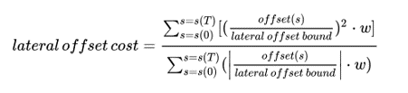
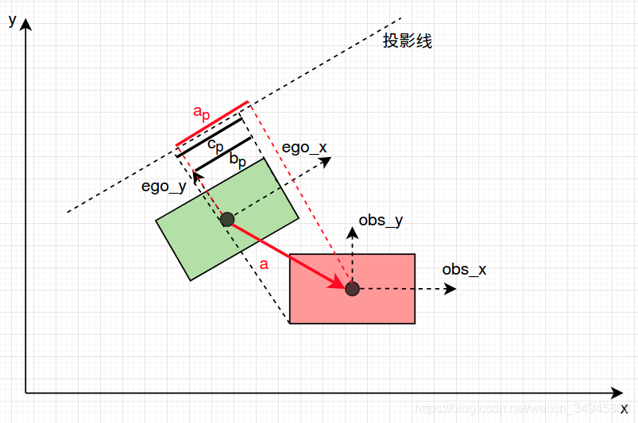

# 轨迹规划与控制算法

# 基础介绍

## 模块基本框架

## 规划与控制综述

规划
轨迹规划算法多从机器人领域发展而来，开发适用于智能车辆算法。
1.**人工势场**：利用目标点的引力和障碍物的斥力引导车辆安全到达目标点。
2.**图搜索**：将智能车的环境信息转换为栅格地图或节点地图，如Dijkstra算法、	A*算法及其改进型，以及D*算法。
3.**数值优化**：将目标函数和约束条件转化为一个凸优化的格式，利用二次规划解法或其它数值优化迭代器计算出其最优解。
4.**采样与插值**：当采样足够多时，算法在概率上可得到路径解，如RRT以及基于采样和插值的算法，如Lattice算法。
5.**智能学习**：通过与环境交互而进行的学习，是一种目标导向的学习。

目标：在考虑车辆运动学和动力学约束的情况下，能适用于换道、超车、跟车等非路口场景以及路口等多种典型驾驶工况的算法，且满足实时性要求。

# 算法实现

## 基础准备

### Frenet坐标系

坐标转化
[Article:Frenet坐标转化公式推导](https://blog.csdn.net/weixin_37395438/article/details/112973098)

## 路口内算法

### 算法原理
路口轨迹规划主要使用动态规划进行速度规划。

速度规划：
1. 将参考线及自车初始状态信息映射到Frenet坐标系中。
2. 构建ST图，将障碍物信息映射到ST图中。
3. 根据障碍物映射状态选取采样时间。
4. 采用动态规划算法选取最优节点。
5. 采用五次多项式拟合速度时间曲线。
6. 输出轨迹点信息。

### 算法实现

## 道路内算法

### 算法原理

道路内轨迹规划采用直接构造法构造汽车后轴中心坐标关于时间的函数。该函数使用五次多项式拟合初始和终止位置、速度和加速度的局部路径，以保证汽车行驶时的平稳性。
1.  对地图提供的以采样点表示的参考线进行平滑处理；
2.  将参考线及自车初始状态信息映射到Frenet坐标系中；
3. 构建ST图，将障碍物信息映射到ST图中；
4. 对一维轨迹分别进行横纵向采样，采样过程包含跟车、超车及巡航等状态；
5. 构建合适的代价函数对轨迹进行评价
选择代价函数结果最小的轨迹进行物理约束检测和碰撞检测，若该轨迹能够通过检测直接输出，否则选择代价函数结果次之的轨迹进行检测。如果所有轨迹均不能通过检测，汽车以减速运动行驶。

#### 技术路线

基于 Frenet 坐标系，分别建立自动驾驶车辆的横、纵向轨迹规划模型，通过采样自动驾驶车辆的始末运动状态信息，生成对应的横向、纵向运动轨迹集合，建立合理的评价函数，经过筛选得到最优轨迹。
#### 纵向一维轨迹

#### 横向一维轨迹

#### 轨迹结合、轨迹筛选

#### 代价计算

- 纵向效率
    
- 纵向舒适

- 纵向安全

- 侧向舒适

- 侧向偏移

- 向心加速度

#### 碰撞检测
分离轴定理 用于检测凸多边形碰撞。

## 控制算法

### 预瞄算法

#### 算法原理

#### 算法实现

### MPC算法

### 算法

## 仿真报告

## 存在的问题
 
### 已改进的问题

### 仍存在的问题

