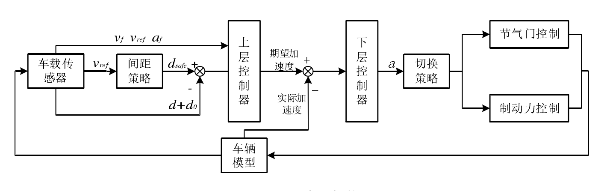

# 一、ACC

**关键词**：模型预测控制；间距策略；粒子群优化

**问题解决**:
1.mpc硬约束下无可行解，可引入 松弛因子向量

## 1. 基础 

### 1.1 简介
ACC 系统是通过定速巡航控制（CC）系统结合跟车控制发展而来，其发展历史可追溯到 20 世纪 60 年代 。
现目前 ACC 分为**巡航**和**跟车**模式，**巡航模式**的控制目标比较明确且比较单一，即以达到驾乘人员所设定需要达到的速度，并以预设速度稳定匀速行驶为最终目的，目前巡航模式采用最多的算法是 PID 控制算法。**跟车模式**的控制目标趋于多元化精细化增加了 ACC 系统的设计难度。相对于巡航模式，跟车模式有着较为复杂的跟驰模型以及互相矛盾的控制目标。当前，ACC 系统的**跟车模式控制形式包括直接式控制和分层控制**，但由于直接式控制会导致控制延迟较高以及抗干扰能力较弱等缺点，目前一般采用后者。分层控制包含上层控制器和下层控制器，两者互不干涉，前者根据车载传感器或者车联网技术获取两车当前的行驶环境信息，结合间距策略根据信息得到的期望间距，从而计算出车辆的控制律，下层控制器根据计算出的控制律控制车辆的油门踏板和制动踏板控制车辆，使得其达到跟随前车的目的。

### 1.2 研究现状

#### 1.2.1 ACC 上层控制算法研究现状 

汽车自适应巡航控制（ACC）的主要功用是减少驾驶负担、减少不必要的加减速来提高乘车舒适性、缓解交通压力提升道路通行能力和减少油耗和排放等。
对于 ACC 系统，当车辆搭载的传感器在其探测范围内发现道路前方有车辆时，启动**跟车模式**，通过传感器得到的两车行车信息，上层控制算法使 ACC 车辆的速度与前方车辆保持一个较为安全的距离，当前面没有车辆或前方有车辆但传感器无法探测到时，ACC 系统会按照驾驶员预设的期望速度行驶，即**巡航模式**。

上层控制算法是 ACC 系统的核心环节，通过分析车载传感器获取周围的信息、车辆当前运动状态信息和间距策略，综合协调多个控制目标，决策得到期望加速度，最后将加速度传输给下位控制器。ACC 的上层控制算法吸引了大量的学者进行研究，研究形式趋向于多元化精细化来更好契合现实生活中的需求。现目前，上层控制算法主要有PID 控制、最优控制（OC）、滑模控制（SMC）、模糊控制（FC）和模型预测控制（MPC）等。 

### 1.2.2 ACC 系统间距策略
作为 ACC 系统的重要组成部分之一，间距策略设计的合理性将直接影响车辆的安全和道路的利用率。当车与车之间的距离越**小**时，若前车制动，后车未及时采取相应措施，容易发生追尾碰撞，而两车之间保持过**大**距离不仅会导致道路通行车辆数量的降低，而且还会引起车辆从相邻车道插入，从而导致交通事故的发生。

间距策略主要分为两类：**恒定间距（CS）策略**和**可变间距（VS）策略**。由于恒定间距策略不能平衡多个控制目标，对于复杂多变的驾驶环境适应性较差，很多人开始提出可变间距策略，成为目前设计 ACC 系统最常用间距策略，其体现期望间距与速度成线性关系，斜率即为车头时距。**车头时距**是指两辆车通过同一车道上某一点的时间差，其中比较有代表性的有*恒定车头时距(CTH)策略、可变车头时距(VTH)策略、仿驾驶员车头时距策略以及基于交通流理论的车头时距策略*等。

### 1.2.3 ACC 系统架构
对于 ACC 系统，如何设计控制算法得到满足多个控制目标的控制律，并根据控制率控制油门和制动踏板的进给量使车辆平稳跟车，是实现系统的重点，目前 ACC 系统主要采用直接式和分层式控制。**分层控制**包含上层控制和下层控制，即决策层和控制层，决策层根据获得的周围信息和行车状态信息结合间距策略得到期望加速度，并将其作用于控制层，控制层的作用则是通过加速度计算出节气门开度或制动力来控制车辆按照期望间距行驶。而**直接式控制**即通过传感器获得的信息由决策算法直接计算出节气门开度或制动力，从而控制车辆行驶。一体化控制系统受模型精度或者模型适配性的影响较大，且鲁棒性相对于分层控制较差。**由于分层控制是采用上下两层相互独立且相互配合进行分层控制，有抗干扰能力强，便于调整参数和系统调试的优点。**

上图-分层控制：上层控制器根据各种车载传感器传来的环境信息数据通过结合间距策略计算得到期望加速度，下层控制器通过切换策略切换控制模式，通过节气门控制和制动力控制模块控制车辆加速或减速。

2. 算法 

3. 

切换？？？

acc巡航和定速巡航的区别如下：
1、定速巡航不能跟车行驶，系统无法自动判断是该刹车还是该加速，只能设定一定的车速行驶；ACC自适应巡航系统系统能够跟随前车行驶，当前方有目标车辆时，带有自适应巡航的车辆会跟随前车并保持一定的车距行驶。
2、定速巡航的作用是按司机要求的速度合开关之后，不用踩油门踏板就自动地保持车速，使车辆以固定的速度行驶，定速巡航只能提供相对恒定的驾驶速度；ACC自适应巡航，可以针对环境的改变而自行调节车速，跟车间距过近时，行车电脑将自动控制油门和刹车，主动降低车速以保持合理的安全间距。

 

[IDM跟驰模型](https://zhuanlan.zhihu.com/p/428970501)

[AEB 五种安全距离模型](https://blog.csdn.net/mingjiangguoyaoqin/article/details/106034354)
