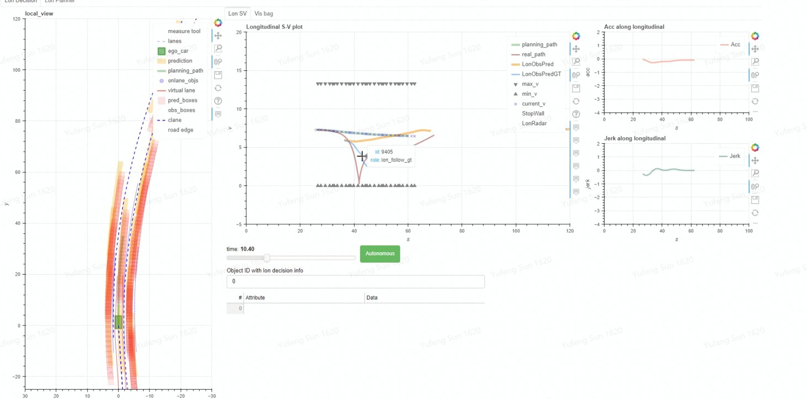

# 城市工况自动驾驶汽车速度与路径联合规划研究

## 内容

1. 不区分路口与道内、统一规划速度与路径
2. 考虑多种因素、同时规划车速与局部轨迹
3. 权值系数如何自动调整(或采用学习算法？ 或采用 决策的状态机)
4. 仿真与实车测试 、要有试验验证

## 论文提纲

1. 基础
2. 规划算法（路径 与 速度）
3. 决策算法 与权值
4. 仿真
5. 实车
6. 算法改进

**理解概念：**

1. 横/纵向解耦    轨迹/时间解耦   路径/速度解耦
2. 车辆高速 和 低速时 的动力学 特性？？？   低速时 非完整性约束 什么意思 (不能独立规划，不能再解耦(因为不能只进行横向运动)) ？？？  不同速度对规划有什么影响  对控制呢 
3. 大转角下的 非线性..。（二自由度 假设前轮转角delta较小,vx = Const)

### 其他

1. 预测  尤其是障碍的轨迹预测  主要是 非路口的 换道还是保持  ，路口太难了
2. 红灯前如果有秒数，保证安全的情况下，可适当缓慢减速 再加速通过，可提高舒适性，尤其对于晕车的人来说很有意义
3. 

抖动
- 边界约束
- 解之间抖动
    - 相似性函数
        - DTW，LCSS，EDR
        - 改进  不仅是位置 还再考虑速度等因素
- 有解无解抖动

每帧

障碍物的有无  跳变

costmap 的01转变成 0.*  可减小相应的跳变？？？ 如何量化？？？

找创新点，解决的问题
论文引入

做出的一些改进 一定要有对比

寻找最近点  分块思想 srqt(n)

是顺序 还是 迭代
如果优化后 无解了，怎么处理 ？不应该再进行一层的迭代吗

软硬决策结合。。

解耦:
为什么解耦？
    - 
以及如何解耦？

解耦又哪些劣势？ 还能否获得 各种场景下的 最优解？

有的需要同时控制啊，需要对 场景进行分析。

主要解决什么问题：

连续性问题： 多场景下的规划连续性 帧间
1. 造成原因
- 主车信息、障碍信息传感的不确定性
- 帧间最优轨迹的跳变
    - 代价的合理性
    - 相似性上
    - 决策？？？ 
        - 软决策 
        - 硬决策
            - 状态的转移 
                - 严进策略
                - 

- 控制？ 之前预瞄可解决
- costmap
    - 0.0 - 1.0 的图 如何利用呢

- 双层相似性
    - 若该帧最优轨迹与上帧相似，则在本帧基础上优化
    - 若该帧最优轨迹与上帧相似度 不足够高
        - 非危险工况 ， 则在上帧 时空转移 的基础上优化
        - 危险工况， 则在本帧基础上优化 。

    - 所有的优化失败，不一定来的及 次优解等 的优化。
        故而 都进入制动规划或备用 规划。

有什么情况下可以不连续：
危险

@@无人驾驶汽车离散优化的轨迹规划算法  
~~在此基础上改进 ，但很难脱离其方法了。~~

---

其他 ：

l - s - t 三维 的 规划效果显示 

s-v 显示

