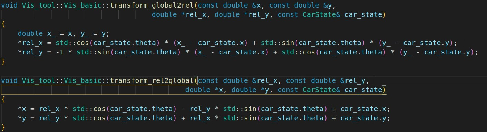
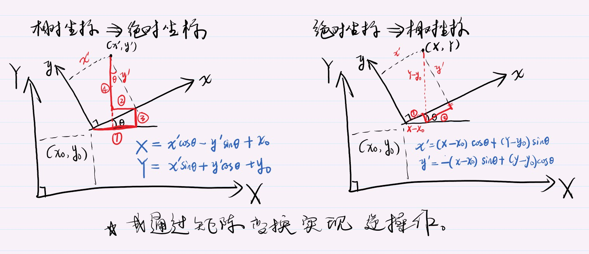

# map节点
- 参考线处理
    - 选取
    - 重采样
        - 上游 密度、曲率问题
    - 光滑  笛卡尔坐标系下
        - 1，**FEM_POS_DEVIATION_SMOOTHING有限元位置偏差光滑器**
            2，COS_THETA_SMOOTHING 余弦
            3，QpSplineReferenceLineSmoother 三次样条插值法 
            4，SpiralReferenceLineSmoother 螺旋曲线法 
        - 优化变量
            - n个点的x y 
        - 优化目标
            - 代价函数：
                - 光滑度
                    - 计算：某个点与前后两点的夹角
                        - 越接近180  越平滑
                        - 越接近0    越不连续
                - 分布的均匀度
                    - 累加间隔
                - 与原始点的偏差
                    - 累加偏差
        - 约束
            - 各优化变量x,y的可行区间 x - dx < x < x + dx  (x, y)
    - 耗时：

# 规划

两种工况分开使用的原因？？？？
- 工况

## lattice
流程
在lattice中，横向轨迹生成有两种方法：撒点采样法、二次规划法。
- 采样
    - 
- 二次规划
    - [参考](https://blog.csdn.net/weixin_34945803/article/details/109106221?spm=1001.2101.3001.6650.12&utm_medium=distribute.pc_relevant.none-task-blog-2%7Edefault%7ECTRLIST%7ERate-12-109106221-blog-103830866.pc_relevant_aa&depth_1-utm_source=distribute.pc_relevant.none-task-blog-2%7Edefault%7ECTRLIST%7ERate-12-109106221-blog-103830866.pc_relevant_aa&utm_relevant_index=17)
    - 添加静态障碍物→产生单车道内目标轨迹→绕行或停止？？
    - 整个约束建立主要考虑到：
    1.自车不能与障碍物碰撞或驶出**边界**
    2.轨迹应该保持**连续**，即相邻两个采样点
    3.轨迹应该保持**光滑**，即导数连续相邻两个采样点的斜率
    4.横向加 加速度(相对于s的二阶偏导)应在一定范围内

## 解耦
流程： 横纵向分别 搜索+优化
- 路径规划 横向
    - 搜索 A*   粗解是frenet下的 l 序列
        - 
        - 改进
        - 耗时
    - 优化      对l序列优化
        - 优化变量
        - 优化目标
        - 约束
        - 耗时
- 速度规划 纵向
    - 搜索 DP   粗解是多段多项式曲线
        - 状态转移
        - 代价
        - 退出机制
    - 优化      对点序列优化，不是原始多项式参数
        - 优化变量
        - 优化目标
        - 约束
        - 耗时
    - 策略
        - 让行
        - 抢行

## 通用
- 细节
    - 膨胀
    - 精度
    - 
- 后处理
    - 在笛卡尔下 对**轨迹**优化 ？？？论文中没有？

# 控制

## 解耦
- 横向 路径跟踪
    - 预瞄
    - 调试
- 纵向
    - 

## mpc
- 推导
- 算法
    - 优化变量
    - 代价函数
    - 约束
        - 对增量进行约束
            - d_theta, d_a
            - 好处：

# 实习算法

##  纵向

## acc曲线

## 构造优化问题

---

# 障碍物类设计
### map节点

- 属性
    - id 长 宽 位置 朝向 速度 
    - 预测时间 8s  步长0.2s
- 方法
    - 预测中心点
    - 预测bbox位置

### 

### 

# 规划类

# ST图
- lattice 中
    - st_boundary.h
        - 一系列upper和lower点 以及四个s-t顶点
        - 最大、小时间 和 s距离范围
        - 边界类型Boundary？？？follow  overtake yield stop keep_clear 怎么处理的源码中
    - 

# 参考线类
- lattice 中
- 包含车辆状态 adc初始点
- 包含限速
- 代价  附加代价
- 是否可换道  是否可行驶

# 参考线信息类
- 轨迹点
- 规划目标
    - 停止点 匹配到一个点 进行规划
    - 巡航速度
- 代价 优先级
- 是否为换道路径

- 采样类
    - 起始s {s,s',s''}
    - 起始d {d,d',d''}
    - 可行域 FeasibleRegion
        - 计算vupper vlower supper slower等
    - 车辆配置 质心 转向比 最大加速度 质量 尺寸等参数
    - PathTimeGraph类
        - 时间范围  纵向范围
        - 参考线信息类指针
        - 初始d
        - 障碍物，及其pt图map
        - 障碍物st边界数组
            - st边界类
        - 自车最小安全距离
    - 预测类
    - 车辆状态

评价
- 评价指标
    - v  
        - 参考v
            - 巡航、减速、制动、加速等场景
    - a
    - jerk
    - 

- 流程
    - 先for纵向轨迹
        - 如果合理 ： 指标检验 如硬约束v a j    先过滤可减少最后的组合量
            - 根据轨迹五次函数 在时间范围内离散的计算得到相应的 v a j 进行合理性区间校验
        - for侧向轨迹
            - 如果合理： 求时间范围内离散的计算s s' s''  dl/ds d2l/ds2  计算侧向加速度 a = d2l/ds2 * ds * ds + dl/ds * s''
        - 代价计算 存储轨迹和代价值
            - 代价计算
                - 效率性 v  for每个离散点 的参考速度与 轨迹速度  计算  差值*t^2 / t^2
                - a
                - 纵向碰撞 安全性  超车 和 跟车的buffer缓冲
                - 
                - 纵向舒适性 jerk 
                - 侧向offset 直接就是s值 或者用s/s_upper(如3m)  ， 同时区分 正值 和 与初始时反向值
                - 侧向舒适性 计算用侧向加速度a  和 上面的侧向校验一样
                - 离心加速度  centi_acc = v^2 / R   = v^2 * kappa (kappa由匹配点进行获取)
            - 取出最优轨迹 合并 转化成笛卡尔坐标系
            - 再进行一次检查  检查 kappa  v a jerk     centi_acc = v^2/R
            - 进行碰撞检测

- lattice的 osqp优化

超车 跟车 根据

采样侧向  

碰撞检测 
1.首先用横纵坐标的交集  某一个时刻与某障碍与交集 直接false
2.其次再做进一步的检测   分离轴定理 用于检测凸多边形碰撞。

# 控制类

# 常用计算

## 基本算法

### 坐标系转化
#### 位置
如根据传感获得的相对于测试车辆的障碍车辆位置，计算其大地坐标
**1.单纯移轴.**
 设Oxy,O'x'y'是两个直角坐标系,坐标轴有相同的方向,O'在Oxy中的坐标为(x0,y0).我们用(x,y),(x',y')分别代表点M在坐标系Oxy,O'x'y'中的坐标.
在移轴下,坐标转换公式是 
>x = x' + x0, y = y' + y0.

**2.单纯转轴.**
设新旧坐标系有相同的坐标原点O,由Ox到Ox'的角度为t,坐标转换公式是 
- 相对坐标 -> 绝对坐标
>x = x' * cos(t) - y' * sin(t)
 y = x' * sin(t) + y' * cos(t).

同样使用于把点旋转角度t，相当于把坐标轴逆时针旋转(-t)。此时把原坐标系作为ox',新坐标系作为Ox,则新点的实际坐标公式同上。

- 从绝对坐标  ->  相对坐标
>x' = x  * cos(t) + y * sin(t)
y' = - x  * sin(t) + y * cos(t)
                   
**3.一般的坐标转换公式.**
- 从相对坐标  ->  绝对坐标
设Oxy,O'x'y'是两个坐标系,O，O'分别是原点，且O'在Oxy中的坐标为(x0,y0),由x轴到x'轴的角度为t,坐标转换公式是
>x = x' * cos(t) - y' * sin(t) + x0
y = x' * sin(t) + y' * cos(t) + y0
- 从绝对坐标  ->  相对坐标
>x' = (x - x0) * cos(t) + (y - y0) * sin(t)
y' = - (x - x0) * sin(t) + (y - y0) * cos(t)

#### 速度等
如根据传感获得的相对于测试车辆的障碍车辆相对速度，计算其绝对速度 用于预测其轨迹

### 笛卡尔转frenet

## 系统相关

### 获取ros时间戳

### 后处理 数据存储
统一格式 时间戳  等信息  文件自动命名   计时更新(...便于分析结果)

### 动态调整参数 通过ros的消息传递 更新权重 限速 自适应采样(lattice)等参数

### 不同轨迹的代价分析 输出与显示   观察不同权重时的变化

### 细节 
- 路口 和 道路内限速的衔接  平滑过度  与恢复过程

- 换道距离等问题

- 换道时跟踪问题 以及 规划的不断更新 如果评价跟踪 以及 影响

- 自适应采样
    - 根据换道指令 以及 横摆角速度的判断  以及车速   适当调整换道的一些终止参数
        - 控制换道距离不要过长  协调好舒适性 和 人驾驶的特性

### 行为决策？？？

对一些自动驾驶问题进行探讨
- 评价指标
- 行为决策？
    - 路口
        - 目前相对保守
            - 比较复杂 暂时分为两种模式 
            - 两种之间的阈值切换 还需要进一步考虑
        - 如何
        - 
