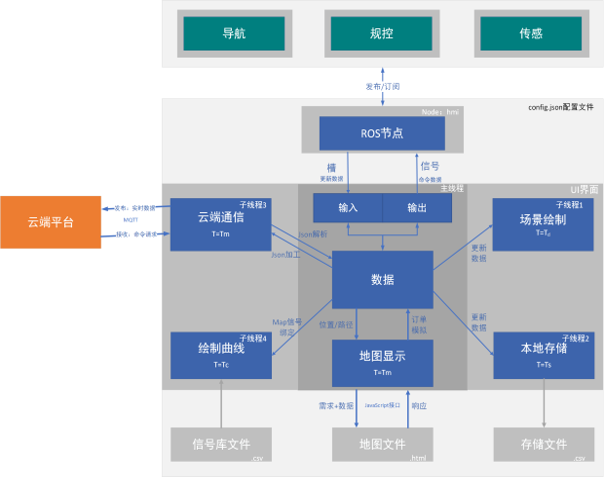
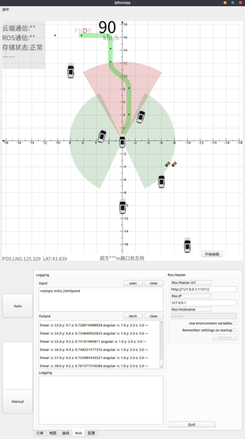
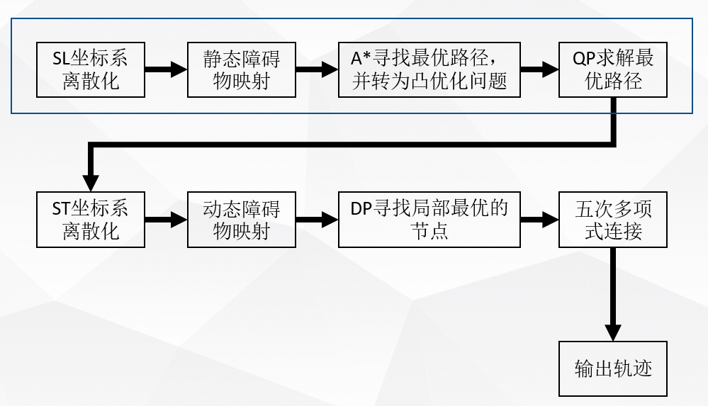
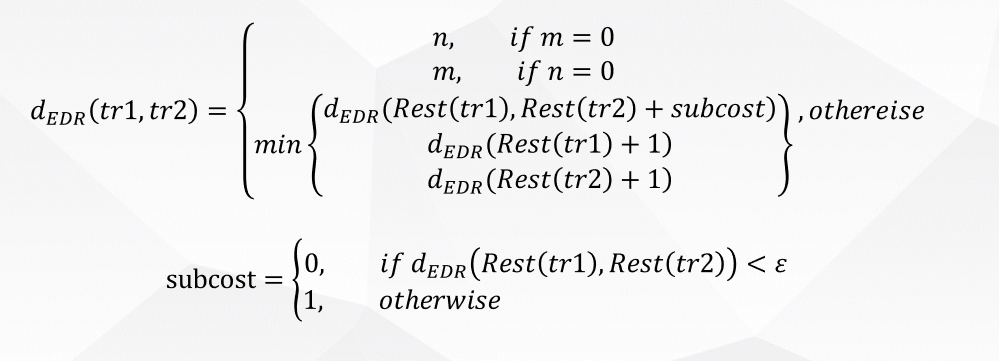
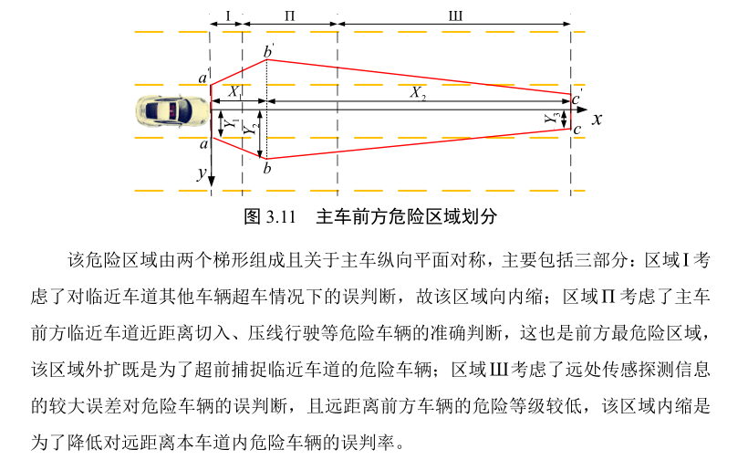
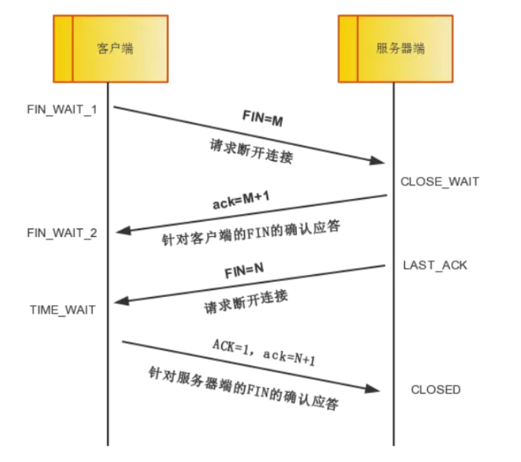

# 面试内容
0. 做过车队  汇总总结一下
1. 做过软件 L2
2. 做过

1. 负责维护和迭代误制动checker，开发迭代碰撞检测checker，并修复原checker算法中存在的bug。
2. 通过人工review判定异常的数据bag，将算法中对一些case的误检和漏检问题进行改善，并撰写了checker迭代以及PR值计算文档。
3. 维护plot_lon_planner纵向绘图脚本。

1.通过不断的本地调试，以及在仿真平台人工review数据bag，不断迭代碰撞检测checker，使PR值均提高到100%
2.通过调试，发现原碰撞检测算法中存在的 漏检他车从侧后方撞自车的bug并进行修复。

历史工作？？
1． 

# 面试自我介绍
尊敬的面试官 您好  孙于峰  本硕都是吉林大学车辆工程专业， 研究方向：无人驾驶汽车的轨迹规划。
经历
- 本科的参加过学生车队，以及一些数学建模比赛。 也跟着本科的导师 提前进 实验室， 写过 传感可视化软件。
- 研究生阶段首先 hmi 的开发以及一些工具链的开发吧。

- 之后就是做 无人驾驶出租车 robotaxi 的这个**项目**， 参与**轨迹规划和控制**这块的工作。

包括 基于**离散采样**的和 基于**横纵向解耦(横纵向 分别进行 搜索和优化)** (也就是先路径规划再速度规划的 ) 的两种轨迹规划方法，
用于在 城市结构化道路上进行轨迹规划，另外就是开发了 预瞄 和mpc的一部分 控制算法。

最后，就是通过在 台架上 与robotaxi其他模块 包括导航 传感 决策等模块 联合仿真 ，并通过完善算法，以及调试算法中的一些参数 ，解决遇到的一些问题，比如车辆**抖动**，~~参数适配~~ 进行了多种工况的 仿真， 有了较好的轨迹规划和控制的效果。

- 最后是在momenta**实习**，参与 纵向规划 和 规控评测相关工作。
◆	参与规控评测。开发rule-based和data-driven的评测checker，负责误制动、碰撞风险、制动过重和制动不连续等checker的开发和迭代，不断提高对特定问题检测的PR值(查准率和查全率)。应用于路测和仿真数据包，实现规控相关问题的快速检测与定位。
◆	参与纵向算法学习与调试。对纵向部分的框架和算法有一定了解，包括纵向决策和轨迹规划等。
◆	通过脚本回放问题场景并绘制数据曲线，离线分析数据包中可能存在的路测问题及其原因。

---

首先是基于 项目 要求以及 和配合其他模块需要 ，把规划分为非路口和路口模式，分别使用 不同的算法。
- 规划 
    - 非路口  采样+筛选择优    解决正常结构化道路上的 跟车、超车、避障换道、制动减速过程
    - 路口   采用横纵向解耦的方式，每个方向单独进行 搜索+优化        
        - 解决路口的启停、避让和过路口的操作。但目前由于缺乏对交通参与物的有效预测， 过路口的规划算法 做的还比较保守。更多的是进行避让。
        - 解耦  路径规划和速度规划算法已经开发完了
        ~~但还没有把路径搜索的部分适配到路口，~~ 目前是沿着 导航发来的过路口的 虚拟参考线 进行速度规划，相当于一个配速的过程。
- 然后控制的话 主要是开发了预瞄 和mpc算法。 但主要调试的是 预瞄的算法，能够实现比较好 的跟踪       //mpc的还未来得及加入到仿真环境中测试效果。
- 通过算法的开发 以及 一些参数的调试(主要解决 遇到的一些抖动问题、采样不合理的问题) 目前配合项目上其他决策模块实现， 多种基本场景的 规划 和 控制 联合仿真。

**场景**

(包括启停、换道、以及换道超车、跟车、 跟车停止后起步、 本车道内避让超车、(避让对向车道来车) 等 非路口场景 
以及  路口启停 、  左转、左转让直行、右转、右转让直行。

- 路口规划 和 结构化道路 非路口规划区别：（看下实习的

1.速度  相对低速
2.路径  变化不大  更多进行配速
3.复杂度    交通参与物比较集中  预测相对困难
4.预测难度  
5.路权  
6.曲率  尤其U turn 

# 项目总结

## 项目介绍

### 简介
是东风公司的一个领航项目，在武汉 经开区？ 有很多自动驾驶的公司在运营robotaxi。但是只是做运营服务，东风是拿不到其中关键技术的，所以找个同济、吉大做开发，然后提供源码级的支持，并在武汉经济技术开发区进行试运营。 文远知行，元戎启行

>架构：在上层用三个车载计算机分别加载 激光雷达定位感知，组合导航，高精度地图模块，地平线摄像头视觉模块，以及决策规划模块，这三个模块通过以太网进行通信。决策规划模块与叫车服务接口对应，并通过CAN与下层的ADAS控制器进行交互。通过发送的速度和加速度与ISC接口(智能速度控制接口)对应，发送的方向盘转角与转角接口进行对应，控制器与整车的驱动制动转向接口进行连接。

#### 具体 
内容：导航 + 高精地图 + 定位(组合惯导)[定位技术相关](https://www.sohu.com/a/500303604_121123871) + 传感 + 决策 + 规划 + 控制(包括纵向ACC+AEB，用加速度接口。 横向EPS，转角接口。给ADAS控制器MPC5675K) 32位嵌入式控制器

**方案：**
- 车： 东风 风神E70
- 硬件：
    - 感知：
        - 激光雷达：速腾聚创P5的激光雷达 一个80线，两个16线：建图，定位，盲区， 动静态目标物检测
        - 4个地平线摄像头：车道线、信号灯及可行使区域识别
    - 定位：GPS + IMU  
    - 计算单元：

- 仿真
    - 车辆 宝马一辆
        - 4.59m 1.8m 1.515m
        - r = 0.28m, front/rear track 1.6m, 
# hmi

乘客通过手机APP发送车辆请求，后台调度管理系统选取合适的车辆，下发行驶任务到自动驾驶车辆，完成预先选定的路线的出行测试。保留自动驾驶车辆实时反馈车辆的状态和位置到云端子系统的接口。保留云端子系统与自动驾驶车辆通过现有的4G/5G通讯网络实现信息交互的接口。（**MQTT**: 　MQTT是机器对机器(M2M)/物联网(IoT)连接协议。它被设计为一个极其轻量级的发布/订阅消息传输协议。）

控制面板与显示面板。
**控制面板**实现进入和退出自动驾驶模式的切换，在必要时保证人类能够安全接管。
**显示面板**以图形化界面展示自动驾驶汽车实时运行的环境感知、路径规划等情况

>东风领航项目基础数据平台对于车端的功能要求如下：
1）基础数据平台是车辆接入的唯一的合法的平台，接入其他平台需要甲方东风公司确认。
2）车辆与基础数据平台采用直接方式进行数据交互，不支持其他平台中转。
3）车辆上传数据方式有**实时消息、日志文件、实时视频流**三大类，其中，实时消息上传频率支持毫秒级，最大不超过1秒。
日志文件记录频率与实时消息上传频率保持同步，上传频率平台可远程配置，文件格式待讨论，但必须统一。实时视频流不少于2路，上传频率不超过1 秒，上报频率、格式、压缩方式等可配置。
4）车辆存储数据内容要求:
4.1）实时消息包括（不限于）车辆基本信息（编号、车型）、位置、速度、加速度、航向角、灯光信息、行驶里程、剩余电量、档位、定位信息、车辆驾驶模式、当前任务状态、车辆故障码、车辆安全告警、人工接管状态、人工接管原因，自动驾驶主控制器运行状态，车辆雷达障碍物信息，车辆运行任务（起点、终点位置信息）等；
4.2）日志文件内容主要包括（不限于）实时消息中的部分共用字段，感知融合后的数据（车道详细信息、目标物或障碍物详细信息、GPS定位信息、红绿灯详细信息）、规划决策模块输出数据（全局路径/局部路径规划信息集合）、控制模块输出数据（转向、制动、油门、换挡请求信息及期望值）

**可视化显示**
    - 场景绘制
    - 地图位置显示 站点 位置更新 选点进行导航

**数据传输、存储**

**云端交互与订单**

涉及技术：
**线程：**

**TCP**

#### 工具链
除了用ros自带的工具开发，如rviz 以及曲线工具 rqt 
还会自己基于qt开发可视化界面，
比如  在**离散采样** 最后得到的一批 轨迹。除了**最优**的那一条会输出给控制模块。其他轨迹比较好的轨迹都是什么分布，是和最优轨迹比较接近，如果比较**接近**的话 这种代价在这种工况下可能就比较**合理**。
因为如果在某一工况下 代价值比较接近的轨迹 其分布 比如是路径上的差别 或者是速度上的差别比较大 ，必然会由于 各种因素 很容易产生 帧与帧之间的 跳动，进而引起 控制模块的输出急剧变化 ，从而引起车辆的抖动。
。而开发的可视化界面 能 将每条轨迹 的路径 以及速度曲线 ，以及如何产生的该轨迹 也就是离散的采样条件给**一一对应** ，就可使得更形象，能方便开发。

## 模块
###  模块流程
仿真软件 > api -> 分发 -》 传感 + 定位 -》决策 -》 规划(路口+道路) -》 控制 -》 can底盘

## 附加节点分发节点
- 输入：
    - 车辆： x, y, heaing, v, a, yawrate, steerAngle
    - 地图导航： lx, ly, x, y, rx, ry,
    - 决策：换道 目标车道等指令  以及路口 道路切换   用于选取参考线 进行进一步处理 
- 

**任务**
- 处理参考线问题
    - 参考线的选取(车道中心线，根据决策指令 以及参考线有无 和质量情况)
        - 车道保持
        - 换道  目标车道 比对  (**解决**通过比对当前车辆所在车道是否为换道 的目标车道 ，解决在 车道切换瞬间 多车道情况下  从一侧转向另一侧时，地图 定位模块先更新，而决策模块指令存在一个周期的偏差，会继续向一侧规划 出现较大**抖动**的问题)(根据原因是最初的决策和规划接口中只定义了换道的方向，向左向右 没有说目标车道等信息)
            - 并行  
    - 根据需要重采样
    - 约束 osqp 平滑问题   见待实践
    - *待解决**重复计算的问题？？？
    - 路口转向问题              
        - 》用于限制规划速度 以及 预瞄控制的参数
        - 依据 曲率 以及 向量变化方向 
    - 拼接
        - ？？ 从上一last_index 开始索引找最近值？？？   倒车时？？？有bug吧 
    - 计算参数
        - 根据离散x，y计算theta、kappa(三点圆法、导数法)、s纵向距离
            - 3点圆 先计算3条边a,b,c,平均值为p，根据公式求面积 S = sqrt(p * (p - a) * (p - b) * (p - c)); --> 计算外接圆半径 r = a * b * c / (4 * S) 或者直接 k = 1 / R = 4 * S /(a * b * c). (计算时注意分母)
            - k = |y''/(1 + y') ^ (3/2)|
                - y' = ( y(x + h) - y(x - h) )/(2 * h)
                - y'' = (y(x + h) - y(x - h) - 2 * y(x)) / h ^ 2
                - 注意theta为直角的情况
            - 弧长法??
- 可视化工作
    - 设计类？ rviz
        - 运用(纯)虚函数
    - matplotlibcpp.h
    - gnu

## 规划节点

### **总体概述** 
- **离散采样** 非路口
    - 处理非路口 正常道路上的 跟车超车、换道 制动减速过程
    - 换道与否 两种模式
        - 1.根据决策模块 输出的硬决策 是否换道 (到路口前的强制换道、以及为了提高通行效率的 超车、换道决策)
        - 2.或者根据代价的软决策 同时考虑决策模块的输出作为额外的代价  或者加入状态机  防止决策结果的频繁切换   严进严出策略
    - 思路：
    - 参考线信息、自车信息、决策信息
        - **匹配**点，计算自车位姿信息(延迟100ms后的值
        - 离散**采样**： 纵向s-t  横向l-s  生成一维轨迹簇
        - 然后经过**约束检查** 筛选满足运动学约束的轨迹 进行**合成**二维轨迹
        - 根据每条轨迹的参数 相计算各指标的**损失** 结合应的权重 计算轨迹的代价
        - 选出**最优轨迹** 进行进一步的**约束检查 和 碰撞检测**  
            - 碰撞检测：**分离轴定理**  适用于凸多边形 只需要得到是否碰撞 不需要获取具体的碰撞点的话 可以选用。
                - 尽量减少投影量。  确定投影轴 和 方向。进行投影，判断是否重叠。存在一个方向不重叠，即通过检测。
        - 相似性检测
            - 满足则输出  不满足则选次优，若无解，则产生制动轨迹。
        - 经过frenet -》笛卡尔的转化 ，输出给控制模块

- **解耦+优化方法** 路口
    - 解决路口的**启停、避让和过路口**的操作。
    但目前实现的场景还非常简单，策略也还比较**保守**。
    - 因为难以对其他车辆进行有效的预测 也无法得知通行的优先级顺序 ，目前 更多的是进行避让。
        - 通过在st图上 把障碍的st 向左侧拓展，以实现避让。  否则在下部进行拓展。
    - 目前用在 通过路口的规划，但还没有加入路径搜索的部分，沿着 导航发来的过路口的 **虚拟参考线** 进行速度规划，相当于一个配速的过程。
        - 配速 即通过dp进行配速，再通过 qp 优化处理 。
            - 其中 截止线 会在红灯也就是当前车道不可行的情况下 视为一 虚拟障碍物，促使该车辆停车。
        - 对于 像无保护左转 或者 之类的目前主要还是进行 躲避、
        - 后期需要根据 路权、以及安全性的指标，评价是否 可以不那么保守、不只是进行单纯的躲避。
    - 在离散化的frenet坐标系中**sl**中， 首先路径规划
        - 将**静态障碍**映射 形成map图，进行**A* **算法搜索。得到代价最小的一个最优路径的粗解，由此结合 可行驶区域边界(如车道边界、障碍车辆边界 并考虑自车的体积膨胀) 转化为**凸优化**问题。
        通过qp求解：设置 目标函数 以及 约束条件，获取光滑的路径。
    - 之后对该光滑路径 构建离散的**st**坐标系，将动态障碍进行映射，通过dp寻找最优转移路径(惩罚项：**舒适**(加速度、jerk),**安全**(安全距离、TTC)，**效率**(s-s',v - v');，分别用五次多项式连接，最后经过qp的光滑处理。
    - 经过frenet -》笛卡尔的转化 ，输出给**控制模块**

 <!-- 道路内规划
- 输入：
    - 车辆： x, y, heaing, v, a, yawrate   
    - 底盘： ... // steerAngle
    - 处理后的参考线 x[], y[], kappa[], dk? theta[]     带 限速信息
    - 地图导航： lx, ly, x, y, rx, ry,
    - 决策：换道 目标车道等指令  以及路口 道路切换   用于选取参考线 进行进一步处理  -->

- 如何规划？？
    - 对多条参考线 (同时进行 再结合决策 设置代价)    还是一条 (根据决策)

    - 规划成功
    - 规划失败 旧规划？？还是产生停车轨迹 异或多段    或者连续两次失败再产生停车规划
 路口规划

### **控制**
- ACT模块 
    - 加速度
        - 当前加速度
        - 阈值： 滑行区间 acc_min = -0.3g  acc_max = 0 油门 
            - 加速- 油门 百分比
            - 制动- 踏板 踏板力  标定
        - 一旦加速到限速值时 此时需要加速度接近于0 那就接近于不用踩油门 也不用踏板 进入滑行状态
        最开始遇到 的问题 解决：**阈值动态改变**. 
        - 然而滑行状态下 车辆就是比较大的减速度，即从 加速状态结束后 就产生一个较大的减速度 如-0.3g，那么下一帧的规划则会在此基础上进行规划。将加速度逐渐提上去。但是因为得需要时间 所以这段 时间内 加速度为负值，则速度会下降。 因此需要对滑行区间的上下限进行动态的修改。把acc_max的接近于0调整为-0.1g,即为了保持速度稳定，可以保持轻踩油门。
        - 当然实车上 会把加速度指令交给 acc接口 和aeb接口进行处理。 转角给eps系统。
    - 转角
- 动力学方程
    - **二自由度 （侧向 和 横摆）**
        - 忽略车辆转向系统、以前轮转角为输出
        - 忽略悬架、只考虑演x、y的平动， 忽略垂向的平动， 和沿 xy的转动。即不考虑 俯仰 和 侧倾
        - 假设纵向速度不变  - 假设 轮胎特性处于线性区
        - 对线性二自由度理解：  线性？(线性区？)  二自由度

- **控制**：
控制车辆的**转向系统以及制动/驱动系统**使得车辆能够以期望的速度沿着期望的路线行驶，即实现对纵向速度的跟随控制和对侧向的路径跟随控制。

- **预瞄** (横向) + (匀加速模型(+饱和处理) 或 均值滤波(纵向),  双层pid 难于调整参数)
- 模拟驾驶员在开车的过程中，通过对道路前方信息的预估，为了使得车辆实际轨迹与理论轨迹的偏差最小从而得到一个最优的方向盘转角输入。
    - **位置误差(前馈) + 航向角误差(反馈)**
    - 问题
    - 解决轨迹突变时， 如进行**换道瞬间** 方向盘转角突变
        - 由于预瞄点的偏差瞬时增加  所以需要通过渐近改变   预瞄偏差 和 方向盘转角 间的传递函数
            - 虽然规划轨迹是过渡的曲线  但是预瞄点较远 预瞄误差较大  故可渐近增加至预定的预瞄时间 和 距离
    - 自适应 
        - 预瞄距离 时间  `dp = d0 + v * ti`
            - 当车速较低时,如果预瞄的距离过大，就会导致车辆前方的信息无法很好的利用；当车速较高时，如果预瞄距离过短，则会丢失部分未来道路的信息，从而使控制效果变差。
        - 权重： err = add(Gi * ei); -> 前馈方向盘转角 delta
            - 不同预瞄点 赋予不同权重，     
            - 不同的转向曲率也会赋予不同的权重。
        + 模型误差和干扰：车辆的航向角反映了跟踪路径的切线方向而对跟踪的影响较大，
            + 添加基于航向角误差的 反馈控制
    - 多点预瞄：
        - 充分利用更多前方道路的信息 防止单点预瞄的抖动 稳定性更好  信息利用更充分
        - 尤其是应对曲率较大 或者变化大 的轨迹跟踪问题时
    - 最终精度 也就是侧向的跟踪精度 能达到 0.2m以内

- **MPC**
    - 预瞄缺点：基于预描理论的控制方法从本质上来说是一种**无约束**的优化控制方法，因为这种优化控制方法较少考虑到车辆**本身与环境**的特性，比如，从而使得它无法保证车辆在任何工况下都具有很好的**适应性**。执行机构的特性、轮胎与地面的附着特性等
    - 比较准确模型
    - 可控(当系统的状态能够完全由系统的输入确定时，则表明系统是可控的) 
    - 可观(系统的可观指的是根据系统的输出，可以确定系统的状态。)
        - 一般而言，由于传感器**精度**等问题，系统的有些状态是**很难**直接准确测量的，此时就需要结合模型对这些状态进行估计。常用的估计方法就是**基于状态观测器采用卡尔曼滤波**的方法来进行状态的估计。在利用**卡尔曼滤波**进行状态估计的时候，就要求系统满足**可观测**的要求。在模型预测控制器的设计过程中，需要实时获得系统的状态量，所以就需要确保系统状态的可观性
    - 跟踪误差： 路径误差  速度误差    预测步长大于控制步长
    - 目标函数：Q * 预测步长内 ||y - yref ||^2 +    R * 控制步长内（ ||dU||^2 + U ^2)   
        - 即**追踪性能** 和 **控制输入** 与**控制输入增量**的代价
        - 即 min J(x, du), du的序列
    - 约束 加速度限制 转角限制 以及转角增量限制  连续性
    - 为提高求解速度，非线性ipopt;
        - 线性化 离散化 -》转为qp问题
    - 权重系数设计难：   不管是离散采样的规划问题 还是控制问题 
    - 尤其横纵向一起时，耦合度高 。解耦，纵向单独，将规划出的a给侧向，求相应的 delta。      
    多输入 多输出 
    求解：

   

- **LQR**
- 线性二次型调节器 [LQR,iLQR,DDP控制论经典算法](https://blog.csdn.net/weixin_40056577/article/details/104270668)
- 找一组控制量u0,u1,使状态量x = [横向误差、横向速度误差、航向误差、航向角变化速度误差] 量足够小，即达到系统稳态。又能使 输入的 u=[转角、油门、制动]较小，即以 花费较小的 控制代价达到目的。  //没有纵向的速递跟踪？？
    - 定义目标函数 状态权重Q, 最终状态权重Qf，以及控制权重R。 N为达到最终状态的控制序列个数。
    - 求解： 黎卡提方程 迭代

- Stanley
    - 前轮反馈控制
    - 是 一种基于**前轮**的路径跟踪误差 对方向盘转角进行控制的一种算法
    - **基于前轮的横向跟踪误差(**前轴中心到最近路径点的距离)的非线性函数、能实现横向跟踪误差 **指数**收敛于0
    - 包括： 车辆位姿 与 给定路径的相对几何关系 直观的获取 车辆方向盘转角的控制量
        - **横向**误差 e 和 **航向**误差θ_e  δ(t) = δe(t) + δ_θ_e(t)
        - 计算时可 通过单独计算某一项进行

- PP纯跟踪
    - 为使车辆**后轮** 跟踪圆弧轨迹到达轨迹上某预瞄点，通过转角输出进行跟踪，消除横向误差的方法
    - 根据正弦定理以及切线弦定理，
    以及tan(delta) = L/R, 可计算得到 delta = arctan(2 * L * sinalpha /ld)
    定义横向误差为 ey = ld* sin(alpha), 得到 ey -= ld^2* delta(t)/2/L
    - 得知 跟踪效果由 ld决定。 ld为预瞄点到当前欧式距离。取Ld= kv * v + ld0,与速度有关的一个值。

## 算法改进
### **抖动**

解决的一个常遇到的问题就是抖动，一部分原因是仿真环境 和 模块间比如决策和规划接口定义问题，其他的在问题有 规划方面、有控制方面。 并且都做了相应的改进 和 完善。很大程度上 减少了抖动情况的出现。

- 边界约束
- 最开始搭建仿真环境时候的抖动 simulink 接口频率太低了
- 与决策模块接口设置的问题。异步 进行
    - 即便运行频率再高，也偶尔会出现。(后续 论文方面可能也会 做一部分的行为规划工作， 而且这样也更符合 系统的架构)
    - 最后 通过完善模块间的 接口，比如给我 目标车道的信息，或者 (我对决策信息进行一定的延迟处理？) 当我知道已经在目标车道上，而还暂时没有获得 决策模块的更新时，不再进行新的换道动作。
    - 

#### **规划原因**
- 解之间抖动  比如两帧之间的跳变。
    - 涉及到每条轨迹 的权重系数的设置 和 代价的计算。
        - 由于 权重不合理 或者计算的不同的轨迹 代价接近，但轨迹的相似度上有比较大的差距，会抖动。
        - 一方面要 合理的设置权重系数，另外就是通过 **相似性检查** 来避免帧间 较大 的变化 ，除非是**遇紧急危险**的情况，如需要迅速制动了，这时候肯定会差别比较大，才允许有 较大的 不相似度。
    - 另一方面可通过 
    - **相似性函数**  基于点距离 欧式 
        - DTW (在时间轴上对齐、动态时间规整，对长度无限制、但未处理噪声)
        - LCSS (最长公共子串,对噪点进行处理了，但相等判定的误差e不好定) 
        - **EDR** (**最短编辑距离** 对噪声敏感)
            - 与DTW相比，可将距离误差转化为0、1，只要超过阈值，就计数1，可以对偏差特大的 离群点进行更好的处理。
            - LCSS只计算匹配数 根据匹配数量定不好 
            - 而EDR可以通过与轨迹一致的 总编辑次数 以及 比例还评价 更精确
            - EDR中 替换 插入 删除 的代价成本是一致的 都是评价存在不同的指标。
            
        - **改进**  不仅是位置 还再考虑速度等因素
            - 对点序列进行 最短编辑距离的 计算 来评估相似性  两个参数：两个点相似的阈值 d、两个序列相似的阈值 % 
        - 如果抖动较大 同时判断当前是否是由于突发的obs引发的危险 **如非危险工况** 
            - 比如只是因为权重之间的差异导致 则保持上一帧结果。同时对最近几个周期进行一个滑动窗口的检测，如果连续多帧 如设置3帧 当前计算的最优都与之前的不同 则需要更换成当前最优的轨迹， 否则继续保持。
            - 危险： 传感 以前做传感融合的时候简单了解过一点点吧
            - 从融合目标队列中筛选出**最危险目标**。在危险目标筛选时，首先计算前方车辆距离本车车道内中心线的**横向距离****DTC**，根据该关键参数和前方车辆的位置状态等信息判断该目标的危险等级，从众多目标中筛选出最危险目标，该最危险目标的运动状态和位置信息将作为ACC、AEB决策的关键性参考信息。
        - 前方车辆距离本车道中心线的横向距离计算是基于前方道路信息和该目标车辆的运动状态信息实现的。根据车道线信息不同，将有两种不同的计算方法。
        - **完全驶入本车车道内的前方车辆**，**旁车道近距离切入车辆**的危险情况不能及时做出判断
        

- 有解无解抖动
    - 这个暂时遇到的还比较少  可能仿真的工况还没那么极端。
    - 如无解  则产生一个制动的规划。同时规划也是 按多个制动强度 分别进行规划，从制动强度较低的开始筛选，如安全的情况下，则最大限度的保持舒适性。
        如不安全，则需要继续现在 更大减速度的规划。

每帧
**障碍物的有无**  跳变  
1.暂时还少遇到  估计会在上 实车的时候 会经常遇到。 因为传感器的探测本身的稳定性，以及各种天气 条件的影响。  
2.还没上实车 到根据之前做的传感显示的话 还是有必要进行处理。虽然传感设备性能更高 但有些预计还是难以避免 的。
3.

#### **控制上的抖动 换道**
- 如使用**预瞄**算法 在换道开始的瞬间 
    - 解决轨迹突变时， 如进行换道瞬间 方向盘转角突变
        - 由于预瞄点的偏差瞬时增加  所以需要通过渐近改变
            - 虽然规划轨迹是过渡的曲线  但是预瞄点较远 预瞄误差较大  故- 通过在换道瞬间 重置 预瞄参数如时间和距离，然后在2s或者一定时间范围内 渐近增加至预定的预瞄时间 和 距离  ``就能防止突然抖动的发生。``
    - 而不像是过路口时 路口引导线上预瞄点是逐渐延伸的。就不会有这种问题
- mpc没遇到 这种问题，因为mpc的话 会对 进行约束。而 预瞄算法 更多的是根据 几何特征进行 确定转角。
则没有相应的约束。

### **代价函数权重**

- 代价函数中**各指标的权重的比例**很难设计
    - 主要有 不同工况下 多种指标很难**协调**，达到 在某种工况下 某项性能的最优。
        - 如**正常自由流**形式状态，本车道前方无车，也无其他车辆占用本车道的情况，自然希望是 **贴近车道中心线**行驶。
        但是如果自车是刚从 某种状态切换而来，如从 有其他车道车辆压本车道线行驶，且速度低于自车期望，则自车进行超车时会向相反一侧进行避让。 避让完 (如果后车车速较低)能否尽快的恢复到本车道、很大程度上 取决于 侧向的参考线偏差 与 侧向的舒适性代价的比重 。
        如 更看重舒适性 ，则可能很慢 甚至不回到 沿着 参考线行驶的状态。
        而如果想快速回到 ，则适当提高距离参考线 的权重。
        - 然而，此时在换道时 可能又会使其 过快 换到目标车道，影响 舒适性。
        - 同时**换道**还需要注意其他的问题，比如**换道距离** 也不应过长，过短。都不符合**人类驾驶员**的习惯。 大概 3- 10s的换道时间，取平均6秒* 车速，为标准的换道距离。即采样时 选用当前速度 对应一个最大的采样距离，来决策换道的采样。 
        - 根据车速、曲率、决策指令、以及车辆的状态(如**监测**一个**滑动时间窗口内**横摆角速度范围在超出 直行状态 的阈值，认为是在换道，则对此进行权重的调整 和 采样终止条件的 更改(如减少对 车道左侧的采样 ，防止出现换道过度的 情况(过度指换道左侧车道靠左的位置 因为舒适性较好)))，另外也 通过 **增加 换道过度的 代价**，对过度换道进行惩罚。防止过度换道。
    - 在跟踪能比较准确的情况下，(固定规划进行跟踪)：在保持采样条件不变 的情况下，导致换道距离不断延长，和实际的 规划轨迹产生一个较大的偏离。

### **模块间的衔接**

目前：非路口：
    - 决策指令 决定了 采样的横向范围。  
    - 衔接： 
        - 车辆正常行驶，多车道情况，自车在中间车道。**前方有一较慢车辆**。如从某一个时刻开始，传感获取到这个obs时，决策根据有利条件，会选择进行减速行驶，由于各模块并行运行、规划模块也会很快规划出 进行减速的 轨迹。  同时在 下一帧 受到 决策换道指令，则会产生不协调的情况。即车辆 会 进行 换道 但同时伴随着 一定的减速 。这就很不合理。 因为正常的换道超车过程 是 自车进行一定程度的加速的。 所以这个就需要进行 一定的观察处理， 如非紧急情况，则观察等待一个周期再更新新的规划。 来弥补各模块 并行运行的 存在的同步 异步问题。   
        - 同样的还有 有**可允许连续换道**的情况。(除了观察、就是通过更多有用的信息 进行判断， 如决策指令还未更新 ，但是我可通过增加 决策的目标车道进行判定，我的定位已经更新到了 目标车道 ，即使决策指令还是向左换道 ，我也不再继续有最左侧车道进行规划，有效避免 车道切换 瞬间的 抖动的问题)

### **算法存在问题**

1. 预测  尤其是障碍的轨迹预测  主要是 非路口的 换道还是保持  ，路口太难了
2. 红灯前如果有秒数，保证安全的情况下，可适当缓慢减速 再加速通过，可提高舒适性，尤其对于晕车的人来说很有意义

(momenta一面问题：)
lattice 算法问题
- 1.采样终止条件固定不好 只是随速度变化 也不好，需要根据不同的具体实时的工况 进行自适应采样
- 2.由于是一段式规划 可以不能覆盖复杂的路径。 比如超车的规划 就不符合人类驾驶员。换道后换不回来。需要另做规划。 而像图搜索的话，就能规划一条左换道再右换道的路径。
- 轨迹代价的计算在frenet坐标系下，在实际大曲率时确实可能差距有些大。
(在结构化道路上区别差别相对小一些，在路口的话暂时没有用该算法)
- 算法的相似性检测为何未放到代价计算里？
因为调当前的几种代价已经够难调的适应多工况了，如果再引入新的代价可能会更难解决。所以暂时是把他作为最后的输出检查过程。比如之前还想过加换道过程的一些代价惩罚，但最终通过自适应采样加以解决。

## 探讨问题：

### 技术性 的探讨：
- **规划的技术路线**：
<!-- 轨迹规划算法 是什么样的算法，是 横纵向解耦 或是根据环境 和场景的不同，有不同的算法进行规划？？？  -->

- 决策(行为规划)和 轨迹规划 之间如何**衔接**，或者各自分工如何能够合适。 接口的定义是什么样的？？
    - 换道是软决策 根据代价计算获得的最优路径 还是按照决策给出的的一些计算或者考虑的因素，最终输出的进行换道指令后才进行换道的路径搜索或是采样。
        - 以及如果是分开的，那决策或叫行为规划能给规划输出哪些指令，是一个比较宏观的指令，如超车、避让、还是说 能够具体到 以多大的减速度进行 避让，跟到某个速度、或者换到某个点
        - 甚至是对某个障碍进行单独的决策。

- 遇到的 **问题难点** 吧
- **评价指标**的选取 尤其是权重值的选取 工况 、同时注意**避免产生帧间抖动**问题
    - 很难量化  不同的工况下 和 驾驶条件下 ，具体哪些指标更重要，其相应的权重值如何设置，即同时在 保证安全的情况下，既有较高的通行效率，又能像人类驾驶员一样，使**自由流状态**下 贴近车道中心线、又有较好的 舒适性，等等指标的协调。
    - 又能防止 差别较大的轨迹 间 其代价值接近，导致容易来回切换 进行引起抖动的现象。
    - 另外通过 设定合理的状态切入切出阈值等方式 进行处理抖动问题。
- 目前过路口方式采用的**相对保守**的策略。 
    - 主要就是 只要其他车辆在未来一段时间，可能影响我的通行，我就会进行 相应的**避让**。只是避让采用了 不同的等级，从较小的制动程度 到 最大制动 依次遍历， 若较小 即能安全，就采用较小的制动强度。 直到最大的制动强度。  
    - 而为了能在安全的前提下提高 通行效率，就需要  对 其他车辆或交通参与物 的意图 和 轨迹有更 准确的预测，进而根据 路权的 优先级 进行进一步的 规划。
-  

- 整个无人车的架构 方案是什么样的
    - 比如传感器方案  应用场景(如道路 速度范围 实验车大小)

- 目前公司运营 的车辆遇到 的比较大的问题是哪些呢，能否方便提一下

- 可能做决策相关 针对某些特定场景下

优的更优 保证差的不能更差

### 方向的理解和思考
- **方向**上：  规划 和 控制  以及决策的**思考 想法**
    - 做过一定的**控制**方面的工作吧，比如预瞄和mpc的一部分，但感觉这些都有很多年了的积累了，技术上都已经相对**成熟**。可改进完善的改进的 空间 不太多。
    （可能有些工况下 存在超调、等问题）
    - 在规划上之前做的更多是**轨迹的规划**，包括采用 解耦 然后进行值优化的方法 和 离散采样 的方法。规划时也会考虑一些安全性、效率上、以及舒适性 等一些因素  并加以改进完善。
    - 但是 我觉得通过整个 算法的开发 和 测试调试的过程来说，我 感觉 一台 无人车 带给影响 乘客 一个更直观的 更具体的一些驾驶感受，尤其是 像不像一个 **有经验的人类驾驶员** 开的车，  更多的在于决策 也就是行为规划 的合理性  包括**帧间轨迹的连续性、决策的连贯性**、以及 **保守、激进型的表现**上, ( 当然这些也 同时依赖于上游 感知的精度 和 预测的准确性上。)   
        - (同时我觉得**保守并不意味着安全**，比如 和前车跟车距离较远时，看似安全，但也给了 邻车道车辆更大的 加塞(cut in) 的机会 反而不安全。)
        - 对于有交汇的场景、什么时候更倾向于 避让 ，还是加速通过。  以及避让的程度，比如规划要减速，是制动到停车，还是缓慢减速就行。 如果进行决策;  不同的 激进程度，或者 
        - 连贯性  不能让 设计的系统 。决策状态机 在 超车 跟车状态间来回切换 可以通过设定一定合理的阈值 比如 换道的收益足够大时  才允许 进入超车的状态 。否则我 觉得很容易出现 由于各种因素(包括传感器探测的稳定性和精度上 预测结果）的叠加 导致状态的来回切换。  很影响感受 以及 让人感到紧张。不安全的结果。
    - 我觉得 做出合理的行为规划 这方面是个难点，也是很有挑战性的地方 ，尤其是还 同时还涉及到一些博弈的内容。
    - 而且 场景也是千变万化，以及 如何让算法  能尽可能覆盖更多的场景，以及每个场景下 如果适应的更好。 我觉得这些都是很有意义 很有价值的工作。
    - 客观上 结合之前的经历 我还是更偏向于在规划方向上进行深度的学习 和  深耕! 取得一定的成绩 不管是在算法的优化改进上 或是 量产的落地上。!

    - （适用场景  场景分割 用基于规则的 bfs 广度上遍历，    具体场景下 进一步的优化 需要 深度上的 优化。可能需要用到 强化学习等相关的方法。)

- 对**智能车行业**的思考
    - 还处于快速发展期、不断涌现新的公司。但目前做的比较好的公司也都加快测试、逐渐落地，技术上也逐渐更成熟和深入。重点发现和解决一些corner case 和 影响用户体验的工况 和 路测问题。
    - 能在学生阶段对智能车相关技术的研究，然后能入职一家自动驾驶公司，我觉得这是时代的机遇 ，对我来说更是很好的机会和挑战。我希望自己能通过努力 做出一定的成绩 也能为自动驾驶行业做出 自己的一份小小的贡献。
- 对各个模块的思考  区别 高精地图 上

- 当然都是些非常浅显的看法 和 理解，具体还需要更多的实践。以及 实际的工作才能有更深的体会 和 新的 思考。

- 对于**工作内容**的期待：

~~当然是首先自己有能力去做，或者是通过 一段时间 的学习能比较好的上手，然后能 慢慢解决一些实际的 具体 遇到 的一些 问题，~~

- 如果说有幸能加入的话 都有什么**大概的方向** 或者是**可以做些什么方面的工作**  可以选择吗..  
    - 比如说行为规划 或者 轨迹规划 或者某一个场景的规划
    - 首先能有幸获得**机会**的话，肯定还是非常**珍惜和感激**这个机会的。
    - 然后就是**服从安排**吧.  主要 是想知道大概的方向，也好做 一些提前的准备。
    - 我觉得只要能**发挥** 自己的作用，然后自己也能**学到**东西，体现自己的价值 我觉得就是**有意义**的。 当然如果能 有一些 具体的工作能够选择，那就更完美了。  服从安排吧总之。
    - 也希望能好好表现 能有机会获得转正的机会。

- 公司对新人的培养体系是怎么样 的呢

- 面试 相关
    - 面试**结果** 反馈 通知的时间  大概需要 等多久
    - 如果有幸通过的话 还有**几轮面试**呢

- 团队规模 pnc组的规模  base的选择
    - 

### 公司相关

- 互联网
- 百度
- 纯L4
- L4 + L2量产
- 新势力
- 车企 智驾部门
- 自动驾驶供应商
- 机器人

- 为何选择我们公司
    - 主观上  认为很有实力  一直也都想去大厂/  ，
    - 客观上  岗位很喜欢 我也相信以 自己的以往经历 和 能力上，

- 为何要选你   你有什么优势  相比于其他应届 或 社招
    - 主观
        - 
    - 客观
        结合自己的整个经历， 我觉得我个人在 专业 项目 以及能力上，我觉得自己还是比较契合的。
        能够帮助 公司 完成相关的工作，也希望自己 能在 算法开发/项目量产上 贡献自己的能力。

- 薪资
    - 总包
    - 
- 工作时间
    - wlb

- 城市相关
    - 大城市 一线城市 的发展机遇 和 挑战也确实多，也挺希望能在 一个 城市通过自己的能力  自己的打拼  能在一个城市 立足，  相应的政策会多，不管是对人才 还是 说自动驾驶行业的 相关法律政策。

### 实时性

- 与算法本身有关 还与要求的求解精度 和 最优解 上有关。
    - 对于基于**离散采样**的规划算法  其不同的纵向采样精度 或 横向采样精度(以及要不要采集换道车道都有关(当然可以同时采集， 只是在最终输出的时候  如果和 决策指令不符的话  加上一个额外的权重 之后再从所有的轨迹簇着择优))
    - 对于解耦的A*算法 大概2ms求解出。纵向为0.25m左右。  横向0.1m？？
    - 然后进行的光滑的qp处理用时13ms左右。
        对于速度规划、量级也都是差不多的。
        其中影响时间的 同样是精度问题  如对 速度规划获取 参考速度粗解时，是用几个阶段 以及每个阶段采用几个状态 都将很大影响算法的耗时。 这也将影响后续的qp处理。

### API模块

- 替代simulink 频率跟不上 控制周期太低 不行

- 从C++代码获取 底层接口
    - 连接SCANeR
    - 根据id注册各传感器、自车RTK等 用于获取其信息
    - 循环定时获取 10ms一次  
    - 发送 传感信息 车辆状态- 结构体 UDP
    - 接收 控制指令  a和delta

---

# 其他

**常见面试问题**

- 秋招时更能用到

- 1.
- 2.家庭成员 教育重视程度 对自己决定的支持 自己对家庭的责任
- 3.业余爱好
    - 反映性格观念心态
    - 
- 4.崇拜
    - 和专业相关最好
    - 思想感染、鼓舞
- 5.座右铭
    - 励志如 十分努力才能看上去毫不费力
    - 挫折 只为成功找方法、不为失败找借口
- 6.经历
    - 失败经历
        - 失败
    - 成功经历
        - 最自豪
        - 车队
- 7.你为什么选择我们公司?
    - 行业
        - 蓬勃发展、有很大的发展空间
        - 无限可能，有巨大价值，也是我愿意all in
            - 
    - 对待加班
        - 比较正常的现象吧，尤其是 项目节点 交付周期的时候强度一般也会更大。
        - 总体来说 能接受一定的 必要性 的加班， 希望减少一些无效的加班吧。
        - 另外 我觉得有时候 觉得自己的任务没完成 或者进度有点慢 的时候  其实自己是会主动通过加班啊  或是抽其他时间做一做的 毕竟如果是自己的职责范围的话 还是要按时完成、尽量避免影响整个团队  项目的进度。

### 自己

遇到的最大困难？？？  独立解决过什么问题？？？

- 项目上遇到的问题
    - 联合仿真  通信问题
    - 自己算法问题
        - 抖动
            - 仿真环境： 控制频率上不去  画龙
            - 换道时 异步运行的接口问题
            - 换道时 ：方向盘 突然猛打方向盘
                - 从规划角度。。
                - 从控制角度： 预瞄  避免突变  所以从原值逐渐 增加到需求值 
        - 多工况下
            - 换道
                - 距离过长  与  侧向舒适性  离参考线偏差的矛盾
                - 即 各指标的权重等因素
                

~~momenta两条腿走路 战略很对 也很清晰 - 纯粹做一些技术、做实事  - 从**Mpilot**也可以看出~~

- 自己欠缺
    - 知识上 
        - 数据和数据驱动 还不太行
        - 工作中出现一些困难是正常的，也是难免的，但是只要有坚忍不拔的毅力、良好的合作精神以及事前周密而充分的准备，任何困难都是可以克服的。
        - 哪些是技术上的问题（是知识点欠缺还是理解有问题），或者哪些是工作方法上的问题，我觉得能分清，然后有针对性的改进 或者学习都是可以克服的。

- 我们为什么要录用你?
    - 对比其他人 应届  社招的人  有什么优势
    - 

- 如果我录用你，你将怎样开展工作
    - 首先可以先按领导前辈的指导和要求，然后对有关公司的情况 以及大概的工作职责 以及具体的算法等 和需要面对和解决的问题 进行了解和熟悉，尽快融入公司的环境。接下来做一份近期的工作计划和目标，最后根据这些来开展工作 当然解决实际的 问题。

1.自由开放，技术扎实
- 首先工作环境很开放，有任何问题都可以互相交流请教，大家都是知无不言，言无不细。会帮你推公式、看代码、调bug，不管是什么问题，几乎都可以找到人帮你，可以让你更快地学到更多东西。另外就是就我接触的两个组而言，组长都对事情都很有全局观和时间概念，每天会很细致地和组员同步工作进展，解决问题，也会主动找出目前存在的问题，对技术细节也是锱铢必较。
2.丰富的业余活动
- 有Town Hall，MFT（Momenta Friday Talk），**Paper Reading**以及各种组内外技术分享。你可以了解到很多其他部门同事最新的工作进展和技术总结，也可以了解到公司的各种制度。
节奏基本是“十十六”，不打卡，可能是目前公司正处于快速发展和竞争激烈的阶段，所以加班还比较多。不过加班这种事就看个人怎么看了，有些人就是追求技术喜欢和大家一起做好一件事的感觉。对实习生而言也更无所谓了，我在学校都是“九十七”的好么

- 职场
    - 与上级意见不一是，你将怎么办?
        - 我会给上级以必要的解释和提醒，在这种情况下，我会服从上级的意见
        - 对于**非原则性问题**，我会服从上级的意见
        - 对于涉及公司利益的重大问题，我希望能向更高层领导反映。

<!-- - 你还有什么问题要问吗?
    - 回答技巧：
    这个问题看似可有可无，其实很关键，任何企业都不喜欢说"没问题"的人，一方面是会觉得你缺乏个性和创新能力，另一方面也会觉得你对这场面试不是很重视。不要问个人福利之类的问题，可以问关于工作职位、公司产品或项目的问题等，展示出你对这些的关心和对入职后的工作期待。
    - 回答话术：
    公司对新入公司的员工有没有什么培训项目，我可以参加吗?
    公司这个职位的发展前景如何呢?  晋升机制是什么样的
    我所应聘岗位的部门人员是怎样设置的?
    未来加入团队，您对我的期望是什么?
    关于这个职位，您觉得有什么需要特别注意的 -->

- 秋招

- 薪资
    - 因为我不清楚咱们公司的具体薪酬结构，包括绩效方面，年终福利方面，您可以先简单告知我一下。谢谢!
- 加班
    - 你对公司加班是怎么看的?
    回答技巧：
    其实很多公司问这个问题，并不是说一定要加班，只是想测试你是否愿意为公司做出贡献。而你需要让公司知道自己愿意加班，但是你更愿意更高效地完成工作，不做不必要的加班。
    回答话术：
    您好，如果是遇到**突发状况或紧急情况**，我肯定会义不容辞地加班的。如果是个人效率问题，我一定会努力提高效率，在工作时间内完成工作任务，减少不必要的加班。
- 职业规划
    - 3～5年内，你有什么职业规划吗?
    回答技巧：
    千万不要说"不知道"，也不要说“我想在几年内做主管”等，而是要强调自己在专业方面的进步和突破。
    回答话术：
    您好，我希望我能够首先成为一名专业的算法开发人员、具备足够的专业能力、其次的话就是在 工作的过程中不断培养自己的综合能力吧， 。
    据我了解，目前公司的岗位工作注重·......，我会在这块好好提升自己，希望在1-2年内能够做好XX，在这方面拥有自己的思路和方法。同时，我也希望自己在未来能够接触和学习到更多XXX相关的内容，全面提升自己的专业度，能够在XX领域成为XX水平的人，让自己与公司共同进步，实现双赢。

- 具体介绍经历细节的模板
    - 本科时候做过车队工作，当时的话车队处于一个低迷期，主要原因我觉得是 人员过多，使每个人工作量较小，而且管理不便。加上当时车队的队规 不严格，时间一长，大家的积极性较低，然后对车队的归属感也比较差。
    另外一个原因也是技术上 比较保守，不敢尝试新的技术方案嘛。 当时最开始采用的还是12年 拿全国冠军时的方案，每年重复的进行一些改进。但连年成绩都不理想。后来我们这一届的话 开始改革。几乎 是把每个子系统的方案都进行的 更改和创新，因为大家都愿意发挥自己的积极性和创造性嘛，大家也都更愿意用心去思考，用力去做，花时间去维护和完善。最终取得第四名的成绩，一转 往年低迷的状态。并因为技术上的创新，或者了最佳设计奖。 从此，车队的成绩便维持在前三，且参加了更多国内和国外的比赛，也拿了几次第一。
    - 

>有的面试官会让面试者更完整地介绍过去的某一段经历，比如：
详细介绍一下你在xxx的工作经历吗？能具体介绍一下xxxx项目的过程吗？
同样最怕流水账。
更好的解决方法是在流水账之上，展示自己的具体能力、工作方法和态度特长。
大家到网络上搜索，应该能看到**STAR」原则，Situation（情景）、Task（任务）、Action（行动）和Result（结果）**
我要说的是，这四个步骤里作为面试官，我要听的是什么？你应该用什么模板？
1）情景（S）--你这个情景有多重要？
2）任务（T）--你的任务独特性是什么？
多数人都会提到自己被分配到的任务是什么，这里经常忽略的一点是：这个任务有没有独特性？
任务的独特性能够通过过往经历更好地体现你的能力、性格、价值观。有这么几个典型的模板：独立完成型--某项具体工作由你独自承担，要介绍细节；（说明你的能力更被认可）
横向对比型-一同样类型工作，你的任务比其他同事特色在哪；（说明你和同事有比较优势）
体现能力型--对工作难点进行抽象，体现亮点：对协调能力要求高/短时间高强度/需要认真细致/需要快速学习。（说明你这方面突出）3）行动（A）--你工作的亮点是什么？
每个人面对工作任务的时候，都有自己的解决方案，专业面试官或资深HR，S和T的部分听过之后，其实大概也会知道这些任务一般人会怎么做。
面试者，必须要找到你的行动（A），和别人不一样的地方是什么？
几个模板分享给大家：高举高打型--用非常专业的、深度、超越同级别和年龄工作者的方法解决问题；努力拼博型-一花时间、花精力；独立思考型--用和别人不太一样的方式解决问题；善用资源型--为了解决问题，借助外部资源；
克服困难型-一突出任务中发生的矛盾，体现自己能力；
4）结果（R）--结果有多么超预期？
先说一下，所以面试中面试官都希望听到具体数据，尽量不要出现：「大量/很多/显著/广泛/非常」这种空泛的词汇，尽量使用具体数字。
但是这仍然不够。
很多人会这么介绍自己的工作成果：
「我每篇文章阅读稳定在2万]；--我的第一反应是，你所在的公司平均阅读每篇是多少？
「我每个月销售额在10万]；--我的第一反应是，你每个月的KPI是多少？「我每月制作海报30张」；一一我的第一反应是，什么样的海报你一个月30张？
「我所在的小组顺利完成验收」--我的第一反应是，有没通过验收的吗？
问题出现在，使用数字或者事实描述结果（R）的时候，你没有给面试官一个参照系。
在很多行业，如果你不告诉面试官参照系。，上面这些数据没有什么参考价值。

- 本科
    - 成绩 本科大概3.40 top 20%吧   210 * 20% = 42 大概3、40名吧  保研其实比例挺小的 记得是12、3个吧，名额大部分给了实验班。 确实不太合理，至少比例不应差太大。
        - 1. 经过三四年的学习，大家的差距都已经拉开了。大学入学时强的可能后来不管是成绩还是综合 可能已经被很多普通班的甩在后面了
        - 2. 另一方面，实验班的话 本身人少，加上只要不挂科基本能保研、那么一个人努力的动力 鞭策其实也很容易弱化，毕竟 人都是有惰性的。而普通班的话 200多个人，但是16 17年的时候 车辆工程专业不管是就业 还是 学生质量上，还是很不错的。转来的学生也都是很强的，竞争其实也就更加激烈了。用现在的话说 就是非常的卷。 所以这一点上, 评测比例也是存在 一定的不合理性吧。  
        - 3. 好像从我们这一届之后，然后就取消了 实验班。
    - 英语cet4 503， cet6 501

- 研究生 单看成绩的话 top20% 
    - 但是因为做项目的话 没有发表论文等 最后综合的话 可能会在40%多点
- 

- 做过的项目
    - 难点 
    - 问题 和 挑战
    - 怎么解决的
    - 亮点

- 加班
    - 没毕业 或者刚毕业工作的时候  感觉还是有一定必要的。尽快对业务 对工作进行熟悉
    - 正是 各项能力 欠缺的时候 多学点东西 多做点事情还是挺有价值的
    - 但是 有的时候则需要平衡好 工作和生活嘛。
    - 对加班不排斥，但还是希望能有 更高效率的工作，减少一些无谓的加班吧。
    

- 个人优点 缺点
    - 
- 成功事情 骄傲事情
    - 现在的话，其实现在还是学生阶段，也没有做过什么惊天动地的事或者多大的成就，
    - 不过个人感觉比较成功和骄傲的事 还是有的。比如通过 努力以及团队的合作 设计一台赛车并在赛场上获得不错的成绩。
    - 就是一件很值得铭记的事情。
    - 组长的经历：
        - 如何分配任务
        - 如何
    - 
- 失败事情 委屈事情  雁过留痕 
    - 失败：好像并没有感到多么失败的事情，最多算是一些小的挫折、小的失望。
    - 发生在我考研的一段时间吧，当时提前进实验室 做一些辅助工作吧。开发传感可视化软件的一段时间。
    - 是

- 相比于 别人的优势、劣势
    - 每个人都有自己的特色，
    - 优势的话 
        - 我觉得我个人会对自己感兴趣的事情，我会把兴趣作为习惯
        - 
    - 劣势
        - 相对有点敏感，可能导致一些不太快乐啊 或者 怕麻烦别人  可能导致交流少啊 
        - 有必要进行相互
        - 

1. 对华为的了解
    - 1.是一家领先的ict公司、从运营商业务和终端业务来看，华为确实是 做到了 非极致而不为(理念)。
    - 2.是一家非常重视 技术 和人才的公司。
    - 3.当然这些都是 从新闻、从视频中了解到的，真实的华为是什么样，以及 能让人 时刻保持奋斗和活力的 的华为文化是什么样，都需要 在里面工作和生活后才能真实的感受到。
2. 对华为布局 车bu的看法
    - 1.个人看法 可能不太合适 或者准确
    - 2.行业  传统 
    - 3.从做运营商、和消费者bg的成就上来说、华为的话确实是做一行，专一行。战略眼光长远、有雄心有付出。重视人才都令我印象比较深刻。(研发千亿、20%营收)
    - 3.华为有自己的 优势，ICT相关的技术上具备绝对的实力、
    - 4.而且也通过多方合作，确实取得了很多成绩。

- 自己在实验室的工作节奏
    - 我们研究生的话 需不需要去实验室或者需要多久 都是 根据老师不同的要求。然后我们课题组的话，其实算是 工作最久的，要求是周一到周六的下午。  因为课题组的项目比较多，另外老师自己的话其实也是这个时间。
    - 然后我个人的话。

3. 在华为实习的目标
    - 首先如果有幸能进入实习的话，肯定会珍惜那么好的机会。
    - 如果是分配的任务，一定是要做好。然后在解决实际问题 或开发的过程中， 学习相应的技术、学习前辈解决问题的方式。掌握并强化 自己必备的专业技能，然后就是通用的其他技能，也会加以学习、如何更好与各模块 各部分协调合作。
    - 认识自己的不足 和 差距，然后就是加以 学习 和完善提高吧。
    - 当然最后就是希望如果有转正的机会的话，希望能 

- 问：华为：
    - 方不方便介绍下 华为对于 上汽 之前 灵魂说  的看法。或者是您个人的想法。谢谢
        - 我个人对这些还是存在一定的困惑的。
        - 

---

### TCP/UDP
TCP/IP 是互联网相关的各类协议族的总称，比如：TCP，UDP，IP，FTP，HTTP，ICMP，SMTP 等都属于 TCP/IP 族内的协议。

TCP/IP模型是互联网的基础，它是一系列网络协议的总称。这些协议可以划分为四层，分别为链路层、网络层、传输层和应用层。

链路层：负责封装和解封装IP报文，发送和接受ARP/RARP报文等。
网络层：负责路由以及把分组报文发送给目标网络或主机。
**传输层**：负责对报文进行分组和重组，并以TCP或UDP协议格式封装报文。
应用层：负责向用户提供应用程序，比如HTTP、FTP、Telnet、DNS、SMTP等。

#### UDP
UDP有不提供数据包分组、组装和不能对数据包进行排序的缺点，也就是说，当报文发送之后，是无法得知其是否安全完整到达的。

它有以下几个特点：

1. 面向无连接
首先 UDP 是不需要和 TCP一样在发送数据前进行三次握手建立连接的，想发数据就可以开始发送了。并且也只是数据报文的搬运工，不会对数据报文进行任何拆分和拼接操作。

具体来说就是：

在发送端，应用层将数据传递给传输层的 UDP 协议，UDP 只会给数据增加一个 UDP 头标识下是 UDP 协议，然后就传递给网络层了
在接收端，网络层将数据传递给传输层，UDP 只去除 IP 报文头就传递给应用层，不会任何拼接操作
2. 有单播，多播，广播的功能
UDP 不止支持一对一的传输方式，同样支持一对多，多对多，多对一的方式，也就是说 UDP 提供了单播，多播，广播的功能。

3. UDP是面向报文的
发送方的UDP对应用程序交下来的报文，在添加首部后就向下交付IP层。UDP对应用层交下来的报文，既不合并，也不拆分，而是保留这些报文的边界。因此，应用程序必须选择合适大小的报文

4. 不可靠性
首先不可靠性体现在无连接上，通信都不需要建立连接，想发就发，这样的情况肯定不可靠。

并且收到什么数据就传递什么数据，并且也不会备份数据，发送数据也不会关心对方是否已经正确接收到数据了。

再者网络环境时好时坏，但是 UDP 因为没有拥塞控制，一直会以恒定的速度发送数据。即使网络条件不好，也不会对发送速率进行调整。这样实现的弊端就是在网络条件不好的情况下可能会导致丢包，但是优点也很明显，在某些实时性要求高的场景（比如电话会议）就需要使用 UDP 而不是 TCP。

5. 头部开销小，传输数据报文时是很高效的。

UDP 头部包含了以下几个数据：

两个十六位的端口号，分别为源端口（可选字段）和目标端口
整个数据报文的长度
整个数据报文的检验和（IPv4 可选 字段），该字段用于发现头部信息和数据中的错误
因此 UDP 的头部开销小，只有八字节，相比 TCP 的至少二十字节要少得多，在传输数据报文时是很高效的

#### TCP
TCP协议全称是传输控制协议是一种面向连接的、可靠的、基于字节流的传输层通信协议，由 IETF 的RFC 793定义。TCP 是面向连接的、可靠的流协议。流就是指不间断的数据结构，你可以把它想象成排水管中的水流。

1. TCP连接过程
如下图所示，可以看到建立一个TCP连接的过程为（三次握手的过程）:
第一次握手

客户端向服务端发送连接请求报文段。该报文段中包含自身的数据通讯初始序号。请求发送后，客户端便进入 SYN-SENT 状态。

第二次握手

服务端收到连接请求报文段后，如果同意连接，则会发送一个应答，该应答中也会包含自身的数据通讯初始序号，发送完成后便进入 SYN-RECEIVED 状态。

第三次握手

当客户端收到连接同意的应答后，还要向服务端发送一个确认报文。客户端发完这个报文段后便进入 ESTABLISHED 状态，服务端收到这个应答后也进入 ESTABLISHED 状态，此时连接建立成功。

这里可能大家会有个疑惑：为什么 TCP 建立连接需要三次握手，而不是两次？这是因为这是为了防止出现失效的连接请求报文段被服务端接收的情况，从而产生错误。

2. TCP断开链接

TCP 是全双工的，在断开连接时两端都需要发送 FIN 和 ACK。

第一次握手

若客户端 A 认为数据发送完成，则它需要向服务端 B 发送连接释放请求。

第二次握手

B 收到连接释放请求后，会告诉应用层要释放 TCP 链接。然后会发送 ACK 包，并进入 CLOSE_WAIT 状态，此时表明 A 到 B 的连接已经释放，不再接收 A 发的数据了。但是因为 TCP 连接是双向的，所以 B 仍旧可以发送数据给 A。

第三次握手

B 如果此时还有没发完的数据会继续发送，完毕后会向 A 发送连接释放请求，然后 B 便进入 LAST-ACK 状态。

第四次握手

A 收到释放请求后，向 B 发送确认应答，此时 A 进入 TIME-WAIT 状态。该状态会持续 2MSL（最大段生存期，指报文段在网络中生存的时间，超时会被抛弃） 时间，若该时间段内没有 B 的重发请求的话，就进入 CLOSED 状态。当 B 收到确认应答后，也便进入 CLOSED 状态。

3. TCP协议的特点
面向连接

面向连接，是指发送数据之前必须在两端建立连接。建立连接的方法是“三次握手”，这样能建立可靠的连接。建立连接，是为数据的可靠传输打下了基础。

仅支持单播传输

每条TCP传输连接只能有两个端点，只能进行点对点的数据传输，不支持多播和广播传输方式。

面向字节流
TCP不像UDP一样那样一个个报文独立地传输，而是在不保留报文边界的情况下以字节流方式进行传输。

可靠传输

对于可靠传输，判断丢包，误码靠的是TCP的段编号以及确认号。TCP为了保证报文传输的可靠，就给每个包一个序号，同时序号也保证了传送到接收端实体的包的按序接收。然后接收端实体对已成功收到的字节发回一个相应的确认(ACK)；如果发送端实体在合理的往返时延(RTT)内未收到确认，那么对应的数据（假设丢失了）将会被重传。

提供拥塞控制

当网络出现拥塞的时候，TCP能够减小向网络注入数据的速率和数量，缓解拥塞

TCP提供全双工通信
TCP允许通信双方的应用程序在任何时候都能发送数据，因为TCP连接的两端都设有缓存，用来临时存放双向通信的数据。当然，TCP可以立即发送一个数据段，也可以缓存一段时间以便一次发送更多的数据段（最大的数据段大小取决于MSS）

#### 对比：

2. 总结
TCP向上层提供面向连接的可靠服务 ，UDP向上层提供无连接不可靠服务。
虽然 UDP 并没有 TCP 传输来的准确，但是也能在很多实时性要求高的地方有所作为
对数据准确性要求高，速度可以相对较慢的，可以选用TCP

#### 三、四次
为什么连接的时候是三次握手，关闭的时候却是四次握手？
建立连接时因为当Server端收到Client端的SYN连接请求报文后，可以直接发送SYN+ACK报文。其中ACK报文是用来应答的，SYN报文是用来同步的。所以建立连接只需要三次握手。

由于TCP协议是一种面向连接的、可靠的、基于字节流的运输层通信协议，TCP是全双工模式。
这就意味着，关闭连接时，当Client端发出FIN报文段时，只是表示Client端告诉Server端数据已经发送完毕了。当Server端收到FIN报文并返回ACK报文段，表示它已经知道Client端没有数据发送了，但是Server端还是可以发送数据到Client端的，所以Server很可能并不会立即关闭SOCKET，直到Server端把数据也发送完毕。
当Server端也发送了FIN报文段时，这个时候就表示Server端也没有数据要发送了，就会告诉Client端，我也没有数据要发送了，之后彼此就会愉快的中断这次TCP连接。

#### 2MSL
为什么要等待2MSL？
MSL：报文段最大生存时间，它是任何报文段被丢弃前在网络内的最长时间。
有以下两个原因：

第一点：保证TCP协议的全双工连接能够可靠关闭：
由于IP协议的不可靠性或者是其它网络原因，导致了Server端没有收到Client端的ACK报文，那么Server端就会在超时之后重新发送FIN，如果此时Client端的连接已经关闭处于CLOESD状态，那么重发的FIN就找不到对应的连接了，从而导致连接错乱，所以，Client端发送完最后的ACK不能直接进入CLOSED状态，而要保持TIME_WAIT，当再次收到FIN的收，能够保证对方收到ACK，最后正确关闭连接。
第二点：保证这次连接的重复数据段从网络中消失
如果Client端发送最后的ACK直接进入CLOSED状态，然后又再向Server端发起一个新连接，这时不能保证新连接的与刚关闭的连接的端口号是不同的，也就是新连接和老连接的端口号可能一样了，那么就可能出现问题：如果前一次的连接某些数据滞留在网络中，这些延迟数据在建立新连接后到达Client端，由于新老连接的端口号和IP都一样，TCP协议就认为延迟数据是属于新连接的，新连接就会接收到脏数据，这样就会导致数据包混乱。所以TCP连接需要在TIME_WAIT状态等待2倍MSL，才能保证本次连接的所有数据在网络中消失。

### 线程

**基本上有种使用线程的场合：**
通过利用处理器的多个核使处理速度更快。
为保持GUI线程或其他高实时性线程的响应，将耗时的操作或阻塞的调用移到其他线程。

#### 线程绘图： 
投喂数据  数据通过线程计算和更新
#### MFC

**阻塞和非阻塞** 强调的是程序在等待调用结果（消息，返回值）时的状态.  阻塞调用是指调用结果返回之前，当前线程会被挂起。调用线程只有在得到结果之后才会返回。非阻塞调用指在不能立刻得到结果之前，该调用不会阻塞当前线程。 对于同步调用来说，很多时候当前线程还是激活的状态，只是从逻辑上当前函数没有返回而已，即同步等待时什么都不干，白白占用着资源。

**同步和异步** 强调的是消息通信机制 (synchronous communication/ asynchronous communication)。所谓同步，就是在发出一个"调用"时，在没有得到结果之前，该“调用”就不返回。但是一旦调用返回，就得到返回值了。换句话说，就是由“调用者”主动等待这个“调用”的结果。而异步则是相反，"调用"在发出之后，这个调用就直接返回了，所以没有返回结果。换句话说，当一个异步过程调用发出后，调用者不会立刻得到结果。而是在"调用"发出后，"被调用者"通过状态、通知来通知调用者，或通过回调函数处理这个调用

在程序中使用多线程时，一般很少有多个线程能在其生命期内进行完全独立的操作。更多的情况是一些线程进行某些处理操作，而其他的线程必须对其处理结果进行了解。正常情况下对这种处理结果的了解应当在其处理任务完成后进行。
　　如果不采取适当的措施，其他线程往往会在线程处理任务结束前就去访问处理结果，这就很有可能得到有关处理结果的错误了解。例如，多个线程同时访问同一个全局变量，如果都是读取操作，则不会出现问题。如果一个线程负责改变此变量的值，而其他线程负责同时读取变量内容，则不能保证读取到的数据是经过写线程修改后的。
　　为了**确保读线程读取到的是经过修改的变量**，就必须在向变量写入数据时禁止其他线程对其的任何访问，直至赋值过程结束后再解除对其他线程的访问限制。象这种保证线程能了解其他线程任务处理结束后的处理结果而采取的保护措施即为线程同步。

##### 1.临界区
　　临界区（Critical Section）是一段独占对某些共享资源访问的代码，在任意时刻只允许一个线程对共享资源进行访问。如果有多个线程试图同时访问临界区，那么在有一个线程进入后其他所有试图访问此临界区的线程将被挂起，并一直持续到进入临界区的线程离开。临界区在被释放后，其他线程可以继续抢占，并以此达到用原子方式操作共享资源的目的。

　在使用临界区时，一般不允许其运行时间过长，只要进入临界区的线程还没有离开，其他所有试图进入此临界区的线程都会被挂起而进入到等待状态，并会在一定程度上影响。

##### 2.事件
在创建线程前，首先创建一个可以自动复位的事件内核对象hEvent，而线程函数则通过WaitForSingleObject（）等待函数无限等待hEvent的置位，只有在事件置位时WaitForSingleObject（）才会返回，被保护的代码将得以执行。对于以自动复位方式创建的事件对象，在其置位后一被WaitForSingleObject（）等待到就会立即复位，

##### 3.信号量

　　信号量（Semaphore）内核对象对线程的同步方式与前面几种方法不同，它允许多个线程在同一时刻访问同一资源，但是需要限制在同一时刻访问此资源的最大线程数目。在用CreateSemaphore（）创建信号量时即要同时指出允许的最大资源计数和当前可用资源计数。一般是将当前可用资源计数设置为最大资源计数，每增加一个线程对共享资源的访问，当前可用资源计数就会减1，只要当前可用资源计数是大于0的，就可以发出信号量信号。但是当前可用计数减小到0时则说明当前占用资源的线程数已经达到了所允许的最大数目，不能在允许其他线程的进入，此时的信号量信号将无法发出。线程在处理完共享资源后，应在离开的同时通过ReleaseSemaphore（）函数将当前可用资源计数加1。在任何时候当前可用资源计数决不可能大于最大资源计数。

##### 4.互斥
     互斥（Mutex）是一种用途非常广泛的内核对象。能够保证多个线程对同一共享资源的互斥访问。同临界区有些类似，只有拥有互斥对象的线程才具有访问资源的权限，由于互斥对象只有一个，因此就决定了任何情况下此共享资源都不会同时被多个线程所访问。当前占据资源的线程在任务处理完后应将拥有的互斥对象交出，以便其他线程在获得后得以访问资源。与其他几种内核对象不同，互斥对象在操作系统中拥有特殊代码，并由操作系统来管理，操作系统甚至还允许其进行一些其他内核对象所不能进行的非常规操作。
#### QT

由于耗时的操作会独占系统cpu资源 ，让界面卡死在那里，这时需要考虑多线程方案，将耗时的操作放在主线程之外的线程中执行。该demo通过多线程为主界面卡死提供一种解决方案。

一、线程基础
1、GUI线程与工作线程
每个程序启动后拥有的第一个线程称为主线程，即GUI线程。QT中所有的组件类和几个相关的类只能工作在GUI线程，不能工作在次线程，次线程即工作线程，主要负责处理GUI线程卸下的工作。

2、数据的同步访问
每个线程都有自己的栈，因此每个线程都要自己的调用历史和本地变量。线程共享相同的地址空间。

二、QT多线程简介
    QT通过三种形式提供了对线程的支持，分别是平台无关的线程类、线程安全的事件投递、跨线程的信号-槽连接。

    QT中线程类包含如下：

 QThread 提供了跨平台的多线程解决方案

 QThreadStorage 提供逐线程数据存储
    QMutex 提供相互排斥的锁，或互斥量
    QMutexLocker 是一个辅助类，自动对 QMutex 加锁与解锁
    QReadWriterLock 提供了一个可以同时读操作的锁
    QReadLocker与QWriteLocker 自动对QReadWriteLock 加锁与解锁
    QSemaphore 提供了一个整型信号量，是互斥量的泛化
    QWaitCondition 提供了一种方法，使得线程可以在被另外线程唤醒之前一直休眠。

三、QThread线程
1、QThread线程基础
    QThread是Qt线程中有一个公共的抽象类，所有的线程类都是从QThread抽象类中派生的，需要实现QThread中的虚函数run(),通过start()函数来调用run函数。

    void run（）函数是线程体函数，用于定义线程的功能。

    void start（）函数是启动函数，用于将线程入口地址设置为run函数。

    void terminate（）函数用于强制结束线程，不保证数据完整性和资源释放。

    QCoreApplication::exec()总是在主线程(执行main()的线程)中被调用，不能从一个QThread中调用。在GUI程序中，主线程也称为GUI线程，是唯一允许执行GUI相关操作的线程。另外，必须在创建一个QThread前创建QApplication(or QCoreApplication)对象。

    当线程启动和结束时，QThread会发送信号started()和finished()，可以使用isFinished()和isRunning()来查询线程的状态。

    从Qt4.8起，可以释放运行刚刚结束的线程对象，通过连接finished()信号到QObject::deleteLater()槽。 
    使用wait()来阻塞调用的线程，直到其它线程执行完毕（或者直到指定的时间过去）。

    静态函数currentThreadId()和currentThread()返回标识当前正在执行的线程。前者返回线程的ID，后者返回一个线程指针。

    要设置线程的名称，可以在启动线程之前调用setObjectName()。如果不调用setObjectName()，线程的名称将是线程对象的运行时类型（QThread子类的类名）。

2、线程的优先级
    QThread线程总共有8个优先级

    QThread::IdlePriority   0 scheduled only when no other threads are running.

    QThread::LowestPriority  1 scheduled less often than LowPriority.

    QThread::LowPriority   2 scheduled less often than NormalPriority.

    QThread::NormalPriority  3 the default priority of the operating system.

    QThread::HighPriority   4 scheduled more often than NormalPriority.

    QThread::HighestPriority  5 scheduled more often than HighPriority.

    QThread::TimeCriticalPriority 6 scheduled as often as possible.

    QThread::InheritPriority   7 use the same priority as the creating thread. This is the default.

    void setPriority(Priority priority) 
    设置正在运行线程的优先级。如果线程没有运行，此函数不执行任何操作并立即返回。使用的start()来启动一个线程具有特定的优先级。优先级参数可以是QThread::Priority枚举除InheritPriortyd的任何值。

3、线程的创建
   void start ( Priority priority = InheritPriority )

    启动线程执行，启动后会发出started ()信号

4、线程的执行
int exec() [protected] 
    进入事件循环并等待直到调用exit()，返回值是通过调用exit()来获得，如果调用成功则返回0。

void run() [virtual protected] 
    线程的起点，在调用start()之后，新创建的线程就会调用run函数，默认实现调用exec()，大多数需要重新实现run函数，便于管理自己的线程。run函数返回时，线程的执行将结束。

5、线程的退出
void quit();

通知线程事件循环退出，返回0表示成功，相当于调用了QThread::exit(0)。

void exit ( int returnCode = 0 );

调用exit后，thread将退出event loop，并从exec返回，exec的返回值就是returnCode。通常returnCode=0表示成功，其他值表示失败。

void terminate ();

    结束线程，线程是否立即终止取决于操作系统。

    线程被终止时，所有等待该线程Finished的线程都将被唤醒。

    terminate是否调用取决于setTerminationEnabled ( bool enabled = true )开关。

    void requestInterruption() 
    请求线程的中断。请求是咨询意见并且取决于线程上运行的代码，来决定是否及如何执行这样的请求。此函数不停止线程上运行的任何事件循环，并且在任何情况下都不会终止它。

    工程中线程退出的解决方案如下：

    通过在线程类中增加标识变量volatile bool m_stop,通过m_stop变量的值判断run函数是否执行结束返回。

#### 进程与线程
1. 进程
进程是资源（CPU、内存等）分配的基本单位，它是程序执行时的一个实例。程序运行时系统就会创建一个进程，并为它分配资源，然后把该进程放入进程就绪队列，进程调度器选中它的时候就会为它分配CPU时间，程序开始真正运行。

2. 线程
线程是一条执行路径，是程序执行时的最小单位，它是进程的一个执行流，是CPU调度和分派的基本单位，一个进程可以由很多个线程组成，线程间共享进程的所有资源，每个线程有自己的堆栈和局部变量。线程由CPU独立调度执行，在多CPU环境下就允许多个线程同时运行。同样多线程也可以实现并发操作，每个请求分配一个线程来处理。

一个正在运行的软件(如迅雷)就是一个进程，一个进程可以同时运行多个任务( 迅雷软件可以同时下载多个文件，每个下载任务就是一个线程), 可以简单的认为进程是线程的集合。

线程是一条可以执行的路径。

对于单核CPU而言：多线程就是一个CPU在来回的切换，在交替执行。
对于多核CPU而言：多线程就是同时有多条执行路径在同时(并行)执行，每个核执行一个线程，多个核就有可能是一块同时执行的。
3. 进程与线程的关系
一个程序就是一个进程，而一个程序中的多个任务则被称为线程。进程是表示资源分配的基本单位，又是调度运行的基本单位。，亦即执行处理机调度的基本单位。 进程和线程的关系：

一个线程只能属于一个进程，而一个进程可以有多个线程，但至少有一个线程。线程是操作系统可识别的最小执行和调度单位。

资源分配给进程，同一进程的所有线程共享该进程的所有资源。同一进程中的多个线程共享代码段(代码和常量)，数据段(全局变量和静态变量)，扩展段(堆存储)。但是每个线程拥有自己的栈段，栈段又叫运行时段，用来存放所有局部变量和临时变量，即每个线程都有自己的堆栈和局部变量。

处理机分给线程，即真正在处理机上运行的是线程。

线程在执行过程中，需要协作同步。不同进程的线程间要利用消息通信的办法实现同步。

如果把上课的过程比作进程，把老师比作CPU，那么可以把每个学生比作每个线程，所有学生共享这个教室(也就是所有线程共享进程的资源)，上课时学生A向老师提出问题，老师对A进行解答，此时可能会有学生B对老师的解答不懂会提出B的疑问(注意：此时可能老师还没有对A同学的问题解答完毕)，此时老师又向学生B解惑，解释完之后又继续回答学生A的问题，同一时刻老师只能向一个学生回答问题(即：当多个线程在运行时，同一个CPU在某一个时刻只能服务于一个线程，可能一个线程分配一点时间，时间到了就轮到其它线程执行了，这样多个线程在来回的切换)

4. 为什么要使用多线程
多线程可以提高程序的效率。

实际生活案例：村长要求喜洋洋在一个小时内打100桶水，可以喜洋洋一个小时只能打25桶水，如果这样就需要4个小时才能完成任务，为了在一个小时能够完成，喜洋洋就请美洋洋、懒洋洋、沸洋洋，来帮忙，这样4只羊同时干活，在一小时内完成了任务。原本用4个小时完成的任务现在只需要1个小时就完成了，如果把每只羊看做一个线程，多只羊即多线程可以提高程序的效率。

5. 多线程应用场景
一般线程之间比较独立，互不影响
一个线程发生问题，一般不影响其它线程

三：多线程的实现方式

顺序：代码从上而下按照固定的顺序执行，只有上一件事情执行完毕，才能执行下一件事。就像物理电路中的串行，假如有十件事情，一个人来完成，这个人必须先做第一件事情，然后再做第二件事情，最后做第十件事情，按照顺序做。

并行：多个操作同时处理，他们之间是并行的。假如十件事情，两个人来完成，每个人在某个时间点各自做各自的事情，互不影响

并发：将一个操作分割成多个部分执行并且允许无序处理，假如有十件事情，如果有一个人在做，这个人可能做一会这个不想做了，再去做别的，做着做着可能也不想做了，又去干其它事情了，看他心情想干哪个就干哪个，最终把十件事情都做完。如果有两个人在做，他们俩先分一下，比如张三做4件，李四做6件，他们各做自己的，在做自己的事情过程中可以随意的切换到别的事情，不一定要把某件事情干完再去干其它事情，有可能一件事做了N次才做完。

四：线程的状态
创建（new）状态: 准备好了一个多线程的对象，即执行了new Thread(); 创建完成后就需要为线程分配内存
就绪（runnable）状态: 调用了start()方法, 等待CPU进行调度
运行（running）状态: 执行run()方法
阻塞（blocked）状态: 暂时停止执行线程，将线程挂起(sleep()、wait()、join()、没有获取到锁都会使线程阻塞), 可能将资源交给其它线程使用
死亡（terminated）状态: 线程销毁(正常执行完毕、发生异常或者被打断interrupt()都会导致线程终止)
 

任务
已完成功能
存在问题
 规划问题
 控制问题
 模块间衔接
项目算法
工况仿真
 规划
非路口
路口
问题解决

### 面试：

pony : 假设 横纵向有解耦能力》
用上一帧决策猜
观望几帧

costmap 的01转变成 0.*  可减小相应的跳变？？？ 如何量化？？？

---

实习用

~~- **转正**的话 
    - 如果有幸通过这一轮面试然后进行实习的话，后续有没有转正的机会
    - 有没有机会进行转正、或者是有什么政策吗
    - 根据实习的表现进行考核吗
    - 还是想留在苏州的 对象...
    - ~~

- 远程实习
    - 

- 实习相关
- 薪资：
    - 
- 时间：
    - 月份
    - 每周时间

### momenta
北京初速度科技有限公司

**文件思考：**

1.经验 年轻人 敢于尝试
2.道阻且长，行则将至

方案：
一：渐进式 tesla
二：L4  waymo..

两条腿走路：

量产自动驾驶方案 Mpilot 和 完全无人驾驶 MSD (Momenta Self Driving)
                 数据 = = 》
                 技术 《 = =

Mpilot：
低成本、可量产的硬件方案 
硬件：向、后向和侧向配置了6个**普通相机** ，车身周围加装了4路 **环视鱼眼相机** ，此外车身四角以及前向一共安装了5个 **毫米波雷达**。

亮点一：上下匝道提前自主变道，让驾驶体验更加智能连贯 。
亮点二：超车变道，交互更加人性化
亮点三：更好地处理“加塞”（Cut in）场景

MSD:
硬件： 12 个摄像头，5 个毫米波雷达和 1 个激光雷达

技术 + 数据 -》 迭代

自动化发现问题、记录、标注、训练和验证的闭环过程。

---